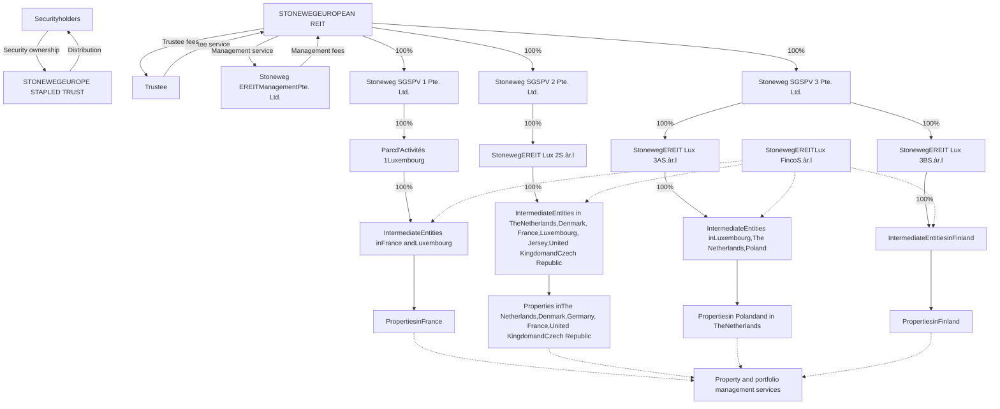
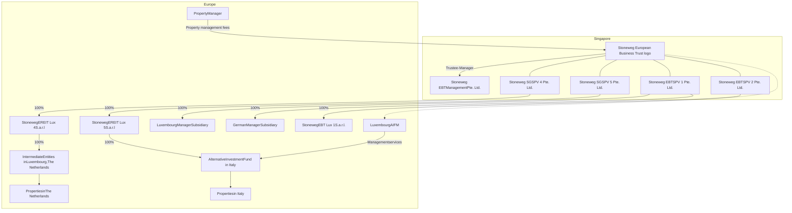

<!-- PAGE 1 -->

# INCOME + GROWTH

SWI GROUP STONEWEG EUROPE STAPLED TRUST logo

ANNUAL REPORT 2025

<!-- PAGE 2 -->


<!-- PAGE 3 -->

# Contents

## 01 Overview

<table>
  <tbody>
    <tr>
        <td>STONEWEG EUROPE STAPLED TRUST (SERT) OVERVIEW</td>
        <td>02</td>
    </tr>
    <tr>
        <td>FY 2025 FINANCIAL HIGHLIGHTS</td>
        <td>03</td>
    </tr>
    <tr>
        <td>CHAIR'S ADDRESS</td>
        <td>04</td>
    </tr>
    <tr>
        <td>IN CONVERSATION WITH CEO</td>
        <td>06</td>
    </tr>
    <tr>
        <td>BUSINESS MODEL AND INVESTMENT STRATEGY</td>
        <td>10</td>
    </tr>
    <tr>
        <td>AIONX DATA CENTRE DEVELOPMENT FUND</td>
        <td>14</td>
    </tr>
    <tr>
        <td>STRUCTURE OF SERT</td>
        <td>16</td>
    </tr>
    <tr>
        <td>SERT'S MILESTONES</td>
        <td>18</td>
    </tr>
  </tbody>
</table>

## 02 Leadership

<table>
  <tbody>
    <tr>
        <td>BOARD OF DIRECTORS</td>
        <td>20</td>
    </tr>
    <tr>
        <td>THE SPONSOR, THE MANAGER AND THE PROPERTY MANAGER</td>
        <td>28</td>
    </tr>
    <tr>
        <td>THE MANAGER'S KEY EXECUTIVES</td>
        <td>30</td>
    </tr>
  </tbody>
</table>

## 03 Performance

<table>
  <tbody>
    <tr>
        <td>MANAGER'S REPORT</td>
        <td>32</td>
    </tr>
    <tr>
        <td>RISK MANAGEMENT</td>
        <td>50</td>
    </tr>
    <tr>
        <td>SUSTAINABILITY</td>
        <td>54</td>
    </tr>
    <tr>
        <td>INVESTOR RELATIONS</td>
        <td>58</td>
    </tr>
  </tbody>
</table>

## 04 Portfolio

<table>
  <tbody>
    <tr>
        <td>PROPERTY PORTFOLIO OVERVIEW</td>
        <td>64</td>
    </tr>
    <tr>
        <td>TOP 10 PROPERTIES</td>
        <td>66</td>
    </tr>
    <tr>
        <td>THE NETHERLANDS</td>
        <td>76</td>
    </tr>
    <tr>
        <td>FRANCE</td>
        <td>80</td>
    </tr>
    <tr>
        <td>ITALY</td>
        <td>84</td>
    </tr>
    <tr>
        <td>GERMANY</td>
        <td>88</td>
    </tr>
    <tr>
        <td>POLAND</td>
        <td>92</td>
    </tr>
    <tr>
        <td>DENMARK</td>
        <td>94</td>
    </tr>
    <tr>
        <td>CZECH REPUBLIC</td>
        <td>98</td>
    </tr>
    <tr>
        <td>UNITED KINGDOM</td>
        <td>100</td>
    </tr>
    <tr>
        <td>FINLAND</td>
        <td>102</td>
    </tr>
  </tbody>
</table>

## 05 Governance

<table>
  <tbody>
    <tr>
        <td>CORPORATE GOVERNANCE</td>
        <td>104</td>
    </tr>
  </tbody>
</table>

## 06 Financial Statements

<table>
  <tbody>
    <tr>
        <td>FINANCIAL STATEMENTS</td>
        <td>152</td>
    </tr>
  </tbody>
</table>

## 07 Other Information

<table>
  <tbody>
    <tr>
        <td>ADDITIONAL INFORMATION</td>
        <td>251</td>
    </tr>
    <tr>
        <td>STATISTICS OF SECURITYHOLDINGS</td>
        <td>253</td>
    </tr>
    <tr>
        <td>NON-EXHAUSTIVE GLOSSARY OF TERMS AND FIRST MENTIONS</td>
        <td>257</td>
    </tr>
    <tr>
        <td>CORPORATE INFORMATION</td>
        <td>260</td>
    </tr>
  </tbody>
</table>

## 08 Market Research

<table>
  <tbody>
    <tr>
        <td>INDEPENDENT EUROPEAN PROPERTY MARKET RESEARCH REPORT</td>
        <td>261</td>
    </tr>
  </tbody>
</table>

<!-- PAGE 4 -->

# 01 SERT Overview

(As at 31 December 2025)

## About Stoneweg European Stapled Trust (SERT)

Stoneweg Europe Stapled Trust (“SERT”) is a stapled group comprising Stoneweg European Real Estate Investment Trust and Stoneweg European Business Trust. SERT is a growth-ready European logistics and data centre platform with resilient income and a clear path to long-term value creation, backed by a well-aligned sponsor ecosystem. SERT aims to provide sustainable distributions through active asset management and a disciplined approach to portfolio construction.

SERT’s portfolio is valued at approximately €2.2 billion and comprises over 90 predominantly freehold properties located in or near major gateway cities in the Netherlands, France, Italy, Poland, Germany, Finland, Denmark, the Czech Republic and the United Kingdom. The portfolio spans approximately 1.6 million sqm of lettable area and serves more than 700 tenant-customers, providing a diversified income base that supports sustainable distributions.

SERT has a principal mandate to invest, directly or indirectly, in income-producing commercial real estate assets across Europe. SERT is strategically focused on its highest-conviction sectors - logistics and data centres - while selectively pursuing value-add redevelopment opportunities to enhance portfolio quality and earnings resilience. At present, SERT has approximately 90% exposure to Western Europe and approximately 60% exposure to the logistics, light industrial and data centre sectors, with a medium-term goal of increasing its exposure to these sectors to a vast majority weighting.

SERT is an early investor with 6.6% stake in the Sponsor’s data centre development platform, AiOnX, which is expected to drive long-term valuation and earnings upside, subject to development execution and market conditions.

SERT is listed on the Singapore Exchange Limited (SGX counter: SET (Euro) and SEB (SGD)) and is managed by Stoneweg EREIT Management Pte. Ltd. and Stoneweg EBT Management Pte. Ltd. (collectively the “Manager”). SERT’s sponsor is SWI Group (SWICH, listed on Amsterdam Euronext Stock exchange), comprising Stoneweg, Icona Capital, its subsidiaries and associates. SWI Group holds a substantial 28% stake in SERT’s stapled securities and wholly owns the Manager and Property Manager.

<table>
    <tr>
        <th>€2.2 billion</th>
        <th>~90%</th>
        <th>~60%</th>
        <th>96</th>
        <th>1.6 million sqm</th>
    </tr>
    <tr>
        <td>Resilient European commercial portfolio</td>
        <td>Western Europe and The Nordics</td>
        <td>Logistics / light industrial and data centres</td>
        <td>Predominantly freehold properties</td>
        <td>net lettable area</td>
    </tr>
</table>

## LOGISTICS / LIGHT INDUSTRIAL

* Combination of last mile and urban logistics with light industrial assembly / manufacturing

* High occupancy rates with a long WALE

## OFFICE

* In close proximity to city and town centres with ample amenities

* Strategically located near public transport nodes

* 88% of office portfolio by value is green-certified

## DATA CENTRE

* 6.6% stake in the Sponsor’s data centre development fund, AiOnX

* 2 data centres in the portfolio

## 'OTHERS'

* Includes government-let campus, leisure and retail properties

## WESTERN EUROPE AND THE NORDICS

## ~90%

* The Netherlands

* France

* Italy

* Germany

* United Kingdom

* The Nordics

Map of Europe highlighting SERT's portfolio locations with a legend indicating asset types: Office or Office and data centres (blue), Logistics / light industrial, Office and 'Others' (light orange), Logistics / light industrial and data centres (dark orange), and Logistics / light industrial and Office (grey). The map also notes 30 predominantly freehold properties and 1.0 million sqm net lettable area in a specific region.

<!-- PAGE 5 -->

# 01 FY 2025 financial highlights

**€134.4 million**
**NPI**
+5.0% vs pcp
Like-for-like¹

**38.0%**
**NET GEARING²**
-1.8 p.p. vs 31 Dec 2024

**92.6%**
**OCCUPANCY³**
-0.9 p.p. vs pcp

**13.390 Euro cents**
**DPS**
-5.1% vs pcp primarily due
to higher finance costs

**BBB & BBB-**
**FITCH RATINGS &**
**S&P GLOBAL RATINGS**
Investment grade credit rating
with Stable Outlook

**+9.8%**
**RENT REVERSION⁴**

**€2.03 / security**
**NAV**
Unchanged from
31 Dec 2024

**94% fixed / hedged**
**DEBT**
Reduces impact of increasing
interest rates

**4.9 years**
**WEIGHTED AVERAGE**
**LEASE EXPIRY**
-0.2 years vs pcp

<table>
  <thead>
    <tr>
        <th> </th>
        <th>As at</th>
        <th>As at</th>
        <th>As at</th>
        <th>As at</th>
        <th>As at</th>
    </tr>
    <tr>
        <th> </th>
        <th>31 Dec</th>
        <th>31 Dec</th>
        <th>31 Dec</th>
        <th>31 Dec</th>
        <th>31 Dec</th>
    </tr>
    <tr>
        <th> </th>
        <th>2025⁵</th>
        <th>2024</th>
        <th>2023</th>
        <th>2022</th>
        <th>2021</th>
    </tr>
  </thead>
  <tbody>
    <tr>
        <td colspan="6">BALANCE SHEET</td>
    </tr>
    <tr>
        <td>Total assets (€ million)</td>
        <td>2,366.9</td>
        <td>2,322.2</td>
        <td>2,367.4</td>
        <td>2,590.0</td>
        <td>2,534.5</td>
    </tr>
    <tr>
        <td>Securityholders’ funds (€ million)</td>
        <td>1,131.4</td>
        <td>1,140.8</td>
        <td>1,190.9</td>
        <td>1,358.7</td>
        <td>1,413.1</td>
    </tr>
    <tr>
        <td colspan="6">KEY FINANCIAL METRICS</td>
    </tr>
    <tr>
        <td>DPS (Euro cents)</td>
        <td>13.390</td>
        <td>14.106</td>
        <td>15.693</td>
        <td>17.189</td>
        <td>16.961⁶</td>
    </tr>
    <tr>
        <td>Aggregate leverage</td>
        <td>42.4%</td>
        <td>41.2%</td>
        <td>40.3%</td>
        <td>39.4%</td>
        <td>36.6%</td>
    </tr>
    <tr>
        <td>Aggregate leverage excluding distribution</td>
        <td>43.1%</td>
        <td>41.9%</td>
        <td>41.1%</td>
        <td>40.1%</td>
        <td>37.3%</td>
    </tr>
    <tr>
        <td>NAV attributable to Securityholders per security (€)</td>
        <td>2.03</td>
        <td>2.03</td>
        <td>2.12</td>
        <td>2.42</td>
        <td>2.52</td>
    </tr>
    <tr>
        <td colspan="6">CAPITAL MANAGEMENT</td>
    </tr>
    <tr>
        <td>Total borrowing facilities (€ million)</td>
        <td>1,217.4</td>
        <td>1,494.0</td>
        <td>1,154.0</td>
        <td>1,178.0</td>
        <td>1,127.4</td>
    </tr>
    <tr>
        <td>Gross borrowings (€ million)</td>
        <td>1,003.0</td>
        <td>956.8</td>
        <td>954.0</td>
        <td>1,019.9</td>
        <td>927.4</td>
    </tr>
    <tr>
        <td>Interest cover (times)⁷</td>
        <td>2.6</td>
        <td>3.1</td>
        <td>3.6</td>
        <td>4.9</td>
        <td>5.8</td>
    </tr>
    <tr>
        <td>Securities in issue (million)</td>
        <td>556.9</td>
        <td>562.4</td>
        <td>562.4</td>
        <td>562.4</td>
        <td>561.0</td>
    </tr>
    <tr>
        <td>Market capitalisation (€ million)</td>
        <td>907.7</td>
        <td>888.6</td>
        <td>798.6</td>
        <td>843.6</td>
        <td>1,419.4</td>
    </tr>
  </tbody>
</table>

1 Like-for-like NPI excludes FY 2024 & FY 2025 divestments

2 Net Gearing per EMTN definition is calculated as (aggregate debt + finance leases - cash)/ (total assets)

3 Occupancy calculation excluded certain units in Kolumbusstraße 16 which are currently under redevelopment

4 Calculated on a portfolio basis; with the numerator being the new headline rent of all modified, renewed or new leases over the relevant period and denominator being the last passing rent of the areas being subject to modified, renewed or new leases

5 With effect from 12 June 2025, each unit of Stoneweg European REIT was stapled to one unit in Stoneweg European BT to form a new stapled security, Stoneweg Europe Stapled Trust

6 Like-for-like DPS for the periods prior to 5 March 2021 are adjusted for 5:1 Unit consolidation

7 Calculated based on Code on Collective Investment Schemes dated 28 November 2025

<!-- PAGE 6 -->

# 01 Chair’s address

> “ SERT remains committed to disciplined execution, strong governance, and the delivery of sustainable long-term value.”

Lim Swe Guan, Chair and Independent Non-Executive Director

**Lim Swe Guan**
Chair and Independent
Non-Executive Director

**Dear Securityholders,**

FY 2025 marked an important phase in strengthening Stoneweg Europe Stapled Trust (SERT) for the long term. The Board remained focused on stable value creation, effective capital stewardship, and ensuring that the Trust continues to progress toward its strategic objectives despite a challenging external environment.

## MULTI-YEAR ACTIONS & FINANCING CONTEXT

Over the past several years, SERT undertook a measured programme of portfolio renewal and balance sheet strengthening. These steps were implemented through a period of elevated financing costs, which contributed to a temporary moderation in distributions. With these headwinds now largely absorbed and the Trust supported by a long-dated capital structure, SERT enters FY 2026 on a steadier footing.

For FY 2025, the Trust delivered distributions broadly in line with expectations and maintained a stable net asset value per security, reflecting the resilience of the underlying portfolio.

## GUIDANCE (25 FEBRUARY 2026) & GEOPOLITICAL CONTEXT

On 25 February 2026 the Board communicated its expectation that FY 2026 distributions would be broadly in line with FY 2025, barring unforeseen circumstances. Almost immediately after, geopolitical developments in the Middle East introduced fresh uncertainty across global energy markets, trade routes and financing conditions. While our guidance remains unchanged as at the date of this report, the Board is closely monitoring these developments and their potential implications for market stability.

## STRATEGY & RISK-ADJUSTED RETURNS

Strategically, SERT continues to align its portfolio with the long term demand in logistics and digital infrastructure, supported by thoughtful capital allocation designed to enhance long-term, risk-adjusted returns. The Board’s role is to oversee this trajectory, ensuring that management’s execution remains paced to market conditions and aligned with SERT’s long-term purpose.

## STRONG ALIGNMENT WITH SWI GROUP WITH SHARED GOVERNANCE VALUES

SWI Group has served as SERT’s Sponsor and a major security holder since 24 December 2024. This past year marks our first full period under its stewardship. SWI Group has brought meaningful strategic alignment to the Trust. Its pan-European footprint, deep local networks and multidisciplinary expertise have strengthened SERT’s ability to access opportunities across logistics and digital infrastructure - sectors supported by enduring structural demand. The Sponsor’s broader ecosystem, including its growing digital infrastructure and AI-related platforms, enhances the Trust’s long-term positioning and supports disciplined, risk-adjusted returns.

Governance and transparency continue to anchor the Board’s stewardship of SERT. We remain focused on ensuring that the Trust maintains the highest standards of accountability, oversight and clarity in decision-making. Sustainability also remains central to our governance responsibilities. The Board oversees the integration of environmental and social considerations into strategic planning and risk management, ensuring that SERT’s portfolio

<!-- PAGE 7 -->

evolves in line with Europe’s transition priorities and the expectations of our stakeholders for long-term resilience.

## OUTLOOK AND APPRECIATION

While the macroeconomic and geopolitical backdrop remains fluid, the Board is confident in the strength of SERT’s platform, the resilience of its capital structure, and the quality of its partnerships. Capital recycling and selective investment will remain central to how we position the portfolio for the years ahead.

On behalf of the Board, I extend our sincere thanks to Mrs Fang Ai Lian, who stepped down after eight years of dedicated service as part of the Board refresh programme. We are pleased that she continues her association with the broader SWI group platform, having joined our Sponsor’s Board. She has also served as a strategic advisor to the Board from February 2026 through the end of April 2026. Her deep experience and counsel have been invaluable throughout this transition period.

We also warmly welcome Ms Li Li Kuan and Mr Frank Khoo as new Directors and look forward to their continued support in guiding SERT’s strategic direction, risk management and long-term value creation.

Finally, we thank our management team, our tenant-customers, and you—our Securityholders—for your continued trust and support.

SERT remains committed to disciplined execution, strong governance, and the delivery of sustainable long-term value.

**Lim Swe Guan, CFA**

Chair and Independent Non-Executive Director

Aerial view of an industrial logistics park with large warehouses and parked trucks

<!-- PAGE 8 -->

# <mark>01</mark> In conversation with CEO

Simon Garing, CEO and Executive Director, with a quote: “We strengthened earnings resilience and extended our debt runway, positioning the Trust for its next phase of disciplined growth.”

**Simon Garing**
CEO and
Executive Director

**Q1 – How would you characterise SERT’s performance in FY 2025, and what were the most important milestones achieved during the year?**

FY 2025 was a successful year for Stoneweg Europe Stapled Trust (SERT). We strengthened earnings resilience and extended our debt runway, positioning the Trust for its next phase of disciplined growth.

Operationally, NPI was €134.4 million, up 2.5% year‑on‑year or 5.0% like‑for‑like, supported by strong leasing momentum and 9.8% portfolio‑wide rent reversion. Our teams leased ~300,000 sqm (c.20% of NLA), delivering rent reversions roughly double our five‑year average. Logistics was the key contributor, with 9.2% like‑for‑like NPI growth, and the portfolio recorded a fourth consecutive half‑year of valuation uplift.

On capital management, we materially de‑risked the balance sheet with two Euro bond issuances (€500 million, six‑year; and €300 million, 7.3‑year), extending our average debt maturity and creating no debt maturities until 2030. Fitch upgraded SERT to BBB (Stable), reflecting the enhanced visibility of cash flows and asset quality. Net gearing ended the year at 38%.

**92.6%** TOTAL PORTFOLIO OCCUPANCY | **9.8%** TOTAL PORTFOLIO RENT REVERSION
--- | ---

**4.9 YEARS** WALE | **300,000 SQM** OF LEASING IN 2025
--- | ---

We also advanced SERT’s data centre strategy. Our initial FY 2025 €50 million investment into the Sponsor’s AiOnX data‑centre development fund delivered a 41% valuation uplift over six months, adding €0.04 per security to NAV and providing exposure to a pan‑European pipeline with secured power.

Finally, we delivered FY 2025 DPS of €13.39 cents per security, at the upper end of market expectations. While higher interest costs year‑on‑year affected distributions sector‑wide, the outcome was partly supported by our ~€10 million of security buybacks.

**Q2: SERT has maintained net gearing below 40% since IPO and has no debt maturities until 2030. How does this financial strength support SERT’s performance?**

SERT’s conservative balance sheet gives it both stability and flexibility. By maintaining net gearing below 40% and having no debt maturities until 2030, we have significantly reduced near‑term refinancing risk and created a clear runway for the business.

At the same time, a large proportion of SERT’s borrowings are hedged or fixed, which protects the Trust from interest rate volatility and provides greater visibility on financing costs. This supports the resilience and predictability of our distributions.

With a strong balance sheet, SERT is well‑positioned to act when accretive opportunities arise.

<!-- PAGE 9 -->

# DEBT MATURITY PROFILE

<table>
  <thead>
    <tr>
        <th>Year</th>
        <th>Secured (€ million)</th>
        <th>Unsecured (€ million)</th>
        <th>Bond (€ million)</th>
        <th>Hedged/Fixed (%)</th>
    </tr>
  </thead>
  <tbody>
    <tr>
        <td>2025</td>
        <td> </td>
        <td> </td>
        <td> </td>
        <td>94</td>
    </tr>
    <tr>
        <td>2026</td>
        <td> </td>
        <td> </td>
        <td> </td>
        <td>94</td>
    </tr>
    <tr>
        <td>2027</td>
        <td> </td>
        <td> </td>
        <td> </td>
        <td>78</td>
    </tr>
    <tr>
        <td>2028</td>
        <td> </td>
        <td> </td>
        <td> </td>
        <td>63</td>
    </tr>
    <tr>
        <td>2029</td>
        <td> </td>
        <td> </td>
        <td> </td>
        <td>63</td>
    </tr>
    <tr>
        <td>2030</td>
        <td>70.6</td>
        <td>132.4</td>
        <td> </td>
        <td>55</td>
    </tr>
    <tr>
        <td>2031</td>
        <td> </td>
        <td> </td>
        <td>500.0</td>
        <td>30</td>
    </tr>
    <tr>
        <td>2032</td>
        <td> </td>
        <td> </td>
        <td> </td>
        <td>30</td>
    </tr>
    <tr>
        <td>2033</td>
        <td> </td>
        <td> </td>
        <td>300.0</td>
        <td>30</td>
    </tr>
  </tbody>
</table>

## Q3: How has SERT evolved following the introduction of SWI group as sponsor?

SWI Group is a global alternative investment platform comprising Stoneweg and Icona Capital, with ~€11 billion in assets under management across real assets, digital infrastructure, credit and alternative investments. SWI Group has approximately 300 professionals across 26 offices in 17 countries.

The sponsor’s deep local networks support more efficient deal origination, asset management and capital recycling. In 2025, the Sponsor’s platform helped us execute two Euro bond issuances efficiently, extending tenor and broadening our debt investor base.

Strategically, SWI Group’s capabilities in real assets and digital infrastructure also expand SERT’s sourcing and execution reach.

SERT has also benefited from the Sponsor’s strengthened governance and institutional profile, following its listing on Euronext Amsterdam in February 2026 (ticker: SWICH). The listing provides stronger alignment with SERT’s Securityholders, enhances transparency, deepens alignment with global investors and reinforces the discipline with which opportunities are evaluated across our key markets. The combination of SWI’s local market intelligence and its institutional framework has improved both the quality and velocity of sourcing, while ensuring that investments continue to meet SERT’s return and risk-management criteria.

Large group photo of SWI Group professionals in a historic building

<!-- PAGE 10 -->

# <mark>01</mark> In conversation with CEO

**Q4: How does the investment in AiOnX platform reshape SERT’s long-term growth profile?**

SERT’s stake in AiOnX data dentre development platform provides a meaningful long-term growth engine alongside our stabilised portfolio. The Sponsor-owned AiOnX is developing one of Europe’s largest power-secured data-centre pipelines, targeting approximately 2.3GW of capacity, with about 1.7GW already secured/committed. SERT has a medium-term objective of achieving 15–25% exposure to the data centre sector and this positions SERT to participate in structural demand driven by cloud computing, accelerated AI adoption and Europe’s broader digital-infrastructure requirements.

Europe faces a widening infrastructure supply gap as computing and data-processing needs expand. AiOnX gives SERT exposure to this growth through a structure designed to capture development upside while ring-fencing direct development risk at the platform level.

The value-creation pathway is already evident. In 2025, AiOnX recorded a €20.5 million fair-value uplift for our initial €50 million investment, contributing approximately €0.04 per security to SERT’s NAV. In 2026, SERT invested an additional €50 million investment which delivered immediate distribution benefits, through the 7.25% per annum cash coupon.

With the support of our Sponsor’s deep development expertise, we will continue to expand SERT’s presence in this high-conviction theme through a twin-track strategy: one, selectively converting suitable SERT assets where commercially and technically viable and two, capturing the value uplift from the Sponsor’s growing pipeline. Overall, this positions SERT to deliver resilient distributions together with long-duration growth for our Securityholders.

The broader AiOnX platform has also strengthened with the Sponsor’s recently agreed acquisition of Polarise, a European NVIDIA Cloud Preferred Partner, further deepening the AI-compute and high-performance capabilities that underpin long-term demand for power-secured data-centre capacity.

With the establishment of the Business Trust as part of SERT’s stapled-trust structure, we are also able to participate in certain development-adjacent or non-REIT-qualifying activities in Europe that cannot be undertaken by the REIT alone, providing added flexibility to support digital-infrastructure growth.

Beyond digital infrastructure exposure, the stapled-trust structure brings additional strategic benefits. The Business Trust provides greater operational and tax flexibility, enabling SERT to undertake investment structures, joint ventures and funding arrangements not permissible within a REIT alone. This flexibility — approved by unitholders as part of the 2025 restructuring — enhances SERT’s ability to pursue value-accretive opportunities across Europe while preserving the REIT’s long-term distribution profile.

Aerial rendering of a large-scale data centre facility integrated into a landscape

<!-- PAGE 11 -->

Aerial view of a logistics and industrial park with a highway and train tracks nearby

**Q5: How does management balance capital allocation between acquisitions, development, potential buybacks, and the ongoing portfolio repositioning into 70% logistics, light industrial and data centres by 2027?**

Our capital allocation framework is anchored on sustainable earnings growth and balance-sheet strength. In 2026, we are targeting approximately €70 million acquisitions with divestments of a similar scale, redeploying capital into sectors and geographic locations where we have the strongest long-term conviction. We continue to reposition SERT towards our objective of 70% exposure to logistics, light industrial and data centres and maintain over 90% to Western Europe by 2027.

Notwithstanding the current Middle East and Ukraine wars, market conditions are gradually becoming more constructive. Savills forecasts European investment volumes to grow by 18% in 2026. We expect similar momentum to be reflected in the markets in which we invest. This increase in activity has seen European cap rates stabilised and, in some cases, to compress, which supports renewed investor interest and provides a more favourable backdrop for capital values. Alongside acquisitions, we prioritise developments and AEIs where execution risk is controlled and the risk-adjusted returns are compelling, particularly those that enhance income durability and asset quality.

Securities buybacks remain a tactical capital-management tool, deployed when market pricing diverges meaningfully from intrinsic value while maintaining trading liquidity. The ~€10 million of securities we acquired in 2025 lifted DPS by 1.1%, as an example of the tactical impact.

Across all decisions, we apply a disciplined capital framework that balances growth initiatives with long-term value creation for Securityholders.

**Q6: What can securityholders expect in 2026? With rent reversions coming through, AEIs, and interest rate pressures stabilising, could FY 2026 represent an inflection point for DPS recovery?**

On 25 February 2026, the Board communicated that FY 2026 distributions are expected to be broadly in line with FY 2025, barring unforeseen circumstances. Almost immediately after that guidance was issued, conflict in the Middle East escalated, creating new uncertainties in global energy markets, shipping lanes and yield curves. We continue to monitor developments closely.

Operationally, SERT’s portfolio remains under-rented, with an average reversionary yield of 7.6% versus an initial yield of 6.2%, providing a clear pathway for continued rental uplift through renewals and AEIs. With refinancing risk addressed and interest-cost pressures largely absorbed, the focus in FY 2026 shifts more fully to the underlying operating trajectory — leasing, indexation, and portfolio-quality enhancements.

<!-- PAGE 12 -->

# 01 Business model and investment strategy

**Purpose**

SERT’s purpose is to provide Securityholders with stable and growing distributions and NAV per security over the long term, while maintaining an appropriate capital structure.

**Investment proposition**

SERT offers the opportunity to invest in attractive European freehold commercial real estate with a trusted Manager and experienced local Property Manager.

**Strengths**

* Resilient portfolio, benefiting from attractive European market fundamentals;

* A well-balanced mix of geographies, tenant-customers and trade sectors;

* Proven track record in undertaking value accretive acquisitions, asset management and capital recycling;

* A strong balance sheet with diverse sources of funding, providing financial flexibility;

* Responsible capital management supported by investment grade credit ratings by Fitch Ratings (BBB with stable outlook) and by S&P Global ratings (BBB- with stable outlook); and

* Aspirational Net Zero operational carbon emissions by 2040 target informs investment and asset management strategy

**Investment strategy**

SERT has a principal mandate to invest, directly or indirectly, in income-producing commercial real estate assets across Europe. SERT is strategically focused on its highest-conviction sectors - logistics and data centres - while selectively pursuing value-add redevelopment opportunities to enhance portfolio quality and earnings resilience. At present, the Manager has approximately 90% exposure to Western Europe and the Nordics and approximately 60% exposure to the logistics / light industrial and data centre sectors, with a medium-term goal of increasing SERT’s exposure to these sectors to a vast majority weighting. Additionally, the Manager undertakes selective asset enhancement initiatives and redevelopment projects for some of its existing office assets, emphasising strong ESG credentials in prime and core locations within key European gateway cities.

The Manager maintains a disciplined approach to capital deployment, targeting an unlevered internal rate of return (IRR) exceeding SERT’s cost of capital, subject to asset class and risk profile. Portfolio allocation is guided by macroeconomic indicators, sectoral demand forecasts, and proprietary data-driven risk-adjusted return analysis.

The Manager aims to achieve SERT’s objectives through executing on the following key strategies:

**Active asset management and asset rejuvenation**

* Seek to drive organic growth in revenue and income and maintain strong tenant-customer relationships;

* Continually monitor each asset’s expected contribution to earnings and NAV growth, utilising SERT’s proprietary dynamic portfolio optimisation tool encapsulating 10 risk factors;

* Regularly evaluate the portfolio to identify if potential asset enhancements, sustainability upgrades or redevelopment opportunities can further enhance the overall quality of the portfolio and provide growth in DPS and NAV over the medium term; and

* Implement a proactive tenant engagement strategy to ensure alignment with evolving occupier needs, focusing on flexible leasing solutions, ESG-aligned fit-outs, and operational efficiencies

**Capital recycling and growth through acquisitions**

* Adopt a rigorous research-backed selection process focused on long-term sector trends and fundamental real estate qualities to ensure investments are concentrated in the right macro / micro-locations and sectors;

* Seek assets that can provide attractive cash flows and yields, which fit within SERT’s purpose to enhance returns for Securityholders;

* Source potential acquisitions that create opportunities for future income and capital growth, leverage extensive on-the-ground teams to participate in both on- and off-market acquisitions;

* Divestment of selected non-core and non-strategic assets and look to reinvest capital into opportunities that will ultimately increase DPS and NAV per security; and

* Leverage technology and innovation, including smart building solutions and asset performance analytics to optimise cost efficiencies, tenant-customer engagement and maximise investment returns

<!-- PAGE 13 -->

## Responsible capital management

* Maintain a strong balance sheet with a well-balanced mix of debt and equity, ensuring sufficient liquidity;

* Secure diversified funding sources across financial institutions and capital markets to enhance financial flexibility;

* Optimise debt financing costs and implement interest rate and foreign exchange hedging strategies where appropriate;

* Maintain a disciplined approach to leverage, targeting a net gearing ratio within a range of 35-40% over the medium term with an upper limit of 45%, to safeguard against interest rate fluctuations and market downturns; and

* Deploy a strategic capital allocation framework to evaluate reinvestment opportunities, balancing growth initiatives with capital returns to Securityholders through dividends or share buybacks for maximum capital efficiency

## High ESG standards and disclosures

* Set aspirational target of Net Zero operational carbon emissions by 2040, and specific reduction targets for energy, carbon, water and waste to be achieved by the end of the year 2030;

* Employ a rigorous approach to ESG matters to achieve high sustainability standards in the operations and management of SERT, consistent with the values of the Sponsor and with guidance from the Board;

* Safeguard Securityholders’ interests through robust corporate governance and risk management;

* Participate in the annual GRESB assessment and EPRA sBPR submission and maintain high MSCI ESG and Sustainalytics ratings;

* Implement relevant ESG / data analytics / capex / sustainability processes; and

* Actively monitor regulatory developments across key European jurisdictions to ensure full compliance with evolving ESG disclosure requirements, including EU Taxonomy, SFDR, and CSRD frameworks

## Investment process

### Research-based approach to investments

The Manager’s investment approach combines research-based fundamental market analysis with rigorous evaluation of property-specific variables and financial forecasts to select assets that meet SERT’s investment criteria and enhance risk-adjusted returns.

The first-order filtering / selection is carried out by Stoneweg’s on-the-ground local transaction teams, who then propose investment opportunities with attractive risk-return profiles to the Manager during the pipeline allocation calls. Promising investment opportunities are subsequently analysed, with the support of the Manager team, and submitted for Board consideration in two stages – pre-due diligence (preliminary investment proposal) and post-due diligence (final investment proposal). All investment and divestment decisions undergo rigorous evaluation and are subject to final approval by the Board, ensuring alignment with SERT’s strategic objectives and commitment to long-term value creation.

### The process

The initial asset selection process comprises a top-down comprehensive analysis that includes several criteria covering long-term sector megatrends and fundamental real estate attributes to determine countries and sectors that will provide attractive returns.

Once the top-down comprehensive data analysis has identified targeted macro / micro-locations and asset types, the bottom-up investment strategy process begins. The investment management team has developed proprietary analytics tools that provide the Board with a broad framework to assist them in evaluating proposed acquisitions and divestments. This approach ensures that SERT’s portfolio optimisation is based on sound data and analysis to maximise returns.

A country-specific risk assessment tool evaluates market resilience under various economic scenarios, incorporating factors such as GDP growth projections, employment trends, and regulatory stability.

<!-- PAGE 14 -->

# 01 Business model and investment strategy

The framework allows the local asset management teams to optimise the portfolio by monitoring all assets and market risks and identifying any “outliers”. The following tools support the framework:

*   An enhanced property risk matrix across three broad categories, encapsulating 10 risk factors (asset risk, market / location risk, execution / financial risk). This matrix visualises how the identified asset (existing property, proposed investment, or potential divestment) enhances or detracts from the existing portfolio risk / return profile. It lays out the assessed risks in a standardised framework to compare against the projected returns

*   A dynamic portfolio optimisation tool that measures SERT’s overall risks and returns by producing an “efficient frontier curve”. The tool maps out an efficient frontier of SERT’s investable universe for each asset class in identified cities and countries for which an optimal portfolio can be assembled

*   Stress-testing models to simulate various economic downturn scenarios, allowing the Manager to assess portfolio resilience and make well informed decisions

> The Manager’s investment approach combines research based fundamental market analysis with rigorous evaluation of property-specific variables and financial forecasts to select assets that meet SERT’s investment criteria and enhance risk-adjusted returns.

Aerial view of a large industrial warehouse facility with solar panels on the roof and brand logos for MANFIELD, SISSY-BOY, and sacha on the side.

<!-- PAGE 15 -->

# AN INTEGRATED APPROACH ALONGSIDE ONGOING REVIEW AND GOVERNANCE

<table>
  <thead>
    <tr>
        <th>Stage</th>
        <th>Sub-points / Details</th>
    </tr>
  </thead>
  <tbody>
    <tr>
        <td>INVESTMENT STRATEGY<br/>(Research | Thematics | House View)</td>
        <td>Target assessment<br/>Strategy review<br/>Portfolio diversification<br/>Market, risk and environment assessment</td>
    </tr>
    <tr>
        <td>EXECUTION</td>
        <td>Sourcing, screening and underwriting<br/>Evaluation, risk assessment and due diligence<br/>Impact analysis<br/>Debt sourcing and execution<br/>Investment committee approval</td>
    </tr>
    <tr>
        <td>MANAGEMENT</td>
        <td>Annual business plan and budget execution<br/>Risk monitoring and management<br/>Cash and debt management<br/>Investor and regulatory reporting</td>
    </tr>
    <tr>
        <td>PORTFOLIO REALISATION</td>
        <td>Ongoing strategic review<br/>Hold / sell analysis<br/>Risk evaluation<br/>Strategic and tactical asset / portfolio disposal</td>
    </tr>
    <tr>
        <td>VERTICALLY INTEGRATED SERVICES</td>
        <td>Investor Relations<br/>Fund and investment management<br/>ESG<br/>Research<br/>Transaction management<br/>Asset management<br/>Development and project management<br/>Legal, risk and compliance<br/>Accounting, tax and reporting<br/>Treasury</td>
    </tr>
  </tbody>
</table>

<!-- PAGE 16 -->

# <u>01</u> AiOnX data center development fund

AiOnX is the sponsor's (SWI Group) data center development platform, focused on the development of data centers and select technology driven infrastructure projects. AiOnX manages the full lifecycle of digital infrastructure investments, from site identification and permitting through to design, construction and leasing.

AiOnX forms an important part of SWI Group's long-term vision. Accelerating AI adoption, rising cloud demand and power constrained supply drive strong European data center fundamentals. To capitalise on these opportunities, the Sponsor recently agreed to acquire a majority stake in Polarise GmbH, a leading European NVIDIA-Preferred Partner valued at €500 million, with a further €1 billion funding commitment. Together, SWI Group, AiOnX and Polarise are forming a fully integrated European AI infrastructure platform spanning power, compute, and delivery. As the Sponsor's ecosystem grows, it is expected to reinforce SERT's long-term growth trajectory.

AiOnX comprises five data center sites in various stages of development with 1.7 GW secured/ contracted and a pathway to 2.3 GW, representing a >€30 billion GDV. The assets are geographically diversified, located within recognised data center zones and established power and fibre clusters in their respective jurisdictions. The first phase (16MW) of the data center project in Dublin is expected to be operational in late 2026, with rents from a major US hyperscaler scheduled to commence at that time.

## Total

AiONX logo

* Unparalleled exposure to a growing platform with unique assets that have already achieved significant power supply and planning permission milestones

> **Target capacity:**
> **2,259 MW**

## Dublin, Ireland

Aerial view of Dublin, Ireland data center development

* Innovation campus with excellent fibre access

* Planning in place for +200,000 sqm

* 20-year lease signed with a major hyperscaler

* Secured financing for first-phase construction. On track to operational in late 2026

<table>
    <tr>
        <td>Target capacity: 179 MW<br/>Current capacity: 16 MW</td>
        <td>Acquisition date¹: 30 Nov 2024<br/>Ownership: 39.8%²</td>
    </tr>
</table>

1 Acquisition date is the date in which the assets were transferred/ acquired by the IDC Fund (now known as AiOnX)

2 Shareholding was increased in 2Q 2025 following an opportunistic restructuring with other exiting shareholders

<!-- PAGE 17 -->

## Madrid, Spain

Madrid, Spain data center visualization

* Largest sector for data center, with a potential power of 600 MW

* Planning permission underway with government support -designated by the City of Madrid and national authorities as being of national interest

<table>
  <tbody>
    <tr>
        <td>Target capacity: 600 MW</td>
        <td>Acquisition date¹: 30 Nov 2024</td>
    </tr>
    <tr>
        <td>Current capacity: 200 MW</td>
        <td>Ownership: 92%²</td>
    </tr>
  </tbody>
</table>

## Varde, Denmark

Varde, Denmark data center visualization

* 110 ha site strategically located near to major transatlantic fibre optic landing spot

* All land plots on site have been successfully acquired

* 800 MW of green power, highly valued by operators

<table>
  <tbody>
    <tr>
        <td>Target capacity: 800 MW</td>
        <td>Acquisition date¹: 30 Nov 2024</td>
    </tr>
    <tr>
        <td>Current capacity: 800 MW</td>
        <td>Ownership: 100%</td>
    </tr>
  </tbody>
</table>

## Milan, Italy

Milan, Italy data center visualization

* Excellent location within in-demand data center availability zone

* Gross site area is approximately 220,000 sqm

* Zoning has already been obtained for the project, and the full 150 MW secured

<table>
  <tbody>
    <tr>
        <td>Target capacity: 150 MW</td>
        <td>Acquisition date¹: 30 Nov 2024</td>
    </tr>
    <tr>
        <td>Current capacity: 150 MW</td>
        <td>Ownership: 100%</td>
    </tr>
  </tbody>
</table>

## Cambridge, UK

Cambridge, UK data center visualization

* Excellent location north of Cambridge – the Silicon Valley of Europe within an established AI ecosystem – and host to major tech companies like Apple, Google, Microsoft and Meta

* Additional land plot and 200MW power secured, bringing total contracted power to 530 MW

<table>
  <tbody>
    <tr>
        <td>Target capacity: 530 MW</td>
        <td>Acquisition date¹: 30 Jun 2025</td>
    </tr>
    <tr>
        <td>Current capacity: 530 MW</td>
        <td>Ownership: 100%</td>
    </tr>
  </tbody>
</table>

<!-- PAGE 18 -->

# 01 Structure of SERT

(As at 31 March 2026)

The following diagram illustrates the relationship, among others, between SERT, the REIT Manager, the Trustee-Manager, the Trustee, the Property Manager, the Luxembourg AIFM and the Securityholders:



<!-- PAGE 19 -->

Property and portfolio management services



<!-- PAGE 20 -->

# 01 SERT’s milestones

(As at 31 March 2026)

2025

105 PROPERTIES

**€2,241 million portfolio value**
as at 31 December 2024

### 2 January:

The REIT was renamed to Stoneweg European REIT, while the manager was renamed to Stoneweg EREIT Management Pte. Ltd., to align with the new sponsor

### 10 January:

S&P Global Ratings assigned SERT investment grade ‘BBB-’ credit rating with a stable outlook

### 30 January:

Successfully issued Series 002 6-year €500 million green bond due in 2031

### 14 February:

Redemption and cancellation of the outstanding €500 million bond due November 2025

**104 PROPERTIES**

### 5 March:

Completed the divestment of non-core office asset in Italy

### 20 March:

Stoneweg European REIT commenced unit buyback programme

### 3 April:

Proposed conversion of Stoneweg European REIT into a Stapled Trust comprising a REIT and a Business Trust

### 29 April:

Held 7th AGM and EGM

**102 PROPERTIES**

### 4 November:

Completed the divestment of non-core office asset in Italy

### 22 October:

Successfully issued Series 003 €300 million 7.6 year green bond due 2033

### 03 October:

Fitch Ratings upgraded Stoneweg European REIT to ‘BBB’ credit rating with a stable outlook

### 02 October:

Stoneweg Europe Stapled Trust inaugural Investor Day

### 02 October:

Retained 4-Stars rating and awarded 85 Points in 2025 GRESB

**103 PROPERTIES**

### 17 September:

Completed the divestment of non-core office asset in Poland and announced divestment of office asset in Italy

### 29 July:

Stoneweg Europe Stapled Trust ranked in the top five in 2024 Asean Corporate Governance Scorecard

### 8 July:

SERT’s portfolio valuations up 1.1% like-for-like for the six months to 30 June 2025

### 23 June:

Invested €50 million in Stoneweg Icona data-centre fund (now known as AiOnX)

### 16 June:

Listing of the stapled securities of Stoneweg Europe Stapled Trust (comprising Stoneweg European REIT units and Stoneweg European BT units) and delisting of Stoneweg European REIT units

**97 PROPERTIES**

### 11 November:

Exited Slovakia with the divestment of five logistic / light industrial assets

### 11 November:

Won the Most Transparent Company Award at the SIAS Investors Choice Awards 2025

### 2 December:

Won the Best Overall Investor Relations (Mid-cap) and Best IR during a corporate transaction at IR Impact Awards South East Asia 2025

**96 PROPERTIES**

### 18 December:

Completed the divestment of a non-core office asset in Italy

96 PROPERTIES

**€2,155 million portfolio value**
as at 31 December 2025

**2026**

### 20 January:

S&P Global Ratings affirmed Stoneweg European REIT’s investment grade ‘BBB-’ long-term issuer credit rating with a Stable Outlook

**97 PROPERTIES**

### 13 March:

Acquisition of a logistics asset in The Netherlands for €35.0 million

**96 PROPERTIES**

### 16 March:

Announced a binding agreement to divest Riverside Park in Warsaw for €22.5 million (S$33.6 million), with completion subject to Warsaw’s pre-emption rights (expiring April 2025) and other conditions expected by 2Q 2026

### 26 March:

Invested an additional €50 million in AiOnX via mandatory convertible loan

<!-- PAGE 21 -->

A futuristic data center corridor with glowing server racks and a central AI processor chip icon.

<!-- PAGE 22 -->

# <mark>02</mark> Board of Directors

Lim Swe Guan, Chair and Independent Non-Executive Director

**Lim Swe Guan**
**Chair and Independent**
**Non-Executive Director**

**DATE OF APPOINTMENT AS DIRECTOR**

28 July 2017

**LENGTH OF SERVICE AS DIRECTOR**

(As at 31 December 2025)

8 years 5 months

**NATIONALITY**

Singaporean

**AGE**

71

**BOARD COMMITTEES SERVED ON**

* Audit and Risk Committee (Member)

* Nominating and Remuneration Committee (Member)

* Sustainability Committee (Member)

**ACADEMIC AND PROFESSIONAL QUALIFICATIONS**

* Bachelor of Science in Estate Management from the University of Singapore (Honours)

* Master of Business Administration from the Colgate Darden Graduate School of Business, The University of Virginia

* Chartered Financial Analyst of the Institute of Chartered Financial Analysts

**BACKGROUND AND WORKING EXPERIENCE**

Mr Lim has extensive experience in the investment management and real estate sectors. From 1986 to 1995, he was with Jones Lang Wootton in Sydney, where his last held position was Research Director. He then joined Suncorp Investments, Brisbane, Australia and worked as the Portfolio Manager of Property Funds from 1995 to 1997. From 1997 to 2008, he was with the Government of Singapore Investment Corporation (GIC), where his last held position was Regional Manager. From 2008 to 2011, he was a Managing Director of GIC Real Estate. His roles included the Regional Head of Property Investment for Australia, Japan and Southeast Asia and the Global Head of the Corporate Investments Group that invests in public REITs and property companies.

**PRESENT OTHER LISTED COMPANY DIRECTORSHIPS OR CHAIRPERSONSHIPS**

* Thakral Corporation Limited (Independent Non-Executive Chairman)

**PRESENT OTHER PRINCIPAL COMMITMENTS**

* CIMB-Trust Capital Advisors (Independent Investment Committee Member)

* Fife Capital Singapore Pte Limited (Independent Investment Committee Member)

* Asia Pacific Real Estate Association Limited (Director)

**PRESENT LISTED COMPANY DIRECTORSHIP OR CHAIRPERSONSHIPS HELD OVER PRECEDING 3 YEARS**

(From 1 January 2023 To 31 December 2025)

* Nil

<!-- PAGE 23 -->

Portrait of Kuan Li Li

**Kuan Li Li**
Independent Non-Executive Director

**DATE OF APPOINTMENT AS DIRECTOR**

12 January 2026

**LENGTH OF SERVICE AS DIRECTOR**

(As at 31 December 2025)
-

**NATIONALITY**

Singaporean

**AGE**

62

**BOARD COMMITTEES SERVED ON:**

* Audit and Risk Committee (Chair)

* Nominating and Compensation Committee (Member)

* Sustainability Committee (Member)

**ACADEMIC AND PROFESSIONAL QUALIFICATIONS:**

* Bachelor of Laws from the University of Sydney, Australia

* Bachelor of Economics from the University of Sydney, Australia

* Fellow of CPA Australia

**BACKGROUND AND WORKING EXPERIENCE:**

Ms. Kuan brings over 30 years of leadership experience across Finance, Banking, Asset Management, Insurance, Real Estate, and Telecommunications, with deep expertise in corporate governance, enterprise risk management, financial control, legal, tax, and finance. She previously served as Country Head and Chief Operating Officer for Barclays Bank Singapore, CEO of Barclays Capital Futures Pte Ltd, Chief Financial Officer for ABB Singapore, and held senior roles at DBS Bank, and HSBC Singapore. She currently serves on the boards of AIG Asia Pacific Insurance Pte Ltd, Tokio Marine Life Insurance Singapore Pte Ltd, Time Dotcom Berhad, Bund Center Investment Limited and Freemont Capital Pte Ltd and its group companies in Singapore.

**PRESENT OTHER LISTED COMPANY DIRECTORSHIPS OR CHAIRPERSONSHIPS**

* Bund Center Investment Ltd

**PRESENT OTHER PRINCIPAL COMMITMENTS**

* AIG Asia Pacific Insurance Pte Ltd

* Tokio Marine Life Singapore Pte. Ltd.

* Salvia Investment Pte Ltd

* Winder Pte Ltd

* Namak Investment Pte Ltd

* Freemont Capital Pte Ltd

* Winder Investment Pte Ltd (In Members’ Voluntary Liquidation)

* Ben & Nic Pte Ltd

**PRESENT LISTED COMPANY DIRECTORSHIP OR CHAIRPERSONSHIPS HELD OVER PRECEDING 3 YEARS**

(From 1 January 2023 to 31 December 2025)

* CapitaLand China Trust Management Pte Ltd

* RH Petrogas Limited

<!-- PAGE 24 -->

# <mark>02</mark> Board of Directors

Frank Khoo Shao Hong, Independent Non-Executive Director

**BOARD COMMITTEES SERVED ON**

* Nominating and Compensation Committee (Member)

* Audit and Risk Committee (Member)

* Sustainability Committee (Member)

**ACADEMIC AND PROFESSIONAL QUALIFICATIONS**

* CPA Singapore

**BACKGROUND AND WORKING EXPERIENCE**

Mr Khoo is a seasoned global real estate executive with over 30 years of experience in international real estate portfolio management, fund management, capital deployment and governance. He previously served as Group Chief Investment Officer of City Developments Limited (CDL), where he led the group's strategic diversification outside Singapore and oversaw its investments across key markets including China, Vietnam, Australia, Japan and the United Kingdom. He was also the CEO of CDL Fund Management, where he established CDL's real estate fund management platform. Prior to CDL, he held senior leadership roles at AXA Investment Managers – Real Assets, Pacific Star Fund Management, Guthrie GTS, Wisma Nusantara, Phileoland Bhd, and Kestral Capital Partners. He also served on the board of IREIT Global.

**DATE OF APPOINTMENT AS DIRECTOR**

1 March 2026

**LENGTH OF SERVICE AS DIRECTOR**

(As at 31 December 2025)
-

**PRESENT OTHER LISTED COMPANY DIRECTORSHIPS OR CHAIRPERSONSHIPS**

* Nil

**NATIONALITY**

Singapore PR

**PRESENT OTHER PRINCIPAL COMMITMENTS**

* SK Capital Pte Ltd (Managing Director)

* Asian Women's Welfare Association (Vice Chairman – Non Profit )

* ARC Children Centre (Treasurer – Non Profit )

**AGE**

57

**PRESENT LISTED COMPANY DIRECTORSHIP OR CHAIRPERSONSHIPS HELD OVER PRECEDING 3 YEARS**

(From 1 January 2023 to 31 December 2025)

* Nil

<!-- PAGE 25 -->

Christian Delaire Independent Non-Executive Director

## DATE OF APPOINTMENT AS DIRECTOR

24 August 2017

## LENGTH OF SERVICE AS DIRECTOR

(As at 31 December 2025)

8 years 4 months

## NATIONALITY

French

## AGE
58

## BOARD COMMITTEES SERVED ON:

* Nominating and Remuneration Committee (Chair)

* Audit and Risk Committee (Member)

* Sustainability Committee (Member)

## ACADEMIC AND PROFESSIONAL QUALIFICATIONS:

* Master of Science in Management from the ESSEC Business School in Paris

## BACKGROUND AND WORKING EXPERIENCE:

Mr Delaire has more than 30 years of experience in the investment management and real estate sectors. After starting his career with KPMG audit as financial and accounting auditor, he joined AXA Real Estate, where from 1994 to 2009 he held various roles throughout the organisation including Head of Asset Management France, Global Head of Corporate Finance and Global Chief Investment Officer. In 2009, he joined AEW Europe, a real estate fund management company in Europe, as Chief Executive Officer, where he managed the company from 2009 to 2014. From 2014 to 2016, he was the Global CEO of Generali Real Estate, where he was responsible for the overall strategic vision and management of the firm and its €28 billion of assets.

## PRESENT OTHER LISTED COMPANY DIRECTORSHIPS OR CHAIRPERSONSHIPS

* Atenor (Independent Director)

* Covivio (Independent Director)

## PRESENT OTHER PRINCIPAL COMMITMENTS

* CDE Advisors

* NODI SA

* New Immo Holdings

## PRESENT LISTED COMPANY DIRECTORSHIP OR CHAIRPERSONSHIPS HELD OVER PRECEDING 3 YEARS

(From 1 January 2023 to 31 December 2025)

* Nil

<!-- PAGE 26 -->

# 02 Board of Directors

Jaume Sabater - Non-Independent Non-Executive Director

**DATE OF APPOINTMENT AS DIRECTOR**

24 December 2024

**LENGTH OF SERVICE AS DIRECTOR**

(As at 31 December 2025)

1 year 1 month

**NATIONALITY**

Swiss

**AGE**

46

**BOARD COMMITTEES SERVED ON**

* Nominating and Remuneration Committee (Member)

* Sustainability Committee (Member)

**ACADEMIC AND PROFESSIONAL QUALIFICATIONS**

* Master’s degree in international management from the Community of European Management Schools in St. Gallen University and ESADE Barcelona

**BACKGROUND AND WORKING EXPERIENCE**

Mr Sabater is the founder of Stoneweg Group and CEO of Stoneweg Asset Management S.A.. He has more than 18 years of experience in real estate investment, fund management, project management, real estate acquisitions execution and, capital management and investment partnerships in Europe.

Prior to creating Stoneweg in 2015, Mr Sabater was the First Vice-President of Edmond de Rothschild (Suisse) S.A. Asset Management in Geneva from 2003 to 2014. He established the real estate investment operations and set up the product and fund selection platform and the dedicated real estate team in 2007. As Head of the Real Estate unit and Head of Dedicated accounts, he oversaw a team of 20 investment professionals based in Geneva, Paris and Luxembourg and a platform with CHF 5 billion assets under management. In 2011, he launched the first Swiss Real Estate SICAV (ERRES), investing over CHF 1 billion in real estate assets in Switzerland.

**PRESENT OTHER LISTED COMPANY DIRECTORSHIPS OR CHAIRPERSONSHIPS**

* Varia US Properties AG (Executive Vice Chairman)

* SWI Capital Holdings Ltd (Non-Independent Executive Director)

**PRESENT OTHER PRINCIPAL COMMITMENTS**

* Stoneweg Asset Management SA (CEO)

**PRESENT LISTED COMPANY DIRECTORSHIP OR CHAIRPERSONSHIPS HELD OVER PRECEDING 3 YEARS**

(From 1 January 2023 to 31 December 2025)

* Varia Europe Properties AG (Members of Board)

<!-- PAGE 27 -->

Yovav Carmi Non-Independent Non-Executive Director

BOARD COMMITTEES SERVED ON:

* Sustainability Committee (Chair)

ACADEMIC AND PROFESSIONAL QUALIFICATIONS:

* Bachelor’s degree in law (LLB) and accounting from Tel-Aviv University

* Master of Business Administration (MBA) in finance from Tel-Aviv University

* CPA (Israel)

DATE OF APPOINTMENT AS DIRECTOR

24 December 2024

BACKGROUND AND WORKING EXPERIENCE:

Mr Carmi has more than 20 years of real estate experience, including in property investment, development, project management, real estate management and acquisitions execution, operational management, and capital markets in Europe.

LENGTH OF SERVICE AS DIRECTOR

(As at 31 December 2025)

1 year 1 month

Mr Carmi worked for Globe Trade Centre S.A, a leading real estate developer and asset management company active in Central and Eastern Europe with ~€2.5 billion assets under management, listed in the Warsaw and Johannesburg Stock Exchanges, from 2001 to early 2022. During more than twenty years of tenure with GTC he worked in various roles, starting with Regional Finance Director from 2001 to 2011, followed by Group Chief Operating Officer from 2015 to 2020 and President of the Management Board and CEO from 2020 to 2022.

NATIONALITY

Israeli

PRESENT OTHER LISTED COMPANY DIRECTORSHIPS OR CHAIRPERSONSHIPS

* MAS P.L.C.

AGE

57

PRESENT OTHER PRINCIPAL COMMITMENTS

* Nil

PRESENT LISTED COMPANY DIRECTORSHIP OR CHAIRPERSONSHIPS HELD OVER PRECEDING 3 YEARS

(From 1 January 2023 to 31 December 2025)

* Nil

<!-- PAGE 28 -->

# 02 Board of Directors

Simon Garing Chief Executive Officer and Executive Director

DATE OF APPOINTMENT AS DIRECTOR

3 September 2018

LENGTH OF SERVICE AS DIRECTOR

(As at 31 December 2025)

7 years 4 months

NATIONALITY

Australian

AGE

56

BOARD COMMITTEES SERVED ON

* Sustainability Committee (Member)

ACADEMIC AND PROFESSIONAL QUALIFICATIONS

* Bachelor of Commerce (Accounting and Finance) from the University of New South Wales, Australia

* Fellow of CPA (Australia)

* The Hong Kong Institute of Directors (Member)

* The Singapore Institute of Directors (Member)

BACKGROUND AND WORKING EXPERIENCE

Mr Garing has over 25 years of investment management, financial markets, risk management, and accounting experience in the global real estate industry. Prior to his appointment to the SERT Manager, he was the Chief Capital Officer of Cromwell Property Group, where he was responsible for capital management and capital markets fund raising, for both public and private fund initiatives. A proven capital markets manager, investor and analyst, Mr Garing was previously a Managing Director of Bank of America (formerly Bank of America Merrill Lynch) Asia Pacific and Bank of America Australia. He was the Global Head of Real Estate Research and the Chair of the bank's APAC Recommendation Review Committee, managing around 130 equity analysts who evaluated and analysed approximately 1,200 companies spanning several asset classes and industry sectors across 12 APAC countries. Prior to that, he held several senior roles at leading financial advisory firms and investment banks.

PRESENT OTHER LISTED COMPANY DIRECTORSHIPS OR CHAIRPERSONSHIPS

* Nil

PRESENT OTHER PRINCIPAL COMMITMENTS

* Nil

PRESENT LISTED COMPANY DIRECTORSHIP OR CHAIRPERSONSHIPS HELD OVER PRECEDING 3 YEARS

(From 1 January 2023 to 31 December 2025)

* Nil

<!-- PAGE 29 -->

Aerial view of a modern office building with a gold-colored vertical fin facade, surrounded by urban landscaping and other residential buildings.

<!-- PAGE 30 -->

# <mark>02</mark> The Sponsor, the Manager and the Property Manager

**THE SPONSOR**

SERT’s sponsor, SWI Group (SWICH, listed on Amsterdam Euronext Stock exchange), is a global investment conglomerate with long-term holdings across multiple verticals, including digital infrastructure, real estate, financial institutions, hedge funds and alternative investments. It is focused on long-term value creation through a flexible, opportunity-driven investment approach. Within digital infrastructure, SWI Group’s primary growth engine is AiOnX, its data centre business, providing strategic exposure to AI- and cloud-driven demand across pan-European digital infrastructure hubs.

SWI Group’s real estate capabilities are anchored by the Stoneweg Group, headquartered in Geneva, which manages over €11 billion of assets under management. Stoneweg Group provides institutional-grade sourcing, asset management, and execution capabilities across both listed and private markets, supporting SERT’s investment and operational objectives. Approximately 40% of Stoneweg’s assets under management are held in listed mandates, including SERT and Varia US Properties, reinforcing the sponsor’s public-markets governance standards, transparency, and regulatory discipline.

SWI Group operates with a global footprint of 26 offices across 17 countries, supporting SERT through deep local market relationships, efficient deal origination, and disciplined asset recycling execution.

**THE MANAGER**

Stoneweg EREIT Management Pte. Ltd. was appointed manager of SEREIT (“REIT Manager”) in accordance with the terms of the trust deed dated 28 April 2017 (as amended) between the REIT Manager and Perpetual (Asia) Limited (“REIT Trust Deed”). Stoneweg EBT Management Pte. Ltd. was appointed the trustee-manager of SEBT (“Trustee-Manager”) (collectively with the REIT Manager, the “Manager”) in accordance with the terms of the trust deed constituting SEBT dated 21 May 2025 (as amended) (“BT Trust Deed”) (collectively with the REIT Trust Deed, the “Trust Deeds”). The Manager has general powers of management over the assets of SERT and manages its assets and liabilities for the benefit of the Securityholders.

The Manager sets the strategic direction of SERT and executes the acquisitions, divestments, developments and / or enhancements of SERT’s assets in accordance with its investment strategy. The Manager provides a holistic range of services and these services are performed by its Singapore-based and the Europe-based teams of the subsidiaries of the Manager. The services provided include, but are not limited to, the following:

* Investment management: formulating SERT’s investment strategy, including determining the location, sub-sector type and other characteristics of SERT’s property portfolio, overseeing the negotiations, providing supervision in relation to investments of SERT and making final recommendations to the Board;

* Asset management: formulating SERT’s asset management strategy, including determining the tenant-customer mix, asset enhancement plans and rationalising operational costs, providing supervision in relation to asset management of SERT;

* Capital management: formulating the plans for equity and debt financing for SERT’s property acquisitions, distribution payments, expense payments and property maintenance payments, executing SERT’s capital management plans, negotiating with financiers and underwriters.

* Finance and accounting: preparing accounts, financial reports and annual reports for SERT on a consolidated basis;

* Compliance: making all regulatory filings on behalf of SERT and using commercially reasonable best efforts to assist SERT in complying with the applicable provisions of the relevant legislations pertaining to the location and operations of SERT, the listing manual of the SGX-ST, the Trust Deeds, any tax ruling and all relevant contracts;

* Investor relations: communicating and liaising with investors, research analysts and the investment community; and

* ESG: devising and executing SERT’s sustainability strategy and plans, including managing stakeholder relations, preparing annual sustainability reports and other relevant submissions such as GRESB

<!-- PAGE 31 -->

# THE PROPERTY MANAGER

Stoneweg EU Limited is the property manager of SERT. The primary goal of the Property Manager is to maximise cash flows, earnings, and value of each of SERT’s assets to meet SERT’s objectives. The Property Manager’s services include but are not limited to:

* Investment management services: assistance with deal sourcing, due diligence, capital management (including debt refinancing) and execution support for property transactions;

* Asset management services: management of the properties, business plan advisory and support services, new investments or development / extension services, debt advisory services, onboarding of new acquisitions, lease management services, technical management services, sustainability services, disposal services and general management services;

* Portfolio management services;

* Accounting and administration services;

* Treasury management services;

* Technical property management services;

* Project management services;

* Development management services;

* Risk management services; and

* ESG data collecting and reporting services

Map showing SWI Group's global presence in Switzerland, The Netherlands, United Kingdom, Luxembourg, France, Andorra, USA, Spain, Italy, Denmark, Sweden, Finland, Poland, Germany, Czech Republic, and Singapore.

SWI Group employs approximately **300 employees** in **26 offices** across **17 countries** with a strong **global** and **local** presence.

<!-- PAGE 32 -->

# <mark>02</mark> The manager’s key executives

Simon Garing portrait

Tay Hui Chen portrait

**Simon Garing**
Chief Executive Officer and Executive Director
- SERT

**Tay Hui Chen**
Head of Finance
- SERT

Mr Garing was appointed as the CEO and Executive Director of the Manager on 13 May 2019, after an interim period as Acting CEO from 3 September 2018.

Ms. Tay joined the Manager as a senior finance manager in April 2019 and was promoted to Head of Finance in September 2025.

As CEO, Mr Garing works with the Board to determine the strategy for SERT and with the other members of the management team to ensure that SERT operates in accordance with the Manager’s stated investment strategy. The CEO is also responsible for the overall day-to-day management and operations of SERT and works with the Manager’s investment, asset management, finance, investor relations, legal, risk and compliance teams to meet the strategic, investment, regulatory, sustainability and operational objectives of SERT.

As Head of Finance, Ms Tay oversees the Manager’s financial management, accounting, audit, and financial reporting functions. She is also responsible for regulatory reporting and compliance, ensuring adherence to applicable accounting standards, listing rules, and regulatory requirements, and works closely with senior management and external auditors to support strong financial governance.

Mr Garing has over 25 years of investment management, financial markets and accounting experience in the global real estate industry. Prior to his appointment to the SERT Manager, he was the Chief Capital Officer of Cromwell Property Group, where he was a member of the global leadership team and was responsible for capital management and fund raising for capital markets.

Ms Tay has over 20 years of experience in finance and audit with a strong background in financial reporting, consolidation, and investor reporting. She most recently served as SERT’s senior financial manager for six years, where she played a key role in overseeing the financial reporting and control functions of the Manager. Prior to joining the Manager, Ms Tay was with the international arm of China Fortune Land Development, where she spearheaded group consolidation and financial reporting across more than 70 international entities. Before that, she was with CapitaLand China, where her responsibilities included group and subgroup consolidations, investor reporting, oversight of project finance for China-based developments, and supporting finance system implementations. Ms Tay began her career at KPMG Singapore, auditing SGX‑listed and multinational clients across a broad range of industries.

A proven capital markets manager, investor and analyst, Mr Garing was previously a Managing Director of Bank of America (formerly Bank of America Merrill Lynch) APAC and Bank of America Australia. He was the global head of real estate research and the Chair of the bank’s APAC Recommendation Review Committee, managing around 130 equity analysts who evaluated and analysed approximately 1,200 companies spanning several asset classes and industry sectors across 12 APAC countries.

Ms Tay is a member of CPA Australia and holds a Bachelor of Business from the University of Technology, Sydney.

Prior to that, he held several senior roles at leading financial advisory firms and investment banks, including Bell Potter and Babcock & Brown. Notably, he was a Managing Director of UBS Australia, where he was also Co-Head of Global Real Estate Research.

Mr Garing holds a Bachelor of Commerce (Accounting and Finance) degree from the University of New South Wales and is a Fellow of CPA (Australia). He is a member of the executive committee of REITAS. He is also a member of the Singapore Institute of Directors and of the Hong Kong Institute of Directors

<!-- PAGE 33 -->

# The manager’s key executives

Andreas Hoffmann portrait

**Andreas Hoffmann**
Chief Investment Officer
- SERT

Mr Hoffmann was appointed CIO – SERT in March 2025 after serving as Head of Property – SERT since 2019.

As Chief Investment Officer, he oversees SERT’s investment strategy, portfolio management, development management and asset performance across Europe. This includes the recommendations of strategic targets and yearly budgets, planning and overseeing the key stages of asset and development management, leasing and customer retention programmes, asset enhancement initiatives including capex programmes, cost minimisation solutions and delivering on long-term asset plans including developments.

Prior to joining the Manager, Mr Hoffmann was Managing Director, Head of Asset Management Europe and a member of the European Management team and European Investment Committee at UBS Real Estate & Private Markets for 14 years, where he was responsible for the asset management of a €6 billion portfolio of approximately 150 commercial properties across 12 European countries.

Mr Hoffmann graduated from Dresden University (Dipl.-Ing. in Electrical Engineering). He holds a Master of Science degree in Telecommunications from King’s College London and a Master of Business Administration degree from Imperial College London. Mr Hoffmann is former Chairman and member of EPRA’s PropTech Committee and also a member of the Supervisory Board of the smart building PropTech company Spaceti.com.

Elena Arabadjieva portrait

**Elena Arabadjieva**
Chief Capital Markets and Investor Relations Officer
- SERT

Ms Arabadjieva joined the Manager in September 2017 and served as Head of Investor Relations and subsequently as COO and Head of Investor Relations from September till October 2025, when she was promoted to Chief Capital Markets and Investor Relations Officer (CCO) - SERT.

As CCO, Ms. Arabadjieva oversees SERT’s capital markets strategy, including the planning and execution of equity and debt fundraising activities. In her capacity as Investor Relations Officer, she oversees investor and stakeholder engagement, marketing and communications efforts and ESG and stakeholder-facing sustainability reporting. She is also accountable for continuous disclosure and ensuring timely, accurate, and transparent communications with the market.

Ms Arabadjieva has more than 25 years of experience in investor relations, capital markets, sustainability, marketing, sales and communications across real estate, tourism and hospitality in Asia. Prior to joining the Manager, Ms Arabadjieva was the Head of Investor Relations and Corporate Communications of ESR-REIT. Prior to ESR-REIT, Ms Arabadjieva was the Director of Investor Relations of Genting Singapore PLC (a S$11 billion market cap gaming and hospitality company, constituent of Straits Times index).

Ms Arabadjieva holds a master’s degree in architecture from the University of Architecture, Civil Engineering and Geodesy (Bulgaria) and a Master of Business Administration from INSEAD. Ms Arabadjieva represents the Manager at SGListCos and sits on the SGListCo Council.

<!-- PAGE 34 -->

# 03 Manager’s report

<table>
  <thead>
    <tr>
        <th colspan="4">PORTFOLIO HIGHLIGHTS</th>
    </tr>
  </thead>
  <tbody>
    <tr>
        <td>€2.2 billion<br/>Resilient European commercial portfolio</td>
        <td>~90%<br/>Western Europe and The Nordics</td>
        <td>~60%<br/>Logistics / light industrial</td>
        <td>96<br/>Predominantly freehold properties</td>
    </tr>
  </tbody>
</table>

<!-- PAGE 35 -->

# EXECUTIVE SUMMARY

FY 2025 was a year of disciplined execution for the Manager, following the completion of a number of major asset and capital management initiatives designed to strengthen the balance sheet and position the stapled trust for long term DPS and NAV growth.

The Board declared a FY2025 distribution per security (DPS) of 13.390 euro cents. Net property income (NPI) increased by 2.5% (€3.2 million) year-on-year, and by 5.0% (€6.2 million) on a like-for-like basis, supported by contributions from redeveloped assets and stronger performance in the French logistics and light industrial portfolio.

As at 31 December 2025, portfolio occupancy stood at 92.6%, with approximately 300,000 sqm (18.7% of the portfolio) re-leased at a +9.8% rent reversion. Portfolio WALE at year end was 4.9 years.

Independent valuations by JLL and Savills for 96 properties placed the portfolio value at €2,155.0 million as at 31 December 2025, a 2.1% y-o-y increase on a like-for-like basis (excluding capital and development expenditure). The logistics/light industrial sector recorded a 3.7% uplift, supported by rent growth and discount rate compression.

During the year, SERT divested €140 million of non-core assets in Slovakia, Italy and Poland at a blended 11% premium to net valuation. These divestments supported the ~€10 million security buyback that the Manager completed in FY 2025 and created optionality for accretive acquisitions in FY 2026.

In June 2025, under the business trust, SERT invested €50 million in AiOnX, the Sponsor’s pan European data centre development fund. Data centres remain a high conviction sector within SERT’s strategy, with developments typically achieving 10–12% yields on cost, materially above current European logistics benchmarks¹ of 5.25% for prime logistics yields, according to Savills. This potential yield premium reinforces the attractiveness of data centre exposure, and the investment in AiOnX provides access to this high growth segment without direct development risk.

The Manager continued to prioritise disciplined capital management, reducing net gearing to 38.0% as at 31 December 2025. In FY 2025, the Manager refinanced close to €900 million in debt at lower margins and with long 5-7-year tenors. SERT now has no debt maturing until 2030, and its weighted average debt expiry is almost six years at around 3.9% all in interest rates.

SERT’s balance sheet strength and the Manager’s excellent capital management track record were validated by credit rating agencies. In October 2025, Fitch Ratings upgraded Stoneweg European REIT’s investment grade rating to “BBB” with a stable outlook, citing enhanced portfolio quality and improved cash flow visibility. In January 2026, S&P Global Ratings reaffirmed Stoneweg European REIT’s investment grade rating at “BBB-” with a stable outlook.

SERT entered FY 2026 with a resilient balance sheet, limited refinancing risk, and a high quality, diversified portfolio underpinned by long term secured leases. Together, these achievements provide a strong platform, from which to grow.

<table>
  <thead>
    <tr>
        <th> </th>
        <th>FY 2025</th>
        <th>FY 2024</th>
        <th>Variance %</th>
    </tr>
  </thead>
  <tbody>
    <tr>
        <td>Gross revenue (€’000)</td>
        <td>214,617</td>
        <td>212,919</td>
        <td>0.8%</td>
    </tr>
    <tr>
        <td>NPI (€’000)</td>
        <td>134,361</td>
        <td>131,145</td>
        <td>2.5%</td>
    </tr>
    <tr>
        <td>Total return (€’000)</td>
        <td>79,034</td>
        <td>35,481</td>
        <td>&gt;100.0%</td>
    </tr>
    <tr>
        <td>Total return attributable to Securityholders (€’000)</td>
        <td>76,709</td>
        <td>33,153</td>
        <td>&gt;100.0%</td>
    </tr>
    <tr>
        <td>Income available for distribution to Securityholders (€’000)</td>
        <td>74,787</td>
        <td>79,328</td>
        <td>(5.7%)</td>
    </tr>
    <tr>
        <td>Applicable number of Securities (’000)</td>
        <td>558,529</td>
        <td>562,392</td>
        <td>(0.7%)</td>
    </tr>
    <tr>
        <td>DPS Euro cents per Security (“cps”)</td>
        <td>13.390</td>
        <td>14.106</td>
        <td>(5.1%)</td>
    </tr>
  </tbody>
</table>

\*1 Savills Independent Market Research (Pan-European Real Estate)

<!-- PAGE 36 -->

# 03 Manager’s report

FINANCIAL PERFORMANCE

Gross revenue for FY 2025 was €214.6 million, up 0.8% y-o-y. The increase was primarily driven by higher income from Nervesa21 & Via dell’Industria 18, following the completion of their respective redevelopment and asset enhancement initiatives (AEIs), and by income growth in the logistics/light Industrial and other sectors due to inflation-indexed leases.

Property operating expenses were €80.3 million, down 1.9% y-o-y, mainly due to lower doubtful debt expenses.

FY 2025 NPI was €134.4 million, up 2.5% y-o-y. On a like-for-like basis, NPI was €6.2 million or 5.0% higher y-o-y, excluding the impact of divestments completed in FY 2024 and FY 2025.

Net interest expenses were €41.3 million, up 25.2% y-o-y (excluding debt issuance costs). The increase was mainly due to higher all-in interest rates following the €500 million bond refinancing in January 2025 and a higher average level of borrowings during FY2025. These were partly offset by lower interest on the unhedged portion of floating-rate debt as 3-month Euribor and the Euro Short-Term Rate declined, and by reduced margins on facilities refinanced in 2H 2025.

Manager’s fees were €5.5 million in FY 2025, up 0.9% y-o-y, factoring in the transaction fee from the investment in AiOnX and higher property valuations. The slight increase was partially offset by lower overall fees due to divestments completed in FY 2025. Other trust expenses rose slightly by 2.6% to €6.1 million, primarily due to higher consultancy fees.

A net foreign exchange loss of €2.5 million was recorded, mainly due to the revaluation of EUR-denominated intercompany loans due to the weakening of GBP against EUR.

The divestment loss of €0.8 million was primarily attributable to transaction costs and divestment fees incurred on the divestment of two office properties in Italy and an office property in Poland, partially offset by gains from the divestment of the subsidiary holding five logistics/ light industrial properties in Slovakia.

SERT recorded a fair value gain of €11.3 million on investment properties, largely due to valuation gains from independent appraisals. The increase was partially offset by capital expenditure write-offs and development expenses. The trust also recorded a €20.5 million fair value gain on financial assets for FY 2025, reflecting a valuation uplift on its investment in the AiOnX data centre fund. It also posted a €10.2 million fair value loss on derivative instruments, reflecting changes in its interest rate collars and cross currency swaps.

FY 2025 income tax expense was €13.3 million, comprising €7.5 million in current tax and €5.8 million in deferred tax. Current tax was broadly unchanged from FY 2024. Deferred tax, however, was €7.0 million lower despite higher fair value gains, mainly due to the reduced German corporate tax rate (from 15% to 10% from 2028), which lowered the deferred tax liability on fair value gains.

Aerial view of a large industrial/logistics facility with solar panels on the roof

<!-- PAGE 37 -->

# GROSS REVENUE AND NPI COMMENTARY

## Overall portfolio

FY 2025 gross revenue increased by €1.7 million or 0.8% to €214.6 million. FY 2025 NPI was up 2.5% (€3.2 million) y-o-y, mainly due to higher income from Nervesa21 and Via dell’Industria 18 in Italy following completion of the redevelopment and AEIs respectively, improved performance of the France logistics/light industrial portfolio as a result of lower provisions for doubtful debts, and higher income across the portfolio from annual inflation indexation and improved occupancy. The y-o-y NPI increase was partially offset by loss of income from divestments, underperformance of the Polish portfolio mainly due to lower occupancy, absence of a €1.2 million one-off reinstatement income recognised in FY 2024 at Via Brigata Padova 19 and lower contribution from Moeder Teresalaan 100 / 200 in the Netherlands following a tenant-customer departure.

The table below compares the gross revenue and NPI figures y-o-y by asset class and country.

<table>
  <thead>
    <tr>
        <th> </th>
        <th colspan="3">GROSS REVENUE</th>
        <th colspan="3">NET PROPERTY INCOME</th>
    </tr>
    <tr>
        <th> </th>
        <th>FY 2025</th>
        <th>FY 2024</th>
        <th>Variance</th>
        <th>FY 2025</th>
        <th>FY 2024</th>
        <th>Variance</th>
    </tr>
    <tr>
        <th> </th>
        <th>€’000</th>
        <th>€’000</th>
        <th>%</th>
        <th>€’000</th>
        <th>€’000</th>
        <th>%</th>
    </tr>
  </thead>
  <tbody>
    <tr>
        <td colspan="7">LOGISTICS / LIGHT INDUSTRIAL</td>
    </tr>
    <tr>
        <td>The Netherlands</td>
        <td><strong>7,914</strong></td>
        <td>7,144</td>
        <td>10.8%</td>
        <td><strong>5,675</strong></td>
        <td>5,159</td>
        <td>10.0%</td>
    </tr>
    <tr>
        <td>France</td>
        <td><strong>35,069</strong></td>
        <td>34,114</td>
        <td>2.8%</td>
        <td><strong>22,530</strong></td>
        <td>20,751</td>
        <td>8.6%</td>
    </tr>
    <tr>
        <td>Italy</td>
        <td><strong>14,561</strong></td>
        <td>12,806</td>
        <td>13.7%</td>
        <td><strong>10,817</strong></td>
        <td>8,516</td>
        <td>27.0%</td>
    </tr>
    <tr>
        <td>Germany</td>
        <td><strong>18,658</strong></td>
        <td>18,927</td>
        <td>(1.4%)</td>
        <td><strong>11,510</strong></td>
        <td>12,407</td>
        <td>(7.2%)</td>
    </tr>
    <tr>
        <td>Denmark</td>
        <td><strong>13,150</strong></td>
        <td>12,212</td>
        <td>7.7%</td>
        <td><strong>8,051</strong></td>
        <td>6,999</td>
        <td>15.0%</td>
    </tr>
    <tr>
        <td>Czech Republic</td>
        <td><strong>5,717</strong></td>
        <td>5,418</td>
        <td>5.5%</td>
        <td><strong>4,075</strong></td>
        <td>3,770</td>
        <td>8.1%</td>
    </tr>
    <tr>
        <td>Slovakia</td>
        <td><strong>5,915</strong></td>
        <td>6,692</td>
        <td>(11.6%)</td>
        <td><strong>3,837</strong></td>
        <td>4,347</td>
        <td>(11.7%)</td>
    </tr>
    <tr>
        <td>UK</td>
        <td><strong>5,312</strong></td>
        <td>4,686</td>
        <td>13.4%</td>
        <td><strong>4,686</strong></td>
        <td>4,113</td>
        <td>13.9%</td>
    </tr>
    <tr>
        <td><strong>Total - Logistics / Light Industrial</strong></td>
        <td><strong>106,296</strong></td>
        <td><strong>101,999</strong></td>
        <td><strong>4.2%</strong></td>
        <td><strong>71,181</strong></td>
        <td><strong>66,062</strong></td>
        <td><strong>7.7%</strong></td>
    </tr>
    <tr>
        <td> </td>
        <td> </td>
        <td> </td>
        <td> </td>
        <td> </td>
        <td> </td>
        <td> </td>
    </tr>
    <tr>
        <td colspan="7">OFFICE</td>
    </tr>
    <tr>
        <td>The Netherlands</td>
        <td><strong>48,824</strong></td>
        <td>47,626</td>
        <td>2.5%</td>
        <td><strong>30,220</strong></td>
        <td>31,574</td>
        <td>(4.3%)</td>
    </tr>
    <tr>
        <td>France</td>
        <td><strong>6,502</strong></td>
        <td>6,495</td>
        <td>0.1%</td>
        <td><strong>3,483</strong></td>
        <td>2,576</td>
        <td>35.2%</td>
    </tr>
    <tr>
        <td>Italy</td>
        <td><strong>15,501</strong></td>
        <td>15,029</td>
        <td>3.1%</td>
        <td><strong>9,714</strong></td>
        <td>8,812</td>
        <td>10.2%</td>
    </tr>
    <tr>
        <td>Poland</td>
        <td><strong>23,717</strong></td>
        <td>26,783</td>
        <td>(11.4%)</td>
        <td><strong>11,428</strong></td>
        <td>13,332</td>
        <td>(14.3%)</td>
    </tr>
    <tr>
        <td>Finland</td>
        <td><strong>8,340</strong></td>
        <td>8,858</td>
        <td>(5.9%)</td>
        <td><strong>4,120</strong></td>
        <td>4,302</td>
        <td>(4.2%)</td>
    </tr>
    <tr>
        <td><strong>Total - Office</strong></td>
        <td><strong>102,884</strong></td>
        <td><strong>104,791</strong></td>
        <td><strong>(1.8%)</strong></td>
        <td><strong>58,965</strong></td>
        <td><strong>60,596</strong></td>
        <td><strong>(2.7%)</strong></td>
    </tr>
    <tr>
        <td> </td>
        <td> </td>
        <td> </td>
        <td> </td>
        <td> </td>
        <td> </td>
        <td> </td>
    </tr>
    <tr>
        <td colspan="7">OTHERS</td>
    </tr>
    <tr>
        <td>Italy</td>
        <td><strong>5,437</strong></td>
        <td>6,129</td>
        <td>(11.3%)</td>
        <td><strong>4,215</strong></td>
        <td>4,487</td>
        <td>(6.1%)</td>
    </tr>
    <tr>
        <td><strong>Total - Others</strong></td>
        <td><strong>5,437</strong></td>
        <td><strong>6,129</strong></td>
        <td><strong>(11.3%)</strong></td>
        <td><strong>4,215</strong></td>
        <td><strong>4,487</strong></td>
        <td><strong>(6.1%)</strong></td>
    </tr>
    <tr>
        <td> </td>
        <td> </td>
        <td> </td>
        <td> </td>
        <td> </td>
        <td> </td>
        <td> </td>
    </tr>
    <tr>
        <td><strong>Total</strong></td>
        <td><strong>214,617</strong></td>
        <td><strong>212,919</strong></td>
        <td><strong>0.8%</strong></td>
        <td><strong>134,361</strong></td>
        <td><strong>131,145</strong></td>
        <td><strong>2.5%</strong></td>
    </tr>
  </tbody>
</table>

<!-- PAGE 38 -->

# 03 Manager’s report

**Logistics / Light Industrial**

Gross revenue for logistics / light industrial assets was €106.3 million, up 4.2% y-o-y, while NPI rose 7.7% to €71.2 million. On a like-for-like basis, NPI improved 9.2%. Growth was driven by rent indexation, higher rent following completion of development works at Via dell’Industria 18 in Italy, new leases signings, higher occupancy in the Netherlands and lower provisions for doubtful debts in France, partially offset by NPI reduction due to Slovakia portfolio divestment.

**Office**

Gross revenue for the office sector was €102.9 million, down 1.8% y-o-y, while NPI declined 2.7% y-o-y to €59.0 million. On a like-for-like basis, FY 2025 NPI was broadly in line with FY 2024 NPI. The decline in NPI stemmed from the divestment of four assets in 2024, which contributed only partial-year income. These divestments reduced NPI by €0.4 million in FY 2025 compared with FY 2024. In addition, further divestments in FY 2025, comprising one property in Italy in 1H 2025 and three properties in 2H 2025 (two in Italy, and one in Poland) further reduced NPI by €1.2 million. The loss of NPI from divestments was partly offset by higher rental income at Nervesa21 following the full letting of previously vacant space after redevelopment, lower bad-debt provisions at Cap Mermoz in France, and higher rental income at Central Plaza in the Netherlands driven by annual inflation indexation and improved occupancy.

**Others**

Revenue from other asset classes declined 11.3% to €5.4 million, while NPI declined 6.1% to €4.2 million. The decline was mainly due to the divestment of Via Brigata Padova 19 in FY 2024, partially offset by a reversal of doubtful debt provision for Bari Europa which was divested in FY 2023. On a like-for-like basis, NPI was €0.5 million or 14.7% higher y-o-y. The improvement was mainly driven by higher occupancy in Via Madre Teresa 4 and increased turnover income at Starhotels Grand Milan.

**VALUATIONS**

As at 31 December 2025, independent valuations of SERT’s 96 properties (including one asset that was held for sale, pending completion in 2026) were conducted by JLL and Savills, with the total portfolio valued at €2,155.0 million, reflecting a 2.1% like-for-like increase y-o-y (excluding capital expenditure incurred).

This performance was supported by the continued strength of SERT’s logistics and light industrial portfolio and increasingly stable European real estate market conditions, where market rents continued to rise and terminal cap rates compressed slightly. These trends enabled SERT to remain resilient and execute its asset management strategies effectively through its on-the-ground team.

SERT’s strategic shift toward majority exposure to Western European logistics and light industrial assets continues to deliver benefits. The logistics / light industrial sector achieved a 3.7% valuation uplift (€42.7 million) prior to capital expenditure. All seven countries in this sector recorded valuation gains, led by Denmark (+5.9%), the Netherlands (+4.4%), and France (+4.1%). The uplift was supported by higher occupancy, positive rent reversions, cap rate compression and strong demand for high-quality logistics assets.

The office portfolio recorded a 0.2% increase (€1.8 million), primarily driven by increase in passing and market rents as investor and occupier demand strengthened for Grade A offices in core locations. Italy saw 4.2% increase in valuation, mainly from higher rents from Nervesa21 following the completion of development works. These gains were partially offset by declines in France (-1.6%) and Finland (-9.7%), reflecting higher vacancy at Paryseine in France and increased discount and exit cap rates in Finland due to elevated vacancy and softer sentiment toward non CBD office submarkets.

The “others” sector recorded a 2.0% valuation increase, mainly due to higher occupancy in Via Madre Teresa 4 and increased turnover income at Starhotels Grand Milan.

SERT remains committed to optimising its portfolio mix, with logistics/light industrial and data centre assets now close to 60% of its total allocation. The Manager continues to focus on active asset management, capital recycling, and strategic asset enhancements to drive long-term value creation for Securityholders. The main drivers contributing to SERT’s portfolio valuation resilience include:

* Increase in passing and market rents and compression in terminal cap rate across the portfolio due to proactive leasing and asset management strategies, as well as positive investment sentiment and market factors such as inflation, easing monetary policy and strong demand prospects;

<!-- PAGE 39 -->

* SERT’s logistics / light industrial portfolio initial yield is now 5.8%, supported by a long WALE of 5.1 years and a higher reversionary yield of 6.7% reflecting the valuers’ expectation for further market rent growth;

* SERT’s office portfolio initial yield is now 6.8%, supported by a long WALE of 4.8 years, with a higher reversionary yield of 8.8%, reflecting their view of improving occupancy and positive rent reversion.

<table>
  <thead>
    <tr>
        <th>Country</th>
        <th>Purchase Price €’000</th>
        <th>Number of Properties</th>
        <th>Valuation as at 31 Dec 2025 €’000</th>
        <th>Variance between Valuation and Purchase Price %</th>
    </tr>
  </thead>
  <tbody>
    <tr>
        <td>The Netherlands</td>
        <td>586,398</td>
        <td>14</td>
        <td>609,859</td>
        <td>4.0%</td>
    </tr>
    <tr>
        <td>France</td>
        <td>334,075</td>
        <td>19</td>
        <td>467,990</td>
        <td>40.1%</td>
    </tr>
    <tr>
        <td>Italy</td>
        <td>325,170</td>
        <td>14</td>
        <td>360,374</td>
        <td>10.8%</td>
    </tr><tr>
<td>Germany</td>
<td>156,555</td>
<td>14</td>
<td>220,785</td>
<td>41.0%</td>
</tr><tr>
<td>Denmark</td>
<td>84,523</td>
<td>12</td>
<td>149,071</td>
<td>76.4%</td>
</tr><tr>
<td>Poland</td>
<td>200,100</td>
<td>4</td>
<td>149,000</td>
<td>(25.5%)</td>
</tr><tr>
<td>Czech Republic</td>
<td>60,891</td>
<td>7</td>
<td>78,120</td>
<td>28.3%</td>
</tr>
    <tr>
        <td>UK</td>
        <td>73,350</td>
        <td>3</td>
        <td>70,983</td>
        <td>(3.2%)</td>
    </tr>
    <tr>
        <td>Finland²</td>
        <td>87,120</td>
        <td>9</td>
        <td>48,841</td>
        <td>(43.9%)</td>
    </tr>
    <tr>
        <td><strong>Total</strong></td>
        <td><strong>1,908,182</strong></td>
        <td><strong>96</strong></td>
        <td><strong>2,155,023</strong></td>
        <td><strong>12.9%</strong></td>
    </tr>
  </tbody>
</table>

\* 2 Purotie in Finland is classified as asset held for sale as at 31 December 2025

Aerial view of a large logistics warehouse facility with parking lots and surrounding greenery

<!-- PAGE 40 -->

# 03 Manager’s report

<table>
  <thead>
    <tr>
        <th>Financial Position</th>
        <th>As at</th>
        <th>As at</th>
        <th>Change</th>
    </tr>
    <tr>
        <th> </th>
        <th>31 Dec 2025</th>
        <th>31 Dec 2024</th>
        <th>%</th>
    </tr>
  </thead>
  <tbody>
    <tr>
        <td>Gross asset value (€’000)</td>
        <td><strong>2,366,922</strong></td>
        <td>2,322,159</td>
        <td>1.9%</td>
    </tr>
    <tr>
        <td>Net tangible assets (“NTA”) attributable to Securityholders (€’000)</td>
        <td><strong>1,131,369</strong></td>
        <td>1,140,818</td>
        <td>(0.8%)</td>
    </tr>
    <tr>
        <td>Gross borrowings before unamortised debt issue costs (€’000)</td>
        <td><strong>1,003,005</strong></td>
        <td>956,805</td>
        <td>4.8%</td>
    </tr>
    <tr>
        <td> </td>
        <td> </td>
        <td> </td>
        <td> </td>
    </tr>
    <tr>
        <td>Aggregate leverage</td>
        <td><strong>42.4%</strong></td>
        <td>41.2%</td>
        <td>1.2 p.p.</td>
    </tr>
    <tr>
        <td>Aggregate leverage excluding distribution</td>
        <td><strong>43.1%</strong></td>
        <td>41.9%</td>
        <td>1.2 p.p.</td>
    </tr>
    <tr>
        <td>Net Gearing per EMTN definition³</td>
        <td><strong>38.0%</strong></td>
        <td>39.8%</td>
        <td>(1.8 p.p.)</td>
    </tr>
    <tr>
        <td> </td>
        <td> </td>
        <td> </td>
        <td> </td>
    </tr>
    <tr>
        <td>Securities in issue (‘000)</td>
        <td><strong>556,884</strong></td>
        <td>562,392</td>
        <td>(1.0%)</td>
    </tr>
    <tr>
        <td>Net Asset Value (“NAV”) attributable to Securityholders € per Security</td>
        <td><strong>2.03</strong></td>
        <td>2.03</td>
        <td>-</td>
    </tr>
    <tr>
        <td>Adjusted NAV attributable to Securityholders € per Security<br/>(excluding distributable income)</td>
        <td><strong>1.96</strong></td>
        <td>1.96</td>
        <td>-</td>
    </tr>
  </tbody>
</table>

Notes:

3 Net Gearing per EMTN definition is calculated as (aggregate debt + finance leases - cash)/ (total assets)

Gross asset value at 31 December 2025 increased by 1.9% from 31 December 2024 mainly due to:

* Higher cash and cash equivalents arising from divestments completed in FY 2025;

* New investment in the AiOnX data centre fund; and

* Fair value gains on the investment in AiOnX and investment properties, partially offset by the divestment of three office assets in Italy, one office asset in Poland and the entire Slovakia portfolio.

As at 31 December 2025, aggregate leverage increased by 1.2 p.p to 42.4% from 41.2% as at 31 December 2024, mainly due to higher gross borrowings following the issuance of €500 million as well as €300 million green bond in January and October 2025 respectively.

Net gearing as per EMTN definition was 38.0% (after deducting cash balance of €110.8 million from gross borrowings) as at 31 December 2025, 1.8% lower than 39.8% as at 31 December 2024. The minor increase in aggregate leverage over the year did not have any material impact on SERT’s risk profile.

As at 31 December 2025, NAV attributable to Securityholders per security remains unchanged at €2.03. Adjusted NAV attributable to Securityholders per security also remains unchanged at €1.96, mainly due to a combination of:

* Fair value gain on SERT’s property portfolio and investment in AiOnX, partially offset by; and

* Write-off of capital expenditure, deferred tax expense and fair value loss on derivative financial instruments.

Photograph of a large modern logistics warehouse with several trucks parked at loading docks.

<!-- PAGE 41 -->

# CAPITAL MANAGEMENT

In FY 2025, the Manager continued its highly proactive and strategic approach to capital management, executing a series of initiatives that strengthened SERT's financial resilience and reduced balance-sheet risk.

**Stapling of business trust and REIT:** Following unitholder approval at the extraordinary general meeting on 29 April 2025, the stapled trust structure was formed, with SERT's stapled securities trading on SGX effective from 16 June 2025. The stapled structure provides greater operational and tax flexibility, giving SERT access to tax efficiencies across Europe previously unavailable under the standalone REIT model. The stapling structure enhances SERT's ability to optimise cash flows, structure investments more effectively, and deliver improved long-term returns for investors.

**Issuance of €500 million green notes (Series 002):** In January 2025, SERT issued €500 million of 4.25% green notes due 2031 (Series 002). The green notes are rated 'BBB' by Fitch Ratings, and 'BBB-' by S&P Global Ratings. The issuance attracted exceptional demand—nearly five times oversubscribed from more than 100 institutional investors—and priced at a tight 195-basis-point spread, significantly better than the 260-basis-point spread on the 2020 Series 001 bond. Proceeds were used to redeem at par the existing €450 million notes maturing in November 2025, extending SERT's debt maturity and reducing refinancing risk.

**Issuance of €300 million green notes (Series 003):** In October 2025, SERT issued €300 million of 4.125% green notes due 2033 (Series 003). The green notes are rated 'BBB' by Fitch Ratings, and 'BBB-' by S&P Global Ratings. The bond was 3x oversubscribed and achieved a competitively priced 175-basis-point spread—an improvement from the 195-basis-point spread of the January 2025 Series 002 issue. Concurrently, SERT entered into a five-year fixed-to-floating swap on a €300 million notional principal, capturing lower Euribor rates and further optimising interest costs.

**New €50 million secured facility on Haagse Poort:** SERT secured a €50 million facility with maturity on 11 July 2030, backed by Haagse Poort in the Netherlands.

The Manager used proceeds from the facility and from the €300 million green notes, to repay early two existing sustainability-linked loans: a €193.5 million four-year term loan maturing in November 2026, and a €157.5 million four-year term loan maturing in August 2027. These steps materially extended SERT's debt maturity profile, while reducing refinancing pressures.

**New €85.0 million unsecured facility:** SERT secured a €85.0 million sustainability-linked unsecured facility with maturity on 16 December 2030. Proceeds were used to repay an existing 3.5-year sustainability-linked term loan due in October 2026, enhancing SERT's liquidity and strengthening financial flexibility.

**Investment grade credit rating upgrade by Fitch Ratings and affirmation of investment-Grade Rating by S&P Global Ratings:** In October 2025, Fitch Ratings upgraded SERT's credit rating to 'BBB' with a Stable Outlook, highlighting strengthened balance sheet, improved refinancing position, and the credit market's confidence in SERT's financial discipline. Following the year-end, S&P Global Ratings affirmed SERT's investment-grade 'BBB-' rating with a Stable Outlook in its annual review, underscoring continued confidence in the platform's credit profile.

All these initiatives collectively reshaped SERT's capital structure as at 31 December 2025:

* The weighted average debt maturity increased to 5.6 years, with no debt maturities until 2030, significantly reducing near term refinancing risk

* The weighted average cost of debt remained competitive at 3.9%

* 94% of total debt was fixed or hedged through the end of 2026, ensuring income stability and protecting distributions from interest rate volatility

* ICR remains well within investment-grade parameters at 2.6x, despite a year-on-year decline driven by higher finance costs. A 10% reduction in EBITDA or a 100 bps interest rates increase would result in ICRs of 2.3x and 2.5x, respectively - both still comfortably above statutory limits and covenant thresholds.

* Other capital management metrics remained comfortably within EMTN programme covenants

<table>
  <thead>
    <tr>
        <th>Other Capital Management Statistics</th>
        <th>As at 31 Dec 2025</th>
        <th>As at 31 Dec 2024</th>
        <th>EMTN Covenant</th>
    </tr>
  </thead>
  <tbody>
    <tr>
        <td>Interest Coverage Ratio per EMTN definition⁴</td>
        <td>3.1x</td>
        <td>3.4x</td>
        <td>&gt;2x</td>
    </tr>
    <tr>
        <td>Interest Coverage Ratio⁵</td>
        <td>2.6x</td>
        <td>3.1x</td>
        <td>n.a.</td>
    </tr>
    <tr>
        <td>Priority debt⁶</td>
        <td>5.5%</td>
        <td>3.4%</td>
        <td>&lt;35%</td>
    </tr>
    <tr>
        <td>Unencumbrance ratio⁷</td>
        <td>231.4%</td>
        <td>239.9%</td>
        <td>&gt;170%</td>
    </tr>
  </tbody>
</table>

Source: Based on EMTN covenant metrics in December 2025

\*4 Interest Coverage Ratio calculated as per EMTN prospectus

\*5 Interest Coverage Ratio calculated based on Code on Collective Investment Schemes dated 28 November 2025

\*6 Priority debt is as defined in the EMTN prospectus

\*7 Unecumbrance ratio is as defined in the EMTN prospectus

<!-- PAGE 42 -->

# 03 Manager’s report

**ACQUISITIONS**

In June 2025, SERT made a €50 million investment in AiOnX, the sponsor’s pan-European data centre development fund, its first investment under its newly-established business trust. The fund currently comprises five projects across Ireland, Spain, Denmark, Italy, and the United Kingdom, each progressing at different stages of development. As at 31 December 2025, the fund had secured 1,696MW of power capacity, an increase of 250MW since June 2025, with visibility to scale total capacity to 2,259MW.

In just six months, the investment delivered a 41.1% valuation uplift, increasing the value of SERT’s initial €50 million stake to €70.5 million as at 31 December 2025, equivalent to 6.6% stake in AiOnX SCSp, the principal holding vehicle in Luxembourg for AiOnX’s data centre operations. This rapid appreciation underscores the strong demand dynamics and value-creation potential within the European data centre sector, as well as the strategic benefits of SERT’s early stage investment in AiOnX.

**DIVESTMENTS**

During the year, SERT completed the divestment of five logistics and light industrial assets in Slovakia - fully exiting the Slovak market - alongside three office assets in Italy and one in Poland. These transactions generated €139.6 million in proceeds, representing an 11% premium to net valuations and highlighting the effectiveness of the Manager’s disciplined capital recycling strategy.

**Five logistics/light industrial assets in Slovakia**

On 11 November 2025, SERT completed the divestment of its entire Slovakian portfolio comprising

Kosice Industrial Park, Nove Mesto ONE Industrial Park I, Nove Mesto ONE Industrial Park II, Nove Mesto ONE Industrial Park III, and Zilina Industrial Park. The transaction was completed via a sale of 100% of its shares held in the five Slovakian property companies for €70.0 million, representing €2.3 million or 3.5% premium to the net asset value of €67.7 million as at 30 June 2025, based on independent valuation conducted by Savills.

**Three office assets in Italy**

On 5 March 2025, SERT completed the divestment of Via della Fortezza 8 in Florence, Italy, to Agenzia del Demanio for €15.0 million, 0.7% (€0.1 million) lower than the 30 June 2024 independent valuation conducted by Savills.

On 04 November 2025, SERT completed the divestment of Cassiopea 1-2-3 in Milan, Italy, to Finviar S.r.l. for €11.4 million, 2.9% (€0.3 million) higher than the 30 June 2025 independent valuation conducted by JLL.

On 18 December 2025, SERT completed the divestment of Via dell’Amba Aradam 5 in Rome, Italy, to SEANA S.r.l. for €34.0 million, 32.3% (€8.3 million) higher than the 30 June 2025 independent valuation conducted by JLL.

**One office asset in Poland**

On 17 September 2025, SERT completed the divestment of Arkońska Business Park in Gdańsk, Poland, to GetResponse Properties Spółka z ograniczoną odpowiedzialnością for €7.8 million, 2.2% (€0.2 million) lower than the 30 June 2025 independent valuation conducted by Savills.

Aerial view of a large logistics/light industrial park with multiple grey-roofed warehouses and surrounding greenery.

<!-- PAGE 43 -->

# DIVESTMENTS COMPLETED IN FY 2025

<table>
  <thead>
    <tr>
        <th>Building</th>
        <th>Purchaser</th>
        <th>Address</th>
        <th>City</th>
        <th>Divestment Price (€ million)</th>
        <th>Valuation⁸ (€ million)</th>
        <th>Completion Date</th>
    </tr>
  </thead>
  <tbody>
    <tr>
        <td colspan="7">Slovakia⁹</td>
    </tr>
    <tr>
        <td>Kosice Industrial Park</td>
        <td>P3 Czech HoldCo a.s.</td>
        <td>Vel’ka Ida 785, 044 55 Velká Ida</td>
        <td>Velká Ida</td>
        <td>9.1</td>
        <td>9.3</td>
        <td>11 Nov 2025</td>
    </tr>
    <tr>
        <td>Nove Mesto ONE Industrial Park I</td>
        <td>P3 Czech HoldCo a.s.</td>
        <td>Beckov 645, 916 38 Beckov</td>
        <td>Beckov</td>
        <td>27.6</td>
        <td>29.0</td>
        <td>11 Nov 2025</td>
    </tr>
    <tr>
        <td>Nove Mesto ONE Industrial Park II</td>
        <td>P3 Czech HoldCo a.s.</td>
        <td>Kocovce 245, 916 31 Kocovce</td>
        <td>Kocovce</td>
        <td>9.5</td>
        <td>9.8</td>
        <td>11 Nov 2025</td>
    </tr>
    <tr>
        <td>Nove Mesto ONE Industrial Park III</td>
        <td>P3 Czech HoldCo a.s.</td>
        <td>Rakol’uby 241, 916 31 Kocovce</td>
        <td>Kocovce</td>
        <td>21.2</td>
        <td>20.1</td>
        <td>11 Nov 2025</td>
    </tr>
    <tr>
        <td>Zilina Industrial Park</td>
        <td>P3 Czech HoldCo a.s.</td>
        <td>Priemyselna 1, 013 02 Nededza</td>
        <td>Nededza</td>
        <td>4.0</td>
        <td>4.2</td>
        <td>11 Nov 2025</td>
    </tr>
    <tr>
        <td colspan="7">Italy</td>
    </tr>
    <tr>
        <td>Cassiopea 1-2-3</td>
        <td>Finviar S.r.l.</td>
        <td>Via Paracelso 22-24-26, Milan</td>
        <td>Milan</td>
        <td>11.4</td>
        <td>11.0</td>
        <td>4 Nov 2025</td>
    </tr>
    <tr>
        <td>Maxima</td>
        <td>SEANA S.r.l.</td>
        <td>Via dell’Amba Aradam 5, Rome</td>
        <td>Rome</td>
        <td>34.0</td>
        <td>25.7</td>
        <td>18 Dec 2025</td>
    </tr>
    <tr>
        <td>Via della Fortezza 8</td>
        <td>Agenzia del Demanio</td>
        <td>Via della Fortezza 8, Florence</td>
        <td>Florence</td>
        <td>15.0</td>
        <td>15.1</td>
        <td>5 Mar 2025</td>
    </tr>
    <tr>
        <td colspan="7">Poland</td>
    </tr>
    <tr>
        <td>Arkońska Business Park</td>
        <td>GetResponse Properties Spółka z ograniczoną odpowiedzialnością</td>
        <td>Arkońska 1&amp;2, Gdańsk</td>
        <td>Gdańsk</td>
        <td>7.8</td>
        <td>8.0</td>
        <td>17 Sep 2025</td>
    </tr>
  </tbody>
</table>

\*8 Valuation was conducted using the discounted cash flow method (except for Arkońska Business Park, which was valued using the residual valuation method) in accordance with the RICS Valuation – Global Standard

\*9 The valuation of the Slovakia portfolio was €72.4 million as at 30 June 2025. The total property price agreed was €71.4 million. The final consideration received was €70.0 million – a €2.3 million or 3.5% premium to the net equity value of €67.7 million for the five companies as at 30 June 2025

<!-- PAGE 44 -->

# 03 Manager’s report

## PROPERTY PORTFOLIO PERFORMANCE

As at 31 December 2025, SERT’s property portfolio comprised 96 predominantly light industrial / logistics and office assets across nine European countries – The Netherlands, France, Italy, Germany, Poland, Denmark, Finland, Czech Republic, and United Kingdom.

### SERT PROPERTY PORTFOLIO BY COUNTRY

<table>
  <thead>
    <tr>
        <th>Country</th>
        <th>As at 31 December 2024 (%)</th>
        <th>As at 31 December 2025 (%)</th>
    </tr>
  </thead>
  <tbody>
    <tr>
        <td>The Netherlands</td>
        <td>27.0</td>
        <td>28.0</td>
    </tr>
    <tr>
        <td>France</td>
        <td>20.0</td>
        <td>22.0</td>
    </tr>
    <tr>
        <td>Italy</td>
        <td>18.0</td>
        <td>17.0</td>
    </tr>
    <tr>
        <td>Germany</td>
        <td>10.0</td>
        <td>10.0</td>
    </tr>
    <tr>
        <td>Poland</td>
        <td>7.0</td>
        <td>7.0</td>
    </tr>
    <tr>
        <td>Denmark</td>
        <td>6.0</td>
        <td>7.0</td>
    </tr>
    <tr>
        <td>Czech Republic</td>
        <td>3.0</td>
        <td>4.0</td>
    </tr>
    <tr>
        <td>Slovakia</td>
        <td>3.0</td>
        <td>3.0</td>
    </tr>
    <tr>
        <td>United Kingdom</td>
        <td>3.0</td>
        <td>2.0</td>
    </tr>
    <tr>
        <td>Finland</td>
        <td>3.0</td>
        <td> </td>
    </tr>
  </tbody>
</table>

As at end FY 2025, light industrial, logistics and data centre assets accounted for 59.3% of SERT’s portfolio, compared with 57.0% at end FY 2024. This increase includes SERT’s €50 million investment in AiOnX made in June 2025 through the business trust and underscores the Manager’s strategy to reposition the investment portfolio towards a majority weighting in these high-conviction sectors.

### SERT PORTFOLIO BY ASSET CLASS

<table>
  <thead>
    <tr>
        <th>Asset Class</th>
        <th>As at 31 December 2024 (%)</th>
        <th>As at 31 December 2025 (%)</th>
    </tr>
  </thead>
  <tbody>
    <tr>
        <td>Logistics / light industrial</td>
        <td>55.0</td>
        <td>54.1</td>
    </tr>
    <tr>
        <td>Data centre</td>
        <td>1.9</td>
        <td>5.2</td>
    </tr>
    <tr>
        <td>Office</td>
        <td>41.1</td>
        <td>38.7</td>
    </tr>
    <tr>
        <td>'Others'</td>
        <td>1.9</td>
        <td>2.0</td>
    </tr>
  </tbody>
</table>

<!-- PAGE 45 -->

## LEASE MANAGEMENT

**Overall property portfolio**

In FY 2025, the Manager continued to make progress on leasing activities, securing outcomes that improved the portfolio's income visibility and reduced near-term expiry risk. During the year, 19% of the portfolio's NLA was re-leased, achieving an average rent reversion of 9.8%. A total of 212 new and renewed leases were completed with 195 tenant-customers, covering 300,771 sqm of space, and the tenant-customer retention rate for the year was 66.3%. As at 31 December 2025, portfolio occupancy was 92.6%, slightly lower than 93.5% a year earlier, but 4.9 percentage points higher than the 87.7% at IPO, reflecting the longer-term uplift achieved since listing. The portfolio WALE was 4.9 years, with the top ten tenant-customers' WALE at 7.1 years, and the portfolio WALB at 4.0 years. New leases signed in FY 2025 carried a WALE of 6.5 years, contributing to a more stable forward leasing profile.

## LEASE EXPIRY PROFILE

<table>
  <tbody>
    <tr>
        <td>Year</td>
        <td>% by WALE</td>
        <td>% by WALB</td>
    </tr>
    <tr>
        <td>2026</td>
        <td>12.5</td>
        <td>18.2</td>
    </tr>
    <tr>
        <td>2027</td>
        <td>9.2</td>
        <td>13.9</td>
    </tr>
    <tr>
        <td>2028</td>
        <td>13.8</td>
        <td>16.7</td>
    </tr>
    <tr>
        <td>2029</td>
        <td>10.6</td>
        <td>9.7</td>
    </tr>
    <tr>
        <td>2030 and Beyond</td>
        <td>53.9</td>
        <td>41.4</td>
    </tr>
  </tbody>
</table>
<table>
  <thead>
    <tr>
        <th>Total portfolio</th>
        <th>1Q 2025</th>
        <th>2Q 2025</th>
        <th>3Q 2025</th>
        <th>4Q 2025</th>
        <th>Total</th>
    </tr>
  </thead>
  <tbody>
    <tr>
        <td>Number of new leases signed</td>
        <td>45</td>
        <td>40</td>
        <td>20</td>
        <td>25</td>
        <td>130</td>
    </tr>
    <tr>
        <td>Number of leases renewed</td>
        <td>20</td>
        <td>28</td>
        <td>19</td>
        <td>15</td>
        <td>82</td>
    </tr>
    <tr>
        <td>Tenant-customer retention rate</td>
        <td>51.6%</td>
        <td>87.3%</td>
        <td>60.8%</td>
        <td>43.4%</td>
        <td> </td>
    </tr>
    <tr>
        <td>Total number of leases as at the end of respective period</td>
        <td>1,024</td>
        <td>1,026</td>
        <td>1,006</td>
        <td>971</td>
        <td> </td>
    </tr>
    <tr>
        <td>Total number of tenant-customers as at the end of respective period</td>
        <td>810</td>
        <td>812</td>
        <td>795</td>
        <td>780</td>
        <td> </td>
    </tr>
  </tbody>
</table>
<table>
  <thead>
    <tr>
        <th>Asset class occupancy rate</th>
        <th>As at 31 Dec 2025</th>
        <th>As at 31 Dec 2024</th>
        <th>IPO</th>
    </tr>
  </thead>
  <tbody>
    <tr>
        <td>Logistics / light industrial</td>
        <td><strong>94.4%</strong></td>
        <td>94.2%</td>
        <td>82.9%</td>
    </tr>
    <tr>
        <td>Office</td>
        <td><strong>87.2%</strong></td>
        <td>90.9%</td>
        <td>94.8%</td>
    </tr>
    <tr>
        <td>'Others'</td>
        <td><strong>100.0%</strong></td>
        <td>100.0%</td>
        <td>100.0%</td>
    </tr>
    <tr>
        <td><strong>Total</strong></td>
        <td><strong>92.6%</strong></td>
        <td><strong>93.5%</strong></td>
        <td><strong>87.7%</strong></td>
    </tr>
  </tbody>
</table>

<!-- PAGE 46 -->

# 03 Manager’s report

**Logistics / Light Industrial sector**

The sector recorded 94.4% occupancy as at 31 December 2025, a slight increase from 94.2% in FY 2024, supported by a positive average rent reversion of 8.5%. WALE was 5.1 years, compared to 5.3 years a year earlier, while WALB remained stable at 4.1 years, in line with FY 2024. Tenant customer retention rate for the year was 48.2%, lower than 58.0% in FY 2024, reflecting the timing and profile of expiries within the period. As at 31 December 2025, 54.6% of breaks and expiries to 30 June 2026 had been de-risked.

Some notable leasing successes for the light industrial / logistics sector in FY 2025 include:

* 30,557 sqm lease renewal for ten years signed with a fresh food supply chain company in An der Wasserschluft 7, Sangerhausen, Germany

* 15,802 sqm lease renewal for ten years signed with a logistics service company in Naverland 7-11, Glostrup, Denmark

* 13,846 sqm lease renewal for one year signed with an electrical equipment manufacturer in Via dell’Industria 18, Vittuone, Italy

* 12,172 sqm lease renewal for seven years signed with a technical education and training solutions provider in Siemensstraße 11, Frickenhausen, Germany

* 11,816 sqm new lease for seven years signed with a building cleaning service company in Via dell’Industria 18, Vittuone, Italy

* 11,154 sqm lease renewal for two years signed with a plastics product manufacturer in South Moravia Industrial Park, Vyškov, Czech Republic

**LEASE EXPIRY PROFILE**

<table>
  <thead>
    <tr>
        <th>Year</th>
        <th>% by WALE</th>
        <th>% by WALB</th>
    </tr>
  </thead>
  <tbody>
    <tr>
        <td>2026</td>
        <td>13.5</td>
        <td>18.3</td>
    </tr>
    <tr>
        <td>2027</td>
        <td>6.4</td>
        <td>13.9</td>
    </tr>
    <tr>
        <td>2028</td>
        <td>12.7</td>
        <td>19.8</td>
    </tr>
    <tr>
        <td>2029</td>
        <td>11.8</td>
        <td>13.0</td>
    </tr>
    <tr>
        <td>2030 and Beyond</td>
        <td>55.6</td>
        <td>35.1</td>
    </tr>
  </tbody>
</table>
<table>
  <thead>
    <tr>
        <th>Logistics / light industrial</th>
        <th>1Q 2025</th>
        <th>2Q 2025</th>
        <th>3Q 2025</th>
        <th>4Q 2025</th>
        <th>Total</th>
    </tr>
  </thead>
  <tbody>
    <tr>
        <td>Number of new leases signed</td>
        <td>24</td>
        <td>17</td>
        <td>16</td>
        <td>17</td>
        <td>74</td>
    </tr>
    <tr>
        <td>Number of leases renewed</td>
        <td>13</td>
        <td>20</td>
        <td>15</td>
        <td>12</td>
        <td>60</td>
    </tr>
    <tr>
        <td>Tenant-customer retention rate</td>
        <td>32.8%</td>
        <td>62.0%</td>
        <td>69.0%</td>
        <td>31.6%</td>
        <td> </td>
    </tr>
    <tr>
        <td>Total number of leases as at the end of respective period</td>
        <td>589</td>
        <td>590</td>
        <td>591</td>
        <td>577</td>
        <td> </td>
    </tr>
    <tr>
        <td>Total number of tenant-customers as at the end of respective period</td>
        <td>525</td>
        <td>528</td>
        <td>526</td>
        <td>528</td>
        <td> </td>
    </tr>
  </tbody>
</table>
<table>
  <thead>
    <tr>
        <th>Logistics / light industrial</th>
        <th>Occupancy</th>
        <th>WALE</th>
        <th>WALB</th>
    </tr>
  </thead>
  <tbody>
    <tr>
        <td>France</td>
        <td>88.3%</td>
        <td>4.9 years</td>
        <td>2.5 years</td>
    </tr>
    <tr>
        <td>Germany</td>
        <td>95.7%</td>
        <td>5.5 years</td>
        <td>5.2 years</td>
    </tr>
    <tr>
        <td>The Netherlands</td>
        <td>97.9%</td>
        <td>3.3 years</td>
        <td>3.1 years</td>
    </tr>
    <tr>
        <td>Italy</td>
        <td>100.0%</td>
        <td>5.0 years</td>
        <td>4.5 years</td>
    </tr>
    <tr>
        <td>Denmark</td>
        <td>89.2%</td>
        <td>4.0 years</td>
        <td>3.4 years</td>
    </tr>
    <tr>
        <td>Czech Republic</td>
        <td>88.0%</td>
        <td>4.5 years</td>
        <td>4.5 years</td>
    </tr>
    <tr>
        <td>United Kingdom</td>
        <td>100.0%</td>
        <td>10.8 years</td>
        <td>10.8 years</td>
    </tr>
    <tr>
        <td><strong>Total</strong></td>
        <td><strong>94.4%</strong></td>
        <td><strong>5.1 years</strong></td>
        <td><strong>4.1 years</strong></td>
    </tr>
  </tbody>
</table>

<!-- PAGE 47 -->

**Office sector**

The sector recorded 87.2% occupancy as at 31 December 2025, a decrease of 4.0 p.p. from the prior year and achieved a positive average rent reversion of 10.8%. WALE for the sector was 4.8 years, slightly lower than 4.9 years as at 31 December 2024, while WALB improved to 4.0 years, up from 3.9 years a year earlier. The tenant customer retention rate was 83.6%, compared with 85.1% in FY 2024. As at 31 December 2025, 62.5% of breaks and expiries to 30 June 2026 had been de-risked.

Some of the key leasing successes in the office sector in FY 2025 include:

* 26,039 sqm lease renewal for twenty years signed with a financial service provider in Haagse Poort, Den Haag, The Netherlands

* 17,096 sqm lease renewal comprising three leases signed for five years with a technology and communications company in Green Office, Kraków, Poland

* 9,599 sqm lease renewal for five and a half years signed with an e-commerce retailer in Central Plaza, Rotterdam, The Netherlands

* 6,549 sqm new lease for ten years signed with an IT firm, in Haagse Poort, Den Haag, The Netherlands

* 5,696 sqm lease renewal for nine years signed with a financial services company in Koningskade, Den Haag, The Netherlands

* 4,317 sqm new lease for three years signed with a semiconductor equipment manufacturer in Bastion, ‘s-Hertogenbosch, The Netherlands

**LEASE EXPIRY PROFILE**

<table>
  <thead>
    <tr>
        <th>Year</th>
        <th>% by WALE</th>
        <th>% by WALB</th>
    </tr>
  </thead>
  <tbody>
    <tr>
        <td>2026</td>
        <td>12.0</td>
        <td>17.6</td>
    </tr>
    <tr>
        <td>2027</td>
        <td>11.2</td>
        <td>13.0</td>
    </tr>
    <tr>
        <td>2028</td>
        <td>15.6</td>
        <td>14.2</td>
    </tr>
    <tr>
        <td>2029</td>
        <td>8.4</td>
        <td>6.7</td>
    </tr>
    <tr>
        <td>2030 and Beyond</td>
        <td>52.8</td>
        <td>48.5</td>
    </tr>
  </tbody>
</table>
<table>
  <thead>
    <tr>
        <th>Office</th>
        <th>1Q 2025</th>
        <th>2Q 2025</th>
        <th>3Q 2025</th>
        <th>4Q 2025</th>
        <th>TOTAL</th>
    </tr>
  </thead>
  <tbody>
    <tr>
        <td>Number of new leases signed</td>
        <td>21</td>
        <td>23</td>
        <td>4</td>
        <td>8</td>
        <td>56</td>
    </tr>
    <tr>
        <td>Number of leases renewed</td>
        <td>7</td>
        <td>8</td>
        <td>4</td>
        <td>3</td>
        <td>22</td>
    </tr>
    <tr>
        <td>Tenant-customer retention rate</td>
        <td>69.3%</td>
        <td>96.1%</td>
        <td>34.1%</td>
        <td>75.5%</td>
        <td> </td>
    </tr>
    <tr>
        <td>Total number of leases as at the end of respective period</td>
        <td>428</td>
        <td>429</td>
        <td>408</td>
        <td>387</td>
        <td> </td>
    </tr>
    <tr>
        <td>Total number of tenant-customers as at the end of respective period</td>
        <td>281</td>
        <td>279</td>
        <td>264</td>
        <td>247</td>
        <td> </td>
    </tr>
  </tbody>
</table>
<table>
  <thead>
    <tr>
        <th>Office</th>
        <th>Occupancy</th>
        <th>WALE</th>
        <th>WALB</th>
    </tr>
  </thead>
  <tbody>
    <tr>
        <td>The Netherlands</td>
        <td>95.5%</td>
        <td>5.7 years</td>
        <td>4.9 years</td>
    </tr>
    <tr>
        <td>Italy</td>
        <td>91.2%</td>
        <td>4.9 years</td>
        <td>3.9 years</td>
    </tr>
    <tr>
        <td>Poland</td>
        <td>83.2%</td>
        <td>3.1 years</td>
        <td>3.1 years</td>
    </tr>
    <tr>
        <td>Finland</td>
        <td>71.6%</td>
        <td>2.1 years</td>
        <td>1.9 years</td>
    </tr>
    <tr>
        <td>France</td>
        <td>66.2%</td>
        <td>5.7 years</td>
        <td>2.4 years</td>
    </tr>
    <tr>
        <td>TOTAL</td>
        <td>87.2%</td>
        <td>4.8 years</td>
        <td>4.0 years</td>
    </tr>
  </tbody>
</table>

<!-- PAGE 48 -->

# 03 Manager’s report

**Others’ Sector**

The sector’s occupancy rate remained at 100% as at 31 December 2025, unchanged from the prior year. WALE decreased to 4.3 years, compared with 5.3 years last year, and WALB declined to 3.3 years from 4.0 years a year earlier. The tenant customer retention rate for the period was 0%, reflecting the limited number of expiries and their timing in the sector. As at 31 December 2025, 100% of breaks and expiries to 30 June 2026 had been de-risked.

**Tenant-customers**

SERT’s tenant-customer base remains well-balanced, comprising 780 tenant-customers following the divestments completed during the year. The Manager continued to diversify the tenant-customer mix proactively to minimise concentration risk. Portfolio quality is supported by a broad base of close to 1,000 leases, with no single tenant-customer accounting for more than 4% of rent. As at 31 December 2025, the top ten tenant-customers contribute 21.4% of total headline rent, down from 22.2% a year ago and 41% at IPO, reflecting steady progress in risk reduction. The tenant-customer base also remains well diversified across multiple sectors, as illustrated below.

TENANT TRADE SECTOR BY HEADLINE RENT

<table>
  <thead>
    <tr>
<th>Sector</th>
<th>As at 31 December 2024 (%)</th>
<th>As at 31 December 2025 (%)</th>
    </tr>
  </thead>
  <tbody>
    <tr>
<td>Transportation - Storage</td>
<td>15.1</td>
<td>16.1</td>
    </tr>
    <tr>
<td>Wholesale - Retail</td>
<td>14.7</td>
<td>14.5</td>
    </tr>
    <tr>
<td>Manufacturing</td>
<td>12.5</td>
<td>13.4</td>
    </tr>
    <tr>
<td>Financial - Insurance</td>
<td>11.2</td>
<td>11.8</td>
    </tr>
    <tr>
<td>Professional - Scientific</td>
<td>9.2</td>
<td>9.4</td>
    </tr>
    <tr>
<td>Others</td>
<td>8.3</td>
<td>6.7</td>
    </tr>
    <tr>
<td>Public Administration</td>
<td>7.3</td>
<td>6.2</td>
    </tr>
    <tr>
<td>IT - Communication</td>
<td>6.1</td>
<td>5.4</td>
    </tr>
    <tr>
<td>Entertainment</td>
<td>4.5</td>
<td>4.9</td>
    </tr>
    <tr>
<td>Administrative</td>
<td>4.1</td>
<td>4.7</td>
    </tr>
    <tr>
<td>Utility</td>
<td>3.6</td>
<td>3.8</td>
    </tr>
    <tr>
<td>Construction</td>
<td>3.4</td>
<td>3.2</td>
    </tr>
    <tr>
<td colspan="3">Accomodation</td>
    </tr>
  </tbody>
</table>

**TOP TEN TENANT-CUSTOMERS**

<table>
  <thead>
    <tr>
        <th> </th>
        <th>Tenant-customer</th>
        <th>Country</th>
        <th>% of total headline rent</th>
    </tr>
  </thead>
  <tbody>
    <tr>
        <td>1</td>
        <td>Nationale Nederlanden Nederland B.V.</td>
        <td>Netherlands</td>
        <td>3.9%</td>
    </tr>
    <tr>
        <td>2</td>
        <td>Essent Nederland B.V.</td>
        <td>Netherlands</td>
        <td>2.3%</td>
    </tr>
    <tr>
        <td>3</td>
        <td>AGENZIA DEL DEMANIO</td>
        <td>Italy</td>
        <td>2.3%</td>
    </tr>
    <tr>
        <td>4</td>
        <td>Kamer van Koophandel</td>
        <td>Netherlands</td>
        <td>2.2%</td>
    </tr>
    <tr>
        <td>5</td>
        <td>Holland Casino N.V.</td>
        <td>Netherlands</td>
        <td>2.0%</td>
    </tr>
    <tr>
        <td>6</td>
        <td>Thorn Lighting Limited</td>
        <td>United Kingdom</td>
        <td>2.0%</td>
    </tr>
    <tr>
        <td>7</td>
        <td>Motorola Solutions Systems Polska Sp. z o.o.</td>
        <td>Poland</td>
        <td>1.8%</td>
    </tr>
    <tr>
        <td>8</td>
        <td>Uitvoeringsinstituut werknemersverzekeringen, Hoofdkantoor UWV</td>
        <td>Netherlands</td>
        <td>1.7%</td>
    </tr>
    <tr>
        <td>9</td>
        <td>Felss Group</td>
        <td>Germany</td>
        <td>1.6%</td>
    </tr>
    <tr>
        <td>10</td>
        <td>Coolblue B.V.</td>
        <td>Netherlands</td>
        <td>1.6%</td>
    </tr>
    <tr>
        <td colspan="3"> </td>
        <td><strong>21.4%</strong></td>
    </tr>
  </tbody>
</table>

<!-- PAGE 49 -->

# MAJOR COMPLETED AND UPCOMING REDEVELOPMENTS, ASSET ENHANCEMENT AND SUSTAINABILITY INITIATIVES

Photograph of the Bastion building in The Netherlands

**Vittuone (Italy)**

The refurbishment of 11,670 sqm to create a new warehouse for tenant-customer Balconi was completed in 1Q 2025 and achieved LEED Gold certification.

**Bastion (The Netherlands)**

A total of €6.3 million has been allocated for leasing and asset improvements at Bastion, including upgrades to the common entrance to meet multi tenant standards, with works starting in 1Q 2026. Alongside these commitments, the Manager renewed the 15-year, 18,973 sqm lease with Essent, which includes a 10-year break, and a new 5-year direct lease with ASML, signed in December 2025.

**Haagse Poort (The Netherlands)**

As part of the cooperation agreement signed alongside the new 20‑year, 28,500 sqm lease with SERT’s largest tenant‑customer, Nationale Nederlanden (NN Group NV), the Manager is undertaking a major asset enhancement at the asset. Planned works include the addition of two atria, which will increase NLA by 2,500 sqm, as well as the introduction of an event space, expanded work and meeting areas, and new green spaces. NN Group’s commitments to climate neutrality and energy efficiency are being incorporated into the renovation plans, positioning Haagse Poort to become a leading prime office asset for energy performance in the Netherlands. Design work is currently underway to obtain Zoning Plan and Building Permit approvals from the municipality.

**De Ruyterkade (The Netherlands)**

The existing office building has reached the end of its economic life, and the current tenant‑customer will vacate the premises. In 1Q 2025, the Manager finalised and signed an agreement letter with the Municipality of Amsterdam outlining a collaborative framework to advance the plot’s redevelopment, enabling the construction of a larger, modern office building with an estimated investment of approximately €130 million. As part of this process, a joint working group was established to prepare a new zoning plan for the site, which the municipality adopted in 4Q 2025. The sketch design phase for the new building has also been completed. The Manager expects to secure final design permits by 1Q 2027, after which the Board may decide whether to proceed with the project, subject to prevailing market conditions.

**Spennymoor (United Kingdom)**

The Manager is progressing an asset enhancement initiative with an estimated cost of €10 million, which includes developing a new 5,157 sqm adjacent warehouse, increasing the built area by 12.4%. As part of the planned sustainability upgrades, rooftop PV solar panels with a capacity of 2 MWp were installed during 2025. In parallel, a new 15‑year, 46,767 sqm lease was signed with Thorn Lighting, extending its tenure at the property until 2039.

Photograph of the Haagse Poort building at night with NN logo

<!-- PAGE 50 -->

# 03 Manager’s report

**DECARBONISATION STRATEGY AND GREEN FINANCING**

In FY 2025, SERT further strengthened its utility data collection processes through the Deepki software platform and continued the rollout of smart meters across the portfolio, improving water management through leak detection and enhancing overall data accuracy. During the year, SERT also formalised its decarbonisation strategy, with medium- and long-term reduction targets. Using 2022 as the baseline, SERT aims to reduce carbon emissions by 50% by 2030 for the Business as Usual portfolio and by 91% by 2040 for all retrofit projects. To support these objectives, SERT has advanced its solar panel initiative, with eight projects operational and sixteen additional installations scheduled for completion in FY 2025/26.

Aligned with its ESG commitments, SERT issued €800 million of green bonds in FY 2025. Virtually all of SERT’s public market, secured, and unsecured loan facilities are now green or have sustainability-linked KPIs, supporting initiatives such as increased green building certifications, energy management improvements, and broader responsible business practices. Through these efforts, SERT continues to demonstrate its commitment to sustainable investment, strong governance, and long term value creation for investors and communities.

Solar panels on a building roof with mountains in the background

**PORTFOLIO MANAGEMENT FOCUS FOR 2026**

The Manager will continue asset management and enhancement initiatives in the following areas to enhance DPS and NAV:

**Portfolio & leasing strategy**

* Maintain an average high portfolio occupancy level of >=93% and long WALE through active leasing and tenant-customer engagement initiatives to drive higher rental income and manage lower operating costs.

* Secure remaining key leases with top 10 tenant-customers, with positive negotiations already underway.

**Sustainability & ESG initiatives**

* Progress asset-level ESG Initiatives with a focus on property-related sustainability capex (e.g. solar panels), energy and carbon emissions reduction plans and waste sorting, which leads to longer leases, valuation increases and achieving net zero by 2040 (scope 1 / 2)

* Maintain at least MSCI ESG “A” or higher rating at next available review and GRESB 4 stars

* Achieve or outperform all sustainability linked and green bond KPIs across SERT’s debt facilities

**Development & redevelopment pipeline**

* Advance the planning stages for development and redevelopment projects within the ~€200 million SERT development pipeline, with work underway to obtain the necessary approvals to commence in the next 12–18 months for projects such as Haagse Poort in The Hague, De Ruyterkade 5 in Amsterdam and Spennymoor in the UK

* Continue progressing planning work for large-scale, long-term redevelopment opportunities such as Parc des Docks in France

* Proceed with an external consultant review, undertaken together with the Sponsor’s development teams, to assess all SERT assets for compatibility and suitability for higher-and-better-use options, including potential data centre and other alternative-use conversions

<!-- PAGE 51 -->

**Strategic portfolio repositioning**

* Continue the disciplined divestment of non-core office and "other" assets to support SERT's ongoing pivot towards the logistics, light industrial and data centre sectors; with the portfolio on track to be ~70% weighted to these three sectors by 2027, including 15-25% exposure to data centre in the medium term, and maintain 90% exposure to Western Europe, where deeper markets, stronger liquidity and more resilient occupier fundamentals support better long-term risk-adjusted returns

* Explore further opportunities to strengthen SERT's exposure to structurally growing digital infrastructure markets and to secure access to attractive development uplift potential in power-constrained European locations through a twin-track strategy: one, selectively converting suitable SERT assets where commercially and technically viable and two, capturing the value uplift from the Sponsor's growing pipeline (in which SERT has already invested €100 million in AiOnX as at 31 March 2026).

* Enhance and future-proof SERT's income resilience by implementing a portfolio optimisation framework that identifies assets for (i) retention and long-term yield stabilisation, (ii) value enhancement initiatives, and (iii) divestment where long-term returns are structurally challenged or "green capex" requirements limit economic viability

* Recycle capital released from asset sales into higher conviction opportunities, including SERT's development pipeline and targeted acquisitions aligned with the portfolio pivot, where the expected return profile exceeds that of divested assets and supports SERT's "income + growth" strategy

* Strengthen long-term portfolio defensiveness by prioritising assets with favourable ESG upgrade paths, stronger tenant credit profiles, and superior re-letting prospects — reducing obsolescence risk and enhancing SERT's ability to capture rental growth and valuation uplift as regulatory standards tighten across Europe

Aerial view of a harbor filled with numerous small boats and a large sailing ship, with a city skyline in the background.

<!-- PAGE 52 -->

# <mark>03</mark> Risk management

## APPROACH TO RISK MANAGEMENT

SERT and the Manager have adopted an Enterprise Risk Management (“ERM”) framework that outlines the essential components for managing risks in an integrated, systematic, and consistent manner. This framework, along with related policies, is reviewed annually. A team comprising the CEO and other Key Management Personnel (KMP) is responsible for overseeing the development, implementation, and practice of ERM across the Manager, Property Manager, and SERT.

Risk management is approached proactively, forming a core part of SERT’s business strategy and operations. The ERM framework is aligned with leading industry standards, including ISO 31000, the Singapore Code of Corporate Governance 2018, Risk Governance Guidance for Listed Boards, the Board Risk Committee Guide (2018), and Singapore Exchange (“SGX-ST”) Listing Rule 1207(10). This alignment reflects SERT’s philosophy of pursuing sustainable growth and creating economic value by assuming only appropriate and well-considered risks.

The ERM framework also enables SERT to effectively navigate a dynamic business environment and capitalise on new value-added opportunities for stakeholders.

## RISK MANAGEMENT FRAMEWORK

```mermaid
graph TD
    BOARD[BOARD] --> LOGO[STONEWEG EUROPE STAPLED TRUST logo]
    LOGO --> APPETITE[Sets risk appetite]
    
    APPETITE --> ARC[AUDIT AND RISK COMMITTEEOversees, assesses and monitors enterpriserisk management framework]
    APPETITE --> SC[SUSTAINABILITY COMMITTEEOversees, assesses and monitors SERT'ssustainability framework and strategy]
    
    ARC --> SCOMM[SUSTAINABILITY COMMITTEE]
    SC --> SCOMM
    
    SCOMM --> STRAT[Delivery ofstrategy]
    SCOMM --> OWN[Take ownershipof risks]
    SCOMM --> EXEC[Implement and execute riskmanagement throughout SERT]
    
    STRAT --> RMF[RISK MANAGEMENT FRAMEWORKHead of Risk, Compliance andCompany SecretarialManages the development andimplementation of enterprise riskmanagement framework]
    
    EXEC --> SF[SUSTAINABILITY FRAMEWORKChief Investment Officer andChief Capital Markets and InvestorRelations Officer]
    
    SF --> MA[MATERIALITYASSESSMENTIdentifies andprioritises risks andopportunities]
    
    MA --> SO[SUSTAINABILITYOBJECTIVESActions andmetrics–Business plans]
    
    COMP[COMPLIANCEConductsindependentexaminations andevaluations of riskmitigation plans(policies, procedures,systems) andreview to assess theappropriateness ofthe risk identificationand measurementmethodology–Promotes a stronggovernance culture]
    
    KRL[Keyreportinglines] -.-> ARC
    KRL -.-> COMP
    COMP -.-> RMF
    RMF <--> SF
```

<!-- PAGE 53 -->

# RISK MANAGEMENT PROCESS

The ERM framework provides a holistic and structured approach to assessing, monitoring and mitigating risks. The Board, supported by the ARC, is responsible for risk governance and ensures that the Manager maintains a sound system of risk management and internal controls to safeguard Securityholders’ interests and SERT’s assets.

The three-step risk management process comprises (1) risk identification and assessment, (2) formulation of risk mitigation measures and action plans, and (3) monitoring and reporting. A robust ERM framework enables SERT to manage risks systematically and remain nimble when capitalising on opportunities. Sustainability covers a broad range of material issues, many of which have been identified and managed according to SERT’s ERM framework. In addition, risks and opportunities relating to climate change have been recognised as fundamental to SERT and its operations. More details will be provided in SERT’s FY 2025 Sustainability Report, which will be published in late May 2026. The Board assessed in FY 2025 and deemed the Manager and SERT’s risk management system to be adequate and effective in addressing the key risks identified below:

The risk assessment process considers both the impact and the likelihood of occurrence and covers the investment, financial, operational, compliance and reputational aspects of SERT’s business. Tools such as a risk-rating matrix and a risk register assist the Manager.

<table>
  <thead>
    <tr>
        <th>Material risks</th>
        <th>Details</th>
        <th>Key mitigating actions</th>
    </tr>
    <tr>
        <th colspan="3">ECONOMIC AND FINANCIAL</th>
    </tr>
  </thead>
  <tbody>
    <tr>
        <td><strong>Strategic risks</strong><br/>\* Investment and divestment<br/>\* Market and competition</td>
        <td>\* Deployment of capital into investments which are loss-making or have sub-optimum returns<br/>\* Inadequate planning to identify suitable divestment opportunities<br/>\* Vulnerability to external factors, including volatility in the global economy, implications of geopolitical developments, intense competition in core markets and disruptive technology</td>
        <td>\* Continue to apply the Manager’s well-established process for evaluating investment and divestment decisions where activities are monitored to ensure that they meet SERT’s strategic intent, investment objectives and risk-adjusted returns<br/>\* Applying a 10-risk factor matrix to assess existing properties, proposed investments and potential divestments on its alignment with SERT’s strategy, financial viability, country specific political and regulatory developments and contractual risk implications<br/>\* Conducting rigorous due diligence reviews on all investment and divestment proposals and, where necessary, engaging third-party consultants with the requisite expertise to assist in the due diligence review<br/>\* Incorporating environmental due diligence into all stages of the investment process with the aim of gaining a more complete understanding of target assets’ environmental risks such assessing the energy consumption, intensity and efficiency of the asset prior to acquisition and minimising environmental and social impact post-acquisition</td>
    </tr>
    <tr>
        <td><strong>Financial management risks</strong><br/>\* Credit<br/>\* Liquidity<br/>\* Interest rate<br/>\* Foreign exchange</td>
        <td>\* Exposure to financial risks related to liquidity, foreign currency and interest rates<br/>\* Volatility of cash flow negatively impacting SERT’s ability to meet financial obligations<br/>\* Volatility of foreign currencies and interest rates resulting in realised / unrealised losses</td>
        <td>\* Actively monitoring SERT’s debt maturity profile, operating cash flows and the availability of funding to ensure that there are sufficient liquid reserves, in the form of cash and banking facilities to meet its capital, refinancing and operating needs<br/>\* Diversifying sources of funds from banks and capital markets, including green financing, to minimise over-reliance on a single source of funds for any funding or refinancing requirements<br/>\* Establishing credit limits for tenant-customers and managing exposure to individual entities through regular and thorough monitoring of receivables on an ongoing basis<br/>\* Actively reviewing and maintaining an optimal mix of fixed and floating interest rate borrowings, taking into consideration investments’ holding period and nature of the assets</td>
    </tr>
  </tbody>
</table>

<!-- PAGE 54 -->

# 03 Risk management

<table>
  <thead>
    <tr>
        <th>Material risks</th>
        <th>Details</th>
        <th>Key mitigating actions</th>
    </tr>
  </thead>
  <tbody>
    <tr>
        <td colspan="3">ENVIRONMENT (aligned with “E” from SERT’s ESG framework)</td>
    </tr>
    <tr>
        <td>Sustainability and climate change risks</td>
        <td>* Physical risks such as rising sea levels, violent storms, long intense heat waves, flash floods and fresh-water depletion<br/>* Transition risks including increased and more stringent regulations and increased expectations from stakeholders</td>
        <td>* Established a sustainability committee at Board level to guide SERT in determining the material ESG factors and ensure that they are properly monitored and managed<br/>* Identifying, assessing and managing material sustainability risks as part of the due diligence of the investment process with specific action plans to mitigate and potentially eliminate environmental risks that are identified<br/>* Aiming to minimise environmental impact by deploying renewable and low-carbon intensive energy where possible and upgrading energy intensive equipment through ongoing asset enhancement initiatives<br/>* The Manager has completed a climate risk study of selected buildings in SERT’s portfolio and has reviewed and enhanced insurance coverage for identified physical climate-related risks, ensuring that the portfolio is insured against climate events</td>
    </tr>
    <tr>
        <td colspan="3">SOCIAL / STAKEHOLDERS (aligned with “S” from SERT’s ESG framework)</td>
    </tr>
    <tr>
        <td>External stakeholder risks<br/>* Tenant-customer relations<br/>* Investor relations<br/>* Media relations<br/>* Government relations<br/>* Social and community relations</td>
        <td>* Insufficient stakeholder engagement, resulting in a lack of understanding of evolving market trends and needs and of stakeholders’ changing requirements</td>
        <td>* Regularly communicating with regulators and governing bodies (as appropriate, depending on nature of engagement)<br/>» Remain to be guided by the Code and strive to maintain the highest standards of corporate governance so as to ensure that SERT continues to instil stakeholder confidence<br/>* Providing timely and relevant updates to the market as necessary<br/>* Maintaining proactive investor relations and media outreach plan<br/>* Participating actively in relevant industry associations<br/>* Building on existing community partnerships<br/>* Conducting yearly tenant-customer engagement survey<br/>* Enhancing common area sanitising services to ensure the health and well-being of employees, tenants and members of the public across the offices of the Manager and across SERT’s portfolio<br/>* Fostering conducive work environment and ensuring adequate and fair compensation and benefits</td>
    </tr>
    <tr>
        <td>Internal stakeholder risks</td>
        <td>* Inability to manage human capital needs and human resources-related costs appropriately in relation to the business environment<br/>* High attrition rates and shortage of talent</td>
        <td>* Strengthening succession planning<br/>* Focusing on nurturing and developing employees by investing in continuous learning and development<br/>* Creating and embracing a diverse and inclusive workplace by acting in a principled, respectful and responsible manner<br/>* Ensuring that employees’ needs are provided for through frequent face-to-face interactions and yearly engagement surveys<br/>* Prioritising employee health and safety, particularly with the increased duration spent indoors at work and striving to offer innovative environments that encourage movement and healthy living<br/>* Actively managing workforce planning and monitoring human resourcing developments in the market and the industry in which SERT operates</td>
    </tr>
  </tbody>
</table>

<!-- PAGE 55 -->

<table>
  <thead>
    <tr>
        <th>Material risks</th>
        <th>Details</th>
        <th>Key mitigating actions</th>
    </tr>
    <tr>
        <th colspan="3">GOVERNANCE (aligned with “G” from SERT’s ESG framework)</th>
    </tr>
  </thead>
  <tbody>
    <tr>
        <td><strong>Compliance risk</strong><br/>\* Fraud, bribery and corruption<br/>\* Regulatory and compliance<br/>\* Government and policies</td>
        <td>\* Exposure to events such as political leadership uncertainty, inconsistent public policies and social unrest<br/>\* Changes in property-related regulations and other events<br/>\* Breaches to laws and regulations may lead to hefty penalties / fines and negative publicity<br/>\* Any forms of fraud, bribery and corruption that could be perpetuated by employees, third parties or collusion between employees and third parties</td>
        <td>\* Closely monitoring developments in laws and regulations of countries where SERT and the Manager operate and implementing appropriate strategies to mitigate the impact<br/>\* Ensuring that overseas operations are managed by experienced on-the-ground managers and teams familiar with local conditions and cultures<br/>\* Regularly communicating with regulators and governing bodies (as appropriate, depending on nature of engagement)<br/>\* Regularly participating in industry forums<br/>\* Maintaining a zero-tolerance approach towards fraud, corruption, bribery and unethical practices in the conduct of its business</td>
    </tr>
    <tr>
        <td><strong>Operational risks</strong><br/>\* Business continuity planning<br/>\* Property management<br/>\* Cybersecurity and data protection</td>
        <td>\* Exposure to sudden and major disaster events such as terrorist attacks, pandemics, fires, prolonged power outages or other major infrastructure or equipment failures could cause business interruption which may significantly disrupt operations at the properties<br/>\* Rapid business digitalisation and use of AI exposes the business to information technology-related threats which may result in compromising the confidentiality, integrity and availability of SERT’s information assets and/ or systems. This may have significant negative impact on customer experience, financials and/or regulatory compliance</td>
        <td>\* Ensuring operational resilience with robust BCP that seeks to equip SERT with the capability to respond effectively to business disruptions and to safeguard critical business functions from major risks:<br/>» The Manager updates its BCP policies and procedures to comply with regulatory guidelines issued by the authorities and business and situational needs on a regular basis. These actions, coupled with SERT and the Manager’s prior investment in systems, processes and people has ensured there has been no material interruption to the operations of SERT and the Manager’s business<br/>\* Maintaining processes and procedures that seek to ensure that the buildings operate efficiently and are well-equipped in managing the risk that arises from the operations and management of the buildings in place:<br/>» Properties are closely monitored to identify if potential property enhancements/safety modifications are required<br/>\* Periodically review and update Group-wide IT Security Policy to be in line with changing trends and regulatory guidance<br/>\* Data handling practices are aligned to relevant data protection regulations<br/>\* Disaster recovery plan in place to ensure timely recoverability of business-critical IT systems</td>
    </tr>
  </tbody>
</table>

<!-- PAGE 56 -->

# 03 Sustainability

## ASPIRING TO HIGH ESG STANDARDS AND SETTING INTERIM DECARBONISATION TARGETS

In 2025, the Manager upheld its commitment to responsible investment, strong governance, and long‑term value creation. It also advanced the sustainability strategy refined in 2024, progressing toward net‑zero operational carbon emissions by 2040. This included continued work toward the 2030 targets of reducing energy intensity by 25% and operational carbon intensity by 50% across the BAU (business‑as‑usual) portfolio.

The Board’s Sustainability Committee provides strategic oversight through quarterly reviews of SERT’s sustainability performance and the setting of ongoing targets on key ESG matters for the real estate portfolio. The Manager‑level Sustainability Committee is responsible for implementing these objectives, including the development of ESG plans for specific assets. Throughout 2025, SERT continued to operate under the current sustainability governance structure, ensuring ongoing alignment with its green financing framework, the latest regulatory reporting requirements and the Sponsor.

## SUSTAINABILITY GOVERNANCE STRUCTURE

```mermaid
graph TD
    subgraph TopLevel [ ]
        direction TB
        Logo[STONEWEG EUROPE STAPLED TRUST logo]
        Board[BoardSets risk appetite]
        Logo --- Board
    end

    subgraph Committees [ ]
        direction LR
        ARC[Audit and Risk CommitteeApproves, oversees, assesses and monitors enterprise risk management framework]
        SC[Sustainability CommitteeApproves, oversees, assesses and monitors SERT's sustainability framework and strategy]
    end

    Board --- ARC
    Board --- SC

    KRL[Key reporting Lines] -.-> ARC

    subgraph Executive [ ]
        direction TB
        ELT[SERT manager's executive leadership team(also the Green Committee for the purpose of GFF)]
    end

    ARC --> ELT
    SC --> ELT

    subgraph Functions [ ]
        direction LR
        Compliance[Compliance• Conducts independent examinations and evaluations of risk mitigation plans (policies, procedures systems) and assesses the appropriateness of the risk identification and measurement methodology• Promotes a strong governance culture]
        
        subgraph ELT_Details [ ]
            direction LR
            ELT_1[• Delivery of strategy• Take ownership of risks]
            ELT_2[• Implements and executes sustainability initiatives across SERT's operations]
            ELT_3[• Manages and reports green bond allocation proceeds and impact]
        end
    end

    ELT --- ELT_Details

    subgraph Frameworks [ ]
        direction LR
        RMF[Risk management frameworkHead of Risk, Compliance and Company SecretarialManages the development and implementation of enterprise risk management framework]
        
        SF[Sustainability frameworkChief Investment Officer and Chief Capital Markets and Investor Relations Officer]
        
        GFF[Green financing framework (GFF)Head of Finance]
    end

    ELT_1 --> RMF
    ELT_2 --> SF
    ELT_3 --> GFF
    SF <-> GFF

    subgraph SF_Details [ ]
        direction LR
        MA[Materiality assessmentIdentifies and priorities risks and opportunities]
        SO[Sustainability objectives• Actions and metrics• Business plans]
    end

    SF --> MA
    SF --> SO

    subgraph GFF_Details [ ]
        direction LR
        AR[Allocation report]
        IR[Impact report]
    end

    GFF --> AR
    GFF --> IR
```

<!-- PAGE 57 -->

In 2025, SERT issued two green bonds of €500 million and €300 million, respectively, supported by its updated Green Financing Framework and ESG commitments. These green bonds continue to be backed by more than a billion euros in assets with BREEAM or LEED certifications at or above “Very Good” and “Gold,” respectively. The sustainability‑linked finance facilities remain tied to KPIs covering green building certifications, renewable energy management, and responsible business practices, informed in part by SERT’s annual GRESB performance, which improved from 83 points in 2024, to 85 points in 2025. As of 2025 year‑end, 52% of leases across the portfolio are classified as green, while SERT’s MSCI ESG rating remains at A and its EPRA sustainability reporting continues to be recognised at the Gold level.

The Manager conducts an annual review of SERT’s material topics, considering both stakeholders’ impact and the evolving external landscape. For the 2025 Sustainability Report, the Board’s Sustainability Committee has confirmed that the existing framework and focus areas remain appropriate.

# SERT’S SUSTAINABILITY FRAMEWORK AND MATERIAL TOPICS

<table>
  <thead>
    <tr>
        <th>Sustainability vision</th>
        <th colspan="3">* Deliver a sustainable future for our investors, tenant-customers, community and the environment<br/>* Manage opportunity and risk by integrating ESG considerations in our decisions<br/>* Develop people and communities</th>
    </tr>
    <tr>
        <th>Economic purpose</th>
        <th colspan="3">Deliver stable and growing distributions and NAV per security in the long term, derived from a portfolio of sustainable assets</th>
    </tr>
    <tr>
        <th>Sustainability themes</th>
        <th>ENVIRONMENT</th>
        <th>SOCIAL / STAKEHOLDERS</th>
        <th>GOVERNANCE</th>
    </tr>
  </thead>
  <tbody>
    <tr>
        <td>Our commitments</td>
        <td>* Deliver quality, resilient and rejuvenated portfolio that generates sustainable value and meets stakeholders’ expectations</td>
        <td>* Connect meaningfully and contribute positively to the communities we operate in<br/>* Create a culture of authenticity and creativity. Build capability and diversity. Nature wellbeing</td>
        <td>* Develop and maintain a culture of continuous improvement, accountability and transparency, ethical conduct and good governance, supported by robust systems and processes</td>
    </tr>
    <tr>
        <td>Material topics</td>
        <td>1. Quality of assets<br/>2. Climate change - direct impacts<br/>3. Improving energy intensity and reducing carbon footprint<br/>4. Waste reduction<br/>5. Water management<br/>6. Biodiversity</td>
        <td>1. Tenant-customer satisfaction<br/>2. Strong partnerships<br/>3. Talent attraction, retention and career development<br/>4. Diverse and inclusive workforce<br/>5. Keeping people and communities safe</td>
        <td>1. Regulatory compliance<br/>2. Anti-corruption<br/>3. Trust, transparency and governance<br/>4. Cyber-readiness and data governance</td>
    </tr>
    <tr>
        <td>Stoneweg ESG pillars</td>
        <td>Designing a sustainable future</td>
        <td>Developing people and communities</td>
        <td>Being a responsible and accountable business</td>
    </tr>
  </tbody>
</table>

To support SERT’s medium‑ and long‑term operational carbon emissions reduction targets, the Manager continues to advance its solar panel initiative and aims to improve the percentage of renewable energy used in the portfolio. In parallel, an EV‑charging roadmap is being developed to install additional charging infrastructures across the portfolio to comply with the evolving EU regulations and support sustainable mobility.

<!-- PAGE 58 -->

# 03 Sustainability

With Deepki now firmly embedded in the Manager’s reporting processes, the upcoming 2025 Sustainability Report will present performance comparisons over the years. This is supported by faster data collection enabled by continued tenant engagement and the progressive rollout of smart metering solutions. 2025 Highlights include the implementation of WasteTracker in Poland, which provides greater visibility into tenant waste streams and, through integration with Deepki, strengthens overall waste-data coverage. All data on utilities consumption, GHG emissions, waste management, green building certifications, and green leases coverage referenced in the report will be externally assured by an independent third-party assurer, Longevity Partners. The Sustainability Report will be published within five months from the end of FY 2025 via SGXNet and made available exclusively in electronic format on SERT’s corporate website.

## SUSTAINABILITY PERFORMANCE HIGHLIGHTS

<table>
  <thead>
    <tr><th>ENVIRONMENTAL</th></tr>
    <tr>
        <th>2024 highlights</th>
        <th>Medium-term (2030)</th>
        <th>Long term targets</th>
    </tr>
  </thead>
  <tbody>
    <tr>
        <td>ABSOLUTE ENERGY INTENSITY<br/>▼ <strong>3.9%</strong><br/>since 2019<br/><br/>ELECTRICITY SOURCES MIX<br/><strong>65%</strong><br/>of SERT Portfolio electricity mix sources are renewable/low-carbon</td>
        <td rowspan="5">* <strong>25% reduction</strong> in energy intensity for BAU portfolio<br/>* <strong>50% reduction</strong> in operational carbon intensity for BAU portfolio<br/>* <strong>100% renewable</strong> or low carbon electricity procurement for landlord-controlled areas<br/>* <strong>25% renewable</strong> or low carbon electricity procurement for tenant-controlled areas<br/>* <strong>100% EU-labelled</strong> sanitary equipment for new major development<br/>* <strong>Minimum 30</strong> solar panels projects (&gt;25% of SERT portfolio NLA, &gt;35% of GAV), if economically viable<br/>* <strong>Achieve</strong> waste diverted from landfill to 90% of total known landlord-controlled waste</td>
        <td rowspan="5">Net zero operational carbon emissions by 2040</td>
    </tr>
    <tr>
        <td>ABSOLUTE GHG EMISSIONS INTENSITY<br/>▼ <strong>24.9%</strong><br/>since 2019<br/><br/>LIKE-FOR-LIKE GHG EMISSIONS INTENSITY (SCOPE 1, 2 AND 3)<br/>▼ <strong>1.7%</strong><br/>y-o-y (2024 vs 2023)</td>
    </tr>
    <tr>
        <td>ABSOLUTE WATER CONSUMPTION<br/>▼ <strong>11%</strong><br/>y-o-y (2024 vs 2023)<br/><br/>LIKE-FOR-LIKE WATER INTENSITY<br/>▼ <strong>9%</strong><br/>y-o-y (2024 vs 2023)</td>
    </tr>
    <tr>
        <td>WASTE INTENSITY<br/>▼ <strong>25.3%</strong><br/>since 2019<br/>(well below pre-Covid levels)<br/><br/>WASTE DIVERTED FROM LANDFILLS<br/><strong>77.6%</strong> ▲ <strong>4.1%</strong><br/>y-o-y (2024 vs 2023)</td>
    </tr>
    <tr>
        <td>GREEN BUILDING CERTIFICATES<br/><strong>48</strong> Certificates as at end of 2024<br/>(85% of office portfolio by value)<br/><br/>RECYCLING RATE<br/><strong>55.4%</strong> of total waste in 2024<br/><strong>21.6%</strong> of waste treated through waste-to-energy (up 4.2 p.p. y-o-y)</td>
    </tr>
  </tbody>
</table>

### ABSOLUTE GHG EMISSIONS BY SCOPE IN TONNES

<table>
  <thead>
    <tr>
        <th>Year</th>
        <th>Scope 1</th>
        <th>Scope 2</th>
        <th>Scope 3</th>
    </tr>
  </thead>
  <tbody>
    <tr>
        <td>2019</td>
        <td>5,984</td>
        <td>41,163</td>
        <td>8,644</td>
    </tr>
    <tr>
        <td>2020</td>
        <td>5,544</td>
        <td>38,641</td>
        <td>9,794</td>
    </tr>
    <tr>
        <td>2021</td>
        <td>5,793</td>
        <td>38,054</td>
        <td>18,197</td>
    </tr>
    <tr>
        <td>2022</td>
        <td>3,136</td>
        <td>23,115</td>
        <td>29,713</td>
    </tr>
    <tr>
        <td>2023</td>
        <td>2,754</td>
        <td>24,251</td>
        <td>28,377</td>
    </tr>
    <tr>
        <td>2024</td>
        <td>1,978</td>
        <td>23,557</td>
        <td>31,657</td>
    </tr>
  </tbody>
</table>

<!-- PAGE 59 -->

# SOCIAL / STAKEHOLDERS

* **25.9 TRAINING HOURS** per employee in 2025 (exceeding set target of 20 hours)
* **S$60,638** in cash and in kind, out of which S$50,000 was donated directly to Community Chest from the Sponsor

* **68 VOLUNTEER HOURS** in 2025
* **FEMALE EMPLOYEES**: 57% overall, 43% in executive and senior management roles in 2025

* **>200 MARKET ENGAGEMENT MEETINGS** in 2025 (vs 185 in 2024)
* **71% TENANT-CUSTOMER SATISFACTION**, 15.0 NPS in 2024

# GOVERNANCE

* Maintained **clean compliance record** adhering to applicable laws and regulations, including SGX-ST, MAS and LUX SE
* Maintained **A-rating** in 2025 GRESB Public Disclosure Assessment 

* Ranked in the **TOP 10** for FIVE CONSECUTIVE YEARS in the SGTI GOVERNANCE RANKINGS 

* **ALL KMP** have specific **COMPENSATION-LINKED ESG targets** 

## ESG RATINGS

### MSCI ESG Ratings “A”

Morningstar Sustainalytics: 10.7 Low Risk, Top in peer group

GRESB Real Estate 2025

### SINGAPORE GOVERNANCE AND TRANSPARENCY INDEX (SGTI)
Ranked 5ᵗʰ in SGTI 2025
2ⁿᵈ highest base score in the REIT and Business Trust Category

EPRA sBPR GOLD

IR Awards Southeast Asia 2025: Best overall investor relations (mid-cap) and Best IR during a corporate transaction

## SUSTAINABILITY REPORTING REGULATORY UPDATES

The Manager is preparing SERT’s eighth annual Sustainability Report in accordance with SGX‑ST Listing Rules 711A and 711B, as well as Practice Note 7.6: Sustainability Reporting Guide. The report will continue to align with the GRI Standards 2021 and the Monetary Authority of Singapore’s Environmental Risk Management Guidelines for Asset Managers and will reference IFRS S1 and S2 for climate‑related disclosure requirements.

The Manager continues to fully align its sustainability reporting, to the extent possible, with the European Public Real Estate Association’s (EPRA) Sustainability Best Practices Recommendations (sBPR). introduced in previous years, including the incorporation of ISSB‑aligned climate‑related disclosures where information is available and the updating of key internal policies. Among these updates is the procurement policy, which now incorporates shadow carbon pricing mechanism.

As part of the ongoing transition toward the International Sustainability Standards Board (ISSB) requirements, SERT is maintaining the enhancements Meanwhile, the Manager continues to provide a Sustainable Finance Disclosure Regulation (SFDR) statement under Article 6 and is closely monitoring developments related to this regulation. Additionally, the Manager is also monitoring regulatory developments related to the Corporate Sustainability Reporting Directive (CSRD) and the European Commission’s Omnibus proposal, to ensure continued compliance with evolving ESG disclosure requirements. Any implications for entities with cross‑border operations or investors will be reflected in SERT’s broader sustainability reporting strategy where applicable.

<!-- PAGE 60 -->

# 03 Investor relations

**SERT PROACTIVELY ENGAGES WITH THE INVESTMENT COMMUNITY THROUGH REGULAR, EFFECTIVE, TRANSPARENT, TWO-WAY COMMUNICATION**

The Manager is committed to continuously keeping all Securityholders and other stakeholders informed about SERT’s financial results and operating performance. Relevant announcements on any changes in SERT’s and the Manager’s business that could materially affect the Security price are made as soon as possible (barring unforeseen circumstances) to assist Securityholders and investors in their investment decisions.

The Manager has a dedicated investor relations team that runs a proactive investor outreach programme. SERT’s investor communications activities are governed by its investor relations policy and market disclosure protocol.

(1) The investor relations policy outlines the principles and practices that the Manager follows to ensure regular, effective and timely communication with the investment community. The Manager strives to go beyond the regulatory market disclosures requirements when communicating with the market and maintains active two-way communication and engagement with Securityholders, the broader investment community and the media. Amongst others, the Manager actively solicits the views of Securityholders on relevant strategic and topical issues.

(2) The market disclosure protocol ensures that:

*   SERT immediately discloses all price-sensitive information to the SGX-ST in accordance with the Listing Rules;

*   All Securityholders have equal and timely access to material information concerning SERT, including its financial position, performance, transactions, major developments and substantial Securityholders.

The Manager provides interim business updates for the first and third quarters which typically include presentations comprising key financial metrics, media releases, and other supplementary information. The Manager uploads all announcements and supporting materials on SGXNet and SERT’s website at <u>www.stonewegeuropestapledtrust.com.sg</u> and further publicises them on SERT’s LinkedIn page at <u>https://sg.linkedin.com/company/stoneweg-europe-stapled-trust</u> as appropriate. Full-year and half-year announcements are also typically accompanied by video messages intended for the general audience and uploaded on SERT’s website and SERT’s LinkedIn page.

Other than financial results announcements, the Manager releases market-relevant general corporate announcements, media releases, investor presentations and annual and sustainability reports on SGX-ST promptly and concurrently makes them available on the Investor Centre section of SERT’s website at <u>https://investor.stonewegeuropestapledtrust.com.sg/home.html</u>. SERT’s website is regularly updated and features latest announcements, information on SERT’s properties (including property photographs, descriptions and maps), company information on the Manager’s strategy, governance, sustainability practices and the Board and management team.

**INVESTOR RELATIONS ACTIVITIES**

The Manager regularly engages with Securityholders and the investment community to communicate SERT’s financial results, operating performance and business plans, share the latest corporate and industry developments and gather views and feedback on various strategic and topical issues. Since April 2020, further to the amendments to Rule 705(2) of the SGX-ST Listing Manual, the Manager has adopted half-yearly financial reporting for SERT. Full year and half-year result announcements include financial statements and supplementary materials, such as results presentations and media releases.

The Manager conducts multiple live quarterly results briefings to accommodate diverse timezones, allowing for the opportunity to engage a global base of investors. Archived recordings of the briefings are also made available on SERT’s website post-briefing for up to a year. In addition to results and business update briefings and dialogues, the Manager provides off-cycle strategy and performance updates and regularly solicits the investment community’s views through participation in local and regional conferences, one-on-one meetings, group teleconferences and post-results briefings. Half-yearly results updates in the form of short video messages from the CEO are uploaded to all appropriate platforms. The Manager conducts its investor outreach using a combination of online and physical formats, depending on investor preference. Over the last year, the management team conducted and participated in more than 200 virtual and in-person meetings, investor conferences, webinars, and public investor forums. These engagements covered more than 2,400 market participants, including institutional investors, family offices, high-net-worth individuals, retail investors, analysts, brokers, and media.

<!-- PAGE 61 -->

As at the date of this Annual Report, SERT is covered by seven equity research houses in Singapore, namely CGSI, DBS, iFast, OCBC, Phillip Securities, RHB and UBS.

The investor relations team has annual KPIs to enhance research coverage and broaden investor and market outreach programmes.

## GENERAL MEETINGS

SERT convened its seventh AGM and its third EGM on 29 April 2025 via a hybrid format, combining the physical meetings format with the option for investors to observe and/or listen through a live webcast.

At the AGM, the Manager’s management team presented an overview of SERT’s performance for the financial year. The Manager’s Board thereafter engaged Securityholders in an open dialogue, addressing questions raised and taking into account feedback provided during the Q&A session.

At the EGM, the Manager’s management team presented the proposed stapling of a business trust to the REIT to form a stapled trust structure. The management team and the Board explained the rationale for the proposal and responded to questions from Securityholders, with feedback received during the Q&A session.

The Manager provided multiple avenues for Securityholders to submit questions to the Chair ahead of the AGM and the EGM. Securityholders who attended the meetings in person were also given the opportunity to raise questions during the proceedings. All substantial and relevant questions received in advance were addressed through a dedicated Q&A document published on SGXNet and SERT’s website, while questions raised during the AGM and EGM were responded to during the live sessions.

The minutes of the AGM and EGM, incorporating responses to questions addressed at both meetings, were published on SGXNet and SERT’s website within one month. All resolutions were put to vote by way of electronic polling, enabling votes to be accurately tabulated and announced in real time.

All ordinary resolutions were duly passed. Ordinary Resolutions 1, 2 and 4 proposed at the AGM, as well as Ordinary Resolutions 1 and 2 proposed at the EGM, received approval of ~99.9%. Ordinary Resolutions 3 at both the AGM and the EGM were approved by more than 85% of votes cast.

Before the upcoming AGM on 28 April 2026, the Manager encourages all Securityholders to submit their questions in advance via the link or email provided in the Notice of AGM. The Manager also invites all Securityholders to attend and participate in the AGM, and to engage meaningfully with the Board and management team.

## MEDIA ENGAGEMENT

In 2025, SERT achieved strong media visibility with 20% y-o-y increase (280 meaningful mentions) across more than 30 local and international media outlets. Coverage stemmed from a series of newsworthy developments, notably the change of Sponsor to SWI Group, the REIT’s subsequent rebranding to SERT, SERT’s proposed conversion to a stapled trust, strategic investments such as the AiOnX data centre fund, and capital management initiatives including the issuance of its second and third green bonds. Ongoing business updates, asset divestments, portfolio valuations and analyst coverage further sustained visibility through the year. More than 50% of the media coverage comprised standalone mentions of SERT, supported by the Manager’s proactive and targeted media engagement in partnership with its media agency. This strengthened visibility of its strategic transformation, growth initiatives, and execution track record across both local and international audiences.

SERT has an established presence on social media. As at 31 December 2025, its LinkedIn page had over 4,000 followers, an increase of approximately 25% year-on-year, comprising a diverse audience across industries and geographies.

Recognising the increasingly diverse media landscape, the Manager continues to engage with traditional and trade media, financial influencers, opinion leaders, and other social media channels.

<!-- PAGE 62 -->

# 03 Investor relations

## AWARDS AND RECOGNITION

**June 2025:** EPRA sBPR (sSustainability Best Practices Recommendations) Gold Award for the third year
**July 2025:** 5th place in SGTI ranking, achieving its highest base score and in the Top 10 for the fifth year
Top five Singapore company in the 2024 ASEAN Corporate Governance Scorecard
**October 2025:** Four‑star GRESB rating / 85 points, 2nd among its peer group; “A” for Public Disclosure
**November 2025:** “Most Transparent Company” award at the SIAS Investors’ Choice Awards
**December 2025:** Best Overall IR (Mid‑cap) and Best IR during a Corporate Transaction at the IR Impact Awards

SERT retained its “A” rating from MSCI ESG, further reinforcing its strong sustainability performance.

## INCLUSION IN KEY INDICES

SERT is part of a large number of indices across all major providers – Bloomberg, FTSE EPRA Nareit, iEdge, MSCI and S&P, amongst others.

## DIVERSIFIED SECURITYHOLDERS REGISTER

SERT’s Securities trade in both Euro (SET.SI) and Singapore Dollar (SEB.SI) counters, attracting a broad and diverse investor base spanning institutional, family office, private wealth and retail investors globally. The Securityholder register comprises approximately 5,500 investors, with around 38% based in Singapore, 36% in Europe and the UK (including the Sponsor), 14% in Asia, and 9% in the Americas and other regions. The register remains diverse and institutionalised, with institutional investors representing ~23% of total holdings.

## INVESTOR SEGMENTS

<table>
  <thead>
    <tr>
        <th>Investor Segment</th>
        <th>Percentage (%)</th>
    </tr>
  </thead>
  <tbody>
    <tr>
        <td>Stoneweg</td>
        <td>36</td>
    </tr>
    <tr>
        <td>FO / Corporations / HNW (&gt;50k securities)</td>
        <td>28</td>
    </tr>
    <tr>
        <td>Institutional Investors</td>
        <td>23</td>
    </tr>
    <tr>
        <td>Retail</td>
        <td>11</td>
    </tr>
    <tr>
        <td>Custodians</td>
        <td>1</td>
    </tr>
    <tr>
        <td>Brokers</td>
        <td>1</td>
    </tr>
  </tbody>
</table>

## GEOGRAPHICAL BREAKDOWN

<table>
  <thead>
    <tr>
        <th>Region</th>
        <th>Percentage (%)</th>
    </tr>
  </thead>
  <tbody>
    <tr>
        <td>Singapore</td>
        <td>38</td>
    </tr>
    <tr>
        <td>Europe (including the UK)</td>
        <td>36</td>
    </tr>
    <tr>
        <td>Asia</td>
        <td>14</td>
    </tr>
    <tr>
        <td>North America and ROW</td>
        <td>9</td>
    </tr>
    <tr>
        <td>Unanalysed</td>
        <td>3</td>
    </tr>
  </tbody>
</table>

## PROACTIVE TWO-WAY COMMUNICATION WITH SECURITYHOLDERS

The Manager has made its investor relations policy available on SERT’s website to enhance transparency. <u>https://investor.stonewegeuropestapledtrust.com.sg/investor_policy.html</u>.

The policy clearly sets out the various modes of communication with Securityholders and the manner in which the Manager solicits and considers their views.

The Manager maintains a dedicated investor relations section on its website, the Investor Centre, which includes amongst others online enquiry forms, an “Email Alerts” subscription service, and a designated investor relations contact email. These channels enable Securityholders to receive regular updates and direct enquiries appropriately. The investor relations team responds promptly to all credible and substantiated Securityholders’ enquiries via email or phone.

<!-- PAGE 63 -->

# FY 2025 INVESTOR RELATIONS CALENDAR HIGLIGHTS

<table>
  <tbody>
    <tr>
        <td><strong>08 January 2025</strong></td>
        <td>DBS Vickers Pulse Of Asia Conference 2025</td>
    </tr>
    <tr>
        <td><strong>27 February 2025</strong></td>
        <td>FY 2024 Financial Results Analyst, investor, and media briefings</td>
    </tr>
    <tr>
        <td><strong>04 April 2025</strong></td>
        <td>Published FY 2024 Annual Report</td>
    </tr>
    <tr>
        <td><strong>24 April 2025</strong></td>
        <td>SIAS retail investor outreach</td>
    </tr>
    <tr>
        <td><strong>28 April 2025</strong></td>
        <td>1Q 2025 Business Updates Analyst, investor and media briefings</td>
    </tr>
    <tr>
        <td><strong>29 April 2025</strong></td>
        <td>Annual General Meeting 2025</td>
    </tr>
    <tr>
        <td><strong>29 April 2025</strong></td>
        <td>Extraordinary General Meeting</td>
    </tr>
    <tr>
        <td><strong>24 May 2025</strong></td>
        <td>REITs Symposium 2025</td>
    </tr>
    <tr>
        <td><strong>29 May 2025</strong></td>
        <td>Published FY 2024 Sustainability Report</td>
    </tr>
    <tr>
        <td><strong>16 June 2025</strong></td>
        <td>Change in trading details from Stoneweg European REIT to Stoneweg Europe<br/>Stapled Trust</td>
    </tr>
    <tr>
        <td><strong>13 August 2025</strong></td>
        <td>1H 2025 Financial Results Analyst, investor, and media briefings</td>
    </tr>
    <tr>
        <td><strong>16 September 2025</strong></td>
        <td>REITAS Annual Conference 2025</td>
    </tr>
    <tr>
        <td><strong>16 September 2025</strong></td>
        <td>London non-deal roadshow</td>
    </tr>
    <tr>
        <td><strong>17 - 18 September 2025</strong></td>
        <td>EPRA Annual Conference 2025</td>
    </tr>
    <tr>
        <td><strong>02 October 2025</strong></td>
        <td>SERT Investor Day 2025</td>
    </tr>
    <tr>
        <td><strong>06 November 2025</strong></td>
        <td>3Q 2025 Business Updates Analyst, investor and media briefings</td>
    </tr>
    <tr>
        <td><strong>06 November 2025</strong></td>
        <td>Society of Remisiers Outreach</td>
    </tr>
    <tr>
        <td><strong>18 November 2025</strong></td>
        <td>RHB - REITAS Investor Forum</td>
    </tr>
    <tr>
        <td><strong>01 - 02 December 2025</strong></td>
        <td>Hong Kong non-deal roadshow</td>
    </tr>
    <tr>
        <td><strong>02 December 2025</strong></td>
        <td>IR Impact Forum &amp; Awards - South East Asia 2025</td>
    </tr>
  </tbody>
</table>

**INVESTOR RELATIONS CONTACTS:**
Elena Arabadjieva / Noelle Ang
Chief Capital Markets and Investor Relations Officer / Investor Relations Manager
Telephone : +65 6920 7539
Email : ir@stoneweg.com.sg
Website : stonewegeuropestapledtrust.com.sg

<!-- PAGE 64 -->

# 03 Investor relations

**TRADING STATISTICS FOR THE FINANCIAL YEAR (€-DENOMINATED SET.SI)**

<table>
  <thead>
    <tr>
        <th> </th>
        <th>2025</th>
        <th>2024</th>
    </tr>
  </thead>
  <tbody>
    <tr>
        <td>Opening price</td>
        <td>€1.570</td>
        <td>€1.420</td>
    </tr>
    <tr>
        <td>Highest price</td>
        <td>€1.640</td>
        <td>€1.650</td>
    </tr>
    <tr>
        <td>Lowest price</td>
        <td>€1.280</td>
        <td>€1.310</td>
    </tr>
    <tr>
        <td>Closing price</td>
        <td>€1.630</td>
        <td>€1.580</td>
    </tr>
    <tr>
        <td>Volume-weighted average price</td>
        <td>€1.632</td>
        <td>€1.578</td>
    </tr>
    <tr>
        <td>Total volume traded (million securities)</td>
        <td>92.9</td>
        <td>97.0</td>
    </tr>
    <tr>
        <td>Total turnover traded (million €)</td>
        <td>140.5</td>
        <td>142.7</td>
    </tr>
    <tr>
        <td>Security price performance</td>
        <td>3.8%</td>
        <td>11.3%</td>
    </tr>
    <tr>
        <td>Total Securityholder returns (1Y)</td>
        <td>12.6%</td>
        <td>24.0%</td>
    </tr>
    <tr>
        <td>Total Securityholder returns (2Y annualised)</td>
        <td>18.2%</td>
        <td>29.9%</td>
    </tr>
    <tr>
        <td>Total Securityholder returns (3Y annualised)</td>
        <td>13.5%</td>
        <td>-16.8%</td>
    </tr>
    <tr>
        <td>Average volume per day (million securities)</td>
        <td>0.369</td>
        <td>0.385</td>
    </tr>
    <tr>
        <td>Average turnover per day (million €)</td>
        <td>0.557</td>
        <td>0.566</td>
    </tr>
  </tbody>
</table>

**TOTAL SECURITYHOLDER RETURN 2025 (€-DENOMINATED SET.SI)**

Total Securityholder Return (%)

<table>
  <thead>
    <tr>
        <th>Month</th>
        <th>SERT (€ Denominated) (%)</th>
        <th>FTSE ST REIT Index (%)</th>
    </tr>
  </thead>
  <tbody>
    <tr>
        <td>Jan 25</td>
        <td>0.0</td>
        <td>0.0</td>
    </tr>
    <tr>
        <td>Feb 25</td>
        <td>-1.0</td>
        <td>1.5</td>
    </tr>
    <tr>
        <td>Mar 25</td>
        <td>-8.0</td>
        <td>3.5</td>
    </tr>
    <tr>
        <td>Apr 25</td>
        <td>-3.0</td>
        <td>2.0</td>
    </tr>
    <tr>
        <td>May 25</td>
        <td>-1.5</td>
        <td>4.5</td>
    </tr>
    <tr>
        <td>Jun 25</td>
        <td>4.0</td>
        <td>6.5</td>
    </tr>
    <tr>
        <td>Jul 25</td>
        <td>5.0</td>
        <td>10.0</td>
    </tr>
    <tr>
        <td>Aug 25</td>
        <td>7.5</td>
        <td>13.5</td>
    </tr>
    <tr>
        <td>Sep 25</td>
        <td>6.0</td>
        <td>17.0</td>
    </tr>
    <tr>
        <td>Oct 25</td>
        <td>6.5</td>
        <td>18.5</td>
    </tr>
    <tr>
        <td>Nov 25</td>
        <td>8.0</td>
        <td>16.5</td>
    </tr>
    <tr>
        <td>Dec 25</td>
        <td>12.6</td>
        <td>17.2</td>
    </tr>
  </tbody>
</table>

Source: LSEG (Refinitiv)

**MONTHLY VOLUMES AND SECURITY PRICE PERFORMANCE**

<table>
  <thead>
    <tr>
        <th>Month</th>
        <th>Volume (Securities)</th>
        <th>Price Month-End (€ Denominated) (€)</th>
    </tr>
  </thead>
  <tbody>
    <tr>
        <td>Jan 25</td>
        <td>3,500,000</td>
        <td>1.58</td>
    </tr>
    <tr>
        <td>Feb 25</td>
        <td>4,000,000</td>
        <td>1.55</td>
    </tr>
    <tr>
        <td>Mar 25</td>
        <td>16,200,000</td>
        <td>1.52</td>
    </tr>
    <tr>
        <td>Apr 25</td>
        <td>7,500,000</td>
        <td>1.54</td>
    </tr>
    <tr>
        <td>May 25</td>
        <td>7,800,000</td>
        <td>1.56</td>
    </tr>
    <tr>
        <td>Jun 24</td>
        <td>10,200,000</td>
        <td>1.58</td>
    </tr>
    <tr>
        <td>Jul 25</td>
        <td>6,500,000</td>
        <td>1.62</td>
    </tr>
    <tr>
        <td>Aug 25</td>
        <td>6,000,000</td>
        <td>1.60</td>
    </tr>
    <tr>
        <td>Sep 25</td>
        <td>9,000,000</td>
        <td>1.58</td>
    </tr>
    <tr>
        <td>Oct 25</td>
        <td>11,500,000</td>
        <td>1.58</td>
    </tr>
    <tr>
        <td>Nov 25</td>
        <td>6,200,000</td>
        <td>1.58</td>
    </tr>
    <tr>
        <td>Dec 25</td>
        <td>4,200,000</td>
        <td>1.63</td>
    </tr>
  </tbody>
</table>

<!-- PAGE 65 -->

# TRADING STATISTICS FOR THE FINANCIAL YEAR (S$-DENOMINATED SEB.SI)

<table>
  <thead>
    <tr>
        <th> </th>
        <th>2025</th>
        <th>2024</th>
    </tr>
  </thead>
  <tbody>
    <tr>
        <td>Opening price</td>
        <td>S$2.230</td>
        <td>S$2.090</td>
    </tr>
    <tr>
        <td>Highest price</td>
        <td>S$2.490</td>
        <td>S$2.360</td>
    </tr>
    <tr>
        <td>Lowest price</td>
        <td>S$2.000</td>
        <td>S$1.910</td>
    </tr>
    <tr>
        <td>Closing price</td>
        <td>S$2.450</td>
        <td>S$2.240</td>
    </tr>
    <tr>
        <td>Volume-weighted average price</td>
        <td>S$2.450</td>
        <td>S$2.247</td>
    </tr>
    <tr>
        <td>Total volume traded (million securities)</td>
        <td>10.6</td>
        <td>11.6</td>
    </tr>
    <tr>
        <td>Total turnover traded (million S$)</td>
        <td>23.9</td>
        <td>24.3</td>
    </tr>
    <tr>
        <td>Security price performance</td>
        <td>9.9%</td>
        <td>7.9%</td>
    </tr>
    <tr>
        <td>Total Securityholder returns (1Y)</td>
        <td>19.4%</td>
        <td>20.2%</td>
    </tr>
    <tr>
        <td>Total Securityholder returns (2Y annualised)</td>
        <td>19.7%</td>
        <td>27.0%</td>
    </tr>
    <tr>
        <td>Total Securityholder returns (3Y annualised)</td>
        <td>14.8%</td>
        <td>-23.0%</td>
    </tr>
    <tr>
        <td>Average volume per day (million securities)</td>
        <td>0.043</td>
        <td>0.047</td>
    </tr>
    <tr>
        <td>Average turnover per day (million S$)</td>
        <td>0.096</td>
        <td>0.097</td>
    </tr>
  </tbody>
</table>

# TOTAL SECURITYHOLDER RETURN 2025 (S$-DENOMINATED SEB.SI)

Total Securityholder Return (%)
<table>
  <thead>
    <tr>
        <th>Month</th>
        <th>SERT (%)</th>
        <th>FTSE ST REIT Index (%)</th>
    </tr>
  </thead>
  <tbody>
    <tr>
        <td>Jan 25</td>
        <td>0.0</td>
        <td>0.0</td>
    </tr>
    <tr>
        <td>Feb 25</td>
        <td>-2.0</td>
        <td>-1.0</td>
    </tr>
    <tr>
        <td>Mar 25</td>
        <td>-5.0</td>
        <td>-2.0</td>
    </tr>
    <tr>
        <td>Apr 25</td>
        <td>-3.0</td>
        <td>2.0</td>
    </tr>
    <tr>
        <td>May 25</td>
        <td>2.0</td>
        <td>1.0</td>
    </tr>
    <tr>
        <td>Jun 25</td>
        <td>8.0</td>
        <td>3.0</td>
    </tr>
    <tr>
        <td>Jul 25</td>
        <td>5.0</td>
        <td>6.0</td>
    </tr>
    <tr>
        <td>Aug 25</td>
        <td>10.0</td>
        <td>12.0</td>
    </tr>
    <tr>
        <td>Sep 25</td>
        <td>15.0</td>
        <td>14.0</td>
    </tr>
    <tr>
        <td>Oct 25</td>
        <td>12.0</td>
        <td>18.0</td>
    </tr>
    <tr>
        <td>Nov 25</td>
        <td>14.0</td>
        <td>16.0</td>
    </tr>
    <tr>
        <td>Dec 25</td>
        <td>19.4</td>
        <td>17.2</td>
    </tr>
  </tbody>
</table>

Source: LSEG (Refinitiv)

# MONTHLY VOLUMES AND SECURITY PRICE PERFORMANCE

<table>
  <thead>
    <tr>
        <th>Month</th>
        <th>Volume (Securities)</th>
        <th>Price Month-End (S$)</th>
    </tr>
  </thead>
  <tbody>
    <tr>
        <td>Jan 25</td>
        <td>700,000</td>
        <td>2.20</td>
    </tr>
    <tr>
        <td>Feb 25</td>
        <td>680,000</td>
        <td>2.15</td>
    </tr>
    <tr>
        <td>Mar 25</td>
        <td>1,200,000</td>
        <td>2.10</td>
    </tr>
    <tr>
        <td>Apr 25</td>
        <td>1,300,000</td>
        <td>2.15</td>
    </tr>
    <tr>
        <td>May 25</td>
        <td>650,000</td>
        <td>2.20</td>
    </tr>
    <tr>
        <td>Jun 24</td>
        <td>550,000</td>
        <td>2.25</td>
    </tr>
    <tr>
        <td>Jul 25</td>
        <td>800,000</td>
        <td>2.30</td>
    </tr>
    <tr>
        <td>Aug 25</td>
        <td>750,000</td>
        <td>2.28</td>
    </tr>
    <tr>
        <td>Sep 25</td>
        <td>1,150,000</td>
        <td>2.25</td>
    </tr>
    <tr>
        <td>Oct 25</td>
        <td>1,550,000</td>
        <td>2.25</td>
    </tr>
    <tr>
        <td>Nov 25</td>
        <td>500,000</td>
        <td>2.25</td>
    </tr>
    <tr>
        <td>Dec 25</td>
        <td>700,000</td>
        <td>2.45</td>
    </tr>
  </tbody>
</table>

<!-- PAGE 66 -->

# <u>04</u> Property portfolio overview

(As at 31 December 2025)

## THE NETHERLANDS

**LIGHT INDUSTRIAL / LOGISTICS**

1 Veemarkt

2 De Immenhorst 7

3 Rosa Castellanosstraat 4

4 Boekweitstraat 1 - 21 & Luzernestraat 2 - 12

5 Capronilaan 22 - 56

6 Kapoeasweg 4 - 16

7 Folkstoneweg 5 - 15

**OFFICE**

8 Haagse Poort

9 Central Plaza

10 Bastion

11 Moeder Teresalaan 100 / 200

12 De Ruyterkade 5

13 Koningskade 30

14 Blaak 40

## FRANCE

**LIGHT INDUSTRIAL / LOGISTICS**

1 Parc des Docks

2 Parc des Guillaumes

3 Parc du Landy

4 Parc des Grésillons

5 Parc Delizy

6 Parc Urbaparc

7 Parc du Merantais

8 Parc Béziers

9 Parc le Prunay

10 Parc des Érables

11 Parc Locaparc 2

12 Parc Louvresses

13 Parc Jean Mermoz

14 Parc de Champs

15 Parc Acticlub

16 Parc Parçay-Meslay

17 Parc Sully

**OFFICE**

18 Cap Mermoz

19 Paryseine

## ITALY

**LIGHT INDUSTRIAL / LOGISTICS**

1 CLOM (Centro Logistico Orlando Marconi)

2 Via dell’Industria 18

3 Via Fogliano 1

4 Via Fornace snc

5 Strada Provinciale Adelfia

**OFFICE**

6 Via Nervesa 21

7 Via Pianciani 26

8 Building F7-F11

9 Via Camillo Finocchiaro Aprile 1

10 Nuova ICO

11 Corso Annibale Santorre di Santa Rosa 15

**'OTHERS'**

12 Starhotels Grand Milan

13 Via Madre Teresa 4

14 Via Salara Vecchia 13

## GERMANY

**LIGHT INDUSTRIAL / LOGISTICS**

1 Parsdorfer Weg 10

2 An der Wasserschluft 7

3 Siemensstraße 11

4 Hochstraße 150-152

5 Löbstedter Str. 101 – 109, Unstrutweg 1, 4, Ilmstr. 4, 4a

6 Göppinger Straße 1 – 3

7 An der Kreuzlache 8-12

8 Gewerbestraße 62

9 Henschelring 4

10 Kolumbusstraße 16

11 Moorfleeter Straße 27, Liebigstraße 67-71

12 Frauenstraße 31

13 Gutenbergstraße 1, Dieselstraße 2

14 Dresdner Straße 16, Sachsenring 52

## POLAND

**OFFICE**

1 Business Garden

2 Green Office

3 Riverside Park

4 Avatar

## FINLAND

**OFFICE**

1 Plaza Forte

2 Plaza Vivace

3 Plaza Allegro

4 Pakkalankuja 6

5 Kauppakatu 39

6 Myyrmäenraitti 2

7 Mäkitorpantie 3b

8 Pakkalankuja 7

9 Purotie 1

## DENMARK

**LIGHT INDUSTRIAL / LOGISTICS**

1 Naverland 7-11

2 Sognevej 25

3 Priorparken 700

4 Priorparken 800

5 Stamholmen 111

6 Islevdalvej 142

7 Herstedvang 2-4

8 Naverland 8

9 Fabriksparken 20

10 Hørskætten 4-6

11 Hørskætten 5

12 Naverland 12

## CZECH REPUBLIC

**LIGHT INDUSTRIAL / LOGISTICS**

1 Lovosice ONE Industrial Park I

2 Lovosice ONE Industrial Park II

3 Moravia Industrial Park

4 ONE – Hradec Králové

5 South Moravia Industrial Park

6 Pisek Industrial Park I

7 Pisek Industrial Park II

## UNITED KINGDOM

**LIGHT INDUSTRIAL / LOGISTICS**

1 Thorn Lighting

2 The Cube

3 Kingsland 21

<!-- PAGE 67 -->

SERT’s portfolio, valued at €2.2 billion, comprises 96 predominantly freehold properties in or close to major gateway cities in The Netherlands, France, Italy, Germany, Poland, Denmark, the Czech Republic, the United Kingdom and Finland. The portfolio spans a total lettable area of approximately 1.6 million sqm and serves more than 750 tenant-customers.

# 96
PROPERTIES

<table>
    <tr>
        <th>65</th>
        <th>28</th>
        <th>3</th>
    </tr>
    <tr>
        <td>Logistics / light industrial</td>
        <td>Office</td>
        <td>'Others'</td>
    </tr>
</table>
<table>
  <tbody>
    <tr>
        <td>Country</td>
        <td>Number of Properties</td>
    </tr>
    <tr>
        <td>FINLAND</td>
        <td>9</td>
    </tr>
    <tr>
        <td>DENMARK</td>
        <td>12</td>
    </tr>
    <tr>
        <td>THE NETHERLANDS</td>
        <td>14</td>
    </tr>
    <tr>
        <td>UNITED KINGDOM</td>
        <td>3</td>
    </tr>
    <tr>
        <td>GERMANY</td>
        <td>14</td>
    </tr>
    <tr>
        <td>POLAND</td>
        <td>4</td>
    </tr>
    <tr>
        <td>FRANCE</td>
        <td>19</td>
    </tr>
    <tr>
        <td>ITALY</td>
        <td>14</td>
    </tr>
    <tr>
        <td>CZECH REPUBLIC</td>
        <td>7</td>
    </tr>
  </tbody>
</table>

Map of Europe showing property distribution by country

<!-- PAGE 68 -->

# <mark>04</mark> Top 10 properties

Haagse Poort building exterior

# 01 Haagse Poort
Prinses Beatrixlaan 35 - 37 & Schenkkade 60 - 65,
Den Haag, The Netherlands

PROPERTY VALUATION¹

€174.0 million

(+9.6% since acquisition)

OCCUPANCY¹

98.9%

(Flat y-o-y)

HIGHLIGHTS

* Haagse Poort is one of the most iconic office buildings in The Hague (Den Haag), located at Beatrixkwartier, in the Bezuidenhout

* Unique office building with an office "bridge" over the A12 motorway to Amsterdam

* The property consists of a high-rise and a low-rise section, and is located only 600 metres from The Hague train station

<table>
  <thead>
    <tr>
        <th>Property type</th>
        <th>Office</th>
    </tr>
  </thead>
  <tbody>
    <tr>
        <td>Acquisition date</td>
        <td>30 Nov 2017</td>
    </tr>
    <tr>
        <td>Purchase price</td>
        <td>€158,750,000</td>
    </tr>
    <tr>
        <td>NLA</td>
        <td>68,415 sqm</td>
    </tr>
    <tr>
        <td>Lease type</td>
        <td>Multi-tenanted</td>
    </tr>
    <tr>
        <td>Land tenure</td>
        <td>Part Freehold, Part Right of Superficies and Part Perpetual Leasehold</td>
    </tr>
    <tr>
        <td>Gross revenue FY 2025</td>
        <td>€17,169,514</td>
    </tr>
    <tr>
        <td>Building Certification</td>
        <td>BREEAM Very Good<br/>WELL Platinum</td>
    </tr>
  </tbody>
</table>

Map of The Hague showing property location

1 As at 31 Dec 2025

Interior view of Haagse Poort office space

Aerial view of Haagse Poort and surrounding area

<!-- PAGE 69 -->

Aerial view of Parc des Docks industrial complex

# 02 Parc des Docks
50 rue Ardoin,
Saint Ouen, France

## PROPERTY VALUATION¹

**€172.1 million**

(+75.6% since acquisition)

## OCCUPANCY¹

**85.1%**
(-8.0 p.p. y-o-y)

Map showing the location of Parc des Docks in Saint-Ouen, Paris

\*1 As at 31 Dec 2025

## HIGHLIGHTS

* Parc des Docks is a cluster of 11 industrial buildings located in Saint-Ouen in Paris, a suburb that is well-suited for last-mile logistics being only three kilometres away from the Champs-Elysees, Saint-Ouen is also very accessible from the Paris CBD by road and public transport and to / from Roissy-Charles de Gaulle International airport

* The site is bordered by mixed use buildings, in particular various new residential buildings

* The growing importance of this submarket is driven by the Grand Paris infrastructure project’s delivery of new metro stations nearby and the Olympic village, only a few kilometres away

<table>
  <thead>
    <tr>
        <th>Property type</th>
        <th>Logistics / light industrial</th>
    </tr>
  </thead>
  <tbody>
    <tr>
        <td>Acquisition date</td>
        <td>30 Nov 2017</td>
    </tr>
    <tr>
        <td>Purchase price</td>
        <td>€98,000,000</td>
    </tr>
    <tr>
        <td>NLA</td>
        <td>73,371 sqm</td>
    </tr>
    <tr>
        <td>Lease type</td>
        <td>Multi-tenanted</td>
    </tr>
    <tr>
        <td>Land tenure</td>
        <td>Freehold</td>
    </tr>
    <tr>
        <td>Gross revenue FY 2025</td>
        <td>€13,575,235</td>
    </tr>
  </tbody>
</table>

Ground level view of industrial building at Parc des Docks

Satellite view of Parc des Docks with location pin

<!-- PAGE 70 -->

# 04 Top 10 properties

Photograph of Central Plaza building in Rotterdam

# 03 Central Plaza
Plaza 2 – 25 (retail) / Weena 580 – 618 (offices),
Rotterdam, The Netherlands

PROPERTY VALUATION¹

**€133.7 million**

(-14.7% since acquisition)

OCCUPANCY¹

**97.0%**
(-0.5 p.p. y-o-y)

HIGHLIGHTS

* Central Plaza is a prominent office building located in the Rotterdam CBD directly across from Rotterdam Central Station, one of the busiest train stations in the Netherlands

* Consists of office space spread across two office towers A and B, each with its own entrance, and houses such as iconic names as KPMG, Coolblue and Holland Casino. The ground floor hosts restaurants and retail tenants

<table>
  <thead>
    <tr>
        <th>Property type</th>
        <th>Office</th>
    </tr>
  </thead>
  <tbody>
    <tr>
        <td>Acquisition date</td>
        <td>19 Jun 2017</td>
    </tr>
    <tr>
        <td>Purchase price</td>
        <td>€156,805,000</td>
    </tr>
    <tr>
        <td>NLA</td>
        <td>33,263 sqm</td>
    </tr>
    <tr>
        <td>Lease type</td>
        <td>Multi-tenanted</td>
    </tr>
    <tr>
        <td>Land tenure</td>
        <td>Part freehold, Part leasehold</td>
    </tr>
    <tr>
        <td>Gross revenue FY 2025</td>
        <td>€13,467,856</td>
    </tr>
    <tr>
        <td>Building Certification</td>
        <td>BREEAM<br/>Very Good</td>
    </tr>
  </tbody>
</table>

Map of Rotterdam showing Central Plaza location

1 As at 31 Dec 2025

Street level view of Central Plaza entrance with Holland Casino

Aerial view of Central Plaza building highlighted in blue

<!-- PAGE 71 -->

Photograph of Business Garden office building

# 04 Business Garden
**2,4,6,8 and 10 Kolorowa Street, Poznań, Poland**

## PROPERTY VALUATION¹

## €70.2 million

(-20.9% since acquisition)

## OCCUPANCY¹

## 89.0%

(-3.8 p.p. y-o-y)

## HIGHLIGHTS

* Business Garden is located in Poznań, a city known as a large academic centre with 24 universities and over 110,000 students

* Business Garden is centrally-located between the Poznań city centre and Poznań Airport and is one of the few projects in Poland that has received LEED certification at platinum level

Map showing the location of Business Garden in Poznań

\*1 As at 31 Dec 2025

<table>
  <thead>
    <tr>
        <th>Property type</th>
        <th>Office</th>
    </tr>
  </thead>
  <tbody>
    <tr>
        <td>Acquisition date</td>
        <td>24 Sep 2019</td>
    </tr>
    <tr>
        <td>Purchase price</td>
        <td>€88,800,000</td>
    </tr>
    <tr>
        <td>NLA</td>
        <td>42,268 sqm</td>
    </tr>
    <tr>
        <td>Lease type</td>
        <td>Multi-tenanted</td>
    </tr>
    <tr>
        <td>Land tenure</td>
        <td>Freehold</td>
    </tr>
    <tr>
        <td>Gross revenue FY 2025</td>
        <td>€9,675,645</td>
    </tr>
    <tr>
        <td>Building Certification</td>
        <td>LEED Platinum</td>
    </tr>
  </tbody>
</table>

Interior photograph of Business Garden reception area

Aerial satellite view of Business Garden location

<!-- PAGE 72 -->

# 04 logo Top 10 properties

Photograph of the Bastion building in 's-Hertogenbosch

# 05 Bastion
Willemsplein 2 - 10, 's-Hertogenbosch,
The Netherlands

**PROPERTY VALUATION¹**

## €64.3 million

(-16.3% since acquisition)

**OCCUPANCY¹**

## 97.4%

(-2.6 p.p. y-o-y)

**HIGHLIGHTS**

* Impressive building featuring eight floors across six wings, only a five-minute walk from the centre of 's-Hertogenbosch

* Bastion was expanded and renovated in 2005 by installing new wings at the rear

* Bastion has various installations for energy management, such as its own geothermal energy storage, that provides heating in the winter and cooling in the summer

Map showing the location of Bastion in 's-Hertogenbosch

<table>
  <thead>
    <tr>
        <th>Property type</th>
        <th>Office</th>
    </tr>
  </thead>
  <tbody>
    <tr>
        <td>Acquisition date</td>
        <td>28 Dec 2018</td>
    </tr>
    <tr>
        <td>Purchase price</td>
        <td>€76,850,000</td>
    </tr>
    <tr>
        <td>NLA</td>
        <td>31,930 sqm</td>
    </tr>
    <tr>
        <td>Lease type</td>
        <td>Multi-tenanted</td>
    </tr>
    <tr>
        <td>Land tenure</td>
        <td>Freehold</td>
    </tr>
    <tr>
        <td>Gross revenue FY 2025</td>
        <td>€7,924,133</td>
    </tr>
    <tr>
        <td>Building Certification</td>
        <td>BREEAM<br/>Excellent</td>
    </tr>
  </tbody>
</table>

\*1 As at 31 Dec 2025

Interior courtyard of Bastion building
Aerial view of Bastion building location

<!-- PAGE 73 -->

Aerial view of CLOM (Centro Logistico Orlando Marconi)

# 06 CLOM(Centro Logistico Orlando Marconi)

Via del Lavoro Monteprandone, Italy

## PROPERTY VALUATION¹

€63.9 million

(+21.5% since acquisition)

## OCCUPANCY¹

100.0%

(Flat y-o-y)

## HIGHLIGHTS

* CLOM is a freehold intermodal logistics park with 156,888 square metres of NLA, spanning a 421,703 sqm site and built-in stages between 1995 and 2006

* Located in Monteprandone, along the A14/E55 motorway

* The property features nine warehouses with ample loading bays, office buildings and a canteen

Map showing the location of CLOM in Italy

\*1 As at 31 Dec 2025

<table>
  <thead>
    <tr>
        <th>Property type</th>
        <th>Office</th>
    </tr>
  </thead>
  <tbody>
    <tr>
        <td>Acquisition date</td>
        <td>23 Dec 2020</td>
    </tr>
    <tr>
        <td>Purchase price</td>
        <td>€52,575,000</td>
    </tr>
    <tr>
        <td>NLA</td>
        <td>151,298 sqm</td>
    </tr>
    <tr>
        <td>Lease type</td>
        <td>Multi-tenanted</td>
    </tr>
    <tr>
        <td>Land tenure</td>
        <td>Freehold</td>
    </tr>
    <tr>
        <td>Gross revenue FY 2025</td>
        <td>€5,981,573</td>
    </tr>
  </tbody>
</table>

Ground level photo of a warehouse building at CLOM

Satellite view highlighting the CLOM property site

<!-- PAGE 74 -->

# 04 Top 10 properties

Photograph of Nervesa21 building

# 07 Nervesa21
Via Nervesa 21,
Milan, Italy

**PROPERTY VALUATION¹**

## €61.1 million

(+140.5% since acquisition)

**OCCUPANCY¹**

## 100.0%

(Flat p.p. y-o-y)

### HIGHLIGHTS

* High-quality office asset strategically located in the Porta Romana district of Milan south-east of Milan city center, built in the 1980s and completely refurbished in 2023-24. It provides 14 floors above ground and 2 basement levels and is surrounded by ~5,300 sqm of green area

* The redevelopment was done to the highest ESG standard and attained LEED Platinum as well as WELL Gold certifications in 2024, making it the second highest rated green office building in Italy

* Conveniently located ~15 minutes by car to Linate Airport, 5 minutes by metro to Duomo and 10 minutes from The Central Station

Map showing location of Nervesa21 in Milan

<table>
  <thead>
    <tr>
        <th>Property type</th>
        <th>Office</th>
    </tr>
  </thead>
  <tbody>
    <tr>
        <td>Acquisition date</td>
        <td>30 Nov 2017</td>
    </tr>
    <tr>
        <td>Purchase price</td>
        <td>€25,400,000</td>
    </tr>
    <tr>
        <td>NLA</td>
        <td>9,837 sqm</td>
    </tr>
    <tr>
        <td>Lease type</td>
        <td>Multi-tenanted</td>
    </tr>
    <tr>
        <td>Land tenure</td>
        <td>Freehold</td>
    </tr>
    <tr>
        <td>Gross revenue FY 2025</td>
        <td>€3,773,179</td>
    </tr>
    <tr>
        <td>Building Certification</td>
        <td>LEED Platinum, WELL Gold</td>
    </tr>
  </tbody>
</table>

\*1 As at 31 Dec 2025

Aerial views of the property and surrounding area
Aerial view of the property with location pin

<!-- PAGE 75 -->

Aerial view of Veemarkt industrial complex

# 08 Veemarkt
Veemarkt 27-75 / 50-76 / 92-114, Amsterdam, The Netherlands

PROPERTY VALUATION¹

## €57.5 million

(+62.0% since acquisition)

OCCUPANCY¹

## 100.0%

(Flat y-o-y)

### HIGHLIGHTS

* Located in the Cruquius Island, part of the former Eastern Harbour area in the eastern central part of Amsterdam

* Consists of seven separate light industrial buildings, subdivided into various units.

* Approximately 100% of the total site is developed, split approximately 40/60 office/business space

Map of Amsterdam showing Veemarkt location

<table>
  <thead>
    <tr>
        <th>Property type</th>
        <th>Office</th>
    </tr>
  </thead>
  <tbody>
    <tr>
        <td>Acquisition date</td>
        <td>30 Nov 2017</td>
    </tr>
    <tr>
        <td>Purchase price</td>
        <td>€35,500,000</td>
    </tr>
    <tr>
        <td>NLA</td>
        <td>21,957 sqm</td>
    </tr>
    <tr>
        <td>Lease type</td>
        <td>Multi-tenanted</td>
    </tr>
    <tr>
        <td>Land tenure</td>
        <td>Continuing Leasehold</td>
    </tr>
    <tr>
        <td>Gross revenue FY 2025</td>
        <td>€3,591,678</td>
    </tr>
  </tbody>
</table>

\*1 As at 31 Dec 2025

Exterior view of a light industrial building at Veemarkt

Satellite view of the Veemarkt property with a location pin

<!-- PAGE 76 -->

# 04 Top 10 properties

Photograph of Moeder Teresalaan 100 / 200 building in Utrecht

# 09 Moeder Teresalaan 100 / 200
Moeder Teresalaan 100 / 200, Utrecht, The Netherlands

**PROPERTY VALUATION¹**

**€50.1 million**

(-1.3% since acquisition)

**OCCUPANCY¹**

**78.2%**

(-21.8 p.p. y-o-y)

**HIGHLIGHTS**

* Located in the city centre of Utrecht, the building consists of two towers with energy label “A+++”

* Strategically located – five minutes by car to Oudenrijn traffic junction – one of the most important traffic arteries in the Netherlands with A2 and A12 highways converging at this junction

* Walking distance to the HOV fast tram stop - a popular transport route connecting the Utrecht Central Station and Nieuwegein / IJsselstein

Map showing the location of Moeder Teresalaan 100 / 200 in Utrecht

<table>
  <thead>
    <tr>
        <th>Property type</th>
        <th>Office</th>
    </tr>
  </thead>
  <tbody>
    <tr>
        <td>Acquisition date</td>
        <td>28 Dec 2018</td>
    </tr>
    <tr>
        <td>Purchase price</td>
        <td>€50,728,000</td>
    </tr>
    <tr>
        <td>NLA</td>
        <td>21,942 sqm</td>
    </tr>
    <tr>
        <td>Lease type</td>
        <td>Multi-tenanted</td>
    </tr>
    <tr>
        <td>Land tenure</td>
        <td>Perpetual Leasehold</td>
    </tr>
    <tr>
        <td>Gross revenue FY 2025</td>
        <td>€3,747,930</td>
    </tr>
    <tr>
        <td>Building Certification</td>
        <td>BREEAM Very Good</td>
    </tr>
  </tbody>
</table>

\*1 As at 31 Dec 2025

Interior photograph of the building lobby

Aerial view of the building and surrounding area

<!-- PAGE 77 -->

Aerial view of the property at Parsdorfer Weg 10

# 10 Parsdorfer Weg 10

Parsdorfer Weg 10, Kirchheim, Germany

## PROPERTY VALUATION¹

€39.8 million

(+53.7% since acquisition)

## OCCUPANCY¹

96.5%

(Flat y-o-y)

## HIGHLIGHTS

* A logistics building divided in three different building parts; buildings A,B and C with a total lettable floor area of 26,444 sqm.

* It is located in the Kirchheim near Munich, approx. 2km east from the city centre. Access to the property is possible from Henschelring. The nearest bus stop “Kirchheim, Dieselstraße” is located at a distance of approx. 300m. The motorway junction Kirchheim b. Müunchen is at a distance of approx. 2 km.

* The location combines the advantages of a proximity to a major urban centre with the amenities of a smaller municipality, making it an attractive spot for both residential and commercial properties.

Map showing the location of the property in Kirchheim bei München

1 As at 31 Dec 2025

<table>
  <thead>
    <tr>
        <th>Property type</th>
        <th>Office</th>
    </tr>
  </thead>
  <tbody>
    <tr>
        <td>Acquisition date</td>
        <td>30 Nov 2017</td>
    </tr>
    <tr>
        <td>Purchase price</td>
        <td>€25,887,000</td>
    </tr>
    <tr>
        <td>NLA</td>
        <td>26,444 sqm</td>
    </tr>
    <tr>
        <td>Lease type</td>
        <td>Multi-tenanted</td>
    </tr>
    <tr>
        <td>Land tenure</td>
        <td>Freehold</td>
    </tr>
    <tr>
        <td>Gross revenue FY 2025</td>
        <td>€2,854,228</td>
    </tr>
  </tbody>
</table>

Ground level view of the logistics building loading docks

Satellite view of the property site

<!-- PAGE 78 -->

# 04 The Netherlands assets

Map of The Netherlands showing asset locations with numbered markers, including an inset map of Amsterdam.

<!-- PAGE 79 -->

# LOGISTICS / LIGHT INDUSTRIAL

Aerial view of Veemarkt, Amsterdam logistics facility

**1** Veemarkt, Amsterdam

Aerial view of De Immenhorst 7, ‘s Heerenberg logistics facility

**2** De Immenhorst 7, ‘s Heerenberg

Aerial view of Rosa Castellanosstraat 4, Tilburg logistics facility

**3** Rosa Castellanosstraat 4, Tilburg

Aerial view of Boekweitstraat and Luzernestraat facility in Nieuw-Vennep

**4** Boekweitstraat 1 - 21 & Luzernestraat 2 - 12, Nieuw-Vennep

Aerial view of Capronilaan 22 - 56, Schiphol-Rijk facility

**5** Capronilaan 22 - 56, Schiphol-Rijk

Aerial view of Kapoeasweg 4 - 16, Amsterdam facility

**6** Kapoeasweg 4 - 16, Amsterdam

# OFFICE

Aerial view of Folkstoneweg 5 - 15, Schiphol office building

**7** Folkstoneweg 5 - 15, Schiphol

Exterior view of Haagse Poort, Den Haag office building

**8** Haagse Poort, Den Haag

Exterior view of Central Plaza, Rotterdam office building

**9** Central Plaza, Rotterdam

Exterior view of Bastion, ’s-Hertogenbosch office building

**10** Bastion, ’s-Hertogenbosch

Exterior view of Moeder Teresalaan 100 / 200, Utrecht office building

**11** Moeder Teresalaan 100 / 200, Utrecht

Exterior view of De Ruyterkade 5, Amsterdam office building

**12** De Ruyterkade 5, Amsterdam

Exterior view of Koningskade 30, Den Haag office building

**13** Koningskade 30, Den Haag

Exterior view of Blaak 40, Rotterdam office building

**14** Blaak 40, Rotterdam

<!-- PAGE 80 -->

# 04 logo 04 The Netherlands assets

<table>
  <thead>
    <tr>
        <th>Address</th>
        <th>Acquisition Date</th>
        <th>Purchase price (€’000)</th>
        <th>Valuation as at 31 December 2025 (€’000)</th>
        <th>Lettable area (sqm)</th>
        <th>Gross revenue FY 2025 (€’000)</th>
        <th>Occupancy as at 31 December 2025</th>
        <th>Lease type</th>
        <th>Land tenure</th>
    </tr>
  </thead>
  <tbody>
    <tr>
        <td colspan="9">Logistics / Light Industrial</td>
    </tr>
    <tr>
        <td>1 Veemarkt, Veemarkt 27-75 / 50-76 / 92-114, Amsterdam</td>
        <td>30 November 2017</td>
        <td>35,500</td>
        <td>57,520</td>
        <td>21,957</td>
        <td>3,592</td>
        <td>100.0%</td>
        <td>Multi-tenanted</td>
        <td>Leasehold Continuing</td>
    </tr>
    <tr>
        <td>2 De Immenhorst 7, ‘s Heerenberg</td>
        <td>23 December 2021</td>
        <td>8,350</td>
        <td>11,460</td>
        <td>15,109</td>
        <td>567</td>
        <td>100.0%</td>
        <td>Single tenant</td>
        <td>Freehold</td>
    </tr>
    <tr>
        <td>3 Rosa Castellanosstraat 4, Tilburg</td>
        <td>30 December 2021</td>
        <td>11,325</td>
        <td>11,170</td>
        <td>8,638</td>
        <td>601</td>
        <td>100.0%</td>
        <td>Single tenant</td>
        <td>Freehold</td>
    </tr>
    <tr>
        <td>4 Boekweitstraat 1 - 21 &amp; Luzernestraat 2 - 12, Nieuw-Vennep</td>
        <td>30 November 2017</td>
        <td>5,155</td>
        <td>10,380</td>
        <td>8,471</td>
        <td>915</td>
        <td>82.6%</td>
        <td>Multi-tenanted</td>
        <td>Freehold</td>
    </tr>
    <tr>
        <td>5 Capronilaan 22 - 56, Schiphol-Rijk</td>
        <td>30 November 2017</td>
        <td>6,250</td>
        <td>8,883</td>
        <td>5,368</td>
        <td>706</td>
        <td>100.0%</td>
        <td>Multi-tenanted</td>
        <td>Freehold</td>
    </tr>
    <tr>
        <td>6 Kapoeasweg 4 - 16, Amsterdam</td>
        <td>30 November 2017</td>
        <td>2,575</td>
        <td>8,078</td>
        <td>5,494</td>
        <td>641</td>
        <td>100.0%</td>
        <td>Multi-tenanted</td>
        <td>Freehold</td>
    </tr>
    <tr>
        <td>7 Folkstoneweg 5 - 15, Schiphol</td>
        <td>30 November 2017</td>
        <td>5,200</td>
        <td>4,248</td>
        <td>5,006</td>
        <td>893</td>
        <td>100.0%</td>
        <td>Multi-tenanted</td>
        <td>Leasehold</td>
    </tr>
    <tr>
        <td colspan="9">Office</td>
    </tr>
    <tr>
        <td>8 Haagse Poort, Prinses Beatrixlaan 35 - 37 &amp; Schenkkade 60 - 65, Den Haag</td>
        <td>30 November 2017</td>
        <td>158,750</td>
        <td>174,000</td>
        <td>68,415</td>
        <td>17,169</td>
        <td>98.9%</td>
        <td>Multi-tenanted</td>
        <td>Part Freehold, Part Right of Superficies and Part Perpetual Leasehold</td>
    </tr>
    <tr>
        <td>9 Central Plaza, Plaza 2 – 25 (retail) / Weena 580 – 618 (offices), Rotterdam</td>
        <td>19 June 2017</td>
        <td>156,805</td>
        <td>133,700</td>
        <td>33,263</td>
        <td>13,468</td>
        <td>97.0%</td>
        <td>Multi-tenanted</td>
        <td>Part Freehold and Part Leasehold</td>
    </tr>
    <tr>
        <td>10 Bastion, Willemsplein 2 - 10, ’s-Hertogenbosch</td>
        <td>28 December 2018</td>
        <td>76,850</td>
        <td>64,310</td>
        <td>31,930</td>
        <td>7,924</td>
        <td>97.4%</td>
        <td>Multi-tenanted</td>
        <td>Freehold</td>
    </tr>
    <tr>
        <td>11 Moeder Teresalaan 100 / 200, Utrecht</td>
        <td>28 December 2018</td>
        <td>50,728</td>
        <td>50,060</td>
        <td>21,942</td>
        <td>3,748</td>
        <td>78.2%</td>
        <td>Multi-tenanted</td>
        <td>Perpetual Leasehold</td>
    </tr>
    <tr>
        <td>12 De Ruyterkade 5, Amsterdam</td>
        <td>19 June 2017</td>
        <td>36,365</td>
        <td>38,810</td>
        <td>8,741</td>
        <td>3,075</td>
        <td>100.0%</td>
        <td>Single tenant</td>
        <td>Continuing Leasehold</td>
    </tr>
    <tr>
        <td>13 Koningskade 30, Den Haag</td>
        <td>19 June 2017</td>
        <td>16,595</td>
        <td>19,210</td>
        <td>5,697</td>
        <td>1,364</td>
        <td>100.0%</td>
        <td>Single tenant</td>
        <td>Perpetual Leasehold</td>
    </tr>
    <tr>
        <td>14 Blaak 40, Rotterdam</td>
        <td>30 November 2017</td>
        <td>15,950</td>
        <td>18,030</td>
        <td>7,800</td>
        <td>2,076</td>
        <td>92.8%</td>
        <td>Multi-tenanted</td>
        <td>Freehold</td>
    </tr>
  </tbody>
</table>

<!-- PAGE 81 -->

<table>
  <thead>
    <tr>
        <th>Address</th>
        <th>Acquisition Date</th>
        <th>Purchase price (€’000)</th>
        <th>Valuation as at 31 December 2025 (€’000)</th>
        <th>Lettable area (sqm)</th>
        <th>Gross revenue FY 2025 (€’000)</th>
        <th>Occupancy as at 31 December 2025</th>
        <th>Lease type</th>
        <th>Land tenure</th>
    </tr>
  </thead>
  <tbody>
    <tr>
        <td colspan="9">Logistics / Light Industrial</td>
    </tr>
    <tr>
        <td>1 Veemarkt, Veemarkt 27-75 / 50-76 / 92-114, Amsterdam</td>
        <td>30 November 2017</td>
        <td>35,500</td>
        <td>57,520</td>
        <td>21,957</td>
        <td>3,592</td>
        <td>100.0%</td>
        <td>Multi-tenanted</td>
        <td>Continuing Leasehold</td>
    </tr>
    <tr>
        <td>2 De Immenhorst 7, ‘s Heerenberg</td>
        <td>23 December 2021</td>
        <td>8,350</td>
        <td>11,460</td>
        <td>15,109</td>
        <td>567</td>
        <td>100.0%</td>
        <td>Single tenant</td>
        <td>Freehold</td>
    </tr>
    <tr>
        <td>3 Rosa Castellanosstraat 4, Tilburg</td>
        <td>30 December 2021</td>
        <td>11,325</td>
        <td>11,170</td>
        <td>8,638</td>
        <td>601</td>
        <td>100.0%</td>
        <td>Single tenant</td>
        <td>Freehold</td>
    </tr>
    <tr>
        <td>4 Boekweitstraat 1 - 21 &amp; Luzernestraat 2 - 12, Nieuw-Vennep</td>
        <td>30 November 2017</td>
        <td>5,155</td>
        <td>10,380</td>
        <td>8,471</td>
        <td>915</td>
        <td>82.6%</td>
        <td>Multi-tenanted</td>
        <td>Freehold</td>
    </tr>
    <tr>
        <td>5 Capronilaan 22 - 56, Schiphol-Rijk</td>
        <td>30 November 2017</td>
        <td>6,250</td>
        <td>8,883</td>
        <td>5,368</td>
        <td>706</td>
        <td>100.0%</td>
        <td>Multi-tenanted</td>
        <td>Freehold</td>
    </tr>
    <tr>
        <td>6 Kapoeasweg 4 - 16, Amsterdam</td>
        <td>30 November 2017</td>
        <td>2,575</td>
        <td>8,078</td>
        <td>5,494</td>
        <td>641</td>
        <td>100.0%</td>
        <td>Multi-tenanted</td>
        <td>Freehold</td>
    </tr>
    <tr>
        <td>7 Folkstoneweg 5 - 15, Schiphol</td>
        <td>30 November 2017</td>
        <td>5,200</td>
        <td>4,248</td>
        <td>5,006</td>
        <td>893</td>
        <td>100.0%</td>
        <td>Multi-tenanted</td>
        <td>Leasehold</td>
    </tr>
    <tr>
        <td colspan="9">Office</td>
    </tr>
    <tr>
        <td>8 Haagse Poort, Prinses Beatrixlaan 35 - 37 &amp; Schenkkade 60 - 65, Den Haag</td>
        <td>30 November 2017</td>
        <td>158,750</td>
        <td>174,000</td>
        <td>68,415</td>
        <td>17,169</td>
        <td>98.9%</td>
        <td>Multi-tenanted</td>
        <td>Part Freehold, Part Right of Superficies and Part Perpetual Leasehold</td>
    </tr>
    <tr>
        <td>9 Central Plaza, Plaza 2 – 25 (retail) / Weena 580 – 618 (offices), Rotterdam</td>
        <td>19 June 2017</td>
        <td>156,805</td>
        <td>133,700</td>
        <td>33,263</td>
        <td>13,468</td>
        <td>97.0%</td>
        <td>Multi-tenanted</td>
        <td>Part Freehold and Part Leasehold</td>
    </tr>
    <tr>
        <td>10 Bastion, Willemsplein 2 - 10, ’s-Hertogenbosch</td>
        <td>28 December 2018</td>
        <td>76,850</td>
        <td>64,310</td>
        <td>31,930</td>
        <td>7,924</td>
        <td>97.4%</td>
        <td>Multi-tenanted</td>
        <td>Freehold</td>
    </tr>
    <tr>
        <td>11 Moeder Teresalaan 100 / 200, Utrecht</td>
        <td>28 December 2018</td>
        <td>50,728</td>
        <td>50,060</td>
        <td>21,942</td>
        <td>3,748</td>
        <td>78.2%</td>
        <td>Multi-tenanted</td>
        <td>Perpetual Leasehold</td>
    </tr>
    <tr>
        <td>12 De Ruyterkade 5, Amsterdam</td>
        <td>19 June 2017</td>
        <td>36,365</td>
        <td>38,810</td>
        <td>8,741</td>
        <td>3,075</td>
        <td>100.0%</td>
        <td>Single tenant</td>
        <td>Continuing Leasehold</td>
    </tr>
    <tr>
        <td>13 Koningskade 30, Den Haag</td>
        <td>19 June 2017</td>
        <td>16,595</td>
        <td>19,210</td>
        <td>5,697</td>
        <td>1,364</td>
        <td>100.0%</td>
        <td>Single tenant</td>
        <td>Perpetual Leasehold</td>
    </tr>
    <tr>
        <td>14 Blaak 40, Rotterdam</td>
        <td>30 November 2017</td>
        <td>15,950</td>
        <td>18,030</td>
        <td>7,800</td>
        <td>2,076</td>
        <td>92.8%</td>
        <td>Multi-tenanted</td>
        <td>Freehold</td>
    </tr>
  </tbody>
</table>

<!-- PAGE 82 -->

# 04 France assets

Map of France and Paris region showing asset locations marked with numbered orange circles

## LOGISTICS / LIGHT INDUSTRIAL

Aerial view of Parc des Docks industrial complex

**1** Parc des Docks, Saint Ouen, Paris

Aerial view of Parc des Guillaumes industrial complex

**2** Parc des Guillaumes, Noisy-le-Sec

Aerial view of Parc du Landy industrial complex

**3** Parc du Landy, Aubervilliers

<!-- PAGE 83 -->

Aerial view of Parc des Grésillons, Gennevilliers

**4** Parc des Grésillons, Gennevilliers

Aerial view of Parc Delizy, Pantin

**5** Parc Delizy, Pantin

Aerial view of Parc Urbaparc, La Courneuve

**6** Parc Urbaparc, La Courneuve

Aerial view of Parc du Merantais, Magny-Les-Hameaux

**7** Parc du Merantais, Magny-Les-Hameaux

Aerial view of Parc Béziers, Villeneuve-lès-Béziers

**8** Parc Béziers, Villeneuve-lès-Béziers

Aerial view of Parc le Prunay, Sartrouville

**9** Parc le Prunay, Sartrouville

Aerial view of Parc des Érables, Villepinte

**10** Parc des Érables, Villepinte

Aerial view of Parc Locaparc 2, Vitry-sur-Seine

**11** Parc Locaparc 2, Vitry-sur-Seine

Aerial view of Parc Louvresses, Gennevilliers

**12** Parc Louvresses, Gennevilliers

Aerial view of Parc Jean Mermoz, La Courneuve

**13** Parc Jean Mermoz, La Courneuve

View of Parc de Champs, Champs sur Marne

**14** Parc de Champs, Champs sur Marne

Aerial view of Parc Acticlub, Saint Thibault des Vignes

**15** Parc Acticlub, Saint Thibault des Vignes

View of Parc Parçay-Meslay, Parcay-Meslay

**16** Parc Parçay-Meslay, Parcay-Meslay

View of Parc Sully, Sully-sur-Loire

**17** Parc Sully, Sully-sur-Loire

**OFFICE**

View of Cap Mermoz, Maisons-Laffitte, Paris

**18** Cap Mermoz, Maisons-Laffitte, Paris

View of Paryseine, Ivry-sur Seine, Paris

**19** Paryseine, Ivry-sur Seine, Paris

<!-- PAGE 84 -->

# 04 France assets

<table>
  <thead>
    <tr>
        <th> </th>
        <th>Address</th>
        <th>Acquisition Date</th>
        <th>Purchase price (€’000)</th>
        <th>Valuation as at 31 December 2025 (€’000)</th>
        <th>Lettable area (sqm)</th>
        <th>Gross revenue FY 2025 (€’000)</th>
        <th>Occupancy as at 31 December 2025</th>
        <th>Lease type</th>
        <th>Land tenure</th>
    </tr>
  </thead>
  <tbody>
    <tr>
        <td colspan="10">Logistics / Light Industrial</td>
    </tr>
    <tr>
        <td>1</td>
        <td>Parc des Docks, 50 rue Ardoin, Saint Ouen</td>
        <td>30 November 2017</td>
        <td>98,000</td>
        <td>172,100</td>
        <td>73,371</td>
        <td>13,575</td>
        <td>85.1%</td>
        <td>Multi-tenanted</td>
        <td>Freehold</td>
    </tr>
    <tr>
        <td>2</td>
        <td>Parc des Guillaumes, 58 rue de Neuilly – 2 rue du Trou Morin, ZAC des Guillaumes, Noisy-le-Sec</td>
        <td>30 November 2017</td>
        <td>24,000</td>
        <td>37,200</td>
        <td>18,719</td>
        <td>3,048</td>
        <td>97.7%</td>
        <td>Multi-tenanted</td>
        <td>Freehold</td>
    </tr>
    <tr>
        <td>3</td>
        <td>Parc du Landy, 61 rue du Landy, Aubervilliers</td>
        <td>30 November 2017</td>
        <td>18,600</td>
        <td>31,100</td>
        <td>12,763</td>
        <td>2,661</td>
        <td>98.9%</td>
        <td>Multi-tenanted</td>
        <td>Freehold</td>
    </tr>
    <tr>
        <td>4</td>
        <td>Parc des Grésillons, 167-169 avenue des Grésillons, Gennevilliers</td>
        <td>30 November 2017</td>
        <td>17,250</td>
        <td>28,500</td>
        <td>10,064</td>
        <td>1,968</td>
        <td>100.0%</td>
        <td>Multi-tenanted</td>
        <td>Freehold</td>
    </tr>
    <tr>
        <td>5</td>
        <td>Parc Delizy, 32 rue Délizy, Pantin</td>
        <td>30 November 2017</td>
        <td>18,100</td>
        <td>23,400</td>
        <td>12,440</td>
        <td>2,579</td>
        <td>96.3%</td>
        <td>Multi-tenanted</td>
        <td>Freehold</td>
    </tr>
    <tr>
        <td>6</td>
        <td>Parc Urbaparc, 75-79 rue du Rateau, La Courneuve</td>
        <td>30 November 2017</td>
        <td>12,600</td>
        <td>20,500</td>
        <td>12,641</td>
        <td>1,271</td>
        <td>100.0%</td>
        <td>Multi-tenanted</td>
        <td>Freehold</td>
    </tr>
    <tr>
        <td>7</td>
        <td>Parc du Merantais, 1-3 rue Georges Guynemer, Magny-Les-Hameaux</td>
        <td>30 November 2017</td>
        <td>9,400</td>
        <td>12,200</td>
        <td>10,312</td>
        <td>1,308</td>
        <td>99.9%</td>
        <td>Multi-tenanted</td>
        <td>Freehold</td>
    </tr>
    <tr>
        <td>8</td>
        <td>Parc Béziers, Rue Charles Nicolle, Villeneuve-lès-Béziers</td>
        <td>23 January 2019</td>
        <td>10,200</td>
        <td>11,300</td>
        <td>8,944</td>
        <td>1,074</td>
        <td>100.0%</td>
        <td>Single tenant</td>
        <td>Freehold</td>
    </tr>
    <tr>
        <td>9</td>
        <td>Parc le Prunay, 13-41 rue Jean Pierre Timbaud, ZI du Prunay, Sartrouville</td>
        <td>30 November 2017</td>
        <td>4,900</td>
        <td>10,900</td>
        <td>9,441</td>
        <td>970</td>
        <td>100.0%</td>
        <td>Multi-tenanted</td>
        <td>Freehold</td>
    </tr>
    <tr>
        <td>10</td>
        <td>Parc des Érables, 154 allée des Érables, Villepinte</td>
        <td>30 November 2017</td>
        <td>6,100</td>
        <td>10,900</td>
        <td>8,077</td>
        <td>1,094</td>
        <td>100.0%</td>
        <td>Multi-tenanted</td>
        <td>Freehold</td>
    </tr>
    <tr>
        <td>11</td>
        <td>Parc Locaparc 2, 59-65 rue Edith Cavell, Vitry-sur-Seine</td>
        <td>30 November 2017</td>
        <td>5,600</td>
        <td>10,600</td>
        <td>5,614</td>
        <td>939</td>
        <td>100.0%</td>
        <td>Multi-tenanted</td>
        <td>Freehold</td>
    </tr>
    <tr>
        <td>12</td>
        <td>Parc Louvresses, 46-48 boulevard Dequevauvilliers, Gennevilliers</td>
        <td>14 February 2019</td>
        <td>6,800</td>
        <td>10,200</td>
        <td>7,621</td>
        <td>1,210</td>
        <td>100.0%</td>
        <td>Single tenant</td>
        <td>Leasehold</td>
    </tr>
    <tr>
        <td>13</td>
        <td>Parc Jean Mermoz, 53 rue de Verdun – 81, rue Maurice Berteaux, La Courneuve</td>
        <td>30 November 2017</td>
        <td>7,500</td>
        <td>10,000</td>
        <td>6,005</td>
        <td>896</td>
        <td>100.0%</td>
        <td>Multi-tenanted</td>
        <td>Freehold</td>
    </tr>
    <tr>
        <td>14</td>
        <td>Parc de Champs, 40 boulevard de Nesles, ZAC le Ru du Nesles, Champs sur Marne</td>
        <td>30 November 2017</td>
        <td>5,900</td>
        <td>8,810</td>
        <td>7,051</td>
        <td>992</td>
        <td>97.8%</td>
        <td>Multi-tenanted</td>
        <td>Freehold</td>
    </tr>
    <tr>
        <td>15</td>
        <td>Parc Acticlub, 2 rue de la Noue Guimante, ZI de la Courtillière, Saint Thibault des Vignes</td>
        <td>30 November 2017</td>
        <td>4,700</td>
        <td>8,410</td>
        <td>8,055</td>
        <td>991</td>
        <td>100.0%</td>
        <td>Multi-tenanted</td>
        <td>Freehold</td>
    </tr>
    <tr>
        <td>16</td>
        <td>Parc Parçay-Meslay, ZI du Papillon, Parcay-Meslay</td>
        <td>23 January 2019</td>
        <td>5,700</td>
        <td>5,520</td>
        <td>5,613</td>
        <td>470</td>
        <td>100.0%</td>
        <td>Single tenant</td>
        <td>Freehold</td>
    </tr>
    <tr>
        <td>17</td>
        <td>Parc Sully, 105 route d’Orléans, Sully-sur-Loire</td>
        <td>23 January 2019</td>
        <td>5,500</td>
        <td>2,050</td>
        <td>14,948</td>
        <td>24</td>
        <td>0.0%</td>
        <td>Single tenant</td>
        <td>Freehold</td>
    </tr>
    <tr>
        <td colspan="10">Office</td>
    </tr>
    <tr>
        <td>18</td>
        <td>Cap Mermoz, 38-44 rue Jean Mermoz, Maisons-Laffitte, Paris</td>
        <td>17 July 2019</td>
        <td>38,022</td>
        <td>27,700</td>
        <td>11,155</td>
        <td>3,342</td>
        <td>96.7%</td>
        <td>Multi-tenanted</td>
        <td>Freehold</td>
    </tr>
    <tr>
        <td>19</td>
        <td>Paryseine, 3 Allée de la Seine, Ivry-Sur Seine, Paris</td>
        <td>17 July 2019</td>
        <td>35,203</td>
        <td>26,600</td>
        <td>20,776</td>
        <td>3,160</td>
        <td>49.7%</td>
        <td>Multi-tenanted</td>
        <td>Freehold</td>
    </tr>
  </tbody>
</table>

<!-- PAGE 85 -->

<table>
  <thead>
    <tr>
        <th>Address</th>
        <th>Acquisition Date</th>
        <th>Purchase price (€’000)</th>
        <th>Valuation as at 31 December 2025 (€’000)</th>
        <th>Lettable area (sqm)</th>
        <th>Gross revenue FY 2025 (€’000)</th>
        <th>Occupancy as at 31 December 2025</th>
        <th>Lease type</th>
        <th>Land tenure</th>
    </tr>
  </thead>
  <tbody>
    <tr>
        <td colspan="9"><strong>Logistics / Light Industrial</strong></td>
    </tr>
    <tr>
        <td>1 Parc des Docks, 50 rue Ardoin, Saint Ouen</td>
        <td>30 November 2017</td>
        <td>98,000</td>
        <td>172,100</td>
        <td>73,371</td>
        <td>13,575</td>
        <td>85.1%</td>
        <td>Multi-tenanted</td>
        <td>Freehold</td>
    </tr>
    <tr>
        <td>2 Parc des Guillaumes, 58 rue de Neuilly – 2 rue du Trou Morin, ZAC des Guillaumes, Noisy-le-Sec</td>
        <td>30 November 2017</td>
        <td>24,000</td>
        <td>37,200</td>
        <td>18,719</td>
        <td>3,048</td>
        <td>97.7%</td>
        <td>Multi-tenanted</td>
        <td>Freehold</td>
    </tr>
    <tr>
        <td>3 Parc du Landy, 61 rue du Landy, Aubervilliers</td>
        <td>30 November 2017</td>
        <td>18,600</td>
        <td>31,100</td>
        <td>12,763</td>
        <td>2,661</td>
        <td>98.9%</td>
        <td>Multi-tenanted</td>
        <td>Freehold</td>
    </tr>
    <tr>
        <td>4 Parc des Grésillons, 167-169 avenue des Grésillons, Gennevilliers</td>
        <td>30 November 2017</td>
        <td>17,250</td>
        <td>28,500</td>
        <td>10,064</td>
        <td>1,968</td>
        <td>100.0%</td>
        <td>Multi-tenanted</td>
        <td>Freehold</td>
    </tr>
    <tr>
        <td>5 Parc Delizy, 32 rue Délizy, Pantin</td>
        <td>30 November 2017</td>
        <td>18,100</td>
        <td>23,400</td>
        <td>12,440</td>
        <td>2,579</td>
        <td>96.3%</td>
        <td>Multi-tenanted</td>
        <td>Freehold</td>
    </tr>
    <tr>
        <td>6 Parc Urbaparc, 75-79 rue du Rateau, La Courneuve</td>
        <td>30 November 2017</td>
        <td>12,600</td>
        <td>20,500</td>
        <td>12,641</td>
        <td>1,271</td>
        <td>100.0%</td>
        <td>Multi-tenanted</td>
        <td>Freehold</td>
    </tr>
    <tr>
        <td>7 Parc du Merantais, 1-3 rue Georges Guynemer, Magny-Les-Hameaux</td>
        <td>30 November 2017</td>
        <td>9,400</td>
        <td>12,200</td>
        <td>10,312</td>
        <td>1,308</td>
        <td>99.9%</td>
        <td>Multi-tenanted</td>
        <td>Freehold</td>
    </tr>
    <tr>
        <td>8 Parc Béziers, Rue Charles Nicolle, Villeneuve-lès-Béziers</td>
        <td>23 January 2019</td>
        <td>10,200</td>
        <td>11,300</td>
        <td>8,944</td>
        <td>1,074</td>
        <td>100.0%</td>
        <td>Single tenant</td>
        <td>Freehold</td>
    </tr>
    <tr>
        <td>9 Parc le Prunay, 13-41 rue Jean Pierre Timbaud, ZI du Prunay, Sartrouville</td>
        <td>30 November 2017</td>
        <td>4,900</td>
        <td>10,900</td>
        <td>9,441</td>
        <td>970</td>
        <td>100.0%</td>
        <td>Multi-tenanted</td>
        <td>Freehold</td>
    </tr>
    <tr>
        <td>10 Parc des Érables, 154 allée des Érables, Villepinte</td>
        <td>30 November 2017</td>
        <td>6,100</td>
        <td>10,900</td>
        <td>8,077</td>
        <td>1,094</td>
        <td>100.0%</td>
        <td>Multi-tenanted</td>
        <td>Freehold</td>
    </tr>
    <tr>
        <td>11 Parc Locaparc 2, 59-65 rue Edith Cavell, Vitry-sur-Seine</td>
        <td>30 November 2017</td>
        <td>5,600</td>
        <td>10,600</td>
        <td>5,614</td>
        <td>939</td>
        <td>100.0%</td>
        <td>Multi-tenanted</td>
        <td>Freehold</td>
    </tr>
    <tr>
        <td>12 Parc Louvresses, 46-48 boulevard Dequevauvilliers, Gennevilliers</td>
        <td>14 February 2019</td>
        <td>6,800</td>
        <td>10,200</td>
        <td>7,621</td>
        <td>1,210</td>
        <td>100.0%</td>
        <td>Single tenant</td>
        <td>Leasehold</td>
    </tr>
    <tr>
        <td>13 Parc Jean Mermoz, 53 rue de Verdun – 81, rue Maurice Berteaux, La Courneuve</td>
        <td>30 November 2017</td>
        <td>7,500</td>
        <td>10,000</td>
        <td>6,005</td>
        <td>896</td>
        <td>100.0%</td>
        <td>Multi-tenanted</td>
        <td>Freehold</td>
    </tr>
    <tr>
        <td>14 Parc de Champs, 40 boulevard de Nesles, ZAC le Ru du Nesles, Champs sur Marne</td>
        <td>30 November 2017</td>
        <td>5,900</td>
        <td>8,810</td>
        <td>7,051</td>
        <td>992</td>
        <td>97.8%</td>
        <td>Multi-tenanted</td>
        <td>Freehold</td>
    </tr>
    <tr>
        <td>15 Parc Acticlub, 2 rue de la Noue Guimante, ZI de la Courtillière, Saint Thibault des Vignes</td>
        <td>30 November 2017</td>
        <td>4,700</td>
        <td>8,410</td>
        <td>8,055</td>
        <td>991</td>
        <td>100.0%</td>
        <td>Multi-tenanted</td>
        <td>Freehold</td>
    </tr>
    <tr>
        <td>16 Parc Parçay-Meslay, ZI du Papillon, Parcay-Meslay</td>
        <td>23 January 2019</td>
        <td>5,700</td>
        <td>5,520</td>
        <td>5,613</td>
        <td>470</td>
        <td>100.0%</td>
        <td>Single tenant</td>
        <td>Freehold</td>
    </tr>
    <tr>
        <td>17 Parc Sully, 105 route d’Orléans, Sully-sur-Loire</td>
        <td>23 January 2019</td>
        <td>5,500</td>
        <td>2,050</td>
        <td>14,948</td>
        <td>24</td>
        <td>0.0%</td>
        <td>Single tenant</td>
        <td>Freehold</td>
    </tr>
    <tr>
        <td colspan="9"><strong>Office</strong></td>
    </tr>
    <tr>
        <td>18 Cap Mermoz, 38-44 rue Jean Mermoz, Maisons-Laffitte, Paris</td>
        <td>17 July 2019</td>
        <td>38,022</td>
        <td>27,700</td>
        <td>11,155</td>
        <td>3,342</td>
        <td>96.7%</td>
        <td>Multi-tenanted</td>
        <td>Freehold</td>
    </tr>
    <tr>
        <td>19 Paryseine, 3 Allée de la Seine, Ivry-Sur Seine, Paris</td>
        <td>17 July 2019</td>
        <td>35,203</td>
        <td>26,600</td>
        <td>20,776</td>
        <td>3,160</td>
        <td>49.7%</td>
        <td>Multi-tenanted</td>
        <td>Freehold</td>
    </tr>
  </tbody>
</table>

<!-- PAGE 86 -->

# 04 Italy assets

Map of Italy showing asset locations with numbered pins. An inset map provides a detailed view of the Milan area. Pins are color-coded: orange (1, 2, 3, 4, 5), grey (6, 7, 8, 9, 10, 11), and blue (12, 13, 14).

<!-- PAGE 87 -->

# LOGISTICS / LIGHT INDUSTRIAL

Aerial view of a large logistics center

**1** CLOM (Centro Logistico Orlando Marconi), Via del Lavoro, Monteprandone

Aerial view of a large industrial building

**2** Via dell'Industria 18, Vittuone

Aerial view of a large industrial complex with parking

**3** Via Fogliano 1, Coccaglio

Aerial view of a large warehouse with many loading docks

**4** Via Fornace, Mira

Aerial view of a large white warehouse with solar panels

**5** Strada Provinciale Adelfia, Rutigliano

# OFFICE

Modern glass office building

**6** Nervesa21, Milan

Large multi-story office building on a street corner

**7** Via Pianciani 26, Rome

Modern office building with glass facade and yellow accents

**8** Building F7-F11, Assago

Large white office building in an urban setting

**9** Via Camillo Finocchiaro Aprile 1, Genova

Modern glass office building with a unique architectural design

**10** Nuova ICO, Via Guglielmo Jervis 9, Ivrea

Large brick office building

**11** Corso Annibale Santorre di Santa Rosa 15, Cuneo

# OTHERS

Modern hotel building

**12** Starhotels Grand Milan, Via Varese 23, Saronno

Large commercial building with blue and grey facade

**13** Via Madre Teresa 4, Lissone

Aerial view of a commercial complex

**14** Via Salara Vecchia 13, Pescara

<!-- PAGE 88 -->

# 04 Italy assets

<table>
  <thead>
    <tr>
        <th> </th>
        <th> </th>
        <th> </th>
        <th> </th>
        <th>Valuation as at</th>
        <th> </th>
        <th> </th>
        <th> </th>
        <th> </th>
        <th> </th>
    </tr>
    <tr>
        <th> </th>
        <th> </th>
        <th>Acquisition</th>
        <th>Purchase price</th>
        <th>31 December 2025</th>
        <th>Lettable area</th>
        <th>Gross revenue</th>
        <th>Occupancy as at</th>
        <th>Lease</th>
        <th>Land</th>
    </tr>
    <tr>
        <th>Address</th>
        <th> </th>
        <th>Date</th>
        <th>(€’000)</th>
        <th>(€’000)</th>
        <th>(sqm)</th>
        <th>FY 2025 (€’000)</th>
        <th>31 December 2025</th>
        <th>type</th>
        <th>tenure</th>
    </tr>
  </thead>
  <tbody>
    <tr>
        <td colspan="10">Logistics / Light Industrial</td>
    </tr>
    <tr>
        <td>1</td>
        <td>Via del Lavoro, Monteprandone</td>
        <td>23 December 2020</td>
        <td>52,575</td>
        <td>63,900</td>
        <td>151,298</td>
        <td>5,982</td>
        <td>100.0%</td>
        <td>Multi-tenanted</td>
        <td>Freehold</td>
    </tr>
    <tr>
        <td>2</td>
        <td>Via dell'Industria 18, Vittuone</td>
        <td>17 March 2022</td>
        <td>26,500</td>
        <td>36,240</td>
        <td>55,543</td>
        <td>3,111</td>
        <td>100.0%</td>
        <td>Multi-tenanted</td>
        <td>Freehold</td>
    </tr>
    <tr>
        <td>3</td>
        <td>Via Fogliano 1, Coccaglio</td>
        <td>15 February 2022</td>
        <td>24,500</td>
        <td>27,310</td>
        <td>44,643</td>
        <td>2,287</td>
        <td>100.0%</td>
        <td>Single tenant</td>
        <td>Freehold</td>
    </tr>
    <tr>
        <td>4</td>
        <td>Via Fornace snc, Mira</td>
        <td>29 October 2021</td>
        <td>19,570</td>
        <td>22,680</td>
        <td>27,937</td>
        <td>1,921</td>
        <td>100.0%</td>
        <td>Single tenant</td>
        <td>Freehold</td>
    </tr>
    <tr>
        <td>5</td>
        <td>Strada Provinciale Adelfia, Rutigliano</td>
        <td>30 November 2017</td>
        <td>12,000</td>
        <td>16,730</td>
        <td>29,638</td>
        <td>1,260</td>
        <td>100.0%</td>
        <td>Multi-tenanted</td>
        <td>Freehold</td>
    </tr>
    <tr>
        <td colspan="10">Office</td>
    </tr>
    <tr>
        <td>6</td>
        <td>Via Nervesa 21, Milan</td>
        <td>30 November 2017</td>
        <td>25,400</td>
        <td>61,080</td>
        <td>9,837</td>
        <td>3,773</td>
        <td>100.0%</td>
        <td>Multi-tenanted</td>
        <td>Freehold</td>
    </tr>
    <tr>
        <td>7</td>
        <td>Via Pianciani 26, Rome</td>
        <td>30 November 2017</td>
        <td>33,900</td>
        <td>34,200</td>
        <td>10,725</td>
        <td>3,156</td>
        <td>100.0%</td>
        <td>Multi-tenanted</td>
        <td>Freehold</td>
    </tr>
    <tr>
        <td>8</td>
        <td>Viale Milanofiori 1, Assago</td>
        <td>30 November 2017</td>
        <td>27,600</td>
        <td>20,810</td>
        <td>16,111</td>
        <td>2,789</td>
        <td>94.3%</td>
        <td>Multi-tenanted</td>
        <td>Freehold</td>
    </tr>
    <tr>
        <td>9</td>
        <td>Via Camillo Finocchiaro Aprile 1, Genova</td>
        <td>05 December 2018</td>
        <td>23,775</td>
        <td>19,970</td>
        <td>15,538</td>
        <td>1,918</td>
        <td>100.0%</td>
        <td>Master</td>
        <td>Freehold</td>
    </tr>
    <tr>
        <td>10</td>
        <td>Via Guglielmo Jervis 9, Ivrea</td>
        <td>27 June 2018</td>
        <td>16,900</td>
        <td>6,744</td>
        <td>20,428</td>
        <td>1,141</td>
        <td>69.3%</td>
        <td>Multi-tenanted</td>
        <td>Freehold</td>
    </tr>
    <tr>
        <td>11</td>
        <td>Corso Annibale Santorre di Santa Rosa 15, Cuneo</td>
        <td>30 November 2017</td>
        <td>9,550</td>
        <td>6,210</td>
        <td>8,794</td>
        <td>799</td>
        <td>100.0%</td>
        <td>Master</td>
        <td>Freehold</td>
    </tr>
    <tr>
        <td colspan="10">Others</td>
    </tr>
    <tr>
        <td>12</td>
        <td>Via Varese 23, Saronno</td>
        <td>30 November 2017</td>
        <td>19,100</td>
        <td>22,100</td>
        <td>17,400</td>
        <td>2,017</td>
        <td>100.0%</td>
        <td>Single tenant</td>
        <td>Freehold</td>
    </tr>
    <tr>
        <td>13</td>
        <td>Via Madre Teresa 4, Lissone</td>
        <td>30 November 2017</td>
        <td>20,800</td>
        <td>11,350</td>
        <td>11,765</td>
        <td>2,156</td>
        <td>100.0%</td>
        <td>Multi-tenanted</td>
        <td>Freehold</td>
    </tr>
    <tr>
        <td>14</td>
        <td>Via Salara Vecchia 13, Pescara</td>
        <td>30 November 2017</td>
        <td>13,000</td>
        <td>11,050</td>
        <td>14,018</td>
        <td>1,223</td>
        <td>100.0%</td>
        <td>Master</td>
        <td>Freehold</td>
    </tr>
  </tbody>
</table>

<!-- PAGE 89 -->

<table>
  <thead>
    <tr>
        <th>Address</th>
        <th>Acquisition Date</th>
        <th>Purchase price (€’000)</th>
        <th>Valuation as at 31 December 2025 (€’000)</th>
        <th>Lettable area (sqm)</th>
        <th>Gross revenue FY 2025 (€’000)</th>
        <th>Occupancy as at 31 December 2025</th>
        <th>Lease type</th>
        <th>Land tenure</th>
    </tr>
  </thead>
  <tbody>
    <tr>
        <td colspan="9">Logistics / Light Industrial</td>
    </tr>
    <tr>
        <td>1 Via del Lavoro, Monteprandone</td>
        <td>23 December 2020</td>
        <td>52,575</td>
        <td>63,900</td>
        <td>151,298</td>
        <td>5,982</td>
        <td>100.0%</td>
        <td>Multi-tenanted</td>
        <td>Freehold</td>
    </tr>
    <tr>
        <td>2 Via dell'Industria 18, Vittuone</td>
        <td>17 March 2022</td>
        <td>26,500</td>
        <td>36,240</td>
        <td>55,543</td>
        <td>3,111</td>
        <td>100.0%</td>
        <td>Multi-tenanted</td>
        <td>Freehold</td>
    </tr>
    <tr>
        <td>3 Via Fogliano 1, Coccaglio</td>
        <td>15 February 2022</td>
        <td>24,500</td>
        <td>27,310</td>
        <td>44,643</td>
        <td>2,287</td>
        <td>100.0%</td>
        <td>Single tenant</td>
        <td>Freehold</td>
    </tr>
    <tr>
        <td>4 Via Fornace snc, Mira</td>
        <td>29 October 2021</td>
        <td>19,570</td>
        <td>22,680</td>
        <td>27,937</td>
        <td>1,921</td>
        <td>100.0%</td>
        <td>Single tenant</td>
        <td>Freehold</td>
    </tr>
    <tr>
        <td>5 Strada Provinciale Adelfia, Rutigliano</td>
        <td>30 November 2017</td>
        <td>12,000</td>
        <td>16,730</td>
        <td>29,638</td>
        <td>1,260</td>
        <td>100.0%</td>
        <td>Multi-tenanted</td>
        <td>Freehold</td>
    </tr>
    <tr>
        <td colspan="9">Office</td>
    </tr>
    <tr>
        <td>6 Via Nervesa 21, Milan</td>
        <td>30 November 2017</td>
        <td>25,400</td>
        <td>61,080</td>
        <td>9,837</td>
        <td>3,773</td>
        <td>100.0%</td>
        <td>Multi-tenanted</td>
        <td>Freehold</td>
    </tr>
    <tr>
        <td>7 Via Pianciani 26, Rome</td>
        <td>30 November 2017</td>
        <td>33,900</td>
        <td>34,200</td>
        <td>10,725</td>
        <td>3,156</td>
        <td>100.0%</td>
        <td>Multi-tenanted</td>
        <td>Freehold</td>
    </tr>
    <tr>
        <td>8 Viale Milanofiori 1, Assago</td>
        <td>30 November 2017</td>
        <td>27,600</td>
        <td>20,810</td>
        <td>16,111</td>
        <td>2,789</td>
        <td>94.3%</td>
        <td>Multi-tenanted</td>
        <td>Freehold</td>
    </tr>
    <tr>
        <td>9 Via Camillo Finocchiaro Aprile 1, Genova</td>
        <td>05 December 2018</td>
        <td>23,775</td>
        <td>19,970</td>
        <td>15,538</td>
        <td>1,918</td>
        <td>100.0%</td>
        <td>Master</td>
        <td>Freehold</td>
    </tr>
    <tr>
        <td>10 Via Guglielmo Jervis 9, Ivrea</td>
        <td>27 June 2018</td>
        <td>16,900</td>
        <td>6,744</td>
        <td>20,428</td>
        <td>1,141</td>
        <td>69.3%</td>
        <td>Multi-tenanted</td>
        <td>Freehold</td>
    </tr>
    <tr>
        <td>11 Corso Annibale Santorre di Santa Rosa 15, Cuneo</td>
        <td>30 November 2017</td>
        <td>9,550</td>
        <td>6,210</td>
        <td>8,794</td>
        <td>799</td>
        <td>100.0%</td>
        <td>Master</td>
        <td>Freehold</td>
    </tr>
    <tr>
        <td colspan="9">Others</td>
    </tr>
    <tr>
        <td>12 Via Varese 23, Saronno</td>
        <td>30 November 2017</td>
        <td>19,100</td>
        <td>22,100</td>
        <td>17,400</td>
        <td>2,017</td>
        <td>100.0%</td>
        <td>Single tenant</td>
        <td>Freehold</td>
    </tr>
    <tr>
        <td>13 Via Madre Teresa 4, Lissone</td>
        <td>30 November 2017</td>
        <td>20,800</td>
        <td>11,350</td>
        <td>11,765</td>
        <td>2,156</td>
        <td>100.0%</td>
        <td>Multi-tenanted</td>
        <td>Freehold</td>
    </tr>
    <tr>
        <td>14 Via Salara Vecchia 13, Pescara</td>
        <td>30 November 2017</td>
        <td>13,000</td>
        <td>11,050</td>
        <td>14,018</td>
        <td>1,223</td>
        <td>100.0%</td>
        <td>Master</td>
        <td>Freehold</td>
    </tr>
  </tbody>
</table>

<!-- PAGE 90 -->

# 04 Germany assets

Map of Germany showing asset locations numbered 1 through 14, with a detailed inset map of the Munich area showing locations 1, 9, and 12.

<!-- PAGE 91 -->

# LOGISTICS / LIGHT INDUSTRIAL

Aerial view of logistics facility at Parsdorfer Weg 10, Kirchheim

**1** Parsdorfer Weg 10, Kirchheim

Aerial view of logistics facility at An der Wasserschluft 7, Sangerhausen

**2** An der Wasserschluft 7, Sangerhausen

Aerial view of logistics facility at Siemensstraße 11, Frickenhausen

**3** Siemensstraße 11, Frickenhausen

Aerial view of logistics facility at Hochstraße 150-152, Duisburg

**4** Hochstraße 150-152, Duisburg

Aerial view of logistics facility at Löbstedter Str. 101 – 109, Jena

**5** Löbstedter Str. 101 – 109, Unstrutweg 1, 4, Ilmstr. 4, 4a, Jena

Aerial view of logistics facility at Göppinger Straße 1 – 3, Pforzheim

**6** Göppinger Straße 1 – 3, Pforzheim

Aerial view of logistics facility at An der Kreuzlache 8-12, Bischofsheim

**7** An der Kreuzlache 8-12, Bischofsheim

Aerial view of logistics facility at Gewerbestraße 62, Bretten

**8** Gewerbestraße 62, Bretten

Aerial view of logistics facility at Henschelring 4, Kirchheim

**9** Henschelring 4, Kirchheim

Aerial view of logistics facility at Kolumbusstraße 16, Hamburg

**10** Kolumbusstraße 16, Hamburg

Aerial view of logistics facility at Moorfleeter Straße 27, Hamburg

**11** Moorfleeter Straße 27, Liebigstraße 67-71, Hamburg

Aerial view of logistics facility at Frauenstraße 31, Maisach

**12** Frauenstraße 31, Maisach

Aerial view of logistics facility at Gutenbergstraße 1, Königsbach-Stein

**13** Gutenbergstraße 1, Dieselstraße 2, Königsbach-Stein

Aerial view of logistics facility at Dresdner Straße 16, Straubing

**14** Dresdner Straße 16, Sachsenring 52, Straubing

<!-- PAGE 92 -->

# 04 Germany assets

<table>
  <thead>
    <tr>
        <th> </th>
        <th>Address</th>
        <th>Acquisition Date</th>
        <th>Purchase price (€’000)</th>
        <th>Valuation as at 31 December 2025 (€’000)</th>
        <th>Lettable area (sqm)</th>
        <th>Gross revenue FY 2025 (€’000)</th>
        <th>Occupancy as at 31 December 2025</th>
        <th>Lease type</th>
        <th>Land tenure</th>
    </tr>
  </thead>
  <tbody>
    <tr>
        <td colspan="10">Logistics / Light Industrial</td>
    </tr>
    <tr>
        <td>1</td>
        <td>Parsdorfer Weg 10, Kirchheim</td>
        <td>30 November 2017</td>
        <td>25,887</td>
        <td>39,800</td>
        <td>26,444</td>
        <td>2,854</td>
        <td>96.5%</td>
        <td>Multi-tenanted</td>
        <td>Freehold</td>
    </tr>
    <tr>
        <td>2</td>
        <td>An der Wasserschluft 7, 06526, Sangerhausen</td>
        <td>13 August 2020</td>
        <td>16,392</td>
        <td>23,060</td>
        <td>30,557</td>
        <td>2,152</td>
        <td>100.0%</td>
        <td>Single tenant</td>
        <td>Freehold</td>
    </tr>
    <tr>
        <td>3</td>
        <td>Siemensstraße 11, Frickenhausen</td>
        <td>30 November 2017</td>
        <td>12,965</td>
        <td>19,350</td>
        <td>37,190</td>
        <td>2,423</td>
        <td>93.7%</td>
        <td>Multi-tenanted</td>
        <td>Freehold</td>
    </tr>
    <tr>
        <td>4</td>
        <td>Hochstraße 150-152, Duisburg</td>
        <td>30 November 2017</td>
        <td>4,885</td>
        <td>16,490</td>
        <td>17,690</td>
        <td>1,501</td>
        <td>92.5%</td>
        <td>Multi-tenanted</td>
        <td>Freehold</td>
    </tr>
    <tr>
        <td>5</td>
        <td>Löbstedter Str, 101 – 109, Unstrutweg 1, 4, Ilmstr, 4, 4a, Jena</td>
        <td>21 April 2022</td>
        <td>17,342</td>
        <td>15,110</td>
        <td>15,991</td>
        <td>1,762</td>
        <td>87.1%</td>
        <td>Multi-tenanted</td>
        <td>Freehold</td>
    </tr>
    <tr>
        <td>6</td>
        <td>Göppinger Straße 1 – 3, Pforzheim</td>
        <td>24 March 2020</td>
        <td>15,229</td>
        <td>15,070</td>
        <td>11,273</td>
        <td>1,122</td>
        <td>100.0%</td>
        <td>Single tenant</td>
        <td>Freehold</td>
    </tr>
    <tr>
        <td>7</td>
        <td>An der Kreuzlache 8-12, Bischofsheim</td>
        <td>30 November 2017</td>
        <td>8,696</td>
        <td>14,930</td>
        <td>18,924</td>
        <td>1,350</td>
        <td>98.8%</td>
        <td>Multi-tenanted</td>
        <td>Freehold</td>
    </tr>
    <tr>
        <td>8</td>
        <td>Gewerbestraße 62, Bretten</td>
        <td>24 March 2020</td>
        <td>13,559</td>
        <td>13,510</td>
        <td>10,449</td>
        <td>986</td>
        <td>100.0%</td>
        <td>Single tenant</td>
        <td>Freehold</td>
    </tr>
    <tr>
        <td>9</td>
        <td>Henschelring 4, Kirchheim</td>
        <td>30 November 2017</td>
        <td>7,608</td>
        <td>13,000</td>
        <td>9,029</td>
        <td>956</td>
        <td>92.5%</td>
        <td>Multi-tenanted</td>
        <td>Freehold</td>
    </tr>
    <tr>
        <td>10</td>
        <td>Kolumbusstraße 16, Hamburg</td>
        <td>30 November 2017</td>
        <td>6,914</td>
        <td>11,250</td>
        <td>19,275</td>
        <td>514</td>
        <td>94.7%</td>
        <td>Multi-tenanted</td>
        <td>Freehold</td>
    </tr>
    <tr>
        <td>11</td>
        <td>Moorfleeter Straße 27, Liebigstraße 67-71, Hamburg</td>
        <td>30 November 2017</td>
        <td>7,072</td>
        <td>10,910</td>
        <td>7,347</td>
        <td>892</td>
        <td>100.0%</td>
        <td>Multi-tenanted</td>
        <td>Freehold</td>
    </tr>
    <tr>
        <td>12</td>
        <td>Frauenstraße 31, Maisach</td>
        <td>30 November 2017</td>
        <td>5,854</td>
        <td>9,831</td>
        <td>8,664</td>
        <td>655</td>
        <td>83.3%</td>
        <td>Multi-tenanted</td>
        <td>Freehold</td>
    </tr>
    <tr>
        <td>13</td>
        <td>Gutenbergstraße 1, Dieselstraße 2, Königsbach-Stein</td>
        <td>24 March 2020</td>
        <td>9,212</td>
        <td>9,380</td>
        <td>8,013</td>
        <td>756</td>
        <td>100.0%</td>
        <td>Single tenant</td>
        <td>Freehold</td>
    </tr>
    <tr>
        <td>14</td>
        <td>Dresdner Straße 16, Sachsenring 52</td>
        <td>30 November 2017</td>
        <td>4,941</td>
        <td>9,094</td>
        <td>9,437</td>
        <td>734</td>
        <td>100.0%</td>
        <td>Multi-tenanted</td>
        <td>Freehold</td>
    </tr>
  </tbody>
</table>

<!-- PAGE 93 -->

<table>
  <thead>
    <tr>
        <th> </th>
        <th>Address</th>
        <th>Acquisition Date</th>
        <th>Purchase price (€’000)</th>
        <th>Valuation as at 31 December 2025 (€’000)</th>
        <th>Lettable area (sqm)</th>
        <th>Gross revenue FY 2025 (€’000)</th>
        <th>Occupancy as at 31 December 2025</th>
        <th>Lease type</th>
        <th>Land tenure</th>
    </tr>
  </thead>
  <tbody>
    <tr>
        <td colspan="10">Logistics / Light Industrial</td>
    </tr>
    <tr>
        <td>1</td>
        <td>Parsdorfer Weg 10, Kirchheim</td>
        <td>30 November 2017</td>
        <td>25,887</td>
        <td>39,800</td>
        <td>26,444</td>
        <td>2,854</td>
        <td>96.5%</td>
        <td>Multi-tenanted</td>
        <td>Freehold</td>
    </tr>
    <tr>
        <td>2</td>
        <td>An der Wasserschluft 7, 06526, Sangerhausen</td>
        <td>13 August 2020</td>
        <td>16,392</td>
        <td>23,060</td>
        <td>30,557</td>
        <td>2,152</td>
        <td>100.0%</td>
        <td>Single tenant</td>
        <td>Freehold</td>
    </tr>
    <tr>
        <td>3</td>
        <td>Siemensstraße 11, Frickenhausen</td>
        <td>30 November 2017</td>
        <td>12,965</td>
        <td>19,350</td>
        <td>37,190</td>
        <td>2,423</td>
        <td>93.7%</td>
        <td>Multi-tenanted</td>
        <td>Freehold</td>
    </tr>
    <tr>
        <td>4</td>
        <td>Hochstraße 150-152, Duisburg</td>
        <td>30 November 2017</td>
        <td>4,885</td>
        <td>16,490</td>
        <td>17,690</td>
        <td>1,501</td>
        <td>92.5%</td>
        <td>Multi-tenanted</td>
        <td>Freehold</td>
    </tr>
    <tr>
        <td>5</td>
        <td>Löbstedter Str, 101 – 109, Unstrutweg 1, 4, Ilmstr, 4, 4a, Jena</td>
        <td>21 April 2022</td>
        <td>17,342</td>
        <td>15,110</td>
        <td>15,991</td>
        <td>1,762</td>
        <td>87.1%</td>
        <td>Multi-tenanted</td>
        <td>Freehold</td>
    </tr>
    <tr>
        <td>6</td>
        <td>Göppinger Straße 1 – 3, Pforzheim</td>
        <td>24 March 2020</td>
        <td>15,229</td>
        <td>15,070</td>
        <td>11,273</td>
        <td>1,122</td>
        <td>100.0%</td>
        <td>Single tenant</td>
        <td>Freehold</td>
    </tr>
    <tr>
        <td>7</td>
        <td>An der Kreuzlache 8-12, Bischofsheim</td>
        <td>30 November 2017</td>
        <td>8,696</td>
        <td>14,930</td>
        <td>18,924</td>
        <td>1,350</td>
        <td>98.8%</td>
        <td>Multi-tenanted</td>
        <td>Freehold</td>
    </tr>
    <tr>
        <td>8</td>
        <td>Gewerbestraße 62, Bretten</td>
        <td>24 March 2020</td>
        <td>13,559</td>
        <td>13,510</td>
        <td>10,449</td>
        <td>986</td>
        <td>100.0%</td>
        <td>Single tenant</td>
        <td>Freehold</td>
    </tr>
    <tr>
        <td>9</td>
        <td>Henschelring 4, Kirchheim</td>
        <td>30 November 2017</td>
        <td>7,608</td>
        <td>13,000</td>
        <td>9,029</td>
        <td>956</td>
        <td>92.5%</td>
        <td>Multi-tenanted</td>
        <td>Freehold</td>
    </tr>
    <tr>
        <td>10</td>
        <td>Kolumbusstraße 16, Hamburg</td>
        <td>30 November 2017</td>
        <td>6,914</td>
        <td>11,250</td>
        <td>19,275</td>
        <td>514</td>
        <td>94.7%</td>
        <td>Multi-tenanted</td>
        <td>Freehold</td>
    </tr>
    <tr>
        <td>11</td>
        <td>Moorfleeter Straße 27, Liebigstraße 67-71, Hamburg</td>
        <td>30 November 2017</td>
        <td>7,072</td>
        <td>10,910</td>
        <td>7,347</td>
        <td>892</td>
        <td>100.0%</td>
        <td>Multi-tenanted</td>
        <td>Freehold</td>
    </tr>
    <tr>
        <td>12</td>
        <td>Frauenstraße 31, Maisach</td>
        <td>30 November 2017</td>
        <td>5,854</td>
        <td>9,831</td>
        <td>8,664</td>
        <td>655</td>
        <td>83.3%</td>
        <td>Multi-tenanted</td>
        <td>Freehold</td>
    </tr>
    <tr>
        <td>13</td>
        <td>Gutenbergstraße 1, Dieselstraße 2, Königsbach-Stein</td>
        <td>24 March 2020</td>
        <td>9,212</td>
        <td>9,380</td>
        <td>8,013</td>
        <td>756</td>
        <td>100.0%</td>
        <td>Single tenant</td>
        <td>Freehold</td>
    </tr>
    <tr>
        <td>14</td>
        <td>Dresdner Straße 16, Sachsenring 52</td>
        <td>30 November 2017</td>
        <td>4,941</td>
        <td>9,094</td>
        <td>9,437</td>
        <td>734</td>
        <td>100.0%</td>
        <td>Multi-tenanted</td>
        <td>Freehold</td>
    </tr>
  </tbody>
</table>

<!-- PAGE 94 -->

# 04 Poland assets

Map of Poland showing locations of assets 1, 2, 3, and 4

<table>
  <thead>
    <tr>
        <th> </th>
        <th>Address</th>
        <th>Acquisition Date</th>
        <th>Purchase price (€’000)</th>
        <th>Valuation as at 31 December 2025 (€’000)</th>
        <th>Lettable area (sqm)</th>
        <th>Gross revenue FY 2025 (€’000)</th>
        <th>Occupancy as at 31 December 2025</th>
        <th>Lease type</th>
        <th>Land tenure</th>
    </tr>
  </thead>
  <tbody>
    <tr>
        <td colspan="10">Office</td>
    </tr>
    <tr>
        <td>1</td>
        <td>Business Garden, 2, 4, 6, 8 and 10 Kolorowa Street, Poznań</td>
        <td>24 September 2019</td>
        <td>88,800</td>
        <td>70,200</td>
        <td>42,268</td>
        <td>9,676</td>
        <td>89.0%</td>
        <td>Multi-tenanted</td>
        <td>Freehold</td>
    </tr>
    <tr>
        <td>2</td>
        <td>Green Office, 80, 80A, 82 and 84 Czerwone Maki Street, Kraków</td>
        <td>25 July 2019</td>
        <td>52,197</td>
        <td>37,900</td>
        <td>23,104</td>
        <td>6,800</td>
        <td>77.0%</td>
        <td>Multi-tenanted</td>
        <td>Freehold</td>
    </tr>
    <tr>
        <td>3</td>
        <td>Riverside Park, Fabryczna 5, Warsaw</td>
        <td>14 February 2019</td>
        <td>31,300</td>
        <td>21,400</td>
        <td>12,682</td>
        <td>3,270</td>
        <td>80.9%</td>
        <td>Multi-tenanted</td>
        <td>Freehold / perpetual usufruct</td>
    </tr>
    <tr>
        <td>4</td>
        <td>Avatar, 28 Armii Krajowej Street, Kraków</td>
        <td>25 July 2019</td>
        <td>27,803</td>
        <td>19,500</td>
        <td>11,338</td>
        <td>2,854</td>
        <td>76.7%</td>
        <td>Multi-tenanted</td>
        <td>Freehold / perpetual usufruct</td>
    </tr>
  </tbody>
</table>

<!-- PAGE 95 -->

<u>OFFICE</u>

Business Garden, Poznań

Green Office, Kraków

Riverside Park, Warsaw

Map of Poland showing office locations

Avatar, Kraków

<table>
  <thead>
    <tr>
        <th>Address</th>
        <th>Acquisition Date</th>
        <th>Purchase price (€’000)</th>
        <th>Valuation as at 31 December 2025 (€’000)</th>
        <th>Lettable area (sqm)</th>
        <th>Gross revenue FY 2025 (€’000)</th>
        <th>Occupancy as at 31 December 2025</th>
        <th>Lease type</th>
        <th>Land tenure</th>
    </tr>
  </thead>
  <tbody>
    <tr>
        <td>1 Business Garden, 2, 4, 6, 8 and 10 Kolorowa Street, Poznań</td>
        <td>24 September 2019</td>
        <td>88,800</td>
        <td>70,200</td>
        <td>42,268</td>
        <td>9,676</td>
        <td>89.0%</td>
        <td>Multi-tenanted</td>
        <td>Freehold</td>
    </tr>
    <tr>
        <td>2 Green Office, 80, 80A, 82 and 84 Czerwone Maki Street, Kraków</td>
        <td>25 July 2019</td>
        <td>52,197</td>
        <td>37,900</td>
        <td>23,104</td>
        <td>6,800</td>
        <td>77.0%</td>
        <td>Multi-tenanted</td>
        <td>Freehold</td>
    </tr>
    <tr>
        <td>3 Riverside Park, Fabryczna 5, Warsaw</td>
        <td>14 February 2019</td>
        <td>31,300</td>
        <td>21,400</td>
        <td>12,682</td>
        <td>3,270</td>
        <td>80.9%</td>
        <td>Multi-tenanted</td>
        <td>Freehold / perpetual usufruct</td>
    </tr>
    <tr>
        <td>4 Avatar, 28 Armii Krajowej Street, Kraków</td>
        <td>25 July 2019</td>
        <td>27,803</td>
        <td>19,500</td>
        <td>11,338</td>
        <td>2,854</td>
        <td>76.7%</td>
        <td>Multi-tenanted</td>
        <td>Freehold / perpetual usufruct</td>
    </tr>
  </tbody>
</table>

<!-- PAGE 96 -->

# 04 Denmark assets

Map of Denmark with numbered location markers and a zoomed-in inset of the Copenhagen area showing markers 1 through 12.

<!-- PAGE 97 -->

# LOGISTICS / LIGHT INDUSTRIAL

Aerial view of Naverland 7-11, Glostrup

**1** Naverland 7-11,Glostrup

Aerial view of Sognevej 25, Brøndby

**2** Sognevej 25,Brøndby

Aerial view of Priorparken 700, Brøndby

**3** Priorparken 700,Brøndby

Aerial view of Priorparken 800, Brøndby

**4** Priorparken 800,Brøndby

Aerial view of Stamholmen 111, Hvidovre

**5** Stamholmen 111,Hvidovre

Aerial view of Islevdalvej 142, Rødovre

**6** Islevdalvej 142,Rødovre

Aerial view of Herstedvang 2-4, Albertslund

**7** Herstedvang 2-4,Albertslund

Aerial view of Naverland 8, Glostrup

**8** Naverland 8,Glostrup

Aerial view of Fabriksparken 20, Glostrup

**9** Fabriksparken 20,Glostrup

Aerial view of Hørskætten 4-6, Tåstrup

**10** Hørskætten 4-6,Tåstrup

Aerial view of Hørskætten 5, Tåstrup

**11** Hørskætten 5,Tåstrup

Aerial view of Naverland 12, Glostrup

**12** Naverland 12,Glostrup

<!-- PAGE 98 -->

# 04 Denmark assets

<table>
  <thead>
    <tr>
        <th> </th>
        <th>Address</th>
        <th>Acquisition Date</th>
        <th>Purchase price (€’000)</th>
        <th>Valuation as at 31 December 2025 (€’000)</th>
        <th>Lettable area (sqm)</th>
        <th>Gross revenue FY 2025 (€’000)</th>
        <th>Occupancy as at 31 December 2025</th>
        <th>Lease type</th>
        <th>Land tenure</th>
    </tr>
  </thead>
  <tbody>
    <tr>
        <td colspan="10">Logistics / Light Industrial</td>
    </tr>
    <tr>
        <td>1</td>
        <td>Naverland 7-11, Glostrup</td>
        <td>30 November 2017</td>
        <td>10,500</td>
        <td>19,536</td>
        <td>22,273</td>
        <td>1,754</td>
        <td>87.0%</td>
        <td>Multi-tenanted</td>
        <td>Freehold</td>
    </tr>
    <tr>
        <td>2</td>
        <td>Sognevej 25, Brøndby</td>
        <td>14 October 2022</td>
        <td>15,784</td>
        <td>18,639</td>
        <td>22,615</td>
        <td>1,600</td>
        <td>67.9%</td>
        <td>Multi-tenanted</td>
        <td>Freehold</td>
    </tr>
    <tr>
        <td>3</td>
        <td>Priorparken 700, Brøndby</td>
        <td>30 November 2017</td>
        <td>11,200</td>
        <td>17,032</td>
        <td>15,431</td>
        <td>1,505</td>
        <td>100.0%</td>
        <td>Multi-tenanted</td>
        <td>Freehold</td>
    </tr>
    <tr>
        <td>4</td>
        <td>Priorparken 800, Brøndby</td>
        <td>30 November 2017</td>
        <td>8,600</td>
        <td>16,925</td>
        <td>14,703</td>
        <td>1,566</td>
        <td>100.0%</td>
        <td>Multi-tenanted</td>
        <td>Freehold</td>
    </tr>
    <tr>
        <td>5</td>
        <td>Stamholmen 111, Hvidovre</td>
        <td>30 November 2017</td>
        <td>4,300</td>
        <td>11,917</td>
        <td>13,717</td>
        <td>928</td>
        <td>74.7%</td>
        <td>Multi-tenanted</td>
        <td>Freehold</td>
    </tr>
    <tr>
        <td>6</td>
        <td>Islevdalvej 142, Rødovre</td>
        <td>30 November 2017</td>
        <td>5,500</td>
        <td>11,542</td>
        <td>11,152</td>
        <td>1,145</td>
        <td>90.3%</td>
        <td>Multi-tenanted</td>
        <td>Freehold</td>
    </tr>
    <tr>
        <td>7</td>
        <td>Herstedvang 2-4, Albertslund</td>
        <td>30 November 2017</td>
        <td>6,300</td>
        <td>11,395</td>
        <td>11,890</td>
        <td>920</td>
        <td>99.3%</td>
        <td>Multi-tenanted</td>
        <td>Freehold</td>
    </tr>
    <tr>
        <td>8</td>
        <td>Naverland 8, Glostrup</td>
        <td>30 November 2017</td>
        <td>5,500</td>
        <td>10,859</td>
        <td>12,265</td>
        <td>970</td>
        <td>92.5%</td>
        <td>Multi-tenanted</td>
        <td>Freehold</td>
    </tr>
    <tr>
        <td>9</td>
        <td>Fabriksparken 20, Glostrup</td>
        <td>30 November 2017</td>
        <td>5,200</td>
        <td>9,400</td>
        <td>7,615</td>
        <td>804</td>
        <td>100.0%</td>
        <td>Multi-tenanted</td>
        <td>Freehold</td>
    </tr>
    <tr>
        <td>10</td>
        <td>Hørskætten 4-6, Tåstrup</td>
        <td>30 November 2017</td>
        <td>5,200</td>
        <td>9,226</td>
        <td>9,224</td>
        <td>908</td>
        <td>90.8%</td>
        <td>Multi-tenanted</td>
        <td>Freehold</td>
    </tr>
    <tr>
        <td>11</td>
        <td>Hørskætten 5, Tåstrup</td>
        <td>30 November 2017</td>
        <td>3,428</td>
        <td>6,615</td>
        <td>4,985</td>
        <td>584</td>
        <td>100.0%</td>
        <td>Single tenant</td>
        <td>Freehold</td>
    </tr>
    <tr>
        <td>12</td>
        <td>Naverland 12, Glostrup</td>
        <td>30 November 2017</td>
        <td>3,011</td>
        <td>5,985</td>
        <td>6,875</td>
        <td>466</td>
        <td>100.0%</td>
        <td>Single tenant</td>
        <td>Freehold</td>
    </tr>
  </tbody>
</table>

<!-- PAGE 99 -->

<table>
  <thead>
    <tr>
        <th>Address</th>
        <th>Acquisition Date</th>
        <th>Purchase price (€’000)</th>
        <th>Valuation as at 31 December 2025 (€’000)</th>
        <th>Lettable area (sqm)</th>
        <th>Gross revenue FY 2025 (€’000)</th>
        <th>Occupancy as at 31 December 2025</th>
        <th>Lease type</th>
        <th>Land tenure</th>
    </tr>
  </thead>
  <tbody>
    <tr>
        <td colspan="9">Logistics / Light Industrial</td>
    </tr>
    <tr>
        <td>1 Naverland 7-11, Glostrup</td>
        <td>30 November 2017</td>
        <td>10,500</td>
        <td>19,536</td>
        <td>22,273</td>
        <td>1,754</td>
        <td>87.0%</td>
        <td>Multi-tenanted</td>
        <td>Freehold</td>
    </tr>
    <tr>
        <td>2 Sognevej 25, Brøndby</td>
        <td>14 October 2022</td>
        <td>15,784</td>
        <td>18,639</td>
        <td>22,615</td>
        <td>1,600</td>
        <td>67.9%</td>
        <td>Multi-tenanted</td>
        <td>Freehold</td>
    </tr>
    <tr>
        <td>3 Priorparken 700, Brøndby</td>
        <td>30 November 2017</td>
        <td>11,200</td>
        <td>17,032</td>
        <td>15,431</td>
        <td>1,505</td>
        <td>100.0%</td>
        <td>Multi-tenanted</td>
        <td>Freehold</td>
    </tr>
    <tr>
        <td>4 Priorparken 800, Brøndby</td>
        <td>30 November 2017</td>
        <td>8,600</td>
        <td>16,925</td>
        <td>14,703</td>
        <td>1,566</td>
        <td>100.0%</td>
        <td>Multi-tenanted</td>
        <td>Freehold</td>
    </tr>
    <tr>
        <td>5 Stamholmen 111, Hvidovre</td>
        <td>30 November 2017</td>
        <td>4,300</td>
        <td>11,917</td>
        <td>13,717</td>
        <td>928</td>
        <td>74.7%</td>
        <td>Multi-tenanted</td>
        <td>Freehold</td>
    </tr>
    <tr>
        <td>6 Islevdalvej 142, Rødovre</td>
        <td>30 November 2017</td>
        <td>5,500</td>
        <td>11,542</td>
        <td>11,152</td>
        <td>1,145</td>
        <td>90.3%</td>
        <td>Multi-tenanted</td>
        <td>Freehold</td>
    </tr>
    <tr>
        <td>7 Herstedvang 2-4, Albertslund</td>
        <td>30 November 2017</td>
        <td>6,300</td>
        <td>11,395</td>
        <td>11,890</td>
        <td>920</td>
        <td>99.3%</td>
        <td>Multi-tenanted</td>
        <td>Freehold</td>
    </tr>
    <tr>
        <td>8 Naverland 8, Glostrup</td>
        <td>30 November 2017</td>
        <td>5,500</td>
        <td>10,859</td>
        <td>12,265</td>
        <td>970</td>
        <td>92.5%</td>
        <td>Multi-tenanted</td>
        <td>Freehold</td>
    </tr>
    <tr>
        <td>9 Fabriksparken 20, Glostrup</td>
        <td>30 November 2017</td>
        <td>5,200</td>
        <td>9,400</td>
        <td>7,615</td>
        <td>804</td>
        <td>100.0%</td>
        <td>Multi-tenanted</td>
        <td>Freehold</td>
    </tr>
    <tr>
        <td>10 Hørskætten 4-6, Tåstrup</td>
        <td>30 November 2017</td>
        <td>5,200</td>
        <td>9,226</td>
        <td>9,224</td>
        <td>908</td>
        <td>90.8%</td>
        <td>Multi-tenanted</td>
        <td>Freehold</td>
    </tr>
    <tr>
        <td>11 Hørskætten 5, Tåstrup</td>
        <td>30 November 2017</td>
        <td>3,428</td>
        <td>6,615</td>
        <td>4,985</td>
        <td>584</td>
        <td>100.0%</td>
        <td>Single tenant</td>
        <td>Freehold</td>
    </tr>
    <tr>
        <td>12 Naverland 12, Glostrup</td>
        <td>30 November 2017</td>
        <td>3,011</td>
        <td>5,985</td>
        <td>6,875</td>
        <td>466</td>
        <td>100.0%</td>
        <td>Single tenant</td>
        <td>Freehold</td>
    </tr>
  </tbody>
</table>

<!-- PAGE 100 -->

# 04 logo Czech Republic assets

Map of Czechia showing locations of 7 industrial assets

<table>
  <thead>
    <tr>
        <th>Address</th>
        <th>Acquisition Date</th>
        <th>Purchase price (€’000)</th>
        <th>Valuation as at 31 December 2025 (€’000)</th>
        <th>Lettable area (sqm)</th>
        <th>Gross revenue FY 2025 (€’000)</th>
        <th>Occupancy as at 31 December 2025</th>
        <th>Lease type</th>
        <th>Land tenure</th>
    </tr>
  </thead>
  <tbody>
    <tr>
        <td colspan="9">Logistics / Light Industrial</td>
    </tr>
    <tr>
        <td>1 Lovosice ONE Industrial Park I, Tovární 1161, Lovosice</td>
        <td>11 March 2021</td>
        <td>3,182</td>
        <td>18,700</td>
        <td>16,907</td>
        <td>1,119</td>
        <td>78.1%</td>
        <td>Single Tenant</td>
        <td>Freehold</td>
    </tr>
    <tr>
        <td>2 Lovosice ONE Industrial Park II, Průmyslová 1190, Lovosice</td>
        <td>11 March 2021</td>
        <td>14,111</td>
        <td>16,400</td>
        <td>17,411</td>
        <td>1,028</td>
        <td>71.8%</td>
        <td>Multi-tenanted</td>
        <td>Freehold</td>
    </tr>
    <tr>
        <td>3 Moravia Industrial Park, Jaktáře 1752, Uherské Hradiště</td>
        <td>11 March 2021</td>
        <td>16,066</td>
        <td>15,000</td>
        <td>13,222</td>
        <td>1,224</td>
        <td>100.0%</td>
        <td>Single Tenant</td>
        <td>Freehold</td>
    </tr>
    <tr>
        <td>4 ONE – Hradec Králové, Vážní 536, Hradec Králové</td>
        <td>04 June 2021</td>
        <td>10,099</td>
        <td>11,500</td>
        <td>8,382</td>
        <td>1,070</td>
        <td>97.3%</td>
        <td>Multi-tenanted</td>
        <td>Freehold</td>
    </tr>
    <tr>
        <td>5 South Moravia Industrial Park, Cukrovarská 494/39, Vyškov</td>
        <td>11 March 2021</td>
        <td>11,514</td>
        <td>10,800</td>
        <td>11,154</td>
        <td>818</td>
        <td>100.0%</td>
        <td>Single Tenant</td>
        <td>Freehold</td>
    </tr>
    <tr>
        <td>6 Pisek Industrial Park I, Stanislava Maliny 464, Písek</td>
        <td>11 March 2021</td>
        <td>4,192</td>
        <td>4,010</td>
        <td>4,235</td>
        <td>323</td>
        <td>100.0%</td>
        <td>Single Tenant</td>
        <td>Freehold</td>
    </tr>
    <tr>
        <td>7 Pisek Industrial Park II, U Hřebčince 2564/23, Písek</td>
        <td>11 March 2021</td>
        <td>1,728</td>
        <td>1,710</td>
        <td>2,513</td>
        <td>136</td>
        <td>100.0%</td>
        <td>Single Tenant</td>
        <td>Freehold</td>
    </tr>
  </tbody>
</table>

<!-- PAGE 101 -->

# LOGISTICS / LIGHT INDUSTRIAL

Aerial view of Lovosice ONE Industrial Park I

**1** Lovosice ONE Industrial Park I, Lovosice

Aerial view of Lovosice ONE Industrial Park II

**2** Lovosice ONE Industrial Park II, Lovosice

Aerial view of Moravia Industrial Park

**3** Moravia Industrial Park, Uherské Hradiště

Aerial view of ONE-Hradec Králové

**4** ONE-Hradec Králové’, Vážní 536, Hradec Králové

Aerial view of South Moravia Industrial Park

**5** South Moravia Industrial Park, Vyškov

Aerial view of Pisek Industrial Park I

**6** Pisek Industrial Park I, Písek

Aerial view of Pisek Industrial Park II

**7** Pisek Industrial Park II, Písek

<table>
  <thead>
    <tr>
        <th>Address</th>
        <th>Acquisition Date</th>
        <th>Purchase price (€’000)</th>
        <th>Valuation as at 31 December 2025 (€’000)</th>
        <th>Lettable area (sqm)</th>
        <th>Gross revenue FY 2025 (€’000)</th>
        <th>Occupancy as at 31 December 2025</th>
        <th>Lease type</th>
        <th>Land tenure</th>
    </tr>
  </thead>
  <tbody>
    <tr>
        <td colspan="9">Logistics / Light Industrial</td>
    </tr>
    <tr>
        <td>1 Lovosice ONE Industrial Park I, Tovární 1161, Lovosice</td>
        <td>11 March 2021</td>
        <td>3,182</td>
        <td>18,700</td>
        <td>16,907</td>
        <td>1,119</td>
        <td>78.1%</td>
        <td>Single Tenant</td>
        <td>Freehold</td>
    </tr>
    <tr>
        <td>2 Lovosice ONE Industrial Park II, Průmyslová 1190, Lovosice</td>
        <td>11 March 2021</td>
        <td>14,111</td>
        <td>16,400</td>
        <td>17,411</td>
        <td>1,028</td>
        <td>71.8%</td>
        <td>Multi-tenanted</td>
        <td>Freehold</td>
    </tr>
    <tr>
        <td>3 Moravia Industrial Park, Jaktáře 1752, Uherské Hradiště</td>
        <td>11 March 2021</td>
        <td>16,066</td>
        <td>15,000</td>
        <td>13,222</td>
        <td>1,224</td>
        <td>100.0%</td>
        <td>Single Tenant</td>
        <td>Freehold</td>
    </tr>
    <tr>
        <td>4 ONE – Hradec Králové, Vážní 536, Hradec Králové</td>
        <td>04 June 2021</td>
        <td>10,099</td>
        <td>11,500</td>
        <td>8,382</td>
        <td>1,070</td>
        <td>97.3%</td>
        <td>Multi-tenanted</td>
        <td>Freehold</td>
    </tr>
    <tr>
        <td>5 South Moravia Industrial Park, Cukrovarská 494/39, Vyškov</td>
        <td>11 March 2021</td>
        <td>11,514</td>
        <td>10,800</td>
        <td>11,154</td>
        <td>818</td>
        <td>100.0%</td>
        <td>Single Tenant</td>
        <td>Freehold</td>
    </tr>
    <tr>
        <td>6 Pisek Industrial Park I, Stanislava Maliny 464, Písek</td>
        <td>11 March 2021</td>
        <td>4,192</td>
        <td>4,010</td>
        <td>4,235</td>
        <td>323</td>
        <td>100.0%</td>
        <td>Single Tenant</td>
        <td>Freehold</td>
    </tr>
    <tr>
        <td>7 Pisek Industrial Park II, U Hřebčince 2564/23, Písek</td>
        <td>11 March 2021</td>
        <td>1,728</td>
        <td>1,710</td>
        <td>2,513</td>
        <td>136</td>
        <td>100.0%</td>
        <td>Single Tenant</td>
        <td>Freehold</td>
    </tr>
  </tbody>
</table>

<!-- PAGE 102 -->

# 04 United Kingdom assets

Map of the United Kingdom showing asset locations in Durham, Runcorn, and Warrington

<table>
  <thead>
    <tr>
        <th> </th>
        <th> </th>
        <th> </th>
        <th>Purchase price (€’000)</th>
        <th>Valuation as at 31 December 2025 (€’000)</th>
        <th>Lettable area (sqm)</th>
        <th>Gross revenue FY 2025 (€’000)</th>
        <th>Occupancy as at 31 December 2025</th>
        <th> </th>
    </tr>
    <tr>
        <th>Address</th>
        <th> </th>
        <th>Acquisition Date</th>
        <th> </th>
        <th> </th>
        <th> </th>
        <th> </th>
        <th>Lease type</th>
        <th>Land tenure</th>
    </tr>
  </thead>
  <tbody>
    <tr>
        <td colspan="9">Logistics / Light Industrial</td>
    </tr>
    <tr>
        <td>1</td>
        <td>Thorn Lighting, DurhamGate, Spennymoor, County Durham DL16 6HL, Durham</td>
        <td>17 December 2021</td>
        <td>38,463</td>
        <td>38,380</td>
        <td>41,610</td>
        <td>3,455</td>
        <td>100.0%<br/>Single Tenant</td>
        <td>Freehold</td>
    </tr>
    <tr>
        <td>2</td>
        <td>The Cube, Wincanton Logistics, Aston Lane North, Preston Brook, Runcorn, WA7 3GE, Runcorn</td>
        <td>18 May 2022</td>
        <td>23,230</td>
        <td>19,310</td>
        <td>14,120</td>
        <td>1,171</td>
        <td>100.0%<br/>Single Tenant</td>
        <td>Freehold</td>
    </tr>
    <tr>
        <td>3</td>
        <td>Kingsland 21, 21 Kingsland Grange, Warrington</td>
        <td>03 August 2021</td>
        <td>11,657</td>
        <td>13,293</td>
        <td>9,835</td>
        <td>686</td>
        <td>100.0%<br/>Single Tenant</td>
        <td>Freehold</td>
    </tr>
  </tbody>
</table>

<!-- PAGE 103 -->

# LOGISTICS / LIGHT INDUSTRIAL

Thorn Lighting, Durham
The Cube, Wincanton Logistics
Kingsland 21, Warrington

Map of logistics locations in Northern England

<table>
  <thead>
    <tr>
        <th>Address</th>
        <th>Acquisition Date</th>
        <th>Purchase price (€’000)</th>
        <th>Valuation as at 31 December 2025 (€’000)</th>
        <th>Lettable area (sqm)</th>
        <th>Gross revenue FY 2025 (€’000)</th>
        <th>Occupancy as at 31 December 2025</th>
        <th>Lease type</th>
        <th>Land tenure</th>
    </tr>
  </thead>
  <tbody>
    <tr>
        <td colspan="9">Logistics / Light Industrial</td>
    </tr>
    <tr>
        <td>1 Thorn Lighting, DurhamGate, Spennymoor, County Durham DL16 6HL, Durham</td>
        <td>17 December 2021</td>
        <td>38,463</td>
        <td>38,380</td>
        <td>41,610</td>
        <td>3,455</td>
        <td>100.0%</td>
        <td>Single Tenant</td>
        <td>Freehold</td>
    </tr>
    <tr>
        <td>2 The Cube, Wincanton Logistics, Aston Lane North, Preston Brook, Runcorn, WA7 3GE, Runcorn</td>
        <td>18 May 2022</td>
        <td>23,230</td>
        <td>19,310</td>
        <td>14,120</td>
        <td>1,171</td>
        <td>100.0%</td>
        <td>Single Tenant</td>
        <td>Freehold</td>
    </tr>
    <tr>
        <td>3 Kingsland 21, 21 Kingsland Grange, Warrington</td>
        <td>03 August 2021</td>
        <td>11,657</td>
        <td>13,293</td>
        <td>9,835</td>
        <td>686</td>
        <td>100.0%</td>
        <td>Single Tenant</td>
        <td>Freehold</td>
    </tr>
  </tbody>
</table>

<!-- PAGE 104 -->

# 04 Finland assets

Map of Finland and a detailed map of Helsinki/Vantaa area showing asset locations marked with numbered pins 1 through 9.

<table>
  <thead>
    <tr>
        <th> </th>
        <th>Address</th>
        <th>Acquisition Date</th>
        <th>Purchase price (€’000)</th>
        <th>Valuation as at 31 December 2025 (€’000)</th>
        <th>Lettable area (sqm)</th>
        <th>Gross revenue FY 2025 (€’000)</th>
        <th>Occupancy as at 31 December 2025</th>
        <th>Lease type</th>
        <th>Land tenure</th>
    </tr>
  </thead>
  <tbody>
    <tr>
        <td colspan="10">Office</td>
    </tr>
    <tr>
        <td>1</td>
        <td>Äyritie 8 C, Vantaa</td>
        <td>28 December 2018</td>
        <td>13,234</td>
        <td>8,099</td>
        <td>5,697</td>
        <td>1,011</td>
        <td>79.0%</td>
        <td>Multi-tenanted</td>
        <td>Freehold</td>
    </tr>
    <tr>
        <td>2</td>
        <td>Äyritie 12 C, Vantaa</td>
        <td>28 December 2018</td>
        <td>12,600</td>
        <td>8,026</td>
        <td>6,062</td>
        <td>1,144</td>
        <td>73.6%</td>
        <td>Multi-tenanted</td>
        <td>Freehold</td>
    </tr>
    <tr>
        <td>3</td>
        <td>Äyritie 8 B, Vantaa</td>
        <td>28 December 2018</td>
        <td>11,173</td>
        <td>6,504</td>
        <td>4,623</td>
        <td>776</td>
        <td>63.1%</td>
        <td>Multi-tenanted</td>
        <td>Freehold</td>
    </tr>
    <tr>
        <td>4</td>
        <td>Pakkalankuja 6, Vantaa</td>
        <td>28 December 2018</td>
        <td>9,700</td>
        <td>6,051</td>
        <td>7,823</td>
        <td>1,381</td>
        <td>90.2%</td>
        <td>Multi-tenanted</td>
        <td>Freehold</td>
    </tr>
    <tr>
        <td>5</td>
        <td>Kauppakatu 39, Kuopio</td>
        <td>28 December 2018</td>
        <td>7,600</td>
        <td>5,857</td>
        <td>4,832</td>
        <td>1,118</td>
        <td>96.4%</td>
        <td>Multi-tenanted</td>
        <td>Freehold</td>
    </tr>
    <tr>
        <td>6</td>
        <td>Mäkitorpantie 3b, Helsinki</td>
        <td>28 December 2018</td>
        <td>7,600</td>
        <td>4,300</td>
        <td>4,367</td>
        <td>893</td>
        <td>80.4%</td>
        <td>Multi-tenanted</td>
        <td>Freehold</td>
    </tr>
    <tr>
        <td>7</td>
        <td>Pakkalankuja 7, Vantaa</td>
        <td>28 December 2018</td>
        <td>6,100</td>
        <td>4,062</td>
        <td>3,425</td>
        <td>627</td>
        <td>79.0%</td>
        <td>Multi-tenanted</td>
        <td>Freehold</td>
    </tr>
    <tr>
        <td>8</td>
        <td>Myyrmäenraitti 2, Vantaa</td>
        <td>28 December 2018</td>
        <td>12,000</td>
        <td>3,447</td>
        <td>7,515</td>
        <td>1,124</td>
        <td>55.6%</td>
        <td>Multi-tenanted</td>
        <td>Freehold</td>
    </tr>
    <tr>
        <td>9</td>
        <td>Purotie 1, Helsinki¹</td>
        <td>28 December 2018</td>
        <td>7,113</td>
        <td>2,495</td>
        <td>4,692</td>
        <td>271</td>
        <td>24.2%</td>
        <td>Multi-tenanted</td>
        <td>Freehold</td>
    </tr>
  </tbody>
</table>

\*1 Purotie in Finland is classified as asset held for sale as at 31 December 2025.

<!-- PAGE 105 -->

<u>OFFICE</u>

1 Plaza Vivace, Vantaa

2 Plaza Forte, Vantaa

3 Plaza Allegro, Vantaa

1 Plaza Vivace, Vantaa

2 Plaza Forte, Vantaa

3 Plaza Allegro, Vantaa

4 Pakkalankuja 6, Vantaa

5 Kauppakatu 39, Kuopio

6 Mäkitorpantie 3b, Helsinki

4 Pakkalankuja 6, Vantaa

5 Kauppakatu 39, Kuopio

6 Mäkitorpantie 3b, Helsinki

7 Pakkalankuja 7, Vantaa

8 Myyrmäenraitti 2, Vantaa

9 Purotie 1, Helsinki

7 Pakkalankuja 7, Vantaa

8 Myyrmäenraitti 2, Vantaa

9 Purotie 1, Helsinki

<table>
  <thead>
    <tr>
        <th>Address</th>
        <th>Acquisition Date</th>
        <th>Purchase price (€’000)</th>
        <th>Valuation as at 31 December 2025 (€’000)</th>
        <th>Lettable area (sqm)</th>
        <th>Gross revenue FY 2025 (€’000)</th>
        <th>Occupancy as at 31 December 2025</th>
        <th>Lease type</th>
        <th>Land tenure</th>
    </tr>
  </thead>
  <tbody>
    <tr>
        <td colspan="9">Office</td>
    </tr>
    <tr>
        <td>1 Äyritie 8 C, Vantaa</td>
        <td>28 December 2018</td>
        <td>13,234</td>
        <td>8,099</td>
        <td>5,697</td>
        <td>1,011</td>
        <td>79.0%</td>
        <td>Multi-tenanted</td>
        <td>Freehold</td>
    </tr>
    <tr>
        <td>2 Äyritie 12 C, Vantaa</td>
        <td>28 December 2018</td>
        <td>12,600</td>
        <td>8,026</td>
        <td>6,062</td>
        <td>1,144</td>
        <td>73.6%</td>
        <td>Multi-tenanted</td>
        <td>Freehold</td>
    </tr>
    <tr>
        <td>3 Äyritie 8 B, Vantaa</td>
        <td>28 December 2018</td>
        <td>11,173</td>
        <td>6,504</td>
        <td>4,623</td>
        <td>776</td>
        <td>63.1%</td>
        <td>Multi-tenanted</td>
        <td>Freehold</td>
    </tr>
    <tr>
        <td>4 Pakkalankuja 6, Vantaa</td>
        <td>28 December 2018</td>
        <td>9,700</td>
        <td>6,051</td>
        <td>7,823</td>
        <td>1,381</td>
        <td>90.2%</td>
        <td>Multi-tenanted</td>
        <td>Freehold</td>
    </tr>
    <tr>
        <td>5 Kauppakatu 39, Kuopio</td>
        <td>28 December 2018</td>
        <td>7,600</td>
        <td>5,857</td>
        <td>4,832</td>
        <td>1,118</td>
        <td>96.4%</td>
        <td>Multi-tenanted</td>
        <td>Freehold</td>
    </tr>
    <tr>
        <td>6 Mäkitorpantie 3b, Helsinki</td>
        <td>28 December 2018</td>
        <td>7,600</td>
        <td>4,300</td>
        <td>4,367</td>
        <td>893</td>
        <td>80.4%</td>
        <td>Multi-tenanted</td>
        <td>Freehold</td>
    </tr>
    <tr>
        <td>7 Pakkalankuja 7, Vantaa</td>
        <td>28 December 2018</td>
        <td>6,100</td>
        <td>4,062</td>
        <td>3,425</td>
        <td>627</td>
        <td>79.0%</td>
        <td>Multi-tenanted</td>
        <td>Freehold</td>
    </tr>
    <tr>
        <td>8 Myyrmäenraitti 2, Vantaa</td>
        <td>28 December 2018</td>
        <td>12,000</td>
        <td>3,447</td>
        <td>7,515</td>
        <td>1,124</td>
        <td>55.6%</td>
        <td>Multi-tenanted</td>
        <td>Freehold</td>
    </tr>
    <tr>
        <td>9 Purotie 1, Helsinki¹</td>
        <td>28 December 2018</td>
        <td>7,113</td>
        <td>2,495</td>
        <td>4,692</td>
        <td>271</td>
        <td>24.2%</td>
        <td>Multi-tenanted</td>
        <td>Freehold</td>
    </tr>
  </tbody>
</table>

<!-- PAGE 106 -->

# 05 Corporate governance

Stoneweg Europe Stapled Trust (“SERT”) is a stapled group comprising Stoneweg European Real Estate Investment Trust (“SEREIT”) and Stoneweg European Business Trust (“SEBT”), pursuant to a stapling deed dated 12 June 2025. Each stapled security consists of one SEREIT Unit and one SEBT Unit and is treated as a single instrument (“Stapled Security”).

Stoneweg EREIT Management Pte. Ltd. is the appointed manager of SEREIT (“REIT Manager”) in accordance with the terms of the trust deed dated 28 April 2017 between the REIT Manager and Perpetual (Asia) Limited (“REIT Trust Deed”), as the trustee of SEREIT (“Trustee”). Stoneweg EBT Management Pte. Ltd. is the trustee-manager of SEBT (“Trustee-Manager”) (collectively with the REIT Manager, the “Manager”), in accordance with the terms of the trust deed constituting SEBT dated 21 May 2025 (“BT Trust Deed”) (collectively with the REIT Trust Deed, the “Trust Deeds”).

The Trust Deeds outlines certain circumstances under which the Manager can be removed. In the case of SEREIT, this includes by notice in writing given by the Trustee or by resolution passed by a simple majority of Stapled Securityholders present and voting at a meeting of Stapled Securityholders duly convened and held in accordance with the provisions of the REIT Trust Deed. In the case of SEBT, this includes 75% of the Stapled Securityholders present and voting at a meeting of Stapled Securityholders duly convened and held in accordance with the provisions of the BT Trust Deed. No termination fees are payable to the Manager upon the removal or retirement of the Manager under the Trust Deeds.

The Manager conduct SERT’s affairs in compliance with the Listing Manual of SGX-ST, the MAS Code on Collective Investment Schemes (including the Property Funds Appendix), the Securities and Futures Act 2001 (“SFA”), and, in respect of SEBT, the Business Trusts Act 2004 and Business Trusts Regulations 2005, together with the respective Trust Deeds and the Stapling Deed.

The Manager has general powers of management over the assets of SERT. SERT, constituted as a trust, is externally managed by the Manager. The Manager appoints well-qualified and experienced personnel to run its day-to-day operations. All Directors’ fees and employees’ remuneration are paid by the Manager, not by SERT.

The Manager’s primary responsibility is to set the strategic direction of SERT and to manage the assets and liabilities of SERT for the benefit of the Stapled Securityholders. This is done with a focus on providing Stapled Securityholders with stable and growing DPS and NAV per Stapled Security over the long term, while maintaining an appropriate capital structure. The Manager is also responsible for the risk management of SERT.

In the case of the REIT Manager, its primary responsibility is to make recommendations to the Trustee on any investment or divestment opportunities for SERT and the enhancement of the assets of SERT in accordance with the stated investment strategy for SERT. The research, evaluation and analysis required for these objectives are coordinated and carried out by the Manager.

The other functions and responsibilities of the REIT Manager and Trustee-Manager include:

a) Using its best endeavours to ensure that SERT’s operations are carried out and conducted in a proper and efficient manner;

b) Formulating SERT’s investment strategy, including:

- (i) determining the location, sub-sector type and other characteristics of SERT’s property portfolio;

- (ii) integrating sustainability risk considerations in the investment decision-making process; and

- (iii) negotiating, overseeing the negotiations and providing supervision in relation to acquisitions and disposals of SERT and making final recommendations to the Board,

c) Formulating SERT’s asset management strategy, including:

- (i) Determining the tenant-customer mix, asset enhancement works and rationalising operation costs;

- (ii) Providing supervision in relation to asset management of SERT and making final recommendations to the Board on material matters; and

- (iii) Ensuring that ESG factors form an integral part of the investment process,

<!-- PAGE 107 -->

d) Formulating the plans for equity and debt financing for SERT’s property acquisitions, distribution payments, expense payments and property maintenance payments;

e) Executing the capital management plans, negotiating with financiers and underwriters and making final recommendations to the Board;

f) Preparing accounts, financial reports and annual reports for SERT on a consolidated basis;

g) Making all regulatory filings on behalf of SERT and ensuring compliance with relevant laws and regulations including the applicable provisions of the SFA, the Listing Manual, the CIS Code (including Property Funds Appendix), the Singapore Code on Take-overs and Mergers, the Trust Deeds, the capital markets services license issued to the REIT Manager, the Business Trusts Act 2004 and Business Trusts Regulations 2005, any tax rulings and all relevant contracts;

h) Communicating and liaising with the investment community and other external stakeholders, including but not limited to Stapled Securityholders, investors, analysts, media, business and community partners; and

i) Preparing property plans on a regular basis, which may contain proposals and forecasts on revenue, capital expenditures, sales and valuations, explanations of major variances to previous forecasts, written commentary on key issues and any relevant assumptions; and

j) Devising and executing SERT’s sustainability strategy and plans, including managing stakeholder relations, preparing annual sustainability reports and other relevant submissions such as GRESB. The Manager also considers managing sustainability risks (including environmental, social and governance (“ESG”) factors) as part of its responsibilities.

The Board provides strategic direction and oversight over all material matters that are relevant to SERT’s business and its stakeholders. This includes providing strategic oversight, considers climate-related risks and opportunities and reviews SERT’s sustainability performance, reporting on which has been integrated into SERT’s quarterly operational reports.

The Board has established a standalone Sustainability Committee (“SC”), chaired by a non-independent non-executive director and comprising all members of the Board. The SC operates under clearly defined terms of reference, which set out its roles and responsibilities, including oversight of SERT’s sustainability reporting governance and reporting framework. The SC also has oversight of ESG targets and the Trust’s policies, practices, and performance in relation to material ESG factors that are significant to, and contribute to, SERT’s long-term performance, business activities, and corporate citizenship reputation.

SERT’s sustainability strategy, practices and performance are set out in detail in the Sustainability Report FY 2025, which will be published no later than five months after the end of the financial year.

**Changes to the Board**

As part of the Board’s renewal process, Mrs Fang Ai Lian stepped down from the Board with effect from 28 January 2026 while Ms Kuan Li Li and Mr Frank Khoo Shao Hong were appointed on 12 January 2026 and 1 March 2026 respectively. Ms Kuan had on 28 January 2026 been appointed as Chair of the ARC accordingly.

## THE MANAGER’S CORPORATE GOVERNANCE CULTURE

The Manager aspires to the highest standards of corporate governance. The Manager is committed to continuous improvement in corporate governance. The Manager has developed and, on an ongoing basis, maintains a roster of transparent policies and practices that provide a firm foundation for a trusted and respected business enterprise and meet the specific business needs of SERT. The Manager remains focused on complying with the substance and spirit of the principles and provisions of the Code of Corporate Governance (“Code”) while achieving operational excellence and delivering SERT’s long-term strategic objectives. The Board is responsible for the overall corporate governance of the Manager, including establishing goals for Management and monitoring the achievement of these goals.

<!-- PAGE 108 -->

# <mark>05</mark> Corporate governance

The Manager has received numerous accolades from the investment and the business community for excellence in corporate governance. More details can be found in the Investor Relations section of this Annual Report.

This corporate governance report sets out the corporate governance practices for FY 2025 with reference to the principles of the Code.

For FY 2025, SERT has complied with the principles and provisions of the Code in all material aspects and to the extent that there are any deviations from the Code, the Manager will provide explanations for such a deviation and the details of the alternative practices which have been adopted by SERT, which are consistent with the intent of the relevant principle of the Code.

## (A) BOARD MATTERS

Unless the context requires otherwise, references to the ‘Board’ are to the Boards of the REIT Manager and Trustee-Manager. In line with stapled trust practice, the Directors of the REIT Manager and the Trustee-Manager are intended to be identical to ensure alignment and to avoid operational deadlock.

### Principle 1: The Board’s conduct of affairs

**The company is headed by an effective Board which is collectively responsible and works with the management team for the long-term success of the company.**

The REIT Manager and Trustee-Manager are each headed by an effective Board which is collectively responsible and works with Management for the long-term success of SERT. The Board is collectively responsible for the long-term success of SERT and for protecting and enhancing Stapled Securityholders’ value. The Board recognises that each of the Directors is a fiduciary and should act objectively in the best interests of SERT and the Stapled Securityholders, and hold Management accountable for performance.

The Directors are collectively and individually obliged to act honestly, with diligence, and in the best interests of SERT at all times. The Board establishes a code of business conduct which sets the appropriate tone from the top and desired organisational culture, and ensures proper accountability within the Manager.

The Manager requires its Directors to disclose their interests in transactions and any conflicts of interest. The Directors recuse themselves from any discussions and decisions concerning matters in which they may be in a conflict-of-interest situation.

The Board is satisfied that no conflicts of interest were required to be disclosed by any Director in FY 2025. The Board is tasked to oversee the relationship between SERT, the Stapled Securityholders and the Manager and also to oversee the affairs of the Manager, in furtherance of the Manager’s primary responsibility to manage the assets and liabilities of SERT for the benefit of Stapled Securityholders.

The Board provides leadership to the CEO and Management and sets the strategic vision, direction and long-term objectives of SERT. The CEO, assisted by the management team, is responsible for executing the strategy for SERT and the day-to-day operations of SERT’s business. This ensures that Management demonstrates business leadership and the highest quality of management skills with integrity and enterprise, and oversees the proper conduct of the Manager. The Board establishes the goals for Management, monitors the achievement of these goals and ensures that proper and effective controls are in place to assess and manage business risks.

The Board has reserved authority to approve certain matters, and these include:

a) acquisitions, investments, developments, redevelopments and divestments;

b) issue of new Stapled Securities;

c) income distributions and other returns to Stapled Securityholders; and

<!-- PAGE 109 -->

d) matters which involve a conflict-of-interest for a controlling Stapled Securityholders or a Director.

These have been clearly communicated to the Management in writing.

## Internal limits of authority

The Board has set up a set of internal controls and guidelines to establish approval limits including operational and capital expenditures, investments, divestments, leverage limits, debt strategy and bank signatory and authorisation arrangements. Such matters, which have been approved by the Board, are clearly communicated to Management in writing and reviewed annually. Transactions and other issues requiring the Board’s approval are clearly set out in the delegation of authority.

Appropriate delegations of authority and approval sub-limits are also provided at the Management level to facilitate operational efficiency.

## Board committees

The Board has established various board committees to assist it in the discharging of its functions. Membership in the various board committees is managed to ensure an equitable distribution of responsibilities among Board members, to maximise the effectiveness of the Board and to foster active participation and contribution from Board members. These board committees are the Audit and Risk Committee (“ARC”), the Nominating and Remuneration Committee (“NRC”) and the Sustainability Committee (“SC”).

The ARC, NRC and SC support the Board across SEREIT and SEBT. Where a member has an interest, he/she abstains from deliberations and voting, and the quorum comprises a majority of independent directors not so interested. The ARC, NRC and SC are collectively referred to as the Board Committees, and Board Committee shall mean any of them.

The Board may form other board committees as dictated by business imperatives.

The Board Committees have been constituted with clear written terms of reference approved by the Board and may decide on matters within these terms of reference and applicable limits of authority. The terms of reference of the respective Board Committees set out their compositions, authorities and duties, including reporting back to the Board. All terms of reference are reviewed and updated when necessary to ensure their continued relevance.

The members of both the ARC and the NRC are all non-executive SERT Directors, with a different independent chair for each Board Committee. The ultimate responsibility for decision-making and oversight rests with the Board as a whole. The compositions of the various Board Committees and the Directors’ date of appointments are set out on pages 20 to 26 and pages 108 to 109 of this Annual Report.

## Meetings

The Board meets at least once every quarter and as required by business imperatives. Board and Board Committee meetings are scheduled prior to the start of each financial year to allow Directors to plan ahead to attend such meetings, so as to maximise participation.

Where exigencies prevent a Director from attending a Board meeting in person, the constitution of the Manager permits the Director to participate via audio or video conference.

For Board meetings, the constitution provides for the quorum necessary for the transaction of the business of the Directors at each Board meeting (unless fixed by the Directors at any number) to be two. The quorum for the transaction of the business of the NRC and ARC, however, is at least three of its members, and at least five of its members of the SC (excluding any member who has a conflict of interest in the subject matter under consideration). Notwithstanding this, there is an expectation for Directors to attend scheduled Board and Board Committee meetings, except if unusual circumstances make attendance impractical.

The Board and Board Committees may also make decisions by way of resolutions in writing which are circulated to all Directors for their consideration and approval.

<!-- PAGE 110 -->

# 05 Corporate governance

The exception is where a Director has a conflict of interest in a particular matter, in which case he/she will be required to recuse himself/ herself from the deliberations and abstain from voting on the matter. This principle of collective decisions adopted by the Board ensures that no individual influences or dominates the decision-making process.

A Director with multiple directorships is expected to ensure that sufficient time and attention can be and is given to the affairs of the Manager in managing the assets and liabilities of SERT for the benefit of Stapled Securityholders. As part of its annual effectiveness review, the Board has confirmed that each Director is not “overboarded”, i.e. not sitting on an excessive number of boards.

During Board meetings, non-executive Directors review the performance of Management against agreed goals and objectives and monitor the reporting of performance. During the Board meeting to discuss strategies, non-executive Directors constructively challenge and help develop proposals on these strategies.

A total of 14 Board meetings, 5 ARC meetings, 3 NRC meetings and 2 SC meetings were held in FY 2025. A record of the Directors’ attendance at Board and Board Committees’ meetings in FY 2025 is set out in the table below. All Directors attended and actively participated in the meetings held in FY 2025, and all Directors voted on each resolution where applicable. Directors who were absent from any meeting(s) of the Board or Board Committees had provided his/her view and comment, if any, before the meeting, and had received updates and minutes of the meeting discussion.

The Manager believes in the manifest contributions of its Directors beyond attendance at formal Board and Board Committee meetings. To judge a Director’s contributions based on his/her attendance at formal meetings alone would not do justice to his/her overall contributions, which include being accessible to Management for guidance or exchange of views outside the formal environment of Board and Board Committees meetings.

## Composition and Attendance Record of Meetings in 2025

<table>
  <thead>
    <tr>
        <th> </th>
        <th colspan="2">Board</th>
        <th colspan="2">Audit and Risk Committee (ARC)</th>
        <th colspan="2">Nominating and Remuneration Committee (NRC)</th>
        <th colspan="2">Sustainability Committee (SC)</th>
        <th colspan="2">Annual General Meeting</th>
        <th colspan="2">Extraordinary General Meeting</th>
    </tr>
    <tr>
        <th> </th>
        <th>No. Meetings Held</th>
        <th>No. Meetings Attended</th>
        <th>No. Meetings Held</th>
        <th>No. Meetings Attended</th>
        <th>No. Meetings Held</th>
        <th>No. Meetings Attended</th>
        <th>No. Meetings Held</th>
        <th>No. Meetings Attended</th>
        <th>No. Meetings Held</th>
        <th>No. Meetings Attended</th>
        <th>No. Meetings Held</th>
        <th>No. Meetings Attended</th>
    </tr>
  </thead>
  <tbody>
    <tr>
        <td>Lim Swe Guan</td>
        <td>14</td>
        <td>14</td>
        <td>5</td>
        <td>5</td>
        <td>3</td>
        <td>3</td>
        <td>2</td>
        <td>2</td>
        <td>1</td>
        <td>1</td>
        <td>1</td>
        <td>1</td>
    </tr>
    <tr>
        <td>Ho Ai Lian (Fang Ai Lian)¹</td>
        <td>14</td>
        <td>14</td>
        <td>5</td>
        <td>5</td>
        <td>3</td>
        <td>3</td>
        <td>2</td>
        <td>2</td>
        <td>1</td>
        <td>1</td>
        <td>1</td>
        <td>1</td>
    </tr>
    <tr>
        <td>Christian Delaire</td>
        <td>14</td>
        <td>14</td>
        <td>5</td>
        <td>5</td>
        <td>3</td>
        <td>3</td>
        <td>2</td>
        <td>2</td>
        <td>1</td>
        <td>1</td>
        <td>1</td>
        <td>1</td>
    </tr>
    <tr>
        <td>Jaume Sabater</td>
        <td>14</td>
        <td>14</td>
        <td>N/A</td>
        <td>N/A</td>
        <td>3</td>
        <td>3</td>
        <td>2</td>
        <td>2</td>
        <td>1</td>
        <td>1</td>
        <td>1</td>
        <td>1</td>
    </tr>
    <tr>
        <td>Yovav Carmi</td>
        <td>14</td>
        <td>13</td>
        <td>N/A</td>
        <td>N/A</td>
        <td>N/A</td>
        <td>N/A</td>
        <td>2</td>
        <td>2</td>
        <td>1</td>
        <td>1</td>
        <td>1</td>
        <td>1</td>
    </tr>
    <tr>
        <td>Simon Garing</td>
        <td>14</td>
        <td>14</td>
        <td>N/A</td>
        <td>N/A</td>
        <td>N/A</td>
        <td>N/A</td>
        <td>2</td>
        <td>2</td>
        <td>1</td>
        <td>1</td>
        <td>1</td>
        <td>1</td>
    </tr>
    <tr>
        <td>Kuan Li Li²</td>
        <td>-</td>
        <td>-</td>
        <td>-</td>
        <td>-</td>
        <td>-</td>
        <td>-</td>
        <td>-</td>
        <td>-</td>
        <td>-</td>
        <td>-</td>
        <td>-</td>
        <td>-</td>
    </tr>
    <tr>
        <td>Frank Khoo Shao Hong³</td>
        <td>-</td>
        <td>-</td>
        <td>-</td>
        <td>-</td>
        <td>-</td>
        <td>-</td>
        <td>-</td>
        <td>-</td>
        <td>-</td>
        <td>-</td>
        <td>-</td>
        <td>-</td>
    </tr>
  </tbody>
</table>

1. Mrs Fang Ai Lian stepped down from the Board with effect from 28 January 2026 as part of the Board’s renewal process

2. Ms Kuan Li Li was appointed to the Board on 12 January 2026

3. Mr Frank Khoo was appointed to the Board on 1 March 2026

<!-- PAGE 111 -->

**Trainings**

In view of the increasingly demanding, complex and multi-dimensional role of a director, the Board recognises the importance of ongoing training and development for its Directors so as to equip them to discharge the responsibilities of their office as Directors to the best of their abilities. The Manager has in place a training framework designed to meet the objective of having a Board comprising competent individuals with up-to-date knowledge and skills necessary to discharge their responsibilities. The Manager bears the cost of the training.

Directors understand the company’s business, their fiduciary duties towards SERT and their directorship duties (including their roles as executive, non-executive and independent directors). Directors receive ongoing training in areas such as directors’ duties and responsibilities, changes to regulations and accounting standards, ethical standards, ESG, sustainability and industry-related matters. Directors are also regularly updated on matters that affect or may enhance their performance as Directors or Board Committee members. Directors may contribute by highlighting relevant areas of interest.

The Manager ensures that Directors are provided with opportunities for continual professional development. These include briefings by professional advisors and Management on topics such as changes to accounting standards and the Code, industry developments, regulatory matters, ESG and sustainability reporting. Directors also engage with experts and senior business leaders on key board-level issues, emerging topics and practices.

Directors who are appointed to the Board from time to time either have prior experience as a director of an issuer listed on the SGX-ST. If any first-time director without prior experience as a director of a issuer listed on the SGX-ST (“First Time Director”) is appointed to the Board of the Manager, he/she will undergo training in the roles and responsibilities of a listed company director as required under Rule 210(5)(a) of the Listing Manual. Mr Jaume Sabater (appointed on 24 December 2024) has completed all the required training for First Time Director pursuant to the Listing Manual. Mr Yovav Carmi has yet to complete all the required trainings as he is based in Europe and is hence unable to attend the courses conducted in person and is limited to mostly online training options. Mr Carmi has registered for all remaining requisite courses and will endeavour to complete his requisite trainings by October 2026. Mr Frank Khoo Shao Hong and Ms Kuan Li Li are both newly appointed in FY 2026, have prior experience as directors of issuers listed on the SGX-ST and are therefore not required to undergo the requisite training. All the Directors have attended and successfully completed the prescribed ESG training as mandated by the SGX-ST.

<table>
  <thead>
    <tr>
        <th> </th>
        <th colspan="2">Board</th>
        <th colspan="2">Audit and Risk Committee (ARC)</th>
        <th colspan="2">Nominating and Remuneration Committee (NRC)</th>
        <th colspan="2">Sustainability Committee (SC)</th>
        <th colspan="2">Annual General Meeting</th>
        <th colspan="2">Extraordinary General Meeting</th>
    </tr>
    <tr>
        <th> </th>
        <th>No. Meetings Held</th>
        <th>No. Meetings Attended</th>
        <th>No. Meetings Held</th>
        <th>No. Meetings Attended</th>
        <th>No. Meetings Held</th>
        <th>No. Meetings Attended</th>
        <th>No. Meetings Held</th>
        <th>No. Meetings Attended</th>
        <th>No. Meetings Held</th>
        <th>No. Meetings Attended</th>
        <th>No. Meetings Held</th>
        <th>No. Meetings Attended</th>
    </tr>
  </thead>
  <tbody>
    <tr>
        <td>Lim Swe Guan</td>
        <td>14</td>
        <td>14</td>
        <td>5</td>
        <td>5</td>
        <td>3</td>
        <td>3</td>
        <td>2</td>
        <td>2</td>
        <td>1</td>
        <td>1</td>
        <td>1</td>
        <td>1</td>
    </tr>
    <tr>
        <td>Ho Ai Lian (Fang Ai Lian)¹</td>
        <td>14</td>
        <td>14</td>
        <td>5</td>
        <td>5</td>
        <td>3</td>
        <td>3</td>
        <td>2</td>
        <td>2</td>
        <td>1</td>
        <td>1</td>
        <td>1</td>
        <td>1</td>
    </tr>
    <tr>
        <td>Christian Delaire</td>
        <td>14</td>
        <td>14</td>
        <td>5</td>
        <td>5</td>
        <td>3</td>
        <td>3</td>
        <td>2</td>
        <td>2</td>
        <td>1</td>
        <td>1</td>
        <td>1</td>
        <td>1</td>
    </tr>
    <tr>
        <td>Jaume Sabater</td>
        <td>14</td>
        <td>14</td>
        <td>N/A</td>
        <td>N/A</td>
        <td>3</td>
        <td>3</td>
        <td>2</td>
        <td>2</td>
        <td>1</td>
        <td>1</td>
        <td>1</td>
        <td>1</td>
    </tr>
    <tr>
        <td>Yovav Carmi</td>
        <td>14</td>
        <td>13</td>
        <td>N/A</td>
        <td>N/A</td>
        <td>N/A</td>
        <td>N/A</td>
        <td>2</td>
        <td>2</td>
        <td>1</td>
        <td>1</td>
        <td>1</td>
        <td>1</td>
    </tr>
    <tr>
        <td>Simon Garing</td>
        <td>14</td>
        <td>14</td>
        <td>N/A</td>
        <td>N/A</td>
        <td>N/A</td>
        <td>N/A</td>
        <td>2</td>
        <td>2</td>
        <td>1</td>
        <td>1</td>
        <td>1</td>
        <td>1</td>
    </tr>
    <tr>
        <td>Kuan Li Li²</td>
        <td>-</td>
        <td>-</td>
        <td>-</td>
        <td>-</td>
        <td>-</td>
        <td>-</td>
        <td>-</td>
        <td>-</td>
        <td>-</td>
        <td>-</td>
        <td>-</td>
        <td>-</td>
    </tr>
    <tr>
        <td>Frank Khoo Shao Hong³</td>
        <td>-</td>
        <td>-</td>
        <td>-</td>
        <td>-</td>
        <td>-</td>
        <td>-</td>
        <td>-</td>
        <td>-</td>
        <td>-</td>
        <td>-</td>
        <td>-</td>
        <td>-</td>
    </tr>
  </tbody>
</table>

<!-- PAGE 112 -->

# <mark>05</mark> Corporate governance

**Director orientation**

Upon appointment, each Director is provided with a formal letter of appointment. All Directors, upon appointment, also undergo a formal induction, training and development programme which focuses on orientating the Director on SERT’s business, operations, strategy, organisational structure, responsibilities of key management personnel (“KMP”), ethical standards and financial and governance practices. All Directors, upon appointment, also undergo training on the roles and responsibilities of a director of a listed-issuer (when required).

**Access to information**

An effective and robust Board, whose members engage in open and constructive debate to develop and refine strategy, is fundamental to good corporate governance. In this regard, the Board is kept well-informed of SERT’s business and affairs, as well as developments in the industry in which SERT operates. Management recognises the importance of providing the Board with complete, adequate, and timely information prior to Board meetings and on an ongoing basis, to enable Directors to make informed decisions in the discharge of their duties and responsibilities. The Board also receives regular reports on SERT’s operational and financial performance.

Where appropriate, meetings are held by Management to brief Directors on prospective transactions, early stages of potential developments or other matters before formal Board(s) approval is sought.

The Directors have separate and independent access to Management and the Company Secretary at the Manager’s expense at all times. The Company Secretary is responsible for corporate secretarial administration and attends all Board meetings. The appointment and removal of the Company Secretary are matters for the Board to decide as a whole.

The Board also has access to independent professional advice where appropriate and when requested, at the Manager’s expense.

## Principle 2: Board composition and guidance

**The Board has an appropriate level of independence and diversity of thought and background in its composition to enable it to make decisions in the company’s best interest.**

As at 31 December 2025, the Manager operated under the leadership of a six-member Board comprising three SERT Independent Directors (“SERT IDs”), including the Chair, and three non-executive Directors. This composition ensured that the Board in FY2025 benefited from strong independent oversight, with a majority of non-executive Directors and at least one-third of the Board comprising Independent Directors, in line with the Code of Corporate Governance 2018.

As at the date of this Annual Report, the Board has expanded to seven members, comprising four SERT Independent Directors (“SERT IDs”), including the Chair, and three non-executive Directors. This refreshed Board composition continues to provide strong independent oversight, with a majority of independent and non-executive Directors. It also forms part of the Board’s structured succession planning, taking into consideration the nine-year tenure guideline for Independent Directors, and reflects the Manager’s continued commitment to robust corporate governance practices.

Profiles of the Directors are provided on pages 20 to 26 of this Annual Report. The Board assesses the independence of each Independent Director in accordance with the guidance in the Code, the Listing Manual, the Securities and Futures (Licensing and Conduct of Business) Regulations (“SF(LCB) Regulations”), and the Business Trusts Regulations (“BTR”).

A SERT ID is one who is independent in conduct, character and judgement and has no relationship with the Manager, its related corporations and its shareholders who hold 5% or more of the voting shares of the Manager, or Stapled Securityholders who hold 5% or more of the Stapled Securities in issue, or its officers that could interfere, or be reasonably perceived to interfere, with the exercise of his/her independent business judgement in the best interests of SERT; and is independent from the management of the Manager and SERT, from any business relationship with the Manager and SERT, from every substantial shareholder of the Manager and every substantial Stapled Securityholders of SERT, and is not a substantial shareholder of the Manager or a substantial

<!-- PAGE 113 -->

Stapled Securityholders of SERT, is not employed and has not been employed by the Manager or SERT or their related corporations in the current or any of the past three financial years, does not have an immediate family member who is employed or has been employed by the Manager or SERT or their related corporations in the current or any of the past three financial years and whose remuneration is or was determined by the NRC and has not served on the Board for a continuous period of nine years or longer.

The Board has established a process for assessing the independence of its Directors. Each of the relevant non-executive Directors has confirmed that there are no material relationships which would render him/her non-independent. This includes disclosing their relationships with SERT, its related corporations, the substantial shareholders of the Manager, the substantial Stapled Securityholders of SERT or its officers, if any, which may affect their independence. The confirmations have been reviewed by the Board, during which the Board considered the Directors’ respective contributions at Board meetings. The Board has carried out the assessment of each of its Directors for FY 2025, and the paragraphs below set out the outcome of the assessment.

For FY 2025, Mr Lim Swe Guan, Mr Christian Delaire and Mrs Fang Ai Lian do not have any relationships and are not faced with any of the circumstances identified in the Code, SF(LCB) Regulations, BTR and Listing Manual, or any other relationships which may affect their independent judgement. The Board considered whether each of them had demonstrated independence of character and judgement in the discharge of their responsibilities as a Director in FY 2025, and is satisfied that each of Mr Lim, Mr Delaire and Mrs Fang had each acted with independent judgement.

As at the date of this Annual Report, Mr Lim Swe Guan, Mr Christian Delaire, Ms Kuan Li Li and Mr Frank Khoo, do not have any relationships and are not faced with any of the circumstances identified in the Code, SF(LCB) Regulations, BTR and Listing Manual, or any other relationships which may affect their independent judgement.

For the purpose of Regulation 13E(b) of SF(LCB) Regulations, the Board, after considering the relevant requirements under the SF(LCB) Regulations, wishes to set out its views in respect of each of the Directors as follows:

<table>
  <thead>
    <tr>
        <th>Name of Director</th>
        <th>Had been independent from the management of the Manager and SERT during FY 2025</th>
        <th>Had been independent from any relationship with the Manager and SERT during FY 2025</th>
        <th>Had been independent from every substantial shareholder of the Manager and every substantial Stapled Securityholder of SERT during FY 2025</th>
        <th>Had not been a substantial shareholder of the Manager or a substantial Securityholder of SERT during FY 2025</th>
        <th>Had not served as a director of the Manager for a continuous period of 9 years or longer as at the last day of FY 2025</th>
    </tr>
  </thead>
  <tbody>
    <tr>
        <td>Lim Swe Guan</td>
        <td>√</td>
        <td>√</td>
        <td>√</td>
        <td>√</td>
        <td>√</td>
    </tr>
    <tr>
        <td>Ho Ai Lian (Fang Ai Lian)¹</td>
        <td>√</td>
        <td>√</td>
        <td>√</td>
        <td>√</td>
        <td>√</td>
    </tr>
    <tr>
        <td>Christian Delaire</td>
        <td>√</td>
        <td>√</td>
        <td>√</td>
        <td>√</td>
        <td>√</td>
    </tr>
    <tr>
        <td>Jaume Sabater²</td>
        <td>×</td>
        <td>×</td>
        <td>×</td>
        <td>×</td>
        <td>√</td>
    </tr>
    <tr>
        <td>Yovav Carmi³</td>
        <td>×</td>
        <td>×</td>
        <td>×</td>
        <td>√</td>
        <td>√</td>
    </tr>
    <tr>
        <td>Simon Garing⁴</td>
        <td>×</td>
        <td>×</td>
        <td>×</td>
        <td>√</td>
        <td>√</td>
    </tr>
    <tr>
        <td>Kuan Li Li⁵</td>
        <td>N.A.</td>
        <td>N.A.</td>
        <td>N.A.</td>
        <td>N.A.</td>
        <td>N.A.</td>
    </tr>
    <tr>
        <td>Frank Khoo Shao Hong⁶</td>
        <td>N.A.</td>
        <td>N.A.</td>
        <td>N.A.</td>
        <td>N.A.</td>
        <td>N.A.</td>
    </tr>
  </tbody>
</table>

1. Mrs Fang Ai Lian stepped down from the Board with effect from 28 January 2026 as part of the Board’s renewal process

2. Mr Jaume Sabater is deemed as non-independent due to the following:

   a) On 17 October 2025, as part of an internal reorganisation and consolidation of the Stoneweg Group into SWI Capital Holding Pte. Ltd. Mr. Jaume Sabater became a direct important shareholder of the newly consolidated SWI Capital Group. This strategic integration has resulted in the creation of a significantly stronger and more diversified investment platform, with a substantial balance sheet

   b) As part of this transformation, Mr Jaume Sabater increased his overall strategic influence and ownership exposure within the consolidated SWI Capital Group, positioning him as one of its key stakeholders

3. Mr Yovav Carmi was deemed as non-independent as he was appointed to the Board by Stoneweg Global Platform SCSp

4. Mr Simon Garing is an employee of the Manager which is 100% owned by Stoneweg Global Platform SCSp and is hence deemed as non-independent

5. Ms Kuan Li Li was appointed to the Board on 12 January 2026

6. Mr Frank Khoo was appointed to the Board on 1 March 2026

<!-- PAGE 114 -->

# 05 Corporate governance

For FY 2025, on the basis of the declarations of independence provided by the relevant non-executive Directors and the guidance in the Listing Manual, Code and the SFR, the Board has determined that Mr Lim Swe Guan, Mr Christian Delaire and Mrs Fang Ai Lian are SERT IDs.

All SERT IDs have also served on the Board for fewer than nine years. Each of them had recused himself/ herself from the Board’s deliberations respectively on his/her own independence.

As of the date of this annual report, on the basis of the declarations of independence provided by the relevant non-executive Directors and the guidance in the Listing Manual, Code, the SF(LCB) Regulations and the BTR, the Board has determined that Mr Lim Swe Guan, Mr Christian Delaire, Ms Kuan Li Li and Mr Frank Khoo are SERT IDs.

The SERT IDs, led by the independent Chair of the Board, meet and communicate regularly without the presence of Management as required, and at least once in FY 2025. The chair of such meetings provides feedback to the Board.

## Independence in stapled structures

Pursuant to Regulation 13H of the SF(LCB) Regulations, directors who sit on both the REIT Manager and the Trustee-Manager Board may be deemed connected to a substantial shareholder of the REIT Manager. Taking into account the stapled nature of SERT and consistent with market practice, the Board have resolved that such directors’ independent judgement and ability to act in the best interests of all Stapled Securityholders are not impaired. Independent directors recuse themselves from deliberations on their own independence.

The Trustee-Manager is a related corporation of the REIT Manager as both the Trustee-Manager and the REIT Manager are directly held by the Sponsor (“SWI Capital Group”) and as SEREIT and SEBT are stapled, the directors of the REIT Manager and Trustee-Manager are identical to avoid any differences or deadlock in the operation of the Stapled group. As a result, all independent directors of the REIT Manager, namely Mr Lim Swe Guan, Ms Kuan Li Li, Mr Christian Delaire and Mr Frank Khoo will prima facie be deemed to be connected to a substantial shareholder of the REIT Manager and hence not independent pursuant to Regulation 13H of the SF(LCB) Regulations .

The board of directors of the REIT Manager (REIT Manager Board) has reviewed and assessed the independence of each of the IDs of the REIT Manager in relation to Regulation 13H of the SF(LCB) Regulations and has pursuant to Regulation 13D(8) of the SF(LCB) Regulations, resolved that notwithstanding that each of the IDs is a director of both the REIT Manager and the Trustee-Manager, the REIT Manager Board is satisfied that the IDs’ independent judgement and ability to act with regard to the interests of all the Stapled Securityholders as a whole will not be impaired, on the basis that:

(a) for so long as SEBT is stapled to SEREIT, there will be no real prejudice to the interests of the holders of SEREIT securities for the Trustee-Manager and the REIT Manager to have the same board of directors as SEREIT securities and the SEBT securities will be stapled together and held by the same investors. The stapling together of SEREIT securities and SEBT securities means that the holders of SEREIT securities are at the same time the investors of the Stapled Securities, who stand to benefit as a whole; and

(b) since the SEBT securities and SEREIT securities are held by the same pool of investors in the same proportion, concerns and potential abuses applicable to interested party transactions will be absent in transactions between SEREIT and SEBT.

The following Directors are not independent Directors as defined under the Listing Manual, Code and the SFR;

(a) Mr Jaume Sabater is a non-independent non-executive Director of the Manager and is the Group CEO of the Sponsor;

(b) Mr Yovav Carmi is a non-independent non-executive Director of the Manager and was appointed by the Sponsor; and

(c) Mr Simon Garing is the CEO and an executive Director of the Manager.

<!-- PAGE 115 -->

Mr Simon Garing, Mr Jaume Sabater and Mr Yovav Carmi have all confirmed to the Board that they have acted in the best interests of all the Stapled Securityholders throughout the year. The Board is satisfied that Mr Simon Garing, Mr Jaume Sabater and Mr Yovav Carmi were able to act in the best interests of all the Stapled Securityholders in respect of FY 2025. With the exception of Mr Jaume Sabater, none of Mr Simon Garing and Mr Yovav Carmi are a substantial shareholder of the Manager nor a substantial Stapled Securityholder of SERT.

## Board diversity

The Manager recognises that diversity in relation to the composition of the Board provides a great range of perspectives, insights and challenges to support good and innovative decision making.

The current Board comprises Directors who are business leaders and professionals with backgrounds in finance, banking, real estate, tax, legal, investment, risk management and accounting. Each Director brings to the Board a diverse range of skills, experience, perspectives and sound judgement which, together with their strategic networks, contributes to effective Board deliberations and serves to advance the interests of SERT.

Given the above, the NRC was satisfied that the current Board’s diverse and balanced range of skills, experience, and knowledge serves the SERT’s strategic plans and needs.

The Board embraces diversity and has formally adopted a Board Diversity Policy. The main objective of the Board Diversity Policy is to ensure that the Board comprises directors, who as a group, provide the appropriate balance and mix of skills, knowledge, experience and other aspects of diversity such as gender and age. The Board has made good progress in achieving its objective under the Board Diversity Policy and the current Board and Board Committees are of appropriate size and comprise Directors from diverse backgrounds, age and gender, which provide an appropriate balance and mix of skills, knowledge and experience so as to promote inclusion, mitigate against ‘groupthink’ and foster constructive debate.

The Board supports gender diversity and recognises that female directors bring diverse perspectives that enhance Board deliberations and decision making. At the same time, the Board acknowledges that gender is not the sole criterion for Board appointments and adopts a holistic approach in considering diversity of skills, experience, background and perspectives. As gender is an important aspect of diversity, the Nominating and Remuneration Committee (“NRC”) will strive to ensure that:

a) if external search consultants are used to search for candidates for Board appointments, the brief will include a requirement to also present suitable female candidates;

b) when seeking to identify a new Director for appointment to the Board, the NRC will request for female candidates to be fielded for consideration; and

c) at least one female director be appointed to the Board.

The Board had in FY 2025 achieved its target of at least one female director appointed to the Board.

## Annual review of Board size and composition.

The Board, with the assistance of the NRC and relevant advisors, reviews on an annual basis, the size and composition of the Board, with a view to ensuring the Board has the appropriate mix of expertise and experience and that the size of the Board is appropriate in facilitating effective decision making and constructive debate, taking into account the scope and nature of the operations of SERT, and that the Board has a strong independent element. Any potential conflicts of interest are also taken into consideration.

<!-- PAGE 116 -->

# 05 Corporate governance

**Board skills matrix**

The Board regularly reviews the mix of skills, experience, independence, knowledge and diversity represented by its Directors to assess whether the Board’s composition remains appropriate to support the Manager’s purpose and strategic objectives. The review also considers whether the Board as a whole possesses the competencies required to address existing and emerging business and governance issues relevant to the Manager and SERT. The Board has adopted a Board Skills Matrix, which sets out the collective skills and attributes of the Directors. The matrix is reviewed and enhanced annually, where relevant, to reflect evolving areas such as digitalisation, ESG, tax and other key risk matters, in order to meet the changing needs of SERT. The Board notes that the current Directors collectively possess relevant skills and experience across the areas set out below.

<table>
  <thead>
    <tr>
        <th>Skill Area</th>
        <th>Skills &amp; Experience</th>
    </tr>
  </thead>
  <tbody>
    <tr>
        <td rowspan="6">Leadership and Culture</td>
        <td>Experience at an executive level in business including the ability to assess the performance of the CEO and senior management</td>
    </tr>
    <tr>
        <td>Non-Executive and Board Committee experience in a publicly listed company in Singapore or Europe</td>
    </tr>
    <tr>
        <td>Understanding, implementing and monitoring of good organisational culture and change management</td>
    </tr>
    <tr>
        <td>Experience in managing human capital and strategic workforce planning</td>
    </tr>
    <tr>
        <td>Remuneration and rewards planning</td>
    </tr>
    <tr>
        <td>Industrial relations, workplace health and safety</td>
    </tr>
    <tr>
        <td>Commercial Capability</td>
        <td><strong>Deep experience at a Board or executive level with a listed company(s) in the SGX or international equivalent, giving an understanding of any or all of the following:</strong><br/>• Capital raising<br/>• Takeovers<br/>• Continuous disclosure<br/>• Corporate governance<br/>• Commercial law<br/>• Legal and regulatory frameworks</td>
    </tr>
    <tr>
        <td>Investment Management/Funds Management</td>
        <td>Experience in the investment management or funds management industry</td>
    </tr>
    <tr>
        <td>European Commercial Property Market Knowledge</td>
        <td><strong>Experience in, and appropriate knowledge of, the European commercial property market:</strong><br/>• Acquisitions and disposals<br/>• Real estate evaluation<br/>• Asset management<br/>• Property management<br/>• Leasing<br/>• Facilities management<br/>• Development</td>
    </tr>
    <tr>
        <td rowspan="8">Financial Acumen</td>
        <td>Ability to understand:</td>
    </tr>
    <tr>
        <td>Key financial statements</td>
    </tr>
    <tr>
        <td>Critically assess financial viability performance</td>
    </tr>
    <tr>
        <td>Contribute to financial planning</td>
    </tr>
    <tr>
        <td>Monitor operating and capital expenditure budgets</td>
    </tr>
    <tr>
        <td>Monitor debt levels and funding arrangements</td>
    </tr>
    <tr>
        <td>Experience as a partner in a top-tier accounting firm, or as a CFO in a listed company in the SGX-ST</td>
    </tr>
    <tr>
        <td>Understanding of the accounting standards applicable to SERT’s financial reports and SERT’s financial accountability process generally</td>
    </tr>
  </tbody>
</table>

<!-- PAGE 117 -->

<table>
  <thead>
    <tr>
        <th>Skill Area</th>
        <th>Skills &amp; Experience</th>
    </tr>
  </thead>
  <tbody>
    <tr>
        <td rowspan="2">Risk Management and Internal Controls</td>
        <td>Ability to identify or recognise key risks to SERT across its various operations and understand and monitor enterprise risk management frameworks and risk mitigating solutions</td>
    </tr>
    <tr>
        <td>Understanding of governance frameworks and internal controls</td>
    </tr>
    <tr>
        <td>Capital Management</td>
        <td>Experience in the banking industry or in a corporate treasury department giving an understanding of the debt market in Singapore, Europe or elsewhere</td>
    </tr>
    <tr>
        <td rowspan="6">Sustainability and Environmental</td>
        <td>Ability to make a positive contribution to the diversity of the Board, whether because of geographic location, gender, age etc</td>
    </tr>
    <tr>
        <td>Demonstrate an understanding of workplace health and safety practices</td>
    </tr>
    <tr>
        <td>Understanding of risks and opportunities relating to climate change</td>
    </tr>
    <tr>
        <td>Former or current role with direct accountability for environment practices including energy, water management, emissions and land management</td>
    </tr>
    <tr>
        <td>Stakeholders engagement on ESG issues</td>
    </tr>
    <tr>
        <td>Marketing and positioning expertise capitalising on ESG related opportunities</td>
    </tr>
    <tr>
        <td rowspan="2">Digitalisation and Technology</td>
        <td>Understanding of digitalisation and disruption to the industry including cybersecurity risks and threats</td>
    </tr>
    <tr>
        <td>Understanding of technology and information systems applicable to the real estate industry</td>
    </tr>
    <tr>
        <td rowspan="2">Public Policy, Government, Economics</td>
        <td>Experience with either Singapore or European government ministries or departments giving a knowledge of agendas, policies and/or processes</td>
    </tr>
    <tr>
        <td>Understanding of key macro and micro economic indicators and market cycles and their impact on the Group and the environment in which it operates</td>
    </tr>
    <tr>
        <td rowspan="3">Tax Regime</td>
        <td>Understanding of Singapore and European tax regime and implications</td>
    </tr>
    <tr>
        <td>Ability to guide the management on managing tax dispute and/or tax audit</td>
    </tr>
    <tr>
        <td>Understanding or experience with tax technology in managing digital tax strategy, covering digital tax effectiveness, digital tax administration, tax technology and tax big data</td>
    </tr>
  </tbody>
</table>

## Principle 3: Chair and Chief Executive Officer

**There is a clear division of responsibilities between the leadership of the Board and Management, and no one individual has unfettered powers of decision-making.**

To maintain an appropriate balance of power, increased accountability and greater capacity of the Board for independent decision-making, the roles and responsibilities of the Chair and the CEO are held by separate individuals. The Chair and the CEO are not immediate family members.

The non-executive independent Chair, Mr Lim Swe Guan, is responsible for leading the Board and ensuring that the Board is effective in all aspects of its role. The CEO, Mr Simon Garing, has full executive responsibilities over the business directions and operational decisions of SERT and is responsible for implementing SERT’s strategies and policies and conducting SERT’s business.

The Chair is responsible for the overall management of the Board and for facilitating the conditions for the overall effectiveness of the Board, Board Committee and individual Directors. The Chair also ensures that the Board and Management work together with integrity and competency. This includes setting the agenda of the Board in consultation with the CEO and promoting constructive engagement among the Directors as well as between the Board and Management on strategy, business operations, enterprise risk and other plans.

<!-- PAGE 118 -->

# <mark>05</mark> Corporate governance

The Chair plays a significant leadership role by providing clear oversight, direction, advice and guidance to the CEO and Management on strategies.

The separation of the roles of the Chair and the CEO, which is set out in writing, and the resulting clarity of roles provide a healthy professional relationship between the Board and Management and facilitate robust deliberations on the business activities of SERT and the exchange of ideas and views to help shape SERT’s strategic process.

As the Chair is a SERT ID and the roles of the Chair and the CEO are held by separate individuals who are not related to each other, no lead independent director has been appointed. There are also adequate measures in place to address situations where the Chair is conflicted, as the Directors are required to recuse themselves from deliberations and abstain from voting on any matters that could potentially give rise to conflict. Despite this deviation from Provision 3.3 of the Code, the Manager is of the view that its practice is consistent with the intent of Principle 3 of the Code.

## Principle 4: Board membership

**The Board has a formal and transparent process for the appointment and reappointment of directors, taking into account the need for progressive renewal of the Board.**

While it is not a regulatory requirement in Singapore for Board members of REIT and trustee-managers to be subjected to re-election, the Board has a formal process in place to evaluate the effectiveness of the Board and its Board Committees on an annual basis.

The NRC is appointed by the Board from amongst the Directors of the Manager, with the majority being independent, including the Chair of the NRC being a SERT ID. As at FY 2025, the NRC comprised of four members, including Mr Christian Delaire, Mr Lim Swe Guan, Mrs Fang Ai Lian and Mr Jaume Sabater. As of the date of this annual report, the NRC members comprised of five members, including Mr Christian Delaire, Mr Lim Swe Guan, Mr Frank Khoo, Ms Kuan Li Li and Mr Jaume Sabater. With the exception of Mr Sabater who is a non-independent non-executive Director, the rest of the members of the NRC are SERT IDs. This is in line with the Code’s requirements of having at least a majority of independent directors in the nominating committee. Mr Christian Delaire has been appointed as the Chair of the NRC since SERT was listed on SGX- ST.

The NRC met three times in FY 2025.

The role of the NRC is to make recommendations to the Board on all appointment and remuneration matters. The NRC also reviews and makes recommendations on succession plans for the Board and the KMP. Under its terms of reference, the NRC’s responsibilities also include:

a) reviewing the succession plans for Directors, in particular the appointment and/or replacement of the Chair, the CEO and KMP;

b) developing a process and criteria for evaluation of the performance of the Board, its Board Committees and Directors;

c) reviewing the training and professional development programmes for the Board and its Directors;

d) the appointment and re-appointment of Directors (including alternate directors, if applicable), having regard to the composition and progressive renewal of the Board and each Director’s competencies, commitment, contribution and performance including, if applicable, as a SERT ID;

e) ensuring that new Directors are aware of their duties and obligations;

f) determining annually and as and when circumstances require, if a Director is independent;

g) deciding if a Director is able to and has been adequately carrying out his duties as a Director of the Manager, taking into consideration the Director’s principal commitments; and

<!-- PAGE 119 -->

h) recommending to the Board, objective performance criteria for the purpose of evaluating the Board’s performance as a whole, and of each Board Committee separately, as well as the contribution by the Chair and each individual Director to the Board, and implementing performance evaluation established by the Board.

In addition, the NRC is committed to diversity and is responsible for setting the board diversity policy, including the targets, plans and timelines, for the Board’s approval. The NRC continually reviews the progress towards meeting the policy targets and keeps the Board updated. The NRC takes into consideration the differences in the skillsets, gender, age, ethnicity and educational background in determining the optimal composition of the Board in its Board renewal process. The Board is reviewed annually against the Board Skills Matrix, which identifies areas in which knowledge or skill of the Board is required. This includes, amongst others, strategic thinking, experience and knowledge in European property markets, understanding of economic indicators, being able to assess financial performance, prior experience in an executive role, and ability to identify key risks. The NRC also maintains an optimal Board composition by considering the trends affecting SERT.

In the year under review, no alternate directors were appointed. This is in line with the principle that a Director must be able to commit time to the affairs of the Manager. For FY 2025, each Director has committed that he/she was able to commit sufficient time to the affairs of SERT and the Manager.

The NRC has adopted the following criteria and process for selecting, appointing and re-appointing Directors and for reviewing the performance of Directors:

a) The NRC, on an annual basis, carries out a review of the Board composition as well as on each occasion when a Director gives notice of his or her intention to retire or resign. The review includes assessing the collective skills, knowledge and experience of Directors represented on the Board to determine whether the Board, as a whole, has the skills, knowledge and experience required to achieve the Manager’s objectives for SERT. In carrying out this review, the NRC considers the need for the Board composition to reflect balance in matters such as skills representation, tenure, experience, age spread and diversity (including gender diversity), taking into account benchmarking within the industry as appropriate. The Board has adopted a Board Skills Matrix, which sets out the collective skills and attributes of the Board. The Board regularly reviews and updates its Board Skills Matrix to reflect the strategy and direction of the Manager and SERT.

b) The NRC reviews the suitability of any candidate put forward, having regard to the skills required and the skills represented on the Board and whether a candidate’s skills, knowledge and experience will complement the existing Board and whether he/she has sufficient time available to commit to his/her responsibilities as a Director, and whether he/she is a fit and proper person for the office in accordance with the Guidelines on Fit and Proper Criteria issued by MAS (which require the candidate to be, among other things, competent, honest, to have integrity and be financially sound).

c) External consultants may be engaged to access a broad base of potential Directors.

d) Search for new directors may also be through contacts and recommendations which is the case for the recent appointment of Ms Kuan Li Li and Mr Frank Khoo.

e) No member of the NRC is involved in any decision of the NRC relating to his own appointment, re-appointment or assessment of independence.

f) A newly appointed Director receives a formal appointment letter which sets out his relevant duties and obligations.

g) All Directors undergo an induction programme on appointment to help familiarise them with matters relating to SERT’s business and the Manager’s strategy for SERT.

h) The performance of the Board, Board Committees and Directors is monitored regularly and formally reviewed annually.

i) The NRC proactively addresses any issues identified in the Board performance valuation.

<!-- PAGE 120 -->

# 05 Corporate governance

The adopted process takes into account the requirements in the Code and the Listing Manual in determining the composition of the Board, including the selection of candidates for new appointments to the Board as part of the Board’s renewal process, be determined using the following principles:

a) The Board should comprise Directors with a broad range of commercial experience, including expertise in real estate management, the property industry, banking, finance, accounting and risk management fields;

b) At least half of the Board should comprise SERT IDs; and

c) The Chair of the Board should be independent.

The Manager has ensured that at least half of the Board comprises Independent Directors, including an Independent Chair, since its constitution. The Manager is not required to subject the election or re-election of Directors to voting by Stapled Securityholders.

The NRC looks to refresh Board membership progressively and in an orderly manner. Board succession planning is carried out through the annual review of Board composition as well as when an existing Director gives notice of his intention to retire or resign. On the issue of Board renewal, the Manager believes that Board renewal is a necessary and continual process for good governance and ensuring that the Board has the skills, expertise and experience which are relevant to the evolving needs of SERT’s business; board renewal or replacement of a Director, therefore, does not necessarily reflect his/her performance or contributions to date.

In considering the nomination of any individual for appointment, and in its annual review of each Director’s ability to commit time to the affairs of SERT, the NRC takes into account, among other things, the attendance record of the Directors at meetings of the Board and Board Committees, the competing time commitments faced by any such individual with multiple board memberships as well as his/her other principal commitments. All Directors attended and actively participated in the Board and Board Committees meetings held in FY 2025. Directors who are absent from any meeting(s) of the Board had provided his view and comment, if any, before the meeting, and had received updates and minutes of the meeting discussion.

Provision 4.5 of the Code requires the NRC to decide if a Director is able to and has been adequately carrying out his/her duties as a Director. In view of the responsibilities of a Director, the NRC is cognisant of the need for Directors to be able to devote sufficient time and attention to perform their roles adequately. However, the NRC has not imposed any limit on the maximum number of directorships and principal commitments for each Director as it has taken the view that the limit on the number of listed company directorships that an individual may hold should be considered on a case-by-case basis, as a person’s available time and attention may be affected by many different factors, such as whether he/she is in full-time employment and the nature of his/her other responsibilities. The NRC believes that each Director is best placed to determine and ensure that he/she is able to devote sufficient time and attention to discharge his/her duties and responsibilities as a Director, bearing in mind his/her other commitments.

All Directors had confirmed that notwithstanding the number of their individual listed company board appointments and other principal commitments held, they were able to devote sufficient time and attention to the affairs of the Manager in managing the assets and liabilities of SERT for the benefit of Stapled Securityholders. The CEO, who is also a Director, is fully committed to the day-to-day operations of the Manager. Taking into account also the attendance record of the Directors at meetings of the Board and Board Committees in FY 2025 and contributions at the Board’s deliberations as well as availability outside formal Board and Board Committee meetings, the NRC is of the view that the current commitments of each of its Directors are reasonable and each of the Directors is able to and has been adequately carrying out his/her duties and noted that no Director has a significant number of listed directorships and principal commitments.

<!-- PAGE 121 -->

Principle 5: Board performance

**The Board undertakes a formal annual assessment of its effectiveness as a whole, and that of each of its board committees and individual directors.**

The Manager believes that oversight from a strong and effective Board is critical to guiding a business enterprise to achieving success.

The Board strives to ensure that there is an optimal blend of backgrounds, experience and knowledge in business and general management, expertise relevant to SERT’s business and track record, and that each Director can bring to the Board an independent and objective perspective to enable balanced and well-considered decisions to be made in the interests of SERT.

While board performance is ultimately reflected in the long-term performance of SERT, the Board believes that engaging in a regular process of self-assessment and evaluation of board performance to identify key strengths and areas for improvement is essential to effective stewardship and to attain success for SERT.

As part of the Manager’s commitment towards improving corporate governance, the Board has approved and implemented a process to evaluate the effectiveness of the Board as a whole and the Board Committees on an annual basis. The process for FY 2025 was facilitated by Agile 8 Advisory Pte. Ltd. (“Agile 8”), the Manager’s corporate secretarial provider. Save for Agile 8’s appointment as an external facilitator to conduct the Board evaluation and as the Manager’s corporate secretarial provider, Agile 8 does not have any other connection with the Manager or any of the Directors. As part of the process, questionnaires were sent to the Directors, and the results were aggregated and reported to the Chair of the NRC. The areas of evaluation covered in the survey questionnaire included Board roles and responsibilities, leadership, teamwork, management relations, conduct of meetings, training, ethics/stakeholders, Board strengths, Board Committee effectiveness and Directors’ self-evaluation. The results of the survey were deliberated upon by the NRC and the Board, and the necessary follow-up action will be taken with a view to enhance the effectiveness of the NRC and the Board in discharging its duties and responsibilities.

The Board was also able to assess the Board Committees through their regular updates to the Board on their activities.

The outcome of the evaluation was satisfactory for all the attributes in the evaluation categories, with overall agreement that the Board’s performance objectives had been met.

With respect to individual Directors, their contributions can take different forms including providing objective perspectives on issues, facilitating business opportunities and strategic relationships, and providing accessibility to Management outside of the formal environment of Board and/or Board Committee meetings. For FY 2025, the outcome of the self-evaluation of each Director was satisfactory and each Director had contributed positively to the overall effectiveness of the Board.

The Manager also believes that the collective Board performance and the contributions of individual Board members are also reflected in, and evidenced by, the synergistic performance of the Board in discharging its responsibilities as a whole by providing proper guidance, diligent oversight and able leadership, and lending support to Management in steering SERT in the appropriate direction, as well as the long-term performance of SERT whether under favourable or challenging market conditions.

<!-- PAGE 122 -->

# 05 Corporate governance

## (B) REMUNERATION MATTERS

## Principle 6: Procedures for developing remuneration policies

**The Board has a formal and transparent procedure for developing policies on director and executive remuneration, and for fixing the remuneration packages of individual directors and key management personnel. No director is involved in deciding his or her own remuneration.**

In Singapore, REITs and business trusts are regulated passive investment trusts, constituted under a trust deed. The independent trustee or the trustee-manager contracts with a licensed manager to manage and operate the trust on its behalf. The trust itself does not employ any staff. Hence, the Manager’s staff remuneration is not paid by the trust and is an arrangement directly with the Manager. For more details on the structure and the relationship between the Trustee, Manager and Stapled Securityholders, please refer to pages 16 to 17 of this Annual Report.

In an external manager structure, the Manager is entitled to charge management and ancillary fees as outlined in the Trust Deed, from which the Manager remunerates the salaries of its Directors and employees and pays its operating costs. Pursuant to the Trust Deeds, Stapled Securityholders’ approval via extraordinary resolution is required for any increase in the rate or any change in the structure of the management fee, or any increase in the maximum permitted level of the Manager’s acquisition fee or divestment fee.

A REIT manager is required to abide by the conditions of its capital markets license, the CIS Code (including the Property Funds Appendix), the SFA and the Listing Manual. These ensure that the Manager acts in the best interests of the Stapled Securityholders.

The Board approves the executive compensation framework based on the principle of linking pay to the performance of SERT. SERT’s business plans are translated to both quantitative and qualitative performance targets, including sustainable corporate practices and are cascaded throughout the Manager.

## Principle 7: Level and mix of remuneration

**The level and structure of remuneration of the Board and KMP are appropriate and proportionate to the sustained performance and value creation of the company, taking into account the strategic objectives of the company.**

In this instance, the Manager and its Board set the appropriate mix and level of remuneration to reflect the objective of SERT – to provide stable and growing DPS and NAV per Stapled Security over the long term with appropriate capital structure. The remuneration policy is designed to encourage the Manager to undertake only appropriate conservative risks to meet its medium-term objectives.

The Manager is not incentivised by assets-under-management (“AUM”) targets, and no AUM target has been set for SERT. The Board, the Manager and the Sponsor are of the view that this mitigates potential conflicts of interest in relation to interested person transactions (“IPTs”) or transactions undertaken primarily for the purpose of increasing scale.

The NRC engages in an annual independent market survey of both the Director fees and the KMP remuneration levels and the appropriate mix between fixed remuneration, short-term incentives and long-term incentives for the KMP to optimise the alignment to the Board- approved short, medium and long-term objectives. For FY 2025, Aon Pte Ltd (“Aon”) was engaged as the external independent remuneration consultant.

Aon is a leading global human capital and management consulting firm, providing a complete array of consulting, outsourcing and insurance brokerage services. The consultant is not related to the Manager, its controlling shareholder, its related corporations or any of its Directors, which would affect its independence and objectivity. The NRC rotates its remuneration consultant every two years and will consider rotating the remuneration consultant again in 2027.

Taking into account various factors, the NRC considers setting the benchmark remuneration levels to be competitively positioned for each equivalent function, which is commensurate with the size and scope of each role and experience required and as benchmarked by Aon.

Directors fees and Manager’s salaries are not paid directly by SERT, instead are paid out of the Manager’s investment management fee from SERT.

<!-- PAGE 123 -->

# Principle 8: Disclosure on remuneration

**The company is transparent on its remuneration policies, level and mix of remuneration, the procedure for setting remuneration, and the relationships between remuneration, performance and value creation.**

The Board sets the remuneration policy in line with SERT’s business strategy and SWI Group corporate values. The remuneration policy is reviewed by the NRC and necessary changes are recommended to the Board from time to time.

Under its terms of reference, the NRC’s responsibilities include:

a) Reviewing and recommending to the Board a general framework of remuneration for the Board and KMP;

b) Reviewing and recommending to the Board the specific remuneration packages for each Director as well as for KMP; and

c) Reviewing SERT’s obligations arising in the event of termination of executive Director’s and KMP’s contracts of service and ensuring that such contracts of service contain fair and reasonable termination clauses which are not overly generous.

The NRC considers all aspects of remuneration (including but not limited to director’s fees, salaries, allowances, bonuses, options, stapled security-based incentives and awards, benefits-in-kind) and aims to be fair based on the key principles of linking pay to performance and adherence to the Group values. In designing the remuneration structure, the NRC seeks to ensure that the level and mix of remuneration is competitive and relevant in attracting, motivating and retaining its management and employees, and for the Directors to provide good stewardship of the Manager and SERT, to successfully manage SERT for the long term. The NRC also exercises independent judgement to ensure that the remuneration structure is aligned with the interests of Stapled Securityholders. No member of the Board, however, will be involved in any decision of the Board relating to his/her own remuneration.

The Manager’s compensation programme is well-balanced, competitive, performance-based and aligned with the achievement of each employee’s short, medium and long-term goals. A significant and appropriate portion of executive director’s and KMP’s remuneration is structured so as to link rewards to the achievement of corporate and individual performance targets, in terms of short and long-term quantifiable objectives and to support the ongoing enhancement and alignment of Stapled Securityholders value and interest. Performance-related remuneration is also aligned with the interests of other stakeholders and also promotes the long-term success and sustainable growth of SERT. Management is also incentivised through annual bonus awards that are tied to a variety of financial and nonfinancial measures. While this approach reflects a pay-for-performance culture, it is also designed to attract, motivate and retain employees in their respective fields of expertise. This ensures prudent stewardship of SERT and drives business growth and strategy while creating long-term Stapled Securityholders value. The remuneration system also takes into account the value-creation capability of the KMP.

In determining the remuneration packages for Directors and KMP, the Manager takes into account compensation benchmarks within the industry, as appropriate. It also considers the compensation framework of the Sponsor as a point of reference. The Manager is a subsidiary of the Sponsor which also holds a significant stake in SERT. The association with the Sponsor puts the Manager in a better position to attract and retain better-qualified management talent; it provides an intangible benefit to the Manager such that it allows its employees to associate themselves with an established corporate group which can offer them the depth and breadth of experience and enhanced career development opportunities. The Board has access to independent remuneration consultants for advice as required. For FY 2025, the Manager engaged an external independent remuneration consultant, Aon, to advise on external compensation benchmarking.

## Non-executive directors’ remuneration

The non-executive Directors receive their Directors’ fees in accordance with their various levels of contributions, taking into account factors such as responsibilities, effort and time spent for serving on the Board and the Board Committees. Their remuneration package consists of a basic retainer fee as a Director and additional fees for serving on the Board Committees. A larger fee is accorded to the chair of each Board Committee in view of the greater responsibility, size and scope of the position.

<!-- PAGE 124 -->

# 05 Corporate governance

The compensation package is market-benchmarked, taking into account the responsibilities on the part of the Directors in light of the scope and nature of SERT’s business. All fees are paid for directly by the Manager, not by SERT.

The framework for determining Directors’ fees is shown in the table below:

<table>
  <thead>
    <tr>
        <th> </th>
        <th>Chairperson</th>
        <th>Member</th>
    </tr>
  </thead>
  <tbody>
    <tr>
        <td><strong>Main Board</strong></td>
        <td>S$120,000</td>
        <td>S$80,000</td>
    </tr>
    <tr>
        <td><strong>ARC</strong></td>
        <td>S$40,000</td>
        <td>S$30,000</td>
    </tr>
    <tr>
        <td><strong>NRC</strong></td>
        <td>S$30,000</td>
        <td>S$20,000</td>
    </tr>
    <tr>
        <td><strong>SC</strong></td>
        <td>S$40,000</td>
        <td>S$20,000</td>
    </tr>
  </tbody>
</table>

Based on recommendations from Aon, the NRC recommended and the Board approved for Director fees to be unchanged for year ending 31 December 2025.

The Directors’ fees for FY 2025 are shown in the table below.

**Directors’ Fees**

<table>
  <thead>
    <tr>
        <th>Director</th>
        <th>Tenure</th>
        <th>Cash Fees</th>
        <th>Other Component</th>
        <th>Total Pay</th>
    </tr>
  </thead>
  <tbody>
    <tr>
        <td><strong>Lim Swe Guan</strong></td>
        <td>8 years 5 months</td>
        <td>S$190,000</td>
        <td>N.A.</td>
        <td>S$190,000</td>
    </tr>
    <tr>
        <td><strong>Christian Delaire</strong></td>
        <td>8 years 4 months</td>
        <td>S$160,000</td>
        <td>N.A.</td>
        <td>S$160,000</td>
    </tr>
    <tr>
        <td><strong>Fang Ai Lian¹</strong></td>
        <td>N.A.</td>
        <td>S$160,000</td>
        <td>N.A.</td>
        <td>S$160,000</td>
    </tr>
    <tr>
        <td><strong>Jaume Sabater</strong></td>
        <td>1 year 3 months</td>
        <td>N.A.</td>
        <td>N.A.</td>
        <td>N.A.</td>
    </tr>
    <tr>
        <td><strong>Yovav Carmi²</strong></td>
        <td>1 year 3 months</td>
        <td>S$70,000</td>
        <td>N.A.</td>
        <td>S$70,000</td>
    </tr>
    <tr>
        <td><strong>Simon Garing</strong></td>
        <td>7 years 4 months</td>
        <td>N.A.</td>
        <td>N.A.</td>
        <td>N.A.</td>
    </tr>
  </tbody>
</table>

1. Mrs Fang Ai Lian ceased to be a director on 28 January 2026.

2. Fees commence from 1 June 2025.

All Directors’ fees are paid in cash. The CEO as an Executive Director does not receive any fees for serving as Director, however is remunerated as part of the KMP.

It should be noted that the Directors do not receive any additional benefits other than travel expense reimbursement from the Manager.

**Remuneration for KMP**

**2 gateways to Variable Pay (STI &PSP)**

<table>
  <thead>
    <tr>
        <th>Finacial Gateway</th>
        <th>Behavioural Gateway</th>
    </tr>
  </thead>
  <tbody>
    <tr>
        <td>Achieve 95% of budget DPS before any STI/PSP can vest.</td>
        <td>Demonstrate values-aligned behaviour and Code of Conduct compliance.</td>
    </tr>
  </tbody>
</table>

**Remuneration Philosophy Snapshot**

* Pay-for-performance with STI/LTI tied to DPS and ATSR outcomes

* Variable pay subject to two gateways: ≥95% of budget DPS and values-aligned behaviours

* Risk alignment via three-year PSP, malus and clawback provisions

* Competitive positioning supported by independent benchmarking (Aon)

* Sustainability integrated (GRESB/MSCI KPIs and green financing reporting)

* Manager-funded and no economic cost to SERT; no new SERT Stapled Securities are issued and no cost to SERT.

<!-- PAGE 125 -->

The Manager has an established and rigorous process for the performance review of all employees, including senior executives. The performance of senior executives and whether they have met their individual key performance indicators is evaluated annually by the NRC and CEO, with regular feedback being provided during the performance period. At the time of the reviews, the professional development of the senior executive and relevant trainings are discussed, along with any training which could enhance their performance. as part of the process. Both qualitative and quantitative measures are used in the evaluation.

The individual remuneration-linked key performance indicators for the CEO and other KMP include both quantitative and qualitative targets. Each of the quantitative and qualitative targets carries different weight, according to the strategic importance of each target as determined by the NRC. For FY2025, some of the key targets included DPS (including a stretch target), asset disposals, net gearing levels and ESG targets as determined by GRESB and MSCI.

KMP behaviours were observed by the Board and assessed via peer observations, independent employee engagement survey and other inputs. For FY 2025, STI and LTIP awards operated as both gateway tests were met:

a) achieving at least 95% of budget DPS; and

b) demonstrating behaviours consistent with the Manager’s values and Code of Conduct.

In determining the STI payout quantum for each KMP under the STI plan, the Board also considers, amongst other factors, the considered market levels of remuneration benchmarks, retention factors, performance orientation, overall business performance achievements, individual performance relative to their specific KPIs, and affordability of the Manager.

Aon is used to advise the NRC on executive benchmarking.

A long-term incentive Performance Stapled Securities Plan (PSP) is also offered to the CEO and KMP. Vesting is contingent upon three year performance, including:

a) delivering at least DPS budget (with certain stretch target for full vesting criteria, including the achievement of future budgeted DPS of this test) over the ensuing three-year period; and

b) achieving a Total Stapled Securityholders Return of at least the 50th percentile of the EPRA Developed Euro Index while delivering more than a certain Absolute Total Stapled Securityholders Return using the ten-day VWAP price at 31 December each year, over a three-year term. Stretch targets are also included for full vesting of this test.

If thresholds are not met in each category, that portion of the PSP will lapse and not vest. The costs and benefits of long-term incentive schemes are carefully evaluated. In normal circumstances, all forms of deferred remuneration vest over a period of three years.

Executive Directors and KMP are encouraged to hold their Stapled Securities beyond the vesting period, subject to associated tax liability or personal circumstances. No new SERT Stapled Securities are issued for the CEO and KMP’s PSP. Any Stapled Security that vests and is awarded are delivered from the Manager’s own holding of Stapled Securities or acquired on-market so no new Stapled Securities are issued as a result of the LTI plan. There is no economic cost or financial impact to SERT.

No remuneration of Directors and employees of the Manager (in their capacity as Director or employee of the Manager) are (a) paid in the form of shares or interests in the Manager’s controlling shareholder or its related companies; or (b) linked (directly or indirectly) to the performance of any entity other than SERT. Management and the Board are satisfied that the current arrangement results in a strong alignment of interest with all Stapled Securityholders. The Manager has in place policies and procedures to address any conflicts of interest or potential misalignment, which the NRC has oversight from a remuneration perspective.

<!-- PAGE 126 -->

# 05 Corporate governance

For the avoidance of doubt, all remuneration paid to Directors and employees is paid for by the Manager and has no financial or economic impact on SERT. Any Stapled Securities awarded to employees are owned by and transferred from the Manager and not from SERT.

## The framework for remuneration of KMP

Remuneration for KMP comprises fixed components, variable cash components, (STI), Securities-based components (PSP) and employee benefits:

## A. Fixed components

The fixed components comprise the base salary, fixed allowances and compulsory employer contribution to an employee’s Central Provident Fund (CPF) or other social security system. There was no increase in the fixed remuneration of the CEO for FY2025 while adjustments for other KMP in FY 2025 reflected role changes and market alignment endorsed by the NRC.

## B. Variable cash components (short-term incentives)

The variable cash component is linked to the achievement of annual performance targets and threshold for each KMP as agreed at the beginning of the financial year with the Board. Targets cascade from SERT’s strategy and budget and include both quantitative and qualitative measures.

Under the framework for the variable cash components, SERT’s strategy and goals are translated to performance outcomes comprising both quantitative and qualitative targets, such as targets relating to DPS and operating earnings; these are cascaded down throughout the organisation, thereby creating alignment across SERT.

These measurable targets impact the bonus paid by the Manager and, for FY 2025, include the following:

a) Meeting and exceeding the DPS as set out in the annual budget;

b) Meeting and exceeding the FY 2025 operating budget;

c) Achieving target portfolio occupancy and WALE;

d) Successfully refinancing debt facilities which are targeted for the financial year;

e) Maintaining an investment-grade credit rating and completing the year with net gearing below 40%;

f) Achieving zero compliance breaches with no material internal or external audit observations;

g) Meeting the annual target GRESB, debt sustainability covenants and other ESG related rating and scores; and

h) Successfully completing identified key transactions (including asset sales and asset enhancement and development milestones) for the financial year while integrating sustainability risks in investment decisions.

The amount of weight accorded to each qualitative and quantitative target varies depending on the roles and functions of the CEO and KMP. The CEO and KMP largely met or exceeded their key performance indicators in FY 2025, including the 2 gateway tests of achieving at least 95% of DPS budget and upholding good corporate values and behaviour. Six key factors that impacted on certain targets (both positively and negatively) should be noted:

a) FY 2025 DPS was ahead of Budget while NPI grew 5.0 % y-o-y on a like-for-like basis. Occupancy decreased 90 bps to 92.6% and WALE was maintained at a record long 4.9 years;

b) NAV was above budget at €2.03/Stapled Security, reflecting a slight increase in independent valuations over the year and boosted by the investment value growth in AiOnX;

<!-- PAGE 127 -->

c) Net gearing of 38.0% as at 31 December 2025, with €800 million of new green bond issued leaving no debt maturing till 2030 were ahead of budget;

d) Fitch Ratings upgraded its BBB- investment grade rating BBB while S&P Global Ratings reaffirmed SERT rating with a BBB- investment grade rating;

e) The Green financing KPIs were all met in 2024, such as GRESB score of 85 and 4 stars; and

f) SERT’s Euro counter TSR was 12.4% absolute return (including distributions) to 31 December 2025.

For FY 2026, the KMP will continue to only be eligible for a STI award once 2 gateway tests are passed: at least 95% of budgeted DPS is achieved, and the corporate values and behaviours are upheld throughout the year.

## C. Performance Securities-based LTI components (PSP)

Under the PSP, the Manager grants stapled security-based awards with pre-determined performance vesting targets being set over the relevant performance period. The PSP awards represent the right to receive fully paid Securities, their equivalent cash value or a combination thereof, free of charge, provided that certain prescribed performance conditions are met over the three- year period. The final number of Securities to vest and be released will generally depend on the achievement of the pre-determined targets at the end of the performance period, after passing two gateway tests: 1) at all times demonstrating behaviour in line with SERT and the Manager’s values and Code of Conduct and 2) meeting at least 95% of budgeted DPS. These are normal market practices for good behaviour leaver, change of control of the Manager and malus clawback provisions.

The CEO and other KMPs were entitled to receive 95% vesting of their 2022 PSPs, based on meeting full stretch targets for 3 year accumulated DPS targets for the first 50% vesting test and placing 76<sup>th</sup> percentile versus the peer group over the 3 years to 31 December 2025 and providing 13.54% annualized TSR over the same time frame to achieve 141% of the benchmark, just shy of the full stretch target of 150%, providing for 91% vesting for this second test.

For the 2025 PSPs granted in March 2026, there are two vesting tests, equally weighted, to determine the final allotment of SERT Securities in March 2029: The first test is based on achieving the average of the three-year budgeted operating DPS.

(a) 50% vesting for 95% gateway achievement of budgeted DPS, up to 100% vesting for 105% achievement of budgeted DPS – pro-rata straight line;

(b) The second test is for the three-year annualised Absolute Total Stapled Securityholders Return (ATSR) to exceed the budget distribution yield, using the FY 2026 DPS budget and opening price at 31 December 2025 to set the minimum ATSR required. (in this case c.8.0% pa is the minimum TSR required); and

(i) The gateway to this threshold is achieving 100% of budget distribution yield and ATSR achievement >P50<sup>th</sup> percentile of the EPRA Developed Euro Index with 50% vesting at the threshold and up to 100% vesting for up to 150% of the ATUR relative to the budget distribution yield benchmark.

(ii) If ATSR achievement is below the threshold (0% vesting) but above P50<sup>th</sup> of the EPRA Developed European Index Total return, up to 50% of this component of the PSP can be vested at the Board’s discretion.

<!-- PAGE 128 -->

# 05 Corporate governance

<table>
  <thead>
    <tr>
        <th>Test</th>
        <th>Outcome</th>
        <th>Vesting</th>
    </tr>
  </thead>
  <tbody>
    <tr>
        <td>DPS (3-year average)</td>
        <td>Actual 106.1% of budget (stretch exceeded)</td>
        <td>100% of this test vests</td>
    </tr>
    <tr>
        <td>ATSR (vs budget yield &amp; EPRA percentile)</td>
        <td>≈13.54% p.a. vs 9.6% benchmark;<br/>~76ᵗʰ percentile vs EPRA Developed REIT Index</td>
        <td>~91% of this test vests</td>
    </tr>
  </tbody>
</table>

The Board has absolute discretion to decide on the final awards, taking into consideration any other relevant circumstances. PSP will be forfeited if an employee ceases employment, subject to Board discretion in the case of “good leavers”. The Board has the discretion to vest PSPs on change of control and award PSPs payments for part periods on such events. For the avoidance of doubt, there is no financial or economic impact on SERT as a result of the PSP as the Securities are not new securities issued by SERT. The PSP Securities are transferred either from the Manager’s own holdings or its related entities or acquired on the market by the Manager.

<table>
  <thead>
    <tr>
        <th> </th>
        <th>2022 PSP<br/>Awarded<br/>February 2023<br/>to vest<br/>1 March 2026<br/>(subject to Tests)</th>
        <th>Test 1 = DPS vs<br/>Budget for 50%<br/>(100% achieved)</th>
        <th>Test 2 = TSR<br/>ATSR and<br/>Relative<br/>performance<br/>for 50%<br/>(91% achieved)</th>
        <th>Total Securities<br/>Vesting</th>
        <th>Forfeit</th>
    </tr>
  </thead>
  <tbody>
    <tr>
        <td>CEO</td>
        <td>142,196</td>
        <td>71,098</td>
        <td>64,729</td>
        <td>135,827</td>
        <td>6,369</td>
    </tr>
    <tr>
        <td>CIO</td>
        <td>51,725</td>
        <td>25,863</td>
        <td>23,546</td>
        <td>49,408</td>
        <td>2,317</td>
    </tr>
    <tr>
        <td>CCO/IR</td>
        <td>40,726</td>
        <td>20,363</td>
        <td>18,539</td>
        <td>38,902</td>
        <td>1,824</td>
    </tr>
    <tr>
        <td>Total</td>
        <td>234,647</td>
        <td>117,324</td>
        <td>106,813</td>
        <td>224,137</td>
        <td>10,510</td>
    </tr>
  </tbody>
</table>

The 2021 PSP vested on 1st March 2025. The performance hurdles for the KMP were as follows:

1. The Executive has remained in continuous employment with the Manager or another entity in the SWI group and the Executive has at all times demonstrated behaviours consistent with the published values of the SWI Capital Group and achieved a behavioural competencies score of at least Meeting Expectations.

2. 50% vesting of PSPs to occur if SERT achieves the DPS paid by SERT to Stapled Securityholders for each year as pre-determined by the Board backward-assessed on an accumulation basis at the end of the 3 years. 50% vesting of this measure to occur if achieved 95% of DPS target; straight line vesting to 100% vesting if 100% of DPS target achieved; and

3. 50% vesting to occur measured against the 3 years to 31 December 2024 FTSE STI REIT Accumulation Index on a percentile basis with 50ᵗʰ percentile the lower bound and 75ᵗʰ percentile the upper bound. Measured once over the measurement period. Below median – 0% and above 75% no additional Stapled Securities.

Standard malus and clawback clauses, good leaver status, takeover provisions and full Board discretion on final allocation is retained.

Based on these criteria, SERT delivered 107% of its DPS targets and delivered a -16% 3 year TSR to 31 December 2024 leading to 100% of the PSPs vesting for the DPS test and zero PSPs vesting for the TSR test for a total of only 50% of the entitled PSPs vesting.

As such, in March 2025 the CEO received 73,723 Stapled Securities (out of possible 147,445 Stapled Securities), CCO received 17,160 Stapled Securities (out of possible 34,320 Stapled Securities) and HoF received 5,000 Stapled Securities (out of possible 10,000 Stapled Securities).

<!-- PAGE 129 -->

## D. Retention securities plan

In November 2024, the SERT Board introduced a Retention Securities Plan (RSP) aimed at recognising the transition of the ownership of the Manager and change in Sponsor from Cromwell Property Group to SWI, which was announced in May 2024. To qualify for vesting on 30th October 2026, the employee must remain employed by the Manager throughout the two-year vesting period. In the event of a merger, acquisition, or other significant organisational changes, the Board may adjust the terms of the scheme at its discretion, including earlier vesting. The RSP Stapled Securities are transferred either from the Manager’s own holdings or its related entities or acquired on the market by the Manager.

574,537 RSPs were issued to the KMPs, including the CEO and is excluded from the Remuneration table below, considering the nature of the plan.

## E. Employee benefits

The Manager’s remuneration package includes non-pay benefits such as life and health insurance, complimentary annual physical and mental health checks, parental leave and mandatory retirement contributions according to prevailing local market practices. These benefits extend to all employees of the Manager in all jurisdictions (including full-time and contracted employees).

The breakdown of the remuneration of the CEO and the KMP in percentage terms, are provided in the KMP’s Remuneration Table on page 128 of this Annual Report.

For FY 2025, the Manager does not have any employee who is a substantial shareholder of the Manager, substantial Stapled Securityholders, or an immediate family member of a Director, the CEO, any substantial shareholder of the Manager or a substantial Stapled Securityholders. Immediate family member refers to the spouse, child, adopted child, step- child, sibling or parent.

In FY 2025, the CFO’s employment ceased as announced on the SGXNET on 5 September 2025. Please see the key management personnel’s remuneration table below for the remuneration and contractual entitlements paid out to him in FY 2025. Save for that disclosed above, there were no termination, retirement or post-employment benefits granted to Directors, CEO and any other KMP. There were also no special retirement plans, “golden parachute” or special severance packages given to the KMPs.

## Key management personnel’s remuneration table for FY 2025

The CEO’s annual remuneration in actual amount and other KMP remuneration in bands of S$250,000, together with a breakdown of their respective remuneration components in percentage terms, are set out in the Remuneration Table below. Exact figures for the other KMP’s remuneration have not been provided due to the competitive nature of the Singapore REIT employment market which may be prejudicial to Stapled Securityholders’ interests. The remuneration is at the Manager’s expense and not the Stapled Securityholders’. The bands are based on the sum of the fixed remuneration, STI and LTI amounts. Given the uncertainty of vesting amounts or value in 3 years time, the Manager has adopted Aon’s assessment of the PSPs (50% of face value). The remuneration of the CEO and other KMP is not borne by SERT as it is paid out of the fees that the Manager receives from SERT (the quantum and basis of which have been disclosed). In FY 2025, the CFO’s employment ceased as announced on the SGXNET on 5 September 2025 so his band below reflects the remuneration and contractual entitlements paid in the year.

<!-- PAGE 130 -->

# 05 Corporate governance

<table>
  <thead>
    <tr>
        <th colspan="3"> </th>
        <th>Variable/ Performance</th>
        <th>Award of long-term incentive (PSP)</th>
        <th> </th>
    </tr>
    <tr>
        <th colspan="2"> </th>
        <th>Base/Fixed salary</th>
        <th>related income</th>
        <th>@50% of face value to vest in 2029</th>
        <th>Total</th>
    </tr>
  </thead>
  <tbody>
    <tr>
        <td colspan="6">CEO’s remuneration S$1,316,979</td>
    </tr>
    <tr>
        <td>CEO</td>
        <td>Simon Garing</td>
        <td>47%</td>
        <td>41%</td>
        <td>12%</td>
        <td>100%</td>
    </tr>
    <tr>
        <td colspan="6">Band S$750,000 to S$900,000</td>
    </tr>
    <tr>
        <td>Ex-CFO</td>
        <td>Shane Hagan¹</td>
        <td>100%</td>
        <td>-</td>
        <td>-</td>
        <td>100%</td>
    </tr>
    <tr>
        <td colspan="6">Band S$500,000 to S$750,000</td>
    </tr>
    <tr>
        <td>CCO/IR</td>
        <td>Elena Arabadjieva</td>
        <td>63%</td>
        <td>28%</td>
        <td>9%</td>
        <td>100%</td>
    </tr>
    <tr>
        <td>CIO</td>
        <td>Andreas Hoffmann</td>
        <td>58%</td>
        <td>28%</td>
        <td>14%</td>
        <td>100%</td>
    </tr>
    <tr>
        <td colspan="6">Band S$250,000 to S$500,000</td>
    </tr>
    <tr>
        <td>Head of finance</td>
        <td>Tay Hui Chen</td>
        <td>70%</td>
        <td>19%</td>
        <td>11%</td>
        <td>100%</td>
    </tr>
    <tr>
        <td colspan="6">Aggregate of the total remuneration for KMP (including CEO and ex-CFO) = S$2,826,282</td>
    </tr>
  </tbody>
</table>

1. Mr Shane Hagan left the organisation on 5 September 2025

2. There are only 4 key management personnels (who are not directors or the CEO) in FY 2025

Apart from the KMP and other employees of the Manager, the Manager outsources various other services to the property manager. This arrangement is put in place so as to provide flexibility and maximise efficiency in resource management to match the needs of SERT from time to time, as well as to leverage on economies of scale and tap on the management talent of an established corporate group which can offer enhanced depth and breadth of experience. However, notwithstanding the outsourcing arrangement, the responsibility for due diligence, oversight and accountability continues to reside with the Board and Management. In this regard, the remuneration of the employees of the property manager is not included as part of the disclosure of remuneration of KMP in this Report.

## Compliance Statement

The NRC confirms that SERT’s KMP remuneration framework and outcomes continue to adhere to the principles and practices set out under the applicable MAS Corporate Governance guidelines for REIT Managers, relevant SGX-ST Listing Rules and SID corporate governance principles. This section is disclosure-only and does not change the remuneration policy.

## Principle 9: Risk management and internal controls

**The Board is responsible for the governance of risk and ensures that Management maintains a sound system of risk management and internal controls, to safeguard the interests of the company and its shareholders.**

The Board has overall responsibility for the governance of risk and determines the nature and extent of the significant risks which it is willing to take. The ARC assists the Board in carrying out the Board’s responsibility of overseeing SERT’s risk management framework and policies. The ARC oversees Management in the design, implementation and monitoring of risk management and internal control systems. The ARC also makes recommendations to the Board on the nature and extent of the significant risks, including risk tolerance limits and other associated risk parameters, which the Board is willing to assume in achieving its strategic objectives and value creation.

The Boards, review at least annually, the adequacy and effectiveness of the SERT’s risk management and internal control systems.

## Risk management

Responsibility for managing risks lies with the Manager, working within the overall strategy outlined by the Board. The Manager has appointed an experienced and well-qualified management team to handle its day-to-day operations.

<!-- PAGE 131 -->

The Manager has in place an adequate and effective risk management system and internal controls addressing material financial, operational, compliance (including sanctions monitoring), IT and emerging risks, such as cyber and climate risks, to safeguard Stapled Securityholders’ interests and SERT’s assets.

SERT has implemented a comprehensive ERM framework that enables it to deal with business opportunities and uncertainties by identifying key risks and enacting appropriate mitigating plans and actions. The ERM framework provides information for SERT’s stakeholders to make an informed assessment of SERT’s risk management and internal control systems. The ERM framework lays out the governing policies, processes and systems to identify, evaluate and manage risks as well as to facilitate the assessment on the adequacy and effectiveness of SERT’s risk management system.

**Independent review and internal controls**

Where the external auditors, in their audit of SERT’s year-end financial statements, raise any significant issues (e.g. significant adjustments) which have a material impact on the financial statements or business and operational updates previously announced by SERT, the ARC should bring this to the Board’s attention immediately. The ARC should also advise the Board if changes are needed to improve the quality of future financial statements or financial updates.

The internal auditor conducts reviews that involve testing the effectiveness of the material internal controls addressing financial, operational, compliance and IT risks and risk management processes. This includes testing, where practicable, material internal controls in areas managed by external service providers. Any material non-compliance or lapses in internal controls, together with corrective measures recommended by the internal and external auditors, are reported to and reviewed by the ARC. The adequacy and effectiveness of the measures taken by the Manager in response to the recommendations made by the internal and external auditors are also reviewed by the ARC.

The internal control process of the Manager comprises three lines of defence, with each contributing towards the adequacy and effectiveness of SERT and the Manager’s system of internal controls and risk management.

As part of the first line of defence, Management is required to ensure good corporate governance by implementing and managing policies and procedures relevant to SERT’s and the Manager’s business scope and environment. Such policies and procedures govern financial, operational, IT and regulatory compliance matters and are reviewed and updated periodically.

Under the second line of defence, SERT and the Manager conduct regular self-assessments on the status of their respective internal controls and risk management via process controls and checklists. Action plans would then be drawn up to remedy identified control gaps.

Under SERT’s ERM framework, significant risk areas are also identified and assessed, with systems, policies and processes put in place to manage and mitigate the identified risks. Regulatory compliance supports and works alongside business management to ensure relevant policies, processes and controls are effectively designed, managed and implemented to ensure compliance risks and controls are effectively managed.

Under the third line of defence, the CEO, Head of Finance, and KMP are required to provide SERT and the Manager with written assurances as to the adequacy and effectiveness of their system of internal controls and risk management. The internal and external auditors provide added independent assessments of the overall control environment.

For FY 2025, the Board has received assurance from:

a) The CEO and the Head of Finance, that the financial records of SERT have been properly maintained and the financial statements give a true and fair view of SERT’s operations and finances. In addition, the Board has received similar assurance from the external auditor; and

<!-- PAGE 132 -->

# 05 Corporate governance

b) The CEO and other relevant KMP, that the system of risk management and internal controls in place for SERT is adequate and effective to address the financial, operational, compliance (including sanctions monitoring) and IT risks which the Manager considers relevant and material to the current business environment.

The CEO and the other KMP have obtained similar assurances from the relevant respective risk and control owners.

In addition, in FY 2025, the Board has received quarterly certification by Management on the integrity of financial reporting and the Board has provided a negative assurance confirmation to Stapled Securityholders as required by the Listing Manual.

Based on the reviews conducted by Management and work performed by both internal and external auditors, as well as the assurance from the CEO and the other relevant KMP, the Board is of the opinion that SERT’s system of risk management and internal controls (including financial, operational, compliance and information technology controls) is adequate and effective to address the financial, operational, compliance (including sanctions monitoring) and IT risks which the Manager considers relevant and material to the current business environment as at 31 December 2025.

The ARC concurs with the Board in its opinion. No material weaknesses in the systems of risk management and internal controls were identified by the Board and the ARC in the review of FY 2025. SERT has maintained proper records of the discussions and decisions of the Board and the ARC.

The Board notes that the system of risk management and internal controls established by the Manager provides reasonable assurance that SERT, as it strives to achieve its business objectives, will not be significantly affected by any event that can be reasonably foreseen or anticipated. However, the Board also notes that no system of risk management and internal controls can provide absolute assurance in this regard, or absolute assurance against poor judgement in decision making, human error, losses, fraud or other irregularities.

## Principle 10: Audit and risk committee

**The Board has an Audit and Risk Committee which discharges its duties objectively.**

The ARC is appointed by the Board from among the Directors and is composed of four members as at the date of this Report, all of whom are SERT IDs, more than the minimum Code requirement of at least a majority (including the Chair of the ARC) to be SERT IDs.

As at 31 December 2025, the members of the ARC are Mrs Fang Ai Lian, Mr Lim Swe Guan and Mr Christian Delaire, all of whom are independent and non-executive Directors. Mrs Fang Ai Lian was the Chair of the ARC till her retirement from the Board on 28 January 2026.

The current members of the ARC are Ms Kuan Li Li, Mr Lim Swe Guan, Mr Christian Delaire and Mr Frank Khoo, all of whom are independent and non-executive Directors. Ms Kuan was appointed as the Chair of the ARC on 28 January 2026 following Mrs Fang Ai Lian’s retirement from the Board.

The members bring with them invaluable recent and relevant managerial and professional expertise in accounting and related financial management domains; in particular, the current Chair of the ARC is a Fellow of CPA Australia, among other professional affiliations. None of the ARC members was previously a partner of the incumbent external auditors, Deloitte & Touche LLP (“Deloitte”), within the previous two years, nor does any of the ARC members hold any financial interest in Deloitte.

The ARC has explicit authority to investigate any matter within its terms of reference. Management is required to provide the fullest co-operation in providing information and resources, and in implementing or carrying out all requests made by the ARC. The ARC has direct access to the internal and external auditors and full discretion to invite any Director or executive officer to attend its meetings. Similarly, both the internal and external auditors are given unrestricted access to the ARC.

<!-- PAGE 133 -->

The role of the ARC is to monitor and evaluate the effectiveness of the Manager’s internal controls.

The ARC also reviews the quality and reliability of information prepared for inclusion in financial reports and is responsible for the nomination of external auditors and reviewing the adequacy of external audits in respect of cost, scope and performance. The Board and the ARC play a key role in the protection of minority Stapled Securityholders, monitoring and managing actual or potential conflicts of interest of Management, Board members and Stapled Securityholders.

Under its terms of reference, the ARC’s scope of duties and responsibilities includes:

a) Reviewing external audit reports to ensure that where deficiencies in internal controls have been identified, appropriate and prompt remedial action is taken by Management;

b) Reviewing the significant financial reporting issues and key areas of management judgements so as to ensure the integrity of the financial statements of SERT and any announcements relating to SERT’s financial performance;

c) Ensuring that the internal audit function is adequately resourced and has appropriate standing within the Manager;

d) Reviewing, on an annual basis, the adequacy, effectiveness and independence of the internal audit function in the overall context of SERT’s internal controls and risk management systems;

e) Reviewing the assurance from the CEO and the Head of Finance (whichever is applicable) on the financial records and financial statement;

f) Reviewing the statements included in SERT’s annual report on SERT’s internal controls and risk management framework;

g) Making recommendations to the Board on the proposals to Stapled Securityholders on the nomination for the appointment and removal of external auditors, and approving the remuneration and terms of engagement of the external auditors;

h) Reviewing the nature and extent of non- audit services performed by external auditors;

i) Reviewing, on an annual basis, the independence and objectivity of the external auditors;

j) Reviewing the effectiveness, independence, adequacy, scope and results of the external audit and the internal audit function;

k) Meeting with external and internal auditors, without the presence of Management, at least on an annual basis;

l) Assisting the Board to oversee the formulation, updating and maintenance work of adequate and effective risk management framework;

m) Reviewing the whistle-blowing policy and arrangements put in place by which staff and external parties may, in confidence, raise possible improprieties in matters of financial reporting or other matters, for the independent investigation of such matters and for appropriate follow up actions;

n) Reviewing at least annually the adequacy and effectiveness of the system of internal controls including financial, operational, compliance and IT controls, and risk management processes;

o) Reviewing the financial statements and the internal audit report;

<!-- PAGE 134 -->

# 05 Corporate governance

p) Monitoring the procedures established to regulate Related Party Transactions, including ensuring compliance with the provisions of the Listing Manual relating to "interested person transactions" and the provisions of the Property Funds Appendix relating to "interested party transactions" (also collectively known as "Related Party Transactions");

q) Reviewing transactions constituting Related Party Transactions;

r) Reviewing, on an annual basis, a report on the asset allocation conflict decisions pursuant to the Property Manager's Deal Allocation Process which governs the allocation of investment opportunities from the Property Manager's origination pipeline in a fair and equitable manner to all funds established and/or managed by the Property Manager;

s) Deliberating on conflicts of interest situations involving SERT, including situations where the Manager is required to decide whether or not to take any action against any person in relation to any breach of any agreement entered into by the Trustee for and on behalf of SERT with a Related Party of the Manager and where the Directors, controlling shareholder of the Manager and Associates (as defined in the Listing Manual) are involved in the management of or have shareholding interests in similar or related business as the Manager, and in such situations, the ARC will monitor the investments by these individuals in SERT's competitors, if any, and will make an assessment whether there is any potential conflict of interest;

t) Reviewing internal and external audit reports at least once a year to ascertain that the guidelines and procedures established to monitor Related Party Transactions have been complied with;

u) Monitoring the procedures in place to ensure compliance with applicable legislation, regulations, including but not limited to, the Listing Manual, Property Funds Appendix, CIS Code, BTA and BTR;

v) Reviewing and providing their views to the Board on all hedging policies and instruments to be implemented by SERT;

w) Reviewing all hedging policies and procedures to be implemented by SERT for the entry into any hedging transactions (such as foreign exchange hedging and interest rate hedging) and monitoring the implementation of such policy, including reviewing the instruments, processes and practices in accordance with the policy for entering into foreign exchange hedging transactions;

x) Investigating any matters within the ARC's terms of reference, whenever it deems necessary; and

y) Reporting to the Board on material matters, findings and recommendations.

The ARC reviews non-audit services provided by the external auditors, Deloitte and the fees paid for such services. For FY2025, the aggregate amount of fees paid and payable to the external auditors amounted to €1,218,000 comprising audit and audit-related fees totalled €978,000 and non-audit fees totalled €240,000. The non-audit fees related to the issuance of comfort letters required for the update of EMTN programme. These comfort letters were provided at the request of the programme arrangers in connection with the notes issued in January 2025 and October 2025, respectively. The ARC has reviewed all non-audit services provided by the external auditors and is satisfied that the independence and objectivity of the external auditors were not impaired by the provision of such services. The external auditors have also provided confirmation of their independence to the ARC. The ARC will continue to review and monitor the level of non-audit fees to ensure that the fees for non-audit services do not impair or threaten the external auditor's independence.

Cognisant that the external auditor should be free from any business or other relationships with SERT that could materially interfere with its ability to act with integrity and objectivity, the ARC undertook a review of the independence of the external auditor and considered carefully SERT's relationships with them during FY 2025. In determining the independence of the external auditor, the ARC reviewed all aspects of SERT's relationships with it, including the processes, policies and safeguards adopted by SERT and the external auditor relating to auditor

<!-- PAGE 135 -->

independence. Based on the review, the ARC is of the opinion that the external auditor is, and is perceived to be, independent for the purpose of SERT’s statutory financial audit.

SERT has complied with Rule 712 and Rule 715 read with Rule 716 of the Listing Manual in relation to the appointment of its auditing firms. In particular, the ARC is of the view that Deloitte is a suitable auditing firm with regard to the adequacy of the resources and experience of the auditing firm and the audit partner-in-charge assigned to the audit, the firm’s other audit engagements, the size and complexity of SERT, and the number and experience of supervisory and professional staff assigned to the audit of SERT.

Under Rule 713 of the Listing Manual, SERT was not required to rotate its current external audit partner-in-charge in FY 2025 as the partner-in-charge had not been in charge of more than five consecutive annual audits.

The ARC meets with the internal and external auditors at least once a year without the presence of Management. In FY 2025, the ARC met with the internal and external auditors, without Management’s presence, to discuss the reasonableness of the financial reporting process, the system of internal controls, and the significant comments and recommendations by the auditors. Where relevant, the ARC makes reference to best practices and guidance for Audit Committees in Singapore, including practice directions issued from time to time in relation to the Financial Reporting Surveillance Programme administered by the Accounting and Corporate Regulatory Authority of Singapore.

In its review of the financial statements of SERT for FY 2025, the ARC discussed with Management the accounting principles that were applied and their judgement of items that might affect the integrity of the financial statements. The ARC also considered the clarity of key disclosures in the financial statements. The ARC reviewed, among other matters, fair valuation and disclosure of fair value for investment properties, a key audit matter identified by the external auditors for FY 2025.

Changes to the accounting standards and accounting issues which have a direct impact on the financial statements were reported to and discussed with the ARC at its meetings.

The Manager has in place an internal audit function which has been outsourced to KPMG Services Pte. Ltd. (“KPMG”) which reports directly to the ARC and administratively to the CEO.

The ARC is of the view that the internal audit function is independent, effective and adequately resourced. The ARC is satisfied that the internal audit function in the overall context of SERT’s risk management system is adequate and effective.

KPMG is a reputable accounting and auditing firm staffed by qualified professionals with the relevant qualifications and experience. The audit methodology adopted is guided by the firm’s global internal auditing standards and the International Standards for the Professional Practice of Internal Auditing laid down in the International Professional Practices Framework issued by the IIA. For FY 2025, the internal audit work carried out by KPMG was in conformance with IIA standards.

The internal auditors plan their internal audit schedules in consultation with, but independently of, Management and their plan is submitted to the ARC for approval at the beginning of each year. The internal auditors report directly to the ARC and have unfettered access to the Manager’s documents, records, properties and employees, including access to the ARC, and have appropriate standing within the Manager. Where applicable, the ARC also decides on the appointment, termination and remuneration of the internal auditors.

## (C) STAPLED SECURITYHOLDERS RIGHTS AND ENGAGEMENT

## (D) MANAGING STAKEHOLDERS RELATIONSHIPS

The Manager is committed to treating all Stapled Securityholders fairly and equitably. All Stapled Securityholders enjoy specific rights (including appointment of proxies and corporate representatives) under the Trust Deeds and the relevant laws and regulations.

<!-- PAGE 136 -->

# 05 Corporate governance

Principle 11: Stapled Securityholders Rights and Conduct of General Meetings

**The company treats all shareholders fairly and equitably in order to enable them to exercise shareholders’ rights and have the opportunity to communicate their views on matters affecting the company. The company gives shareholders a balanced and understandable assessment of its performance, position and prospects.**

The Manager treats all Stapled Securityholders fairly and equitably. All Stapled Securityholders enjoy specific rights under the Trust Deed and the relevant laws and regulations. These rights include, among other things, the right to participate in distributions of income. Stapled Securityholders are also entitled to attend general meetings and are accorded the opportunity to participate effectively and vote at general meetings (including through appointment of up to two proxies, if they are unable to attend in person or in the case of a corporate Stapled Securityholders, through its appointed representative). Stapled Securityholders such as nominee companies which provide custodial services for securities are not constrained by the two-proxy limitation and are able to appoint more than two proxies to attend, speak and vote at general meetings of SERT.

The Manager supports the principle of encouraging Stapled Securityholders’ participation and voting at general meetings. Stapled Securityholders were informed of the general meetings, together with the relevant rules and voting procedures of such meetings. In line with SERT’s sustainability strategy, an electronic version of the Annual Report is available on SERT’s website at www.stonewegeuropestapledtrust.com.sg (printed copies are available upon request). Notices of the general meetings are publicised appropriately within the requisite notice period on SGXNet, on SERT’s website and also, as appropriate, advertised in media. Proxy forms are also made available within the requisite notice period on SGXNet and on SERT’s website. The requisite notice period for a general meeting has been adhered to. In 2025, the Notice of AGM was published on 7 April 2025, more than 14 calendar days in advance of the AGM, giving Stapled Securityholders sufficient time to register and submit questions in advance.

All Stapled Securityholders are given the opportunity to participate effectively in and vote at general meetings. At general meetings, Stapled Securityholders are encouraged to communicate their views and discuss with the Board and Management matters affecting SERT. Every effort is made for representatives of the Trustee, Directors (including the chairs of the Board, ARC respectively), the Manager’s senior Management and the external auditors of SERT, to be present at general meetings to address any queries from Stapled Securityholders, including Stapled Securityholders’ queries about the conduct of audit and the preparation and content of the auditors’ reports.

Registered Stapled Securityholders were able to attend the AGM and EGM in person or observe the proceedings through a live audio-visual webcast or live audio-only stream and ask questions in person at the AGM and the EGM. Both the Chair and the CEO attended the seventh AGM of SERT and the third EGM of SERT, both held in 2025.

To safeguard Stapled Securityholders’ interests and rights, a separate resolution is proposed for each substantially separate issue at general meetings, unless the resolutions are interdependent and linked so as to form one significant proposal. Where the resolutions are “bundled”, the Manager explains the reasons and material implications in the notice of meeting. To ensure transparency in the voting process and better reflect Stapled Securityholders’ interest, the Manager conducts electronic poll voting for all the resolutions proposed at the general meetings unless such meetings are held virtually where all voting will be by way of proxy. Voting procedures are explained and vote tabulations are disclosed at the general meetings. An independent scrutineer is also appointed to validate the vote tabulation procedures.

DrewCorp Services Pte Ltd was appointed as independent scrutineer for the seventh AGM and the third EGM. Votes cast, for or against and the respective percentages, on each resolution are tallied and displayed ‘live’ on screen to Stapled Securityholders immediately at the general meetings. The total number of votes cast for or against the resolutions and the respective percentages are also announced on SGXNet after the general meetings.

Provision 11.4 of the Code requires an issuer’s Constitution to allow for absentia voting at general meetings of Stapled Securityholders. The Manager is of the view that despite the deviation from Provision 11.4 of the Code, Stapled Securityholders nevertheless have opportunities to communicate their views on matters affecting

<!-- PAGE 137 -->

SERT even when they are not in attendance at general meetings. For example, Stapled Securityholders may appoint proxies to attend, speak and vote, on their behalf, at general meetings, also opportunities for Stapled Securityholders to submit their questions to SERT prior to the general meetings. The Manager is accordingly of the view that its practice is consistent with the intent of Principle 11 of the Code as a whole.

The Company Secretary prepares minutes of general meetings, which include substantial and relevant comments or queries raised by Stapled Securityholders relating to the agenda of the general meeting and the responses from the Chair, Board members and Management. These minutes are posted to SGXNet and on SERT’s website as soon as practicable, and within one month after the general meetings.

Directors are present whether physically or by video conference or other means for the entire duration of general meetings. At general meetings, Management conducts formal presentation to the Stapled Securityholders to update them on SERT’s performance, position and prospects. Presentation materials are made available on SGXNet and SERT’s website on the same day of AGM and / or the EGM. In the case of physical general meetings, the Chair facilitates constructive communication between Stapled Securityholders and the Board, Management, external auditors and other relevant professionals. The Chair also allows specific directors, such as Board Committee chairs, to answer queries on matters related to their roles. Stapled Securityholders also have the opportunity to communicate their views and discuss with the Board and Management matters affecting SERT before and/or after the general meetings. All Directors are provided with personal SERT business cards with their contact information that they can present to Stapled Securityholders, should Stapled Securityholders wish to follow up directly on specific matters with the respective directors.

During SERT’s seventh AGM and third EGM, both held on 29 April 2025, Stapled Securityholders were able to ask questions physically. In addition, the Manager provided several options for submission of questions to the Chair in advance of the AGM. The Board received valuable feedback from the Stapled Securityholders during the advance submission. All substantial and relevant questions submitted in advance of the AGM and the EGM were addressed either prior to or during the AGM. A combined AGM and Annual Report-related Q&A document addressing questions which the Manager did not address during the AGM or the EGM was published on SGXNet and on SERT’s website prior to the AGM. The Manager published the minutes of the AGM and the EGM on SGXNet and SERT’s website, with the responses to the substantial and relevant questions that were addressed during the AGM included in the minutes.

SERT has a formalised distribution policy which aims to largely distribute operating income to Stapled Securityholders, defined under the Trust Deed as Distributable Income with customary adjustments as allowed under the Trust Deed, while striving for an efficient capital structure.

Through this policy, SERT seeks to provide consistent and sustainable distribution payments to its Stapled Securityholders.

Although SERT’s distribution policy is to distribute at least 90% of SERT’s annual distributable income for each financial year, SERT has distributed 100% of its distributable income since IPO. The actual level of distribution is determined at the Manager’s discretion.

Stapled Securityholders are provided a choice to receive the distribution in either Euro or Singapore Dollars each period. The Manager will endeavour to pay distributions no later than 90 days after the end of each distribution period.

Distributions for FY 2025 were paid according to schedule and represented 100% of Annual Distributable Income. For every distribution declaration made, Stapled Securityholders will be notified via an announcement made through SGXNet. The Board resolved to suspend the DRP for FY 2025 given the Stapled Security price discount to net asset value.

<!-- PAGE 138 -->

# 05 Corporate governance

Principle 12: Engagement with Stapled Securityholders

**The company communicates regularly with its shareholders and facilitates the participation of shareholders during general meetings and other dialogues to allow shareholders to communicate their views on various matters affecting the company.**

For more information, please refer to the Investor Relations section of this Annual Report and summarised together with Principle 13 as follows.

Principle 13: Engagement with Stakeholders

**The Board adopts an inclusive approach by considering and balancing the needs and interests of material stakeholders, as part of its overall responsibility to ensure that the best interests of the company are served.**

In the execution of its duties, the Board adopts an inclusive approach and not only considers SERT’s obligations to its Stapled Securityholders but also the interests of its material stakeholders, as part of its overall responsibility to ensure that the best interests of SERT are served.

The Board is directly involved in all aspects of formulating and approving the sustainability strategy of SERT and receives quarterly updates on the progress that the Manager makes in all stakeholder engagement matters.

The Manager is committed to provide regular updates on SERT’s financial results and operating performance and to provide timely information on any material changes that could potentially affect SERT’s Stapled Security price.

The Manager has a dedicated investor relations team that runs a proactive investor outreach programme. SERT’s investor communications activities are governed by:

a) SERT’s market disclosure protocol, which ensures that SERT timely discloses all price-sensitive information to the SGX-ST in accordance with the Listing Manual and that all Stapled Securityholders have equal and timely access to material information concerning SERT, including its financial position, performance, ownership and governance; and

b) The Manager’s investor relations policy, which outlines the principles and practices followed by the Manager which allows for an ongoing exchange of views so as to actively engage and promote regular, effective and fair two-way communication with the investment community.

The Manager provides Stapled Securityholders with financial statements within the relevant periods prescribed by the Listing Manual after they are reviewed by the ARC and approved by the Board. Full-year and half-year result announcements include financial statements and supplementary materials such as results presentations and media releases. First and third quarter interim business updates are provided which include presentations, key financial metrics, media releases and other supplementary information in-line with the revised Rule 705(2) of the Listing Manual.

The Manager uploads all announcement materials on SGXNet, on SERT’s website and further publicises them on SERT’s LinkedIn site at https://sg.linkedin.com/company/stoneweg-european-reit as appropriate. Full-year and half-year announcements are also typically accompanied by video messages intended for general audience that are uploaded on SERT’s website and on SERT’s LinkedIn page.

Other than financial results announcements, the Manager releases market-relevant general corporate announcements, media releases, investor presentations and annual and sustainability reports on SGX Net in a timely manner and concurrently makes them available on SERT’s website, investor relations section. SERT’s website features company news as well as information on the Manager’s strategy, Board and the Management team, to communicate and engage with stakeholders. Regularly updated information on SERT’s properties, including property photographs, descriptions and maps is also available on SERT’s website.

In presenting the financial statements and business updates to Stapled Securityholders, the Board aims to provide Stapled Securityholders with a balanced, clear and understandable assessment of SERT’s performance, position and prospects. Besides the annual audited financial statements, Management also provides the Board with

<!-- PAGE 139 -->

management accounts on a regular basis and such explanation and information as any Director may require, to enable the Directors to keep abreast, and make a balanced and informed assessment, of SERT’s financial performance, position and prospects.

**Investor relations policy**

The Manager has made its investor relations policy available on SERT’s website at https://investor.stonewegeuropestapledtrust.com.sg/investor_policy.html for greater transparency.

Amongst others, the policy also specifically outlines the various modes of communication with Stapled Securityholders and the ways in which the Manager solicits the views of the Stapled Securityholders. The Manager engages with Stapled Securityholders and the investment community to communicate SERT’s strategic business plans and operating performance, share latest corporate and industry developments as well as to gather their views and feedback on a range of strategic and topical issues. Such interactions allow Management to understand and consider the views and feedback from Stapled Securityholders and the investment community before formulating its key strategic decisions. To further enhance the ability for Stapled Securityholders to ask questions and receive responses in a timely manner, the Manager has a dedicated investor relations section on SERT’s website featuring online enquiry forms, ‘Email Alerts’ subscription option and a specific investor relations contact with email address so that Stapled Securityholders can subscribe for regular updates and direct their enquiries. The investor relations team responds to all credible and substantiated Stapled Securityholders enquiries in a timely manner, either via email or a phone call.

More information on the Manager’s investor and media relations practices, calendar of activities, specific investor relations contacts and information on the various modes of communication with Stapled Securityholders and the available avenues for asking questions and receiving responses can be found in the Investor Relations section of this Annual Report.

# (E) ADDITIONAL INFORMATION

**Related Party Transactions**

**Review procedures for Related Party Transactions**

The Manager has established an internal controls system to ensure that all Related Party Transactions are undertaken on normal commercial terms and are not prejudicial to the interests of SERT and its Stapled Securityholders. In respect of such transactions, the Manager would have to demonstrate to the ARC that such transactions are undertaken on normal commercial terms and are not prejudicial to the interests of SERT and its Stapled Securityholders. These measures include obtaining (where practicable) quotations from parties unrelated to the Manager or obtaining two or more valuations from independent professional valuers (in accordance with applicable provisions of the Listing Manual and the Property Funds Appendix), with one of the valuers commissioned independently by the Trustee (where applicable for transactions involving SEREIT). The internal controls system also ensures compliance with Chapter 9 of the Listing Manual and the Property Funds Appendix.

The Manager maintains a register to record all Related Party Transactions which are entered into by SERT and the bases, including any quotations from unrelated parties and independent valuations, on which they are entered into.

The Manager also incorporates a review of the Related Party transactions entered into by SERT in its internal audit plan. The ARC reviews the internal audit reports to ascertain that the guidelines and procedures established to monitor Related Party Transactions have been complied with. The Trustee also has the right to review such audit reports and is provided with such to ascertain that the Property Funds Appendix has been complied with.

In particular, the procedures in place include the following:

* a) Transactions (either individually or as part of a series or if aggregated with other transactions involving the same Related Party during the same financial year) equal to or exceeding $100,000 in value but below 3.0% of the value of SERT’s net tangible assets will be subject to review by the ARC at regular intervals;

* b) Transactions (either individually or as part of a series or if aggregated with other transactions involving the same Related Party during the same financial year) equal to or exceeding 3.0% but below 5.0% of the value of SERT’s net tangible assets will be subject to the review and prior approval of the ARC.

<!-- PAGE 140 -->

# 05 Corporate governance

Such approval shall only be given if the transactions are on normal commercial terms and not prejudicial to the interests of SERT and its Stapled Securityholders and are consistent with similar types of transactions made by the Trustee with third parties which are unrelated to the Manager; and

c) Transactions (either individually or as part of a series or if aggregated with other transactions involving the same Related Party during the same financial year) equal to or exceeding 5.0% of the value of SERT’s net tangible assets will be reviewed and approved prior to such transactions being entered into, on the basis described in the preceding paragraph, by the ARC which may, as it deems fit, request advice on the transaction from independent sources or advisers, including the obtaining of valuations from independent professional valuers. Furthermore, under the Listing Manual and the Property Funds Appendix, such transactions would have to be approved by the Stapled Securityholders at a meeting of Stapled Securityholders duly convened and held in accordance with the provisions of the Trust Deed.

SERT will also, in compliance with Rule 905 of the Listing Manual, announce any Related Party Transaction in accordance with the Listing Manual if the value of such transaction, by itself or when aggregated with other Related Party Transactions entered into with the same Related Party during the same financial year, is 3.0% or more of SERT’s latest audited net tangible assets.

Subject to Rules 905(5) and 906(4) of the Listing Manual, transactions with a value below S$100,000 are disregarded for the purpose of the announcement and Stapled Securityholders’ approval requirements under the Listing Manual as set out in the paragraphs above.

Under Rules 905(5) and 906(4) of the Listing Manual, while transactions with a value below S$100,000 are not normally aggregated under Rules 905(3) and 906(2) of the Listing Manual respectively, the SGX-ST may aggregate transactions with a value below S$100,000 entered into the same financial year and treat them as if they were one transaction in accordance with Rule 902 of the Listing Manual.

Where matters concerning SERT relate to transactions entered into or to be entered into by the Trustee for and on behalf of SEREIT with a Related Party of the Manager (which would include relevant Associates (as defined in the Listing Manual) thereof) or SERT, the Trustee is required to consider the terms of such transactions to satisfy itself that such transactions are conducted:

a) On normal commercial terms;

b) Are not prejudicial to the interests of SEREIT and its Stapled Securityholders; and

c) Are in accordance with all applicable requirements of the Property Funds Appendix and/or the Listing Manual relating to the transaction in question.

The Trustee has the ultimate discretion under the Trust Deed to decide whether or not to enter into a transaction involving a Related Party of the Manager or the Trustee. If the Trustee is to sign any contract with a Related Party of the Manager or the Trustee, the Trustee will review the contract to ensure that it complies with the relevant requirements relating to Related Party Transactions (as may be amended from time to time) as well as such other guidelines as may from time to time be prescribed by the MAS and the SGX-ST to apply to SERT.

## Exempted agreements

In the case of external Managers for REITs, Related Party Transactions mostly relate to management fees and property management fees, leasing fees, development management fees and project management fees. These are paid either quarterly or as charged in accordance with the terms disclosed in the IPO prospectus and reported each year in the financial statements.

The fees and charges payable by SERT to the Manager under the Trust Deeds are considered as Related Party Transactions, which are deemed to have been specifically approved by the Stapled Securityholders upon their purchase of Securities, to the extent that there are no subsequent changes to the rates and/or bases of the fees

<!-- PAGE 141 -->

charged thereunder which will adversely affect SERT. Accordingly, they are treated as “exempt” from the related party transaction rules for aggregation and not subject to Rules 905 and 906 of the Listing Manual.

Pursuant to the terms of the Trust Deeds, Stapled Securityholders approval via extraordinary resolution is required for any increase in the rate or any change in the structure of the Manager’s management fee, or any increase in the permitted level of the Manager’s acquisition fee or divestment fee. The Management agreement is detailed in SERT’s IPO prospectus, which is available on SERT’s website, including the initial tenor of 10 years.

All Related Party Transactions are regulated by Chapter 9 of the Listing Manual, BTA and the Property Funds Appendix. All Related Party Transactions are undertaken on normal commercial terms and are not prejudicial to the interests of SERT and our Stapled Securityholders.

## Role of the Audit and Risk Committee for Related Party Transactions

The Manager’s internal control procedures are intended to ensure that Related Party Transactions are conducted on normal commercial terms and are not prejudicial to the interests of SERT and Stapled Securityholders.

The Manager maintains a register to record all Related Party Transactions which are entered into by SERT and the bases, including any quotations from unrelated parties and independent valuations, on which they are entered into.

On a quarterly basis, Management reports to the ARC the Related Party Transactions entered into by SERT. The Related Party Transactions are also reviewed by the internal auditors on a quarterly basis and all findings (if any) are reported during the ARC meetings.

The internal auditors have confirmed that based on sample testing performed on the Related Party Transactions for FY 2025 and the confirmation received from the Manager, that the Related Party Transactions have been conducted at arms-length and in compliance with the Listing Manual. No exceptions have been noted and they are unaware of any Related Party Transactions that may be prejudicial to the interests of SERT.

The Manager also incorporates a review of the Related Party Transactions entered into by SERT in its internal audit plan. The ARC reviews the internal audit reports at least twice a year to ascertain that the guidelines and procedures established to monitor Related Party Transactions have been complied with. The Trustee also has the right to review such audit reports to ascertain that the Property Funds Appendix has been complied with. The review may also include a review of any other such documents or matters as may be deemed necessary by the ARC. If a member of the ARC has an interest in a transaction, he/she is to abstain from participating in the review and approval process in relation to that transaction.

Details of all Related Party Transactions (equal to or exceeding S$100,000 each in value) entered into by SERT in FY 2025 are disclosed on page 251 of this Annual Report. Non-exempted fees and exempted fees represent nil and 1.2%, respectively, of gross asset value as at 31 December 2025.

## Dealing with conflicts of interest

The following principles and procedures have been established to deal with potential conflicts of interest which the Manager (including its Directors, executive officers and employees) may encounter in managing SERT and were fully adhered in FY 2025:

a) The Manager will not manage any other REIT or business trust;

b) All executive officers will work exclusively for the Manager and will not hold other executive positions in other entities, save for wholly-owned subsidiaries of the Manager;

c) All resolutions in writing of the Directors in relation to matters concerning SERT must be approved by at least a majority of the Directors (excluding any interested Director), including at least one SERT ID;

d) (i) The Chair of the Board and the CEO are not the same person, (ii) the Chair of the Board and the CEO are not immediate family members, (iii) the Chair of the Board is not part of Management, (iv) the Chair of the Board is an ID, and (v) the Board shall comprise at least half SERT IDs;

<!-- PAGE 142 -->

# 05 Corporate governance

e) In respect of matters in which a Director or his associates (as defined in the Listing Manual) has an interest, direct or indirect, such interested Director will abstain from voting. In such matters, the quorum must comprise a majority of the Directors and must exclude such interested Director;

f) In respect of matters in which the Sponsor and/or its subsidiaries have an interest, whether direct or indirect, any non-independent directors appointed by the Sponsor and/or its subsidiaries to the Board to represent their interests will abstain from deliberation and voting on such matters. In such matters, the quorum must comprise only SERT IDs and must exclude such nominee non-independent Directors of the Sponsor and/or its subsidiaries;

g) Save as to resolutions relating to the removal of the Manager, the Manager and its associates are prohibited from voting or being counted as part of a quorum for any meeting of the Stapled Securityholders convened to approve any matter in which the Manager and/or any of its associates has a material interest and for so long as the Manager is the manager of SERT, the controlling shareholders of the Manager and of any of its associates are prohibited from voting or being counted as part of a quorum for any meeting of Stapled Securityholders convened to consider a matter in respect of which the relevant controlling shareholders of the Manager and/or of any of its associates have a material interest; and

h) If the Manager is required to decide whether or not to take any action against any person in relation to any breach of any agreement entered into by the Trustee for and on behalf of SEREIT or the Trustee-Manager for and on behalf of SEBT with a Related Party of the Manager, the Manager shall be obliged to consult with a reputable law firm (acceptable to the Trustee) who shall provide legal advice on the matter. If the said law firm is of the opinion that the Trustee, on behalf of SERT, has a prima facie case against the party allegedly in breach under such agreement, the Manager shall be obliged to take appropriate action in relation to such agreement. The Directors (including the SERT IDs) will have a duty to ensure that the Manager so complies. Notwithstanding the foregoing, the Manager shall inform the Trustee as soon as it becomes aware of any breach of any agreement entered into by the Trustee for and on behalf of SERT with a Related Party of the Manager, and the Trustee may take such action as it deems necessary to protect the rights of the Stapled Securityholders and/or which is in the interests of the Stapled Securityholders. Any decision by the Manager not to take action against a Related Party of the Manager shall not constitute a waiver of the Trustee’s right to take such action as it deems fit against such Related Party.

## Dealings in securities

The Manager has devised and adopted a security dealing policy for SERT and the Manager’s officers and employees which applies the best practice recommendations as listed in the Listing Manual. To this end, the Manager and the Sponsor have issued guidelines to the Directors and employees of the Manager as well as officers and employees of the Sponsor, which set out prohibitions against dealings in SERT’s securities (i) while in possession of non-public price-sensitive information and (ii) during the two weeks immediately preceding, and up to the time of the announcement of, SERT’s interim business and operational updates, or during the one month immediately preceding, and up to the time of the announcement of, SERT’s half-year and full-year financial results, property valuations, or financial results and property valuations (whichever is applicable).

Prior to the commencement of each relevant period, an email would be sent out to all Directors and employees of the Manager and the relevant executives of the Sponsor to inform them of the duration of the period.

The Manager will also not deal in SERT’s Securities during the same period.

In addition, all officers and employees, including but not limited to, capital markets services license appointed representatives of the Manager, are required to make a declaration that the basis on which they have traded in SERT securities have not been made on the basis of any non-public price sensitive information in relation to the Securities. All employees are required to obtain pre-trading approval from the CEO before any dealing in SERT’s securities. The CEO shall obtain pre-trading approval from the Chair of the ARC, and the Chair of the ARC obtains approval from the Chair of the Board. All parties abovementioned are required to provide post-trading notification to the Risk and Compliance department of the Manager.

<!-- PAGE 143 -->

Further to the above, all appointed representatives of the Manager are required to:

a) Maintain a Register of Interests in listed specified products (the “Register”);

b) Enter into the Register, within seven days after the date that he/she acquires any interest in any stapled securities, particulars of the stapled securities in which he/she has an interest and particulars of his/her interests in those listed shares or securities; securities

c) Retain that entry in easily accessible form for a period of not less than five (5) years after the date on which such entry was first made; and

d) Submit a copy of the Register to the Risk and Compliance Department of the Manager upon request.

Directors and employees of the Manager as well as employees of the Sponsor group are also prohibited from dealing in securities of SERT if they are in possession of unpublished price-sensitive information of SERT by virtue of their status as Directors and/or employees. As and when appropriate, they would be issued an advisory to refrain from dealing in SERT’s securities.

Under the policy, Directors and employees of the Manager as well as employees of the Sponsor are also discouraged from trading on short-term or speculative considerations. They are also prohibited from using any information with respect to other companies or entities obtained in the course of their employment in connection with securities transactions of such companies or entities.

## (F) CODE OF BUSINESS CONDUCT

The Manager adheres to an ethics and code of business conduct, which deals with issues such as confidentiality, conduct and work discipline, corporate gifts and concessionary offers. Clear policies and guidelines on how to handle workplace harassment and grievances are also in place.

The policies and guidelines are published internally and is accessible by all employees of the Manager.

The policies that the Manager has implemented aim to help to detect and prevent occupational fraud in mainly three ways.

First, the Manager offers fair compensation packages, based on practices of pay-for-performance and promotion based on merit to its employees, in line with industry standards.

Second, clearly documented policies and work procedures incorporate internal controls which ensure that adequate checks and balances are in place.

Periodic audits are also conducted to evaluate the efficacy of these internal controls.

Finally, the Manager seeks to build and maintain the right organisational culture through its core values, educating its employees on good business conduct and ethical values.

The Manager conducts compulsory training on subjects such as bullying and sexual and racial harassment in the workplace. All employees also undertake diversity and subconscious bias awareness training.

## Bribery and corruption prevention policy

The Manager adopts a strong stance against bribery and corruption. In addition to clear guidelines and procedures for the giving and receipt of corporate gifts and concessionary offers, all employees of the Manager are expected to uphold the Manager’s core values and not to engage in any corrupt or unethical practices.

The Manager has adopted the Anti-Bribery and Anti-Corruption Policy which sets out the responsibilities of SERT and the Manager and of each employee in observing and upholding the Manager’s ‘zero tolerance’ position

<!-- PAGE 144 -->

# 05 Corporate governance

against all forms of corruption, bribery and extortion, and provides information and guidance to employees on how to recognise, address, resolve, avoid and prevent instances of corruption, bribery and extortion, including the Manager’s stance against facilitation payments and kickbacks, which may arise in the course of their work. The Anti-Bribery and Anti-Corruption Policy clearly spells out the steps that employees should take when faced with or becomes aware of a potential or actual bribery/corruption incident.

In addition to the Anti-Bribery and Anti-Corruption Policy, the Manager has adopted a series of measures to prevent corruption and unethical behaviour. These include:

a) Outlining the responsibilities of all employees to uphold anti-corruption and anti-bribery principles;

b) Informing and guiding employees on how to pre-emptively identify and avoid instances of corruption;

c) Implementing policies such as the Supplier Code of Conduct that outline standards of conduct expected suppliers and agents acting on behalf of the Manager;

d) Implementing zero tolerances for breaches and gateway thresholds for STI/LTI incentives requiring complying with the Manager’s code of conduct and ethical behaviour standards; and

e) Reminding employees that any breach of the Anti-Bribery and Anti-Corruption Policy would subject the employee to disciplinary action such as suspension or dismissal.

In 20255, all of the Manager’s employees received mandatory communication and training on anti-bribery and anti-corruption policies and procedures.

As an entity of the Sponsor, the Manager adopts and adheres to the Sponsor’s key policies which aims to establish and reinforce the highest standards of integrity and ethical business practices and all the Manager’s employees are expected to adhere and stand guided by these policies.

The Manager’s Anti-Bribery and Anti-Corruption Policy extends to its business dealings with associated persons who are third parties that represent or who perform services on behalf of SERT and the Manager also known as associated persons.

Where there is a greater level of bribery or corruption risk attached to any particular area of business or when working with an associated person, due diligence checks and processes are in place to adequately address and mitigate the risk(s). This includes including ethical standards assessments and corruption risk assessment as part of the ERM process.

Any reports made in accordance with the Anti-Bribery and Anti-Corruption Policy or through the whistle-blowing channel will be subject to the investigations procedures as detailed in the whistle-blowing policy published on the website.

**Supplier Code of Conduct**

A Supplier Code of Conduct which sets out the Sponsor group’s, including SERT and the Manager’s expectations of suppliers to comply with relevant laws, including but not limited to those governing consumer protection, environment, social, anti-competition, human rights, modern slavery and health, safety and welfare laws, is also in place.

All suppliers are expected to permit the Sponsor’s nominated representatives to periodically evaluate their facilities and operations, and those of the suppliers’ subcontractors, to the extent they are providing goods or services to the Sponsor Group. Suppliers are expected to maintain appropriate documents and records to ensure compliance with all applicable legal, tax and regulatory requirements. The Sponsor group reserves the right to require an annual declaration of compliance with the Supplier Code of Conduct from a supplier and to further request evidence of the measures that have been taken to identify and address human rights issues that are directly linked to their operations, products or services.

<!-- PAGE 145 -->

**Labour and human rights (modern slavery)**

Suppliers and counterparties are expected to respect, uphold and promote human rights in their operations products or services. Suppliers are expected to follow the applicable laws in the countries in which they operate. “Modern Slavery” includes the crimes of human trafficking, slavery and slavery like practices such as servitude, forced labour, forced or servile marriage, the sale and exploitation of children, and debt bondage. The Sponsor Group expects suppliers to consider the risks of modern slavery practices in their operations and supply chains and identify these where they are found to exist. These obligations apply to all workers, including, without limitation, temporary, migrant, student, contract, direct employees, and any other type of worker of the Supplier.

**Whistle-blowing policy**

A whistle-blowing policy which is published on SERT’s website at https://www.stonewegeuropestapledtrust.com.sg/ whistle-blower-statement/ and other procedures are put in place to provide well defined, accessible and trusted channels by which a person or entity, including but not limited to employees, applicants for employment, contract workers, vendors, purchasers, contractors or the general public may make a report either anonymously or otherwise, of suspected fraud, corruption, dishonest practices, acts endangering the health and safety of an individual and concealment of any of the aforementioned or other improprieties in the workplace.

The objectives of the whistle-blowing policy are to encourage the reporting of such matters so that employees or external parties making any reports in good faith will be able to do so with the confidence that they will be treated fairly and be protected from reprisal and to set out the processes for the independent investigation of any reported incidents and appropriate follow up action.

The Manager is committed to maintaining procedures for the confidential submission of reports and protection of the identity of the whistle- blower and provides whistleblowers with protection from retaliation of any kind, including detrimental or unfair treatment, for good faith reports on illegal or unethical behaviour is strictly prohibited.

Investigations of such reports will be handled on a confidential basis to the extent permissible under the law and involve persons who need to be involved in order to properly carry out the investigations and will be carried out in a timely manner. In order to facilitate and encourage the reporting of such matters, the whistle-blowing policy, together with the dedicated whistle-blowing communication channel managed independently by KPMG are available on SERT’s website and intranet and is easily accessible by all including third parties. To ensure that the whistle-blowing policy can be adopted and understood by all parties, the Manager has translated the key elements of the whistle- blowing policy into working languages of the countries in which it operates in.

The Manager has engaged KPMG to provide an independent platform for employees as well as external parties such as customers, suppliers, contractors and applicants for employment, to raise concerns in good faith about any perceived irregularity or misconduct, without fear of reprisal.

Concerns about illegal, unprofessional, fraudulent or other unethical behaviour may be directed to the independently managed ethics site at https://ethicslinesingapore.kpmg.com.sg/SERTwhistleblower

Following a review of the complaint or concern, the Chair of the ARC, where appropriate, will take steps to ensure that matters are appropriately investigated and keep the Board apprised, and if warranted, will request that the Board and Management implement corrective measures.

The whistle-blowing policy and procedures are reviewed by the ARC from time to time to ensure that they remain current. The ARC is responsible for oversight and monitoring of whistle-blowing.

<!-- PAGE 146 -->

# 05 Corporate governance

**Anti-money laundering and countering the financing of terrorism measures**

As a holder of a capital markets services license issued by MAS, the Manager abides by MAS’ notices and guidelines on the prevention of money laundering and countering the financing of terrorism. Under these guidelines, the main obligations of the Manager are:

a) Evaluation of risk;

b) Customer due diligence;

c) Suspicious transaction reporting;

d) Record keeping;

e) Employee screening and representative screening; and

f) Training.

The Manager has developed and implemented a policy on the prevention of money laundering and terrorist financing and is alert at all times to suspicious transactions. Where there is a suspicion of money laundering or terrorist financing, the Manager performs due diligence checks on its counterparties in order to ensure that it does not enter into business transactions with terrorist suspects or other high-risk persons or entities. Suspicious transactions are also reported to the Suspicious Transaction Reporting Office of the Commercial Affairs Department.

The Manager routinely screens its counterparties through the World-Check One screening platform, which screens against sanctions lists published by, including, but not limited to, the Financial Action Task Force (“FATF”), the United Nations, the Office of Foreign Asset Control (“OFAC”) of the United States Department of Treasury, the Office of Financial Sanctions Implementation (“OFSI”) (UK) and the European Union. This includes the latest sanction lists issued in relation to the Russian invasion of Ukraine.

Under this policy, the Manager must retain all relevant records or documents relating to business relations with its customers or transactions entered into for a period of at least five years following the termination of such business relations or the completion of such transactions. All prospective representatives of the Manager are screened against various lists of terrorist suspects issued by MAS. Periodic training is provided by the Manager to its Directors, employees and representatives to ensure that they are updated and aware of applicable anti-money laundering and terrorist financing regulations, the prevailing techniques and trends in money laundering and terrorist financing and the measures adopted by the Manager to combat money laundering and terrorist financing.

**Compliance with relevant laws and regulations**

In FY 2025, to the best of its knowledge, the Manager (i) is in full compliance with all relevant laws and regulations including but not limited to modern slavery legislation, (ii) zero significant monetary fines or non-monetary sanctions incurred for non-compliance with environmental laws and regulations, (iii) zero non-compliance with laws and regulations in the social and economic area, (iv) zero fines for non-compliance concerning product and service information labelling and (v) zero incidents of non-compliance concerning health and safety impacts of products and services, (vi) zero incidents of reported corruption, (vii) zero legal actions for anti-competitive behaviour and anti-trust of monopoly practices. The Manager reported no lost days or deaths due to work injuries.

Further details of its ESG review will be released in the Annual Sustainability Report.

<!-- PAGE 147 -->

# Statement of policies and practices in relation to the Management and governance of Stoneweg European Business Trust

Apart from the corporate governance section above, the Trustee-Manager has prepared a statement of policies and practices in relation to the management and governance of SEBT (as described in section 87(1) of the Business Trusts Act 2004) in respect of FY 2025.

The Board of Directors of Stoneweg EBT Management Pte. Ltd. (Trustee-Manager Board) as trustee-manager of Stoneweg European Business Trust (“SEBT”), is responsible for safeguarding the interests of the unitholders of SEBT as a whole and managing the business of SEBT. The Trustee-Manager has general powers of management over the business and assets of SEBT. The Manager’s primary responsibility is to manage the assets and liabilities of SEBT for the benefit of SEBT Unitholders. In the event of a conflict between the interests of SEBT Unitholders as a whole and its own interests, the Trustee-Manager gives priority to SEBT Unitholders’ interests and adheres strictly to the Business Trusts Act 2004 and Business Trusts Regulations 2005, the Listing Manual, the SEBT Trust Deed, the Stapling Deed and all relevant contracts entered into by SEBT.

The Trustee-Manager, in exercising its powers and carrying out its duties as trustee-manager of SEBT, is required to, and will:

a) treat the SEBT Unitholders who hold units of SEBT (SEBT Units) in the same class fairly and equally and SEBT Unitholders who hold SEBT Units in different classes (if any) fairly;

b) ensure that all payments out of the trust property of SEBT (SEBT Trust Property) are made in accordance with the Business Trusts Act 2004 (BTA), the SEBT Trust Deed and the Stapling Deed;

c) report to Monetary Authority of Singapore (MAS) any contravention of the BTA or Business Trusts Regulations 2005 (BTR) by any other person that:

* relates to SEBT; and

* has had, has or is likely to have, a material adverse effect on the interests of all the SEBT Unitholders, or any class of SEBT Unitholders, as a whole as soon as practicable after the Trustee-Manager becomes aware of the contravention;

d) ensure that the SEBT Trust Property is properly accounted for; and

e) ensure that the SEBT Trust Property is kept distinct from the property of the Trustee-Manager held in its own capacity.

In addition, the Trustee-Manager will:

* at all times act honestly and exercise reasonable diligence in the discharge of its duties as the trustee-manager of the SEBT in accordance with the BTA, the SEBT Trust Deed and the Stapling Deed;

* act in the best interests of all the SEBT Unitholders as a whole and give priority to the interests of all SEBT Unitholders as a whole over its own interests in the event of a conflict between the interests of all SEBT Unitholders as a whole and its own interests;

* not make improper use of any information acquired by virtue of its position as the Trustee-Manager to gain, directly or indirectly, an advantage for itself or for any other person to the detriment of the SEBT Unitholders;

* hold the SEBT Trust Property on trust for all SEBT Unitholders as a whole in accordance with the terms of the SEBT Trust Deed;

<!-- PAGE 148 -->

# <mark>05</mark> Corporate governance

* adhere with the business scope of SEBT as set out in the SEBT Trust Deed;

* review interested person transactions in relation to SEBT;

* review expense and cost allocations payable to the Trustee-Manager in its capacity as trustee-manager of SEBT out of the SEBT Trust Property and ensure that fees and expenses charged to SEBT are appropriate and in accordance with the SEBT Trust Deed; and

* comply with the BTA and the Listing Manual.

The MAS has also granted the Trustee-Manager an exemption from compliance with Section 10(2)(a) of the BTA and the directors of the Trustee-Manager (the Trustee-Manager Directors) from compliance with Section 11(1)(a) of the BTA subject to the condition that for the duration of the time that the SEBT Units are stapled to the units of SEREIT, the Trustee-Manager and Trustee-Manager Directors shall act in the best interests of all SERT Stapled Securityholders.

The Trustee-Manager Board, in exercising its power and carrying out its duties as trustee-manager of SEBT, has put in place measures to ensure that:

a) the SEBT Trust Property is properly accounted for and is kept distinct from the property held by the Trustee-Manager in its own capacity;

b) the business scope of SEBT as set out in the SEBT Trust Deed has been adhered to;

c) potential conflicts between the interests of the Trustee-Manager and the interests of the SEBT Unitholders as a whole are appropriately managed;

d) interested person transactions are transparent, properly recorded and disclosed;

e) expenses and cost allocations payable to the Trustee-Manager out of the SEBT Trust Property, and the fees and expenses charged to SEBT are appropriate and are made in accordance with the SEBT Trust Deed; and

f) the BTA and the Listing Manual have been complied with.

The Trustee-Manager has also adopted the same set of corporate governance practices as set out in this Annual Report.

## Trust property accounted for

To ensure that the SEBT Trust Property is properly accounted for and is kept distinct from the property held by the Trustee-Manager in its own capacity, the accounting records of SEBT are kept separate and distinct from the accounting records of the Trustee-Manager. Different bank accounts are maintained for the Trustee-Manager in its capacity as trustee-manager of SEBT and in its own capacity. Regular internal reviews are also carried out to ascertain that all SEBT Trust Property has been fully accounted for.

Each of the financial statements of SEBT and the Trustee-Manager are approved by the Trustee-Manager Board on a semi-annual basis and annual basis respectively. Each of the financial statements of SEBT and Trustee-Manager are also kept separate and distinct and are duly audited by external auditors on an annual basis to ensure that the SEBT Trust Property is properly accounted for and the SEBT Trust Property is kept distinct from the property of the Trustee-Manager held in its own capacity.

<!-- PAGE 149 -->

## Adherence to business scope

The Trustee-Manager Board reviews and approves all authorised businesses undertaken by SEBT so as to ensure its adherence to the business scope under the SEBT Trust Deed. Such authorised businesses include:

a) the management or operation of hospitality assets;

b) the acquisition, disposition and ownership of Authorised Investments (as defined in the SEBT Trust Deed) and all activities, concerns, functions and matters reasonably incidental thereto;

c) ownership of subsidiaries which are engaged in the acquisition, disposition and ownership of Authorised Investments and all activities, concerns, functions and matters reasonably incidental thereto; and

d) any business, undertaking or activity associated with, incidental and/or ancillary to the carrying on of the businesses referred to in paragraphs (ii) and (iii) of this definition, including (without limitation) the management, and/or leasing of the Authorised Investments.

Management provides regular updates to the Trustee-Manager Board and the ARC about potential projects that it is looking into on behalf of SEBT and the Trustee-Manager Board, and the ARC ensures that all such projects are within the permitted business scope under the SEBT Trust Deed. Prior to the carrying out of any significant business transactions, the Trustee-Manager Board, the ARC and or management will have careful regard to the provisions of the SEBT Trust Deed and when in doubt, will seek advice from professional advisers.

## Potential conflicts of interest

The Trustee-Manager is not involved in any other businesses other than managing SEBT. All potential conflicts of interest, as and when they arise, will be identified by the Trustee-Manager Board and management, and will be reviewed accordingly.

The Trustee-Manager is a wholly-owned subsidiary of SWI Capital Group. SWI is the Sponsor of SERT. Therefore, there may be potential conflicts of interest between SEBT, the Trustee-Manager and SERT.

The Trustee-Manager has instituted, among others, the following procedures to deal with issues of conflicts of interest:

a) As at the date of this report, the Trustee-Manager Board comprises four independent directors who do not have management or business relationships with the Trustee-Manager and are independent from the substantial shareholders of the Trustee-Manager. The independent Trustee-Manager Directors form the majority of the Trustee-Manager Board. This allows the Trustee-Manager Board to examine independently and objectively, any potential issue of conflicts of interest arising between the Trustee-Manager in its own capacity and the SEBT Stapled Securityholders as a whole.

b) In respect of matters in which the Sponsor and/or its subsidiaries has an interest, direct or indirect, any nominees appointed by the Sponsor and/or its subsidiaries to the Trustee-Manager Board to represent its/their interests will abstain from voting. In such matters, the quorum shall comprise a majority of the independent Trustee-Manager Directors and shall exclude nominee directors of the Sponsor and/or its subsidiaries.

c) In respect of matters in which a Trustee-Manager Director or his Associates (as defined in the Listing Manual) has an interest, direct or indirect, such interested Trustee-Manager Director shall abstain from voting. In such matters, the quorum must comprise a majority of the Trustee-Manager Directors and must exclude such interested Trustee-Manager Director.

d) Where matters concerning SEBT relate to transactions to be entered into by the Trustee-Manager for and on behalf of SEBT with an interested person of the Trustee-Manager or SEBT (which would include relevant associates thereof), the ARC is required to consider the terms of such transactions (except transactions under agreements which are deemed to have been specifically approved by SEBT Unitholders

<!-- PAGE 150 -->

# <mark>05</mark> Corporate governance

upon purchase of SERT Stapled Securities) to satisfy itself that such transactions are conducted on normal commercial terms, are not prejudicial to the interests of SEBT and the Stapled Securityholders, and are in compliance with all applicable requirements of the Listing Manual and the BTA relating to the transactions in question. If the Trustee-Manager is to sign any contract with an interested person of the Trustee-Manager or SEBT, the Trustee-Manager will review the contract to ensure that it complies with the provisions of the Listing Manual and the BTA relating to interested person transactions (as may be amended from time to time) as well as any other guidelines as may from time to time be prescribed to apply to business trusts.

## PRESENT AND ONGOING INTERESTED PERSON TRANSACTIONS

### Exempted agreements

In the case of external Managers for Business Trusts, Interested Person Transactions mostly relate to management fees and property management fees, leasing fees, development management fees and project management fees. These are paid either quarterly or as charged in accordance with the terms disclosed in the IPO prospectus and reported each year in the financial statements.

The fees and charges payable by SEBT to the Trustee-Manager under the Trust Deed is considered as Interested Persons Transactions, which are deemed to have been specifically approved by the Unitholders of SEBT upon their purchase of Securities, to the extent that there are no subsequent changes to the rates and/or bases of the fees charged thereunder which will adversely affect SERT. Accordingly, they are treated as "exempt" from the interested party transaction rules for aggregation and not subject to Rules 905 and 906 of the Listing Manual.

Pursuant to the terms of the SEBT Trust Deed, Stapled Securityholders approval via extraordinary resolution is required for any increase in the rate or any change in the structure of the Trustee-Manager's management fee, or any increase in the permitted level of the Trustee-Manager's acquisition fee or divestment fee.

### Future Interested Party Transactions

Depending on the materiality of the transaction, SEBT may make a public announcement of or obtain prior approval of the SEBT Unitholders for such a transaction. If necessary, the Trustee-Manager Board may make a written statement in accordance with the resolution of the Trustee-Manager Board and signed by at least two Trustee-Manager Directors on behalf of the Trustee-Manager Board certifying that, inter alia, such Interested Persons Transaction is not detrimental to the interests of the SEBT Unitholders as a whole, based on the circumstances at the time of the transaction.

The Trustee-Manager may, in future, seek an annual general mandate from the SEBT Unitholders for recurrent transactions of revenue or trading nature or those necessary for the day-to-day operations with interested persons, and all transactions would then be conducted under such a general mandate for that relevant financial year. In seeking such an annual general mandate, the Trustee-Manager may appoint an independent financial adviser to render an opinion as to whether the methods or procedures for determining the transaction prices contemplated under the annual general mandate are sufficient, in an effort to ensure that such transactions will be carried out on normal commercial terms and will not be prejudicial to the interests of SEBT and the SEBT Unitholders.

The Trustee-Manager has in place an internal control system as well as policies and procedures to ensure that all future Interested Persons Transactions will be undertaken on an arm's length basis, on normal commercial terms, will not be prejudicial to the interests of SEBT and the minority SEBT Unitholders, and will be in accordance with all applicable requirements of the BTA, the Listing Manual and all applicable guidelines as may from time to time be prescribed to apply to business trusts relating to the transaction in question.

Management identifies Interested Persons Transactions in relation to SEBT. The Trustee-Manager maintains a register to record all Interested Persons Transactions which are entered into by SEBT. The Trustee-Manager incorporates into its plan a review of all Interested Persons Transactions entered into by SEBT during the financial year. The ARC reviews at least quarterly in each financial year the Interested Persons Transactions entered into during such quarterly period to ascertain that the guidelines and procedures established to monitor Interested Persons Transactions have been complied with. The review includes the examination of the nature of the

<!-- PAGE 151 -->

transactions and their supporting documents or such other data that the ARC deems necessary. If a member of the ARC has an interest in a transaction, he/she will abstain from participating in the review and approval process in relation to that transaction.

In addition, all such Interested Persons Transactions conducted and any contracts entered into by the Trustee-Manager on behalf of SEBT with a related person/ person of the Trustee-Manager or SEBT, shall comply with and be in accordance with all applicable requirements of the Listing Manual and the BTA as well as such other guidelines as may from time to time be prescribed to apply to business trusts.

In particular, when SEBT acquires assets from the Sponsor or parties related to the Sponsor in future, the Trustee-Manager will obtain valuations from independent parties. In any event, Interested Persons Transactions entered into by SEBT, depending on the materiality of such transactions, may be publicly announced or, as the case may be, approved by SEBT Unitholders, and will, in addition, be:

a) reviewed and recommended by the ARC of the Trustee-Manager, which comprises only independent Trustee-Manager Directors; and

b) decided by the Trustee-Manager Board, of which more than half of the Trustee-Manager Directors are independent directors.

**FEES AND EXPENSES CHARGED TO SEBT ARE APPROPRIATE AND IN ACCORDANCE WITH THE SEBT TRUST DEED**

Under the SEBT Trust Deed, the Trustee-Manager is entitled to a trustee fee not exceeding 0.015% per annum of the value of the assets for the time being held or deemed to be held upon trust, subject to a minimum of S$15,000 per month, excluding out-of-pocket expenses and goods and services tax which is borne by SEBT. For FY 2025, no trustee fee has been paid to the Trustee-Manager.

The Trustee-Manager is also entitled to a management fee comprising a base fee of up to a maximum of 0.23% per annum of the property values (being the aggregate value of the real estate held by SEBT) and a performance fee equal to a rate of 25.0% per annum of the difference in DPU or DPS in a financial year with the DPU or DPS (as the case may be) in the preceding financial year (calculated before accounting for the performance fee in each financial year) multiplied by the weighted average number of Units or Stapled Securities in issue for such financial year.

An acquisition fee is payable to the Trustee-Manager at the rate of up to a maximum of 1.0% of the acquisition value (as defined in the SEBT Trust Deed) of any real estate-related asset acquired directly or indirectly by SEBT, prorated if applicable to the proportion of SEBT’s interest. The acquisition fee is payable to the Trustee-Manager in the form of cash but in the event that the Trustee-Manager receives any acquisition fee in connection with an acquisition from an interested person/related party, such acquisition fee shall be payable in the form of Stapled Securities or (as the case may be) SEBT Units.

The Trustee-Manager is also entitled to a divestment fee at the rate of 0.5% of the sale price of any real estate or real estate-related asset disposed directly or indirectly by SEBT, prorated if applicable to the proportion of SEBT’s interest.

Any increase in the rate or any change in structure of the Trustee-Manager’s management fee, trustee fee, the acquisition fee or the divestment fee, must be approved by an extraordinary resolution passed at a meeting of SEBT Unitholders duly convened and held in accordance with the provisions of the SEBT Trust Deed.

The table below sets out the fees earned by the Trustee-Manager for FY 2025.

<table>
  <thead>
    <tr>
        <th> </th>
        <th>Amount</th>
        <th>% in cash</th>
        <th>% in Stapled Securities</th>
    </tr>
  </thead>
  <tbody>
    <tr>
        <td><strong>Base Management Fee</strong></td>
        <td>€87,000</td>
        <td>100</td>
        <td>-</td>
    </tr>
    <tr>
        <td><strong>Acquisition Fee</strong></td>
        <td>€500,000</td>
        <td>-</td>
        <td>100</td>
    </tr>
  </tbody>
</table>

For FY 2025, the Trustee-Manager received 100% of management fee in cash.

<!-- PAGE 152 -->

# <mark>05</mark> Corporate governance

On 12 November 2025, 326,797 new Stapled Securities were issued at an issue price of €1.53 per Stapled Security to the Trustee-Manager as payment of the acquisition fee in relation to SEBT’s investment in AiOnX- an Interested Party Transaction which requires the acquisition fee to be in SERT Stapled Securities.

The Trustee-Manager Board will meet to review, semi-annually, the material expenses, cost allocations and fees charged to SEBT and to ensure that the fees and expenses payable to the Trustee-Manager out of the SEBT Trust Property are appropriate and in accordance with the SEBT Trust Deed.

**COMPLIANCE WITH THE BUSINESS TRUSTS ACT AND LISTING MANUAL**

The Trustee-Manager actively monitor SEBT’s compliance with the BTA and the Listing Manual. The Trustee-Manager has an internal compliance manual which serves to summarise all the applicable rules and regulations as well as key internal policies and processes which SEBT needs to comply with. The manual will be consistently updated whenever there are changes to the rules and regulations and such policies and processes, and this will help management to ensure that applicable rules and regulations are being complied with.

The Trustee-Manager will also engage the services of and obtain advice from professional advisers and consultants from time to time to ensure compliance with the requirements of the BTA and the Listing Manual.

**COMPLIANCE OF THE TRUSTEE-MANAGER BOARD**

Under regulation 12(1) of the BTR, the Trustee-Manager Board is required to comprise:

a) at least a majority of Trustee-Manager Directors who are independent from management and business relationships with the Trustee-Manager;

b) at least one-third of Trustee-Manager Directors who are independent from management and business relationships with the Trustee-Manager and from every substantial shareholder of the Trustee-Manager; and

c) at least a majority of Trustee-Manager Directors who are independent from any single substantial shareholder of the Trustee-Manager.

As at the last day of FY 2025, the Trustee-Manager Board consists of six directors, comprising three SERT IDs (including the Chair) for the purposes of the BTR and five non executive Directors. In accordance with Regulation 12(8) read with Regulations 12(6) and 12(9) of the BTR, the Trustee-Manager Board and the REIT Manager Board have determined that the following directors are independent from management and business relationships with the Trustee-Manager and from every substantial shareholder of the Trustee-Manager, with the nature of such relationships (if any) and explanations of the grounds for the determination of the relevant director’s independence set out in the section on “Board Independence” on pages 110 to 112 of this Annual Report:

1. Mr Lim Swe Guan

2. Mr Christian Delaire

3. Mrs Fang Ai Lian

As at the date of this Annual Report, the Board has further strengthened its governance profile, expanding to seven members, including four SERT IDs and six non executive Directors. This refreshed composition continues to ensure a strong independent oversight, with a majority of independent and non-executive directors. It also forms part of the Board’s structured succession planning, taking into consideration of the nine-year tenure rule for Independent Directors, and reflecting the Manager’s continued commitment to robust governance practices.

<!-- PAGE 153 -->

None of the Trustee-Manager Directors would, by definition under the BTR, be independent from a substantial shareholder of the Trustee-Manager. The Trustee-Manager is a related corporation of the REIT Manager as both the Trustee-Manager and the REIT Manager are directly held by SWI Group and as SEBT and SEREIT are stapled, the directors of the Manage are identical to avoid any differences or deadlock in the operation of the Stapled Group. As a result, all five (Including Mrs Fang Ai Lian) independent directors of the Trustee-Manager, namely Mr Lim Swe Guan, Mr Christian Delaire, Ms Kuan Li Li, Mr Frank Khoo and Mrs Fang Ai Lian, will prima facie be deemed to be connected to a substantial shareholder of the Trustee-Manager and hence not be independent pursuant to Regulations 12(1)(a) and 12(1) (b) of the BTR.

The MAS has granted an exemption to the Trustee-Manager from compliance with Regulations 12(1)(a) and 12(1) (b) of the BTR to the extent that non-compliance with these regulations is due to any Trustee-Manager Director being considered to be not independent from management and business relationships with the Trustee-Manager or from every substantial shareholder of the Trustee-Manager solely by virtue of such Trustee-Manager Director also being a director of the REIT Manager. For the avoidance of doubt, a Trustee-Manager Director shall not be considered independent from a substantial shareholder of the Trustee-Manager if he is also a director of a subsidiary or an associated company of the substantial shareholder of the Trustee-Manager (where the subsidiary or associated company is not the Trustee-Manager or the REIT Manager).

<!-- PAGE 154 -->

# 06 Financial statements contents

## Contents

<table>
  <tbody>
    <tr>
        <td>Report of the Trustee of Stoneweg European Real Estate Investment Trust</td>
        <td>153</td>
    </tr>
    <tr>
        <td>Statement by the Manager of Stoneweg European Real Estate Investment Trust</td>
        <td>154</td>
    </tr>
    <tr>
        <td>Report of the Trustee-manager of Stoneweg European Business Trust</td>
        <td>155</td>
    </tr>
    <tr>
        <td>Statement by the BT Trustee-manager</td>
        <td>157</td>
    </tr>
    <tr>
        <td>Statement by the Chief Executive Officer of the BT Trustee-Manager</td>
        <td>158</td>
    </tr>
    <tr>
        <td>Independent Auditor’s Report</td>
        <td>159</td>
    </tr>
  </tbody>
</table>

## Financial statements

<table>
  <tbody>
    <tr>
        <td>Statements of total return</td>
        <td>164</td>
    </tr>
    <tr>
        <td>Statements of comprehensive income</td>
        <td>165</td>
    </tr>
    <tr>
        <td>Balance sheets</td>
        <td>166</td>
    </tr>
    <tr>
        <td>Distribution statement</td>
        <td>167</td>
    </tr>
    <tr>
        <td>Statements of movements in stapled securityholders’ funds</td>
        <td>168</td>
    </tr>
    <tr>
        <td>Statements of cash flows</td>
        <td>169</td>
    </tr>
    <tr>
        <td>Statement of portfolio</td>
        <td>172</td>
    </tr>
  </tbody>
</table>

## Notes to the financial statements

<table>
  <tbody>
    <tr>
        <td>About these financial statements</td>
        <td>184</td>
    </tr>
    <tr>
        <td>Results</td>
        <td>186</td>
    </tr>
    <tr>
        <td>Operating assets</td>
        <td>206</td>
    </tr>
    <tr>
        <td>Finance and capital structure</td>
        <td>213</td>
    </tr>
    <tr>
        <td>Group structure</td>
        <td>235</td>
    </tr>
    <tr>
        <td>Other items</td>
        <td>238</td>
    </tr>
  </tbody>
</table>

<!-- PAGE 155 -->

# Report of the Trustee of Stoneweg European Real Estate Investment Trust

Year ended 31 December 2025

Perpetual (Asia) Limited (the “REIT Trustee”) is under a duty to take into custody and hold the assets of Stoneweg European Real Estate Investment Trust (“Stoneweg European REIT”) held by it or through its subsidiaries (collectively, the “Stoneweg European REIT Group”) in trust for the holders of units in Stoneweg European REIT. In accordance with, among other things, the Securities and Futures Act 2001 of Singapore, its subsidiary legislation and the Code on Collective Investment Schemes and the Listing Manual (collectively referred to as the “laws and regulations”), the Trustee shall monitor the activities of Stoneweg EREIT Management Pte. Ltd. (the “REIT Manager”) for compliance with the limitations imposed on the investment and borrowing powers as set out in the trust deed dated 28 April 2017 (as amended, varied or supplemented from time to time) (the “Stoneweg European REIT Trust Deed”) between the REIT Manager and the REIT Trustee in each annual accounting period and report thereon to Stapled Securityholders in an annual report.

To the best knowledge of the REIT Trustee, the REIT Manager has, in all material respects, managed the Stoneweg European REIT Group during the year covered by these financial statements, set out on pages 164 to 250 in accordance with the limitations imposed on the investment and borrowing powers set out in the Stoneweg European REIT Trust Deed.

For and on behalf of the REIT Trustee,
**Perpetual (Asia) Limited**

Ms Sin Li Choo
Director

Singapore
31 March 2026

<!-- PAGE 156 -->

# Statement by the Manager of Stoneweg European Real Estate Investment Trust

Year ended 31 December 2025

In the opinion of the Directors of Stoneweg EREIT Management Pte. Ltd., the Manager of Stoneweg European Real Estate Investment Trust (“Stoneweg European REIT”), the accompanying financial statements of Stoneweg European REIT and its subsidiaries (the “Stoneweg European REIT Group”), and Stoneweg Europe Stapled Trust (“SERT”) (the “Stapled Group”, comprising the Stoneweg European REIT Group and Stoneweg European Business Trust and its subsidiary) set out on pages 164 to 250, comprising the Balance Sheets, Statements of Total Return, Statements of Comprehensive Income, Statements of Movements in Stapled Securityholders’ Funds, Statements of Cash Flows and Statement of Portfolio of the Stoneweg European REIT Group and the Stapled Group, and the Distribution Statement of the Stapled Group, and notes to the Financial Statements are drawn up so as to present fairly, in all material respects, the financial positions and portfolio holdings of the Stoneweg European REIT Group and the Stapled Group as at 31 December 2025, and the financial performance, movements in Stapled Securityholders’ Funds, and cash flows of the Stoneweg European REIT Group and the Stapled Group, and the distributable income of the Stapled Group for the year then ended on that date in accordance with IFRS Accounting Standards as issued by the International Accounting Standards Board (“IASB”), the recommendations of Statement of Recommended Accounting Practice 7 “Reporting Framework for Investment Funds” issued by the Institute of Singapore Chartered Accountants and the provisions of the Stoneweg European REIT’s trust deed between the Perpetual (Asia) Limited (the “REIT Trustee”) and the REIT Manager dated 28 April 2017 and the stapling deed of the Stapled Group between the REIT Trustee, the REIT Manager and the Stoneweg European Business Trust Management Pte. Ltd. (Trustee-Manager of Stoneweg European Business Trust) dated 12 June 2025. At the date of this statement, there are reasonable grounds to believe that that Stoneweg European REIT Group and the Stapled Group will be able to meet their financial obligations as and when they materialise.

For and on behalf of the Manager,
**Stoneweg EREIT Management Pte. Ltd.**

Mr Simon Garing
Director

Singapore
31 March 2026

<!-- PAGE 157 -->

# Report of the Trustee-manager of Stoneweg European Business Trust

Year ended 31 December 2025

The directors of Stoneweg EBT Management Pte. Ltd., the trustee-manager of Stoneweg European Business Trust (“Stoneweg European BT”) (the “BT Trustee-Manager”), are pleased to present their report to the unitholders of Stoneweg European BT for the financial period from 21 May 2025 (date of constitution) to 31 December 2025, together with the audited financial statements of Stoneweg European BT and its subsidiary (the “Stoneweg European BT Group”) for the financial period from 21 May 2025 (date of constitution) to 31 December 2025.

## DIRECTORS

The directors of the BT Trustee-Manager in office at the date of this report are as follows:

<table>
  <tbody>
    <tr>
        <td>Mr Lim Swe Guan (Chairman)</td>
        <td>(Appointed on 2 June 2025)</td>
    </tr>
    <tr>
        <td>Mr Simon Garing (Chief Executive Officer)</td>
        <td>(Appointed on 5 May 2025)</td>
    </tr>
    <tr>
        <td>Ms Kuan Li Li</td>
        <td>(Appointed on 12 January 2026)</td>
    </tr>
    <tr>
        <td>Mr Christian Delaire</td>
        <td>(Appointed on 2 June 2025)</td>
    </tr>
    <tr>
        <td>Mr Frank Khoo</td>
        <td>(Appointed on 1 March 2026)</td>
    </tr>
    <tr>
        <td>Mr Jaume Sabater</td>
        <td>(Appointed on 2 June 2025)</td>
    </tr>
    <tr>
        <td>Mr Yovav Carmi</td>
        <td>(Appointed on 2 June 2025)</td>
    </tr>
  </tbody>
</table>

## DIRECTORS’ INTERESTS IN UNITS OR DEBENTURES OF STONEWEG EUROPEAN BT

According to the register kept by the BT Trustee-Manager for the purpose of Sections 13 and 76 of the Business Trusts Act 2004 (the “BTA”), particulars of interests of directors who held office at the end of the financial period (including those held by their spouses and infant children) in units of Stoneweg European BT are as follows:

<table>
  <thead>
    <tr>
        <th> </th>
        <th>Direct</th>
        <th>Deemed</th>
        <th>Direct</th>
        <th>Deemed</th>
    </tr>
    <tr>
        <th> </th>
        <th colspan="2">At date of constitution/ date of appointment</th>
        <th colspan="2">At end of the financial period</th>
    </tr>
    <tr>
        <th>Name of director in which interests are held</th>
        <th>date of appointment</th>
        <th>appointment</th>
        <th>financial period</th>
        <th>period</th>
    </tr>
  </thead>
  <tbody>
    <tr>
        <td>Mr Lim Swe Guan</td>
        <td>111,000</td>
        <td>–</td>
        <td>111,000</td>
        <td>–</td>
    </tr>
    <tr>
        <td>Mr Yovav Carmi</td>
        <td>–</td>
        <td>–</td>
        <td>–</td>
        <td>60,000</td>
    </tr>
    <tr>
        <td>Mr Simon Garing</td>
        <td>315,479</td>
        <td>–</td>
        <td>315,479</td>
        <td>–</td>
    </tr>
    <tr>
        <td colspan="5"><strong>Unvested Performance/ Retention Unit Plan units</strong></td>
    </tr>
    <tr>
        <td>Mr Simon Garing</td>
        <td>495,886</td>
        <td>–</td>
        <td>495,886</td>
        <td>–</td>
    </tr>
  </tbody>
</table>

Except as disclosed in this report, no director who held office at the end of the financial period had interests in units, options, warrants or debentures of Stoneweg European BT, either at date of incorporation (or date of appointment, if later) or at the end of the financial period.

## ARRANGEMENTS TO ENABLE DIRECTORS TO ACQUIRE UNITS AND DEBENTURES

Neither at the end of nor at any time during the financial period from 21 May 2025 (date of constitution) to 31 December 2025 was the BT Trustee-Manager a party to any arrangement whose objects are, or one of whose objects is, to enable the directors of the BT Trustee-Manager to acquire benefits by means of the acquisition of units in or debentures of Stoneweg European BT.

## DIRECTOR’S CONTRACTUAL BENEFITS

During the financial period, no director of the BT Trustee-Manager has received or became entitled to receive a benefit in Stoneweg European BT by reason of a contract made by the BT Trustee-Manager, on behalf of Stoneweg European BT or a related corporation with the director, or with a firm of which such director is a member or with a company in which such director has a substantial financial interest, except that the directors served as directors or employees of related corporations and received remuneration in that capacity from related corporations.

<!-- PAGE 158 -->

## Report of the Trustee-manager of Stoneweg European Business Trust

## UNIT OPTIONS

During the financial period, there were:

(i) no options granted by the BT Trustee-Manager to any person to take up unissued units in Stoneweg European BT; and

(ii) no units issued by virtue of any exercise of option to take up unissued units of Stoneweg European BT.

There were no unissued units in Stoneweg European BT under option as at the end of the financial period.

## AUDIT AND RISK COMMITTEE

The members of the audit and risk committee of the BT Trustee-Manager (the “ARC”) at the date of this report are:

- Ms Kuan Li Li (Chairman), Independent, Non-Executive Director;
- Mr Lim Swe Guan, Independent, Non-Executive Director;
- Mr Frank Khoo, Independent, Non-Executive Director; and
- Mr Christian Delaire, Independent, Non-Executive Director.

The ARC performs the functions specified in Section 201B of the Companies Act 1967, Regulation 13(6) of the Business Trusts Regulations 2005 (“BTR”), the Listing Manual by Singapore Exchange Securities Trading Limited (the “SGX Listing Manual”) and the Code of Corporate Governance 2018.

The ARC has held four meetings since the date of incorporation of the BT Trustee-Manager. In performing its functions, the ARC met with Stoneweg European BT’s external and internal auditors to discuss the scope of their work, the results of their examination and evaluation of Stoneweg European BT’s internal accounting control system.

The ARC also reviewed the following:

- assistance provided by Stoneweg European BT’s officers to the internal and external auditors;
- semi-annual financial information and annual financial statements of Stoneweg European BT prior to their submission to the directors of the BT Trustee-Manager for adoption; and
- interested person transactions (as defined in Chapter 9 of the SGX Listing Manual).

The ARC has full access to management and is given the resources required for it to discharge its functions. It has full authority and the discretion to invite any director or executive officer to attend its meetings. The ARC also recommends the appointment of the external auditors and reviews the level of audit and non-audit fees.

The ARC is satisfied with the independence and objectivity of the external auditors and has recommended to the Board of Directors of the BT Trustee-Manager that the auditors, Deloitte & Touche LLP, be nominated for re-appointment as independent external auditors of Stoneweg European BT at the forthcoming Annual General Meeting of Stoneweg European BT.

In appointing our auditors for the Stoneweg European BT Group, we have complied with Rules 712 and 715 of the SGX Listing Manual.

## INDEPENDENT AUDITOR

The auditor, Deloitte & Touche LLP has expressed its willingness to accept re-appointment.

<!-- PAGE 159 -->

## Statement by the BT Trustee-manager

In the opinion of the directors of the BT Trustee-Manager,

(a) the consolidated financial statements of the Stoneweg European BT Group as set out on pages 164 to 250 are drawn up so as to give a true and fair view of the financial position of the Stoneweg European BT Group as at 31 December 2025, and the financial performance, changes in unitholders’ funds and cash flows of the Stoneweg European BT Group, for the period from 21 May 2025 (date of constitution) to 31 December 2025 in accordance with the provisions of the Business Trusts Act 2004 (the “BTA”), and IFRS Accounting Standards as issued by the International Accounting Standards Board (“IASB”); and

(b) at the date of this statement, there are reasonable grounds to believe that the BT Trustee-Manager will be able to fulfil, out of the trust property of Stoneweg European BT, the liabilities of Stoneweg European BT as and when they fall due.

In accordance with Section 86(2) of the BTA, the directors of the BT Trustee-Manager further certify that:

– the fees or charges paid or payable out of the property of the Stoneweg European BT Group to the BT Trustee-Manager are in accordance with the Stoneweg European BT trust deed dated 21 May 2025;

– interested person transactions are not detrimental to the interests of all the unitholders as a whole based on the circumstances at the time of the transactions; and

– the Board of Directors is not aware of any violation of duties of the BT Trustee-Manager which would have a materially adverse effect on the business of the Stoneweg European BT Group or the interests of the unitholders as a whole.

The Board of Directors has, on the date of this statement, authorised these financial statements for issue.

For and on behalf of the Board of Directors of the BT Trustee-Manager,

**Stoneweg EBT Management Pte. Ltd.**

Mr Simon Garing Director

Ms Kuan Li Li Director

Singapore 31 March 2026

<!-- PAGE 160 -->

## Statement by the Chief Executive Officer of the BT Trustee-manager

In accordance with Section 86 of the Business Trusts Act 2004, I certify that I am not aware of any violation of duties of the BT Trustee-Manager which would have a materially adverse effect on the business of the Stoneweg European BT Group or on the interests of all the unitholders of Stoneweg European BT as a whole.

Mr Simon Garing Chief Executive Officer

Singapore 31 March 2026

<!-- PAGE 161 -->

# Independent Auditor’s Report

To The Stapled Securityholders of Stoneweg Europe Stapled Trust
(Formerly Known As Stoneweg European Real Estate Investment Trust)
(Constituted under the Stapling Deed in the Republic of Singapore)

## REPORT ON THE AUDIT OF THE FINANCIAL STATEMENTS

## Opinion

We have audited:

(i) the consolidated financial statements of Stoneweg European Real Estate Investment Trust (“Stoneweg European REIT”) and its subsidiaries (the “Stoneweg European REIT Group”), which comprise the Balance Sheet and Statement of Portfolio as at 31 December 2025, the Statement of Total Return, Statement of Comprehensive Income, Statement of Movements in Stapled Securityholders’ Funds and Statement of Cash Flows of the Stoneweg European REIT Group for the year then ended, and notes to the financial statements, including material accounting policy information;

(ii) the consolidated financial statements of Stoneweg European Business Trust (“Stoneweg European BT”) and its subsidiary (the “Stoneweg European BT Group”), which comprise the Balance Sheet as at 31 December 2025, the Statement of Total Return, Statement of Comprehensive Income, Statement of Movements in Stapled Securityholders’ Funds and Statement of Cash Flows of the Stoneweg European BT Group for the period from 21 May 2025 (date of constitution) to 31 December 2025, and notes to the financial statements, including material accounting policy information; and

(iii) the consolidated financial statements of Stoneweg Europe Stapled Trust , which comprise the Balance Sheet and Statement of Portfolio as at 31 December 2025, the Statement of Total Return, Statement of Comprehensive Income, Distribution Statement, Statement of Movements in Stapled Securityholders’ Funds and Statement of Cash Flows of Stoneweg Europe Stapled Trust for the year then ended, and notes to the financial statements, including material accounting policy information.

as set out on pages 164 to 250. Stoneweg Europe Stapled Trust, which comprises the Stoneweg European REIT Group and the Stoneweg European BT Group, is hereinafter referred to as the “Stapled Group”.

In our opinion:

(a) the accompanying consolidated financial statements of Stoneweg European REIT Group and the Stapled Group, present fairly, in all material respects, the financial positions and the portfolio holdings of the Stoneweg European REIT Group and the Stapled Group as at 31 December 2025, the financial performance, movements in stapled securityholders’ funds and the cash flows of the Stoneweg European REIT Group and the Stapled Group, and the distributable income of the Stapled Group for the year then ended in accordance with IFRS Accounting Standards as issued by the International Accounting Standards Board (“IASB”) and the recommendations of Statement of Recommended Accounting Practice 7 “Reporting Framework for Investment Funds” (“RAP 7”) issued by the Institute of Singapore Chartered Accountants; and

(b) the accompanying consolidated financial statements of Stoneweg European BT Group are properly drawn up in accordance with the provision of the Business Trusts Act 2004 (the “BTA”), and IFRS Accounting Standards as issued by the International Accounting Standards Board (“IASB”) so as to give a true and fair view of the financial position of the Stoneweg European BT Group as at 31 December 2025 and the financial performance, movements in stapled securityholders’ funds and cash flows of the Stoneweg European BT Group for the period from 21 May 2025 (date of constitution) to 31 December 2025.

## Basis for Opinion

We conducted our audit in accordance with Singapore Standards on Auditing (“SSAs”). Our responsibilities under those standards are further described in the Auditor’s Responsibilities for the Audit of the Financial Statements section of our report. We are independent of the Stapled Group in accordance with the Accounting and Corporate Regulatory Authority Code of Professional Conduct and Ethics for Public Accountants and Accounting Entities (“ACRA Code”), as applicable to audits of financial statement of public interest entities, together with the ethical requirements that are relevant to audits of the financial statement of public interest entities in Singapore. We have also fulfilled our other ethical responsibilities in accordance with these requirements and the ACRA Code. We believe that the audit evidence we have obtained is sufficient and appropriate to provide a basis for our opinion.

<!-- PAGE 162 -->

# Independent Auditor’s Report

To The Stapled Securityholders of Stoneweg Europe Stapled Trust
(Formerly Known As Stoneweg European Real Estate Investment Trust)
(Constituted under the Stapling Deed in the Republic of Singapore)

## Key Audit Matters

Key audit matters are those matters that, in our professional judgement, were of most significance in our audit of the financial statements of the current year. These matters were addressed in the context of our audit of the financial statements as a whole, and in forming our opinion thereon, and we do not provide a separate opinion on these matters.

<table>
  <thead>
    <tr>
        <th><u>Key Audit Matter</u></th>
        <th><u>How the matter was addressed in the audit</u></th>
    </tr>
  </thead>
  <tbody>
    <tr>
        <td><strong>Fair Valuation and Disclosure of Fair Value for Investment Properties</strong><br/><br/>SERT owns a portfolio of investment properties as at 31 December 2025, comprising mainly commercial office and light industrial complexes across 9 European countries which includes the Netherlands, France, Italy, Germany, Poland, Denmark, Czech Republic, the United Kingdom and Finland. The investment properties represent the single largest category of assets with a carrying amount of €2,158 million as at 31 December 2025.<br/><br/>SERT has adopted the fair value model under IAS 40 <em>Investment Property</em> which requires all the investment properties to be measured at fair value. SERT has engaged external independent valuers (“Valuers”) to perform the fair value assessment for all of its investment properties except for a property that was classified as asset held for sale.<br/><br/>The fair valuation of investment properties is considered to be a matter of significance as the valuation process requires the application of judgement in determining the appropriate valuation methodology to be used, use of subjective assumptions and various unobservable inputs. The fair valuations are sensitive to underlying assumptions applied in deriving the underlying cash flows and capitalisation rates as a small change in these assumptions can result in an increase or decrease in fair valuation of the investment properties.<br/><br/>The valuation techniques, their key inputs and the inter-relationships between the inputs and the valuation have been disclosed in Note 9 (d) to the consolidated financial statements.</td>
        <td>We have assessed SERT’s process of appointment and determination of the scope of work of the Valuers, as well as their process of reviewing, and accepting the Valuers’ investment property valuations.<br/><br/>We have reviewed the qualifications, competence, independence, and the terms of the engagement of the Valuers with SERT to determine whether there were any matters which might affect the objectivity of the Valuers or impede their scope of work.<br/><br/>We held discussions with management and the Valuers on the valuation reports, and engaged our valuation specialists to assist in:<br/><br/>\* Assessing the valuation methodologies, key assumptions and estimates used by the Valuers against general market practice for similar types of properties;<br/><br/>\* Comparing valuation assumptions and the underlying cash flows and capitalisation rates to historical rates, and available industry data for comparable markets and properties; and<br/><br/>\* Reviewing the integrity of the valuation calculations, valuation inputs, including review of lease schedules, lease agreements and comparison to the inputs made to the projected cash flows.<br/><br/>Based on the audit procedures performed, the fair valuation of the properties is within a reasonable range of our expectations.<br/><br/>We have assessed and validated the adequacy and appropriateness of the related disclosures.</td>
    </tr>
  </tbody>
</table>

<!-- PAGE 163 -->

# Independent Auditor’s Report

To The Stapled Securityholders of Stoneweg Europe Stapled Trust
(Formerly Known As Stoneweg European Real Estate Investment Trust)
(Constituted under the Stapling Deed in the Republic of Singapore)

## Information Other than the Financial Statements and Auditor’s Report Thereon

Stoneweg EREIT Management Pte. Ltd., the Manager of Stoneweg European REIT (the “REIT Manager”) and Stoneweg EBT Management Pte. Ltd., the Trustee-Manager of Stoneweg European BT (the “BT Trustee-Manager”) (collectively, the “Manager”), are responsible for the other information contained in the annual report. The other information comprises the information included in the annual report, but does not include the financial statements and our auditor’s report thereon.

Our opinion on the financial statements does not cover the other information and we do not express any form of assurance conclusion thereon.

In connection with our audit of the financial statements, our responsibility is to read the other information and, in doing so, consider whether the other information is materially inconsistent with the financial statements or our knowledge obtained in the audit or otherwise appears to be materially misstated. If, based on the work we have performed, we conclude that there is a material misstatement of this other information, we are required to report that fact. We have nothing to report in this regard.

## Responsibilities of the REIT Manager for the Financial Statements

The REIT Manager is responsible for the preparation of financial statements of the Stoneweg European REIT Group and the Stapled Group that give a true and fair view in accordance with the IFRS Accounting Standards as issued by the IASB and the recommendations of Statement of Recommended Accounting Practice 7 “*Reporting Framework for Investment Funds*” issued by the Institute of Singapore Chartered Accountants, and comply with the relevant provisions of the Trust Deed dated 28 April 2017 (as amended, varied or supplemented from time to time) (collectively, the “Trust Deed”), and the relevant requirements of the Code on Collective Investment Schemes (the “CIS Code”) issued by the Monetary Authority of Singapore. The REIT Manager is also responsible for such internal control as the REIT Manager determines is necessary to enable the preparation of financial statements that are free from material misstatement, whether due to fraud or error.

In preparing the financial statements, the REIT Manager is responsible for assessing the ability of the Stoneweg European REIT Group and the Stapled Group to continue as a going concern, disclosing, as applicable, matters related to going concern and using the going concern basis of accounting unless the REIT Manager either intends to liquidate Stoneweg European REIT Group and the Stapled Group or to cease operations of Stoneweg European REIT Group and the Stapled Group, or has no realistic alternative but to do so.

The REIT Manager’s responsibilities include overseeing the financial reporting process of the Stoneweg European REIT Group and the Stapled Group.

## Responsibilities of the BT Trustee-Manager for the Financial Statements

The BT Trustee-Manager is responsible for the preparation of financial statements of Stoneweg European BT Group that give a true and fair view in accordance with the provisions of the BTA and IFRS Accounting Standards as issued by the IASB, and for devising and maintaining a system of internal accounting controls sufficient to provide a reasonable assurance that assets that are part of the trust property of the registered business trust are safeguarded against loss from unauthorised use or disposition; and transactions by the BT Trustee-Manager entered into on behalf of or purported to be entered into on behalf of the registered business trust are properly authorised and that they are recorded as necessary to permit the preparation of true and fair accounts and to maintain accountability of assets.

<!-- PAGE 164 -->

# Independent Auditor’s Report

To The Stapled Securityholders of Stoneweg Europe Stapled Trust
(Formerly Known As Stoneweg European Real Estate Investment Trust)
(Constituted under the Stapling Deed in the Republic of Singapore)

In preparing the financial statements, the BT Trustee-Manager is responsible for assessing the ability of the Stoneweg European BT Group to continue as a going concern, disclosing, as applicable, matters related to going concern and using the going concern basis of accounting unless the BT Trustee-Manager either intends to liquidate Stoneweg European BT Group or to cease operations of Stoneweg European BT Group, or has no realistic alternative but to do so.

The BT-Trustee Manager’s responsibilities include overseeing the financial reporting process of the Stoneweg European BT Group.

## Auditor’s Responsibilities for the Audit of the Financial Statements

Our objectives are to obtain reasonable assurance about whether the financial statements as a whole are free from material misstatement, whether due to fraud or error, and to issue an auditor’s report that includes our opinion. Reasonable assurance is a high level of assurance, but is not a guarantee that an audit conducted in accordance with SSAs will always detect a material misstatement when it exists. Misstatements can arise from fraud or error and are considered material if, individually or in the aggregate, they could reasonably be expected to influence the economic decisions of users taken on the basis of these financial statements.

As part of an audit in accordance with SSAs, we exercise professional judgement and maintain professional scepticism throughout the audit. We also:

* Identify and assess the risks of material misstatement of the financial statements, whether due to fraud or error, design and perform audit procedures responsive to those risks, and obtain audit evidence that is sufficient and appropriate to provide a basis for our opinion. The risk of not detecting a material misstatement resulting from fraud is higher than for one resulting from error, as fraud may involve collusion, forgery, intentional omissions, misrepresentations, or the override of internal control.

* Obtain an understanding of internal control relevant to the audit in order to design audit procedures that are appropriate in the circumstances, but not for the purpose of expressing an opinion on the effectiveness of the internal control of the Stoneweg European REIT Group, the Stoneweg European BT Group and the Stapled Group.

* Evaluate the appropriateness of accounting policies used and the reasonableness of accounting estimates and related disclosures made by the Manager.

* Conclude on the appropriateness of the Manager’s use of the going concern basis of accounting and, based on the audit evidence obtained, whether a material uncertainty exists related to events or conditions that may cast significant doubt on the ability of Stoneweg European REIT Group, the Stoneweg European BT Group and the Stapled Group to continue as a going concern. If we conclude that a material uncertainty exists, we are required to draw attention in our auditor’s report to the related disclosures in the financial statements or, if such disclosures are inadequate, to modify our opinion. Our conclusions are based on the audit evidence obtained up to the date of our auditor’s report. However, future events or conditions may cause the Stoneweg European REIT Group, the Stoneweg European BT Group and the Stapled Group to cease to continue as a going concern.

* Evaluate the overall presentation, structure and content of the financial statements, including the disclosures, and whether the financial statements represent the underlying transactions and events in a manner that achieves fair presentation.

* Plan and perform the group audit to obtain sufficient appropriate audit evidence regarding the financial information of the entities or business units within the Stoneweg European REIT Group, the Stoneweg European BT Group and the Stapled Group as a basis for forming an opinion on the consolidated financial statements. We are responsible for the direction, supervision and review of the audit work performed for purposes of the group audit. We remain solely responsible for our audit opinion.

<!-- PAGE 165 -->

# Independent Auditor’s Report

To The Stapled Securityholders of Stoneweg Europe Stapled Trust
(Formerly Known As Stoneweg European Real Estate Investment Trust)
(Constituted under the Stapling Deed in the Republic of Singapore)

We communicate with the Directors of the Manager regarding, among other matters, the planned scope and timing of the audit and significant audit findings, including any significant deficiencies in internal control that we identify during our audit.

We also provide the Directors of the Manager with a statement that we have complied with relevant ethical requirements regarding independence, and to communicate with them all relationships and other matters that may reasonably be thought to bear on our independence, and where applicable, related safeguards.

From the matters communicated with the Directors of the Manager, we determine those matters that were of most significance in the audit of the financial statements of the current period and are therefore the key audit matters. We describe these matters in our auditor’s report unless law or regulation precludes public disclosure about the matter or when, in extremely rare circumstances, we determine that a matter should not be communicated in our report because the adverse consequences of doing so would reasonably be expected to outweigh the public interest benefits of such communication.

## REPORT ON OTHER LEGAL AND REGULATORY REQUIREMENTS

In our opinion, the financial statements have been properly prepared by the REIT Manager in accordance with the relevant provisions of the Trust Deed and the relevant requirements of the CIS Code and the accounting and other records required by the BTA to be kept by the BT Trustee-Manager on behalf of Stoneweg European BT have been properly kept in accordance with the provisions of the BTA.

The engagement partner on the audit resulting in this independent auditor’s report is Mr. Jeremy Toh.

**Deloitte & Touche LLP**

Public Accountants and
Chartered Accountants
Singapore

31 March 2026

<!-- PAGE 166 -->

# Statements of total return

Year ended 31 December 2025

<table>
  <thead>
    <tr>
<th> </th>
<th> </th>
<th colspan="2">Stoneweg European REIT Group</th>
<th colspan="2">Stoneweg European BT Group</th>
<th colspan="2">SERT</th>
    </tr>
    <tr>
<th> </th>
<th> </th>
<th>2025</th>
<th>2024</th>
<th>2025*</th>
<th>2024</th>
<th>2025</th>
<th>2024</th>
    </tr>
    <tr>
<th> </th>
<th>Note</th>
<th>€’000</th>
<th>€’000</th>
<th>€’000</th>
<th>€’000</th>
<th>€’000</th>
<th>€’000</th>
    </tr>
  </thead>
  <tbody>
    <tr>
<td>Gross revenue</td>
<td>2</td>
<td>214,617</td>
<td>212,919</td>
<td>–</td>
<td>–</td>
<td>214,617</td>
<td>212,919</td>
    </tr>
    <tr>
<td>Property operating expense</td>
<td> </td>
<td>(80,256)</td>
<td>(81,774)</td>
<td>–</td>
<td>–</td>
<td>(80,256)</td>
<td>(81,774)</td>
    </tr>
    <tr>
<td><strong>Net property income</strong></td>
<td> </td>
<td><strong>134,361</strong></td>
<td><strong>131,145</strong></td>
<td><strong>–</strong></td>
<td><strong>–</strong></td>
<td><strong>134,361</strong></td>
<td><strong>131,145</strong></td>
    </tr>
    <tr>
<td>Other income</td>
<td> </td>
<td>–</td>
<td>107</td>
<td>–</td>
<td>–</td>
<td>–</td>
<td>107</td>
    </tr>
    <tr>
<td>Net finance costs</td>
<td>11(b)</td>
<td>(46,312)</td>
<td>(35,996)</td>
<td>(1,242)</td>
<td>–</td>
<td>(47,554)</td>
<td>(35,996)</td>
    </tr>
    <tr>
<td>Manager’s fees</td>
<td>3(b)</td>
<td>(5,395)</td>
<td>(5,431)</td>
<td>(87)</td>
<td>–</td>
<td>(5,482)</td>
<td>(5,431)</td>
    </tr>
    <tr>
<td>Trustee fees</td>
<td>3(a)</td>
<td>(269)</td>
<td>(270)</td>
<td>–</td>
<td>–</td>
<td>(269)</td>
<td>(270)</td>
    </tr>
    <tr>
<td>Other trust expenses</td>
<td> </td>
<td>(6,068)</td>
<td>(5,979)</td>
<td>(68)</td>
<td>–</td>
<td>(6,136)</td>
<td>(5,979)</td>
    </tr>
    <tr>
<td>Net foreign exchange (loss)/gain</td>
<td> </td>
<td>(2,543)</td>
<td>1,932</td>
<td>(1)</td>
<td>–</td>
<td>(2,544)</td>
<td>1,932</td>
    </tr>
    <tr>
<td><strong>Net income/(loss) before tax<br/>and fair value changes</strong></td>
<td>4(a)</td>
<td><strong>73,774</strong></td>
<td><strong>85,508</strong></td>
<td><strong>(1,398)</strong></td>
<td><strong>–</strong></td>
<td><strong>72,376</strong></td>
<td><strong>85,508</strong></td>
    </tr>
    <tr>
<td>(Loss)/Gain on divestments</td>
<td>5</td>
<td>(762)</td>
<td>599</td>
<td>–</td>
<td>–</td>
<td>(762)</td>
<td>599</td>
    </tr>
    <tr>
<td>Transaction costs relating to<br/>acquisition of investment in<br/>financial asset</td>
<td> </td>
<td>–</td>
<td>–</td>
<td>(1,015)</td>
<td>–</td>
<td>(1,015)</td>
<td>–</td>
    </tr>
    <tr>
<td>Net change in fair value of<br/>investment properties</td>
<td>9(b)</td>
<td>11,340</td>
<td>(27,677)</td>
<td>–</td>
<td>–</td>
<td>11,340</td>
<td>(27,677)</td>
    </tr>
    <tr>
<td>Net change in fair value of<br/>derivative financial instruments</td>
<td> </td>
<td>(10,165)</td>
<td>(2,723)</td>
<td>–</td>
<td>–</td>
<td>(10,165)</td>
<td>(2,723)</td>
    </tr>
    <tr>
<td>Change in fair value of<br/>financial asset</td>
<td>10(a)</td>
<td>–</td>
<td>–</td>
<td>20,536</td>
<td>–</td>
<td>20,536</td>
<td>–</td>
    </tr>
    <tr>
<td><strong>Total return for the year<br/>before tax</strong></td>
<td> </td>
<td><strong>74,187</strong></td>
<td><strong>55,707</strong></td>
<td><strong>18,123</strong></td>
<td><strong>–</strong></td>
<td><strong>92,310</strong></td>
<td><strong>55,707</strong></td>
    </tr>
    <tr>
<td>Income tax expense</td>
<td>8(a)</td>
<td>(13,276)</td>
<td>(20,226)</td>
<td>–</td>
<td>–</td>
<td>(13,276)</td>
<td>(20,226)</td>
    </tr>
    <tr>
<td><strong>Total return for the year</strong></td>
<td> </td>
<td><strong>60,911</strong></td>
<td><strong>35,481</strong></td>
<td><strong>18,123</strong></td>
<td><strong>–</strong></td>
<td><strong>79,034</strong></td>
<td><strong>35,481</strong></td>
    </tr>
    <tr>
<td colspan="8"><strong>Total return for the year<br/>attributable to:</strong></td>
    </tr>
    <tr>
<td>Stapled Securityholders</td>
<td> </td>
<td>58,586</td>
<td>33,153</td>
<td>18,123</td>
<td>–</td>
<td>76,709</td>
<td>33,153</td>
    </tr>
    <tr>
<td>Perpetual securities holders</td>
<td> </td>
<td>2,325</td>
<td>2,328</td>
<td>–</td>
<td>–</td>
<td>2,325</td>
<td>2,328</td>
    </tr>
    <tr>
<td> </td>
<td> </td>
<td><strong>60,911</strong></td>
<td><strong>35,481</strong></td>
<td><strong>18,123</strong></td>
<td><strong>–</strong></td>
<td><strong>79,034</strong></td>
<td><strong>35,481</strong></td>
    </tr>
    <tr>
<td colspan="8"><strong>Earnings per Stapled Security</strong></td>
    </tr>
    <tr>
<td>Basic and diluted earnings<br/>attributable to Stapled<br/>Securityholders per Stapled<br/>Security (€ cents)</td>
<td>6</td>
<td> </td>
<td> </td>
<td> </td>
<td> </td>
<td>13.675</td>
<td>5.895</td>
    </tr>
  </tbody>
</table>

\* Period from 21 May 2025 (date of constitution) to 31 December 2025

The accompanying notes form an integral part of the financial statements.

<!-- PAGE 167 -->

# Statements of comprehensive income

Year ended 31 December 2025

<table>
  <thead>
    <tr>
<th> </th>
<th colspan="2">Stoneweg European REIT Group</th>
<th colspan="2">Stoneweg European BT Group</th>
<th colspan="2">SERT</th>
    </tr>
    <tr>
<th> </th>
<th>2025</th>
<th>2024</th>
<th>2025*</th>
<th>2024</th>
<th>2025</th>
<th>2024</th>
    </tr>
    <tr>
<th> </th>
<th>€’000</th>
<th>€’000</th>
<th>€’000</th>
<th>€’000</th>
<th>€’000</th>
<th>€’000</th>
    </tr>
  </thead>
  <tbody>
    <tr>
<td><strong>Total return for the year</strong></td>
<td><strong>60,911</strong></td>
<td><strong>35,481</strong></td>
<td><strong>18,123</strong></td>
<td><strong>–</strong></td>
<td><strong>79,034</strong></td>
<td><strong>35,481</strong></td>
    </tr>
    <tr>
<td> </td>
<td> </td>
<td> </td>
<td> </td>
<td> </td>
<td> </td>
<td> </td>
    </tr>
    <tr>
<td colspan="7"><strong>Items that may be reclassified subsequently to profit or loss:</strong></td>
    </tr>
    <tr>
<td>Foreign exchange differences on translation of foreign operations</td>
<td>(1,370)</td>
<td>822</td>
<td>–</td>
<td>–</td>
<td>(1,370)</td>
<td>822</td>
    </tr>
    <tr>
<td><strong>Other comprehensive (loss)/ income for the year, net of tax</strong></td>
<td><strong>(1,370)</strong></td>
<td><strong>822</strong></td>
<td><strong>–</strong></td>
<td><strong>–</strong></td>
<td><strong>(1,370)</strong></td>
<td><strong>822</strong></td>
    </tr>
    <tr>
<td><strong>Total comprehensive income for the year</strong></td>
<td><strong>59,541</strong></td>
<td><strong>36,303</strong></td>
<td><strong>18,123</strong></td>
<td><strong>–</strong></td>
<td><strong>77,664</strong></td>
<td><strong>36,303</strong></td>
    </tr>
    <tr>
<td> </td>
<td> </td>
<td> </td>
<td> </td>
<td> </td>
<td> </td>
<td> </td>
    </tr>
    <tr>
<td colspan="7"><strong>Total comprehensive income for the year attributable to:</strong></td>
    </tr>
    <tr>
<td>Stapled Securityholders</td>
<td>57,216</td>
<td>33,975</td>
<td>18,123</td>
<td>–</td>
<td>75,339</td>
<td>33,975</td>
    </tr>
    <tr>
<td>Perpetual securities holders</td>
<td>2,325</td>
<td>2,328</td>
<td>–</td>
<td>–</td>
<td>2,325</td>
<td>2,328</td>
    </tr>
    <tr>
<td> </td>
<td><strong>59,541</strong></td>
<td><strong>36,303</strong></td>
<td><strong>18,123</strong></td>
<td><strong>–</strong></td>
<td><strong>77,664</strong></td>
<td><strong>36,303</strong></td>
    </tr>
  </tbody>
</table>

\* Period from 21 May 2025 (date of constitution) to 31 December 2025

The accompanying notes form an integral part of the financial statements.

<!-- PAGE 168 -->

# Balance sheets

As at 31 December 2025

<table>
  <thead>
    <tr>
<th colspan="2"> </th>
<th colspan="2">Stoneweg European REIT Group</th>
<th colspan="2">Stoneweg European BT Group</th>
<th colspan="2">SERT</th>
    </tr>
    <tr>
<th> </th>
<th>Note</th>
<th>2025 €’000</th>
<th>2024 €’000</th>
<th>2025 €’000</th>
<th>2024 €’000</th>
<th>2025 €’000</th>
<th>2024 €’000</th>
    </tr>
  </thead>
  <tbody>
    <tr>
<td colspan="8"><strong>Current assets</strong></td>
    </tr>
    <tr>
<td>Cash and cash equivalents</td>
<td> </td>
<td>110,744</td>
<td>38,536</td>
<td>62</td>
<td>–</td>
<td>110,806</td>
<td>38,536</td>
    </tr>
    <tr>
<td>Asset held for sale</td>
<td>17</td>
<td>2,495</td>
<td>15,000</td>
<td>–</td>
<td>–</td>
<td>2,495</td>
<td>15,000</td>
    </tr>
    <tr>
<td>Receivables</td>
<td>18(a)</td>
<td>14,487</td>
<td>21,617</td>
<td>16</td>
<td>–</td>
<td>14,368</td>
<td>21,617</td>
    </tr>
    <tr>
<td>Derivative financial instruments</td>
<td>12</td>
<td>3,508</td>
<td>–</td>
<td>–</td>
<td>–</td>
<td>3,508</td>
<td>–</td>
    </tr>
    <tr>
<td>Current tax assets</td>
<td> </td>
<td>1,600</td>
<td>2,332</td>
<td>–</td>
<td>–</td>
<td>1,600</td>
<td>2,332</td>
    </tr>
    <tr>
<td><strong>Total current assets</strong></td>
<td> </td>
<td><strong>132,834</strong></td>
<td><strong>77,485</strong></td>
<td><strong>78</strong></td>
<td><strong>–</strong></td>
<td><strong>132,777</strong></td>
<td><strong>77,485</strong></td>
    </tr>
    <tr>
<td> </td>
<td> </td>
<td> </td>
<td> </td>
<td> </td>
<td> </td>
<td> </td>
<td> </td>
    </tr>
    <tr>
<td colspan="8"><strong>Non-current assets</strong></td>
    </tr>
    <tr>
<td>Investment properties</td>
<td>9</td>
<td>2,157,898</td>
<td>2,231,832</td>
<td>–</td>
<td>–</td>
<td>2,157,898</td>
<td>2,231,832</td>
    </tr>
    <tr>
<td>Investment in financial asset</td>
<td>10</td>
<td>–</td>
<td>–</td>
<td>70,536</td>
<td>–</td>
<td>70,536</td>
<td>–</td>
    </tr>
    <tr>
<td>Receivables</td>
<td>18(a)</td>
<td>36,834</td>
<td>91</td>
<td>–</td>
<td>–</td>
<td>89</td>
<td>91</td>
    </tr>
    <tr>
<td>Derivative financial instruments</td>
<td>12</td>
<td>1,710</td>
<td>9,126</td>
<td>–</td>
<td>–</td>
<td>1,710</td>
<td>9,126</td>
    </tr>
    <tr>
<td>Deferred tax assets</td>
<td>8(c)</td>
<td>3,912</td>
<td>3,625</td>
<td>–</td>
<td>–</td>
<td>3,912</td>
<td>3,625</td>
    </tr>
    <tr>
<td><strong>Total non-current assets</strong></td>
<td> </td>
<td><strong>2,200,354</strong></td>
<td><strong>2,244,674</strong></td>
<td><strong>70,536</strong></td>
<td><strong>–</strong></td>
<td><strong>2,234,145</strong></td>
<td><strong>2,244,674</strong></td>
    </tr>
    <tr>
<td><strong>Total assets</strong></td>
<td> </td>
<td><strong>2,333,188</strong></td>
<td><strong>2,322,159</strong></td>
<td><strong>70,614</strong></td>
<td><strong>–</strong></td>
<td><strong>2,366,922</strong></td>
<td><strong>2,322,159</strong></td>
    </tr>
    <tr>
<td> </td>
<td> </td>
<td> </td>
<td> </td>
<td> </td>
<td> </td>
<td> </td>
<td> </td>
    </tr>
    <tr>
<td colspan="8"><strong>Current liabilities</strong></td>
    </tr>
    <tr>
<td>Borrowings</td>
<td>11</td>
<td>–</td>
<td>450,000</td>
<td>–</td>
<td>–</td>
<td>–</td>
<td>450,000</td>
    </tr>
    <tr>
<td>Payables</td>
<td>18(b)</td>
<td>51,059</td>
<td>37,817</td>
<td>266</td>
<td>–</td>
<td>51,190</td>
<td>37,817</td>
    </tr>
    <tr>
<td>Current tax liabilities</td>
<td> </td>
<td>2,656</td>
<td>4,790</td>
<td>–</td>
<td>–</td>
<td>2,656</td>
<td>4,790</td>
    </tr>
    <tr>
<td>Other current liabilities</td>
<td>19</td>
<td>35,041</td>
<td>34,823</td>
<td>–</td>
<td>–</td>
<td>35,041</td>
<td>34,823</td>
    </tr>
    <tr>
<td><strong>Total current liabilities</strong></td>
<td> </td>
<td><strong>88,756</strong></td>
<td><strong>527,430</strong></td>
<td><strong>266</strong></td>
<td><strong>–</strong></td>
<td><strong>88,887</strong></td>
<td><strong>527,430</strong></td>
    </tr>
    <tr>
<td> </td>
<td> </td>
<td> </td>
<td> </td>
<td> </td>
<td> </td>
<td> </td>
<td> </td>
    </tr>
    <tr>
<td colspan="8"><strong>Non-current liabilities</strong></td>
    </tr>
    <tr>
<td>Payables</td>
<td>18(b)</td>
<td>–</td>
<td>–</td>
<td>36,745</td>
<td>–</td>
<td>–</td>
<td>–</td>
    </tr>
    <tr>
<td>Borrowings</td>
<td>11</td>
<td>987,822</td>
<td>498,681</td>
<td>–</td>
<td>–</td>
<td>987,822</td>
<td>498,681</td>
    </tr>
    <tr>
<td>Derivative financial instruments</td>
<td>12</td>
<td>4,081</td>
<td>481</td>
<td>–</td>
<td>–</td>
<td>4,081</td>
<td>481</td>
    </tr>
    <tr>
<td>Deferred tax liabilities</td>
<td>8(c)</td>
<td>84,630</td>
<td>84,061</td>
<td>–</td>
<td>–</td>
<td>84,630</td>
<td>84,061</td>
    </tr>
    <tr>
<td>Other non-current liabilities</td>
<td>19</td>
<td>5,929</td>
<td>6,484</td>
<td>–</td>
<td>–</td>
<td>5,929</td>
<td>6,484</td>
    </tr>
    <tr>
<td><strong>Total non-current liabilities</strong></td>
<td> </td>
<td><strong>1,082,462</strong></td>
<td><strong>589,707</strong></td>
<td><strong>36,745</strong></td>
<td><strong>–</strong></td>
<td><strong>1,082,462</strong></td>
<td><strong>589,707</strong></td>
    </tr>
    <tr>
<td><strong>Total liabilities</strong></td>
<td> </td>
<td><strong>1,171,218</strong></td>
<td><strong>1,117,137</strong></td>
<td><strong>37,011</strong></td>
<td><strong>–</strong></td>
<td><strong>1,171,349</strong></td>
<td><strong>1,117,137</strong></td>
    </tr>
    <tr>
<td><strong>Net assets</strong></td>
<td> </td>
<td><strong>1,161,970</strong></td>
<td><strong>1,205,022</strong></td>
<td><strong>33,603</strong></td>
<td><strong>–</strong></td>
<td><strong>1,195,573</strong></td>
<td><strong>1,205,022</strong></td>
    </tr>
    <tr>
<td> </td>
<td> </td>
<td> </td>
<td> </td>
<td> </td>
<td> </td>
<td> </td>
<td> </td>
    </tr>
    <tr>
<td colspan="8"><strong>Represented by:</strong></td>
    </tr>
    <tr>
<td>Stapled Securityholders’ funds</td>
<td>13</td>
<td>1,097,766</td>
<td>1,140,818</td>
<td>33,603</td>
<td>–</td>
<td>1,131,369</td>
<td>1,140,818</td>
    </tr>
    <tr>
<td>Perpetual securities holders’ funds</td>
<td>14</td>
<td>64,204</td>
<td>64,204</td>
<td>–</td>
<td>–</td>
<td>64,204</td>
<td>64,204</td>
    </tr>
    <tr>
<td> </td>
<td> </td>
<td><strong>1,161,970</strong></td>
<td><strong>1,205,022</strong></td>
<td><strong>33,603</strong></td>
<td><strong>–</strong></td>
<td><strong>1,195,573</strong></td>
<td><strong>1,205,022</strong></td>
    </tr>
    <tr>
<td> </td>
<td> </td>
<td> </td>
<td> </td>
<td> </td>
<td> </td>
<td> </td>
<td> </td>
    </tr>
    <tr>
<td>Stapled Securities in issue (‘000)</td>
<td>13</td>
<td>556,884</td>
<td>562,392</td>
<td>556,884</td>
<td>–</td>
<td>556,884</td>
<td>562,392</td>
    </tr>
    <tr>
<td>Net asset value attributable to Stapled Securityholders per Stapled Security (€)</td>
<td> </td>
<td>1.97</td>
<td>2.03</td>
<td>0.06</td>
<td>–</td>
<td>2.03</td>
<td>2.03</td>
    </tr>
  </tbody>
</table>

The accompanying notes form an integral part of the financial statements.

<!-- PAGE 169 -->

# Distribution statement

Year ended 31 December 2025

<table>
  <thead>
    <tr>
<th> </th>
<th> </th>
<th colspan="2">SERT</th>
    </tr>
    <tr>
<th> </th>
<th>Note</th>
<th>2025</th>
<th>2024</th>
    </tr>
    <tr>
<th> </th>
<th> </th>
<th>€’000</th>
<th>€’000</th>
    </tr>
  </thead>
  <tbody>
    <tr>
<td>Amount available for distribution at 1 January</td>
<td> </td>
<td>39,886</td>
<td>44,652</td>
    </tr>
    <tr>
<td>Total return for the year attributable to Stapled Securityholders and<br/>perpetual securities holders</td>
<td> </td>
<td>60,911</td>
<td>35,481</td>
    </tr>
    <tr>
<td>Less: Total return attributable to perpetual securities holders</td>
<td> </td>
<td>(2,325)</td>
<td>(2,328)</td>
    </tr>
    <tr>
<td>Distribution adjustments (Note A)</td>
<td> </td>
<td>16,201</td>
<td>46,175</td>
    </tr>
    <tr>
<td><strong>Income available for distribution to Stapled Securityholders</strong></td>
<td> </td>
<td><strong>74,787</strong></td>
<td><strong>79,328</strong></td>
    </tr>
    <tr>
<td><strong>Amount available for distribution to Stapled Securityholders</strong></td>
<td> </td>
<td><strong>114,673</strong></td>
<td><strong>123,980</strong></td>
    </tr>
    <tr>
<td>Distributions declared to Stapled Securityholders during the year (Note B)</td>
<td>7</td>
<td>(76,431)</td>
<td>(84,094)</td>
    </tr>
    <tr>
<td><strong>Amount available for distribution to Stapled Securityholders<br/>at 31 December</strong></td>
<td> </td>
<td><strong>38,242</strong></td>
<td><strong>39,886</strong></td>
    </tr>
    <tr>
<td>Distribution per Stapled Security (“DPS”) (€ cents) for the year<sup>(1)</sup></td>
<td> </td>
<td>13.390</td>
<td>14.106</td>
    </tr>
    <tr>
<td colspan="4"><strong>Note A – Distribution adjustments</strong></td>
    </tr>
    <tr>
<td>Straight-line rent adjustments and leasing fees</td>
<td> </td>
<td>1,399</td>
<td>1,680</td>
    </tr>
    <tr>
<td>Trustee fees</td>
<td> </td>
<td>269</td>
<td>270</td>
    </tr>
    <tr>
<td>Amortisation of debt issuance costs</td>
<td> </td>
<td>6,279</td>
<td>3,019</td>
    </tr>
    <tr>
<td>Loss/(Gain) on divestments</td>
<td> </td>
<td>762</td>
<td>(599)</td>
    </tr>
    <tr>
<td>Net change in fair value of investment properties</td>
<td> </td>
<td>(11,340)</td>
<td>27,677</td>
    </tr>
    <tr>
<td>Net change in fair value of derivative financial instruments</td>
<td> </td>
<td>10,165</td>
<td>2,723</td>
    </tr>
    <tr>
<td>Net foreign exchange loss/(gain)</td>
<td> </td>
<td>2,543</td>
<td>(1,932)</td>
    </tr>
    <tr>
<td>Deferred tax expense</td>
<td> </td>
<td>5,746</td>
<td>12,686</td>
    </tr>
    <tr>
<td>Other adjustments</td>
<td> </td>
<td>378</td>
<td>651</td>
    </tr>
    <tr>
<td> </td>
<td> </td>
<td>16,201</td>
<td>46,175</td>
    </tr>
    <tr>
<td colspan="4"><strong>Note B – Distributions declared to Stapled Securityholders<br/>during the year</strong></td>
    </tr>
    <tr>
<td>Distribution of 7.056 Euro cents per Unit from 1 Jul 2024 to 31 Dec 2024</td>
<td> </td>
<td>39,683</td>
<td>–</td>
    </tr>
    <tr>
<td>Distribution of 6.553 Euro cents per Stapled Security from 1 Jan 2025 to<br/>30 Jun 2025</td>
<td> </td>
<td>36,748</td>
<td>–</td>
    </tr>
    <tr>
<td>Distribution of 7.903 Euro cents per Unit from 1 Jul 2023 to 31 Dec 2023</td>
<td> </td>
<td>–</td>
<td>44,446</td>
    </tr>
    <tr>
<td>Distribution of 7.050 Euro cents per Unit from 1 Jan 2024 to 30 Jun 2024</td>
<td> </td>
<td>–</td>
<td>39,648</td>
    </tr>
    <tr>
<td> </td>
<td> </td>
<td>76,431</td>
<td>84,094</td>
    </tr>
  </tbody>
</table>

\*<sup>(1)</sup> SERT’s distribution for FY2025 was entirely derived from Stoneweg European REIT Group. No distribution was made by Stoneweg European BT Group as it did not generate any distributable income during the year. Refer to Note 7 for distribution policies of Stoneweg European BT.

The accompanying notes form an integral part of the financial statements.

<!-- PAGE 170 -->

# Statements of movements in stapled securityholders’ funds

Year ended 31 December 2025

<table>
  <thead>
    <tr>
<th> </th>
<th> </th>
<th colspan="2">Stoneweg European REIT Group</th>
<th colspan="2">Stoneweg European BT Group</th>
<th colspan="2">SERT</th>
    </tr>
    <tr>
<th> </th>
<th> </th>
<th>2025</th>
<th>2024</th>
<th>2025*</th>
<th>2024</th>
<th>2025</th>
<th>2024</th>
    </tr>
    <tr>
<th> </th>
<th>Note</th>
<th>€’000</th>
<th>€’000</th>
<th>€’000</th>
<th>€’000</th>
<th>€’000</th>
<th>€’000</th>
    </tr>
  </thead>
  <tbody>
    <tr>
<td colspan="8"><strong>Stapled Securityholders’ funds</strong></td>
    </tr>
    <tr>
<td>At 1 January</td>
<td> </td>
<td>1,140,818</td>
<td>1,190,937</td>
<td>–</td>
<td>–</td>
<td>1,140,818</td>
<td>1,190,937</td>
    </tr>
    <tr>
<td colspan="8"><strong>Operations</strong></td>
    </tr>
    <tr>
<td>Total return for the year attributable to Stapled Securityholders and perpetual securities holders</td>
<td> </td>
<td>60,911</td>
<td>35,481</td>
<td>18,123</td>
<td>–</td>
<td>79,034</td>
<td>35,481</td>
    </tr>
    <tr>
<td>Less: Total return for the year attributable to perpetual securities holders</td>
<td> </td>
<td>(2,325)</td>
<td>(2,328)</td>
<td>–</td>
<td>–</td>
<td>(2,325)</td>
<td>(2,328)</td>
    </tr>
    <tr>
<td><strong>Net increase in net assets resulting from operations</strong></td>
<td> </td>
<td><strong>58,586</strong></td>
<td><strong>33,153</strong></td>
<td><strong>18,123</strong></td>
<td><strong>–</strong></td>
<td><strong>76,709</strong></td>
<td><strong>33,153</strong></td>
    </tr>
    <tr>
<td>Movement in foreign currency translation reserve</td>
<td>13(d)</td>
<td>(1,370)</td>
<td>822</td>
<td>–</td>
<td>–</td>
<td>(1,370)</td>
<td>822</td>
    </tr>
    <tr>
<td colspan="8"><strong>Stapled Securityholders’ transactions</strong></td>
    </tr>
    <tr>
<td>Issue of Stapled Securities to BT Trustee-Manager as payment for acquisition fee</td>
<td>13(a)</td>
<td>–</td>
<td>–</td>
<td>500</td>
<td>–</td>
<td>500</td>
<td>–</td>
    </tr>
    <tr>
<td>Issue of Stapled Securities for the Stapling</td>
<td>13(a)</td>
<td>–</td>
<td>–</td>
<td>15,000</td>
<td>–</td>
<td>–</td>
<td>–</td>
    </tr>
    <tr>
<td>Stapled securities issuance cost</td>
<td> </td>
<td>–</td>
<td>–</td>
<td>(20)</td>
<td>–</td>
<td>(20)</td>
<td>–</td>
    </tr>
    <tr>
<td>Stapled Securities buyback</td>
<td>13(a)</td>
<td>(8,820)</td>
<td>–</td>
<td>–</td>
<td>–</td>
<td>(8,820)</td>
<td>–</td>
    </tr>
    <tr>
<td>Stapled Securities buyback costs</td>
<td> </td>
<td>(17)</td>
<td>–</td>
<td>–</td>
<td>–</td>
<td>(17)</td>
<td>–</td>
    </tr>
    <tr>
<td>Distribution <em>in specie</em> pursuant to the Stapling</td>
<td>13(a)</td>
<td>(15,000)</td>
<td>–</td>
<td>–</td>
<td>–</td>
<td>–</td>
<td>–</td>
    </tr>
    <tr>
<td>Distributions to Stapled Securityholders</td>
<td>7</td>
<td>(76,431)</td>
<td>(84,094)</td>
<td>–</td>
<td>–</td>
<td>(76,431)</td>
<td>(84,094)</td>
    </tr>
    <tr>
<td><strong>Net (decrease)/ increase in net assets resulting from Stapled Securityholders’ transactions</strong></td>
<td> </td>
<td><strong>(100,268)</strong></td>
<td><strong>(84,094)</strong></td>
<td><strong>15,480</strong></td>
<td><strong>–</strong></td>
<td><strong>(84,788)</strong></td>
<td><strong>(84,094)</strong></td>
    </tr>
    <tr>
<td><strong>Stapled Securityholders’ funds at 31 December</strong></td>
<td> </td>
<td><strong>1,097,766</strong></td>
<td><strong>1,140,818</strong></td>
<td><strong>33,603</strong></td>
<td><strong>–</strong></td>
<td><strong>1,131,369</strong></td>
<td><strong>1,140,818</strong></td>
    </tr>
    <tr>
<td colspan="8"><strong>Perpetual securities holders’ funds</strong></td>
    </tr>
    <tr>
<td>At 1 January</td>
<td> </td>
<td>64,204</td>
<td>64,204</td>
<td>–</td>
<td>–</td>
<td>64,204</td>
<td>64,204</td>
    </tr>
    <tr>
<td>Total return for the year attributable to perpetual securities holders</td>
<td> </td>
<td>2,325</td>
<td>2,328</td>
<td>–</td>
<td>–</td>
<td>2,325</td>
<td>2,328</td>
    </tr>
    <tr>
<td>Distributions paid to perpetual securities holders</td>
<td> </td>
<td>(2,325)</td>
<td>(2,328)</td>
<td>–</td>
<td>–</td>
<td>(2,325)</td>
<td>(2,328)</td>
    </tr>
    <tr>
<td><strong>Perpetual securities holders’ funds at 31 December</strong></td>
<td> </td>
<td><strong>64,204</strong></td>
<td><strong>64,204</strong></td>
<td><strong>–</strong></td>
<td><strong>–</strong></td>
<td><strong>64,204</strong></td>
<td><strong>64,204</strong></td>
    </tr>
    <tr>
<td><strong>Total at 31 December</strong></td>
<td> </td>
<td><strong>1,161,970</strong></td>
<td><strong>1,205,022</strong></td>
<td><strong>33,603</strong></td>
<td><strong>–</strong></td>
<td><strong>1,195,573</strong></td>
<td><strong>1,205,022</strong></td>
    </tr>
  </tbody>
</table>

\* Period from 21 May 2025 (date of constitution) to 31 December 2025

The accompanying notes form an integral part of the financial statements.

<!-- PAGE 171 -->

# Statement of cash flows

Year ended 31 December 2025

<table>
  <thead>
    <tr>
<th> </th>
<th colspan="2">Stoneweg European REIT Group</th>
<th colspan="2">Stoneweg European BT Group</th>
<th colspan="2">SERT</th>
    </tr>
    <tr>
<th> </th>
<th>2025</th>
<th>2024</th>
<th>2025*</th>
<th>2024</th>
<th>2025</th>
<th>2024</th>
    </tr>
    <tr>
<th> </th>
<th>€’000</th>
<th>€’000</th>
<th>€’000</th>
<th>€’000</th>
<th>€’000</th>
<th>€’000</th>
    </tr>
  </thead>
  <tbody>
    <tr>
<td colspan="7"><strong>Cash flows from operating activities</strong></td>
    </tr>
    <tr>
<td>Total return for the year before tax</td>
<td>74,187</td>
<td>55,707</td>
<td>18,123</td>
<td>–</td>
<td>92,310</td>
<td>55,707</td>
    </tr>
    <tr>
<td colspan="7"><em>Adjustments for:</em></td>
    </tr>
    <tr>
<td>Amortisation of lease costs and incentives</td>
<td>2,977</td>
<td>2,954</td>
<td>–</td>
<td>–</td>
<td>2,977</td>
<td>2,954</td>
    </tr>
    <tr>
<td>Straight-line rent adjustments and leasing fees</td>
<td>(4,885)</td>
<td>(721)</td>
<td>–</td>
<td>–</td>
<td>(4,885)</td>
<td>(721)</td>
    </tr>
    <tr>
<td>Loss/(Gain) on divestments</td>
<td>762</td>
<td>(599)</td>
<td>–</td>
<td>–</td>
<td>762</td>
<td>(599)</td>
    </tr>
    <tr>
<td>Net finance costs</td>
<td>46,312</td>
<td>35,996</td>
<td>1,242</td>
<td>–</td>
<td>47,554</td>
<td>35,996</td>
    </tr>
    <tr>
<td>(Write-back of)/Allowance for credit losses</td>
<td>(595)</td>
<td>1,610</td>
<td>–</td>
<td>–</td>
<td>(595)</td>
<td>1,610</td>
    </tr>
    <tr>
<td>Transaction cost relating to the Stapling</td>
<td>246</td>
<td>–</td>
<td>–</td>
<td>–</td>
<td>246</td>
<td>–</td>
    </tr>
    <tr>
<td>Transaction costs relating to acquisition of investment in financial asset</td>
<td>–</td>
<td>–</td>
<td>1,015</td>
<td>–</td>
<td>1,015</td>
<td>–</td>
    </tr>
    <tr>
<td>Net change in fair value of investment properties</td>
<td>(11,340)</td>
<td>27,677</td>
<td>–</td>
<td>–</td>
<td>(11,340)</td>
<td>27,677</td>
    </tr>
    <tr>
<td>Net change in fair value of derivative financial instruments</td>
<td>10,165</td>
<td>2,723</td>
<td>–</td>
<td>–</td>
<td>10,165</td>
<td>2,723</td>
    </tr>
    <tr>
<td>Change in fair value of investment in financial asset</td>
<td>–</td>
<td>–</td>
<td>(20,536)</td>
<td>–</td>
<td>(20,536)</td>
<td>–</td>
    </tr>
    <tr>
<td>Net foreign exchange loss/(gain)</td>
<td>2,543</td>
<td>(1,932)</td>
<td>1</td>
<td>–</td>
<td>2,544</td>
<td>(1,932)</td>
    </tr>
    <tr>
<td><strong>Operating cash flows before movements in working capital</strong></td>
<td><strong>120,372</strong></td>
<td><strong>123,415</strong></td>
<td><strong>(155)</strong></td>
<td><strong>–</strong></td>
<td><strong>120,217</strong></td>
<td><strong>123,415</strong></td>
    </tr>
    <tr>
<td colspan="7"><em>Changes in operating assets and liabilities:</em></td>
    </tr>
    <tr>
<td>Decrease/(Increase) in receivables</td>
<td>1,252</td>
<td>(2,810)</td>
<td>(16)</td>
<td>–</td>
<td>1,236</td>
<td>(2,810)</td>
    </tr>
    <tr>
<td>(Decrease)/Increase in payables</td>
<td>(1,137)</td>
<td>(6,155)</td>
<td>130</td>
<td>–</td>
<td>(1,007)</td>
<td>(6,155)</td>
    </tr>
    <tr>
<td>Increase/(Decrease) in other liabilities</td>
<td>144</td>
<td>(3,139)</td>
<td>–</td>
<td>–</td>
<td>144</td>
<td>(3,139)</td>
    </tr>
    <tr>
<td><strong>Cash generated from/(used in) operations</strong></td>
<td><strong>120,631</strong></td>
<td><strong>111,311</strong></td>
<td><strong>(41)</strong></td>
<td><strong>–</strong></td>
<td><strong>120,590</strong></td>
<td><strong>111,311</strong></td>
    </tr>
    <tr>
<td>Interest paid</td>
<td>(27,773)</td>
<td>(39,290)</td>
<td>–</td>
<td>–</td>
<td>(27,773)</td>
<td>(39,290)</td>
    </tr>
    <tr>
<td>Interest received</td>
<td>2,804</td>
<td>5,919</td>
<td>3</td>
<td>–</td>
<td>2,807</td>
<td>5,919</td>
    </tr>
    <tr>
<td>Tax paid</td>
<td>(8,932)</td>
<td>(7,200)</td>
<td>–</td>
<td>–</td>
<td>(8,932)</td>
<td>(7,200)</td>
    </tr>
    <tr>
<td><strong>Net cash from/(used in) operating activities</strong></td>
<td><strong>86,730</strong></td>
<td><strong>70,740</strong></td>
<td><strong>(38)</strong></td>
<td><strong>–</strong></td>
<td><strong>86,692</strong></td>
<td><strong>70,740</strong></td>
    </tr>
  </tbody>
</table>

\* Period from 21 May 2025 (date of constitution) to 31 December 2025

The accompanying notes form an integral part of the financial statements.

<!-- PAGE 172 -->

# Statement of cash flows

Year ended 31 December 2025

<table>
  <thead>
    <tr>
<th> </th>
<th colspan="2">Stoneweg European REIT Group</th>
<th colspan="2">Stoneweg European BT Group</th>
<th colspan="2">SERT</th>
    </tr>
    <tr>
<th> </th>
<th>2025</th>
<th>2024</th>
<th>2025*</th>
<th>2024</th>
<th>2025</th>
<th>2024</th>
    </tr>
    <tr>
<th> </th>
<th>€’000</th>
<th>€’000</th>
<th>€’000</th>
<th>€’000</th>
<th>€’000</th>
<th>€’000</th>
    </tr>
  </thead>
  <tbody>
    <tr>
<td colspan="7"><strong>Cash flows from investing activities</strong></td>
    </tr>
    <tr>
<td>Payment for acquisition of investment<br/>in financial asset</td>
<td>–</td>
<td>–</td>
<td>(50,000)</td>
<td>–</td>
<td>(50,000)</td>
<td>–</td>
    </tr>
    <tr>
<td>Payments for capital expenditure<br/>on investment properties</td>
<td>(45,092)</td>
<td>(43,599)</td>
<td>–</td>
<td>–</td>
<td>(45,092)</td>
<td>(43,599)</td>
    </tr>
    <tr>
<td>Proceed from divestment of<br/>subsidiaries, net of cash disposed of</td>
<td>67,943</td>
<td>–</td>
<td>–</td>
<td>–</td>
<td>67,943</td>
<td>–</td>
    </tr>
    <tr>
<td>Proceeds from divestment of investment<br/>properties and assets held for sale</td>
<td>74,063</td>
<td>26,156</td>
<td>–</td>
<td>–</td>
<td>74,063</td>
<td>26,156</td>
    </tr>
    <tr>
<td>Payment of transaction cost for<br/>acquisition of investment in<br/>financial asset</td>
<td>–</td>
<td>–</td>
<td>(515)</td>
<td>–</td>
<td>(515)</td>
<td>–</td>
    </tr>
    <tr>
<td>Payment of transaction costs for<br/>divestment of investment properties<br/>and assets held for sale</td>
<td>(1,790)</td>
<td>(811)</td>
<td>–</td>
<td>–</td>
<td>(1,790)</td>
<td>(811)</td>
    </tr>
    <tr>
<td>Payment of transaction cost for<br/>divestment of subsidiaries</td>
<td>(814)</td>
<td>–</td>
<td>–</td>
<td>–</td>
<td>(814)</td>
<td>–</td>
    </tr>
    <tr>
<td>Payment for transaction costs relating<br/>to the Stapling</td>
<td>(246)</td>
<td>–</td>
<td>–</td>
<td>–</td>
<td>(246)</td>
<td>–</td>
    </tr>
    <tr>
<td>Advances to Stoneweg European BT Group</td>
<td>(135)</td>
<td>–</td>
<td>–</td>
<td>–</td>
<td>–</td>
<td>–</td>
    </tr>
    <tr>
<td>Loan to Stoneweg European BT Group</td>
<td>(35,500)</td>
<td>–</td>
<td>–</td>
<td>–</td>
<td>–</td>
<td>–</td>
    </tr>
    <tr>
<td>Payment for subscription of units in<br/>Stoneweg European BT</td>
<td>(15,000)</td>
<td>–</td>
<td>–</td>
<td>–</td>
<td>–</td>
<td>–</td>
    </tr>
    <tr>
<td><strong>Net cash from/(used in) investing activities</strong></td>
<td><strong>43,429</strong></td>
<td><strong>(18,254)</strong></td>
<td><strong>(50,515)</strong></td>
<td><strong>–</strong></td>
<td><strong>43,549</strong></td>
<td><strong>(18,254)</strong></td>
    </tr>
  </tbody>
</table>

\* Period from 21 May 2025 (date of constitution) to 31 December 2025

The accompanying notes form an integral part of the financial statements.

<!-- PAGE 173 -->

# Statement of cash flows

Year ended 31 December 2025

<table>
  <thead>
    <tr>
<th> </th>
<th colspan="2">Stoneweg European REIT Group</th>
<th colspan="2">Stoneweg European BT Group</th>
<th colspan="2">SERT</th>
    </tr>
    <tr>
<th> </th>
<th>2025</th>
<th>2024</th>
<th>2025*</th>
<th>2024</th>
<th>2025</th>
<th>2024</th>
    </tr>
    <tr>
<th> </th>
<th>€’000</th>
<th>€’000</th>
<th>€’000</th>
<th>€’000</th>
<th>€’000</th>
<th>€’000</th>
    </tr>
  </thead>
  <tbody>
    <tr>
<td colspan="7"><strong>Cash flows from financing activities</strong></td>
    </tr>
    <tr>
<td>Proceeds from issuance of units received from Stoneweg European REIT</td>
<td>–</td>
<td>–</td>
<td>15,000</td>
<td>–</td>
<td>–</td>
<td>–</td>
    </tr>
    <tr>
<td>Proceeds from bank borrowings and Euro medium term notes (“EMTN”)</td>
<td>935,995</td>
<td>211,175</td>
<td>–</td>
<td>–</td>
<td>935,995</td>
<td>211,175</td>
    </tr>
    <tr>
<td>Payments for SERT stapled securities buyback</td>
<td>(8,820)</td>
<td>–</td>
<td>–</td>
<td>–</td>
<td>(8,820)</td>
<td>–</td>
    </tr>
    <tr>
<td>Repayment of bank borrowings and EMTN</td>
<td>(893,600)</td>
<td>(208,375)</td>
<td>–</td>
<td>–</td>
<td>(893,600)</td>
<td>(208,375)</td>
    </tr>
    <tr>
<td>Payment of securities issuance transaction cost</td>
<td>–</td>
<td>–</td>
<td>(20)</td>
<td>–</td>
<td>(20)</td>
<td>–</td>
    </tr>
    <tr>
<td>Payment of securities buyback transaction costs</td>
<td>(17)</td>
<td>–</td>
<td>–</td>
<td>–</td>
<td>(17)</td>
<td>–</td>
    </tr>
    <tr>
<td>Payment of transaction costs related to borrowings and EMTN</td>
<td>(9,158)</td>
<td>(3,612)</td>
<td>–</td>
<td>–</td>
<td>(9,158)</td>
<td>(3,612)</td>
    </tr>
    <tr>
<td>Net payment for acquire/settlement of derivative financial instruments</td>
<td>(2,657)</td>
<td>–</td>
<td>–</td>
<td>–</td>
<td>(2,657)</td>
<td>–</td>
    </tr>
    <tr>
<td>Distributions paid to Stapled Securityholders/Unitholders</td>
<td>(76,431)</td>
<td>(84,094)</td>
<td>–</td>
<td>–</td>
<td>(76,431)</td>
<td>(84,094)</td>
    </tr>
    <tr>
<td>Distributions paid to Perpetual securities holders</td>
<td>(2,325)</td>
<td>(2,328)</td>
<td>–</td>
<td>–</td>
<td>(2,325)</td>
<td>(2,328)</td>
    </tr>
    <tr>
<td>Advances from Stoneweg European REIT Group</td>
<td>–</td>
<td>–</td>
<td>135</td>
<td>–</td>
<td>–</td>
<td>–</td>
    </tr>
    <tr>
<td>Proceeds from Stoneweg European REIT Group</td>
<td>–</td>
<td>–</td>
<td>35,500</td>
<td>–</td>
<td>–</td>
<td>–</td>
    </tr>
    <tr>
<td>Payment of finance lease</td>
<td>(938)</td>
<td>(511)</td>
<td>–</td>
<td>–</td>
<td>(938)</td>
<td>(511)</td>
    </tr>
    <tr>
<td><strong>Net cash (used in)/ from financing activities</strong></td>
<td><strong>(57,951)</strong></td>
<td><strong>(87,745)</strong></td>
<td><strong>50,615</strong></td>
<td><strong>–</strong></td>
<td><strong>(57,971)</strong></td>
<td><strong>(87,745)</strong></td>
    </tr>
    <tr>
<td> </td>
<td> </td>
<td> </td>
<td> </td>
<td> </td>
<td> </td>
<td> </td>
    </tr>
    <tr>
<td><strong>Net increase/(decrease) in cash and cash equivalents</strong></td>
<td><strong>72,208</strong></td>
<td><strong>(35,259)</strong></td>
<td><strong>62</strong></td>
<td><strong>–</strong></td>
<td><strong>72,270</strong></td>
<td><strong>(35,259)</strong></td>
    </tr>
    <tr>
<td>Cash and cash equivalents at 1 January/ date of constitution</td>
<td>38,536</td>
<td>73,795</td>
<td>–</td>
<td>–</td>
<td>38,536</td>
<td>73,795</td>
    </tr>
    <tr>
<td><strong>Cash and cash equivalents at 31 December</strong></td>
<td><strong>110,744</strong></td>
<td><strong>38,536</strong></td>
<td><strong>62</strong></td>
<td><strong>–</strong></td>
<td><strong>110,806</strong></td>
<td><strong>38,536</strong></td>
    </tr>
  </tbody>
</table>

\* Period from 21 May 2025 (date of constitution) to 31 December 2025

The accompanying notes form an integral part of the financial statements.

<!-- PAGE 174 -->

# Statement of portfolio

As at 31 December 2025

<table>
  <thead>
    <tr>
        <th rowspan="3">Property (by Geography)</th>
        <th rowspan="3">Location</th>
        <th rowspan="3">Acquisition Date</th>
        <th rowspan="3">Land Tenure</th>
        <th colspan="2">Remaining Term of Leasehold (Years)</th>
        <th colspan="4">Carrying Amount</th>
        <th colspan="4">Percentage of Net Assets</th>
    </tr>
    <tr>
        <th rowspan="2">2025</th>
        <th rowspan="2">2024</th>
        <th colspan="2">Stoneweg European REIT Group</th>
        <th colspan="2">SERT</th>
        <th colspan="2">Stoneweg European REIT Group</th>
        <th colspan="2">SERT</th>
    </tr>
    <tr>
        <th>2025</th>
        <th>2024</th>
        <th>2025</th>
        <th>2024</th>
        <th>2025</th>
        <th>2024</th>
        <th>2025</th>
        <th>2024</th>
    </tr>
    <tr>
        <th> </th>
        <th> </th>
        <th> </th>
        <th> </th>
        <th> </th>
        <th> </th>
        <th>€’000</th>
        <th>€’000</th>
        <th>€’000</th>
        <th>€’000</th>
        <th>%</th>
        <th>%</th>
        <th>%</th>
        <th>%</th>
    </tr>
  </thead>
  <tbody>
    <tr>
        <td colspan="14"><strong>The Netherlands</strong></td>
    </tr>
    <tr>
        <td colspan="14"><strong>Logistics / Light Industrial</strong></td>
    </tr>
    <tr>
        <td>Veemarkt</td>
        <td>Veemarkt 27-75 / 50-76 / 92-114, Amsterdam</td>
        <td>30 Nov 2017</td>
        <td>Continuing leasehold</td>
        <td>Various 13.0-17.0</td>
        <td>Various 14.0-18.0</td>
        <td>57,520</td>
        <td>52,270</td>
        <td>57,520</td>
        <td>52,270</td>
        <td>5.0</td>
        <td>4.3</td>
        <td>4.8</td>
        <td>4.3</td>
    </tr>
    <tr>
        <td>De Immenhorst 7</td>
        <td>De Immenhorst 7, s’Heerenberg</td>
        <td>23 Dec 2021</td>
        <td>Freehold</td>
        <td>n/a</td>
        <td>n/a</td>
        <td>11,460</td>
        <td>11,160</td>
        <td>11,460</td>
        <td>11,160</td>
        <td>1.0</td>
        <td>0.9</td>
        <td>1.0</td>
        <td>0.9</td>
    </tr>
    <tr>
        <td>Rosa Castellanosstraat 4</td>
        <td>Rosa Castellanosstraat 4, Tilburg</td>
        <td>30 Dec 2021</td>
        <td>Freehold</td>
        <td>n/a</td>
        <td>n/a</td>
        <td>11,170</td>
        <td>10,930</td>
        <td>11,170</td>
        <td>10,930</td>
        <td>1.0</td>
        <td>0.9</td>
        <td>0.9</td>
        <td>0.9</td>
    </tr>
    <tr>
        <td>Boekweitstraat 1 – 21 &amp; Luzernestraat 2 – 12</td>
        <td>Boekweitstraat 1 – 21 &amp; Luzernestraat 2 – 12, Nieuw-Vennep</td>
        <td>30 Nov 2017</td>
        <td>Freehold</td>
        <td>n/a</td>
        <td>n/a</td>
        <td>10,380</td>
        <td>11,290</td>
        <td>10,380</td>
        <td>11,290</td>
        <td>0.9</td>
        <td>0.9</td>
        <td>0.9</td>
        <td>0.9</td>
    </tr>
    <tr>
        <td>Capronilaan 22 – 56</td>
        <td>Capronilaan 22 – 56, Schiphol-Rijk</td>
        <td>30 Nov 2017</td>
        <td>Freehold</td>
        <td>n/a</td>
        <td>n/a</td>
        <td>8,883</td>
        <td>9,356</td>
        <td>8,883</td>
        <td>9,356</td>
        <td>0.8</td>
        <td>0.8</td>
        <td>0.7</td>
        <td>0.8</td>
    </tr>
    <tr>
        <td>Kapoeasweg 4 – 16</td>
        <td>Kapoeasweg 4 – 16, Amsterdam</td>
        <td>30 Nov 2017</td>
        <td>Freehold</td>
        <td>n/a</td>
        <td>n/a</td>
        <td>8,078</td>
        <td>7,842</td>
        <td>8,078</td>
        <td>7,842</td>
        <td>0.7</td>
        <td>0.7</td>
        <td>0.7</td>
        <td>0.7</td>
    </tr>
    <tr>
        <td>Folkstoneweg 5 – 15</td>
        <td>Folkstoneweg 5 – 15, Schiphol</td>
        <td>30 Nov 2017</td>
        <td>Leasehold</td>
        <td>13.9</td>
        <td>14.9</td>
        <td>4,248</td>
        <td>4,186</td>
        <td>4,248</td>
        <td>4,186</td>
        <td>0.4</td>
        <td>0.3</td>
        <td>0.4</td>
        <td>0.3</td>
    </tr>
    <tr>
        <td colspan="14"><strong>Office</strong></td>
    </tr>
    <tr>
        <td>Haagse Poort</td>
        <td>Prinses Beatrixlaan 35 – 37 &amp; Schenkkade 60 – 65, Den Haag</td>
        <td>30 Nov 2017</td>
        <td>Part Freehold, Part Right of Superficies and Part Perpetual leasehold</td>
        <td>n/a</td>
        <td>n/a</td>
        <td>174,000</td>
        <td>161,100</td>
        <td>174,000</td>
        <td>161,100</td>
        <td>15.0</td>
        <td>13.4</td>
        <td>14.6</td>
        <td>13.4</td>
    </tr>
    <tr>
        <td>Central Plaza</td>
        <td>Plaza 2 – 25 (retail) / Weena 580 – 618 (offices), Rotterdam</td>
        <td>19 Jun 2017</td>
        <td>Freehold/ leasehold<sup>(1)</sup></td>
        <td>62.6</td>
        <td>63.6</td>
        <td>133,700</td>
        <td>140,300</td>
        <td>133,700</td>
        <td>140,300</td>
        <td>11.5</td>
        <td>11.6</td>
        <td>11.2</td>
        <td>11.6</td>
    </tr>
    <tr>
        <td>Bastion</td>
        <td>Willemsplein 2 – 10, ’s-Hertogenbosch</td>
        <td>28 Dec 2018</td>
        <td>Freehold</td>
        <td>n/a</td>
        <td>n/a</td>
        <td>64,310</td>
        <td>64,800</td>
        <td>64,310</td>
        <td>64,800</td>
        <td>5.5</td>
        <td>5.4</td>
        <td>5.4</td>
        <td>5.4</td>
    </tr>
    <tr>
        <td>Moeder Teresalaan 100 / 200</td>
        <td>Moeder Teresalaan 100 / 200, Utrecht</td>
        <td>28 Dec 2018</td>
        <td>Perpetual leasehold</td>
        <td>n/a</td>
        <td>n/a</td>
        <td>50,060</td>
        <td>51,600</td>
        <td>50,060</td>
        <td>51,600</td>
        <td>4.3</td>
        <td>4.3</td>
        <td>4.2</td>
        <td>4.3</td>
    </tr>
    <tr>
        <td>De Ruyterkade 5</td>
        <td>De Ruyterkade 5, Amsterdam</td>
        <td>19 Jun 2017</td>
        <td>Continuing Leasehold</td>
        <td>62.5</td>
        <td>63.5</td>
        <td>38,810</td>
        <td>43,010</td>
        <td>38,810</td>
        <td>43,010</td>
        <td>3.3</td>
        <td>3.6</td>
        <td>3.2</td>
        <td>3.6</td>
    </tr>
    <tr>
        <td>Koningskade 30</td>
        <td>Koningskade 30, Den Haag</td>
        <td>19 Jun 2017</td>
        <td>Perpetual leasehold</td>
        <td>n/a</td>
        <td>n/a</td>
        <td>19,210</td>
        <td>19,180</td>
        <td>19,210</td>
        <td>19,180</td>
        <td>1.7</td>
        <td>1.6</td>
        <td>1.6</td>
        <td>1.6</td>
    </tr>
    <tr>
        <td>Blaak 40</td>
        <td>Blaak 40, Rotterdam</td>
        <td>30 Nov 2017</td>
        <td>Freehold</td>
        <td>n/a</td>
        <td>n/a</td>
        <td>18,030</td>
        <td>17,260</td>
        <td>18,030</td>
        <td>17,260</td>
        <td>1.6</td>
        <td>1.4</td>
        <td>1.5</td>
        <td>1.4</td>
    </tr>
  </tbody>
</table>

n/a – not applicable

<sup>(1)</sup> Part freehold and part leasehold interest ending 31 July 2088.

The accompanying notes form an integral part of the financial statements.

<!-- PAGE 175 -->

# Statement of portfolio

As at 31 December 2025

<table>
  <thead>
    <tr>
        <th rowspan="4">Property (by Geography)</th>
        <th rowspan="4">Location</th>
        <th rowspan="4">Acquisition Date</th>
        <th rowspan="4">Land Tenure</th>
        <th colspan="2">Remaining Term of Leasehold (Years)</th>
        <th colspan="4">Carrying Amount</th>
        <th colspan="4">Percentage of Net Assets</th>
    </tr>
    <tr>
        <th>2025</th>
        <th>2024</th>
        <th colspan="2">Stoneweg European REIT Group</th>
        <th colspan="2">SERT</th>
        <th colspan="2">Stoneweg European REIT Group</th>
        <th colspan="2">SERT</th>
    </tr>
    <tr>
        <th> </th>
        <th>2025</th>
        <th>2024</th>
        <th>2025</th>
        <th>2024</th>
        <th>2025</th>
        <th>2024</th>
        <th>2025</th>
        <th colspan="2">2024</th>
    </tr>
    <tr>
        <th> </th>
        <th>€’000</th>
        <th>€’000</th>
        <th>€’000</th>
        <th>€’000</th>
        <th>%</th>
        <th>%</th>
        <th>%</th>
        <th colspan="2">%</th>
    </tr>
  </thead>
  <tbody>
    <tr>
        <td colspan="14"><strong>The Netherlands</strong></td>
    </tr>
    <tr>
        <td colspan="14"><strong>Logistics / Light Industrial</strong></td>
    </tr>
    <tr>
        <td>Veemarkt</td>
        <td>Veemarkt 27-75 / 50-76 / 92-114, Amsterdam</td>
        <td>30 Nov 2017</td>
        <td>Continuing leasehold</td>
        <td>Various<br/>13.0-17.0</td>
        <td>Various<br/>14.0-18.0</td>
        <td>57,520</td>
        <td>52,270</td>
        <td>57,520</td>
        <td>52,270</td>
        <td>5.0</td>
        <td>4.3</td>
        <td>4.8</td>
        <td>4.3</td>
    </tr>
    <tr>
        <td>De Immenhorst 7</td>
        <td>De Immenhorst 7, s’Heerenberg</td>
        <td>23 Dec 2021</td>
        <td>Freehold</td>
        <td>n/a</td>
        <td>n/a</td>
        <td>11,460</td>
        <td>11,160</td>
        <td>11,460</td>
        <td>11,160</td>
        <td>1.0</td>
        <td>0.9</td>
        <td>1.0</td>
        <td>0.9</td>
    </tr>
    <tr>
        <td>Rosa Castellanosstraat 4</td>
        <td>Rosa Castellanosstraat 4, Tilburg</td>
        <td>30 Dec 2021</td>
        <td>Freehold</td>
        <td>n/a</td>
        <td>n/a</td>
        <td>11,170</td>
        <td>10,930</td>
        <td>11,170</td>
        <td>10,930</td>
        <td>1.0</td>
        <td>0.9</td>
        <td>0.9</td>
        <td>0.9</td>
    </tr>
    <tr>
        <td>Boekweitstraat 1 – 21 &amp; Luzernestraat 2 – 12</td>
        <td>Boekweitstraat 1 – 21 &amp; Luzernestraat 2 – 12, Nieuw-Vennep</td>
        <td>30 Nov 2017</td>
        <td>Freehold</td>
        <td>n/a</td>
        <td>n/a</td>
        <td>10,380</td>
        <td>11,290</td>
        <td>10,380</td>
        <td>11,290</td>
        <td>0.9</td>
        <td>0.9</td>
        <td>0.9</td>
        <td>0.9</td>
    </tr>
    <tr>
        <td>Capronilaan 22 – 56</td>
        <td>Capronilaan 22 – 56, Schiphol-Rijk</td>
        <td>30 Nov 2017</td>
        <td>Freehold</td>
        <td>n/a</td>
        <td>n/a</td>
        <td>8,883</td>
        <td>9,356</td>
        <td>8,883</td>
        <td>9,356</td>
        <td>0.8</td>
        <td>0.8</td>
        <td>0.7</td>
        <td>0.8</td>
    </tr>
    <tr>
        <td>Kapoeasweg 4 – 16</td>
        <td>Kapoeasweg 4 – 16, Amsterdam</td>
        <td>30 Nov 2017</td>
        <td>Freehold</td>
        <td>n/a</td>
        <td>n/a</td>
        <td>8,078</td>
        <td>7,842</td>
        <td>8,078</td>
        <td>7,842</td>
        <td>0.7</td>
        <td>0.7</td>
        <td>0.7</td>
        <td>0.7</td>
    </tr>
    <tr>
        <td>Folkstoneweg 5 – 15</td>
        <td>Folkstoneweg 5 – 15, Schiphol</td>
        <td>30 Nov 2017</td>
        <td>Leasehold</td>
        <td>13.9</td>
        <td>14.9</td>
        <td>4,248</td>
        <td>4,186</td>
        <td>4,248</td>
        <td>4,186</td>
        <td>0.4</td>
        <td>0.3</td>
        <td>0.4</td>
        <td>0.3</td>
    </tr>
    <tr>
        <td colspan="14"><strong>Office</strong></td>
    </tr>
    <tr>
        <td>Haagse Poort</td>
        <td>Prinses Beatrixlaan 35 – 37 &amp; Schenkkade 60 – 65, Den Haag</td>
        <td>30 Nov 2017</td>
        <td>Part Freehold, Part Right of Superficies and Part Perpetual leasehold</td>
        <td>n/a</td>
        <td>n/a</td>
        <td>174,000</td>
        <td>161,100</td>
        <td>174,000</td>
        <td>161,100</td>
        <td>15.0</td>
        <td>13.4</td>
        <td>14.6</td>
        <td>13.4</td>
    </tr>
    <tr>
        <td>Central Plaza</td>
        <td>Plaza 2 – 25 (retail) / Weena 580 – 618 (offices), Rotterdam</td>
        <td>19 Jun 2017</td>
        <td>Freehold/ leasehold<sup>(1)</sup></td>
        <td>62.6</td>
        <td>63.6</td>
        <td>133,700</td>
        <td>140,300</td>
        <td>133,700</td>
        <td>140,300</td>
        <td>11.5</td>
        <td>11.6</td>
        <td>11.2</td>
        <td>11.6</td>
    </tr>
    <tr>
        <td>Bastion</td>
        <td>Willemsplein 2 – 10, ’s-Hertogenbosch</td>
        <td>28 Dec 2018</td>
        <td>Freehold</td>
        <td>n/a</td>
        <td>n/a</td>
        <td>64,310</td>
        <td>64,800</td>
        <td>64,310</td>
        <td>64,800</td>
        <td>5.5</td>
        <td>5.4</td>
        <td>5.4</td>
        <td>5.4</td>
    </tr>
    <tr>
        <td>Moeder Teresalaan 100 / 200</td>
        <td>Moeder Teresalaan 100 / 200, Utrecht</td>
        <td>28 Dec 2018</td>
        <td>Perpetual leasehold</td>
        <td>n/a</td>
        <td>n/a</td>
        <td>50,060</td>
        <td>51,600</td>
        <td>50,060</td>
        <td>51,600</td>
        <td>4.3</td>
        <td>4.3</td>
        <td>4.2</td>
        <td>4.3</td>
    </tr>
    <tr>
        <td>De Ruyterkade 5</td>
        <td>De Ruyterkade 5, Amsterdam</td>
        <td>19 Jun 2017</td>
        <td>Continuing Leasehold</td>
        <td>62.5</td>
        <td>63.5</td>
        <td>38,810</td>
        <td>43,010</td>
        <td>38,810</td>
        <td>43,010</td>
        <td>3.3</td>
        <td>3.6</td>
        <td>3.2</td>
        <td>3.6</td>
    </tr>
    <tr>
        <td>Koningskade 30</td>
        <td>Koningskade 30, Den Haag</td>
        <td>19 Jun 2017</td>
        <td>Perpetual leasehold</td>
        <td>n/a</td>
        <td>n/a</td>
        <td>19,210</td>
        <td>19,180</td>
        <td>19,210</td>
        <td>19,180</td>
        <td>1.7</td>
        <td>1.6</td>
        <td>1.6</td>
        <td>1.6</td>
    </tr>
    <tr>
        <td>Blaak 40</td>
        <td>Blaak 40, Rotterdam</td>
        <td>30 Nov 2017</td>
        <td>Freehold</td>
        <td>n/a</td>
        <td>n/a</td>
        <td>18,030</td>
        <td>17,260</td>
        <td>18,030</td>
        <td>17,260</td>
        <td>1.6</td>
        <td>1.4</td>
        <td>1.5</td>
        <td>1.4</td>
    </tr>
  </tbody>
</table>

n/a – not applicable
(1) Part freehold and part leasehold interest ending 31 July 2088.

<!-- PAGE 176 -->

# Statement of portfolio

As at 31 December 2025

<table>
  <thead>
    <tr>
        <th rowspan="3">Property (by Geography)</th>
        <th rowspan="3">Location</th>
        <th rowspan="3">Acquisition Date</th>
        <th rowspan="3">Land Tenure</th>
        <th colspan="2" rowspan="2">Remaining Term of Leasehold (Years)</th>
        <th colspan="4" rowspan="2">Carrying Amount</th>
        <th colspan="8">Percentage of Net Assets</th>
    </tr>
    <tr>
        <th colspan="2">Stoneweg European REIT Group</th>
        <th colspan="2">SERT</th>
        <th colspan="2">Stoneweg European REIT Group</th>
        <th colspan="2">SERT</th>
    </tr>
    <tr>
        <th>2025</th>
        <th>2024</th>
        <th>2025</th>
        <th>2024</th>
        <th>2025</th>
        <th>2024</th>
        <th>2025</th>
        <th>2024</th>
        <th>2025</th>
        <th colspan="5">2024</th>
    </tr>
    <tr>
        <th> </th>
        <th> </th>
        <th> </th>
        <th> </th>
        <th> </th>
        <th> </th>
        <th>€’000</th>
        <th>€’000</th>
        <th>€’000</th>
        <th>€’000</th>
        <th>%</th>
        <th>%</th>
        <th>%</th>
        <th colspan="5">%</th>
    </tr>
  </thead>
  <tbody>
    <tr>
        <td colspan="18">France</td>
    </tr>
    <tr>
        <td colspan="18">Logistics / Light Industrial</td>
    </tr>
    <tr>
        <td>Parc des Docks</td>
        <td>50 rue Ardoin, Saint Ouen</td>
        <td>30 Nov 2017</td>
        <td>Freehold</td>
        <td>n/a</td>
        <td>n/a</td>
        <td>172,100</td>
        <td>163,800</td>
        <td>172,100</td>
        <td>163,800</td>
        <td>14.8</td>
        <td>13.6</td>
        <td>14.4</td>
        <td>13.6</td>
        <td colspan="4"></td>
    </tr>
    <tr>
        <td>Parc des Guillaumes</td>
        <td>58 rue de Neuilly – 2 rue du Trou Morin, ZAC des Guillaumes, Noisy-le-Sec</td>
        <td>30 Nov 2017</td>
        <td>Freehold</td>
        <td>n/a</td>
        <td>n/a</td>
        <td>37,200</td>
        <td>35,900</td>
        <td>37,200</td>
        <td>35,900</td>
        <td>3.2</td>
        <td>3.0</td>
        <td>3.1</td>
        <td>3.0</td>
        <td colspan="4"></td>
    </tr>
    <tr>
        <td>Parc du Landy</td>
        <td>61 rue du Landy, Aubervilliers</td>
        <td>30 Nov 2017</td>
        <td>Freehold</td>
        <td>n/a</td>
        <td>n/a</td>
        <td>31,100</td>
        <td>29,600</td>
        <td>31,100</td>
        <td>29,600</td>
        <td>2.7</td>
        <td>2.5</td>
        <td>2.6</td>
        <td>2.5</td>
        <td colspan="4"></td>
    </tr>
    <tr>
        <td>Parc des Grésillons</td>
        <td>167-169 avenue des Grésillons, Gennevilliers</td>
        <td>30 Nov 2017</td>
        <td>Freehold</td>
        <td>n/a</td>
        <td>n/a</td>
        <td>28,500</td>
        <td>27,600</td>
        <td>28,500</td>
        <td>27,600</td>
        <td>2.5</td>
        <td>2.3</td>
        <td>2.4</td>
        <td>2.3</td>
        <td colspan="4"></td>
    </tr>
    <tr>
        <td>Parc Delizy</td>
        <td>32 rue Délizy, Pantin</td>
        <td>30 Nov 2017</td>
        <td>Freehold</td>
        <td>n/a</td>
        <td>n/a</td>
        <td>23,400</td>
        <td>23,300</td>
        <td>23,400</td>
        <td>23,300</td>
        <td>2.0</td>
        <td>1.9</td>
        <td>2.0</td>
        <td>1.9</td>
        <td colspan="4"></td>
    </tr>
    <tr>
        <td>Parc Urbaparc</td>
        <td>75 – 79 rue du Rateau, La Courneuve</td>
        <td>30 Nov 2017</td>
        <td>Freehold</td>
        <td>n/a</td>
        <td>n/a</td>
        <td>20,500</td>
        <td>19,700</td>
        <td>20,500</td>
        <td>19,700</td>
        <td>1.8</td>
        <td>1.6</td>
        <td>1.7</td>
        <td>1.6</td>
        <td colspan="4"></td>
    </tr>
    <tr>
        <td>Parc du Merantais</td>
        <td>1 – 3 rue Georges Guynemer, Magny-Les-Hameaux</td>
        <td>30 Nov 2017</td>
        <td>Freehold</td>
        <td>n/a</td>
        <td>n/a</td>
        <td>12,200</td>
        <td>12,300</td>
        <td>12,200</td>
        <td>12,300</td>
        <td>1.0</td>
        <td>1.0</td>
        <td>1.0</td>
        <td>1.0</td>
        <td colspan="4"></td>
    </tr>
    <tr>
        <td>Parc Béziers</td>
        <td>Rue Charles Nicolle, Villeneuve-lès-Béziers</td>
        <td>23 Jan 2019</td>
        <td>Freehold</td>
        <td>n/a</td>
        <td>n/a</td>
        <td>11,300</td>
        <td>12,900</td>
        <td>11,300</td>
        <td>12,900</td>
        <td>1.0</td>
        <td>1.1</td>
        <td>0.9</td>
        <td>1.1</td>
        <td colspan="4"></td>
    </tr>
    <tr>
        <td>Parc le Prunay</td>
        <td>13 – 41 rue Jean Pierre Timbaud, ZI du Prunay, Sartrouville</td>
        <td>30 Nov 2017</td>
        <td>Freehold</td>
        <td>n/a</td>
        <td>n/a</td>
        <td>10,900</td>
        <td>10,100</td>
        <td>10,900</td>
        <td>10,100</td>
        <td>0.9</td>
        <td>0.8</td>
        <td>0.9</td>
        <td>0.8</td>
        <td colspan="4"></td>
    </tr>
    <tr>
        <td>Parc des Érables</td>
        <td>154 allée des Érables, Villepinte</td>
        <td>30 Nov 2017</td>
        <td>Freehold</td>
        <td>n/a</td>
        <td>n/a</td>
        <td>10,900</td>
        <td>10,100</td>
        <td>10,900</td>
        <td>10,100</td>
        <td>0.9</td>
        <td>0.8</td>
        <td>0.9</td>
        <td>0.8</td>
        <td colspan="4"></td>
    </tr>
    <tr>
        <td>Parc Locaparc 2</td>
        <td>59 – 65 rue Edith Cavell, Vitry-sur-Seine</td>
        <td>30 Nov 2017</td>
        <td>Freehold</td>
        <td>n/a</td>
        <td>n/a</td>
        <td>10,600</td>
        <td>10,300</td>
        <td>10,600</td>
        <td>10,300</td>
        <td>0.9</td>
        <td>0.9</td>
        <td>0.9</td>
        <td>0.9</td>
        <td colspan="4"></td>
    </tr>
    <tr>
        <td>Parc Louvresses</td>
        <td>46 – 48 boulevard Dequevauvilliers, Gennevilliers</td>
        <td>14 Feb 2019</td>
        <td>Leasehold</td>
        <td>21.45</td>
        <td>22.45</td>
        <td>10,200</td>
        <td>10,000</td>
        <td>10,200</td>
        <td>10,000</td>
        <td>0.9</td>
        <td>0.8</td>
        <td>0.9</td>
        <td>0.8</td>
        <td colspan="4"></td>
    </tr>
    <tr>
        <td>Parc Jean Mermoz</td>
        <td>53 rue de Verdun – 81, rue Maurice Berteaux, La Courneuve</td>
        <td>30 Nov 2017</td>
        <td>Freehold</td>
        <td>n/a</td>
        <td>n/a</td>
        <td>10,000</td>
        <td>8,730</td>
        <td>10,000</td>
        <td>8,730</td>
        <td>0.9</td>
        <td>0.7</td>
        <td>0.8</td>
        <td>0.7</td>
        <td colspan="4"></td>
    </tr>
    <tr>
        <td>Parc de Champs</td>
        <td>40 boulevard de Nesles, ZAC le Ru du Nesles, Champs sur Marne</td>
        <td>30 Nov 2017</td>
        <td>Freehold</td>
        <td>n/a</td>
        <td>n/a</td>
        <td>8,810</td>
        <td>7,900</td>
        <td>8,810</td>
        <td>7,900</td>
        <td>0.8</td>
        <td>0.7</td>
        <td>0.7</td>
        <td>0.7</td>
        <td colspan="4"></td>
    </tr>
    <tr>
        <td>Parc Acticlub</td>
        <td>2 rue de la Noue Guimante, ZI de la Courtillière, Saint Thibault des Vignes</td>
        <td>30 Nov 2017</td>
        <td>Freehold</td>
        <td>n/a</td>
        <td>n/a</td>
        <td>8,410</td>
        <td>7,510</td>
        <td>8,410</td>
        <td>7,510</td>
        <td>0.7</td>
        <td>0.6</td>
        <td>0.7</td>
        <td>0.6</td>
        <td colspan="4"></td>
    </tr>
    <tr>
        <td>Parc Parçay-Meslay</td>
        <td>ZI du Papillon, Parcay-Meslay</td>
        <td>23 Jan 2019</td>
        <td>Freehold</td>
        <td>n/a</td>
        <td>n/a</td>
        <td>5,520</td>
        <td>5,090</td>
        <td>5,520</td>
        <td>5,090</td>
        <td>0.5</td>
        <td>0.4</td>
        <td>0.5</td>
        <td>0.4</td>
        <td colspan="4"></td>
    </tr>
    <tr>
        <td>Parc Sully</td>
        <td>105 route d’Orléans, Sully-sur-Loire</td>
        <td>23 Jan 2019</td>
        <td>Freehold</td>
        <td>n/a</td>
        <td>n/a</td>
        <td>2,050</td>
        <td>2,560</td>
        <td>2,050</td>
        <td>2,560</td>
        <td>0.2</td>
        <td>0.2</td>
        <td>0.2</td>
        <td>0.2</td>
        <td colspan="4"></td>
    </tr>
    <tr>
        <td colspan="18">Office</td>
    </tr>
    <tr>
        <td>Cap Mermoz</td>
        <td>38-44 rue Jean Mermoz, Maisons-Laffitte, Paris</td>
        <td>17 Jul 2019</td>
        <td>Freehold</td>
        <td>n/a</td>
        <td>n/a</td>
        <td>27,700</td>
        <td>26,700</td>
        <td>27,700</td>
        <td>26,700</td>
        <td>2.4</td>
        <td>2.2</td>
        <td>2.3</td>
        <td>2.2</td>
        <td colspan="4"></td>
    </tr>
    <tr>
        <td>Paryseine</td>
        <td>3 Allée de la Seine, Ivry-Sur Seine, Paris</td>
        <td>17 Jul 2019</td>
        <td>Freehold</td>
        <td>n/a</td>
        <td>n/a</td>
        <td>26,600</td>
        <td>28,500</td>
        <td>26,600</td>
        <td>28,500</td>
        <td>2.3</td>
        <td>2.4</td>
        <td>2.2</td>
        <td>2.4</td>
        <td colspan="4"></td>
    </tr>
  </tbody>
</table>

n/a – not applicable

The accompanying notes form an integral part of the financial statements.

<!-- PAGE 177 -->

# Statement of portfolio

As at 31 December 2025

<table>
  <thead>
    <tr>
        <th rowspan="4">Property (by Geography)</th>
        <th rowspan="4">Location</th>
        <th rowspan="4">Acquisition Date</th>
        <th rowspan="4">Land Tenure</th>
        <th colspan="2">Remaining Term of Leasehold (Years)</th>
        <th colspan="4">Carrying Amount</th>
        <th colspan="4">Percentage of Net Assets</th>
    </tr>
    <tr>
        <th> </th>
        <th colspan="2">Stoneweg European REIT Group</th>
        <th colspan="2">SERT</th>
        <th colspan="2">Stoneweg European REIT Group</th>
        <th colspan="3">SERT</th>
    </tr>
    <tr>
        <th>2025</th>
        <th>2024</th>
        <th>2025</th>
        <th>2024</th>
        <th>2025</th>
        <th>2024</th>
        <th>2025</th>
        <th>2024</th>
        <th>2025</th>
        <th>2024</th>
    </tr>
    <tr>
        <th> </th>
        <th>€’000</th>
        <th>€’000</th>
        <th>€’000</th>
        <th>€’000</th>
        <th>%</th>
        <th>%</th>
        <th>%</th>
        <th colspan="2">%</th>
    </tr>
  </thead>
  <tbody>
    <tr>
        <td colspan="14">France</td>
    </tr>
    <tr>
        <td colspan="14">Logistics / Light Industrial</td>
    </tr>
    <tr>
        <td>Parc des Docks</td>
        <td>50 rue Ardoin, Saint Ouen</td>
        <td>30 Nov 2017</td>
        <td>Freehold</td>
        <td>n/a</td>
        <td>n/a</td>
        <td>172,100</td>
        <td>163,800</td>
        <td>172,100</td>
        <td>163,800</td>
        <td>14.8</td>
        <td>13.6</td>
        <td>14.4</td>
        <td>13.6</td>
    </tr>
    <tr>
        <td>Parc des Guillaumes</td>
        <td>58 rue de Neuilly – 2 rue du Trou Morin, ZAC des Guillaumes, Noisy-le-Sec</td>
        <td>30 Nov 2017</td>
        <td>Freehold</td>
        <td>n/a</td>
        <td>n/a</td>
        <td>37,200</td>
        <td>35,900</td>
        <td>37,200</td>
        <td>35,900</td>
        <td>3.2</td>
        <td>3.0</td>
        <td>3.1</td>
        <td>3.0</td>
    </tr>
    <tr>
        <td>Parc du Landy</td>
        <td>61 rue du Landy, Aubervilliers</td>
        <td>30 Nov 2017</td>
        <td>Freehold</td>
        <td>n/a</td>
        <td>n/a</td>
        <td>31,100</td>
        <td>29,600</td>
        <td>31,100</td>
        <td>29,600</td>
        <td>2.7</td>
        <td>2.5</td>
        <td>2.6</td>
        <td>2.5</td>
    </tr>
    <tr>
        <td>Parc des Grésillons</td>
        <td>167-169 avenue des Grésillons, Gennevilliers</td>
        <td>30 Nov 2017</td>
        <td>Freehold</td>
        <td>n/a</td>
        <td>n/a</td>
        <td>28,500</td>
        <td>27,600</td>
        <td>28,500</td>
        <td>27,600</td>
        <td>2.5</td>
        <td>2.3</td>
        <td>2.4</td>
        <td>2.3</td>
    </tr>
    <tr>
        <td>Parc Delizy</td>
        <td>32 rue Délizy, Pantin</td>
        <td>30 Nov 2017</td>
        <td>Freehold</td>
        <td>n/a</td>
        <td>n/a</td>
        <td>23,400</td>
        <td>23,300</td>
        <td>23,400</td>
        <td>23,300</td>
        <td>2.0</td>
        <td>1.9</td>
        <td>2.0</td>
        <td>1.9</td>
    </tr>
    <tr>
        <td>Parc Urbaparc</td>
        <td>75 – 79 rue du Rateau, La Courneuve</td>
        <td>30 Nov 2017</td>
        <td>Freehold</td>
        <td>n/a</td>
        <td>n/a</td>
        <td>20,500</td>
        <td>19,700</td>
        <td>20,500</td>
        <td>19,700</td>
        <td>1.8</td>
        <td>1.6</td>
        <td>1.7</td>
        <td>1.6</td>
    </tr>
    <tr>
        <td>Parc du Merantais</td>
        <td>1 – 3 rue Georges Guynemer, Magny-Les-Hameaux</td>
        <td>30 Nov 2017</td>
        <td>Freehold</td>
        <td>n/a</td>
        <td>n/a</td>
        <td>12,200</td>
        <td>12,300</td>
        <td>12,200</td>
        <td>12,300</td>
        <td>1.0</td>
        <td>1.0</td>
        <td>1.0</td>
        <td>1.0</td>
    </tr>
    <tr>
        <td>Parc Béziers</td>
        <td>Rue Charles Nicolle, Villeneuve-lès-Béziers</td>
        <td>23 Jan 2019</td>
        <td>Freehold</td>
        <td>n/a</td>
        <td>n/a</td>
        <td>11,300</td>
        <td>12,900</td>
        <td>11,300</td>
        <td>12,900</td>
        <td>1.0</td>
        <td>1.1</td>
        <td>0.9</td>
        <td>1.1</td>
    </tr>
    <tr>
        <td>Parc le Prunay</td>
        <td>13 – 41 rue Jean Pierre Timbaud, ZI du Prunay, Sartrouville</td>
        <td>30 Nov 2017</td>
        <td>Freehold</td>
        <td>n/a</td>
        <td>n/a</td>
        <td>10,900</td>
        <td>10,100</td>
        <td>10,900</td>
        <td>10,100</td>
        <td>0.9</td>
        <td>0.8</td>
        <td>0.9</td>
        <td>0.8</td>
    </tr>
    <tr>
        <td>Parc des Érables</td>
        <td>154 allée des Érables, Villepinte</td>
        <td>30 Nov 2017</td>
        <td>Freehold</td>
        <td>n/a</td>
        <td>n/a</td>
        <td>10,900</td>
        <td>10,100</td>
        <td>10,900</td>
        <td>10,100</td>
        <td>0.9</td>
        <td>0.8</td>
        <td>0.9</td>
        <td>0.8</td>
    </tr>
    <tr>
        <td>Parc Locaparc 2</td>
        <td>59 – 65 rue Edith Cavell, Vitry-sur-Seine</td>
        <td>30 Nov 2017</td>
        <td>Freehold</td>
        <td>n/a</td>
        <td>n/a</td>
        <td>10,600</td>
        <td>10,300</td>
        <td>10,600</td>
        <td>10,300</td>
        <td>0.9</td>
        <td>0.9</td>
        <td>0.9</td>
        <td>0.9</td>
    </tr>
    <tr>
        <td>Parc Louvresses</td>
        <td>46 – 48 boulevard Dequevauvilliers, Gennevilliers</td>
        <td>14 Feb 2019</td>
        <td>Leasehold</td>
        <td>21.45</td>
        <td>22.45</td>
        <td>10,200</td>
        <td>10,000</td>
        <td>10,200</td>
        <td>10,000</td>
        <td>0.9</td>
        <td>0.8</td>
        <td>0.9</td>
        <td>0.8</td>
    </tr>
    <tr>
        <td>Parc Jean Mermoz</td>
        <td>53 rue de Verdun – 81, rue Maurice Berteaux, La Courneuve</td>
        <td>30 Nov 2017</td>
        <td>Freehold</td>
        <td>n/a</td>
        <td>n/a</td>
        <td>10,000</td>
        <td>8,730</td>
        <td>10,000</td>
        <td>8,730</td>
        <td>0.9</td>
        <td>0.7</td>
        <td>0.8</td>
        <td>0.7</td>
    </tr>
    <tr>
        <td>Parc de Champs</td>
        <td>40 boulevard de Nesles, ZAC le Ru du Nesles, Champs sur Marne</td>
        <td>30 Nov 2017</td>
        <td>Freehold</td>
        <td>n/a</td>
        <td>n/a</td>
        <td>8,810</td>
        <td>7,900</td>
        <td>8,810</td>
        <td>7,900</td>
        <td>0.8</td>
        <td>0.7</td>
        <td>0.7</td>
        <td>0.7</td>
    </tr>
    <tr>
        <td>Parc Acticlub</td>
        <td>2 rue de la Noue Guimante, ZI de la Courtillière, Saint Thibault des Vignes</td>
        <td>30 Nov 2017</td>
        <td>Freehold</td>
        <td>n/a</td>
        <td>n/a</td>
        <td>8,410</td>
        <td>7,510</td>
        <td>8,410</td>
        <td>7,510</td>
        <td>0.7</td>
        <td>0.6</td>
        <td>0.7</td>
        <td>0.6</td>
    </tr>
    <tr>
        <td>Parc Parçay-Meslay</td>
        <td>ZI du Papillon, Parcay-Meslay</td>
        <td>23 Jan 2019</td>
        <td>Freehold</td>
        <td>n/a</td>
        <td>n/a</td>
        <td>5,520</td>
        <td>5,090</td>
        <td>5,520</td>
        <td>5,090</td>
        <td>0.5</td>
        <td>0.4</td>
        <td>0.5</td>
        <td>0.4</td>
    </tr>
    <tr>
        <td>Parc Sully</td>
        <td>105 route d’Orléans, Sully-sur-Loire</td>
        <td>23 Jan 2019</td>
        <td>Freehold</td>
        <td>n/a</td>
        <td>n/a</td>
        <td>2,050</td>
        <td>2,560</td>
        <td>2,050</td>
        <td>2,560</td>
        <td>0.2</td>
        <td>0.2</td>
        <td>0.2</td>
        <td>0.2</td>
    </tr>
    <tr>
        <td colspan="14"> </td>
    </tr>
    <tr>
        <td colspan="14">Office</td>
    </tr>
    <tr>
        <td>Cap Mermoz</td>
        <td>38-44 rue Jean Mermoz, Maisons-Laffitte, Paris</td>
        <td>17 Jul 2019</td>
        <td>Freehold</td>
        <td>n/a</td>
        <td>n/a</td>
        <td>27,700</td>
        <td>26,700</td>
        <td>27,700</td>
        <td>26,700</td>
        <td>2.4</td>
        <td>2.2</td>
        <td>2.3</td>
        <td>2.2</td>
    </tr>
    <tr>
        <td>Paryseine</td>
        <td>3 Allée de la Seine, Ivry-Sur Seine, Paris</td>
        <td>17 Jul 2019</td>
        <td>Freehold</td>
        <td>n/a</td>
        <td>n/a</td>
        <td>26,600</td>
        <td>28,500</td>
        <td>26,600</td>
        <td>28,500</td>
        <td>2.3</td>
        <td>2.4</td>
        <td>2.2</td>
        <td>2.4</td>
    </tr>
  </tbody>
</table>

n/a – not applicable

<!-- PAGE 178 -->

# Statement of portfolio

As at 31 December 2025

<table>
  <thead>
    <tr>
        <th rowspan="3">Property (by Geography)</th>
        <th rowspan="3">Location</th>
        <th rowspan="3">Acquisition Date</th>
        <th rowspan="3">Land Tenure</th>
        <th colspan="2">Remaining Term of Leasehold (Years)</th>
        <th colspan="4">Carrying Amount</th>
        <th colspan="4">Percentage of Net Assets</th>
    </tr>
    <tr>
        <th> </th>
        <th colspan="2">Stoneweg European REIT Group</th>
        <th colspan="2">SERT</th>
        <th colspan="2">Stoneweg European REIT Group</th>
        <th colspan="3">SERT</th>
    </tr>
    <tr>
        <th>2025</th>
        <th>2024</th>
        <th>2025</th>
        <th>2024</th>
        <th>2025</th>
        <th>2024</th>
        <th>2025</th>
        <th>2024</th>
        <th>2025</th>
        <th>2024</th>
    </tr>
    <tr>
        <th> </th>
        <th> </th>
        <th> </th>
        <th> </th>
        <th> </th>
        <th> </th>
        <th>€’000</th>
        <th>€’000</th>
        <th>€’000</th>
        <th>€’000</th>
        <th>%</th>
        <th>%</th>
        <th>%</th>
        <th>%</th>
    </tr>
  </thead>
  <tbody>
    <tr>
        <td colspan="14"><strong>Italy</strong></td>
    </tr>
    <tr>
        <td colspan="14"><strong>Logistics / Light Industrial</strong></td>
    </tr>
    <tr>
        <td>Centro Logistico Orlando Marconi</td>
        <td>Via del Lavoro, 63076 Monteprandone</td>
        <td>23 Dec 2020</td>
        <td>Freehold</td>
        <td>n/a</td>
        <td>n/a</td>
        <td>63,900</td>
        <td>60,800</td>
        <td>63,900</td>
        <td>60,800</td>
        <td>5.5</td>
        <td>5.0</td>
        <td>5.3</td>
        <td>5.0</td>
    </tr>
    <tr>
        <td>Via dell’Industria 18</td>
        <td>Via dell’Industria 18, Vittuone</td>
        <td>17 Mar 2022</td>
        <td>Freehold</td>
        <td>n/a</td>
        <td>n/a</td>
        <td>36,240</td>
        <td>39,660</td>
        <td>36,240</td>
        <td>39,660</td>
        <td>3.1</td>
        <td>3.3</td>
        <td>3.0</td>
        <td>3.3</td>
    </tr>
    <tr>
        <td>Via Fogliano 1</td>
        <td>Via Fogliano 1, Coccaglio, Brescia</td>
        <td>15 Feb 2022</td>
        <td>Freehold</td>
        <td>n/a</td>
        <td>n/a</td>
        <td>27,310</td>
        <td>26,580</td>
        <td>27,310</td>
        <td>26,580</td>
        <td>2.4</td>
        <td>2.2</td>
        <td>2.3</td>
        <td>2.2</td>
    </tr>
    <tr>
        <td>Via Fornace</td>
        <td>Via Fornace snc, Mira</td>
        <td>29 Oct 2021</td>
        <td>Freehold</td>
        <td>n/a</td>
        <td>n/a</td>
        <td>22,680</td>
        <td>21,840</td>
        <td>22,680</td>
        <td>21,840</td>
        <td>2.0</td>
        <td>1.8</td>
        <td>1.9</td>
        <td>1.8</td>
    </tr>
    <tr>
        <td>Strada Provinciale Adelfia</td>
        <td>Strada Provinciale Adelfia, Rutigliano</td>
        <td>30 Nov 2017</td>
        <td>Freehold</td>
        <td>n/a</td>
        <td>n/a</td>
        <td>16,730</td>
        <td>16,620</td>
        <td>16,730</td>
        <td>16,620</td>
        <td>1.4</td>
        <td>1.4</td>
        <td>1.4</td>
        <td>1.4</td>
    </tr>
    <tr>
        <td colspan="14"><strong>Office</strong></td>
    </tr>
    <tr>
        <td>Nervesa21</td>
        <td>Via Nervesa 21, Milan</td>
        <td>30 Nov 2017</td>
        <td>Freehold</td>
        <td>n/a</td>
        <td>n/a</td>
        <td>61,080</td>
        <td>56,470</td>
        <td>61,080</td>
        <td>56,470</td>
        <td>5.3</td>
        <td>4.7</td>
        <td>5.1</td>
        <td>4.7</td>
    </tr>
    <tr>
        <td>Via Pianciani 26</td>
        <td>Via Pianciani 26, Rome</td>
        <td>30 Nov 2017</td>
        <td>Freehold</td>
        <td>n/a</td>
        <td>n/a</td>
        <td>34,200</td>
        <td>34,080</td>
        <td>34,200</td>
        <td>34,080</td>
        <td>2.9</td>
        <td>2.8</td>
        <td>2.9</td>
        <td>2.8</td>
    </tr>
    <tr>
        <td>Building F7 – F11</td>
        <td>Viale Milanofiori 1, Assago</td>
        <td>30 Nov 2017</td>
        <td>Freehold</td>
        <td>n/a</td>
        <td>n/a</td>
        <td>20,810</td>
        <td>20,670</td>
        <td>20,810</td>
        <td>20,670</td>
        <td>1.8</td>
        <td>1.7</td>
        <td>1.7</td>
        <td>1.7</td>
    </tr>
    <tr>
        <td>Via Camillo Finocchiaro Aprile 1</td>
        <td>Via Camillo Finocchiaro Aprile 1, Genova</td>
        <td>5 Dec 2018</td>
        <td>Freehold</td>
        <td>n/a</td>
        <td>n/a</td>
        <td>19,970</td>
        <td>18,960</td>
        <td>19,970</td>
        <td>18,960</td>
        <td>1.7</td>
        <td>1.6</td>
        <td>1.7</td>
        <td>1.6</td>
    </tr>
    <tr>
        <td>Nuova ICO</td>
        <td>Via Guglielmo Jervis 9, Ivrea</td>
        <td>27 Jun 2018</td>
        <td>Freehold</td>
        <td>n/a</td>
        <td>n/a</td>
        <td>6,744</td>
        <td>6,705</td>
        <td>6,744</td>
        <td>6,705</td>
        <td>0.6</td>
        <td>0.6</td>
        <td>0.6</td>
        <td>0.6</td>
    </tr>
    <tr>
        <td>Corso Annibale Santorre di Santa Rosa 15</td>
        <td>Corso Annibale Santorre di Santa Rosa 15, Cuneo</td>
        <td>30 Nov 2017</td>
        <td>Freehold</td>
        <td>n/a</td>
        <td>n/a</td>
        <td>6,210</td>
        <td>6,160</td>
        <td>6,210</td>
        <td>6,160</td>
        <td>0.5</td>
        <td>0.5</td>
        <td>0.5</td>
        <td>0.5</td>
    </tr>
    <tr>
        <td>Maxima<sup>(2)</sup></td>
        <td>Via dell’Amba Aradam 5, Rome</td>
        <td>30 Nov 2017</td>
        <td>Freehold</td>
        <td>n/a</td>
        <td>n/a</td>
        <td>–</td>
        <td>25,240</td>
        <td>–</td>
        <td>25,240</td>
        <td>–</td>
        <td>2.1</td>
        <td>–</td>
        <td>2.1</td>
    </tr>
    <tr>
        <td>Cassiopea 1-2-3<sup>(3)</sup></td>
        <td>Via Paracelso 22-24-26, Milan</td>
        <td>28 Nov 2019</td>
        <td>Freehold</td>
        <td>n/a</td>
        <td>n/a</td>
        <td>–</td>
        <td>11,650</td>
        <td>–</td>
        <td>11,650</td>
        <td>–</td>
        <td>1.0</td>
        <td>–</td>
        <td>1.0</td>
    </tr>
    <tr>
        <td colspan="14"><strong>‘Others’</strong></td>
    </tr>
    <tr>
        <td>Starhotels Grand Milan</td>
        <td>Via Varese 23, Saronno</td>
        <td>30 Nov 2017</td>
        <td>Freehold</td>
        <td>n/a</td>
        <td>n/a</td>
        <td>22,100</td>
        <td>20,800</td>
        <td>22,100</td>
        <td>20,800</td>
        <td>1.9</td>
        <td>1.7</td>
        <td>1.8</td>
        <td>1.7</td>
    </tr>
    <tr>
        <td>Via Madre Teresa 4</td>
        <td>Via Madre Teresa 4, Lissone</td>
        <td>30 Nov 2017</td>
        <td>Freehold</td>
        <td>n/a</td>
        <td>n/a</td>
        <td>11,350</td>
        <td>12,130</td>
        <td>11,350</td>
        <td>12,130</td>
        <td>1.0</td>
        <td>1.0</td>
        <td>0.9</td>
        <td>1.0</td>
    </tr>
    <tr>
        <td>Via Salara Vecchia 13</td>
        <td>Via Salara Vecchia 13, Pescara</td>
        <td>30 Nov 2017</td>
        <td>Freehold</td>
        <td>n/a</td>
        <td>n/a</td>
        <td>11,050</td>
        <td>10,710</td>
        <td>11,050</td>
        <td>10,710</td>
        <td>1.0</td>
        <td>0.9</td>
        <td>0.9</td>
        <td>0.9</td>
    </tr>
  </tbody>
</table>

n/a – not applicable

<sup>(2)</sup> The property was divested on 18 December 2025.

<sup>(3)</sup> The property was divested on 4 November 2025.

The accompanying notes form an integral part of the financial statements.

<!-- PAGE 179 -->

# Statement of portfolio

As at 31 December 2025

<table>
  <thead>
    <tr>
        <th> </th>
        <th> </th>
        <th> </th>
        <th> </th>
        <th colspan="2"> </th>
        <th colspan="4">Carrying Amount</th>
        <th colspan="4">Percentage of Net Assets</th>
    </tr>
    <tr>
        <th>Property (by Geography)</th>
        <th>Location</th>
        <th>Acquisition Date</th>
        <th>Land Tenure</th>
        <th colspan="2">Remaining Term of Leasehold (Years)</th>
        <th colspan="2">Stoneweg European REIT Group</th>
        <th colspan="2">SERT</th>
        <th colspan="2">Stoneweg European REIT Group</th>
        <th colspan="2">SERT</th>
    </tr>
    <tr>
        <th> </th>
        <th> </th>
        <th> </th>
        <th> </th>
        <th>2025</th>
        <th>2024</th>
        <th>2025</th>
        <th>2024</th>
        <th>2025</th>
        <th>2024</th>
        <th>2025</th>
        <th>2024</th>
        <th>2025</th>
        <th>2024</th>
    </tr>
    <tr>
        <th> </th>
        <th> </th>
        <th> </th>
        <th> </th>
        <th> </th>
        <th> </th>
        <th>€’000</th>
        <th>€’000</th>
        <th>€’000</th>
        <th>€’000</th>
        <th>%</th>
        <th>%</th>
        <th>%</th>
        <th>%</th>
    </tr>
  </thead>
  <tbody>
    <tr>
        <td colspan="14"><strong>Italy</strong></td>
    </tr>
    <tr>
        <td colspan="14"><strong>Logistics / Light Industrial</strong></td>
    </tr>
    <tr>
        <td>Centro Logistico Orlando Marconi</td>
        <td>Via del Lavoro, 63076 Monteprandone</td>
        <td>23 Dec 2020</td>
        <td>Freehold</td>
        <td>n/a</td>
        <td>n/a</td>
        <td>63,900</td>
        <td>60,800</td>
        <td>63,900</td>
        <td>60,800</td>
        <td>5.5</td>
        <td>5.0</td>
        <td>5.3</td>
        <td>5.0</td>
    </tr>
    <tr>
        <td>Via dell’Industria 18</td>
        <td>Via dell’Industria 18, Vittuone</td>
        <td>17 Mar 2022</td>
        <td>Freehold</td>
        <td>n/a</td>
        <td>n/a</td>
        <td>36,240</td>
        <td>39,660</td>
        <td>36,240</td>
        <td>39,660</td>
        <td>3.1</td>
        <td>3.3</td>
        <td>3.0</td>
        <td>3.3</td>
    </tr>
    <tr>
        <td>Via Fogliano 1</td>
        <td>Via Fogliano 1, Coccaglio, Brescia</td>
        <td>15 Feb 2022</td>
        <td>Freehold</td>
        <td>n/a</td>
        <td>n/a</td>
        <td>27,310</td>
        <td>26,580</td>
        <td>27,310</td>
        <td>26,580</td>
        <td>2.4</td>
        <td>2.2</td>
        <td>2.3</td>
        <td>2.2</td>
    </tr>
    <tr>
        <td>Via Fornace</td>
        <td>Via Fornace snc, Mira</td>
        <td>29 Oct 2021</td>
        <td>Freehold</td>
        <td>n/a</td>
        <td>n/a</td>
        <td>22,680</td>
        <td>21,840</td>
        <td>22,680</td>
        <td>21,840</td>
        <td>2.0</td>
        <td>1.8</td>
        <td>1.9</td>
        <td>1.8</td>
    </tr>
    <tr>
        <td>Strada Provinciale Adelfia</td>
        <td>Strada Provinciale Adelfia, Rutigliano</td>
        <td>30 Nov 2017</td>
        <td>Freehold</td>
        <td>n/a</td>
        <td>n/a</td>
        <td>16,730</td>
        <td>16,620</td>
        <td>16,730</td>
        <td>16,620</td>
        <td>1.4</td>
        <td>1.4</td>
        <td>1.4</td>
        <td>1.4</td>
    </tr>
    <tr>
        <td colspan="14"> </td>
    </tr>
    <tr>
        <td colspan="14"><strong>Office</strong></td>
    </tr>
    <tr>
        <td>Nervesa21</td>
        <td>Via Nervesa 21, Milan</td>
        <td>30 Nov 2017</td>
        <td>Freehold</td>
        <td>n/a</td>
        <td>n/a</td>
        <td>61,080</td>
        <td>56,470</td>
        <td>61,080</td>
        <td>56,470</td>
        <td>5.3</td>
        <td>4.7</td>
        <td>5.1</td>
        <td>4.7</td>
    </tr>
    <tr>
        <td>Via Pianciani 26</td>
        <td>Via Pianciani 26, Rome</td>
        <td>30 Nov 2017</td>
        <td>Freehold</td>
        <td>n/a</td>
        <td>n/a</td>
        <td>34,200</td>
        <td>34,080</td>
        <td>34,200</td>
        <td>34,080</td>
        <td>2.9</td>
        <td>2.8</td>
        <td>2.9</td>
        <td>2.8</td>
    </tr>
    <tr>
        <td>Building F7 – F11</td>
        <td>Viale Milanofiori 1, Assago</td>
        <td>30 Nov 2017</td>
        <td>Freehold</td>
        <td>n/a</td>
        <td>n/a</td>
        <td>20,810</td>
        <td>20,670</td>
        <td>20,810</td>
        <td>20,670</td>
        <td>1.8</td>
        <td>1.7</td>
        <td>1.7</td>
        <td>1.7</td>
    </tr>
    <tr>
        <td>Via Camillo Finocchiaro Aprile 1</td>
        <td>Via Camillo Finocchiaro Aprile 1, Genova</td>
        <td>5 Dec 2018</td>
        <td>Freehold</td>
        <td>n/a</td>
        <td>n/a</td>
        <td>19,970</td>
        <td>18,960</td>
        <td>19,970</td>
        <td>18,960</td>
        <td>1.7</td>
        <td>1.6</td>
        <td>1.7</td>
        <td>1.6</td>
    </tr>
    <tr>
        <td>Nuova ICO</td>
        <td>Via Guglielmo Jervis 9, Ivrea</td>
        <td>27 Jun 2018</td>
        <td>Freehold</td>
        <td>n/a</td>
        <td>n/a</td>
        <td>6,744</td>
        <td>6,705</td>
        <td>6,744</td>
        <td>6,705</td>
        <td>0.6</td>
        <td>0.6</td>
        <td>0.6</td>
        <td>0.6</td>
    </tr>
    <tr>
        <td>Corso Annibale Santorre di Santa Rosa 15</td>
        <td>Corso Annibale Santorre di Santa Rosa 15, Cuneo</td>
        <td>30 Nov 2017</td>
        <td>Freehold</td>
        <td>n/a</td>
        <td>n/a</td>
        <td>6,210</td>
        <td>6,160</td>
        <td>6,210</td>
        <td>6,160</td>
        <td>0.5</td>
        <td>0.5</td>
        <td>0.5</td>
        <td>0.5</td>
    </tr>
    <tr>
        <td>Maxima<sup>(2)</sup></td>
        <td>Via dell’Amba Aradam 5, Rome</td>
        <td>30 Nov 2017</td>
        <td>Freehold</td>
        <td>n/a</td>
        <td>n/a</td>
        <td>–</td>
        <td>25,240</td>
        <td>–</td>
        <td>25,240</td>
        <td>–</td>
        <td>2.1</td>
        <td>–</td>
        <td>2.1</td>
    </tr>
    <tr>
        <td>Cassiopea 1-2-3<sup>(3)</sup></td>
        <td>Via Paracelso 22-24-26, Milan</td>
        <td>28 Nov 2019</td>
        <td>Freehold</td>
        <td>n/a</td>
        <td>n/a</td>
        <td>–</td>
        <td>11,650</td>
        <td>–</td>
        <td>11,650</td>
        <td>–</td>
        <td>1.0</td>
        <td>–</td>
        <td>1.0</td>
    </tr>
    <tr>
        <td colspan="14"> </td>
    </tr>
    <tr>
        <td colspan="14"><strong>‘Others’</strong></td>
    </tr>
    <tr>
        <td>Starhotels Grand Milan</td>
        <td>Via Varese 23, Saronno</td>
        <td>30 Nov 2017</td>
        <td>Freehold</td>
        <td>n/a</td>
        <td>n/a</td>
        <td>22,100</td>
        <td>20,800</td>
        <td>22,100</td>
        <td>20,800</td>
        <td>1.9</td>
        <td>1.7</td>
        <td>1.8</td>
        <td>1.7</td>
    </tr>
    <tr>
        <td>Via Madre Teresa 4</td>
        <td>Via Madre Teresa 4, Lissone</td>
        <td>30 Nov 2017</td>
        <td>Freehold</td>
        <td>n/a</td>
        <td>n/a</td>
        <td>11,350</td>
        <td>12,130</td>
        <td>11,350</td>
        <td>12,130</td>
        <td>1.0</td>
        <td>1.0</td>
        <td>0.9</td>
        <td>1.0</td>
    </tr>
    <tr>
        <td>Via Salara Vecchia 13</td>
        <td>Via Salara Vecchia 13, Pescara</td>
        <td>30 Nov 2017</td>
        <td>Freehold</td>
        <td>n/a</td>
        <td>n/a</td>
        <td>11,050</td>
        <td>10,710</td>
        <td>11,050</td>
        <td>10,710</td>
        <td>1.0</td>
        <td>0.9</td>
        <td>0.9</td>
        <td>0.9</td>
    </tr>
  </tbody>
</table>

n/a – not applicable
(2) The property was divested on 18 December 2025.
(3) The property was divested on 4 November 2025.

<!-- PAGE 180 -->

# Statement of portfolio

As at 31 December 2025

<table>
  <thead>
    <tr>
        <th colspan="4"> </th>
        <th colspan="2"> </th>
        <th colspan="4">Carrying Amount</th>
        <th colspan="4">Percentage of Net Assets</th>
    </tr>
    <tr>
        <th rowspan="3">Property (by Geography)</th>
        <th rowspan="3">Location</th>
        <th rowspan="3">Acquisition Date</th>
        <th rowspan="3">Land Tenure</th>
        <th colspan="2">Remaining Term of Leasehold (Years)</th>
        <th colspan="2">Stoneweg European REIT Group</th>
        <th colspan="2">SERT</th>
        <th colspan="2">Stoneweg European REIT Group</th>
        <th colspan="2">SERT</th>
    </tr>
    <tr>
        <th>2025</th>
        <th>2024</th>
        <th>2025</th>
        <th>2024</th>
        <th>2025</th>
        <th>2024</th>
        <th>2025</th>
        <th>2024</th>
        <th>2025</th>
        <th>2024</th>
    </tr>
    <tr>
        <th> </th>
        <th>€’000</th>
        <th>€’000</th>
        <th>€’000</th>
        <th>€’000</th>
        <th>%</th>
        <th>%</th>
        <th>%</th>
        <th>%</th>
        <th></th>
    </tr>
  </thead>
  <tbody>
    <tr>
        <td colspan="14"><strong>Germany</strong></td>
    </tr>
    <tr>
        <td colspan="14"><strong>Logistics / Light Industrial</strong></td>
    </tr>
    <tr>
        <td>Parsdorfer Weg 10</td>
        <td>Parsdorfer Weg 10, Kirchheim</td>
        <td>30 Nov 2017</td>
        <td>Freehold</td>
        <td>n/a</td>
        <td>n/a</td>
        <td>39,800</td>
        <td>38,950</td>
        <td>39,800</td>
        <td>38,950</td>
        <td>3.4</td>
        <td>3.2</td>
        <td>3.3</td>
        <td>3.2</td>
    </tr>
    <tr>
        <td>An der Wasserschluft 7</td>
        <td>An der Wasserschluft 7, 06526 Sangerhausen</td>
        <td>13 Aug 2020</td>
        <td>Freehold</td>
        <td>n/a</td>
        <td>n/a</td>
        <td>23,060</td>
        <td>20,420</td>
        <td>23,060</td>
        <td>20,420</td>
        <td>2.0</td>
        <td>1.7</td>
        <td>1.9</td>
        <td>1.7</td>
    </tr>
    <tr>
        <td>Siemensstraße 11</td>
        <td>Siemensstraße 11, Frickenhausen</td>
        <td>30 Nov 2017</td>
        <td>Freehold</td>
        <td>n/a</td>
        <td>n/a</td>
        <td>19,350</td>
        <td>18,120</td>
        <td>19,350</td>
        <td>18,120</td>
        <td>1.7</td>
        <td>1.5</td>
        <td>1.6</td>
        <td>1.5</td>
    </tr>
    <tr>
        <td>Hochstraße 150 – 152</td>
        <td>Hochstraße 150 – 152, Duisburg</td>
        <td>30 Nov 2017</td>
        <td>Freehold</td>
        <td>n/a</td>
        <td>n/a</td>
        <td>16,490</td>
        <td>15,010</td>
        <td>16,490</td>
        <td>15,010</td>
        <td>1.4</td>
        <td>1.2</td>
        <td>1.4</td>
        <td>1.2</td>
    </tr>
    <tr>
        <td>Löbstedter Str. 101 – 109</td>
        <td>Löbstedter Str. 101 – 109, Unstrutweg 1, 4, Ilmstr. 4, 4a, Jena</td>
        <td>21 Apr 2022</td>
        <td>Freehold</td>
        <td>n/a</td>
        <td>n/a</td>
        <td>15,110</td>
        <td>15,500</td>
        <td>15,110</td>
        <td>15,500</td>
        <td>1.3</td>
        <td>1.3</td>
        <td>1.3</td>
        <td>1.3</td>
    </tr>
    <tr>
        <td>Göppinger Straße 1 – 3</td>
        <td>Göppinger Straße 1 – 3, Pforzheim</td>
        <td>24 Mar 2020</td>
        <td>Freehold</td>
        <td>n/a</td>
        <td>n/a</td>
        <td>15,070</td>
        <td>15,030</td>
        <td>15,070</td>
        <td>15,030</td>
        <td>1.3</td>
        <td>1.2</td>
        <td>1.3</td>
        <td>1.2</td>
    </tr>
    <tr>
        <td>An der Kreuzlache 8 – 12</td>
        <td>An der Kreuzlache 8 – 12, Bischofsheim</td>
        <td>30 Nov 2017</td>
        <td>Freehold</td>
        <td>n/a</td>
        <td>n/a</td>
        <td>14,930</td>
        <td>13,550</td>
        <td>14,930</td>
        <td>13,550</td>
        <td>1.3</td>
        <td>1.1</td>
        <td>1.2</td>
        <td>1.1</td>
    </tr>
    <tr>
        <td>Gewerbestraße 62</td>
        <td>Gewerbestraße 62, Bretten</td>
        <td>24 Mar 2020</td>
        <td>Freehold</td>
        <td>n/a</td>
        <td>n/a</td>
        <td>13,510</td>
        <td>13,510</td>
        <td>13,510</td>
        <td>13,510</td>
        <td>1.2</td>
        <td>1.1</td>
        <td>1.1</td>
        <td>1.1</td>
    </tr>
    <tr>
        <td>Henschelring 4</td>
        <td>Henschelring 4, Kirchheim</td>
        <td>30 Nov 2017</td>
        <td>Freehold</td>
        <td>n/a</td>
        <td>n/a</td>
        <td>13,000</td>
        <td>12,790</td>
        <td>13,000</td>
        <td>12,790</td>
        <td>1.1</td>
        <td>1.1</td>
        <td>1.1</td>
        <td>1.1</td>
    </tr>
    <tr>
        <td>Kolumbusstraße 16</td>
        <td>Kolumbusstraße 16, Hamburg</td>
        <td>30 Nov 2017</td>
        <td>Freehold</td>
        <td>n/a</td>
        <td>n/a</td>
        <td>11,250</td>
        <td>10,970</td>
        <td>11,250</td>
        <td>10,970</td>
        <td>1.0</td>
        <td>0.9</td>
        <td>0.9</td>
        <td>0.9</td>
    </tr>
    <tr>
        <td>Moorfleeter Straße 27,<br/>Liebigstraße 67 – 71</td>
        <td>Moorfleeter Straße 27, Liebigstraße 67 – 71, Hamburg</td>
        <td>30 Nov 2017</td>
        <td>Freehold</td>
        <td>n/a</td>
        <td>n/a</td>
        <td>10,910</td>
        <td>10,850</td>
        <td>10,910</td>
        <td>10,850</td>
        <td>0.9</td>
        <td>0.9</td>
        <td>0.9</td>
        <td>0.9</td>
    </tr>
    <tr>
        <td>Frauenstraße 31</td>
        <td>Frauenstraße 31, Maisach</td>
        <td>30 Nov 2017</td>
        <td>Freehold</td>
        <td>n/a</td>
        <td>n/a</td>
        <td>9,831</td>
        <td>10,170</td>
        <td>9,831</td>
        <td>10,170</td>
        <td>0.8</td>
        <td>0.8</td>
        <td>0.8</td>
        <td>0.8</td>
    </tr>
    <tr>
        <td>Gutenbergstraße 1,<br/>Dieselstraße 2</td>
        <td>Gutenbergstraße 1, Dieselstraße 2, Königsbach-Stein</td>
        <td>24 Mar 2020</td>
        <td>Freehold</td>
        <td>n/a</td>
        <td>n/a</td>
        <td>9,380</td>
        <td>9,157</td>
        <td>9,380</td>
        <td>9,157</td>
        <td>0.8</td>
        <td>0.8</td>
        <td>0.8</td>
        <td>0.8</td>
    </tr>
    <tr>
        <td>Dresdner Straße 16,<br/>Sachsenring 52</td>
        <td>Dresdner Straße 16, Sachsenring 52, Straubing</td>
        <td>30 Nov 2017</td>
        <td>Freehold</td>
        <td>n/a</td>
        <td>n/a</td>
        <td>9,094</td>
        <td>8,904</td>
        <td>9,094</td>
        <td>8,904</td>
        <td>0.8</td>
        <td>0.7</td>
        <td>0.8</td>
        <td>0.7</td>
    </tr>
    <tr>
        <td colspan="14"><strong>Poland</strong></td>
    </tr>
    <tr>
        <td colspan="14"><strong>Office</strong></td>
    </tr>
    <tr>
        <td>Business Garden</td>
        <td>2, 4, 6, 8 and 10 Kolorowa Street, Poznań</td>
        <td>24 Sep 2019</td>
        <td>Freehold</td>
        <td>n/a</td>
        <td>n/a</td>
        <td>70,200</td>
        <td>70,000</td>
        <td>70,200</td>
        <td>70,000</td>
        <td>6.0</td>
        <td>5.8</td>
        <td>5.9</td>
        <td>5.8</td>
    </tr>
    <tr>
        <td>Green Office</td>
        <td>80, 80A, 82 and 84 Czerwone Maki Street, Kraków</td>
        <td>25 Jul 2019</td>
        <td>Freehold</td>
        <td>n/a</td>
        <td>n/a</td>
        <td>37,900</td>
        <td>36,900</td>
        <td>37,900</td>
        <td>36,900</td>
        <td>3.3</td>
        <td>3.1</td>
        <td>3.2</td>
        <td>3.1</td>
    </tr>
    <tr>
        <td>Riverside Park</td>
        <td>Fabryczna 5, Warsaw</td>
        <td>14 Feb 2019</td>
        <td>Perpetual usufruct</td>
        <td>n/a</td>
        <td>n/a</td>
        <td>21,400</td>
        <td>21,600</td>
        <td>21,400</td>
        <td>21,600</td>
        <td>1.8</td>
        <td>1.8</td>
        <td>1.8</td>
        <td>1.8</td>
    </tr>
    <tr>
        <td>Avatar</td>
        <td>28 Armii Krajowej Street, Kraków</td>
        <td>25 Jul 2019</td>
        <td>Freehold / Perpetual usufruct</td>
        <td>n/a</td>
        <td>n/a</td>
        <td>19,500</td>
        <td>19,400</td>
        <td>19,500</td>
        <td>19,400</td>
        <td>1.7</td>
        <td>1.6</td>
        <td>1.6</td>
        <td>1.6</td>
    </tr>
    <tr>
        <td>Arkońska Business Park<sup>(4)</sup></td>
        <td>Arkońska 1&amp;2, Gdańsk</td>
        <td>14 Feb 2019</td>
        <td>Perpetual usufruct</td>
        <td>n/a</td>
        <td>n/a</td>
        <td>–</td>
        <td>7,960</td>
        <td>–</td>
        <td>7,960</td>
        <td>–</td>
        <td>0.7</td>
        <td>–</td>
        <td>0.7</td>
    </tr>
  </tbody>
</table>

n/a – not applicable

<sup>(4)</sup> The property was divested on 17 September 2025.

The accompanying notes form an integral part of the financial statements.

<!-- PAGE 181 -->

# Statement of portfolio

As at 31 December 2025

<table>
  <thead>
    <tr>
        <th> </th>
        <th> </th>
        <th> </th>
        <th> </th>
        <th> </th>
        <th> </th>
        <th colspan="4">Carrying Amount</th>
        <th colspan="4">Percentage of Net Assets</th>
    </tr>
    <tr>
        <th>Property (by Geography)</th>
        <th>Location</th>
        <th>Acquisition Date</th>
        <th>Land Tenure</th>
        <th colspan="2">Remaining Term of Leasehold (Years)</th>
        <th colspan="2">Stoneweg European REIT Group</th>
        <th colspan="2">SERT</th>
        <th colspan="2">Stoneweg European REIT Group</th>
        <th colspan="2">SERT</th>
    </tr>
    <tr>
        <th> </th>
        <th> </th>
        <th> </th>
        <th> </th>
        <th>2025</th>
        <th>2024</th>
        <th>2025</th>
        <th>2024</th>
        <th>2025</th>
        <th>2024</th>
        <th>2025</th>
        <th>2024</th>
        <th>2025</th>
        <th>2024</th>
    </tr>
    <tr>
        <th> </th>
        <th> </th>
        <th> </th>
        <th> </th>
        <th> </th>
        <th> </th>
        <th>€’000</th>
        <th>€’000</th>
        <th>€’000</th>
        <th>€’000</th>
        <th>%</th>
        <th>%</th>
        <th>%</th>
        <th>%</th>
    </tr>
  </thead>
  <tbody>
    <tr>
        <td colspan="14"><strong>Germany</strong></td>
    </tr>
    <tr>
        <td colspan="14"><strong>Logistics / Light Industrial</strong></td>
    </tr>
    <tr>
        <td>Parsdorfer Weg 10</td>
        <td>Parsdorfer Weg 10, Kirchheim</td>
        <td>30 Nov 2017</td>
        <td>Freehold</td>
        <td>n/a</td>
        <td>n/a</td>
        <td>39,800</td>
        <td>38,950</td>
        <td>39,800</td>
        <td>38,950</td>
        <td>3.4</td>
        <td>3.2</td>
        <td>3.3</td>
        <td>3.2</td>
    </tr>
    <tr>
        <td>An der Wasserschluft 7</td>
        <td>An der Wasserschluft 7, Sangerhausen 06526</td>
        <td>13 Aug 2020</td>
        <td>Freehold</td>
        <td>n/a</td>
        <td>n/a</td>
        <td>23,060</td>
        <td>20,420</td>
        <td>23,060</td>
        <td>20,420</td>
        <td>2.0</td>
        <td>1.7</td>
        <td>1.9</td>
        <td>1.7</td>
    </tr>
    <tr>
        <td>Siemensstraße 11</td>
        <td>Siemensstraße 11, Frickenhausen</td>
        <td>30 Nov 2017</td>
        <td>Freehold</td>
        <td>n/a</td>
        <td>n/a</td>
        <td>19,350</td>
        <td>18,120</td>
        <td>19,350</td>
        <td>18,120</td>
        <td>1.7</td>
        <td>1.5</td>
        <td>1.6</td>
        <td>1.5</td>
    </tr>
    <tr>
        <td>Hochstraße 150 – 152</td>
        <td>Hochstraße 150 – 152, Duisburg</td>
        <td>30 Nov 2017</td>
        <td>Freehold</td>
        <td>n/a</td>
        <td>n/a</td>
        <td>16,490</td>
        <td>15,010</td>
        <td>16,490</td>
        <td>15,010</td>
        <td>1.4</td>
        <td>1.2</td>
        <td>1.4</td>
        <td>1.2</td>
    </tr>
    <tr>
        <td>Löbstedter Str. 101 – 109</td>
        <td>Löbstedter Str. 101 – 109, Unstrutweg 1, 4, Ilmstr. 4, 4a, Jena</td>
        <td>21 Apr 2022</td>
        <td>Freehold</td>
        <td>n/a</td>
        <td>n/a</td>
        <td>15,110</td>
        <td>15,500</td>
        <td>15,110</td>
        <td>15,500</td>
        <td>1.3</td>
        <td>1.3</td>
        <td>1.3</td>
        <td>1.3</td>
    </tr>
    <tr>
        <td>Göppinger Straße 1 – 3</td>
        <td>Göppinger Straße 1 – 3, Pforzheim</td>
        <td>24 Mar 2020</td>
        <td>Freehold</td>
        <td>n/a</td>
        <td>n/a</td>
        <td>15,070</td>
        <td>15,030</td>
        <td>15,070</td>
        <td>15,030</td>
        <td>1.3</td>
        <td>1.2</td>
        <td>1.3</td>
        <td>1.2</td>
    </tr>
    <tr>
        <td>An der Kreuzlache 8 – 12</td>
        <td>An der Kreuzlache 8 – 12, Bischofsheim</td>
        <td>30 Nov 2017</td>
        <td>Freehold</td>
        <td>n/a</td>
        <td>n/a</td>
        <td>14,930</td>
        <td>13,550</td>
        <td>14,930</td>
        <td>13,550</td>
        <td>1.3</td>
        <td>1.1</td>
        <td>1.2</td>
        <td>1.1</td>
    </tr>
    <tr>
        <td>Gewerbestraße 62</td>
        <td>Gewerbestraße 62, Bretten</td>
        <td>24 Mar 2020</td>
        <td>Freehold</td>
        <td>n/a</td>
        <td>n/a</td>
        <td>13,510</td>
        <td>13,510</td>
        <td>13,510</td>
        <td>13,510</td>
        <td>1.2</td>
        <td>1.1</td>
        <td>1.1</td>
        <td>1.1</td>
    </tr>
    <tr>
        <td>Henschelring 4</td>
        <td>Henschelring 4, Kirchheim</td>
        <td>30 Nov 2017</td>
        <td>Freehold</td>
        <td>n/a</td>
        <td>n/a</td>
        <td>13,000</td>
        <td>12,790</td>
        <td>13,000</td>
        <td>12,790</td>
        <td>1.1</td>
        <td>1.1</td>
        <td>1.1</td>
        <td>1.1</td>
    </tr>
    <tr>
        <td>Kolumbusstraße 16</td>
        <td>Kolumbusstraße 16, Hamburg</td>
        <td>30 Nov 2017</td>
        <td>Freehold</td>
        <td>n/a</td>
        <td>n/a</td>
        <td>11,250</td>
        <td>10,970</td>
        <td>11,250</td>
        <td>10,970</td>
        <td>1.0</td>
        <td>0.9</td>
        <td>0.9</td>
        <td>0.9</td>
    </tr>
    <tr>
        <td>Moorfleeter Straße 27, Liebigstraße 67 – 71</td>
        <td>Moorfleeter Straße 27, Liebigstraße 67 – 71, Hamburg</td>
        <td>30 Nov 2017</td>
        <td>Freehold</td>
        <td>n/a</td>
        <td>n/a</td>
        <td>10,910</td>
        <td>10,850</td>
        <td>10,910</td>
        <td>10,850</td>
        <td>0.9</td>
        <td>0.9</td>
        <td>0.9</td>
        <td>0.9</td>
    </tr>
    <tr>
        <td>Frauenstraße 31</td>
        <td>Frauenstraße 31, Maisach</td>
        <td>30 Nov 2017</td>
        <td>Freehold</td>
        <td>n/a</td>
        <td>n/a</td>
        <td>9,831</td>
        <td>10,170</td>
        <td>9,831</td>
        <td>10,170</td>
        <td>0.8</td>
        <td>0.8</td>
        <td>0.8</td>
        <td>0.8</td>
    </tr>
    <tr>
        <td>Gutenbergstraße 1, Dieselstraße 2</td>
        <td>Gutenbergstraße 1, Dieselstraße 2, Königsbach-Stein</td>
        <td>24 Mar 2020</td>
        <td>Freehold</td>
        <td>n/a</td>
        <td>n/a</td>
        <td>9,380</td>
        <td>9,157</td>
        <td>9,380</td>
        <td>9,157</td>
        <td>0.8</td>
        <td>0.8</td>
        <td>0.8</td>
        <td>0.8</td>
    </tr>
    <tr>
        <td>Dresdner Straße 16, Sachsenring 52</td>
        <td>Dresdner Straße 16, Sachsenring 52, Straubing</td>
        <td>30 Nov 2017</td>
        <td>Freehold</td>
        <td>n/a</td>
        <td>n/a</td>
        <td>9,094</td>
        <td>8,904</td>
        <td>9,094</td>
        <td>8,904</td>
        <td>0.8</td>
        <td>0.7</td>
        <td>0.8</td>
        <td>0.7</td>
    </tr>
    <tr>
        <td colspan="14"><strong>Poland</strong></td>
    </tr>
    <tr>
        <td colspan="14"><strong>Office</strong></td>
    </tr>
    <tr>
        <td>Business Garden</td>
        <td>2, 4, 6, 8 and 10 Kolorowa Street, Poznań</td>
        <td>24 Sep 2019</td>
        <td>Freehold</td>
        <td>n/a</td>
        <td>n/a</td>
        <td>70,200</td>
        <td>70,000</td>
        <td>70,200</td>
        <td>70,000</td>
        <td>6.0</td>
        <td>5.8</td>
        <td>5.9</td>
        <td>5.8</td>
    </tr>
    <tr>
        <td>Green Office</td>
        <td>80, 80A, 82 and 84 Czerwone Maki Street, Kraków</td>
        <td>25 Jul 2019</td>
        <td>Freehold</td>
        <td>n/a</td>
        <td>n/a</td>
        <td>37,900</td>
        <td>36,900</td>
        <td>37,900</td>
        <td>36,900</td>
        <td>3.3</td>
        <td>3.1</td>
        <td>3.2</td>
        <td>3.1</td>
    </tr>
    <tr>
        <td>Riverside Park</td>
        <td>Fabryczna 5, Warsaw</td>
        <td>14 Feb 2019</td>
        <td>Perpetual usufruct</td>
        <td>n/a</td>
        <td>n/a</td>
        <td>21,400</td>
        <td>21,600</td>
        <td>21,400</td>
        <td>21,600</td>
        <td>1.8</td>
        <td>1.8</td>
        <td>1.8</td>
        <td>1.8</td>
    </tr>
    <tr>
        <td>Avatar</td>
        <td>28 Armii Krajowej Street, Kraków</td>
        <td>25 Jul 2019</td>
        <td>Freehold / Perpetual usufruct</td>
        <td>n/a</td>
        <td>n/a</td>
        <td>19,500</td>
        <td>19,400</td>
        <td>19,500</td>
        <td>19,400</td>
        <td>1.7</td>
        <td>1.6</td>
        <td>1.6</td>
        <td>1.6</td>
    </tr>
    <tr>
        <td>Arkońska Business Park<sup>(4)</sup></td>
        <td>Arkońska 1&amp;2, Gdańsk</td>
        <td>14 Feb 2019</td>
        <td>Perpetual usufruct</td>
        <td>n/a</td>
        <td>n/a</td>
        <td>–</td>
        <td>7,960</td>
        <td>–</td>
        <td>7,960</td>
        <td>–</td>
        <td>0.7</td>
        <td>–</td>
        <td>0.7</td>
    </tr>
  </tbody>
</table>

n/a – not applicable
(4) The property was divested on 17 September 2025.

<!-- PAGE 182 -->

# Statement of portfolio

As at 31 December 2025

<table>
  <thead>
    <tr>
        <th colspan="6"> </th>
        <th colspan="4">Carrying Amount</th>
        <th colspan="4">Percentage of Net Assets</th>
    </tr>
    <tr>
        <th>Property (by Geography)</th>
        <th>Location</th>
        <th>Acquisition Date</th>
        <th>Land Tenure</th>
        <th colspan="2">Remaining Term of Leasehold (Years)</th>
        <th colspan="2">Stoneweg European REIT Group</th>
        <th colspan="2">SERT</th>
        <th colspan="2">Stoneweg European REIT Group</th>
        <th colspan="2">SERT</th>
    </tr>
    <tr>
        <th> </th>
        <th> </th>
        <th> </th>
        <th> </th>
        <th>2025</th>
        <th>2024</th>
        <th>2025</th>
        <th>2024</th>
        <th>2025</th>
        <th>2024</th>
        <th>2025</th>
        <th>2024</th>
        <th>2025</th>
        <th>2024</th>
    </tr>
    <tr>
        <th> </th>
        <th> </th>
        <th> </th>
        <th> </th>
        <th> </th>
        <th> </th>
        <th>€’000</th>
        <th>€’000</th>
        <th>€’000</th>
        <th>€’000</th>
        <th>%</th>
        <th>%</th>
        <th>%</th>
        <th>%</th>
    </tr>
  </thead>
  <tbody>
    <tr>
        <td colspan="14"><strong>Denmark</strong></td>
    </tr>
    <tr>
        <td colspan="14"><strong>Logistics / Light Industrial</strong></td>
    </tr>
    <tr>
        <td>Naverland 7 – 11</td>
        <td>Naverland 7 – 11, Glostrup</td>
        <td>30 Nov 2017</td>
        <td>Freehold</td>
        <td>n/a</td>
        <td>n/a</td>
        <td>19,536</td>
        <td>18,613</td>
        <td>19,536</td>
        <td>18,613</td>
        <td>1.7</td>
        <td>1.5</td>
        <td>1.6</td>
        <td>1.5</td>
    </tr>
    <tr>
        <td>Sognevej 25</td>
        <td>Sognevej 25, Brøndby</td>
        <td>14 Oct 2022</td>
        <td>Freehold</td>
        <td>n/a</td>
        <td>n/a</td>
        <td>18,639</td>
        <td>17,111</td>
        <td>18,639</td>
        <td>17,111</td>
        <td>1.6</td>
        <td>1.4</td>
        <td>1.6</td>
        <td>1.4</td>
    </tr>
    <tr>
        <td>Priorparken 700</td>
        <td>Priorparken 700, Brøndby</td>
        <td>30 Nov 2017</td>
        <td>Freehold</td>
        <td>n/a</td>
        <td>n/a</td>
        <td>17,032</td>
        <td>16,468</td>
        <td>17,032</td>
        <td>16,468</td>
        <td>1.5</td>
        <td>1.4</td>
        <td>1.4</td>
        <td>1.4</td>
    </tr>
    <tr>
        <td>Priorparken 800</td>
        <td>Priorparken 800, Brøndby</td>
        <td>30 Nov 2017</td>
        <td>Freehold</td>
        <td>n/a</td>
        <td>n/a</td>
        <td>16,925</td>
        <td>16,682</td>
        <td>16,925</td>
        <td>16,682</td>
        <td>1.5</td>
        <td>1.4</td>
        <td>1.4</td>
        <td>1.4</td>
    </tr>
    <tr>
        <td>Islevdalvej 142</td>
        <td>Islevdalvej 142, Rødovre</td>
        <td>30 Nov 2017</td>
        <td>Freehold</td>
        <td>n/a</td>
        <td>n/a</td>
        <td>11,542</td>
        <td>11,358</td>
        <td>11,542</td>
        <td>11,358</td>
        <td>1.0</td>
        <td>0.9</td>
        <td>1.0</td>
        <td>0.9</td>
    </tr>
    <tr>
        <td>Stamholmen 111</td>
        <td>Stamholmen 111, Hvidovre</td>
        <td>30 Nov 2017</td>
        <td>Freehold</td>
        <td>n/a</td>
        <td>n/a</td>
        <td>11,917</td>
        <td>11,358</td>
        <td>11,917</td>
        <td>11,358</td>
        <td>1.0</td>
        <td>0.9</td>
        <td>1.0</td>
        <td>0.9</td>
    </tr>
    <tr>
        <td>Herstedvang 2 – 4</td>
        <td>Herstedvang 2 – 4, Albertslund</td>
        <td>30 Nov 2017</td>
        <td>Freehold</td>
        <td>n/a</td>
        <td>n/a</td>
        <td>11,395</td>
        <td>10,513</td>
        <td>11,395</td>
        <td>10,513</td>
        <td>1.0</td>
        <td>0.9</td>
        <td>1.0</td>
        <td>0.9</td>
    </tr>
    <tr>
        <td>Naverland 8</td>
        <td>Naverland 8, Glostrup</td>
        <td>30 Nov 2017</td>
        <td>Freehold</td>
        <td>n/a</td>
        <td>n/a</td>
        <td>10,859</td>
        <td>9,548</td>
        <td>10,859</td>
        <td>9,548</td>
        <td>0.9</td>
        <td>0.8</td>
        <td>0.9</td>
        <td>0.8</td>
    </tr>
    <tr>
        <td>Fabriksparken 20</td>
        <td>Fabriksparken 20, Glostrup</td>
        <td>30 Nov 2017</td>
        <td>Freehold</td>
        <td>n/a</td>
        <td>n/a</td>
        <td>9,400</td>
        <td>8,261</td>
        <td>9,400</td>
        <td>8,261</td>
        <td>0.8</td>
        <td>0.7</td>
        <td>0.8</td>
        <td>0.7</td>
    </tr>
    <tr>
        <td>Hørskætten 4 – 6</td>
        <td>Hørskætten 4 – 6, Tåstrup</td>
        <td>30 Nov 2017</td>
        <td>Freehold</td>
        <td>n/a</td>
        <td>n/a</td>
        <td>9,226</td>
        <td>9,038</td>
        <td>9,226</td>
        <td>9,038</td>
        <td>0.8</td>
        <td>0.8</td>
        <td>0.8</td>
        <td>0.8</td>
    </tr>
    <tr>
        <td>Hørskætten 5</td>
        <td>Hørskætten 5, Tåstrup</td>
        <td>30 Nov 2017</td>
        <td>Freehold</td>
        <td>n/a</td>
        <td>n/a</td>
        <td>6,615</td>
        <td>6,558</td>
        <td>6,615</td>
        <td>6,558</td>
        <td>0.6</td>
        <td>0.5</td>
        <td>0.6</td>
        <td>0.5</td>
    </tr>
    <tr>
        <td>Naverland 12</td>
        <td>Naverland 12, Glostrup</td>
        <td>30 Nov 2017</td>
        <td>Freehold</td>
        <td>n/a</td>
        <td>n/a</td>
        <td>5,985</td>
        <td>5,270</td>
        <td>5,985</td>
        <td>5,270</td>
        <td>0.5</td>
        <td>0.4</td>
        <td>0.5</td>
        <td>0.4</td>
    </tr>
    <tr>
        <td colspan="14"><strong>Czech Republic</strong></td>
    </tr>
    <tr>
        <td colspan="14"><strong>Logistics / Light Industrial</strong></td>
    </tr>
    <tr>
        <td>Lovosice ONE Industrial Park I</td>
        <td>Tovami 1162, 410 02 Lovosice</td>
        <td>11 Mar 2021</td>
        <td>Freehold</td>
        <td>n/a</td>
        <td>n/a</td>
        <td>18,700</td>
        <td>18,300</td>
        <td>18,700</td>
        <td>18,300</td>
        <td>1.6</td>
        <td>1.5</td>
        <td>1.6</td>
        <td>1.5</td>
    </tr>
    <tr>
        <td>Lovosice ONE Industrial Park II</td>
        <td>Prumyslova 1190, 410 02 Lovosice</td>
        <td>11 Mar 2021</td>
        <td>Freehold</td>
        <td>n/a</td>
        <td>n/a</td>
        <td>16,400</td>
        <td>16,000</td>
        <td>16,400</td>
        <td>16,000</td>
        <td>1.4</td>
        <td>1.3</td>
        <td>1.4</td>
        <td>1.3</td>
    </tr>
    <tr>
        <td>Moravia Industrial Park</td>
        <td>Jaktare 1752, 686 01 Uherske Hradiste</td>
        <td>11 Mar 2021</td>
        <td>Freehold</td>
        <td>n/a</td>
        <td>n/a</td>
        <td>15,000</td>
        <td>15,100</td>
        <td>15,000</td>
        <td>15,100</td>
        <td>1.3</td>
        <td>1.3</td>
        <td>1.3</td>
        <td>1.3</td>
    </tr>
    <tr>
        <td>One-Hradec Králové</td>
        <td>Vážní 536, 500 03 Hradec Králové</td>
        <td>4 Jun 2021</td>
        <td>Freehold</td>
        <td>n/a</td>
        <td>n/a</td>
        <td>11,500</td>
        <td>11,200</td>
        <td>11,500</td>
        <td>11,200</td>
        <td>1.0</td>
        <td>0.9</td>
        <td>1.0</td>
        <td>0.9</td>
    </tr>
    <tr>
        <td>South Moravia Industrial Park</td>
        <td>Cukrovarska 494/39, Mesto, 682 01 Vyskov</td>
        <td>11 Mar 2021</td>
        <td>Freehold</td>
        <td>n/a</td>
        <td>n/a</td>
        <td>10,800</td>
        <td>10,100</td>
        <td>10,800</td>
        <td>10,100</td>
        <td>0.9</td>
        <td>0.8</td>
        <td>0.9</td>
        <td>0.8</td>
    </tr>
    <tr>
        <td>Pisek Industrial Park I</td>
        <td>Stanislava Mlainy 464, 397 01 Pisek</td>
        <td>11 Mar 2021</td>
        <td>Freehold</td>
        <td>n/a</td>
        <td>n/a</td>
        <td>4,010</td>
        <td>3,980</td>
        <td>4,010</td>
        <td>3,980</td>
        <td>0.3</td>
        <td>0.3</td>
        <td>0.3</td>
        <td>0.3</td>
    </tr>
    <tr>
        <td>Pisek Industrial Park II</td>
        <td>U Hrebcince 2564/23, 391 01 Pisek</td>
        <td>11 Mar 2021</td>
        <td>Freehold</td>
        <td>n/a</td>
        <td>n/a</td>
        <td>1,710</td>
        <td>1,690</td>
        <td>1,710</td>
        <td>1,690</td>
        <td>0.1</td>
        <td>0.1</td>
        <td>0.1</td>
        <td>0.1</td>
    </tr>
  </tbody>
</table>

n/a – not applicable

The accompanying notes form an integral part of the financial statements.

<!-- PAGE 183 -->

# Statement of portfolio

As at 31 December 2025

<table>
  <thead>
    <tr>
        <th rowspan="4">Property (by Geography)</th>
        <th rowspan="4">Location</th>
        <th rowspan="4">Acquisition Date</th>
        <th rowspan="4">Land Tenure</th>
        <th colspan="2">Remaining Term of Leasehold (Years)</th>
        <th colspan="4">Carrying Amount</th>
        <th colspan="4">Percentage of Net Assets</th>
    </tr>
    <tr>
        <th>2025</th>
        <th>2024</th>
        <th colspan="2">Stoneweg European REIT Group</th>
        <th colspan="2">SERT</th>
        <th colspan="2">Stoneweg European REIT Group</th>
        <th colspan="2">SERT</th>
    </tr>
    <tr>
        <th> </th>
        <th>2025</th>
        <th>2024</th>
        <th>2025</th>
        <th>2024</th>
        <th>2025</th>
        <th>2024</th>
        <th>2025</th>
        <th colspan="2">2024</th>
    </tr>
    <tr>
        <th> </th>
        <th>€’000</th>
        <th>€’000</th>
        <th>€’000</th>
        <th>€’000</th>
        <th>%</th>
        <th>%</th>
        <th>%</th>
        <th colspan="2">%</th>
    </tr>
  </thead>
  <tbody>
    <tr>
        <td colspan="14"><strong>Denmark</strong></td>
    </tr>
    <tr>
        <td colspan="14"><strong>Logistics / Light Industrial</strong></td>
    </tr>
    <tr>
        <td>Naverland 7 – 11</td>
        <td>Naverland 7 – 11, Glostrup</td>
        <td>30 Nov 2017</td>
        <td>Freehold</td>
        <td>n/a</td>
        <td>n/a</td>
        <td>19,536</td>
        <td>18,613</td>
        <td>19,536</td>
        <td>18,613</td>
        <td>1.7</td>
        <td>1.5</td>
        <td>1.6</td>
        <td>1.5</td>
    </tr>
    <tr>
        <td>Sognevej 25</td>
        <td>Sognevej 25, Brøndby</td>
        <td>14 Oct 2022</td>
        <td>Freehold</td>
        <td>n/a</td>
        <td>n/a</td>
        <td>18,639</td>
        <td>17,111</td>
        <td>18,639</td>
        <td>17,111</td>
        <td>1.6</td>
        <td>1.4</td>
        <td>1.6</td>
        <td>1.4</td>
    </tr>
    <tr>
        <td>Priorparken 700</td>
        <td>Priorparken 700, Brøndby</td>
        <td>30 Nov 2017</td>
        <td>Freehold</td>
        <td>n/a</td>
        <td>n/a</td>
        <td>17,032</td>
        <td>16,468</td>
        <td>17,032</td>
        <td>16,468</td>
        <td>1.5</td>
        <td>1.4</td>
        <td>1.4</td>
        <td>1.4</td>
    </tr><tr>
<td>Priorparken 800</td>
<td>Priorparken 800, Brøndby</td>
<td>30 Nov 2017</td>
<td>Freehold</td>
<td>n/a</td>
<td>n/a</td>
<td>16,925</td>
<td>16,682</td>
<td>16,925</td>
<td>16,682</td>
<td>1.5</td>
<td>1.4</td>
<td>1.4</td>
<td>1.4</td>
</tr><tr>
<td>Islevdalvej 142</td>
<td>Islevdalvej 142, Rødovre</td>
<td>30 Nov 2017</td>
<td>Freehold</td>
<td>n/a</td>
<td>n/a</td>
<td>11,542</td>
<td>11,358</td>
<td>11,542</td>
<td>11,358</td>
<td>1.0</td>
<td>0.9</td>
<td>1.0</td>
<td>0.9</td>
</tr><tr>
<td>Stamholmen 111</td>
<td>Stamholmen 111,Hvidovre</td>
<td>30 Nov 2017</td>
<td>Freehold</td>
<td>n/a</td>
<td>n/a</td>
<td>11,917</td>
<td>11,358</td>
<td>11,917</td>
<td>11,358</td>
<td>1.0</td>
<td>0.9</td>
<td>1.0</td>
<td>0.9</td>
</tr><tr>
<td>Herstedvang 2 – 4</td>
<td>Herstedvang 2 – 4, Albertslund</td>
<td>30 Nov 2017</td>
<td>Freehold</td>
<td>n/a</td>
<td>n/a</td>
<td>11,395</td>
<td>10,513</td>
<td>11,395</td>
<td>10,513</td>
<td>1.0</td>
<td>0.9</td>
<td>1.0</td>
<td>0.9</td>
</tr><tr>
<td>Naverland 8</td>
<td>Naverland 8,Glostrup</td>
<td>30 Nov 2017</td>
<td>Freehold</td>
<td>n/a</td>
<td>n/a</td>
<td>10,859</td>
<td>9,548</td>
<td>10,859</td>
<td>9,548</td>
<td>0.9</td>
<td>0.8</td>
<td>0.9</td>
<td>0.8</td>
</tr><tr>
<td>Fabriksparken 20</td>
<td>Fabriksparken 20,Glostrup</td>
<td>30 Nov 2017</td>
<td>Freehold</td>
<td>n/a</td>
<td>n/a</td>
<td>9,400</td>
<td>8,261</td>
<td>9,400</td>
<td>8,261</td>
<td>0.8</td>
<td>0.7</td>
<td>0.8</td>
<td>0.7</td>
</tr>
    <tr>
        <td>Hørskætten 4 – 6</td>
        <td>Hørskætten 4 – 6, Tåstrup</td>
        <td>30 Nov 2017</td>
        <td>Freehold</td>
        <td>n/a</td>
        <td>n/a</td>
        <td>9,226</td>
        <td>9,038</td>
        <td>9,226</td>
        <td>9,038</td>
        <td>0.8</td>
        <td>0.8</td>
        <td>0.8</td>
        <td>0.8</td>
    </tr>
    <tr>
        <td>Hørskætten 5</td>
        <td>Hørskætten 5, Tåstrup</td>
        <td>30 Nov 2017</td>
        <td>Freehold</td>
        <td>n/a</td>
        <td>n/a</td>
        <td>6,615</td>
        <td>6,558</td>
        <td>6,615</td>
        <td>6,558</td>
        <td>0.6</td>
        <td>0.5</td>
        <td>0.6</td>
        <td>0.5</td>
    </tr>
    <tr>
        <td>Naverland 12</td>
        <td>Naverland 12, Glostrup</td>
        <td>30 Nov 2017</td>
        <td>Freehold</td>
        <td>n/a</td>
        <td>n/a</td>
        <td>5,985</td>
        <td>5,270</td>
        <td>5,985</td>
        <td>5,270</td>
        <td>0.5</td>
        <td>0.4</td>
        <td>0.5</td>
        <td>0.4</td>
    </tr>
    <tr>
        <td colspan="14"><strong>Czech Republic</strong></td>
    </tr>
    <tr>
        <td colspan="14"><strong>Logistics / Light Industrial</strong></td>
    </tr>
    <tr>
        <td>Lovosice ONE Industrial Park I</td>
        <td>Tovami 1162, 410 02 Lovosice</td>
        <td>11 Mar 2021</td>
        <td>Freehold</td>
        <td>n/a</td>
        <td>n/a</td>
        <td>18,700</td>
        <td>18,300</td>
        <td>18,700</td>
        <td>18,300</td>
        <td>1.6</td>
        <td>1.5</td>
        <td>1.6</td>
        <td>1.5</td>
    </tr>
    <tr>
        <td>Lovosice ONE Industrial Park II</td>
        <td>Prumyslova 1190, 410 02 Lovosice</td>
        <td>11 Mar 2021</td>
        <td>Freehold</td>
        <td>n/a</td>
        <td>n/a</td>
        <td>16,400</td>
        <td>16,000</td>
        <td>16,400</td>
        <td>16,000</td>
        <td>1.4</td>
        <td>1.3</td>
        <td>1.4</td>
        <td>1.3</td>
    </tr>
    <tr>
        <td>Moravia Industrial Park</td>
        <td>Jaktare 1752, 686 01 Uherske Hradiste</td>
        <td>11 Mar 2021</td>
        <td>Freehold</td>
        <td>n/a</td>
        <td>n/a</td>
        <td>15,000</td>
        <td>15,100</td>
        <td>15,000</td>
        <td>15,100</td>
        <td>1.3</td>
        <td>1.3</td>
        <td>1.3</td>
        <td>1.3</td>
    </tr>
    <tr>
        <td>One-Hradec Králové</td>
        <td>Vážní 536, 500 03 Hradec Králové</td>
        <td>4 Jun 2021</td>
        <td>Freehold</td>
        <td>n/a</td>
        <td>n/a</td>
        <td>11,500</td>
        <td>11,200</td>
        <td>11,500</td>
        <td>11,200</td>
        <td>1.0</td>
        <td>0.9</td>
        <td>1.0</td>
        <td>0.9</td>
    </tr>
    <tr>
        <td>South Moravia Industrial Park</td>
        <td>Cukrovarska 494/39, Mesto, 682 01 Vyskov</td>
        <td>11 Mar 2021</td>
        <td>Freehold</td>
        <td>n/a</td>
        <td>n/a</td>
        <td>10,800</td>
        <td>10,100</td>
        <td>10,800</td>
        <td>10,100</td>
        <td>0.9</td>
        <td>0.8</td>
        <td>0.9</td>
        <td>0.8</td>
    </tr>
    <tr>
        <td>Pisek Industrial Park I</td>
        <td>Stanislava Mlainy 464, 397 01 Pisek</td>
        <td>11 Mar 2021</td>
        <td>Freehold</td>
        <td>n/a</td>
        <td>n/a</td>
        <td>4,010</td>
        <td>3,980</td>
        <td>4,010</td>
        <td>3,980</td>
        <td>0.3</td>
        <td>0.3</td>
        <td>0.3</td>
        <td>0.3</td>
    </tr>
    <tr>
        <td>Pisek Industrial Park II</td>
        <td>U Hrebcince 2564/23, 391 01 Pisek</td>
        <td>11 Mar 2021</td>
        <td>Freehold</td>
        <td>n/a</td>
        <td>n/a</td>
        <td>1,710</td>
        <td>1,690</td>
        <td>1,710</td>
        <td>1,690</td>
        <td>0.1</td>
        <td>0.1</td>
        <td>0.1</td>
        <td>0.1</td>
    </tr>
  </tbody>
</table>

\* n/a – not applicable

<!-- PAGE 184 -->

# Statement of portfolio

As at 31 December 2025

<table>
  <thead>
    <tr>
        <th>Property (by Geography)</th>
        <th>Location</th>
        <th>Acquisition Date</th>
        <th> </th>
        <th> </th>
        <th> </th>
        <th colspan="4">Carrying Amount</th>
        <th colspan="4">Percentage of Net Assets</th>
    </tr>
    <tr>
        <th> </th>
        <th> </th>
        <th> </th>
        <th>Land Tenure</th>
        <th colspan="2">Remaining Term of Leasehold (Years)</th>
        <th colspan="2">Stoneweg European REIT Group</th>
        <th colspan="2">SERT</th>
        <th colspan="2">Stoneweg European REIT Group</th>
        <th colspan="2">SERT</th>
    </tr>
    <tr>
        <th> </th>
        <th> </th>
        <th> </th>
        <th> </th>
        <th>2025</th>
        <th>2024</th>
        <th>2025</th>
        <th>2024</th>
        <th>2025</th>
        <th>2024</th>
        <th>2025</th>
        <th>2024</th>
        <th>2025</th>
        <th>2024</th>
    </tr>
    <tr>
        <th> </th>
        <th> </th>
        <th> </th>
        <th> </th>
        <th> </th>
        <th> </th>
        <th>€’000</th>
        <th>€’000</th>
        <th>€’000</th>
        <th>€’000</th>
        <th>%</th>
        <th>%</th>
        <th>%</th>
        <th>%</th>
    </tr>
  </thead>
  <tbody>
    <tr>
        <td colspan="14"><strong>United Kingdom</strong></td>
    </tr>
    <tr>
        <td colspan="14"><strong>Logistics / Light Industrial</strong></td>
    </tr>
    <tr>
        <td>Thorn Lighting</td>
        <td>DurhamGate, Spennymoor, County Durham DL16 6HL</td>
        <td>17 Dec 2021</td>
        <td>Freehold</td>
        <td>n/a</td>
        <td>n/a</td>
        <td>38,380</td>
        <td>37,507</td>
        <td>38,380</td>
        <td>37,507</td>
        <td>3.3</td>
        <td>3.1</td>
        <td>3.2</td>
        <td>3.1</td>
    </tr>
    <tr>
        <td>The Cube</td>
        <td>Wincanton Logistics, Aston Lane North, Preston Brook, Runcorn, WA7 3GE</td>
        <td>18 May 2022</td>
        <td>Freehold</td>
        <td>n/a</td>
        <td>n/a</td>
        <td>19,310</td>
        <td>19,730</td>
        <td>19,310</td>
        <td>19,730</td>
        <td>1.7</td>
        <td>1.6</td>
        <td>1.6</td>
        <td>1.6</td>
    </tr>
    <tr>
        <td>Kingsland 21</td>
        <td>21 Kingsland Grange, Warrington</td>
        <td>3 Aug 2021</td>
        <td>Freehold</td>
        <td>n/a</td>
        <td>n/a</td>
        <td>13,293</td>
        <td>11,331</td>
        <td>13,293</td>
        <td>11,331</td>
        <td>1.1</td>
        <td>0.9</td>
        <td>1.1</td>
        <td>0.9</td>
    </tr>
    <tr>
        <td colspan="14"><strong>Finland</strong></td>
    </tr>
    <tr>
        <td colspan="14"><strong>Office</strong></td>
    </tr>
    <tr>
        <td>Plaza Vivace</td>
        <td>Äyritie 8 C, Vantaa</td>
        <td>28 Dec 2018</td>
        <td>Freehold</td>
        <td>n/a</td>
        <td>n/a</td>
        <td>8,099</td>
        <td>8,116</td>
        <td>8,099</td>
        <td>8,116</td>
        <td>0.7</td>
        <td>0.7</td>
        <td>0.7</td>
        <td>0.7</td>
    </tr>
    <tr>
        <td>Plaza Forte</td>
        <td>Äyritie 12 C, Vantaa</td>
        <td>28 Dec 2018</td>
        <td>Freehold</td>
        <td>n/a</td>
        <td>n/a</td>
        <td>8,026</td>
        <td>8,689</td>
        <td>8,026</td>
        <td>8,689</td>
        <td>0.7</td>
        <td>0.7</td>
        <td>0.7</td>
        <td>0.7</td>
    </tr>
    <tr>
        <td>Plaza Allegro</td>
        <td>Äyritie 8 B, Vantaa</td>
        <td>28 Dec 2018</td>
        <td>Freehold</td>
        <td>n/a</td>
        <td>n/a</td>
        <td>6,504</td>
        <td>7,241</td>
        <td>6,504</td>
        <td>7,241</td>
        <td>0.6</td>
        <td>0.6</td>
        <td>0.5</td>
        <td>0.6</td>
    </tr>
    <tr>
        <td>Pakkalankuja 6</td>
        <td>Pakkalankuja 6, Vantaa</td>
        <td>28 Dec 2018</td>
        <td>Freehold</td>
        <td>n/a</td>
        <td>n/a</td>
        <td>6,051</td>
        <td>6,331</td>
        <td>6,051</td>
        <td>6,331</td>
        <td>0.5</td>
        <td>0.5</td>
        <td>0.5</td>
        <td>0.5</td>
    </tr>
    <tr>
        <td>Kauppakatu 39</td>
        <td>Kauppakatu 39, Kuopio</td>
        <td>28 Dec 2018</td>
        <td>Freehold</td>
        <td>n/a</td>
        <td>n/a</td>
        <td>5,857</td>
        <td>6,296</td>
        <td>5,857</td>
        <td>6,296</td>
        <td>0.5</td>
        <td>0.5</td>
        <td>0.5</td>
        <td>0.5</td>
    </tr>
    <tr>
        <td>Mäkitorpantie 3b</td>
        <td>Mäkitorpantie 3b, Helsinki</td>
        <td>28 Dec 2018</td>
        <td>Freehold</td>
        <td>n/a</td>
        <td>n/a</td>
        <td>4,300</td>
        <td>5,174</td>
        <td>4,300</td>
        <td>5,174</td>
        <td>0.4</td>
        <td>0.4</td>
        <td>0.4</td>
        <td>0.4</td>
    </tr>
    <tr>
        <td>Pakkalankuja 7</td>
        <td>Pakkalankuja 7, Vantaa</td>
        <td>28 Dec 2018</td>
        <td>Freehold</td>
        <td>n/a</td>
        <td>n/a</td>
        <td>4,062</td>
        <td>4,193</td>
        <td>4,062</td>
        <td>4,193</td>
        <td>0.3</td>
        <td>0.3</td>
        <td>0.3</td>
        <td>0.3</td>
    </tr>
    <tr>
        <td>Myyrmäenraitti 2</td>
        <td>Myyrmäenraitti 2, Vantaa</td>
        <td>28 Dec 2018</td>
        <td>Freehold</td>
        <td>n/a</td>
        <td>n/a</td>
        <td>3,447</td>
        <td>5,522</td>
        <td>3,447</td>
        <td>5,522</td>
        <td>0.3</td>
        <td>0.5</td>
        <td>0.3</td>
        <td>0.5</td>
    </tr>
    <tr>
        <td>Purotie 1<sup>(5)</sup></td>
        <td>Purotie 1, Helsinki</td>
        <td>28 Dec 2018</td>
        <td>Freehold</td>
        <td>n/a</td>
        <td>n/a</td>
        <td>–</td>
        <td>2,519</td>
        <td>–</td>
        <td>2,519</td>
        <td>–</td>
        <td>0.2</td>
        <td>–</td>
        <td>0.2</td>
    </tr>
    <tr>
        <td colspan="14"><strong>Slovakia</strong></td>
    </tr>
    <tr>
        <td colspan="14"><strong>Logistics / Light Industrial</strong></td>
    </tr>
    <tr>
        <td>Nove Mesto ONE Industrial Park I<sup>(6)</sup></td>
        <td>Beckov 645, 916 38 Beckov</td>
        <td>11 Mar 2021</td>
        <td>Freehold</td>
        <td>n/a</td>
        <td>n/a</td>
        <td>–</td>
        <td>26,650</td>
        <td>–</td>
        <td>26,650</td>
        <td>–</td>
        <td>2.2</td>
        <td>–</td>
        <td>2.2</td>
    </tr>
    <tr>
        <td>Nove Mesto ONE Industrial Park III<sup>(6)</sup></td>
        <td>Rakol’uby 241, 916 31 Kocovce</td>
        <td>11 Mar 2021</td>
        <td>Freehold</td>
        <td>n/a</td>
        <td>n/a</td>
        <td>–</td>
        <td>21,300</td>
        <td>–</td>
        <td>21,300</td>
        <td>–</td>
        <td>1.8</td>
        <td>–</td>
        <td>1.8</td>
    </tr>
    <tr>
        <td>Nove Mesto ONE Industrial Park II<sup>(6)</sup></td>
        <td>Kocovce 245, 916 31 Kocovce</td>
        <td>11 Mar 2021</td>
        <td>Freehold</td>
        <td>n/a</td>
        <td>n/a</td>
        <td>–</td>
        <td>9,530</td>
        <td>–</td>
        <td>9,530</td>
        <td>–</td>
        <td>0.8</td>
        <td>–</td>
        <td>0.8</td>
    </tr>
    <tr>
        <td>Kosice Industrial Park<sup>(6)</sup></td>
        <td>Vel’ka Ida 785, 044 55 Velká Ida</td>
        <td>11 Mar 2021</td>
        <td>Freehold</td>
        <td>n/a</td>
        <td>n/a</td>
        <td>–</td>
        <td>9,380</td>
        <td>–</td>
        <td>9,380</td>
        <td>–</td>
        <td>0.8</td>
        <td>–</td>
        <td>0.8</td>
    </tr>
    <tr>
        <td>Zilina Industrial Park<sup>(6)</sup></td>
        <td>Priemyselna 1, 013 02 Nededza</td>
        <td>11 Mar 2021</td>
        <td>Freehold</td>
        <td>n/a</td>
        <td>n/a</td>
        <td>–</td>
        <td>4,550</td>
        <td>–</td>
        <td>4,550</td>
        <td>–</td>
        <td>0.4</td>
        <td>–</td>
        <td>0.4</td>
    </tr>
    <tr>
        <td><strong>Portfolio of investment properties, at fair value</strong></td>
        <td> </td>
        <td> </td>
        <td> </td>
        <td> </td>
        <td> </td>
        <td>2,152,528</td>
        <td>2,225,947</td>
        <td>2,152,528</td>
        <td>2,225,947</td>
        <td>185.2</td>
        <td>184.7</td>
        <td>180.0</td>
        <td>184.7</td>
    </tr>
    <tr>
        <td>Other adjustments (Note 9(a))</td>
        <td> </td>
        <td> </td>
        <td> </td>
        <td> </td>
        <td> </td>
        <td>5,370</td>
        <td>5,885</td>
        <td>5,370</td>
        <td>5,885</td>
        <td>0.5</td>
        <td>0.5</td>
        <td>0.5</td>
        <td>0.5</td>
    </tr>
    <tr>
        <td><strong>Investment properties as shown in the balance sheet</strong></td>
        <td> </td>
        <td> </td>
        <td> </td>
        <td> </td>
        <td> </td>
        <td>2,157,898</td>
        <td>2,231,832</td>
        <td>2,157,898</td>
        <td>2,231,832</td>
        <td>185.7</td>
        <td>185.2</td>
        <td>180.5</td>
        <td>185.2</td>
    </tr>
    <tr>
        <td>Other assets and liabilities, net</td>
        <td> </td>
        <td> </td>
        <td> </td>
        <td> </td>
        <td> </td>
        <td>(995,928)</td>
        <td>(1,026,810)</td>
        <td>(962,325)</td>
        <td>(1,026,810)</td>
        <td>(85.7)</td>
        <td>(85.2)</td>
        <td>(80.5)</td>
        <td>(85.2)</td>
    </tr>
    <tr>
        <td><strong>Net assets</strong></td>
        <td> </td>
        <td> </td>
        <td> </td>
        <td> </td>
        <td> </td>
        <td>1,161,970</td>
        <td>1,205,022</td>
        <td>1,195,573</td>
        <td>1,205,022</td>
        <td>100.0</td>
        <td>100.00</td>
        <td>100.0</td>
        <td>100.00</td>
    </tr>
  </tbody>
</table>

n/a – not applicable

<sup>(5)</sup> The property was classified as “Asset Held for Sale” pursuant to a preliminary sale and purchase agreement entered into with an unrelated party (see Note 17)

<sup>(6)</sup> The properties were divested on 11 November 2025

The accompanying notes form an integral part of the financial statements.

<!-- PAGE 185 -->

# Statement of portfolio

As at 31 December 2025

<table>
  <thead>
    <tr>
        <th> </th>
        <th> </th>
        <th> </th>
        <th> </th>
        <th> </th>
        <th> </th>
        <th colspan="4">Carrying Amount</th>
        <th colspan="4">Percentage of Net Assets</th>
    </tr>
    <tr>
        <th>Property (by Geography)</th>
        <th>Location</th>
        <th>Acquisition Date</th>
        <th>Land Tenure</th>
        <th colspan="2">Remaining Term of Leasehold (Years)</th>
        <th colspan="2">Stoneweg European REIT Group</th>
        <th colspan="2">SERT</th>
        <th colspan="2">Stoneweg European REIT Group</th>
        <th colspan="2">SERT</th>
    </tr>
    <tr>
        <th> </th>
        <th> </th>
        <th> </th>
        <th> </th>
        <th>2025</th>
        <th>2024</th>
        <th>2025</th>
        <th>2024</th>
        <th>2025</th>
        <th>2024</th>
        <th>2025</th>
        <th>2024</th>
        <th>2025</th>
        <th>2024</th>
    </tr>
    <tr>
        <th> </th>
        <th> </th>
        <th> </th>
        <th> </th>
        <th> </th>
        <th> </th>
        <th>€’000</th>
        <th>€’000</th>
        <th>€’000</th>
        <th>€’000</th>
        <th>%</th>
        <th>%</th>
        <th>%</th>
        <th>%</th>
    </tr>
  </thead>
  <tbody>
    <tr>
        <td colspan="14"><strong>United Kingdom</strong></td>
    </tr>
    <tr>
        <td colspan="14"><strong>Logistics / Light Industrial</strong></td>
    </tr>
    <tr>
        <td>Thorn Lighting</td>
        <td>DurhamGate, Spennymoor, County Durham DL16 6HL</td>
        <td>17 Dec 2021</td>
        <td>Freehold</td>
        <td>n/a</td>
        <td>n/a</td>
        <td>38,380</td>
        <td>37,507</td>
        <td>38,380</td>
        <td>37,507</td>
        <td>3.3</td>
        <td>3.1</td>
        <td>3.2</td>
        <td>3.1</td>
    </tr>
    <tr>
        <td>The Cube</td>
        <td>Wincanton Logistics, Aston Lane North, Preston Brook, Runcorn, WA7 3GE</td>
        <td>18 May 2022</td>
        <td>Freehold</td>
        <td>n/a</td>
        <td>n/a</td>
        <td>19,310</td>
        <td>19,730</td>
        <td>19,310</td>
        <td>19,730</td>
        <td>1.7</td>
        <td>1.6</td>
        <td>1.6</td>
        <td>1.6</td>
    </tr>
    <tr>
        <td>Kingsland 21</td>
        <td>21 Kingsland Grange, Warrington</td>
        <td>3 Aug 2021</td>
        <td>Freehold</td>
        <td>n/a</td>
        <td>n/a</td>
        <td>13,293</td>
        <td>11,331</td>
        <td>13,293</td>
        <td>11,331</td>
        <td>1.1</td>
        <td>0.9</td>
        <td>1.1</td>
        <td>0.9</td>
    </tr>
    <tr>
        <td colspan="14"><strong>Finland</strong></td>
    </tr>
    <tr>
        <td colspan="14"><strong>Office</strong></td>
    </tr>
    <tr>
        <td>Plaza Vivace</td>
        <td>Äyritie 8 C, Vantaa</td>
        <td>28 Dec 2018</td>
        <td>Freehold</td>
        <td>n/a</td>
        <td>n/a</td>
        <td>8,099</td>
        <td>8,116</td>
        <td>8,099</td>
        <td>8,116</td>
        <td>0.7</td>
        <td>0.7</td>
        <td>0.7</td>
        <td>0.7</td>
    </tr>
    <tr>
        <td>Plaza Forte</td>
        <td>Äyritie 12 C, Vantaa</td>
        <td>28 Dec 2018</td>
        <td>Freehold</td>
        <td>n/a</td>
        <td>n/a</td>
        <td>8,026</td>
        <td>8,689</td>
        <td>8,026</td>
        <td>8,689</td>
        <td>0.7</td>
        <td>0.7</td>
        <td>0.7</td>
        <td>0.7</td>
    </tr>
    <tr>
        <td>Plaza Allegro</td>
        <td>Äyritie 8 B, Vantaa</td>
        <td>28 Dec 2018</td>
        <td>Freehold</td>
        <td>n/a</td>
        <td>n/a</td>
        <td>6,504</td>
        <td>7,241</td>
        <td>6,504</td>
        <td>7,241</td>
        <td>0.6</td>
        <td>0.6</td>
        <td>0.5</td>
        <td>0.6</td>
    </tr>
    <tr>
        <td>Pakkalankuja 6</td>
        <td>Pakkalankuja 6, Vantaa</td>
        <td>28 Dec 2018</td>
        <td>Freehold</td>
        <td>n/a</td>
        <td>n/a</td>
        <td>6,051</td>
        <td>6,331</td>
        <td>6,051</td>
        <td>6,331</td>
        <td>0.5</td>
        <td>0.5</td>
        <td>0.5</td>
        <td>0.5</td>
    </tr>
    <tr>
        <td>Kauppakatu 39</td>
        <td>Kauppakatu 39, Kuopio</td>
        <td>28 Dec 2018</td>
        <td>Freehold</td>
        <td>n/a</td>
        <td>n/a</td>
        <td>5,857</td>
        <td>6,296</td>
        <td>5,857</td>
        <td>6,296</td>
        <td>0.5</td>
        <td>0.5</td>
        <td>0.5</td>
        <td>0.5</td>
    </tr>
    <tr>
        <td>Mäkitorpantie 3b</td>
        <td>Mäkitorpantie 3b, Helsinki</td>
        <td>28 Dec 2018</td>
        <td>Freehold</td>
        <td>n/a</td>
        <td>n/a</td>
        <td>4,300</td>
        <td>5,174</td>
        <td>4,300</td>
        <td>5,174</td>
        <td>0.4</td>
        <td>0.4</td>
        <td>0.4</td>
        <td>0.4</td>
    </tr>
    <tr>
        <td>Pakkalankuja 7</td>
        <td>Pakkalankuja 7, Vantaa</td>
        <td>28 Dec 2018</td>
        <td>Freehold</td>
        <td>n/a</td>
        <td>n/a</td>
        <td>4,062</td>
        <td>4,193</td>
        <td>4,062</td>
        <td>4,193</td>
        <td>0.3</td>
        <td>0.3</td>
        <td>0.3</td>
        <td>0.3</td>
    </tr>
    <tr>
        <td>Myyrmäenraitti 2</td>
        <td>Myyrmäenraitti 2, Vantaa</td>
        <td>28 Dec 2018</td>
        <td>Freehold</td>
        <td>n/a</td>
        <td>n/a</td>
        <td>3,447</td>
        <td>5,522</td>
        <td>3,447</td>
        <td>5,522</td>
        <td>0.3</td>
        <td>0.5</td>
        <td>0.3</td>
        <td>0.5</td>
    </tr>
    <tr>
        <td>Purotie 1<sup>(5)</sup></td>
        <td>Purotie 1, Helsinki</td>
        <td>28 Dec 2018</td>
        <td>Freehold</td>
        <td>n/a</td>
        <td>n/a</td>
        <td>–</td>
        <td>2,519</td>
        <td>–</td>
        <td>2,519</td>
        <td>–</td>
        <td>0.2</td>
        <td>–</td>
        <td>0.2</td>
    </tr>
    <tr>
        <td colspan="14"><strong>Slovakia</strong></td>
    </tr>
    <tr>
        <td colspan="14"><strong>Logistics / Light Industrial</strong></td>
    </tr>
    <tr>
        <td>Nove Mesto ONE Industrial Park I<sup>(6)</sup></td>
        <td>Beckov 645, 916 38 Beckov</td>
        <td>11 Mar 2021</td>
        <td>Freehold</td>
        <td>n/a</td>
        <td>n/a</td>
        <td>–</td>
        <td>26,650</td>
        <td>–</td>
        <td>26,650</td>
        <td>–</td>
        <td>2.2</td>
        <td>–</td>
        <td>2.2</td>
    </tr>
    <tr>
        <td>Nove Mesto ONE Industrial Park III<sup>(6)</sup></td>
        <td>Rakol’uby 241, 916 31 Kocovce</td>
        <td>11 Mar 2021</td>
        <td>Freehold</td>
        <td>n/a</td>
        <td>n/a</td>
        <td>–</td>
        <td>21,300</td>
        <td>–</td>
        <td>21,300</td>
        <td>–</td>
        <td>1.8</td>
        <td>–</td>
        <td>1.8</td>
    </tr>
    <tr>
        <td>Nove Mesto ONE Industrial Park II<sup>(6)</sup></td>
        <td>Kocovce 245, 916 31 Kocovce</td>
        <td>11 Mar 2021</td>
        <td>Freehold</td>
        <td>n/a</td>
        <td>n/a</td>
        <td>–</td>
        <td>9,530</td>
        <td>–</td>
        <td>9,530</td>
        <td>–</td>
        <td>0.8</td>
        <td>–</td>
        <td>0.8</td>
    </tr>
    <tr>
        <td>Kosice Industrial Park<sup>(6)</sup></td>
        <td>Vel’ka Ida 785, 044 55 Velká Ida</td>
        <td>11 Mar 2021</td>
        <td>Freehold</td>
        <td>n/a</td>
        <td>n/a</td>
        <td>–</td>
        <td>9,380</td>
        <td>–</td>
        <td>9,380</td>
        <td>–</td>
        <td>0.8</td>
        <td>–</td>
        <td>0.8</td>
    </tr>
    <tr>
        <td>Zilina Industrial Park<sup>(6)</sup></td>
        <td>Priemyselna 1, 013 02 Nededza</td>
        <td>11 Mar 2021</td>
        <td>Freehold</td>
        <td>n/a</td>
        <td>n/a</td>
        <td>–</td>
        <td>4,550</td>
        <td>–</td>
        <td>4,550</td>
        <td>–</td>
        <td>0.4</td>
        <td>–</td>
        <td>0.4</td>
    </tr>
    <tr>
        <td colspan="6"><strong>Portfolio of investment properties, at fair value</strong></td>
        <td><strong>2,152,528</strong></td>
        <td><strong>2,225,947</strong></td>
        <td><strong>2,152,528</strong></td>
        <td><strong>2,225,947</strong></td>
        <td><strong>185.2</strong></td>
        <td><strong>184.7</strong></td>
        <td><strong>180.0</strong></td>
        <td><strong>184.7</strong></td>
    </tr>
    <tr>
        <td colspan="6">Other adjustments (Note 9(a))</td>
        <td>5,370</td>
        <td>5,885</td>
        <td>5,370</td>
        <td>5,885</td>
        <td>0.5</td>
        <td>0.5</td>
        <td>0.5</td>
        <td>0.5</td>
    </tr>
    <tr>
        <td colspan="6"><strong>Investment properties as shown in the balance sheet</strong></td>
        <td><strong>2,157,898</strong></td>
        <td><strong>2,231,832</strong></td>
        <td><strong>2,157,898</strong></td>
        <td><strong>2,231,832</strong></td>
        <td><strong>185.7</strong></td>
        <td><strong>185.2</strong></td>
        <td><strong>180.5</strong></td>
        <td><strong>185.2</strong></td>
    </tr>
    <tr>
        <td colspan="6">Other assets and liabilities, net</td>
        <td>(995,928)</td>
        <td>(1,026,810)</td>
        <td>(962,325)</td>
        <td>(1,026,810)</td>
        <td>(85.7)</td>
        <td>(85.2)</td>
        <td>(80.5)</td>
        <td>(85.2)</td>
    </tr>
    <tr>
        <td colspan="6"><strong>Net assets</strong></td>
        <td><strong>1,161,970</strong></td>
        <td><strong>1,205,022</strong></td>
        <td><strong>1,195,573</strong></td>
        <td><strong>1,205,022</strong></td>
        <td><strong>100.0</strong></td>
        <td><strong>100.00</strong></td>
        <td><strong>100.0</strong></td>
        <td><strong>100.00</strong></td>
    </tr>
  </tbody>
</table>

n/a – not applicable
<sup>(5)</sup> The property was classified as “Asset Held for Sale” pursuant to a preliminary sale and purchase agreement entered into with an unrelated party (see Note 17)
<sup>(6)</sup> The properties were divested on 11 November 2025

<!-- PAGE 186 -->

# Notes to the financial statements

Year ended 31 December 2025

## About these Financial Statements

Stoneweg Europe Stapled Trust (“SERT”) is a stapled group comprising Stoneweg European Real Estate Investment Trust (“Stoneweg European REIT”) and its subsidiaries (the “Stoneweg European REIT Group”) and Stoneweg European Business Trust (“Stoneweg European BT”) and its subsidiary (the “Stoneweg European BT Group”) (collectively, “SERT”). Stoneweg EREIT Management Pte. Ltd. is the manager of Stoneweg European REIT (“REIT Manager”) and Stoneweg EBT Management Pte. Ltd. is the trustee-manager of Stoneweg European BT (“BT Trustee-Manager”) (collectively, the “Manager”).

Stoneweg European REIT is a Singapore real estate investment trust constituted pursuant to a trust deed dated 28 April 2017 (as amended, varied or supplemented from time to time) (the “REIT Trust Deed”) between Stoneweg EREIT Management Pte. Ltd. as the Manager of Stoneweg European REIT (the “REIT Manager”) and Perpetual (Asia) Limited as Trustee of Stoneweg European REIT (the “REIT Trustee”).

Stoneweg European BT is a Singapore business trust constituted by a trust deed dated 21 May 2025 (as amended, varied or supplemented from time to time) (the “BT Trust Deed”) by Stoneweg EBT Management Pte. Ltd. as Trustee-Manager of Stoneweg European BT (the “BT Trustee-Manager”).

Stoneweg European REIT was listed on the Main Board of the Singapore Exchange Securities Trading Limited (“SGX-ST”) on 30 November 2017. On 29 April 2025, unitholders of Stoneweg European REIT approved at an extraordinary general meeting the proposed stapling of Stoneweg European REIT units with those of Stoneweg European BT to form a new stapled security (the “Stapled Security”), Stoneweg Europe Stapled Trust. Units in Stoneweg European BT were distributed in specie to unitholders of Stoneweg European REIT on a 1:1 basis. The Stapled Securities commenced trading on the SGX-ST on 16 June 2025. Stoneweg European REIT units and Stoneweg European BT units are traded together on a stapled basis - the Stapled Securities and cannot be traded on a standalone, unstapled basis.

The consolidated financial statements of Stoneweg European REIT Group relate to Stoneweg European REIT and its subsidiaries. The consolidated financial statements of Stoneweg European BT Group relate to Stoneweg European BT and its subsidiary. The consolidated financial statements of SERT relate to the Stoneweg European REIT Group and the Stoneweg European BT Group.

The financial statements of the Stoneweg European REIT Group and the Stapled Group have been prepared in accordance with IFRS Accounting Standards as issued by the International Accounting Standards Board (“IASB”), the recommendations of The Statement of Recommended Accounting Practice 7 “Reporting Framework for Investment Funds” (“RAP 7”) issued by the Institute of Singapore Chartered Accountants, the applicable requirements of the Code on Collective Investment Schemes (the “CIS Code”) issued by the Monetary Authority of Singapore (“MAS”) and the provisions of the Trust Deed and the Stapling Deed.

<!-- PAGE 187 -->

# Notes to the financial statements

Year ended 31 December 2025

The financial statements of the Stoneweg European BT Group have been prepared in accordance with IFRS Accounting Standards as issued by the International Accounting Standards Board (“IASB”), the applicable requirements of the Business Trusts Act 2004 and the provisions of the Stoneweg European BT Trust Deed.

The financial statements are presented in Euro (“€”) and had been rounded to the nearest thousand, unless otherwise stated. All financial information has been prepared in a format designed to provide users of the financial report with a clear understanding of relevant balances and transactions that drive SERT’s financial performance and financial position free of immaterial and superfluous information. Accounting policies and, where applicable, the use of significant estimates and judgments are presented in the relating notes to the financial statements and plain English is used in commentary or explanatory sections to improve readability of the financial statements.

The notes have been organised into the following five sections for reduced complexity and ease of navigation:

**Results**
<table>
  <tbody>
    <tr>
        <td>1</td>
        <td>Operating segment information</td>
        <td>186</td>
    </tr>
    <tr>
        <td>2</td>
        <td>Gross revenue</td>
        <td>193</td>
    </tr>
    <tr>
        <td>3</td>
        <td>Trustee, manager’s, and property manager’s fees</td>
        <td>194</td>
    </tr>
    <tr>
        <td>4</td>
        <td>Net income/(loss) before tax and fair value changes</td>
        <td>198</td>
    </tr>
    <tr>
        <td>5</td>
        <td>Loss/(Gain) on divestments</td>
        <td>199</td>
    </tr>
    <tr>
        <td>6</td>
        <td>Earnings per Stapled Security</td>
        <td>200</td>
    </tr>
    <tr>
        <td>7</td>
        <td>Distributions</td>
        <td>201</td>
    </tr>
    <tr>
        <td>8</td>
        <td>Income tax</td>
        <td>202</td>
    </tr>
  </tbody>
</table>

**Group Structure**
<table>
  <tbody>
    <tr>
        <td>16</td>
        <td>Controlled entities</td>
        <td>235</td>
    </tr>
  </tbody>
</table>

**Operating Assets**
<table>
  <tbody>
    <tr>
        <td>9</td>
        <td>Investment properties</td>
        <td>206</td>
    </tr>
    <tr>
        <td>10</td>
        <td>Investment in financial asset</td>
        <td>212</td>
    </tr>
  </tbody>
</table>

**Other Items**
<table>
  <tbody>
    <tr>
        <td>17</td>
        <td>Asset held for sale</td>
        <td>238</td>
    </tr>
    <tr>
        <td>18</td>
        <td>Other receivables and payables</td>
        <td>239</td>
    </tr>
    <tr>
        <td>19</td>
        <td>Other liabilities</td>
        <td>241</td>
    </tr>
    <tr>
        <td>20</td>
        <td>Cash flow information</td>
        <td>241</td>
    </tr>
    <tr>
        <td>21</td>
        <td>Related parties</td>
        <td>244</td>
    </tr>
    <tr>
        <td>22</td>
        <td>Unrecognised items</td>
        <td>246</td>
    </tr>
    <tr>
        <td>23</td>
        <td>The Stapling of Stoneweg European REIT and Stoneweg European BT</td>
        <td>246</td>
    </tr>
    <tr>
        <td>24</td>
        <td>Subsequent events</td>
        <td>246</td>
    </tr>
    <tr>
        <td>25</td>
        <td>Financial ratios</td>
        <td>247</td>
    </tr>
    <tr>
        <td>26</td>
        <td>Basis of preparation and other material accounting policy information</td>
        <td>247</td>
    </tr>
  </tbody>
</table>

**Finance and Capital Structure**
<table>
  <tbody>
    <tr>
        <td>11</td>
        <td>Borrowings</td>
        <td>213</td>
    </tr>
    <tr>
        <td>12</td>
        <td>Derivative financial instruments</td>
        <td>217</td>
    </tr>
    <tr>
        <td>13</td>
        <td>Stapled Securityholders’ funds</td>
        <td>220</td>
    </tr>
    <tr>
        <td>14</td>
        <td>Perpetual securities</td>
        <td>222</td>
    </tr>
    <tr>
        <td>15</td>
        <td>Financial risk management</td>
        <td>223</td>
    </tr>
  </tbody>
</table>

<!-- PAGE 188 -->

# Notes to the financial statements

Year ended 31 December 2025

> 

> **Results**
> 

> This section of the financial statements provides further information on SERT’s financial performance, including the performance of each of SERT’s segments, the earnings per stapled security calculation, as well as details of SERT’s revenue, expenses, income tax items and SERT’s semi-annual distributions.

## 1. OPERATING SEGMENT INFORMATION

### Overview

SERT’s operating segments are regularly reviewed by the Chief Operating Decision Maker (“CODM”), being the Chief Executive Officer (“CEO”). CODM assess SERT’s performance based on its property sub-portfolios, which are managed by geographical and asset class as each of these sub-portfolios have different performance characteristics. SERT operates within a single business segment as SERT’s activities wholly relate to property investment. Accordingly, no segment information has been presented for business segment.

As at 31 December 2025, SERT operated in three property classes and nine (2024: ten) countries. The property segments below are reported in a manner consistent with the internal reporting provided to the CODM.

**SERT’s property segments:**

<table>
  <thead>
    <tr>
        <th>Asset class</th>
        <th>Country</th>
        <th>Details</th>
    </tr>
  </thead>
  <tbody>
    <tr>
        <td rowspan="4">Logistics /<br/>Light<br/>Industrial</td>
        <td>The Netherlands</td>
        <td>SERT holds 7 (2024: 7) logistics / light Industrial properties across the Netherlands with a combined valuation of €111,739,000 (2024: €107,034,000). These properties are leased to a diverse tenant base and they are predominantly located in the wider Amsterdam area, including the Netherlands main airport, Amsterdam Schiphol.</td>
    </tr>
    <tr>
        <td>France</td>
        <td>SERT holds 17 (2024: 17) logistics / light Industrial properties across France with a combined valuation of €413,690,000 (2024: €397,390,000). The properties are leased to a diverse tenant base with 200+ separate leases, including larger tenant-customers from the transport and logistics sector. 14 properties are located in the Greater Paris area while the remaining assets are located near larger secondary cities such as Lyon, Nancy and Lille.</td>
    </tr>
    <tr>
        <td>Italy</td>
        <td>SERT holds 5 (2024: 5) logistics / light Industrial properties in Italy with a combined valuation of €166,860,000 (2024: €165,500,000), including one property located in Vittuone, which is within close proximity to the Milan city centre; and another property in Coccaglio, a well-developed industrial area in the Lombardy region and adjacent to the Brescia and Bergamo international airports.</td>
    </tr>
    <tr>
        <td>Germany</td>
        <td>SERT holds 14 (2024: 14) logistics / light Industrial properties in Germany with a combined valuation of €220,785,000 (2024: €212,931,000). The properties are located in several cities in Germany and are leased to a diverse tenant base which include global engineering, technology, automotive, and reusable packaging companies.</td>
    </tr>
  </tbody>
</table>

<!-- PAGE 189 -->

# Notes to the financial statements

Year ended 31 December 2025

<table>
  <thead>
    <tr>
        <th>Asset class</th>
        <th>Country</th>
        <th>Details</th>
    </tr>
  </thead>
  <tbody>
    <tr>
        <td> </td>
        <td>Denmark</td>
        <td>SERT holds 12 (2024: 12) logistics / light Industrial properties in Denmark with a combined valuation of €149,071,000 (2024: €140,778,000). The properties are predominantly located in the Copenhagen area with a diverse tenant base including shipping and logistics, wholesale and retail, and payment technology companies. One of the largest tenant-customers is a global manufacturer of commercial cleaning equipment.</td>
    </tr>
    <tr>
        <td> </td>
        <td>Czech Republic</td>
        <td>SERT holds 7 (2024: 7) logistics / light Industrial properties across Czech Republic with a combined valuation of €78,120,000 (2024: €76,370,000). The properties are located in several established industrial zones across the country, including Lovosice, Pisek, and Hradec Králové.</td>
    </tr>
    <tr>
        <td> </td>
        <td>United Kingdom</td>
        <td>SERT’s UK portfolio consists of 3 properties (2024: 3) with a combined valuation of €70,983,000 (2024: €68,568,000). The first property is situated within Kingsland Grange Industrial Estate in Warrington and is leased to UK’s leading premium home delivery specialist. The second property, located in a well-developed industrial area near the city centre of Durham, is fully-let to a leading global supplier of integral lighting solution. The third property is located close to major cities of Liverpool and Manchester and leased to a UK-focused third-party logistics company.</td>
    </tr>
    <tr>
        <td> </td>
        <td>Slovakia</td>
        <td>In FY 2025, SERT divested its entire Slovakia investment in 5 logistic / light industrial properties. As at 31 December 2024, SERT held 5 logistics / light industrial properties in Slovakia with a combined valuation of €71,410,000.</td>
    </tr>
    <tr>
        <td rowspan="3">Office</td>
        <td>The Netherlands</td>
        <td>SERT holds 7 (2024: 7) office properties in the Netherlands with a combined valuation of €498,120,000 (2024: €497,250,000) located in predominantly central business districts of the main cities of the Netherlands - Amsterdam, Rotterdam, The Hague, Utrecht and ‘s-Hertogenbosch. Most of the properties are multi-tenanted with a diverse tenant-customer base comprising corporations across insurance, engineering, e-commerce, government and public administration, professional and legal services and other sectors.</td>
    </tr>
    <tr>
        <td>France</td>
        <td>SERT holds 2 (2024: 2) office properties in France with a combined valuation of €54,300,000 (2024: €55,200,000). One of the properties is located just six kilometres from Paris’ city centre, close to transport nodes, and another property is located in the Greater Paris area. The properties are multi-tenanted with main tenant-customers comprising professional services and global engineering corporations.</td>
    </tr>
    <tr>
        <td>Italy</td>
        <td>Excluding the assets that was divested and reclassified as held for sale as at 31 December 2024 and divested in FY2025, SERT’s Italian office portfolio now consists of 6 (2024: 8) properties with a combined valuation of €149,014,000 (2024: €179,935,000). The remaining properties are predominantly located in or close to central business districts and city fringe areas of the main cities of Italy - Milan and Rome as well as secondary cities, including Venice and Genova. The properties are a mix of single-tenanted and multi-tenanted buildings with main tenant-customers comprising the Italian government, telecom, professional service, marketing and advertising service corporations. In 2025, SERT completed the divestment of 3 Italian office properties, one of which was classified as an asset held for sale as at 31 December 2024.</td>
    </tr>
  </tbody>
</table>

<!-- PAGE 190 -->

# Notes to the financial statements

Year ended 31 December 2025

<table>
  <thead>
    <tr>
        <th><em>Asset class</em></th>
        <th><em>Country</em></th>
        <th><em>Details</em></th>
    </tr>
  </thead>
  <tbody>
    <tr>
        <td rowspan="2"> </td>
        <td>Poland</td>
        <td>SERT’s Polish office portfolio consists of 4 (2024: 5) assets with a combined valuation of €149,000,000 (2024: €155,860,000). The properties are located in some of the main cities of Poland – Warsaw, Krakow and Poznan. The properties are all multi-tenanted with main tenant-customers comprising multinational corporations across technology, pharmaceutical, media, banking and financial services and other sectors. In 2025, SERT completed the divestment of a Polish office property located in Gdansk.</td>
    </tr>
    <tr>
        <td>Finland</td>
        <td>Excluding the property reclassified as held for sale as at 31 December 2025, SERT’s Finnish office portfolio consists of 8 (2024: 9) assets with a combined valuation of €46,346,000 (2024: €54,081,000) predominantly located in well-established office parks in Helsinki. The properties are multi-tenanted with main tenant-customers comprising corporations across energy, healthcare, professional services, retail, construction and manufacturing sectors. As at 31 December 2025, a Finnish office property was classified as held sale based on a preliminary sale and purchase agreement entered into by a wholly owned subsidiary of Stoneweg European REIT Group with an unrelated third party.</td>
    </tr>
    <tr>
        <td>‘Others’</td>
        <td>Italy</td>
        <td>SERT’s Italian ‘others’ portfolio comprises of 3 (2024: 3) assets with a combined value of €44,500,000 (2024: €43,640,000). These assets include a property leased to the Italian government, a 480-room hotel and a leisure complex with a large cinema.</td>
    </tr>
  </tbody>
</table>

## Material accounting policy information

**Segment allocation**

Segment revenues, expenses and assets are those presented to the CODM that are directly attributable to the property segment.

Segment revenues include revenues directly derived from SERT’s properties and include lease revenue, service charge revenue and any other property revenue received from tenants. Segment expenses include expenses directly incurred in operating the properties and include service charge expense, property management fees, non-recoverable expenses, leasing costs and allowance for credit losses.

Segment assets include investment properties and assets held for sale. Cash and other current and non-current assets may be held in centralised locations and are not allocated to the property segments. Liabilities are not allocated to segments. SERT’s borrowings and derivative financial instruments are not reviewed by the CODM on a segment basis as they are centrally managed by SERT’s treasury function and reviewed by the CODM for SERT globally. Other operating liabilities, such as payables are also managed in centralised locations and are not allocated to the property segments.

**Segment profit**

Segment profit equals net property income from the property sub-portfolio and does not include other income, net finance costs, manager’s fees, trustee fees, other trust expenses, net foreign exchange gain/loss, gain/loss on divestments, transaction cost relating to acquisition of investment in financial asset, fair value changes of investment properties, investment in financial asset and derivative financial instruments and income tax expense.

<!-- PAGE 191 -->

# Notes to the financial statements

Year ended 31 December 2025

## (a) Segment results

The table below shows segment results as presented to the CODM. For further commentary on individual segment results refer to the Manager Report section of this Annual Report.

<table>
  <thead>
    <tr>
<th>SERT<br/>2025</th>
<th>Gross revenue<br/>from external<br/>customers<br/>€’000</th>
<th>Property<br/>operating<br/>expenditure<br/>€’000</th>
<th>Segment<br/>profit<br/>€’000</th>
    </tr>
  </thead>
  <tbody>
    <tr>
<td colspan="4"><strong>Logistics / Light Industrial</strong></td>
    </tr>
    <tr>
<td>The Netherlands</td>
<td>7,914</td>
<td>(2,239)</td>
<td>5,675</td>
    </tr>
    <tr>
<td>France</td>
<td>35,069</td>
<td>(12,539)</td>
<td>22,530</td>
    </tr>
    <tr>
<td>Italy</td>
<td>14,561</td>
<td>(3,744)</td>
<td>10,817</td>
    </tr>
    <tr>
<td>Germany</td>
<td>18,658</td>
<td>(7,148)</td>
<td>11,510</td>
    </tr>
    <tr>
<td>Denmark</td>
<td>13,150</td>
<td>(5,099)</td>
<td>8,051</td>
    </tr>
    <tr>
<td>Czech Republic</td>
<td>5,717</td>
<td>(1,642)</td>
<td>4,075</td>
    </tr>
    <tr>
<td>United Kingdom</td>
<td>5,312</td>
<td>(626)</td>
<td>4,686</td>
    </tr>
    <tr>
<td>Slovakia</td>
<td>5,915</td>
<td>(2,078)</td>
<td>3,837</td>
    </tr>
    <tr>
<td><strong>Total – Logistics / Light Industrial</strong></td>
<td><strong>106,296</strong></td>
<td><strong>(35,115)</strong></td>
<td><strong>71,181</strong></td>
    </tr>
    <tr>
<td> </td>
<td> </td>
<td> </td>
<td> </td>
    </tr>
    <tr>
<td colspan="4"><strong>Office</strong></td>
    </tr>
    <tr>
<td>The Netherlands</td>
<td>48,824</td>
<td>(18,604)</td>
<td>30,220</td>
    </tr>
    <tr>
<td>France</td>
<td>6,502</td>
<td>(3,019)</td>
<td>3,483</td>
    </tr>
    <tr>
<td>Italy</td>
<td>15,501</td>
<td>(5,787)</td>
<td>9,714</td>
    </tr>
    <tr>
<td>Poland</td>
<td>23,717</td>
<td>(12,289)</td>
<td>11,428</td>
    </tr>
    <tr>
<td>Finland</td>
<td>8,340</td>
<td>(4,220)</td>
<td>4,120</td>
    </tr>
    <tr>
<td><strong>Total – Office</strong></td>
<td><strong>102,884</strong></td>
<td><strong>(43,919)</strong></td>
<td><strong>58,965</strong></td>
    </tr>
    <tr>
<td> </td>
<td> </td>
<td> </td>
<td> </td>
    </tr>
    <tr>
<td colspan="4"><strong>‘Others’</strong></td>
    </tr>
    <tr>
<td>Italy</td>
<td>5,437</td>
<td>(1,222)</td>
<td>4,215</td>
    </tr>
    <tr>
<td><strong>Total – ‘Others’</strong></td>
<td><strong>5,437</strong></td>
<td><strong>(1,222)</strong></td>
<td><strong>4,215</strong></td>
    </tr>
    <tr>
<td><strong>Total – Segments</strong></td>
<td><strong>214,617</strong></td>
<td><strong>(80,256)</strong></td>
<td><strong>134,361</strong></td>
    </tr>
    <tr>
<td colspan="4">Unallocated items:</td>
    </tr>
    <tr>
<td>Net finance costs</td>
<td> </td>
<td> </td>
<td>(47,554)</td>
    </tr>
    <tr>
<td>Manager’s fees</td>
<td> </td>
<td> </td>
<td>(5,482)</td>
    </tr>
    <tr>
<td>Trustee fees</td>
<td> </td>
<td> </td>
<td>(269)</td>
    </tr>
    <tr>
<td>Other trust expenses</td>
<td> </td>
<td> </td>
<td>(6,136)</td>
    </tr>
    <tr>
<td>Net foreign exchange loss</td>
<td> </td>
<td> </td>
<td>(2,544)</td>
    </tr>
    <tr>
<td>Loss on divestments</td>
<td> </td>
<td> </td>
<td>(762)</td>
    </tr>
    <tr>
<td>Transaction costs relating to acquisition of investment in financial asset</td>
<td> </td>
<td> </td>
<td>(1,015)</td>
    </tr>
    <tr>
<td>Net change in fair value – investment properties</td>
<td> </td>
<td> </td>
<td>11,340</td>
    </tr>
    <tr>
<td>Net change in fair value – derivative financial instruments</td>
<td> </td>
<td> </td>
<td>(10,165)</td>
    </tr>
    <tr>
<td>Net change in fair value – investment in financial asset</td>
<td> </td>
<td> </td>
<td>20,536</td>
    </tr>
    <tr>
<td>Income tax expense</td>
<td> </td>
<td> </td>
<td>(13,276)</td>
    </tr>
    <tr>
<td><strong>Total return for the year</strong></td>
<td> </td>
<td> </td>
<td><strong>79,034</strong></td>
    </tr>
  </tbody>
</table>

<!-- PAGE 192 -->

# Notes to the financial statements

Year ended 31 December 2025

<table>
  <thead>
    <tr>
<th>SERT<br/>2024</th>
<th>Gross revenue<br/>from external<br/>customers<br/>€’000</th>
<th>Property<br/>operating<br/>expenditure<br/>€’000</th>
<th>Segment<br/>profit<br/>€’000</th>
    </tr>
  </thead>
  <tbody>
    <tr>
<td colspan="4"><strong>Logistics / Light Industrial</strong></td>
    </tr>
    <tr>
<td>The Netherlands</td>
<td>7,144</td>
<td>(1,985)</td>
<td>5,159</td>
    </tr>
    <tr>
<td>France</td>
<td>34,114</td>
<td>(13,363)</td>
<td>20,751</td>
    </tr>
    <tr>
<td>Italy</td>
<td>12,806</td>
<td>(4,290)</td>
<td>8,516</td>
    </tr>
    <tr>
<td>Germany</td>
<td>18,927</td>
<td>(6,520)</td>
<td>12,407</td>
    </tr>
    <tr>
<td>Denmark</td>
<td>12,212</td>
<td>(5,213)</td>
<td>6,999</td>
    </tr>
    <tr>
<td>Czech Republic</td>
<td>5,418</td>
<td>(1,648)</td>
<td>3,770</td>
    </tr>
    <tr>
<td>United Kingdom</td>
<td>4,686</td>
<td>(573)</td>
<td>4,113</td>
    </tr>
    <tr>
<td>Slovakia</td>
<td>6,692</td>
<td>(2,345)</td>
<td>4,347</td>
    </tr>
    <tr>
<td><strong>Total – Logistics / Light Industrial</strong></td>
<td><strong>101,999</strong></td>
<td><strong>(35,937)</strong></td>
<td><strong>66,062</strong></td>
    </tr>
    <tr>
<td> </td>
<td> </td>
<td> </td>
<td> </td>
    </tr>
    <tr>
<td colspan="4"><strong>Office</strong></td>
    </tr>
    <tr>
<td>The Netherlands</td>
<td>47,626</td>
<td>(16,052)</td>
<td>31,574</td>
    </tr>
    <tr>
<td>France</td>
<td>6,495</td>
<td>(3,919)</td>
<td>2,576</td>
    </tr>
    <tr>
<td>Italy</td>
<td>15,029</td>
<td>(6,217)</td>
<td>8,812</td>
    </tr>
    <tr>
<td>Poland</td>
<td>26,783</td>
<td>(13,451)</td>
<td>13,332</td>
    </tr>
    <tr>
<td>Finland</td>
<td>8,858</td>
<td>(4,556)</td>
<td>4,302</td>
    </tr>
    <tr>
<td><strong>Total – Office</strong></td>
<td><strong>104,791</strong></td>
<td><strong>(44,195)</strong></td>
<td><strong>60,596</strong></td>
    </tr>
    <tr>
<td> </td>
<td> </td>
<td> </td>
<td> </td>
    </tr>
    <tr>
<td colspan="4"><strong>‘Others’</strong></td>
    </tr>
    <tr>
<td>Italy</td>
<td>6,129</td>
<td>(1,642)</td>
<td>4,487</td>
    </tr>
    <tr>
<td><strong>Total – ‘Others’</strong></td>
<td><strong>6,129</strong></td>
<td><strong>(1,642)</strong></td>
<td><strong>4,487</strong></td>
    </tr>
    <tr>
<td><strong>Total – Segments</strong></td>
<td><strong>212,919</strong></td>
<td><strong>(81,774)</strong></td>
<td><strong>131,145</strong></td>
    </tr>
    <tr>
<td colspan="4"><em>Unallocated items:</em></td>
    </tr>
    <tr>
<td>Other income</td>
<td> </td>
<td> </td>
<td>107</td>
    </tr>
    <tr>
<td>Net finance costs</td>
<td> </td>
<td> </td>
<td>(35,996)</td>
    </tr>
    <tr>
<td>Manager’s fees</td>
<td> </td>
<td> </td>
<td>(5,431)</td>
    </tr>
    <tr>
<td>Trustee fees</td>
<td> </td>
<td> </td>
<td>(270)</td>
    </tr>
    <tr>
<td>Other trust expenses</td>
<td> </td>
<td> </td>
<td>(5,979)</td>
    </tr>
    <tr>
<td>Net foreign exchange gain</td>
<td> </td>
<td> </td>
<td>1,932</td>
    </tr>
    <tr>
<td>Gain on divestments</td>
<td> </td>
<td> </td>
<td>599</td>
    </tr>
    <tr>
<td>Net change in fair value – investment properties</td>
<td> </td>
<td> </td>
<td>(27,677)</td>
    </tr>
    <tr>
<td>Net change in fair value – derivative financial instruments</td>
<td> </td>
<td> </td>
<td>(2,723)</td>
    </tr>
    <tr>
<td>Income tax expense</td>
<td> </td>
<td> </td>
<td>(20,226)</td>
    </tr>
    <tr>
<td><strong>Total return for the year</strong></td>
<td> </td>
<td> </td>
<td><strong>35,481</strong></td>
    </tr>
  </tbody>
</table>

<!-- PAGE 193 -->

# Notes to the financial statements

Year ended 31 December 2025

## (b) Segment assets and liabilities

**Segment assets**

<table>
  <thead>
    <tr>
<th> </th>
<th colspan="3">Segment assets:</th>
<th>Other Information:</th>
    </tr>
    <tr>
<th><strong>SERT</strong></th>
<th>Investment</th>
<th>Asset held for</th>
<th>Segment assets:</th>
<th>Capital</th>
    </tr>
    <tr>
<th><strong>2025</strong></th>
<th>properties</th>
<th>sale</th>
<th>Total</th>
<th>expenditure</th>
    </tr>
    <tr>
<th> </th>
<th>€’000</th>
<th>€’000</th>
<th>€’000</th>
<th>€’000</th>
    </tr>
  </thead>
  <tbody>
    <tr>
<td colspan="5"><strong>Logistics / Light Industrial</strong></td>
    </tr>
    <tr>
<td>The Netherlands</td>
<td>115,688</td>
<td>–</td>
<td>115,688</td>
<td>1,195</td>
    </tr>
    <tr>
<td>France</td>
<td>413,690</td>
<td>–</td>
<td>413,690</td>
<td>4,454</td>
    </tr>
    <tr>
<td>Italy</td>
<td>166,860</td>
<td>–</td>
<td>166,860</td>
<td>4,821</td>
    </tr>
    <tr>
<td>Germany</td>
<td>220,785</td>
<td>–</td>
<td>220,785</td>
<td>2,436</td>
    </tr>
    <tr>
<td>Denmark</td>
<td>149,071</td>
<td>–</td>
<td>149,071</td>
<td>3,468</td>
    </tr>
    <tr>
<td>Czech Republic</td>
<td>78,120</td>
<td>–</td>
<td>78,120</td>
<td>83</td>
    </tr>
    <tr>
<td>United Kingdom</td>
<td>70,983</td>
<td>–</td>
<td>70,983</td>
<td>3,349</td>
    </tr>
    <tr>
<td>Slovakia</td>
<td>–</td>
<td>–</td>
<td>–</td>
<td>2,856</td>
    </tr>
    <tr>
<td><strong>Total – Logistics / Light Industrial</strong></td>
<td><strong>1,215,197</strong></td>
<td><strong>–</strong></td>
<td><strong>1,215,197</strong></td>
<td><strong>22,662</strong></td>
    </tr>
    <tr>
<td> </td>
<td> </td>
<td> </td>
<td> </td>
<td> </td>
    </tr>
    <tr>
<td colspan="5"><strong>Office</strong></td>
    </tr>
    <tr>
<td>The Netherlands</td>
<td>498,120</td>
<td>–</td>
<td>498,120</td>
<td>13,800</td>
    </tr>
    <tr>
<td>France</td>
<td>54,300</td>
<td>–</td>
<td>54,300</td>
<td>1,503</td>
    </tr>
    <tr>
<td>Italy</td>
<td>149,014</td>
<td>–</td>
<td>149,014</td>
<td>1,570</td>
    </tr>
    <tr>
<td>Poland</td>
<td>150,421</td>
<td>–</td>
<td>150,421</td>
<td>2,458</td>
    </tr>
    <tr>
<td>Finland</td>
<td>46,346</td>
<td>2,495</td>
<td>48,841</td>
<td>2,570</td>
    </tr>
    <tr>
<td><strong>Total – Office</strong></td>
<td><strong>898,201</strong></td>
<td><strong>2,495</strong></td>
<td><strong>900,696</strong></td>
<td><strong>21,901</strong></td>
    </tr>
    <tr>
<td> </td>
<td> </td>
<td> </td>
<td> </td>
<td> </td>
    </tr>
    <tr>
<td colspan="5"><strong>‘Others’</strong></td>
    </tr>
    <tr>
<td>Italy</td>
<td>44,500</td>
<td>–</td>
<td>44,500</td>
<td>636</td>
    </tr>
    <tr>
<td><strong>Total – ‘Others’</strong></td>
<td><strong>44,500</strong></td>
<td><strong>–</strong></td>
<td><strong>44,500</strong></td>
<td><strong>636</strong></td>
    </tr>
    <tr>
<td><strong>Total – Segments</strong></td>
<td><strong>2,157,898</strong></td>
<td><strong>2,495</strong></td>
<td><strong>2,160,393</strong></td>
<td><strong>45,199</strong></td>
    </tr>
    <tr>
<td> </td>
<td> </td>
<td> </td>
<td> </td>
<td> </td>
    </tr>
    <tr>
<td colspan="5"><em>Reconciliation to total consolidated assets:</em></td>
    </tr>
    <tr>
<td>Cash and cash equivalents</td>
<td> </td>
<td> </td>
<td> </td>
<td>110,806</td>
    </tr>
    <tr>
<td>Receivables – current</td>
<td> </td>
<td> </td>
<td> </td>
<td>14,368</td>
    </tr>
    <tr>
<td>Current tax assets</td>
<td> </td>
<td> </td>
<td> </td>
<td>1,600</td>
    </tr>
    <tr>
<td>Investment in financial asset</td>
<td> </td>
<td> </td>
<td> </td>
<td>70,536</td>
    </tr>
    <tr>
<td>Receivables – non-current</td>
<td> </td>
<td> </td>
<td> </td>
<td>89</td>
    </tr>
    <tr>
<td>Derivative financial instruments</td>
<td> </td>
<td> </td>
<td> </td>
<td>5,218</td>
    </tr>
    <tr>
<td>Deferred tax assets</td>
<td> </td>
<td> </td>
<td> </td>
<td>3,912</td>
    </tr>
    <tr>
<td><strong>Consolidated total assets</strong></td>
<td> </td>
<td> </td>
<td> </td>
<td><strong>2,366,922</strong></td>
    </tr>
  </tbody>
</table>

**Segment liabilities**

There are no liabilities allocated to segments.

<!-- PAGE 194 -->

# Notes to the financial statements

Year ended 31 December 2025

## Segment assets

<table>
  <thead>
    <tr>
<th> </th>
<th>Segment assets: Investment properties</th>
<th>Segment assets: Asset held for sale</th>
<th>Segment assets: Total</th>
<th>Oher Information: Capital expenditure and capitalised interest</th>
    </tr>
    <tr>
<th>SERT 2024</th>
<th>€’000</th>
<th>€’000</th>
<th>€’000</th>
<th>€’000</th>
    </tr>
  </thead>
  <tbody>
    <tr>
<td colspan="5"><strong>Logistics / Light Industrial</strong></td>
    </tr>
    <tr>
<td>The Netherlands</td>
<td>111,270</td>
<td>–</td>
<td>111,270</td>
<td>1,355</td>
    </tr>
    <tr>
<td>France</td>
<td>397,390</td>
<td>–</td>
<td>397,390</td>
<td>2,691</td>
    </tr>
    <tr>
<td>Italy</td>
<td>165,500</td>
<td>–</td>
<td>165,500</td>
<td>6,114</td>
    </tr>
    <tr>
<td>Germany</td>
<td>212,931</td>
<td>–</td>
<td>212,931</td>
<td>1,735</td>
    </tr>
    <tr>
<td>Denmark</td>
<td>140,778</td>
<td>–</td>
<td>140,778</td>
<td>3,660</td>
    </tr>
    <tr>
<td>Czech Republic</td>
<td>76,370</td>
<td>–</td>
<td>76,370</td>
<td>1,271</td>
    </tr>
    <tr>
<td>United Kingdom</td>
<td>68,568</td>
<td>–</td>
<td>68,568</td>
<td>135</td>
    </tr>
    <tr>
<td>Slovakia</td>
<td>71,410</td>
<td>–</td>
<td>71,410</td>
<td>2,958</td>
    </tr>
    <tr>
<td><strong>Total – Logistics / Light Industrial</strong></td>
<td><strong>1,244,217</strong></td>
<td><strong>–</strong></td>
<td><strong>1,244,217</strong></td>
<td><strong>19,919</strong></td>
    </tr>
    <tr>
<td> </td>
<td> </td>
<td> </td>
<td> </td>
<td> </td>
    </tr>
    <tr>
<td colspan="5"><strong>Office</strong></td>
    </tr>
    <tr>
<td>The Netherlands</td>
<td>497,250</td>
<td>–</td>
<td>497,250</td>
<td>10,981</td>
    </tr>
    <tr>
<td>France</td>
<td>55,200</td>
<td>–</td>
<td>55,200</td>
<td>834</td>
    </tr>
    <tr>
<td>Italy</td>
<td>179,935</td>
<td>15,000</td>
<td>194,935</td>
<td>8,002</td>
    </tr>
    <tr>
<td>Poland</td>
<td>157,509</td>
<td>–</td>
<td>157,509</td>
<td>1,857</td>
    </tr>
    <tr>
<td>Finland</td>
<td>54,081</td>
<td>–</td>
<td>54,081</td>
<td>1,482</td>
    </tr>
    <tr>
<td><strong>Total – Office</strong></td>
<td><strong>943,975</strong></td>
<td><strong>15,000</strong></td>
<td><strong>958,975</strong></td>
<td><strong>23,156</strong></td>
    </tr>
    <tr>
<td> </td>
<td> </td>
<td> </td>
<td> </td>
<td> </td>
    </tr>
    <tr>
<td colspan="5"><strong>‘Others’</strong></td>
    </tr>
    <tr>
<td>Italy</td>
<td>43,640</td>
<td>–</td>
<td>43,640</td>
<td>504</td>
    </tr>
    <tr>
<td><strong>Total – ‘Others’</strong></td>
<td><strong>43,640</strong></td>
<td><strong>–</strong></td>
<td><strong>43,640</strong></td>
<td><strong>504</strong></td>
    </tr>
    <tr>
<td><strong>Total – Segments</strong></td>
<td><strong>2,231,832</strong></td>
<td><strong>15,000</strong></td>
<td><strong>2,246,832</strong></td>
<td><strong>43,579</strong></td>
    </tr>
    <tr>
<td> </td>
<td> </td>
<td> </td>
<td> </td>
<td> </td>
    </tr>
    <tr>
<td colspan="5"><em>Reconciliation to total consolidated assets:</em></td>
    </tr>
    <tr>
<td>Cash and cash equivalents</td>
<td> </td>
<td> </td>
<td>38,536</td>
<td> </td>
    </tr>
    <tr>
<td>Receivables – current</td>
<td> </td>
<td> </td>
<td>21,617</td>
<td> </td>
    </tr>
    <tr>
<td>Current tax assets</td>
<td> </td>
<td> </td>
<td>2,332</td>
<td> </td>
    </tr>
    <tr>
<td>Receivables – non-current</td>
<td> </td>
<td> </td>
<td>91</td>
<td> </td>
    </tr>
    <tr>
<td>Derivative financial instruments</td>
<td> </td>
<td> </td>
<td>9,126</td>
<td> </td>
    </tr>
    <tr>
<td>Deferred tax assets</td>
<td> </td>
<td> </td>
<td>3,625</td>
<td> </td>
    </tr>
    <tr>
<td><strong>Consolidated total assets</strong></td>
<td> </td>
<td> </td>
<td><strong>2,322,159</strong></td>
<td> </td>
    </tr>
  </tbody>
</table>

## Segment liabilities

There are no liabilities allocated to segments.

<!-- PAGE 195 -->

# Notes to the financial statements

Year ended 31 December 2025

## 2. GROSS REVENUE

**Overview**

This note provides a further breakdown of property revenue for the financial year. SERT’s revenue consists of rental income from operating leases of SERT’s investment properties, service charge revenue and other incidental revenue from property ownership such as advertising billboards and signage, kiosks, and early termination indemnity from tenants, dilapidation or reinstatement income and other income attributable to the operation of the properties. This note also provides overview of the accounting policies on how these revenue items are recognised.

**Revenue from properties**

<table>
  <thead>
    <tr>
        <th> </th>
        <th colspan="2">SERT and Stoneweg European REIT Group</th>
    </tr>
    <tr>
        <th> </th>
        <th>2025</th>
        <th>2024</th>
    </tr>
    <tr>
        <th> </th>
        <th>€’000</th>
        <th>€’000</th>
    </tr>
  </thead>
  <tbody>
    <tr>
        <td>Lease revenue</td>
        <td>168,103</td>
        <td>167,489</td>
    </tr>
    <tr>
        <td>Service charge revenue</td>
        <td>44,067</td>
        <td>42,330</td>
    </tr>
    <tr>
        <td>Other property related revenue</td>
        <td>2,447</td>
        <td>3,100</td>
    </tr>
    <tr>
        <td><strong>Total gross revenue</strong></td>
        <td><strong>214,617</strong></td>
        <td><strong>212,919</strong></td>
    </tr>
  </tbody>
</table>

**Material accounting policy information**

***Lease revenue***

Lease income from operating leases, with SERT as lessor of investment properties, is recognised on a straight-line basis over the lease term. The respective leased assets, being SERT’s investment properties, are included in the balance sheet.

***Service charge revenue***

Service charge revenue are payments from tenants for costs incurred by the landlord to provide services to the tenants, including providing utilities, cleaning, certain maintenance and building management among other operating costs of a property. Service charge revenue is recognised over time as and when the tenant receives and consumes the benefit of the service provided, which is generally simultaneously.

***Other property revenue***

Other property related revenue is recognised on a straight-line basis over the term of the contract if the contract requires the customer to make fixed payments over time equivalent to a lease. Early termination indemnity is recognised on a straight-line basis over the remaining term of the lease.

<!-- PAGE 196 -->

# Notes to the financial statements

Year ended 31 December 2025

## 3. TRUSTEE, MANAGER’S AND PROPERTY MANAGER’S FEES

**Overview**

This note provides an overview of the fees charged by the Trustee, the Manager and the property manager for the management services they provide to the Stapled Securityholders as well as description of how these fees and any other fees that may arise in the future are calculated.

### (a) Trustee fees

Pursuant to Clause 15.3 of the REIT Trust Deed, the trustee fees shall not exceed 0.015% per annum of the value of Stoneweg European REIT Group’s deposited property and subject to a minimum amount of S$15,000 (approximately €10,000) per month, excluding out-of-pocket expenses and GST, and shall be payable out of the deposited property monthly in arrears.

<table>
  <thead>
    <tr>
        <th> </th>
        <th colspan="2">SERT and Stoneweg European REIT Group</th>
    </tr>
    <tr>
        <th> </th>
        <th>2025</th>
        <th>2024</th>
    </tr>
    <tr>
        <th> </th>
        <th>€’000</th>
        <th>€’000</th>
    </tr>
  </thead>
  <tbody>
    <tr>
        <td>Total trustee fees</td>
        <td>269</td>
        <td>270</td>
    </tr>
  </tbody>
</table>

### (b) Manager’s fees

The Manager is entitled to management fees comprising a base fee and a performance fee as follows:

**Stoneweg European REIT Manager’s fees**

Pursuant to the REIT Trust Deed, the REIT Manager is entitled to a base fee of 0.23% per annum (or such lower percentage as may be determined by the REIT Manager in its absolute discretion) of the value of the deposited property of Stoneweg European REIT Group and a performance fee of 25.0% per annum of the difference in DPS in a financial year with the DPS (or DPU, as the Business Trust is not part of a Stapled Group in FY2024) in the preceding financial year (calculated before accounting for the performance fee in each financial year) multiplied by the weighted average number of stapled securities/units in issue for such financial year.

**Stoneweg European BT Trustee-Manager’s fees**

Pursuant to the BT Trust Deed, the BT Trustee-Manager is entitled to a base fee of not exceeding 0.23% per annum (or such lower percentage as may be determined by the BT Trustee-Manager in its absolute discretion) of the value of the property of Stoneweg European BT Group and a performance fee of 25.0% of the difference in DPS in a financial year with the DPS in the preceding financial year (calculated before accounting for the performance fee in each financial year) multiplied by the weighted average number of stapled securities in issue for such financial year.

The Manager may, at its election, be paid base and/or performance fees in cash, in SERT Stapled Securities or a combination of both.

<!-- PAGE 197 -->

# Notes to the financial statements

Year ended 31 December 2025

The following fees were recognised during and for the year:

<table>
  <thead>
    <tr>
<th> </th>
<th colspan="2">Stoneweg European REIT Group</th>
<th colspan="2">Stoneweg European BT Group</th>
<th colspan="2">SERT</th>
    </tr>
    <tr>
<th> </th>
<th>2025</th>
<th>2024</th>
<th>2025*</th>
<th>2024</th>
<th>2025</th>
<th>2024</th>
    </tr>
    <tr>
<th> </th>
<th>€’000</th>
<th>€’000</th>
<th>€’000</th>
<th>€’000</th>
<th>€’000</th>
<th>€’000</th>
    </tr>
  </thead>
  <tbody>
    <tr>
<td colspan="7">REIT Manager’s fees</td>
    </tr>
    <tr>
<td>– Base management fees paid and payable in cash(1)</td>
<td>5,395</td>
<td>5,431</td>
<td>–</td>
<td>–</td>
<td>5,395</td>
<td>5,431</td>
    </tr>
    <tr>
<td>– Performance fee(2)</td>
<td>–</td>
<td>–</td>
<td>–</td>
<td>–</td>
<td>–</td>
<td>–</td>
    </tr>
    <tr>
<td> </td>
<td>5,395</td>
<td>5,431</td>
<td>–</td>
<td>–</td>
<td>5,395</td>
<td>5,431</td>
    </tr>
    <tr>
<td> </td>
<td> </td>
<td> </td>
<td> </td>
<td> </td>
<td> </td>
<td> </td>
    </tr>
    <tr>
<td colspan="7">BT Trustee-Manager’s fees</td>
    </tr>
    <tr>
<td>– Base management fees paid and payable in cash</td>
<td>–</td>
<td>–</td>
<td>87</td>
<td>–</td>
<td>87</td>
<td>–</td>
    </tr>
    <tr>
<td>– Performance fee(2)</td>
<td>–</td>
<td>–</td>
<td>–</td>
<td>–</td>
<td>–</td>
<td>–</td>
    </tr>
    <tr>
<td> </td>
<td>–</td>
<td>–</td>
<td>87</td>
<td>–</td>
<td>87</td>
<td>–</td>
    </tr>
    <tr>
<td> </td>
<td> </td>
<td> </td>
<td> </td>
<td> </td>
<td> </td>
<td> </td>
    </tr>
    <tr>
<td><strong>Total Manager’s fees</strong></td>
<td><strong>5,395</strong></td>
<td><strong>5,431</strong></td>
<td><strong>87</strong></td>
<td><strong>–</strong></td>
<td><strong>5,482</strong></td>
<td><strong>5,431</strong></td>
    </tr>
  </tbody>
</table>

\* Period from 21 May 2025 (date of constitution) to 31 December 2025

<sup>(1)</sup> Total base management fees include some employee reimbursements which are netted off against amount payable to the REIT Manager.

<sup>(2)</sup> Performance fees are calculated annually and accrued for, if applicable, in the full year result of each financial year.

## (c) Property manager’s fees

Pursuant to the REIT Trust Deed, Stoneweg European REIT Group’s property & portfolio management fee is calculated as 0.67% per annum of the value of Stoneweg European REIT Group’s deposited property. Property & portfolio management fees are shown within property operating expense in the Statement of Total Return.

The property & portfolio management fee is payable quarterly in arrears. The property manager may, at its election, be paid its fees in cash, in SERT Stapled Securities or a combination of both.

The following fees were recognised during and for the year:

<table>
  <thead>
    <tr>
        <th> </th>
        <th colspan="2">SERT and Stoneweg European REIT Group</th>
    </tr>
    <tr>
        <th> </th>
        <th>2025</th>
        <th>2024</th>
    </tr>
    <tr>
        <th> </th>
        <th>€’000</th>
        <th>€’000</th>
    </tr>
  </thead>
  <tbody>
    <tr>
        <td>Property &amp; portfolio management fees paid and payable in cash</td>
        <td>15,718</td>
        <td>15,821</td>
    </tr>
  </tbody>
</table>

<!-- PAGE 198 -->

# Notes to the financial statements

Year ended 31 December 2025

## (d) Acquisition, divestment and other fees

### Acquisition and divestment fees

Acquisition fees are calculated as 1.0% of the gross acquisition price (or a lower percentage at the discretion of the charging party) of any real estate or any other investment purchased by Stoneweg European REIT and Stoneweg European BT. Divestment fees are calculated as 0.5% of the gross sale price (or lower percentage at the discretion of the charging party) of any real estate or other investment. The fee may be charged by the Manager, the property manager or shared between both. Acquisition and divestments fees may, at the election of the charging party, be paid in cash, in SERT Stapled Securities or a combination of both. Under the CIS Code, in respect of any acquisition of real estate assets from interested parties, such a fee will be in the form of Stapled Securities issued by SERT at prevailing market price(s). Such Stapled Securities may not be sold within one year from the date of their issuance.

Acquisition fees for the purchase of investment properties are capitalised as acquisition costs in investment properties. Acquisition fee for the purchase of investment in financial asset is recognised in the in the Statement of Total Return. Divestment fees are recognised in the Statement of Total Return and presented in gain/(loss) on divestments.

Acquisition and divestment fees recognised during the year are as follows:

<table>
  <thead>
    <tr>
        <th> </th>
        <th colspan="2">Stoneweg European REIT Group</th>
        <th colspan="2">Stoneweg European BT Group</th>
        <th colspan="2">SERT</th>
    </tr>
    <tr>
        <th> </th>
        <th>2025</th>
        <th>2024</th>
        <th>2025*</th>
        <th>2024</th>
        <th>2025</th>
        <th>2024</th>
    </tr>
    <tr>
        <th> </th>
        <th>€’000</th>
        <th>€’000</th>
        <th>€’000</th>
        <th>€’000</th>
        <th>€’000</th>
        <th>€’000</th>
    </tr>
  </thead>
  <tbody>
    <tr>
        <td>Acquisition fees paid and payable in Stapled Securities</td>
        <td>–</td>
        <td>–</td>
        <td>500</td>
        <td>–</td>
        <td>500</td>
        <td>–</td>
    </tr>
    <tr>
        <td>Divestment fees paid and payable in cash</td>
        <td>698</td>
        <td>160</td>
        <td>–</td>
        <td>–</td>
        <td>698</td>
        <td>160</td>
    </tr>
    <tr>
        <td><strong>Total acquisition and divestment fees</strong></td>
        <td><strong>698</strong></td>
        <td><strong>160</strong></td>
        <td><strong>500</strong></td>
        <td><strong>–</strong></td>
        <td><strong>1,198</strong></td>
        <td><strong>160</strong></td>
    </tr>
  </tbody>
</table>

\* Period from 21 May 2025 (date of constitution) to 31 December 2025

Stapled Securities issued to the BT Trustee-Manager in satisfaction of acquisition fees in respect of the year are as follows:

<table>
  <thead>
    <tr>
<th>Description</th>
<th>Issue date</th>
<th>Stapled Securities</th>
<th>Issue Price €</th>
<th>Total value €’000</th>
    </tr>
  </thead>
  <tbody>
    <tr>
<td colspan="5"><strong>2025</strong></td>
    </tr>
    <tr>
<td>Acquisition fees in relation to investment in financial asset</td>
<td>12 November 2025</td>
<td>326,797</td>
<td>1.5300</td>
<td>500</td>
    </tr>
  </tbody>
</table>

<!-- PAGE 199 -->

# Notes to the financial statements

Year ended 31 December 2025

*Development management and project management fees*

Development management fees are calculated as 3.0% of the total project costs incurred. Where the estimated total project costs are greater than S$200.0 million, the Trustee and the Manager’s independent Directors will first review and approve the quantum of the development management fee, whereupon the Manager may be directed by the independent Directors to reduce the development management fee. Further, in cases where the market pricing for comparable services is, in the Manager’s view, materially lower than the development management fee, the independent Directors of the Manager shall have the right to direct a reduction of the development management fee to less than 3.0% of the total project costs. The development management fee may, at the election of the Manager or property manager, be paid in the form of cash and/or SERT Stapled Securities.

Project management fees are calculated as 5.0% of the construction costs for any refurbishment, retrofitting, addition and alteration or renovation works to the relevant property. The project management fee is payable to the property manager in the form of cash and/or SERT Stapled Securities (as may be agreed between the Manager and the property manager from time to time, and if there is no such agreement, the payment shall be in the form of cash).

Development management and project management fees are capitalised as capital expenditure in investment properties.

*Leasing fees*

The property manager is entitled to the following leasing fees:

a) (in relation to new leases secured by the property manager) 5.0% of the net rent receivable (capped at 20% of the average rent receivable);

b) (in relation to renewal of leases secured by the property manager) 2.5% of the net rent receivable (capped at 10% of the average rent receivable); and

c) (in relation to leases in respect of which fees are owed to a third-party agent) 1.0% of the net rent receivable, (capped at 4% of the average rent receivable).

Leasing fees are recognised as an asset in the balance sheet as a component of the carrying amount of investment property and are amortised as an expense on a straight-line basis over the lease term.

The following fees were recognised during the year:

**SERT and Stoneweg**
**European REIT Group**

<table>
  <thead>
    <tr>
      <th></th>
      <th>2025</th>
      <th>2024</th>
    </tr>
  </thead>
  <tbody>
    <tr>
      <td>€’000 €’000</td>
      <td></td>
      <td></td>
    </tr>
    <tr>
      <td>Development management fees paid and payable in cash</td>
      <td>393</td>
      <td>67</td>
    </tr>
    <tr>
      <td>Project management fees paid and payable in cash</td>
      <td>2,047</td>
      <td>1,943</td>
    </tr>
    <tr>
      <td>Leasing fees paid and payable in cash</td>
      <td>1,595</td>
      <td>3,472</td>
    </tr>
    <tr>
      <td>Total other fees</td>
      <td>4,035</td>
      <td>5,482</td>
    </tr>
    <tr>
      <td>ANNUAL REPORT 2025</td>
      <td></td>
      <td>197</td>
    </tr>
  </tbody>
</table>


<table>
  <thead>
    <tr>
      <th></th>
      <th>2025</th>
      <th>2024</th>
    </tr>
  </thead>
  <tbody>
    <tr>
      <td>€’000 €’000</td>
      <td></td>
      <td></td>
    </tr>
    <tr>
      <td>Development management fees paid and payable in cash</td>
      <td>393</td>
      <td>67</td>
    </tr>
    <tr>
      <td>Project management fees paid and payable in cash</td>
      <td>2,047</td>
      <td>1,943</td>
    </tr>
    <tr>
      <td>Leasing fees paid and payable in cash</td>
      <td>1,595</td>
      <td>3,472</td>
    </tr>
    <tr>
      <td>Total other fees</td>
      <td>4,035</td>
      <td>5,482</td>
    </tr>
    <tr>
      <td>ANNUAL REPORT 2025</td>
      <td></td>
      <td>197</td>
    </tr>
  </tbody>
</table>

<!-- PAGE 200 -->

# Notes to the financial statements

Year ended 31 December 2025

## 4. NET INCOME/(LOSS) BEFORE TAX AND FAIR VALUE CHANGES

### (a) Items included in arriving at net income/(loss) before tax and fair value changes

The following items have been included in arriving at net income/(loss) before tax and fair value changes:

<table>
  <thead>
    <tr>
        <th> </th>
        <th> </th>
        <th colspan="2">Stoneweg European REIT Group</th>
        <th colspan="2">Stoneweg European BT Group</th>
        <th colspan="2">SERT</th>
    </tr>
    <tr>
        <th> </th>
        <th> </th>
        <th>2025</th>
        <th>2024</th>
        <th>2025*</th>
        <th>2024</th>
        <th>2025</th>
        <th>2024</th>
    </tr>
    <tr>
        <th> </th>
        <th>Note</th>
        <th>€’000</th>
        <th>€’000</th>
        <th>€’000</th>
        <th>€’000</th>
        <th>€’000</th>
        <th>€’000</th>
    </tr>
  </thead>
  <tbody>
    <tr>
        <td>Auditor’s fees – Deloitte Singapore</td>
        <td> </td>
        <td>383</td>
        <td>143</td>
        <td>34</td>
        <td>–</td>
        <td>417</td>
        <td>143</td>
    </tr>
    <tr>
        <td>Auditor’s fees – Deloitte overseas offices</td>
        <td> </td>
        <td>801</td>
        <td>757</td>
        <td>–</td>
        <td>–</td>
        <td>801</td>
        <td>757</td>
    </tr>
    <tr>
        <td>Valuation fees</td>
        <td> </td>
        <td>511</td>
        <td>499</td>
        <td>–</td>
        <td>–</td>
        <td>511</td>
        <td>499</td>
    </tr>
    <tr>
        <td>(Write-back of)/ Allowance for credit losses</td>
        <td>15(a)</td>
        <td>(595)</td>
        <td>1,610</td>
        <td>–</td>
        <td>–</td>
        <td>(595)</td>
        <td>1,610</td>
    </tr>
  </tbody>
</table>

\* Period from 21 May 2025 (date of constitution) to 31 December 2025

**Material accounting policy information**

**Expenses**

Trustee, manager’s and property manager’s fees, other trust expenses and property-related expenses are recognised on an accrual basis.

### (b) Auditor’s remuneration

Deloitte & Touche LLP Singapore (“Deloitte”) are the independent auditors of SERT.

Below is a summary of fees paid/payable for various services to Deloitte and its overseas affiliates during the year:

<table>
  <thead>
    <tr>
        <th> </th>
        <th colspan="2">Stoneweg European REIT Group</th>
        <th colspan="2">Stoneweg European BT Group</th>
        <th colspan="2">SERT</th>
    </tr>
    <tr>
        <th> </th>
        <th>2025</th>
        <th>2024</th>
        <th>2025*</th>
        <th>2024</th>
        <th>2025</th>
        <th>2024</th>
    </tr>
    <tr>
        <th> </th>
        <th>€’000</th>
        <th>€’000</th>
        <th>€’000</th>
        <th>€’000</th>
        <th>€’000</th>
        <th>€’000</th>
    </tr>
  </thead>
  <tbody>
    <tr>
        <td colspan="7">Audit fees paid/payable to Deloitte and its overseas offices</td>
    </tr>
    <tr>
        <td>Auditing of financial reports</td>
        <td>944</td>
        <td>900</td>
        <td>34</td>
        <td>–</td>
        <td>978</td>
        <td>900</td>
    </tr>
    <tr>
        <td><strong>Total remuneration paid/ payable to Deloitte and its overseas offices</strong></td>
        <td><strong>944</strong></td>
        <td><strong>900</strong></td>
        <td><strong>34</strong></td>
        <td><strong>–</strong></td>
        <td><strong>978</strong></td>
        <td><strong>900</strong></td>
    </tr>
    <tr>
        <td colspan="7">Other services</td>
    </tr>
    <tr>
        <td>Services rendered in connection with EMTN Programme</td>
        <td>240</td>
        <td>–</td>
        <td>–</td>
        <td>–</td>
        <td>240</td>
        <td>–</td>
    </tr>
    <tr>
        <td><strong>Total remuneration paid/ payable to Deloitte and its overseas offices</strong></td>
        <td><strong>1,184</strong></td>
        <td><strong>900</strong></td>
        <td><strong>34</strong></td>
        <td><strong>–</strong></td>
        <td><strong>1,218</strong></td>
        <td><strong>900</strong></td>
    </tr>
  </tbody>
</table>

\* Period from 21 May 2025 (date of constitution) to 31 December 2025

<!-- PAGE 201 -->

# Notes to the financial statements

Year ended 31 December 2025

## 5. (LOSS)/GAIN ON DIVESTMENTS

Loss or Gain on divestment is the difference between the sale price of the subsidiary/property and the carrying amount of the subsidiary/property at the date of divestment, net of transaction costs and divestment fees directly attributable to the divestment.

(Loss)/Gain on divestments recognised during the year:

<table>
  <thead>
    <tr>
        <th> </th>
        <th> </th>
        <th colspan="2">SERT and Stoneweg European REIT Group</th>
    </tr>
    <tr>
        <th> </th>
        <th> </th>
        <th>2025</th>
        <th>2024</th>
    </tr>
    <tr>
        <th> </th>
        <th>Note</th>
        <th>€’000</th>
        <th>€’000</th>
    </tr>
  </thead>
  <tbody>
    <tr>
        <td>Gain on divestment of subsidiaries</td>
        <td>(a)</td>
        <td>1,181</td>
        <td>–</td>
    </tr>
    <tr>
        <td>(Loss)/Gain on divestment of investment properties<br/>&amp; asset held for sale</td>
        <td>(b)</td>
        <td>(1,943)</td>
        <td>599</td>
    </tr>
    <tr>
        <td><strong> (Loss)/Gain on divestments </strong></td>
        <td> </td>
        <td><strong>(762)</strong></td>
        <td><strong>599</strong></td>
    </tr>
  </tbody>
</table>

## (a) Divestment of subsidiaries

On 11 November 2025, Stoneweg European REIT Group completed the divestment of its entire Slovakia portfolio via the sale of 100% of its shares held in five Slovakian property companies (“Slovakia Group”) (Note 16) for total consideration of €70.0 million for the net equity of the shares of the five subsidiaries, representing a 3.5% premium to the latest net asset value.

The following table summarises the carrying amount of major classes of identifiable assets and liabilities disposed:

<table>
  <thead>
    <tr>
        <th> </th>
        <th>2025</th>
    </tr>
    <tr>
        <th> </th>
        <th>€’000</th>
    </tr>
    <tr>
        <th colspan="2">SERT and Stoneweg European REIT Group</th>
    </tr>
  </thead>
  <tbody>
    <tr>
        <td>Investment properties</td>
        <td>72,645</td>
    </tr>
    <tr>
        <td>Cash and cash equivalents</td>
        <td>2,102</td>
    </tr>
    <tr>
        <td>Receivables (current)</td>
        <td>611</td>
    </tr>
    <tr>
        <td>Current tax assets</td>
        <td>31</td>
    </tr>
    <tr>
        <td>Payables (current)</td>
        <td>(1,079)</td>
    </tr>
    <tr>
        <td>Current tax liabilities</td>
        <td>(21)</td>
    </tr>
    <tr>
        <td>Other liabilities (current)</td>
        <td>(173)</td>
    </tr>
    <tr>
        <td>Other liabilities (non-current)</td>
        <td>(442)</td>
    </tr>
    <tr>
        <td>Deferred tax liabilities</td>
        <td>(5,614)</td>
    </tr>
    <tr>
        <td>Net assets disposed</td>
        <td>68,060</td>
    </tr>
    <tr>
        <td>Gain on disposal of subsidiaries</td>
        <td>1,181</td>
    </tr>
    <tr>
        <td>Transaction cost</td>
        <td>804</td>
    </tr>
    <tr>
        <td>Proceed from disposal of subsidiaries</td>
        <td>70,045</td>
    </tr>
    <tr>
        <td>Less: Cash disposed</td>
        <td>(2,102)</td>
    </tr>
    <tr>
        <td><strong>Net cash flow on disposal of subsidiaries</strong></td>
        <td><strong>67,943</strong></td>
    </tr>
  </tbody>
</table>

<!-- PAGE 202 -->

# Notes to the financial statements

Year ended 31 December 2025

## (b) Divestment of investment properties & asset held for sale

In 2025, loss on divestment of investment properties mainly relates to transaction costs incurred for the divestment of:

(i) Via della Fortezza 8, Florence located in Italy which was held for sale at 31 December 2024. The divestment was completed on 5 March 2025;

(ii) Arkońska Business Park located in Poland. The asset was divested on 17 September 2025 for a consideration of €7.8 million, which was 2.0% below the independent valuation dated 30 June 2025;

(iii) Cassiopea 1-2-3 located in Italy. The divestment was completed on 4 November 2025 for a consideration of €11.4 million, which was 2.9% above the independent valuation dated 30 June 2025; and

(iv) Maxima located in Italy. The asset was divested on 18 December 2025 for a consideration of €34.0 million, 32.3% above the latest independent valuation dated 30 June 2025.

In 2024, gain on divestment of investment properties mainly attributed to the divestment of Via Rampa Cavalcavia 16-18, Venice Mestre, Italy completed on 19 December 2024. The property was divested for a consideration of €5.9 million, €1.6 million or 36.6% above the latest valuation in June 2024, partially offset by:

(i) Loss on divestment of an office asset in Finland completed on 26 April 2024. The property was divested a consideration of €5.4 million, €0.2 million 3.6% below the latest valuation in December 2023; and

(ii) Transaction costs and divestment fees incurred for the divestments completed during the year.

# 6. EARNINGS PER STAPLED SECURITY

## Overview

This note provides information about SERT’s earnings on a per Stapled Security basis. Earnings per Stapled Security (“EPS”) is a measure that makes it easier for users of SERT’s financial report to compare SERT’s performance between different reporting periods. Accounting standards require the disclosure of two EPS measures, basic EPS and diluted EPS. SERT does not have dilutive potential Stapled Securities such as options over Stapled Securities. However, the weighted average number of Stapled Securities in issue takes into account any Stapled Securities that are issuable at financial year end, that is Stapled Securities to be issued relating to expenses incurred during the year.

<table>
  <thead>
    <tr>
        <th> </th>
        <th colspan="2">SERT</th>
    </tr>
    <tr>
        <th> </th>
        <th>2025</th>
        <th>2024</th>
    </tr>
  </thead>
  <tbody>
    <tr>
        <td>Basic and diluted earnings attributable to Stapled Securityholders per Stapled Security (€ cents)</td>
        <td>13.675</td>
        <td>5.895</td>
    </tr>
    <tr>
        <td>Total return for the year attributable to Stapled Securityholders (€’000)</td>
        <td>76,709</td>
        <td>33,153</td>
    </tr>
    <tr>
        <td>Weighted average number of Stapled Securities (‘000)</td>
        <td>560,947</td>
        <td>562,392</td>
    </tr>
  </tbody>
</table>

Diluted earnings per Stapled Security is the same as the basic earnings per Stapled Security as there are no dilutive instruments in issue during the years.

<!-- PAGE 203 -->

# Notes to the financial statements

Year ended 31 December 2025

## 7. DISTRIBUTIONS

SERT’s aim is to provide investors with regular and stable distributions that are growing over time. Stoneweg European REIT’s distribution policy is to distribute at least 90% of its annual distributable income in each financial year but this will be re-affirmed at the REIT Manager’s discretion at the time of each distribution announcement. Stoneweg European BT’s distribution policy is to distribute as much of its income as practicable, and the declaration and payment of distributions by Stoneweg European BT will be at the sole discretion of the BT Trustee-Manager.

SERT will typically make distributions to Stapled Securityholders on a semi-annual basis, with the amount calculated as at 30 June and 31 December for the six-month period ending on each of these dates.

Distributions declared to Stapled Securityholders during the year:

<table>
  <thead>
    <tr>
        <th> </th>
        <th> </th>
        <th>Distribution per Stapled Security</th>
        <th colspan="2">SERT and Stoneweg European REIT Group</th>
    </tr>
    <tr>
        <th>Distribution period</th>
        <th>Distribution type</th>
        <th>(in € cents)</th>
        <th>2025 €’000</th>
        <th>2024 €’000</th>
    </tr>
  </thead>
  <tbody>
    <tr>
        <td>1 January 2025 to 30 June 2025</td>
        <td>Capital</td>
        <td>6.553</td>
        <td>36,748</td>
        <td>–</td>
    </tr>
    <tr>
        <td>1 July 2024 to 31 December 2024</td>
        <td>Tax exempt &amp; capital</td>
        <td>7.056</td>
        <td>39,683</td>
        <td>–</td>
    </tr>
    <tr>
        <td>1 January 2024 to 30 June 2024</td>
        <td>Capital</td>
        <td>7.050</td>
        <td>–</td>
        <td>39,648</td>
    </tr>
    <tr>
        <td>1 July 2023 to 31 December 2023</td>
        <td>Tax exempt &amp; capital</td>
        <td>7.903</td>
        <td>–</td>
        <td>44,446</td>
    </tr>
    <tr>
        <td colspan="3">Total distributions</td>
        <td>76,431</td>
        <td>84,094</td>
    </tr>
  </tbody>
</table>

Distributions for FY 2025 of 13.390 Euro cents per Stapled Security (“cps”) comprised:

(i) distribution for the period from 1 January 2025 to 30 June 2025 of 6.553 Euro cps made up entirely of capital component; and

(ii) distribution for the period from 1 July 2025 to 31 December 2025 of 6.837 Euro cps made up of entirely of tax-exempt component as announced subsequently on 25 February 2026.

Distributions for FY 2024 of 14.106 Euro cps comprised:

(iii) distribution for the period from 1 January 2024 to 30 June 2024 of 7.050 Euro cps made up entirely of capital component; and

(iv) distribution for the period from 1 July 2024 to 31 December 2024 of 7.056 Euro cps made up of capital component of 1.768 Euro cps and tax-exempt component of 5.288 Euro cps.

On 23 February 2021, the REIT Manager announced the establishment of a distribution reinvestment plan (“DRP”), pursuant to which Stapled Securityholders may elect to receive fully paid new Stapled Securities in SERT in respect of all of the cash amount of any distribution to which the DRP applies. The DRP may be applied from time to time to any distribution declared by SERT as the Manager may determine in its absolute discretion. Participation in the DRP is optional and Stapled Securityholders may elect to participate in respect of all of their Stapled Security holding. Unless the Manager has determined that the DRP will apply to any particular distribution, the distribution concerned will be paid in cash to Stapled Securityholders in the usual manner.

The DRP was suspended for distributions for the period from 1 January 2024 to 30 June 2024, 1 July 2024 to 31 December 2024, 1 January 2025 to 30 June 2025 and 1 July 2025 to 31 December 2025.

<!-- PAGE 204 -->

# Notes to the financial statements

Year ended 31 December 2025

## 8. INCOME TAX

### Overview

This note provides detailed information about SERT's income tax items and accounting policies. This includes a reconciliation of income tax expense applying the tax rates of each jurisdiction to SERT's total return before income tax as shown in the Statement of Total Return as well as an analysis of SERT's deferred tax balances.

Accounting standards require the application of the "balance sheet method" to account for SERT's income tax. Accounting profit does not always equal taxable income. There are a number of temporary differences between the recognition of accounting expenses and the availability of tax deductions or when revenue is recognised for accounting purposes and tax purposes. These timing differences reverse over time, but they are recognised as deferred tax assets and deferred tax liabilities in the balance sheet until they are fully reversed. There are also a number of permanent differences when income or expenses are recognised for accounting purposes but not allowed for tax purposes.

### Taxation in Singapore

SERT has obtained Tax Rulings from the Inland Revenue Authority of Singapore ("IRAS") and Ministry of Finance ("MoF") in respect of the foreign-sourced dividend and interest income ("Specified Exempt Income") derived by its wholly-owned Singapore resident subsidiaries from certain of its European property portfolio. Pursuant to these Tax Rulings, the wholly-owned Singapore resident subsidiaries will be exempt from Singapore income tax on the Specified Exempt Income that originates from European properties for which Tax Rulings have been obtained from IRAS and MoF, and provided that the conditions outlined in the Tax Rulings are met.

Therefore, income tax expense mostly relates to income tax levied on SERT's European subsidiaries that hold properties and earn income.

### (a) Income tax expense

<table>
  <thead>
    <tr>
<th> </th>
<th colspan="2">Stoneweg European REIT Group</th>
<th colspan="2">Stoneweg European BT Group</th>
<th colspan="2">SERT</th>
    </tr>
    <tr>
<th> </th>
<th>2025</th>
<th>2024</th>
<th>2025</th>
<th>2024</th>
<th>2025</th>
<th>2024</th>
    </tr>
    <tr>
<th> </th>
<th>€'000</th>
<th>€'000</th>
<th>€'000</th>
<th>€'000</th>
<th>€'000</th>
<th>€'000</th>
    </tr>
  </thead>
  <tbody>
    <tr>
<td colspan="7"><em>Current income tax expense</em></td>
    </tr>
    <tr>
<td>Current year</td>
<td>8,345</td>
<td>9,621</td>
<td>–</td>
<td>–</td>
<td>8,345</td>
<td>9,621</td>
    </tr>
    <tr>
<td>Overprovision in prior years</td>
<td>(815)</td>
<td>(2,081)</td>
<td>–</td>
<td>–</td>
<td>(815)</td>
<td>(2,081)</td>
    </tr>
    <tr>
<td> </td>
<td>7,530</td>
<td>7,540</td>
<td>–</td>
<td>–</td>
<td>7,530</td>
<td>7,540</td>
    </tr>
    <tr>
<td colspan="7"><em>Deferred tax expense</em></td>
    </tr>
    <tr>
<td>Origination and reversal of temporary differences</td>
<td>5,746</td>
<td>12,686</td>
<td>–</td>
<td>–</td>
<td>5,746</td>
<td>12,686</td>
    </tr>
    <tr>
<td> </td>
<td>5,746</td>
<td>12,686</td>
<td>–</td>
<td>–</td>
<td>5,746</td>
<td>12,686</td>
    </tr>
    <tr>
<td><strong>Total income tax expense</strong></td>
<td><strong>13,276</strong></td>
<td><strong>20,226</strong></td>
<td><strong>–</strong></td>
<td><strong>–</strong></td>
<td><strong>13,276</strong></td>
<td><strong>20,226</strong></td>
    </tr>
    <tr>
<td colspan="7"><em>Deferred tax expense</em></td>
    </tr>
    <tr>
<td>(Increase)/Decrease in deferred tax assets</td>
<td>(287)</td>
<td>3,169</td>
<td>–</td>
<td>–</td>
<td>(287)</td>
<td>3,169</td>
    </tr>
    <tr>
<td>Increase in deferred tax liabilities</td>
<td>6,033</td>
<td>9,517</td>
<td>–</td>
<td>–</td>
<td>6,033</td>
<td>9,517</td>
    </tr>
    <tr>
<td><strong>Total deferred tax expense</strong></td>
<td><strong>5,746</strong></td>
<td><strong>12,686</strong></td>
<td><strong>–</strong></td>
<td><strong>–</strong></td>
<td><strong>5,746</strong></td>
<td><strong>12,686</strong></td>
    </tr>
  </tbody>
</table>

<!-- PAGE 205 -->

# Notes to the financial statements

Year ended 31 December 2025

## (b) Numerical reconciliation between income tax expense and total return before tax

<table>
  <thead>
    <tr>
      <th>– net – –</th>
      <th>5,137</th>
      <th>11,050</th>
      <th>5,137</th>
      <th>11,050</th>
    </tr>
  </thead>
  <tbody>
    <tr>
      <td>Overprovision in prior years – –</td>
      <td>(815)</td>
      <td>(2,081)</td>
      <td>(815)</td>
      <td>(2,081)</td>
    </tr>
    <tr>
      <td>Effects on deferred tax balances</td>
      <td></td>
      <td></td>
      <td></td>
      <td></td>
    </tr>
    <tr>
      <td>due to changes in tax rate – –</td>
      <td>(2,998)</td>
      <td>555</td>
      <td>(2,998)</td>
      <td>555</td>
    </tr>
    <tr>
      <td>Total income tax expense – –</td>
      <td>13,276</td>
      <td>20,226</td>
      <td>13,276</td>
      <td>20,226</td>
    </tr>
  </tbody>
</table>

## Corporate income tax rates applicable in overseas jurisdictions

<table>
  <thead>
    <tr>
        <th> </th>
        <th> </th>
        <th>2025</th>
        <th>2024</th>
    </tr>
    <tr>
        <th> </th>
        <th>Note</th>
        <th>%</th>
        <th>%</th>
    </tr>
  </thead>
  <tbody>
    <tr>
        <td>The Netherlands</td>
        <td> </td>
        <td>25.8</td>
        <td>25.8</td>
    </tr>
    <tr>
        <td>France</td>
        <td> </td>
        <td>25.0</td>
        <td>25.0</td>
    </tr>
    <tr>
        <td>Italy</td>
        <td>(i)</td>
        <td>0.0</td>
        <td>0.0</td>
    </tr>
    <tr>
        <td>Germany</td>
        <td>(ii)</td>
        <td>15.8</td>
        <td>15.8</td>
    </tr>
    <tr>
        <td>Poland</td>
        <td> </td>
        <td>19.0</td>
        <td>19.0</td>
    </tr>
    <tr>
        <td>Denmark</td>
        <td> </td>
        <td>22.0</td>
        <td>22.0</td>
    </tr>
    <tr>
        <td>Czech Republic</td>
        <td> </td>
        <td>21.0</td>
        <td>21.0</td>
    </tr>
    <tr>
        <td>Slovakia</td>
        <td> </td>
        <td>21.0</td>
        <td>21.0</td>
    </tr>
    <tr>
        <td>United Kingdom</td>
        <td> </td>
        <td>25.0</td>
        <td>25.0</td>
    </tr>
    <tr>
        <td>Finland</td>
        <td> </td>
        <td>20.0</td>
        <td>20.0</td>
    </tr>
    <tr>
        <td>Luxembourg</td>
        <td> </td>
        <td>23.9</td>
        <td>24.9</td>
    </tr>
    <tr>
        <td>Jersey</td>
        <td> </td>
        <td>0.0</td>
        <td>0.0</td>
    </tr>
  </tbody>
</table>

(i) Corporate income tax rate in Italy is 24% (2024: 24.0%). The alternative investment funds (“AIFs”) that hold SERT’s Italian properties are exempt from corporate income tax. Instead withholding tax is applied on profit distributions and interest payments to non-resident investors in Italy. Stoneweg European REIT Group received confirmation from the Italian and Singaporean tax authorities that distributions from the Italian portfolio are exempt from Italian withholding tax and Singapore tax respectively. Stoneweg European REIT Group’s AIFs are held by Luxembourg resident companies which are wholly-owned by Stoneweg European REIT Group.

(ii) Germany corporate income tax will drop by one percentage point annually, starting with 14% in FY 2028, 13% in FY 2029, and decreasing to 10% from FY 2032.


<table>
  <thead>
    <tr>
      <th>– net – –</th>
      <th>5,137</th>
      <th>11,050</th>
      <th>5,137</th>
      <th>11,050</th>
    </tr>
  </thead>
  <tbody>
    <tr>
      <td>Overprovision in prior years – –</td>
      <td>(815)</td>
      <td>(2,081)</td>
      <td>(815)</td>
      <td>(2,081)</td>
    </tr>
    <tr>
      <td>Effects on deferred tax balances</td>
      <td></td>
      <td></td>
      <td></td>
      <td></td>
    </tr>
    <tr>
      <td>due to changes in tax rate – –</td>
      <td>(2,998)</td>
      <td>555</td>
      <td>(2,998)</td>
      <td>555</td>
    </tr>
    <tr>
      <td>Total income tax expense – –</td>
      <td>13,276</td>
      <td>20,226</td>
      <td>13,276</td>
      <td>20,226</td>
    </tr>
  </tbody>
</table>

<!-- PAGE 206 -->

# Notes to the financial statements

Year ended 31 December 2025

**(c) Deferred tax**

**Deferred tax assets**

<table>
  <thead>
    <tr>
<th> </th>
<th colspan="2">SERT and Stoneweg<br/>European REIT Group</th>
    </tr>
    <tr>
<th> </th>
<th>2025</th>
<th>2024</th>
    </tr>
    <tr>
<th> </th>
<th>€’000</th>
<th>€’000</th>
    </tr>
  </thead>
  <tbody>
    <tr>
<td colspan="3"><em>Deferred tax assets are attributable to:</em></td>
    </tr>
    <tr>
<td>Unutilised tax losses</td>
<td>3,912</td>
<td>3,625</td>
    </tr>
    <tr>
<td><strong>Deferred tax assets</strong></td>
<td><strong>3,912</strong></td>
<td><strong>3,625</strong></td>
    </tr>
    <tr>
<td> </td>
<td> </td>
<td> </td>
    </tr>
    <tr>
<td colspan="3"><em>Movements:</em></td>
    </tr>
    <tr>
<td>At 1 January</td>
<td>3,625</td>
<td>6,794</td>
    </tr>
    <tr>
<td>Credited/ (Charged) to Statement of Total Return</td>
<td>287</td>
<td>(3,169)</td>
    </tr>
    <tr>
<td><strong>At 31 December</strong></td>
<td><strong>3,912</strong></td>
<td><strong>3,625</strong></td>
    </tr>
  </tbody>
</table>

**Deferred tax liabilities**

<table>
  <thead>
    <tr>
<th> </th>
<th colspan="2">SERT and Stoneweg<br/>European REIT Group</th>
    </tr>
    <tr>
<th> </th>
<th>2025</th>
<th>2024</th>
    </tr>
    <tr>
<th> </th>
<th>€’000</th>
<th>€’000</th>
    </tr>
  </thead>
  <tbody>
    <tr>
<td colspan="3"><em>Deferred tax liabilities are attributable to:</em></td>
    </tr>
    <tr>
<td colspan="3">Temporary differences between carrying amounts and tax base of</td>
    </tr>
  </tbody>
</table>
<table>
  <thead>
    <tr>
      <th>investment properties</th>
      <th>84,630</th>
      <th>84,061</th>
    </tr>
  </thead>
  <tbody>
    <tr>
      <td>Deferred tax liabilities</td>
      <td>84,630</td>
      <td>84,061</td>
    </tr>
    <tr>
      <td>Movements:</td>
      <td></td>
      <td></td>
    </tr>
    <tr>
      <td>At 1 January</td>
      <td>84,061</td>
      <td>74,527</td>
    </tr>
    <tr>
      <td>Charged to Statement of Total Return</td>
      <td>6,033</td>
      <td>9,517</td>
    </tr>
    <tr>
      <td>Disposal of subsidiaries –</td>
      <td>(5,614)</td>
      <td></td>
    </tr>
    <tr>
      <td>Exchange differences</td>
      <td>(54)</td>
      <td>16</td>
    </tr>
    <tr>
      <td>Others</td>
      <td>204</td>
      <td>1</td>
    </tr>
    <tr>
      <td>At 31 December</td>
      <td>84,630</td>
      <td>84,061</td>
    </tr>
    <tr>
      <td>204 STONEWEG EUROPE STAPLED TRUST</td>
      <td></td>
      <td></td>
    </tr>
  </tbody>
</table>


<table>
  <thead>
    <tr>
      <th>investment properties</th>
      <th>84,630</th>
      <th>84,061</th>
    </tr>
  </thead>
  <tbody>
    <tr>
      <td>Deferred tax liabilities</td>
      <td>84,630</td>
      <td>84,061</td>
    </tr>
    <tr>
      <td>Movements:</td>
      <td></td>
      <td></td>
    </tr>
    <tr>
      <td>At 1 January</td>
      <td>84,061</td>
      <td>74,527</td>
    </tr>
    <tr>
      <td>Charged to Statement of Total Return</td>
      <td>6,033</td>
      <td>9,517</td>
    </tr>
    <tr>
      <td>Disposal of subsidiaries –</td>
      <td>(5,614)</td>
      <td></td>
    </tr>
    <tr>
      <td>Exchange differences</td>
      <td>(54)</td>
      <td>16</td>
    </tr>
    <tr>
      <td>Others</td>
      <td>204</td>
      <td>1</td>
    </tr>
    <tr>
      <td>At 31 December</td>
      <td>84,630</td>
      <td>84,061</td>
    </tr>
    <tr>
      <td>204 STONEWEG EUROPE STAPLED TRUST</td>
      <td></td>
      <td></td>
    </tr>
  </tbody>
</table>

<!-- PAGE 207 -->

# Notes to the financial statements

Year ended 31 December 2025

**Significant estimates – deferred tax liabilities**

Total deferred tax liabilities include deferred tax liabilities in relation to investment properties whereby the carrying amount exceeds the tax depreciated value of certain properties which will in future crystallise a capital gains tax upon disposal of the respective property. SERT has recognised a deferred tax liability in relation to the future capital gains tax payable at year-end. In accordance with IAS 12 *Income Taxes* deferred tax liabilities (and assets) shall be measured at the tax rates that are expected to apply to the period when the asset is realised or the liability is settled.

**Material accounting policy information**

*Income tax*

SERT’s income tax expense for the period is the tax payable on the current period’s taxable income adjusted by changes in deferred tax assets and liabilities attributable to temporary differences between the tax bases of assets and liabilities and their carrying amounts in the financial statements, and to unused tax losses.

Deferred tax assets and liabilities are recognised for temporary differences at the tax rates expected to apply when the assets are recovered or liabilities are settled, based on those tax rates which are enacted or substantively enacted. The relevant tax rates are applied to the cumulative amounts of deductible and taxable temporary differences to measure the deferred tax asset or liability. Deferred tax is not recognised for the recognition of goodwill on business combination and for temporary differences between the carrying amount and tax bases of investments in controlled entities where the parent entity is able to control the timing of the reversal of the temporary differences and it is probable that the differences will not reverse in the foreseeable future.

Deferred tax assets are recognised for deductible temporary differences and unused tax losses only if it is probable that future taxable amounts will be available to utilise those temporary differences and losses.

Current and deferred tax balances attributable to amounts recognised in other comprehensive income or directly in equity are also recognised in other comprehensive income or directly in equity.

Current and deferred tax balances attributable to amounts recognised in other comprehensive income or directly in equity are also recognised in other comprehensive income or directly in equity.

<!-- PAGE 208 -->

# Notes to the financial statements

Year ended 31 December 2025

**Operating Assets**

This section of the annual financial statements provides further information on SERT’s operating assets. These are assets that individually contribute to SERT’s revenue and currently consist of investment properties and investment in financial asset, however may in the future include joint ventures or associates and investments in listed securities to the extent allowable under the Property Funds Appendix of the Code on Collective Investment Schemes (“CIS Code”).

# 9. INVESTMENT PROPERTIES

## Overview

Investment properties are properties (land, building or both) held solely for the purpose of earning rental income and/or for capital appreciation (including properties under development for such purposes). As at 31 December 2025, SERT’s investment property portfolio comprised 95 (2024: 104) properties in nine (2024: ten) countries of which 65 (2024: 70) properties are predominantly logistics / light industrial use, 27 (2024: 31) properties are predominantly office use with the remaining 3 (2024: 3) properties being of other uses. Details of the properties are shown in the Statement of Portfolio.

This note provides further details on SERT’s investment property portfolio, including details of acquisitions, divestments and other movements during the year as well as details on the fair value measurement of the properties.

## (a) Reconciliation of carrying amount of investment properties

<table>
  <thead>
    <tr>
        <th> </th>
        <th colspan="3">2025</th>
    </tr>
    <tr>
        <th> </th>
        <th>Independent</th>
        <th>Right-of-Use</th>
        <th>Carrying</th>
    </tr>
    <tr>
        <th> </th>
        <th>valuation</th>
        <th>asset</th>
        <th>amount</th>
    </tr>
    <tr>
        <th>SERT and Stoneweg European REIT Group</th>
        <th>€’000</th>
        <th>€’000</th>
        <th>€’000</th>
    </tr>
  </thead>
  <tbody>
    <tr>
        <td>The Netherlands</td>
        <td>609,859</td>
        <td>3,949</td>
        <td>613,808</td>
    </tr>
    <tr>
        <td>France</td>
        <td>467,990</td>
        <td>–</td>
        <td>467,990</td>
    </tr>
    <tr>
        <td>Italy(1)</td>
        <td>360,374</td>
        <td>–</td>
        <td>360,374</td>
    </tr><tr>
<td>Germany</td>
<td>220,785</td>
<td>–</td>
<td>220,785</td>
</tr><tr>
<td>Poland</td>
<td>149,000</td>
<td>1,421</td>
<td>150,421</td>
</tr><tr>
<td>Denmark</td>
<td>149,071</td>
<td>–</td>
<td>149,071</td>
</tr><tr>
<td>Czech Republic</td>
<td>78,120</td>
<td>–</td>
<td>78,120</td>
</tr>
    <tr>
        <td>United Kingdom</td>
        <td>70,983</td>
        <td>–</td>
        <td>70,983</td>
    </tr>
    <tr>
        <td>Finland</td>
        <td>46,346</td>
        <td>–</td>
        <td>46,346</td>
    </tr>
    <tr>
        <td><strong>Total</strong></td>
        <td><strong>2,152,528</strong></td>
        <td><strong>5,370</strong></td>
        <td><strong>2,157,898</strong></td>
    </tr>
  </tbody>
</table>

\*(1) The redevelopment of Via dell’Industria 18, Italy was completed during FY2025.

<!-- PAGE 209 -->

# Notes to the financial statements

Year ended 31 December 2025

<table>
  <thead>
    <tr>
        <th> </th>
        <th colspan="3">2024</th>
    </tr>
    <tr>
        <th> </th>
        <th>Independent valuation</th>
        <th>Right-of-Use asset</th>
        <th><strong>Carrying amount</strong></th>
    </tr>
    <tr>
        <th><strong>SERT and Stoneweg European REIT Group</strong></th>
        <th><strong>€’000</strong></th>
        <th><strong>€’000</strong></th>
        <th><strong>€’000</strong></th>
    </tr>
  </thead>
  <tbody>
    <tr>
        <td>The Netherlands</td>
        <td>604,284</td>
        <td>4,236</td>
        <td><strong>608,520</strong></td>
    </tr>
    <tr>
        <td>France</td>
        <td>452,590</td>
        <td>–</td>
        <td><strong>452,590</strong></td>
    </tr><tr>
<td>Italy(2)</td>
<td>389,075</td>
<td>–</td>
<td></td>
</tr><tr>
<td>Germany</td>
<td>212,931</td>
<td>–</td>
<td></td>
</tr><tr>
<td>Poland</td>
<td>155,860</td>
<td>1,649</td>
<td></td>
</tr><tr>
<td>Denmark</td>
<td>140,778</td>
<td>–</td>
<td></td>
</tr><tr>
<td>Czech Republic</td>
<td>76,370</td>
<td>–</td>
<td></td>
</tr><tr>
<td>Slovakia</td>
<td>71,410</td>
<td>–</td>
<td></td>
</tr>
    <tr>
        <td>United Kingdom</td>
        <td>68,568</td>
        <td>–</td>
        <td><strong>68,568</strong></td>
    </tr>
    <tr>
        <td>Finland</td>
        <td>54,081</td>
        <td>–</td>
        <td><strong>54,081</strong></td>
    </tr>
    <tr>
        <td><strong>Total</strong></td>
        <td><strong>2,225,947</strong></td>
        <td><strong>5,885</strong></td>
        <td><strong>2,231,832</strong></td>
    </tr>
  </tbody>
</table>

<sup>(2)</sup> The carrying amount of investment properties included the following properties being redeveloped as at 31 December 2024: (i) Maxima, Italy valued at €25.2 million, and (ii) Via dell’Industria 18, Italy valued at €39.7 million. The total contracted value of these redevelopments for the purpose of the 10% development limit under Section 7.1(d) of the Property Funds Appendix is €17.4 million or 0.7% of deposited property.

## (b) Movements in investment properties

<table>
  <thead>
    <tr>
        <th> </th>
        <th colspan="2"><strong>SERT and Stoneweg European REIT Group</strong></th>
    </tr>
    <tr>
        <th> </th>
        <th><strong>2025</strong></th>
        <th><strong>2024</strong></th>
    </tr>
    <tr>
        <th> </th>
        <th><strong>€’000</strong></th>
        <th><strong>€’000</strong></th>
    </tr>
  </thead>
  <tbody>
    <tr>
        <td>At 1 January</td>
        <td>2,231,832</td>
        <td>2,241,570</td>
    </tr>
    <tr>
        <td>Transfer to assets held for sale (Note 17)</td>
        <td>(2,495)</td>
        <td>(15,000)</td>
    </tr>
    <tr>
        <td>Divestment of existing properties</td>
        <td>(125,936)</td>
        <td>(13,212)</td>
    </tr>
    <tr>
        <td>Capital expenditure and capitalised interest<sup>#</sup></td>
        <td>45,199</td>
        <td>43,579</td>
    </tr>
    <tr>
        <td>Lease incentives, lease costs and rent straight-lining</td>
        <td>2,147</td>
        <td>2,410</td>
    </tr>
    <tr>
        <td>Net change in fair value of investment properties</td>
        <td>11,340</td>
        <td>(27,677)</td>
    </tr>
    <tr>
        <td>Exchange differences</td>
        <td>(3,670)</td>
        <td>2,854</td>
    </tr>
    <tr>
        <td>Others</td>
        <td>(519)</td>
        <td>(2,692)</td>
    </tr>
    <tr>
        <td><strong>At 31 December</strong></td>
        <td><strong>2,157,898</strong></td>
        <td><strong>2,231,832</strong></td>
    </tr>
  </tbody>
</table>

\* FY2024 includes capitalised interest expense of €343,000.

## (c) Investment property divestments

During the year ended 31 December 2025, Stoneweg European REIT Group completed the following divestments:

(1) On 17 September 2025, Stoneweg European REIT Group completed the divestment of an office asset in Poland for a consideration of €7.8 million, which was 2.0% below the independent valuation dated 30 June 2025;

(2) On 4 November 2025, Stoneweg European REIT Group completed the divestment of an office asset in Italy for a consideration of €11.4 million, which was 2.9% above the independent valuation dated 30 June 2025;

<!-- PAGE 210 -->

# Notes to the financial statements

Year ended 31 December 2025

(3) On 11 November 2025, Stoneweg European REIT Group completed the divestment of its entire Slovakia investment in logistics/light industrial assets for a consideration of €70.0 million via 100% share sale at 3.5% above the 30 June 2025 carrying value of the combined net equity value of €67.7 million; and

(4) On 18 December 2025, Stoneweg European REIT Group completed the divestment of an office asset in Italy for a consideration of €34.0 million, which was 32.3% above the independent valuation dated 30 June 2025.

During the year ended 31 December 2024, Stoneweg European REIT Group completed the following divestments:

(1) On 26 April 2024, Stoneweg European REIT Group completed the divestment of an office asset in Finland for a consideration of €5.4 million, which was 3.6% below the independent valuation dated 31 December 2023 and 56.8% discount to its purchase price;

(2) On 30 September 2024, Stoneweg European REIT Group completed the divestment of an office asset in France for a consideration of €3.1 million, which was 0.3% below the independent valuation dated 30 June 2024 and 43.6% discount to its purchase price; and

(3) On 19 December 2024, Stoneweg European REIT Group completed the divestment of an office asset in Italy for consideration of €5.9 million, which was 36.6% above the independent valuation dated 30 June 2024 and 5.9% premium to its purchase price.

## (d) Fair value measurement

SERT’s investment properties are measured using the fair value model as described in IAS 40 *Investment Property*. Fair value is thereby defined as the price that would be received to sell an asset or paid to transfer a liability in an orderly transaction between market participants at the measurement date. Net change in fair value of investment property must be included in net profit or loss for the period in which it arises.

### Property valuations

In accordance with the CIS Code, SERT’s investment properties are valued at least once per financial year by an independent professionally qualified valuer with recognised relevant professional qualification, with valuers rotated at least every two years.

At 31 December 2025, Stoneweg European REIT Group’s entire portfolio of 95 investment properties was valued by independent valuers with a combined value of €2,152,528,000. The independent valuation for properties located in the Netherlands, Italy, Germany, United Kingdom and Finland were conducted by Jones Lang LaSalle B.V. (“JLL”) using the discounted cash flow method. Savills Advisory Services Limited (“Savills”) performed independent valuations for properties located in France, Poland, Denmark and Czech Republic using the discounted cash flow method.

At 31 December 2024, Stoneweg European REIT Group’s entire portfolio of 104 investment properties was valued by independent valuers with a combined value of €2,225,947,000. The independent valuation for properties located in the Netherlands, Italy, Germany, United Kingdom and Finland were conducted by JLL using the discounted cash flow method. Savills performed independent valuations for properties located in France, Poland, Denmark, Czech Republic and Slovakia using the discounted cash flow method, and a property in Poland using residual method.

<!-- PAGE 211 -->

# Notes to the financial statements

Year ended 31 December 2025

## Significant unobservable inputs

The following table shows the valuation techniques used in arriving at the fair values of the investment properties, as well as the significant unobservable inputs used.

<table>
  <thead>
    <tr><th>Valuation Technique</th><th>Significant unobservable inputs</th><th colspan="2">2025</th><th>2024</th></tr>
    <tr>
        <th> </th>
        <th> </th>
        <th>Range</th>
        <th>Weighted average</th>
        <th>Range</th>
        <th>Weighted average</th>
    </tr>
  </thead>
  <tbody>
    <tr>
        <td rowspan="5"><em>Discounted cash flow</em><br/>This valuation model considers the present value of net cash flows to be generated from the property, taking into account expected rental growth rate and occupancy rate. The expected net cash flows are discounted using risk-adjusted discount rates. Among other factors, the discount rate estimation considers the quality of a building and its location, tenant credit quality and lease terms.</td>
        <td>Net initial yield</td>
        <td>-1.4% to 13.1%</td>
        <td>6.2%</td>
        <td>-7.6% to 13.7%</td>
        <td>6.0%</td>
    </tr>
    <tr>
        <td>Net reversionary yield</td>
        <td>5.2% to 19.9%</td>
        <td>7.6%</td>
        <td>5.2% to 20.8%</td>
        <td>7.9%</td>
    </tr>
    <tr>
        <td>Discount rate</td>
        <td>6.1% to 16.0%</td>
        <td>8.3%</td>
        <td>6.1% to 15.0%</td>
        <td>8.4%</td>
    </tr>
    <tr>
        <td>Exit cap rate</td>
        <td>4.8% to 11.0%</td>
        <td>6.6%</td>
        <td>4.8% to 10.5%</td>
        <td>6.6%</td>
    </tr>
    <tr>
        <td>Occupancy</td>
        <td>0.0% to 100.0%</td>
        <td>91.3%</td>
        <td>0.0% to 100.0%</td>
        <td>89.0%</td>
    </tr>
    <tr>
        <td rowspan="3"><em>Residual</em><br/>The residual method is a hybrid of the market approach, the income approach and the cost approach. This is based on the completed gross development value, the deduction of development costs along with the developer’s return to arrive at the residual value of the development property / land.</td>
        <td>Net initial yield</td>
        <td>–</td>
        <td>–</td>
        <td>8.3%</td>
        <td>8.3%</td>
    </tr>
    <tr>
        <td>Exit cap rate</td>
        <td>–</td>
        <td>–</td>
        <td>6.3%</td>
        <td>6.3%</td>
    </tr>
    <tr>
        <td>Total development costs</td>
        <td>–</td>
        <td>–</td>
        <td>€15.1 million</td>
        <td>€15.1 million</td>
    </tr>
  </tbody>
</table>

All the significant inputs noted above are not observable market data, hence investment property valuations are considered Level 3 fair value measurements (refer to fair value hierarchy described in Note 15(d)).

<!-- PAGE 212 -->

# Notes to the financial statements

Year ended 31 December 2025

*Sensitivity information*

The relationships between the significant unobservable inputs and the fair value of investment properties are as follows:

<table>
  <thead>
    <tr>
        <th>Inputs</th>
        <th>Impact of increase in<br/>input on<br/>fair value</th>
        <th>Impact of decrease in<br/>input on<br/>fair value</th>
    </tr>
  </thead>
  <tbody>
    <tr>
        <td>Net initial yield</td>
        <td>Decrease</td>
        <td>Increase</td>
    </tr>
    <tr>
        <td>Reversionary yield</td>
        <td>Decrease</td>
        <td>Increase</td>
    </tr>
    <tr>
        <td>Discount rate</td>
        <td>Decrease</td>
        <td>Increase</td>
    </tr>
    <tr>
        <td>Exit cap rate</td>
        <td>Decrease</td>
        <td>Increase</td>
    </tr>
  </tbody>
</table>

**(e) Amounts recognised in profit and loss for investment properties**

<table>
  <thead>
    <tr>
        <th> </th>
        <th colspan="2">SERT and Stoneweg<br/>European REIT Group</th>
    </tr>
    <tr>
        <th> </th>
        <th>2025</th>
        <th>2024</th>
    </tr>
    <tr>
        <th> </th>
        <th>€’000</th>
        <th>€’000</th>
    </tr>
  </thead>
  <tbody>
    <tr>
        <td>Gross revenue</td>
        <td>214,617</td>
        <td>212,919</td>
    </tr>
    <tr>
        <td>Property operating expense arising from investment properties that generate rental income during the year</td>
        <td>(79,622)</td>
        <td>(81,145)</td>
    </tr>
    <tr>
        <td>Property operating expense arising from investment properties that did not generate rental income during the year</td>
        <td>(634)</td>
        <td>(629)</td>
    </tr>
    <tr>
        <td><strong>Net property income</strong></td>
        <td><strong>134,361</strong></td>
        <td><strong>131,145</strong></td>
    </tr>
  </tbody>
</table>

**(f) Non-cancellable operating lease receivable from investment property tenants**

Investment properties are generally leased on long-term operating leases. Minimum lease receivable under the non-cancellable operating leases of SERT’s investment properties not recognised in the financial statements are as follows:

<table>
  <thead>
    <tr>
        <th> </th>
        <th colspan="2">SERT and Stoneweg<br/>European REIT Group</th>
    </tr>
    <tr>
        <th> </th>
        <th>2025</th>
        <th>2024</th>
    </tr>
    <tr>
        <th> </th>
        <th>€’000</th>
        <th>€’000</th>
    </tr>
  </thead>
  <tbody>
    <tr>
        <td>Within one year</td>
        <td>153,474</td>
        <td>161,006</td>
    </tr>
    <tr>
        <td>One to two years</td>
        <td>140,113</td>
        <td>144,541</td>
    </tr>
    <tr>
        <td>Two to three years</td>
        <td>123,764</td>
        <td>128,577</td>
    </tr>
    <tr>
        <td>Three to four years</td>
        <td>102,585</td>
        <td>106,354</td>
    </tr>
    <tr>
        <td>Four to five years</td>
        <td>77,693</td>
        <td>86,110</td>
    </tr>
    <tr>
        <td>After five years</td>
        <td>240,930</td>
        <td>271,467</td>
    </tr>
    <tr>
        <td><strong>Total non-cancellable operating lease receivable from investment property tenants</strong></td>
        <td><strong>838,559</strong></td>
        <td><strong>898,055</strong></td>
    </tr>
  </tbody>
</table>

<!-- PAGE 213 -->

# Notes to the financial statements

Year ended 31 December 2025

## (g) Assets pledged as security

As at 31 December 2025, a total of 4 (2024: 3) of SERT’s investment properties with a combined fair value of €365,720,000 (2024: €202,490,000) were pledged as security for SERT’s senior property level financing facility. Refer to Note 11 for further details.

**Material accounting policy information**

*Investment properties and investment properties under development*

Investment properties and investment properties under development are initially measured at cost, including transaction costs and subsequently measured at fair value with any change therein recognised in the total return. Finance costs incurred on investment properties under development are included in the development costs. Certain SERT’s investment properties acquired through interest in subsidiaries are accounted for as acquisition of assets where concentration test is met, as substantially all of the fair value of the gross assets acquired is concentrated in the investment property acquired in accordance with IFRS 3 *Business Combinations*.

Fair value is based upon active market prices, given the assets’ highest and best use, adjusted if necessary, for any difference in the nature, location or condition of the relevant asset. If this information is not available, SERT uses the capitalised earnings approach for valuations of its investment properties. The highest and best use of an investment property refers to the use of the investment property by market participants that would maximise the value of that investment property.

The carrying value of the investment property includes components relating to lease incentives and other items relating to the maintenance of, or increases in, lease rentals in future periods.

An investment property is derecognised upon disposal or when the investment property is permanently withdrawn from use and no future economic benefits are expected from the disposal. Any gain or loss arising on derecognition of the property (calculated as the difference between the net disposal proceeds and the carrying amount of the asset) is included in the total return in the period in which the property is derecognised.

*Right-of-use land leases*

SERT recognises a right-of-use (“ROU”) land lease representing its right to use the underlying land and a lease liability representing its obligation to make lease payments. ROU for land leases are measured at the amount of the lease liability, adjusted for any prepaid or accrued lease expenses. Subsequently, the lease liability is measured at amortised cost using the effective interest rate method. The ROU asset will be measured at fair value at the date of initial application for leases previously accounted for as operating leases and that will be accounted for as investment property using the fair value model in IAS 40 from date of initial application.

*Lease incentives*

Lessees may be offered incentives as an inducement to enter into non-cancellable operating leases. These incentives may take various forms including up-front cash payments, rent free periods, or a contribution to certain lessee costs such as fit out costs or relocation costs. Lease incentives form part, as a deduction, of total rent receivable from SERT’s operating lease contracts. They are recognised as an asset in the balance sheet as a component of the carrying amount of investment property and amortised over the lease period as a reduction of rental income on a straight-line basis over the lease term.

*Initial direct leasing costs*

Initial direct leasing costs incurred by SERT in negotiating and arranging operating leases are recognised as an asset in the balance sheet as a component of the carrying amount of investment property and are amortised as an expense on a straight-line basis over the lease term.

<!-- PAGE 214 -->

# Notes to the financial statements

Year ended 31 December 2025

## 10. INVESTMENT IN FINANCIAL ASSET

**Overview**

This note provides an overview and detailed information of SERT’s investment that is classified as financial asset at fair value through profit or loss. Below is information about SERT’s investment in unquoted fund which is carried at fair value in the Balance Sheet with adjustments to the fair value recorded in profit or loss.

<table>
  <thead>
    <tr>
        <th> </th>
        <th>SERT and Stoneweg<br/>European BT Group</th>
    </tr>
    <tr>
        <th> </th>
        <th>2025</th>
    </tr>
    <tr>
        <th> </th>
        <th>€’000</th>
    </tr>
  </thead>
  <tbody>
    <tr>
        <td><strong>Investment in AiOnX, mandatorily measured at FVTPL</strong></td>
        <td><strong>70,536</strong></td>
    </tr>
  </tbody>
</table>

On 23 June 2025, Stoneweg European BT Group through its newly incorporated wholly-owned subsidiary, Stoneweg EBT SPV 1 Pte. Ltd., invested €50.0 million in the Stoneweg Icona data-centre fund (subsequently rebranded to AiOnX). AiOnX owns a portfolio of 5 early-stage data centre development sites that when fully developed could have up to 2GW of total power capacity. As at 31 December 2025, Stoneweg European BT Group holds 6.6% of the shares of AiOnX. Stoneweg European BT Group’s investment in the unquoted fund is intended to be held for the long-term until maturity for strategic purposes.

Stoneweg European BT Group’s investment in AiOnX is carried at fair value which corresponds to the fund’s NAV/unit, supported by independent valuations of the underlying 5 sites owned by the fund.

### (a) Movement in investment in financial asset

<table>
  <thead>
    <tr>
        <th> </th>
        <th>SERT and Stoneweg<br/>European BT Group</th>
    </tr>
    <tr>
        <th> </th>
        <th>2025</th>
    </tr>
    <tr>
        <th> </th>
        <th>€’000</th>
    </tr>
  </thead>
  <tbody>
    <tr>
        <td>At 1 January/ 21 May (date of constitution)</td>
        <td>–</td>
    </tr>
    <tr>
        <td>Subscription for units in AiOnX data centre fund</td>
        <td>50,000</td>
    </tr>
    <tr>
        <td>Change in fair value of investment in financial asset</td>
        <td>20,536</td>
    </tr>
    <tr>
        <td><strong>At 31 December</strong></td>
        <td><strong>70,536</strong></td>
    </tr>
  </tbody>
</table>

**Material accounting policy information**

Financial assets that do not meet the criteria for being measured at amortised cost or fair value through other comprehensive income (“FVTOCI”) are measured at fair value through profit or loss (“FVTPL”). Financial assets at FVTPL are measured at fair value at the end of each reporting period, with any fair value changes recognised in profit or loss to the extent they are not part of a designated hedging relationship. Fair value is determined in the manner described in Note 15. All the significant inputs used in arriving at the fair value are not observable market data, hence investment in financial asset valuation is considered level 3 fair value measurements.

<!-- PAGE 215 -->

# Notes to the financial statements

Year ended 31 December 2025

**Finance and Capital Structure**

This section of the annual financial statements provides further information on SERT’s debt finance and associated costs, and SERT’s capital.

Capital is defined as the combination of Stapled Securityholders’ equity, reserves, debt and perpetual securities. The Board of Directors of the Manager are responsible for SERT’s capital management strategy. Capital management is an integral part of SERT’s risk management framework and seeks to safeguard SERT’s ability to continue as a going concern while maximising Stapled Securityholder value through optimising the level and use of capital resources and the mix of debt and equity funding. SERT’s preferred portfolio gearing range is 35% – 40%. The overall strategy remains unchanged from prior year.

# 11. BORROWINGS

## Overview

SERT borrows funds from financial institutions to partly fund the acquisition of investment properties. A significant proportion of these borrowings are generally fixed either directly or using interest rate derivatives and have a fixed term. This note provides information about SERT’s debt facilities, including maturity dates, security provided if applicable and facility limits as well as finance costs incurred in relation to these debt facilities.

**SERT and Stoneweg**
**European REIT Group**

<table>
  <thead>
    <tr>
      <th></th>
      <th>2025</th>
      <th>2024</th>
    </tr>
  </thead>
  <tbody>
    <tr>
      <td>€’000 €’000</td>
      <td></td>
      <td></td>
    </tr>
    <tr>
      <td>Current</td>
      <td></td>
      <td></td>
    </tr>
    <tr>
      <td>Unsecured Euro Medium Term Notes –</td>
      <td></td>
      <td>450,000</td>
    </tr>
    <tr>
      <td>Total current borrowings –</td>
      <td></td>
      <td>450,000</td>
    </tr>
    <tr>
      <td>Non-current</td>
      <td></td>
      <td></td>
    </tr>
    <tr>
      <td>Secured loans – financial institutions</td>
      <td>132,375</td>
      <td>82,375</td>
    </tr>
    <tr>
      <td>Unsecured loans – financial institutions</td>
      <td>70,630</td>
      <td>424,430</td>
    </tr>
    <tr>
      <td>Unsecured Euro medium term notes –</td>
      <td>800,000</td>
      <td></td>
    </tr>
    <tr>
      <td>Unamortised transaction costs</td>
      <td>(15,183)</td>
      <td>(8,124)</td>
    </tr>
    <tr>
      <td>Total non-current borrowings</td>
      <td>987,822</td>
      <td>498,681</td>
    </tr>
    <tr>
      <td>Total borrowings</td>
      <td>987,822</td>
      <td>948,681</td>
    </tr>
    <tr>
      <td>ANNUAL REPORT 2025</td>
      <td></td>
      <td>213</td>
    </tr>
  </tbody>
</table>


<table>
  <thead>
    <tr>
      <th></th>
      <th>2025</th>
      <th>2024</th>
    </tr>
  </thead>
  <tbody>
    <tr>
      <td>€’000 €’000</td>
      <td></td>
      <td></td>
    </tr>
    <tr>
      <td>Current</td>
      <td></td>
      <td></td>
    </tr>
    <tr>
      <td>Unsecured Euro Medium Term Notes –</td>
      <td></td>
      <td>450,000</td>
    </tr>
    <tr>
      <td>Total current borrowings –</td>
      <td></td>
      <td>450,000</td>
    </tr>
    <tr>
      <td>Non-current</td>
      <td></td>
      <td></td>
    </tr>
    <tr>
      <td>Secured loans – financial institutions</td>
      <td>132,375</td>
      <td>82,375</td>
    </tr>
    <tr>
      <td>Unsecured loans – financial institutions</td>
      <td>70,630</td>
      <td>424,430</td>
    </tr>
    <tr>
      <td>Unsecured Euro medium term notes –</td>
      <td>800,000</td>
      <td></td>
    </tr>
    <tr>
      <td>Unamortised transaction costs</td>
      <td>(15,183)</td>
      <td>(8,124)</td>
    </tr>
    <tr>
      <td>Total non-current borrowings</td>
      <td>987,822</td>
      <td>498,681</td>
    </tr>
    <tr>
      <td>Total borrowings</td>
      <td>987,822</td>
      <td>948,681</td>
    </tr>
    <tr>
      <td>ANNUAL REPORT 2025</td>
      <td></td>
      <td>213</td>
    </tr>
  </tbody>
</table>

<!-- PAGE 216 -->

# Notes to the financial statements

Year ended 31 December 2025

## (a) Borrowing details

<table>
  <thead>
    <tr>
        <th colspan="8">SERT and Stoneweg European REIT Group</th>
    </tr>
    <tr>
        <th> </th>
        <th> </th>
        <th> </th>
        <th> </th>
        <th colspan="2">2025</th>
        <th colspan="2">2024</th>
    </tr>
    <tr>
        <th>Facility</th>
        <th>Note</th>
        <th>Secured</th>
        <th>Maturity</th>
        <th>Facility €’000</th>
        <th>Utilised €’000</th>
        <th>Facility €’000</th>
        <th>Utilised €’000</th>
    </tr>
  </thead>
  <tbody>
    <tr>
        <td>Dutch office 3</td>
        <td>(a)</td>
        <td>Yes</td>
        <td>Jan-30</td>
        <td>82,375</td>
        <td>82,375</td>
        <td>82,375</td>
        <td>82,375</td>
    </tr>
    <tr>
        <td>Haagse Poort loan</td>
        <td>(b)</td>
        <td>Yes</td>
        <td>Jul-30</td>
        <td>50,000</td>
        <td>50,000</td>
        <td>–</td>
        <td>–</td>
    </tr>
    <tr>
        <td>5-year sustainability-linked term loan#</td>
        <td>(c)</td>
        <td>No</td>
        <td>Dec-30</td>
        <td>85,000</td>
        <td>70,630</td>
        <td>70,630</td>
        <td>70,630</td>
    </tr>
    <tr>
        <td>Revolving credit facility</td>
        <td>(d)</td>
        <td>No</td>
        <td>Jul-28</td>
        <td>200,000</td>
        <td>–</td>
        <td>200,000</td>
        <td>2,800</td>
    </tr>
    <tr>
        <td>Euro Medium Term Notes</td>
        <td>(e)</td>
        <td>No</td>
        <td>Jan-31</td>
        <td>500,000</td>
        <td>500,000</td>
        <td>–</td>
        <td>–</td>
    </tr>
    <tr>
        <td>Euro Medium Term Notes</td>
        <td>(e)</td>
        <td>No</td>
        <td>Feb-33</td>
        <td>300,000</td>
        <td>300,000</td>
        <td>–</td>
        <td>–</td>
    </tr>
    <tr>
        <td>Euro Medium Term Notes</td>
        <td>(e)</td>
        <td>No</td>
        <td>Nov-25</td>
        <td>–</td>
        <td>–</td>
        <td>450,000</td>
        <td>450,000</td>
    </tr>
    <tr>
        <td>4-year sustainability-linked term loan</td>
        <td>(f)</td>
        <td>No</td>
        <td>Nov-26</td>
        <td>–</td>
        <td>–</td>
        <td>193,500</td>
        <td>193,500</td>
    </tr>
    <tr>
        <td>4-year sustainability-linked term loan</td>
        <td>(g)</td>
        <td>No</td>
        <td>Aug-27</td>
        <td>–</td>
        <td>–</td>
        <td>157,500</td>
        <td>157,500</td>
    </tr>
    <tr>
        <td>Bridge to bond facility</td>
        <td>(h)</td>
        <td>No</td>
        <td>Nov-26</td>
        <td>–</td>
        <td>–</td>
        <td>340,000</td>
        <td>–</td>
    </tr>
    <tr>
        <td><strong>Total</strong></td>
        <td> </td>
        <td> </td>
        <td> </td>
        <td><strong>1,217,375</strong></td>
        <td><strong>1,003,005</strong></td>
        <td><strong>1,494,005</strong></td>
        <td><strong>956,805</strong></td>
    </tr>
  </tbody>
</table>

\# Previously 3-year sustainability-linked term loan due in October 2026.

### Property level financing facility

### (a) Dutch office 3

In December 2024, SERT through its wholly owned subsidiaries, Yova Central Plaza B.V., Yova Koningskade B.V. and Yova Ruyterkade B.V., entered into a new 5-year and 1 month secured debt facility agreement for an aggregate amount of €82.4 million with ABN Amro.

The Dutch office 3 facility is secured by first-ranking mortgages over the relevant properties with an aggregate carrying amount of €191,720,000 as at 31 December 2025 (2024: €202,490,000), as well as pledges over the receivables of the property-holding SPVs, pledges over the entire share capital of the property-holding SPVs, pledges over the receivables of any lease agreements and insurance proceeds pertaining to the relevant properties, a first priority account pledge over all bank accounts of the property-holding SPVs and a pledge over all hedging receivables in relation to the relevant property level financing facility.

The Dutch office 3 facility is subject to 3-month Euribor plus a margin. The 3-month Euribor is fully hedged by interest rate swaps to fixed interest rate at 2.19%. As at 31 December 2025, the facility was fully drawn at €82.4 million.

<!-- PAGE 217 -->

# Notes to the financial statements

Year ended 31 December 2025

**(b) *Haagse Poort loan***

The facility is secured by customary security over the Dutch office properties, Haagse Poort and related assets and is provided on customary market terms. It has been structured in accordance with the Green Loan Principles. The facility bears interest at 3-month Euribor plus a margin, with the 3-month Euribor fully hedged by interest rate collar.

As at 31 December 2025, the facility is secured over Haagse Poort held by Stoneweg European REIT Group, with a carrying amount of €174,000,000 (2024: Nil).

**Unsecured financing facilities**

**(c) *5-year Sustainability-linked term loan (previously 3.5-year sustainability-linked term loan)***

In December 2025, the facility was refinanced and extended by 48 months, with an option to extend maturity up to 12 months. The facility has an initial amount of €85.0 million and includes an accordion feature providing flexibility to increase the size of the facility up to €185.0 million. The facility is subject to 3-month Euribor plus a margin. It includes three sustainability-linked Key Performance Indicators (“KPIs”) that are set and measured on an annual basis over the term of the facility.

**(d) *Revolving Credit Facility (“RCF”)***

RCF was established to provide SERT with additional financing flexibility and working capital. The facility is held under SERT’s wholly-owned subsidiary, Stoneweg EREIT Lux Finco S.a.r.l (“LuxFinco”), with lender commitment of €200.0 million and a maturity date of 31 July 2028. It also includes an accordion feature which provides flexibility to increase the size of the facility to up to €250.0 million. The facility has three sustainability-linked KPIs that are set and measured on an annual basis over the term of the facility. The RCF is subject to 3-month Euribor plus a margin.

As at 31 December 2025, the RCF was undrawn (2024: partially drawn at €2.8 million), leaving an undrawn commitment of €200.0 million (2024: €197.2 million).

**(e) *Euro Medium Term Notes (“EMTN”)***

On 19 October 2020, Lux Finco established a €1.5 billion Euro Medium Term Note Programme (“EMTN Programme”), last updated on 16 January 2025. Under the EMTN Programme, Lux Finco may, from time to time, issue rated notes denominated in any currency agreed between Lux Finco and the relevant dealer with aggregate principal amounts up to €1.5 billion (or its equivalent in other currencies) outstanding at any time.

On 30 January 2025, Lux Finco issued €500.0 million of fixed rate senior unsecured notes under Series 002 of the EMTN Programme, at a coupon of 4.25% p.a. and a reoffer yield of 4.343% p.a. Coupon is payable annually in arrears, and the notes have a tenor of six years. The Series 002 Notes are labelled “Green” according to the International Capital Markets Association 2021 Green Bond Principles.

On 14 February 2025, Lux Finco redeemed at par the outstanding €450.0 million Series 001 notes due in November 2025. The redeemed notes were subsequently cancelled.

<!-- PAGE 218 -->

# Notes to the financial statements

Year ended 31 December 2025

On 22 October 2025, Lux Finco issued €300 million senior unsecured notes under Series 003 of the EMTN Programme, at a coupon of 4.125% p.a. and a reoffer yield of 4.203% p.a. Coupon is payable annually in arrear, and the notes have a tenor of 7.3 years. The Series 003 Notes are labelled “Green” according to the International Capital Market Association 2021 Green Bond Principles. Stoneweg European REIT also simultaneously entered into a 5-year fixed-to-floating swap, taking the all-in-interest cost to 3.9%.

As at 31 December 2025, Lux Finco had in total €800.0 million (2024: €450.0 million) of outstanding senior unsecured fixed rate notes issued under the programme at a coupon ranging from 4.125% p.a. to 4.25% p.a. (2024: 2.125% p.a.) and reoffer yield ranging from 4.203% to 4.343% (2024: 1.60% p.a. to 2.161% p.a.), payable annually in arrears, maturing in January 2031 and February 2033.

(f) *4-year sustainability-linked term loan*

The facility is subject to Euro short-term rate (€STR) plus a margin. The facility has three sustainability-linked KPIs that are set and measured on an annual basis over the term of the facility and includes an accordion feature which provides flexibility to increase the size of the facility to up to €230.0 million.

The facility was repaid in October 2025 through the issuance of the Series 003 green notes and the drawdown of the Haagse Poort loan.

(g) *4-year sustainability-linked term loan*

The facility is subject to 3-month Euribor plus a margin. The facility has an initial termination date in August 2025 with the option to extend the termination date in year 3 and 4 at the Borrower’s request. The facility has three sustainability-linked KPIs that are set and measured on an annual basis over the term of the facility and includes an accordion feature which provides flexibility to increase the size of the facility up to €207.5 million.

The facility was repaid in October 2025 through the issuance of the Series 003 green notes and the drawdown of the Haagse Poort loan.

(h) *Bridge to bond facility*

In November 2024, Lux Finco entered into a new debt facility agreement for an aggregate amount of €340.0 million to provides ample liquidity and flexibility to repay the €450 million Euro medium term note due in November 2025. It was cancelled on 11 February 2025, following the successful issuance of the €500.0 million Series 002 Notes, which provided longer-term funding at improved terms.

## All-in interest rate

As at 31 December 2025, SERT’s weighted average all-in interest rate is 3.86% p.a. (2024: 3.05% p.a.), including interest rate collars and swaps but excluding commitment fee on the undrawn RCF. Average interest rate for FY 2025 is 3.90% p.a. (2024: 3.2% p.a.).

## Guarantees

Stoneweg European REIT has provided corporate guarantees to banks for unsecured borrowings amounting to €870,630,000 (2024: €874,430,000) undertaken by Lux Finco. Stoneweg European REIT does not consider it probable that a claim will be made under these guarantees.

<!-- PAGE 219 -->

# Notes to the financial statements

Year ended 31 December 2025

## (b) Net finance costs

<table>
  <thead>
    <tr>
        <th> </th>
        <th colspan="2">Stoneweg European REIT Group</th>
        <th colspan="2">Stoneweg European BT Group</th>
        <th colspan="2">SERT</th>
    </tr>
    <tr>
        <th> </th>
        <th>2025</th>
        <th>2024</th>
        <th>2025*</th>
        <th>2024</th>
        <th>2025</th>
        <th>2024</th>
    </tr>
    <tr>
        <th> </th>
        <th>€’000</th>
        <th>€’000</th>
        <th>€’000</th>
        <th>€’000</th>
        <th>€’000</th>
        <th>€’000</th>
    </tr>
  </thead>
  <tbody>
    <tr>
        <td>Interest expense</td>
        <td>44,036</td>
        <td>38,241</td>
        <td>–</td>
        <td>–</td>
        <td>44,036</td>
        <td>38,241</td>
    </tr>
    <tr>
        <td>Interest expense paid/payable to a related corporation</td>
        <td>–</td>
        <td>–</td>
        <td>1,245</td>
        <td>–</td>
        <td>–</td>
        <td>–</td>
    </tr>
    <tr>
        <td>Amortisation of debt issuance costs</td>
        <td>6,279</td>
        <td>3,019</td>
        <td>–</td>
        <td>–</td>
        <td>6,279</td>
        <td>3,019</td>
    </tr>
    <tr>
        <td>Interest income</td>
        <td>(2,758)</td>
        <td>(5,264)</td>
        <td>(3)</td>
        <td>–</td>
        <td>(2,761)</td>
        <td>(5,264)</td>
    </tr>
    <tr>
        <td>Interest income from a related corporation</td>
        <td>(1,245)</td>
        <td>–</td>
        <td>–</td>
        <td>–</td>
        <td>–</td>
        <td>–</td>
    </tr>
    <tr>
        <td><strong>Total net finance costs</strong></td>
        <td><strong>46,312</strong></td>
        <td><strong>35,996</strong></td>
        <td><strong>1,242</strong></td>
        <td><strong>–</strong></td>
        <td><strong>47,554</strong></td>
        <td><strong>35,996</strong></td>
    </tr>
  </tbody>
</table>

\* Period from 21 May 2025 (date of constitution) to 31 December 2025

Interest income mostly relates to proceeds from interest rate cap contracts and interest income on bank deposits.

Information about SERT’s exposure to interest rate changes is provided in Note 15(c).

### Material accounting policy information

Borrowings are initially recognised at fair value, net of transaction costs incurred. Borrowings are subsequently measured at amortised cost using the effective interest rate method. Under this method, fees, costs, discounts and premiums directly related to the financial liability are spread over their expected life.

Borrowing costs incurred on funds borrowed for the construction of a property are capitalised, forming part of the construction cost of the asset. Capitalisation ceases upon practical completion of the property. Other borrowing costs are expensed.

Interest income is recognised as it accrues, using the effective interest method.

Finance costs comprise interest expense on loans and borrowings, and amortisation of loans and borrowings related costs. Finance costs are recognised in the Statement of Total Return using the effective interest method.

# 12. DERIVATIVE FINANCIAL INSTRUMENTS

## Overview

SERT’s derivative financial instruments consist of interest rate collar which are used to hedge exposure to interest rate movements on its floating rate borrowings, floating-to-fixed interest rate swaps used to convert floating-rate borrowing to fixed-rate exposure, cross currency swaps which are used to hedge the currency risk arising from the Singapore dollar denominated perpetual securities, and fixed to floating interest rate swaps utilised to provide flexibility in managing interest rate exposure.

<!-- PAGE 220 -->

# Notes to the financial statements

Year ended 31 December 2025

Interest rate collar combines the purchase of an interest rate cap with an interest rate floor. Under the interest rate cap, SERT receives floating interest equal to 3-month Euribor above the contract strike rate at specific intervals. Under the interest rate floor, SERT makes payments when 3-month Euribor is below the collar floor rate. Under the floating-to-fixed interest rate swaps, SERT pays fixed interest rates and receives floating interests equal to 3-month Euribor on the notional amount. Under the fixed-to-floating interest rate swaps, SERT pays floating interest rates equal to 6-month Euribor plus margin and receive fixed interests.

Derivative financial instruments form an integral part of SERT’s interest rate and currency risk management. This note provides for further details on SERT’s interest rate hedging profile, details of expiries of interest rate collar and swap contracts and cross currency swap contracts as well as SERT’s material accounting policies information for such contracts.

<table>
  <thead>
    <tr>
        <th colspan="3">SERT and Stoneweg European REIT Group</th>
    </tr>
    <tr>
        <th> </th>
        <th>2025</th>
        <th>2024</th>
    </tr>
    <tr>
        <th> </th>
        <th>€’000</th>
        <th>€’000</th>
    </tr>
  </thead>
  <tbody>
    <tr>
        <td colspan="3"><strong>Current asset</strong></td>
    </tr>
    <tr>
        <td>Cross currency swaps</td>
        <td>2,550</td>
        <td>–</td>
    </tr>
    <tr>
        <td>Interest rate cap contract</td>
        <td>958</td>
        <td>–</td>
    </tr>
    <tr>
        <td><strong>EMPTY</strong></td>
        <td><strong>3,508</strong></td>
        <td><strong>–</strong></td>
    </tr>
    <tr>
        <td colspan="3"><strong>Non-current assets</strong></td>
    </tr>
    <tr>
        <td>Interest rate collar contracts</td>
        <td>1,710</td>
        <td>2,076</td>
    </tr>
    <tr>
        <td>Cross currency swaps</td>
        <td>–</td>
        <td>7,050</td>
    </tr>
    <tr>
        <td><strong>EMPTY</strong></td>
        <td><strong>1,710</strong></td>
        <td><strong>9,126</strong></td>
    </tr>
    <tr>
        <td colspan="3"><strong>Non-current liability</strong></td>
    </tr>
    <tr>
        <td>Interest rate swaps</td>
        <td>(4,081)</td>
        <td>–</td>
    </tr>
    <tr>
        <td>Interest rate collar contracts</td>
        <td>–</td>
        <td>(481)</td>
    </tr>
    <tr>
        <td><strong>EMPTY</strong></td>
        <td><strong>(4,081)</strong></td>
        <td><strong>(481)</strong></td>
    </tr>
    <tr>
        <td><strong>Total derivative financial instruments</strong></td>
        <td><strong>1,137</strong></td>
        <td><strong>8,645</strong></td>
    </tr>
    <tr>
        <td>Derivative financial instruments as a percentage of net assets</td>
        <td>0.10%</td>
        <td>0.72%</td>
    </tr>
  </tbody>
</table>

In April 2025, Stoneweg European REIT Group restructured its hedging portfolio by terminating existing two interest rate collar contracts maturing in July 2026 and entering into two new interest rate collar contracts with a combined notional amount of €150.0 million and a maturity date of October 2027. The new contracts have a cap rate of 1.75% and floor rate of 1.25%.

In October 2025, concurrently with the issuance of the €300.0 million Green Notes, Stoneweg European REIT group entered into three five-year interest rate swap contracts with an aggregate notional amount of €300.0 million, converting the fixed coupon rate of 4.13% on the Green Notes into a floating interest rate based on six - month Euribor margin.

In October 2025, Stoneweg European REIT group entered into a new interest rate collar contract with a notional amount of €50.0 million to fully hedge its exposure to volatility arising from the new Haagse Poort loan. The interest rate collar has a cap rate of 2.46% and floor rate of 1.25% and matures in July 2030.

<!-- PAGE 221 -->

# Notes to the financial statements

Year ended 31 December 2025

As at 31 December 2025, 94.0% (2024: 88.0%) of SERT’s total gross borrowings (including the drawn RCF) are fixed rate or hedged using interest rate cap or swaps contracts. The weighted average strike rate on interest rate caps and swaps is 1.81% (2024: 2.20%) and on interest rate floor is 1.14% (2024: 1.60%).

## (a) Financial instruments notional principal amounts

As at the reporting date, the notional principal amounts of SERT’s derivative financial instruments were as follows:

<table>
  <thead>
    <tr>
        <th colspan="3">SERT and Stoneweg European REIT Group</th>
    </tr>
    <tr>
        <th> </th>
        <th>2025</th>
        <th>2024</th>
    </tr>
    <tr>
        <th> </th>
        <th>€’000</th>
        <th>€’000</th>
    </tr>
  </thead>
  <tbody>
    <tr>
        <td>Interest rate collar contracts</td>
        <td>360,000</td>
        <td>310,000</td>
    </tr>
    <tr>
        <td>Interest rate swaps</td>
        <td>382,375</td>
        <td>82,375</td>
    </tr>
    <tr>
        <td>Cross currency swaps</td>
        <td>65,136</td>
        <td>65,136</td>
    </tr>
    <tr>
        <td><strong>Total</strong></td>
        <td><strong>807,511</strong></td>
        <td><strong>457,511</strong></td>
    </tr>
  </tbody>
</table>

## (b) Financial instruments expiry profile

The period of expiry of SERT’s derivative financial instruments were as follows:

<table>
  <thead>
    <tr>
        <th colspan="3">SERT and Stoneweg European REIT Group</th>
    </tr>
    <tr>
        <th> </th>
        <th>2025</th>
        <th>2024</th>
    </tr>
    <tr>
        <th> </th>
        <th>€’000</th>
        <th>€’000</th>
    </tr>
  </thead>
  <tbody>
    <tr>
        <td>Within one year</td>
        <td>225,136</td>
        <td>–</td>
    </tr>
    <tr>
        <td>After one year but within two years</td>
        <td>150,000</td>
        <td>375,136</td>
    </tr>
    <tr>
        <td>After two years but within five years</td>
        <td>432,375</td>
        <td>82,375</td>
    </tr>
    <tr>
        <td><strong>Total</strong></td>
        <td><strong>807,511</strong></td>
        <td><strong>457,511</strong></td>
    </tr>
  </tbody>
</table>

**Material accounting policy information**

Derivative financial instruments are initially recognised at fair value on the date on which a derivative contract is entered into and are subsequently remeasured to fair value at the reporting date. Derivatives are carried as assets when their fair value is positive and as liabilities when their fair value is negative.

The classification between current and non-current is based on the expiry date of the instrument.

SERT enters into interest rate cap, collar and swap contracts to mitigate the risk of rising interest rate and cross currency swaps to hedge the currency risk arising from the Singapore dollar denominated perpetual securities and fixed to floating interest rate swaps utilised to provide flexibility in managing interest rate exposure. The derivatives are entered into with the objective of hedging the risk of adverse interest rate and currency fluctuations. SERT has not elected to apply hedge accounting to this arrangement and changes in fair value are recognised immediately in Statement of Total Return.

<!-- PAGE 222 -->

# Notes to the financial statements

Year ended 31 December 2025

## 13. STAPLED SECURITYHOLDERS’ FUNDS

**Overview**

This note provides further details on Stapled Securityholders’ funds, Stapled Securities issued and issuable by SERT as at financial year end, and rights attached to SERT Stapled Securities.

SERT’s contributed equity and Stapled Securities in issue at year-end were as follows:

<table>
  <thead>
    <tr>
        <th> </th>
        <th colspan="2">Stoneweg European REIT Group</th>
        <th colspan="2">Stoneweg European BT Group</th>
        <th colspan="2">SERT</th>
    </tr>
    <tr>
        <th> </th>
        <th>2025</th>
        <th>2024</th>
        <th>2025</th>
        <th>2024</th>
        <th>2025</th>
        <th>2024</th>
    </tr>
  </thead>
  <tbody>
    <tr>
        <td>At 1 January/ date of constitution</td>
        <td>1,349,551</td>
        <td>1,349,551</td>
        <td>–</td>
        <td>–</td>
        <td>1,349,551</td>
        <td>1,349,551</td>
    </tr>
    <tr>
        <td>– Issue of units to Stoneweg European REIT</td>
        <td>–</td>
        <td>–</td>
        <td>15,000</td>
        <td>–</td>
        <td>–</td>
        <td>–</td>
    </tr>
    <tr>
        <td>– Acquisition fee paid in stapled securities</td>
        <td>–</td>
        <td>–</td>
        <td>500</td>
        <td>–</td>
        <td>500</td>
        <td>–</td>
    </tr>
    <tr>
        <td>– Units bought back and cancelled during the year</td>
        <td>(8,820)</td>
        <td>–</td>
        <td>–</td>
        <td>–</td>
        <td>(8,820)</td>
        <td>–</td>
    </tr>
    <tr>
        <td>– Transaction cost</td>
        <td>(17)</td>
        <td>–</td>
        <td>(20)</td>
        <td>–</td>
        <td>(37)</td>
        <td>–</td>
    </tr>
    <tr>
        <td><strong>Total contributed equity (€’000)</strong></td>
        <td><strong>1,340,714</strong></td>
        <td><strong>1,349,551</strong></td>
        <td><strong>15,480</strong></td>
        <td><strong>–</strong></td>
        <td><strong>1,341,194</strong></td>
        <td><strong>1,349,551</strong></td>
    </tr>
  </tbody>
</table>

## (a) Movements in Units in issue

<table>
  <thead>
    <tr>
<th> </th>
<th colspan="2">Stoneweg European REIT Units</th>
<th colspan="2">Stoneweg European BT Units</th>
<th colspan="2">SERT Stapled Securities(iii)</th>
    </tr>
    <tr>
<th> </th>
<th>2025</th>
<th>2024</th>
<th>2025*</th>
<th>2024</th>
<th>2025</th>
<th>2024</th>
    </tr>
    <tr>
<th> </th>
<th>‘000</th>
<th>‘000</th>
<th>‘000</th>
<th>‘000</th>
<th>‘000</th>
<th>‘000</th>
    </tr>
  </thead>
  <tbody>
    <tr>
<td>At 1 January/date of constitution</td>
<td>562,392</td>
<td>562,392</td>
<td>–</td>
<td>–</td>
<td>–</td>
<td>–</td>
    </tr>
    <tr>
<td colspan="7">New Units/Stapled Securities issued during the year/period</td>
    </tr>
    <tr>
<td>– Issue of units to Stoneweg European REIT</td>
<td>–</td>
<td>–</td>
<td>560,781(i)</td>
<td>–</td>
<td>–</td>
<td>–</td>
    </tr>
    <tr>
<td>– Distribution in specie</td>
<td>–</td>
<td>–</td>
<td>–</td>
<td>–</td>
<td>560,781(ii)</td>
<td>–</td>
    </tr>
    <tr>
<td>– Acquisition fee paid in stapled securities</td>
<td>327</td>
<td>–</td>
<td>327</td>
<td>–</td>
<td>327</td>
<td>–</td>
    </tr>
    <tr>
<td>Units bought back and cancelled during the year</td>
<td>(1,611)</td>
<td>–</td>
<td>–</td>
<td>–</td>
<td>–</td>
<td>–</td>
    </tr>
    <tr>
<td>Stapled Securities bought back and cancelled during the year</td>
<td>(4,224)</td>
<td>–</td>
<td>(4,224)</td>
<td>–</td>
<td>(4,224)</td>
<td>–</td>
    </tr>
    <tr>
<td><strong>Stapled Securities/Units in issue at 31 December</strong></td>
<td><strong>556,884</strong></td>
<td><strong>562,392</strong></td>
<td><strong>556,884</strong></td>
<td><strong>–</strong></td>
<td><strong>556,884</strong></td>
<td><strong>–</strong></td>
    </tr>
  </tbody>
</table>

\* Period from 21 May 2025 (date of constitution) to 31 December 2025

<!-- PAGE 223 -->

# Notes to the financial statements

Year ended 31 December 2025

(i) On 10 June 2025, 560,780,516 ordinary units in Stoneweg European Business Trust were issued to Perpetual (Asia) Limited (in its capacity as trustee of Stoneweg European REIT), for a total consideration of €15,000,000.

(ii) On 16 June 2025, following the stapling of Stoneweg European REIT and Stoneweg European BT to form Stoneweg Europe Stapled Trust, unitholders of Stoneweg European REIT as at 5.00 p.m. on 17 June 2025 were entitled to receive a distribution *in specie* of Stoneweg European BT units, on the basis of one Stoneweg European BT unit for every Stoneweg European REIT unit held.

(iii) Each Stoneweg European BT unit is stapled to one Stoneweg European REIT unit to form one stapled security in accordance with the Stapling Deed.

On 20 March 2025, REIT Manager commenced a unit buyback programme. During the financial year ended 31 December 2025, a total of 5,834,700 Stapled Securities were repurchased at prices ranging from €1.39 to €1.60 per Stapled Security. All repurchased Stapled Securities were subsequently cancelled.

On 12 November 2025, 326,797 new stapled securities were issued at an issue price of €1.53 per Stapled Security to the BT Trustee-Manager as payment of the acquisition fee in relation to Stoneweg European BT’s investment in AiOnX- an Interested Party Transaction which requires the acquisition fee to be in SERT Stapled Securities.

SERT did not hold any treasury Stapled Securities as at 31 December 2025 and 31 December 2024.

## (b) Stapled Securities issuable

SERT’s total Stapled Securities issued and issuable at year-end were as follows:

<table>
  <thead>
    <tr>
        <th> </th>
        <th colspan="2">Stoneweg European REIT Group</th>
        <th colspan="2">Stoneweg European BT Group</th>
        <th colspan="2">SERT</th>
    </tr>
    <tr>
        <th> </th>
        <th>2025</th>
        <th>2024</th>
        <th>2025</th>
        <th>2024</th>
        <th>2025</th>
        <th>2024</th>
    </tr>
    <tr>
        <th> </th>
        <th>'000</th>
        <th>'000</th>
        <th>'000</th>
        <th>'000</th>
        <th>'000</th>
        <th>'000</th>
    </tr>
  </thead>
  <tbody>
    <tr>
        <td>Stapled Securities issuable</td>
        <td>–</td>
        <td>–</td>
        <td>–</td>
        <td>–</td>
        <td>–</td>
        <td>–</td>
    </tr>
    <tr>
        <td>Stapled Securities in issue</td>
        <td>556,884</td>
        <td>562,392</td>
        <td>556,884</td>
        <td>–</td>
        <td>556,884</td>
        <td>562,392</td>
    </tr>
    <tr>
        <td><strong>Total Stapled Securities issued and issuable</strong></td>
        <td><strong>556,884</strong></td>
        <td><strong>562,392</strong></td>
        <td><strong>556,884</strong></td>
        <td><strong>–</strong></td>
        <td><strong>556,884</strong></td>
        <td><strong>562,392</strong></td>
    </tr>
  </tbody>
</table>

## (c) Rights and restrictions relating to SERT Stapled Securities

Stoneweg European REIT units and Stoneweg European BT units are traded together on a stapled basis, the Stapled Securities and cannot be traded on a standalone, unstapled basis.

The rights and interests of Stapled Securityholders are contained in the Trust Deeds and include the rights to:

* Be entitled to distributions determined in accordance with the Trust Deeds;

* Participate in the termination of Stoneweg European REIT and Stoneweg European BT by receiving a share of the net cash proceeds derived from the realisation of the REIT and the BT, in proportion to the number of Stapled Securities held by the Stapled Securityholders and in accordance with the winding up procedures under the REIT Trust Deed and the BT Trust Deed; and

* Attend all Stapled Securityholder meetings with one vote per Stapled Security held by the Stapled Securityholder.

<!-- PAGE 224 -->

# Notes to the financial statements

Year ended 31 December 2025

A Stapled Securityholder has no equitable or proprietary interest in the underlying assets of SERT and is not entitled to the transfer to it of any asset (or any part thereof). The Stapled Securityholders’ liability is limited to the amount paid or payable for any Stapled Securities.

## (d) Foreign currency translation reserve

The foreign currency translation reserve relates to foreign exchange differences arising from the translation of the financial statements of foreign entities.

> 

> ### Material accounting policy information
>
> 

> Stapled Securities issued by the Stapled Trust are classified as equity forming part of Stapled Securityholders’ funds. Incremental costs directly attributable to the issue of new Stapled Securities are shown in Stapled Securityholders’ funds as a deduction from the proceeds.
>
> 

> Where any SERT entity purchases SERT Stapled Securities, for example as the result of a Stapled Security buy-back, the consideration paid, including any directly attributable incremental costs is deducted from Stapled Securityholders’ funds. Stapled Securities acquired under a Stapled Security buy-back program are cancelled immediately.

# 14. PERPETUAL SECURITIES

On 24 November 2021, Stoneweg European REIT issued S$100.0 million fixed rate subordinated perpetual securities at a distribution rate of 5.00% per annum. The first distribution rate reset falls on 24 November 2026 with subsequent reset falling every five years after the first reset date. The reset rate will be determined based on the prevailing 5-year SORA-OIS at the point of reset plus the initial spread. At the same time, two 5-year cross currency swaps (“CCS”) were entered into to convert the Singapore dollar proceeds into Euro and the Singapore dollar coupon into a fixed rate of 3.55% in Euro. The CCS have a total notional amount of S$100.0 million with a Euro equivalent of €65,136,000. There are certain green ESG initiatives that could see the Euro coupon reduce slightly on a notional amount of S$50.0 million of the CCS if certain targets are met.

The perpetual securities have no fixed redemption date and redemption is at the option of Stoneweg European REIT. The first optional redemption date falls in November 2026, with subsequent optional redemption dates occurring on each distribution payment date thereafter. Distributions under the perpetual securities is payable semi-annually at the discretion of Stoneweg European REIT. Any distribution unpaid will be non-cumulative.

The perpetual securities will constitute direct, unconditional, unsecured and subordinated obligations of Stoneweg European REIT and shall at all time rank *pari passu* and without any preference or priority among themselves and with any Parity Obligations, from time to time outstanding.

The perpetual securities are classified as equity instruments and recorded as equity in the Balance Sheets. The €64,204,000 (2024: €64,204,000) presented on the Balance Sheets represents the carrying value of the €65,136,000 perpetual securities issued, net of issue costs and includes total return attributable to perpetual securities holders from date of issue, net of distributions paid out to perpetual securities holders.

> 

> ### Material accounting policy information
>
> 

> The perpetual securities do not have a fixed redemption date and distribution payments are optional at the discretion of Stoneweg European REIT and are non-cumulative. As Stoneweg European REIT does not have a contractual obligation to repay the principal nor make any distributions, perpetual securities are classified as equity.
>
> 

> Any distributions made are directly debited from equity. Incremental costs directly attributable to the issue of perpetual securities are shown in equity as a deduction against the proceeds from the issue of perpetual securities.

<!-- PAGE 225 -->

# Notes to the financial statements

Year ended 31 December 2025

## 15. FINANCIAL RISK MANAGEMENT

**Overview**

SERT’s activities expose it to a variety of financial risks which include credit risk, liquidity risk and market risk. This note provides information about the Manager’s risk management strategy for SERT in relation to each of the above financial risks to which SERT is exposed to.

The Manager’s overall risk management programme focuses on managing these risks and seeks to minimise potential adverse effects on the financial performance of SERT. SERT uses derivative financial instruments such as interest rate and currency derivatives to hedge certain risk exposures. The Manager seeks to deal only with creditworthy counterparties. Liquidity risk is monitored through the use of future rolling cash flow forecasts.

The Manager’s management of treasury activities is centralised and governed by policies approved by the Board of Directors of the Manager who monitor the operating compliance and performance as required. SERT has policies for overall risk management as well as policies covering specific areas such as identifying risk exposure, analysing and deciding upon strategies, performance measurement, the segregation of duties and other controls around the treasury and cash management functions.

As at year-end, SERT hold the following financial instruments:

<table>
  <thead>
    <tr>
        <th> </th>
        <th> </th>
        <th colspan="2">Stoneweg European REIT Group</th>
        <th colspan="2">Stoneweg European BT Group</th>
        <th colspan="2">SERT</th>
    </tr>
    <tr>
        <th> </th>
        <th rowspan="2">Type of financial instrument</th>
        <th>2025</th>
        <th>2024</th>
        <th>2025</th>
        <th>2024</th>
        <th>2025</th>
        <th>2024</th>
    </tr>
    <tr>
        <th> </th>
        <th>€'000</th>
        <th>€'000</th>
        <th>€'000</th>
        <th>€'000</th>
        <th>€'000</th>
        <th>€'000</th>
    </tr>
  </thead>
  <tbody>
    <tr>
        <td colspan="8"><strong>Financial assets</strong></td>
    </tr>
    <tr>
        <td>Cash and cash equivalents</td>
        <td>(1)</td>
        <td>110,744</td>
        <td>38,536</td>
        <td>62</td>
        <td>–</td>
        <td>110,806</td>
        <td>38,536</td>
    </tr>
    <tr>
        <td>Receivables</td>
        <td>(1)</td>
        <td>46,395</td>
        <td>15,995</td>
        <td>–</td>
        <td>–</td>
        <td>9,515</td>
        <td>15,995</td>
    </tr>
    <tr>
        <td>Derivative financial instruments</td>
        <td>(2)</td>
        <td>5,218</td>
        <td>9,126</td>
        <td>–</td>
        <td>–</td>
        <td>5,218</td>
        <td>9,126</td>
    </tr>
    <tr>
        <td>Investment in financial asset</td>
        <td>(2)</td>
        <td>–</td>
        <td>–</td>
        <td>70,536</td>
        <td>–</td>
        <td>70,536</td>
        <td>–</td>
    </tr>
    <tr>
        <td><strong>Total financial assets</strong></td>
        <td> </td>
        <td><strong>162,357</strong></td>
        <td><strong>63,657</strong></td>
        <td><strong>70,598</strong></td>
        <td><strong>–</strong></td>
        <td><strong>196,075</strong></td>
        <td><strong>63,657</strong></td>
    </tr>
    <tr>
        <td> </td>
        <td> </td>
        <td> </td>
        <td> </td>
        <td> </td>
        <td> </td>
        <td> </td>
        <td> </td>
    </tr>
    <tr>
        <td colspan="8"><strong>Financial liabilities</strong></td>
    </tr>
    <tr>
        <td>Payables</td>
        <td>(1)</td>
        <td>49,096</td>
        <td>33,890</td>
        <td>37,011</td>
        <td>–</td>
        <td>49,227</td>
        <td>33,890</td>
    </tr>
    <tr>
        <td>Borrowings</td>
        <td>(1)</td>
        <td>1,003,005</td>
        <td>956,805</td>
        <td>–</td>
        <td>–</td>
        <td>1,003,005</td>
        <td>956,805</td>
    </tr>
    <tr>
        <td>Other liabilities – security deposit</td>
        <td>(1)</td>
        <td>21,378</td>
        <td>21,299</td>
        <td>–</td>
        <td>–</td>
        <td>21,378</td>
        <td>21,299</td>
    </tr>
    <tr>
        <td>Other liabilities -finance lease liabilities</td>
        <td>(1)</td>
        <td>6,372</td>
        <td>6,735</td>
        <td>–</td>
        <td>–</td>
        <td>6,372</td>
        <td>6,735</td>
    </tr>
    <tr>
        <td>Derivative financial instruments</td>
        <td>(2)</td>
        <td>4,081</td>
        <td>481</td>
        <td>–</td>
        <td>–</td>
        <td>4,081</td>
        <td>481</td>
    </tr>
    <tr>
        <td><strong>Total financial liabilities</strong></td>
        <td> </td>
        <td><strong>1,083,932</strong></td>
        <td><strong>1,019,210</strong></td>
        <td><strong>37,011</strong></td>
        <td><strong>–</strong></td>
        <td><strong>1,084,063</strong></td>
        <td><strong>1,019,210</strong></td>
    </tr>
  </tbody>
</table>

Type of financial instrument as per IFRS 7 – *Financial Instruments: Disclosures*

(1) At amortised cost

(2) At fair value through profit or loss

<!-- PAGE 226 -->

# Notes to the financial statements

Year ended 31 December 2025

## Material accounting policy information

**Initial recognition and measurement**

Financial assets and financial liabilities are recognised in Balance Sheet when it becomes a party to the contractual provisions of the instrument.

Financial assets and financial liabilities are initially measured at fair value. On initial recognition, financial assets and financial liabilities (other than financial assets and financial liabilities at fair value through profit or loss) are recognised net of transaction costs directly attributable to the acquisition of these financial assets or financial liabilities. Transaction costs directly attributable to the acquisition of financial assets or financial liabilities at fair value through profit or loss are recognised immediately in the Statement of Total Return.

**Financial assets**

SERT classifies its non-derivative financial assets at amortised cost. The classification depends upon the whether the objective of SERT’s relevant business model is to hold financial assets in order to collect contractual cash flows (business model test) and whether the contractual terms of the cash flows give rise on specified dates to cash flows that are solely payments of principal and interest (cash flow test).

*Financial assets recognised at amortised cost*

Trade and other receivables are held for collection of contractual cash flows where those cash flows represent solely payments of principal and interest and are measured at amortised cost. Interest income from these financial assets is included in finance income using the effective interest rate method.

On derecognition of a financial asset measured at amortised cost, the difference between the asset’s carrying amount and the sum of the consideration received and receivable is recognised in the Statement of Total Return.

**Financial liabilities**

All financial liabilities are subsequently measured at amortised cost using the effective interest method or at fair value through profit or loss.

*Financial liabilities subsequently measured at amortised cost*

Financial liabilities that are not contingent consideration of an acquirer in a business combination, held-for-trading, or designated as at fair value through profit or loss, are subsequently measured at amortised cost using the effective interest method.

*Derecognition of financial liabilities*

SERT derecognises financial liabilities when, and only when, its obligations are discharged, cancelled or have expired. The difference between the carrying amount of the financial liability derecognised and the consideration paid and payable is recognised in the Statement of Total Return.

When SERT exchanges one financial liability for another with substantially different terms with an existing lender, such exchange is accounted for as an extinguishment of the original financial liability and the recognition of a new financial liability. Similarly, SERT accounts for the substantial modification of terms of an existing liability or part of it as an extinguishment of the original financial liability and the recognition of a new financial liability.

<!-- PAGE 227 -->

# Notes to the financial statements

Year ended 31 December 2025

### (a) Credit risk

Credit risk is the risk that a counterparty will default on its contractual obligations under a financial instrument and result in a financial loss to SERT. Credit risk arises from cash and cash equivalents and favourable derivative financial instruments with banks and financial institutions and receivables.

SERT manages this risk by:

* establishing credit limits for customers and managing exposure to individual entities;

* monitoring the credit quality of all financial assets in order to identify any potential adverse changes in credit quality;

* entering into derivatives and cash transactions with high credit quality financial institutions with a minimum rating of BBB-/Baa3;

* regularly monitoring receivables on an ongoing basis; and

* requiring tenants to pay deposits upon commencement of leases which may be retained if the tenant defaults on rent payments.

*Impairment of financial assets*

SERT financial assets that are subject to the expected credit loss model are trade receivables. While cash and cash equivalents are also subject to the impairment requirements of IFRS 9 *Financial Instruments*, there was no identified impairment loss.

Rent and service charges from tenants are due and payable on invoice date with no credit terms provided mitigating largely any credit risk. Additionally, there are no significant concentrations of credit risk, whether through exposure to individual tenants, specific sectors or industries tenants operate in and/or regions.

For any rent receivables due to late payment of rent, SERT applies the IFRS 9 simplified approach to measuring expected credit losses which uses a lifetime expected loss allowance for all rental receivables. To measure expected credit losses SERT has established an accounting policy that groups rental receivables based on days past due and applies a percentage of expected non-recoveries for each group of receivables. Following this, the level of tenant deposits held against possible non-recoveries is reviewed to identify possible credit losses to SERT.

<!-- PAGE 228 -->

# Notes to the financial statements

Year ended 31 December 2025

The ageing of trade receivables at the reporting date was:

<table>
  <thead>
    <tr>
<th> </th>
<th>Current</th>
<th>Within 30 days</th>
<th>31 to 60 days</th>
<th>61 to 90 days</th>
<th>More than 90 days</th>
<th>Total</th>
    </tr>
    <tr>
<th><strong>SERT and Stoneweg European REIT Group</strong></th>
<th>€’000</th>
<th>€’000</th>
<th>€’000</th>
<th>€’000</th>
<th>€’000</th>
<th>€’000</th>
    </tr>
  </thead>
  <tbody>
    <tr>
<td colspan="7"><strong>2025</strong></td>
    </tr>
    <tr>
<td>Expected loss rate</td>
<td>0%</td>
<td>2%</td>
<td>12%</td>
<td>12%</td>
<td>76%</td>
<td> </td>
    </tr>
    <tr>
<td>Rental receivables</td>
<td>260</td>
<td>2,013</td>
<td>125</td>
<td>271</td>
<td>5,790</td>
<td>8,459</td>
    </tr>
    <tr>
<td>Loss allowance</td>
<td>–</td>
<td>(34)</td>
<td>(15)</td>
<td>(32)</td>
<td>(4,392)</td>
<td>(4,473)</td>
    </tr>
    <tr>
<td colspan="7"><strong>2024</strong></td>
    </tr>
    <tr>
<td>Expected loss rate</td>
<td>0%</td>
<td>0%</td>
<td>0%</td>
<td>1%</td>
<td>81%</td>
<td> </td>
    </tr>
    <tr>
<td>Rental receivables</td>
<td>1,096</td>
<td>3,362</td>
<td>339</td>
<td>917</td>
<td>6,588</td>
<td>12,302</td>
    </tr>
    <tr>
<td>Loss allowance</td>
<td>–</td>
<td>(5)</td>
<td>–</td>
<td>(9)</td>
<td>(5,343)</td>
<td>(5,357)</td>
    </tr>
  </tbody>
</table>

The movements in impairment loss in respect of rental receivables are as follows:

<table>
  <thead>
    <tr>
        <th> </th>
        <th colspan="2"><strong>SERT and Stoneweg European REIT Group</strong></th>
    </tr>
    <tr>
        <th> </th>
        <th><strong>2025</strong></th>
        <th><strong>2024</strong></th>
    </tr>
    <tr>
        <th> </th>
        <th>€’000</th>
        <th>€’000</th>
    </tr>
  </thead>
  <tbody>
    <tr>
        <td>At 1 January</td>
        <td>5,357</td>
        <td>4,044</td>
    </tr>
    <tr>
        <td>Written off</td>
        <td>(289)</td>
        <td>(297)</td>
    </tr>
    <tr>
        <td>Charge for the year</td>
        <td>(595)</td>
        <td>1,610</td>
    </tr>
    <tr>
        <td><strong>At 31 December</strong></td>
        <td><strong>4,473</strong></td>
        <td><strong>5,357</strong></td>
    </tr>
  </tbody>
</table>

The Manager believes that no additional allowance is necessary in respect of the remaining trade receivables as these receivables are mainly due from tenants that have good payment records and sufficient securities in the form of bankers’ guarantees and cash security deposits as collaterals. In 2025, the REIT Manager has assessed that the loan due from Stoneweg European BT Group is subject to immaterial credit loss.

SERT monitors the credit risk of other receivables based on the past due information to assess if there has been any significant increase in credit risk since the initial recognition of the financial assets. The other receivables are measured on 12-month expected credit losses and the expected credit loss is immaterial.

## (b) Liquidity risk

Prudent liquidity risk management implies maintaining sufficient cash reserves and undrawn finance facilities to meet the ongoing operational requirements of the business. It is SERT’s policy to maintain sufficient funds in cash and cash equivalents to meet expected near term operational requirements. The Manager prepares and monitors rolling forecasts of liquidity requirements on the basis of expected cash flow. The Manager monitors the maturity profile of borrowings and puts in place strategies designed to ensure that all maturing borrowings are refinanced in the required timeframes.

<!-- PAGE 229 -->

# Notes to the financial statements

Year ended 31 December 2025

As at 31 December 2025, Stoneweg European BT Group had net current liabilities of €188,000. Based on the financial support from the Stoneweg European REIT Group, the BT Trustee-Manager is confident that Stoneweg European BT Group can meet its obligations as and when they fall due.

The contractual maturity of SERT’s financial liabilities at the reporting date are shown in the table below. It shows undiscounted contractual cash flows required to discharge SERT’s financial liabilities, including interest at current market rates.

<table>
  <thead>
    <tr>
<th colspan="5">Stoneweg European REIT Group</th>
    </tr>
    <tr>
<th> </th>
<th>Within</th>
<th>Within</th>
<th>After</th>
<th> </th>
    </tr>
    <tr>
<th> </th>
<th>1 year</th>
<th>2 to 4 years</th>
<th>4 years</th>
<th>Total</th>
    </tr>
    <tr>
<th> </th>
<th>€’000</th>
<th>€’000</th>
<th>€’000</th>
<th>€’000</th>
    </tr>
  </thead>
  <tbody>
    <tr>
<td colspan="5"><strong>2025</strong></td>
    </tr>
    <tr>
<td>Payables</td>
<td>49,096</td>
<td>–</td>
<td>–</td>
<td>49,096</td>
    </tr>
    <tr>
<td>Borrowings</td>
<td>42,044</td>
<td>126,246</td>
<td>1,068,927</td>
<td>1,237,217</td>
    </tr>
    <tr>
<td>Other liabilities -security deposit</td>
<td>21,378</td>
<td>–</td>
<td>–</td>
<td>21,378</td>
    </tr>
    <tr>
<td>Other liabilities – finance lease liabilities</td>
<td>545</td>
<td>1,640</td>
<td>12,919</td>
<td>15,104</td>
    </tr>
    <tr>
<td><strong>Total financial liabilities</strong></td>
<td><strong>113,063</strong></td>
<td><strong>127,886</strong></td>
<td><strong>1,081,846</strong></td>
<td><strong>1,322,795</strong></td>
    </tr>
  </tbody>
</table>
<table>
  <thead>
    <tr>
<th colspan="5">Stoneweg European REIT Group</th>
    </tr>
    <tr>
<th> </th>
<th>Within</th>
<th>Within</th>
<th>After</th>
<th> </th>
    </tr>
    <tr>
<th> </th>
<th>1 year</th>
<th>2 to 4 years</th>
<th>4 years</th>
<th>Total</th>
    </tr>
    <tr>
<th> </th>
<th>€’000</th>
<th>€’000</th>
<th>€’000</th>
<th>€’000</th>
    </tr>
  </thead>
  <tbody>
    <tr>
<td colspan="5"><strong>2024</strong></td>
    </tr>
    <tr>
<td>Payables</td>
<td>33,890</td>
<td>–</td>
<td>–</td>
<td>33,890</td>
    </tr>
    <tr>
<td>Borrowings</td>
<td>483,772</td>
<td>461,351</td>
<td>86,571</td>
<td>1,031,694</td>
    </tr>
    <tr>
<td>Other liabilities -security deposit</td>
<td>21,299</td>
<td>–</td>
<td>–</td>
<td>21,299</td>
    </tr>
    <tr>
<td>Other liabilities – finance lease liabilities</td>
<td>566</td>
<td>1,702</td>
<td>14,956</td>
<td>17,224</td>
    </tr>
    <tr>
<td><strong>Total financial liabilities</strong></td>
<td><strong>539,527</strong></td>
<td><strong>463,053</strong></td>
<td><strong>101,527</strong></td>
<td><strong>1,104,107</strong></td>
    </tr>
  </tbody>
</table>
<table>
  <thead>
    <tr>
<th colspan="5">Stoneweg European BT Group</th>
    </tr>
    <tr>
<th> </th>
<th>Within</th>
<th>Within</th>
<th>After</th>
<th> </th>
    </tr>
    <tr>
<th> </th>
<th>1 year</th>
<th>2 to 4 years</th>
<th>4 years</th>
<th>Total</th>
    </tr>
    <tr>
<th> </th>
<th>€’000</th>
<th>€’000</th>
<th>€’000</th>
<th>€’000</th>
    </tr>
  </thead>
  <tbody>
    <tr>
<td colspan="5"><strong>2025</strong></td>
    </tr>
    <tr>
<td>Payables</td>
<td>2,646</td>
<td>40,513</td>
<td>–</td>
<td>43,159</td>
    </tr>
    <tr>
<td><strong>Total financial liabilities</strong></td>
<td><strong>2,646</strong></td>
<td><strong>40,513</strong></td>
<td><strong>–</strong></td>
<td><strong>43,159</strong></td>
    </tr>
  </tbody>
</table>

<!-- PAGE 230 -->

# Notes to the financial statements

Year ended 31 December 2025

<table>
  <thead>
    <tr>
<th> </th>
<th colspan="4">SERT</th>
    </tr>
    <tr>
<th> </th>
<th>Within 1 year</th>
<th>Within 2 to 4 years</th>
<th>After 4 years</th>
<th>Total</th>
    </tr>
    <tr>
<th> </th>
<th>€’000</th>
<th>€’000</th>
<th>€’000</th>
<th>€’000</th>
    </tr>
  </thead>
  <tbody>
    <tr>
<td colspan="5"><strong>2025</strong></td>
    </tr>
    <tr>
<td>Payables</td>
<td>49,227</td>
<td>–</td>
<td>–</td>
<td>49,227</td>
    </tr>
    <tr>
<td>Borrowings</td>
<td>42,044</td>
<td>126,246</td>
<td>1,068,927</td>
<td>1,237,217</td>
    </tr>
    <tr>
<td>Other liabilities -security deposit</td>
<td>21,378</td>
<td>–</td>
<td>–</td>
<td>21,378</td>
    </tr>
    <tr>
<td>Other liabilities – finance lease liabilities</td>
<td>545</td>
<td>1,640</td>
<td>12,919</td>
<td>15,104</td>
    </tr>
    <tr>
<td><strong>Total financial liabilities</strong></td>
<td><strong>113,194</strong></td>
<td><strong>127,886</strong></td>
<td><strong>1,081,846</strong></td>
<td><strong>1,322,926</strong></td>
    </tr>
  </tbody>
</table>
<table>
  <thead>
    <tr>
<th> </th>
<th colspan="4">SERT</th>
    </tr>
    <tr>
<th> </th>
<th>Within 1 year</th>
<th>Within 2 to 4 years</th>
<th>After 4 years</th>
<th>Total</th>
    </tr>
    <tr>
<th> </th>
<th>€’000</th>
<th>€’000</th>
<th>€’000</th>
<th>€’000</th>
    </tr>
  </thead>
  <tbody>
    <tr>
<td colspan="5"><strong>2024</strong></td>
    </tr>
    <tr>
<td>Payables</td>
<td>33,890</td>
<td>–</td>
<td>–</td>
<td>33,890</td>
    </tr>
    <tr>
<td>Borrowings</td>
<td>483,772</td>
<td>461,351</td>
<td>86,571</td>
<td>1,031,694</td>
    </tr>
    <tr>
<td>Other liabilities -security deposit</td>
<td>21,299</td>
<td>–</td>
<td>–</td>
<td>21,299</td>
    </tr>
    <tr>
<td>Other liabilities – finance lease liabilities</td>
<td>566</td>
<td>1,702</td>
<td>14,956</td>
<td>17,224</td>
    </tr>
    <tr>
<td><strong>Total financial liabilities</strong></td>
<td><strong>539,527</strong></td>
<td><strong>463,053</strong></td>
<td><strong>101,527</strong></td>
<td><strong>1,104,107</strong></td>
    </tr>
  </tbody>
</table>

SERT does not face a significant liquidity risk with regard to its lease liabilities.

<table>
  <thead>
    <tr>
<th colspan="5">SERT and Stoneweg European REIT Group</th>
    </tr>
    <tr>
<th> </th>
<th colspan="2">2025</th>
<th colspan="2">2024</th>
    </tr>
    <tr>
<th> </th>
<th>Minimum lease payable</th>
<th>Present value of minimum lease payments</th>
<th>Minimum lease payable</th>
<th>Present value of minimum lease payments</th>
    </tr>
    <tr>
<th> </th>
<th>€’000</th>
<th>€’000</th>
<th>€’000</th>
<th>€’000</th>
    </tr>
  </thead>
  <tbody>
    <tr>
<td colspan="5">Amounts payable under<br/>lease liabilities:</td>
    </tr>
    <tr>
<td>Within one year</td>
<td>545</td>
<td>545</td>
<td>566</td>
<td>566</td>
    </tr>
    <tr>
<td>After one year</td>
<td>14,559</td>
<td>5,828</td>
<td>16,658</td>
<td>6,169</td>
    </tr>
    <tr>
<td> </td>
<td>15,104</td>
<td>6,373</td>
<td>17,224</td>
<td>6,735</td>
    </tr>
    <tr>
<td>Less: Future finance charges</td>
<td>(8,733)</td>
<td>n.a.</td>
<td>(10,491)</td>
<td>n.a.</td>
    </tr>
    <tr>
<td>Present value of lease obligations</td>
<td>6,371</td>
<td>6,373</td>
<td>6,733</td>
<td>6,735</td>
    </tr>
    <tr>
<td>Less: Amount due for settlement within 12 months</td>
<td> </td>
<td>(545)</td>
<td> </td>
<td>(566)</td>
    </tr>
    <tr>
<td>Amount due for settlement after 12 months</td>
<td> </td>
<td>5,828</td>
<td> </td>
<td>6,169</td>
    </tr>
  </tbody>
</table>

<!-- PAGE 231 -->

# Notes to the financial statements

Year ended 31 December 2025

## (c) Market risk

Market risk is the risk that the fair value or future cash flows of SERT’s financial instruments fluctuate due to market price changes. SERT is exposed to the following market risks:

* Cash flow and fair value interest rate risk; and

* Foreign exchange risk.

*Interest rate risk*

SERT’s interest rate risk primarily arises from borrowings. Borrowings issued at variable rates expose SERT to cash flow interest rate risk. Borrowings issued at fixed rates expose SERT to fair value interest rate risk. SERT’s hedging arrangements are monitored on an ongoing basis by the Board of Directors of the Manager which determine the appropriate level of hedging of SERT’s borrowings.

At the reporting date, the interest rate profile of the interest-bearing financial instruments was as follows:

<table>
  <thead>
    <tr>
        <th> </th>
        <th colspan="2">SERT and Stoneweg European REIT Group</th>
    </tr>
    <tr>
        <th> </th>
        <th>2025</th>
        <th>2024</th>
    </tr>
    <tr>
        <th> </th>
        <th>€’000</th>
        <th>€’000</th>
    </tr>
  </thead>
  <tbody>
    <tr>
        <td colspan="3"><strong>Fixed rate instruments</strong></td>
    </tr>
    <tr>
        <td>Financial liabilities</td>
        <td>800,000</td>
        <td>450,000</td>
    </tr>
    <tr>
        <td colspan="3"><strong>Variable rate instruments</strong></td>
    </tr>
    <tr>
        <td>Financial liabilities</td>
        <td>203,005</td>
        <td>506,805</td>
    </tr>
  </tbody>
</table>

SERT does not account for any fixed rate financial liabilities at fair value through total return. Therefore, a change in interest rate at the reporting date would not affect the Statement of Total Return.

SERT manages its interest rate exposure by maintaining a prudent mix of fixed and floating rate borrowings. SERT’s policy is to maintain at least 50% of its borrowings under fixed or hedged rates. As at 31 December 2025, 94.0% (2024: 88.0%) of SERT’s interest-bearing instruments were fixed rate borrowing or were hedged by using interest rate collar or swap contracts.

*Sensitivity analysis – interest rate risk*

If interest rates at reporting date had been 100 basis points higher / lower, based on SERT’s borrowings and interest rate collars and swaps at year end, with all other variables remain constant, SERT’s net finance costs would have increased / (decreased) by the amounts shown below:

<table>
  <thead>
    <tr>
        <th> </th>
        <th colspan="2">SERT and Stoneweg European REIT Group</th>
    </tr>
    <tr>
        <th> </th>
        <th>2025</th>
        <th>2024</th>
    </tr>
    <tr>
        <th> </th>
        <th>€’000</th>
        <th>€’000</th>
    </tr>
  </thead>
  <tbody>
    <tr>
        <td>Interest rates – increase by 100 basis points</td>
        <td>823</td>
        <td>1,573</td>
    </tr>
    <tr>
        <td>Interest rates – decrease by 100 basis points</td>
        <td>(2,432)</td>
        <td>(1,840)</td>
    </tr>
  </tbody>
</table>

<!-- PAGE 232 -->

# Notes to the financial statements

Year ended 31 December 2025

### Foreign exchange risk

SERT’s foreign exchange risk primarily arises from its operations in non-Euro denominated countries, and inter-company balances that are denominated in currency other than the respective functional currencies of SERT entities. These include Denmark where SERT owns 12 (2024: 12) logistics / light industrial assets, Poland where SERT owns 4 (2024: 5) office assets, Czech Republic where SERT owns 7 (2024: 7) logistics / light industrial assets, United Kingdom where SERT owns 3 (2024: 3) logistics / light industrial assets and Singapore where the Trust is domiciled. The currencies giving rise to this risk are Danish Krone (“DKK”), Polish Zloty (“PLN”), Czech Koruna (“CZK”), British Pound Sterling (“GBP”), and Singapore Dollars (“SGD”).

SERT’s exposure to these foreign currency risks at the reporting date, expressed in Euro, was as follows:

<table>
  <thead>
    <tr>
<th> </th>
<th colspan="5">Stoneweg European REIT Group</th>
    </tr>
    <tr>
<th> </th>
<th>EUR</th>
<th>PLN</th>
<th>CZK</th>
<th>GBP</th>
<th>SGD</th>
    </tr>
    <tr>
<th> </th>
<th>€’000</th>
<th>€’000</th>
<th>€’000</th>
<th>€’000</th>
<th>€’000</th>
    </tr>
  </thead>
  <tbody>
    <tr>
<td colspan="6"><strong>2025</strong></td>
    </tr>
    <tr>
<td>Cash and cash equivalents</td>
<td>–</td>
<td>6,232</td>
<td>193</td>
<td>–</td>
<td>97</td>
    </tr>
    <tr>
<td>Receivables</td>
<td>–</td>
<td>1,263</td>
<td>160</td>
<td>–</td>
<td>205</td>
    </tr>
    <tr>
<td>Payables</td>
<td>(69,663)</td>
<td>(930)</td>
<td>(261)</td>
<td>(133)</td>
<td>(736)</td>
    </tr>
    <tr>
<td><strong>Net exposure</strong></td>
<td><strong>(69,663)</strong></td>
<td><strong>6,565</strong></td>
<td><strong>92</strong></td>
<td><strong>(133)</strong></td>
<td><strong>(434)</strong></td>
    </tr>
  </tbody>
</table>
<table>
  <thead>
    <tr>
<th> </th>
<th>Stoneweg European BT Group</th>
    </tr>
    <tr>
<th> </th>
<th>SGD</th>
    </tr>
    <tr>
<th> </th>
<th>€’000</th>
    </tr>
  </thead>
  <tbody>
    <tr>
<td colspan="2"><strong>2025</strong></td>
    </tr>
    <tr>
<td>Cash and cash equivalents</td>
<td>15</td>
    </tr>
    <tr>
<td><strong>Net exposure</strong></td>
<td><strong>15</strong></td>
    </tr>
  </tbody>
</table>
<table>
  <thead>
    <tr>
<th> </th>
<th colspan="5">SERT</th>
    </tr>
    <tr>
<th> </th>
<th>EUR</th>
<th>PLN</th>
<th>CZK</th>
<th>GBP</th>
<th>SGD</th>
    </tr>
    <tr>
<th> </th>
<th>€’000</th>
<th>€’000</th>
<th>€’000</th>
<th>€’000</th>
<th>€’000</th>
    </tr>
  </thead>
  <tbody>
    <tr>
<td colspan="6"><strong>2025</strong></td>
    </tr>
    <tr>
<td>Cash and cash equivalents</td>
<td>–</td>
<td>6,232</td>
<td>193</td>
<td>–</td>
<td>112</td>
    </tr>
    <tr>
<td>Receivables</td>
<td>–</td>
<td>1,263</td>
<td>160</td>
<td>–</td>
<td>205</td>
    </tr>
    <tr>
<td>Payables</td>
<td>(69,663)</td>
<td>(930)</td>
<td>(261)</td>
<td>(133)</td>
<td>(736)</td>
    </tr>
    <tr>
<td><strong>Net exposure</strong></td>
<td><strong>(69,663)</strong></td>
<td><strong>6,565</strong></td>
<td><strong>92</strong></td>
<td><strong>(133)</strong></td>
<td><strong>(419)</strong></td>
    </tr>
  </tbody>
</table>

<!-- PAGE 233 -->

# Notes to the financial statements

Year ended 31 December 2025

<table>
  <thead>
    <tr>
<th colspan="6">Stoneweg European REIT Group</th>
    </tr>
    <tr>
<th> </th>
<th>EUR</th>
<th>PLN</th>
<th>CZK</th>
<th>GBP</th>
<th>SGD</th>
    </tr>
    <tr>
<th> </th>
<th>€'000</th>
<th>€'000</th>
<th>€'000</th>
<th>€'000</th>
<th>€'000</th>
    </tr>
  </thead>
  <tbody>
    <tr>
<td colspan="6"><strong>2024</strong></td>
    </tr>
    <tr>
<td>Cash and cash equivalents</td>
<td>–</td>
<td>6,020</td>
<td>356</td>
<td>–</td>
<td>243</td>
    </tr>
    <tr>
<td>Receivables</td>
<td>–</td>
<td>1,302</td>
<td>195</td>
<td>–</td>
<td>176</td>
    </tr>
    <tr>
<td>Payables</td>
<td>(69,872)</td>
<td>(961)</td>
<td>(281)</td>
<td>(78)</td>
<td>(880)</td>
    </tr>
    <tr>
<td><strong>Net exposure</strong></td>
<td><strong>(69,872)</strong></td>
<td><strong>6,361</strong></td>
<td><strong>270</strong></td>
<td><strong>(78)</strong></td>
<td><strong>(461)</strong></td>
    </tr>
    <tr>
<td> </td>
<td> </td>
<td> </td>
<td> </td>
<td> </td>
<td> </td>
    </tr>
    <tr>
<th colspan="6">SERT</th>
    </tr>
    <tr>
<th> </th>
<th>EUR</th>
<th>PLN</th>
<th>CZK</th>
<th>GBP</th>
<th>SGD</th>
    </tr>
    <tr>
<th> </th>
<th>€'000</th>
<th>€'000</th>
<th>€'000</th>
<th>€'000</th>
<th>€'000</th>
    </tr>
    <tr>
<td colspan="6"><strong>2024</strong></td>
    </tr>
    <tr>
<td>Cash and cash equivalents</td>
<td>–</td>
<td>6,020</td>
<td>356</td>
<td>–</td>
<td>243</td>
    </tr>
    <tr>
<td>Receivables</td>
<td>–</td>
<td>1,302</td>
<td>195</td>
<td>–</td>
<td>176</td>
    </tr>
    <tr>
<td>Payables</td>
<td>(69,872)</td>
<td>(961)</td>
<td>(281)</td>
<td>(78)</td>
<td>(880)</td>
    </tr>
    <tr>
<td><strong>Net exposure</strong></td>
<td><strong>(69,872)</strong></td>
<td><strong>6,361</strong></td>
<td><strong>270</strong></td>
<td><strong>(78)</strong></td>
<td><strong>(461)</strong></td>
    </tr>
  </tbody>
</table>

**Sensitivity analysis – foreign exchange risk**

The following table details the sensitivity to a 1% increase and decrease in the relevant foreign currencies against the functional currency of each group entity. If the relevant foreign currency strengthens by 1% against the functional currency of each group entity, total return and Stapled Securityholders’ funds will increase/(decrease) by:

<table>
  <thead>
    <tr>
        <th> </th>
        <th colspan="2">Stoneweg European REIT Group</th>
        <th colspan="2">Stoneweg European BT Group</th>
        <th colspan="2">SERT</th>
    </tr>
    <tr>
        <th> </th>
        <th>2025</th>
        <th>2024</th>
        <th>2025*</th>
        <th>2024</th>
        <th>2025</th>
        <th>2024</th>
    </tr>
    <tr>
        <th> </th>
        <th>'000</th>
        <th>'000</th>
        <th>'000</th>
        <th>'000</th>
        <th>'000</th>
        <th>'000</th>
    </tr>
  </thead>
  <tbody>
    <tr>
        <td>Euro</td>
        <td>(697)</td>
        <td>(699)</td>
        <td>–</td>
        <td>–</td>
        <td>(697)</td>
        <td>(699)</td>
    </tr>
    <tr>
        <td>Polish Zloty</td>
        <td>66</td>
        <td>64</td>
        <td>–</td>
        <td>–</td>
        <td>66</td>
        <td>64</td>
    </tr>
    <tr>
        <td>Czech Koruna</td>
        <td>1</td>
        <td>3</td>
        <td>–</td>
        <td>–</td>
        <td>1</td>
        <td>3</td>
    </tr>
    <tr>
        <td>British Pound Sterling</td>
        <td>(1)</td>
        <td>(1)</td>
        <td>–</td>
        <td>–</td>
        <td>(1)</td>
        <td>(1)</td>
    </tr>
    <tr>
        <td>Singapore Dollar</td>
        <td>(4)</td>
        <td>(5)</td>
        <td>*</td>
        <td>–</td>
        <td>(4)</td>
        <td>(5)</td>
    </tr>
  </tbody>
</table>

\* Less than €1,000

The weakening of the foreign currencies to which SERT is exposed to by the same percentage would have had the equal but opposite effect on total return and Stapled Securityholders’ funds.

<!-- PAGE 234 -->

# Notes to the financial statements

Year ended 31 December 2025

## (d) Fair value measurement of financial instruments

SERT uses a number of methods to determine the fair value of its financial instruments as described in IFRS 13 *Fair Value Measurement*. The methods comprise the following:

*   **Level 1:** quoted prices (unadjusted) in active markets for identical assets or liabilities.
*   **Level 2:** inputs other than quoted prices included within Level 1 that are observable for the asset or liability, either directly (as prices) or indirectly (derived from prices).
*   **Level 3:** inputs for the asset or liability that are not based on observable market data (unobservable inputs).

The table below presents financial assets and liabilities measured and carried at fair value at the reporting date:

<table>
  <thead>
    <tr>
<th colspan="6">Stoneweg European REIT Group</th>
    </tr>
    <tr>
<th> </th>
<th>Note</th>
<th>Level 1</th>
<th>Level 2</th>
<th>Level 3</th>
<th>Total</th>
    </tr>
    <tr>
<th> </th>
<th> </th>
<th>€’000</th>
<th>€’000</th>
<th>€’000</th>
<th>€’000</th>
    </tr>
  </thead>
  <tbody>
    <tr>
<td colspan="6"><strong>31 December 2025</strong></td>
    </tr>
    <tr>
<td colspan="6"><strong>Financial asset measured at fair value</strong></td>
    </tr>
    <tr>
<td>Derivative financial instruments</td>
<td>12</td>
<td>–</td>
<td>5,218</td>
<td>–</td>
<td><strong>5,218</strong></td>
    </tr>
    <tr>
<td colspan="6"><strong>Financial liability measured at fair value</strong></td>
    </tr>
    <tr>
<td>Derivative financial instruments</td>
<td>12</td>
<td>–</td>
<td>4,081</td>
<td>–</td>
<td><strong>4,081</strong></td>
    </tr>
    <tr>
<td> </td>
<td> </td>
<td> </td>
<td> </td>
<td> </td>
<td> </td>
    </tr>
    <tr>
<td colspan="6"><strong>31 December 2024</strong></td>
    </tr>
    <tr>
<td colspan="6"><strong>Financial asset measured at fair value</strong></td>
    </tr>
    <tr>
<td>Derivative financial instruments</td>
<td>12</td>
<td>–</td>
<td>9,126</td>
<td>–</td>
<td><strong>9,126</strong></td>
    </tr>
    <tr>
<td colspan="6"><strong>Financial liability measured at fair value</strong></td>
    </tr>
    <tr>
<td>Derivative financial instruments</td>
<td>12</td>
<td>–</td>
<td>481</td>
<td>–</td>
<td><strong>481</strong></td>
    </tr>
  </tbody>
</table>
<table>
  <thead>
    <tr>
<th colspan="6">Stoneweg European BT Group</th>
    </tr>
    <tr>
<th> </th>
<th>Note</th>
<th>Level 1</th>
<th>Level 2</th>
<th>Level 3</th>
<th>Total</th>
    </tr>
    <tr>
<th> </th>
<th> </th>
<th>€’000</th>
<th>€’000</th>
<th>€’000</th>
<th>€’000</th>
    </tr>
  </thead>
  <tbody>
    <tr>
<td colspan="6"><strong>31 December 2025</strong></td>
    </tr>
    <tr>
<td colspan="6"><strong>Financial asset measured at fair value</strong></td>
    </tr>
    <tr>
<td>Investment in financial asset at FVTPL</td>
<td>10</td>
<td>–</td>
<td>–</td>
<td>70,536</td>
<td><strong>70,536</strong></td>
    </tr>
  </tbody>
</table>

<!-- PAGE 235 -->

# Notes to the financial statements

Year ended 31 December 2025

<table>
  <thead>
    <tr>
        <th> </th>
        <th> </th>
        <th colspan="4">SERT</th>
    </tr>
    <tr>
        <th> </th>
        <th>Note</th>
        <th>Level 1<br/>€’000</th>
        <th>Level 2<br/>€’000</th>
        <th>Level 3<br/>€’000</th>
        <th>Total<br/>€’000</th>
    </tr>
  </thead>
  <tbody>
    <tr>
        <td colspan="6"><strong>31 December 2025</strong></td>
    </tr>
    <tr>
        <td colspan="6"><strong>Financial asset measured at fair value</strong></td>
    </tr>
    <tr>
        <td>Derivative financial instruments</td>
        <td>12</td>
        <td>–</td>
        <td>5,218</td>
        <td>–</td>
        <td><strong>5,218</strong></td>
    </tr>
    <tr>
        <td>Investment in financial asset at FVTPL</td>
        <td>10</td>
        <td>–</td>
        <td>–</td>
        <td>70,536</td>
        <td><strong>70,536</strong></td>
    </tr>
    <tr>
        <td> </td>
        <td> </td>
        <td>–</td>
        <td><strong>5,218</strong></td>
        <td><strong>70,536</strong></td>
        <td><strong>75,754</strong></td>
    </tr>
    <tr>
        <td> </td>
        <td> </td>
        <td> </td>
        <td> </td>
        <td> </td>
        <td> </td>
    </tr>
    <tr>
        <td colspan="6"><strong>Financial liability measured at fair value</strong></td>
    </tr>
    <tr>
        <td>Derivative financial instruments</td>
        <td>12</td>
        <td>–</td>
        <td>4,081</td>
        <td>–</td>
        <td><strong>4,081</strong></td>
    </tr>
    <tr>
        <td> </td>
        <td> </td>
        <td> </td>
        <td> </td>
        <td> </td>
        <td> </td>
    </tr>
    <tr>
        <td colspan="6"><strong>31 December 2024</strong></td>
    </tr>
    <tr>
        <td colspan="6"><strong>Financial asset measured at fair value</strong></td>
    </tr>
    <tr>
        <td>Derivative financial instruments</td>
        <td>12</td>
        <td>–</td>
        <td>9,126</td>
        <td>–</td>
        <td><strong>9,126</strong></td>
    </tr>
    <tr>
        <td colspan="6"><strong>Financial liability measured at fair value</strong></td>
    </tr>
    <tr>
        <td>Derivative financial instruments</td>
        <td>12</td>
        <td>–</td>
        <td>481</td>
        <td>–</td>
        <td><strong>481</strong></td>
    </tr>
  </tbody>
</table>

There were no transfers between the levels of the fair value hierarchy during the year.

## Disclosed fair values

The fair values of derivative financial instruments (Level 2) are disclosed in the balance sheet. The fair value of investment in financial assets is determined based on the value of the underlying asset held by the fund.

The carrying amounts of cash and cash equivalents, receivables and payables are assumed to approximate their fair values due to their short-term nature. The fair value of non-current variable interest-bearing borrowings approximate their fair values as they are floating rate instruments that are re-priced to market interest rate on or near the reporting date.

The fair value of finance lease liabilities is calculated based on the present value of future cash outflows, discounted at SERT’s incremental borrowing rates at the reporting date.

## Valuation techniques used to derive Level 2 fair values

The fair value of financial instruments that are not traded in an active market is determined using valuation techniques. These valuation techniques maximise the use of observable market data where it is available and rely as little as possible on entity specific estimates. If all significant inputs required to fair value an instrument are observable, the instrument is included in Level 2.

Level 2 financial assets and financial liabilities held by SERT include cross currency swaps contracts, interest rate collar and swap contracts (over-the-counter derivatives). The fair value of these derivatives has been determined using a pricing model based on discounted cash flow analysis which incorporates assumptions supported by observable market data at the reporting date including market expectations of future interest rates and discount rates adjusted for any specific features of the derivatives and counterparty or own credit risk.

<!-- PAGE 236 -->

# Notes to the financial statements

Year ended 31 December 2025

*Valuation techniques used to derive Level 3 fair values*

Level 3 financial asset held by SERT includes investment in the AiOnX data centre fund. The fair value of the investment is determined based on the value of the underlying assets held by the fund. The underlying assets of the fund are subject to external valuation which are based on discounted net cash inflows from expected future income and/or comparable sales of similar assets. Approximate discount rates determined by the independent valuer are used to determine the present value of the net cash inflows based on a market interest rate adjusted for the risk premium specific to each asset. The fair value of the investment will increase if the value of the underlying assets increases.

*Liabilities not measured at fair value for which fair value is disclosed*

The following table shows an analysis of Stoneweg European BT Group’s liabilities not measured at fair value for which fair value is disclosed:

<table>
  <thead>
    <tr>
<th> </th>
<th>Fair value<br/>determined using<br/>discounted cash flow<br/>€’000</th>
<th>Carrying<br/>amount<br/>€’000</th>
    </tr>
  </thead>
  <tbody>
    <tr>
<td colspan="3"><strong>2025</strong></td>
    </tr>
    <tr>
<td colspan="3"><strong>Liabilities</strong></td>
    </tr>
    <tr>
<td>Loan due to Stoneweg European REIT Group</td>
<td>37,999</td>
<td>36,745</td>
    </tr>
  </tbody>
</table>

The following table shows an analysis of SERT’s liabilities not measured at fair value for which fair value is disclosed:

<table>
  <thead>
    <tr>
<th> </th>
<th>Fair value<br/>determined using<br/>quoted bid prices in<br/>active market<br/>(Level 1)<br/>€’000</th>
<th>Carrying<br/>amount<br/>€’000</th>
    </tr>
  </thead>
  <tbody>
    <tr>
<td colspan="3"><strong>2025</strong></td>
    </tr>
    <tr>
<td colspan="3"><strong>Liabilities</strong></td>
    </tr>
    <tr>
<td>Unsecured Euro medium term notes</td>
<td>797,097</td>
<td>796,601</td>
    </tr>
    <tr>
<td colspan="3"><strong>2024</strong></td>
    </tr>
    <tr>
<td colspan="3"><strong>Liabilities</strong></td>
    </tr>
    <tr>
<td>Unsecured Euro medium term notes</td>
<td>443,390</td>
<td>450,717</td>
    </tr>
  </tbody>
</table>

The fair value of secured loan is calculated based on the present value of future principal and interest cash flows, discounted at market interest rate at the reporting date.

<!-- PAGE 237 -->

# Notes to the financial statements

Year ended 31 December 2025

> 

> **Group Structure**
>
> 

> This section will provide information about the SERT group structure including information about controlled entities (subsidiaries), if applicable, business combination information relating to the acquisition of controlled entities.

## 16. CONTROLLED ENTITIES

<table>
  <thead>
    <tr>
        <th>Name</th>
        <th>Country of registration</th>
        <th colspan="2">Equity holding &amp; ownership interest</th>
    </tr>
    <tr>
        <th> </th>
        <th> </th>
        <th>2025</th>
        <th>2024</th>
    </tr>
    <tr>
        <th> </th>
        <th> </th>
        <th>%</th>
        <th>%</th>
    </tr>
  </thead>
  <tbody>
    <tr>
        <td>Stoneweg SG SPV 1 Pte. Ltd.(a)</td>
        <td>Singapore</td>
        <td>100</td>
        <td>100</td>
    </tr>
    <tr>
        <td>Stoneweg SG SPV 2 Pte. Ltd.(a)</td>
        <td>Singapore</td>
        <td>100</td>
        <td>100</td>
    </tr>
    <tr>
        <td>Stoneweg SG SPV 3 Pte. Ltd.(a)</td>
        <td>Singapore</td>
        <td>100</td>
        <td>100</td>
    </tr>
    <tr>
        <td>Stoneweg SG SPV 4 Pte. Ltd.(a)</td>
        <td>Singapore</td>
        <td>100</td>
        <td>100</td>
    </tr>
    <tr>
        <td>Stoneweg SG SPV 5 Pte. Ltd.(a)</td>
        <td>Singapore</td>
        <td>100</td>
        <td>100</td>
    </tr>
    <tr>
        <td>Stoneweg EBT SPV 1 Pte. Ltd.(a)(f)</td>
        <td>Singapore</td>
        <td>100</td>
        <td>–</td>
    </tr>
    <tr>
        <td>Parc d’Activités 1 Luxembourg(d)</td>
        <td>Luxembourg</td>
        <td>100</td>
        <td>100</td>
    </tr>
    <tr>
        <td>Stoneweg EREIT Lux 2 S.à r.l.(d)</td>
        <td>Luxembourg</td>
        <td>100</td>
        <td>100</td>
    </tr>
    <tr>
        <td>Stoneweg EREIT Lux 3A S.à r.l.(d)</td>
        <td>Luxembourg</td>
        <td>100</td>
        <td>100</td>
    </tr>
    <tr>
        <td>Stoneweg EREIT Lux 3B S.à r.l.(d)</td>
        <td>Luxembourg</td>
        <td>100</td>
        <td>100</td>
    </tr>
    <tr>
        <td>Stoneweg EREIT Lux 4 S.à r.l.(d)</td>
        <td>Luxembourg</td>
        <td>100</td>
        <td>100</td>
    </tr>
    <tr>
        <td>Stoneweg EREIT Lux 5 S.à r.l.(d)</td>
        <td>Luxembourg</td>
        <td>100</td>
        <td>100</td>
    </tr>
    <tr>
        <td>PA Holdings Luxembourg S.à r.l.(d)</td>
        <td>Luxembourg</td>
        <td>100</td>
        <td>100</td>
    </tr>
    <tr>
        <td>EHI Luxembourg S.à r.l.(d)</td>
        <td>Luxembourg</td>
        <td>100</td>
        <td>100</td>
    </tr>
    <tr>
        <td>Arkonska PL Propco S.à r.l.(d)</td>
        <td>Luxembourg</td>
        <td>100</td>
        <td>100</td>
    </tr>
    <tr>
        <td>Riverside PL Propco S.à r.l.(d)</td>
        <td>Luxembourg</td>
        <td>100</td>
        <td>100</td>
    </tr>
    <tr>
        <td>Grojecka PL Propco S.à r.l.(d)</td>
        <td>Luxembourg</td>
        <td>100</td>
        <td>100</td>
    </tr>
    <tr>
        <td>Moeder Teresalaan NL Propco S.à r.l.(d)</td>
        <td>Luxembourg</td>
        <td>100</td>
        <td>100</td>
    </tr>
    <tr>
        <td>Stoneweg EREIT Lux Finco S.à r.l.(b)</td>
        <td>Luxembourg</td>
        <td>100</td>
        <td>100</td>
    </tr>
    <tr>
        <td>Europe 1 Propco S.à r.l.(d)</td>
        <td>Luxembourg</td>
        <td>100</td>
        <td>100</td>
    </tr>
    <tr>
        <td>Stoneweg Europa 3 HoldCo S.à r.l.(d)</td>
        <td>Luxembourg</td>
        <td>100</td>
        <td>100</td>
    </tr>
    <tr>
        <td>Stoneweg Europa 4 HoldCo S.à r.l.(d)</td>
        <td>Luxembourg</td>
        <td>100</td>
        <td>100</td>
    </tr>
    <tr>
        <td>Stoneweg Europa 6 HoldCo S.à r.l.(d)</td>
        <td>Luxembourg</td>
        <td>100</td>
        <td>100</td>
    </tr>
    <tr>
        <td>Europe 5 HoldCo S.à r.l.(d)</td>
        <td>Luxembourg</td>
        <td>100</td>
        <td>100</td>
    </tr>
    <tr>
        <td>Stoneweg EREIT Dutch Logistics S.à r.l.(d)</td>
        <td>Luxembourg</td>
        <td>100</td>
        <td>100</td>
    </tr>
    <tr>
        <td>Stoneweg European Cities Income Fund S.C.Sp.(e)</td>
        <td>Luxembourg</td>
        <td>–</td>
        <td>100</td>
    </tr>
    <tr>
        <td>Stoneweg European Cities Income Fund General Partner S.à r.l.(e)</td>
        <td>Luxembourg</td>
        <td>–</td>
        <td>100</td>
    </tr>
    <tr>
        <td>CECIF Lux Holdco 1(e)</td>
        <td>Luxembourg</td>
        <td>–</td>
        <td>100</td>
    </tr>
    <tr>
        <td>CECIF Lux Holdco 2(e)</td>
        <td>Luxembourg</td>
        <td>–</td>
        <td>100</td>
    </tr>
    <tr>
        <td>CECIF Lux Bidco 1(e)</td>
        <td>Luxembourg</td>
        <td>–</td>
        <td>100</td>
    </tr>
    <tr>
        <td>Allegro.com B.V.(d)</td>
        <td>The Netherlands</td>
        <td>100</td>
        <td>100</td>
    </tr>
    <tr>
        <td>EHI CV1 UK Limited(d)</td>
        <td>United Kingdom</td>
        <td>100</td>
        <td>100</td>
    </tr>
    <tr>
        <td>EHI CV3 UK Limited(d)</td>
        <td>United Kingdom</td>
        <td>100</td>
        <td>100</td>
    </tr>
  </tbody>
</table>

<!-- PAGE 238 -->

# Notes to the financial statements

Year ended 31 December 2025

<table>
  <thead>
    <tr>
        <th>Name</th>
        <th>Country of registration</th>
        <th colspan="2">Equity holding &amp; ownership interest</th>
    </tr>
    <tr>
        <th> </th>
        <th> </th>
        <th>2025</th>
        <th>2024</th>
    </tr>
    <tr>
        <th> </th>
        <th> </th>
        <th>%</th>
        <th>%</th>
    </tr>
  </thead>
  <tbody>
    <tr>
        <td>EHIF(Denmark) Limited(d)</td>
        <td>United Kingdom</td>
        <td>100</td>
        <td>100</td>
    </tr>
    <tr>
        <td>EHI Fund Netherlands Limited(d)</td>
        <td>Jersey/The<br/>Netherlands</td>
        <td>100</td>
        <td>100</td>
    </tr>
    <tr>
        <td>EHI Fund Germany Limited(d)</td>
        <td>Jersey/Luxembourg</td>
        <td>100</td>
        <td>100</td>
    </tr>
    <tr>
        <td>EHI Fund One CV(d)</td>
        <td>The Netherlands</td>
        <td>100</td>
        <td>100</td>
    </tr>
    <tr>
        <td>Euroind Two CV(d)</td>
        <td>The Netherlands</td>
        <td>100</td>
        <td>100</td>
    </tr><tr>
<td>Euroind Three CV(d)</td>
<td>The Netherlands</td>
<td>100</td>
<td>100</td>
</tr><tr>
<td>EHI Fund GP(Netherlands) B.V.(d)</td>
<td>The Netherlands</td>
<td>100</td>
<td>100</td>
</tr><tr>
<td>Yova Central Plaza B.V.(d)</td>
<td>The Netherlands</td>
<td>100</td>
<td>100</td>
</tr><tr>
<td>Yova Koningskade B.V.(d)</td>
<td>The Netherlands</td>
<td>100</td>
<td>100</td>
</tr><tr>
<td>Yova Ruyterkade B.V.(d)</td>
<td>The Netherlands</td>
<td>100</td>
<td>100</td>
</tr><tr>
<td>Yova Haagse Poort B.V.(d)</td>
<td>The Netherlands</td>
<td>100</td>
<td>100</td>
</tr><tr>
<td>Yova Blaak B.V.(d)</td>
<td>The Netherlands</td>
<td>100</td>
<td>100</td>
</tr><tr>
<td>Peacock Real Estate B.V.(d)</td>
<td>The Netherlands</td>
<td>100</td>
<td>100</td>
</tr><tr>
<td>EHI Fund Denmark ApS(b)</td>
<td>Denmark</td>
<td>100</td>
<td>100</td>
</tr><tr>
<td>Stoneweg EREIT Danish GP ApS(d)</td>
<td>Denmark</td>
<td>100</td>
<td>100</td>
</tr><tr>
<td>Stoneweg EREIT Danish Properties K/S(d)</td>
<td>Denmark</td>
<td>100</td>
<td>100</td>
</tr><tr>
<td>Cambil Spółka z ograniczoną odpowiedzialnością(d)</td>
<td>Poland</td>
<td>100</td>
<td>100</td>
</tr><tr>
<td>Kasteli Spółka z ograniczoną odpowiedzialnością(d)</td>
<td>Poland</td>
<td>100</td>
<td>100</td>
</tr><tr>
<td>Stoneweg Europa 1 AIF(b)</td>
<td>Italy</td>
<td>100</td>
<td>100</td>
</tr><tr>
<td>Centro Lissone S.R.L.(d)</td>
<td>Italy</td>
<td>100</td>
<td>100</td>
</tr><tr>
<td>PA France(d)</td>
<td>France</td>
<td>100</td>
<td>100</td>
</tr><tr>
<td>PA Pantin SAS(d)</td>
<td>France</td>
<td>100</td>
<td>100</td>
</tr><tr>
<td>PA Sartrouville SAS(d)</td>
<td>France</td>
<td>100</td>
<td>100</td>
</tr><tr>
<td>PA Acticlub Saint Thibault(d)</td>
<td>France</td>
<td>100</td>
<td>100</td>
</tr><tr>
<td>PA Aubervilliers SCI(d)</td>
<td>France</td>
<td>100</td>
<td>100</td>
</tr><tr>
<td>PA La Courneuve(d)</td>
<td>France</td>
<td>100</td>
<td>100</td>
</tr><tr>
<td>PA Gennevilliers SCI(d)</td>
<td>France</td>
<td>100</td>
<td>100</td>
</tr><tr>
<td>PA Urbaparc SCI(d)</td>
<td>France</td>
<td>100</td>
<td>100</td>
</tr><tr>
<td>EHI France 1 Champs Sur Marne(d)</td>
<td>France</td>
<td>100</td>
<td>100</td>
</tr><tr>
<td>EHI France 4 Magny Les Hameaux(d)</td>
<td>France</td>
<td>100</td>
<td>100</td>
</tr><tr>
<td>EHI France 5 Saint Ouen(b)</td>
<td>France</td>
<td>100</td>
<td>100</td>
</tr><tr>
<td>EHI France 9 Villepinte(d)</td>
<td>France</td>
<td>100</td>
<td>100</td>
</tr><tr>
<td>EHI France 20 Vitry Sur Seine(d)</td>
<td>France</td>
<td>100</td>
<td>100</td>
</tr><tr>
<td>EHI France 22 Noisy Le Sec(d)</td>
<td>France</td>
<td>100</td>
<td>100</td>
</tr><tr>
<td>Logistics France 1 SAS(b)</td>
<td>France</td>
<td>100</td>
<td>100</td>
</tr><tr>
<td>Parc Logistique SAS(d)</td>
<td>France</td>
<td>100</td>
<td>100</td>
</tr><tr>
<td>SCI Cap Mermoz(c)</td>
<td>France</td>
<td>100</td>
<td>100</td>
</tr><tr>
<td>SCI Confluence Paryseine(b)</td>
<td>France</td>
<td>100</td>
<td>100</td>
</tr><tr>
<td>EHI France 15 Gondreville Nancy(e)</td>
<td>France</td>
<td>–</td>
<td>100</td>
</tr>
    <tr>
        <td>Myyrinraitti Holdco Oy(b)</td>
        <td>Finland</td>
        <td>100</td>
        <td>100</td>
    </tr>
    <tr>
        <td>PKK 3 Holdco Oy(b)</td>
        <td>Finland</td>
        <td>100</td>
        <td>100</td>
    </tr>
    <tr>
        <td>PKK 12 Holdco Oy(b)</td>
        <td>Finland</td>
        <td>100</td>
        <td>100</td>
    </tr>
  </tbody>
</table>

<!-- PAGE 239 -->

# Notes to the financial statements

Year ended 31 December 2025

<table>
  <thead>
    <tr>
        <th>Name</th>
        <th>Country of registration</th>
        <th colspan="2">Equity holding &amp; ownership interest</th>
    </tr>
    <tr>
        <th> </th>
        <th> </th>
        <th>2025 %</th>
        <th>2024 %</th>
    </tr>
  </thead>
  <tbody>
    <tr>
        <td>Plaza Forte Holdco Oy(b)</td>
        <td>Finland</td>
        <td>100</td>
        <td>100</td>
    </tr>
    <tr>
        <td>Artemis Holdco Finland Oy(b)</td>
        <td>Finland</td>
        <td>100</td>
        <td>100</td>
    </tr>
    <tr>
        <td>Vioto Holdco Oy(b)</td>
        <td>Finland</td>
        <td>100</td>
        <td>100</td>
    </tr><tr>
<td>Koy Maki 3(OREC)(b)</td>
<td>Finland</td>
<td>100</td>
<td>100</td>
</tr><tr>
<td>Koy Kuopio 39(OREC)(b)</td>
<td>Finland</td>
<td>100</td>
<td>100</td>
</tr><tr>
<td>Liiketalo Myyrinraitti Oy(MREC)(b)</td>
<td>Finland</td>
<td>94</td>
<td>94</td>
</tr><tr>
<td>Kiin Oy Pakkalan Kartanonkoski 12(MREC)(b)</td>
<td>Finland</td>
<td>100</td>
<td>100</td>
</tr><tr>
<td>Kiinteistö Oy Plaza Forte(MREC)(b)</td>
<td>Finland</td>
<td>100</td>
<td>100</td>
</tr><tr>
<td>Kiinteistö Oy Plaza Allegro(MREC)(b)</td>
<td>Finland</td>
<td>100</td>
<td>100</td>
</tr>
    <tr>
        <td>Kiinteistö Oy Plaza Vivace(MREC)(b)</td>
        <td>Finland</td>
        <td>100</td>
        <td>100</td>
    </tr>
    <tr>
        <td>Yrityspuiston Autopaikat Oy(b)</td>
        <td>Finland</td>
        <td>57</td>
        <td>57</td>
    </tr>
    <tr>
        <td>Stoneweg EREIT Czech Properties s.r.o.(b)</td>
        <td>Czech Republic</td>
        <td>100</td>
        <td>100</td>
    </tr>
    <tr>
        <td>Kosice Industrial Park SK s.r.o.(g)</td>
        <td>Slovakia</td>
        <td>–</td>
        <td>100</td>
    </tr>
    <tr>
        <td>Nove Mesto ONE Industrial Park I SK s.r.o.(g)</td>
        <td>Slovakia</td>
        <td>–</td>
        <td>100</td>
    </tr>
    <tr>
        <td>Nove Mesto ONE Industrial Park II SK s.r.o.(g)</td>
        <td>Slovakia</td>
        <td>–</td>
        <td>100</td>
    </tr>
    <tr>
        <td>Nove Mesto ONE Industrial Park III SK s.r.o.(g)</td>
        <td>Slovakia</td>
        <td>–</td>
        <td>100</td>
    </tr>
    <tr>
        <td>Zilina Industrial Park SK s.r.o.(g)</td>
        <td>Slovakia</td>
        <td>–</td>
        <td>100</td>
    </tr>
  </tbody>
</table>

All of SERT’s subsidiaries are holding entities or entities that hold SERT’s investment properties, except for Stoneweg EREIT Lux Finco S.à r.l. which is the treasury vehicle of SERT.

Notes:

(a) Audited by Deloitte & Touche LLP, Singapore (2024: Deloitte & Touche LLP, Singapore).

(b) Audited by overseas practices of Deloitte Touche Tohmatsu Limited (2024: overseas practices of Deloitte Touche Tohmatsu Limited).

(c) Audited by Coffra Group (2024: not required to be audited by law in the country of incorporation).

(d) The subsidiaries are audited by overseas practices of Deloitte Touche Tohmatsu Limited for SERT consolidation purpose and not required to be audited by law in the country of incorporation.

(e) The subsidiary was struck off during the year.

(f) The subsidiary was incorporated during the year.

(g) The subsidiary was disposed during the year.

<!-- PAGE 240 -->

# Notes to the financial statements

Year ended 31 December 2025

**Other Items**

This section of the annual financial statements provides information about individually significant items to the balance sheet or the statement of total return and items that are required to be disclosed by IFRS Accounting Standards, unrecognised items and the basis of preparation of the annual financial statements.

# 17. ASSET HELD FOR SALE

## Overview

Non-current assets are classified as assets held for sale if their carrying amounts will be recovered principally through a sale transaction rather than through continuing use. This condition is met only when the sale is highly probable and the asset is available for immediate sale in its present condition. Management must be committed to the sale, which should be expected to qualify for recognition as such within one year from the date of classification.

SERT’s assets held for sale at year-end were as follows:

<table>
  <thead>
    <tr>
        <th> </th>
        <th> </th>
        <th colspan="2">SERT and Stoneweg European REIT Group</th>
    </tr>
    <tr>
        <th> </th>
        <th> </th>
        <th>2025</th>
        <th>2024</th>
    </tr>
    <tr>
        <th> </th>
        <th>Note</th>
        <th>€’000</th>
        <th>€’000</th>
    </tr>
  </thead>
  <tbody>
    <tr>
        <td>Purotie 1, Helsinki, Finland</td>
        <td>(a)</td>
        <td>2,495</td>
        <td>—</td>
    </tr>
    <tr>
        <td>Via della Fortezza 8, Florence, Italy</td>
        <td>(b)</td>
        <td>—</td>
        <td>15,000</td>
    </tr>
    <tr>
        <td><strong>Total assets held for sale</strong></td>
        <td> </td>
        <td><strong>2,495</strong></td>
        <td><strong>15,000</strong></td>
    </tr>
  </tbody>
</table>

(a) The Office property was classified as held for sale based a preliminary sale and purchase agreement entered into by a wholly owned subsidiary of Stoneweg European REIT Group with an unrelated third party. As the final consideration is subject to determination based on the building rights in the legally approved city plan, the property was carried at fair value based on the independent valuation conducted by Jones Lang LaSalle B.V. as at 31 December 2025.

(b) In 2024, the property was classified as held for sale based on a binding offer with an unrelated third party for the divestment of the Italian asset for a consideration of €15.0 million. The divestment was completed on 5 March 2025.

**Material accounting policy information**

Assets and liabilities that are highly probable to be recovered primarily through sale rather than through continuing use, are classified as held for sale and accounted for as current assets. Immediately before classification as held for sale, the assets are remeasured in accordance with applicable IFRSs. Thereafter, the disposal groups classified as held for sale are generally measured at the lower of their carrying amount and fair value less costs to sell. Investment properties held for sale are measured at fair value or contracted selling price.

<!-- PAGE 241 -->

# Notes to the financial statements

Year ended 31 December 2025

## 18. OTHER RECEIVABLES AND PAYABLES

**Overview**

This note provides further information about material assets and liabilities that are incidental to SERT’s trading activities, being receivables, loans receivable and payables.

**(a) Receivables**

<table>
  <thead>
    <tr>
<th> </th>
<th> </th>
<th colspan="2">Stoneweg European REIT Group</th>
<th colspan="2">Stoneweg European BT Group</th>
<th colspan="2">SERT</th>
    </tr>
    <tr>
<th> </th>
<th> </th>
<th>2025</th>
<th>2024</th>
<th>2025</th>
<th>2024</th>
<th>2025</th>
<th>2024</th>
    </tr>
    <tr>
<th> </th>
<th>Note</th>
<th>€’000</th>
<th>€’000</th>
<th>€’000</th>
<th>€’000</th>
<th>€’000</th>
<th>€’000</th>
    </tr>
  </thead>
  <tbody>
    <tr>
<td colspan="8"><strong>Current</strong></td>
    </tr>
    <tr>
<td>Rental receivables</td>
<td> </td>
<td>8,459</td>
<td>12,302</td>
<td>–</td>
<td>–</td>
<td>8,459</td>
<td>12,302</td>
    </tr>
    <tr>
<td>Impairment loss</td>
<td>15(a)</td>
<td>(4,473)</td>
<td>(5,357)</td>
<td>–</td>
<td>–</td>
<td>(4,473)</td>
<td>(5,357)</td>
    </tr>
    <tr>
<td> </td>
<td> </td>
<td>3,986</td>
<td>6,945</td>
<td>–</td>
<td>–</td>
<td>3,986</td>
<td>6,945</td>
    </tr>
    <tr>
<td>Amount due from Stoneweg European BT Group</td>
<td>(i)</td>
<td>135</td>
<td>–</td>
<td>–</td>
<td>–</td>
<td>–</td>
<td>–</td>
    </tr>
    <tr>
<td>Deposit</td>
<td> </td>
<td>–</td>
<td>70</td>
<td>–</td>
<td>–</td>
<td>–</td>
<td>70</td>
    </tr>
    <tr>
<td>VAT and GST receivables</td>
<td> </td>
<td>2,876</td>
<td>3,841</td>
<td>16</td>
<td>–</td>
<td>2,892</td>
<td>3,841</td>
    </tr>
    <tr>
<td>Other receivables</td>
<td> </td>
<td>5,440</td>
<td>2,955</td>
<td>–</td>
<td>–</td>
<td>5,440</td>
<td>2,955</td>
    </tr>
    <tr>
<td>Consideration receivable from divestment</td>
<td>(ii)</td>
<td>–</td>
<td>5,934</td>
<td>–</td>
<td>–</td>
<td>–</td>
<td>5,934</td>
    </tr>
    <tr>
<td>Prepayments</td>
<td> </td>
<td>2,050</td>
<td>1,872</td>
<td>–</td>
<td>–</td>
<td>2,050</td>
<td>1,872</td>
    </tr>
    <tr>
<td><strong>Total receivables – current</strong></td>
<td> </td>
<td><strong>14,487</strong></td>
<td><strong>21,617</strong></td>
<td><strong>16</strong></td>
<td><strong>–</strong></td>
<td><strong>14,368</strong></td>
<td><strong>21,617</strong></td>
    </tr>
    <tr>
<td> </td>
<td> </td>
<td> </td>
<td> </td>
<td> </td>
<td> </td>
<td> </td>
<td> </td>
    </tr>
    <tr>
<td colspan="8"><strong>Non-current</strong></td>
    </tr>
    <tr>
<td>Loan due from Stoneweg European BT Group</td>
<td>(iii)</td>
<td>36,745</td>
<td>–</td>
<td>–</td>
<td>–</td>
<td>–</td>
<td>–</td>
    </tr>
    <tr>
<td>Other receivables</td>
<td> </td>
<td>89</td>
<td>91</td>
<td>–</td>
<td>–</td>
<td>89</td>
<td>91</td>
    </tr>
    <tr>
<td><strong>Total receivables – non-current</strong></td>
<td> </td>
<td><strong>36,834</strong></td>
<td><strong>91</strong></td>
<td><strong>–</strong></td>
<td><strong>–</strong></td>
<td><strong>89</strong></td>
<td><strong>91</strong></td>
    </tr>
  </tbody>
</table>

(i) Amount due from Stoneweg European BT Group is unsecured, interest-free and repayable on demand.

(ii) In 2024, consideration receivable related to the divestment of Via Rampa Cavalcavia 16-18, Venice Mestre, Italy completed on 19 December 2024.

(iii) Loan due from Stoneweg European BT Group is unsecured and interest-bearing with an effective interest rate of 6.47% per annum and with a maturity date in year 2028.

**Material accounting policy information**

Trade and other receivables, including rental and service charge receivables are recognised initially at fair value and subsequently measured at amortised cost, less any expected credit losses. Refer to Note 15(a) for further information about SERT’s impairment policies.

<!-- PAGE 242 -->

# Notes to the financial statements

Year ended 31 December 2025

## (b) Trade and other payables

<table>
  <thead>
    <tr>
<th> </th>
<th> </th>
<th colspan="2">Stoneweg European REIT Group</th>
<th colspan="2">Stoneweg European BT Group</th>
<th colspan="2">SERT</th>
    </tr>
    <tr>
<th> </th>
<th> </th>
<th>2025</th>
<th>2024</th>
<th>2025</th>
<th>2024</th>
<th>2025</th>
<th>2024</th>
    </tr>
    <tr>
<th> </th>
<th>Note</th>
<th>€’000</th>
<th>€’000</th>
<th>€’000</th>
<th>€’000</th>
<th>€’000</th>
<th>€’000</th>
    </tr>
  </thead>
  <tbody>
    <tr>
<td colspan="8"><strong>Current</strong></td>
    </tr>
    <tr>
<td>Trade payables and accrued expenses</td>
<td> </td>
<td>23,637</td>
<td>23,645</td>
<td>131</td>
<td>—</td>
<td>23,768</td>
<td>23,645</td>
    </tr>
    <tr>
<td>Accrued expenses – trustee fee</td>
<td> </td>
<td>76</td>
<td>36</td>
<td>—</td>
<td>—</td>
<td>76</td>
<td>36</td>
    </tr>
    <tr>
<td>Vendor funding – lease incentives</td>
<td> </td>
<td>2,101</td>
<td>5,072</td>
<td>—</td>
<td>—</td>
<td>2,101</td>
<td>5,072</td>
    </tr>
    <tr>
<td>Interest payable</td>
<td> </td>
<td>23,282</td>
<td>5,137</td>
<td>—</td>
<td>—</td>
<td>23,282</td>
<td>5,137</td>
    </tr>
    <tr>
<td>Deferred income</td>
<td>(i)</td>
<td>1,963</td>
<td>3,927</td>
<td>—</td>
<td>—</td>
<td>1,963</td>
<td>3,927</td>
    </tr>
    <tr>
<td>Amount payable to Stoneweg European REIT Group</td>
<td>(ii)</td>
<td>—</td>
<td>—</td>
<td>135</td>
<td>—</td>
<td>—</td>
<td>—</td>
    </tr>
    <tr>
<td><strong>Total payable – current</strong></td>
<td> </td>
<td><strong>51,059</strong></td>
<td><strong>37,817</strong></td>
<td><strong>266</strong></td>
<td><strong>—</strong></td>
<td><strong>51,190</strong></td>
<td><strong>37,817</strong></td>
    </tr>
    <tr>
<td> </td>
<td> </td>
<td> </td>
<td> </td>
<td> </td>
<td> </td>
<td> </td>
<td> </td>
    </tr>
    <tr>
<td colspan="8"><strong>Non-current</strong></td>
    </tr>
    <tr>
<td>Loan due to Stoneweg European REIT Group</td>
<td>(iii)</td>
<td>—</td>
<td>—</td>
<td>36,745</td>
<td>—</td>
<td>—</td>
<td>—</td>
    </tr>
    <tr>
<td><strong>Total payables – non-current</strong></td>
<td> </td>
<td><strong>—</strong></td>
<td><strong>—</strong></td>
<td><strong>36,745</strong></td>
<td><strong>—</strong></td>
<td><strong>—</strong></td>
<td><strong>—</strong></td>
    </tr>
  </tbody>
</table>

(i) Deferred income relates to the lump sum received due to early refinancing of the original PGIM facility.

(ii) Amount due from Stoneweg European BT Group is unsecured, interest-free and repayable on demand.

(iii) Loan due to Stoneweg European REIT Group is unsecured and interest-bearing with an effective interest rate of 6.47% per annum.

### Material accounting policy information

*Trade and other payables*

Trade and other payables are recognised initially at fair value and subsequently measured at amortised cost. These amounts represent liabilities for goods and services provided to SERT prior to the end of the year and which are unpaid. The amounts are usually unsecured and paid within 30-60 days of recognition.

*Vendor funding – lease incentives*

As part of acquisitions of investment properties, the acquisition price of the properties is reduced for unpaid tenant incentives contracted for as at acquisition date. The acquisition price reduction is recorded as payable on the balance sheet. The liability is transferred to profit or loss as and when the respective tenant incentives are paid or taken.

<!-- PAGE 243 -->

# Notes to the financial statements

Year ended 31 December 2025

## 19. OTHER LIABILITIES

<table>
  <thead>
    <tr>
<th> </th>
<th colspan="2">SERT and Stoneweg European REIT Group</th>
    </tr>
    <tr>
<th> </th>
<th>2025</th>
<th>2024</th>
    </tr>
    <tr>
<th> </th>
<th>€’000</th>
<th>€’000</th>
    </tr>
  </thead>
  <tbody>
    <tr>
<td colspan="3"><strong>Current</strong></td>
    </tr>
    <tr>
<td>Tenant security deposits</td>
<td>21,378</td>
<td>21,299</td>
    </tr>
    <tr>
<td>Rent in advance</td>
<td>12,845</td>
<td>12,463</td>
    </tr>
    <tr>
<td>Other liabilities</td>
<td>818</td>
<td>1,061</td>
    </tr>
    <tr>
<td><strong>Total other current liabilities</strong></td>
<td><strong>35,041</strong></td>
<td><strong>34,823</strong></td>
    </tr>
    <tr>
<td> </td>
<td> </td>
<td> </td>
    </tr>
    <tr>
<td colspan="3"><strong>Non-current</strong></td>
    </tr>
    <tr>
<td>Other liabilities</td>
<td>5,929</td>
<td>6,484</td>
    </tr>
    <tr>
<td><strong>Total other non-current liabilities</strong></td>
<td><strong>5,929</strong></td>
<td><strong>6,484</strong></td>
    </tr>
  </tbody>
</table>

> 

> **Material accounting policy information**
>
> 

> *Tenant security deposits*
>
> 

> Tenant security deposits are recognised at the fair value of the amount received within other current liabilities on the balance sheet. The liability is derecognised upon returning the deposit to the tenant at the end of the tenancy or transferred to profit or loss to the extent of rent owed when it has been established that a tenant will default on its rental payment obligations.
>
> 

> *Rent in advance*
>
> 

> Rent in advance represents rental payments received in advance of due date from tenants. Rent in advance is recognised within other current liabilities on the balance sheet. The liability is transferred to rental income within profit or loss as and when the service of providing lettable space to a tenant is provided.

## 20. CASH FLOW INFORMATION

### Overview

This note provides further information about non-cash transactions, the cash accounting policy and a reconciliation of net debt.

### (a) Significant non-cash transactions

<table>
  <thead>
    <tr>
        <th> </th>
        <th colspan="2">SERT and Stoneweg European BT Group</th>
    </tr>
    <tr>
        <th> </th>
        <th>2025</th>
        <th>2024</th>
    </tr>
    <tr>
        <th> </th>
        <th>€’000</th>
        <th>€’000</th>
    </tr>
  </thead>
  <tbody>
    <tr>
        <td>Stapled securities issued in lieu of acquisition fees</td>
        <td>500</td>
        <td>–</td>
    </tr>
    <tr>
        <td><strong>Total non-cash transactions</strong></td>
        <td><strong>500</strong></td>
        <td><strong>–</strong></td>
    </tr>
  </tbody>
</table>

<!-- PAGE 244 -->

# Notes to the financial statements

Year ended 31 December 2025

During 31 December 2025, SERT and Stoneweg European BT Group entered into the following significant investing and financing transactions that did not result in cash flows and were therefore excluded from the statement of cash flows:

i) 326,797 new stapled securities were issued at an issue price of €1.53 per Stapled Security to the BT Trustee-Manager as payment of the acquisition fee in relation to Stoneweg European BT's investment in AiOnx.

## (b) Net debt reconciliation

Net debt

<table>
  <thead>
    <tr>
        <th> </th>
        <th colspan="2">Stoneweg European REIT Group</th>
        <th colspan="2">Stoneweg European BT Group</th>
        <th colspan="2">SERT</th>
    </tr>
    <tr>
        <th> </th>
        <th>2025</th>
        <th>2024</th>
        <th>2025</th>
        <th>2024</th>
        <th>2025</th>
        <th>2024</th>
    </tr>
    <tr>
        <th> </th>
        <th>€’000</th>
        <th>€’000</th>
        <th>€’000</th>
        <th>€’000</th>
        <th>€’000</th>
        <th>€’000</th>
    </tr>
  </thead>
  <tbody>
    <tr>
        <td>Cash and cash equivalents</td>
        <td>110,744</td>
        <td>38,536</td>
        <td>62</td>
        <td>–</td>
        <td>110,806</td>
        <td>38,536</td>
    </tr>
    <tr>
        <td>Gross borrowings – current</td>
        <td>–</td>
        <td>(450,000)</td>
        <td>–</td>
        <td>–</td>
        <td>–</td>
        <td>(450,000)</td>
    </tr>
    <tr>
        <td>Gross borrowings – non-current</td>
        <td>(1,003,005)</td>
        <td>(506,805)</td>
        <td>–</td>
        <td>–</td>
        <td>(1,003,005)</td>
        <td>(506,805)</td>
    </tr>
    <tr>
        <td><strong>Net debt</strong></td>
        <td><strong>(892,261)</strong></td>
        <td><strong>(918,269)</strong></td>
        <td><strong>62</strong></td>
        <td><strong>–</strong></td>
        <td><strong>(892,199)</strong></td>
        <td><strong>(918,269)</strong></td>
    </tr>
  </tbody>
</table>

Movements in net debt

<table>
  <thead>
    <tr>
<th> </th>
<th>Cash and cash equivalents</th>
<th>Borrowings – current</th>
<th>Borrowings – non-current</th>
<th>Net debt</th>
    </tr>
    <tr>
<th> </th>
<th>€’000</th>
<th>€’000</th>
<th>€’000</th>
<th>€’000</th>
    </tr>
  </thead>
  <tbody>
    <tr>
<td colspan="5"><strong>Stoneweg European REIT Group</strong></td>
    </tr>
    <tr>
<td>At 1 January 2024</td>
<td>73,795</td>
<td>–</td>
<td>(954,005)</td>
<td>(880,210)</td>
    </tr>
    <tr>
<td>Cash flows</td>
<td>(35,259)</td>
<td>–</td>
<td>(2,800)</td>
<td>(38,059)</td>
    </tr>
    <tr>
<td>Reclassification</td>
<td>–</td>
<td>(450,000)</td>
<td>450,000</td>
<td>–</td>
    </tr>
    <tr>
<td><strong>Net debt at 31 December 2024</strong></td>
<td><strong>38,536</strong></td>
<td><strong>(450,000)</strong></td>
<td><strong>(506,805)</strong></td>
<td><strong>(918,269)</strong></td>
    </tr>
    <tr>
<td>Cash flows</td>
<td>72,208</td>
<td>450,000</td>
<td>(492,395)</td>
<td>29,813</td>
    </tr>
    <tr>
<td>Discount on bond issuance</td>
<td>–</td>
<td>–</td>
<td>(3,805)</td>
<td>(3,805)</td>
    </tr>
    <tr>
<td><strong>Net debt at 31 December 2025</strong></td>
<td><strong>110,744</strong></td>
<td><strong>–</strong></td>
<td><strong>(1,003,005)</strong></td>
<td><strong>(892,261)</strong></td>
    </tr>
  </tbody>
</table>
<table>
  <thead>
    <tr>
<th> </th>
<th>Cash and cash equivalents</th>
<th>Borrowings – current</th>
<th>Borrowings – non-current</th>
<th>Net debt</th>
    </tr>
    <tr>
<th> </th>
<th>€’000</th>
<th>€’000</th>
<th>€’000</th>
<th>€’000</th>
    </tr>
  </thead>
  <tbody>
    <tr>
<td colspan="5"><strong>Stoneweg European BT Group</strong></td>
    </tr>
    <tr>
<td>At 21 May 2025<br/>(date of constitution)</td>
<td>–</td>
<td>–</td>
<td>–</td>
<td>–</td>
    </tr>
    <tr>
<td>Cash flows</td>
<td>62</td>
<td>–</td>
<td>–</td>
<td>62</td>
    </tr>
    <tr>
<td><strong>Net debt at 31 December 2025</strong></td>
<td><strong>62</strong></td>
<td><strong>–</strong></td>
<td><strong>–</strong></td>
<td><strong>62</strong></td>
    </tr>
  </tbody>
</table>

<!-- PAGE 245 -->

# Notes to the financial statements

Year ended 31 December 2025

<table>
  <thead>
    <tr>
<th> </th>
<th>Cash and cash<br/>equivalents<br/>€’000</th>
<th>Borrowings –<br/>current<br/>€’000</th>
<th>Borrowings –<br/>non-current<br/>€’000</th>
<th>Net debt<br/>€’000</th>
    </tr>
  </thead>
  <tbody>
    <tr>
<td colspan="5"><strong>SERT</strong></td>
    </tr>
    <tr>
<td>At 1 January 2024</td>
<td>73,795</td>
<td>–</td>
<td>(954,005)</td>
<td>(880,210)</td>
    </tr>
    <tr>
<td>Cash flows</td>
<td>(35,259)</td>
<td>–</td>
<td>(2,800)</td>
<td>(38,059)</td>
    </tr>
    <tr>
<td>Reclassification</td>
<td>–</td>
<td>(450,000)</td>
<td>450,000</td>
<td>–</td>
    </tr>
    <tr>
<td><strong>Net debt at 31 December 2024</strong></td>
<td><strong>38,536</strong></td>
<td><strong>(450,000)</strong></td>
<td><strong>(506,805)</strong></td>
<td><strong>(918,269)</strong></td>
    </tr>
    <tr>
<td>Cash flows</td>
<td>72,270</td>
<td>450,000</td>
<td>(492,395)</td>
<td>29,875</td>
    </tr>
    <tr>
<td colspan="5">Non-cash transaction</td>
    </tr>
    <tr>
<td>– Discount on bond issuance</td>
<td>–</td>
<td>–</td>
<td>(3,805)</td>
<td>(3,805)</td>
    </tr>
    <tr>
<td><strong>Net debt at 31 December 2025</strong></td>
<td><strong>110,806</strong></td>
<td><strong>–</strong></td>
<td><strong>(1,003,005)</strong></td>
<td><strong>(892,199)</strong></td>
    </tr>
  </tbody>
</table>

## (c) Reconciliation of assets and liabilities from financing activities

<table>
  <thead>
    <tr>
<th> </th>
<th>Other liabilities –<br/>Finance lease<br/>liabilities €’000</th>
<th>Derivative<br/>financial<br/>liability<br/>€’000</th>
<th>Derivative<br/>financial<br/>assets<br/>€’000</th>
    </tr>
  </thead>
  <tbody>
    <tr>
<td colspan="4"><strong>SERT and Stoneweg European REIT Group</strong></td>
    </tr>
    <tr>
<td>At 1 January 2024</td>
<td>(7,579)</td>
<td>(279)</td>
<td>11,648</td>
    </tr>
    <tr>
<td>Cash flows</td>
<td>511</td>
<td>–</td>
<td>–</td>
    </tr>
    <tr>
<td>Fair value changes</td>
<td>–</td>
<td>(202)</td>
<td>(2,521)</td>
    </tr>
    <tr>
<td>Finance costs</td>
<td>(285)</td>
<td>–</td>
<td>–</td>
    </tr>
    <tr>
<td>Others</td>
<td>618</td>
<td>–</td>
<td>(1)</td>
    </tr>
    <tr>
<td><strong>At 31 December 2024</strong></td>
<td><strong>(6,735)</strong></td>
<td><strong>(481)</strong></td>
<td><strong>9,126</strong></td>
    </tr>
    <tr>
<td>Cash flows</td>
<td>938</td>
<td>–</td>
<td>2,657</td>
    </tr>
    <tr>
<td>Fair value changes</td>
<td>–</td>
<td>(3,600)</td>
<td>(6,565)</td>
    </tr>
    <tr>
<td>Finance costs</td>
<td>(393)</td>
<td>–</td>
<td>–</td>
    </tr>
    <tr>
<td>Others</td>
<td>(182)</td>
<td>–</td>
<td>–</td>
    </tr>
    <tr>
<td><strong>At 31 December 2025</strong></td>
<td><strong>(6,372)</strong></td>
<td><strong>(4,081)</strong></td>
<td><strong>5,218</strong></td>
    </tr>
  </tbody>
</table>

> **Material accounting policy information**
>
> Cash and cash equivalents include cash on hand, deposits held at call with financial institutions and other short-term highly liquid investments with original maturities of three months or less that are readily convertible to known amounts of cash and which are subject to an insignificant risk of changes in value.

<!-- PAGE 246 -->

# Notes to the financial statements

Year ended 31 December 2025

## 21. RELATED PARTIES

**Overview**

Related parties are persons or entities that are related to SERT as defined by IAS 24 *Related Party Disclosures*. These include the directors and their close family members and any entities they control, Trustee, the Manager, as well as subsidiaries, associates and joint ventures of the Manager’s parent entity, Stoneweg Management SA (“SMSA”) and controlling Stapled Securityholder of SERT, SWI Group and any entities which are considered to have significant influence over SMSA and SWI.

Prior to 24 December 2024, REIT Manager’s parent entity was Cromwell Corporation Limited (“CCL”). Accordingly, CCL and its subsidiaries, associates and joint ventures, as well as entities which were considered to have significant influence over CCL, were considered related parties of SERT.

On 24 December 2024, following the completion of the sale of CCL’s stakes in SERT and its European fund management platform (including the REIT Manager and property manager of SERT), CCL and its related entities ceased to be related to SERT.

Related parties include all entities that are defined as Interested Persons under the SGX-ST Listing Manual or Interested Parties under the Code of CIS.

This note provides information about transactions with related parties during the year. All of SERT’s transactions with related parties are on normal commercial terms and conditions and at market rates.

<!-- PAGE 247 -->

# Notes to the financial statements

Year ended 31 December 2025

** (a) Other related party transactions **

Transactions entered into with interested persons/parties during the period are as follows:

<table>
  <thead>
    <tr>
        <th> </th>
        <th colspan="2">Stoneweg European REIT Group</th>
        <th colspan="2">Stoneweg European BT Group</th>
        <th colspan="2">SERT</th>
    </tr>
    <tr>
        <th> </th>
        <th>2025</th>
        <th>2024</th>
        <th>2025*</th>
        <th>2024</th>
        <th>2025</th>
        <th>2024</th>
    </tr>
    <tr>
        <th> </th>
        <th>€ '000</th>
        <th>€ '000</th>
        <th>€ '000</th>
        <th>€ '000</th>
        <th>€ '000</th>
        <th>€ '000</th>
    </tr>
  </thead>
  <tbody>
    <tr>
        <td>Acquisition fees paid to the BT Trustee-Manager</td>
        <td>–</td>
        <td>–</td>
        <td>500</td>
        <td>–</td>
        <td>500</td>
        <td>–</td>
    </tr>
    <tr>
        <td>Subscription of units in a fund managed by a controlling shareholder of the BT Trustee-Manager</td>
        <td>–</td>
        <td>–</td>
        <td>50,000</td>
        <td>–</td>
        <td>50,000</td>
        <td>–</td>
    </tr>
    <tr>
        <td>Base management fees paid and payable to the REIT Manager</td>
        <td>5,395</td>
        <td>5,431</td>
        <td>–</td>
        <td>–</td>
        <td>5,395</td>
        <td>5,431</td>
    </tr>
    <tr>
        <td>Base management fees paid and payable to the BT Trustee-Manager</td>
        <td>–</td>
        <td>–</td>
        <td>87</td>
        <td>–</td>
        <td>87</td>
        <td>–</td>
    </tr>
    <tr>
        <td>Development fees paid and payable to the property manager</td>
        <td>393</td>
        <td>67</td>
        <td>–</td>
        <td>–</td>
        <td>393</td>
        <td>67</td>
    </tr>
    <tr>
        <td>Divestment fee paid and payable to the property manager</td>
        <td>698</td>
        <td>160</td>
        <td>–</td>
        <td>–</td>
        <td>698</td>
        <td>160</td>
    </tr>
    <tr>
        <td>Interest income received/receivables from Stoneweg European BT Group</td>
        <td>(1,245)</td>
        <td>–</td>
        <td>–</td>
        <td>–</td>
        <td>–</td>
        <td>–</td>
    </tr>
    <tr>
        <td>Interest expense paid/payable to Stoneweg European REIT Group</td>
        <td>–</td>
        <td>–</td>
        <td>1,245</td>
        <td>–</td>
        <td>–</td>
        <td>–</td>
    </tr>
    <tr>
        <td>Leasing fees paid and payable to the property manager</td>
        <td>1,595</td>
        <td>3,472</td>
        <td>–</td>
        <td>–</td>
        <td>1,595</td>
        <td>3,472</td>
    </tr>
    <tr>
        <td>Project management fees paid and payable to the property manager</td>
        <td>2,047</td>
        <td>1,943</td>
        <td>–</td>
        <td>–</td>
        <td>2,047</td>
        <td>1,943</td>
    </tr>
    <tr>
        <td>Property &amp; portfolio management fees paid and payable to the property manager</td>
        <td>15,718</td>
        <td>15,821</td>
        <td>–</td>
        <td>–</td>
        <td>15,718</td>
        <td>15,821</td>
    </tr>
    <tr>
        <td>Service charge property management costs paid and payable to the property manager</td>
        <td>1,880</td>
        <td>1,926</td>
        <td>–</td>
        <td>–</td>
        <td>1,880</td>
        <td>1,926</td>
    </tr>
    <tr>
        <td>Trustee fees paid and payable to the Trustee</td>
        <td>269</td>
        <td>270</td>
        <td>–</td>
        <td>–</td>
        <td>269</td>
        <td>270</td>
    </tr>
  </tbody>
</table>

\* Period from 21 May 2025 (date of constitution) to 31 December 2025

Details of the fees paid/payable have been disclosed in Note 3 to the financial statements.

As at 31 December 2025, a total of €6,819,000 (2024: €5,275,000) remains payable.

<!-- PAGE 248 -->

# Notes to the financial statements

Year ended 31 December 2025

## 22. UNRECOGNISED ITEMS

**Overview**

Items that have not been recognised on SERT’s balance sheet include contractual commitments for future expenditure and contingent liabilities if applicable, which are not sufficiently certain to qualify for recognition as a liability on the balance sheet. This note provides details of any such items. Additionally, disclosure is also made of any other material contractual arrangements that may result in future cash outflows.

**(a) Capital and development expenditure commitments**

Commitments in relation to capital and development expenditure contracted for at reporting date but not recognised as a liability are as follows:

<table>
  <thead>
    <tr>
        <th> </th>
        <th colspan="2">SERT and Stoneweg European REIT Group</th>
    </tr>
    <tr>
        <th> </th>
        <th>2025</th>
        <th>2024</th>
    </tr>
    <tr>
        <th> </th>
        <th>€’000</th>
        <th>€’000</th>
    </tr>
  </thead>
  <tbody>
    <tr>
        <td>Investment properties</td>
        <td>11,558</td>
        <td>16,882</td>
    </tr>
  </tbody>
</table>

## 23. THE STAPLING OF STONEWEG EUROPEAN REIT AND STONEWEG EUROPEAN BT

On 3 April 2025, the REIT Manager, Stoneweg EREIT Management Pte. Ltd. announced the proposed stapling of Stoneweg European REIT and Stoneweg European BT, including the distribution in specie of the Stoneweg European BT units to the unitholders of Stoneweg European REIT (“Distribution in specie”), constitution of Stoneweg European BT and the subsequent payment of fees to the BT Trustee-Manager.

On 29 April 2025, at an extraordinary general meeting, unitholders of Stoneweg European REIT approved the proposed stapling of Stoneweg European REIT units with those of Stoneweg European BT to form a single stapled security under a new stapled entity, Stoneweg Europe Stapled Trust.

Following the completion of the Distribution in specie and the proposed stapling, Stoneweg European REIT ceased to trade on the SGX-ST on 13 June 2025 and the Stapled Securities commenced trading on the SGX-ST on 16 June 2025. Stoneweg European REIT units and Stoneweg European BT units are traded on a stapled basis, as the Stapled Securities and cannot be traded on a standalone, unstapled basis.

## 24. SUBSEQUENT EVENTS

(a) During the period from 2 January 2026 to 20 March 2026, a total of 1,534,600 Stapled Securities were repurchased at prices ranging from €1.55 – €1.62 per Stapled Security. All repurchased Stapled Securities were subsequently cancelled.

(b) On 25 February 2026, the Manager announced a distribution of 6.837 Euro cps for the period from 1 July 2025 to 31 December 2025 comprising wholly tax-exempt income component (2024: 7.056 Euro cps for the period from 1 July 2024 to 31 December 2024 comprising 5.288 Euro cps of tax-exempt income component and 1.768 Euro cps of capital component).

<!-- PAGE 249 -->

# Notes to the financial statements

Year ended 31 December 2025

(c) On 13 March 2026, Stoneweg European REIT Group completed the acquisition of a logistic property, Transportweg 23-25 in Waddinxveen, Netherlands from unrelated third party for a consideration of €35.0 million.

(d) On 16 March 2026, Stoneweg European REIT Group entered into a binding agreement for the divestment of Riverside Park in Warsaw, Poland for a consideration of €22.5 million. Completion of the divestment is subject to the Capital City of Warsaw’s pre-emption rights, which expire in April 2026, and other customary completion conditions expected to be fulfilled in second quarter of 2026.

(e) On 25 March 2026, Stoneweg European BT Group completed an additional investment of €50.0 million in AiOnX data centre fund through a mandatory convertible loan. AiOnX is a fund managed by a controlling shareholder of the BT Trustee-Manager. The investment was financed using recent divestment proceeds, existing cash and available unsecured debt facilities.

## 25. FINANCIAL RATIOS

<table>
  <thead>
    <tr>
<th> </th>
<th colspan="2">SERT</th>
    </tr>
    <tr>
<th> </th>
<th>2025 %</th>
<th>2024 %</th>
    </tr>
  </thead>
  <tbody>
    <tr>
<td colspan="3"><strong>Ratio of expenses to weighted average net assets<sup>(1)</sup></strong></td>
    </tr>
    <tr>
<td>Including performance component of the Manager’s management fees</td>
<td>0.99</td>
<td>0.94</td>
    </tr>
    <tr>
<td>Excluding performance component of the Manager’s management fees</td>
<td>0.99</td>
<td>0.94</td>
    </tr>
    <tr>
<td><strong>Portfolio turnover rate<sup>(2)</sup></strong></td>
<td>4.16</td>
<td>–</td>
    </tr>
  </tbody>
</table>

\*<sup>(1)</sup> The annualised ratios are computed in accordance with the guidelines of the Investment Management Association of Singapore (“IMAS”). The expenses used in the computation relate to expenses of SERT, excluding property expenses, finance expenses, net foreign exchange differences and income tax expense. SERT did not pay any performance fee in FY 2025 and FY 2024.

\*<sup>(2)</sup> The annualised ratio is computed based on the lesser of purchases or sales of underlying investment properties of SERT expressed as percentage of average net asset value in accordance with the formulae stated in the CIS.

## 26. BASIS OF PREPARATION AND OTHER MATERIAL ACCOUNTING POLICY INFORMATION

**Overview**

This section sets out the (1) material accounting policy information upon which SERT’s financial statements are prepared as a whole and (2) other material accounting policy information not otherwise described in the notes to the financial statements. Where material accounting policy information is specific to a line item in the financial statements, the policy is described within the note for that line item.

**(a) Basis of preparation**

The financial statements of the Stoneweg European REIT Group and the Stapled Group have been prepared in accordance with the IFRS Accounting Standards as issued by the International Accounting Standards Board (“IASB”) and the recommendations of *Statement of Recommended Accounting Practice 7 “Reporting Framework for Investment Funds”* issued by the Institute of Singapore Chartered Accountants, the relevant provisions of the Trust Deed and the Stapling Deed, and the relevant requirements of the Code on Collective Investment Schemes issued by the Monetary Authority of Singapore (“MAS”).

<!-- PAGE 250 -->

# Notes to the financial statements

Year ended 31 December 2025

The financial statements of the Stoneweg European BT Group have been prepared in accordance with the IFRS Accounting Standards as issued by the International Accounting Standards Board (“IASB”) and the applicable requirements of the Business Trusts Act 2004 of Singapore and the provisions of the BT Trust Deed.

The financial statements have been authorised for issue on 31 March 2026.

*Historical cost convention*

The financial report is prepared on the historical cost basis except for the following:

*   investment properties are measured at fair value;

*   investment in financial asset is measured at fair value; and

*   derivative financial instruments are measured at fair value.

## (b) Principles of consolidation

*Subsidiaries*

The consolidated financial statements incorporate the assets and liabilities of all subsidiaries as at 31 December 2025 and the results of all subsidiaries for the financial year then ended. Subsidiaries are entities controlled by the Stoneweg European REIT Group or Stoneweg European BT Group. Control exists when the Stoneweg European REIT Group or Stoneweg European BT Group is exposed to, or has rights to, variable returns from its involvement with the entity and has the ability to affect those returns through its power to direct the activities of the entity. The financial statements of subsidiaries are included in the consolidated financial statements from the date that control commences until the date that control ceases.

The acquisition method of accounting is used to account for business combinations by SERT. Inter-entity transactions, balances and unrealised gains on transactions between SERT entities are eliminated. Unrealised losses are also eliminated unless the transaction provides evidence of the impairment of the asset transferred. Accounting policies of subsidiaries have been changed where necessary to ensure consistency with the policies adopted by SERT.

A business for business combination purposes is defined as an integrated set of activities and assets that is capable of being conducted and managed for the purpose of providing goods or services to customers, generating investment income (such as dividends or interest) or generating other income from ordinary activities.

Entities acquired, that do not meet the definition of a business are accounted for as acquisition of an asset or a group of assets. This is generally the case if the value of the assets acquired is substantially all concentrated in a single asset or group of similar assets such as investment properties.

A list of subsidiaries appears in Note 16 to the consolidated financial statements.

## (c) Foreign currency translation

*Functional and presentation currency*

Items included in the financial statements of each of SERT’s entities are measured using the currency of the primary economic environment in which the entity operates (the “functional currency”). The financial statements are presented in Euro, which is the functional currency of Stoneweg European REIT or Stoneweg European BT.

<!-- PAGE 251 -->

# Notes to the financial statements

Year ended 31 December 2025

*Transactions and balances*

Foreign currency transactions are translated into the functional currency using the exchange rates prevailing at the dates of the transactions. Foreign exchange gains and losses resulting from the settlement of such transactions and from the translation at year end exchange rates of monetary assets and liabilities denominated in foreign currencies are recognised in the consolidated statement of comprehensive income, except when they are attributable to part of the net investment in a foreign operation. Foreign exchange gains and losses that relate to borrowings are presented in the income statement, within finance costs. All other foreign exchange gains and losses are presented in the income statement on a net basis.

Non-monetary items that are measured at fair value in a foreign currency are translated using the exchange rates at the date when the fair value was determined. Translation differences on assets and liabilities carried at fair value are reported as part of the fair value gain or loss.

## (d) Impairment of assets

At each reporting date, and whenever events or changes in circumstances occur, SERT assesses whether there is any indication that any other asset may be impaired. Where an indicator of impairment exists, SERT makes a formal estimate of recoverable amount. Where the carrying amount of an asset exceeds its recoverable amount, the asset is considered impaired and an impairment loss is recognised for the amount by which the asset’s carrying amount exceeds its recoverable amount. The recoverable amount is the higher of an asset’s fair value less costs of disposal and value in use.

For the purposes of assessing impairment, assets are grouped at the lowest levels for which there are separately identifiable cash inflows which are largely independent of the cash inflows from other assets or groups of assets (cash generating units). Assets other than goodwill that suffer impairment are reviewed for possible reversal of the impairment at each reporting date.

## (e) Critical accounting estimates

The preparation of financial statements requires management to make judgements, estimates and assumptions that affect the application of accounting policies and the reported amounts of assets, liabilities, income and expenses. Actual results may differ from these estimates.

Estimates and underlying assumptions are reviewed on an ongoing basis and are based on historical or professional experience and other factors such as expectations about future events. Revisions to accounting estimates are recognised in the period in which the estimate is revised and in any future periods affected.

The areas that involved a higher degree of judgement or complexity and may need material adjustment if estimates and assumptions made in preparation of these financial statements are incorrect are:

<table>
  <thead>
    <tr>
        <th>Area of estimation</th>
        <th>Note</th>
    </tr>
  </thead>
  <tbody>
    <tr>
        <td>Measurement of deferred tax assets/liabilities</td>
        <td>8</td>
    </tr>
    <tr>
        <td>Fair value of investment properties</td>
        <td>9</td>
    </tr>
    <tr>
        <td>Fair value of investment in financial asset</td>
        <td>10</td>
    </tr>
  </tbody>
</table>

<!-- PAGE 252 -->

# Notes to the financial statements

Year ended 31 December 2025

## (f) New accounting standards and interpretations

*(i) New and amended standards adopted*

In the current year, SERT has applied the standards, amendments to and interpretations of IFRS Accounting Standards issued by the IASB that are effective for annual periods that begin on or after 1 January 2025. The adoption has not had any material impact on SERT's financial statements.

*(ii) New standards and interpretations not yet adopted*

At the date of authorisation of these financial statements, SERT has not applied the following new and revised IFRS Accounting Standards that have been issued or amended but are not yet effective:

<table>
  <thead>
    <tr>
        <th> </th>
        <th>Application date of Standard</th>
        <th>Application date for SERT</th>
    </tr>
  </thead>
  <tbody>
    <tr>
        <td>IFRS 18 Presentation and Disclosures in Financial Statements</td>
        <td>1 January 2027</td>
        <td>1 January 2027</td>
    </tr>
  </tbody>
</table>

<u>IFRS 18 Presentation and Disclosures in Financial Statements</u>

IFRS 18 replaces IAS 1, carrying forward many of the requirements in IAS 1 unchanged and complementing them with new requirements. In addition, some IAS 1 paragraphs have been moved to IAS 8 and IFRS 7. Furthermore, the IASB has made minor amendments to IAS 7 and IAS 33 *Earnings per Share*.

IFRS 18 introduces new requirements to:

* present specified categories and defined subtotals in the statement of profit or loss;

* provide disclosures on management-defined performance measures (MPMs) in the notes to the financial statements; and

* improve aggregation and disaggregation.

An entity is required to apply IFRS 18 for annual reporting periods beginning on or after 1 January 2027, with earlier application permitted. The amendments to IAS 7 and IAS 33, as well as the revised IAS 8 and IFRS 7, become effective when an entity applies IFRS 18. IFRS 18 requires retrospective application with specific transition provisions.

The Manager anticipates that the application of these amendments may have an impact on SERT's consolidated financial statements in future periods.

SERT is currently assessing the impact of the new accounting standard.

<!-- PAGE 253 -->

# 07 Additional Information

# INTERESTED PERSON (AS DEFINED IN THE LISTING MANUAL) AND INTERESTED PARTY (AS DEFINED IN THE PROPERTY FUNDS APPENDIX) TRANSACTIONS

Transactions entered into with interested persons/parties during the financial year falling under the Listing Manual of SGX-ST (the “Listing Manual”) and the Property Funds Appendix of the CIS are as follows:

<table>
  <thead>
    <tr>
        <th>Name of interested person / party</th>
        <th>Nature of relationship</th>
        <th>Aggregate value of all interested person / party transactions during the financial year under review (excluding transactions less than S$100,000 and transactions conducted under Stapled Securityholders’ mandate pursuant to Rule 920)</th>
        <th>Aggregate value of all interested person / party transactions conducted under Stapled Securityholders’ mandate pursuant to Rule 920 (excluding transactions less than S$100,000)</th>
    </tr>
    <tr>
        <th> </th>
        <th> </th>
        <th>€’000</th>
        <th>€’000</th>
    </tr>
  </thead>
  <tbody>
    <tr>
        <td><strong>SWI Group and its related companies</strong></td>
        <td><strong>Ultimate controlling shareholder of the Manager and Ultimate controlling Stapled Securityholder</strong></td>
        <td> </td>
        <td> </td>
    </tr>
    <tr>
        <td>– Divestment fees</td>
        <td> </td>
        <td>698<sup>(1)</sup></td>
        <td>–</td>
    </tr>
    <tr>
        <td>– REIT Manager’s base management fees</td>
        <td> </td>
        <td>5,395</td>
        <td>–</td>
    </tr>
    <tr>
        <td>– Property &amp; portfolio management fees</td>
        <td> </td>
        <td>15,718</td>
        <td>–</td>
    </tr>
    <tr>
        <td>– Leasing fees</td>
        <td> </td>
        <td>1,595</td>
        <td>–</td>
    </tr>
    <tr>
        <td>– Project management fees</td>
        <td> </td>
        <td>2,047</td>
        <td>–</td>
    </tr>
    <tr>
        <td>– Development management fees</td>
        <td> </td>
        <td>393</td>
        <td>–</td>
    </tr>
    <tr>
        <td>– Service charge property management cost</td>
        <td> </td>
        <td>1,880</td>
        <td>–</td>
    </tr>
    <tr>
        <td>– BT Trustee-Manager’s base management fees</td>
        <td> </td>
        <td>87</td>
        <td>–</td>
    </tr>
    <tr>
        <td>– BT Trustee-Manager’s acquisition fee</td>
        <td> </td>
        <td>500<sup>(2)</sup></td>
        <td>–</td>
    </tr>
    <tr>
        <td>– Subscription of units in a fund</td>
        <td> </td>
        <td>50,000<sup>(3)</sup></td>
        <td>–</td>
    </tr>
    <tr>
        <td> </td>
        <td> </td>
        <td> </td>
        <td> </td>
    </tr>
    <tr>
        <td><strong>Perpetual (Asia) Limited and its related companies</strong></td>
        <td><strong>REIT Trustee</strong></td>
        <td> </td>
        <td> </td>
    </tr>
    <tr>
        <td>REIT Trustee fees</td>
        <td> </td>
        <td>269</td>
        <td>–</td>
    </tr>
  </tbody>
</table>

<sup>(1)</sup> Divestment fee of 0.5% on the gross sale price of investment properties divested by SERT during the financial year.

<sup>(2)</sup> Acquisition fee of 1.0% on the purchase price of Stoneweg European Business Trust Group’s investment in AiOnX data centre fund during the financial year.

<sup>(3)</sup> Stoneweg European Business Trust Group subscribed to units in the AiOnX data centre fund, which is managed by a controlling shareholder of the BT Trustee Manager.

<!-- PAGE 254 -->

# 07 Additional Information

Saved as disclosed above, there were no additional interested person / party transactions (excluding transactions of less than S$100,000 each) entered into up to and including 31 December 2025 nor any material contracts entered by SERT or any of its subsidiaries that involve the interests of the CEO, any Directors of the Manager or any controlling Stapled Securityholder of SERT.

Please also see the Related Party in Note 21 to the financial statements.

The fees payable the REIT Manager pursuant to the REIT Trust Deed have been approved at the initial public offering of the REIT in November 2017. At the extraordinary general meeting held on 29 April 2025, unitholders of the REIT have also approved the proposed stapling of the REIT to the BT.

Through approving the proposed stapling, unitholders were deemed to have approved the payment of fees to the REIT Manager, the Property Manager and the REIT Trustee pursuant to the REIT Trust Deed and to the Trustee-Manager pursuant to the BT Trust Deed as there were no changes to the fee formula since the time of initial public offering of the REIT. The fees payable to the related persons / parties pursuant to the Trust Deeds are therefore not subject to Rules 905 and 906 of the Listing Manual.

## PERCENTAGE OF TOTAL OPERATING EXPENSES TO NET ASSETS

<table>
  <thead>
    <tr>
        <th> </th>
        <th>2025</th>
    </tr>
  </thead>
  <tbody>
    <tr>
        <td>Total operating expenses of SERT, including all fees and charges paid to the Manager and interested parties<sup>(1)</sup> (€’000)</td>
        <td>95,781</td>
    </tr>
    <tr>
        <td>Net assets attributable to Stapled Securityholders (€’000)</td>
        <td>1,131,369</td>
    </tr>
    <tr>
        <td>Percentage of total operating expenses to net assets attributable to Stapled Securityholders (%)</td>
        <td>8.5</td>
    </tr>
  </tbody>
</table>

Note:

\*<sup>(1)</sup> Excludes net finance costs and net foreign exchange gain/loss

<!-- PAGE 255 -->

# 07 Statistics of securityholdings

As at 23 March 2026

## SUBSTANTIAL STAPLED SECURITYHOLDERS AS AT 23 MARCH 2026

Based on the Register of Stapled Securityholders, the interests of the Stapled Securityholders in SERT’s Stapled Securities are as follows:

<table>
  <thead>
    <tr>
        <th> </th>
        <th colspan="2">Direct Interest</th>
        <th colspan="2">Deemed Interest</th>
    </tr>
    <tr>
        <th>Name of Substantial Stapled Securityholders</th>
        <th>No. of Stapled Securities</th>
        <th>%(1)</th>
        <th>No. of Stapled Securities</th>
        <th>%(1)</th>
    </tr>
  </thead>
  <tbody>
    <tr>
        <td>Varia SPC (acting on behalf of its segregated portfolio “Stoneweg European RE SP”)</td>
        <td>154,448,839</td>
        <td>27.81</td>
        <td>–</td>
        <td>–</td>
    </tr>
    <tr>
        <td>Stoneweg Global Platform SCSp(2)</td>
        <td>–</td>
        <td>–</td>
        <td>156,268,000</td>
        <td>28.14</td>
    </tr>
    <tr>
        <td>Stoneweg GP S.A.(3)</td>
        <td>–</td>
        <td>–</td>
        <td>156,268,000</td>
        <td>28.14</td>
    </tr>
    <tr>
        <td>Stoneweg S.A.(3)</td>
        <td>–</td>
        <td>–</td>
        <td>156,268,000</td>
        <td>28.14</td>
    </tr>
    <tr>
        <td>Jaume Sabater(3)</td>
        <td>–</td>
        <td>–</td>
        <td>156,268,000</td>
        <td>28.14</td>
    </tr>
    <tr>
        <td>SW Participation S.A.(3)</td>
        <td>–</td>
        <td>–</td>
        <td>156,268,000</td>
        <td>28.14</td>
    </tr>
    <tr>
        <td>Icona Swiss Holding S.A.(3)</td>
        <td>–</td>
        <td>–</td>
        <td>156,268,000</td>
        <td>28.14</td>
    </tr>
    <tr>
        <td>ICG (3)</td>
        <td>–</td>
        <td>–</td>
        <td>156,268,000</td>
        <td>28.14</td>
    </tr>
    <tr>
        <td>SWI Capital Holding Pte. Ltd. (f.k.a. Icona Asia Pacific Holding Pte. Ltd.)(3)</td>
        <td>–</td>
        <td>–</td>
        <td>156,268,000</td>
        <td>28.14</td>
    </tr>
    <tr>
        <td>CBH Compagnie Bancaire Helvétique S.A.(3)</td>
        <td>–</td>
        <td>–</td>
        <td>156,268,000</td>
        <td>28.14</td>
    </tr>
    <tr>
        <td>CBH Holding S.A.(3)</td>
        <td>–</td>
        <td>–</td>
        <td>156,268,000</td>
        <td>28.14</td>
    </tr><tr>
<td>I.B.H. SA(3)</td>
<td>–</td>
<td>–</td>
<td>156,268,000</td>
<td>28.14</td>
</tr><tr>
<td>Max-Herve George(3)</td>
<td>–</td>
<td>–</td>
<td>156,268,000</td>
<td>28.14</td>
</tr><tr>
<td>Mycol Benhamou Namdar(3)</td>
<td>–</td>
<td>–</td>
<td>156,268,000</td>
<td>28.14</td>
</tr><tr>
<td>Engelwood Asset Management S.A.(3)</td>
<td>–</td>
<td>–</td>
<td>156,268,000</td>
<td>28.14</td>
</tr><tr>
<td>Hillsboro Capital, Ltd.</td>
<td>40,757,460</td>
<td>7.34</td>
<td>–</td>
<td>–</td>
</tr>
    <tr>
        <td>Mr Andrew L. Tan(4)</td>
        <td>–</td>
        <td>–</td>
        <td>41,210,460</td>
        <td>7.42</td>
    </tr>
    <tr>
        <td>UBS Group AG(5)</td>
        <td>–</td>
        <td>–</td>
        <td>28,099,463</td>
        <td>5.06</td>
    </tr>
    <tr>
        <td>UBS AG(5)</td>
        <td>78,950</td>
        <td>0.01</td>
        <td>28,020,513</td>
        <td>5.05</td>
    </tr>
  </tbody>
</table>

Notes:

(1) The percentage is based on 555,349,613 Stapled Securities in issue as at 23 March 2026.

(2) Varia SPC (acting on behalf of its segregated portfolio “Stoneweg European RE SP”)(“Stoneweg RE”) is holding 154,448,839 Stapled Securities in Stoneweg Europe Stapled Trust (“SERT”). Stoneweg Global Platform SCSp (“SGPS”) is the 100% holding company of Stoneweg RE, and therefore is deemed interests in 154,448,839 SERT Stapled Securities held through Stoneweg RE.

Stoneweg EREIT Management Pte. Ltd. (“SEM”) is holding 1,492,364 Stapled Securities in SERT. Stoneweg EBT Management Pte. Ltd. (“SEBTM”) is holding 326,797 Stapled Securities in SERT. Stoneweg Management S.A. is the holding company of SEM and SEBTM. Stoneweg Management S.A is a wholly-owned subsidiary of Stoneweg Holding S.C.A., which is in turn a wholly-owned subsidiary of SGPS. Therefore, SGPS is deemed interested in 1,492,364 SERT’s Stapled Securities held by SEM, and 326,797 SERT’s Stapled Securities held by SEBTM.

(3) a) Stoneweg GP S.A. is the sole general partner of SGPS and therefore has deemed interest in the SERT Stapled Securities pursuant to the Securities and Futures Act 2001 (“SFA”).

b) Stoneweg S.A. owns at least 20% of Stoneweg GP S.A. and therefore has deemed interest in the SERT Stapled Securities pursuant to the SFA.

c) Jaume Sabater has deemed interest in the SERT Stapled Securities pursuant to the SFA. This is on the basis that Stoneweg S.A. and its board of directors are accustomed or under an obligation, whether formal or informal, to act in accordance with the directions, instructions, or strategic guidance of Jaume Sabater Martos.

d) SW Participation S.A. (“SWPSA”) owns at least 20% of Stoneweg S.A. and therefore has deemed interest in the SERT Stapled Securities pursuant to the SFA.

e) Icona Swiss Holding S.A. owns at least 20% of SWPSA and Stoneweg S.A. and therefore has deemed interest in the SERT Stapled Securities pursuant to the SFA.

<!-- PAGE 256 -->

# 07 Statistics of securityholdings

As at 23 March 2026

f) ICG owns at least 20% of Icona Swiss Holding S.A. and therefore has deemed interest in the SERT Stapled Securities pursuant to the SFA.

g) SWI Capital Holding Pte. Ltd. (f.k.a. Icona Asia Pacific Holding Pte. Ltd.) owns at least 20% of ICG and therefore has deemed interest in the SERT Stapled Securities pursuant to the SFA.

h) CBH Compagnie Bancaire Helvétique S.A. owns at least 20% of SWPSA and therefore has deemed interest in the SERT Stapled Securities pursuant to the SFA.

i) CBH Holding S.A. owns at least 20% of CBH Compagnie Bancaire Helvétique S.A. and therefore has deemed interest in the SERT Stapled Securities pursuant to the SFA.

j) I.B.H. SA owns at least 20% of CBH Holding S.A. and therefore has deemed interest in the SERT Stapled Securities pursuant to the SFA.

k) Max-Herve George owns at least 20% of SWI Capital Holding Pte. Ltd. (f.k.a. Icona Asia Pacific Holding Pte. Ltd.) and I.B.H. SA, therefore has deemed interest in the SERT Stapled Securities pursuant to the SFA.

l) Mycol Benhamou Namdar owns at least 20% of CBH Holding S.A. and therefore has deemed interest in the SERT Stapled Securities pursuant to the SFA.

m) Engelwood Asset Management S.A. is the fund manager of SGPS, regulated and authorized by the Commission de Surveillance du Secteur Financier of Luxembourg to serve as the "alternative investment fund manager" of an alternative investment fund under the applicable law in Luxembourg. Since Engelwood Asset Management S.A. is the fund manager of SGPS, it has a deemed interest in the SERT Stapled Securities pursuant to the SFA.

(4) Mr. Andrew L. Tan is a shareholder of the holding entities Hillsboro Capital, Ltd. (with a 36.4% economic beneficial interest) and Worldwide Property Financing Limited (with a 40% economic beneficial interest). Under Section 4(5) of the SFA, Mr Andrew L. Tan (by virtue of owning more than 20% of the aforementioned entities) is deemed interested in 39,456,460 Stapled Securities held by Hillsboro Capital, Ltd., and 1,754,000 Stapled Securities held by Worldwide Property Financing Limited.

(5) Deemed interests arising by virtue of (a) UBS Group AG having an interest, or (b) Section 7(4) or 7(4A) of the Companies Act in Stapled Securities over which subsidiaries/affiliates of UBS Group AG have an interest, by reason of the ability to exercise voting discretion and to acquire/dispose of shares.

(6) Deemed interests arising by virtue of (a) UBS AG having an interest, or (b) Section 7(4) or 7(4A) of the Companies Act in Stapled Securities over which subsidiaries/affiliates of UBS AG have an interest, by reason of the ability to exercise voting discretion and to acquire/dispose of shares.

<!-- PAGE 257 -->

# 07 Statistics of securityholdings

As at 23 March 2026

**DISTRIBUTION OF STAPLED SECURITIES**

<table>
  <thead>
    <tr>
        <th>Size of Stapled Securities</th>
        <th>No. of Securityholders</th>
        <th>%</th>
        <th>No. of Stapled Securities</th>
        <th>%</th>
    </tr>
  </thead>
  <tbody>
    <tr>
        <td>1 – 99</td>
        <td>208</td>
        <td>4.70</td>
        <td>8,233</td>
        <td>0.00</td>
    </tr>
    <tr>
        <td>100 – 1,000</td>
        <td>1,023</td>
        <td>23.10</td>
        <td>557,530</td>
        <td>0.10</td>
    </tr>
    <tr>
        <td>1,001 – 10,000</td>
        <td>2,456</td>
        <td>55.45</td>
        <td>9,372,890</td>
        <td>1.68</td>
    </tr>
    <tr>
        <td>10,001 – 1,000,000</td>
        <td>725</td>
        <td>16.37</td>
        <td>27,525,939</td>
        <td>4.95</td>
    </tr>
    <tr>
        <td>1,000,001 AND ABOVE</td>
        <td>17</td>
        <td>0.38</td>
        <td>518,937,021</td>
        <td>93.27</td>
    </tr>
    <tr>
        <td><strong>TOTAL</strong></td>
        <td><strong>4,429</strong></td>
        <td><strong>100.00</strong></td>
        <td><strong>556,401,613</strong></td>
        <td><strong>100.00</strong></td>
    </tr>
  </tbody>
</table>

**LOCATION OF STAPLED SECURITYHOLDERS**

<table>
  <thead>
    <tr>
        <th>Country</th>
        <th>No. of Securityholders</th>
        <th>%</th>
        <th>No. of Stapled Securities</th>
        <th>%</th>
    </tr>
  </thead>
  <tbody>
    <tr>
        <td>SINGAPORE</td>
        <td>4,310</td>
        <td>97.31</td>
        <td>555,009,700</td>
        <td>99.75</td>
    </tr>
    <tr>
        <td>MALAYSIA</td>
        <td>80</td>
        <td>1.81</td>
        <td>829,057</td>
        <td>0.15</td>
    </tr>
    <tr>
        <td>OTHERS</td>
        <td>39</td>
        <td>0.88</td>
        <td>562,856</td>
        <td>0.10</td>
    </tr>
    <tr>
        <td><strong>TOTAL</strong></td>
        <td><strong>4,429</strong></td>
        <td><strong>100.00</strong></td>
        <td><strong>556,401,613</strong></td>
        <td><strong>100.00</strong></td>
    </tr>
  </tbody>
</table>

**TWENTY LARGEST STAPLED SECURITYHOLDERS**

<table>
  <thead>
    <tr>
        <th>No.</th>
        <th>Name</th>
        <th>No. of Stapled Securities</th>
        <th>%</th>
    </tr>
  </thead>
  <tbody>
    <tr>
        <td>1</td>
        <td>RAFFLES NOMINEES (PTE.) LIMITED</td>
        <td>188,296,764</td>
        <td>33.84</td>
    </tr>
    <tr>
        <td>2</td>
        <td>CITIBANK NOMINEES SINGAPORE PTE LTD</td>
        <td>136,417,575</td>
        <td>24.52</td>
    </tr>
    <tr>
        <td>3</td>
        <td>DBS NOMINEES (PRIVATE) LIMITED</td>
        <td>109,473,625</td>
        <td>19.68</td>
    </tr><tr>
<td>4</td>
<td>HSBC (SINGAPORE) NOMINEES PTE LTD</td>
<td>20,160,566</td>
<td>3.62</td>
</tr><tr>
<td>5</td>
<td>DBSN SERVICES PTE. LTD.</td>
<td>19,361,275</td>
<td>3.48</td>
</tr><tr>
<td>6</td>
<td>ABN AMRO CLEARING BANK N.V.</td>
<td>9,139,287</td>
<td>1.64</td>
</tr><tr>
<td>7</td>
<td>DB NOMINEES (SINGAPORE) PTE LTD</td>
<td>6,652,441</td>
<td>1.20</td>
</tr><tr>
<td>8</td>
<td>PHILLIP SECURITIES PTE LTD</td>
<td>6,359,461</td>
<td>1.14</td>
</tr><tr>
<td>9</td>
<td>OCBC SECURITIES PRIVATE LIMITED</td>
<td>4,728,241</td>
<td>0.85</td>
</tr><tr>
<td>10</td>
<td>CGS INTERNATIONAL SECURITIES SINGAPORE PTE. LTD.</td>
<td>3,179,904</td>
<td>0.57</td>
</tr><tr>
<td>11</td>
<td>DBS VICKERS SECURITIES (SINGAPORE) PTE LTD</td>
<td>3,050,143</td>
<td>0.55</td>
</tr><tr>
<td>12</td>
<td>IFAST FINANCIAL PTE. LTD.</td>
<td>2,631,287</td>
<td>0.47</td>
</tr><tr>
<td>13</td>
<td>MAYBANK SECURITIES PTE. LTD.</td>
<td>2,344,928</td>
<td>0.42</td>
</tr><tr>
<td>14</td>
<td>BPSS NOMINEES SINGAPORE (PTE.) LTD.</td>
<td>2,284,814</td>
<td>0.41</td>
</tr><tr>
<td>15</td>
<td>UNITED OVERSEAS BANK NOMINEES (PRIVATE) LIMITED</td>
<td>2,005,918</td>
<td>0.36</td>
</tr><tr>
<td>16</td>
<td>UOB KAY HIAN PRIVATE LIMITED</td>
<td>1,733,005</td>
<td>0.31</td>
</tr><tr>
<td>17</td>
<td>OCBC NOMINEES SINGAPORE PRIVATE LIMITED</td>
<td>1,117,787</td>
<td>0.20</td>
</tr>
    <tr>
        <td>4</td>
        <td>HSBC (SINGAPORE) NOMINEES PTE LTD</td>
        <td>20,160,566</td>
        <td>3.62</td>
    </tr>
    <tr>
        <td>5</td>
        <td>UNITED OVERSEAS BANK NOMINEES (PRIVATE) LIMITED</td>
        <td>12,844,400</td>
        <td>2.31</td>
    </tr>
    <tr>
        <td>6</td>
        <td>PHILLIP SECURITIES PTE. LTD.</td>
        <td>10,144,400</td>
        <td>1.82</td>
    </tr>
    <tr>
        <td>7</td>
        <td>IFAST FINANCIAL PTE. LTD.</td>
        <td>7,344,400</td>
        <td>1.32</td>
    </tr>
    <tr>
        <td>8</td>
        <td>MAYBANK SECURITIES PTE. LTD.</td>
        <td>6,344,400</td>
        <td>1.14</td>
    </tr>
    <tr>
        <td>9</td>
        <td>UOB KAY HIAN PRIVATE LIMITED</td>
        <td>5,344,400</td>
        <td>0.96</td>
    </tr>
    <tr>
        <td>10</td>
        <td>CGS INTERNATIONAL SECURITIES SINGAPORE PTE. LTD.</td>
        <td>4,344,400</td>
        <td>0.78</td>
    </tr>
    <tr>
        <td>11</td>
        <td>ABN AMRO CLEARING BANK N.V.</td>
        <td>3,344,400</td>
        <td>0.60</td>
    </tr>
    <tr>
        <td>12</td>
        <td>SOCIETE GENERALE</td>
        <td>2,344,400</td>
        <td>0.42</td>
    </tr>
    <tr>
        <td>13</td>
        <td>MERRILL LYNCH (SINGAPORE) PTE. LTD.</td>
        <td>2,144,400</td>
        <td>0.39</td>
    </tr>
    <tr>
        <td>14</td>
        <td>MORGAN STANLEY ASIA (SINGAPORE) SECURITIES PTE LTD</td>
        <td>1,944,400</td>
        <td>0.35</td>
    </tr>
    <tr>
        <td>15</td>
        <td>KHOO TEK PUAT HOSPITAL</td>
        <td>1,544,400</td>
        <td>0.28</td>
    </tr>
    <tr>
        <td>16</td>
        <td>TAN KAH KEE FOUNDATION</td>
        <td>1,344,400</td>
        <td>0.24</td>
    </tr>
    <tr>
        <td>17</td>
        <td>OCBC NOMINEES SINGAPORE PRIVATE LIMITED</td>
        <td>1,117,787</td>
        <td>0.20</td>
    </tr>
    <tr>
        <td>18</td>
        <td>BNP PARIBAS NOMINEES SINGAPORE PTE. LTD.</td>
        <td>832,810</td>
        <td>0.15</td>
    </tr>
    <tr>
        <td>19</td>
        <td>MOOMOO FINANCIAL SINGAPORE PTE. LTD.</td>
        <td>809,551</td>
        <td>0.15</td>
    </tr>
    <tr>
        <td>20</td>
        <td>TIGER BROKERS (SINGAPORE) PTE. LTD.</td>
        <td>686,947</td>
        <td>0.12</td>
    </tr>
    <tr>
        <td></td>
        <td><strong>TOTAL</strong></td>
        <td><strong>521,266,329</strong></td>
        <td><strong>93.68</strong></td>
    </tr>
  </tbody>
</table>

<!-- PAGE 258 -->

# 07 Statistics of securityholdings

As at 23 March 2026

## DIRECTORS’ INTEREST IN STAPLED SECURITIES AS AT 21 JANUARY 2026

<table>
  <thead>
    <tr>
        <th rowspan="2">Name of Director</th>
        <th colspan="2">Direct Interest</th>
        <th colspan="2">Deemed Interest</th>
        <th colspan="2">Total No. of Stapled Securities held</th>
    </tr>
    <tr>
        <th>No. of Stapled Securities held</th>
        <th>%(1)</th>
        <th>No. of Stapled Securities held</th>
        <th>%(1)</th>
        <th>held</th>
        <th>%(1)</th>
    </tr>
  </thead>
  <tbody>
    <tr>
        <td>Mr Lim Swe Guan</td>
        <td>111,000</td>
        <td>0.02</td>
        <td>–</td>
        <td>–</td>
        <td>111,000</td>
        <td>0.02</td>
    </tr>
    <tr>
        <td>Mr Simon Garing(2)</td>
        <td>451,306</td>
        <td>0.08</td>
        <td>–</td>
        <td>–</td>
        <td>451,306</td>
        <td>0.08</td>
    </tr>
    <tr>
        <td>Ms Kuan Li Li</td>
        <td>–</td>
        <td>–</td>
        <td>–</td>
        <td>–</td>
        <td>–</td>
        <td>–</td>
    </tr>
    <tr>
        <td>Mr Christian Delaire</td>
        <td>–</td>
        <td>–</td>
        <td>–</td>
        <td>–</td>
        <td>–</td>
        <td>–</td>
    </tr>
    <tr>
        <td>Mr Jaume Sabater(3)</td>
        <td>–</td>
        <td>–</td>
        <td>156,442,819</td>
        <td>28.12</td>
        <td>156,442,819</td>
        <td>28.12</td>
    </tr>
    <tr>
        <td>Mr Yovav Carmi</td>
        <td>–</td>
        <td>–</td>
        <td>60,000</td>
        <td>0.01</td>
        <td>60,000</td>
        <td>0.01</td>
    </tr>
    <tr>
        <td>Mr Frank Khoo</td>
        <td>–</td>
        <td>–</td>
        <td>–</td>
        <td>–</td>
        <td>–</td>
        <td>–</td>
    </tr>
  </tbody>
</table>

Notes:

(1) The percentage is based on 556,884,213 Stapled Securities in issue as at 21 January 2026.

(2) Excludes Stapled Securities that will vest under the Manager’s PSP.

(3) As at 21 January 2026, Mr Jaume Sabater has deemed interest in 156,442,819 Stapled Securities held by SGPS.

## PUBLIC HOLDINGS AS AT 23 MARCH 2026

Based on the latest information available, approximately 59.38% of the issued Stapled Securities in SERT is held by the public and therefore, pursuant to Rule 1207 and 723 of the Listing Manual of the SGX-ST, it is confirmed that at least 10% of the issued Stapled Securities in SERT is held by the public. Accordingly, Rule 723 of the Listing Manual of the SGX-ST has been complied with. For the purposes of SGX-ST Listing Manual, the non-public Stapled Securities include substantial Securityholders who own 5% or more. Directors, CEOs, controlling Securityholders of the company and its subsidiaries and associates of the above-mentioned.

## PERCENTAGE OF ISSUED STAPLED SECURITIES HELD BY STAPLED SECURITYHOLDERS WITH LESS THAN 10% SECURITYHOLDINGS AS AT 23 MARCH 2026

Based on the latest information available, approximately 71.86% of the Securities is held by Stapled Securityholders with less than 10% Securityholdings. The only Securityholders that holds more than 10% of Securities (defined as “restricted”) is Stoneweg Global Platform SCSp (28.14%). As per definitions used by FTSE Russell for the calculation of “free-float restrictions” for the purpose of various FTSE related indices.

<!-- PAGE 259 -->

# 07 Non-exhaustive glossary

of terms and first mentions

<table>
  <thead>
    <tr>
        <th>Terms and First Mentions</th>
        <th>Definitions</th>
    </tr>
  </thead>
  <tbody>
    <tr>
        <td>“1Q 2025”</td>
        <td>1 January to 31 March 2025</td>
    </tr>
    <tr>
        <td>“2Q 2025”</td>
        <td>1 April to 30 June 2025</td>
    </tr>
    <tr>
        <td>“3Q 2025”</td>
        <td>1 July to 30 September 2025</td>
    </tr>
    <tr>
        <td>“4Q 2025”</td>
        <td>1 October to 31 December 2025</td>
    </tr>
    <tr>
        <td>“1H 2025”</td>
        <td>1 January to 30 June 2025</td>
    </tr>
    <tr>
        <td>“2H 2025”</td>
        <td>1 July to 31 December 2025</td>
    </tr>
    <tr>
        <td>“1Q 2026”</td>
        <td>1 January to 31 March 2026</td>
    </tr>
    <tr>
        <td>“€” or “EUR” or “Euro”</td>
        <td>Euro</td>
    </tr>
    <tr>
        <td>“AEI(s)”</td>
        <td>Asset enhancement initiative(s)</td>
    </tr>
    <tr>
        <td>“Aggregate leverage”</td>
        <td>The ratio of debt to its total deposited property value, also known as “gearing”</td>
    </tr>
    <tr>
        <td>“AIFM”</td>
        <td>Alternative investment fund management</td>
    </tr>
    <tr>
        <td>“APAC”</td>
        <td>Asia Pacific</td>
    </tr>
    <tr>
        <td>“ARC”</td>
        <td>Audit and risk committee</td>
    </tr>
    <tr>
        <td>“AUM”</td>
        <td>Assets under management</td>
    </tr>
    <tr>
        <td>“BT”</td>
        <td>Business Trust</td>
    </tr>
    <tr>
        <td>“BTA”</td>
        <td>Business Trust Act 2004</td>
    </tr>
    <tr>
        <td>“BTR”</td>
        <td>Business Trust Regulations 2005</td>
    </tr>
    <tr>
        <td>“BCP”</td>
        <td>Business continuity planning</td>
    </tr>
    <tr>
        <td>“Board of Directors” or the “Board”</td>
        <td>Board of Directors of the Manager</td>
    </tr>
    <tr>
        <td>“BREEAM”</td>
        <td>‘Building Research Establishment Environmental Assessment Method’</td>
    </tr>
    <tr>
        <td>“Capex”</td>
        <td>Capital expenditure</td>
    </tr>
    <tr>
        <td>“CEO”</td>
        <td>Chief Executive Officer</td>
    </tr>
    <tr>
        <td>“CIS Code”</td>
        <td>The Code on Collective Investment Schemes</td>
    </tr>
    <tr>
        <td>“Code”</td>
        <td>Code of Corporate Governance 2018</td>
    </tr>
    <tr>
        <td>“Company Secretary”</td>
        <td>Company secretary of the Manager</td>
    </tr>
    <tr>
        <td>“cps”</td>
        <td>Cents per Security</td>
    </tr>
    <tr>
        <td>“Deepki”</td>
        <td>Data management platform designed to digitalize the management of large property portfolios</td>
    </tr>
    <tr>
        <td>“Deloitte”</td>
        <td>Deloitte &amp; Touche LLP</td>
    </tr>
    <tr>
        <td>“Demanio”</td>
        <td>Agenzia del Demanio (Italian government)</td>
    </tr>
    <tr>
        <td>“Director(s)”</td>
        <td>Director(s) of the Manager</td>
    </tr>
    <tr>
        <td>“DPS”</td>
        <td>Distribution per Security</td>
    </tr>
    <tr>
        <td>“DRP”</td>
        <td>Distribution reinvestment plan</td>
    </tr>
    <tr>
        <td>“EGM”</td>
        <td>Extraordinary general meeting</td>
    </tr>
    <tr>
        <td>“EMTN”</td>
        <td>Euro medium-term note</td>
    </tr>
    <tr>
        <td>“EPRA”</td>
        <td>European Public Real Estate Association</td>
    </tr>
    <tr>
        <td>“EPRA sBPR”</td>
        <td>EPRA Sustainability Best Practices Recommendations</td>
    </tr>
    <tr>
        <td>“ERM”</td>
        <td>Enterprise risk management</td>
    </tr>
    <tr>
        <td>“ESG”</td>
        <td>Environment, social and governance</td>
    </tr>
    <tr>
        <td>“Fitch Ratings”</td>
        <td>Fitch Ratings Singapore Pte Ltd</td>
    </tr>
    <tr>
        <td>“FTSE”</td>
        <td>The Financial Times Stock Exchange Group, now known as the FTSE Russell Group</td>
    </tr>
  </tbody>
</table>

<!-- PAGE 260 -->

# 07 Non-exhaustive glossary

of terms and first mentions

<table>
  <thead>
    <tr>
        <th>Terms and First Mentions</th>
        <th>Definitions</th>
    </tr>
  </thead>
  <tbody>
    <tr>
        <td>“FY 2023”</td>
        <td>1 January 2023 to 31 December 2023</td>
    </tr>
    <tr>
        <td>“FY 2024”</td>
        <td>1 January 2024 to 31 December 2024</td>
    </tr>
    <tr>
        <td>“FY 2025”</td>
        <td>1 January 2025 to 31 December 2025</td>
    </tr>
    <tr>
        <td>“FY 2026”</td>
        <td>1 January 2026 to 31 December 2026</td>
    </tr>
    <tr>
        <td>“GAV”</td>
        <td>Gross asset value</td>
    </tr>
    <tr>
        <td>“GDP”</td>
        <td>Gross domestic product</td>
    </tr>
    <tr>
        <td>“GRESB”</td>
        <td>Global Real Estate Sustainability Benchmark</td>
    </tr>
    <tr>
        <td>“GRI”</td>
        <td>Global Reporting Initiative</td>
    </tr>
    <tr>
        <td>“IAS”</td>
        <td>International Accounting Standards</td>
    </tr>
    <tr>
        <td>“IIA”</td>
        <td>Institute of Internal Auditors Singapore</td>
    </tr>
    <tr>
        <td>“Interested Party Transaction(s)”</td>
        <td>The meaning ascribed to it in the SGX-ST Listing Manual and Property Funds Appendix</td>
    </tr>
    <tr>
        <td>“IDC fund”</td>
        <td>Icona Data Center fund, now known as AiOnX</td>
    </tr>
    <tr>
        <td>“IPO”</td>
        <td>Initial public offering</td>
    </tr>
    <tr>
        <td>“IT”</td>
        <td>Information technology</td>
    </tr>
    <tr>
        <td>“JLL”</td>
        <td>Jones Lang LaSalle</td>
    </tr>
    <tr>
        <td>“KMP”</td>
        <td>Key management personnel of the Manager</td>
    </tr>
    <tr>
        <td>“KPI (s)”</td>
        <td>Key performance indicators</td>
    </tr>
    <tr>
        <td>“KPMG”</td>
        <td>KPMG Services Pte. Ltd.</td>
    </tr>
    <tr>
        <td>“LEED”</td>
        <td>Leadership in Energy and Environmental Design</td>
    </tr>
    <tr>
        <td>“Listing Manual”</td>
        <td>The Listing Manual of the SGX-ST</td>
    </tr>
    <tr>
        <td>“Listing Rules”</td>
        <td>Listing rules of the SGX-ST</td>
    </tr>
    <tr>
        <td>“Manager” or “Manager of SERT”</td>
        <td>Stoneweg Ereit Management Pte. Ltd. (As Reit Manager of Stoneweg European Reit) and Stoneweg Ebt Management Pte. Ltd.(As Trustee-Manager of Stoneweg European Business Trust)</td>
    </tr>
    <tr>
        <td>“Management” or the “management team”</td>
        <td>Management team of the Manager</td>
    </tr>
    <tr>
        <td>“MAS”</td>
        <td>Monetary Authority of Singapore</td>
    </tr>
    <tr>
        <td>“MSCI”</td>
        <td>MSCI Inc</td>
    </tr>
    <tr>
        <td>“NAV”</td>
        <td>Net asset value</td>
    </tr>
    <tr>
        <td>“NLA”</td>
        <td>Net lettable area</td>
    </tr>
    <tr>
        <td>“NPI”</td>
        <td>Net property income</td>
    </tr>
    <tr>
        <td>“NRC”</td>
        <td>Nominating and remuneration committee</td>
    </tr>
    <tr>
        <td>“NTA”</td>
        <td>Net tangible assets</td>
    </tr>
    <tr>
        <td>“p.p.”</td>
        <td>Percentage points</td>
    </tr>
    <tr>
        <td>“pcp”</td>
        <td>Prior corresponding period</td>
    </tr>
    <tr>
        <td>“Property Funds Appendix”</td>
        <td>Appendix 6 of the CIS Code, issued by the MAS in relation to property funds</td>
    </tr>
    <tr>
        <td>“Property Manager”</td>
        <td>Stoneweg Eu Limited</td>
    </tr>
    <tr>
        <td>“PSP”</td>
        <td>Performance Security plan</td>
    </tr>
    <tr>
        <td>“RCF”</td>
        <td>Revolving credit facility</td>
    </tr>
    <tr>
        <td>“REIT”</td>
        <td>Real estate investment trust</td>
    </tr>
  </tbody>
</table>

<!-- PAGE 261 -->

# 07 Non-exhaustive glossary

of terms and first mentions

<table>
  <thead>
    <tr>
        <th>Terms and First Mentions</th>
        <th>Definitions</th>
    </tr>
  </thead>
  <tbody>
    <tr>
        <td>“REITAS”</td>
        <td>REIT association of Singapore</td>
    </tr>
    <tr>
        <td>“Related Party”</td>
        <td>Refers to an “Interested Person” under the Listing Manual and/or as the case may be, an “Interested Party” under the Property Funds Appendix</td>
    </tr>
    <tr>
        <td>“Related Party Transaction(s)”</td>
        <td>Refers to “Interested Person Transactions” under the Listing Manual and “Interested Party Transactions” under the Property Funds Appendix</td>
    </tr>
    <tr>
        <td>“ROFR” or “Right of first refusal”</td>
        <td>Rights granted for the first opportunity to purchase an asset or participate in a business transaction that falls within the mandate before it's offered to anyone else</td>
    </tr>
    <tr>
        <td>“S$”</td>
        <td>Singapore Dollars</td>
    </tr>
    <tr>
        <td>“SERT”</td>
        <td>Stoneweg Europe Stapled Trust</td>
    </tr>
    <tr>
        <td>“SERT ID(s)”</td>
        <td>Non-executive independent Directors</td>
    </tr>
    <tr>
        <td>“SERT’s Annual Report” or “Annual Report”</td>
        <td>Stoneweg Europe Stapled Trust’s annual report for financial year ended 31 December 2025</td>
    </tr>
    <tr>
        <td>“SWI Group”, the “Sponsor” or the “Group”</td>
        <td>SWI Group (SWICH, listed on Amsterdam Euronext Stock exchange), is a global investment conglomerate with long-term holdings across multiple verticals, including digital infrastructure, real estate, financial institutions, hedge funds and alternative investments</td>
    </tr>
    <tr>
        <td>“SEREIT”</td>
        <td>Stoneweg European REIT</td>
    </tr>
    <tr>
        <td>“SEBT”</td>
        <td>Stoneweg European Business Trust</td>
    </tr>
    <tr>
        <td>“Security”</td>
        <td>Stapled Security of SERT</td>
    </tr>
    <tr>
        <td>“Securityholders”</td>
        <td>Stapled Securityholders of SERT</td>
    </tr>
    <tr>
        <td>“S-REIT(s)”</td>
        <td>Singapore real estate investment trust</td>
    </tr>
    <tr>
        <td>“S&amp;P”</td>
        <td>Standard and Poors</td>
    </tr>
    <tr>
        <td>“SC”</td>
        <td>Sustainability Committee</td>
    </tr>
    <tr>
        <td>“SFA”</td>
        <td>Securities and Futures Act 2001</td>
    </tr>
    <tr>
        <td>“SFDR”</td>
        <td>Sustainable Financial Disclosure Regulation</td>
    </tr>
    <tr>
        <td>“SFR”</td>
        <td>Securities and Futures (Licensing and Conduct of Business) Regulations</td>
    </tr>
    <tr>
        <td>“SGListCos”</td>
        <td>SGListCos is an association representing companies listed on the Mainboard and Catalist of Singapore Exchange</td>
    </tr>
    <tr>
        <td>“SGTI”</td>
        <td>Singapore Governance and Transparency Index</td>
    </tr>
    <tr>
        <td>“SGX-ST”</td>
        <td>Singapore Exchange Securities Trading Limited</td>
    </tr>
    <tr>
        <td>“SIAS”</td>
        <td>Securities Investors Association (Singapore)</td>
    </tr>
    <tr>
        <td>“sqm”</td>
        <td>Square metres</td>
    </tr>
    <tr>
        <td>“Trust”</td>
        <td>Stoneweg Europe Stapled Trust</td>
    </tr>
    <tr>
        <td>“Trustee”</td>
        <td>Perpetual (Asia) Limited, in its capacity as trustee of SERT</td>
    </tr>
    <tr>
        <td>“UK”</td>
        <td>The United Kingdom</td>
    </tr>
    <tr>
        <td>“WADE”</td>
        <td>Weighted average term of debt maturity in years</td>
    </tr>
    <tr>
        <td>“WALB”</td>
        <td>Weighted average lease term to break defined as the weighted average lease term in years to the next permissible tenant-customer lease break date</td>
    </tr>
    <tr>
        <td>“WALE”</td>
        <td>Weighted average lease term in years, based on the final termination date of the agreement (assuming the tenant-customer does not terminate the lease on any of the permissible break date(s), if applicable)</td>
    </tr>
    <tr>
        <td>“WELL”</td>
        <td>WELL building standard, issued by International WELL Building Institute</td>
    </tr>
    <tr>
        <td>“y-o-y”</td>
        <td>Year-on-year</td>
    </tr>
  </tbody>
</table>

<!-- PAGE 262 -->

# 07 Corporate information

**CORPORATE INFORMATION**
**BOARD OF DIRECTORS**

**Lim Swe Guan**

Chair and Independent Non-Executive Director

**Kuan Li Li**

Independent Non-Executive Director

**Frank Khoo Shao Hong**

Independent Non-Executive Director

**Christian Delaire**

Independent Non-Executive Director

**Jaume Sabater**

Non-Independent and Non-Executive Director

**Yovav Carmi**

Non-Independent Non-Executive Director

**Simon Garing**

CEO and Executive Director

**AUDIT AND RISK COMMITTEE**

**Kuan Li Li**

Chair and Independent Non-Executive Director

**Lim Swe Guan**

Independent Non-Executive Director

**Christian Delaire**

Independent Non-Executive Director

**Frank Khoo Shao Hong**

Independent Non-Executive Director

**NOMINATING AND REMUNERATION COMMITTEE**

**Christian Delaire**

Chair and Independent Non-Executive Director

**Lim Swe Guan**

Independent Non-Executive Director

**Kuan Li Li**

Independent Non-Executive Director

**Frank Khoo Shao Hong**

Independent Non-Executive Director

**Jaume Sabater**

Non-Independent Non-Executive Director

**SUSTAINABILITY COMMITTEE**

**Yovav Carmi**

Chair and Non-Independent Non-Executive Director

**Lim Swe Guan**

Independent Non-Executive Director

**Kuan Li Li**

Independent Non-Executive Director

**Frank Khoo Shao Hong**

Independent Non-Executive Director

**Christian Delaire**

Independent Non-Executive Director

**Jaume Sabater**

Non-Independent Non-Executive Director

**Simon Garing**

CEO and Executive Director

**MANAGEMENT TEAM**

**Simon Garing**

CEO and Executive Director

**Tay Hui Chen**

Head of Finance

**Andreas Hoffmann**

Chief Investment Officer

**Elena Arabadjieva**

Chief Capital Markets and Investor Relations Officer

**Kathleen Tan**

Head of Risk, Compliance and Company Secretarial

**COMPANY SECRETARY**

Yoo Loo Ping

**TRUSTEE**

**Perpetual (Asia) Limited**

16 Collyer Quay
#07-01
Singapore 049316

**REIT MANAGER OF STONEWEG EUROPEAN REAL ESTATE INVESTMENT TRUST**

**Stoneweg EREIT Management Pte. Ltd.**

Registered Address
50 Collyer Quay
#07-02 OUE Bayfront
Singapore 049321

T : +65 6920 7539
F : +65 6920 8108
E : <u>enquiry@stoneweg.com.sg</u>
W : <u>stonewegeuropestapledtrust.com.sg</u>

**TRUSTEE-MANAGER OF STONEWEG EUROPEAN BUSINESS TRUST**

**Stoneweg EBT Management Pte. Ltd.**

Registered Address
50 Collyer Quay
#07-02 OUE Bayfront
Singapore 049321

T : +65 6920 7539
F : +65 6920 8108
E : <u>enquiry@stoneweg.com.sg</u>
W : <u>stonewegeuropestapledtrust.com.sg</u>

**STAPLED SECURITY REGISTRAR**

**Boardroom Corporate & Advisory Services Pte. Ltd.**

1 Harbourfront Avenue #14-07
Keppel Bay Tower
Singapore 098632
T : +65 6536 5355
F : +65 6536 1360

**AUDITORS**

**Deloitte & Touche LLP**

6 Shenton Way, OUE Downtown 2
#33-00 Singapore 068809
Partner in charge: Jeremy Toh
(Appointment date: 1 January 2023)

**STOCK INFORMATION**

SGX: SET (EUR), SEB (SGD)
Bloomberg: SERT:SP, SERTSGD:SP
Reuters: STON.SI, STON-D.SI
ISIN: SGXC11267561

**INVESTOR RELATIONS**

**Elena Arabadjieva/Noelle Ang**

Chief Capital Markets and Investor Relations Officer / Investor Relations Manager

T : +65 6920 7539
E : <u>ir@stoneweg.com.sg</u>

<!-- PAGE 263 -->

savills logo

# Independent Market Research
## Pan-European Real Estate

Prepared for Stoneweg EREIT Management Pte. Ltd. in its capacity as manager of Stoneweg European Real Estate Investment Trust

# FINAL REPORT

Savills Economics and Strategic Advisory
March 2026

<!-- PAGE 264 -->

# Market Report savills logo

# Contents

1.  **Market Context** **4**
    1.1. Macroeconomic Drivers 4
    1.2. Real Estate Investment 5
    1.3. Office Market 7
    1.4. Logistics & Industrial Market 8
    1.5. Data Centre Market 10
    1.6. Sustainability 13
2.  **Netherlands** **17**
    2.1. Macroeconomic Context 17
    2.2. Commercial Real Estate Market Introduction 18
    2.3. Occupational Market Overview: Office Sector 19
    2.4. Occupational Market Overview: Industrial / Logistics Sector 24
3.  **France** **29**
    3.1. Macroeconomic Context 29
    3.2. Commercial Real Estate Market Introduction 30
    3.3. Occupational Market Overview: Office Sector 31
    3.4. Occupational Market Overview: Industrial / Logistics Sector 37
4.  **Italy** **42**
    4.1. Macroeconomic Context 42
    4.2. Commercial Real Estate Market Introduction 43
    4.3. Occupational Market Overview: Office Sector 44
    4.4. Occupational Market Overview: Industrial / Logistics Sector 49
    4.5. Occupational Market Overview: Data Centres 54
5.  **Germany** **59**
    5.1. Macroeconomic Context 59
    5.2. Commercial Real Estate Market Introduction 60
    5.3. Occupational Market Overview: Industrial / Logistics Sector 61
6.  **Denmark** **67**
    6.1. Macroeconomic Context 67
    6.2. Commercial Real Estate Market Introduction 68
    6.3. Occupational Market Overview: Industrial / Logistics Sector 69
    6.4. Occupational Market Overview: Data Centres 74
7.  **Czech Republic** **79**
    7.1. Macroeconomic Context 79
    7.2. Commercial Real Estate Market Introduction 80
    7.3. Occupational Market Overview: Industrial / Logistics Sector 81
8.  **United Kingdom** **86**
    8.1. Macroeconomic Context 86
    8.2. Commercial Real Estate Market Introduction 87
    8.3. Occupational Market Overview: Industrial / Logistics Sector 88
    8.4. Occupational Market Overview: Data Centres 95
    8.5. Overview 95
9.  **Switzerland** **101**
    9.1. Macroeconomic Context 101
    9.2. Commercial Real Estate Market Introduction 102
    9.3. Occupational Market Overview: Industrial / Logistics Sector 103
10. **Spain** **107**
    10.1. Macroeconomic Context 107
    10.2. Commercial Real Estate Market Introduction 108
    10.3. Occupational Market Overview: Industrial / Logistics Sector 109
    10.4. Occupational Market Overview: Data Centres 115

<!-- PAGE 265 -->

# Market Report

savills logo

**11. Ireland** **120**
11.1. Macroeconomic Context ...................................................................................................................................................... 120
11.2. Commercial Real Estate Market Introduction ....................................................................................................................... 121
11.3. Occupational Market Overview: Data Centres...................................................................................................................... 122

**12. Definitions** **127**

**13. Appendices** **129**
1.1. Buyer and Seller Types - Netherlands.................................................................................................................................. 129
1.2. Buyer and Seller Types - France ......................................................................................................................................... 130
1.3. Buyer and Seller Types - Italy.............................................................................................................................................. 131
1.4. Buyer and Seller Types - Germany...................................................................................................................................... 132
1.5. Buyer and Seller Types - Denmark ...................................................................................................................................... 133
1.6. Buyer and Seller Types - Czech Republic............................................................................................................................ 134
1.7. Buyer and Seller Types - United Kingdom ........................................................................................................................... 135
1.8. Buyer and Seller Types - Switzerland .................................................................................................................................. 136
1.9. Buyer and Seller Types - Spain ........................................................................................................................................... 137
1.10. Buyer and Seller Types - Ireland.......................................................................................................................................... 138

This is an independent research report prepared for Stoneweg EREIT Management Pte. Ltd. (“the Manager”, or the “Client”) in its capacity as manager of Stoneweg European Real Estate Investment Trust (the “Trustee”). This report highlights various office, logistics and industrial, and data centre markets in Europe. The report includes macroeconomic and investment market insights, and specific sector overviews for the Netherlands, France, Italy, Germany, Denmark, the Czech Republic (also known as Czechia), Spain, Switzerland, the United Kingdom and Ireland, highlighting key selected locations within each country. Data collection was executed in February 2026.

Materials produced as part of this Project will not necessarily represent the view of Savills. This report is based, in part, on public information and third party sources. We use reasonable endeavours to ensure that the information we obtain from third party sources is reliable, but we do not represent that it is accurate or complete, and it should not be relied on as such. No representation is given with respect to the accuracy or completeness of the information herein. Opinions expressed are our current opinions as of the date appearing on this report only. Reproduction of this document in part or in full is not permitted without prior written approval from Savills.

Any estimates, projections or predictions given in this report are intended to be forward-looking statements. Whilst we believe that the assertions in such forward-looking statements are reasonable, we can give no assurance that any forward-looking statements will materialise. Any forward-looking estimations are subject to risks, uncertainties and other factors that could cause actual results to differ materially from those projected. All data included and any forward-looking statements are relevant as of the date of this report.

We note that in some markets there are restrictions on the depth of data available due to market practices and lesser transparency, therefore our approach is adapted to each market. Local market data is sourced from in house databases maintained by research and agency teams, and external sources, where stated. We would comment that our assessment is carried out at a market level and that, naturally, submarkets are more nuanced and the conditions and dynamics will be dependent on the micro location.

Throughout the data centre commentary within this report we refer to data from DCByte, a respected international data centre market intelligence and analytics company, and draw on our in-house market knowledge.

This report is provided by Savills (UK) Limited (Company number 02605138), a subsidiary of Savills plc, referred to herein as Savills. Savills registered office is 33 Margaret Street, London, W1G 0JD, and we have offices and associates throughout the Americas, Europe, Asia Pacific, Africa and the Middle East.

<!-- PAGE 266 -->

# Market Report

savills logo

Important Notice: All data collection and analysis underlying this market report were completed prior to the outbreak of the ongoing conflict involving the United States of America, Israel and Iran. As such, the outlooks and figures presented reflect market data issued before this geopolitical escalation. The conflict is anticipated to affect European markets through channels such as energy price volatility, inflationary pressures, shifts in financing costs and changes in investor sentiment. The scale and nature of any impact will depend on how the conflict evolves and its duration.

# 1. Market Context

## 1.1. Macroeconomic Drivers

**Economic activity shows tentative stabilisation**

Following a subdued start to 2025 amid tariff shocks, geopolitical uncertainty and soft external demand for goods and services, the second half of the year showed signs of stabilisation. Data from Eurostat indicates that the Eurozone economy expanded by 0.3% quarter-on-quarter in Q4 2025, maintaining the pace recorded in Q3. While overall momentum remains modest, the stabilisation in activity provides a broadly supportive backdrop for occupier demand across European commercial real estate.

**Growth performance remained uneven across markets**

Economic growth across 2025 was uneven across the region. The Netherlands and Spain were among the stronger performers, while Ireland remained an outlier in headline Gross Domestic Product (GDP) terms. By contrast, several core European markets, including Germany, France and Italy, recorded generally subdued growth as elevated interest rates and weak industrial output weighed on activity. Year-on-year, the UK experienced modest expansion amid persistent services inflation, while Denmark and Switzerland experienced more conservative growth reflecting softer manufacturing conditions and tighter financial environments. Growth in the Czech Republic showed a significant improvement driven primarily by robust household consumption.

**Monetary conditions enter a more stable phase**

Monetary conditions have entered a period of relative stability. Following eight consecutive interest rate cuts from mid-2024 to mid-2025, the European Central Bank (ECB) has signalled a pause in policy rates, reflecting inflation returning towards its 2.0% target. Headline Eurozone inflation broadly converged towards target last year, recently reaching 1.7% in January 2026, with Oxford Economics forecasting 1.6-1.7% through 2026. Energy price growth remains negative and wage growth is showing early signs of easing. By contrast, UK inflation remains higher, ending the year at approximately 3.4% in December, driven by persistent pressures in services, food and utilities. The stabilisation in the interest rate environment is expected to support real estate pricing and gradually improve transaction liquidity through 2026, although financing conditions remain tighter than the long-term average.

**Labour markets remain resilient**

Labour markets remain comparatively resilient. Eurozone unemployment has held close to multi-decade lows at around 6.2-6.3%, although hiring expectations across construction and services have softened and vacancy rates are trending downward. Despite this moderation, office-based employment across the European Union (EU) is expected to continue expanding over the next decade, supported in part by technology-related roles.

**Investor sentiment improving but still fragile**

Investor sentiment has improved modestly from the lows recorded in mid-2025, supported by stabilising monetary conditions, early signs of industrial recovery and the announcement of expansionary fiscal measures in Germany. The Sentix index rose to +4.2 in February 2026, although the outlook remains fragile amid weak external demand and ongoing geopolitical uncertainty. France continues to face political and fiscal pressures, weighing on broader Eurozone sentiment.

<!-- PAGE 267 -->

# Market Report

savills logo

## 2026 Outlook

Despite ongoing global headwinds, domestic demand across the Eurozone has shown relative resilience, particularly in Southern European economies such as Spain and Portugal, supported by solid labour income and consumer spending. However, the recovery remains gradual. External demand is still subdued, investment remains sensitive to geopolitical risks, and fiscal headroom is limited in several core economies. Oxford Economics forecasts Eurozone GDP growth of 1.1% in 2026, strengthening to around 1.6% in 2027–2028.

Monetary conditions are expected to remain broadly supportive, with policy rates stabilising and financing visibility improving relative to 2024–2025. This should gradually underpin business investment and transaction activity, although capital deployment is likely to remain disciplined.

Against this backdrop, Germany’s expanded public spending programme, including higher defence expenditure, is expected to provide a boost to domestic demand and industrial production over the medium term. Higher public investment should support manufacturing output, employment and businesses confidence, partially offsetting softer external trade dynamics. Given Germany’s central role within European supply chains, this fiscal impulse is also likely to generate positive spillover effects across neighbouring economies, particularly in Central and Eastern Europe and key manufacturing hubs in Northern Italy and Belgium, Luxembourg and the Netherlands (the Benelux markets).

# 1.2. Real Estate Investment

## Investment volumes show signs of gradual recovery

Data from Savills indicates that investment volumes in European real estate reached approximately €72 billion in Q4 2025, marking a 4% year-on-year increase. Full-year 2025 investment volumes are estimated at €217 billion, representing an increase of 9% compared with 2024. Activity remains below historical norms, however, standing roughly 14% beneath the five-year average.

Throughout 2025, the European real estate market remained in a phase of gradual stabilisation. Investors operated against a backdrop of geopolitical uncertainty, mixed economic signals and a degree of caution, with some reluctant to deploy capital ahead of clearer market signals. Expectations that the strong finish to 2024 would translate into a more dynamic market in 2025 were only partially realised. Nevertheless, investor sentiment has strengthened and moved beyond the more cautious positioning that characterised earlier phases of the cycle.

## 2025 has seen the geographical rebalancing of capital flows

The geographical distribution of investment shifted in 2025. Investment volumes in the Czech Republic, Finland, Portugal, Denmark, Belgium, Spain, Sweden, Hungary and Norway markets all rose by 20% or more year-on-year. Several non-core markets recorded particularly strong momentum, led by the Czech Republic where volumes increased by 135% year-on-year.

Activity in core markets remained subdued. Germany and France, in particular, saw a marked slowdown, contributing to their combined share of total European investment falling to 51%, a record low compared with the ten-year average of 62%.

The scale of this shift cannot be explained solely by cyclical weakness in the core markets. It points to a broader reallocation of capital towards greater geographic diversification. Markets like Spain and Italy have gained market share over the past decade, reflecting this structural adjustment in investor preferences.

<!-- PAGE 268 -->

# Market Report savills logo

## European Investment Volumes (2015-2025)

<table>
  <thead>
    <tr>
        <th>Year</th>
        <th>Q1 (€B)</th>
        <th>Q2 (€B)</th>
        <th>Q3 (€B)</th>
        <th>Q4 (€B)</th>
    </tr>
  </thead>
  <tbody>
    <tr>
        <td>2015</td>
        <td>75</td>
        <td>80</td>
        <td>70</td>
        <td>95</td>
    </tr>
    <tr>
        <td>2016</td>
        <td>65</td>
        <td>65</td>
        <td>50</td>
        <td>90</td>
    </tr>
    <tr>
        <td>2017</td>
        <td>65</td>
        <td>75</td>
        <td>70</td>
        <td>100</td>
    </tr>
    <tr>
        <td>2018</td>
        <td>50</td>
        <td>90</td>
        <td>85</td>
        <td>100</td>
    </tr>
    <tr>
        <td>2019</td>
        <td>55</td>
        <td>105</td>
        <td>55</td>
        <td>125</td>
    </tr>
    <tr>
        <td>2020</td>
        <td>85</td>
        <td>55</td>
        <td>50</td>
        <td>95</td>
    </tr>
    <tr>
        <td>2021</td>
        <td>60</td>
        <td>75</td>
        <td>90</td>
        <td>155</td>
    </tr>
    <tr>
        <td>2022</td>
        <td>95</td>
        <td>75</td>
        <td>75</td>
        <td>65</td>
    </tr>
    <tr>
        <td>2023</td>
        <td>40</td>
        <td>35</td>
        <td>35</td>
        <td>40</td>
    </tr>
    <tr>
        <td>2024</td>
        <td>40</td>
        <td>45</td>
        <td>45</td>
        <td>65</td>
    </tr>
    <tr>
        <td>2025</td>
        <td>45</td>
        <td>50</td>
        <td>50</td>
        <td>70\*</td>
    </tr>
  </tbody>
</table>

Source: Savills, 2026. Note: \*Q4 Forecast. Countries include: Austria, Belgium, Czech Republic, Denmark, Estonia, Finland, France, Germany, Greece, Hungary, Ireland, Italy, Latvia, Lithuania. Luxembourg, Netherlands, Norway, Poland, Portugal, Romania, Spain, Sweden, UK

## Stabilising market conditions support transaction activity

In 2025, portfolio transactions accounted for just over 40% of total investment volume, the highest share recorded since 2015. The trend towards larger deals continued into Q4, with several significant transactions completing towards the end of the year.

The return of major institutional buyers willing to undertake large-scale transactions, alongside renewed interest in portfolio strategies, has helped to sustain this improvement in activity. Nevertheless, investors remain selective, with capital primarily directed towards well-located, high-quality assets with strong income security.

Other market indicators also point to a gradual improvement in conditions. Data from MSCI indicates that the value of transactions under contract at the beginning of October 2025 reached its highest level since 2022. Valuations appear to have completed their downward adjustment, with modest quarterly and annual increases emerging across a wide range of markets, signalling stabilisation. At the same time, Eurozone long-term interest rates have eased to levels that once again enhance the relative attractiveness of core real estate.

Cross-border capital remained a key source of liquidity for European real estate transactions in 2025. Cross-border inflows account for around 45% of total investment activity and based on transactions completed since October 2025 and deals in the pipeline as a year-end, cross-border inflows are expected to remain strong.

## Sector performance reflects shifting investor priorities

This year’s sector performance reflects both cyclical adjustments and deeper structural shifts in investor priorities, particularly the growing appetite for operational assets, which offer more resilient and predictable income streams. Typically less cyclical and often more closely aligned with Environmental, Social and Governance (ESG) requirements (see Section 1.6), these assets, notably within the living sectors, also provide a yield premium over traditional sectors.

Across the traditional sectors, performance was mixed. Office investment improved modestly in 2025 and this recovery is expected to extend into 2026, particularly for prime assets where pricing has adjusted. Retail showed one of the strongest recoveries, with €25.3 billion invested across Europe, up 18.5%, lifting its share to 18% of total activity, a level last seen in 2016. Multifamily investment increased by 10.2%, office by 7.4% and hospitality by 1.5%. Logistics was the only major sector to record a decline in volumes, with €27.7 billion invested, down 2.6% year-on-year, largely reflecting asset scarcity and tighter underwriting rather than any structural weakening in investor demand.

By year-end, the living sectors, including multifamily, senior housing, care homes and PBSA, represented the largest share of total investment, overtaking offices for the second consecutive year.

<!-- PAGE 269 -->

# Market Report savills logo

**Prime yields show early signs of compression**

Although many investors entered 2025 expecting a meaningful compression of yields, the adjustment has been more muted than anticipated. Transaction volumes remained relatively subdued, debt costs stayed higher for longer than anticipated, and investors generally maintained a cautious stance amid uneven macroeconomic signals and lingering concerns around valuation risk. Forced sales did not materialise at scale, limiting repricing opportunities. A continued gap between buyer and seller price expectations, combined with an uncertain economic backdrop, constrained deal flow and prevented the competitive bidding environment needed to drive stronger compression. Uneven occupier market conditions across sectors have reinforced investor selectivity, preventing the broad-based yield tightening anticipated at the start of the year.

**2026 Outlook**

European real estate enters 2026 with firmer confidence and more supportive fundamentals. Investor sentiment has strengthened, as market participants have increasingly adapted to operating amid elevated geopolitical uncertainty. Against this backdrop, total investment volumes into European real estate are expected to increase by around 18% in 2026. Macroeconomic conditions are expected to stabilise and institutional capital is anticipated to return across the main sectors.

From a pricing perspective, prime yields are expected to slightly harden over the next twelve months, with the exception of office properties outside of Central Business District (CBD) locations. The strongest compression is anticipated for prime CBD offices and retail assets.

## 1.3. Office Market

**Leasing activity remains broadly stable**

European office take up remained broadly stable year-on-year in 2025, as a strong first half was offset by weaker activity in the second half. Q4 saw take up fall by 10% year-on-year, reflecting continued occupier caution and elongated decision-making timelines amid geopolitical uncertainty. Savills anticipates a modest recovery, with take up forecast to increase by around 3% in 2026.

Performance across markets was mixed. Frankfurt (+45%) and Dublin (+40%) recorded the strongest results relative to their respective five-year averages, supported by large transactions including Commerzbank and Workday. Southern European and CEE markets continue to underpin overall leasing volumes, driven by strong domestic economies.

The banking and technology sectors were among the most active in 2025. Rising corporate investment in artificial intelligence (AI) is expected to provide incremental support to technology-related occupier demand through 2026. In Dublin, for example, there is evidence of fast-growing AI firms moving from flexible space into conventional long-term leases.

**AI expected to reshape rather than reduce office demand**

While AI continues to dominate corporate agendas, the technology is widely expected to augment rather than materially displace office-based employment. Corporate occupiers remain cautious around the productivity gains from AI, data security risks, the quality of AI outputs and possible future regulations associated with the technology.

Short-term job displacement is likely as firms adjust workforce structures. Over the medium to long term, new roles, including AI engineers, data specialists and cyber security professionals, are expected to support net growth in office-based employment. The Eurozone Employment Expectations indicator is at its highest level for 12 months and Oxford Economics forecasts European office-based employment to rise by 4% over the next ten years.

**Vacancy rises modestly but prime markets remain tight**

European office vacancy increased by 40 bps year-on-year to 9.0%, although rates remained broadly stable on a quarterly basis. Prime vacancy across major European CBD markets remains tight, typically averaging around 2% to 3%. The development pipeline is not expected to materially expand until at least 2027. Vacancy rose over the year in Paris CBD, Gothenburg and several German cities, while declines were recorded in Dublin, Barcelona, Manchester and Warsaw.

<!-- PAGE 270 -->

# Market Report savills logo

## Flight to quality continues to drive rental growth

Office occupancy rates are less of a concern for landlords than 12 to 24 months ago. Average weekly office utilisation increased by 1% year-on-year to 61% in 2025 (up from 43% in 2022 and 55% in 2023), compared with a pre-pandemic benchmark of around 70%, reflecting a gradual strengthening in the return-to-office trend. The modest rise coincides with a growing number of firms enforcing stricter office attendance requirements. Importantly, utilisation on core mid-week days is materially higher than the weekly average, with Tuesday to Thursday attendance (65-67%) approaching pre-COVID norms in several major CBD markets. Occupiers continue to prioritise prime offices with strong amenity provision in CBD locations to support talent attraction. This ongoing flight to quality is sustaining headline rental growth and further polarising performance between prime and secondary stock.

Prime office rents increased by an average of 3.4% across Europe in 2025, led by London City (+18%), Frankfurt (+13%) and Munich (+7%). Strong growth was recorded in historically more moderate markets such as Warsaw (+6%) and Budapest (+7%), reflecting tight supply of Grade A space. Savills forecasts average prime rental growth of approximately 3.7% across European markets in 2026.

## Capital expenditure pressures rising

A larger concern for office landlords is future capital expenditure (CapEx) requirements. MSCI data (2025) indicates that CapEx as a percentage of average office capital values hovers just below 3%, the highest level since 2008. In response, investors and asset managers are increasingly pursuing repositioning strategies by targeting underpriced, well-located older office stock for refurbishment and upgrade. This “buy, fix, sell” approach is particularly evident in supply-constrained European cities in order to capture rental uplift.

## Investor sentiment shows early signs of improvement

Investor appetite for the office sector is gradually recovering, with the focus increasingly shifting from sector allocation toward asset quality and income resilience. INREV’s Q4 2025 survey indicates that investor preferences are strongest for Southern European markets, while sentiment towards Germany has improved in recent months.

Market discussions around structural obsolescence and office attendance have moderated compared with 12 to 24 months ago. Buyers are showing greater willingness to transact on well-located, high-quality assets and we expect this trend to continue.

Looking ahead, improving sentiment, combined with constrained development pipelines and limited availability of modern Grade A space in prime CBD locations, is expected to support rental performance and gradually improve occupier and investor confidence through 2026.

# 1.4. Logistics & Industrial Market

## Take up remains above pre-pandemic levels despite a softer start to 2025

Leasing activity in the European logistics and industrial market remained above pre-pandemic averages in 2025, with total take up of approximately 28.1 million sq m. This was 7% lower than 2024 but 8% above the pre-pandemic (2015–2019) average, representing the weakest annual result since the start of the pandemic. Softer full-year volumes were largely driven by a slow start to the year, with H1 2025 take up at its lowest level since 2015. Momentum improved markedly in the second half of the year, with H2 take up rising 26% compared with H1 and standing 10% above H2 2024 (and 19% above the pre-pandemic average).

Despite uncertainty suppressing demand in some markets, structural drivers, including rising e-commerce penetration, nearshoring activity, defence-related logistics requirements and data centre expansion, continue to underpin occupier demand. E-commerce penetration across Europe grew by 7.0% across 2025, bringing the online share of total retail sales to around 20.1%, close to the pandemic-era peak of 20.9% in 2021. Online retail typically requires around three times more warehouse/logistics space than traditional retail. As such, rising e-commerce penetration continues to support logistics demand.

<!-- PAGE 271 -->

# Market Report savills logo

Location remains the primary consideration for occupiers, followed by modern building specifications, operational cost efficiency, and proximity to consumers. Supply in well-connected transport corridors continues to be absorbed relatively quickly, while secondary locations face more limited occupier interest and slower leasing velocity.

Occupier requirements are increasingly focused on Grade A, future-proofed space, as highlighted in the Savills 2025 Census. Strong sustainability credentials are now widely considered the baseline for new speculative stock. Specifications such as high eaves heights (>10–12m), sufficient dock doors and yard depths, strong floor loading and automation-ready fit-outs are increasingly viewed as minimum requirements for major occupiers.

The Savills 2025 Census also highlights that accelerating technology adoption is an increasingly important factor shaping occupier requirements. Growth in warehouse automation, electrification of goods vehicle fleets and rising demand for cold-chain facilities are concentrating occupier interest on schemes with robust power supply. In Southern European markets, where development activity over the past decade has been more limited, this shift is expected to intensify competition for an already constrained supply of modern, high-specification units.

Retailers, both online and offline, together with third-party logistics (3PL) providers, continue to represent the majority of demand for logistics space. Manufacturing occupiers remain particularly active in established Central European locations, albeit there has been an uptick in activity from the manufacturing sector across several Southern European markets. In Western Europe, demand for cold-chain facilities is increasing, driven by grocery and pharmaceutical occupiers.

## Vacancy stabilises following earlier upward movement

The European vacancy rate stood at approximately 6.4% in Q4 2025, broadly stable year-on-year. Our weighted measure indicates vacancy has risen by 60 bps since Q4 2024 but has largely plateaued since Q2 2025. Performance varies significantly by market; Barcelona and Poland recorded some of the sharpest declines, while several Western European markets continue to tighten. Prime vacancy remains notably below the overall average in many core European markets. In key logistics hubs, vacancy for prime, well-located big-box stock is typically around 2–3%, particularly in supply-constrained locations such as Dublin (c.2.4% in Q3 2025), where occupier demand continues to outstrip the availability of modern Grade A space.

## Development pipeline begins to contract across Europe

Our Savills Development Pipeline Index shows a continued downward trend in construction activity across Europe. A four-quarter moving average of the index shows a decrease of 7% year-on-year and 2% quarter-on-quarter. Notably, this is a significantly slower response to market conditions than what we have observed in the UK, where the speculative development pipeline has contracted by 57% over the last four quarters and by 26% in Q4 alone.

While developers indicate a willingness to increase speculative activity, the UK Future Space Census shows that 67% of investors are unwilling to fund speculative development over the next twelve months. Assuming similar sentiment across Europe, the development pipeline is expected to begin realigning more closely with the UK in 2026.

## Prime rental growth stabilises

The Savills European Prime Rent Index showed that rental growth stagnated for a second consecutive quarter in Q4 2025, edging up by just 0.1% over the last three months, the same rate observed in Q3 2025. Average rental growth across Europe has remained stable in annual terms, increasing by 1.9%. Looking at historical trends, rental growth is now in line with where we would expect it to be relative to the current vacancy rate.

## Investment volumes rebound strongly in Q4 while yields stabilise

As predicted, the final quarter of the year saw heightened investment activity with European logistics investment volumes reaching €13.6 billion, an increase of 40% compared to the previous quarter and in line with the same period a year earlier. This brought total investment volumes in 2025 to €43.2 billion, up 3% year-on-year and the strongest year since 2022.

Prime yields edged up 2 bps from Q3 to Q4 2025 to an average of 5.25% across Europe. Following the repricing seen in 2022–2023, yields appear to have largely stabilised, tightening by only 3 bps since Q4 2024.

<!-- PAGE 272 -->

# Market Report

savills logo

A widening divergence between prime and secondary assets is becoming increasingly evident. Pricing for prime warehouses is firming, with early signs of yield compression, while secondary assets, particularly those requiring higher Capex, are expected to see yields remain flat or soften.

Lender appetite and liquidity remain strong, as allocations towards commercial real estate lending continue to rise. Sentiment in the debt market suggests improving confidence, with competition on pricing and structure to win mandates, tightening margins, increasing loan to value ratios and pushing lenders towards more flexible covenant packages. With existing lending facilities being extended, the appetite for new lending opportunities is growing as lenders look to increase their exposure to the sector.

Cross-border capital remains dominant in the European logistics investment market, accounting for approximately 62% of total transaction volumes in 2025. International investors are expected to remain at the forefront of acquisitions, particularly in markets such as Italy, Portugal, the United Kingdom, Poland and Spain, underscoring the continued appeal of European logistics assets.

## 2026 Outlook

Across Europe, occupier demand for logistics space is expected to remain resilient in 2026. In most markets, activity levels are anticipated to be at least in line with 2025, with scope for further growth in select locations. We expect prime locations, including Greater Paris, Ruhr/Rhine-Main, Munich, Berlin and the core UK submarkets, to outperform in 2026. Supply constraints in these markets may result in some occupier demand spilling into secondary locations.

Stable structural demand drivers and gradually improving market fundamentals support a cautiously optimistic outlook. The Savills Census indicates 47% of occupiers expect their warehouse footprint to grow over the next three years, despite short-term caution among some occupiers. Against a backdrop of a shrinking development pipeline, vacancy rates may come under downward pressure over the medium term.

Geopolitical and macroeconomic risks remain the principal downside factors. Ongoing conflicts, interest rate volatility and inflationary pressures could weigh on business confidence and capital markets activity. In the absence of a material external shock, the logistics sector is expected to retain its relative resilience and long-term appeal.

# 1.5. Data Centre Market

## Data centres provide essential infrastructure

Data centres are specialised facilities that house the servers and digital infrastructure required to store, process and distribute data. Their operating model is determined primarily by access to power and connectivity to end users, with supply and demand typically measured in computing capacity, using megawatts (MW) as units of measurement. Occupier demand has risen rapidly in recent years, driven by cloud computing, Artificial Intelligence (AI) and data processing requirements. As such, supply has grown with Europe’s power capacity increasing from 10,539 MW in 2023 to 14,784 MW in 2025 (European Data Centre Association).

To service demand effectively, cloud computing operators establish cloud regions, which are geographical areas in which multiple data centres are interconnected. Within these regions, applications can be distributed across multiple sites, reducing the risk associated with disruption at any single facility, such as a power outage or flood event. For this model to operate efficiently, the physical distance between data centres must remain limited. As data travels along fibre-optic networks, transmission time increases, a factor known as “latency”. Maintaining low latency is critical to cloud region performance. Each region is also typically isolated from others in terms of electricity infrastructure, helping to prevent widespread disruption in the event of a grid failure.

The importance of the cloud region model supports established markets. The Frankfurt, London, Amsterdam, Paris and Dublin (FLAP-D) markets are the largest and most established data centre markets in Europe in regard to both live capacity and the number of hyperscale tenants (“hyperscalers”). These are large cloud providers that operate globally distributed data centres to deliver scalable computing, storage, and services on demand. Hyperscalers are the largest source of demand for data centres in European markets, with examples including Amazon Web Services (AWS), Microsoft Azure, Google Cloud, and Oracle Cloud.

<!-- PAGE 273 -->

# Market Report savills logo

## Data centres demand has risen due to societal changes

Data centre requirements in Europe have increased significantly in scale. A decade ago, a 20-30 MW facility was considered large; today, 80-100 MW schemes are increasingly common. While the FLAP-D markets remain dominant, they face structural constraints around land availability, grid capacity and political support for development at the required scale. As a result, hyperscalers are increasingly targeting alternative European locations, including Milan, the Nordics and the Iberian Peninsula.

Historically, the majority of demand for data centre capacity has been for cloud computing services. Many European firms and governments are targeting digital transformation programs. Cloud computing is expected to continue to experience strong growth as these companies increasingly digitise their workflows. Demand will also be driven by advanced technologies and big data generated by products such as self-driving cars, the Internet of Things (IoT) and general data processing from media streaming.

AI-related demand, distinct from the broader expansion of cloud computing activity, is anticipated to record substantial growth over the medium term. Given the rapid evolution of AI model architecture, the long-term economic implications remain subject to a high degree of uncertainty. Nevertheless, forward-looking investment commitments indicate that AI is positioned to become a significant driver of operational transformation for businesses globally and across Europe.

According to forecasts published by IDC, European AI-related expenditure is expected to accelerate markedly through the latter half of the 2020s. This spending will have a positive impact on demand for data centres. The five largest industries in regard to AI spending are all expected to see this grow with a compound annual growth rate (CAGR) of over 27% between 2024 and 2028.

Pitchbook (2026) data illustrates an sustained expansion in capital investment into AI and machine learning solutions across Europe, where total annual investment volumes have increased sevenfold over the last decade, reaching over £40 billion in 2025.

## European Top 5 Largest AI Spending Industries in 2025 and the 2024-2028 Growth Rates

<table>
  <thead>
    <tr>
        <th>Industry</th>
        <th>AI Spending ($ Bn) 2025</th>
        <th>CAGR (2024-2028)</th>
    </tr>
  </thead>
  <tbody>
    <tr>
        <td>Banking</td>
        <td>10.5</td>
        <td>32.4%</td>
    </tr>
    <tr>
        <td>Software and Information Services</td>
        <td>6.6</td>
        <td>29.5%</td>
    </tr>
    <tr>
        <td>Retail</td>
        <td>6.5</td>
        <td>27.4%</td>
    </tr>
    <tr>
        <td>Telecommunications</td>
        <td>4.0</td>
        <td>27.1%</td>
    </tr>
    <tr>
        <td>Professional and Personal Services</td>
        <td>3.4</td>
        <td>34.7%</td>
    </tr>
  </tbody>
</table>

Source: International Data Corporation (IDC) European Artificial Intelligence Market Forecast (2025)

## Operating models are changing due to demand patterns

In the data centre market, there are two main operating models: self-build and colocation. Self-build refers to hyperscalers developing and operating their own facilities. Colocation involves a third-party specialist developer building and operating the data centre, with hyperscalers renting space, power and cooling to support their IT infrastructure within a secure, shared environment. Colocation models include retail, which may have a number of occupiers, wholesale, where there is typically one end user and hybrid, which may have one major occupier and a number of smaller occupiers. The colocation model offers benefits like upfront cost reduction, reliability, and scalability when compared to self-build facilities.

Across Europe, according to DCByte, 37% of live capacity is in self-build facilities and the remaining 63% in colocation facilities. The provision of supply through colocation models is expected to increase in the coming years.

<!-- PAGE 274 -->

# Market Report

savills logo

The rise of AI-related demand has reshaped infrastructure requirements, supporting the emergence of a number of “neo-cloud” companies (e.g. CoreWeave, Nebius and Fluidstack). These firms operate differentiated models optimised for graphics processing units (GPUs). AI workloads typically rely more heavily on GPUs than traditional cloud applications, reflecting their superior processing efficiency. Neo-cloud providers are therefore expected to play an increasingly important role in supporting demand.

## Supply constraints are persisting

According to data from DCByte, across Europe, the Middle East and Africa (EMEA), a total of 2,800 MW is currently under construction, with a further 11,300 MW committed, equating to nearly 27% of operational supply. Emerging markets such as Portugal and Finland are experiencing significant growth in construction activity. Beyond these committed schemes, 21,000 MW of early‑stage developments are planned, signalling a significant increase over the next five years if these schemes come forward.

Construction costs continue to rise due to labour scarcity in mechanical, electrical, and plumbing trades, high material inflation, and ESG‑driven design upgrades. According to DCByte, average build costs rose 9.7% year-on-year in 2025 to $9.9 per watt across EMEA, with Zürich, London, Stockholm, and Copenhagen among the most expensive markets. There is an increasing demand for liquid cooling (required to remove the vast heat generated by information technology (IT) equipment), requiring extensive redesign of electrical and mechanical systems. Supply chains, particularly for transformers, generators, and chillers, remain disrupted, adding friction to delivery timelines. These delays are disproportionately felt in FLAP‑D markets.

Grid capacity remains the critical bottleneck, particularly across FLAP-D markets, with 67% of operators citing access to power as their primary challenge (European Data Centre Association, 2026). Data centres account for between 1% and 18% of national electricity consumption across Europe. In major hubs such as Amsterdam, London and Frankfurt, this rises to between 33% and 42%, increasing to roughly 80% in Dublin. In response to high electricity costs, developers are increasingly targeting more efficient facilities. Power Usage Effectiveness (PUE), the ratio of total facility power to IT equipment power, has improved steadily, declining from an average of 1.74 in 2005 to 1.25 in 2026. Operators are also adopting waste-heat recovery, on-site solar and fuel cells, while exploring hydrogen and nuclear micro-reactors to reduce exposure to grid constraints and reduce emissions.

Sustainability has become a key priority for operators. The Climate Neutral Data Centre Pact, introduced in 2021 by a consortium of major operators, is an initiative aimed at improving environmental performance. Its commitments include improving energy efficiency, transitioning to 100% renewable energy, reducing water consumption and adopting circular-economy practices.

Against the backdrop of increased data centre developments, several European governments initially responded to the accelerating pipeline of large-scale data centre developments by tightening regulatory controls, extending decision timelines, or in some cases refusing planning consent, particularly across the FLAP-D markets. Policy sentiment has shifted materially over the past year. Across Europe, authorities have increasingly recognised the strategic importance of digital infrastructure and the associated economic benefits, leading to a more constructive planning environment. The shift has been most pronounced in London and Paris, where national governments have formally classified data centres as critical infrastructure. This policy repositioning has translated into greater political support for new schemes and capacity expansion.

## Ongoing investor interest

The European data centre investment market continues to demonstrate resilience, supported by structural demand drivers. Investors remain attracted to the asset class due to high occupancy levels and long-term contractual commitments, particularly from hyperscale and large enterprise clients. Since 2021, an estimated 80%-90% of the value of transactions has been supported by private equity, real estate funds, or infrastructure capital, compared with around 50% in 2020. These investors have played a central role in strategic repositioning, including several large take-private transactions that have reshaped the operator landscape.

As at Q4 2025, prime yields in core Western European markets sat within the 4.0%–5.0% range. Yields have remained broadly stable since year-end 2024, with pricing supported by the sector’s income visibility and scarcity of investable stock. Looking ahead, we expect yields to compress throughout 2026 as competition among investors intensifies.

Across Europe, supply pipelines are expanding rapidly but remain constrained by energy availability, build costs and political support. Investment capital continues to accumulate, encouraged by resilient income streams and long-term contractual commitments. The longer‑term outlook will depend heavily on grid modernisation, cost inflation, and the pace of AI adoption, all of which carry material uncertainty.

<!-- PAGE 275 -->

# 1.6. Sustainability

Across 2025, sustainability continued to shift from a compliance-driven requirement to a strategic investment priority across European real estate markets. These considerations are now widely integrated into investment decision-making as a means of supporting long-term risk management, operational efficiency and value preservation.

Investor expectations continued to converge, with greater emphasis on decarbonisation pathways, climate risk resilience and transparent performance data. In the context of heightened demand for energy-efficient buildings, assets with stronger ESG credentials have generally demonstrated greater liquidity and pricing resilience.

A notable theme in 2025 was the ongoing improvement in sustainability data quality and reporting, although inconsistencies in measurement and benchmarking across markets remained a challenge. Investors, occupiers and lenders have placed a growing emphasis on robust, comparable sustainability metrics as a foundation for underwriting.

“Manage-to-green” strategies gained prominence, particularly within the office sector. Tightening ESG regulations and widening rental and valuation differentials between prime and secondary stock have strengthened the case for upgrading older or non-compliant buildings in CBD and well-connected urban locations. Targeted refurbishment and efficiency improvements are increasingly seen as viable value-creation strategies that support long-term income resilience.

## Climate Risk

In 2025, Europe continued to experience the impacts of climate change, with extreme weather events such as heatwaves, intense rainfall and wildfires affecting urban and regional centres. These events have underscored that climate risk is no longer a future concern, but a material factor for real estate portfolios. Investors and asset managers are increasingly reassessing strategies to ensure that both physical and transition risks are integrated into underwriting and valuations, a shift documented in recent industry research including the GRESB Real Estate Assessment (2025).

According to GRESB’s 2025 data, a growing proportion of real estate portfolios now incorporate climate risk screening and scenario analysis into their risk frameworks, with specific emphasis on flood, heat stress and decarbonisation pathways. This reflects industry recognition that many commercial buildings were not originally designed to withstand the intensifying effects of climate events, and that resilience enhancements are critical to safeguarding long-term value.

Economic impacts from climate-related events continue to be significant. According to the European Environment Agency (2025), weather and climate extremes have caused an estimated €822 billion in economic losses across the EU from 1980-2024, with average annual losses increasing from around €8.6 billion in the 1980s to nearly €45 billion in the early 2020s, and the years 2021–2024 all ranking among the highest on record. These pressures are driving a repricing of risk across European real estate markets for assets in higher-risk locations or with poorer energy performance.

The FM Global Resilience Index ranks 130 countries and territories based on the resilience of their business environments. The 2025 Index comprises six physical factors and twelve macro factors, including ‘Climate Risk Exposure’ and ‘Climate Risk Quality’. Scores are bound on a scale of 0 to 100, where 0 represents the lowest resilience and 100 represents the highest. In the 2025 Index, Denmark retained its title as the most resilient business environment.

‘Climate Change Exposure’ assesses the percentage of a country’s area devoted to economic activity that is exposed to climate change impacts (estimated 2050) from wind or flood. Among the markets assessed, Spain (93.3), Denmark (92.7) and the Czech Republic (92.6) record the strongest resilience scores, indicating comparatively lower exposure of economically active areas to future physical climate impacts. By contrast, the Netherlands (49.2) records a markedly lower score, reflecting its well-documented vulnerability to flood risk despite strong adaptation measures.

The Index also includes a ‘Climate Risk Quality’ measure, which reflects the strength and enforcement of building codes in relation to climate-resilient design. Scores are generally high across much of Europe, indicating comparatively strong regulatory frameworks. Ireland (96.6), the Netherlands (96.7), the United Kingdom (95.0), and Germany (93.3) rank among the strongest performers on this measure, whilst Italy (86.2) Switzerland (80.9) ranks lower.

<!-- PAGE 276 -->

# Market Report

savills logo

<table>
  <thead>
    <tr>
        <th>Metric</th>
        <th>Min Value</th>
        <th>Max Value</th>
    </tr>
  </thead>
  <tbody>
    <tr>
        <td>Climate Change Exposure</td>
        <td>49.2</td>
        <td>93.3</td>
    </tr>
    <tr>
        <td>Climate Risk Quality</td>
        <td>80.9</td>
        <td>96.7</td>
    </tr>
  </tbody>
</table>

Source: Savills, 2026. Using data FM Global Resilience Index (2025), visualised using GeoNames, Microsoft, Open Places & OpenStreetMap.

## Energy Security & Renewables

Energy security is critical for ensuring a reliable and stable energy supply, safeguarding against disruptions that could impact economic activities, and national security. The ‘Trilemma Score’ is a measure that evaluates a country's energy system based on three key factors: energy security, energy equity (accessibility and affordability), and environmental sustainability. Denmark leads with a score of 83.2, closely followed by Switzerland, France, and Germany with scores of 82.1, 80.6, and 80.2, respectively. Ireland and Italy rank score comparatively lower with scores of 76.3 and 74.3.

Renewable energy consumption remains a key indicator of a country’s progress towards a more sustainable and resilient energy system. A higher share of renewables in primary energy supply supports energy security, reduces exposure to fossil fuel price volatility, and underpins long-term decarbonisation objectives. Among the markets assessed, Denmark continues to lead, with 41.7% of its primary energy consumption derived from renewable sources, followed by Switzerland at 39.9%. Spain (25.9%) and Germany (24.0%) also record relatively high shares, while Ireland (22.2%), the United Kingdom (21.3%) and Italy (20.9%) sit around the European mid-range. By contrast, France (16.5%), the Netherlands (18.1%), and the Czech Republic (9.8%) remain more reliant on non-renewable energy sources.

Renewable energy consumption is another crucial indicator of a nation’s commitment to sustainable development and transition towards cleaner and more resilient energy systems. By diversifying their energy mix, nations enhance energy independence, mitigate geopolitical risks, and promote economic stability. In 2023, Denmark led with 42.7% of its primary energy derived from renewables, followed by Switzerland (38.3%). In contrast, the Czech Republic (8.0%), Slovakia (11.8%), and Poland (12.2%) have lower proportions of renewable energy in their primary consumption.

<!-- PAGE 277 -->

# Market Report savills logo

Two maps of Europe showing Trilemma Score and Primary Energy Consumption from Renewable Sources

Source: Savills, 2026. Using data from World Energy Council & Energy Institute: Statistical Review of World Energy, visualised using GeoNames, Microsoft, Open Places & OpenStreetMap.

## European ESG Regulations

The European ESG regulatory landscape continued to evolve through 2025, with a range of amendments and simplification initiatives reshaping how sustainability is reported and governed across the EU, with direct implications for the real estate sector.

## Corporate Sustainability Reporting Directive

The Corporate Sustainability Reporting Directive (CSRD), a EU law that requires companies to disclose information about their ESG impacts and risks, remains the core requirement for sustainability disclosure in Europe. Its scope and implementation timeline have been refined. Under the Omnibus I package, the European Parliament and Council agreed to simplify and streamline the CSRD, including higher thresholds for inclusion and adjustments to the level of detailed reporting required. Only large companies with more than 1,000 employees and a net annual turnover exceeding €450 million are required to report. For the real estate sector, the directive requires real estate owners, operators and listed property companies within scope to report detailed information on portfolio-level energy use, greenhouse gas emissions, climate risk exposure, and decarbonisation strategies.

## Nature-Related Disclosures

In 2025, nature-related reporting continued to gain traction across European markets as companies and financial institutions expanded their focus beyond climate to encompass biodiversity and ecosystem impacts. The Taskforce on Nature-related Financial Disclosures (TNFD) saw its adoption deepen, with a growing number of real estate investors and corporates integrating TNFD-aligned assessments into their sustainability reporting and risk frameworks.

## EU Sustainable Finance Regulations: Taxonomy & SFDR

As the availability of ESG-focused investment products has grown, so have concerns around greenwashing, which is the risk that financial products or corporate disclosures overstate or misrepresent their environmental or social impacts. The EU’s Sustainable Finance Action Plan, originally adopted in March 2018, remains the backbone of the approach to directing capital toward sustainable activities while increasing transparency. Two of the most important pillars of this framework are the EU Taxonomy Regulation and the Sustainable Finance Disclosure Regulation (SFDR), however both have evolved significantly.

<!-- PAGE 278 -->

# Market Report savills logo

The Taxonomy provides a classification system for identifying which economic activities can be considered ‘environmentally sustainable’. Since its initial rollout, a number of updates have simplified reporting requirements and clarified criteria. From January 2026, companies subject to sustainability reporting requirements (including those in CSRD scope) are required to disclose Taxonomy-aligned turnover, CapEx and operating expenditure (OpEx) data for the 2025 financial year. Technical Screening Criteria specific to real estate, covering new construction, major renovations, refurbishment and ongoing management of existing buildings, have continued to evolve.

The SFDR remains the main regulatory tool governing ESG product disclosure for financial market participants, financial advisers and investment products marketed in the EU. It introduced the product-level classifications (e.g., Article 6, Article 8 and Article 9) based on sustainability characteristics and objectives. Throughout 2025, the European Commission progressed a formal review of SFDR under its ‘ESG Simplification and Enhancement’ agenda. This review aims to reduce complexity and improve the comparability of fund ESG disclosures by refining definitions and moving toward a new three-tier product taxonomy (“sustainable”, “transition” and “ESG basics”). Draft measures emerging from late-2025 are expected to be integrated into formal delegated acts and guidance throughout 2026-2028.

## Energy Performance of Buildings Directive

The Energy Performance of Buildings Directive (EPBD) was formally recast and entered into force in May 2024, with transposition into national law by Member States required by 29 May 2026. The updated directive remains a core part of the EU’s decarbonisation strategy for the built environment, focusing on increasing renovation rates and improving energy efficiency . Key elements of the revised EPBD that are shaping market expectations in 2025-2026 include:

* A continued emphasis on renovation of the worst-performing buildings in each country to improve energy efficiency and reduce carbon emissions, contributing to the wider EU goal of a decarbonised building stock by 2050.

* Member States were required to submit draft national building renovation plans by the end of 2025 and final plans by the end of 2026, setting out strategies, targets and investment needs to meet energy performance objectives.

* The EPBD introduces enhanced energy performance certification and standardised reporting frameworks, which will support more consistent tracking of building performance across EU countries.

* The EPBD establishes a pathway to require zero-emission buildings as a future standard, with specific timelines for public and private buildings.

<!-- PAGE 279 -->

savills logo

# 2. Netherlands

## 2.1. Macroeconomic Context

### Key Macroeconomic Indicators

GDP (€)
<table>
  <tbody>
    <tr>
        <td>Year</td>
        <td>GDP, real, € Level values (Billions)</td>
        <td>GDP, real, € % change y/y (%)</td>
    </tr>
    <tr>
        <td>2016</td>
        <td>780</td>
        <td>2.2</td>
    </tr>
    <tr>
        <td>2017</td>
        <td>800</td>
        <td>2.9</td>
    </tr>
    <tr>
        <td>2018</td>
        <td>820</td>
        <td>2.4</td>
    </tr>
    <tr>
        <td>2019</td>
        <td>840</td>
        <td>2.0</td>
    </tr>
    <tr>
        <td>2020</td>
        <td>810</td>
        <td>-3.9</td>
    </tr>
    <tr>
        <td>2021</td>
        <td>850</td>
        <td>4.9</td>
    </tr>
    <tr>
        <td>2022</td>
        <td>890</td>
        <td>4.3</td>
    </tr>
    <tr>
        <td>2023</td>
        <td>900</td>
        <td>0.1</td>
    </tr>
    <tr>
        <td>2024</td>
        <td>910</td>
        <td>1.1</td>
    </tr>
    <tr>
        <td>2025</td>
        <td>930</td>
        <td>1.8</td>
    </tr>
    <tr>
        <td>2026</td>
        <td>940</td>
        <td>0.9</td>
    </tr>
    <tr>
        <td>2027</td>
        <td>950</td>
        <td>1.5</td>
    </tr>
    <tr>
        <td>2028</td>
        <td>970</td>
        <td>1.7</td>
    </tr>
    <tr>
        <td>2029</td>
        <td>990</td>
        <td>1.7</td>
    </tr>
    <tr>
        <td>2030</td>
        <td>1010</td>
        <td>1.7</td>
    </tr>
  </tbody>
</table>

ILO Unemployment Rate
<table>
  <tbody>
    <tr>
        <td>Year</td>
        <td>Unemployment rate Level values (%)</td>
    </tr>
    <tr>
        <td>2016</td>
        <td>7.0</td>
    </tr>
    <tr>
        <td>2017</td>
        <td>5.9</td>
    </tr>
    <tr>
        <td>2018</td>
        <td>4.9</td>
    </tr>
    <tr>
        <td>2019</td>
        <td>4.4</td>
    </tr>
    <tr>
        <td>2020</td>
        <td>4.9</td>
    </tr>
    <tr>
        <td>2021</td>
        <td>4.2</td>
    </tr>
    <tr>
        <td>2022</td>
        <td>3.5</td>
    </tr>
    <tr>
        <td>2023</td>
        <td>3.6</td>
    </tr>
    <tr>
        <td>2024</td>
        <td>3.7</td>
    </tr>
    <tr>
        <td>2025</td>
        <td>3.9</td>
    </tr>
    <tr>
        <td>2026</td>
        <td>3.8</td>
    </tr>
    <tr>
        <td>2027</td>
        <td>3.8</td>
    </tr>
    <tr>
        <td>2028</td>
        <td>3.6</td>
    </tr>
    <tr>
        <td>2029</td>
        <td>3.4</td>
    </tr>
    <tr>
        <td>2030</td>
        <td>3.2</td>
    </tr>
  </tbody>
</table>

Total Population
<table>
  <tbody>
    <tr>
        <td>Year</td>
        <td>Total population Level values (Millions)</td>
        <td>Total population % change y/y (%)</td>
    </tr>
    <tr>
        <td>2016</td>
        <td>17.0</td>
        <td>0.4</td>
    </tr>
    <tr>
        <td>2017</td>
        <td>17.1</td>
        <td>0.4</td>
    </tr>
    <tr>
        <td>2018</td>
        <td>17.2</td>
        <td>0.5</td>
    </tr>
    <tr>
        <td>2019</td>
        <td>17.3</td>
        <td>0.6</td>
    </tr>
    <tr>
        <td>2020</td>
        <td>17.4</td>
        <td>0.5</td>
    </tr>
    <tr>
        <td>2021</td>
        <td>17.5</td>
        <td>0.5</td>
    </tr>
    <tr>
        <td>2022</td>
        <td>17.7</td>
        <td>1.1</td>
    </tr>
    <tr>
        <td>2023</td>
        <td>17.9</td>
        <td>1.0</td>
    </tr>
    <tr>
        <td>2024</td>
        <td>18.0</td>
        <td>0.6</td>
    </tr>
    <tr>
        <td>2025</td>
        <td>18.1</td>
        <td>0.7</td>
    </tr>
    <tr>
        <td>2026</td>
        <td>18.2</td>
        <td>0.6</td>
    </tr>
    <tr>
        <td>2027</td>
        <td>18.3</td>
        <td>0.4</td>
    </tr>
    <tr>
        <td>2028</td>
        <td>18.4</td>
        <td>0.4</td>
    </tr>
    <tr>
        <td>2029</td>
        <td>18.5</td>
        <td>0.4</td>
    </tr>
    <tr>
        <td>2030</td>
        <td>18.5</td>
        <td>0.3</td>
    </tr>
  </tbody>
</table>
<table>
  <thead>
    <tr>
        <th> </th>
        <th>Figure</th>
        <th>Period</th>
    </tr>
  </thead>
  <tbody>
    <tr>
        <td>Government Gross Debt (% of GDP)</td>
        <td>47.44%</td>
        <td>December 2025\*</td>
    </tr>
    <tr>
        <td>Inflation (CPI) (%)</td>
        <td>2.40%</td>
        <td>January 2026</td>
    </tr>
    <tr>
        <td>Central Bank Interest Rate (%)</td>
        <td>2.15%</td>
        <td>February 2026</td>
    </tr>
  </tbody>
</table>

Source: Oxford Economics, Trading Economics (2026). Central Bank Interest Rate is the European Central Bank’s Main refinancing Fixed Rate.\*Forecast as actual figures yet to be published. Forecast figures in graphs are illustrated by red bars.

<table>
  <thead>
    <tr>
        <th>Key Indicators</th>
        <th>2024</th>
        <th>2025</th>
        <th>2026 (f)</th>
        <th>2027 (f)</th>
        <th>2028 (f)</th>
        <th>2029 (f)</th>
        <th>2030 (f)</th>
    </tr>
  </thead>
  <tbody>
    <tr>
        <td>GDP Change Year-on-Year (%)</td>
        <td>1.1</td>
        <td>1.8\*</td>
        <td>0.9</td>
        <td>1.5</td>
        <td>1.7</td>
        <td>1.7</td>
        <td>1.7</td>
    </tr>
    <tr>
        <td>ILO Unemployment Rate (%)</td>
        <td>3.7</td>
        <td>3.9\*</td>
        <td>3.8</td>
        <td>3.8</td>
        <td>3.6</td>
        <td>3.4</td>
        <td>3.2</td>
    </tr>
    <tr>
        <td>Total Population (Million Persons)</td>
        <td>18.00\*</td>
        <td>18.12\*</td>
        <td>18.23</td>
        <td>18.31</td>
        <td>18.38</td>
        <td>18.45</td>
        <td>18.51</td>
    </tr>
    <tr>
        <td>Government Gross Debt (% of GDP)</td>
        <td>48.2</td>
        <td>47.44\*</td>
        <td>47.72</td>
        <td>47.87</td>
        <td>47.51</td>
        <td>47.05</td>
        <td>46.64</td>
    </tr>
    <tr>
        <td>Inflation Rate (CPI, %)</td>
        <td>3.3</td>
        <td>3.3</td>
        <td>2.0</td>
        <td>1.9</td>
        <td>2.3</td>
        <td>1.9</td>
        <td>2.0</td>
    </tr>
    <tr>
        <td>Long Term Interest Rate (%)</td>
        <td>2.6</td>
        <td>2.8</td>
        <td>3.0</td>
        <td>3.0</td>
        <td>3.0</td>
        <td>3.0</td>
        <td>3.0</td>
    </tr>
  </tbody>
</table>

Source: Oxford Economics, 2026. \*Forecast as actual end of year figures are yet to be published; (f) indicates forecast.

<!-- PAGE 280 -->

# 2.2. Commercial Real Estate Market Introduction

The Dutch real estate market showed early signs of stabilisation in 2025, with investment activity broadly in line with 2024, however still significantly below long-term averages. Total investment volumes reached approximately €12.7 billion, marginally higher than the €12.6 billion recorded in 2024, indicating that the recovery following the 2023 trough has stabilised rather than accelerated. Ongoing geopolitical uncertainty and rising construction costs continue to weigh on investor sentiment. The marginal growth in activity during 2025 was largely driven by allocations to three sectors: residential, office, and logistics and industrial. Residential investment remained the largest sector by volume, increasing slightly from €4.2 billion in 2024 to around €4.3 billion in 2025 (approximately +3% year-on-year). The sector accounted for roughly one-third of total market activity.

The logistics and industrial sector, which recorded approximately €3.8 billion of investment (30% of total volumes) in 2024, saw activity moderate to approximately €2.8 billion in 2025. This represents a year-on-year decline of approximately 25%, with the sector’s share of total investment falling to around 22%. The sector continues to benefit from strong underlying occupational fundamentals, including sustained e-commerce penetration, and transaction activity improved in H2 2025. Prime logistics assets in core distribution corridors continue to attract the majority of investor demand, particularly where assets meet modern sustainability requirements. Properties that are older but meet modern specifications, and benefit from longer lease terms, are attracting investor interest.

The office sector experienced a modest recovery in activity, with volumes increasing from €2.0 billion in 2024 to approximately €2.5 billion in 2025, an uplift of around 25% year-on-year. The sector’s share of overall investment rose from 16% to approximately 20%, however, volumes remain considerably below historic norms. Investment remains highly selective and focused on prime, energy-efficient assets in core urban locations, while liquidity for secondary stock continues to be limited. The continued adoption of hybrid working patterns, coupled with ongoing economic pressures and rising occupational costs, has moderated overall demand for office space, particularly in secondary locations. The office market therefore remains bifurcated, with a distinct ‘flight to quality’ evident and ESG considerations continuing to shape both occupier and investor preferences.

The market saw a shift towards domestic institutional capital in 2025, with foreign capital remaining largely absent. Institutional investors increased their share of acquisitions from 16% in 2024 to 24% in 2025. The cross-border share of total investment fell from approximately 47% to 35%, reflecting continued caution among international buyers and a more selective approach to capital deployment. This is linked to a less favourable regulatory and fiscal environment, including higher transfer taxes, the abolishment of the Fiscal Investment Institution regime and ongoing uncertainty around policy. Private investor participation remained broadly stable, although activity continues to be influenced by higher borrowing costs.

Netherlands Real Estate Investment: Volumes

<table>
  <thead>
    <tr>
        <th>Series (€ billions)</th>
        <th>2015</th>
        <th>2016</th>
        <th>2017</th>
        <th>2018</th>
        <th>2019</th>
        <th>2020</th>
        <th>2021</th>
        <th>2022</th>
        <th>2023</th>
        <th>2024</th>
        <th>2025</th>
    </tr>
  </thead>
  <tbody>
    <tr>
        <td>Office</td>
        <td>3.5</td>
        <td>4.0</td>
        <td>6.5</td>
        <td>7.0</td>
        <td>7.5</td>
        <td>6.5</td>
        <td>5.5</td>
        <td>5.5</td>
        <td>2.5</td>
        <td>2.0</td>
        <td>2.5</td>
    </tr>
    <tr>
        <td>Industrial</td>
        <td>2.0</td>
        <td>2.5</td>
        <td>3.5</td>
        <td>4.0</td>
        <td>5.5</td>
        <td>4.0</td>
        <td>6.5</td>
        <td>6.5</td>
        <td>2.5</td>
        <td>3.8</td>
        <td>2.8</td>
    </tr>
    <tr>
        <td>Retail</td>
        <td>3.0</td>
        <td>3.5</td>
        <td>3.0</td>
        <td>3.0</td>
        <td>2.5</td>
        <td>2.5</td>
        <td>2.5</td>
        <td>2.5</td>
        <td>1.0</td>
        <td>1.0</td>
        <td>1.2</td>
    </tr>
    <tr>
        <td>Hotel</td>
        <td>1.0</td>
        <td>1.5</td>
        <td>2.0</td>
        <td>1.5</td>
        <td>1.5</td>
        <td>1.0</td>
        <td>1.0</td>
        <td>1.0</td>
        <td>0.5</td>
        <td>0.5</td>
        <td>0.5</td>
    </tr>
    <tr>
        <td>Data Centre</td>
        <td>0.2</td>
        <td>0.2</td>
        <td>0.5</td>
        <td>0.5</td>
        <td>0.5</td>
        <td>0.5</td>
        <td>0.5</td>
        <td>0.5</td>
        <td>0.2</td>
        <td>0.2</td>
        <td>0.2</td>
    </tr>
    <tr>
        <td>Apartment</td>
        <td>4.5</td>
        <td>5.0</td>
        <td>6.0</td>
        <td>7.0</td>
        <td>8.5</td>
        <td>9.0</td>
        <td>4.0</td>
        <td>5.0</td>
        <td>3.0</td>
        <td>4.2</td>
        <td>4.3</td>
    </tr>
    <tr>
        <td>Seniors Housing &amp; Care</td>
        <td>0.5</td>
        <td>0.5</td>
        <td>0.8</td>
        <td>0.8</td>
        <td>1.0</td>
        <td>1.0</td>
        <td>0.5</td>
        <td>0.5</td>
        <td>0.2</td>
        <td>0.5</td>
        <td>0.8</td>
    </tr>
    <tr>
        <td>Mobile/Manufactured Housing</td>
        <td>0.1</td>
        <td>0.1</td>
        <td>0.2</td>
        <td>0.2</td>
        <td>0.2</td>
        <td>0.2</td>
        <td>0.1</td>
        <td>0.1</td>
        <td>0.1</td>
        <td>0.1</td>
        <td>0.1</td>
    </tr>
    <tr>
        <td>Dev Site</td>
        <td>0.2</td>
        <td>0.2</td>
        <td>0.5</td>
        <td>0.5</td>
        <td>0.5</td>
        <td>0.5</td>
        <td>0.5</td>
        <td>0.5</td>
        <td>0.2</td>
        <td>0.3</td>
        <td>0.3</td>
    </tr>
    <tr>
        <td>Self Storage</td>
        <td>0.0</td>
        <td>0.0</td>
        <td>0.0</td>
        <td>0.0</td>
        <td>0.3</td>
        <td>0.3</td>
        <td>0.0</td>
        <td>0.0</td>
        <td>0.0</td>
        <td>0.0</td>
        <td>0.0</td>
    </tr>
    <tr>
        <td>Total</td>
        <td>15.0</td>
        <td>17.5</td>
        <td>23.0</td>
        <td>24.5</td>
        <td>28.0</td>
        <td>25.5</td>
        <td>21.1</td>
        <td>22.1</td>
        <td>10.2</td>
        <td>12.6</td>
        <td>12.7</td>
    </tr>
  </tbody>
</table>
<table>
  <thead>
    <tr>
        <th>Volume (€)</th>
        <th>2021</th>
        <th>2022</th>
        <th>2023</th>
        <th>2024</th>
        <th>2025</th>
    </tr>
  </thead>
  <tbody>
    <tr>
        <td>Total</td>
        <td>21,136,060,347</td>
        <td>22,165,927,724</td>
        <td>10,248,292,196</td>
        <td>12,625,380,022</td>
        <td>12,691,766,615</td>
    </tr>
  </tbody>
</table>

Source: MSCI, 2026.

<!-- PAGE 281 -->

# 2.3. Occupational Market Overview: Office Sector

## 2.3.1. Overview

In 2025, the Dutch office market continued its gradual recalibration, marked by stabilising activity and persistent structural challenges. Inflation eased slightly but remained elevated due to wage growth and continued pressure on goods and service prices, despite improving energy cost conditions. These economic dynamics kept occupiers cautious, with companies reassessing both the size and quality of the office space they require, particularly as hybrid working patterns became more firmly embedded across sectors.

In this section, we examine the office markets in Amsterdam, The Hague, and Rotterdam. Amsterdam commands the highest office rents of those markets, benefitting from an internationally oriented economy, with strong clusters in technology, finance, media and life sciences, giving it a diversified occupier base. It is a strategically significant office market in the Netherlands, distinguished by its depth of demand and concentration of high-quality assets. Amsterdam continues to be viewed as a core market for European investors. A relatively resilient occupier base, high market transparency, constrained supply of high-quality space, and gradually improving financing conditions are supporting valuation stability.

Zuidas (South Axis) is Amsterdam’s prime office district. Zuidas is recognised as the financial and corporate district, accommodating primarily banks, consultants, law firms and other multinational occupiers. The area benefits from strong public transport access and modern stock. Amsterdam’s CBD is home to more creative firms and a variety of professional service occupiers. In this area, occupiers accept less efficient layouts in exchange for a central location with access to a host of amenities.

Rotterdam’s office market is shaped by its position as Europe’s largest port hub, which anchors a wide ecosystem of logistics, maritime, trade, and industrial occupiers. Rotterdam has a less diversified economy than Amsterdam, albeit it benefits from strong fundamentals tied to global trade flows. Key office districts include Rotterdam Central District, Rotterdam Alexander, and Rotterdam Brainpark. Due to comparable lower rents and larger floorplate availability, Rotterdam attracts fast-growing firms including start-ups seeking expansion space, cost-conscious corporate occupiers and logistics and maritime-related businesses linked to the port economy.

The Hague is uniquely defined by its concentration of government ministries, international courts, and security agencies, including the International Court of Justice, the International Criminal Court, Europol and Eurojust. This creates an occupier base unlike any other Dutch city. The heavy institutional footprint results in stable long-term leasing activity, lower volatility compared to markets driven by commercial demand cycles and consistent space requirements for large, secure headquarters-type premises.

## 2.3.2. Rents

Prime rents increased slightly across the three markets in 2025, while average rents diverged by city. By Q4 2025, rents in Amsterdam and The Hague both experienced a 4.2% year-on-year increase and Rotterdam rents increased by 3.2%.

By Q4 2025, prime rents in Amsterdam reached €625 per sq m per annum (p.a.), compared to €325 per sq m p.a. in Rotterdam and €250 per sq m p.a. in The Hague. While average rents in Rotterdam and The Hague increased, there was a notable fall in Amsterdam’s average rents (by 15%) reflecting more second-hand space transacting at lower rents, while prime itself continued to rise.

The spread between Amsterdam’s prime and average rents is significant, ranging from €625 per sq m p.a. to €219 per sq m p.a., a difference of €406 per sq m p.a. This has widened significantly over the last five-years where the gap was of €215 per sq m p.a. in 2021. Average rents between the cities are much closer in nature with €219 per sq m p.a. in Amsterdam, €214 per sq m p.a. in Rotterdam and €202 per sq m p.a. in The Hague.

Incentives are generally structured around five-year leases, whereby the incentive is the percentage of rent-free months. In both The Hague and Rotterdam, greater incentives are typically offered and have been at 20.0% of a five-year term (12 months) since H2 2022. In Amsterdam, historically incentives have fluctuated more. In H2 2025, indicative prime rent-free packages were 12.5% of a five-year term in Amsterdam (7.5 months) versus 10.0% in H1 2025.

<!-- PAGE 282 -->

# Market Report savills logo

Prime & Average Office Rents: Amsterdam, The Hague & Rotterdam (€ sq m / p.a.)

<table>
  <thead>
    <tr>
        <th>Year</th>
        <th>Amsterdam Prime Rent</th>
        <th>Amsterdam Average Rent</th>
        <th>Rotterdam Prime Rent</th>
        <th>Rotterdam Average Rent</th>
        <th>The Hague Prime Rent</th>
        <th>The Hague Average Rent</th>
    </tr>
  </thead>
  <tbody>
    <tr>
        <td>2013</td>
        <td>340</td>
        <td>160</td>
        <td>220</td>
        <td>100</td>
        <td>200</td>
        <td>90</td>
    </tr>
    <tr>
        <td>2014</td>
        <td>350</td>
        <td>190</td>
        <td>205</td>
        <td>110</td>
        <td>205</td>
        <td>120</td>
    </tr>
    <tr>
        <td>2015</td>
        <td>370</td>
        <td>200</td>
        <td>210</td>
        <td>140</td>
        <td>210</td>
        <td>130</td>
    </tr>
    <tr>
        <td>2016</td>
        <td>390</td>
        <td>210</td>
        <td>220</td>
        <td>140</td>
        <td>220</td>
        <td>140</td>
    </tr>
    <tr>
        <td>2017</td>
        <td>405</td>
        <td>230</td>
        <td>220</td>
        <td>155</td>
        <td>220</td>
        <td>155</td>
    </tr>
    <tr>
        <td>2018</td>
        <td>420</td>
        <td>250</td>
        <td>230</td>
        <td>160</td>
        <td>230</td>
        <td>175</td>
    </tr>
    <tr>
        <td>2019</td>
        <td>450</td>
        <td>270</td>
        <td>240</td>
        <td>160</td>
        <td>245</td>
        <td>180</td>
    </tr>
    <tr>
        <td>2020</td>
        <td>450</td>
        <td>285</td>
        <td>240</td>
        <td>155</td>
        <td>265</td>
        <td>155</td>
    </tr>
    <tr>
        <td>2021</td>
        <td>500</td>
        <td>295</td>
        <td>235</td>
        <td>180</td>
        <td>275</td>
        <td>185</td>
    </tr>
    <tr>
        <td>2022</td>
        <td>520</td>
        <td>310</td>
        <td>235</td>
        <td>145</td>
        <td>285</td>
        <td>165</td>
    </tr>
    <tr>
        <td>2023</td>
        <td>600</td>
        <td>320</td>
        <td>290</td>
        <td>190</td>
        <td>245</td>
        <td>200</td>
    </tr>
    <tr>
        <td>2024</td>
        <td>600</td>
        <td>250</td>
        <td>320</td>
        <td>200</td>
        <td>245</td>
        <td>180</td>
    </tr>
    <tr>
        <td>2025</td>
        <td>625</td>
        <td>220</td>
        <td>325</td>
        <td>215</td>
        <td>250</td>
        <td>215</td>
    </tr>
  </tbody>
</table>

Source: Savills, 2026. Average rents are calculated as an average of all grades of space.

## 2.3.3. Stock & Vacancy

The total amount of office stock in Amsterdam is approximately two-times that of Rotterdam and The Hague. As at Q4 2025, total office stock in Amsterdam stood at over 6.4 million sq m. Following recent completions, stock in Amsterdam is now over 6.6 million sq m. As of 2026 year-to-date, stock in The Hague sits at 3.6 million sq m and Rotterdam at 3.5 million sq m.

Office Stock: Amsterdam, The Hague & Rotterdam (million sq m)

<table>
  <thead>
    <tr>
        <th>Year</th>
        <th>Amsterdam</th>
        <th>Rotterdam</th>
        <th>The Hague</th>
    </tr>
  </thead>
  <tbody>
    <tr>
        <td>2016</td>
        <td>6.04</td>
        <td>3.60</td>
        <td>3.72</td>
    </tr>
    <tr>
        <td>2017</td>
        <td>5.96</td>
        <td>3.53</td>
        <td>3.59</td>
    </tr>
    <tr>
        <td>2018</td>
        <td>6.02</td>
        <td>3.47</td>
        <td>3.47</td>
    </tr>
    <tr>
        <td>2019</td>
        <td>5.95</td>
        <td>3.45</td>
        <td>3.44</td>
    </tr>
    <tr>
        <td>2020</td>
        <td>5.98</td>
        <td>3.45</td>
        <td>3.44</td>
    </tr>
    <tr>
        <td>2021</td>
        <td>6.00</td>
        <td>3.42</td>
        <td>3.42</td>
    </tr>
    <tr>
        <td>2022</td>
        <td>6.09</td>
        <td>3.42</td>
        <td>3.37</td>
    </tr>
    <tr>
        <td>2023</td>
        <td>6.29</td>
        <td>3.40</td>
        <td>3.39</td>
    </tr>
    <tr>
        <td>2024</td>
        <td>6.32</td>
        <td>3.52</td>
        <td>3.58</td>
    </tr>
    <tr>
        <td>2025</td>
        <td>6.43</td>
        <td>3.56</td>
        <td>3.58</td>
    </tr>
    <tr>
        <td>2026 YTD</td>
        <td>6.59</td>
        <td>3.47</td>
        <td>3.56</td>
    </tr>
  </tbody>
</table>

Source: Savills (2026), data as a Q4 each year.

Grade A space as a proportion of total office stock has continued to grow across all three markets. While levels of total stock are similar in Rotterdam and The Hague, the proportion of Grade A stock is higher in Rotterdam. As at Q4 2025, 74% of stock in Amsterdam was classified as Grade A, followed by 67% in Rotterdam and 53% in The Hague.

March 2026

Page 20

<!-- PAGE 283 -->

# Market Report

savills logo

Proportion of Grade A Office Stock: Amsterdam, The Hague & Rotterdam (% of Total Stock )

<table>
  <thead>
    <tr>
        <th>City</th>
        <th>2015</th>
        <th>2020</th>
        <th>2025</th>
    </tr>
  </thead>
  <tbody>
    <tr>
        <td>Amsterdam</td>
        <td>58</td>
        <td>68</td>
        <td>74</td>
    </tr>
    <tr>
        <td>Rotterdam</td>
        <td>65</td>
        <td>71</td>
        <td>67</td>
    </tr>
    <tr>
        <td>The Hague</td>
        <td>46</td>
        <td>52</td>
        <td>53</td>
    </tr>
  </tbody>
</table>

Source: Savills, data as a Q4 for each year.

In Amsterdam average vacancy rates are 9.79%, however for Grade A space vacancy rates reduce to 8.40%. For Rotterdam, the average vacancy rate is slightly lower at 7.70%, and 6.80% for Grade A space. In The Hague vacancy rates remain low at an average of 4.26%, and 3.60% for Grade A space, underpinned by long-term leases to public entities.

Office Grade A Vacancy Rate: Amsterdam, The Hague & Rotterdam (%)

<table>
  <thead>
    <tr>
        <th>Year</th>
        <th>Amsterdam</th>
        <th>Rotterdam</th>
        <th>The Hague</th>
    </tr>
  </thead>
  <tbody>
    <tr>
        <td>2016</td>
        <td>11.4</td>
        <td>13.6</td>
        <td>7.8</td>
    </tr>
    <tr>
        <td>2017</td>
        <td>9.7</td>
        <td>11.4</td>
        <td>6.8</td>
    </tr>
    <tr>
        <td>2018</td>
        <td>6.5</td>
        <td>12.1</td>
        <td>6.2</td>
    </tr>
    <tr>
        <td>2019</td>
        <td>4.6</td>
        <td>9.9</td>
        <td>6.6</td>
    </tr>
    <tr>
        <td>2020</td>
        <td>5.0</td>
        <td>8.2</td>
        <td>4.6</td>
    </tr>
    <tr>
        <td>2021</td>
        <td>5.5</td>
        <td>9.3</td>
        <td>3.9</td>
    </tr>
    <tr>
        <td>2022</td>
        <td>5.0</td>
        <td>8.6</td>
        <td>3.8</td>
    </tr>
    <tr>
        <td>2023</td>
        <td>8.3</td>
        <td>7.2</td>
        <td>4.1</td>
    </tr>
    <tr>
        <td>2024</td>
        <td>8.8</td>
        <td>7.8</td>
        <td>5.5</td>
    </tr>
    <tr>
        <td>2025</td>
        <td>8.4</td>
        <td>6.8</td>
        <td>3.6</td>
    </tr>
  </tbody>
</table>

Source: Savills, data as a Q4 each year.

Vacancy rates reduced across all three markets year-on-year to Q4 2025 despite a further 189,664 sq m completing in the year. Amsterdam has historically accounted for the majority of the deliveries between the three markets. In 2025, Amsterdam accounted for 95% of the new space delivered across the three markets.

In 2026, 146,760 sq m is currently in the pipeline for Amsterdam, and a further 142,768 sq m is expected to complete in Rotterdam. Many assets in Rotterdam are quite outdated and therefore, multiple assets are being redeveloped, and transformed often into new, state-of-the-art and multi-tenant buildings. The availability of modern office space, especially in the CBD (in proximity to Rotterdam Centraal station) is scarce and rents have risen significantly in this submarket over recent years. As a result, there is an increasing number of development in this submarket. The municipality of Rotterdam is actively encouraging new projects, particularly mixed use schemes combining residential housing and office space. It is anticipated that there will be a continued increase in planned new build, mixed use developments, adding modern office space in the CBD.

In Amsterdam, area developments and office transformations are ongoing. The south east area is being transformed from a monofunctional area to a mixed use area where new, transformed office space will be added this year. In the South-Axis, the newly built office building CubeHouse (16,400 sq m) was recently delivered in January 2026. In the City Centre, transformations of newer, modern office space will also be developed.

<!-- PAGE 284 -->

# Market Report savills logo

# Office Deliveries: Amsterdam, The Hague & Rotterdam (sq m)

<table>
  <thead>
    <tr>
        <th>Year</th>
        <th>Amsterdam</th>
        <th>Rotterdam</th>
        <th>The Hague</th>
    </tr>
  </thead>
  <tbody>
    <tr>
        <td>2016</td>
        <td>32,269</td>
        <td>0</td>
        <td>0</td>
    </tr>
    <tr>
        <td>2017</td>
        <td>118,877</td>
        <td>0</td>
        <td>0</td>
    </tr>
    <tr>
        <td>2018</td>
        <td>23,624</td>
        <td>0</td>
        <td>0</td>
    </tr>
    <tr>
        <td>2019</td>
        <td>115,000</td>
        <td>5,286</td>
        <td>0</td>
    </tr>
    <tr>
        <td>2020</td>
        <td>60,000</td>
        <td>5,014</td>
        <td>0</td>
    </tr>
    <tr>
        <td>2021</td>
        <td>165,000</td>
        <td>10,000</td>
        <td>22,383</td>
    </tr>
    <tr>
        <td>2022</td>
        <td>260,000</td>
        <td>10,000</td>
        <td>7,859</td>
    </tr>
    <tr>
        <td>2023</td>
        <td>145,000</td>
        <td>5,000</td>
        <td>57,976</td>
    </tr>
    <tr>
        <td>2024</td>
        <td>170,000</td>
        <td>45,000</td>
        <td>39,728</td>
    </tr>
    <tr>
        <td>2025</td>
        <td>185,000</td>
        <td>4,664</td>
        <td>0</td>
    </tr>
    <tr>
        <td>2026 (f)</td>
        <td>105,000</td>
        <td>185,000</td>
        <td>34,406</td>
    </tr>
  </tbody>
</table>

Source: Savills, 2026. Figures shown are completions each year, and expected completions in 2026 (f).

## 2.3.4. Take Up

Total take up across the markets was negative year-on-year, down 12% at 395,770 sq m. Concerns over trade tariffs, inflation, and political instability prompted some occupiers to postpone major relocation decisions. During 2025, Savills Netherlands observed a shift toward lease extensions and renewals in existing premises, rather than relocations or expansions. This reflects occupiers seeking to prioritise operational continuity and reduce risk. As a result, landlords may face longer negotiation cycles. This is reflected by increased rent free incentives being offered in Amsterdam.

# Office Take Up: Amsterdam, The Hague & Rotterdam (sq m)

<table>
  <thead>
    <tr>
        <th>Year</th>
        <th>City</th>
        <th>Grade A</th>
        <th>Other</th>
    </tr>
  </thead>
  <tbody>
    <tr>
        <td>2017</td>
        <td>Amsterdam</td>
        <td>457,878</td>
        <td>0</td>
    </tr>
    <tr>
        <td>2017</td>
        <td>Rotterdam</td>
        <td>171,761</td>
        <td>0</td>
    </tr>
    <tr>
        <td>2017</td>
        <td>The Hague</td>
        <td>176,210</td>
        <td>0</td>
    </tr>
    <tr>
        <td>2018</td>
        <td>Amsterdam</td>
        <td>468,497</td>
        <td>0</td>
    </tr>
    <tr>
        <td>2018</td>
        <td>Rotterdam</td>
        <td>222,141</td>
        <td>0</td>
    </tr>
    <tr>
        <td>2018</td>
        <td>The Hague</td>
        <td>122,612</td>
        <td>0</td>
    </tr>
    <tr>
        <td>2019</td>
        <td>Amsterdam</td>
        <td>302,514</td>
        <td>0</td>
    </tr>
    <tr>
        <td>2019</td>
        <td>Rotterdam</td>
        <td>163,053</td>
        <td>0</td>
    </tr>
    <tr>
        <td>2019</td>
        <td>The Hague</td>
        <td>131,936</td>
        <td>0</td>
    </tr>
    <tr>
        <td>2020</td>
        <td>Amsterdam</td>
        <td>260,641</td>
        <td>0</td>
    </tr>
    <tr>
        <td>2020</td>
        <td>Rotterdam</td>
        <td>144,378</td>
        <td>0</td>
    </tr>
    <tr>
        <td>2020</td>
        <td>The Hague</td>
        <td>77,636</td>
        <td>0</td>
    </tr>
    <tr>
        <td>2021</td>
        <td>Amsterdam</td>
        <td>276,497</td>
        <td>0</td>
    </tr>
    <tr>
        <td>2021</td>
        <td>Rotterdam</td>
        <td>122,047</td>
        <td>0</td>
    </tr>
    <tr>
        <td>2021</td>
        <td>The Hague</td>
        <td>70,483</td>
        <td>0</td>
    </tr>
    <tr>
        <td>2022</td>
        <td>Amsterdam</td>
        <td>253,635</td>
        <td>0</td>
    </tr>
    <tr>
        <td>2022</td>
        <td>Rotterdam</td>
        <td>125,447</td>
        <td>0</td>
    </tr>
    <tr>
        <td>2022</td>
        <td>The Hague</td>
        <td>64,267</td>
        <td>0</td>
    </tr>
    <tr>
        <td>2023</td>
        <td>Amsterdam</td>
        <td>286,949</td>
        <td>0</td>
    </tr>
    <tr>
        <td>2023</td>
        <td>Rotterdam</td>
        <td>87,461</td>
        <td>0</td>
    </tr>
    <tr>
        <td>2023</td>
        <td>The Hague</td>
        <td>44,111</td>
        <td>0</td>
    </tr>
    <tr>
        <td>2024</td>
        <td>Amsterdam</td>
        <td>267,955</td>
        <td>0</td>
    </tr>
    <tr>
        <td>2024</td>
        <td>Rotterdam</td>
        <td>87,904</td>
        <td>0</td>
    </tr>
    <tr>
        <td>2024</td>
        <td>The Hague</td>
        <td>94,527</td>
        <td>0</td>
    </tr>
    <tr>
        <td>2025</td>
        <td>Amsterdam</td>
        <td>234,282</td>
        <td>0</td>
    </tr>
    <tr>
        <td>2025</td>
        <td>Rotterdam</td>
        <td>74,950</td>
        <td>0</td>
    </tr>
    <tr>
        <td>2025</td>
        <td>The Hague</td>
        <td>86,538</td>
        <td>0</td>
    </tr>
  </tbody>
</table>

Source: Savills, 2026. Data collated pre-2018 was not segmented by grade.

## 2.3.5. Yields

Financing conditions remained broadly stable throughout 2025, resulting in a stabilisation of real estate investment across the Dutch market. Prime net initial yields remained broadly stable in 2025, ending the year at 4.90% for Rotterdam and The Hague. For Amsterdam, prime yields have slightly compressed to 3.95%. With ECB deposit rates expected to remain steady and only limited upward pressure on short-term euro swap rates in 2026, prime yields are expected to continue to remain broadly stable.

<!-- PAGE 285 -->

# Market Report

savills logo

# Office Prime Yields: Amsterdam, The Hague & Rotterdam (%)

<table>
  <thead>
    <tr>
        <th>Year</th>
        <th>Amsterdam</th>
        <th>Rotterdam</th>
        <th>The Hague</th>
    </tr>
  </thead>
  <tbody>
    <tr>
        <td>2016</td>
        <td>3.60</td>
        <td>5.10</td>
        <td>5.30</td>
    </tr>
    <tr>
        <td>2017</td>
        <td>3.20</td>
        <td>4.40</td>
        <td>5.30</td>
    </tr>
    <tr>
        <td>2018</td>
        <td>2.80</td>
        <td>4.00</td>
        <td>4.40</td>
    </tr>
    <tr>
        <td>2019</td>
        <td>2.60</td>
        <td>3.40</td>
        <td>3.80</td>
    </tr>
    <tr>
        <td>2020</td>
        <td>2.40</td>
        <td>3.40</td>
        <td>3.80</td>
    </tr>
    <tr>
        <td>2021</td>
        <td>2.35</td>
        <td>3.35</td>
        <td>3.75</td>
    </tr>
    <tr>
        <td>2022</td>
        <td>2.35</td>
        <td>3.35</td>
        <td>3.70</td>
    </tr>
    <tr>
        <td>2023</td>
        <td>3.45</td>
        <td>4.20</td>
        <td>4.20</td>
    </tr>
    <tr>
        <td>2024</td>
        <td>4.15</td>
        <td>4.90</td>
        <td>4.90</td>
    </tr>
    <tr>
        <td>2025</td>
        <td>3.95</td>
        <td>4.90</td>
        <td>4.90</td>
    </tr>
  </tbody>
</table>

Source: Savills (2026), yields as at Q4 each year. Net Initial Yields (see definitions).

## 2.3.6. Future Outlook

At the macro level, the Dutch real estate market has continued its recovery, supported in part by the ECB’s interest rate cuts since 2024. The collapse of Prime Minister Schoof’s Cabinet in June 2025, 11 months after taking office, introduced policy paralysis on crucial structural issues, including nitrogen regulations, housing delivery, electricity grid capacity, and infrastructure investment, creating additional uncertainty around long-term development. Policy uncertainty continues to shape the medium-term outlook.

The divergence between prime and non-prime stock is expected to further widen, driven by hybrid-work preferences, ESG requirements, and long-term operational risk management. Occupier demand is firmly concentrated in high-quality, sustainable, well-located offices, where rents continue to hold and vacancy remains low. Secondary locations and outdated buildings are struggling despite pricing incentives, with rising vacancy and slower re-letting activity. As leases expire, many occupiers currently in secondary buildings are expected to relocate to better-quality space, reinforcing the ‘flight-to-quality’ trend.

Investors continue to accept relatively low risk premiums for prime Amsterdam offices, signalling confidence in both the stability of the occupier market and the long-term rental growth potential. In The Hague, vacancy is expected to remain low, reflecting the long-term stability of the market due to the occupier base. In Rotterdam, improvements in office stock around the CBD will be brought forward in 2026 increasing the supply of higher quality stock.

## ESG & Sustainability Drivers

The Netherlands continues to lead in respect of sustainability regulation, with enforcement of the minimum energy label ‘C’ requirement for offices embedded in the market and the majority of compliant stock upgraded since its introduction in 2023. As of July 2024, 78% of office floor space met this minimum requirement, according to figures from the Netherlands Enterprice Agency. The Dutch Government has signalled an intention to tighten this standard to energy label ‘A’ by 2030, indicating a clear trajectory of rising minimum performance expectations.

For new development, the ‘BENG’ framework remains in force, ensuring that new offices are delivered with low energy demand and a high share of renewable energy. This requires all new buildings to be ‘Almost Energy Neutral’, based on three core principles: (1) the outer layer of the building must reduce energy demand, (2) the remaining energy must be generated as efficiently as possible, (3) the energy demand from must be met by energy supply generated mostly from renewable sources.

Looking ahead, the forthcoming implementation of the recast EU Energy Performance of Buildings Directive is expected to further raise national ambition towards zero-emission buildings. In parallel, growing investor and lender focus on Paris-aligned decarbonisation pathways is increasing upgrade pressure on secondary office stock. This is accelerating bifurcation in the Dutch office sector, with occupiers and investors increasingly concentrating on highly energy-efficient, future-proofed assets, while lower-performing buildings face rising obsolescence risk.

<!-- PAGE 286 -->

# 2.4. Occupational Market Overview: Industrial / Logistics Sector

## 2.4.1. Overview

The Netherlands is considered one of the most sought-after logistics expansion markets, for occupiers and investors alike, according to the Savills Census 2025. It benefits from strong fundamentals including accessibility and operational reliability supported by multimodal infrastructure, relatively efficient customs systems, deep-sea and air-cargo connectivity.

Following continued macroeconomic uncertainty, geopolitical tensions and disruptions in supply chains, the Dutch logistics real estate market has experienced significant shocks since 2023. In 2025, the market entered a period of reorientation, characterised by rising vacancy, greater scrutiny from occupiers, and a shift in demand patterns. Dutch logistics occupiers are navigating cost pressures related to energy, labour, and power supply constraints, all of which increase the strategic value of modern, efficient and grid-ready assets.

The Dutch logistics market operates around 12 traditional hotspots including Amsterdam, Bleiswijk–Waddinxveen, Breda–Oosterhout–Raamsdonksveer, Eindhoven, Moerdijk, Roosendaal, Rotterdam, Schiphol, Tilburg–Waalwijk, Utrecht–Nieuwegein, Venlo–Venray, and Zaltbommel–Tiel–Geldermalsen. The major logistics markets are Rotterdam, Schiphol and Venlo, and we focus our analysis on these markets.

Within this national context, the core logistics locations have differentiated roles. Rotterdam, Europe’s largest seaport, remains the country’s primary hub for deep-sea container flows and bulk logistics, supporting domestic distribution and European gateway operations. Its vast hinterland connectivity continues to attract 3PLs and international occupiers, although congestion, permitting constraints and rising energy demands have created new operational pressures.

The area surrounding Schiphol Airport plays a distinctly complementary role, anchoring high-value and time-sensitive air freight such as pharmaceuticals and electronics. While Schiphol maintains strong cargo throughput, operational constraints, such as annual flight caps, may moderate growth, pushing occupiers towards greater network optimisation in their warehouse footprints. Venlo, by contrast, represents a land-based, cross-border logistics corridor, strategically positioned near the German border.

The investment market declined in 2025, however strong underlying occupational fundamentals continue to support investor interest. Savills are observing larger transactions being traded in the market. We expect the focus to remain primarily on single-asset deals, with a gradual return of portfolio transactions over time.

The predominant focus for investors into the Dutch industrial real estate market has been towards logistics properties, prompting this section to focus on data for this segment.

## 2.4.2. Rents

Across the Netherlands, prime logistics rents have shown steady upward pressure over the past decade, with all three benchmark markets demonstrating growth, though at different intensities and driven by distinct market dynamics. Against a backdrop of continued macroeconomic uncertainty, rental growth in 2025 was subdued. Prime rents were broadly stable in 2025, while median rents increased by 1.6% year-on-year in logistics indicating modest convergence between prime and median rent levels.

Rotterdam and Schiphol, two of the country’s core multimodal gateways, have experienced the most pronounced and consistent increases. Schiphol, driven by high-value air cargo and severe land scarcity, has consistently commanded the highest rents, achieving €110 per sq m p.a. in 2025. Rotterdam has caught up to prime national levels as port-related demand surges and development constraints tighten, recording €100 per sq m p.a. in 2025. Venlo, a major inland logistics hub, has appreciated markedly, particularly from 2019 onward, reflecting its strengthening role as a cross-border distribution node. In 2025, prime rents reached €85 per sq m p.a. in Venlo.

Incentives for prime locations continue to be relatively stable. Over recent years, incentives have remained around 5% of rent over a standard lease and this maintained through 2025.

<!-- PAGE 287 -->

Market Report savills logo

Prime Logistics Rents: Key Markets (€ sq m / p.a.)
<table>
  <thead>
    <tr>
        <th>Year</th>
        <th>Rotterdam</th>
        <th>Schiphol</th>
        <th>Venlo</th>
    </tr>
  </thead>
  <tbody>
    <tr>
        <td>2016</td>
        <td>65</td>
        <td>90</td>
        <td>50</td>
    </tr>
    <tr>
        <td>2017</td>
        <td>65</td>
        <td>100</td>
        <td>45</td>
    </tr>
    <tr>
        <td>2018</td>
        <td>68</td>
        <td>95</td>
        <td>48</td>
    </tr>
    <tr>
        <td>2019</td>
        <td>70</td>
        <td>90</td>
        <td>52</td>
    </tr>
    <tr>
        <td>2020</td>
        <td>72</td>
        <td>90</td>
        <td>55</td>
    </tr>
    <tr>
        <td>2021</td>
        <td>75</td>
        <td>90</td>
        <td>58</td>
    </tr>
    <tr>
        <td>2022</td>
        <td>82</td>
        <td>95</td>
        <td>68</td>
    </tr>
    <tr>
        <td>2023</td>
        <td>100</td>
        <td>100</td>
        <td>80</td>
    </tr>
    <tr>
        <td>2024</td>
        <td>110</td>
        <td>110</td>
        <td>85</td>
    </tr>
    <tr>
        <td>2025</td>
        <td>110</td>
        <td>110</td>
        <td>85</td>
    </tr>
  </tbody>
</table>

Source: Savills (2026), as at Q4 for each year.

## 2.4.3. Stock & Vacancy

Logistics stock levels continued to increase nationally, rising by approximately one-third over the last 5 years. National stock reached over 49.04 million sq m by Q4 2025. There continues to be persistent shortages of high-quality logistics space in key hotspots.

Logistics Stock: National (million sq m)
<table>
  <thead>
    <tr>
        <th>Year</th>
        <th>Stock (million sq m)</th>
    </tr>
  </thead>
  <tbody>
    <tr>
        <td>2016</td>
        <td>31.25</td>
    </tr>
    <tr>
        <td>2017</td>
        <td>32.44</td>
    </tr>
    <tr>
        <td>2018</td>
        <td>34.00</td>
    </tr>
    <tr>
        <td>2019</td>
        <td>36.27</td>
    </tr>
    <tr>
        <td>2020</td>
        <td>38.86</td>
    </tr>
    <tr>
        <td>2021</td>
        <td>40.18</td>
    </tr>
    <tr>
        <td>2022</td>
        <td>42.06</td>
    </tr>
    <tr>
        <td>2023</td>
        <td>45.09</td>
    </tr>
    <tr>
        <td>2024</td>
        <td>46.99</td>
    </tr>
    <tr>
        <td>2025</td>
        <td>49.04</td>
    </tr>
  </tbody>
</table>

Source: Savills (2026).

Occupier requirements are increasingly centred on modern, high-specification facilities, including high internal clear heights, ample dock capacity, strong energy performance, and strategic proximity to end-users. While many tenants remain reluctant to pay a premium for ESG features, evolving building standards mean that most new developments achieve strong sustainability ratings. Limited availability of zoned land, rising operational costs, pressure in the labour market, and ongoing power-grid congestion continue to pose significant challenges for occupiers.

<!-- PAGE 288 -->

# Market Report

savills logo

Speculatively built units remain highly sought after and are typically leased quickly once delivered. Occupiers are accelerating the rollout of automation and digital tools across existing and new facilities to improve efficiency and reduce labour dependency. This is increasing demand for modern, power-secure, future-proof facilities in core multimodal hubs, while accelerating obsolescence of older, labour-dependent warehouse stock.

Logistics vacancy rates have been continuously rising from their low in 2023. National vacancy increased from approximately 4.2% in 2024 to 5.2% by Q4 2025, with further rises expected in 2026 as a result of new stock being delivered to the market.

Logistics Vacancy Rate: National (%)

<table>
  <tbody>
    <tr>
        <td>Year</td>
        <td>Vacancy Rate (%)</td>
    </tr>
    <tr>
        <td>2016</td>
        <td>7.2%</td>
    </tr>
    <tr>
        <td>2017</td>
        <td>5.9%</td>
    </tr>
    <tr>
        <td>2018</td>
        <td>5.9%</td>
    </tr>
    <tr>
        <td>2019</td>
        <td>5.2%</td>
    </tr>
    <tr>
        <td>2020</td>
        <td>4.4%</td>
    </tr>
    <tr>
        <td>2021</td>
        <td>3.9%</td>
    </tr>
    <tr>
        <td>2022</td>
        <td>2.7%</td>
    </tr>
    <tr>
        <td>2023</td>
        <td>2.8%</td>
    </tr>
    <tr>
        <td>2024</td>
        <td>4.2%</td>
    </tr>
    <tr>
        <td>2025</td>
        <td>5.2%</td>
    </tr>
  </tbody>
</table>

Source: Savills (2026), as at Q4 for each year.

The collapse of Prime Minister Schoof’s cabinet introduced renewed political uncertainty and stalled progress on key regulatory issues impacting the logistics market. This instability, combined with the ongoing nitrogen crisis, grid-capacity shortages, and planning restrictions delayed both speculative and pre-committed projects.

Logistics completions totalled 2,444,727 sq m in 2025, with a similar 2,397,938 sq m forecast for 2026. Key deliveries in 2025 included dnata Cargo City Amsterdam at Schiphol Airport, a fully automated 54,000 sq m facility delivered by dnata, a global air and travel services provider (dnata, 2025). KLN Logistics Group Limited also opened a new 61,000 sq ft bonded logistics facility adjacent to Schiphol (KLN, 2025). Outside of core markets, in the central Netherlands, Logicor completed a 40,000 sq m BREEAM Very Good, A+++ logistics facility at Flevopoort business park (Logicor, 2025).

Despite these completions, many new development projects and expansion plans by 3PLs are uncertain. This is due to high construction costs, labour shortages, challenges with grid connections, political reluctance and the so-called “building freeze” resulting from the Dutch nitrogen issue. This is an ongoing environmental and political crisis centred on excessive nitrogen compounds (ammonia and nitrogen oxides) polluting nature reserves.

Logistics Deliveries and Pipeline: Netherlands (million sq m)

<table>
  <tbody>
    <tr>
        <td>Year</td>
        <td>Deliveries (sq m)</td>
    </tr>
    <tr>
        <td>2016</td>
        <td>1,300,000</td>
    </tr>
    <tr>
        <td>2017</td>
        <td>1,700,000</td>
    </tr>
    <tr>
        <td>2018</td>
        <td>2,300,000</td>
    </tr>
    <tr>
        <td>2019</td>
        <td>2,750,000</td>
    </tr>
    <tr>
        <td>2020</td>
        <td>1,450,000</td>
    </tr>
    <tr>
        <td>2021</td>
        <td>2,050,000</td>
    </tr>
    <tr>
        <td>2022</td>
        <td>3,150,000</td>
    </tr>
    <tr>
        <td>2023</td>
        <td>2,050,000</td>
    </tr>
    <tr>
        <td>2024</td>
        <td>2,100,000</td>
    </tr>
    <tr>
        <td>2025</td>
        <td>2,444,727</td>
    </tr>
    <tr>
        <td>2026 (f)</td>
        <td>2,397,938</td>
    </tr>
  </tbody>
</table>

Source: Savills, 2025. Rounded to 1 decimal point. Red bar indicates estimated completions.

<!-- PAGE 289 -->

# Market Report savills logo

## 2.4.4. Take Up

The current economic climate is prompting logistics occupiers to evaluate their business models. The reintroduction of import tariffs on goods destined for the US is disrupting supply chains. This is resulting in caution from some logistics occupiers.

Take up in 2025 fell by nearly 43% compared to 2024. Low vacancy rates within core logistics submarkets, and delays of construction of new developments, present challenges for occupiers in finding space that meets their requirements in terms of location, size and particularly costs. Savills Research (2025) findings show a declining preference for traditional hotspots, with only 35% of H1 2025 take up occurring in established regions versus 55% in 2024, which reflects the lack of availability of suitable cost-effective space.

Current demand is being fuelled by a mix of traditional and online retailers, 3PLs, and high-tech or semiconductor-related distributors, particularly those operating pan-European networks via the West–Brabant corridor. The ongoing tariff tensions have prompted a noticeable rise in interest from Chinese occupiers, many of whom are reconfiguring their European supply chains.

In 2025, the median transaction size remained broadly in line with the long term average at 11,010 sq m, compared to an average of 10,448 sq m between 2021 and 2024.

Logistics Take Up: National (sq m)
<table>
  <thead>
    <tr>
        <th>Year</th>
        <th>Take Up (sq m)</th>
    </tr>
  </thead>
  <tbody>
    <tr>
        <td>2016</td>
        <td>2,600,000</td>
    </tr>
    <tr>
        <td>2017</td>
        <td>3,300,000</td>
    </tr>
    <tr>
        <td>2018</td>
        <td>3,200,000</td>
    </tr>
    <tr>
        <td>2019</td>
        <td>3,000,000</td>
    </tr>
    <tr>
        <td>2020</td>
        <td>3,200,000</td>
    </tr>
    <tr>
        <td>2021</td>
        <td>4,800,000</td>
    </tr>
    <tr>
        <td>2022</td>
        <td>4,000,000</td>
    </tr>
    <tr>
        <td>2023</td>
        <td>2,600,000</td>
    </tr>
    <tr>
        <td>2024</td>
        <td>3,000,000</td>
    </tr>
    <tr>
        <td>2025</td>
        <td>1,700,000</td>
    </tr>
  </tbody>
</table>

Source: Savills, 2026.

## 2.4.5. Yields

Net initial yields for logistics assets, which had compressed to around 3.20%–3.30% during the exceptionally active 2021 market, have since moved out and stabilised. From 2023 onward, yields have remained broadly steady, with prime yields standing at 4.75% as at Q4 2025.

Recent years have seen a noticeable convergence across core logistics markets, with key locations tracking together in respect of yield movements.

Financing conditions remained broadly stable throughout 2025, resulting in a stabilisation of real estate investment returns. Savills Research (2026) expect prime yields to stay broadly stable in 2026, with modest compression possible for core-plus and value-add assets as risk appetite continues to recover.

<!-- PAGE 290 -->

# Market Report

savills logo

Logistics Prime Yields: Key Markets (%)

<table>
  <thead>
    <tr>
        <th>Year</th>
        <th>Schiphol</th>
        <th>Venlo</th>
        <th>Rotterdam</th>
    </tr>
  </thead>
  <tbody>
    <tr>
        <td>2016</td>
        <td>5.20</td>
        <td>5.85</td>
        <td>5.70</td>
    </tr>
    <tr>
        <td>2017</td>
        <td>4.75</td>
        <td>4.60</td>
        <td>4.75</td>
    </tr>
    <tr>
        <td>2018</td>
        <td>4.50</td>
        <td>4.25</td>
        <td>4.75</td>
    </tr>
    <tr>
        <td>2019</td>
        <td>4.20</td>
        <td>4.00</td>
        <td>4.20</td>
    </tr>
    <tr>
        <td>2020</td>
        <td>3.80</td>
        <td>3.80</td>
        <td>3.80</td>
    </tr>
    <tr>
        <td>2021</td>
        <td>3.30</td>
        <td>3.20</td>
        <td>3.30</td>
    </tr>
    <tr>
        <td>2022</td>
        <td>4.25</td>
        <td>4.25</td>
        <td>4.25</td>
    </tr>
    <tr>
        <td>2023</td>
        <td>4.75</td>
        <td>4.75</td>
        <td>4.75</td>
    </tr>
    <tr>
        <td>2024</td>
        <td>4.75</td>
        <td>4.75</td>
        <td>4.75</td>
    </tr>
    <tr>
        <td>2025</td>
        <td>4.75</td>
        <td>4.75</td>
        <td>4.75</td>
    </tr>
  </tbody>
</table>

Source: Savills (2026), as at Q4 for each year. Net Initial Yields (see definitions); Statista.

## 2.4.6. Future Outlook

In the near term, uncertainty surrounding tariffs, trade relations and broader supply-chain resilience is making logistics occupiers more cautious. Occupiers are increasingly prioritising sustainable, energy-efficient buildings positioned in strategic prime locations, especially those with strong multimodal infrastructure and robust grid capacity. This cautious behaviour reflects a shift toward operational resilience as companies navigate ongoing geopolitical and economic volatility that we expect to see continue.

Over the longer term, economic recalibration globally, marked by a gradual shift in the centre of gravity away from the United States, may open new opportunities for the Netherlands. The market is currently in a transitional phase. Europe’s ambition to strengthen its industrial base, including the defence sector, could translate into renewed demand for Dutch logistics space, given the country’s central role in European supply chains and its strategic connectivity.

Transactional activity is anticipated to increase somewhat through 2026. The core and value-add logistics market have remained fairly active despite market conditions. Some investors are recognising the opportunity to invest counter-cyclically as the sector’s long-term fundamentals remain robust. We anticipate further activity in the core plus segment as properties that are somewhat older yet still meet modern specifications and benefit from longer lease terms are attracting investor interest.

## ESG & Sustainability Drivers

ESG considerations are playing an increasingly central role in the Dutch logistics and industrial market. Developers are responding to this by delivering new logistics schemes with strong environmental credentials, frequently targeting certifications such as BREEAM and alignment with standards promoted by the Dutch Green Building Council.

Occupier requirements remain primarily operational. Demand continues to focus on state-of-the-art units offering high eaves heights, extensive dock provision, strong energy efficiency and proximity to end-users, with sustainability often viewed as a secondary benefit rather than a standalone driver. While some occupiers remain reluctant to pay a direct rental premium solely for ESG features, the tightening of development standards means that high standard buildings increasingly represent the market norm for new space. This dynamic is reinforcing the attractiveness of modern speculative developments.

Rapid advances in warehouse automation and electrification of vehicle fleets are increasing the importance of buildings that can accommodate higher power loads and future technological upgrades. Together, these trends are widening the performance gap between modern, future-proofed logistics assets and older stock, where retrofit requirements and functional obsolescence risks are becoming more pronounced.

<!-- PAGE 291 -->

savills logo

# 3. France

## 3.1. Macroeconomic Context

### Key Macroeconomic Indicators

<table>
  <thead>
    <tr>
        <th>Year</th>
        <th>GDP, real, € Level values (Billions)</th>
        <th>GDP, real, € % change y/y</th>
    </tr>
  </thead>
  <tbody>
    <tr>
        <td>2016</td>
        <td>2300</td>
        <td>1.1</td>
    </tr>
    <tr>
        <td>2017</td>
        <td>2350</td>
        <td>2.3</td>
    </tr>
    <tr>
        <td>2018</td>
        <td>2400</td>
        <td>1.9</td>
    </tr>
    <tr>
        <td>2019</td>
        <td>2450</td>
        <td>1.8</td>
    </tr>
    <tr>
        <td>2020</td>
        <td>2250</td>
        <td>-7.5</td>
    </tr>
    <tr>
        <td>2021</td>
        <td>2400</td>
        <td>6.4</td>
    </tr>
    <tr>
        <td>2022</td>
        <td>2450</td>
        <td>2.5</td>
    </tr>
    <tr>
        <td>2023</td>
        <td>2470</td>
        <td>0.7</td>
    </tr>
    <tr>
        <td>2024</td>
        <td>2500</td>
        <td>1.1</td>
    </tr>
    <tr>
        <td>2025</td>
        <td>2520</td>
        <td>0.9</td>
    </tr>
    <tr>
        <td>2026</td>
        <td>2540</td>
        <td>0.8</td>
    </tr>
    <tr>
        <td>2027</td>
        <td>2570</td>
        <td>1.2</td>
    </tr>
    <tr>
        <td>2028</td>
        <td>2600</td>
        <td>1.3</td>
    </tr>
    <tr>
        <td>2029</td>
        <td>2630</td>
        <td>1.3</td>
    </tr>
    <tr>
        <td>2030</td>
        <td>2670</td>
        <td>1.4</td>
    </tr>
  </tbody>
</table>
<table>
  <thead>
    <tr>
        <th>Year</th>
        <th>ILO Unemployment Rate (%)</th>
    </tr>
  </thead>
  <tbody>
    <tr>
        <td>2016</td>
        <td>10.1</td>
    </tr>
    <tr>
        <td>2017</td>
        <td>9.4</td>
    </tr>
    <tr>
        <td>2018</td>
        <td>9.0</td>
    </tr>
    <tr>
        <td>2019</td>
        <td>8.4</td>
    </tr>
    <tr>
        <td>2020</td>
        <td>8.0</td>
    </tr>
    <tr>
        <td>2021</td>
        <td>7.9</td>
    </tr>
    <tr>
        <td>2022</td>
        <td>7.3</td>
    </tr>
    <tr>
        <td>2023</td>
        <td>7.3</td>
    </tr>
    <tr>
        <td>2024</td>
        <td>7.4</td>
    </tr>
    <tr>
        <td>2025</td>
        <td>7.6</td>
    </tr>
    <tr>
        <td>2026</td>
        <td>7.9</td>
    </tr>
    <tr>
        <td>2027</td>
        <td>7.9</td>
    </tr>
    <tr>
        <td>2028</td>
        <td>7.7</td>
    </tr>
    <tr>
        <td>2029</td>
        <td>7.5</td>
    </tr>
    <tr>
        <td>2030</td>
        <td>7.1</td>
    </tr>
  </tbody>
</table>
<table>
  <thead>
    <tr>
        <th>Year</th>
        <th>Total population Level values, Millions</th>
        <th>Total population % change y/y</th>
    </tr>
  </thead>
  <tbody>
    <tr>
        <td>2016</td>
        <td>66.6</td>
        <td>0.3</td>
    </tr>
    <tr>
        <td>2017</td>
        <td>66.8</td>
        <td>0.3</td>
    </tr>
    <tr>
        <td>2018</td>
        <td>67.0</td>
        <td>0.3</td>
    </tr>
    <tr>
        <td>2019</td>
        <td>67.2</td>
        <td>0.3</td>
    </tr>
    <tr>
        <td>2020</td>
        <td>67.4</td>
        <td>0.3</td>
    </tr>
    <tr>
        <td>2021</td>
        <td>67.6</td>
        <td>0.3</td>
    </tr>
    <tr>
        <td>2022</td>
        <td>67.8</td>
        <td>0.3</td>
    </tr>
    <tr>
        <td>2023</td>
        <td>68.1</td>
        <td>0.4</td>
    </tr>
    <tr>
        <td>2024</td>
        <td>68.55</td>
        <td>0.3</td>
    </tr>
    <tr>
        <td>2025</td>
        <td>68.66</td>
        <td>0.2</td>
    </tr>
    <tr>
        <td>2026</td>
        <td>68.75</td>
        <td>0.1</td>
    </tr>
    <tr>
        <td>2027</td>
        <td>68.81</td>
        <td>0.1</td>
    </tr>
    <tr>
        <td>2028</td>
        <td>68.85</td>
        <td>0.1</td>
    </tr>
    <tr>
        <td>2029</td>
        <td>68.90</td>
        <td>0.1</td>
    </tr>
    <tr>
        <td>2030</td>
        <td>68.94</td>
        <td>0.1</td>
    </tr>
  </tbody>
</table>
<table>
  <thead>
    <tr>
        <th> </th>
        <th>Figure</th>
        <th>Period</th>
    </tr>
  </thead>
  <tbody>
    <tr>
        <td>Government Gross Debt (% of GDP)</td>
        <td>129.56%</td>
        <td>December 2025\*</td>
    </tr>
    <tr>
        <td>Inflation (CPI) (%)</td>
        <td>0.30%</td>
        <td>January 2026</td>
    </tr>
    <tr>
        <td>Central Bank Interest Rate (%)</td>
        <td>2.15%</td>
        <td>February 2025</td>
    </tr>
  </tbody>
</table>

Source: Oxford Economics, Trading Economics (2026). Central Bank Interest Rate is the European Central Bank’s Main refinancing Fixed Rate. .\*Forecast as actual figures yet to be published. Forecast figures in graphs are illustrated by red bars.

<table>
  <thead>
    <tr>
        <th>Key Indicators</th>
        <th>2024</th>
        <th>2025</th>
        <th>2026 (f)</th>
        <th>2027 (f)</th>
        <th>2028 (f)</th>
        <th>2029 (f)</th>
        <th>2030 (f)</th>
    </tr>
  </thead>
  <tbody>
    <tr>
        <td>GDP Change Year-on-Year (%)</td>
        <td>1.1</td>
        <td>0.9</td>
        <td>0.8</td>
        <td>1.2</td>
        <td>1.3</td>
        <td>1.3</td>
        <td>1.4</td>
    </tr>
    <tr>
        <td>ILO Unemployment Rate (%)</td>
        <td>7.4</td>
        <td>7.6</td>
        <td>7.9</td>
        <td>7.9</td>
        <td>7.7</td>
        <td>7.5</td>
        <td>7.1</td>
    </tr>
    <tr>
        <td>Total Population (Million Persons)</td>
        <td>68.55\*</td>
        <td>68.66\*</td>
        <td>68.75</td>
        <td>68.81</td>
        <td>68.85</td>
        <td>68.90</td>
        <td>68.94</td>
    </tr>
    <tr>
        <td>Government Gross Debt (% of GDP)</td>
        <td>123.14</td>
        <td>129.56\*</td>
        <td>131.98</td>
        <td>133.51</td>
        <td>134.23</td>
        <td>134.51</td>
        <td>134.61</td>
    </tr>
    <tr>
        <td>Inflation Rate (CPI, %)</td>
        <td>2.0</td>
        <td>1.0</td>
        <td>1.3</td>
        <td>1.8</td>
        <td>2.1</td>
        <td>2.0</td>
        <td>2.0</td>
    </tr>
    <tr>
        <td>Long Term Interest Rate (%)</td>
        <td>3.0</td>
        <td>3.4</td>
        <td>3.6</td>
        <td>3.7</td>
        <td>3.7</td>
        <td>3.7</td>
        <td>3.7</td>
    </tr>
  </tbody>
</table>

Source: Oxford Economics, 2026. \*Forecast as actual end of year figures are yet to be published ; (f) indicates forecast.

<!-- PAGE 292 -->

# 3.2. Commercial Real Estate Market Introduction

The French real estate market showed signs of recovery in 2025, with total investment volumes rising to approximately €28.7 billion, up from €22.5 billion in 2024. This represented an increase of around 27% year-on-year. Volumes remain well below long-term averages and significantly below the circa €50 billion peak recorded in 2019, indicating that the market remains in a gradual recovery phase rather than a full rebound. While market liquidity improved during 2025, activity remained selective and uneven, with pricing alignment between buyers and sellers still evolving.

The office sector saw the most notable rebound in 2025, with volumes increasing from €6.9 billion in 2024 to approximately €10.0 billion. The office sector, as a share of total investment volumes, increased from around 31% to 35%, re-establishing offices as the largest asset class in the market. Volumes remain well below pre-pandemic norms, reflecting continued structural adjustment. Historically, offices accounted for around 60% of total annual investment volumes, but there was a notable shift in 2021 when office assets represented less than half of total volumes, and this trend has continued. Investment activity in 2025 remained concentrated in prime assets with strong ESG credentials, primarily in Paris CBD. The continued adoption of hybrid working models continues to weigh on investor demand, particularly outside core CBD locations. 2025 did see improved activity across the wider Greater Paris Region office market, and there are expectations that capital allocation could gradually broaden beyond the central Paris submarkets in 2026, reducing the polarisation observed over the past three years.

The logistics and industrial sector remained relatively resilient, with volumes rising from €5.4 billion in 2024 to approximately €6.4 billion in 2025. Investor appetite is becoming increasingly selective and remains focused on modern distribution facilities in established logistics corridors. Both international and domestic capital were active in the market during 2025. Major European and US funds continued to deploy capital into prime logistics assets. Leasing market conditions softened during H2 2025, contributing to greater selectivity and reinforcing the focus on well-located assets.

Residential investment also strengthened, increasing from €3.1 billion in 2024 to €4.6 billion. Retail volumes declined modestly year-on-year with significant selectivity, while hotel investment increased slightly.

In 2025, the buyer profile in France shifted further towards cross-border investors, accounting for 48% of total activity, up from 38% in 2024. This reflects a renewed strengthening of international capital following more subdued participation in previous years. Institutional investors maintained a stable presence at around 20% of activity, broadly in line with 2024 levels. Looking ahead, the outlook for 2026 is supported by modestly improving growth prospects and expectations of lower financial market volatility.

France Real Estate Investment: Volumes

<table>
  <thead>
    <tr>
        <th>Asset Class</th>
        <th>2015</th>
        <th>2016</th>
        <th>2017</th>
        <th>2018</th>
        <th>2019</th>
        <th>2020</th>
        <th>2021</th>
        <th>2022</th>
        <th>2023</th>
        <th>2024</th>
        <th>2025</th>
    </tr>
  </thead>
  <tbody>
    <tr>
        <td>Office</td>
        <td>25</td>
        <td>22</td>
        <td>26</td>
        <td>24</td>
        <td>29</td>
        <td>17</td>
        <td>15</td>
        <td>18</td>
        <td>11</td>
        <td>7</td>
        <td>10</td>
    </tr>
    <tr>
        <td>Industrial</td>
        <td>2</td>
        <td>3</td>
        <td>4</td>
        <td>5</td>
        <td>7</td>
        <td>6</td>
        <td>8</td>
        <td>8</td>
        <td>4</td>
        <td>5</td>
        <td>6</td>
    </tr>
    <tr>
        <td>Retail</td>
        <td>8</td>
        <td>9</td>
        <td>6</td>
        <td>7</td>
        <td>5</td>
        <td>4</td>
        <td>5</td>
        <td>6</td>
        <td>4</td>
        <td>3</td>
        <td>3</td>
    </tr>
    <tr>
        <td>Hotel</td>
        <td>2</td>
        <td>2</td>
        <td>3</td>
        <td>3</td>
        <td>4</td>
        <td>2</td>
        <td>3</td>
        <td>4</td>
        <td>3</td>
        <td>3</td>
        <td>4</td>
    </tr>
    <tr>
        <td>Data Centre</td>
        <td>0</td>
        <td>0</td>
        <td>0</td>
        <td>0</td>
        <td>1</td>
        <td>1</td>
        <td>1</td>
        <td>1</td>
        <td>1</td>
        <td>1</td>
        <td>1</td>
    </tr>
    <tr>
        <td>Apartment</td>
        <td>0</td>
        <td>0</td>
        <td>1</td>
        <td>1</td>
        <td>3</td>
        <td>5</td>
        <td>6</td>
        <td>4</td>
        <td>5</td>
        <td>3</td>
        <td>4</td>
    </tr>
    <tr>
        <td>Seniors Housing &amp; Care</td>
        <td>0</td>
        <td>0</td>
        <td>0</td>
        <td>0</td>
        <td>1</td>
        <td>1</td>
        <td>1</td>
        <td>1</td>
        <td>1</td>
        <td>1</td>
        <td>1</td>
    </tr>
    <tr>
        <td>Mobile/Manufactured Housing</td>
        <td>0</td>
        <td>0</td>
        <td>0</td>
        <td>0</td>
        <td>0</td>
        <td>0</td>
        <td>0</td>
        <td>0</td>
        <td>0</td>
        <td>0</td>
        <td>0</td>
    </tr>
    <tr>
        <td>Dev Site</td>
        <td>0</td>
        <td>0</td>
        <td>0</td>
        <td>0</td>
        <td>0</td>
        <td>0</td>
        <td>0</td>
        <td>0</td>
        <td>0</td>
        <td>0</td>
        <td>0</td>
    </tr>
    <tr>
        <td>Self Storage</td>
        <td>0</td>
        <td>0</td>
        <td>0</td>
        <td>0</td>
        <td>0</td>
        <td>0</td>
        <td>0</td>
        <td>0</td>
        <td>0</td>
        <td>0</td>
        <td>0</td>
    </tr>
  </tbody>
</table>
<table>
  <thead>
    <tr>
        <th>Volume (€)</th>
        <th>2021</th>
        <th>2022</th>
        <th>2023</th>
        <th>2024</th>
        <th>2025</th>
    </tr>
  </thead>
  <tbody>
    <tr>
        <td>Total</td>
        <td>35,125,805,070</td>
        <td>42,419,597,442</td>
        <td>29,190,916,190</td>
        <td>22,509,298,283</td>
        <td>28,677,332,274</td>
    </tr>
  </tbody>
</table>

Source: MSCI, 2026.

<!-- PAGE 293 -->

# 3.3. Occupational Market Overview: Office Sector

## 3.3.1. Overview

In this section, we assess the office market in Greater Paris, covering the Île-de-France region and the Paris CBD in particular, which lies at the heart of the Île-de-France region. Île-de-France comprises eight administrative departments. In the centre is Paris (Ville de Paris), which is surrounded by Seine-Saint-Denis, Val-de-Marne and Hauts-de-Seine (which hosts La Défense), followed by Seine-et-Marne, Val-d’Oise, Essonne and Yvelines in the outer edges.

Paris CBD is a prime office location, attracting a variety of businesses, from luxury retail brands to start-ups and global tech companies. La Défense is the main business district of the Paris metropolitan area, located approximately 3 km west of central Paris. It hosts a mix of global corporate headquarters, professional services firms, financial institutions, and a growing number of companies in industrial, tech and service sectors.

2025 was a transitional year for France’s office market. While prime assets and trophy offices remained attractive to investors, overall leasing demand softened amid weak economic growth and corporate caution. Structural shifts, notably hybrid work and sustainability expectations, continued reshaping how offices are used and valued. Fiscal uncertainty compounded these trends, tempering confidence and decision-making in the market into H2 2025.

Paris has become known as one of Europe’s leading AI hubs, with over 1,000 startups supported by elite engineering schools, strong research and development (R&D) investment, and major government backing, including President Macron’s €109 billion AI commitment announced in 2025. This momentum is drawing global tech firms such as OpenAI, which opened its first mainland European office in Paris in 2024. Domestic firms continue to grow including Mistral AI, which reached a €11.7 billion valuation in 2025 and has announced plans to build its first French data centre. These developments are reinforcing demand for modern, centrally located, high-specification office space in Paris, particularly within the CBD and La Défense. The result is a deepening polarisation in the Île-de-France office market: prime assets continue to attract strong interest and command premium rents, while older, non-refurbished stock faces rising vacancy.

## 3.3.2. Rents

Rents for prime office space have increased year-on-year, while rents for lower grade stock have fallen slightly. Prime rents in Paris CBD have increased by approximately 7% year-on-year to €1,245 per sq m p.a., whilst rents in La Défense were recorded at €570 per sq m p.a. in Q4 2025. Rental growth in the CBD equates to a compound annual growth rate of 7.7% since 2021. The spread in rents between prime and secondary assets in Paris CBD has continued to widen over the last decade, with the gap between prime and Grade B assets in Paris CBD increasing by an average of 11% year-on-year. The same trend is observed in La Défense with the gap between prime and Grade B assets increasing by 70% since 2016.

Office rents in the Paris CBD remain among the highest in Europe, supported by sustained occupier demand. Prime rents continue to be achieved in the core CBD, where buildings are well-located and are typically modern, and offer high specification space.

Incentives offered by landlords typically include rent-free periods, landlord-funded CapEx or fit-out contributions, and stepped (“step”) rents. Data from Immostat (2025), highlights that the average level of rent incentives for new office lettings above 1,000 sq m in the Greater Paris Region continued to increase over 2025. Rent incentives rose to 30.3% in Q4 2025, up from 26.4% in Q4 2024. This indicates that, on average, landlords provided tenants with concession packages valued at 30.3% of the headline (face) rent over the agreed lease term. The incentives offered vary significantly by market, ranging from 16.8% in the Paris CBD to 38.2% in La Défense.

<!-- PAGE 294 -->

# Market Report savills logo

Rents: Paris CBD and La Défense (€ sq m / p.a.)

<table>
  <thead>
    <tr>
        <th>Year</th>
        <th>Prime - Paris CBD</th>
        <th>Prime - La Défense</th>
        <th>Grade A - Paris CBD</th>
        <th>Grade A - La Défense</th>
        <th>Grade B - Paris CBD</th>
        <th>Grade B - La Défense</th>
    </tr>
  </thead>
  <tbody>
    <tr>
        <td>2016</td>
        <td>710</td>
        <td>480</td>
        <td>530</td>
        <td>440</td>
        <td>420</td>
        <td>400</td>
    </tr>
    <tr>
        <td>2017</td>
        <td>720</td>
        <td>490</td>
        <td>540</td>
        <td>450</td>
        <td>430</td>
        <td>410</td>
    </tr>
    <tr>
        <td>2018</td>
        <td>830</td>
        <td>510</td>
        <td>620</td>
        <td>460</td>
        <td>580</td>
        <td>420</td>
    </tr>
    <tr>
        <td>2019</td>
        <td>850</td>
        <td>530</td>
        <td>650</td>
        <td>470</td>
        <td>610</td>
        <td>430</td>
    </tr>
    <tr>
        <td>2020</td>
        <td>930</td>
        <td>540</td>
        <td>720</td>
        <td>480</td>
        <td>600</td>
        <td>420</td>
    </tr>
    <tr>
        <td>2021</td>
        <td>920</td>
        <td>550</td>
        <td>730</td>
        <td>490</td>
        <td>620</td>
        <td>410</td>
    </tr>
    <tr>
        <td>2022</td>
        <td>950</td>
        <td>560</td>
        <td>750</td>
        <td>500</td>
        <td>650</td>
        <td>420</td>
    </tr>
    <tr>
        <td>2023</td>
        <td>1050</td>
        <td>580</td>
        <td>840</td>
        <td>520</td>
        <td>710</td>
        <td>400</td>
    </tr>
    <tr>
        <td>2024</td>
        <td>1160</td>
        <td>580</td>
        <td>980</td>
        <td>520</td>
        <td>760</td>
        <td>430</td>
    </tr>
    <tr>
        <td>2025</td>
        <td>1245</td>
        <td>570</td>
        <td>961</td>
        <td>514</td>
        <td>734</td>
        <td>413</td>
    </tr>
  </tbody>
</table>

Source: Savills, 2026

### 3.3.3. Stock & Vacancy

Office stock across the Île-de-France region totals approximately 55.6 million sq m of floorspace. The total quantum of stock in Paris CBD was circa 7.2 million sq m, in 2024 representing approximately 13% of the total office supply in the Île-de-France region. Updated figures for 2025 are not yet available. Stock in La Défense totals over 3.4 million sq m, which equates to approximately 6% of office space in Île-de-France.

Office Stock: Paris CBD (sq m)

<table>
  <thead>
    <tr>
        <th>Year</th>
        <th>Office Stock (sq m)</th>
    </tr>
  </thead>
  <tbody>
    <tr>
        <td>2014</td>
        <td>6,782,502</td>
    </tr>
    <tr>
        <td>2015</td>
        <td>6,761,900</td>
    </tr>
    <tr>
        <td>2016</td>
        <td>6,701,176</td>
    </tr>
    <tr>
        <td>2017</td>
        <td>6,867,100</td>
    </tr>
    <tr>
        <td>2018</td>
        <td>6,916,723</td>
    </tr>
    <tr>
        <td>2019</td>
        <td>6,898,134</td>
    </tr>
    <tr>
        <td>2020</td>
        <td>7,035,952</td>
    </tr>
    <tr>
        <td>2021</td>
        <td>7,052,418</td>
    </tr>
    <tr>
        <td>2022</td>
        <td>7,177,772</td>
    </tr>
    <tr>
        <td>2023</td>
        <td>7,202,265</td>
    </tr>
    <tr>
        <td>2024</td>
        <td>7,162,192</td>
    </tr>
  </tbody>
</table>

Source: Savills, ORIE (2025).

Vacancy rates in the Paris CBD have remained under 5.50% for over 10 years. Vacancy for Paris CBD offices was recorded at 5.20% in Q4 2025, which was a notable rise against 3.40% in Q4 2024. La Défense saw a modest rise in vacancy from 14.9% in Q4 2024, up to 15.6% in Q4 2025. The differential between vacancy in the Paris CBD submarket and the rest of the region has grown considerably.

<!-- PAGE 295 -->

# Market Report savills logo

Across Île-de-France over 6.2 million sq m of office space is vacant, reflecting a vacancy rate of 11.2%. A recent study by ORIE (2025) illustrated that Île-de-France faces a structural imbalance between vacant office supply and residential demand, which could support increased conversion to residential uses. The findings evidence a polarised office market, with prime submarkets remaining resilient, whilst weakening secondary clusters are facing obsolescence risk.

There is a reported shortage of at least 500,000 housing units in Paris, creating significant potential for office-to-residential conversion. The study shows that conversion viability is highly location-specific: inner-ring areas such as Clichy–Saint-Ouen, Vélizy and Vanves-Gentilly offer strong potential due to high office vacancy and strong housing demand, while prime central districts like Paris Centre Ouest remain resilient office markets with little incentive to convert.

## Office Vacancy Rate: Île-de-France & Paris CBD (%)

<table>
  <thead>
    <tr>
        <th>Year</th>
        <th>Île-de-France (%)</th>
        <th>Paris CBD (%)</th>
    </tr>
  </thead>
  <tbody>
    <tr>
        <td>2014</td>
        <td>7.7</td>
        <td>5.5</td>
    </tr>
    <tr>
        <td>2015</td>
        <td>7.4</td>
        <td>4.6</td>
    </tr>
    <tr>
        <td>2016</td>
        <td>6.6</td>
        <td>3.5</td>
    </tr>
    <tr>
        <td>2017</td>
        <td>6.0</td>
        <td>2.8</td>
    </tr>
    <tr>
        <td>2018</td>
        <td>5.4</td>
        <td>1.3</td>
    </tr>
    <tr>
        <td>2019</td>
        <td>5.0</td>
        <td>1.3</td>
    </tr>
    <tr>
        <td>2020</td>
        <td>6.7</td>
        <td>3.4</td>
    </tr>
    <tr>
        <td>2021</td>
        <td>7.3</td>
        <td>3.0</td>
    </tr>
    <tr>
        <td>2022</td>
        <td>7.7</td>
        <td>2.3</td>
    </tr>
    <tr>
        <td>2023</td>
        <td>8.5</td>
        <td>2.3</td>
    </tr>
    <tr>
        <td>2024</td>
        <td>10.2</td>
        <td>3.4</td>
    </tr>
    <tr>
        <td>2025</td>
        <td>11.2</td>
        <td>5.2</td>
    </tr>
  </tbody>
</table>

Source: Savills, ORIE, 2026.

Deliveries of new or refurbished office space are set to decline sharply, from just over 1 million sq m in 2024 and 2025 to around 400,000 sq m by 2027, of which only 300,000 sq m will be readily available to the market. These future completions will be heavily concentrated in the core of the Paris metropolitan area. This contraction in new supply, combined with increasing momentum for office-to-residential conversion, is likely to intensify competition for prime stock.

## Office Deliveries: Île-de-France (sq m)

<table>
  <thead>
    <tr>
        <th>Year</th>
        <th>Deliveries (sq m)</th>
    </tr>
  </thead>
  <tbody>
    <tr>
        <td>2016</td>
        <td>630,000</td>
    </tr>
    <tr>
        <td>2017</td>
        <td>960,000</td>
    </tr>
    <tr>
        <td>2018</td>
        <td>840,000</td>
    </tr>
    <tr>
        <td>2019</td>
        <td>890,000</td>
    </tr>
    <tr>
        <td>2020</td>
        <td>950,000</td>
    </tr>
    <tr>
        <td>2021</td>
        <td>1,080,000</td>
    </tr>
    <tr>
        <td>2022</td>
        <td>900,000</td>
    </tr>
    <tr>
        <td>2023</td>
        <td>540,000</td>
    </tr>
    <tr>
        <td>2024</td>
        <td>1,050,000</td>
    </tr>
    <tr>
        <td>2025</td>
        <td>1,020,000</td>
    </tr>
  </tbody>
</table>

Source: Savills, 2026.

<!-- PAGE 296 -->

## 3.3.4. Take Up

Total office take up across Île-de-France in 2025 was approximately 1.64 million sq m. This reflected a decrease of 9% year-on-year, 24% below the 2015 to 2024 average, indicating weaker overall occupier demand. On average, Paris CBD take up accounts for approximately one fifth of take up in the Île-de-France region, highlighting the strength of demand for space in the city core.

Leasing activity across France is taking longer to materialise due to political uncertainty affecting the pace of economic growth. During 2025, France experienced political instability following the fragmented 2024 snap parliamentary elections, which left the National Assembly without a governing majority and led to repeated government reshuffles and leadership changes. Disputes over austerity measures and budget reforms triggered nationwide protests and strikes, while legislative deadlock created uncertainty around fiscal policy, taxation, and labour regulation. This combination of fragile governance, social unrest, and unclear policy direction weakened business confidence and contributed to slower corporate decision-making. Firms were cautious in committing to new or expanded office space in 2025, likely reflecting slower economic momentum.

The S&P Global services PMI (Purchasing Managers' Index), a key indicator for office-using sectors such as finance, consulting and technology, remained below 50 through much of 2025, which reflects weaker expectations for new business and demand. In this environment, companies often extend decision timelines, reduce speculative hiring, and prioritise cost control, which further slows take up.

The further drop in the services PMI to 48.4 in January 2026, signalling contraction, suggests that take up is likely to remain subdued in early 2026. Leasing volumes are anticipated to stay below long-term averages, with demand focused on renewals and flight-to-quality moves rather than expansion-driven transactions.

Office Take Up: Île-de-France (sq m)

<table>
  <thead>
    <tr>
        <th>Year</th>
        <th>Office Take Up (sq m)</th>
    </tr>
  </thead>
  <tbody>
    <tr>
        <td>2016</td>
        <td>2,440,088</td>
    </tr>
    <tr>
        <td>2017</td>
        <td>2,641,828</td>
    </tr>
    <tr>
        <td>2018</td>
        <td>2,568,774</td>
    </tr>
    <tr>
        <td>2019</td>
        <td>2,364,411</td>
    </tr>
    <tr>
        <td>2020</td>
        <td>1,403,186</td>
    </tr>
    <tr>
        <td>2021</td>
        <td>1,917,499</td>
    </tr>
    <tr>
        <td>2022</td>
        <td>2,168,160</td>
    </tr>
    <tr>
        <td>2023</td>
        <td>1,877,765</td>
    </tr>
    <tr>
        <td>2024</td>
        <td>1,797,077</td>
    </tr>
    <tr>
        <td>2025</td>
        <td>1,638,119</td>
    </tr>
  </tbody>
</table>

Source: Savills 2026. Total take up in the full year.

## 3.3.5. Yields

The most compressed office yields in France are found in Paris CBD and reached 4.00% in Q4 2025, a compression of 25 bps during the year. This reflects the premium pricing for central locations, low vacancy and strong liquidity compared with broader markets. Prime office yields in La Défense are generally higher than in the Paris CBD at 7.50% in Q4 2025, which is reflective of comparatively weaker demand and higher vacancy risk in this large suburban business district.

In key regional markets like Lyon, prime office yields sit between the CBD and La Défense levels, reported at around 5.50% in Q4 2025. This reflects Lyon’s status as France’s second major office market after Paris, with strong domestic demand yet weaker international demand compared to the core Paris CBD.

<!-- PAGE 297 -->

# Market Report

savills logo

Office Prime Yields across France (%)

<table>
  <thead>
    <tr>
        <th>Year</th>
        <th>Paris-CBD</th>
        <th>Lyon-Part-Dieu</th>
        <th>La-Defense</th>
    </tr>
  </thead>
  <tbody>
    <tr>
        <td>2016</td>
        <td>3.00</td>
        <td>4.50</td>
        <td>4.75</td>
    </tr>
    <tr>
        <td>2017</td>
        <td>3.00</td>
        <td>4.00</td>
        <td>4.00</td>
    </tr>
    <tr>
        <td>2018</td>
        <td>3.00</td>
        <td>3.80</td>
        <td>4.00</td>
    </tr>
    <tr>
        <td>2019</td>
        <td>2.90</td>
        <td>3.50</td>
        <td>4.00</td>
    </tr>
    <tr>
        <td>2020</td>
        <td>2.75</td>
        <td>3.50</td>
        <td>4.25</td>
    </tr>
    <tr>
        <td>2021</td>
        <td>2.60</td>
        <td>3.40</td>
        <td>4.25</td>
    </tr>
    <tr>
        <td>2022</td>
        <td>3.50</td>
        <td>3.80</td>
        <td>5.25</td>
    </tr>
    <tr>
        <td>2023</td>
        <td>4.25</td>
        <td>5.50</td>
        <td>7.00</td>
    </tr>
    <tr>
        <td>2024</td>
        <td>4.25</td>
        <td>5.50</td>
        <td>7.50</td>
    </tr>
    <tr>
        <td>2025</td>
        <td>4.00</td>
        <td>5.50</td>
        <td>7.50</td>
    </tr>
  </tbody>
</table>

Source: Savills, 2026. Net Initial Yields (see definitions).

## 3.3.6. Future Outlook

Looking ahead, the French office market is expected to become increasingly polarised. Core locations, particularly the Paris CBD, are set to remain the most resilient due to their concentration of corporate headquarters, strong labour pool and well-developed infrastructure. Limited supply coming forward could result in greater competition for prime space. Secondary cities and outer suburban markets face a greater risk of muted absorption and softer rental growth as occupiers consolidate into higher-quality, better-connected offices.

The services sector, which underpins much of the country’s office demand, will continue to shape market performance. As firms in finance, consulting, IT, insurance, and business services reassess spending and defer expansion, leasing activity is likely to remain sensitive to economic conditions. Slower decision-making, tighter budgets, and shifting workplace strategies will temper near-term growth.

France’s investment landscape is gaining renewed momentum. Monetary easing by the ECB is supporting a recovery in capital markets. 2025 marked a notable turning point as international buyers re-engaged with the French market. Foreign investors accounted for almost half of investment volumes reflecting rising confidence and deepening liquidity. In September 2025, Blackstone agreed to purchase a prime office in central Paris (circa. €700 m), which demonstrated renewed investor confidence. Investor focus is broadening, while core assets remain prized, value-add opportunities are increasingly attractive, particularly in inner Paris, where repositioning, mixed-use strategies, and repurposing of obsolete buildings offer opportunities for value creation.

Sustainability will continue to be a key consideration. In Île-de-France, stringent environmental regulations, long-term net-zero objectives, and corporate ESG commitments are accelerating the shift toward refurbishment and selective redevelopment. The transformation plan from Paris La Défense (2025), reinforcing its ambition to become the world’s first post-carbon business district, illustrates the direction of travel. Modern, ESG-aligned assets are expected to continue to be in favour, while outdated office stock faces rising obsolescence risk.

## ESG & Sustainability Drivers

Policy momentum in France continues to strengthen the sustainability agenda for commercial real estate. The City of Paris’ ‘bioclimatic’ urban development plan, approved in June 2023, is reinforcing requirements around energy efficiency, climate resilience and urban cooling. These measures are expected to accelerate the adoption of energy-saving technologies, reduce operational carbon and improve the climate resilience of office buildings across the capital.

<!-- PAGE 298 -->

# Market Report savills logo

At the national level, the Tertiary Decree (Décret Tertiaire) remains a pivotal regulation aimed at improving the energy performance of French real estate. It mandates that all tertiary buildings exceeding 1,000 sq m set energy savings targets and report their energy consumption annually. The decree stipulates reductions in energy consumption of 40% by 2030, 50% by 2040, and 60% by 2050, compared to a baseline year selected between 2010 and 2019. Both owners and tenants are jointly responsible for compliance, with penalties for non-compliance.

In response to this tightening regulatory framework, green building certifications continue to gain traction across the French office market. The most widely adopted schemes include Haute Qualité Environnementale (HQE), BREEAM and LEED. However, a substantial proportion of office stock in Île-de-France still falls short of these benchmarks. This compliance gap presents a clear opportunity for investors to capture occupier demand through targeted retrofitting of existing assets in strategic locations and to unlock value through the repositioning of secondary stock.

<!-- PAGE 299 -->

# 3.4. Occupational Market Overview: Industrial / Logistics Sector

## 3.4.1. Overview

France’s logistics and industrial sector benefits from a central location in Western Europe (sharing borders with Spain, Italy, Switzerland, Germany, Luxembourg and Belgium), a large domestic consumer market and multi-modal transport links (road, high-speed rail, deep-sea ports and inland waterways) that make distribution more resilient. In Savills Census 2025, France is identified as one of the most attractive markets for expansion, alongside Germany, Spain, and the Netherlands. Occupiers show increasing interest in growing their warehouse footprint within these core Western European locations.

Greater Paris (Île-de-France) is suited for e-commerce distribution and “last-mile” solutions, while France’s north west coast and river corridor support the movement of goods through major ports and rail corridors. The Normandy region is anchored by the HAROPA Port in Le Havre which is utilised for container and import/export logistics. Lyon (in Auvergne-Rhône-Alpes) benefits from being positioned at the intersection of the north–south (Paris–Marseille) and east–west (Italy–Spain) European corridors, supporting domestic distribution and pan-European freight. Marseille is anchored by the Grand Port Maritime de Marseille (Marseille-Fos) and the city is an entry point for trade with Asia, North Africa and the Mediterranean.

As France seeks to strengthen the resilience, sustainability, and competitiveness of its logistics sector, and to help decarbonise other economic activities, national policy is playing an increasingly central role in shaping its evolution. The French government’s “Feuille de route logistique et transport de marchandises 2025-2026” sets 14 prioritised objectives grouped around three central pillars: logistics as a lever for economic development and sovereignty; logistics supporting ecological transition; and logistics serving territorial cohesion and development (The Directorate General for Enterprises, 2024). These objectives reflect cross-cutting priorities on competitiveness, decarbonisation of freight and encouraging combined rail/river transport and encouraging the delivery of space in strategic locations.

MSCI data (2026) indicates that the logistics and industrial sector is increasingly making up greater proportions of total real estate investment volumes, rising from 7% in 2016 to 22% in 2025. Savills agents observe that major European and US funds have been acquisitive, which suggests that France remains attractive despite political gridlock. Domestic players, such as French Société Civile de Placement Immobilier (SCPI) funds and insurers, are active and seeking to gain increased exposure to the sector.

Within our assessment, we include data covering the standard warehousing market which covers a variety of uses for businesses. Data in the French market, often focuses on logistics properties, specifically warehouses, as they dominate transactions and investment activity and are an illustrative sample of the sector.

## 3.4.2. Rents

In 2025, rents remained relatively flat, having largely stabilised across France after a period of strong growth between 2020 and 2023. Prime rents in Greater Paris are the highest, reaching €85.00 per sq m p.a., remaining in line with 2024. The market for secondary stock has strengthened somewhat in Greater Paris with rents rising from €52.00 to €60.00 per sq m p.a.

Marginal rental growth was experienced in Lyon and Marseille. Lyon as a strategic freight location saw rents rise slightly to €70.00 per sq m p.a. in Q4 2025. Marseille a key maritime logistics gateway, saw rents grow year-on-year from €63.00 to €65.00 per sq m p.a. by Q4 2025. Rents in Lille remained stable year-on-year at €62.00 per sq m p.a.

While demand in the market has been subdued during 2025, agents are not observing a movement in landlord incentives which are usually 1 month per year of lease. A 3-6-9 lease in France is the standard, legally regulated commercial contract for logistics and business premises, lasting a minimum of 9 years. Tenants can terminate or renegotiate terms every 3 years (at 3, 6, or 9 years), providing flexibility, while landlords can only terminate under specific conditions, typically requiring indemnity payments.

<!-- PAGE 300 -->

# Market Report

savills logo

Prime Warehouse Rents*: Greater Paris & National (€ sq m / p.a.)

<table>
  <thead>
    <tr>
        <th>Year</th>
        <th>Greater Paris</th>
        <th>Lille Region</th>
        <th>Lyon Region</th>
        <th>Marseille Region</th>
    </tr>
  </thead>
  <tbody>
    <tr>
        <td>2010</td>
        <td>50.00</td>
        <td>43.00</td>
        <td>48.00</td>
        <td>48.00</td>
    </tr>
    <tr>
        <td>2011</td>
        <td>54.00</td>
        <td>43.00</td>
        <td>48.00</td>
        <td>48.00</td>
    </tr>
    <tr>
        <td>2012</td>
        <td>52.00</td>
        <td>43.00</td>
        <td>48.00</td>
        <td>48.00</td>
    </tr>
    <tr>
        <td>2013</td>
        <td>54.00</td>
        <td>44.00</td>
        <td>48.00</td>
        <td>48.00</td>
    </tr>
    <tr>
        <td>2014</td>
        <td>54.00</td>
        <td>44.00</td>
        <td>48.00</td>
        <td>48.00</td>
    </tr>
    <tr>
        <td>2015</td>
        <td>56.00</td>
        <td>46.00</td>
        <td>48.00</td>
        <td>49.00</td>
    </tr>
    <tr>
        <td>2016</td>
        <td>56.00</td>
        <td>46.00</td>
        <td>48.00</td>
        <td>49.00</td>
    </tr>
    <tr>
        <td>2017</td>
        <td>52.00</td>
        <td>45.00</td>
        <td>47.00</td>
        <td>49.00</td>
    </tr>
    <tr>
        <td>2018</td>
        <td>52.00</td>
        <td>45.00</td>
        <td>47.00</td>
        <td>49.00</td>
    </tr>
    <tr>
        <td>2019</td>
        <td>55.00</td>
        <td>45.00</td>
        <td>49.00</td>
        <td>47.00</td>
    </tr>
    <tr>
        <td>2020</td>
        <td>55.00</td>
        <td>45.00</td>
        <td>49.00</td>
        <td>47.00</td>
    </tr>
    <tr>
        <td>2021</td>
        <td>57.00</td>
        <td>46.00</td>
        <td>54.00</td>
        <td>51.00</td>
    </tr>
    <tr>
        <td>2022</td>
        <td>76.00</td>
        <td>49.00</td>
        <td>60.00</td>
        <td>56.00</td>
    </tr>
    <tr>
        <td>2023</td>
        <td>85.00</td>
        <td>62.00</td>
        <td>65.00</td>
        <td>63.00</td>
    </tr>
    <tr>
        <td>2024</td>
        <td>85.00</td>
        <td>62.00</td>
        <td>68.00</td>
        <td>63.00</td>
    </tr>
    <tr>
        <td>2025</td>
        <td>85.00</td>
        <td>62.00</td>
        <td>70.00</td>
        <td>65.00</td>
    </tr>
  </tbody>
</table>

Source: Savills, 2026. \*Rents relate to Grade A warehouses.

## 3.4.3. Stock & Vacancy

Total warehousing stock in France now exceeds 91.1 million sq m, with approximately 76% classified as Grade A or B space. Three regions account for approximately 50% of the national warehouse supply: Hauts‑de‑France in the north (including Lille), Île‑de‑France around Greater Paris, and Auvergne–Rhône‑Alpes, which includes Lyon.

Warehouse Stock by Region (sq m)

<table>
  <thead>
    <tr>
        <th>Region</th>
        <th>Stock (sq m)</th>
    </tr>
  </thead>
  <tbody>
    <tr>
        <td>Hauts-de-France</td>
        <td>17,500,000</td>
    </tr>
    <tr>
        <td>Île-de-France</td>
        <td>17,300,000</td>
    </tr>
    <tr>
        <td>Auvergne-Rhône-Alpes</td>
        <td>12,500,000</td>
    </tr>
    <tr>
        <td>Grand Est</td>
        <td>10,800,000</td>
    </tr>
    <tr>
        <td>Centre-Val de Loire</td>
        <td>9,000,000</td>
    </tr>
    <tr>
        <td>Sud</td>
        <td>7,800,000</td>
    </tr>
    <tr>
        <td>Normandie</td>
        <td>7,500,000</td>
    </tr>
    <tr>
        <td>Pays-de-la-Loire</td>
        <td>7,200,000</td>
    </tr>
    <tr>
        <td>Occitanie</td>
        <td>6,800,000</td>
    </tr>
    <tr>
        <td>Nouvelle-Aquitaine</td>
        <td>6,500,000</td>
    </tr>
    <tr>
        <td>Bourgogne-Franche-Comté</td>
        <td>6,300,000</td>
    </tr>
    <tr>
        <td>Bretagne</td>
        <td>4,800,000</td>
    </tr>
  </tbody>
</table>

Source: Savills, 2026. Data as at end of Q4 each year.

By Q4 2025, the vacancy rate across France was recorded at 6.3%, marking a continued increase from 3.8% in 2022 when the market was highly active. Hauts-de-France and Greater Paris have similar vacancy rates at 7.6% and 7.7% respectively. Hauts‑de‑France has a higher concentration of second hand stock available, with 999,477 sq m of immediate available supply.

In the south, Auvergne-Rhône-Alpes, including Lyon, recorded lower levels of vacancy at 4.7%. Pays-de-la-Loire, including Nantes, recorded the lowest rates at 1.1%, with just 33,896 sq m of immediately available supply.

<!-- PAGE 301 -->

# Market Report savills logo

**Logistics Vacancy Rate: National (%)**

<table>
  <tbody>
    <tr>
        <td>Year</td>
        <td>Vacancy Rate (%)</td>
    </tr>
    <tr>
        <td>2019</td>
        <td>6.0</td>
    </tr>
    <tr>
        <td>2020</td>
        <td>5.7</td>
    </tr>
    <tr>
        <td>2021</td>
        <td>4.5</td>
    </tr>
    <tr>
        <td>2022</td>
        <td>3.8</td>
    </tr>
    <tr>
        <td>2023</td>
        <td>4.7</td>
    </tr>
    <tr>
        <td>2024</td>
        <td>5.7</td>
    </tr>
    <tr>
        <td>2025</td>
        <td>6.3</td>
    </tr>
  </tbody>
</table>

Source: Savills, 2026. Data as at end of Q4 each year.

The French logistics market is characterised by a large number of small, local developers who typically operate with limited equity. Many local developers lack the financial capacity and confidence to pursue speculative projects. Their caution is shaped by a fragile economic climate and a banking environment that remains highly risk-averse, making it difficult to secure funding without pre-lets or guaranteed covenants. This inherently restricts the volume of speculative supply coming to the market and reinforces supply shortages in high-demand regions. Larger investors are better positioned to absorb development risk, allowing them to move ahead with speculative schemes.

Planning and permitting are significant challenges particularly in Greater Paris, which is further limiting pipeline supply in this high-demand region. Through 2026, Savills expect speculative developments to be absorbed quickly, while build-to-suit projects will continue to cater to occupiers requiring specialised or large-format facilities.

### 3.4.4. Take Up

In 2025, national logistics take up was over 3.17 million sq m nationally, which was above 2024 (2.85 million sq m) but below the long term average (3.79 million sq m). Take up in Greater Paris rose from just under 488,000 sq m in 2024 to over 700,000 sq m in 2025.

Occupiers continue to focus primarily on core locations and high quality space. The major regions continue to attract the majority of occupier activity. Greater Paris attracted 22% of national take up, followed by Hauts-de-France (approximately 16%) and Auvergne-Rhône-Alpes (approximately 13%).

Occupiers now typically expect BREEAM rated buildings with 10–12 metre clear heights, ample docking capacity, and high energy efficiency performance as baseline specifications. Typically occupiers are not willing to pay an additional rental premium for sustainable spaces as this has become an expectation.

<!-- PAGE 302 -->

# Market Report

savills logo

Logistics Take Up: National and Greater Paris (sq m)

<table>
  <thead>
    <tr>
        <th>Year</th>
        <th>Region</th>
        <th>Take Up (sq m)</th>
    </tr>
  </thead>
  <tbody>
    <tr>
        <td>2020</td>
        <td>Greater Paris</td>
        <td>950,000</td>
    </tr>
    <tr>
        <td>2020</td>
        <td>National</td>
        <td>3,500,000</td>
    </tr>
    <tr>
        <td>2021</td>
        <td>Greater Paris</td>
        <td>1,250,000</td>
    </tr>
    <tr>
        <td>2021</td>
        <td>National</td>
        <td>4,350,000</td>
    </tr>
    <tr>
        <td>2022</td>
        <td>Greater Paris</td>
        <td>1,250,000</td>
    </tr>
    <tr>
        <td>2022</td>
        <td>National</td>
        <td>4,700,000</td>
    </tr>
    <tr>
        <td>2023</td>
        <td>Greater Paris</td>
        <td>600,000</td>
    </tr>
    <tr>
        <td>2023</td>
        <td>National</td>
        <td>3,950,000</td>
    </tr>
    <tr>
        <td>2024</td>
        <td>Greater Paris</td>
        <td>450,000</td>
    </tr>
    <tr>
        <td>2024</td>
        <td>National</td>
        <td>2,850,000</td>
    </tr>
    <tr>
        <td>2025</td>
        <td>Greater Paris</td>
        <td>700,000</td>
    </tr>
    <tr>
        <td>2025</td>
        <td>National</td>
        <td>3,200,000</td>
    </tr>
  </tbody>
</table>

\* Greater Paris 5-year Average: ~850,000 sq m
\* National 5-year Average: ~3,800,000 sq m

Source: Savills; Immostat 2026.

### 3.4.5. Yields

Pricing remained stable through 2025. Prime yields in Greater Paris have been around 4.75% since 2023, with warehouses trading in this range due to their scarcity and strong occupier market fundamentals. The prime yield for stock in Lyon is now tracking together with Greater Paris. Yields in markets such as Lille in northern France are slightly softer at 4.95%, and for Marseille in southern France the prime yield is stable at 5.25%. Looking ahead, we expect downward pressure on prime yields in the second half of 2026.

Warehouse Prime Yields: Key Markets (%)

<table>
  <thead>
    <tr>
        <th>Year</th>
        <th>Lille Region (%)</th>
        <th>Lyon Region (%)</th>
        <th>Marseille (%)</th>
        <th>Greater Paris (%)</th>
    </tr>
  </thead>
  <tbody>
    <tr>
        <td>2016</td>
        <td>7.00</td>
        <td>6.00</td>
        <td>6.25</td>
        <td>5.50</td>
    </tr>
    <tr>
        <td>2017</td>
        <td>5.75</td>
        <td>5.25</td>
        <td>5.25</td>
        <td>5.00</td>
    </tr>
    <tr>
        <td>2018</td>
        <td>5.75</td>
        <td>5.00</td>
        <td>5.00</td>
        <td>4.75</td>
    </tr>
    <tr>
        <td>2019</td>
        <td>4.50</td>
        <td>4.50</td>
        <td>4.75</td>
        <td>4.25</td>
    </tr>
    <tr>
        <td>2020</td>
        <td>4.50</td>
        <td>4.25</td>
        <td>5.50</td>
        <td>4.00</td>
    </tr>
    <tr>
        <td>2021</td>
        <td>3.90</td>
        <td>3.75</td>
        <td>4.50</td>
        <td>3.25</td>
    </tr>
    <tr>
        <td>2022</td>
        <td>4.40</td>
        <td>4.25</td>
        <td>5.00</td>
        <td>4.25</td>
    </tr>
    <tr>
        <td>2023</td>
        <td>4.95</td>
        <td>4.75</td>
        <td>5.25</td>
        <td>4.75</td>
    </tr>
    <tr>
        <td>2024</td>
        <td>4.95</td>
        <td>4.75</td>
        <td>5.25</td>
        <td>4.75</td>
    </tr>
    <tr>
        <td>2025</td>
        <td>4.95</td>
        <td>4.75</td>
        <td>5.25</td>
        <td>4.75</td>
    </tr>
  </tbody>
</table>

Source: Savills, 2026. Net Initial Yields (see definitions). Yields relate to Grade A warehouses.

<!-- PAGE 303 -->

## 3.4.6. Future Outlook

Despite ongoing geopolitical and domestic political uncertainty, the French logistics market is positioned for sustained resilience. This is supported by a persistent shortage of immediately available prime stock. 2026 should bring a somewhat more active investment environment, with continued demand for core-plus and value-add opportunities as the buyer base slowly widens. Investor appetite remains strongest along the prime Lille–Paris–Lyon–Marseille corridor.

External shocks, including shifting US trade policy and volatile global demand, created instability that filtered into French logistics, manufacturing, and occupier sentiment in 2025. Demand in 2026 is expected to be broadly in line with 2025. Take up is expected to continue to be concentrated on quality stock in core locations, and it is anticipated that occupier demand will be dominated by 3PL operators.

If confidence improves in 2026, lower financing costs and stabilising policy conditions could support a gradual rebound in development activity. Political fragmentation and fiscal constraints may slow major infrastructure investment or delay planning and zoning reforms. This may add friction to the delivery of new logistics stock, especially in land-constrained regions like Paris. A more cautious macroeconomic climate may temper occupier expansion. Structural drivers such as e-commerce demand, supply-chain reconfiguration, and ongoing land scarcity mean that vacancy is unlikely to rise sharply, particularly in core locations.

## ESG & Sustainability Drivers

The sustainability agenda in the French logistics and industrial sector continues to be shaped by a combination of tightening regulation, occupier requirements and investor preferences. From an occupier perspective, new logistics developments are increasingly expected to deliver BREEAM certification as standard, alongside institutional-grade specifications such as 10–12 metre eaves heights, ample dock provision and strong energy-efficiency performance. These features are now widely regarded as baseline requirements for modern distribution space.

ESG considerations do not yet consistently command a rental premium, as most new speculative developments incorporate strong sustainability credentials. This means ESG performance is increasingly viewed as a future-proofing requirement. Investor interest remains strongest for sustainable, well-located and modern assets, while liquidity for older, less compliant stock is more constrained.

The regulatory framework in France continues to support the transition towards net zero. The Tertiary Decree mandates energy consumption reductions for qualifying tertiary spaces within logistics assets. The Climate and Resilience Law (2021) has strengthened environmental requirements across the built environment. In particular, new or majorly renovated commercial and industrial buildings, including warehouses over 500 sq m, are required to incorporate rooftop solar (or equivalent renewable solutions) covering at least 30% of roof area.

Reflecting these structural drivers, green building certifications such as HQE, BREEAM and LEED continue to gain traction across the French logistics market. Specific HQE frameworks address logistics typologies, including cross-dock platforms and cold storage.

<!-- PAGE 304 -->

Market Report savills logo

# 4. Italy

## 4.1. Macroeconomic Context

**Key Macroeconomic Indicators**

### GDP (€)
<table>
  <thead>
    <tr>
        <th>Year</th>
        <th>GDP, real, € Level values (Billions)</th>
        <th>GDP, real, € % change y/y (%)</th>
    </tr>
  </thead>
  <tbody>
    <tr>
        <td>2015</td>
        <td>1,780</td>
        <td>1.0</td>
    </tr>
    <tr>
        <td>2016</td>
        <td>1,810</td>
        <td>1.5</td>
    </tr>
    <tr>
        <td>2017</td>
        <td>1,840</td>
        <td>1.8</td>
    </tr>
    <tr>
        <td>2018</td>
        <td>1,860</td>
        <td>1.0</td>
    </tr>
    <tr>
        <td>2019</td>
        <td>1,870</td>
        <td>0.5</td>
    </tr>
    <tr>
        <td>2020</td>
        <td>1,700</td>
        <td>-9.0</td>
    </tr>
    <tr>
        <td>2021</td>
        <td>1,850</td>
        <td>8.0</td>
    </tr>
    <tr>
        <td>2022</td>
        <td>1,920</td>
        <td>4.0</td>
    </tr>
    <tr>
        <td>2023</td>
        <td>1,940</td>
        <td>1.0</td>
    </tr>
    <tr>
        <td>2024</td>
        <td>1,950</td>
        <td>0.5</td>
    </tr>
    <tr>
        <td>2025</td>
        <td>1,960</td>
        <td>0.6</td>
    </tr>
    <tr>
        <td>2026</td>
        <td>1,975</td>
        <td>0.6</td>
    </tr>
    <tr>
        <td>2027</td>
        <td>1,990</td>
        <td>0.8</td>
    </tr>
    <tr>
        <td>2028</td>
        <td>2,005</td>
        <td>0.8</td>
    </tr>
    <tr>
        <td>2029</td>
        <td>2,015</td>
        <td>0.6</td>
    </tr>
    <tr>
        <td>2030</td>
        <td>2,025</td>
        <td>0.5</td>
    </tr>
  </tbody>
</table>

### ILO Unemployment Rate
<table>
  <thead>
    <tr>
        <th>Year</th>
        <th>Unemployment rate Level values (%)</th>
    </tr>
  </thead>
  <tbody>
    <tr>
        <td>2016</td>
        <td>11.8</td>
    </tr>
    <tr>
        <td>2017</td>
        <td>11.3</td>
    </tr>
    <tr>
        <td>2018</td>
        <td>10.6</td>
    </tr>
    <tr>
        <td>2019</td>
        <td>10.0</td>
    </tr>
    <tr>
        <td>2020</td>
        <td>9.3</td>
    </tr>
    <tr>
        <td>2021</td>
        <td>9.5</td>
    </tr>
    <tr>
        <td>2022</td>
        <td>8.2</td>
    </tr>
    <tr>
        <td>2023</td>
        <td>7.8</td>
    </tr>
    <tr>
        <td>2024</td>
        <td>6.6</td>
    </tr>
    <tr>
        <td>2025</td>
        <td>6.2</td>
    </tr>
    <tr>
        <td>2026</td>
        <td>6.1</td>
    </tr>
    <tr>
        <td>2027</td>
        <td>6.4</td>
    </tr>
    <tr>
        <td>2028</td>
        <td>6.7</td>
    </tr>
    <tr>
        <td>2029</td>
        <td>6.9</td>
    </tr>
    <tr>
        <td>2030</td>
        <td>7.0</td>
    </tr>
  </tbody>
</table>

### Total Population
<table>
  <thead>
    <tr>
        <th>Year</th>
        <th>Total population Level values (Millions)</th>
        <th>Total population % change y/y (%)</th>
    </tr>
  </thead>
  <tbody>
    <tr>
        <td>2016</td>
        <td>60.1</td>
        <td>-0.15</td>
    </tr>
    <tr>
        <td>2017</td>
        <td>60.0</td>
        <td>-0.18</td>
    </tr>
    <tr>
        <td>2018</td>
        <td>59.9</td>
        <td>-0.20</td>
    </tr>
    <tr>
        <td>2019</td>
        <td>59.7</td>
        <td>-0.25</td>
    </tr>
    <tr>
        <td>2020</td>
        <td>59.4</td>
        <td>-0.50</td>
    </tr>
    <tr>
        <td>2021</td>
        <td>59.2</td>
        <td>-0.35</td>
    </tr>
    <tr>
        <td>2022</td>
        <td>59.1</td>
        <td>-0.15</td>
    </tr>
    <tr>
        <td>2023</td>
        <td>59.0</td>
        <td>-0.15</td>
    </tr>
    <tr>
        <td>2024</td>
        <td>58.92</td>
        <td>-0.15</td>
    </tr>
    <tr>
        <td>2025</td>
        <td>58.83</td>
        <td>-0.15</td>
    </tr>
    <tr>
        <td>2026</td>
        <td>58.74</td>
        <td>-0.15</td>
    </tr>
    <tr>
        <td>2027</td>
        <td>58.64</td>
        <td>-0.17</td>
    </tr>
    <tr>
        <td>2028</td>
        <td>58.55</td>
        <td>-0.15</td>
    </tr>
    <tr>
        <td>2029</td>
        <td>58.45</td>
        <td>-0.17</td>
    </tr>
    <tr>
        <td>2030</td>
        <td>58.35</td>
        <td>-0.17</td>
    </tr>
  </tbody>
</table>
<table>
  <thead>
    <tr>
        <th>Figure</th>
        <th>Value</th>
        <th>Period</th>
    </tr>
  </thead>
  <tbody>
    <tr>
        <td>Government Gross Debt (% of GDP):</td>
        <td>149.94%</td>
        <td>December 2025*</td>
    </tr>
    <tr>
        <td>Inflation (CPI) (%)</td>
        <td>1.00%</td>
        <td>January 2026</td>
    </tr>
    <tr>
        <td>Central Bank Interest Rate (%)</td>
        <td>2.15%</td>
        <td>February 2026</td>
    </tr>
  </tbody>
</table>

Source: Oxford Economics, Trading Economics (2026). Central Bank Interest Rate is the European Central Bank’s Main refinancing Fixed Rate. \*Forecast as actual figures yet to be published. Forecast figures in graphs are illustrated by red bars.

<table>
  <thead>
    <tr>
        <th>Key Indicators</th>
        <th>2024</th>
        <th>2025</th>
        <th>2026 (f)</th>
        <th>2027 (f)</th>
        <th>2028 (f)</th>
        <th>2029 (f)</th>
        <th>2030 (f)</th>
    </tr>
  </thead>
  <tbody>
    <tr>
        <td>GDP Change Year-on-Year (%)</td>
        <td>0.5</td>
        <td>0.6*</td>
        <td>0.6</td>
        <td>0.8</td>
        <td>0.8</td>
        <td>0.6</td>
        <td>0.5</td>
    </tr>
    <tr>
        <td>ILO Unemployment Rate (%)</td>
        <td>6.6</td>
        <td>6.2*</td>
        <td>6.1</td>
        <td>6.4</td>
        <td>6.7</td>
        <td>6.9</td>
        <td>7.0</td>
    </tr>
    <tr>
        <td>Total Population (Million Persons)</td>
        <td>58.92*</td>
        <td>58.83*</td>
        <td>58.74</td>
        <td>58.64</td>
        <td>58.55</td>
        <td>58.45</td>
        <td>58.35</td>
    </tr>
    <tr>
        <td>Government Gross Debt (% of GDP)</td>
        <td>148.30</td>
        <td>149.94*</td>
        <td>152.05</td>
        <td>152.45</td>
        <td>151.95</td>
        <td>151.27</td>
        <td>150.65</td>
    </tr>
    <tr>
        <td>Inflation Rate (CPI, %)</td>
        <td>1.0</td>
        <td>1.5</td>
        <td>1.5</td>
        <td>1.9</td>
        <td>2.2</td>
        <td>1.9</td>
        <td>1.9</td>
    </tr>
    <tr>
        <td>Long Term Interest Rate (%)</td>
        <td>3.7</td>
        <td>3.6</td>
        <td>3.5</td>
        <td>3.6</td>
        <td>3.7</td>
        <td>3.9</td>
        <td>4.0</td>
    </tr>
  </tbody>
</table>

Source: Oxford Economics, 2025. \*Forecast as actual end of year figures are yet to be published. ; (f) indicates forecast.

<!-- PAGE 305 -->

# 4.2. Commercial Real Estate Market Introduction

The Italian real estate market remained broadly stable in 2025, with total investment volumes of approximately €9.3 billion. This follows the positive recovery observed in 2024 after the sharp contraction in 2023. Investment volumes still remain below the peak observed in 2019 (circa €13 billion). Activity continued to be characterised by selective capital deployment, with transaction volumes dominated by smaller deals (under €50 million), accounting for around 80% of transactions. Milan remains as the leading investment destination, accounting for 30% of volumes, followed by Rome (10%).

The retail sector emerged as the largest asset class in 2025, with investment volumes reaching approximately €3.0 billion, up slightly from €2.8 billion in 2024. Retail accounted for around 32% of total market activity with five of the largest transactions recorded in the sector. The out-of-town segment recorded the strongest performance of the last 10 years, accounting for 75% of total volumes. Shopping centres accounted for approximately €1.1 billion of investment activity, supported by major transactions, including the acquisition of OrioCenter, one of the largest shopping centre deals completed in the past decade. The high street continued to attract interest, recording €900 million through the closing of 17 deals, seven of which were located in Milan.

The office sector recorded a recovery, with volumes rising from €1.6 billion in 2024 to approximately €2.2 billion in 2025, reflecting an increase of 35% year-on-year. Volumes do remain below historic peaks. Milan remained the dominant office market, capturing around 70% of investment volumes, with demand focused on prime assets in the CBD Historic Centre and CBD Porta Nuova, and select opportunities in peripheral submarkets.

The logistics and industrial sector saw a moderation in activity, with volumes recorded at approximately €1.9 billion in 2025. Transaction activity was characterised by a high proportion of portfolio deals, accounting for around 63% of total volumes. The sector remains a core target for investors focused on long-term structural drivers. Take up levels remained relatively strong, tracking above the ten-year average, which underpinned continued investor interest.

The hospitality sector remained dynamic, with investor strategies increasingly targeting new geographies alongside established destinations such as Milan, Rome, Venice, Capri Island and Lake Como. Activity continued to be driven by value-add strategies, with investors focusing on repositioning and redevelopment opportunities. The living sectors returned to a positive territory, supported in part by large healthcare and alternative living portfolio transactions. Student housing reached its record high, with €450 million transacted across 11 deals. Milan attracted most of this interest with 4 transactions.

Despite ongoing caution linked to the complex geopolitical environment, international investors remained a key source of capital, accounting for approximately 63% of investment volumes in 2025, reflecting the continued attractiveness of the Italian market.

Italy Real Estate Investment: Volumes

<table>
  <thead>
    <tr>
        <th>Year</th>
        <th>2015</th>
        <th>2016</th>
        <th>2017</th>
        <th>2018</th>
        <th>2019</th>
        <th>2020</th>
        <th>2021</th>
        <th>2022</th>
        <th>2023</th>
        <th>2024</th>
        <th>2025</th>
    </tr>
  </thead>
  <tbody>
    <tr>
        <td>Office</td>
        <td>5.5</td>
        <td>4.2</td>
        <td>5.2</td>
        <td>3.8</td>
        <td>4.2</td>
        <td>4.2</td>
        <td>3.2</td>
        <td>4.8</td>
        <td>1.2</td>
        <td>1.6</td>
        <td>2.2</td>
    </tr>
    <tr>
        <td>Industrial</td>
        <td>0.5</td>
        <td>0.6</td>
        <td>1.5</td>
        <td>0.8</td>
        <td>1.3</td>
        <td>1.4</td>
        <td>1.8</td>
        <td>2.9</td>
        <td>1.6</td>
        <td>2.4</td>
        <td>1.9</td>
    </tr>
    <tr>
        <td>Retail</td>
        <td>3.3</td>
        <td>4.3</td>
        <td>2.4</td>
        <td>2.3</td>
        <td>4.1</td>
        <td>1.1</td>
        <td>1.7</td>
        <td>1.0</td>
        <td>0.6</td>
        <td>2.8</td>
        <td>3.0</td>
    </tr>
    <tr>
        <td>Hotel</td>
        <td>0.8</td>
        <td>1.5</td>
        <td>1.6</td>
        <td>1.1</td>
        <td>3.1</td>
        <td>1.0</td>
        <td>2.0</td>
        <td>1.6</td>
        <td>1.0</td>
        <td>1.5</td>
        <td>1.6</td>
    </tr>
    <tr>
        <td>Data Centre</td>
        <td>0.0</td>
        <td>0.0</td>
        <td>0.0</td>
        <td>0.0</td>
        <td>0.0</td>
        <td>0.0</td>
        <td>0.1</td>
        <td>0.1</td>
        <td>0.1</td>
        <td>0.1</td>
        <td>0.1</td>
    </tr>
    <tr>
        <td>Apartment</td>
        <td>0.6</td>
        <td>0.1</td>
        <td>0.0</td>
        <td>0.1</td>
        <td>0.3</td>
        <td>0.6</td>
        <td>0.8</td>
        <td>0.7</td>
        <td>0.4</td>
        <td>0.6</td>
        <td>0.3</td>
    </tr>
    <tr>
        <td>Seniors Housing &amp; Care</td>
        <td>0.0</td>
        <td>0.0</td>
        <td>0.0</td>
        <td>0.0</td>
        <td>0.1</td>
        <td>0.1</td>
        <td>0.3</td>
        <td>0.2</td>
        <td>0.2</td>
        <td>0.1</td>
        <td>0.1</td>
    </tr>
    <tr>
        <td>Mobile/Manufactured Housing</td>
        <td>0.0</td>
        <td>0.0</td>
        <td>0.0</td>
        <td>0.0</td>
        <td>0.1</td>
        <td>0.0</td>
        <td>0.1</td>
        <td>0.1</td>
        <td>0.1</td>
        <td>0.1</td>
        <td>0.0</td>
    </tr>
    <tr>
        <td>Dev Site</td>
        <td>0.0</td>
        <td>0.0</td>
        <td>0.0</td>
        <td>0.0</td>
        <td>0.1</td>
        <td>0.3</td>
        <td>0.1</td>
        <td>0.1</td>
        <td>0.1</td>
        <td>0.1</td>
        <td>0.1</td>
    </tr>
    <tr>
        <td>Self Storage</td>
        <td>0.0</td>
        <td>0.0</td>
        <td>0.0</td>
        <td>0.0</td>
        <td>0.0</td>
        <td>0.0</td>
        <td>0.0</td>
        <td>0.0</td>
        <td>0.0</td>
        <td>0.0</td>
        <td>0.0</td>
    </tr>
  </tbody>
</table>
<table>
  <thead>
    <tr>
        <th>Volume (€)</th>
        <th>2021</th>
        <th>2022</th>
        <th>2023</th>
        <th>2024</th>
        <th>2025</th>
    </tr>
  </thead>
  <tbody>
    <tr>
        <td>Total</td>
        <td>10,090,499,897</td>
        <td>11,483,739,537</td>
        <td>5,173,372,303</td>
        <td>9,267,293,609</td>
        <td>9,255,588,124</td>
    </tr>
  </tbody>
</table>

Source: MSCI, 2026.

<!-- PAGE 306 -->

# 4.3. Occupational Market Overview: Office Sector

## 4.3.1. Overview

Offices are a key investment sector in the Italian real estate market, second in terms of number of deals (70 in total for 2025). The Italian office sector in 2025 has continued the recovery seen in 2024, reinforcing offices as a resilient part of the commercial real estate landscape despite selective investor behaviour and broader economic uncertainties.

Milan (a metropolitan city in the northern Lombardy region) consistently captures the largest share of national office investment. It is the country’s financial and corporate hub, home to major banking groups, multinationals, and the strongest concentration of service-sector employers. Leasing activity remains exceptionally strong with demand being centred on Grade A space with strong sustainability credentials. Both leasing and investment activity is concentrated in the CBD Historic Centre and CBD Porta Nuova. In 2025, Milan accounted for more than 75% of all office investment volumes in Q1, reaffirming its position as the most sought-after location for both domestic and international capital.

Rome, while smaller in investment volume than Milan, remains the country’s second strategic office market due to its role as the nation’s political, administrative, and institutional centre. Demand is underpinned by government bodies, public-sector institutions, professional services firms, and multinational corporates with long-term operational needs in the capital. Rome’s combination of tight supply and ageing stock creates strong potential for value-add and redevelopment projects.

A continuing flight to quality has been evident. Tenants are prioritising energy-efficient, ESG-certified office buildings with modern amenities and flexible layouts. Lower-grade stock faces pressure for repositioning or alternative use. This trend mirrors broader European office market dynamics, in which prime space remains scarce and commands stronger rental growth, particularly in CBD locations within major cities.

## 4.3.2. Rents

Rents are increasing as demand for prime spaces in prestigious locations remains strong. In Milan, prime rents rose to €780 per sq m p.a. in 2025, reflecting a 7% year-on-year increase. Despite some recent completions, tight availability in the CBD Historic Centre and CBD Porta Nuova has supported rental growth. Secondary rents are recorded in Milan’s Semicentre region (the areas surrounding the CBD Historic Centre and CBD Porta Nuova) and were 59% lower than prime rents in the CBD in 2025.

Rents in Rome are lower than in Milan, albeit the pace of growth in recent years has been strong. Rental growth was higher in Rome at 9% year-on-year, reaching €580 per sq m p.a. Secondary rents are recorded in Esposizione Universale Roma (EUR) which is also a major business district and residential neighbourhood south of central Rome.

Prime rents are forecasted to continue to grow by 3% in 2026 across both Milan and Rome.

Prime and Secondary Office Rents: Milan & Rome (€ sq m / p.a.)

<table>
  <thead>
    <tr>
        <th>Year</th>
        <th>Milan - Prime (CBD and Porta Nuova)</th>
        <th>Milan - Secondary (Semicentre)</th>
        <th>Rome - Prime (CBD)</th>
        <th>Rome - Secondary (Esposizione Universale Roma (EUR))</th>
    </tr>
  </thead>
  <tbody>
    <tr>
        <td>2016</td>
        <td>500</td>
        <td>340</td>
        <td>400</td>
        <td>310</td>
    </tr>
    <tr>
        <td>2017</td>
        <td>550</td>
        <td>350</td>
        <td>410</td>
        <td>320</td>
    </tr>
    <tr>
        <td>2018</td>
        <td>620</td>
        <td>370</td>
        <td>420</td>
        <td>340</td>
    </tr>
    <tr>
        <td>2019</td>
        <td>620</td>
        <td>370</td>
        <td>450</td>
        <td>350</td>
    </tr>
    <tr>
        <td>2020</td>
        <td>620</td>
        <td>370</td>
        <td>450</td>
        <td>350</td>
    </tr>
    <tr>
        <td>2021</td>
        <td>670</td>
        <td>420</td>
        <td>480</td>
        <td>360</td>
    </tr>
    <tr>
        <td>2022</td>
        <td>700</td>
        <td>450</td>
        <td>500</td>
        <td>370</td>
    </tr>
    <tr>
        <td>2023</td>
        <td>720</td>
        <td>480</td>
        <td>520</td>
        <td>380</td>
    </tr>
    <tr>
        <td>2024</td>
        <td>750</td>
        <td>490</td>
        <td>550</td>
        <td>380</td>
    </tr>
    <tr>
        <td>2025</td>
        <td>780</td>
        <td>490</td>
        <td>580</td>
        <td>380</td>
    </tr>
  </tbody>
</table>

Source: Savills, 2026.

<!-- PAGE 307 -->

# Market Report savills logo

In Italy, landlords typically provide a leasing incentive in the form of a rent-free period. Estimated abated rent has increased slightly from 12 months in 2024 to 13 months in 2025. Service charges are paid separately and are typically quoted at approximately €65 per sq m p.a., reflecting a year-on-year increase of 18%. Typical lease terms are around 7 years and we understand that Tenancy Law provides for a minimum term of six years for commercial leases (except where the activity in the premises is temporary).

## 4.3.3. Stock & Vacancy

Total stock in Milan reached 13,115,000 sq m in 2025. Completions totalled more than 250,000 sq m during the year, with 72% already let at the point of delivery. In Rome, stock stagnated and remained at 9,600,000 sq m and the vacancy rate continued to decline. Approximately, 35,000 sq m of office floorspace is expected to be added to the Rome office market in 2026.

Office Stock: Milan & Rome (sq m)
<table>
  <thead>
    <tr>
        <th>Year</th>
        <th>Milan</th>
        <th>Rome</th>
        <th>Total</th>
    </tr>
  </thead>
  <tbody>
    <tr>
        <td>2023</td>
        <td>12,500,000</td>
        <td>9,672,600</td>
        <td>22,172,600</td>
    </tr>
    <tr>
        <td>2024</td>
        <td>13,000,000</td>
        <td>9,613,788</td>
        <td>22,613,788</td>
    </tr>
    <tr>
        <td>2025</td>
        <td>13,115,000</td>
        <td>9,600,000</td>
        <td>22,715,000</td>
    </tr>
    <tr>
        <td>2026(f)</td>
        <td>13,362,600</td>
        <td>9,635,000</td>
        <td>22,997,600</td>
    </tr>
  </tbody>
</table>

Source: Savills, 2026.

The overall vacancy rate in the Milan office market was 9.1% as at Q4 2025. Grade A vacancy remained particularly tight at 3.5%, reflecting the focus on prime, grade A stock.

In 2026, 247,600 sq m is expected to be delivered to the Milan market. This is expected to be met by strong demand and vacancy rates are forecast to fall to 8.5% by Q4 2026. By 2028, approximately 400,000 sq m is expected to be delivered across 38 development projects. The majority (73%) are speculative, with 18% being available for pre-let and only 8% being owner-occupier.

In Rome, approximately 200,000 sq m is forecast to be delivered to the market from 2026 to 2027. Half of which will be owner occupied, 40% pre-let and 10% speculative.

Office Pipeline: Milan & Rome (sq m)
<table>
  <thead>
    <tr>
        <th>Market</th>
        <th>Type</th>
        <th>2026</th>
        <th>2027</th>
        <th>2028</th>
    </tr>
  </thead>
  <tbody>
    <tr>
        <td>Milan</td>
        <td>Pre-let</td>
        <td>40,000</td>
        <td>40,000</td>
        <td>0</td>
    </tr>
    <tr>
        <td>Milan</td>
        <td>Speculative</td>
        <td>180,000</td>
        <td>80,000</td>
        <td>30,000</td>
    </tr>
    <tr>
        <td>Milan</td>
        <td>Owner Occupier</td>
        <td>27,600</td>
        <td>0</td>
        <td>0</td>
    </tr>
    <tr>
        <td>Rome</td>
        <td>Pre-let</td>
        <td>0</td>
        <td>80,000</td>
        <td>0</td>
    </tr>
    <tr>
        <td>Rome</td>
        <td>Speculative</td>
        <td>0</td>
        <td>20,000</td>
        <td>0</td>
    </tr>
    <tr>
        <td>Rome</td>
        <td>Owner Occupier</td>
        <td>0</td>
        <td>100,000</td>
        <td>0</td>
    </tr>
  </tbody>
</table>

Source: Savills, 2026.

<!-- PAGE 308 -->

# Market Report savills logo

In Rome, record vacancy lows have been surpassed again with vacancy rates reaching 7.0% in Q4 2025. By 2027, 200,000 sq m of new space is expected to be delivered to the market in Rome, with 10% being speculative in nature. It is anticipated that this space will be absorbed due to sustained demand.

Office Vacancy: Milan & Rome (%)

<table>
  <thead>
    <tr>
        <th>Year</th>
        <th>Milan (%)</th>
        <th>Rome (%)</th>
    </tr>
  </thead>
  <tbody>
    <tr>
        <td>2016</td>
        <td>12.1</td>
        <td>9.0</td>
    </tr>
    <tr>
        <td>2017</td>
        <td>11.5</td>
        <td>12.5</td>
    </tr>
    <tr>
        <td>2018</td>
        <td>11.1</td>
        <td>12.8</td>
    </tr>
    <tr>
        <td>2019</td>
        <td>10.0</td>
        <td>12.8</td>
    </tr>
    <tr>
        <td>2020</td>
        <td>10.0</td>
        <td>10.5</td>
    </tr>
    <tr>
        <td>2021</td>
        <td>10.0</td>
        <td>10.0</td>
    </tr>
    <tr>
        <td>2022</td>
        <td>9.8</td>
        <td>10.0</td>
    </tr>
    <tr>
        <td>2023</td>
        <td>9.2</td>
        <td>8.5</td>
    </tr>
    <tr>
        <td>2024</td>
        <td>8.9</td>
        <td>7.5</td>
    </tr>
    <tr>
        <td>2025</td>
        <td>9.1</td>
        <td>7.0</td>
    </tr>
    <tr>
        <td>2026 (f)</td>
        <td>8.5</td>
        <td>7.0</td>
    </tr>
  </tbody>
</table>

Source: Savills, 2026.

## 4.3.4. Take Up

Total take up in Milan reached 401,500 sq m in Q4 2025 (sitting above Milan’s ten-year average take up of 388,952 sq m). While take up volumes and growth rates are stabilising, the number of transactions in Milan continue to rise, growing by 4% on the previous year. This is illustrative of a shift in the city’s occupier preferences towards smaller, more flexible spaces. A 18% decrease in the average deal size was recorded relative to the five-year average. In Milan, more than one in two transactions in 2025 involved spaces under 600 sq m. Milan’s services and consulting firms remain the most active, while media and communications along with legal services recorded the strongest growth in leasing activity compared to 2024.

Take up in Rome reached 146,500 sqm, which reflected a decrease of 14% year-on-year. It is forecast to grow by 9% in 2026. Over 60% of take up activity in 2025 was concentrated in Greater EUR (Esposizione Universale Roma, and approximately 25% in the CBD and central Rome submarkets. As for the type of occupiers, the most active players have been within the engineering (20%) and consulting (15%) sectors. Most lease transactions involved small size premises, with deals below the 1,000 sq m mark involving more than 70% of total transaction volumes.

Grade A take up as a proportion of total take up has steadily increased over the last decade across both cities (albeit more driven by the market in Milan), rising from 56% in 2016 to 67% in 2025. In 2025, 75% of take up in Milan was for Grade A space, up from 72% in 2024. In Rome, 46% of take up was for Grade A space, slightly down from 48% in 2024. Rome has a tight supply of stock which stayed at approximately 9.6 million sq m in 2026, limiting the ability for take up of new modern office space.

<!-- PAGE 309 -->

# Market Report savills logo

Office Take Up: Milan & Rome (sq m)

<table>
  <thead>
    <tr>
        <th>Year</th>
        <th>City</th>
        <th>Grade A (sq m)</th>
        <th>Other (sq m)</th>
        <th>Grade A %*</th>
    </tr>
  </thead>
  <tbody>
    <tr>
        <td>2016</td>
        <td>Milan</td>
        <td>220,000</td>
        <td>135,000</td>
        <td>56</td>
    </tr>
    <tr>
        <td>2016</td>
        <td>Rome</td>
        <td>70,000</td>
        <td>80,000</td>
        <td> </td>
    </tr>
    <tr>
        <td>2017</td>
        <td>Milan</td>
        <td>205,000</td>
        <td>160,000</td>
        <td>52</td>
    </tr>
    <tr>
        <td>2017</td>
        <td>Rome</td>
        <td>105,000</td>
        <td>120,000</td>
        <td> </td>
    </tr>
    <tr>
        <td>2018</td>
        <td>Milan</td>
        <td>235,000</td>
        <td>165,000</td>
        <td>62</td>
    </tr>
    <tr>
        <td>2018</td>
        <td>Rome</td>
        <td>105,000</td>
        <td>65,000</td>
        <td> </td>
    </tr>
    <tr>
        <td>2019</td>
        <td>Milan</td>
        <td>295,000</td>
        <td>175,000</td>
        <td>58</td>
    </tr>
    <tr>
        <td>2019</td>
        <td>Rome</td>
        <td>135,000</td>
        <td>130,000</td>
        <td> </td>
    </tr>
    <tr>
        <td>2020</td>
        <td>Milan</td>
        <td>185,000</td>
        <td>95,000</td>
        <td>60</td>
    </tr>
    <tr>
        <td>2020</td>
        <td>Rome</td>
        <td>60,000</td>
        <td>65,000</td>
        <td> </td>
    </tr>
    <tr>
        <td>2021</td>
        <td>Milan</td>
        <td>235,000</td>
        <td>130,000</td>
        <td>59</td>
    </tr>
    <tr>
        <td>2021</td>
        <td>Rome</td>
        <td>65,000</td>
        <td>80,000</td>
        <td> </td>
    </tr>
    <tr>
        <td>2022</td>
        <td>Milan</td>
        <td>360,000</td>
        <td>120,000</td>
        <td>67</td>
    </tr>
    <tr>
        <td>2022</td>
        <td>Rome</td>
        <td>75,000</td>
        <td>85,000</td>
        <td> </td>
    </tr>
    <tr>
        <td>2023</td>
        <td>Milan</td>
        <td>330,000</td>
        <td>100,000</td>
        <td>75</td>
    </tr>
    <tr>
        <td>2023</td>
        <td>Rome</td>
        <td>185,000</td>
        <td>65,000</td>
        <td> </td>
    </tr>
    <tr>
        <td>2024</td>
        <td>Milan</td>
        <td>280,000</td>
        <td>100,000</td>
        <td>65</td>
    </tr>
    <tr>
        <td>2024</td>
        <td>Rome</td>
        <td>85,000</td>
        <td>85,000</td>
        <td> </td>
    </tr>
    <tr>
        <td>2025</td>
        <td>Milan</td>
        <td>300,000</td>
        <td>100,000</td>
        <td>67</td>
    </tr>
    <tr>
        <td>2025</td>
        <td>Rome</td>
        <td>70,000</td>
        <td>80,000</td>
        <td> </td>
    </tr>
    <tr>
        <td>2026 (f)</td>
        <td>Milan</td>
        <td>400,000</td>
        <td> </td>
        <td> </td>
    </tr>
    <tr>
        <td>2026 (f)</td>
        <td>Rome</td>
        <td>160,000</td>
        <td> </td>
        <td> </td>
    </tr>
  </tbody>
</table>

Source: Savills, 2026.*Grade A % relates to both Milan and Rome market take up combined.

## 4.3.5. Yields

In 2025, prime net yields remained in stable in Milan and Rome at 4.25% and 4.75%, respectively. We expect to see a yield compression of 25 bps across both markets by Q4 2026. We anticipate that investors interest will remain selective and focused on core markets, with greater liquidity characterising the year ahead.

Prime Office Yields: Milan & Rome (%)

<table>
  <thead>
    <tr>
        <th>Year</th>
        <th>Milan (%)</th>
        <th>Rome (%)</th>
    </tr>
  </thead>
  <tbody>
    <tr>
        <td>2016</td>
        <td>4.00</td>
        <td>4.25</td>
    </tr>
    <tr>
        <td>2017</td>
        <td>3.50</td>
        <td>4.00</td>
    </tr>
    <tr>
        <td>2018</td>
        <td>3.50</td>
        <td>4.00</td>
    </tr>
    <tr>
        <td>2019</td>
        <td>3.25</td>
        <td>3.75</td>
    </tr>
    <tr>
        <td>2020</td>
        <td>3.00</td>
        <td>3.75</td>
    </tr>
    <tr>
        <td>2021</td>
        <td>3.00</td>
        <td>3.75</td>
    </tr>
    <tr>
        <td>2022</td>
        <td>3.90</td>
        <td>4.30</td>
    </tr>
    <tr>
        <td>2023</td>
        <td>4.10</td>
        <td>4.60</td>
    </tr>
    <tr>
        <td>2024</td>
        <td>4.25</td>
        <td>4.75</td>
    </tr>
    <tr>
        <td>2025</td>
        <td>4.25</td>
        <td>4.75</td>
    </tr>
  </tbody>
</table>

Source: Savills, 2026. Net Initial Yields (see definitions).

<!-- PAGE 310 -->

## 4.3.6. Future Outlook

Savills agents have observed growth in the number of leasing transactions for the fifth consecutive year, demonstrating occupier preference for smaller, more flexible, central, well-serviced, certified and high-quality spaces. The average leasing transaction size is decreasing and there is a sustained scarcity of prime space which is supporting rental growth.

Upcoming completions across Milan and Rome may ease pressure on demand. Rents are still set to rise which will support asset value stabilisation and selective yield compression. While scarcity of space will favour landlords, this will only arise if they meet occupier preferences for high quality space. The polarisation between prime and secondary assets is set to widen in the future.

Savills Research (2025) highlights that demographic change, technological acceleration, and the shift toward a service-led economy is expected to continue to support office demand across Italy. Employment is increasingly concentrated in high-skill services, with significant growth in consulting, health, professional services and business support functions, sectors that are the primary occupiers of Grade A office space in Milan and Rome.

In 2026, investment deal flow is expected to improve, however investor interest will remain selective. Milan remains Italy’s most liquid and highest-growth office market, ideal for core and core-plus strategies. Rome offers selective opportunities, particularly for value-add repositioning or prime CBD assets.

## ESG & Sustainability Drivers

Italy’s sustainability agenda is shaped primarily by EU-led climate policy and national decarbonisation commitments. As of December 2023, Italy reaffirmed its objective of achieving carbon neutrality by 2050, supported by the inclusion of a REPowerEU chapter within the country’s Recovery and Resilience Plan. This policy focus is reinforcing the transition towards more energy-efficient buildings and reduced reliance on fossil fuels across the commercial real estate sector.

Within the office market, ESG considerations are becoming increasingly embedded in both occupier and investor decision-making. Occupiers are showing a clear preference for modern, sustainable office environments that support hybrid working models and enhanced workplace quality. Improving tenant wellbeing has become a key consideration in the market, alongside energy efficiency and operational performance.

Green building certifications are gaining further traction across the market. The most commonly adopted schemes include LEED, BREEAM and ITACA, while CasaClima Nature remains an important standard focused on both energy performance and occupant health. Since 2005, the Trentino-Alto Adige region has embedded CasaClima requirements into local building regulations, significantly raising the sustainability baseline for new and refurbished buildings.

<!-- PAGE 311 -->

# 4.4. Occupational Market Overview: Industrial / Logistics Sector

## 4.4.1. Overview

The Italian logistics market is underpinned by strong structural demand drivers including being a strategic European location that borders several countries and bridges northern Europe with the Mediterranean. The market has benefited from the rapid expansion of e-commerce, underpinned by increasing rates of internet usage. Logistics activity is concentrated in a series of strategic corridors, largely influenced by Italy’s north–south transport infrastructure, manufacturing clusters, and access to major European trade routes. Key hubs include Lombardy (Milan), Emilia-Romagna (Bologna), Veneto (Verona, Padova, Vicenza), and Piedmont (Novara and Torino), which captured a large share of occupier requirements in 2025.

Northern Italy accounts for over 80% of national leasing activity, supported by dense highway networks, intermodal terminals, and proximity to Swiss, Austrian, Slovenian, Croatian and German markets. Central Italy (including the Rome macro-area) remains a secondary but growing cluster. Milan, Pavia-Piacenza (south of Milan) and Rome, particularly dominate logistics real estate due to their connectivity, population density, and role as national distribution nodes. The A1 is Italy’s primary spine linking the industrial north with central and southern regions, running through Milan, Bologna, Florence, Rome and Naples. The A4 (Autostrada Serenissima), is Italy's primary east-west motorway connecting to Milan, Turin, Venice and Trieste. The A9 serves as a primary route for traffic between Italy and Switzerland.

In 2025, the broader economy showed modest stability, supported by declining inflation, easing interest rates from the European Central Bank, and resilient domestic demand, helping improve financing conditions for both logistics occupiers and investors. There is a healthy appetite for the sector, driven by core plus and value-add strategies and sustained by large portfolio deals. ESG-focused assets are critical, which also improves investor access to financing. Despite a slowdown in occupier demand in recent years, the sector remains robust and performs above the last ten-year average.

In this section, we will examine the market nationally and focus on territories within northern Italy, including Lombardy, Piedmont, Emilia-Romagna, and Veneto.

## 4.4.2. Rents

In 2025, prime rents increased in the key cities of Milan, Rome and Bologna. Prime rents in Milan and Rome reached the highest levels recorded in the last 10 years, at €70 per sq m p.a. (a 3% increase year-on-year). In Verona and Torino, prime rents remained at €58 per sq m p.a. and €52 per sq m p.a. respectively. In 2026, rental stabilisation is expected as a significant volume of development is forecasted.

Prime Logistics Rents: Key Markets (€ sq m / p.a.)
<table>
  <thead>
    <tr>
        <th>Year</th>
        <th>Milan</th>
        <th>Rome</th>
        <th>Bologna</th>
        <th>Torino</th>
        <th>Verona</th>
    </tr>
  </thead>
  <tbody>
    <tr>
        <td>2016</td>
        <td>50</td>
        <td>47</td>
        <td>52</td>
        <td>36</td>
        <td>45</td>
    </tr>
    <tr>
        <td>2017</td>
        <td>51</td>
        <td>48</td>
        <td>53</td>
        <td>39</td>
        <td>45</td>
    </tr>
    <tr>
        <td>2018</td>
        <td>55</td>
        <td>50</td>
        <td>56</td>
        <td>41</td>
        <td>48</td>
    </tr>
    <tr>
        <td>2019</td>
        <td>56</td>
        <td>51</td>
        <td>56</td>
        <td>44</td>
        <td>53</td>
    </tr>
    <tr>
        <td>2020</td>
        <td>56</td>
        <td>51</td>
        <td>56</td>
        <td>44</td>
        <td>53</td>
    </tr>
    <tr>
        <td>2021</td>
        <td>57</td>
        <td>53</td>
        <td>55</td>
        <td>46</td>
        <td>54</td>
    </tr>
    <tr>
        <td>2022</td>
        <td>61</td>
        <td>55</td>
        <td>60</td>
        <td>46</td>
        <td>57</td>
    </tr>
    <tr>
        <td>2023</td>
        <td>67</td>
        <td>60</td>
        <td>65</td>
        <td>50</td>
        <td>61</td>
    </tr>
    <tr>
        <td>2024</td>
        <td>68</td>
        <td>62</td>
        <td>65</td>
        <td>50</td>
        <td>62</td>
    </tr>
    <tr>
        <td>2025</td>
        <td>70</td>
        <td>70</td>
        <td>67</td>
        <td>52</td>
        <td>58</td>
    </tr>
  </tbody>
</table>

Source: Savills, 2026.

<!-- PAGE 312 -->

# Market Report savills logo

Leases for warehouses in Italy are typically structured as 6+6 year contracts, meaning that the lease has an initial term of 6 years, with an automatic option for the tenant to renew for another 6 years, unless either party decides to terminate the lease. Typical lease incentives continue to include one month of rent free for each year of the contract.

## 4.4.3. Stock & Vacancy

Total stock increased by approximately 2 million sq m during 2025 to a total of over 44 million sq m. The highest concentrations of logistics stock are found in the northern part of Italy, where France, Switzerland, Austria and Slovenia can be easily accessed along Italy’s borders. The Lombardy region (including Milan) comprises approximately a fifth of Italy’s logistics and industrial stock, followed by Veneto (including Verona) and Emilia-Romagna (including Bologna) at 12%, and Piedmont (including Torino) circa 10%. At the national level, the vacancy rate remains stable at 5.0%, reflecting sustained demand for logistics and industrial properties.

In 2025, completions in Milan totalled more than 250,000 sq m, with 72% already let at the point of delivery. Pressure on Milan’s supply is expected to be eased by approximately 400,000 sq m across 38 development projects that is expected to be delivered by 2028.

Total Italian logistics Stock and Vacancy, 2025 (sq m)

<table>
  <thead>
    <tr>
        <th>Category</th>
        <th>Estimated Vacant (sq m)</th>
        <th>Stock (sq m)</th>
    </tr>
  </thead>
  <tbody>
    <tr>
        <td>Italy</td>
        <td>2,200,000</td>
        <td>41,800,000</td>
    </tr>
  </tbody>
</table>

Source: Savills; 2026.

The development pipeline has been significantly expanding each year. The under construction pipeline between Q4 2023 and Q4 2024 expanded by 9% and from Q4 2024 to Q4 2025 the expected pipeline rose further by 35%. The floorspace expected to be under construction across 2026 to 2027 stood at over 2.36 million sq m in Q4 2025.

Logistics Pipeline: Under Construction by Region, 2026-2027 (sq m)

<table>
  <thead>
    <tr>
        <th>Region</th>
        <th>Sq m</th>
        <th>Number of Assets 2026-27</th>
        <th>Number of Assets 2025-26</th>
    </tr>
  </thead>
  <tbody>
    <tr>
        <td>Emilia Romagna</td>
        <td>600,000</td>
        <td>20</td>
        <td>12</td>
    </tr>
    <tr>
        <td>Lombardy</td>
        <td>580,000</td>
        <td>20</td>
        <td>6</td>
    </tr>
    <tr>
        <td>Piemonte</td>
        <td>470,000</td>
        <td>12</td>
        <td>8</td>
    </tr>
    <tr>
        <td>Centre regions</td>
        <td>420,000</td>
        <td>16</td>
        <td>6</td>
    </tr>
    <tr>
        <td>Veneto</td>
        <td>270,000</td>
        <td>8</td>
        <td>1</td>
    </tr>
    <tr>
        <td>South and Islands</td>
        <td>30,000</td>
        <td>1</td>
        <td>6</td>
    </tr>
    <tr>
        <td>Other northen regions</td>
        <td>10,000</td>
        <td>1</td>
        <td>3</td>
    </tr>
  </tbody>
</table>

Source: Savills, 2026. Data as at Q4 2025.

<!-- PAGE 313 -->

# Market Report

savills logo

Approximately 25% of the 2026-2027 pipeline will be constructed in Emilia Romagna and Lombardy and 20% in Piemonte. The number of assets under construction has increased year-on-year in multiple regions including Emilia Romagna, Lombardy, Piemonte, Centre regions and Veneto, demonstrating the acceleration of development to meet demand. Speculative projects are increasingly carried out by institutional investors and represent the majority of pipeline.

## 4.4.4. Take Up

Take up across Italy grew 8% year-on-year to over 2.43 million sq m in 2025, reflecting a 10% increase on the ten-year average. Average leasing transaction size in 2025 was 20,600 sq m which was in line with 2024 (20,000 sq m). The market was active, recording 118 transactions, mainly characterised by medium sized spaces (between 10,000 sq m to 30,000 sq m). Approximately 76% of total activity was based in the northern regions of Lombardy (26%), Emilia Romagna (26%), Veneto (11%) and Piemonte (17%).

The Emilia Romagna region experienced significant uptick in take up year-on-year. Within the region, the Parma-Reggio Emilia cluster experienced an increase of 218% year-on-year and Bologna recorded a growth of 105% year-on-year. This was underpinned by larger transactions. In Emilia Romagna, 60% of take up was for large spaces above 30,000 sq m and 36% was for medium sized spaces (10,000 sq m to 30,000 sq m).

Across the Piemonte region, take up in Novara was up year-on-year by 37%, Torino increased by 42% and Tortona increased by 94%. Approximately, 77% of take up in the Piemonte region was for large spaces above 30,000 sq m.

Activity in 2025 was characterised by a high number of transactions related to speculative projects, accounting for 31% of take up, followed by owner occupier and build to suit transactions. In terms of sector interest, 3PLs accounted for just over half of annual take up, while retailers, manufacturers and fashion companies were also active. In 2026, it is forecast that absorption will remain high, in line with the levels of the last five years.

Logistics Take Up: Key Markets (sq m)
<table>
  <thead>
    <tr>
        <th>Year</th>
        <th>Lombardy</th>
        <th>Piemonte</th>
        <th>Emilia-Romagna</th>
        <th>Centre regions</th>
        <th>Veneto</th>
        <th>South and Islands</th>
        <th>Other northern regions</th>
    </tr>
  </thead>
  <tbody>
    <tr>
        <td>2022</td>
        <td>1,018,498</td>
        <td>263,089</td>
        <td>663,103</td>
        <td>333,330</td>
        <td>403,024</td>
        <td>171,360</td>
        <td>10,200</td>
    </tr>
    <tr>
        <td>2023</td>
        <td>761,964</td>
        <td>568,103</td>
        <td>438,838</td>
        <td>338,833</td>
        <td>335,223</td>
        <td>304,755</td>
        <td>24,200</td>
    </tr>
    <tr>
        <td>2024</td>
        <td>582,661</td>
        <td>388,028</td>
        <td>343,954</td>
        <td>320,411</td>
        <td>436,110</td>
        <td>109,700</td>
        <td> </td>
    </tr>
    <tr>
        <td>2025</td>
        <td>628,951</td>
        <td>424,535</td>
        <td>641,690</td>
        <td>302,326</td>
        <td>266,957</td>
        <td>159,891</td>
        <td>10,000</td>
    </tr>
  </tbody>
</table>

Source: Savills, 2026.

In recent years, occupier demand has focused on Grade A space, supported by the completion of new ESG-certified developments. Over 90% of take up across key markets in Italy in 2025 was for Grade A space.

<!-- PAGE 314 -->

# Market Report

savills logo

Companies are increasingly seeking to decarbonise their businesses, in terms of buildings and transportation. Efficient spaces that support robotics adoption, sustainable infrastructure, accessibility and employees’ wellbeing are becoming key features of tenant requirements. Accessibility remains particularly fundamental, which is supporting demand in locations that may be in non-primary areas but in proximity to major highways, ports and other infrastructure. Occupiers, particularly 3PLs, remain highly price sensitive and as a result are selecting more second-hand warehouses.

Logistics Take Up: Key Markets by Grade 2025 (sq m)

<table>
  <thead>
    <tr>
        <th>Region</th>
        <th>Grade A</th>
        <th>Other</th>
    </tr>
  </thead>
  <tbody>
    <tr>
        <td>Emilia-Romagna</td>
        <td>550,000</td>
        <td>91,690</td>
    </tr>
    <tr>
        <td>Lombardy</td>
        <td>500,000</td>
        <td>128,951</td>
    </tr>
    <tr>
        <td>Piemonte</td>
        <td>400,000</td>
        <td>24,535</td>
    </tr>
    <tr>
        <td>Centre regions</td>
        <td>280,000</td>
        <td>22,326</td>
    </tr>
    <tr>
        <td>Veneto</td>
        <td>260,000</td>
        <td>6,957</td>
    </tr>
    <tr>
        <td>South and Islands</td>
        <td>140,000</td>
        <td>19,891</td>
    </tr>
    <tr>
        <td>Other northern regions</td>
        <td>8,000</td>
        <td>2,000</td>
    </tr>
  </tbody>
</table>

Source: Savills, 2026.

## 4.4.5. Yields

Prime yields in Milan experienced a slight compression reaching 5.20% in Q4 2025 (down year-on-year from 5.25% in Q4 2024). Whilst value-add and core plus investors are driving the market, some core investors returned to the market towards the end of 2025. Coupled with more favourable financing conditions, this contributed to a slight yield compression in Milan.

In other key markets including Rome, Bologna, Bergamo, Brescia and Pavia-Piacenza, prime yields remained stable at around 5.50%. In 2021, prime logistics yields stood at around 4.00% in Milan and 4.25% across other major markets. Yields experienced significant decompression through 2022 and 2023, before stabilising with little movement experienced since 2023.

Logistics Prime Yields: Milan, Rome and Bologna (%)

<table>
  <thead>
    <tr>
        <th>Year</th>
        <th>Milan</th>
        <th>Rome</th>
        <th>Bologna</th>
    </tr>
  </thead>
  <tbody>
    <tr>
        <td>2016</td>
        <td>6.50</td>
        <td>7.25</td>
        <td>6.50</td>
    </tr>
    <tr>
        <td>2017</td>
        <td>6.00</td>
        <td>6.50</td>
        <td>6.25</td>
    </tr>
    <tr>
        <td>2018</td>
        <td>5.25</td>
        <td>6.25</td>
        <td>6.00</td>
    </tr>
    <tr>
        <td>2019</td>
        <td>4.75</td>
        <td>5.25</td>
        <td>5.50</td>
    </tr>
    <tr>
        <td>2020</td>
        <td>4.75</td>
        <td>5.15</td>
        <td>5.25</td>
    </tr>
    <tr>
        <td>2021</td>
        <td>4.00</td>
        <td>4.25</td>
        <td>4.25</td>
    </tr>
    <tr>
        <td>2022</td>
        <td>4.75</td>
        <td>4.85</td>
        <td>4.85</td>
    </tr>
    <tr>
        <td>2023</td>
        <td>5.50</td>
        <td>5.50</td>
        <td>5.50</td>
    </tr>
    <tr>
        <td>2024</td>
        <td>5.25</td>
        <td>5.50</td>
        <td>5.50</td>
    </tr>
    <tr>
        <td>2025</td>
        <td>5.20</td>
        <td>5.50</td>
        <td>5.50</td>
    </tr>
  </tbody>
</table>

Source: Savills, 2026. Data as at end of Q4 each year. Net Initial Yields (see definitions).

<!-- PAGE 315 -->

## 4.4.6. Future Outlook

Demand remains resilient, with take up in 2025 sitting around 10% above the long-term average. Occupiers continue to prioritise assets which are both accessible, supportive of employee wellbeing and are accelerating their shift towards automation and modern, ESG-aligned facilities. These trends are expected to continue supporting take up in 2026. 3PLs, retail and grocery occupiers are expected to drive demand for floorspace. Rental growth is expected to stabilise with significant volume of space in the pipeline across the country.

Italy’s logistics development pipeline has expanded rapidly over the past three years, reflecting both sustained occupier demand and strong institutional appetite for speculative development. By Q4 2025, the total floorspace expected to be under construction across 2026 to 2027 reached over 2.36 million sq m, demonstrating the strength of development in Italy’s logistics market and future potential. Regionally, the development pipeline is highly concentrated in Italy’s core logistics corridors, which we anticipate will continue to be the focus for occupiers and investors.

The e-commerce industry in Italy has grown at a compound annual growth rate of 3.2% between 2020 and 2025 (IBIS, 2025) and is supported by 20 million business to consumer shoppers (Statista, 2025). This reflects widespread digital adoption and strong consumer confidence. Fast delivery (36%), product availability (34%) and dependable fulfilment (31%) are the top drivers of purchasing behaviour (Ecommerce Italia, 2025). This will continue to encourage logistics operators to invest more heavily in efficient last-mile solutions, scalable warehouse capacity and improved international routing.

Italy’s logistics real estate fundamentals remain solid with strong investor interest, particularly in last-mile distribution centres. Core capital is returning to the market and financing conditions are improving. Recent market entry by major pan-European developers, including CTP (CTP, 2025), highlight the perceived opportunity in Italy’s logistics market, particularly the undersupply of modern, sustainable warehouse space.

Prime and secondary yields are expected to compress slightly, with a narrower yield spread than in other markets. Geopolitical risks are the primary concern, while ESG considerations will continue to have an impact on investment decisions.

## ESG & Sustainability Drivers

Stricter ESG requirements in Italy are increasingly influencing occupier strategies, with logistics operators focusing on decarbonising warehouse operations alongside transportation and wider supply chains. Regulatory pressure remains a key driver. Minimum Energy Performance Standards are governed by Decreto Legislativo 192/2005, which transposed the EPBD and has since been updated to align with evolving EU requirements. Under current regulations, new buildings and major refurbishments are required to meet nearly zero-energy building (nZEB) standards. Looking ahead, the recast EPBD will further tighten the regulatory framework, with EU Member States required to transpose the directive by May 2026 and progressively transition towards Zero Emission Buildings (ZEB).

Green building certifications, particularly BREEAM and LEED, are becoming more prevalent, especially for institutional-grade developments in core logistics corridors. Developers and investors are increasingly embedding sustainability credentials into new logistics schemes, both to meet tightening regulatory requirements and to ensure assets remain attractive.

<!-- PAGE 316 -->

# 4.5. Occupational Market Overview: Data Centres

## 4.5.1. Overview

Italy’s data centre market has been expanding rapidly as operators seek to establish a stronger foothold in Southern Europe. Demand is increasingly being driven by occupiers diversifying due to constraints in the traditional FLAP-D markets. Domestic demand has strengthened, underpinned by the Italian government’s cloud adoption programme, the “Strategia Cloud Italia”.

Historically, the Italian data centre market largely comprised smaller-scale retail colocation facilities, servicing telecommunication companies. These facilities accounted for approximately 30% of total supply in 2006. By the end of 2025 they represented only around 5% of supply. Over the past decade, growth has increasingly shifted towards larger-scale facilities to meet rising computing power requirements. Wholesale colocation facilities, have increased their share of supply from around 20% in 2006 to approximately 71% by the end of 2025.

Growth is being driven by rising demand for advanced technologies, including cloud computing, IoT, and edge computing, with the expansion of the public cloud market in Italy emerging as a key catalyst. Major global operators such as AWS, Oracle, Google, and Microsoft, have established cloud regions in Italy. There is an increasing trend towards hyperscalers taking up space in colocation facilities to reduce upfront CapEx and enable faster expansion into new markets. Colocation has increased its share of the Italian market (by computing power) from approximately 49% in 2006 to around 79% in 2026.

Milan is Italy’s largest data centre market. As a strategic node for digital infrastructure in Europe, the market is underpinned by its extensive data-transfer connectivity and established subsea and terrestrial cable routes. Milan functions as a key gateway for inbound and outbound data flows, reinforcing demand for large-scale data centre and cloud-service deployments. The market is facing operational challenges and increased operating costs. Ensuring long-term grid stability in Milan is a growing concern as power demand accelerates. There are heightened expectations around decarbonisation, the integration of renewable energy sources, and the management and reuse of excess heat. These pressures have prompted some operators and investors to consider alternative markets.

In this context, Rome is emerging as a secondary national hub. The city hosts central government institutions, multinational organisations, and a large base of enterprise users, collectively underpinning sustained demand for digital-infrastructure services.

Turin is also gaining traction, supported by its advanced industrial ecosystem, particularly within the automotive and aerospace technology sectors, which require low-latency, high-resilience compute environments.

## 4.5.2. Stock & Vacancy

The data centre market in Italy has seen substantial growth in computing capacity over the past decade, with live supply increasing by 172% since 2016, reaching 293 MW in 2026.

Operational data-centre capacity has historically been concentrated in Milan in the city’s southern and western corridors, adjacent to major network backbones and the Milan Internet Exchange, one of Italy’s primary internet exchange points. New schemes are increasingly focused on other parts of Milan and locations across Italy including in Rome and Turin. This reflects rising market demand and the need to diversify development locations in response to land availability constraints.

The development pipeline, as measured by under construction and committed data centres, has expanded significantly. The volume of data centres currently under construction, aggregating to 157 MW of power, equates to 54% of the live supply. The committed supply equates to a further 711 MW. If all this under construction and committed supply comes forward, the total supply would equate to 1,161 MW, substantially above the current live capacity of 293 MW in 2026.

With 157 MW of supply under construction, equating to 54% of live supply and low current vacancy rates, these under construction sites will help meet the rising demand in the market.

<!-- PAGE 317 -->

# Market Report savills logo

# Data Centre Locations: Italian Market 2026

Map of Italy showing data centre locations in Milan, Turin, Rome, and other areas.

Source: DCByte 2026

# Data Centre Supply: Italian Market by Stage of Development 2026 (MW)

<table>
  <thead>
    <tr>
        <th>Stage</th>
        <th>Live (MW)</th>
        <th>Live (%)</th>
        <th>Under Construction (MW)</th>
        <th>Under Construction (%)</th>
        <th>Committed (MW)</th>
        <th>Committed (%)</th>
    </tr>
  </thead>
  <tbody>
    <tr>
        <td>Total</td>
        <td>293</td>
        <td>25</td>
        <td>157</td>
        <td>14</td>
        <td>711</td>
        <td>61</td>
    </tr>
  </tbody>
</table>

Source: DCByte 2026

<!-- PAGE 318 -->

# Market Report savills logo

In 2026, vacant space equates to 8% of live capacity across Italy, down from 27% in 2016 and 48% in 2006, reflecting strong demand. Vacancy rates have continued to decline as live capacity has increased.

In absolute terms, this equates to less than 17 MW of available live capacity nationwide in 2026. Of this, approximately 7.85 MW is attributable to three schemes (3.45 MW at Equinix’s ML5, 2.4 MW at Noovle’s Santo Stefano Ticino and 2 MW at Retelit’s Avalon 3). All three of these schemes are located within the Milan market and are partly let to other occupiers.

Data Centre Vacancy Rate: Italian Market 2026 (% of live capacity)

<table>
  <thead>
    <tr>
        <th>Year</th>
        <th>Vacancy Rate (%)</th>
    </tr>
  </thead>
  <tbody>
    <tr>
        <td>2006</td>
        <td>48</td>
    </tr>
    <tr>
        <td>2007</td>
        <td>46</td>
    </tr>
    <tr>
        <td>2008</td>
        <td>43</td>
    </tr>
    <tr>
        <td>2009</td>
        <td>42</td>
    </tr>
    <tr>
        <td>2010</td>
        <td>38</td>
    </tr>
    <tr>
        <td>2011</td>
        <td>37</td>
    </tr>
    <tr>
        <td>2012</td>
        <td>34</td>
    </tr>
    <tr>
        <td>2013</td>
        <td>28</td>
    </tr>
    <tr>
        <td>2014</td>
        <td>29</td>
    </tr>
    <tr>
        <td>2015</td>
        <td>28</td>
    </tr>
    <tr>
        <td>2016</td>
        <td>27</td>
    </tr>
    <tr>
        <td>2017</td>
        <td>23</td>
    </tr>
    <tr>
        <td>2018</td>
        <td>19</td>
    </tr>
    <tr>
        <td>2019</td>
        <td>18</td>
    </tr>
    <tr>
        <td>2020</td>
        <td>14</td>
    </tr>
    <tr>
        <td>2021</td>
        <td>17</td>
    </tr>
    <tr>
        <td>2022</td>
        <td>14</td>
    </tr>
    <tr>
        <td>2023</td>
        <td>12</td>
    </tr>
    <tr>
        <td>2024</td>
        <td>10</td>
    </tr>
    <tr>
        <td>2025</td>
        <td>8</td>
    </tr>
    <tr>
        <td>2026</td>
        <td>8</td>
    </tr>
  </tbody>
</table>

Source: DCByte 2026

In 2026, over 64 MW of supply is forecast to come online across Italy. Two key schemes equate to 50 MW of the under construction supply in 2026, namely ITS3 in Bergamo for Aruba.it in Q4 2026 and DATA4’s MIL01 in Q3 and Q4 2026. Between 2026 and 2028, 48% is pre-let and 52% is speculative.

Data Centre Future Supply: Italian Market by Expected Delivery Data 2026 – 2028 (MW)

<table>
  <thead>
    <tr>
        <th>Quarter</th>
        <th>Under Construction - Pre Let (MW)</th>
        <th>Under Construction - Speculative (MW)</th>
    </tr>
  </thead>
  <tbody>
    <tr>
        <td colspan="3">2026</td>
    </tr>
    <tr>
        <td>Q1</td>
        <td>0</td>
        <td>6</td>
    </tr>
    <tr>
        <td>Q2</td>
        <td>0</td>
        <td>4</td>
    </tr>
    <tr>
        <td>Q3</td>
        <td>10</td>
        <td>10</td>
    </tr>
    <tr>
        <td>Q4</td>
        <td>14</td>
        <td>20</td>
    </tr>
    <tr>
        <td colspan="3">2027</td>
    </tr>
    <tr>
        <td>Q1</td>
        <td>0</td>
        <td>3</td>
    </tr>
    <tr>
        <td>Q2</td>
        <td>0</td>
        <td>0</td>
    </tr>
    <tr>
        <td>Q3</td>
        <td>4</td>
        <td>0</td>
    </tr>
    <tr>
        <td>Q4</td>
        <td>0</td>
        <td>0</td>
    </tr>
    <tr>
        <td colspan="3">2028</td>
    </tr>
    <tr>
        <td>Q1</td>
        <td>0</td>
        <td>0</td>
    </tr>
    <tr>
        <td>Q2</td>
        <td>4</td>
        <td>0</td>
    </tr>
    <tr>
        <td>Q3</td>
        <td>0</td>
        <td>0</td>
    </tr>
    <tr>
        <td>Q4</td>
        <td>0</td>
        <td>0</td>
    </tr>
  </tbody>
</table>

Source: DCByte 2026

<!-- PAGE 319 -->

# Market Report savills logo

## 4.5.3. Take Up

Take up has followed a clear upward trajectory over the past decade, supported by strong underlying demand fundamentals. Activity peaked in 2023 and 2024, with take up exceeding 200 MW in both years. Colocation has accounted for the majority of demand, representing approximately 72% of total take up in Italy over the last decade. Notable self-build developments include Microsoft’s Milan 3 and Milan 4 facilities in 2023 (30 MW and 33.6 MW respectively) and Amazon Web Services’ Milan Fiera Data Campus in 2024 (79.2 MW). 2025 saw a reduction in take up from the peaks in 2023 and 2024. This is in part a result of hyperscalers slowing leasing in 2025 as they reassessed AI‑driven requirements. Take up in 2025 still exceeded the long-term trend prior to the peak in 2023 and 2024.

Data Centre Take Up: Italian Market by Type 2006 - 2026 (MW)

<table>
  <thead>
    <tr>
        <th>Year</th>
        <th>Colocation (MW)</th>
        <th>Self Build (MW)</th>
    </tr>
  </thead>
  <tbody>
    <tr>
        <td>2006</td>
        <td>2</td>
        <td>0</td>
    </tr>
    <tr>
        <td>2007</td>
        <td>3</td>
        <td>0</td>
    </tr>
    <tr>
        <td>2008</td>
        <td>4</td>
        <td>0</td>
    </tr>
    <tr>
        <td>2009</td>
        <td>5</td>
        <td>0</td>
    </tr>
    <tr>
        <td>2010</td>
        <td>3</td>
        <td>0</td>
    </tr>
    <tr>
        <td>2011</td>
        <td>2</td>
        <td>0</td>
    </tr>
    <tr>
        <td>2012</td>
        <td>3</td>
        <td>0</td>
    </tr>
    <tr>
        <td>2013</td>
        <td>4</td>
        <td>0</td>
    </tr>
    <tr>
        <td>2014</td>
        <td>10</td>
        <td>0</td>
    </tr>
    <tr>
        <td>2015</td>
        <td>8</td>
        <td>0</td>
    </tr>
    <tr>
        <td>2016</td>
        <td>10</td>
        <td>0</td>
    </tr>
    <tr>
        <td>2017</td>
        <td>5</td>
        <td>0</td>
    </tr>
    <tr>
        <td>2018</td>
        <td>10</td>
        <td>0</td>
    </tr>
    <tr>
        <td>2019</td>
        <td>6</td>
        <td>0</td>
    </tr>
    <tr>
        <td>2020</td>
        <td>15</td>
        <td>12</td>
    </tr>
    <tr>
        <td>2021</td>
        <td>30</td>
        <td>25</td>
    </tr>
    <tr>
        <td>2022</td>
        <td>30</td>
        <td>3</td>
    </tr>
    <tr>
        <td>2023</td>
        <td>168</td>
        <td>64</td>
    </tr>
    <tr>
        <td>2024</td>
        <td>180</td>
        <td>80</td>
    </tr>
    <tr>
        <td>2025</td>
        <td>70</td>
        <td>5</td>
    </tr>
  </tbody>
</table>

Source: DCByte 2026

Italy’s data centre market is fragmented, with no single operator holding a dominant position. The distribution of operators highlights a competitive environment characterised by diversified ownership and the absence of a single market‑shaping incumbent. STACK Infrastructure represents the largest share at 15%, followed by CloudHQ at 12%, indicating a clear lead for hyperscale‑oriented platforms. Hyperscalers Microsoft and AWS each hold 7%, reflecting their growing but still secondary footprint relative to specialist colocation providers.

Data Centre Operators: Share of Italian Market by Operator 2026 (MW)

<table>
  <thead>
    <tr>
        <th>Operator</th>
        <th>Capacity (MW)</th>
        <th>Market Share (%)</th>
    </tr>
  </thead>
  <tbody>
    <tr>
        <td>STACK Infrastructure</td>
        <td>169</td>
        <td>15%</td>
    </tr>
    <tr>
        <td>CloudHQ</td>
        <td>144</td>
        <td>12%</td>
    </tr>
    <tr>
        <td>DATA4</td>
        <td>123</td>
        <td>11%</td>
    </tr>
    <tr>
        <td>Vantage Data Centers</td>
        <td>96</td>
        <td>8%</td>
    </tr>
    <tr>
        <td>Aruba.it</td>
        <td>82</td>
        <td>7%</td>
    </tr>
    <tr>
        <td>Microsoft</td>
        <td>80</td>
        <td>7%</td>
    </tr>
    <tr>
        <td>Amazon Web Services</td>
        <td>79</td>
        <td>7%</td>
    </tr>
    <tr>
        <td>Equinix</td>
        <td>58</td>
        <td>5%</td>
    </tr>
    <tr>
        <td>Noovle</td>
        <td>49</td>
        <td>4%</td>
    </tr>
    <tr>
        <td>Others</td>
        <td>281</td>
        <td>24%</td>
    </tr>
  </tbody>
</table>

Source: DCByte 2026

<!-- PAGE 320 -->

## 4.5.4. Future Outlook

Due to structural constraints in the wider European data centre market, Italy is likely to benefit in the coming years. We expect Italy’s data centre market to continue its expansion, supported by sustained occupier diversification away from constrained FLAP-D markets and the sustained demand. Italy’s maturing market fundamentals deepening hyperscale activity, expanding regional clusters, and a significant committed pipeline point to continued medium-term growth.

Vacancy is set to remain low by historic standards resulting from this demand. Milan will continue to face grid-related pressures and rising operating costs, prompting operators to explore growth in emerging hubs such as Rome and Turin. These secondary markets are well-positioned to capture future demand supported by the presence of submarine fibre optic cable landing points, internet exchange points (IXPs), and an extra-high-voltage electricity grid in the south of Italy.

Investor appetite is likely to increase, though capital will remain selective and focused on well-connected sites with scalable grid access.

## ESG & Sustainability Drivers

ESG considerations are becoming increasingly relevant to the growth of Italy’s data centre market, reflecting the sector’s inherently high energy intensity and rising policy focus. National strategy initiatives aim to facilitate data centre investment while promoting energy efficiency and environmental performance, underlining the government’s ambition to strengthen Italy’s role as a European digital infrastructure hub. Against this backdrop, operators and investors are placing continued emphasis on energy efficiency, renewable power sourcing and resource optimisation as part of wider decarbonisation strategies.

At present, Italy does not have a regulatory framework specifically dedicated to data centres, with guidance to date focused primarily on environmental aspects. In late 2025, the Italian government enacted the Energy Decree (Decree-Law No. 175 of 21 November 2025), which was initially expected to introduce a range of measures on energy policy, including, for the first time, specific regulatory provisions governing data centres. However, these measures were withdrawn prior to publication, with the government indicating that a dedicated data centre decree is forthcoming.

More widely, the sector continues to be shaped largely by European legislation. In particular, the emerging EU sustainability rating framework for data centres are introducing enhanced monitoring and disclosure requirement. These measures are expected to increase transparency around energy consumption and emissions performance across the sector.

<!-- PAGE 321 -->

savills logo

# 5. Germany

## 5.1. Macroeconomic Context

### Key Macroeconomic Indicators

**GDP (€)**

<table>
  <thead>
    <tr>
        <th>Year</th>
        <th>GDP, real, € Level values (Billions)</th>
        <th>GDP, real, € % change y/y (%)</th>
    </tr>
  </thead>
  <tbody>
    <tr>
        <td>2016</td>
        <td>3,400</td>
        <td>2.2</td>
    </tr>
    <tr>
        <td>2017</td>
        <td>3,500</td>
        <td>2.7</td>
    </tr>
    <tr>
        <td>2018</td>
        <td>3,550</td>
        <td>1.0</td>
    </tr>
    <tr>
        <td>2019</td>
        <td>3,600</td>
        <td>1.1</td>
    </tr>
    <tr>
        <td>2020</td>
        <td>3,450</td>
        <td>-3.8</td>
    </tr>
    <tr>
        <td>2021</td>
        <td>3,550</td>
        <td>3.2</td>
    </tr>
    <tr>
        <td>2022</td>
        <td>3,600</td>
        <td>1.8</td>
    </tr>
    <tr>
        <td>2023</td>
        <td>3,580</td>
        <td>-0.3</td>
    </tr>
    <tr>
        <td>2024</td>
        <td>3,570</td>
        <td>-0.5</td>
    </tr>
    <tr>
        <td>2025</td>
        <td>3,590</td>
        <td>0.4</td>
    </tr>
    <tr>
        <td>2026</td>
        <td>3,620</td>
        <td>0.7</td>
    </tr>
    <tr>
        <td>2027</td>
        <td>3,700</td>
        <td>2.0</td>
    </tr>
    <tr>
        <td>2028</td>
        <td>3,780</td>
        <td>2.2</td>
    </tr>
    <tr>
        <td>2029</td>
        <td>3,840</td>
        <td>1.6</td>
    </tr>
    <tr>
        <td>2030</td>
        <td>3,890</td>
        <td>1.2</td>
    </tr>
  </tbody>
</table>

**ILO Unemployment Rate**

<table>
  <thead>
    <tr>
        <th>Year</th>
        <th>Unemployment rate Level values (%)</th>
    </tr>
  </thead>
  <tbody>
    <tr>
        <td>2016</td>
        <td>4.1</td>
    </tr>
    <tr>
        <td>2017</td>
        <td>3.8</td>
    </tr>
    <tr>
        <td>2018</td>
        <td>3.4</td>
    </tr>
    <tr>
        <td>2019</td>
        <td>3.1</td>
    </tr>
    <tr>
        <td>2020</td>
        <td>3.9</td>
    </tr>
    <tr>
        <td>2021</td>
        <td>3.6</td>
    </tr>
    <tr>
        <td>2022</td>
        <td>3.1</td>
    </tr>
    <tr>
        <td>2023</td>
        <td>3.1</td>
    </tr>
    <tr>
        <td>2024</td>
        <td>3.4</td>
    </tr>
    <tr>
        <td>2025</td>
        <td>3.7</td>
    </tr>
    <tr>
        <td>2026</td>
        <td>3.7</td>
    </tr>
    <tr>
        <td>2027</td>
        <td>3.4</td>
    </tr>
    <tr>
        <td>2028</td>
        <td>3.1</td>
    </tr>
    <tr>
        <td>2029</td>
        <td>3.0</td>
    </tr>
    <tr>
        <td>2030</td>
        <td>3.1</td>
    </tr>
  </tbody>
</table>

**Total Population**

<table>
  <thead>
    <tr>
        <th>Year</th>
        <th>Total population Level values (Millions)</th>
        <th>Total population % change y/y (%)</th>
    </tr>
  </thead>
  <tbody>
    <tr>
        <td>2016</td>
        <td>82.5</td>
        <td>0.7</td>
    </tr>
    <tr>
        <td>2017</td>
        <td>82.7</td>
        <td>0.3</td>
    </tr>
    <tr>
        <td>2018</td>
        <td>82.8</td>
        <td>0.2</td>
    </tr>
    <tr>
        <td>2019</td>
        <td>83.0</td>
        <td>0.2</td>
    </tr>
    <tr>
        <td>2020</td>
        <td>83.1</td>
        <td>0.1</td>
    </tr>
    <tr>
        <td>2021</td>
        <td>83.2</td>
        <td>0.1</td>
    </tr>
    <tr>
        <td>2022</td>
        <td>83.3</td>
        <td>0.1</td>
    </tr>
    <tr>
        <td>2023</td>
        <td>83.4</td>
        <td>0.1</td>
    </tr>
    <tr>
        <td>2024</td>
        <td>83.47</td>
        <td>0.1</td>
    </tr>
    <tr>
        <td>2025</td>
        <td>83.37</td>
        <td>-0.1</td>
    </tr>
    <tr>
        <td>2026</td>
        <td>83.20</td>
        <td>-0.2</td>
    </tr>
    <tr>
        <td>2027</td>
        <td>83.05</td>
        <td>-0.2</td>
    </tr>
    <tr>
        <td>2028</td>
        <td>82.93</td>
        <td>-0.1</td>
    </tr>
    <tr>
        <td>2029</td>
        <td>82.82</td>
        <td>-0.1</td>
    </tr>
    <tr>
        <td>2030</td>
        <td>82.72</td>
        <td>-0.1</td>
    </tr>
  </tbody>
</table>
<table>
  <thead>
    <tr>
        <th> </th>
        <th>Figure</th>
        <th>Period</th>
    </tr>
  </thead>
  <tbody>
    <tr>
        <td>Government Gross Debt (% of GDP):</td>
        <td>58.90%</td>
        <td>December 2025*</td>
    </tr>
    <tr>
        <td>Inflation (CPI) (%)</td>
        <td>2.1%</td>
        <td>January 2026</td>
    </tr>
    <tr>
        <td>Central Bank Interest Rate (%)</td>
        <td>2.15%</td>
        <td>February 2026</td>
    </tr>
  </tbody>
</table>

Source: Oxford Economics, Trading Economics (2026). Central Bank Interest Rate is the European Central Bank’s Main refinancing Fixed Rate. \*Forecast as actual figures yet to be published. Forecast figures in graphs are illustrated by red bars.

<table>
  <thead>
    <tr>
        <th>Key Indicators</th>
        <th>2024</th>
        <th>2025</th>
        <th>2026 (f)</th>
        <th>2027 (f)</th>
        <th>2028 (f)</th>
        <th>2029 (f)</th>
        <th>2030 (f)</th>
    </tr>
  </thead>
  <tbody>
    <tr>
        <td>GDP Change Year-on-Year (%)</td>
        <td>-0.5</td>
        <td>0.4</td>
        <td>0.7</td>
        <td>2.0</td>
        <td>2.2</td>
        <td>1.6</td>
        <td>1.2</td>
    </tr>
    <tr>
        <td>ILO Unemployment Rate (%)</td>
        <td>3.4</td>
        <td>3.7</td>
        <td>3.7</td>
        <td>3.4</td>
        <td>3.1</td>
        <td>3.0</td>
        <td>3.1</td>
    </tr>
    <tr>
        <td>Total Population (Million Persons)</td>
        <td>83.47*</td>
        <td>83.37*</td>
        <td>83.20</td>
        <td>83.05</td>
        <td>82.93</td>
        <td>82.82</td>
        <td>82.72</td>
    </tr>
    <tr>
        <td>Government Gross Debt (% of GDP)</td>
        <td>57.9</td>
        <td>58.9*</td>
        <td>59.7</td>
        <td>60.0</td>
        <td>60.5</td>
        <td>61.6</td>
        <td>62.7</td>
    </tr>
    <tr>
        <td>Inflation Rate (CPI, %)</td>
        <td>2.3</td>
        <td>2.2</td>
        <td>1.6</td>
        <td>2.2</td>
        <td>2.7</td>
        <td>2.6</td>
        <td>2.4</td>
    </tr>
    <tr>
        <td>Long Term Interest Rate (%)</td>
        <td>2.3</td>
        <td>2.6</td>
        <td>2.9</td>
        <td>2.9</td>
        <td>2.9</td>
        <td>2.9</td>
        <td>2.9</td>
    </tr>
  </tbody>
</table>

Source: Oxford Economics, 2026. \*Forecast as actual end of year figures are yet to be published; (f) indicates forecast.

<!-- PAGE 322 -->

# 5.2. Commercial Real Estate Market Introduction

The German real estate investment market showed a continued but cautious recovery in 2025, with transaction volumes reaching approximately €35.6 billion, up from €34.5 billion in 2024. This represents a year-on-year increase of around 3%, suggesting that the market has moved beyond the trough recorded in 2023, but remains in the early stages of recovery. Investment volumes are still well-below the long-term average, reflecting the ongoing impact of tighter financing conditions and cautious investor sentiment. Despite these headwinds, activity strengthened in Q4, signalling a gradual return of investor interest.

The living sector remained the largest asset class in 2025, attracting approximately €9.8 billion of investment and accounting for around 27% of total volumes, albeit slightly below 2024 levels. Limited new construction and a shortage of product suitable for core investors constrained transaction activity. Portfolio transactions were less frequent, reflecting a ‘wait-and-see’ attitude, higher financing costs, and continued uncertainty around pricing. Construction activity picked up towards the end of the year.

The office sector saw a modest recovery, with volumes rising from €7.3 billion in 2024 to €7.8 billion in 2025 (+8% year-on-year). Despite the recent uptick, volumes remain well below pre-pandemic norms and the sector’s share of total investment continues to sit below historic averages. Investor demand continues to concentrate on prime assets in core locations, while liquidity for secondary stock remains limited. Large deals and portfolio transactions were rare, reflecting ongoing macroeconomic uncertainty.

The logistics and industrial sector experienced a moderation in transactional activity, with volumes declining from €6.2 billion in 2024 to €5.0 billion in 2025. The subdued performance was largely due to a lack of large transactions over €100 million, rather than a fundamental shift in investor appetite. As an export-oriented economy, Germany has been particularly exposed to shifts in US trade policy. The logistics sector, given its sensitivity to global trade flows, has reflected this in more cautious investor sentiment. Momentum improved in Q4 as pricing expectations aligned, enabling several delayed transactions to progress, while investor interest, both domestic and international, began to re-emerge for larger lot sizes.

The retail sector performed strongly, with volumes increasing to €7.0 billion, up from €5.6 billion. Retail as a share of total investment rose to 20%, supported by several large transactions over €100 million, including the Porta-Portfolio takeover by XXXLutz and the sale of the Designer Outlets in Neumünster. The hotel sector experienced a recovery, with investment rising to €2.6 billion, up from €1.5 billion, supported by the continued recovery in tourism, with investors targeting value-add opportunities.

In terms of investor composition, private investors increased their presence in 2025, accounting for approximately 31% of activity, up from 22% in 2024. Cross-border investors remained an important source of capital (39%). Looking ahead to 2026, a gradual improvement in market conditions is expected to continue and Germany is expected to remain a key target for international capital.

Germany Real Estate Investment: Volumes

<table>
  <thead>
    <tr>
        <th>Year</th>
        <th>Office</th>
        <th>Industrial</th>
        <th>Retail</th>
        <th>Data Centre</th>
        <th>Hotel</th>
        <th>Apartment</th>
        <th>Seniors Housing &amp; Care</th>
        <th>Mobile/Manufactured Housing</th>
        <th>Dev Site</th>
        <th>Self Storage</th>
    </tr>
  </thead>
  <tbody>
    <tr>
        <td>2015</td>
        <td>25</td>
        <td>10</td>
        <td>18</td>
        <td>2</td>
        <td>5</td>
        <td>15</td>
        <td>2</td>
        <td>1</td>
        <td>2</td>
        <td>0</td>
    </tr>
    <tr>
        <td>2016</td>
        <td>22</td>
        <td>8</td>
        <td>14</td>
        <td>1</td>
        <td>4</td>
        <td>12</td>
        <td>2</td>
        <td>1</td>
        <td>2</td>
        <td>0</td>
    </tr>
    <tr>
        <td>2017</td>
        <td>28</td>
        <td>10</td>
        <td>12</td>
        <td>1</td>
        <td>5</td>
        <td>14</td>
        <td>2</td>
        <td>1</td>
        <td>2</td>
        <td>0</td>
    </tr>
    <tr>
        <td>2018</td>
        <td>30</td>
        <td>11</td>
        <td>10</td>
        <td>1</td>
        <td>6</td>
        <td>15</td>
        <td>2</td>
        <td>1</td>
        <td>2</td>
        <td>0</td>
    </tr>
    <tr>
        <td>2019</td>
        <td>35</td>
        <td>12</td>
        <td>12</td>
        <td>2</td>
        <td>8</td>
        <td>14</td>
        <td>2</td>
        <td>1</td>
        <td>2</td>
        <td>0</td>
    </tr>
    <tr>
        <td>2020</td>
        <td>28</td>
        <td>10</td>
        <td>8</td>
        <td>1</td>
        <td>5</td>
        <td>16</td>
        <td>2</td>
        <td>1</td>
        <td>2</td>
        <td>0</td>
    </tr>
    <tr>
        <td>2021</td>
        <td>30</td>
        <td>15</td>
        <td>10</td>
        <td>2</td>
        <td>6</td>
        <td>40</td>
        <td>2</td>
        <td>1</td>
        <td>3</td>
        <td>1</td>
    </tr>
    <tr>
        <td>2022</td>
        <td>18</td>
        <td>10</td>
        <td>8</td>
        <td>1</td>
        <td>3</td>
        <td>12</td>
        <td>2</td>
        <td>1</td>
        <td>2</td>
        <td>0</td>
    </tr>
    <tr>
        <td>2023</td>
        <td>8</td>
        <td>6</td>
        <td>6</td>
        <td>1</td>
        <td>2</td>
        <td>6</td>
        <td>1</td>
        <td>0</td>
        <td>1</td>
        <td>0</td>
    </tr>
    <tr>
        <td>2024</td>
        <td>7</td>
        <td>6</td>
        <td>6</td>
        <td>1</td>
        <td>2</td>
        <td>10</td>
        <td>1</td>
        <td>0</td>
        <td>1</td>
        <td>0</td>
    </tr>
    <tr>
        <td>2025</td>
        <td>8</td>
        <td>5</td>
        <td>7</td>
        <td>1</td>
        <td>3</td>
        <td>10</td>
        <td>1</td>
        <td>0</td>
        <td>1</td>
        <td>0</td>
    </tr>
  </tbody>
</table>
<table>
  <thead>
    <tr>
        <th>Volume (€)</th>
        <th>2021</th>
        <th>2022</th>
        <th>2023</th>
        <th>2024</th>
        <th>2025</th>
    </tr>
  </thead>
  <tbody>
    <tr>
        <td>Total</td>
        <td>107,398,934,741</td>
        <td>55,640,363,278</td>
        <td>31,290,730,115</td>
        <td>34,501,032,322</td>
        <td>35,603,818,276</td>
    </tr>
  </tbody>
</table>

Source: MSCI, 2026.

<!-- PAGE 323 -->

# 5.3. Occupational Market Overview: Industrial / Logistics Sector

## 5.3.1. Overview

While the German market remains a well-established location for domestic and international investors, data transparency lags behind its European peers. Within our assessment, we focus on the logistics and light industrial sector, where data is more reliably available. This segment has been more accurately tracked, in part due to having attracted significant cross border investor in recent years.

After two years of recession, the German economy recorded slight growth in 2025. Industrial production has been on a downward trend since 2018. Structural challenges do persist, however some early signals of improvement have been recorded. The Truck Toll Performance Index (2025) serves as a leading indicator for industrial development as it highlights traffic volume in freight transport on German roads. In Q4 2025, this increased by 1.4 points year-on-year, indicating that German industry produced, consumed and shipped more goods than in 2024, an early signal of economic improvement.

The ifo Business Expectations Index (2025) which reflects companies’ expectations regarding their future economic situation, has increased by 4.8 points year-on-year to 89.5 in Q4 2025. Although 89.5 is still below the neutral threshold of 100 (which separates pessimism from optimism), an increase of 4.8 points suggests that firms expect conditions to worsen less sharply or start improving compared with the previous year.

The core metropolitan areas that support the country's warehouse and distribution sector are known as the "Big 5" in Germany. The Big 5 are frequently identified as Munich, Berlin, Hamburg, Frankfurt and Rhine-Ruhr (including Düsseldorf and Cologne). These areas form the backbone of the country’s distribution network. The Big 5 consistently attract the majority of occupier and investment activity due to their strategic multimodal infrastructure, high population density and proximity to major European trade corridor. After the UK, Germany is the second largest market for logistics and industrial real estate in Europe by investment volume. The majority of this has been focused on the Big 5 locations.

Munich is one of Germany’s fastest-growing cities with a high population density (DataCommons, 2025), strong international inflows and has a high-tech and manufacturing economy. It is a major hub for technology, electrical engineering, and automotives, featuring companies like BMW. The capital city of Berlin is Germany’s most populated city hosting a young, international crowd and known as a fast-growing innovation hub. Berlin benefits from strong e-commerce demand and its growing role as an East-West logistics gateway. Hamburg is a critical entry point for global trade flows and is home to the Port of Hamburg which is the largest seaport in Germany and Europe's largest rail port (Hafen Hamburg, 2026). Frankfurt is attractive due to its central location, extensive motorway network and provides a key air cargo hub. The region of North Rhine-Westphalia encompasses Düsseldorf and Cologne. This area enables rapid distribution across western Germany and the Benelux markets.

A political development impacting the logistics and industrial sector in 2025 was the new “grand coalition’s” move to reduce regulatory burdens, particularly around ESG and supply-chain rules. The government agreed to abolish the national LkSG (German Supply Chain Due Diligence Act) and replace it with a more harmonised, lighter EU-level framework under the Corporate Sustainability Due Diligence Directive (CSDDD).

Looking ahead, the German federal government has committed to meeting the NATO defence spending target of 3.5% of GDP by 2029. Savills Research (2025) estimates that if NATO member states converge toward the 3.5% target over the next seven years, an additional 37 million sq m of demand is projected, with roughly two-thirds of this growth is expected to concentrate in France, Germany, and Italy. As Germany (alongside France and the UK) has a proportionally larger manufacturing base, the nation may absorb excess demand from member states with smaller arms industries.

<!-- PAGE 324 -->

# Market Report savills logo

## 5.3.2. Rents

Prime rents remained broadly stable in 2025. Average growth in prime rents from 2024 to 2025 was across Munich, Berlin, Frankfurt, Cologne, Hamburg and Düsseldorf was around 1% year-on-year. A strong increase in take up nationally in 2021 and 2022 was followed by a sharp rise in prime rents. Since 2023, prime rents have continued to rise albeit at a slower rate.

Prime rents in Munich have historically been highest amongst the key cities, reaching €131 per sq m p.a. in Q4 2025. Rents in Munich have significantly increased over the last five years, rising by 45% from €90 per sq m p.a. in 2021.

A decade ago, Berlin achieved the lowest rents of these locations, however following growth of 92% from 2016, Berlin now has the second highest prime rents at €113 per sq m p.a. in Q4 2025.

The transport infrastructure hubs of Frankfurt and Hamburg recorded the same rents at €107 per sq m p.a. as of Q4 2025. The west markets of Düsseldorf and Cologne track closely with rents of €102 per sq m p.a.

Prime Logistics & Light Industrial Rents: Key Markets (€ sq m / p.a.)

<table>
  <thead>
    <tr>
        <th>Year</th>
        <th>Berlin</th>
        <th>Düsseldorf</th>
        <th>Frankfurt</th>
        <th>Hamburg</th>
        <th>Cologne</th>
        <th>Munich</th>
    </tr>
  </thead>
  <tbody>
    <tr>
        <td>2016</td>
        <td>58</td>
        <td>68</td>
        <td>74</td>
        <td>65</td>
        <td>65</td>
        <td>82</td>
    </tr>
    <tr>
        <td>2017</td>
        <td>60</td>
        <td>70</td>
        <td>75</td>
        <td>68</td>
        <td>68</td>
        <td>82</td>
    </tr>
    <tr>
        <td>2018</td>
        <td>65</td>
        <td>72</td>
        <td>77</td>
        <td>70</td>
        <td>70</td>
        <td>85</td>
    </tr>
    <tr>
        <td>2019</td>
        <td>70</td>
        <td>75</td>
        <td>80</td>
        <td>72</td>
        <td>72</td>
        <td>88</td>
    </tr>
    <tr>
        <td>2020</td>
        <td>78</td>
        <td>78</td>
        <td>81</td>
        <td>75</td>
        <td>75</td>
        <td>92</td>
    </tr>
    <tr>
        <td>2021</td>
        <td>88</td>
        <td>85</td>
        <td>85</td>
        <td>85</td>
        <td>82</td>
        <td>105</td>
    </tr>
    <tr>
        <td>2022</td>
        <td>98</td>
        <td>95</td>
        <td>95</td>
        <td>95</td>
        <td>92</td>
        <td>115</td>
    </tr>
    <tr>
        <td>2023</td>
        <td>110</td>
        <td>105</td>
        <td>105</td>
        <td>105</td>
        <td>102</td>
        <td>125</td>
    </tr>
    <tr>
        <td>2024</td>
        <td>113</td>
        <td>107</td>
        <td>107</td>
        <td>107</td>
        <td>102</td>
        <td>130</td>
    </tr>
    <tr>
        <td>2025</td>
        <td>113</td>
        <td>107</td>
        <td>107</td>
        <td>107</td>
        <td>102</td>
        <td>131</td>
    </tr>
  </tbody>
</table>

Source: Riwis, 2026.

There is no set minimum or maximum period for general leases of commercial premises in Germany. In commercial lease agreements, the tenant is often granted an option which allows the tenant to unilaterally extend the lease for a fixed period of time by exercising the option right.

It has been reported by Savills agents that landlords have responded to market uncertainty with additional concessions to secure long-term contracts. However, concessions vary by location and market segment.

## 5.3.3. Stock & Vacancy

The German logistics market reflects very low vacancy rates, demonstrating limited supply against a growing demand. Vacancy rates in Munich, which is one of the country’s most sought-after logistics and industrial locations, were approximately 1.1% in H1 2025. This low-vacancy environment is contributing to upward pressure on rents, as modern, energy-efficient space remains scarce.

To meet the mounting demand, stock has consistently been delivered over the last 10 years in Germany. Data from Bulwiengesa (2025) estimates total stock in Germany to be approximately 167 million sq m. Since 2015, approximately 45 million sq m of modern logistics space has been completed, with around 75% of it built for the purpose of leasing. It was estimated that through 2025 and 2026, approximately 10 million sq m of new space will be completed.

<!-- PAGE 325 -->

# Market Report savills logo

Logistics & Light Industrial Completions since 2025 (sq m)

<table>
  <tbody>
    <tr>
        <td>Year</td>
        <td>Completions (sq m)</td>
    </tr>
    <tr>
        <td>2015</td>
        <td>3,449,000</td>
    </tr>
    <tr>
        <td>2016</td>
        <td>4,434,000</td>
    </tr>
    <tr>
        <td>2017</td>
        <td>4,767,000</td>
    </tr>
    <tr>
        <td>2018</td>
        <td>4,228,000</td>
    </tr>
    <tr>
        <td>2019</td>
        <td>4,852,000</td>
    </tr>
    <tr>
        <td>2020</td>
        <td>3,737,000</td>
    </tr>
    <tr>
        <td>2021</td>
        <td>5,342,000</td>
    </tr>
    <tr>
        <td>2022</td>
        <td>5,012,000</td>
    </tr>
    <tr>
        <td>2023</td>
        <td>4,828,000</td>
    </tr>
    <tr>
        <td>2024</td>
        <td>4,286,000</td>
    </tr>
    <tr>
        <td>2025*</td>
        <td>5,166,000</td>
    </tr>
    <tr>
        <td>2026*</td>
        <td>4,856,000</td>
    </tr>
  </tbody>
</table>

Source: Bulwiengesa, 2025. \*Indicates forecasted levels.

In the south west of Germany, the majority of new stock has been delivered in the Frankfurt Rhine-Main area (Rhine-Main Metropolitan Region), reflecting approximately 8% of national deliveries. This is followed by Berlin, in north east Germany, the Rhine-Ruhr metropolitan region near the Benelux markets in the west, and Hamburg in the north.

Logistics & Light Industrial Completions: Key Regions (Million sq m)

<table>
  <tbody>
    <tr>
        <td>Region</td>
        <td>2010-2014</td>
        <td>2015-2019</td>
        <td>2020-2024</td>
        <td>2025</td>
        <td>Total (Million sq m)</td>
    </tr>
    <tr>
        <td>Dortmund</td>
        <td> </td>
        <td> </td>
        <td> </td>
        <td> </td>
        <td>2.0</td>
    </tr>
    <tr>
        <td>Düsseldorf</td>
        <td> </td>
        <td> </td>
        <td> </td>
        <td> </td>
        <td>2.0</td>
    </tr>
    <tr>
        <td>Halle / Leipzig</td>
        <td> </td>
        <td> </td>
        <td> </td>
        <td> </td>
        <td>2.1</td>
    </tr>
    <tr>
        <td>Hannover / Braunschweig</td>
        <td> </td>
        <td> </td>
        <td> </td>
        <td> </td>
        <td>2.2</td>
    </tr>
    <tr>
        <td>Hamburg</td>
        <td> </td>
        <td> </td>
        <td> </td>
        <td> </td>
        <td>2.4</td>
    </tr>
    <tr>
        <td>Rhein-Ruhr</td>
        <td> </td>
        <td> </td>
        <td> </td>
        <td> </td>
        <td>2.7</td>
    </tr>
    <tr>
        <td>Berlin</td>
        <td> </td>
        <td> </td>
        <td> </td>
        <td> </td>
        <td>2.7</td>
    </tr>
    <tr>
        <td>Frankfurt / Rhein-Main</td>
        <td> </td>
        <td> </td>
        <td> </td>
        <td> </td>
        <td>2.9</td>
    </tr>
  </tbody>
</table>

Source: Bulwiengesa, 2025

## 5.3.4. Take Up

In 2025, take up recovered modestly and increased year-on-year to reach 6.1 million sq m by Q4 2025. This demonstrates renewed market momentum despite broader economic pressures. Many occupiers have been in a “wait-and-see” mode, delaying decisions due to uncertainty around tariffs and global trade. Limited power grid capacity is restricting occupiers' options regarding location and units. Savills agents expect demand to be met primarily through speculatively developed stock, with build-to-suit accommodating bespoke requirements and large manufacturing-linked facilities.

<!-- PAGE 326 -->

# Market Report

savills logo

Looking back, German logistics and industrial take up remained relatively stable between 2016 and 2019, fluctuating between around 6.5 and 7.2 million sq m, reflecting steady economic growth and rising e-commerce demand. Despite the onset of COVID-19, take up increased in 2020 and surged to a record 8.6 million sq m in 2021, driven by accelerated online retail expansion and supply chain restructuring, remaining elevated in 2022 at 8.2 million sq m. The market corrected sharply in 2023 and 2024, falling to 5.9 and 5.4 million sq m respectively, due to economic slowdown, high interest rates, and reduced corporate expansion activity.

Logistics & Light Industrial Take Up: National (million sq m)

<table>
  <tbody>
    <tr>
        <td>Year</td>
        <td>Take Up (million sq m)</td>
    </tr>
    <tr>
        <td>2016</td>
        <td>6.7</td>
    </tr>
    <tr>
        <td>2017</td>
        <td>6.5</td>
    </tr>
    <tr>
        <td>2018</td>
        <td>7.2</td>
    </tr>
    <tr>
        <td>2019</td>
        <td>6.6</td>
    </tr>
    <tr>
        <td>2020</td>
        <td>6.9</td>
    </tr>
    <tr>
        <td>2021</td>
        <td>8.6</td>
    </tr>
    <tr>
        <td>2022</td>
        <td>8.2</td>
    </tr>
    <tr>
        <td>2023</td>
        <td>5.9</td>
    </tr>
    <tr>
        <td>2024</td>
        <td>5.4</td>
    </tr>
    <tr>
        <td>2025</td>
        <td>6.1</td>
    </tr>
  </tbody>
</table>

Source: Savills, 2026.

Data for 2025 shows clear recovery versus 2024 across German’s key markets, particularly Berlin and Hamburg. Berlin exceeded its 2024 levels in every quarter and experienced a 62% increase in take up year-on-year to reach 384,864 sq m in Q4 2025. Hamburg rebounded sharply in H1 before normalising in H2 reaching 179,223 sq m in take up by the end of the year. In the Rhine-Ruhr, the picture was mixed. Düsseldorf grew modestly year-on-year by 7%. Cologne had a very weak H1 and total take up for the year was 35% down compared to 2024.

Logistics & Light Industrial Take Up: Key Markets

<table>
  <thead>
    <tr>
        <th>Market</th>
        <th>Year</th>
        <th>Q1</th>
        <th>Q2</th>
        <th>Q3</th>
        <th>Q4</th>
    </tr>
  </thead>
  <tbody>
    <tr>
        <td rowspan="2">Berlin</td>
        <td>2024</td>
        <td>55,000</td>
        <td>55,000</td>
        <td>80,000</td>
        <td>50,000</td>
    </tr>
    <tr>
        <td>2025</td>
        <td>85,000</td>
        <td>125,000</td>
        <td>100,000</td>
        <td>75,000</td>
    </tr>
    <tr>
        <td rowspan="2">Hamburg</td>
        <td>2024</td>
        <td>45,000</td>
        <td>25,000</td>
        <td>35,000</td>
        <td>75,000</td>
    </tr>
    <tr>
        <td>2025</td>
        <td>100,000</td>
        <td>80,000</td>
        <td>55,000</td>
        <td>40,000</td>
    </tr>
    <tr>
        <td rowspan="2">Cologne</td>
        <td>2024</td>
        <td>80,000</td>
        <td>60,000</td>
        <td>65,000</td>
        <td>65,000</td>
    </tr>
    <tr>
        <td>2025</td>
        <td>20,000</td>
        <td>25,000</td>
        <td>70,000</td>
        <td>60,000</td>
    </tr>
    <tr>
        <td rowspan="2">Düsseldorf</td>
        <td>2024</td>
        <td>50,000</td>
        <td>35,000</td>
        <td>95,000</td>
        <td>120,000</td>
    </tr>
    <tr>
        <td>2025</td>
        <td>95,000</td>
        <td>65,000</td>
        <td>60,000</td>
        <td>100,000</td>
    </tr>
  </tbody>
</table>

Source: Savills, 2026.

## 5.3.5. Yields

Prime yields across Berlin, Frankfurt, Munich, Hamburg, and Rhine-Ruhr generally track together and have stabilised at approximately 4.40%. There is an expectation of some compression in prime yields in 2026, provided that the occupier market remains stable and investor demand continues to recover.

<!-- PAGE 327 -->

# Market Report

savills logo

The German logistics investment market picked up slightly in Q4 2025 after a muted year. This dip followed a general European trend of slower activity amid higher financing costs. Momentum began to gather in Q4 2025 as pricing expectations aligned and several larger deals that had been on hold were reactivated.

Logistics & Light Industrial Prime Yields: National (%)

<table>
  <tbody>
    <tr>
        <td>Year</td>
        <td>Yield (%)</td>
    </tr>
    <tr>
        <td>2016</td>
        <td>5.10</td>
    </tr>
    <tr>
        <td>2017</td>
        <td>4.40</td>
    </tr>
    <tr>
        <td>2018</td>
        <td>4.10</td>
    </tr>
    <tr>
        <td>2019</td>
        <td>3.70</td>
    </tr>
    <tr>
        <td>2020</td>
        <td>3.50</td>
    </tr>
    <tr>
        <td>2021</td>
        <td>3.10</td>
    </tr>
    <tr>
        <td>2022</td>
        <td>3.90</td>
    </tr>
    <tr>
        <td>2023</td>
        <td>4.30</td>
    </tr>
    <tr>
        <td>2024</td>
        <td>4.40</td>
    </tr>
    <tr>
        <td>2025</td>
        <td>4.40</td>
    </tr>
  </tbody>
</table>

Source: Savills, 2026. Data as at Q4 each year. Net Initial Yields (see definitions).

## 5.3.6. Future Outlook

Demand from occupiers is expected to remain stable, if not increase incrementally. This will be driven across a variety of sectors, including e-commerce, automotive, pharmaceutical, and defence-related occupiers. Demand is likely to be concentrated in the Ruhr, Rhine-Main (Frankfurt), and Munich, with continued activity around Berlin. It is expected that occupiers will seek to balance proximity to major urban centres for last-mile functions and access to autobahns for big-box units.

Rising defence spending, continued growth in the share of online retail, increased near/reshoring plans, and growing demand for last-mile hubs, indicate that occupier demand for modern logistics and industrial real estate is likely to sustain. The sector looks set for conservative growth and increasing investor appetite through 2026 as occupiers and defence-linked manufacturers secure capacity. Key risks that could slow this are higher construction and energy costs, a broader macro slowdown, and planning/land constraints that limit new supply.

Savills Census 2025 indicates that Germany remains the location of choice for 67% of investors. There is cautious optimism for 2026, with core investors expected to re-enter the market. Both domestic and international capital are expected to target German assets as its market fundamentals improve. The macroeconomy remains a key risk, which has been sluggish since 2023. If industrial output or consumer spending weakens further, it could negatively impact occupier expansion and investor interest.

In March 2025, the German parliament authorized a €500 billion "Special Fund for Infrastructure and Climate Neutrality" to provide large-scale, debt-exempt public investment to modernise transport, energy, and digital systems, and accelerate the country’s transition to net-zero by 2045. It prioritises upgrades to rail and road networks, renewable energy expansion, hydrogen and charging infrastructure, and digitalisation. These measures are intended to boost economic competitiveness and support emissions-intensive sectors in meeting stricter climate targets. Improved freight corridors and rail capacity are expected to enhance speed and reliability, while expanded low-carbon energy and refuelling infrastructure will make it easier for operators to transition to electric or hydrogen fleets, reducing long-term costs.

## ESG & Sustainability Drivers

ESG considerations have been a major structural driver in the German logistics and industrial market, reflecting both national regulation and strong occupier demand for energy-efficient space. Germany’s policy framework is among the most advanced in Europe and is materially influencing development specifications, retrofit strategies and investor underwriting.

<!-- PAGE 328 -->

# Market Report savills logo

Germany’s Climate Change Act establishes legally binding emissions reduction targets to achieve climate neutrality by 2045, including interim targets of a 65% reduction in greenhouse gas emissions by 2030 and 88% by 2040 (relative to 1990 levels). This policy framework directly affects the real estate sector by driving progressively stricter energy efficiency standards, incentivising building retrofits and accelerating the adoption of renewable energy technologies.

The Buildings Energy Act (Gebäudeenergiegesetz, GEG), which entered into force in November 2020 and was strengthened in 2023, remains the core regulatory mechanism governing building energy performance in Germany. The legislation sets requirements for building fabric, heating systems and overall energy efficiency in both new and existing commercial properties. From 2024, newly installed heating systems must operate with at least 65% renewable energy, further reinforcing the decarbonisation pathway for logistics and industrial assets.

Occupier requirements in Germany are evolving rapidly. Logistics operators are increasingly prioritising rooftop solar photovoltaic (PV) technology, electrification readiness for vehicle fleets, high-efficiency building fabric and ESG certification (typically DGNB, alongside BREEAM or LEED for international developers). Demand continues to concentrate on modern, operationally efficient units with high clear heights, sufficient power capacity for automation, and adequate yard and dock provision. Occupiers remain primarily cost-driven and are generally unwilling to pay a direct rental premium for ESG features.

From an investment perspective, Germany remains a leader in green logistics development. ESG compliance is now widely treated as a baseline requirement by institutional investors, with many funds explicitly requiring strong sustainability credentials for new acquisitions. Lenders are also showing a growing preference for energy-efficient schemes, supporting liquidity for best-in-class assets.

<!-- PAGE 329 -->

# Market Report

savills logo

# 6. Denmark

## 6.1. Macroeconomic Context

### Key Macroeconomic Indicators

GDP (€)
<table>
  <thead>
    <tr>
        <th>Year</th>
        <th>GDP, real, € Level values (Billions)</th>
        <th>GDP, real, € % change y/y</th>
    </tr>
  </thead>
  <tbody>
    <tr>
        <td>2016</td>
        <td>300</td>
        <td>2.0</td>
    </tr>
    <tr>
        <td>2017</td>
        <td>305</td>
        <td>2.5</td>
    </tr>
    <tr>
        <td>2018</td>
        <td>310</td>
        <td>2.0</td>
    </tr>
    <tr>
        <td>2019</td>
        <td>315</td>
        <td>2.1</td>
    </tr>
    <tr>
        <td>2020</td>
        <td>305</td>
        <td>-2.0</td>
    </tr>
    <tr>
        <td>2021</td>
        <td>440</td>
        <td>4.5</td>
    </tr>
    <tr>
        <td>2022</td>
        <td>310</td>
        <td>2.5</td>
    </tr>
    <tr>
        <td>2023</td>
        <td>320</td>
        <td>1.5</td>
    </tr>
    <tr>
        <td>2024</td>
        <td>330</td>
        <td>3.5</td>
    </tr>
    <tr>
        <td>2025</td>
        <td>340</td>
        <td>2.4</td>
    </tr>
    <tr>
        <td>2026</td>
        <td>350</td>
        <td>0.7</td>
    </tr>
    <tr>
        <td>2027</td>
        <td>360</td>
        <td>2.0</td>
    </tr>
    <tr>
        <td>2028</td>
        <td>370</td>
        <td>2.4</td>
    </tr>
    <tr>
        <td>2029</td>
        <td>380</td>
        <td>2.1</td>
    </tr>
    <tr>
        <td>2030</td>
        <td>390</td>
        <td>1.8</td>
    </tr>
  </tbody>
</table>

ILO Unemployment Rate
<table>
  <thead>
    <tr>
        <th>Year</th>
        <th>Unemployment rate Level values (%)</th>
    </tr>
  </thead>
  <tbody>
    <tr>
        <td>2016</td>
        <td>6.0</td>
    </tr>
    <tr>
        <td>2017</td>
        <td>5.8</td>
    </tr>
    <tr>
        <td>2018</td>
        <td>5.2</td>
    </tr>
    <tr>
        <td>2019</td>
        <td>5.0</td>
    </tr>
    <tr>
        <td>2020</td>
        <td>5.6</td>
    </tr>
    <tr>
        <td>2021</td>
        <td>5.0</td>
    </tr>
    <tr>
        <td>2022</td>
        <td>4.5</td>
    </tr>
    <tr>
        <td>2023</td>
        <td>5.5</td>
    </tr>
    <tr>
        <td>2024</td>
        <td>6.2</td>
    </tr>
    <tr>
        <td>2025</td>
        <td>6.3</td>
    </tr>
    <tr>
        <td>2026</td>
        <td>5.8</td>
    </tr>
    <tr>
        <td>2027</td>
        <td>5.4</td>
    </tr>
    <tr>
        <td>2028</td>
        <td>5.0</td>
    </tr>
    <tr>
        <td>2029</td>
        <td>4.8</td>
    </tr>
    <tr>
        <td>2030</td>
        <td>4.6</td>
    </tr>
  </tbody>
</table>

Total Population
<table>
  <thead>
    <tr>
        <th>Year</th>
        <th>Total population Level values, millions</th>
        <th>Total population % change y/y</th>
    </tr>
  </thead>
  <tbody>
    <tr>
        <td>2016</td>
        <td>5.75</td>
        <td>0.7</td>
    </tr>
    <tr>
        <td>2017</td>
        <td>5.78</td>
        <td>0.6</td>
    </tr>
    <tr>
        <td>2018</td>
        <td>5.80</td>
        <td>0.5</td>
    </tr>
    <tr>
        <td>2019</td>
        <td>5.82</td>
        <td>0.4</td>
    </tr>
    <tr>
        <td>2020</td>
        <td>5.83</td>
        <td>0.3</td>
    </tr>
    <tr>
        <td>2021</td>
        <td>5.85</td>
        <td>0.5</td>
    </tr>
    <tr>
        <td>2022</td>
        <td>5.90</td>
        <td>0.8</td>
    </tr>
    <tr>
        <td>2023</td>
        <td>5.92</td>
        <td>0.6</td>
    </tr>
    <tr>
        <td>2024</td>
        <td>5.95</td>
        <td>0.5</td>
    </tr>
    <tr>
        <td>2025</td>
        <td>5.98</td>
        <td>0.4</td>
    </tr>
    <tr>
        <td>2026</td>
        <td>6.01</td>
        <td>0.4</td>
    </tr>
    <tr>
        <td>2027</td>
        <td>6.03</td>
        <td>0.3</td>
    </tr>
    <tr>
        <td>2028</td>
        <td>6.04</td>
        <td>0.3</td>
    </tr>
    <tr>
        <td>2029</td>
        <td>6.06</td>
        <td>0.3</td>
    </tr>
    <tr>
        <td>2030</td>
        <td>6.07</td>
        <td>0.3</td>
    </tr>
  </tbody>
</table>
<table>
  <thead>
    <tr>
        <th> </th>
        <th>Figure</th>
        <th>Period</th>
    </tr>
  </thead>
  <tbody>
    <tr>
        <td>Government Gross Debt (% of GDP):</td>
        <td>35.02%</td>
        <td>December 2025*</td>
    </tr>
    <tr>
        <td>Inflation (CPI) (%)</td>
        <td>0.80%</td>
        <td>January 2026</td>
    </tr>
    <tr>
        <td>Central Bank Interest Rate (%)</td>
        <td>1.60%</td>
        <td>February 2026</td>
    </tr>
  </tbody>
</table>

Source: Oxford Economics, Trading Economics (2026). Central Bank Interest Rate is Danmarks Nationalbank’s Current-account and Discount rate. \*Forecast as actual figures yet to be published. Forecast figures in graphs are illustrated by red bars.

<table>
  <thead>
    <tr>
        <th>Key Indicators</th>
        <th>2024</th>
        <th>2025</th>
        <th>2026 (f)</th>
        <th>2027 (f)</th>
        <th>2028 (f)</th>
        <th>2029 (f)</th>
        <th>2030 (f)</th>
    </tr>
  </thead>
  <tbody>
    <tr>
        <td>GDP Change Year-on-Year (%)</td>
        <td>3.5</td>
        <td>2.4*</td>
        <td>0.7</td>
        <td>2.0</td>
        <td>2.4</td>
        <td>2.1</td>
        <td>1.8</td>
    </tr>
    <tr>
        <td>ILO Unemployment Rate (%)</td>
        <td>6.2</td>
        <td>6.3</td>
        <td>5.8</td>
        <td>5.4</td>
        <td>5.0</td>
        <td>4.8</td>
        <td>4.6</td>
    </tr>
    <tr>
        <td>Total Population (Million Persons)</td>
        <td>5.95*</td>
        <td>5.98*</td>
        <td>6.01</td>
        <td>6.03</td>
        <td>6.04</td>
        <td>6.06</td>
        <td>6.07</td>
    </tr>
    <tr>
        <td>Government Gross Debt (% of GDP)</td>
        <td>38.54</td>
        <td>35.02*</td>
        <td>34.02</td>
        <td>32.81</td>
        <td>31.2</td>
        <td>29.62</td>
        <td>28.27</td>
    </tr>
    <tr>
        <td>Inflation Rate (CPI, %)</td>
        <td>1.4</td>
        <td>1.9</td>
        <td>1.4</td>
        <td>1.5</td>
        <td>2.1</td>
        <td>2.0</td>
        <td>2.0</td>
    </tr>
    <tr>
        <td>Long Term Interest Rate (%)</td>
        <td>2.3</td>
        <td>2.5</td>
        <td>2.7</td>
        <td>2.8</td>
        <td>2.9</td>
        <td>3.0</td>
        <td>3.0</td>
    </tr>
  </tbody>
</table>

Source: Oxford Economics (2026)\*Forecast as actual end of year figures are yet to be published; (f) indicates forecast.

<!-- PAGE 330 -->

# Market Report savills logo

## 6.2. Commercial Real Estate Market Introduction

The Danish commercial real estate market showed positive recovery in 2025, with investment activity rebounding from the subdued levels observed in 2023 and 2024. Total transaction volumes reached approximately €6.8 billion in 2025, up from €4.9 billion in 2024 and €4.5 billion in 2023. Investment activity has followed an upward trajectory despite continued geopolitical uncertainty. This recovery has been supported by declining interest rates and strengthening market fundamentals, alongside a continued focus on income-focused investment strategies and a strong lending appetite from Danish mortgage banks.

Investment volumes in 2025 were led by the residential sector, which accounted for nearly half (47%) of total transaction activity. In contrast to 2024, logistics and industrial investment moderated significantly, while office, retail and hotel sectors recorded a recovery in volumes.

Investment in the logistics and industrial sector moderated to approximately €0.7 billion in 2025, down from €1.5 billion in 2024, reducing the sector’s share of total volumes from 32% to 10%. However, the sector continues to be supported by robust occupier demand and rental growth. Market sentiment heading into 2026 has improved, with an increase in transaction activity anticipated.

Office investment activity recovered modestly in 2025, rising to approximately €1.1 billion, compared with €0.6 billion in 2024. The market remains polarised, with investor demand focused on centrally located, high-quality assets in Copenhagen and other core urban markets. Secondary offices continue to face weaker liquidity and pricing pressure, particularly where ESG performance is considered to be poor. While the recovery is from low levels rather than indicative of a full rebound, the increase in activity signals improving investor confidence and a healthy level of overall activity for the Danish office market.

Retail investment increased to approximately €0.7 billion in 2025, accounting for around 10% of total transaction volume. Investor sentiment towards prime high street retail has improved. Hotel investment rose significantly to approximately €0.6 billion with 17 transactions recorded, representing roughly 9% of total volumes, supported by the continued recovery in tourism.

In terms of capital composition, cross-border investors accounted for approximately 44% of total transaction volume in 2025, slightly down from 51% in 2024, however remaining a significant component of market liquidity. At the same time, institutional investors increased their share of activity to 31%, up from 19% in 2024, indicating a gradual return of longer-term domestic and international capital.

### Denmark Real Estate Investment: Volumes

<table>
  <thead>
    <tr>
        <th>Volume (€)</th>
        <th>2021</th>
        <th>2022</th>
        <th>2023</th>
        <th>2024</th>
        <th>2025</th>
    </tr>
  </thead>
  <tbody>
    <tr>
        <td>Total</td>
        <td>12,655,645,471</td>
        <td>8,959,623,570</td>
        <td>4,488,295,989</td>
        <td>4,912,059,270</td>
        <td>6,805,043,467</td>
    </tr>
  </tbody>
</table>

Source: MSCI, 2026.

<!-- PAGE 331 -->

# 6.3. Occupational Market Overview: Industrial / Logistics Sector

## 6.3.1. Overview

Denmark’s logistics and industrial sector continues to solidify its position as a well-developed market, supported by strong fundamentals such as e-commerce expansion, digital infrastructure, and relatively stable macroeconomic conditions. Occupier demand is focused on key markets with access to physical infrastructure.

Copenhagen, situated on the island of Zealand, is a key logistics hub in Denmark due to its strategic location. It benefits from excellent connectivity to neighbouring Sweden via the Øresund Bridge, linking Copenhagen with Malmö. Positioned between Jutland (west Denmark) and Zealand (east Denmark), Funen is a key location for manufacturing and logistics hubs, particularly for supporting demand from Odense, Denmark's third-largest city (Statista, 2025). The Great Belt Bridge connects Funen to Zealand, serving as a crucial transit corridor for goods across the country. Southern Jutland borders Germany, providing a key gateway for trade between Denmark and mainland Europe. Mid-Jutland hosts the country’s largest container port (Port of Aarhus), and Northern Jutland benefits from access to the North Sea through the Port of Aaborg. East Jutland hosts the ‘Triangle Region’ which acts as a vital main inland logistics crossroads for Denmark comprising Kolding, Vejle and Frederica.

Infrastructure improvements include the under construction Fehmarn Belt tunnel (an underground tunnel between Denmark and Germany) and the iPort Zealand intermodal terminal in Ringsted, a €1 billion project designed to integrate rail and road transport at the intersection of Denmark’s major freight corridors. UK-headquartered developer Verdion plans to develop iPort Zealand into the country’s leading intermodal hub on a 250-hectare site (Femern Development, 2025). Located 60 km west of Copenhagen, it will connect the north–south and east–west national rail axes with the E20 motorway, offering logistics operators faster container transfers, improved consolidation options, and more sustainable distribution pathways.

Denmark entered 2025 with moderating but resilient economic growth, according to the OECD (2025). GDP growth is projected to slow from 2.4% in 2025 to 2.0% by 2027 (Oxford Economics, 2026). This is driven by weakening prospects in key industries like pharmaceuticals and slower global trade. Despite these headwinds, household demand remains supported by a strong labour market, fiscal easing, and low inflation.

The market did experience a notable decline from 2024 to 2025 reflecting the economic conditions and the high transaction volumes in 2024, driven by a few large transactions. Despite the lower transaction volume in 2025, investor demand remains strong, and transaction activity could increase if more assets were brought to the market.

In February 2025, the Danish government proposed a 50 billion DKK (6.69 billion EUR) package (the ‘Acceleration Fund’) to accelerate the build-up of Danish defence, reflecting growing regional security concerns. A new political agreement places Denmark’s defence spending at over 3% of GDP for 2025 and 2026, a substantial shift in Danish defence policy in recent history. This significant increase in defence investment is likely to have a direct impact on the logistics market. Expanded defence activities require large-scale procurement, transportation, warehousing, manufacture and distribution of equipment. The acceleration of defence projects will also increase demand for specialised logistics services, including secure transport and port handling.

In this section, we focus on Copenhagen, which is the prime location for logistics in Denmark. We set this in wider the national context with reference to key secondary markets across Zealand, Jutland and Funen.

## 6.3.2. Rents

Copenhagen commands the highest rents for warehouse, logistics and production properties. In 2025, rents rose by 6% year-on-year, resulting in rents reaching 850 DKK per sq m p.a. Local agents are generally observing an average tenant incentive of 7.3% on leases with an average total term of 6.79 years. This incentive relates to properties above 1,000 sq m, located from Køge to Greater Copenhagen and reflects rent-free periods only.

Other secondary markets, although lower in rents, experienced higher rental growth year-on-year, demonstrating the rising interest in locations outside of the capital. Rents increased by 9% year-on-year in Funen and Southern Jutland, achieving 650 DKK per sq m p.a. In Zealand, rents increased by 7% to 800 DKK per sq m p.a. In Mid-Jutland and Northern Jutland, rents remained stable at 650 DKK per sq m p.a. and 600 DKK per sq m p.a. respectively. Rents have appreciated across all Danish regions over the last 5 years, rising by approximately 24% from 2020 to 2025.

<!-- PAGE 332 -->

# Market Report savills logo

Local market agents have reported that strong rental growth has prompted more landlords to seek rent adjustments in line with current market levels, which has led to objections from some tenants. Typical leases run for 5–10 years with annual net price index-linked adjustments. In certain cases, landlords increasing rents has resulted in tenants terminating their leases, only for those tenants to discover that prevailing market rents are significantly higher, or that alternative premises are in poorer condition than expected. Lease terminations allow landlords to reset rents immediately to full market levels.

Gross Industrial Rents: Key Markets (DKK sq m / p.a.)

<table>
  <thead>
    <tr>
        <th>Year</th>
        <th>Copenhagen</th>
        <th>Zealand</th>
        <th>Funen</th>
        <th>Southern Jutland</th>
        <th>Mid-Jutland</th>
        <th>Northern Jutland</th>
    </tr>
  </thead>
  <tbody>
    <tr>
        <td>2016</td>
        <td>575</td>
        <td>550</td>
        <td>350</td>
        <td>450</td>
        <td>375</td>
        <td>425</td>
    </tr>
    <tr>
        <td>2017</td>
        <td>650</td>
        <td>575</td>
        <td>375</td>
        <td>475</td>
        <td>425</td>
        <td>450</td>
    </tr>
    <tr>
        <td>2018</td>
        <td>650</td>
        <td>600</td>
        <td>400</td>
        <td>500</td>
        <td>475</td>
        <td>480</td>
    </tr>
    <tr>
        <td>2019</td>
        <td>675</td>
        <td>650</td>
        <td>400</td>
        <td>450</td>
        <td>425</td>
        <td>475</td>
    </tr>
    <tr>
        <td>2020</td>
        <td>725</td>
        <td>675</td>
        <td>475</td>
        <td>475</td>
        <td>500</td>
        <td>500</td>
    </tr>
    <tr>
        <td>2021</td>
        <td>750</td>
        <td>700</td>
        <td>525</td>
        <td>525</td>
        <td>600</td>
        <td>550</td>
    </tr>
    <tr>
        <td>2022</td>
        <td>750</td>
        <td>725</td>
        <td>525</td>
        <td>525</td>
        <td>600</td>
        <td>550</td>
    </tr>
    <tr>
        <td>2023</td>
        <td>780</td>
        <td>725</td>
        <td>550</td>
        <td>550</td>
        <td>625</td>
        <td>575</td>
    </tr>
    <tr>
        <td>2024</td>
        <td>800</td>
        <td>750</td>
        <td>600</td>
        <td>575</td>
        <td>650</td>
        <td>600</td>
    </tr>
    <tr>
        <td>2025</td>
        <td>850</td>
        <td>800</td>
        <td>650</td>
        <td>625</td>
        <td>600</td>
        <td>600</td>
    </tr>
  </tbody>
</table>

Source: Savills (2026); FT, Based on FT currency conversion as at February 2026. 1 DKK = 0.1338EUR. The 52 week range was 1 DKK =0.1334 - 0.135 EUR. Rounded to nearest 1 EUR.

## 6.3.3. Stock & Vacancy

Stock in Denmark increased to approximately 81.86 million sq m in 2025, an increase of 1.26 million sq m on 2024. This reflects a rise in total stock of over one-fifth over the last decade.

In 2025, Copenhagen comprised almost 14% of total stock at 11.23 million sq m, staying broadly consistent with 2024. This shows that there has been growth outside of the core Copenhagen market. Further deliveries are in the pipeline (in planning or under construction) which aggregate to over 1.4 million sq m over the next two years.

Industrial Stock: Denmark & Copenhagen (million sq m)

<table>
  <thead>
    <tr>
        <th>Year</th>
        <th>Denmark</th>
        <th>Copenhagen</th>
    </tr>
  </thead>
  <tbody>
    <tr>
        <td>2016</td>
        <td>68.56</td>
        <td>9.75</td>
    </tr>
    <tr>
        <td>2017</td>
        <td>68.62</td>
        <td>9.78</td>
    </tr>
    <tr>
        <td>2018</td>
        <td>68.69</td>
        <td>9.72</td>
    </tr>
    <tr>
        <td>2019</td>
        <td>69.04</td>
        <td>9.76</td>
    </tr>
    <tr>
        <td>2020</td>
        <td>70.78</td>
        <td>10.25</td>
    </tr>
    <tr>
        <td>2021</td>
        <td>73.28</td>
        <td>10.78</td>
    </tr>
    <tr>
        <td>2022</td>
        <td>75.72</td>
        <td>10.90</td>
    </tr>
    <tr>
        <td>2023</td>
        <td>77.98</td>
        <td>10.94</td>
    </tr>
    <tr>
        <td>2024</td>
        <td>80.60</td>
        <td>11.24</td>
    </tr>
    <tr>
        <td>2025</td>
        <td>81.86</td>
        <td>11.23</td>
    </tr>
  </tbody>
</table>

Source: Savills, 2026. Data as at Q4 each year.

<!-- PAGE 333 -->

# Market Report savills logo

Vacancy in Denmark was at 4.1% in Q4 2025, representing a year-on-year increase of approximately 120 bps. While the substantial volume of new modern space delivered between 2019 and 2024 has largely been absorbed by the demanding occupier market, adding to vacancy is the residual space mainly consisting of older stock. In Copenhagen, which is a very supply constrained market, vacancy rates remain low at 3.4% as at Q4 2025.

Industrial Vacancy Rate: Denmark & Copenhagen (%)

<table>
  <thead>
    <tr>
<th>Year</th>
<th>Denmark (%)</th>
<th>Copenhagen (%)</th>
    </tr>
  </thead>
  <tbody>
    <tr>
<td>2016</td>
<td>4.1</td>
<td>3.7</td>
    </tr>
    <tr>
<td colspan="3">2017</td>
    </tr>
    <tr>
<td>2018</td>
<td>2.9</td>
<td>2.7</td>
    </tr>
    <tr>
<td colspan="3">2019</td>
    </tr>
    <tr>
<td>2020</td>
<td>4.1</td>
<td>2.6</td>
    </tr>
    <tr>
<td colspan="3">2021</td>
    </tr>
    <tr>
<td>2022</td>
<td>2.3</td>
<td>1.3</td>
    </tr>
    <tr>
<td colspan="3">2023</td>
    </tr>
    <tr>
<td>2024</td>
<td>3.1</td>
<td>2.9</td>
    </tr>
    <tr>
<td>2025</td>
<td>4.1</td>
<td>3.4</td>
    </tr>
  </tbody>
</table>

Source: Savills, 2026. Data as at Q4 each year.

## 6.3.4. Take Up

In Denmark, take up of logistics and industrial space is not systematically tracked, unlike in many other European markets. A large share of the country’s logistics and industrial properties are owner-occupied rather than leased, which restricts the availability of reliable market data.

Occupier demand has primarily concentrated on modern, high-quality and sustainable assets, focused on locations close to major infrastructure. Strong demand has largely depleted the supply of modern warehouse and logistics facilities. Available space mainly comprises older, partly outdated or highly specialised properties.

A significant portion of Denmark’s logistics and industrial properties are owner-occupied. A relatively high proportion of Danish manufacturing, wholesale, and distribution companies own their own facilities in markets like Jutland or smaller regional industrial zones. More institutional ownership can be found in prime logistics areas such as Greater Copenhagen, and Ringsted.

There has been several recent high profile sale and leaseback transactions, reflecting a desire from some corporates to occupy leased rather than owned space. For example, Slättö (a Nordic real estate private equity firm) acquired a portfolio of two fully occupied logistics properties in Greve, in Greater Copenhagen, and in Odense, in a sale-and-leaseback transaction in Q4 2025. The Greve asset includes an undeveloped plot where Slättö intends to develop around 9,000 sq m of new logistics space to meet market demand for high quality space.

## 6.3.5. Yields

In 2025, Copenhagen recorded the tightest prime yield of the Danish markets at 5.00%, reflecting a compression from 2024 (5.50%). Copenhagen continues to be Denmark’s most liquid logistics and industrial location, underpinned by strong demand for prime, ESG-certified stock. Wider Zealand, benefits from ‘spill-over’ from Copenhagen, particularly in distribution corridors such as Ringsted. Zealand saw stronger yield compression of 75 bps down to 5.25%.

Southern Jutland recorded prime yields at 5.25% as at Q4 2025, a slight compression against 2024. In Mid-Jutland, prime yields were at 5.75% and in both Northern Jutland and Funen prime yields converged at 6.25%.

<!-- PAGE 334 -->

# Market Report savills logo

In 2025, there were signs of market stabilisation, with prime yields compressing across most Danish markets. Between 2016 and 2021, yields had steadily compressed, driven by strong investor demand, low interest rates and heightened appetite for logistics and industrial assets. From 2022 onwards, rising financing costs and broader macroeconomic uncertainty prompted yield decompression. Current pricing suggests the market has largely returned to its 2022 levels.

# Industrial Prime Yields: Key Markets (%)
<table>
  <thead>
    <tr>
        <th>Year</th>
        <th>Copenhagen</th>
        <th>Zealand</th>
        <th>Funen</th>
        <th>Southern Jutland</th>
        <th>Mid-Jutland</th>
        <th>Northern Jutland</th>
    </tr>
  </thead>
  <tbody>
    <tr>
        <td>2016</td>
        <td>7.50</td>
        <td>6.75</td>
        <td>8.25</td>
        <td>7.50</td>
        <td>6.75</td>
        <td>8.25</td>
    </tr>
    <tr>
        <td>2017</td>
        <td>6.75</td>
        <td>6.25</td>
        <td>8.00</td>
        <td>7.25</td>
        <td>6.00</td>
        <td>7.75</td>
    </tr>
    <tr>
        <td>2018</td>
        <td>6.50</td>
        <td>6.00</td>
        <td>7.25</td>
        <td>7.50</td>
        <td>5.75</td>
        <td>7.25</td>
    </tr>
    <tr>
        <td>2019</td>
        <td>6.25</td>
        <td>5.50</td>
        <td>7.00</td>
        <td>6.50</td>
        <td>5.25</td>
        <td>7.25</td>
    </tr>
    <tr>
        <td>2020</td>
        <td>5.75</td>
        <td>5.25</td>
        <td>6.00</td>
        <td>5.75</td>
        <td>4.75</td>
        <td>6.25</td>
    </tr>
    <tr>
        <td>2021</td>
        <td>5.25</td>
        <td>5.00</td>
        <td>5.75</td>
        <td>5.25</td>
        <td>4.50</td>
        <td>5.75</td>
    </tr>
    <tr>
        <td>2022</td>
        <td>5.50</td>
        <td>5.25</td>
        <td>6.00</td>
        <td>5.50</td>
        <td>5.00</td>
        <td>6.00</td>
    </tr>
    <tr>
        <td>2023</td>
        <td>6.00</td>
        <td>5.50</td>
        <td>6.50</td>
        <td>6.00</td>
        <td>5.50</td>
        <td>6.50</td>
    </tr>
    <tr>
        <td>2024</td>
        <td>5.50</td>
        <td>5.50</td>
        <td>6.75</td>
        <td>6.00</td>
        <td>5.50</td>
        <td>6.25</td>
    </tr>
    <tr>
        <td>2025</td>
        <td>5.00</td>
        <td>5.25</td>
        <td>6.25</td>
        <td>5.25</td>
        <td>5.75</td>
        <td>6.25</td>
    </tr>
  </tbody>
</table>

Source: Savills, 2026. Data is at Q4 each year. Net Initial Yields (see definitions).

## 6.3.6. Future Outlook

Denmark remains highly exposed to wider European economic dynamics, with trade flows, supply chains, and manufacturing demand strongly linked to Germany, Sweden and the broader EU. As the OECD anticipates a mild recovery across the Eurozone, Denmark stands to benefit from strengthened export demand and improved investment sentiment.

Denmark’s logistics and industrial real estate sector is positioned for strong medium-term growth from the combination of improving economic conditions (nationally and across the Eurozone), rising occupier confidence, and transformative infrastructure. These developments will strengthen Denmark’s role as a logistics gateway between Scandinavia and mainland Europe, attracting international investment, and reshaping supply chains.

The Fehmarn Belt Fixed Link is expected to become the world’s longest combined road and rail tunnel. It will significantly enhance connectivity between Denmark and Germany, cutting rail travel time by approximately 2 hours and road travel by 70 minutes between Copenhagen and Hamburg (Verdion, 2025). Faster, more reliable freight flows along the Scandinavian–Mediterranean Corridor are expected in the long run, strengthening Denmark as the northern gateway to continental Europe. Verdion plans to leverage the benefits of the Fehmarn Belt Tunnel and deliver iPort Zealand, a 570,000 sq m of logistics, advanced manufacturing, light industrial space and other business infrastructure to support the high-tech industry and pharmaceuticals sector.

## ESG & Sustainability Drivers

ESG considerations are an increasingly important driver in the Danish logistics and industrial market, supported by ambitious national climate policy, strong investor focus and growing EU regulatory alignment. Denmark has positioned itself among Europe’s most advanced decarbonisation markets. The Danish Climate Act commits the country to reduce greenhouse gas emissions by 70% by 2030 (relative to 1990 levels), one of the most ambitious statutory targets in Europe. This policy framework is filtering through to the real estate sector, accelerating the shift toward energy-efficient buildings.

<!-- PAGE 335 -->

# Market Report

savills logo

Energy performance requirements for buildings are primarily governed through Denmark’s Building Regulations (BR18) and the national implementation of the EU EPBD. Denmark has historically been an early mover, with nZEB standards embedded in regulation since the mid-2010s, ensuring that new logistics stock is already highly energy efficient by European standards.

A key recent development is Denmark’s mandatory life-cycle carbon framework. Since 2023, BR18 has required life cycle assessments (LCA) and carbon emission limits for new buildings above a defined size threshold, making Denmark one of the first European markets to operationalise whole-life carbon regulation. These limits are scheduled to tighten progressively toward 2029–2030, increasing pressure on developers to adopt low-carbon construction methods and materials. BR18 continues to set stringent requirements for operational energy use, insulation standards, and integration of renewable energy systems.

In the investment market, sustainability certification is becoming increasingly prevalent for institutional-grade logistics assets. For example, in December 2025, Cain International announced that two of its Danish logistics assets achieved BREEAM “Excellent” certification, highlighting the growing emphasis on measurable sustainability performance within the market.

<!-- PAGE 336 -->

# 6.4. Occupational Market Overview: Data Centres

## 6.4.1. Overview

Denmark’s data centre market has expanded rapidly in recent years as operators look to establish a strong presence in Northern Europe. Growth has been supported both by structural pressures elsewhere in Europe and from Denmark’s competitive advantages as a politically stable country with a cool climate, renewable energy sources and low latency. As constraints in the traditional FLAP‑D markets intensify, developers and hyperscalers are increasingly turning to Denmark as a scalable alternative.

Demand has been elevated by national cloud adoption strategies and the broader digital transformation agenda across public and private sectors. Government‑backed initiatives, including Denmark’s overarching digitalisation strategy and public‑sector cloud transition, have created a robust internal demand base for secure, compliant data storage and processing infrastructure.

Denmark’s data centre landscape has undergone a pronounced structural shift over the past two decades. Live capacity in Denmark has risen from 9.2 MW in 2006 to 269 MW in 2026. In 2006, the market was dominated by smaller enterprise retail colocation facilities, which accounted for an estimated 71% of total supply. By 2026, this segment is expected to represent 9% of live capacity, reflecting a clear transition towards hyperscale self-build facilities.

The share of self-build units has grown from 29% in 2006 to 77% in 2026, illustrating how operators are consolidating into bigger, more efficient campuses capable of supporting high‑performance compute. These self-build hyperscale facilities have been led by the largest hyperscalers; Apple, Google, Microsoft and Meta.

Denmark benefits from competitive renewable energy penetration, excellent connectivity to continental Europe and the UK, strong grid reliability, and a cool climate that enhances the cooling potential. The data centre sector is reinforced by Denmark’s advanced industrial base, including global leaders in pharmaceuticals, shipping, clean technology, and financial services, all of which require low‑latency, high‑resilience compute capacity.

## 6.4.2. Stock & Vacancy

The data centre market in Denmark has seen substantial growth in computing capacity over the last decade, with live supply increasing from 22 MW in 2016, reaching 269 MW in 2026. Denmark has the highest proportion of self‑build capacity in Europe designed to accommodate hyperscalers rising compute‑density requirements resulting from the accelerating adoption of cloud and AI‑enabled workloads.

Distinct from many other European markets, a material share of Denmark’s data centre footprint is located outside the centre of Copenhagen. This distribution reflects the availability of larger-format land parcels, stable local power availability and high-capacity fibre infrastructure across regional locations, all of which support scalable development.

Further to this historic growth, the pipeline, as measured by under construction and committed data centres, has seen growth. The quantity of data centres currently under construction, 79 MW, equates to 29% of the current live supply. The committed supply equates to a further 68 MW. According to DCByte data, there is a further 3,450 MW of capacity in early stage sites across Denmark, which would equate to a substantial uplift on the live supply.

<!-- PAGE 337 -->

# Market Report savills logo

# Data Centre Locations: Danish Market 2026

Map of Denmark showing data centre locations in Aarhus, Copenhagen, and other regions.

Source: DCByte 2026

<!-- PAGE 338 -->

# Market Report savills logo

# Data Centre Supply: Danish Market by Stage of Development 2026 (MW)

<table>
  <thead>
    <tr>
        <th>Stage</th>
        <th>Capacity (MW)</th>
        <th>Share (%)</th>
    </tr>
  </thead>
  <tbody>
    <tr>
        <td>Live</td>
        <td>269</td>
        <td>65%</td>
    </tr>
    <tr>
        <td>Under Construction</td>
        <td>79</td>
        <td>19%</td>
    </tr>
    <tr>
        <td>Committed</td>
        <td>68</td>
        <td>16%</td>
    </tr>
  </tbody>
</table>

Source: DCByte 2026

In 2026, vacant capacity represents 26% of live operational supply, which is broadly in line with 2024 and 2025. Vacancy within Denmark’s data centre market has followed a long‑term downward trajectory since 2006, reaching a low of 15% in 2022, before rising to 30% in 2022 and stabilising over recent years.

Notably, due to the high prevalence of self-build facilities in Denmark, this vacancy rate, which uses data for the colocation schemes only represents a portion of the overall market in Denmark.

This means that live vacant supply equates to 8.3 MW across all of Denmark in 2026. 4.87 MW of this vacancy is attributable to two facilities (3.37 MW at Digital Realty’s ML5 and 1.5 MW at Cibicom’s Taulov).

# Data Centre Vacancy Rate: Danish Market 2026 (% of live capacity)

<table>
  <thead>
    <tr>
        <th>Year</th>
        <th>Vacancy Rate (%)</th>
    </tr>
  </thead>
  <tbody>
    <tr>
        <td>2006</td>
        <td>58%</td>
    </tr>
    <tr>
        <td>2007</td>
        <td>49%</td>
    </tr>
    <tr>
        <td>2008</td>
        <td>63%</td>
    </tr>
    <tr>
        <td>2009</td>
        <td>55%</td>
    </tr>
    <tr>
        <td>2010</td>
        <td>49%</td>
    </tr>
    <tr>
        <td>2011</td>
        <td>40%</td>
    </tr>
    <tr>
        <td>2012</td>
        <td>35%</td>
    </tr>
    <tr>
        <td>2013</td>
        <td>32%</td>
    </tr>
    <tr>
        <td>2014</td>
        <td>33%</td>
    </tr>
    <tr>
        <td>2015</td>
        <td>26%</td>
    </tr>
    <tr>
        <td>2016</td>
        <td>25%</td>
    </tr>
    <tr>
        <td>2017</td>
        <td>22%</td>
    </tr>
    <tr>
        <td>2018</td>
        <td>25%</td>
    </tr>
    <tr>
        <td>2019</td>
        <td>23%</td>
    </tr>
    <tr>
        <td>2020</td>
        <td>17%</td>
    </tr>
    <tr>
        <td>2021</td>
        <td>16%</td>
    </tr>
    <tr>
        <td>2022</td>
        <td>15%</td>
    </tr>
    <tr>
        <td>2023</td>
        <td>30%</td>
    </tr>
    <tr>
        <td>2024</td>
        <td>24%</td>
    </tr>
    <tr>
        <td>2025</td>
        <td>26%</td>
    </tr>
    <tr>
        <td>2026</td>
        <td>26%</td>
    </tr>
  </tbody>
</table>

Source: DCByte 2026

With 79MW of additional supply currently under construction, equivalent to 29% of today’s live capacity, the pipeline is well aligned with expected increases in domestic and regional compute demand.

Q1 2026 is expected to see the go-live point for Microsoft’s 19.2 MW Lille Skensved facility. Further to this, Q3 2027 is expected to be the go-live point for Apple’s extension of its Viborg facility in Tjele. Between 2026 to 2028, 84% of deliveries have already been pre-let, with the remaining supply under construction as speculative development.

<!-- PAGE 339 -->

# Market Report savills logo

Data Centre Future Supply: Danish Market by Expected Delivery Data 2026 – 2028 (MW)

<table>
  <thead>
    <tr>
        <th>Period</th>
        <th>Under Construction - Pre Let (MW)</th>
        <th>Under Construction - Speculative (MW)</th>
    </tr>
  </thead>
  <tbody>
    <tr>
        <td>Q1 2026</td>
        <td>23</td>
        <td>0</td>
    </tr>
    <tr>
        <td>Q2 2026</td>
        <td>0</td>
        <td>0</td>
    </tr>
    <tr>
        <td>Q3 2026</td>
        <td>0</td>
        <td>0</td>
    </tr>
    <tr>
        <td>Q4 2026</td>
        <td>0</td>
        <td>0</td>
    </tr>
    <tr>
        <td>Q1 2027</td>
        <td>0</td>
        <td>0</td>
    </tr>
    <tr>
        <td>Q2 2027</td>
        <td>0</td>
        <td>0</td>
    </tr>
    <tr>
        <td>Q3 2027</td>
        <td>28</td>
        <td>5</td>
    </tr>
    <tr>
        <td>Q4 2027</td>
        <td>0</td>
        <td>0</td>
    </tr>
    <tr>
        <td>Q1 2028</td>
        <td>5</td>
        <td>0</td>
    </tr>
    <tr>
        <td>Q2 2028</td>
        <td>0</td>
        <td>0</td>
    </tr>
    <tr>
        <td>Q3 2028</td>
        <td>0</td>
        <td>0</td>
    </tr>
    <tr>
        <td>Q4 2028</td>
        <td>0</td>
        <td>0</td>
    </tr>
  </tbody>
</table>

Source: DCByte 2026

## 6.4.3. Take Up

Take up was limited in 2025, following high levels of take up of self-build facilities in 2023. Self-build has comprised the vast majority (93%) of take up in Denmark over the last decade. The notable self-build units in 2023 were dominated by Microsoft’s Denmark East Region build out including their 19.2 MW Gadtsrup, 28.8 MW Lille Skensved and 28.8 MW Taastrup facilities.

Data Centre Take Up: Danish Market by Type 2006 – 2026 (MW)

<table>
  <thead>
    <tr>
        <th>Year</th>
        <th>Colocation (MW)</th>
        <th>Self Build (MW)</th>
    </tr>
  </thead>
  <tbody>
    <tr>
        <td>2006</td>
        <td>0</td>
        <td>0</td>
    </tr>
    <tr>
        <td>2007</td>
        <td>0</td>
        <td>0</td>
    </tr>
    <tr>
        <td>2008</td>
        <td>0</td>
        <td>0</td>
    </tr>
    <tr>
        <td>2009</td>
        <td>0</td>
        <td>0</td>
    </tr>
    <tr>
        <td>2010</td>
        <td>0</td>
        <td>2</td>
    </tr>
    <tr>
        <td>2011</td>
        <td>0</td>
        <td>0</td>
    </tr>
    <tr>
        <td>2012</td>
        <td>0</td>
        <td>0</td>
    </tr>
    <tr>
        <td>2013</td>
        <td>0</td>
        <td>0</td>
    </tr>
    <tr>
        <td>2014</td>
        <td>0</td>
        <td>0</td>
    </tr>
    <tr>
        <td>2015</td>
        <td>0</td>
        <td>0</td>
    </tr>
    <tr>
        <td>2016</td>
        <td>0</td>
        <td>38</td>
    </tr>
    <tr>
        <td>2017</td>
        <td>0</td>
        <td>80</td>
    </tr>
    <tr>
        <td>2018</td>
        <td>0</td>
        <td>98</td>
    </tr>
    <tr>
        <td>2019</td>
        <td>0</td>
        <td>0</td>
    </tr>
    <tr>
        <td>2020</td>
        <td>0</td>
        <td>0</td>
    </tr>
    <tr>
        <td>2021</td>
        <td>0</td>
        <td>0</td>
    </tr>
    <tr>
        <td>2022</td>
        <td>0</td>
        <td>30</td>
    </tr>
    <tr>
        <td>2023</td>
        <td>0</td>
        <td>78</td>
    </tr>
    <tr>
        <td>2024</td>
        <td>6</td>
        <td>0</td>
    </tr>
    <tr>
        <td>2025</td>
        <td>6</td>
        <td>0</td>
    </tr>
  </tbody>
</table>

Source: DCByte 2026

There is a prevalence of hyperscalers building their own facilities in Denmark. Both Meta and Microsoft have over 100 MW of capacity in the market, comprising 27% each of the total data centre market in Denmark. Operators such as Digital Realty, atNorth and Penta Infra all have over 10 MW of capacity in Denmark.

Data Centre Operators: Share of Danish Market by Operator 2026 (MW)

<table>
  <thead>
    <tr>
<th>Operator</th>
<th>Capacity MW (Share %)</th>
    </tr>
  </thead>
  <tbody>
    <tr>
<td>Meta</td>
<td>108 MW (27%)</td>
    </tr>
    <tr>
<td>Microsoft</td>
<td>106 MW (27%)</td>
    </tr>
    <tr>
<td>Google</td>
<td>60 MW (15%)</td>
    </tr>
    <tr>
<td>Apple</td>
<td>35 MW (9%)</td>
    </tr>
    <tr>
<td>Digital Realty</td>
<td>22 MW (6%)</td>
    </tr>
    <tr>
<td>atNorth</td>
<td>21 MW (5%)</td>
    </tr>
    <tr>
<td>Penta Infra</td>
<td>12 MW (3%)</td>
    </tr>
    <tr>
<td colspan="2">GlobalConnect</td>
    </tr>
    <tr>
<td colspan="2">Cibicom</td>
    </tr>
    <tr>
<td colspan="2">Others</td>
    </tr>
  </tbody>
</table>

Source: DCByte 2026

<!-- PAGE 340 -->

## 6.4.4. Future Outlook

Looking ahead, structural constraints across Europe, particularly in the established FLAP-D markets, are likely to support Denmark’s continued capture of new development in the data centre market. The market is likely to see continued increases in domestic and regional compute demand, particularly relating to AI, cloud and high-performance computing. Denmark’s position as a knowledge heavy economy that is home to a number of leading life sciences and pharma companies (Novo Nordisk, Lundbeck, Leo Pharma) and leading AI and automation firms (Corti, Universal Robots) will support domestic demand. The existing presence of the hyperscalers within Denmark will support regional compute demand as these hyperscalers add more power in their existing cloud regions.

Self-build is set to continue to drive the market especially when focussing on the facilities currently under construction. Development is expected to continue to be decentralised across Denmark. The low-carbon energy mix in Denmark, combined with grid reliability and strong connectivity, continues to underpin investor and hyperscaler interest.

Recent activity by Nordic specialist Bulk Infrastructure illustrates how sustainability is shaping the market. Bulk has developed scalable data centre capacity in Denmark as part of its wider Nordic platform, actively marketing the region on the basis of abundant renewable power, resilient infrastructure and low-carbon operations (Bulk, 2026). The company emphasises that its Nordic facilities are designed to deliver sustainable, resilient and efficient solutions powered by renewable energy, reflecting the growing importance of green power availability in site selection decisions.

## ESG & Sustainability Drivers

Denmark is widely regarded as a prime location for data centre development, supported by its highly decarbonised power system and strong digital infrastructure. Invest in Denmark (2025) reports that renewable energy accounted for 88.4% of Denmark’s net electricity generation in 2024, the highest share in the EU, aligning closely with hyperscalers decarbonisation requirements.

Denmark does not currently operate a regulatory framework specifically dedicated to data centres. Instead, the sector is governed through the broader planning and environmental regime, including the Danish Building Regulations (BR18). Denmark has introduced mandatory life-cycle assessment requirements and carbon thresholds for new buildings. While not specific to data centres, these measures are increasingly relevant for large digital infrastructure projects. Recent policy reforms, including the removal of the surplus heat price cap in 2025, are intended to encourage greater utilisation of excess heat from large electricity users such as data centres, reinforcing the country’s integrated energy system approach.

At the European level, the recast Energy Efficiency Directive (EED) introduces enhanced transparency requirements for the sector. Data centres with an installed IT power demand of 500 kilowatts (kW) or more are required to monitor and report key energy and sustainability metrics to a European database, supporting improved benchmarking and energy efficiency across the industry.

<!-- PAGE 341 -->

# 7. Czech Republic

## 7.1. Macroeconomic Context

### Key Macroeconomic Indicators

GDP (€)
<table>
  <tbody>
    <tr>
        <td>Year</td>
        <td>GDP, real, € Level values (Billions)</td>
        <td>GDP, real, € % change y/y (%)</td>
    </tr>
    <tr>
        <td>2016</td>
        <td>180</td>
        <td>2.5</td>
    </tr>
    <tr>
        <td>2017</td>
        <td>230</td>
        <td>5.2</td>
    </tr>
    <tr>
        <td>2018</td>
        <td>190</td>
        <td>3.2</td>
    </tr>
    <tr>
        <td>2019</td>
        <td>195</td>
        <td>3.0</td>
    </tr>
    <tr>
        <td>2020</td>
        <td>180</td>
        <td>-5.5</td>
    </tr>
    <tr>
        <td>2021</td>
        <td>250</td>
        <td>3.5</td>
    </tr>
    <tr>
        <td>2022</td>
        <td>230</td>
        <td>2.5</td>
    </tr>
    <tr>
        <td>2023</td>
        <td>160</td>
        <td>-0.1</td>
    </tr>
    <tr>
        <td>2024</td>
        <td>185</td>
        <td>1.1</td>
    </tr>
    <tr>
        <td>2025</td>
        <td>190</td>
        <td>2.5</td>
    </tr>
    <tr>
        <td>2026</td>
        <td>195</td>
        <td>2.2</td>
    </tr>
    <tr>
        <td>2027</td>
        <td>200</td>
        <td>2.4</td>
    </tr>
    <tr>
        <td>2028</td>
        <td>210</td>
        <td>2.6</td>
    </tr>
    <tr>
        <td>2029</td>
        <td>220</td>
        <td>2.9</td>
    </tr>
    <tr>
        <td>2030</td>
        <td>225</td>
        <td>2.5</td>
    </tr>
  </tbody>
</table>

ILO Unemployment Rate
<table>
  <tbody>
    <tr>
        <td>Year</td>
        <td>Unemployment rate Level values (%)</td>
    </tr>
    <tr>
        <td>2016</td>
        <td>4.0</td>
    </tr>
    <tr>
        <td>2017</td>
        <td>2.9</td>
    </tr>
    <tr>
        <td>2018</td>
        <td>2.2</td>
    </tr>
    <tr>
        <td>2019</td>
        <td>2.0</td>
    </tr>
    <tr>
        <td>2020</td>
        <td>2.6</td>
    </tr>
    <tr>
        <td>2021</td>
        <td>2.8</td>
    </tr>
    <tr>
        <td>2022</td>
        <td>2.3</td>
    </tr>
    <tr>
        <td>2023</td>
        <td>2.6</td>
    </tr>
    <tr>
        <td>2024</td>
        <td>2.8</td>
    </tr>
    <tr>
        <td>2025</td>
        <td>3.0</td>
    </tr>
    <tr>
        <td>2026</td>
        <td>3.6</td>
    </tr>
    <tr>
        <td>2027</td>
        <td>3.4</td>
    </tr>
    <tr>
        <td>2028</td>
        <td>3.1</td>
    </tr>
    <tr>
        <td>2029</td>
        <td>2.9</td>
    </tr>
    <tr>
        <td>2030</td>
        <td>2.8</td>
    </tr>
  </tbody>
</table>

Total Population
<table>
  <tbody>
    <tr>
        <td>Year</td>
        <td>Total population Level values (Millions)</td>
        <td>Total population % change y/y (%)</td>
    </tr>
    <tr>
        <td>2016</td>
        <td>10.58</td>
        <td>0.2</td>
    </tr>
    <tr>
        <td>2017</td>
        <td>10.60</td>
        <td>0.2</td>
    </tr>
    <tr>
        <td>2018</td>
        <td>10.63</td>
        <td>0.3</td>
    </tr>
    <tr>
        <td>2019</td>
        <td>10.65</td>
        <td>0.2</td>
    </tr>
    <tr>
        <td>2020</td>
        <td>10.69</td>
        <td>0.4</td>
    </tr>
    <tr>
        <td>2021</td>
        <td>10.70</td>
        <td>0.1</td>
    </tr>
    <tr>
        <td>2022</td>
        <td>10.53</td>
        <td>-1.6</td>
    </tr>
    <tr>
        <td>2023</td>
        <td>10.83</td>
        <td>2.8</td>
    </tr>
    <tr>
        <td>2024</td>
        <td>10.87</td>
        <td>0.4</td>
    </tr>
    <tr>
        <td>2025</td>
        <td>10.82</td>
        <td>-0.5</td>
    </tr>
    <tr>
        <td>2026</td>
        <td>10.77</td>
        <td>-0.5</td>
    </tr>
    <tr>
        <td>2027</td>
        <td>10.72</td>
        <td>-0.5</td>
    </tr>
    <tr>
        <td>2028</td>
        <td>10.68</td>
        <td>-0.4</td>
    </tr>
    <tr>
        <td>2029</td>
        <td>10.64</td>
        <td>-0.4</td>
    </tr>
    <tr>
        <td>2030</td>
        <td>10.61</td>
        <td>-0.3</td>
    </tr>
  </tbody>
</table>
<table>
  <thead>
    <tr>
        <th> </th>
        <th>Figure</th>
        <th>Period</th>
    </tr>
  </thead>
  <tbody>
    <tr>
        <td>Government Gross Debt (% of GDP):</td>
        <td>43.83%</td>
        <td>December 2025\*</td>
    </tr>
    <tr>
        <td>Inflation (CPI) (%)</td>
        <td>1.60%</td>
        <td>January 2026</td>
    </tr>
    <tr>
        <td>Central Bank Interest Rate (%)</td>
        <td>3.50%</td>
        <td>February 2026</td>
    </tr>
  </tbody>
</table>

Source: Oxford Economics, Trading Economics (2026). Central Bank Interest Rate above is the Czech National Bank’s Two-week (2W) repo rate. \*Forecast as actual figures yet to be published. Forecast figures in graphs are illustrated by red bars.

<table>
  <thead>
    <tr>
        <th>Key Indicators</th>
        <th>2024</th>
        <th>2025</th>
        <th>2026 (f)</th>
        <th>2027 (f)</th>
        <th>2028 (f)</th>
        <th>2029 (f)</th>
        <th>2030 (f)</th>
    </tr>
  </thead>
  <tbody>
    <tr>
        <td>GDP Change Year-on-Year (%)</td>
        <td>1.1</td>
        <td>2.5</td>
        <td>2.2</td>
        <td>2.4</td>
        <td>2.6</td>
        <td>2.9</td>
        <td>2.5</td>
    </tr>
    <tr>
        <td>ILO Unemployment Rate (%)</td>
        <td>2.8</td>
        <td>3.0</td>
        <td>3.6</td>
        <td>3.4</td>
        <td>3.1</td>
        <td>2.9</td>
        <td>2.8</td>
    </tr>
    <tr>
        <td>Total Population (Million Persons)</td>
        <td>10.87</td>
        <td>10.82\*</td>
        <td>10.77</td>
        <td>10.72</td>
        <td>10.68</td>
        <td>10.64</td>
        <td>10.61</td>
    </tr>
    <tr>
        <td>Government Gross Debt (% of GDP)</td>
        <td>43.30</td>
        <td>43.83</td>
        <td>44.09</td>
        <td>44.84</td>
        <td>45.53</td>
        <td>46.26</td>
        <td>46.67</td>
    </tr>
    <tr>
        <td>Inflation Rate (CPI, %)</td>
        <td>2.4</td>
        <td>2.5</td>
        <td>1.8</td>
        <td>2.0</td>
        <td>2.4</td>
        <td>2.1</td>
        <td>2.1</td>
    </tr>
    <tr>
        <td>Long Term Interest Rate (%)</td>
        <td>4.0</td>
        <td>4.3</td>
        <td>4.9</td>
        <td>5.2</td>
        <td>5.2</td>
        <td>5.0</td>
        <td>4.3</td>
    </tr>
  </tbody>
</table>

Source: Oxford Economics (2026). \*Forecast as actual end of year figures are yet to be published; (f) indicates forecast.

<!-- PAGE 342 -->

savills logo

# 7.2. Commercial Real Estate Market Introduction

The Czech real estate investment market performed strongly in 2025, with total transaction volumes rising to approximately €3.3 billion, up from €2.2 billion in 2024. Transaction volumes in 2025 were over three times the subdued level recorded in 2023. This marks the strongest annual performance since 2019. Notably, the six largest transactions completed in 2025 alone surpassed the total annual investment volumes recorded between 2021 and 2024, which averaged around €1.6 billion. In Prague, commercial real estate transactions reached approximately €2.8 billion.

The revival in investment activity reflects a combination of factors, including the continued strength of domestic capital, record allocations into Czech real estate funds, and an increased supply of high-quality assets on the market. Several major office and retail transactions underpinned total volumes, highlighting renewed investor confidence.

Investment activity broadened across sectors, with retail emerging as the largest asset class, accounting for 35% of total volume (€1.2 billion), a significant increase on 2024 (€0.6 billion). A landmark transaction was the acquisition of Prague’s Palladium shopping centre, sold by Union Investment to REICO, one of the largest single-asset deals in Czech market history.

The office sector rebounded strongly, with volumes rising to €0.9 billion, representing 27% of total transactional activity, nearly doubling year-on-year. Key transactions towards the end of 2025 included the acquisition of Kavčí Hory Office Park in Prague 4 by Conseq Realitní Fund, the transfer of Harfa Business Centrum B in Prague 9 to Finanční správa, and the purchase of the three-building Česká spořitelna complex in Prague 4 by Penta Real Estate and MAT Corporation.

Logistics and industrial activity moderated to €0.37 billion, reducing its share to 11%, following the strong performance of the sector in 2024. Despite this slowdown, market fundamentals remain solid and the sector continues to attract long-term investor interest. Demand is expected to grow moderately, supported by manufacturing activity and sustained 3PL and retail occupier demand. Prague’s hinterland remains the primary logistics hub, alongside Brno and Ostrava. Occupiers continue to prioritise modern, energy-efficient warehouses with strong motorway connectivity.

The Czech investment market remains dominated by domestic investors, although the buyer profile shifted in 2025 compared with previous years. Private Czech investors were particularly active, accounting for approximately 38% of acquisition volumes, while domestic institutional capital remained present, representing around 20% of activity. Cross-border investors accounted for roughly 41% of total volumes, a lower share than in many other European markets, highlighting the continued importance of local capital in driving transaction activity. In regional markets, significant assets are almost exclusively targeted by domestic investors, while international investors tend to focus primarily on Prague. After a record-strong 2025, investment activity is expected to soften slightly in 2026, reflecting a return to more sustainable long-term market levels following the recent rebound.

Czech Republic Real Estate Investment: Volumes

<table>
  <thead>
    <tr>
        <th>Year</th>
        <th>Office</th>
        <th>Industrial</th>
        <th>Retail</th>
        <th>Hotel</th>
        <th>Data Centre</th>
        <th>Apartment</th>
        <th>Seniors Housing &amp; Care</th>
        <th>Mobile/Manufactured Housing</th>
        <th>Dev Site</th>
        <th>Self Storage</th>
    </tr>
  </thead>
  <tbody>
    <tr>
        <td>2015</td>
        <td>0.7</td>
        <td>0.2</td>
        <td>1.3</td>
        <td>0.2</td>
        <td>0</td>
        <td>0.5</td>
        <td>0</td>
        <td>0</td>
        <td>0</td>
        <td>0</td>
    </tr>
    <tr>
        <td>2016</td>
        <td>1.6</td>
        <td>0.8</td>
        <td>1.5</td>
        <td>0.2</td>
        <td>0</td>
        <td>0.1</td>
        <td>0</td>
        <td>0</td>
        <td>0</td>
        <td>0</td>
    </tr>
    <tr>
        <td>2017</td>
        <td>1.0</td>
        <td>0.6</td>
        <td>1.7</td>
        <td>0.1</td>
        <td>0</td>
        <td>0.3</td>
        <td>0</td>
        <td>0.1</td>
        <td>0</td>
        <td>0</td>
    </tr>
    <tr>
        <td>2018</td>
        <td>0.9</td>
        <td>0.6</td>
        <td>0.7</td>
        <td>0.1</td>
        <td>0</td>
        <td>0.1</td>
        <td>0</td>
        <td>0</td>
        <td>0</td>
        <td>0</td>
    </tr>
    <tr>
        <td>2019</td>
        <td>1.1</td>
        <td>0.5</td>
        <td>0.6</td>
        <td>0.7</td>
        <td>0</td>
        <td>0.1</td>
        <td>0</td>
        <td>0</td>
        <td>0.1</td>
        <td>0</td>
    </tr>
    <tr>
        <td>2020</td>
        <td>0.6</td>
        <td>0.1</td>
        <td>0.3</td>
        <td>1.7</td>
        <td>0</td>
        <td>0.1</td>
        <td>0</td>
        <td>0</td>
        <td>0</td>
        <td>0</td>
    </tr>
    <tr>
        <td>2021</td>
        <td>0.6</td>
        <td>0.3</td>
        <td>0.1</td>
        <td>0.1</td>
        <td>0.1</td>
        <td>0.3</td>
        <td>0</td>
        <td>0</td>
        <td>0</td>
        <td>0</td>
    </tr>
    <tr>
        <td>2022</td>
        <td>0.4</td>
        <td>0.2</td>
        <td>0.9</td>
        <td>0.1</td>
        <td>0</td>
        <td>0.1</td>
        <td>0</td>
        <td>0</td>
        <td>0</td>
        <td>0</td>
    </tr>
    <tr>
        <td>2023</td>
        <td>0.3</td>
        <td>0.1</td>
        <td>0.3</td>
        <td>0.2</td>
        <td>0</td>
        <td>0.1</td>
        <td>0</td>
        <td>0</td>
        <td>0</td>
        <td>0</td>
    </tr>
    <tr>
        <td>2024</td>
        <td>0.4</td>
        <td>0.5</td>
        <td>0.6</td>
        <td>0.1</td>
        <td>0</td>
        <td>0.5</td>
        <td>0</td>
        <td>0</td>
        <td>0.1</td>
        <td>0</td>
    </tr>
    <tr>
        <td>2025</td>
        <td>0.9</td>
        <td>0.4</td>
        <td>1.2</td>
        <td>0.1</td>
        <td>0</td>
        <td>0.5</td>
        <td>0</td>
        <td>0.1</td>
        <td>0.1</td>
        <td>0</td>
    </tr>
  </tbody>
</table>
<table>
  <thead>
    <tr>
        <th>Volume (€)</th>
        <th>2021</th>
        <th>2022</th>
        <th>2023</th>
        <th>2024</th>
        <th>2025</th>
    </tr>
  </thead>
  <tbody>
    <tr>
        <td>Total</td>
        <td>1,513,181,676</td>
        <td>1,679,553,939</td>
        <td>980,325,225</td>
        <td>2,182,784,428</td>
        <td>3,311,113,676</td>
    </tr>
  </tbody>
</table>

Source: MSCI, 2026.

<!-- PAGE 343 -->

# 7.3. Occupational Market Overview: Industrial / Logistics Sector

## 7.3.1. Overview

The Czech Republic has one of the most strategically positioned logistics and industrial sectors in Central Europe, reinforced by its location between Germany, Austria, Poland, and Slovakia, making it a core node in European manufacturing and distribution networks. This positioning, combined with a resilient labour market, where unemployment remained exceptionally low in 2025, and moderate economic growth (2.5% GDP in 2025) has supported stable demand from domestic and multinational occupiers.

Greater Prague remains the country’s principal economic engine and logistics gateway. As a metropolitan area with the largest concentration of consumers, services, and transport infrastructure, it consistently captures the highest share of new leasing activity. Prague serves as a national distribution hub for retail, e-commerce, and parcel operators. Proximity to Germany further strengthens Prague’s role in cross-border trade and high-value manufacturing supply chains. Demand in Prague is set to grow moderately, underpinned by strong manufacturing activity and consistent 3PL and retail demand.

Beyond the capital, several regional cities form a network of specialised industrial clusters. Ústí nad Labem, close to the German border in the north west, is heavily integrated into cross-border logistics and manufacturing ecosystems and plays a central role in automotive and supplier-tier distribution. Brno to the south west and the South Moravian region are anchored by advanced engineering, R&D, and technology-led manufacturing. Their position along key trans-European transport network corridors makes them important hubs for high-value-add production and regional logistics. Plzeň (Pilsen) in the west is another core industrial hub, supported by strong highway links and an established manufacturing base. Ostrava in the east offers close access to Poland and Slovakia via the D1 highway and major transport corridors (Baltic-Adriatic/Rhine-Danube routes), a strong labour pool and major industrial parks.

There are signals of healthy industrial demand, supporting GDP growth, limited spare capacity and elevated logistics requirements. This is reflected by manufacturing capacity utilisation, which measures how intensively a country’s manufacturing sector is using its available production capacity. The latest EUROSTAT figure shows that Czech manufacturing capacity utilisation was 84.20% in December 2025 (above the EU average of 77.4%).

## 7.3.2. Rents

Prime rents in 2025 were at approximately €84 per sq m p.a. in Prague, and at €70 per sq m p.a. regionally. Following a steep increase in rents after 2021, headline rents for Grade A industrial units have normalised somewhat. There has been a supply of second-hand units of Grade A quality that have returned to the market. Landlords typically offer more competitive, lower rents for these units to attract tenants.

Prime Industrial Rents: National & Prague (€ sq m / p.a.)

<table>
  <thead>
    <tr>
        <th>Year</th>
        <th>Headline Rents, National (€/sq m/year)</th>
        <th>Headline Rents, Prague (€/sq m/year)</th>
    </tr>
  </thead>
  <tbody>
    <tr>
        <td>2016</td>
        <td>47</td>
        <td>48</td>
    </tr>
    <tr>
        <td>2017</td>
        <td>48</td>
        <td>49</td>
    </tr>
    <tr>
        <td>2018</td>
        <td>49</td>
        <td>56</td>
    </tr>
    <tr>
        <td>2019</td>
        <td>52</td>
        <td>57</td>
    </tr>
    <tr>
        <td>2020</td>
        <td>52</td>
        <td>59</td>
    </tr>
    <tr>
        <td>2021</td>
        <td>52</td>
        <td>62</td>
    </tr>
    <tr>
        <td>2022</td>
        <td>69</td>
        <td>90</td>
    </tr>
    <tr>
        <td>2023</td>
        <td>71</td>
        <td>91</td>
    </tr>
    <tr>
        <td>2024</td>
        <td>73</td>
        <td>88</td>
    </tr>
    <tr>
        <td>2025</td>
        <td>70</td>
        <td>84</td>
    </tr>
  </tbody>
</table>

Source: Savills, 2026. Headline rents for standard Grade A warehouse space based on a 5-year lease term..

<!-- PAGE 344 -->

# Market Report

savills logo

Rents in Prague continued to range between €6.60 and €7.10 per sq m per month, with incentives typically reducing these by about €0.25 to €0.45 per sq m. For smaller assets (500 sq m) rents were approximately €8.50 and €9.50 per sq m per month. Outside Prague, headline rents for new premises have stabilised and range from €5.30 to €6.00 per sq m per month. Significant shifts in headline rent levels are not forecasted for 2026.

Ancillary office and sanitary space within industrial halls is typically priced between €10.50 and €12.00 per sq m per month. In new developments within the Prague City submarket, these rates can exceed €14.50 per sq m. Service charges for a comparable package remain between €0.95 and €1.20 per sq m per month.

## 7.3.3. Stock & Vacancy

National stock in 2025 totalled approximately 13.71 million sq m, having risen by 7% year-on-year. The Czech Republic has seen continued increases in stock year-on-year and is now a highly saturated industrial market, with 1,267 sq m of industrial space per 1,000 residents, indicating a mature, distributed footprint.

There are multiple submarket regions across the Czech Republic as the country's landlocked position creates multiple gateway points for freight flows moving between Western and Eastern Europe. Greater Prague remains the largest market, making up over one-quarter of national stock at 3.64 million sq m, followed by Plzeň at 1.91 million sq m (14%) and the South Moravian region at 1.65 million sq m (12%).

Industrial Stock: National (sq m)
<table>
  <thead>
    <tr>
        <th>Year</th>
        <th>Stock (million sq m)</th>
    </tr>
  </thead>
  <tbody>
    <tr>
        <td>2016</td>
        <td>6.26</td>
    </tr>
    <tr>
        <td>2017</td>
        <td>6.97</td>
    </tr>
    <tr>
        <td>2018</td>
        <td>7.65</td>
    </tr>
    <tr>
        <td>2019</td>
        <td>8.46</td>
    </tr>
    <tr>
        <td>2020</td>
        <td>9.11</td>
    </tr>
    <tr>
        <td>2021</td>
        <td>9.70</td>
    </tr>
    <tr>
        <td>2022</td>
        <td>10.96</td>
    </tr>
    <tr>
        <td>2023</td>
        <td>12.07</td>
    </tr>
    <tr>
        <td>2024</td>
        <td>12.84</td>
    </tr>
    <tr>
        <td>2025</td>
        <td>13.71</td>
    </tr>
  </tbody>
</table>

Source: Savills, 2026. Total stock includes all Grade A warehouses and production facilities.

Since the beginning of 2025, total industrial stock in the Czech Republic has expanded by approximately 833,500 sq m in new supply, driven primarily by new development completions. This has been added to further by several sale and leaseback transactions.

Vacancy rates increased from 3.6% in Q4 2024 to 5.3% in Q1 2025, largely due to the completion of 14 new industrial units across the Czech Republic. Moravian-Silesian region was the most significant contributor to this new supply, adding three industrial buildings totalling nearly 110,000 sq m, all available for lease. Vacancy then lifted to 5.5% in Q2 2025 as further units in the pipeline were delivered. By Q3 2025, of the newly delivered stock in the quarter, 84% was pre-leased, therefore the impact of speculative development on the vacancy rate was only marginal and rates settled at 5.3%. The second highest delivery of space during a quarter occurred in Q4 2025, ending the year at 5.6%

Nationally, vacancy rates rose to 5.6% by Q4 2025, however this varies considerably by region. In Greater Prague and the South Moravian region, vacancy rates were 2.6% and 3.6% respectively. Greater levels of vacancy are recorded in the Olomouc region (8.1%), Plzeň region (8.5%), Central Bohemian region (9.6%) and Moravian-Silesian region (12.1%). In all other areas across the Czech Republic providing industrial stock, vacancy rates are below 8%.

<!-- PAGE 345 -->

# Market Report savills logo

## Industrial Vacancy Rate: National (%)

<table>
  <thead>
    <tr>
        <th>Year</th>
        <th>Vacancy Rate (%)</th>
    </tr>
  </thead>
  <tbody>
    <tr>
        <td>2016</td>
        <td>4.7%</td>
    </tr>
    <tr>
        <td>2017</td>
        <td>4.1%</td>
    </tr>
    <tr>
        <td>2018</td>
        <td>3.4%</td>
    </tr>
    <tr>
        <td>2019</td>
        <td>3.7%</td>
    </tr>
    <tr>
        <td>2020</td>
        <td>3.3%</td>
    </tr>
    <tr>
        <td>2021</td>
        <td>1.4%</td>
    </tr>
    <tr>
        <td>2022</td>
        <td>1.7%</td>
    </tr>
    <tr>
        <td>2023</td>
        <td>2.3%</td>
    </tr>
    <tr>
        <td>2024</td>
        <td>3.6%</td>
    </tr>
    <tr>
        <td>2025</td>
        <td>5.6%</td>
    </tr>
  </tbody>
</table>

Source: Savills, 2026.

In 2025, there were several notable logistics and industrial completions, reflecting a geographically diverse development landscape driven by automotive, engineering, and energy-sector occupiers. Of the 818,563 sq m of construction completions in 2025, 29% were pre-leased.

The largest projects include Panattoni Park Ostrov North in the Karlovy Vary region, delivering 57,372 sq m of new space for ZF Automotive, and the D+D Park Kosmonosy 2 in the Central Bohemian region, adding 57,184 sq m for Škoda Auto. These developments highlight the continued dominance of automotive manufacturing in driving demand. In the South Moravian region, CTPark Brno contributed 52,044 sq m constructed for Hitachi Energy, reinforcing Brno’s position as a key technology-engineering hub. Elsewhere completions include a 47,279 sq m sale-and-leaseback facility in Žatec for Yanfeng Automotive in the Ústí region, and a new 47,266 sq m development in Jihlava (which is equidistant between Prague and Brno) for Bosch, demonstrating continued expansion along major motorway corridors.

The ongoing construction pipeline is robust as space under construction at the end of 2025 was at a ten-year high at approximately 1.67 million sq m. Over 700,000 sq m of this pipeline (42%) is speculative development, and 36% of the total pipeline is currently scheduled for delivery during the first half of 2026.

The most substantial project in the pipeline is at the Panattoni Park Cheb in the Karlovy Vary region, delivering 233,698 sq m for H&M in 2026. This is set to open in the second half of 2026 and will be the largest and most highly automated distribution centre in H&M’s global network (H&M, 2025). In the Moravian-Silesian region, the Ostrava Airport Multimodal Park will add 79,375 sq m for BMW in 2026, strengthening the region’s role as a manufacturing and cross-border logistics hub. The South Moravian market will expand with a 54,000 sq m project in Brno for Thermo Fisher Scientific.

## Space Under Construction at Year End: National (sq m)

<table>
  <thead>
    <tr>
        <th>Year</th>
        <th>Space under construction at year end (sq m)</th>
        <th>Space under construction at year end (% Speculative)</th>
    </tr>
  </thead>
  <tbody>
    <tr>
        <td>2016</td>
        <td>500,000</td>
        <td>30.0%</td>
    </tr>
    <tr>
        <td>2017</td>
        <td>550,000</td>
        <td>35.0%</td>
    </tr>
    <tr>
        <td>2018</td>
        <td>450,000</td>
        <td>48.0%</td>
    </tr>
    <tr>
        <td>2019</td>
        <td>800,000</td>
        <td>52.0%</td>
    </tr>
    <tr>
        <td>2020</td>
        <td>800,000</td>
        <td>42.0%</td>
    </tr>
    <tr>
        <td>2021</td>
        <td>1,100,000</td>
        <td>30.0%</td>
    </tr>
    <tr>
        <td>2022</td>
        <td>1,200,000</td>
        <td>40.0%</td>
    </tr>
    <tr>
        <td>2023</td>
        <td>1,250,000</td>
        <td>45.0%</td>
    </tr>
    <tr>
        <td>2024</td>
        <td>1,500,000</td>
        <td>48.0%</td>
    </tr>
    <tr>
        <td>2025</td>
        <td>1,670,000</td>
        <td>42.0%</td>
    </tr>
  </tbody>
</table>

Source: Savills, 2026. Pipeline comprises Grade A warehouses and production facilities. Owner-occupied premises are not tracked.

<!-- PAGE 346 -->

# Market Report savills logo

## 7.3.4. Take Up

The Czech industrial market recorded significant take up growth in 2025, resulting in a 51% increase in gross take up year-on-year to over 2.2 million sq m. Net demand has risen year-on-year by 42%, exceeding pre-pandemic levels of take up.

In Greater Prague, net demand increased by 85% year-on-year to 330,461 sq m. In the north east, the Ústí region recorded even greater increases of 127%, reaching 267,757 sq m as at Q4 2025. Collectively Greater Prague and Ústí comprised 42% of net take up. The manufacturing sector continues to be a key driver of demand for industrial real estate in the Czech Republic, comprising 50% of annual net take up levels.

<table>
  <thead>
    <tr>
        <th colspan="3">Industrial Take Up: National (sq m)</th>
    </tr>
    <tr>
        <th>Year</th>
        <th>Gross Take Up (sq m)</th>
        <th>Net Take Up (sq m)</th>
    </tr>
  </thead>
  <tbody>
    <tr>
        <td>2016</td>
        <td>1,551,213</td>
        <td>946,809</td>
    </tr>
    <tr>
        <td>2017</td>
        <td>1,479,640</td>
        <td>990,535</td>
    </tr>
    <tr>
        <td>2018</td>
        <td>1,432,102</td>
        <td>805,248</td>
    </tr>
    <tr>
        <td>2019</td>
        <td>1,524,475</td>
        <td>1,021,779</td>
    </tr>
    <tr>
        <td>2020</td>
        <td>1,588,506</td>
        <td>880,821</td>
    </tr>
    <tr>
        <td>2021</td>
        <td>2,443,627</td>
        <td>1,517,689</td>
    </tr>
    <tr>
        <td>2022</td>
        <td>2,334,353</td>
        <td>1,526,347</td>
    </tr>
    <tr>
        <td>2023</td>
        <td>1,777,445</td>
        <td>1,037,281</td>
    </tr>
    <tr>
        <td>2024</td>
        <td>1,462,874</td>
        <td>908,535</td>
    </tr>
    <tr>
        <td>2025</td>
        <td>2,215,709</td>
        <td>1,289,690</td>
    </tr>
  </tbody>
</table>

Source: Savills, 2026. Figures cover Grade A facilities.

## 7.3.5. Yields

Industrial prime yields were broadly around 5.15% in 2025, generally in line with recent years. After a period of decompression from 2021 to 2023, national prime yields have remained stable through 2025, reflecting strong occupier demand, stable rental growth, and sustained investor appetite. No significant shifts in prime yields are anticipated across in the near term.

<table>
  <thead>
    <tr>
        <th colspan="2">Industrial Prime Yields: National (%)</th>
    </tr>
    <tr>
        <th>Year</th>
        <th>Yield (%)</th>
    </tr>
  </thead>
  <tbody>
    <tr>
        <td>2016</td>
        <td>5.50%</td>
    </tr>
    <tr>
        <td>2017</td>
        <td>5.00%</td>
    </tr>
    <tr>
        <td>2018</td>
        <td>5.00%</td>
    </tr>
    <tr>
        <td>2019</td>
        <td>4.25%</td>
    </tr>
    <tr>
        <td>2020</td>
        <td>4.25%</td>
    </tr>
    <tr>
        <td>2021</td>
        <td>4.00%</td>
    </tr>
    <tr>
        <td>2022</td>
        <td>5.00%</td>
    </tr>
    <tr>
        <td>2023</td>
        <td>5.25%</td>
    </tr>
    <tr>
        <td>2024</td>
        <td>5.20%</td>
    </tr>
    <tr>
        <td>2025</td>
        <td>5.15%</td>
    </tr>
  </tbody>
</table>

Source: Savills, 2025. Data as at Q4. Gross Initial Yields (see definitions).

<!-- PAGE 347 -->

## 7.3.6. Future Outlook

The Czech prime industrial market is entering a phase of measured but resilient growth. This is supported by a stable occupier base, strong development momentum, and sustained investor appetite. Continued tightening in vacancy is expected in prime locations, particularly in Greater Prague and the strongest regional hubs, where vacancy rates remain among the lowest nationally. Industrial parks are expected to continue to attract strong demand across the entire Czech Republic, particularly in locations close to major motorway corridors, around Prague and along the D1 and D5 highways. The Czech industrial sector is tightly linked to German manufacturing industry, which is still facing challenge, therefore substantial take up is not forecasted for 2026.

Across the country, modern industrial stock continues to expand, showing clear developer confidence despite more challenging macroeconomic conditions.

Geographically, pipeline delivery spreads beyond the Greater Prague area. This evolution aligns with the country’s broader structural dynamics: strong motorway connectivity, a highly skilled industrial workforce, and proximity to Germany, Austria, and Slovakia. New stock is increasingly expected to be delivered in secondary and regional markets, helping relieve pressure from saturated primary hubs while supporting national supply-chain resilience.

We expect overall investment activity to remain above the long-term average. Domestic capital is likely to maintain its dominant position throughout 2026. Over the longer term, the Czech market is expected to see a gradual return of cross-border investors.

## ESG & Sustainability Drivers

ESG considerations are becoming increasingly important in the Czech logistics and industrial market, driven by EU regulations, rising investor scrutiny and growing occupier demand for energy-efficient space. While the Czech Republic has historically lagged some Western European markets in formal ESG adoption, tightening regulation and evolving market requirements are accelerating the shift toward higher-specification, future-proofed logistics assets.

The Energy Management Act forms the core legal framework governing building energy performance, establishing obligations related to energy efficiency, audits and energy performance certification. This is supported by Decree No. 264/2020 Coll. on Energy Performance of Buildings, which updated the national methodology and strengthened requirements in line with EU standards, including the requirement that new buildings meet nZEB thresholds.

At the asset level, ESG considerations are increasingly embedded within Grade A logistics specifications, particularly for institutional product in core corridors such as Prague, Plzeň and Brno. Developers are progressively incorporating features such as rooftop PV systems, heat pumps and electric vehicle (EV) charging infrastructure. Occupiers continue to prioritise high-quality, efficient warehouses, including tall clear heights and strong motorway access, with sustainability credentials typically viewed as a supporting rather than decisive factor in leasing decisions.

Green building certifications, most commonly BREEAM and LEED alongside the domestic SBToolCZ framework, are becoming more prevalent across the Czech market. Adoption remains largely developer-led, rather than tenant-mandated. With certifications often documents within lease structures and building management strategies. From a capital markets perspective, institutional investors and lenders are demonstrating growing interest in green lease provisions and broader sustainability criteria as part of their underwriting and asset management approach.

<!-- PAGE 348 -->

# 8. United Kingdom

## 8.1. Macroeconomic Context

**Key Macroeconomic Indicators**

GDP (€)
<table>
  <tbody>
    <tr>
        <td>Year</td>
        <td>GDP, real, € Level values, billions</td>
        <td>GDP, real, € % change y/y</td>
    </tr>
    <tr>
        <td>2016</td>
        <td>2700</td>
        <td>2.2</td>
    </tr>
    <tr>
        <td>2017</td>
        <td>2800</td>
        <td>2.4</td>
    </tr>
    <tr>
        <td>2018</td>
        <td>2900</td>
        <td>1.7</td>
    </tr>
    <tr>
        <td>2019</td>
        <td>3000</td>
        <td>1.6</td>
    </tr>
    <tr>
        <td>2020</td>
        <td>2700</td>
        <td>-10.4</td>
    </tr>
    <tr>
        <td>2021</td>
        <td>2900</td>
        <td>8.7</td>
    </tr>
    <tr>
        <td>2022</td>
        <td>3100</td>
        <td>4.3</td>
    </tr>
    <tr>
        <td>2023</td>
        <td>3150</td>
        <td>0.1</td>
    </tr>
    <tr>
        <td>2024</td>
        <td>3200</td>
        <td>1.1</td>
    </tr>
    <tr>
        <td>2025</td>
        <td>3300</td>
        <td>1.4</td>
    </tr>
    <tr>
        <td>2026</td>
        <td>3350</td>
        <td>0.9</td>
    </tr>
    <tr>
        <td>2027</td>
        <td>3400</td>
        <td>1.4</td>
    </tr>
    <tr>
        <td>2028</td>
        <td>3450</td>
        <td>1.5</td>
    </tr>
    <tr>
        <td>2029</td>
        <td>3500</td>
        <td>1.5</td>
    </tr>
    <tr>
        <td>2030</td>
        <td>3600</td>
        <td>1.6</td>
    </tr>
  </tbody>
</table>

ILO Unemployment Rate
<table>
  <tbody>
    <tr>
        <td>Year</td>
        <td>Unemployment rate Level values (%)</td>
    </tr>
    <tr>
        <td>2016</td>
        <td>4.9</td>
    </tr>
    <tr>
        <td>2017</td>
        <td>4.4</td>
    </tr>
    <tr>
        <td>2018</td>
        <td>4.1</td>
    </tr>
    <tr>
        <td>2019</td>
        <td>3.8</td>
    </tr>
    <tr>
        <td>2020</td>
        <td>4.6</td>
    </tr>
    <tr>
        <td>2021</td>
        <td>4.5</td>
    </tr>
    <tr>
        <td>2022</td>
        <td>3.8</td>
    </tr>
    <tr>
        <td>2023</td>
        <td>4.1</td>
    </tr>
    <tr>
        <td>2024</td>
        <td>4.3</td>
    </tr>
    <tr>
        <td>2025</td>
        <td>4.8</td>
    </tr>
    <tr>
        <td>2026</td>
        <td>5.2</td>
    </tr>
    <tr>
        <td>2027</td>
        <td>5.0</td>
    </tr>
    <tr>
        <td>2028</td>
        <td>4.7</td>
    </tr>
    <tr>
        <td>2029</td>
        <td>4.5</td>
    </tr>
    <tr>
        <td>2030</td>
        <td>4.3</td>
    </tr>
  </tbody>
</table>

Total Population
<table>
  <tbody>
    <tr>
        <td>Year</td>
        <td>Total population Level values, millions</td>
        <td>Total population % change y/y</td>
    </tr>
    <tr>
        <td>2016</td>
        <td>65.6</td>
        <td>0.8</td>
    </tr>
    <tr>
        <td>2017</td>
        <td>66.0</td>
        <td>0.7</td>
    </tr>
    <tr>
        <td>2018</td>
        <td>66.4</td>
        <td>0.6</td>
    </tr>
    <tr>
        <td>2019</td>
        <td>66.8</td>
        <td>0.6</td>
    </tr>
    <tr>
        <td>2020</td>
        <td>67.1</td>
        <td>0.4</td>
    </tr>
    <tr>
        <td>2021</td>
        <td>67.0</td>
        <td>-0.1</td>
    </tr>
    <tr>
        <td>2022</td>
        <td>67.8</td>
        <td>1.1</td>
    </tr>
    <tr>
        <td>2023</td>
        <td>68.6</td>
        <td>1.2</td>
    </tr>
    <tr>
        <td>2024</td>
        <td>69.3</td>
        <td>0.9</td>
    </tr>
    <tr>
        <td>2025</td>
        <td>69.5</td>
        <td>0.4</td>
    </tr>
    <tr>
        <td>2026</td>
        <td>69.8</td>
        <td>0.4</td>
    </tr>
    <tr>
        <td>2027</td>
        <td>70.1</td>
        <td>0.4</td>
    </tr>
    <tr>
        <td>2028</td>
        <td>70.3</td>
        <td>0.4</td>
    </tr>
    <tr>
        <td>2029</td>
        <td>70.6</td>
        <td>0.4</td>
    </tr>
    <tr>
        <td>2030</td>
        <td>70.9</td>
        <td>0.4</td>
    </tr>
  </tbody>
</table>
<table>
  <thead>
    <tr>
        <th> </th>
        <th>Figure</th>
        <th>Period</th>
    </tr>
  </thead>
  <tbody>
    <tr>
        <td>Government Gross Debt (% of GDP):</td>
        <td>102.09%</td>
        <td>December 2025\*</td>
    </tr>
    <tr>
        <td>Inflation (CPI) (%)</td>
        <td>3.40%</td>
        <td>December 2025</td>
    </tr>
    <tr>
        <td>Central Bank Interest Rate (%)</td>
        <td>3.75%</td>
        <td>February 2026</td>
    </tr>
  </tbody>
</table>

Source: Oxford Economics, Trading Economics (2025). Central Bank Interest Rate is the Bank of England’s Bank Rate. \*Forecast as actual figures yet to be published. Forecast figures in graphs are illustrated by red bars.

<table>
  <thead>
    <tr>
        <th>Key Indicators</th>
        <th>2024</th>
        <th>2025</th>
        <th>2026 (f)</th>
        <th>2027 (f)</th>
        <th>2028 (f)</th>
        <th>2029 (f)</th>
        <th>2030 (f)</th>
    </tr>
  </thead>
  <tbody>
    <tr>
        <td>GDP Change Year-on-Year (%)</td>
        <td>1.1</td>
        <td>1.4\*</td>
        <td>0.9</td>
        <td>1.4</td>
        <td>1.5</td>
        <td>1.5</td>
        <td>1.6</td>
    </tr>
    <tr>
        <td>ILO Unemployment Rate (%)</td>
        <td>4.3</td>
        <td>4.8\*</td>
        <td>5.2</td>
        <td>5.0</td>
        <td>4.7</td>
        <td>4.5</td>
        <td>4.3</td>
    </tr>
    <tr>
        <td>Total Population (Million Persons)</td>
        <td>69.27</td>
        <td>69.52\*</td>
        <td>69.77</td>
        <td>70.05</td>
        <td>70.33</td>
        <td>70.60</td>
        <td>70.87</td>
    </tr>
    <tr>
        <td>Government Gross Debt (% of GDP)</td>
        <td>99.90</td>
        <td>102.09\*</td>
        <td>102.72</td>
        <td>102.12</td>
        <td>101.14</td>
        <td>100.19</td>
        <td>98.96</td>
    </tr>
    <tr>
        <td>Inflation Rate (CPI, %)</td>
        <td>4.1</td>
        <td>4.6</td>
        <td>4.5</td>
        <td>4.1</td>
        <td>3.8</td>
        <td>3.6</td>
        <td>3.5</td>
    </tr>
    <tr>
        <td>Long Term Interest Rate (%)</td>
        <td>3.9</td>
        <td>4.1</td>
        <td>4.5</td>
        <td>4.2</td>
        <td>3.8</td>
        <td>3.4</td>
        <td>3.4</td>
    </tr>
  </tbody>
</table>

Source: Oxford Economics, 2026. \*Forecast as actual end of year figures are yet to be published; (f) indicates forecast.

<!-- PAGE 349 -->

# 8.2. Commercial Real Estate Market Introduction

In 2025, the UK commercial real estate market continued its recovery, with total investment volumes increasing to approximately €64.7 billion, up from €61.2 billion in 2024. This marked a 6% year-on-year increase, and was significantly above the trough recorded in 2023. Despite this improvement, total volumes remained below the long-term average of €72.0 billion for the period 2015-2024, indicating that the market is still in the recovery phase.

The logistics and industrial sector was the largest contributor to investment activity in 2025, with volumes increasing from €12.8 billion in 2024 to €15.7 billion in 2025, accounting for 24% of total market activity. This marks a clear recovery from 2023 and reflects renewed investor confidence in the long-term structural drivers, including supply chain resilience and constrained development pipelines in core locations. Online retail remains a key driver propelling the market forward. Transactional activity included notable portfolio deals, underscoring continued capital flows into warehouse and distribution assets across the UK.

The office sector saw an increase in activity in 2025, with investment volumes rising to approximately €15.6 billion, up from €11.8 billion in 2024 (+32% year-on-year). Investor sentiment is catching up with the occupier market, and we have seen larger deals transact in the market. Office investment remains well below historic norms, with volumes still significantly lower than the levels typically recorded in the late 2010s, when annual office investment frequently exceeded €25 to €30 billion. The sector accounted for around 24% of total investment in 2025, reflecting a gradual return of capital to the market as pricing expectations adjust. Investor demand continues to be highly selective, focused on prime, well-located, ESG-compliant assets, while secondary stock remains more challenging to transact due to leasing risk and CapEx requirements.

The retail sector delivered a mixed but improving performance in 2025. While total retail investment volumes were slightly below the previous year, retail returns outperformed many other property types, and retail assets, particularly shopping centres, food stores, and retail parks, demonstrated robust income and rental growth, supporting investor interest heading into 2026. The living sector, including residential, student housing and build-to-rent, recorded strong interest in 2025, with continued demand from institutional and specialist investors seeking long-term income streams supported by demographic fundamentals.

Cross-border capital remained an important component of UK investment volumes, with international investors showing renewed interest. In 2025, overseas buyers accounted for approximately 43% of total transaction activity, still below the five-year average for 2020–2024 (52%). Looking ahead, it is expected that this improvement in investment activity will be maintained in 2025 and the UK remains an attractive entry point for global capital targeting Europe.

UK Real Estate Investment: Volumes

<table>
  <thead>
    <tr>
        <th>Year</th>
        <th>Office</th>
        <th>Industrial</th>
        <th>Retail</th>
        <th>Hotel</th>
        <th>Data Center</th>
        <th>Apartment</th>
        <th>Seniors Housing &amp; Care</th>
        <th>Mobile/Manufactured Housing</th>
        <th>Dev Site</th>
        <th>Self Storage</th>
    </tr>
  </thead>
  <tbody>
    <tr>
        <td>2015</td>
        <td>35</td>
        <td>15</td>
        <td>15</td>
        <td>10</td>
        <td>2</td>
        <td>15</td>
        <td>5</td>
        <td>2</td>
        <td>5</td>
        <td>2</td>
    </tr>
    <tr>
        <td>2016</td>
        <td>30</td>
        <td>12</td>
        <td>12</td>
        <td>8</td>
        <td>2</td>
        <td>12</td>
        <td>4</td>
        <td>2</td>
        <td>4</td>
        <td>2</td>
    </tr>
    <tr>
        <td>2017</td>
        <td>32</td>
        <td>18</td>
        <td>14</td>
        <td>10</td>
        <td>3</td>
        <td>18</td>
        <td>6</td>
        <td>3</td>
        <td>6</td>
        <td>3</td>
    </tr>
    <tr>
        <td>2018</td>
        <td>30</td>
        <td>16</td>
        <td>12</td>
        <td>8</td>
        <td>2</td>
        <td>16</td>
        <td>5</td>
        <td>2</td>
        <td>5</td>
        <td>2</td>
    </tr>
    <tr>
        <td>2019</td>
        <td>28</td>
        <td>14</td>
        <td>10</td>
        <td>7</td>
        <td>2</td>
        <td>14</td>
        <td>4</td>
        <td>2</td>
        <td>4</td>
        <td>2</td>
    </tr>
    <tr>
        <td>2020</td>
        <td>20</td>
        <td>10</td>
        <td>8</td>
        <td>5</td>
        <td>1</td>
        <td>10</td>
        <td>3</td>
        <td>1</td>
        <td>3</td>
        <td>1</td>
    </tr>
    <tr>
        <td>2021</td>
        <td>30</td>
        <td>20</td>
        <td>12</td>
        <td>8</td>
        <td>3</td>
        <td>18</td>
        <td>6</td>
        <td>3</td>
        <td>6</td>
        <td>3</td>
    </tr>
    <tr>
        <td>2022</td>
        <td>28</td>
        <td>18</td>
        <td>10</td>
        <td>7</td>
        <td>2</td>
        <td>16</td>
        <td>5</td>
        <td>2</td>
        <td>5</td>
        <td>2</td>
    </tr>
    <tr>
        <td>2023</td>
        <td>15</td>
        <td>8</td>
        <td>6</td>
        <td>4</td>
        <td>1</td>
        <td>8</td>
        <td>2</td>
        <td>1</td>
        <td>2</td>
        <td>1</td>
    </tr>
    <tr>
        <td>2024</td>
        <td>22</td>
        <td>12</td>
        <td>8</td>
        <td>6</td>
        <td>2</td>
        <td>12</td>
        <td>4</td>
        <td>2</td>
        <td>4</td>
        <td>2</td>
    </tr>
    <tr>
        <td>2025</td>
        <td>24</td>
        <td>16</td>
        <td>7</td>
        <td>7</td>
        <td>2</td>
        <td>14</td>
        <td>5</td>
        <td>2</td>
        <td>5</td>
        <td>2</td>
    </tr>
  </tbody>
</table>
<table>
  <thead>
    <tr>
        <th>Volume (€)</th>
        <th>2021</th>
        <th>2022</th>
        <th>2023</th>
        <th>2024</th>
        <th>2025</th>
    </tr>
  </thead>
  <tbody>
    <tr>
        <td>Total</td>
        <td>85,606,629,651</td>
        <td>77,276,762,185</td>
        <td>45,568,762,589</td>
        <td>61,222,459,377</td>
        <td>64,712,817,789</td>
    </tr>
  </tbody>
</table>

Source: MSCI, 2026.

<!-- PAGE 350 -->

savills logo

# 8.3. Occupational Market Overview: Industrial / Logistics Sector

## 8.3.1. Overview

The UK logistics and industrial sector in 2025 was shaped by stabilising market conditions, increased government intervention, and a shift towards defence-led industrial growth.

Government intervention included the announcement of industrial policies such as the Modern Industrial Strategy 2025, which focuses on eight priority growth sectors to strengthen the UK’s long-term economic resilience supports the logistics and industrial sector’s long-term stability. The Defence Industrial Strategy was published in 2025, announcing sustained defence investment, targeting 2.6% of GDP by 2027 (Gov.uk, 2026). Increased defence budgets are forecast to drive substantial growth across manufacturing and logistics infrastructure. Savills Research (2025) estimated that the increase in defence spending could result in demand for an additional 0.44 to 0.63 million sq m of floorspace by 2027. Online retail spending remains a key market driver for more stockholding and fulfilment activity. The latest data from the ONS shows that for November 2025, online retail penetration reached 32.4%, the highest level since November 2021, when some Covid-related prevention measures remained in place.

The Midlands retains its position as a key logistics cluster. It is home to the "Golden Logistics Triangle" or the “triangle” (bounded by Birmingham, Leicester, and Northampton) which benefits from exceptional connectivity with access to the key motorways such as the M1, M6 and M42. The triangle’s central location enables logistics firms to serve about 90% of the UK population within a four-hour heavy goods vehicle drive, which is a major competitive advantage for distribution operations (ONS, 2022).

Northern England continues its evolution into being a high-tech industrial base. Long-established strengths in engineering and manufacturing, particularly in Manchester, Sheffield, and the North East, are now reinforced by new defence-driven demand. South Yorkshire has been designated as a key defence engineering hub (UK Defence First, 2026).

Anecdotally occupier activity persists but remains strategic rather than growth led. Longer transaction times, cautious sentiment, and the return of older secondary space to the market mean net absorption remains muted. Rental growth and investment performance remain uneven across regions, with prime assets outperforming secondary due to their ESG credentials, power availability, and suitability for automation.

## 8.3.2. Rents

In 2025, the highest prime rents were recorded across the Midlands, with the West Midlands and East Midlands at over £134 and £145 per sq m p.a. respectively. Highest rents in the West Midlands were recorded in Birmingham, and in the East Midlands, were in Northampton. Within Yorkshire and the Humber, Leeds recorded the highest rents at approximately £108 per sq m p.a.

Prime Logistics and industrial Rents: Key Markets (£ sq m / p.a.)

<table>
  <thead>
    <tr>
        <th>Year</th>
        <th>West Midlands</th>
        <th>East Midlands</th>
        <th>Yorkshire and The Humber</th>
        <th>North West</th>
    </tr>
  </thead>
  <tbody>
    <tr>
        <td>2016</td>
        <td>70.00</td>
        <td>68.00</td>
        <td>56.00</td>
        <td>68.00</td>
    </tr>
    <tr>
        <td>2017</td>
        <td>70.00</td>
        <td>68.00</td>
        <td>56.00</td>
        <td>70.00</td>
    </tr>
    <tr>
        <td>2018</td>
        <td>70.00</td>
        <td>68.00</td>
        <td>56.00</td>
        <td>72.00</td>
    </tr>
    <tr>
        <td>2019</td>
        <td>72.00</td>
        <td>70.00</td>
        <td>65.00</td>
        <td>75.00</td>
    </tr>
    <tr>
        <td>2020</td>
        <td>75.00</td>
        <td>72.00</td>
        <td>70.00</td>
        <td>76.00</td>
    </tr>
    <tr>
        <td>2021</td>
        <td>85.00</td>
        <td>80.00</td>
        <td>75.00</td>
        <td>85.00</td>
    </tr>
    <tr>
        <td>2022</td>
        <td>95.00</td>
        <td>90.00</td>
        <td>80.00</td>
        <td>100.00</td>
    </tr>
    <tr>
        <td>2023</td>
        <td>110.00</td>
        <td>105.00</td>
        <td>90.00</td>
        <td>115.00</td>
    </tr>
    <tr>
        <td>2024</td>
        <td>120.00</td>
        <td>115.00</td>
        <td>100.00</td>
        <td>118.00</td>
    </tr>
    <tr>
        <td>2025</td>
        <td>134.55</td>
        <td>145.31</td>
        <td>107.64</td>
        <td>118.40</td>
    </tr>
  </tbody>
</table>

Source: Savills (2026), rents recorded for all units over 100,000 sq ft / 9,290 sq m.) Based on FT currency conversion as at February 2026. 1 GBP = 1.1588EUR. The 52 week range was 1 GBP = 1.1274 - 1.2132EUR

<!-- PAGE 351 -->

# Market Report savills logo

Nationally, rental forecasts from Savills Economics (2025) estimate a range of between 2.3% to 3.5% in rental growth per annum until 2029. A baseline scenario calculates 2.7% growth in 2026 before increasing as the decade continues. More granularly, the North East is forecast to experience the highest level of rental growth as 5.1% per annum to 2029, as the market remains one of the tightest across the UK.

Savills agency teams continue to observe growth in headline rents, however, incentive packages are increasing and the average lease length is getting shorter. As voids on vacant buildings are continuing to increase, Savills expect that more landlords will take a proactive approach to incentives. Based on 10-year leases (on stock over 100,000 sq ft), the average rent free incentive across North East, North West and Yorkshire and the Humber is 13 months for both new and second-hand units. Rent free incentives on the second-hand units have reduced from highs of 27 months in 2008, while incentives for new units has come down from highs of 24 months in 2008.

## 8.3.3. Stock & Vacancy

In 2025, total stock was 76.3 million sq m. From 2016 to 2025, UK stock shows a clear and sustained long‑term expansion, rising by almost 40% over the period from 54.9 million sq m. Stock volumes jumped from 2020 and continued to grow annually despite the challenging economic climate, reflecting continued structural demand from e‑commerce, supply‑chain reconfiguration and the trend toward larger, more modern warehouse facilities.

The Midlands consistently accounts for the largest share of stock and grows the fastest in absolute terms, adding more than 8.3 million sq ft between 2016 and 2025. The triangle continues to consolidate its role as the UK’s core logistics hub. The North East, historically the smallest market, has more than doubled in size over the last decade.

Industrial & Logistics Stock: Key Markets & National (million sq m)

<table>
  <thead>
    <tr>
        <th>Year</th>
        <th>UK</th>
        <th>Midlands</th>
        <th>Yorkshire</th>
        <th>North West</th>
        <th>North East</th>
    </tr>
  </thead>
  <tbody>
    <tr>
        <td>2016</td>
        <td>54.91</td>
        <td>14.80</td>
        <td>4.80</td>
        <td>6.63</td>
        <td>0.95</td>
    </tr>
    <tr>
        <td>2017</td>
        <td>56.57</td>
        <td>15.57</td>
        <td>4.85</td>
        <td>6.68</td>
        <td>0.95</td>
    </tr>
    <tr>
        <td>2018</td>
        <td>58.51</td>
        <td>16.49</td>
        <td>4.98</td>
        <td>6.91</td>
        <td>1.33</td>
    </tr>
    <tr>
        <td>2019</td>
        <td>60.99</td>
        <td>17.50</td>
        <td>5.34</td>
        <td>7.13</td>
        <td>1.34</td>
    </tr>
    <tr>
        <td>2020</td>
        <td>63.80</td>
        <td>18.41</td>
        <td>5.82</td>
        <td>7.27</td>
        <td>1.60</td>
    </tr>
    <tr>
        <td>2021</td>
        <td>66.32</td>
        <td>19.35</td>
        <td>6.09</td>
        <td>7.70</td>
        <td>1.78</td>
    </tr>
    <tr>
        <td>2022</td>
        <td>69.71</td>
        <td>20.79</td>
        <td>6.86</td>
        <td>8.15</td>
        <td>1.98</td>
    </tr>
    <tr>
        <td>2023</td>
        <td>72.21</td>
        <td>21.35</td>
        <td>7.40</td>
        <td>8.58</td>
        <td>2.06</td>
    </tr>
    <tr>
        <td>2024</td>
        <td>73.89</td>
        <td>22.32</td>
        <td>7.57</td>
        <td>8.75</td>
        <td>2.07</td>
    </tr>
    <tr>
        <td>2025</td>
        <td>76.30</td>
        <td>23.19</td>
        <td>7.79</td>
        <td>9.08</td>
        <td>2.10</td>
    </tr>
  </tbody>
</table>

Source: Savills (2026), as at Q4 for each year. Stock recorded for all units over 100,000 sq ft / 9,290 sq m.

Data from 2025 illustrates continued nationwide expansion driven by modernisation, demand for resilient supply chains, and greater regional diversification. While the Midlands remains pivotal (30%), the North’s rising share (25% in 2025) signals a steady rebalancing of UK logistics geography.

<!-- PAGE 352 -->

# Market Report

savills logo

In 2025, vacancy rates in the UK rates rose approximately by 10% year-on-year, reaching 7.8% by Q4 2025. With the amount of available warehouse space rising by 5% by the end of 2025, the average vacancy rate across the Yorkshire and the Humber and the North East was approximately 10%. In terms of specification in these two regions, the available supply is made up of 51% of second-hand space and 49% of new speculative space. The North West experienced a 16% increase in supply, ending the year with a vacancy rate of 8.6%. The Midlands had a rate of 9.5% in Q4 2025.

Industrial & Logistics Vacancy Rate: Key Markets & National (%)

<table>
  <thead>
    <tr>
        <th>Year</th>
        <th>UK</th>
        <th>Midlands</th>
        <th>Yorkshire</th>
        <th>North East</th>
        <th>North West</th>
    </tr>
  </thead>
  <tbody>
    <tr>
        <td>2016</td>
        <td>4.4</td>
        <td>4.8</td>
        <td>5.2</td>
        <td>9.6</td>
        <td>9.0</td>
    </tr>
    <tr>
        <td>2017</td>
        <td>4.7</td>
        <td>5.7</td>
        <td>7.3</td>
        <td>9.6</td>
        <td>8.1</td>
    </tr>
    <tr>
        <td>2018</td>
        <td>4.8</td>
        <td>5.9</td>
        <td>6.2</td>
        <td>8.2</td>
        <td>6.8</td>
    </tr>
    <tr>
        <td>2019</td>
        <td>5.5</td>
        <td>6.9</td>
        <td>7.9</td>
        <td>6.4</td>
        <td>9.5</td>
    </tr>
    <tr>
        <td>2020</td>
        <td>5.0</td>
        <td>6.5</td>
        <td>5.2</td>
        <td>4.4</td>
        <td>5.5</td>
    </tr>
    <tr>
        <td>2021</td>
        <td>3.0</td>
        <td>1.6</td>
        <td>1.6</td>
        <td>5.4</td>
        <td>3.5</td>
    </tr>
    <tr>
        <td>2022</td>
        <td>2.8</td>
        <td>2.8</td>
        <td>1.9</td>
        <td>3.4</td>
        <td>3.0</td>
    </tr>
    <tr>
        <td>2023</td>
        <td>5.6</td>
        <td>6.1</td>
        <td>5.8</td>
        <td>4.1</td>
        <td>4.6</td>
    </tr>
    <tr>
        <td>2024</td>
        <td>7.1</td>
        <td>8.0</td>
        <td>11.4</td>
        <td>7.6</td>
        <td>6.5</td>
    </tr>
    <tr>
        <td>2025</td>
        <td>7.8</td>
        <td>9.5</td>
        <td>9.7</td>
        <td>10.4</td>
        <td>8.6</td>
    </tr>
  </tbody>
</table>

Source: Savills (2026), as at Q4 for each year. Rates recorded for all units over 100,000 sq ft / 9,290 sq m.

A development pipeline of 275,982 sq m is expected to complete from 2026 to 2027. The speculative development pipeline has decreased (60% contraction) and build-to-suit levels remain subdued. Savills agents are observing a decrease in opportunities for construction contractors, which should lead to tighter margins in tender returns and potentially a deflationary impact on construction costs.

Approximately 41% of floorspace in the pipeline is in the East Midlands, 38% in the West Midlands and the remainder in the North West. There are currently no units under construction in the Yorkshire and North East market following the completion of Central A1(M) 785 in Q4 2025. There is an undersupply in certain submarkets across some size bands, creating an opportunity in the market for future development.

<!-- PAGE 353 -->

# Market Report savills logo

Logistics and industrial Development Pipeline due to complete 2026-2027: Regional (sq m)

<table>
  <thead>
    <tr>
        <th>Region</th>
        <th>Small</th>
        <th>Mid</th>
        <th>Large</th>
    </tr>
  </thead>
  <tbody>
    <tr>
        <td>West Midlands</td>
        <td>32,362</td>
        <td>23,226</td>
        <td>50,000</td>
    </tr>
    <tr>
        <td>East Midlands</td>
        <td>29,613</td>
        <td>23,807</td>
        <td>59,949</td>
    </tr>
    <tr>
        <td>North West</td>
        <td>36,563</td>
        <td>20,462</td>
        <td> </td>
    </tr>
  </tbody>
</table>
<table>
  <thead>
    <tr>
        <th colspan="2">Size Bands Sq Ft</th>
    </tr>
  </thead>
  <tbody>
    <tr>
        <td>Small</td>
        <td>100,000-199,999</td>
    </tr>
    <tr>
        <td>Mid</td>
        <td>200,000-399,999</td>
    </tr>
    <tr>
        <td>Large</td>
        <td>400,000+</td>
    </tr>
  </tbody>
</table>
<table>
  <thead>
    <tr>
        <th colspan="2">Size Bands Sq M</th>
    </tr>
  </thead>
  <tbody>
    <tr>
        <td>Small</td>
        <td>9,290 - 18,488</td>
    </tr>
    <tr>
        <td>Mid</td>
        <td>18,581 - 27,778</td>
    </tr>
    <tr>
        <td>Large</td>
        <td>37,161 +</td>
    </tr>
  </tbody>
</table>

Source: Savills (2026). Size bands in sq m rounded to the nearest whole number.

## 8.3.4. Take Up

In 2025, take up across the UK totalled approximately 3.12 million sq m. This reflected the strongest year in take up over the last three years, marking a 15% increase year-on-year.

Approximately 43% of take up in the UK was for second-hand stock, 26% was new space and 30% was build-to-suit space. The Midlands made up 37% of the total UK take up with over 1.15 million sq m, North West and Yorkshire at 11% (approximately 350,000 sq m) and the North East at 3% (85,000 sq m).

West Midlands occupier activity in the region for 2025 was primarily driven by 3PLs accounting for 56% of activity, followed by manufacturers at 18%, reflecting their growing presence in the region. East Midlands occupier activity was led 3PLs, supporting 37% of total activity, and grocery retailers made up 18%. This was driven by national food retailer M&S’s 1.3 million sq ft build-to-suit deal at Daventry International Rail Freight Terminal.

In the North West 41% of 2025 take up was from the manufacturing sector, indicating that domestic manufacturing needs are rising amid geopolitical tensions. This indicates that decisions to relocate their supply chains to nearshore areas are becoming more urgent. Wholesale retailers contributed to 17% of take up and 3PLs comprised 12%. In Yorkshire and North East, approximately two-thirds of activity was split across two sectors, with 35% from 3PLs and 33% from manufacturing companies.

Following a strong rebound in Q3 2025, the Savills Requirements Index, which tracks active requirements from occupiers, fell 15% in Q4 2025. Transactions are taking longer to conclude and it there is little evidence to suggest take up levels will be higher in 2026 compared to 2025.

<!-- PAGE 354 -->

# Market Report

savills logo

Industrial & Logistics Take Up: Key Markets (sq m)

<table>
  <thead>
    <tr>
        <th>Year</th>
        <th>Region</th>
        <th>Second Hand</th>
        <th>New</th>
        <th>BTS*</th>
        <th>Let Prior to PC</th>
        <th>Total</th>
    </tr>
  </thead>
  <tbody>
    <tr>
        <td>2019</td>
        <td>UK</td>
        <td> </td>
        <td> </td>
        <td> </td>
        <td> </td>
        <td>3,009,000</td>
    </tr>
    <tr>
        <td>2019</td>
        <td>Midlands</td>
        <td> </td>
        <td> </td>
        <td> </td>
        <td> </td>
        <td>1,187,000</td>
    </tr>
    <tr>
        <td>2019</td>
        <td>North West</td>
        <td> </td>
        <td> </td>
        <td> </td>
        <td> </td>
        <td>316,000</td>
    </tr>
    <tr>
        <td>2019</td>
        <td>Yorkshire</td>
        <td> </td>
        <td> </td>
        <td> </td>
        <td> </td>
        <td>513,000</td>
    </tr>
    <tr>
        <td>2019</td>
        <td>North East</td>
        <td> </td>
        <td> </td>
        <td> </td>
        <td> </td>
        <td>69,000</td>
    </tr>
    <tr>
        <td>2020</td>
        <td>UK</td>
        <td> </td>
        <td> </td>
        <td> </td>
        <td> </td>
        <td>4,789,000</td>
    </tr>
    <tr>
        <td>2020</td>
        <td>Midlands</td>
        <td> </td>
        <td> </td>
        <td> </td>
        <td> </td>
        <td>1,773,000</td>
    </tr>
    <tr>
        <td>2020</td>
        <td>North West</td>
        <td> </td>
        <td> </td>
        <td> </td>
        <td> </td>
        <td>496,000</td>
    </tr>
    <tr>
        <td>2020</td>
        <td>Yorkshire</td>
        <td> </td>
        <td> </td>
        <td> </td>
        <td> </td>
        <td>696,000</td>
    </tr>
    <tr>
        <td>2020</td>
        <td>North East</td>
        <td> </td>
        <td> </td>
        <td> </td>
        <td> </td>
        <td>268,000</td>
    </tr>
    <tr>
        <td>2021</td>
        <td>UK</td>
        <td> </td>
        <td> </td>
        <td> </td>
        <td> </td>
        <td>4,842,000</td>
    </tr>
    <tr>
        <td>2021</td>
        <td>Midlands</td>
        <td> </td>
        <td> </td>
        <td> </td>
        <td> </td>
        <td>1,978,000</td>
    </tr>
    <tr>
        <td>2021</td>
        <td>North West</td>
        <td> </td>
        <td> </td>
        <td> </td>
        <td> </td>
        <td>691,000</td>
    </tr>
    <tr>
        <td>2021</td>
        <td>Yorkshire</td>
        <td> </td>
        <td> </td>
        <td> </td>
        <td> </td>
        <td>570,000</td>
    </tr>
    <tr>
        <td>2021</td>
        <td>North East</td>
        <td> </td>
        <td> </td>
        <td> </td>
        <td> </td>
        <td>241,000</td>
    </tr>
    <tr>
        <td>2022</td>
        <td>UK</td>
        <td> </td>
        <td> </td>
        <td> </td>
        <td> </td>
        <td>4,459,000</td>
    </tr>
    <tr>
        <td>2022</td>
        <td>Midlands</td>
        <td> </td>
        <td> </td>
        <td> </td>
        <td> </td>
        <td>1,469,000</td>
    </tr>
    <tr>
        <td>2022</td>
        <td>North West</td>
        <td> </td>
        <td> </td>
        <td> </td>
        <td> </td>
        <td>656,000</td>
    </tr>
    <tr>
        <td>2022</td>
        <td>Yorkshire</td>
        <td> </td>
        <td> </td>
        <td> </td>
        <td> </td>
        <td>857,000</td>
    </tr>
    <tr>
        <td>2022</td>
        <td>North East</td>
        <td> </td>
        <td> </td>
        <td> </td>
        <td> </td>
        <td>294,000</td>
    </tr>
    <tr>
        <td>2023</td>
        <td>UK</td>
        <td> </td>
        <td> </td>
        <td> </td>
        <td> </td>
        <td>2,639,000</td>
    </tr>
    <tr>
        <td>2023</td>
        <td>Midlands</td>
        <td> </td>
        <td> </td>
        <td> </td>
        <td> </td>
        <td>1,100,000</td>
    </tr>
    <tr>
        <td>2023</td>
        <td>North West</td>
        <td> </td>
        <td> </td>
        <td> </td>
        <td> </td>
        <td>373,000</td>
    </tr>
    <tr>
        <td>2023</td>
        <td>Yorkshire</td>
        <td> </td>
        <td> </td>
        <td> </td>
        <td> </td>
        <td>296,000</td>
    </tr>
    <tr>
        <td>2023</td>
        <td>North East</td>
        <td> </td>
        <td> </td>
        <td> </td>
        <td> </td>
        <td>115,000</td>
    </tr>
    <tr>
        <td>2024</td>
        <td>UK</td>
        <td> </td>
        <td> </td>
        <td> </td>
        <td> </td>
        <td>2,719,000</td>
    </tr>
    <tr>
        <td>2024</td>
        <td>Midlands</td>
        <td> </td>
        <td> </td>
        <td> </td>
        <td> </td>
        <td>1,293,000</td>
    </tr>
    <tr>
        <td>2024</td>
        <td>North West</td>
        <td> </td>
        <td> </td>
        <td> </td>
        <td> </td>
        <td>287,000</td>
    </tr>
    <tr>
        <td>2024</td>
        <td>Yorkshire</td>
        <td> </td>
        <td> </td>
        <td> </td>
        <td> </td>
        <td>237,000</td>
    </tr>
    <tr>
        <td>2024</td>
        <td>North East</td>
        <td> </td>
        <td> </td>
        <td> </td>
        <td> </td>
        <td>50,000</td>
    </tr>
    <tr>
        <td>2025</td>
        <td>UK</td>
        <td> </td>
        <td> </td>
        <td> </td>
        <td> </td>
        <td>3,120,000</td>
    </tr>
    <tr>
        <td>2025</td>
        <td>Midlands</td>
        <td> </td>
        <td> </td>
        <td> </td>
        <td> </td>
        <td>1,150,000</td>
    </tr>
    <tr>
        <td>2025</td>
        <td>North West</td>
        <td> </td>
        <td> </td>
        <td> </td>
        <td> </td>
        <td>358,000</td>
    </tr>
    <tr>
        <td>2025</td>
        <td>Yorkshire</td>
        <td> </td>
        <td> </td>
        <td> </td>
        <td> </td>
        <td>342,000</td>
    </tr>
    <tr>
        <td>2025</td>
        <td>North East</td>
        <td> </td>
        <td> </td>
        <td> </td>
        <td> </td>
        <td>85,000</td>
    </tr>
  </tbody>
</table>

Source: Savills (2026). Rounded to the nearest 1,000 sq m. Take up recorded for all units over 100,000 sq ft / 9,290 sq m. BTS – Build-to-suit.

Savills agents report that some occupiers are considering a reduction their footprints (in some cases from mega-box units to multiple smaller hub units) to maintain the agility to service customers from multiple locations. The retail sector, specifically grocery tenants, is anticipated to experience renewed demand as leading grocery chains approach significant strategic lease events. N ew sources of demand such as defence, aerospace and data centres may increase competition for development land.

## 8.3.5. Yields

The sharpest yields in the UK are found in London where prime yields were stable across 2025 at 4.75%. Prime yields in the West Midlands and East Midlands remained broadly stable reaching 5.25% in Q4 2025. In the North East, North West, and Yorkshire and the Humber yields remained at 5.50% in Q4 2025.

Prime yields have remained stable across most markets since 2023. In 2026, prime yields are expected to compress slightly, while secondary yields remain elevated, resulting in a widening yield gap.

Market activity is driven primarily cross-border investors, alongside early signs of renewed participation from domestic institutions. Strategies are divided between core and value-add, with speculative development accelerating in undersupplied locations.

<!-- PAGE 355 -->

# Market Report

savills logo

# Industrial Prime Yields: Key Regions (%)

<table>
  <thead>
    <tr>
        <th>Year</th>
        <th>North East, North West, and Yorkshire &amp; the Humber</th>
        <th>West Midlands and East Midlands</th>
        <th>London / Inner M25</th>
    </tr>
  </thead>
  <tbody>
    <tr>
        <td>2016</td>
        <td>6.25</td>
        <td>6.00</td>
        <td>4.50</td>
    </tr>
    <tr>
        <td>2017</td>
        <td>5.75</td>
        <td>5.50</td>
        <td>4.00</td>
    </tr>
    <tr>
        <td>2018</td>
        <td>5.25</td>
        <td>4.75</td>
        <td>3.50</td>
    </tr>
    <tr>
        <td>2019</td>
        <td>5.75</td>
        <td>5.25</td>
        <td>3.50</td>
    </tr>
    <tr>
        <td>2020</td>
        <td>5.50</td>
        <td>5.00</td>
        <td>3.25</td>
    </tr>
    <tr>
        <td>2021</td>
        <td>5.25</td>
        <td>4.75</td>
        <td>3.00</td>
    </tr>
    <tr>
        <td>2022</td>
        <td>5.50</td>
        <td>5.00</td>
        <td>3.25</td>
    </tr>
    <tr>
        <td>2023</td>
        <td>5.50</td>
        <td>5.50</td>
        <td>4.75</td>
    </tr>
    <tr>
        <td>2024</td>
        <td>5.50</td>
        <td>5.25</td>
        <td>4.75</td>
    </tr>
    <tr>
        <td>2025</td>
        <td>5.50</td>
        <td>5.25</td>
        <td>4.75</td>
    </tr>
  </tbody>
</table>

Source: Savills (2026), as at Q4 for each year. Equivalent Yields (see definitions).

## 8.3.6. Future Outlook

Geopolitical and economic uncertainties continue to shape occupier and investor decision-making in the UK logistics and industrial market, but overall sentiment is promising for 2026.

Looking forward, modest growth in demand is predicted, with some occupiers considering a reduction their footprints (in some cases from mega-box units to multiple smaller hub units) to both reduce their exposure to potential rate hikes and to maintain the agility to service customers from multiple locations. Build-to-suit should continue to gain momentum, as demand for mega-box units amongst some larger occupiers starts to recover. Initial indications of demand observed by Savills agents point to growing occupier demand in the North West and South West, while the Golden Triangle is expected to remain dominant.

It is expected that modern, automation-ready units will remain in demand with occupiers looking for flexibility and potential mezzanine expansions, with ESG considered important by occupiers. Planning, grid connectivity and capacity, and elevated build costs are likely to suppress pipeline supply. It is likely that the market will begin to absorb the abundance of speculatively developed space that we have seen built in the last three years. Improving fundamentals and rising investor confidence are expected to support continued rental growth across the sector.

Reforms to the business rates system have been anticipated for some time, with the UK Government’s November 2025 Budget providing long-awaited clarity. While the final measures were less severe than initially expected, occupiers will face meaningful increases in business rates liabilities, particularly for larger assets. This may prompt greater scrutiny of expansion and location decisions. When combined with rising employment costs, including increases to the minimum wage, occupiers may look more closely locations like Freeports, which offer potential savings on stamp duty, business rates and National Insurance contributions.

A key trend in 2025 was a shift in investor sentiment away from single let units towards the multi-let market. 17% of investment volumes comprised single let units, down from a five-year average of 27% of the market (Savills Research, 2025). Persistently elevated gilt yields have reinforced demand for multi-lets, as investors target value-add returns achievable over shorter hold periods than single-let strategies typically allow. Looking ahead to 2026, sentiment may begin to rebalance. The return of core capital is already becoming evident in late-year transactions. This is expected to increase liquidity and bring additional stock to market. With core and core-plus buyers becoming more active, and gilt yields expected to ease, downward pressure on yields is possible.

## ESG & Sustainability Drivers

<!-- PAGE 356 -->

# Market Report savills logo

ESG considerations are increasingly shaping occupier requirements, development strategies and investment underwriting in the UK logistics and industrial market. Demand has become more concentrated on Grade A, energy-efficient stock, with assets lacking strong sustainability credentials facing heightened leasing risk and potential obsolescence. While retrofitting provides a pathway to future-proof older, non-compliant assets, viability challenges, including elevated construction costs, planning complexity and constrained power availability, continue to limit the pace of upgrades.

The UK’s Minimum Energy Efficiency Standards (MEES) regime has progressively tightened energy performance requirements across commercial stock. Since April 2023, it has been unlawful to let commercial properties with an EPC rating below ‘E’. The Government has consulted on further tightening of the regime, with proposals to raise the minimum standard to a ‘C’ rating for new tenancies from 2028 and all tenancies by 2030. This is expected to accelerate refurbishment requirements for existing stock.

For occupiers, sustainable buildings are attractive both for alignment with corporate decarbonisation targets and for their potential to reduce long-term operating costs, particularly energy expenditure. Investors and developers are placing greater emphasis on power availability, grid connectivity and broader environmental performance. Affordability remains a key friction point, due to the higher capital costs of ESG-compliant development which is placing upward pressure on rents. The UK market is increasingly seeing the use of green lease provisions and sustainability-linked financing to help distribute costs and formalise shared ESG objectives across landlords and occupiers.

The emerging UK Net Zero Carbon Buildings Standard (UKNZCBS), currently voluntary but increasingly influential, is expected to raise the bar for operational and embodied carbon performance. Alignment is likely to require greater rooftop PV coverage, improved building fabric and more rigorous carbon measurement. As benchmarks tighten over time, compliance may increase development costs in the short to medium term. Some developers are also exploring nature-based offsetting and biodiversity strategies alongside on-site decarbonisation measures, reinforcing competition for suitable development land.

<!-- PAGE 357 -->

## 8.4. Occupational Market Overview: Data Centres

## 8.5. Overview

The UK is Europe’s largest data centre market as measured by live capacity, supported by its diversified economy, deep capital markets, and advanced digital infrastructure. The UK benefits from strong international connectivity, underpinned by extensive subsea cable networks and a strategic geographic position between North American and European demand centres.

Occupier demand for UK data centre capacity is broad‑based, driven by sectors characterised by high data intensity and mission‑critical digital requirements. Key demand sources include financial and professional services, healthcare and life sciences, global cloud and hyperscale operators, enterprise technology providers, media and content distribution platforms, major retailers and e‑commerce operators, as well as central and local government bodies.

The UK data centre market has undergone a sustained period of expansion. Over the past two decades, the colocation segment has grown significantly, rising from an estimated 59% share of total live capacity in 2006 to 81% by 2026. This shift has occurred alongside a substantial increase in overall live capacity from 223 MW to 1,728 MW over the same period.

Global hyperscale providers, including Amazon Web Services, Google, Microsoft, and Oracle, maintain a well-established presence in the UK, each operating extensive cloud regions and continuing to invest in additional capacity. Market growth in recent years has been driven predominantly by these firms’ ongoing requirements for greater compute power, operational resilience, and geographic redundancy.

London, the capital of the UK, is one of the established FLAP-D markets. London accounts for the substantial majority of live national capacity. Building new data centres in London remains challenging due to limited suitable land and constrained power capacity. West London is particularly affected, with high land prices and Green Belt designations within the planning regulations that restrict development. Many operators are now targeting locations outside London where constraints are less severe.

Greater Manchester has emerged as a prominent alternative location, with a rapidly growing digital economy. The region offers a strong industrial base, research and development presence, and excellent connectivity. Beyond this, Wales, Northern England and Scotland offer the potential of easier power access and lower land costs in comparison to London.

## 8.5.1. Stock & Vacancy

The data centre market in the UK has seen substantial growth in computing capacity over the last decade, with live supply increasing from 775 MW in 2016, reaching 1,728 MW in 2026. Despite this historic growth, the quantum of data centres under construction comprises a lower percentage when compared to other European markets. The quantity of data centres currently under construction, 251 MW, equates to only 15% of the current live supply. Committed supply equates to 2,024 MW indicating a desire to develop new supply if planning and power access is achieved.

Approximately 91% of UK supply is located within the London region. A significant proportion of this capacity is concentrated in Slough, a well‑established West London data centre cluster that has recorded sustained development activity over recent years. Slough continues to experience robust occupier demand, with vacancy rates standing at around 5% of live supply in 2026, indicative of an increasingly supply‑constrained market environment.

<!-- PAGE 358 -->

# Market Report

savills logo

# Data Centre Locations: UK Market 2026

Map of Data Centre Locations in the UK Market 2026 showing clusters around Edinburgh, Manchester, Birmingham, Cardiff, and London.

Source: DCByte 2026

# Data Centre Supply: UK Market by Stage of Development 2026 (MW)

<table>
  <thead>
    <tr>
        <th>Stage of Development</th>
        <th>Capacity (MW)</th>
        <th>Percentage (%)</th>
    </tr>
  </thead>
  <tbody>
    <tr>
        <td>Live</td>
        <td>1728</td>
        <td>43</td>
    </tr>
    <tr>
        <td>Under Construction</td>
        <td>251</td>
        <td>6</td>
    </tr>
    <tr>
        <td>Committed</td>
        <td>2024</td>
        <td>51</td>
    </tr>
  </tbody>
</table>

Source: DCByte 2026

<!-- PAGE 359 -->

# Market Report

savills logo

Vacancy within the UK’s data centre market has followed a long-term downward trajectory since 2013. In 2026, vacant capacity represents 8% of live operational supply, a marked reduction from the 32% recorded in 2013, although marginally above the 6% vacancy level observed in 2025.

The two largest vacancies equate to 25 MW of computing power. These are across two facilities Vantage’s Cardiff CWL-1 (18 MW) and Colt’s London North (7 MW), however these are colocation facilities which themselves are operating at 86% and 80% occupancy respectively.

Data Centre Vacancy Rate: UK Market 2026 (% of live capacity)
<table>
  <tbody>
    <tr>
        <td>Year</td>
        <td>Vacancy Rate (%)</td>
    </tr>
    <tr>
        <td>2006</td>
        <td>28</td>
    </tr>
    <tr>
        <td>2007</td>
        <td>30</td>
    </tr>
    <tr>
        <td>2008</td>
        <td>33</td>
    </tr>
    <tr>
        <td>2009</td>
        <td>34</td>
    </tr>
    <tr>
        <td>2010</td>
        <td>31</td>
    </tr>
    <tr>
        <td>2011</td>
        <td>29</td>
    </tr>
    <tr>
        <td>2012</td>
        <td>31</td>
    </tr>
    <tr>
        <td>2013</td>
        <td>32</td>
    </tr>
    <tr>
        <td>2014</td>
        <td>30</td>
    </tr>
    <tr>
        <td>2015</td>
        <td>26</td>
    </tr>
    <tr>
        <td>2016</td>
        <td>27</td>
    </tr>
    <tr>
        <td>2017</td>
        <td>24</td>
    </tr>
    <tr>
        <td>2018</td>
        <td>20</td>
    </tr>
    <tr>
        <td>2019</td>
        <td>15</td>
    </tr>
    <tr>
        <td>2020</td>
        <td>14</td>
    </tr>
    <tr>
        <td>2021</td>
        <td>14</td>
    </tr>
    <tr>
        <td>2022</td>
        <td>11</td>
    </tr>
    <tr>
        <td>2023</td>
        <td>10</td>
    </tr>
    <tr>
        <td>2024</td>
        <td>7</td>
    </tr>
    <tr>
        <td>2025</td>
        <td>6</td>
    </tr>
    <tr>
        <td>2026</td>
        <td>8</td>
    </tr>
  </tbody>
</table>

Source: DCByte 2026

Q1 2026 is expected to see the go-live point for ARK’s 24 MW Union Park facility, NTT’s 16MW London 1 facility and VIRTUS’s London 14 3.7 MW facility. Further to this, Q3 2027 is expected to be the go-live point for VIRTUS’s London 12 Slough facility comprising 21 MW. Between 2026 to 2028, 72% of the delivery pipeline is pre-let, leaving 28% as speculative.

Data Centre Future Supply: UK Market by Expected Delivery Data 2026 – 2028 (MW)
<table>
  <tbody>
    <tr>
        <td>Quarter</td>
        <td>Under Construction - Pre Let (MW)</td>
        <td>Under Construction - Speculative (MW)</td>
    </tr>
    <tr>
        <td>Q1 2026</td>
        <td>44</td>
        <td>0</td>
    </tr>
    <tr>
        <td>Q2 2026</td>
        <td>0</td>
        <td>7.5</td>
    </tr>
    <tr>
        <td>Q3 2026</td>
        <td>0</td>
        <td>0</td>
    </tr>
    <tr>
        <td>Q4 2026</td>
        <td>0</td>
        <td>0</td>
    </tr>
    <tr>
        <td>Q1 2027</td>
        <td>0</td>
        <td>17.5</td>
    </tr>
    <tr>
        <td>Q2 2027</td>
        <td>0</td>
        <td>0</td>
    </tr>
    <tr>
        <td>Q3 2027</td>
        <td>0</td>
        <td>0</td>
    </tr>
    <tr>
        <td>Q4 2027</td>
        <td>0</td>
        <td>0</td>
    </tr>
    <tr>
        <td>Q1 2028</td>
        <td>0</td>
        <td>0</td>
    </tr>
    <tr>
        <td>Q2 2028</td>
        <td>21</td>
        <td>0</td>
    </tr>
    <tr>
        <td>Q3 2028</td>
        <td>0</td>
        <td>0</td>
    </tr>
    <tr>
        <td>Q4 2028</td>
        <td>0</td>
        <td>0</td>
    </tr>
  </tbody>
</table>

Source: DCByte 2026

<!-- PAGE 360 -->

# Market Report savills logo

## 8.5.2. Take Up

Take up was broadly consistent between 2009 and 2019, in 2020 the market saw an acceleration, with take up averaging 280 MW per annum between 2020 and 2024. 2024 was a standout year for take up, self-build facilities included Microsoft’s Newport and Eggborough facilities (67.2 and 192 MW respectively). There was also a number of colocation facilities taken-up including ARK’s Union Park (48 MW), Yondr’s Wexham facility (40 MW) and NTT’s London 1 facility (32 MW). Take up in 2025 reduced from the high point of 2024. This in part driven by a pause of the hyperscalers as they assessed the impact of AI on operational models in the second half of 2025. Beyond this, power and grid constraints impacted the areas which would have likely seen the strongest demand, such as Slough and west London.

Data Centre Take Up: UK Market by Type 2006 - 2026 (MW)

<table>
  <thead>
    <tr>
        <th>Year</th>
        <th>Colocation (MW)</th>
        <th>Self Build (MW)</th>
    </tr>
  </thead>
  <tbody>
    <tr>
        <td>2006</td>
        <td>10</td>
        <td>5</td>
    </tr>
    <tr>
        <td>2007</td>
        <td>15</td>
        <td>7</td>
    </tr>
    <tr>
        <td>2008</td>
        <td>25</td>
        <td>10</td>
    </tr>
    <tr>
        <td>2009</td>
        <td>50</td>
        <td>28</td>
    </tr>
    <tr>
        <td>2010</td>
        <td>35</td>
        <td>25</td>
    </tr>
    <tr>
        <td>2011</td>
        <td>18</td>
        <td>25</td>
    </tr>
    <tr>
        <td>2012</td>
        <td>35</td>
        <td>12</td>
    </tr>
    <tr>
        <td>2013</td>
        <td>28</td>
        <td>5</td>
    </tr>
    <tr>
        <td>2014</td>
        <td>38</td>
        <td>8</td>
    </tr>
    <tr>
        <td>2015</td>
        <td>45</td>
        <td>5</td>
    </tr>
    <tr>
        <td>2016</td>
        <td>88</td>
        <td>2</td>
    </tr>
    <tr>
        <td>2017</td>
        <td>35</td>
        <td>5</td>
    </tr>
    <tr>
        <td>2018</td>
        <td>108</td>
        <td>2</td>
    </tr>
    <tr>
        <td>2019</td>
        <td>88</td>
        <td>2</td>
    </tr>
    <tr>
        <td>2020</td>
        <td>152</td>
        <td>132</td>
    </tr>
    <tr>
        <td>2021</td>
        <td>155</td>
        <td>65</td>
    </tr>
    <tr>
        <td>2022</td>
        <td>195</td>
        <td>95</td>
    </tr>
    <tr>
        <td>2023</td>
        <td>152</td>
        <td>0</td>
    </tr>
    <tr>
        <td>2024</td>
        <td>222</td>
        <td>258</td>
    </tr>
    <tr>
        <td>2025</td>
        <td>70</td>
        <td>52</td>
    </tr>
  </tbody>
</table>

Source: DCByte 2026

The UK market is largely comprised of colocation providers. The largest operators in the market are all colocation operators. No single operator has over 10% of the UK market share. The four largest operators in the UK market (VIRTUS, ARK, Equinix and Vantage) all have between 9 and 10% share of the total market. The UK market has a number of smaller scale operators, as the top 9 operators only comprise 60% of the total market, with 40% comprised of other operators.

<!-- PAGE 361 -->

# Market Report

savills logo

Data Centre Operators: Share of UK Market by Operator 2026 (MW)

<table>
  <thead>
    <tr>
<th>Operator</th>
<th>Capacity (MW)</th>
<th>Market Share (%)</th>
    </tr>
  </thead>
  <tbody>
    <tr>
<td>VIRTUS Data Centres</td>
<td>180</td>
<td>10%</td>
    </tr>
    <tr>
<td>ARK Data Centres</td>
<td>166</td>
<td>10%</td>
    </tr>
    <tr>
<td>Equinix</td>
<td>163</td>
<td>9%</td>
    </tr>
    <tr>
<td>Vantage Data Centres</td>
<td>157</td>
<td>9%</td>
    </tr>
    <tr>
<td>Digital Realty</td>
<td>110</td>
<td>6%</td>
    </tr>
    <tr>
<td>NTT Global Data Centers</td>
<td>88</td>
<td>5%</td>
    </tr>
    <tr>
<td colspan="3">CyrusOne</td>
    </tr>
    <tr>
<td colspan="3">Yondr</td>
    </tr>
    <tr>
<td colspan="3">Global Switch</td>
    </tr>
    <tr>
<td>Others</td>
<td>694</td>
<td>40%</td>
    </tr>
  </tbody>
</table>

Source: DCByte 2026

## 8.5.3. Future Outlook

The UK’s data centre market is expected to see continued demand owing to its strong connectivity, supportive policy frameworks and existing infrastructure. Future growth will increasingly depend on power, given the high electricity costs in the UK and the long lead times to access power, especially in built out areas such as London.

Future growth is anticipated to be supported by the UK Government’s strategic ambitions for artificial intelligence. The UK Government’s AI Opportunities Action Plan (2023) and subsequent implementation updates position AI as a foundational driver of long-term productivity, economic competitiveness, and public-service transformation. The agenda establishes a framework aimed at consolidating the UK’s position as a leading global hub for AI, with policy interventions focused on expanding data-centre infrastructure.

AI Growth Zones, announced as part of the delivery of this agenda, are designated locations intended to unlock large-scale private investment in AI infrastructure by offering faster planning processes, coordinated access to energy and grid connections, and local partnerships. AI Growth Zones are envisaged as a mechanism for enabling the Government’s target of delivering 6 gigawatt of AI-capable data-centre capacity by 2030. Given the lengthy lead times associated with planning, grid connections and construction, it remains uncertain whether these zones will be the principal accelerator of new supply.

## ESG & Sustainability Drivers

As the UK accelerates its ambition to become a world-leading AI economy, with data centres now formally designated as critical national infrastructure, the rapid expansion of hyperscale facilities is bringing heightened environmental and sustainability scrutiny. Planning challenges and environmental disputes involving data centre developments are becoming more frequent and complex, particularly in supply-constrained locations around London and the South East. A notable example is the legal challenge to a proposed 90MW hyperscale facility in Iver, Buckinghamshire, which highlighted growing stakeholder sensitivity around land use, energy demand and local environmental impacts.

Concerns extend beyond carbon emissions alone. Increasing attention is being paid to the high electricity intensity of data centres, water consumption associated with cooling systems and waste heat management. As power availability and grid capacity constraints tighten across parts of the UK, these factors are playing an increasingly material role in both planning outcomes and site selection decisions.

<!-- PAGE 362 -->

# Market Report savills logo

In response, many operators are reframing sustainability from a compliance requirement into a source of competitive advantage. There is a clear shift toward embedding climate-positive and resource-efficient features into the design and operation of new facilities. Developers are increasingly incorporating renewable power procurement, heat-pump and liquid cooling technologies, waste heat recovery solutions and more water-efficient cooling systems, alongside the pursuit of recognised green building certifications. This reflects growing pressure from investors, hyperscale customers and planning authorities, all of whom are placing greater weight on demonstrable ESG performance.

Looking ahead, sustainability considerations are expected to become an increasingly important differentiator in the UK market. Developers that can credibly demonstrate robust decarbonisation pathways and long-term environmental resilience are likely to be best positioned to secure planning consent, attract institutional capital and meet the evolving requirements of occupiers.

<!-- PAGE 363 -->

# 9. Switzerland

## 9.1. Macroeconomic Context

**Key Macroeconomic Indicators**

GDP (€)

<table>
  <thead>
    <tr>
        <th>Year</th>
        <th>GDP, real, € Level values (Billions)</th>
        <th>GDP, real, € % change y/y (%)</th>
    </tr>
  </thead>
  <tbody>
    <tr>
        <td>2016</td>
        <td>650</td>
        <td>2.0</td>
    </tr>
    <tr>
        <td>2017</td>
        <td>660</td>
        <td>1.5</td>
    </tr>
    <tr>
        <td>2018</td>
        <td>680</td>
        <td>3.0</td>
    </tr>
    <tr>
        <td>2019</td>
        <td>690</td>
        <td>1.0</td>
    </tr>
    <tr>
        <td>2020</td>
        <td>650</td>
        <td>-2.5</td>
    </tr>
    <tr>
        <td>2021</td>
        <td>700</td>
        <td>6.0</td>
    </tr>
    <tr>
        <td>2022</td>
        <td>720</td>
        <td>2.5</td>
    </tr>
    <tr>
        <td>2023</td>
        <td>740</td>
        <td>1.0</td>
    </tr>
    <tr>
        <td>2024</td>
        <td>750</td>
        <td>1.4</td>
    </tr>
    <tr>
        <td>2025</td>
        <td>760</td>
        <td>1.2</td>
    </tr>
    <tr>
        <td>2026</td>
        <td>770</td>
        <td>0.9</td>
    </tr>
    <tr>
        <td>2027</td>
        <td>780</td>
        <td>1.5</td>
    </tr>
    <tr>
        <td>2028</td>
        <td>790</td>
        <td>1.8</td>
    </tr>
    <tr>
        <td>2029</td>
        <td>800</td>
        <td>1.6</td>
    </tr>
    <tr>
        <td>2030</td>
        <td>810</td>
        <td>1.7</td>
    </tr>
  </tbody>
</table>

ILO Unemployment Rate

<table>
  <thead>
    <tr>
        <th>Year</th>
        <th>Unemployment rate Level values (%)</th>
    </tr>
  </thead>
  <tbody>
    <tr>
        <td>2016</td>
        <td>4.9</td>
    </tr>
    <tr>
        <td>2017</td>
        <td>4.8</td>
    </tr>
    <tr>
        <td>2018</td>
        <td>4.7</td>
    </tr>
    <tr>
        <td>2019</td>
        <td>4.4</td>
    </tr>
    <tr>
        <td>2020</td>
        <td>4.8</td>
    </tr>
    <tr>
        <td>2021</td>
        <td>5.0</td>
    </tr>
    <tr>
        <td>2022</td>
        <td>4.1</td>
    </tr>
    <tr>
        <td>2023</td>
        <td>4.0</td>
    </tr>
    <tr>
        <td>2024</td>
        <td>4.3</td>
    </tr>
    <tr>
        <td>2025</td>
        <td>4.8</td>
    </tr>
    <tr>
        <td>2026</td>
        <td>5.0</td>
    </tr>
    <tr>
        <td>2027</td>
        <td>5.1</td>
    </tr>
    <tr>
        <td>2028</td>
        <td>4.9</td>
    </tr>
    <tr>
        <td>2029</td>
        <td>4.8</td>
    </tr>
    <tr>
        <td>2030</td>
        <td>4.7</td>
    </tr>
  </tbody>
</table>

Total Population

<table>
  <thead>
    <tr>
        <th>Year</th>
        <th>Total population Level values, Million</th>
        <th>Total population % change y/y (%)</th>
    </tr>
  </thead>
  <tbody>
    <tr>
        <td>2016</td>
        <td>8.35</td>
        <td>1.1</td>
    </tr>
    <tr>
        <td>2017</td>
        <td>8.45</td>
        <td>1.0</td>
    </tr>
    <tr>
        <td>2018</td>
        <td>8.55</td>
        <td>0.9</td>
    </tr>
    <tr>
        <td>2019</td>
        <td>8.60</td>
        <td>0.8</td>
    </tr>
    <tr>
        <td>2020</td>
        <td>8.65</td>
        <td>0.7</td>
    </tr>
    <tr>
        <td>2021</td>
        <td>8.75</td>
        <td>0.8</td>
    </tr>
    <tr>
        <td>2022</td>
        <td>8.85</td>
        <td>1.0</td>
    </tr>
    <tr>
        <td>2023</td>
        <td>8.95</td>
        <td>1.6</td>
    </tr>
    <tr>
        <td>2024</td>
        <td>9.05</td>
        <td>0.8</td>
    </tr>
    <tr>
        <td>2025</td>
        <td>9.12</td>
        <td>0.8</td>
    </tr>
    <tr>
        <td>2026</td>
        <td>9.20</td>
        <td>0.8</td>
    </tr>
    <tr>
        <td>2027</td>
        <td>9.27</td>
        <td>0.8</td>
    </tr>
    <tr>
        <td>2028</td>
        <td>9.35</td>
        <td>0.8</td>
    </tr>
    <tr>
        <td>2029</td>
        <td>9.42</td>
        <td>0.8</td>
    </tr>
    <tr>
        <td>2030</td>
        <td>9.50</td>
        <td>0.8</td>
    </tr>
  </tbody>
</table>
<table>
  <thead>
    <tr>
        <th> </th>
        <th>Figure</th>
        <th>Period</th>
    </tr>
  </thead>
  <tbody>
    <tr>
        <td><strong>Government Gross Debt (% of GDP):</strong></td>
        <td>23.84%</td>
        <td>December 2025*</td>
    </tr>
    <tr>
        <td><strong>Inflation (CPI) (%)</strong></td>
        <td>0.10%</td>
        <td>December 2025</td>
    </tr>
    <tr>
        <td><strong>Central Bank Interest Rate (%)</strong></td>
        <td>0.00%</td>
        <td>February 2026</td>
    </tr>
  </tbody>
</table>

Source: Oxford Economics, Trading Economics (2026). Central Bank Interest Rate is the rate published by the Swiss National Bank. \*Forecast as actual figures yet to be published. Forecast figures in graphs are illustrated by red bars.

<table>
  <thead>
    <tr>
        <th>Key Indicators</th>
        <th>2024</th>
        <th>2025</th>
        <th>2026 (f)</th>
        <th>2027 (f)</th>
        <th>2028 (f)</th>
        <th>2029 (f)</th>
        <th>2030 (f)</th>
    </tr>
  </thead>
  <tbody>
    <tr>
        <td><strong>GDP Change Year-on-Year (%)</strong></td>
        <td>1.4</td>
        <td>1.2*</td>
        <td>0.9</td>
        <td>1.5</td>
        <td>1.8</td>
        <td>1.6</td>
        <td>1.7</td>
    </tr>
    <tr>
        <td><strong>ILO Unemployment Rate (%)</strong></td>
        <td>4.3</td>
        <td>4.8*</td>
        <td>5.0</td>
        <td>5.1</td>
        <td>4.9</td>
        <td>4.8</td>
        <td>4.7</td>
    </tr>
    <tr>
        <td><strong>Total Population (Million Persons)</strong></td>
        <td>9.05</td>
        <td>9.12*</td>
        <td>9.20</td>
        <td>9.27</td>
        <td>9.35</td>
        <td>9.42</td>
        <td>9.50</td>
    </tr>
    <tr>
        <td><strong>Government Gross Debt (% of GDP)</strong></td>
        <td>24.67</td>
        <td>23.84*</td>
        <td>23.57</td>
        <td>23.07</td>
        <td>22.49</td>
        <td>22.02</td>
        <td>21.60</td>
    </tr>
    <tr>
        <td><strong>Inflation Rate (CPI, %)</strong></td>
        <td>1.1</td>
        <td>0.2</td>
        <td>0.3</td>
        <td>0.7</td>
        <td>1.1</td>
        <td>1.2</td>
        <td>1.2</td>
    </tr>
    <tr>
        <td><strong>Long Term Interest Rate (%)</strong></td>
        <td>1.3</td>
        <td>0.2</td>
        <td>0.0</td>
        <td>0.1</td>
        <td>0.6</td>
        <td>0.8</td>
        <td>0.8</td>
    </tr>
  </tbody>
</table>

Source: Oxford Economics (2026). \*Forecast as actual end of year figures are yet to be published; (f) indicates forecast.

<!-- PAGE 364 -->

# 9.2. Commercial Real Estate Market Introduction

Following improving investor sentiment in late 2024, the Swiss real estate investment market continued its gradual stabilisation in 2025, with total transaction volumes reaching approximately €3.5 billion, a modest increase on 2024 (€3.4 billion). While this represents a second consecutive year of recovery after the sharp slowdown in 2023, activity remains below the longer-term averages seen prior to the interest rate cycle.

Demand for Swiss real estate has been supported by more attractive risk premiums compared with the volatility of 2022 to 2023. As Swiss government bond yields eased from their peaks, the spread to prime property yields improved, supporting relative value. Following the repricing phase between mid-2022 and early 2024, prime yields stabilised through late 2024 and 2025, with selective compression for high-quality, well-located assets.

Sector performance in 2025 was more balanced than in the previous year. Residential assets remained the largest investment segment, with transaction volumes of approximately €1.3 billion, although this marked a 26% decline year-on-year from the elevated levels seen in 2024. Despite lower volumes, investor appetite for multifamily housing remains underpinned by Switzerland’s housing undersupply, stable rental demand and the sector’s defensive income characteristics.

The office sector recorded the strongest relative recovery, with volumes rising to just over €1.0 billion, a 39% year-on-year increase from €0.8 billion in 2024. Offices accounted for 30% of total investment activity, the sector’s highest share since 2021. Activity was concentrated in prime, centrally located assets in Zürich, Geneva and Basel. The tailwind of strong employment growth, which supported the office market over the past two years, has eased to some extent. The Swiss office occupier market remains robust with ‘return-to-office’ mandates positively impacting demand.

Investment into logistics and industrial assets remained broadly stable at €0.4 billion, accounting for 11% of total market volume, broadly in line with 2024. Although smaller in scale than in many neighbouring markets, the sector continues to benefit from resilient domestic consumption, barriers to development and sustained demand for urban and last-mile distribution space.

The hotel sector experienced a renewed uptick in activity, with volumes rising to approximately €0.4 billion, up from €0.2 billion in 2024. Operating performance in the Swiss hotel market remained strong in 2025, supported by resilient tourism demand and particularly strong performance in major cities from large-scale international events hosted during the year. The retail property market continues to face structural headwinds from online competition and a cautious consumer environment. While consumer sentiment has improved from its post-pandemic lows, retail sales growth remains uneven.

Across all asset classes, institutional investors remained the dominant source of capital, accounting for 63% of total activity, while REIT/Listed investors made up 17%. Looking ahead, a more subdued environment is expected in 2026. In the residential sector, lower interest rates, regulatory pressure and moderating population growth may temper demand. In commercial segments, softer economic growth and potential upward pressure on interest rates later in the cycle could impact transaction activity.

Switzerland Real Estate Investment: Volumes

<table>
  <thead>
    <tr>
        <th>Year</th>
        <th>Office</th>
        <th>Industrial</th>
        <th>Retail</th>
        <th>Hotel</th>
        <th>Data Centre</th>
        <th>Apartment</th>
        <th>Seniors Housing &amp; Care</th>
        <th>Mobile/Manufactured Housing</th>
        <th>Dev Site</th>
        <th>Self Storage</th>
    </tr>
  </thead>
  <tbody>
    <tr>
        <td>2015</td>
        <td>1.8</td>
        <td>0.5</td>
        <td>0.8</td>
        <td>0.4</td>
        <td>0.1</td>
        <td>3.8</td>
        <td>0.2</td>
        <td>0.1</td>
        <td>0.1</td>
        <td>0.1</td>
    </tr>
    <tr>
        <td>2016</td>
        <td>2.0</td>
        <td>0.4</td>
        <td>0.9</td>
        <td>0.5</td>
        <td>0.1</td>
        <td>4.2</td>
        <td>0.2</td>
        <td>0.1</td>
        <td>0.1</td>
        <td>0.1</td>
    </tr>
    <tr>
        <td>2017</td>
        <td>2.2</td>
        <td>0.6</td>
        <td>1.0</td>
        <td>0.6</td>
        <td>0.1</td>
        <td>4.5</td>
        <td>0.3</td>
        <td>0.1</td>
        <td>0.1</td>
        <td>0.1</td>
    </tr>
    <tr>
        <td>2018</td>
        <td>1.5</td>
        <td>0.4</td>
        <td>0.6</td>
        <td>0.3</td>
        <td>0.1</td>
        <td>2.0</td>
        <td>0.2</td>
        <td>0.1</td>
        <td>0.1</td>
        <td>0.1</td>
    </tr>
    <tr>
        <td>2019</td>
        <td>1.4</td>
        <td>0.3</td>
        <td>0.5</td>
        <td>0.3</td>
        <td>0.1</td>
        <td>2.2</td>
        <td>0.2</td>
        <td>0.1</td>
        <td>0.1</td>
        <td>0.1</td>
    </tr>
    <tr>
        <td>2020</td>
        <td>1.6</td>
        <td>0.5</td>
        <td>0.8</td>
        <td>0.4</td>
        <td>0.1</td>
        <td>3.0</td>
        <td>0.2</td>
        <td>0.1</td>
        <td>0.1</td>
        <td>0.1</td>
    </tr>
    <tr>
        <td>2021</td>
        <td>1.2</td>
        <td>0.4</td>
        <td>0.6</td>
        <td>0.3</td>
        <td>0.1</td>
        <td>2.0</td>
        <td>0.2</td>
        <td>0.1</td>
        <td>0.1</td>
        <td>0.1</td>
    </tr>
    <tr>
        <td>2022</td>
        <td>1.5</td>
        <td>0.5</td>
        <td>0.7</td>
        <td>0.4</td>
        <td>0.1</td>
        <td>3.2</td>
        <td>0.2</td>
        <td>0.1</td>
        <td>0.1</td>
        <td>0.1</td>
    </tr>
    <tr>
        <td>2023</td>
        <td>0.6</td>
        <td>0.2</td>
        <td>0.3</td>
        <td>0.2</td>
        <td>0.1</td>
        <td>1.5</td>
        <td>0.1</td>
        <td>0.1</td>
        <td>0.1</td>
        <td>0.1</td>
    </tr>
    <tr>
        <td>2024</td>
        <td>0.8</td>
        <td>0.4</td>
        <td>0.4</td>
        <td>0.2</td>
        <td>0.1</td>
        <td>1.8</td>
        <td>0.1</td>
        <td>0.1</td>
        <td>0.1</td>
        <td>0.1</td>
    </tr>
    <tr>
        <td>2025</td>
        <td>1.0</td>
        <td>0.4</td>
        <td>0.4</td>
        <td>0.4</td>
        <td>0.1</td>
        <td>1.3</td>
        <td>0.1</td>
        <td>0.1</td>
        <td>0.1</td>
        <td>0.1</td>
    </tr>
  </tbody>
</table>
<table>
  <thead>
    <tr>
        <th>Volume (€)</th>
        <th>2021</th>
        <th>2022</th>
        <th>2023</th>
        <th>2024</th>
        <th>2025</th>
    </tr>
  </thead>
  <tbody>
    <tr>
        <td>Total</td>
        <td>4,727,456,547</td>
        <td>6,001,879,531</td>
        <td>2,926,073,101</td>
        <td>3,418,357,170</td>
        <td>3,521,481,274</td>
    </tr>
  </tbody>
</table>

Source: MSCI, 2026.

<!-- PAGE 365 -->

# 9.3. Occupational Market Overview: Industrial / Logistics Sector

## 9.3.1. Overview

The Swiss logistics and industrial sector remains a small but resilient segment of the broader real estate market, supported by Switzerland’s manufacturing, export and e-commerce activity and highly skilled workforce. The Swiss logistics sector primarily focuses on handling the domestic flow of imported and exported goods, which is notably high due to the country’s strong purchasing power and robust industrial base. Switzerland’s high labour costs, property prices, and operating expenses make it less attractive as an international hub for the movement of goods. The market is dominated by Swiss-based freight carriers and transport companies, with a disproportionately high share of owner-occupied logistics real estate due to local manufacturers running their own logistics operations.

Switzerland maintains strict regulations impacting the logistics and distribution supply chain which the EU respect despite its deviation from EU laws (IFA, 2025). Transport agreements between Switzerland and the EU include cabotage bans (designed to protect Swiss carriers) where foreign-registered transport companies are not permitted to carry out domestic freight transport within Switzerland. They may only engage in cross-border movements, such as France to Switzerland or Switzerland to Austria. Switzerland also upholds a ban on truck operations during night hours and on Sundays. This measure seeks to limit noise in densely populated transit corridors such as Zürich, Basel, and Geneva, balancing economic activity with environmental and social considerations. Swiss law continues to enforce a maximum truck weight of 40 tonnes, which is stricter than many EU states, to prevent increased risks to infrastructure, road surfaces, and bridge structures. The Alpine Initiative prohibits expansion of road capacity through the Alps to protect the environment.

Basel, located at the tripoint of Switzerland, Germany, and France, serves as the primary gateway for goods arriving via the Rhine (Europe’s central inland waterway), channelling imports into the Swiss network. Zürich, as the economic capital and largest city by population, generates the highest consumption-driven freight flows. Bern’s central location within the country makes it ideal for national-level distribution and time-critical logistics. Geneva is a major western industrial centre, supported by dedicated logistics zones managed by the Fondation pour les Terrains Industriels (FTI). Major highways include the A1 motorway, which connects the western, central, and eastern parts of Switzerland, and the A2 motorway, which is a crucial north-south route.

The Swiss manufacturing sector remains a core pillar of national prosperity. The Swiss Manufacturing Survey 2025 confirms that Swiss firms see themselves as highly competitive. Switzerland’s manufacturing strengths remain rooted in quality and reliability of products, innovation capacity, strong digitalisation adoption and a highly skilled workforce. These strengths allow the industry to maintain international competitiveness even amid weak growth.

Within our assessment, we focus on Basel, Zürich, Bern and Geneva. We focus on data addressing the industrial market which entails the majority of logistics and industrial activity but omits storage activity which broadly consists of smaller more basic units within the market.

## 9.3.2. Rents

In 2025, industrial rents were recorded in Geneva at €715 per sq m p.a. and in Zürich at €613 per sq m p.a., which is notably higher than comparable European markets. Geneva and Zürich achieve high rents due to land supply constraints, which exacerbate the supply-demand imbalance. In Switzerland, leasing agents aim for up to a 10% tenant incentive on a 10 year lease, however this can be difficult to achieve and incentives are usually lower.

Rents in Bern and Basel track relatively closely at €351 per sq m p.a. and €390 per sq m p.a., respectively. The average industrial rent across Switzerland is approximately €203 per sq m p.a. Average rents across all four cities of Basel, Zürich, Bern and Geneva exceed the national average.

<!-- PAGE 366 -->

Industrial Rents: Key Markets (€ sq m / p.a.)

<table>
  <thead>
    <tr>
        <th>Year</th>
        <th>Zürich</th>
        <th>Geneva</th>
        <th>Bern</th>
        <th>Basel</th>
    </tr>
  </thead>
  <tbody>
    <tr>
        <td>2022</td>
        <td>580</td>
        <td>730</td>
        <td>420</td>
        <td>380</td>
    </tr>
    <tr>
        <td>2023</td>
        <td>630</td>
        <td>650</td>
        <td>360</td>
        <td>380</td>
    </tr>
    <tr>
        <td>2024</td>
        <td>660</td>
        <td>720</td>
        <td>410</td>
        <td>410</td>
    </tr>
    <tr>
        <td>2025</td>
        <td>613</td>
        <td>715</td>
        <td>351</td>
        <td>390</td>
    </tr>
  </tbody>
</table>

*Source: Wüest Partner, 2026. Based on currency conversion as at February 2026. 1 CHF = 1.0947EUR. The 52 week range was 1 CHF = 52 week range1.0345 - 1.0996 EUR. Based on the top 90ᵗʰ percentile of rents.*

### 9.3.3. Stock & Vacancy

The majority of logistics and industrial facilities are based in and between Basel, Zürich and Bern (MSCI, 2026).

In 2025, in Zürich stock levels rose by 1.6% year-on-year to 4,489,000 sq m. Basel has similar industrial stock levels, which increased by 1.9% year-on-year to reach 4,490,000 by Q4 2025. Geneva and Bern are smaller markets with 1,746,000 sq m and 1,967,000 sq m of stock respectively recording positive growth in 2025. Across the four markets, total stock grew by 1.5% to 12,692,000 sq m. These markets represent the core of activity across Switzerland, but other locations do provide space.

In 2025, Switzerland’s industrial real estate market continued to be impacted by land scarcity, resilient export activity, and rising technical and ESG requirements, with development concentrated primarily in Zürich and Basel.

Industrial Stock: Zürich, Geneva, Bern and Basel (sq m)

<table>
  <thead>
    <tr>
        <th>City</th>
        <th>2024</th>
        <th>2025</th>
    </tr>
  </thead>
  <tbody>
    <tr>
        <td>Zürich</td>
        <td>4,418,307</td>
        <td>4,489,000</td>
    </tr>
    <tr>
        <td>Geneva</td>
        <td>1,720,000</td>
        <td>1,746,000</td>
    </tr>
    <tr>
        <td>Bern</td>
        <td>1,940,000</td>
        <td>1,967,000</td>
    </tr>
    <tr>
        <td>Basel</td>
        <td>4,406,281</td>
        <td>4,490,000</td>
    </tr>
  </tbody>
</table>

Source: Wüest Partner (2026).

The supply rate data highlights persistently tight industrial market conditions across Switzerland’s core cities, albeit with differing structural constraints. The supply rate is a measure adopted in the Swiss market which indicates the number of properties/floorspace on offer as a percentage of total stock.

Zürich saw a gradual upward trend from 0.6% in 2022 to 1.5% in 2024, reducing slightly to 1.4% in 2025. This reflects an increase in development completions and some normalisation of occupier demand following the post-pandemic surge. Despite the rise, supply remains very low in absolute terms, underscoring structural land scarcity and existing demand.

<!-- PAGE 367 -->

Geneva remains the tightest market overall, with the supply rate falling to just 0.2% in 2024 before increasingly slightly to 0.7% in 2025. This reflects severe development constraints linked to zoning regulations and geographical constraints. The 2025 uptick likely reflects a small number of assets coming to market rather than a structural shift. Geneva’s supply profile indicates chronic undersupply and limited capacity for large-scale new development.

Bern displays more volatility suggesting a comparatively thinner and more cyclical market, where individual project completions can materially shift the supply rate. Bern appears less supply-constrained than Zürich or Geneva, and demand absorption may be more sensitive to broader economic conditions. Basel shows the most pronounced fluctuation. The higher level in 2022 likely reflected a wave of completions tied to logistics and export-oriented expansion, followed by absorption driven by the pharmaceutical and chemical sectors. The subsequent rise indicates renewed availability, but supply remains moderate relative to its export-driven demand base.

Industrial Supply Rates (%)
<table>
  <thead>
    <tr>
        <th>City</th>
        <th>2022</th>
        <th>2023</th>
        <th>2024</th>
        <th>2025</th>
    </tr>
  </thead>
  <tbody>
    <tr>
        <td>Zürich</td>
        <td>0.6</td>
        <td>0.7</td>
        <td>1.5</td>
        <td>1.4</td>
    </tr>
    <tr>
        <td>Geneva</td>
        <td>0.8</td>
        <td>0.5</td>
        <td>0.2</td>
        <td>0.7</td>
    </tr>
    <tr>
        <td>Bern</td>
        <td>1.7</td>
        <td>1.2</td>
        <td>2.6</td>
        <td>2.0</td>
    </tr>
    <tr>
        <td>Basel</td>
        <td>3.0</td>
        <td>0.7</td>
        <td>1.0</td>
        <td>1.5</td>
    </tr>
  </tbody>
</table>

Source: Wüest Partner, 2025.

## 9.3.4. Yields

In Q4 2025, prime yields remained stable against 2024. In Zürich yields were at 4.30%, and in Basel were approximately 5.30%. The Swiss market continued to attract capital due to economic stability, strong legal protections, and low sovereign risk.

Zoned land for industrial uses in Zürich is extremely limited due to strict planning regulations, urban densification policies and competing residential and office uses. New supply can be slow to deliver, which supports rental stability. Investors price this scarcity premium into assets, pushing yields lower than other markets in Switzerland. In Basel, yields tend to be moderate relative to other Swiss markets, generally less compressed than in Zürich and Geneva.

Logistics Prime Yields (%)
<table>
  <thead>
    <tr>
        <th>Year</th>
        <th>Zürich</th>
        <th>Basel</th>
    </tr>
  </thead>
  <tbody>
    <tr>
        <td>2022</td>
        <td>4.00</td>
        <td>5.40</td>
    </tr>
    <tr>
        <td>2023</td>
        <td>4.40</td>
        <td>5.20</td>
    </tr>
    <tr>
        <td>2024</td>
        <td>4.30</td>
        <td>5.30</td>
    </tr>
    <tr>
        <td>2025</td>
        <td>4.30</td>
        <td>5.30</td>
    </tr>
  </tbody>
</table>

Source: Garbe IRE, 2025. Data is at mid-year. 2025 data is at Q4 2025. Net Initial Yields (see definitions).

<!-- PAGE 368 -->

# 9.3.5. Future Outlook

The Swiss economy remained resilient in 2025, as wage growth and strong domestic demand helped counterbalance the negative effects of US tariffs on Swiss exports. The US imposed a tariff ceiling of 15% on imports from Switzerland, a measure that has been in place since December 2025. This adjustment is expected to ease some pressure on key export industries, particularly the watchmaking and pharmaceutical sectors.

Switzerland’s logistics and industrial market is anchored by its manufacturing sector and high-value export economy. Unlike many European peers, Swiss manufacturing is concentrated in globally competitive, innovation-led sectors rather than heavy industry. Key strengths include pharmaceuticals and life sciences (Basel cluster), precision engineering and advanced manufacturing and high-end consumer products. These sectors require highly specialised production and storage facilities, often temperature-controlled, compliance-sensitive, and energy-intensive, which supports demand for modern industrial stock.

Manufacturing output is projected to continue on a positive trajectory, therefore driving greater production, storage, and distribution activity and requirements from these sectors. Statista forecasts that Swiss manufacturing output reached USD 413.42 billion in 2025 highlighting sector’s value-creation capacity. Forward-looking macroeconomic projections from the KOF Swiss Economic Institute anticipate manufacturing activity to strengthen, with output growth expected to increase to 2.3% in 2026 and 3.1% in 2027, supporting increased demand for industrial floorspace and distribution infrastructure.

Land scarcity, strict zoning regulations, environmental approvals, and densification policies continue to limit new industrial development. This is expected to keep vacancy rates structurally low and underpin long-term rental stability. Given limited land availability, growth is anticipated to increasingly come from brownfield redevelopment, site intensification and ESG-led refurbishment of older stock.

## ESG & Sustainability Drivers

Tightening ESG regulation at both Swiss and European levels is reshaping investment, development and asset management strategies. The regulatory framework in Switzerland continues to tighten, with growing emphasis on decarbonisation and climate risk management. The Climate and Innovation Act (KIG) marks Switzerland’s net-zero emissions target for 2050 in legislation and establishes a pathway for emissions reduction. This creates incentives for building renovations, renewable heating systems, and energy efficiency improvements. Complementing this, the revised CO₂ Act framework sets tighter expectations around emissions reduction, fossil fuel heating replacement and energy monitoring and reporting for buildings.

Within the financial sector, regulators including FINMA (the Swiss Financial Market Supervisory Authority) and the Swiss National Bank are increasing scrutiny of climate-related financial risks, with banks and insurers required to identify and manage climate and nature risks within their portfolios. As a result, access to debt and equity financing in the real estate sector is becoming more closely linked to ESG performance.

At the asset level, Switzerland’s highly decentralised regulatory system means cantons are progressively tightening building requirements. This is driven by the MuKEn model energy regulations, which are progressively raising minimum energy performance standards for new and existing buildings. For the logistics sector, there is growing expectation, and in some cantons a regulatory requirement, for large-format commercial roofs to incorporate PV generation or solar readiness.

Geneva represents one of the most advanced regulatory environments in Switzerland. The canton has introduced the mandatory IDC energy performance indicator, which applies to heated buildings and establishes consumption thresholds that owners must monitor and report. Buildings achieving the High Energy Performance (HPE) or Very High Energy Performance (THPE) standards, which require strong thermal envelopes, significant renewable energy integration and minimum on-site electricity generation, may benefit from property tax exemptions. This creates a clear financial incentive for retrofit.

In terms of green building certifications, the standardised Swiss building energy certificate GEAK evaluates the quality of building envelopes, energy use, and emissions. In the majority of cantons, GEAK is voluntary, however certain regions or municipalities may require it in specific cases, such as for properties undergoing renovations.

<!-- PAGE 369 -->

# 10. Spain

## 10.1. Macroeconomic Context

### Key Macroeconomic Indicators

<table>
  <thead>
    <tr>
        <th>Year</th>
        <th>GDP, real, € Level values (Billions)</th>
        <th>GDP, real, € % change y/y</th>
    </tr>
  </thead>
  <tbody>
    <tr>
        <td>2016</td>
        <td>1200</td>
        <td>3.0</td>
    </tr>
    <tr>
        <td>2017</td>
        <td>1250</td>
        <td>3.0</td>
    </tr>
    <tr>
        <td>2018</td>
        <td>1280</td>
        <td>2.5</td>
    </tr>
    <tr>
        <td>2019</td>
        <td>1300</td>
        <td>2.0</td>
    </tr>
    <tr>
        <td>2020</td>
        <td>1150</td>
        <td>-11.0</td>
    </tr>
    <tr>
        <td>2021</td>
        <td>1250</td>
        <td>6.5</td>
    </tr>
    <tr>
        <td>2022</td>
        <td>1350</td>
        <td>5.8</td>
    </tr>
    <tr>
        <td>2023</td>
        <td>1400</td>
        <td>2.5</td>
    </tr>
    <tr>
        <td>2024</td>
        <td>1450</td>
        <td>3.5</td>
    </tr>
    <tr>
        <td>2025</td>
        <td>1480</td>
        <td>2.9</td>
    </tr>
    <tr>
        <td>2026</td>
        <td>1510</td>
        <td>2.6</td>
    </tr>
    <tr>
        <td>2027</td>
        <td>1530</td>
        <td>2.0</td>
    </tr>
    <tr>
        <td>2028</td>
        <td>1550</td>
        <td>1.6</td>
    </tr>
    <tr>
        <td>2029</td>
        <td>1570</td>
        <td>1.4</td>
    </tr>
    <tr>
        <td>2030</td>
        <td>1590</td>
        <td>1.1</td>
    </tr>
  </tbody>
</table>
<table>
  <thead>
    <tr>
        <th>Year</th>
        <th>Unemployment rate Level values (%)</th>
    </tr>
  </thead>
  <tbody>
    <tr>
        <td>2016</td>
        <td>19.6</td>
    </tr>
    <tr>
        <td>2017</td>
        <td>17.2</td>
    </tr>
    <tr>
        <td>2018</td>
        <td>15.3</td>
    </tr>
    <tr>
        <td>2019</td>
        <td>14.1</td>
    </tr>
    <tr>
        <td>2020</td>
        <td>15.5</td>
    </tr>
    <tr>
        <td>2021</td>
        <td>14.8</td>
    </tr>
    <tr>
        <td>2022</td>
        <td>12.9</td>
    </tr>
    <tr>
        <td>2023</td>
        <td>12.1</td>
    </tr>
    <tr>
        <td>2024</td>
        <td>11.4</td>
    </tr>
    <tr>
        <td>2025</td>
        <td>10.6</td>
    </tr>
    <tr>
        <td>2026</td>
        <td>10.2</td>
    </tr>
    <tr>
        <td>2027</td>
        <td>10.0</td>
    </tr>
    <tr>
        <td>2028</td>
        <td>10.0</td>
    </tr>
    <tr>
        <td>2029</td>
        <td>10.0</td>
    </tr>
    <tr>
        <td>2030</td>
        <td>9.9</td>
    </tr>
  </tbody>
</table>
<table>
  <thead>
    <tr>
        <th>Year</th>
        <th>Total population Level values, Millions</th>
        <th>Total population % change y/y</th>
    </tr>
  </thead>
  <tbody>
    <tr>
        <td>2016</td>
        <td>46.5</td>
        <td>0.4</td>
    </tr>
    <tr>
        <td>2017</td>
        <td>46.6</td>
        <td>0.3</td>
    </tr>
    <tr>
        <td>2018</td>
        <td>46.8</td>
        <td>0.5</td>
    </tr>
    <tr>
        <td>2019</td>
        <td>47.2</td>
        <td>0.8</td>
    </tr>
    <tr>
        <td>2020</td>
        <td>47.4</td>
        <td>0.4</td>
    </tr>
    <tr>
        <td>2021</td>
        <td>47.4</td>
        <td>0.1</td>
    </tr>
    <tr>
        <td>2022</td>
        <td>47.6</td>
        <td>0.4</td>
    </tr>
    <tr>
        <td>2023</td>
        <td>48.1</td>
        <td>1.1</td>
    </tr>
    <tr>
        <td>2024</td>
        <td>48.9</td>
        <td>1.0</td>
    </tr>
    <tr>
        <td>2025</td>
        <td>49.4</td>
        <td>0.9</td>
    </tr>
    <tr>
        <td>2026</td>
        <td>49.8</td>
        <td>0.7</td>
    </tr>
    <tr>
        <td>2027</td>
        <td>50.0</td>
        <td>0.6</td>
    </tr>
    <tr>
        <td>2028</td>
        <td>50.3</td>
        <td>0.5</td>
    </tr>
    <tr>
        <td>2029</td>
        <td>50.5</td>
        <td>0.4</td>
    </tr>
    <tr>
        <td>2030</td>
        <td>50.6</td>
        <td>0.3</td>
    </tr>
  </tbody>
</table>
<table>
  <thead>
    <tr>
        <th> </th>
        <th>Figure</th>
        <th>Period</th>
    </tr>
  </thead>
  <tbody>
    <tr>
        <td><strong>Government Gross Debt (% of GDP):</strong></td>
        <td>106.34%</td>
        <td>December 2025\*</td>
    </tr>
    <tr>
        <td><strong>Inflation (CPI) (%)</strong></td>
        <td>2.30%</td>
        <td>January 2026</td>
    </tr>
    <tr>
        <td><strong>Central Bank Interest Rate (%)</strong></td>
        <td>2.15%</td>
        <td>February 2026</td>
    </tr>
  </tbody>
</table>

Source: Oxford Economics, Trading Economics (2026). Central Bank Interest Rate is the European Central Bank’s Main refinancing Fixed Rate. \*Forecast as actual figures yet to be published. Forecast figures in graphs are illustrated by red bars.

<table>
  <thead>
    <tr>
        <th>Key Indicators</th>
        <th>2024</th>
        <th>2025</th>
        <th>2026 (f)</th>
        <th>2027 (f)</th>
        <th>2028 (f)</th>
        <th>2029 (f)</th>
        <th>2030 (f)</th>
    </tr>
  </thead>
  <tbody>
    <tr>
        <td>GDP Change Year-on-Year (%)</td>
        <td>3.5</td>
        <td>2.9</td>
        <td>2.6</td>
        <td>2.0</td>
        <td>1.6</td>
        <td>1.4</td>
        <td>1.1</td>
    </tr>
    <tr>
        <td>ILO Unemployment Rate (%)</td>
        <td>11.4</td>
        <td>10.6</td>
        <td>10.2</td>
        <td>10.0</td>
        <td>10.0</td>
        <td>10.0</td>
        <td>9.9</td>
    </tr>
    <tr>
        <td>Total Population (Million Persons)</td>
        <td>48.92\*</td>
        <td>49.38\*</td>
        <td>49.75</td>
        <td>50.04</td>
        <td>50.28</td>
        <td>50.46</td>
        <td>50.63</td>
    </tr>
    <tr>
        <td>Government Gross Debt (% of GDP)</td>
        <td>108.91</td>
        <td>106.34\*</td>
        <td>104.01</td>
        <td>102.69</td>
        <td>101.62</td>
        <td>100.84</td>
        <td>100.36</td>
    </tr>
    <tr>
        <td>Inflation Rate (CPI, %)</td>
        <td>2.8</td>
        <td>2.7</td>
        <td>2.4</td>
        <td>2.0</td>
        <td>2.1</td>
        <td>2.0</td>
        <td>2.0</td>
    </tr>
    <tr>
        <td>Long Term Interest Rate (%)</td>
        <td>3.2</td>
        <td>3.2</td>
        <td>3.3</td>
        <td>3.4</td>
        <td>3.5</td>
        <td>3.6</td>
        <td>3.6</td>
    </tr>
  </tbody>
</table>

Source: Oxford Economics, 2026. \*Forecast as actual end of year figures are yet to be published.

<!-- PAGE 370 -->

# 10.2. Commercial Real Estate Market Introduction

Spain’s commercial real estate investment market remained stable in 2025, with total transaction volumes reaching approximately €13.4 billion, broadly in line with 2024. While this shows a recovery from the 2023 trough, volumes remain substantially below the pre-pandemic average of around €22 billion per annum recorded during the peak period of 2017 to 2019.

Investment activity in 2025 was more evenly distributed across sectors, with the residential sector emerging as the largest asset class. Residential properties attracted approximately €3.3 billion, representing 25% of total investment, up from 22% in 2024. The living sector maintains its position as a primary destination for capital in Spain, supported by growing demand for rental housing and strong institutional interest in long-term income streams. Within the residential category, investment was particularly focused on build-to-rent projects with an affordable housing component, while alternative living solutions such as student housing, flex living and senior living continued to drive expansion and diversification.

Hotel investment is gradually accelerating. In 2025, the sector remained as one of the most dynamic segments of the Spanish market, recording investment of approximately €2.7 billion, broadly in line with 2024, and accounting for about 20% of total activity. Spain reaffirmed itself as one of the most attractive hotel markets in Europe, underpinned by its leading position as a global tourism destination and improving operational performance. This is reflected in independent industry benchmarks, such as the European Hotel Destinations Attractiveness Index, where four Spanish destinations rank among the top ten. International investor confidence in the hospitality sector remained strong, particularly for prime urban and resort locations.

The office sector recorded a modest recovery, with investment increasing to around €2.3 billion in 2025, up from €2.1 billion in 2024 (+13%). Offices accounted for roughly 17% of total investment, a slight increase year-on-year, though still below historic norms. Investor interest was largely concentrated on prime, ESG-compliant assets in key markets such as Madrid and Barcelona.

Across 2025, logistics and industrial investment moderated very slightly, with volumes of approximately €1.5 billion, representing 11% of total market activity, down from 13% in 2024. Although below the levels of recent years, the logistics sector continues to benefit from structural drivers such as e-commerce demand, supply chain optimisation and nearshoring trends.

Capital flows into Spain in 2025 continued to be driven primarily by international investors, although their dominance has moderated slightly compared with the post-pandemic peak years. Cross-border buyers accounted for approximately 53% of total acquisition volumes in 2025, highlighting Spain’s strong appeal to overseas capital.

In 2025, Spain experienced GDP growth among the fastest of the major Eurozone economies, driven by domestic demand and a strong labour market. Looking ahead, Spain’s economic expansion is expected to continue into 2026. With interest rates forecast to stabilise, financing conditions should become more supportive of investment activity.

Spain Real Estate Investment: Volumes

<table>
  <thead>
    <tr>
        <th>Series (€ billions)</th>
        <th>2015</th>
        <th>2016</th>
        <th>2017</th>
        <th>2018</th>
        <th>2019</th>
        <th>2020</th>
        <th>2021</th>
        <th>2022</th>
        <th>2023</th>
        <th>2024</th>
        <th>2025</th>
    </tr>
  </thead>
  <tbody>
    <tr>
        <td>Office</td>
        <td>3.5</td>
        <td>3.0</td>
        <td>4.5</td>
        <td>4.8</td>
        <td>4.2</td>
        <td>2.5</td>
        <td>2.2</td>
        <td>2.8</td>
        <td>2.1</td>
        <td>2.1</td>
        <td>2.3</td>
    </tr>
    <tr>
        <td>Industrial</td>
        <td>1.2</td>
        <td>1.5</td>
        <td>1.8</td>
        <td>2.0</td>
        <td>2.2</td>
        <td>1.5</td>
        <td>2.5</td>
        <td>2.2</td>
        <td>1.8</td>
        <td>1.7</td>
        <td>1.5</td>
    </tr>
    <tr>
        <td>Retail</td>
        <td>3.8</td>
        <td>4.2</td>
        <td>5.5</td>
        <td>5.0</td>
        <td>4.8</td>
        <td>2.0</td>
        <td>1.8</td>
        <td>3.5</td>
        <td>1.5</td>
        <td>2.5</td>
        <td>2.4</td>
    </tr>
    <tr>
        <td>Hotel</td>
        <td>2.0</td>
        <td>2.2</td>
        <td>3.5</td>
        <td>4.0</td>
        <td>3.8</td>
        <td>1.0</td>
        <td>2.0</td>
        <td>3.0</td>
        <td>2.5</td>
        <td>2.7</td>
        <td>2.7</td>
    </tr>
    <tr>
        <td>Data Center</td>
        <td>0.1</td>
        <td>0.1</td>
        <td>0.2</td>
        <td>0.3</td>
        <td>0.5</td>
        <td>0.5</td>
        <td>0.8</td>
        <td>1.2</td>
        <td>0.8</td>
        <td>1.0</td>
        <td>1.1</td>
    </tr>
    <tr>
        <td>Apartment</td>
        <td>1.5</td>
        <td>2.0</td>
        <td>3.5</td>
        <td>4.5</td>
        <td>4.2</td>
        <td>2.5</td>
        <td>3.0</td>
        <td>4.5</td>
        <td>1.5</td>
        <td>2.8</td>
        <td>3.3</td>
    </tr>
    <tr>
        <td>Seniors Housing &amp; Care</td>
        <td>0.1</td>
        <td>0.2</td>
        <td>0.3</td>
        <td>0.4</td>
        <td>0.5</td>
        <td>0.3</td>
        <td>0.4</td>
        <td>0.8</td>
        <td>0.3</td>
        <td>0.3</td>
        <td>0.4</td>
    </tr>
    <tr>
        <td>Mobile/Manufactured Housing</td>
        <td>0.0</td>
        <td>0.0</td>
        <td>0.1</td>
        <td>0.1</td>
        <td>0.1</td>
        <td>0.1</td>
        <td>0.1</td>
        <td>0.2</td>
        <td>0.1</td>
        <td>0.1</td>
        <td>0.1</td>
    </tr>
    <tr>
        <td>Dev Site</td>
        <td>0.2</td>
        <td>0.3</td>
        <td>0.5</td>
        <td>0.6</td>
        <td>0.8</td>
        <td>0.4</td>
        <td>0.2</td>
        <td>0.2</td>
        <td>0.2</td>
        <td>0.2</td>
        <td>0.2</td>
    </tr>
    <tr>
        <td>Self Storage</td>
        <td>0.0</td>
        <td>0.0</td>
        <td>0.1</td>
        <td>0.1</td>
        <td>0.1</td>
        <td>0.1</td>
        <td>0.1</td>
        <td>0.1</td>
        <td>0.1</td>
        <td>0.1</td>
        <td>0.1</td>
    </tr>
  </tbody>
</table>
<table>
  <thead>
    <tr>
        <th>Volume (€)</th>
        <th>2021</th>
        <th>2022</th>
        <th>2023</th>
        <th>2024</th>
        <th>2025</th>
    </tr>
  </thead>
  <tbody>
    <tr>
        <td>Total</td>
        <td>13,022,486,293</td>
        <td>18,466,964,688</td>
        <td>10,801,307,455</td>
        <td>13,432,436,102</td>
        <td>13,356,528,563</td>
    </tr>
  </tbody>
</table>

Source: MSCI, 2026.

<!-- PAGE 371 -->

# 10.3. Occupational Market Overview: Industrial / Logistics Sector

## 10.3.1. Overview

Spain’s logistics and industrial market was supported in 2025 by steady GDP growth, easing inflation, and improved financing conditions that helped sustain capital inflows into the sector. E-commerce expansion and nearshoring continued to stimulate logistics demand, particularly from manufacturing industries such as automotive and pharmaceuticals, which increasingly rely on just-in-time supply chains.

The market in Spain centres on a few dominant hubs in Madrid and Barcelona. Other regional hubs include Valencia, Zaragoza, Bilboa, Sevilla and Málaga. Madrid is Spain’s primary logistics hub, supported by its central geographic position, extensive multimodal transport network, and strong economic and demographic base. The Community of Madrid reached over 7.12 million inhabitants in 2025 (Statista, 2025). The city anchors the country’s logistics system through major motorway corridors such as the A2 and A4, which facilitate national north-south and east-west distribution flows, and through a well-developed logistics belt that includes high-capacity warehousing zones.

Barcelona’s activity is shaped by its combination of port infrastructure, dense population of 1.73 million inhabitants (CatalanNews, 2025), and a diversified regional economy. The Port of Barcelona, a Mediterranean gateway, underpins its logistics ecosystem by facilitating international trade flows, particularly between Europe, Asia, and North Africa, making Barcelona a critical node for import-export and intermodal freight activity.

In 2025, the NATO alliance committed to allocating at least 3.5% of GDP on ‘core’ defence requirements by 2035 (NATO, 2025). Savills Research (2025) highlights that Spain remains significantly below this threshold (1.28% of GDP) and would need to make substantial increases to reach the benchmark. Analysis indicate that this could propel a need for up to an estimated 6 million sq m of logistics and manufacturing space. However, Savills Research (2025) emphasises that this figure is considered an upper bound of demand, as Spain has publicly stated that it does not consider the 3.5% target binding, making such increases unlikely.

In this section, we assess the key logistics and industrial markets in Madrid and Barcelona.

## 10.3.2. Rents

Prime rents have continued to increase in Madrid reaching €81 per sq m p.a. in Q4 2025, reflecting an increase of 10% year-on-year. The market in Barcelona is supply-constrained and rents are higher compared to Madrid at €105 per sq m p.a.

Valencia is a growing market which allows occupiers to serve both eastern Spain and broader Iberian and European markets efficiently. Prime rents in Valencia reached €68 per sq m p.a. in Q4 2025.

Prime Logistics Rents: Barcelona & Madrid (€ sq m / p.a.)

<table>
  <thead>
    <tr>
        <th>Year</th>
        <th>Barcelona</th>
        <th>Madrid</th>
    </tr>
  </thead>
  <tbody>
    <tr>
        <td>2016</td>
        <td>72</td>
        <td>63</td>
    </tr>
    <tr>
        <td>2017</td>
        <td>75</td>
        <td>63</td>
    </tr>
    <tr>
        <td>2018</td>
        <td>81</td>
        <td>63</td>
    </tr>
    <tr>
        <td>2019</td>
        <td>83</td>
        <td>66</td>
    </tr>
    <tr>
        <td>2020</td>
        <td>83</td>
        <td>66</td>
    </tr>
    <tr>
        <td>2021</td>
        <td>87</td>
        <td>69</td>
    </tr>
    <tr>
        <td>2022</td>
        <td>93</td>
        <td>70</td>
    </tr>
    <tr>
        <td>2023</td>
        <td>102</td>
        <td>71</td>
    </tr>
    <tr>
        <td>2024</td>
        <td>105</td>
        <td>74</td>
    </tr>
    <tr>
        <td>2025</td>
        <td>105</td>
        <td>81</td>
    </tr>
  </tbody>
</table>

Source: Savills, 2026.

Leases are governed by the agreement of the landlord and the tenant and rental incentives offered vary across the market.

<!-- PAGE 372 -->

### 10.3.3. Stock & Vacancy

Stock has continued to increase across Spain to meet rising demand. In 2025, stock in Madrid totalled over 14.5 million sq m and approximately 11.5 million sq m in Barcelona.

In Madrid and Barcelona, stock has continued to grow consistently year-on-year, increasing by 6% on average over the last 5 years. Approximately 1.15 million sq m of space was added across these cities alone in 2025 with 688,113 sq m delivered in Madrid and 461,539 sq m delivered in Barcelona. The scarcity of available space is also evident in the newly delivered stock which is being pre-let and leased quickly on completion.

Logistics Stock in Barcelona & Madrid (sq m)
<table>
  <thead>
    <tr>
        <th>Year</th>
        <th>Madrid</th>
        <th>Barcelona</th>
    </tr>
  </thead>
  <tbody>
    <tr>
        <td>2019</td>
        <td>9,629,933</td>
        <td>8,549,960</td>
    </tr>
    <tr>
        <td>2020</td>
        <td>10,483,826</td>
        <td>9,015,285</td>
    </tr>
    <tr>
        <td>2021</td>
        <td>11,408,199</td>
        <td>9,339,570</td>
    </tr>
    <tr>
        <td>2022</td>
        <td>11,955,576</td>
        <td>9,796,349</td>
    </tr>
    <tr>
        <td>2023</td>
        <td>12,937,165</td>
        <td>10,607,290</td>
    </tr>
    <tr>
        <td>2024</td>
        <td>13,835,186</td>
        <td>11,029,449</td>
    </tr>
    <tr>
        <td>2025</td>
        <td>14,523,298</td>
        <td>11,490,988</td>
    </tr>
  </tbody>
</table>

Source: Savills, 2026.

Madrid has a greater proportion of new-build, Grade A logistics stock compared to Barcelona. Areas such as Guadalajara, areas within the Corredor del Henares (east of the city centre), and Illescas are absorbing occupier overflow due to larger land parcels and newer stock.

Barcelona is characterised by land scarcity and higher rents, similarly making peripheral zones more attractive for operators needing larger footprints or cost efficiencies.

Logistics Stock by Grade 2025: Barcelona & Madrid (sq m)
<table>
  <thead>
    <tr>
        <th>City</th>
        <th>Grade A (%)</th>
        <th>Grade B (%)</th>
        <th>Grade C (%)</th>
    </tr>
  </thead>
  <tbody>
    <tr>
        <td>Madrid: 14,52 mill. sq m</td>
        <td>49</td>
        <td>42</td>
        <td>8</td>
    </tr>
    <tr>
        <td>Barcelona: 11,49 mill. sq m</td>
        <td>38</td>
        <td>57</td>
        <td>4</td>
    </tr>
  </tbody>
</table>

Source: Savills, 2026.

<!-- PAGE 373 -->

# Barcelona & Madrid Logistics Zones

Map of Barcelona and Madrid Logistics Zones showing city centers and three tiers of surrounding logistics zones.

Source: Savills, 2025

In 2025, vacancy rates in Madrid were 10.1% in Q4 2025, slightly lower than in 2024 but up significantly on the lows of 2022. Following the addition of new stock in Madrid which increased total stock in the market by 5%, the vacancy rate remained stable.

Barcelona is significantly more supply constrained with vacancy rates of 3.6%. This varied by submarket with Barcelona’s prime central zones recording vacancy rates of between 1.0% and 2.5%, and the outer zones recording vacancy of over 10.0%.

Vacancy rates in Barcelona have remained below 5% for the past decade. Despite 461,539 sq m added to Barcelona’s logistics stock during the year, vacancy remained stable.

# Logistics Vacancy Rate: Barcelona & Madrid (%)

<table>
  <thead>
    <tr>
        <th>Year</th>
        <th>Barcelona (%)</th>
        <th>Madrid (%)</th>
    </tr>
  </thead>
  <tbody>
    <tr>
        <td>2014</td>
        <td>0.0</td>
        <td>12.1</td>
    </tr>
    <tr>
        <td>2015</td>
        <td>4.0</td>
        <td>13.5</td>
    </tr>
    <tr>
        <td>2016</td>
        <td>4.1</td>
        <td>12.8</td>
    </tr>
    <tr>
        <td>2017</td>
        <td>2.8</td>
        <td>9.7</td>
    </tr>
    <tr>
        <td>2018</td>
        <td>3.7</td>
        <td>7.8</td>
    </tr>
    <tr>
        <td>2019</td>
        <td>2.6</td>
        <td>9.0</td>
    </tr>
    <tr>
        <td>2020</td>
        <td>3.4</td>
        <td>11.7</td>
    </tr>
    <tr>
        <td>2021</td>
        <td>2.4</td>
        <td>9.4</td>
    </tr>
    <tr>
        <td>2022</td>
        <td>2.0</td>
        <td>6.3</td>
    </tr>
    <tr>
        <td>2023</td>
        <td>4.8</td>
        <td>9.2</td>
    </tr>
    <tr>
        <td>2024</td>
        <td>4.2</td>
        <td>10.9</td>
    </tr>
    <tr>
        <td>2025</td>
        <td>3.6</td>
        <td>10.1</td>
    </tr>
  </tbody>
</table>

Source: Savills 2026, as at Q4 for each year.

Adding to the 1.15 million sq m of stock delivered in 2025, the 2026 development pipeline suggests a further 1.13 million sq m is projected to enter the market in Barcelona and Madrid combined. Over 56% of this total space is committed.

<!-- PAGE 374 -->

Logistics Development Pipeline 2026: Barcelona & Madrid (sq m)

<table>
  <thead>
    <tr>
        <th>Market</th>
        <th>Vacant (%)</th>
        <th>Commited (%)</th>
    </tr>
  </thead>
  <tbody>
    <tr>
        <td>Madrid: 654k. sq m</td>
        <td>44</td>
        <td>56</td>
    </tr>
    <tr>
        <td>Barcelona: 478k. sq m</td>
        <td>43</td>
        <td>57</td>
    </tr>
  </tbody>
</table>

Source: Savills, 2026.

## 10.3.4. Take Up

Take up in Madrid increased marginally year-on-year by 1% to over 1 million sq m. The Corredor del Henares and South market zones (where additional new space has been delivered) remain the dominant areas for take up in Madrid. In Barcelona, take up fell year-on-year by 13% to 628,132 sq m. This decrease is a reflection of limited supply to fulfil demand. New delivery has not kept pace with demand.

Demand for logistics space has been driven primarily by 3PL operators. In recent years, there has been an increase in companies reshoring part of their production to the domestic market in response to the pandemic. The scarcity of space in certain markets, such as Barcelona and Valencia, along with the need for highly specific logistics facilities, continues to fuel pre-let agreements, turnkey developments, and self-development projects.

Logistics Take Up: Barcelona & Madrid (sq m)

<table>
  <thead>
    <tr>
        <th>Year</th>
        <th>Barcelona</th>
        <th>Madrid</th>
    </tr>
  </thead>
  <tbody>
    <tr>
        <td>2016</td>
        <td>822,632</td>
        <td>458,176</td>
    </tr>
    <tr>
        <td>2017</td>
        <td>471,229</td>
        <td>925,673</td>
    </tr>
    <tr>
        <td>2018</td>
        <td>665,952</td>
        <td>957,461</td>
    </tr>
    <tr>
        <td>2019</td>
        <td>601,521</td>
        <td>522,446</td>
    </tr>
    <tr>
        <td>2020</td>
        <td>431,840</td>
        <td>927,915</td>
    </tr>
    <tr>
        <td>2021</td>
        <td>908,962</td>
        <td>1,195,217</td>
    </tr>
    <tr>
        <td>2022</td>
        <td>821,231</td>
        <td>1,259,250</td>
    </tr>
    <tr>
        <td>2023</td>
        <td>504,698</td>
        <td>964,442</td>
    </tr>
    <tr>
        <td>2024</td>
        <td>718,849</td>
        <td>1,058,074</td>
    </tr>
    <tr>
        <td>2025</td>
        <td>628,132</td>
        <td>1,072,941</td>
    </tr>
  </tbody>
</table>

Source: Savills, 2026.

<!-- PAGE 375 -->

## 10.3.5. Yields

In 2025, prime yields remained constant year-on-year in Madrid at 4.80% and in Barcelona 4.55%. Historically, yields for the two markets tracked closely. Strong demand for assets in Barcelona in recent years has driven a more pronounced yield compression in the market compared with Madrid. In 2025, prime yields had an approximate 200-basis-point spread to secondary yields.

Spain’s logistics market is stabilising, with investment volumes expected to increase slightly. The entry of more core capital, combined with further interest rate cuts anticipated from the ECB, is expected to support continued compression in prime yields.

Logistics Prime Yields: Barcelona & Madrid (%)

<table>
  <thead>
    <tr>
        <th>Year</th>
        <th>Madrid (%)</th>
        <th>Barcelona (%)</th>
    </tr>
  </thead>
  <tbody>
    <tr>
        <td>2016</td>
        <td>6.05</td>
        <td>6.05</td>
    </tr>
    <tr>
        <td>2017</td>
        <td>5.80</td>
        <td>5.80</td>
    </tr>
    <tr>
        <td>2018</td>
        <td>5.30</td>
        <td>5.20</td>
    </tr>
    <tr>
        <td>2019</td>
        <td>4.95</td>
        <td>4.85</td>
    </tr>
    <tr>
        <td>2020</td>
        <td>4.55</td>
        <td>4.50</td>
    </tr>
    <tr>
        <td>2021</td>
        <td>3.80</td>
        <td>3.70</td>
    </tr>
    <tr>
        <td>2022</td>
        <td>4.55</td>
        <td>4.45</td>
    </tr>
    <tr>
        <td>2023</td>
        <td>5.05</td>
        <td>5.05</td>
    </tr>
    <tr>
        <td>2024</td>
        <td>4.80</td>
        <td>4.55</td>
    </tr>
    <tr>
        <td>2025</td>
        <td>4.80</td>
        <td>4.55</td>
    </tr>
  </tbody>
</table>

Source: Savills, 2026.

## 10.3.6. Future Outlook

Spain’s strong macroeconomic fundamentals, characterised by a growing economy and healthy consumption indicators, support a positive outlook for the logistics market. Spain entered 2026 with stable to slightly rising demand, led by retail, e-commerce, and grocery chains expanding their logistics footprints.

Take up is expected to continue to focus on Madrid and Barcelona, although land scarcity in Barcelona’s first tier is pushing occupiers into second and third tier locations. Occupier demand across Spain’s logistics sector continues to shift decisively toward higher-quality, future-proofed space. Tenants increasingly prioritise modern specifications such as 10m+ eaves, advanced fire safety, and energy-efficient design, and buildings designed to accommodate automation and advanced warehouse management systems. Flexibility of layout and power capacity are becoming critical as operators adapt to evolving supply chain models.

Supply constraints in core logistics hubs are set to continue to underpin rental growth. This imbalance between demand and supply remains one of the market’s defining features. We expect to continue to see speculative developments in well-connected secondary locations, as occupiers trade a slightly less central position for cost efficiency and modern specifications. Build-to-suit schemes will remain essential for large operators with bespoke technical requirements, particularly in sectors such as e-commerce, 3PL and food distribution.

Cross-border and institutional investors will continue to target the market. Active investment strategies include core-plus and value-add, with a growing emphasis on ESG. Sustainability is frequently considered in investment decisions, and new developments are increasingly incorporating green features.

### ESG & Sustainability Drivers

<!-- PAGE 376 -->

Across the Spanish logistics market, green certification has moved from a “nice-to-have” to a core occupier requirement, particularly among 3PL providers facing increasing sustainability expectations from their customer base. The stock of certified logistics warehouses in Spain has expanded with BREEAM and LEED now widely adopted across new prime developments. Many multinational occupiers now require BREEAM ‘Very Good’ (or equivalent) as a minimum threshold for new space.

From an investment perspective, ESG considerations are becoming embedded within asset management strategies. Core-plus and value-add investors are placing increasing emphasis on sustainability performance, with green credentials frequently influencing pricing and liquidity. New logistics developments across Spain are increasingly incorporating features such as rooftop PV capacity, low-carbon heating systems, enhanced insulation standards and EV charging infrastructure.

At the policy level, the National Energy Efficiency Fund (NFEE), co-financed by the EU, remains a key government mechanism supporting energy efficiency improvements across the economy, including the logistics and industrial sectors. The fund allocates approximately €350 million annually, targeting reductions in energy consumption and emissions through building upgrades, improved industrial processes and more efficient transport systems. At the building level, Spain’s Technical Building Code (CTE), particularly the DB-HE (Documento Básico de Ahorro de Energía) energy efficiency requirements, continue to raise minimum energy performance standards for new logistics developments and major refurbishments.

<!-- PAGE 377 -->

# 10.4. Occupational Market Overview: Data Centres

## 10.4.1. Overview

Spain has consolidated its position as one of Europe’s leading secondary data-centre markets, reaching an estimated 506 MW of live capacity in 2026. The market’s expansion reflects increasing structural pressures in the primary FLAP-D markets. In this context, Spain’s relatively competitive land costs, strong connectivity infrastructure and renewal energy generation enhance its appeal.

Spain’s strategic geographic location (linking Europe with Latin America and North Africa) reinforces its role as a critical node within the continent’s digital infrastructure network. The ongoing digitalisation of the domestic economy, coupled with rising demand from both enterprise and public-sector organisations, continues to underpin occupier requirements. These factors have helped attract sustained interest from global cloud and technology providers. Major hyperscalers including Google, Oracle, AWS, and IBM have launched multiple cloud regions in recent years, while Microsoft has significantly expanded its Spanish footprint.

Spain’s investment programme for digital connectivity, totalling €28.3 billion between 2020 and 2025 under the Plan for Connectivity and Digital Infrastructures and the national 5G Promotion Strategy, has materially strengthened the country’s fibre and mobile broadband networks. Spain ranks among the leading European markets for ultrafast broadband availability, which remains a key requirement for hyperscale deployment and latency-sensitive workloads.

Renewable sources accounted for 56.8% of national electricity generation in 2024, the second-highest share in the EU. This supports operators’ increasing focus on sustainable energy procurement and decarbonisation. Leading operators in Spain, including Equinix, Interxion, and AWS, have publicly committed to sourcing power from solar and wind projects to support their Spanish data-centre operations. These commitments are expected to support further development activity.

The Spanish colocation market is highly competitive. Market share held by colocation operators has increased materially over the past two decades, rising from 52% in 2006 to 84% in 2026. Major players like Equinix, Interxion, Digital Realty, NTT, and Global Switch are actively expanding their facilities in Spain, particularly in Madrid and Barcelona, to meet the rising demand for data storage and cloud services.

Madrid remains the country’s principal market, accounting for over half of total capacity in 2026. Its prominence reflects the city’s role as the Iberian Peninsula’s principal interconnection hub, supported by extensive long-haul fibre networks. Development activity in Madrid is increasingly constrained by shortages of land and power capacity. Land prices have risen, placing pressure on returns and incentivising operators to explore peripheral submarkets or alternative Spanish locations.

Barcelona has emerged as Spain’s second-largest data centre market after Madrid. The market is now entering a period of accelerated expansion, underpinned by Barcelona’s strategic coastal position and robust fibre-connectivity infrastructure. Development activity is spread across three main clusters: Hospitalet de Llobregat, a long-standing colocation hub; Sant Adrià de Besòs, where Digital Realty and the Barcelona Cable Landing Station have established presence; and Cerdanyola del Vallès. Cerdanyola del Vallès has become the most active emerging zone. In this area, AQ Compute is developing a facility specifically designed to support high-density AI workloads, one of the few schemes in Spain targeting this segment, while Panattoni is advancing additional data centre infrastructure in the area.

Relative to other Mediterranean markets, Barcelona demonstrates a more mature supply profile, characterised by a wholesale colocation-heavy market structure, with approximately 65% of live capacity being compromised by wholesale colocation facilities.

## 10.4.2. Stock & Vacancy

The data centre market in Spain has seen substantial growth in computing capacity over the last decade, with live supply increasing by 253% since 2016, reaching 506 MW in 2026. Further to this, the pipeline, as measured by under construction and committed data centres has seen even more rapid growth.

<!-- PAGE 378 -->

# Data Centre Locations: Spanish Market 2026

Map of Spain showing data centre locations in 2026, with clusters around Madrid and Barcelona.

Source: DCByte 2026

The quantity of data centres currently under construction, 214 MW, equates to 42% of the current live supply. The committed supply equates to a further 856 MW. If both this under construction and committed supply comes forward, the total supply of Spain would equate to 1,161 MW, over three times the current live capacity of 506 MW in 2026.

## Data Centre Supply: Spanish Market by Stage of Development 2026 (MW)

<table>
  <thead>
    <tr>
        <th>Stage of Development</th>
        <th>Capacity (MW)</th>
        <th>Percentage</th>
    </tr>
  </thead>
  <tbody>
    <tr>
        <td>Live</td>
        <td>506</td>
        <td>32%</td>
    </tr>
    <tr>
        <td>Under Construction</td>
        <td>214</td>
        <td>14%</td>
    </tr>
    <tr>
        <td>Committed</td>
        <td>856</td>
        <td>54%</td>
    </tr>
  </tbody>
</table>

Source: DCByte 2026

<!-- PAGE 379 -->

Madrid remains the country’s principal market, accounting for 53% of total capacity in 2026. Development activity in Madrid is increasingly constrained by shortages of both suitable land and available power capacity. Barcelona has emerged as Spain’s second‑largest data centre market, with 63 MW of live IT power currently operational. Development momentum is strengthening in Barcelona, supported by a further 22 MW under construction and an additional 68 MW of committed capacity.

From 2006 to 2020, the vacancy rate of data centres in Spain was broadly consistent, ranging from between 36% to 48%. However, since 2020 the vacancy rate has trended downwards and currently stands at 14% in 2026, a historic low.

Data Centre Vacancy Rate: Spanish Market 2026 (% of live capacity)

<table>
  <thead>
    <tr>
        <th>Year</th>
        <th>Vacancy Rate (%)</th>
    </tr>
  </thead>
  <tbody>
    <tr>
        <td>2006</td>
        <td>42</td>
    </tr>
    <tr>
        <td>2007</td>
        <td>38</td>
    </tr>
    <tr>
        <td>2008</td>
        <td>38</td>
    </tr>
    <tr>
        <td>2009</td>
        <td>37</td>
    </tr>
    <tr>
        <td>2010</td>
        <td>38</td>
    </tr>
    <tr>
        <td>2011</td>
        <td>36</td>
    </tr>
    <tr>
        <td>2012</td>
        <td>37</td>
    </tr>
    <tr>
        <td>2013</td>
        <td>39</td>
    </tr>
    <tr>
        <td>2014</td>
        <td>45</td>
    </tr>
    <tr>
        <td>2015</td>
        <td>44</td>
    </tr>
    <tr>
        <td>2016</td>
        <td>48</td>
    </tr>
    <tr>
        <td>2017</td>
        <td>46</td>
    </tr>
    <tr>
        <td>2018</td>
        <td>45</td>
    </tr>
    <tr>
        <td>2019</td>
        <td>44</td>
    </tr>
    <tr>
        <td>2020</td>
        <td>39</td>
    </tr>
    <tr>
        <td>2021</td>
        <td>39</td>
    </tr>
    <tr>
        <td>2022</td>
        <td>32</td>
    </tr>
    <tr>
        <td>2023</td>
        <td>25</td>
    </tr>
    <tr>
        <td>2024</td>
        <td>19</td>
    </tr>
    <tr>
        <td>2025</td>
        <td>20</td>
    </tr>
    <tr>
        <td>2026</td>
        <td>14</td>
    </tr>
  </tbody>
</table>

Source: DCByte 2026

2026 is expected to see over 64 MW of supply to come online across Spain. This includes DATA4’s 12 MW MAD02 facility and Hscale’s BCN1 15 MW facility in Q4. Notably in Q1 2027, DAMAC Digital is expected to launch their Vicalvaro 40 MW facility in Madrid. Of the existing pipeline to be delivered from 2026 to 2028, 27% is pre-let and 73% is speculative.

Data Centre Future Supply: Spanish Market by Expected Delivery Data 2026 – 2028 (MW)

<table>
  <thead>
    <tr>
        <th>Year</th>
        <th>Quarter</th>
        <th>Under Construction - Pre Let (MW)</th>
        <th>Under Construction - Speculative (MW)</th>
    </tr>
  </thead>
  <tbody>
    <tr>
        <td>2026</td>
        <td>Q1</td>
        <td>20</td>
        <td>2</td>
    </tr>
    <tr>
        <td>2026</td>
        <td>Q2</td>
        <td>0</td>
        <td>0</td>
    </tr>
    <tr>
        <td>2026</td>
        <td>Q3</td>
        <td>3</td>
        <td>1</td>
    </tr>
    <tr>
        <td>2026</td>
        <td>Q4</td>
        <td>15</td>
        <td>2</td>
    </tr>
    <tr>
        <td>2027</td>
        <td>Q1</td>
        <td>0</td>
        <td>60</td>
    </tr>
    <tr>
        <td>2027</td>
        <td>Q2</td>
        <td>0</td>
        <td>0</td>
    </tr>
    <tr>
        <td>2027</td>
        <td>Q3</td>
        <td>0</td>
        <td>0</td>
    </tr>
    <tr>
        <td>2027</td>
        <td>Q4</td>
        <td>0</td>
        <td>37</td>
    </tr>
    <tr>
        <td>2028</td>
        <td>Q1</td>
        <td>0</td>
        <td>0</td>
    </tr>
    <tr>
        <td>2028</td>
        <td>Q2</td>
        <td>0</td>
        <td>0</td>
    </tr>
    <tr>
        <td>2028</td>
        <td>Q3</td>
        <td>0</td>
        <td>0</td>
    </tr>
    <tr>
        <td>2028</td>
        <td>Q4</td>
        <td>0</td>
        <td>0</td>
    </tr>
  </tbody>
</table>

Source: DCByte 2026

<!-- PAGE 380 -->

### 10.4.3. Take Up

Take up has been strong in the Spanish data centre market since 2019. There were three stand-out years in 2019, 2023 and 2024, where take up exceeded 90 MW per annum. In 2019 AWS took up 110.4 MW across 3 facilities in Spain. In 2023 and 2024 colocation facilities comprised the majority of take up in Spain. The notable colocation facilities in 2023 and 2024 include Merlin Properties’ Arasur 16.84 MW facility and DATA4’s MAD02 48 MW facility. 2025 saw a decline in take up from the levels seen in 2024 and was largely comprised of AWS’ Huesca 2 48 MW facility.

Data Centre Take Up: Spanish Market by Type 2006 - 2026 (MW)

<table>
  <thead>
    <tr>
        <th>Year</th>
        <th>Colocation (MW)</th>
        <th>Self Build (MW)</th>
    </tr>
  </thead>
  <tbody>
    <tr>
        <td>2006</td>
        <td>2</td>
        <td>6</td>
    </tr>
    <tr>
        <td>2007</td>
        <td>4</td>
        <td>0</td>
    </tr>
    <tr>
        <td>2008</td>
        <td>2</td>
        <td>0</td>
    </tr>
    <tr>
        <td>2009</td>
        <td>12</td>
        <td>0</td>
    </tr>
    <tr>
        <td>2010</td>
        <td>1</td>
        <td>25</td>
    </tr>
    <tr>
        <td>2011</td>
        <td>0</td>
        <td>3</td>
    </tr>
    <tr>
        <td>2012</td>
        <td>2</td>
        <td>2</td>
    </tr>
    <tr>
        <td>2013</td>
        <td>0</td>
        <td>12</td>
    </tr>
    <tr>
        <td>2014</td>
        <td>1</td>
        <td>0</td>
    </tr>
    <tr>
        <td>2015</td>
        <td>0</td>
        <td>2</td>
    </tr>
    <tr>
        <td>2016</td>
        <td>1</td>
        <td>0</td>
    </tr>
    <tr>
        <td>2017</td>
        <td>2</td>
        <td>0</td>
    </tr>
    <tr>
        <td>2018</td>
        <td>1</td>
        <td>0</td>
    </tr>
    <tr>
        <td>2019</td>
        <td>6</td>
        <td>114</td>
    </tr>
    <tr>
        <td>2020</td>
        <td>23</td>
        <td>1</td>
    </tr>
    <tr>
        <td>2021</td>
        <td>14</td>
        <td>12</td>
    </tr>
    <tr>
        <td>2022</td>
        <td>35</td>
        <td>8</td>
    </tr>
    <tr>
        <td>2023</td>
        <td>85</td>
        <td>10</td>
    </tr>
    <tr>
        <td>2024</td>
        <td>104</td>
        <td>2</td>
    </tr>
    <tr>
        <td>2025</td>
        <td>11</td>
        <td>48</td>
    </tr>
  </tbody>
</table>

Source: DCByte 2026

Spain’s data centre market is fragmented, with no single operator holding a dominant position. Grupo SAMCA represents the largest share at 14%, followed by Merlin Properties and Amazon Web Services at 11% and 10% respectively. This indicates the prevalence of colocation in the Spanish market, with only Amazon Web Services as the only hyperscalers within the top 10 operators by size. The distribution indicates a competitive landscape characterised by diverse owners and the lack of any dominant market-shaping entity.

Data Centre Operators: Share of Spanish Market by Operator 2026 (MW)

<table>
  <thead>
    <tr>
<th>Operator</th>
<th>MW</th>
<th>Share (%)</th>
    </tr>
  </thead>
  <tbody>
    <tr>
<td>Grupo SAMCA</td>
<td>216</td>
<td>14</td>
    </tr>
    <tr>
<td>Merlin Properties</td>
<td>173</td>
<td>11</td>
    </tr>
    <tr>
<td>Amazon Web Services</td>
<td>158</td>
<td>10</td>
    </tr>
    <tr>
<td>Tillion</td>
<td>150</td>
<td>10</td>
    </tr>
    <tr>
<td>Nabiax</td>
<td>116</td>
<td>7</td>
    </tr>
    <tr>
<td>Iron Mountain</td>
<td>79</td>
<td>5</td>
    </tr>
    <tr>
<td colspan="3">DATA4</td>
    </tr>
    <tr>
<td colspan="3">Equinix</td>
    </tr>
    <tr>
<td colspan="3">Grupo ACS</td>
    </tr>
    <tr>
<td>Others</td>
<td>505</td>
<td>32</td>
    </tr>
  </tbody>
</table>

Source: DCByte 2026

<!-- PAGE 381 -->

# 10.4.4. Future Outlook

While the Spanish data centre sector has faced challenges, including limited land availability and delays linked to revisions of the national electricity plan, these pressures are expected to ease. Under the current regulatory framework, data centres are being afforded prioritised access to power connections, mitigating the risk of project slippage associated with grid constraints.

The data centre sector in Spain is entering a new phase, characterised by geographical diversification and changing occupier requirements. The next wave of growth is expected to be shaped by speed of delivery, operational efficiency and ESG performance, reinforcing Spain’s position as an emerging strategic digital hub within Europe.

The structural constraints of the traditional FLAP-D markets and the ability to acquire renewable power in Spain will be supportive of future data centre demand in Spain. Spain, with land availability, an existing hyperscale presence and low latency connectivity can accommodate the demand that is limited by the structural constraints of the FLAP-D markets. Barcelona, as Spain’s second data centre market has the opportunity to attract demand and become a future growth market.

**ESG & Sustainability Drivers**

The regulatory environment is moving towards a more stringent sustainability framework for data centres in Spain. In September 2025, the Ministry for Ecological Transition and Demographic Challenge (MITECO) launched a consultation on a Draft Royal Decree that would introduce enhanced energy efficiency, reporting and waste heat recovery requirements, going beyond the baseline provisions of the EU Energy Efficiency Directive.

Under the proposal, operators of facilities with installed IT power of at least 500 kW would be required to report detailed sustainability key performance indicators annually, alongside forward strategies to reduce energy use, electricity demand and water consumption. New and substantially refurbished data centres above 1 MW would also be expected to assess and implement waste heat reuse where technically and economically feasible. Although the measures remain subject to final adoption, the direction of travel points to tightening operational transparency and rising technical standards across the Spanish data centre market.

<!-- PAGE 382 -->

# 11. Ireland

## 11.1. Macroeconomic Context

**Key Macroeconomic Indicators**

GDP (€)
<table>
  <thead>
    <tr>
        <th>Year</th>
        <th>GDP, real, € Level values (Billions)</th>
        <th>GDP, real, € % change y/y</th>
    </tr>
  </thead>
  <tbody>
    <tr>
        <td>2016</td>
        <td>300</td>
        <td> </td>
    </tr>
    <tr>
        <td>2017</td>
        <td>430</td>
        <td>8.0</td>
    </tr>
    <tr>
        <td>2018</td>
        <td>380</td>
        <td>8.0</td>
    </tr>
    <tr>
        <td>2019</td>
        <td>380</td>
        <td>5.0</td>
    </tr>
    <tr>
        <td>2020</td>
        <td>450</td>
        <td>10.0</td>
    </tr>
    <tr>
        <td>2021</td>
        <td>580</td>
        <td>15.0</td>
    </tr>
    <tr>
        <td>2022</td>
        <td>400</td>
        <td>10.0</td>
    </tr>
    <tr>
        <td>2023</td>
        <td>150</td>
        <td>-2.0</td>
    </tr>
    <tr>
        <td>2024</td>
        <td>520</td>
        <td>5.0</td>
    </tr>
    <tr>
        <td>2025</td>
        <td>600</td>
        <td>13.3</td>
    </tr>
    <tr>
        <td>2026</td>
        <td>610</td>
        <td>-0.6</td>
    </tr>
    <tr>
        <td>2027</td>
        <td>620</td>
        <td>1.9</td>
    </tr>
    <tr>
        <td>2028</td>
        <td>630</td>
        <td>2.0</td>
    </tr>
    <tr>
        <td>2029</td>
        <td>640</td>
        <td>2.0</td>
    </tr>
    <tr>
        <td>2030</td>
        <td>650</td>
        <td>2.0</td>
    </tr>
  </tbody>
</table>

ILO Unemployment Rate
<table>
  <thead>
    <tr>
        <th>Year</th>
        <th>Unemployment rate Level values (%)</th>
    </tr>
  </thead>
  <tbody>
    <tr>
        <td>2016</td>
        <td>8.4</td>
    </tr>
    <tr>
        <td>2017</td>
        <td>6.7</td>
    </tr>
    <tr>
        <td>2018</td>
        <td>5.8</td>
    </tr>
    <tr>
        <td>2019</td>
        <td>5.0</td>
    </tr>
    <tr>
        <td>2020</td>
        <td>5.9</td>
    </tr>
    <tr>
        <td>2021</td>
        <td>6.3</td>
    </tr>
    <tr>
        <td>2022</td>
        <td>4.5</td>
    </tr>
    <tr>
        <td>2023</td>
        <td>4.4</td>
    </tr>
    <tr>
        <td>2024</td>
        <td>4.3</td>
    </tr>
    <tr>
        <td>2025</td>
        <td>4.8</td>
    </tr>
    <tr>
        <td>2026</td>
        <td>5.1</td>
    </tr>
    <tr>
        <td>2027</td>
        <td>5.2</td>
    </tr>
    <tr>
        <td>2028</td>
        <td>5.2</td>
    </tr>
    <tr>
        <td>2029</td>
        <td>5.1</td>
    </tr>
    <tr>
        <td>2030</td>
        <td>5.0</td>
    </tr>
  </tbody>
</table>

Total Population
<table>
  <thead>
    <tr>
        <th>Year</th>
        <th>Total population Level values, Millions</th>
        <th>Total population % change y/y</th>
    </tr>
  </thead>
  <tbody>
    <tr>
        <td>2016</td>
        <td>4.7</td>
        <td>1.0</td>
    </tr>
    <tr>
        <td>2017</td>
        <td>4.8</td>
        <td>1.1</td>
    </tr>
    <tr>
        <td>2018</td>
        <td>4.9</td>
        <td>1.2</td>
    </tr>
    <tr>
        <td>2019</td>
        <td>4.9</td>
        <td>1.3</td>
    </tr>
    <tr>
        <td>2020</td>
        <td>5.0</td>
        <td>1.0</td>
    </tr>
    <tr>
        <td>2021</td>
        <td>5.1</td>
        <td>1.0</td>
    </tr>
    <tr>
        <td>2022</td>
        <td>5.2</td>
        <td>2.1</td>
    </tr>
    <tr>
        <td>2023</td>
        <td>5.3</td>
        <td>1.5</td>
    </tr>
    <tr>
        <td>2024</td>
        <td>5.39</td>
        <td>1.3</td>
    </tr>
    <tr>
        <td>2025</td>
        <td>5.46</td>
        <td>1.2</td>
    </tr>
    <tr>
        <td>2026</td>
        <td>5.52</td>
        <td>1.1</td>
    </tr>
    <tr>
        <td>2027</td>
        <td>5.58</td>
        <td>1.1</td>
    </tr>
    <tr>
        <td>2028</td>
        <td>5.64</td>
        <td>1.1</td>
    </tr>
    <tr>
        <td>2029</td>
        <td>5.70</td>
        <td>1.1</td>
    </tr>
    <tr>
        <td>2030</td>
        <td>5.75</td>
        <td>1.0</td>
    </tr>
  </tbody>
</table>
<table>
  <thead>
    <tr>
        <th> </th>
        <th>Figure</th>
        <th>Period</th>
    </tr>
  </thead>
  <tbody>
    <tr>
        <td>Government Gross Debt (% of GDP):</td>
        <td>23.30%</td>
        <td>December 2025*</td>
    </tr>
    <tr>
        <td>Inflation (CPI) (%)</td>
        <td>2.80%</td>
        <td>December 2025</td>
    </tr>
    <tr>
        <td>Central Bank Interest Rate (%)</td>
        <td>2.15%</td>
        <td>February 2026</td>
    </tr>
  </tbody>
</table>

Source: Oxford Economics, Trading Economics (2026). Central Bank Interest Rate is the European Central Bank’s Main refinancing Fixed Rate. \*Forecast as actual figures yet to be published. Forecast figures in graphs are illustrated by red bars.

<table>
  <thead>
    <tr>
        <th>Key Indicators</th>
        <th>2024</th>
        <th>2025</th>
        <th>2026 (f)</th>
        <th>2027 (f)</th>
        <th>2028 (f)</th>
        <th>2029 (f)</th>
        <th>2030 (f)</th>
    </tr>
  </thead>
  <tbody>
    <tr>
        <td>GDP Change Year-on-Year (%)</td>
        <td>2.6</td>
        <td>13.3</td>
        <td>-0.6</td>
        <td>1.9</td>
        <td>2.0</td>
        <td>2.0</td>
        <td>2.0</td>
    </tr>
    <tr>
        <td>ILO Unemployment Rate (%)</td>
        <td>4.3</td>
        <td>4.8</td>
        <td>5.1</td>
        <td>5.2</td>
        <td>5.2</td>
        <td>5.1</td>
        <td>5.0</td>
    </tr>
    <tr>
        <td>Total Population (Million Persons)</td>
        <td>5.39*</td>
        <td>5.46*</td>
        <td>5.52</td>
        <td>5.58</td>
        <td>5.64</td>
        <td>5.70</td>
        <td>5.75</td>
    </tr>
    <tr>
        <td>Government Gross Debt (% of GDP)</td>
        <td>28.02</td>
        <td>23.30*</td>
        <td>22.76</td>
        <td>21.27</td>
        <td>19.8</td>
        <td>18.49</td>
        <td>17.27</td>
    </tr>
    <tr>
        <td>Inflation Rate (CPI, %)</td>
        <td>2.13</td>
        <td>2.19</td>
        <td>2.16</td>
        <td>1.92</td>
        <td>2.26</td>
        <td>1.94</td>
        <td>1.95</td>
    </tr>
    <tr>
        <td>Long Term Interest Rate (%)</td>
        <td>2.73</td>
        <td>2.9</td>
        <td>3.11</td>
        <td>3.32</td>
        <td>3.31</td>
        <td>3.3</td>
        <td>3.3</td>
    </tr>
  </tbody>
</table>

Source: Oxford Economics, 2026. \*Forecast as actual end of year figures are yet to be published.

<!-- PAGE 383 -->

# 11.2. Commercial Real Estate Market Introduction

Ireland’s commercial real estate investment market showed a clear rebound in 2025, with total transaction volumes rising to approximately €4.0 billion, up from €2.9 billion in 2024, an increase of around 38% year-on-year. This marks a recovery from the subdued conditions seen in 2023 and represents the strongest annual performance since 2022. While investors remain cautious, easing inflation and a more stable macroeconomic backdrop supported renewed activity across the year. Core capital has gradually returned to the market, with improving fundamentals, steady rental growth and more accessible debt helping to underpin transaction volumes.

Hotels emerged as the standout sector in 2025, attracting approximately €1.6 billion of investment, accounting for around 40% of total market activity up from 32% in 2024. This reflects sustained investor appetite for operational real estate, supported by strong tourism performance and continued international visitor demand.

The living sector remained another key pillar of activity, with volumes increasing to approximately €0.8 billion, representing 19% of total investment, slightly up on 2024. Over half of this activity related to Dublin private rented sector assets, with the remainder focused on PBSA schemes. These transactions reflect a more stabilised interest rate environment and growing investor confidence in the long-term fundamentals of Ireland’s living market. Although activity remains below previous cyclical highs, the outlook for the sector is positive, with PRS transaction volumes expected to increase as new investors enter the market.

Retail investment strengthened, rising to approximately €0.7 billion and accounting for 17% of total volumes, up modestly year-on-year. Retail parks dominated activity, representing more than half of total retail transactional activity. The market was underpinned by the year’s largest deal, Realty Income’s acquisition of the Oaktree portfolio for circa €220 million. With limited new retail development delivered since 2008 and a growing population base, rental growth is now emerging in selected subsectors.

The office sector saw a modest improvement, with volumes rising to approximately €0.6 billion, up from around €0.5 billion in 2024. Activity was predominantly driven by transactions in Dublin’s CBD, which accounted for roughly three quarters of investment. Improving leasing momentum and greater pricing clarity have helped support a gradual return of investor interest, although demand remains focused on prime, well-located and ESG-compliant assets.

Investment in the logistics and industrial sector totalled approximately €0.2 billion in 2025, representing around 4% of total market transactional activity, down from 8% in 2024. Despite strong occupational fundamentals, including low vacancy rates and continued occupier demand, the sector has been constrained by a limited supply of investment opportunities. Towards the end of the year, several larger assets were brought to market, which should support a recovery in turnover in 2026.

Capital flows into Ireland in 2025 remained predominantly international, although the buyer base became more diversified compared with the exceptionally foreign-dominated years earlier in the cycle. Cross-border investors accounted for approximately 68% of total acquisition volumes, down from over 80% in 2024, however still clearly the dominant source of capital.

Ireland Real Estate Investment: Volumes

<table>
  <thead>
    <tr>
        <th>Year</th>
        <th>Office</th>
        <th>Industrial</th>
        <th>Retail</th>
        <th>Hotel</th>
        <th>Data Center</th>
        <th>Apartment</th>
        <th>Seniors Housing &amp; Care</th>
        <th>Mobile/Manufactured Housing</th>
        <th>Dev Site</th>
        <th>Self Storage</th>
    </tr>
  </thead>
  <tbody>
    <tr>
        <td>2016</td>
        <td>1.8</td>
        <td>0.2</td>
        <td>2.0</td>
        <td>0.8</td>
        <td>0.0</td>
        <td>0.5</td>
        <td>0.0</td>
        <td>0.0</td>
        <td>0.0</td>
        <td>0.0</td>
    </tr>
    <tr>
        <td>2017</td>
        <td>0.8</td>
        <td>0.2</td>
        <td>0.6</td>
        <td>0.4</td>
        <td>0.0</td>
        <td>0.3</td>
        <td>0.0</td>
        <td>0.0</td>
        <td>0.0</td>
        <td>0.0</td>
    </tr>
    <tr>
        <td>2018</td>
        <td>0.9</td>
        <td>0.2</td>
        <td>0.6</td>
        <td>0.6</td>
        <td>0.0</td>
        <td>1.2</td>
        <td>0.0</td>
        <td>0.0</td>
        <td>0.0</td>
        <td>0.0</td>
    </tr>
    <tr>
        <td>2019</td>
        <td>2.2</td>
        <td>0.3</td>
        <td>0.6</td>
        <td>0.7</td>
        <td>0.0</td>
        <td>1.8</td>
        <td>0.0</td>
        <td>0.0</td>
        <td>0.4</td>
        <td>0.0</td>
    </tr>
    <tr>
        <td>2020</td>
        <td>0.8</td>
        <td>0.4</td>
        <td>0.4</td>
        <td>0.2</td>
        <td>0.0</td>
        <td>1.0</td>
        <td>0.0</td>
        <td>0.0</td>
        <td>0.0</td>
        <td>0.0</td>
    </tr>
    <tr>
        <td>2021</td>
        <td>1.1</td>
        <td>0.4</td>
        <td>0.4</td>
        <td>0.4</td>
        <td>0.0</td>
        <td>1.2</td>
        <td>0.0</td>
        <td>0.0</td>
        <td>0.5</td>
        <td>0.0</td>
    </tr>
    <tr>
        <td>2022</td>
        <td>1.3</td>
        <td>0.6</td>
        <td>0.4</td>
        <td>0.4</td>
        <td>0.0</td>
        <td>1.4</td>
        <td>0.0</td>
        <td>0.0</td>
        <td>0.0</td>
        <td>0.0</td>
    </tr>
    <tr>
        <td>2023</td>
        <td>0.4</td>
        <td>0.2</td>
        <td>0.3</td>
        <td>0.3</td>
        <td>0.0</td>
        <td>0.6</td>
        <td>0.0</td>
        <td>0.0</td>
        <td>0.0</td>
        <td>0.0</td>
    </tr>
    <tr>
        <td>2024</td>
        <td>0.5</td>
        <td>0.2</td>
        <td>0.4</td>
        <td>0.4</td>
        <td>0.0</td>
        <td>0.7</td>
        <td>0.0</td>
        <td>0.0</td>
        <td>0.0</td>
        <td>0.0</td>
    </tr>
    <tr>
        <td>2025</td>
        <td>0.6</td>
        <td>0.2</td>
        <td>0.7</td>
        <td>1.6</td>
        <td>0.0</td>
        <td>0.8</td>
        <td>0.0</td>
        <td>0.0</td>
        <td>0.0</td>
        <td>0.0</td>
    </tr>
  </tbody>
</table>
<table>
  <thead>
    <tr>
        <th>Volume (€)</th>
        <th>2021</th>
        <th>2022</th>
        <th>2023</th>
        <th>2024</th>
        <th>2025</th>
    </tr>
  </thead>
  <tbody>
    <tr>
        <td>Total</td>
        <td>4,707,688,247</td>
        <td>6,260,292,950</td>
        <td>2,692,000,858</td>
        <td>2,871,299,278</td>
        <td>3,966,092,695</td>
    </tr>
  </tbody>
</table>

Source: MSCI, 2025/.

<!-- PAGE 384 -->

# 11.3. Occupational Market Overview: Data Centres

## 11.3.1. Overview

Ireland has emerged as one of Europe’s most strategically important data centre markets, underpinned by rapid digitisation, strong hyperscale demand, and its unique position as a bridge between North America and Europe. The market continues to expand despite increasing regulatory and infrastructure pressures, driven largely by cloud adoption, AI workloads, and sustained investment from global technology firms.

Historically, Ireland’s market was anchored by colocation providers supporting telecom and enterprise workloads. As with other European markets, the past decade has seen rapid scaling toward large-format, hyperscale self-build and colocation facilities. In particular, self-build facilities have grown their share of the overall market from 33% in 2006 to 52% in 2026. The growth of Ireland’s data centre market is fuelled by increasing demand for advanced technologies such as cloud computing, IoT, and edge computing, with the expansion of the public cloud market emerging as a key driver. Major global data centre companies such as AWS, Google and Microsoft have set up extensive cloud regions in Ireland. Much of the growth in the Irish market is from these firms opening new facilities for expanded computing power and to increase resilience.

Ireland is home to a number of international companies, stemming from their supportive taxation policies, especially for technology companies. Domestic demand for compute power is strong in comparison to other countries in Europe. Owing to its location and EU status, Ireland is able to serve a number of other markets across Europe with low latency. Government-backed initiatives such as the National Broadband Plan and the Digital Hub Initiative continue to reinforce Ireland, and by extension, Dublin’s role as a primary cluster for data centre investment.

In terms of data centre development, Dublin has been Ireland’s dominant submarket. Dublin is one of the established FLAP-D markets which are the largest data centre clusters in Europe. Dublin is underpinned by strong subsea connectivity, proximity to international cloud providers, and a well-established digital services ecosystem. Similar to the pressures faced across mature FLAP-D markets, land scarcity and grid constraints in Dublin are increasingly shaping development patterns. Secondary cities such as Cork and Galway are expected to experience growth as investors and hyperscalers look outside of Dublin.

In Dublin, the constrained electrical grid has prompted regulatory actions, including pauses on new grid connections above 50 MW since 2021, and stricter oversight of large energy users by the Commission for Regulation of Utilities (CRU). In 2021, the Commission for Regulation of Utilities (CRU) slowed the rate of data centre development by publishing a formal Direction, introducing strict criteria for connecting data centres to the grid. Whilst not an official moratorium on data centre development, due to the strict constraints it severely limited development potential. In December 2025 the CRU’s Large Energy Users Connection Policy moved beyond the moratorium style approach. It has now included strict guidelines on new data centre development that will only accommodate new large data centre loads if they come bundled with energy generation, particularly for renewable energy.

## 11.3.2. Stock & Vacancy

The data centre market in Ireland, largely driven by the Dublin submarket is one of the largest in Europe. Live capacity equates to 1,271 MW in 2026. The market seen substantial growth in computing capacity over the last decade, with live supply increasing by 253% since 2016.

Due to the CRU, the quantum of data centres under construction is comparatively slower than the historic rate of delivery, and is lagging the rate of other markets in Europe. There is only 71 MW of data centre capacity under construction, equating to 6% of the live capacity. Owing to the strong desire to build out data centre capacity in Ireland, the quantum of committed data centre capacity equates to 808 MW in 2026.

<!-- PAGE 385 -->

# Data Centre Locations: Irish Market 2026

Map of Ireland showing data centre locations concentrated around Dublin and Cork.

Source: DCByte 2026

# Data Centre Supply: Irish Market by Stage of Development 2026 (MW)

<table>
  <thead>
    <tr>
        <th>Stage of Development</th>
        <th>Supply (MW)</th>
        <th>Percentage</th>
    </tr>
  </thead>
  <tbody>
    <tr>
        <td>Live</td>
        <td>1271</td>
        <td>59%</td>
    </tr>
    <tr>
        <td>Under Construction</td>
        <td>71</td>
        <td>3%</td>
    </tr>
    <tr>
        <td>Committed</td>
        <td>808</td>
        <td>38%</td>
    </tr>
  </tbody>
</table>

Source: DCByte 2026

From 2008 to 2016, the vacancy rate of data centres in Ireland was broadly consistent, ranging from between 18% to 30%. However, since 2016 the vacancy rate has trended downwards and currently stands at a historically low 1% in 2026. The vacancy rate has been below 5% since 2020, demonstrating structural supply constraints.

<!-- PAGE 386 -->

# Data Centre Vacancy Rate: Irish Market 2026 (% of live capacity)

<table>
  <thead>
    <tr>
        <th>Year</th>
        <th>Vacancy Rate (%)</th>
    </tr>
  </thead>
  <tbody>
    <tr>
        <td>2006</td>
        <td>38</td>
    </tr>
    <tr>
        <td>2007</td>
        <td>32</td>
    </tr>
    <tr>
        <td>2008</td>
        <td>18</td>
    </tr>
    <tr>
        <td>2009</td>
        <td>22</td>
    </tr>
    <tr>
        <td>2010</td>
        <td>19</td>
    </tr>
    <tr>
        <td>2011</td>
        <td>22</td>
    </tr>
    <tr>
        <td>2012</td>
        <td>30</td>
    </tr>
    <tr>
        <td>2013</td>
        <td>24</td>
    </tr>
    <tr>
        <td>2014</td>
        <td>21</td>
    </tr>
    <tr>
        <td>2015</td>
        <td>25</td>
    </tr>
    <tr>
        <td>2016</td>
        <td>27</td>
    </tr>
    <tr>
        <td>2017</td>
        <td>14</td>
    </tr>
    <tr>
        <td>2018</td>
        <td>8</td>
    </tr>
    <tr>
        <td>2019</td>
        <td>7</td>
    </tr>
    <tr>
        <td>2020</td>
        <td>5</td>
    </tr>
    <tr>
        <td>2021</td>
        <td>4</td>
    </tr>
    <tr>
        <td>2022</td>
        <td>3</td>
    </tr>
    <tr>
        <td>2023</td>
        <td>2</td>
    </tr>
    <tr>
        <td>2024</td>
        <td>2</td>
    </tr>
    <tr>
        <td>2025</td>
        <td>1</td>
    </tr>
    <tr>
        <td>2026</td>
        <td>1</td>
    </tr>
  </tbody>
</table>

Source: DCByte 2026

Owing to the CRU, the pipeline of data centres is currently weak. The most notable expected delivery is Amazon Web Services’ 30 MW facility, DUB069 Grange Castle which is expected to be delivered in Q4 2027. This level of delivery is expected to negatively impact take up of new live capacity. All of the planned delivery has been pre let.

# Data Centre Future Supply: Irish Market by Expected Delivery Data 2026 – 2028 (MW)

<table>
  <thead>
    <tr>
        <th>Quarter</th>
        <th>Under Construction - Pre Let (MW)</th>
        <th>Under Construction - Speculative (MW)</th>
    </tr>
  </thead>
  <tbody>
    <tr>
        <td>Q1 2026</td>
        <td>0</td>
        <td>0</td>
    </tr>
    <tr>
        <td>Q2 2026</td>
        <td>8</td>
        <td>0</td>
    </tr>
    <tr>
        <td>Q3 2026</td>
        <td>0</td>
        <td>0</td>
    </tr>
    <tr>
        <td>Q4 2026</td>
        <td>0</td>
        <td>0</td>
    </tr>
    <tr>
        <td>Q1 2027</td>
        <td>0</td>
        <td>0</td>
    </tr>
    <tr>
        <td>Q2 2027</td>
        <td>0</td>
        <td>0</td>
    </tr>
    <tr>
        <td>Q3 2027</td>
        <td>5</td>
        <td>0</td>
    </tr>
    <tr>
        <td>Q4 2027</td>
        <td>30</td>
        <td>0</td>
    </tr>
    <tr>
        <td>Q1 2028</td>
        <td>0</td>
        <td>0</td>
    </tr>
    <tr>
        <td>Q2 2028</td>
        <td>0</td>
        <td>0</td>
    </tr>
    <tr>
        <td>Q3 2028</td>
        <td>0</td>
        <td>0</td>
    </tr>
    <tr>
        <td>Q4 2028</td>
        <td>0</td>
        <td>0</td>
    </tr>
  </tbody>
</table>

Source: DCByte 2026

## 11.3.3. Take Up

Take up has seen an upward trajectory over the last decade, owing to the strong demand fundamentals across Ireland. 2021 and 2023 were standout years for demand, where take up exceed 295 MW in both years. Colocation and self-build facilities have comprised a comparable share of take up in Ireland since 2016. Self-build facilities have comprised 56% of take up since 2016. 2021 saw the take up of Amazon Web Services’ Drogheda and Clonshaugh facilities, each for 48 MW. In this same year, Microsoft took-up their Grange Castle II facility equating to 96 MW.

2023 saw the take up of Echelon’s DUB 20 and DUB 30 facilities, each equating to 90 MW of computing power. There has been a noticeable slowdown in take up in Ireland from the peaks of 2021 and 2023. Take up equated to 84 MW and 105 MW respectively in 2024 and 2025. This reduction was mostly driven by the CRU which acted as a unofficial moratorium on data centre developments.

<!-- PAGE 387 -->

Data Centre Take Up: Irish Market by Type 2006 - 2026 (MW)

<table>
  <thead>
    <tr>
        <th>Year</th>
        <th>Colocation (MW)</th>
        <th>Self Build (MW)</th>
    </tr>
  </thead>
  <tbody>
    <tr>
        <td>2006</td>
        <td>0</td>
        <td>0</td>
    </tr>
    <tr>
        <td>2007</td>
        <td>0</td>
        <td>50</td>
    </tr>
    <tr>
        <td>2008</td>
        <td>10</td>
        <td>0</td>
    </tr>
    <tr>
        <td>2009</td>
        <td>0</td>
        <td>0</td>
    </tr>
    <tr>
        <td>2010</td>
        <td>0</td>
        <td>15</td>
    </tr>
    <tr>
        <td>2011</td>
        <td>0</td>
        <td>20</td>
    </tr>
    <tr>
        <td>2012</td>
        <td>0</td>
        <td>30</td>
    </tr>
    <tr>
        <td>2013</td>
        <td>0</td>
        <td>55</td>
    </tr>
    <tr>
        <td>2014</td>
        <td>0</td>
        <td>20</td>
    </tr>
    <tr>
        <td>2015</td>
        <td>0</td>
        <td>125</td>
    </tr>
    <tr>
        <td>2016</td>
        <td>0</td>
        <td>185</td>
    </tr>
    <tr>
        <td>2017</td>
        <td>50</td>
        <td>50</td>
    </tr>
    <tr>
        <td>2018</td>
        <td>0</td>
        <td>55</td>
    </tr>
    <tr>
        <td>2019</td>
        <td>10</td>
        <td>65</td>
    </tr>
    <tr>
        <td>2020</td>
        <td>10</td>
        <td>110</td>
    </tr>
    <tr>
        <td>2021</td>
        <td>100</td>
        <td>195</td>
    </tr>
    <tr>
        <td>2022</td>
        <td>140</td>
        <td>15</td>
    </tr>
    <tr>
        <td>2023</td>
        <td>235</td>
        <td>75</td>
    </tr>
    <tr>
        <td>2024</td>
        <td>85</td>
        <td>0</td>
    </tr>
    <tr>
        <td>2025</td>
        <td>35</td>
        <td>70</td>
    </tr>
  </tbody>
</table>

Source: DCByte 2026

Amazon Web Services is the largest single operator in Ireland, comprising 525 MW or 27% of the total supply. They are followed by Microsoft and Echelon who comprise 341 MW and 330 MW (16% and 15%) respectively. Ireland’s data centre market is split between self-build and colocation facilities with neither dominating the market.

No singular operator controls a dominant share of the market, with only Amazon Web Services controlling over 20% share of the market as a whole.

Data Centre Operators: Share of Irish Market by Operator 2026 (MW)

<table>
  <thead>
    <tr>
<th>Operator</th>
<th>Capacity (MW)</th>
<th>Share (%)</th>
    </tr>
  </thead>
  <tbody>
    <tr>
<td>Amazon Web Services</td>
<td>575</td>
<td>27%</td>
    </tr>
    <tr>
<td>Microsoft</td>
<td>341</td>
<td>16%</td>
    </tr>
    <tr>
<td>Echelon</td>
<td>330</td>
<td>15%</td>
    </tr>
    <tr>
<td>AiOnX</td>
<td>179</td>
<td>8%</td>
    </tr>
    <tr>
<td>Meta</td>
<td>108</td>
<td>5%</td>
    </tr>
    <tr>
<td colspan="3">EdgeConneX</td>
    </tr>
    <tr>
<td colspan="3">K2 Data Centres</td>
    </tr>
    <tr>
<td colspan="3">Google</td>
    </tr>
    <tr>
<td colspan="3">Pure Data Centres</td>
    </tr>
    <tr>
<td>Others</td>
<td>301</td>
<td>14%</td>
    </tr>
  </tbody>
</table>

Source: DCByte 2026

## 11.3.4. Future Outlook

Ireland’s data centre market is expected to see sustained demand, driven by the hyperscalers owing to its strong connectivity, and supportive policy frameworks. Demand growth is, however, increasingly power-constrained. Ireland’s regulator and grid authorities have repeatedly highlighted that the pace of incremental data centre load has been running ahead of deliverable grid and generation capacity, with the constraints most acute in the Dublin region.

<!-- PAGE 388 -->

Whilst the policy has shifted away from the informal moratorium on new development. The CRU’s new final Large Energy Users / data-centre connection policy (published in late 2025 and reiterated in the CRU’s 2026 decision announcement) effectively reopens a route to new connections, but makes them conditional on material on-site or proximate dispatchable generation and/or storage (sized to match the requested import capacity, on a de-rated basis) and participation in the wholesale market to support system adequacy.

This supports an outlook where secondary locations (and campus-style developments with integrated energy plans) such as Cork and Galway take a larger share of new build, while Dublin remains important but more selective and more expensive , and complex, to deliver.

On the demand side, Ireland benefits from the existing presence of a number of hyperscalers. Ireland is explicitly positioning itself as a Digital and AI hub, with a new National Digital & AI Strategy (2026) and an earlier National AI Strategy Refresh (2024), both reinforcing the centrality of compute infrastructure to competitiveness.

Ireland retains a strong value proposition owing to its connectivity, ecosystem depth, and multinational anchoring, but future supply will be limited by the ability to access energy under the new CRU policy.

## ESG & Sustainability Drivers

The Irish government has introduced a more stringent regulatory framework governing data centre power use, reflecting growing concerns over grid capacity and national decarbonisation targets. Following the effective moratorium on new grid connections between 2021 and 2025, the Commission for Regulation of Utilities (CRU) issued updated guidance in December 2025 establishing stricter conditions for new developments. The policy response reflects the rapid expansion of the sector and its growing share of national electricity demand.

Under the revised framework, large data centres seeking connections above 10 megavolt-ampere (MVA) must provide onsite dispatchable generation or storage capable of matching their electricity demand and supporting the national grid during periods of stress. In parallel, facilities with capacity of 1 MVA or more must demonstrate that at least 80% of annual electricity consumption will be met through new renewable energy projects within Ireland, typically via corporate power purchase agreements. Together, these measures are intended to ensure that future capacity growth is aligned with grid stability and the national energy transition.

The policy also aims to encourage geographic diversification away from the constrained Greater Dublin Area. Through the Large Energy User Action Plan (LEAP), approved in January 2026, the government is promoting regional “green energy parks” that co-locate data centres with renewable energy sources, particularly offshore wind along the west coast.

<!-- PAGE 389 -->

# 12. Definitions

Within our report, we have adopted various abbreviations and definitions summarised below.

## General / Macroeconomic Terminology

*   **European Union:** We consider the European Union (EU) to include Austria, Belgium, Bulgaria, Croatia, Republic of Cyprus, Czech Republic, Denmark, Estonia, Finland, France, Germany, Greece, Hungary, Ireland, Italy, Latvia, Lithuania, Luxembourg, Malta, Netherlands, Poland, Portugal, Romania, Slovakia, Slovenia, Spain and Sweden.

*   **The Sentix index:** The sentix Sentiment Indices represent investors' market expectations over the next month.

*   **Utilisation Rate:** Savills Research has analysed office utilisation rates, defined as the average number of attendees as a percentage of a building’s maximum capacity over the course of a working week, across a sample of fully let, multi-let office buildings located in the central business districts of selected European cities. The data is derived from Building Management Systems for September 2025, and attendance is based on one user’s access card per day.

*   **Central Bank Interest Rate (%):** Defined within report sources at the prevailing rate at time of writing.

*   **Inflation Rate (CPI):** Inflation measured by consumer price index (CPI) is defined as the change in the prices of a basket of goods and services that are typically purchased by specific groups of households.

*   **Long-term interest rate:** 10-year government bond yield.

*   **Gross Domestic Product (GDP):** Aggregate measure of production according to location of activity equal to the sum of the gross values added of all resident institutional units engaged in production (plus any taxes, and minus any subsidies, on products not included in the value of their outputs). It is also the sum of the final uses of goods and services (all uses except intermediate consumption) measured in purchasers' prices, less the value of imports of goods and services, or the sum of primary incomes distributed by resident producer units.

*   **Government Gross Debt (% of GDP):** Gross Debt consists of all liabilities that require payment or payments of interest and/or principal by the debtor to the creditor at a date or dates in the future.

*   **Total population:** Total population of all persons residing within a region.

*   **Working-age population:** Consists of all persons aged from 15 to 64 inclusive residing within a region.

*   **ILO unemployment:** Comprises all persons above the age of 15 who during the reference period were: without work, that is, were not in paid employment or self-employment; currently available for work, that is, were available for paid employment or self-employment; seeking work, that is, had taken specific steps in a specified recent period to seek paid employment or self-employment. The ILO unemployment rate represents the unemployed persons as a percentage of the workforce (the total number of people employed plus unemployed).

*   **Workforce:** Comprises all persons who fulfil the requirements for inclusion among the employed or the unemployed during a specified reference period. Also known as labour force.

*   **Third-party logistics (“3PL”):** A third-party logistics or 3PL provider / servicer / organisation offers outsourced logistics services.

*   **Net Price Index:** The net price index follows the evolution of consumer prices excluding taxes and duties.

*   **Supply Rates:** The supply rate indicates the number of properties/floorspace on offer as a percentage of total stock.

*   **y/y:** Year-on-year; utilised in macroeconomic indicators charts.

*   **NUTS:** Nomenclature of Territorial Units for Statistics (NUTS) regions are a hierarchical system used by Eurostat and the European Union to divide member states into comparable territorial units for statistical analysis. The system consists of three levels: NUTS 1 (major socio-economic regions), NUTS 2 (basic regions for regional policies), and NUTS 3 (small regions).

## Real Estate Market Terminology

We have adopted the investor type classifications commonly used by MSCI; these types are organised into four categories of investors.

*   **Institutional Investors:** These investors include: private equity funds, open-ended investment funds, pension funds (public or private), insurance companies (public or private), banks (public or private), non-bank finance companies (public or private), investment managers or advisors, and sovereign wealth funds.

*   **REIT / Listed Investors:** These investors include: Real Estate Investment Trusts (REIT) traded on a public market, Real Estate Operating Companies (REOC), publicly traded property owners / operators / developers, and listed publicly traded funds investing directly into real estate.

*   **Private Investors:** Private companies whose business is primarily geared toward operating, developing, or investing in real estate. These investors include: private family wealth invested directly (including high net worth individuals), non-traded Real Estate Investment Trusts (REIT) including public non-listed REITs, and property owners / operators / developers that are non-traded and privately held.

*   **User / Other Investors:** Companies who own real estate for their own use and specific purposes. These investors include: corporate users, government, non-profit, educational or religious institutions.

*   **Cross-border Investors:** Defined as those not headquartered in the same country where the property is located.

*   **Net Initial Yields:** Represent an estimation of the achievable yield, including transaction and non-recoverable costs, on a hypothetical grade A building located in a prime location, fully let to strong covenant tenant on a lease structure standard to that market.

*   **Equivalent Yields:** Represent a yield based on the time weighted average return that a property will produce over the lifetime of that property.

<!-- PAGE 390 -->

*   **Gross Initial Yields:** Represent an estimation of the achievable yield, prior to any deductions for transaction and non-recoverable costs, on a hypothetical grade A building located in a prime location, fully let to strong covenant tenant on a lease structure standard to that market.

*   **BREEAM:** The Building Research Establishment Environmental Assessment Method. A leading holistic framework for assessing sustainability in the global built environment.

*   **LEED:** The Leadership in Energy and Environmental Design is a green building rating system.

**Data Centre Sector Terminology**

*   **Megawatt:** the amount of electrical power capacity available or consumed to run IT equipment and supporting infrastructure. It is a measure of the size of a data centre

*   **Hyperscalers:** Hyperscalers are large cloud providers that operate massive, globally distributed data centres to deliver scalable computing, storage, and services on demand. Common examples of hyperscalers include Amazon Web Services (AWS), Microsoft Azure, Google Cloud, Meta, and Oracle Cloud.

*   **Colocation:** A shared, secure facility where businesses lease space (racks, cages, or rooms) to house their own IT infrastructure, such as servers, storage, and networking equipment.

*   **Wholesale:** Wholesale data centre services refer to large-scale leasing of data centre space, power, and infrastructure to a single customer, usually under long-term contracts. A hyperscale will lease the whole of a colocation facility operated by a separate data centre operator.

*   **Cloud Computing:** The cloud is a network of remote servers hosted in data centres around the world that store, manage, and process data, and deliver computing services over the internet instead of on a local computer.

*   **Neo-Clouds:** These are data centre operators who operate differentiated models that are optimised for workloads that require graphics processing units (GPUs). This is more common for AI workloads in computing.

*   **Edge Computing:** a decentralised IT architecture that processes and stores data closer to its source (such as IoT devices, local servers) rather than in a centralised cloud. It reduces latency and minimises bandwidth usage.

<!-- PAGE 391 -->

# 13. Appendices

## 1.1. Buyer and Seller Types - Netherlands

Netherlands Real Estate Investment: Buyer Types (%)

<table>
  <thead>
    <tr>
        <th>Year</th>
        <th>Cross-Border</th>
        <th>Institutional</th>
        <th>REIT/Listed</th>
        <th>Private</th>
        <th>User/Other</th>
    </tr>
  </thead>
  <tbody>
    <tr>
        <td>2016</td>
        <td>51.4</td>
        <td> </td>
        <td>16.6</td>
        <td>25.2</td>
        <td> </td>
    </tr>
    <tr>
        <td>2017</td>
        <td>62.9</td>
        <td> </td>
        <td> </td>
        <td>20.8</td>
        <td>2.5</td>
    </tr>
    <tr>
        <td>2018</td>
        <td>52.3</td>
        <td> </td>
        <td>15.2</td>
        <td>28.4</td>
        <td> </td>
    </tr>
    <tr>
        <td>2019</td>
        <td>58.4</td>
        <td> </td>
        <td>11.4</td>
        <td>26.0</td>
        <td> </td>
    </tr>
    <tr>
        <td>2020</td>
        <td>49.6</td>
        <td> </td>
        <td>12.8</td>
        <td>33.4</td>
        <td> </td>
    </tr>
    <tr>
        <td>2021</td>
        <td>56.1</td>
        <td> </td>
        <td>11.1</td>
        <td>29.2</td>
        <td> </td>
    </tr>
    <tr>
        <td>2022</td>
        <td>55.5</td>
        <td> </td>
        <td>9.4</td>
        <td>32.6</td>
        <td> </td>
    </tr>
    <tr>
        <td>2023</td>
        <td>34.9</td>
        <td>11.2</td>
        <td> </td>
        <td>46.8</td>
        <td> </td>
    </tr>
    <tr>
        <td>2024</td>
        <td>46.9</td>
        <td> </td>
        <td>16.3</td>
        <td>28.6</td>
        <td>8.0</td>
    </tr>
    <tr>
        <td>2025</td>
        <td>35.3</td>
        <td>23.6</td>
        <td> </td>
        <td>30.2</td>
        <td>9.4</td>
    </tr>
  </tbody>
</table>

Source: MSCI, 2026.

Netherlands Real Estate Investment: Seller Types (%)

<table>
  <thead>
    <tr>
        <th>Year</th>
        <th>Cross-Border</th>
        <th>Institutional</th>
        <th>REIT/Listed</th>
        <th>Private</th>
        <th>User/Other</th>
    </tr>
  </thead>
  <tbody>
    <tr>
        <td>2016</td>
        <td>28.3</td>
        <td> </td>
        <td>19.1</td>
        <td>39.6</td>
        <td>11.7</td>
    </tr>
    <tr>
        <td>2017</td>
        <td>40.3</td>
        <td> </td>
        <td>17.6</td>
        <td>31.9</td>
        <td>8.3</td>
    </tr>
    <tr>
        <td>2018</td>
        <td>33.1</td>
        <td> </td>
        <td>17.3</td>
        <td>40.7</td>
        <td>7.0</td>
    </tr>
    <tr>
        <td>2019</td>
        <td>42.2</td>
        <td> </td>
        <td>10.4</td>
        <td>39.1</td>
        <td>5.9</td>
    </tr>
    <tr>
        <td>2020</td>
        <td>20.8</td>
        <td>15.1</td>
        <td> </td>
        <td>47.6</td>
        <td>14.3</td>
    </tr>
    <tr>
        <td>2021</td>
        <td>24.6</td>
        <td>17.9</td>
        <td> </td>
        <td>46.1</td>
        <td>9.2</td>
    </tr>
    <tr>
        <td>2022</td>
        <td>36.8</td>
        <td> </td>
        <td> </td>
        <td>44.4</td>
        <td>11.7</td>
    </tr>
    <tr>
        <td>2023</td>
        <td>26.1</td>
        <td> </td>
        <td>19.2</td>
        <td>45.9</td>
        <td>7.0</td>
    </tr>
    <tr>
        <td>2024</td>
        <td>48.6</td>
        <td> </td>
        <td>6.1</td>
        <td>38.3</td>
        <td>4.5</td>
    </tr>
    <tr>
        <td>2025</td>
        <td>47.2</td>
        <td> </td>
        <td>10.9</td>
        <td>29.9</td>
        <td> </td>
    </tr>
  </tbody>
</table>

Source: MSCI, 2026.

<!-- PAGE 392 -->

# 1.2. Buyer and Seller Types - France

France Real Estate Investment: Buyer Types (%)

<table>
  <thead>
    <tr>
        <th>Year</th>
        <th>Cross-Border (%)</th>
        <th>Institutional (%)</th>
        <th>REIT/Listed (%)</th>
        <th>Private (%)</th>
        <th>User/Other (%)</th>
    </tr>
  </thead>
  <tbody>
    <tr>
        <td>2016</td>
        <td>31.5</td>
        <td>30.9</td>
        <td>11.8</td>
        <td>21.7</td>
        <td>4.1</td>
    </tr>
    <tr>
        <td>2017</td>
        <td>29.4</td>
        <td>22.2</td>
        <td>20.1</td>
        <td>25.2</td>
        <td>3.0</td>
    </tr>
    <tr>
        <td>2018</td>
        <td>45.6</td>
        <td>22.7</td>
        <td>4.9</td>
        <td>22.9</td>
        <td>3.9</td>
    </tr>
    <tr>
        <td>2019</td>
        <td>43.9</td>
        <td>26.7</td>
        <td>4.9</td>
        <td>21.3</td>
        <td>3.2</td>
    </tr>
    <tr>
        <td>2020</td>
        <td>38.4</td>
        <td>33.7</td>
        <td>1.6</td>
        <td>23.2</td>
        <td>3.1</td>
    </tr>
    <tr>
        <td>2021</td>
        <td>41.8</td>
        <td>28.0</td>
        <td>2.6</td>
        <td>22.7</td>
        <td>4.9</td>
    </tr>
    <tr>
        <td>2022</td>
        <td>30.7</td>
        <td>24.4</td>
        <td>3.9</td>
        <td>34.1</td>
        <td>6.9</td>
    </tr>
    <tr>
        <td>2023</td>
        <td>22.4</td>
        <td>22.8</td>
        <td>1.6</td>
        <td>31.1</td>
        <td>22.1</td>
    </tr>
    <tr>
        <td>2024</td>
        <td>38.2</td>
        <td>20.1</td>
        <td>0.7</td>
        <td>32.4</td>
        <td>8.6</td>
    </tr>
    <tr>
        <td>2025</td>
        <td>47.8</td>
        <td>20.0</td>
        <td>4.6</td>
        <td>20.9</td>
        <td>6.7</td>
    </tr>
  </tbody>
</table>

Source: MSCI, 2026.

France Real Estate Investment: Seller Types (%)

<table>
  <thead>
    <tr>
        <th>Year</th>
        <th>Cross-Border (%)</th>
        <th>Institutional (%)</th>
        <th>REIT/Listed (%)</th>
        <th>Private (%)</th>
        <th>User/Other (%)</th>
    </tr>
  </thead>
  <tbody>
    <tr>
        <td>2016</td>
        <td>37.4</td>
        <td>19.1</td>
        <td>17.6</td>
        <td>18.1</td>
        <td>7.8</td>
    </tr>
    <tr>
        <td>2017</td>
        <td>39.1</td>
        <td>12.2</td>
        <td>25.8</td>
        <td>16.0</td>
        <td>7.0</td>
    </tr>
    <tr>
        <td>2018</td>
        <td>36.5</td>
        <td>14.9</td>
        <td>17.2</td>
        <td>23.2</td>
        <td>8.1</td>
    </tr>
    <tr>
        <td>2019</td>
        <td>34.9</td>
        <td>25.6</td>
        <td>13.3</td>
        <td>22.9</td>
        <td>3.3</td>
    </tr>
    <tr>
        <td>2020</td>
        <td>22.1</td>
        <td>24.5</td>
        <td>16.2</td>
        <td>29.7</td>
        <td>7.5</td>
    </tr>
    <tr>
        <td>2021</td>
        <td>29.1</td>
        <td>20.5</td>
        <td>14.6</td>
        <td>30.2</td>
        <td>5.5</td>
    </tr>
    <tr>
        <td>2022</td>
        <td>21.6</td>
        <td>29.8</td>
        <td>10.7</td>
        <td>34.0</td>
        <td>3.9</td>
    </tr>
    <tr>
        <td>2023</td>
        <td>31.3</td>
        <td>22.9</td>
        <td>17.0</td>
        <td>26.2</td>
        <td>2.6</td>
    </tr>
    <tr>
        <td>2024</td>
        <td>33.7</td>
        <td>18.9</td>
        <td>10.0</td>
        <td>33.5</td>
        <td>3.8</td>
    </tr>
    <tr>
        <td>2025</td>
        <td>40.4</td>
        <td>14.7</td>
        <td>12.2</td>
        <td>23.9</td>
        <td>8.8</td>
    </tr>
  </tbody>
</table>

Source: MSCI, 2026.

<!-- PAGE 393 -->

# 1.3. Buyer and Seller Types - Italy

Italy Real Estate Investment: Buyer Types (%)

<table>
  <thead>
    <tr>
        <th>Year</th>
        <th>Cross-Border (%)</th>
        <th>Institutional (%)</th>
        <th>REIT/Listed (%)</th>
        <th>Private (%)</th>
        <th>User/Other (%)</th>
    </tr>
  </thead>
  <tbody>
    <tr>
        <td>2016</td>
        <td>63.5</td>
        <td>16.2</td>
        <td>6.8</td>
        <td>10.5</td>
        <td>3.0</td>
    </tr>
    <tr>
        <td>2017</td>
        <td>74.7</td>
        <td>14.1</td>
        <td>2.4</td>
        <td>6.7</td>
        <td>2.0</td>
    </tr>
    <tr>
        <td>2018</td>
        <td>67.2</td>
        <td>18.0</td>
        <td>4.1</td>
        <td>4.7</td>
        <td>6.0</td>
    </tr>
    <tr>
        <td>2019</td>
        <td>72.5</td>
        <td>17.5</td>
        <td> </td>
        <td>6.2</td>
        <td>3.8</td>
    </tr>
    <tr>
        <td>2020</td>
        <td>66.4</td>
        <td>26.7</td>
        <td> </td>
        <td>2.8</td>
        <td>4.1</td>
    </tr>
    <tr>
        <td>2021</td>
        <td>69.9</td>
        <td>19.5</td>
        <td> </td>
        <td>8.0</td>
        <td>2.6</td>
    </tr>
    <tr>
        <td>2022</td>
        <td>71.3</td>
        <td>21.2</td>
        <td>3.4</td>
        <td>2.5</td>
        <td>1.6</td>
    </tr>
    <tr>
        <td>2023</td>
        <td>71.1</td>
        <td>12.4</td>
        <td>0.0</td>
        <td>13.3</td>
        <td>3.2</td>
    </tr>
    <tr>
        <td>2024</td>
        <td>79.7</td>
        <td>7.7</td>
        <td> </td>
        <td>8.4</td>
        <td>4.2</td>
    </tr>
    <tr>
        <td>2025</td>
        <td>62.8</td>
        <td>16.0</td>
        <td>0.0</td>
        <td>13.3</td>
        <td>7.9</td>
    </tr>
  </tbody>
</table>

Source: MSCI, 2026.

Italy Real Estate Investment: Seller Types (%)

<table>
  <thead>
    <tr>
        <th>Year</th>
        <th>Cross-Border (%)</th>
        <th>Institutional (%)</th>
        <th>REIT/Listed (%)</th>
        <th>Private (%)</th>
        <th>User/Other (%)</th>
    </tr>
  </thead>
  <tbody>
    <tr>
        <td>2016</td>
        <td>34.1</td>
        <td>23.4</td>
        <td>3.2</td>
        <td>33.2</td>
        <td>6.2</td>
    </tr>
    <tr>
        <td>2017</td>
        <td>49.6</td>
        <td>15.8</td>
        <td>1.3</td>
        <td>18.1</td>
        <td>15.2</td>
    </tr>
    <tr>
        <td>2018</td>
        <td>48.6</td>
        <td>12.3</td>
        <td>3.3</td>
        <td>22.6</td>
        <td>13.1</td>
    </tr>
    <tr>
        <td>2019</td>
        <td>46.2</td>
        <td>20.6</td>
        <td>3.9</td>
        <td>26.5</td>
        <td>2.8</td>
    </tr>
    <tr>
        <td>2020</td>
        <td>61.5</td>
        <td>25.2</td>
        <td>1.9</td>
        <td>1.8</td>
        <td>9.6</td>
    </tr>
    <tr>
        <td>2021</td>
        <td>49.6</td>
        <td>22.5</td>
        <td>19.8</td>
        <td>1.7</td>
        <td>6.4</td>
    </tr>
    <tr>
        <td>2022</td>
        <td>52.4</td>
        <td>11.8</td>
        <td>28.8</td>
        <td> </td>
        <td>7.0</td>
    </tr>
    <tr>
        <td>2023</td>
        <td>59.8</td>
        <td>9.7</td>
        <td>15.7</td>
        <td>7.4</td>
        <td>7.4</td>
    </tr>
    <tr>
        <td>2024</td>
        <td>69.6</td>
        <td>7.9</td>
        <td>3.8</td>
        <td>9.5</td>
        <td>9.2</td>
    </tr>
    <tr>
        <td>2025</td>
        <td>67.7</td>
        <td>14.4</td>
        <td>0.4</td>
        <td>16.1</td>
        <td>1.4</td>
    </tr>
  </tbody>
</table>

Source: MSCI, 2026.

<!-- PAGE 394 -->

# 1.4. Buyer and Seller Types - Germany

Germany Real Estate Investment: Buyer Types (%)

<table>
  <thead>
    <tr>
        <th>Year</th>
        <th>Cross-Border (%)</th>
        <th>Institutional (%)</th>
        <th>REIT/Listed (%)</th>
        <th>Private (%)</th>
        <th>User/Other (%)</th>
    </tr>
  </thead>
  <tbody>
    <tr>
        <td>2016</td>
        <td>43.4</td>
        <td> </td>
        <td>31.3</td>
        <td>7.4</td>
        <td>14.9</td>
    </tr>
    <tr>
        <td>2017</td>
        <td>49.0</td>
        <td> </td>
        <td>27.0</td>
        <td>10.3</td>
        <td>11.0</td>
    </tr>
    <tr>
        <td>2018</td>
        <td>43.9</td>
        <td> </td>
        <td>31.2</td>
        <td>10.7</td>
        <td>11.7</td>
    </tr>
    <tr>
        <td>2019</td>
        <td>42.9</td>
        <td> </td>
        <td>37.6</td>
        <td>4.6</td>
        <td>10.7</td>
    </tr>
    <tr>
        <td>2020</td>
        <td>34.5</td>
        <td>35.8</td>
        <td> </td>
        <td>15.4</td>
        <td>11.3</td>
    </tr>
    <tr>
        <td>2021</td>
        <td>31.7</td>
        <td>21.5</td>
        <td>31.2</td>
        <td> </td>
        <td>11.2</td>
    </tr>
    <tr>
        <td>2022</td>
        <td>45.5</td>
        <td>30.0</td>
        <td>1.9</td>
        <td>0.2</td>
        <td>19.5</td>
    </tr>
    <tr>
        <td>2023</td>
        <td>39.3</td>
        <td>31.9</td>
        <td>0.2</td>
        <td>18.1</td>
        <td>10.3</td>
    </tr>
    <tr>
        <td>2024</td>
        <td>42.2</td>
        <td>21.3</td>
        <td>0.3</td>
        <td>21.7</td>
        <td>14.6</td>
    </tr>
    <tr>
        <td>2025</td>
        <td>38.6</td>
        <td>19.2</td>
        <td>0.3</td>
        <td>30.7</td>
        <td>11.1</td>
    </tr>
  </tbody>
</table>

Source: MSCI, 2026.

Germany Real Estate Investment: Seller Types (%)

<table>
  <thead>
    <tr>
        <th>Year</th>
        <th>Cross-Border (%)</th>
        <th>Institutional (%)</th>
        <th>REIT/Listed (%)</th>
        <th>Private (%)</th>
        <th>User/Other (%)</th>
    </tr>
  </thead>
  <tbody>
    <tr>
        <td>2016</td>
        <td>48.2</td>
        <td> </td>
        <td>17.7</td>
        <td>4.1</td>
        <td>23.1</td>
    </tr>
    <tr>
        <td>2017</td>
        <td>55.0</td>
        <td> </td>
        <td>13.6</td>
        <td>9.5</td>
        <td>16.9</td>
    </tr>
    <tr>
        <td>2018</td>
        <td>53.1</td>
        <td> </td>
        <td>18.9</td>
        <td>2.4</td>
        <td>21.5</td>
    </tr>
    <tr>
        <td>2019</td>
        <td>57.5</td>
        <td> </td>
        <td>13.0</td>
        <td>4.1</td>
        <td>20.5</td>
    </tr>
    <tr>
        <td>2020</td>
        <td>31.6</td>
        <td>13.6</td>
        <td>24.6</td>
        <td> </td>
        <td>25.2</td>
    </tr>
    <tr>
        <td>2021</td>
        <td>27.6</td>
        <td>13.5</td>
        <td>36.6</td>
        <td> </td>
        <td>18.3</td>
    </tr>
    <tr>
        <td>2022</td>
        <td>41.5</td>
        <td>14.6</td>
        <td>10.2</td>
        <td>26.1</td>
        <td> </td>
    </tr>
    <tr>
        <td>2023</td>
        <td>32.4</td>
        <td>19.3</td>
        <td>15.2</td>
        <td>22.0</td>
        <td>11.1</td>
    </tr>
    <tr>
        <td>2024</td>
        <td>37.2</td>
        <td>19.6</td>
        <td>11.7</td>
        <td>23.9</td>
        <td>7.7</td>
    </tr>
    <tr>
        <td>2025</td>
        <td>32.5</td>
        <td>22.3</td>
        <td>10.1</td>
        <td>26.9</td>
        <td>8.2</td>
    </tr>
  </tbody>
</table>

Source: MSCI, 2026.

<!-- PAGE 395 -->

# 1.5. Buyer and Seller Types - Denmark

Denmark Real Estate Investment: Buyer Types (%)

<table>
  <thead>
    <tr>
        <th>Year</th>
        <th>Cross-Border (%)</th>
        <th>Institutional (%)</th>
        <th>REIT/Listed (%)</th>
        <th>Private (%)</th>
        <th>User/Other (%)</th>
    </tr>
  </thead>
  <tbody>
    <tr>
        <td>2016</td>
        <td>66.8</td>
        <td> </td>
        <td> </td>
        <td>20.3</td>
        <td>10.0</td>
    </tr>
    <tr>
        <td>2017</td>
        <td>60.6</td>
        <td>28.6</td>
        <td> </td>
        <td>6.7</td>
        <td>2.2</td>
    </tr>
    <tr>
        <td>2018</td>
        <td>59.4</td>
        <td>23.9</td>
        <td> </td>
        <td>15.7</td>
        <td> </td>
    </tr>
    <tr>
        <td>2019</td>
        <td>63.3</td>
        <td>15.8</td>
        <td>4.1</td>
        <td>12.5</td>
        <td> </td>
    </tr>
    <tr>
        <td>2020</td>
        <td>52.7</td>
        <td>29.0</td>
        <td> </td>
        <td>11.7</td>
        <td> </td>
    </tr>
    <tr>
        <td>2021</td>
        <td>74.5</td>
        <td>14.0</td>
        <td> </td>
        <td>9.7</td>
        <td> </td>
    </tr>
    <tr>
        <td>2022</td>
        <td>67.0</td>
        <td>16.6</td>
        <td>3.4</td>
        <td>11.5</td>
        <td> </td>
    </tr>
    <tr>
        <td>2023</td>
        <td>43.8</td>
        <td>32.8</td>
        <td> </td>
        <td>19.4</td>
        <td> </td>
    </tr>
    <tr>
        <td>2024</td>
        <td>50.6</td>
        <td>18.7</td>
        <td>23.0</td>
        <td> </td>
        <td>7.1</td>
    </tr>
    <tr>
        <td>2025</td>
        <td>44.2</td>
        <td>30.8</td>
        <td>2.1</td>
        <td>15.2</td>
        <td>7.8</td>
    </tr>
  </tbody>
</table>

Source: MSCI, 2026.

Denmark Real Estate Investment: Seller Types (%)

<table>
  <thead>
    <tr>
        <th>Year</th>
        <th>Cross-Border (%)</th>
        <th>Institutional (%)</th>
        <th>REIT/Listed (%)</th>
        <th>Private (%)</th>
        <th>User/Other (%)</th>
    </tr>
  </thead>
  <tbody>
    <tr>
        <td>2016</td>
        <td>26.4</td>
        <td> </td>
        <td>35.4</td>
        <td>29.8</td>
        <td>5.7</td>
    </tr>
    <tr>
        <td>2017</td>
        <td>21.8</td>
        <td>29.1</td>
        <td> </td>
        <td>28.7</td>
        <td>20.4</td>
    </tr>
    <tr>
        <td>2018</td>
        <td>25.1</td>
        <td>26.4</td>
        <td> </td>
        <td>33.2</td>
        <td>14.4</td>
    </tr>
    <tr>
        <td>2019</td>
        <td>40.6</td>
        <td>10.7</td>
        <td> </td>
        <td>38.9</td>
        <td>9.9</td>
    </tr>
    <tr>
        <td>2020</td>
        <td>19.1</td>
        <td>24.2</td>
        <td> </td>
        <td>44.4</td>
        <td>11.9</td>
    </tr>
    <tr>
        <td>2021</td>
        <td>42.3</td>
        <td>12.7</td>
        <td> </td>
        <td>39.1</td>
        <td>5.1</td>
    </tr>
    <tr>
        <td>2022</td>
        <td>20.7</td>
        <td>34.6</td>
        <td> </td>
        <td>32.8</td>
        <td>9.8</td>
    </tr>
    <tr>
        <td>2023</td>
        <td>36.4</td>
        <td>16.7</td>
        <td> </td>
        <td>36.1</td>
        <td>9.0</td>
    </tr>
    <tr>
        <td>2024</td>
        <td>42.0</td>
        <td>14.9</td>
        <td> </td>
        <td>27.0</td>
        <td>16.0</td>
    </tr>
    <tr>
        <td>2025</td>
        <td>37.8</td>
        <td>33.0</td>
        <td> </td>
        <td>21.6</td>
        <td>6.8</td>
    </tr>
  </tbody>
</table>

Source: MSCI, 2026.

<!-- PAGE 396 -->

# 1.6. Buyer and Seller Types - Czech Republic

Czech Republic Real Estate Investment: Buyer Types (%)

<table>
  <thead>
    <tr>
        <th>Year</th>
        <th>Cross-Border</th>
        <th>Institutional</th>
        <th>REIT/Listed</th>
        <th>Private</th>
        <th>User/Other</th>
    </tr>
  </thead>
  <tbody>
    <tr>
        <td>2016</td>
        <td>72.9</td>
        <td>19.2</td>
        <td> </td>
        <td>6.1</td>
        <td>1.8</td>
    </tr>
    <tr>
        <td>2017</td>
        <td>83.3</td>
        <td>1.9</td>
        <td> </td>
        <td>12.1</td>
        <td>2.7</td>
    </tr>
    <tr>
        <td>2018</td>
        <td>72.7</td>
        <td>10.9</td>
        <td> </td>
        <td>16.4</td>
        <td> </td>
    </tr>
    <tr>
        <td>2019</td>
        <td>64.7</td>
        <td>15.5</td>
        <td> </td>
        <td>17.1</td>
        <td>2.7</td>
    </tr>
    <tr>
        <td>2020</td>
        <td>80.0</td>
        <td>1.2</td>
        <td> </td>
        <td>17.4</td>
        <td>1.4</td>
    </tr>
    <tr>
        <td>2021</td>
        <td>54.6</td>
        <td>14.6</td>
        <td> </td>
        <td>30.8</td>
        <td> </td>
    </tr>
    <tr>
        <td>2022</td>
        <td>77.8</td>
        <td>2.8</td>
        <td> </td>
        <td>17.1</td>
        <td>2.3</td>
    </tr>
    <tr>
        <td>2023</td>
        <td>29.3</td>
        <td>27.8</td>
        <td> </td>
        <td>42.8</td>
        <td>0.1</td>
    </tr>
    <tr>
        <td>2024</td>
        <td>49.0</td>
        <td>21.0</td>
        <td> </td>
        <td>14.4</td>
        <td>15.6</td>
    </tr>
    <tr>
        <td>2025</td>
        <td>40.8</td>
        <td>20.3</td>
        <td> </td>
        <td>38.2</td>
        <td>0.8</td>
    </tr>
  </tbody>
</table>

Source: MSCI, 2026.

Czech Republic Real Estate Investment: Seller Types (%)

<table>
  <thead>
    <tr>
        <th>Year</th>
        <th>Cross-Border</th>
        <th>Institutional</th>
        <th>REIT/Listed</th>
        <th>Private</th>
        <th>User/Other</th>
    </tr>
  </thead>
  <tbody>
    <tr>
        <td>2016</td>
        <td>80.0</td>
        <td>9.7</td>
        <td> </td>
        <td>9.5</td>
        <td>0.8</td>
    </tr>
    <tr>
        <td>2017</td>
        <td>87.6</td>
        <td>0.5</td>
        <td> </td>
        <td>10.1</td>
        <td>1.8</td>
    </tr>
    <tr>
        <td>2018</td>
        <td>66.0</td>
        <td>2.3</td>
        <td>2.3</td>
        <td>27.8</td>
        <td>1.6</td>
    </tr>
    <tr>
        <td>2019</td>
        <td>61.7</td>
        <td>16.0</td>
        <td> </td>
        <td>20.3</td>
        <td>2.0</td>
    </tr>
    <tr>
        <td>2020</td>
        <td>80.2</td>
        <td>6.4</td>
        <td>2.7</td>
        <td>10.0</td>
        <td>0.7</td>
    </tr>
    <tr>
        <td>2021</td>
        <td>75.2</td>
        <td>0.0</td>
        <td> </td>
        <td>21.8</td>
        <td>3.0</td>
    </tr>
    <tr>
        <td>2022</td>
        <td>80.5</td>
        <td>5.9</td>
        <td>2.3</td>
        <td>10.7</td>
        <td>0.6</td>
    </tr>
    <tr>
        <td>2023</td>
        <td>62.0</td>
        <td>3.8</td>
        <td>3.8</td>
        <td>30.5</td>
        <td> </td>
    </tr>
    <tr>
        <td>2024</td>
        <td>88.7</td>
        <td>2.8</td>
        <td> </td>
        <td>6.1</td>
        <td>2.4</td>
    </tr>
    <tr>
        <td>2025</td>
        <td>90.6</td>
        <td>2.5</td>
        <td> </td>
        <td>4.4</td>
        <td>2.5</td>
    </tr>
  </tbody>
</table>

Source: MSCI, 2026.

<!-- PAGE 397 -->

# 1.7. Buyer and Seller Types - United Kingdom

United Kingdom Real Estate Investment: Buyer Types (%)

<table>
  <thead>
    <tr>
        <th>Year</th>
        <th>Cross-Border (%)</th>
        <th>Institutional (%)</th>
        <th>REIT/Listed (%)</th>
        <th>Private (%)</th>
        <th>User/Other (%)</th>
    </tr>
  </thead>
  <tbody>
    <tr>
        <td>2016</td>
        <td>49.3</td>
        <td>21.1</td>
        <td>8.8</td>
        <td>14.4</td>
        <td> </td>
    </tr>
    <tr>
        <td>2017</td>
        <td>51.9</td>
        <td>20.1</td>
        <td>9.6</td>
        <td>12.0</td>
        <td>6.4</td>
    </tr>
    <tr>
        <td>2018</td>
        <td>49.2</td>
        <td>21.1</td>
        <td>8.3</td>
        <td>15.0</td>
        <td> </td>
    </tr>
    <tr>
        <td>2019</td>
        <td>47.3</td>
        <td>23.3</td>
        <td>9.8</td>
        <td>13.4</td>
        <td> </td>
    </tr>
    <tr>
        <td>2020</td>
        <td>57.8</td>
        <td>15.5</td>
        <td>7.3</td>
        <td>14.6</td>
        <td> </td>
    </tr>
    <tr>
        <td>2021</td>
        <td>54.8</td>
        <td>17.4</td>
        <td>10.2</td>
        <td>15.0</td>
        <td> </td>
    </tr>
    <tr>
        <td>2022</td>
        <td>55.7</td>
        <td>17.9</td>
        <td>6.6</td>
        <td>16.8</td>
        <td> </td>
    </tr>
    <tr>
        <td>2023</td>
        <td>48.1</td>
        <td>19.3</td>
        <td>7.1</td>
        <td>19.4</td>
        <td> </td>
    </tr>
    <tr>
        <td>2024</td>
        <td>45.3</td>
        <td>17.1</td>
        <td>13.3</td>
        <td>21.2</td>
        <td>3.1</td>
    </tr>
    <tr>
        <td>2025</td>
        <td>43.2</td>
        <td>18.3</td>
        <td>15.7</td>
        <td>18.8</td>
        <td>3.9</td>
    </tr>
  </tbody>
</table>

Source: MSCI, 2026.

United Kingdom Real Estate Investment: Seller Types (%)

<table>
  <thead>
    <tr>
        <th>Year</th>
        <th>Cross-Border (%)</th>
        <th>Institutional (%)</th>
        <th>REIT/Listed (%)</th>
        <th>Private (%)</th>
        <th>User/Other (%)</th>
    </tr>
  </thead>
  <tbody>
    <tr>
        <td>2016</td>
        <td>34.2</td>
        <td>30.6</td>
        <td>9.3</td>
        <td>19.4</td>
        <td>6.5</td>
    </tr>
    <tr>
        <td>2017</td>
        <td>43.7</td>
        <td>24.9</td>
        <td>8.1</td>
        <td>17.7</td>
        <td>5.6</td>
    </tr>
    <tr>
        <td>2018</td>
        <td>44.8</td>
        <td>20.2</td>
        <td>7.0</td>
        <td>22.7</td>
        <td>5.2</td>
    </tr>
    <tr>
        <td>2019</td>
        <td>37.3</td>
        <td>23.9</td>
        <td>7.4</td>
        <td>25.1</td>
        <td>6.3</td>
    </tr>
    <tr>
        <td>2020</td>
        <td>39.9</td>
        <td>20.2</td>
        <td>11.8</td>
        <td>21.4</td>
        <td>6.7</td>
    </tr>
    <tr>
        <td>2021</td>
        <td>34.9</td>
        <td>23.3</td>
        <td>9.7</td>
        <td>24.4</td>
        <td>7.7</td>
    </tr>
    <tr>
        <td>2022</td>
        <td>38.3</td>
        <td>24.4</td>
        <td>8.0</td>
        <td>23.8</td>
        <td>5.5</td>
    </tr>
    <tr>
        <td>2023</td>
        <td>26.5</td>
        <td>29.3</td>
        <td>13.9</td>
        <td>24.9</td>
        <td>5.5</td>
    </tr>
    <tr>
        <td>2024</td>
        <td>35.1</td>
        <td>23.8</td>
        <td>12.3</td>
        <td>24.0</td>
        <td>4.9</td>
    </tr>
    <tr>
        <td>2025</td>
        <td>29.9</td>
        <td>20.0</td>
        <td>25.1</td>
        <td>19.6</td>
        <td>5.4</td>
    </tr>
  </tbody>
</table>

Source: MSCI, 2026.

<!-- PAGE 398 -->

# 1.8. Buyer and Seller Types - Switzerland

Switzerland Real Estate Investment: Buyer Types (%)

<table>
  <thead>
    <tr>
        <th>Year</th>
        <th>Cross-Border</th>
        <th>Institutional</th>
        <th>REIT/Listed</th>
        <th>Private</th>
        <th>User/Other</th>
    </tr>
  </thead>
  <tbody>
    <tr>
        <td>2016</td>
        <td>12.6</td>
        <td>52.3</td>
        <td> </td>
        <td>15.3</td>
        <td>12.3</td>
    </tr>
    <tr>
        <td>2017</td>
        <td>14.2</td>
        <td>44.9</td>
        <td> </td>
        <td>21.1</td>
        <td>14.3</td>
    </tr>
    <tr>
        <td>2018</td>
        <td>11.2</td>
        <td>45.4</td>
        <td> </td>
        <td>25.9</td>
        <td>7.3</td>
    </tr>
    <tr>
        <td>2019</td>
        <td>24.5</td>
        <td>57.3</td>
        <td> </td>
        <td>8.4</td>
        <td>4.5</td>
    </tr>
    <tr>
        <td>2020</td>
        <td>23.8</td>
        <td>62.4</td>
        <td> </td>
        <td>6.8</td>
        <td>5.3</td>
    </tr>
    <tr>
        <td>2021</td>
        <td>24.2</td>
        <td>49.4</td>
        <td>7.2</td>
        <td>18.7</td>
        <td> </td>
    </tr>
    <tr>
        <td>2022</td>
        <td>7.3</td>
        <td>60.6</td>
        <td>19.5</td>
        <td>12.1</td>
        <td> </td>
    </tr>
    <tr>
        <td>2023</td>
        <td>9.3</td>
        <td>44.2</td>
        <td>21.4</td>
        <td>4.8</td>
        <td> </td>
    </tr>
    <tr>
        <td>2024</td>
        <td>5.9</td>
        <td>43.0</td>
        <td>32.6</td>
        <td>5.0</td>
        <td>13.5</td>
    </tr>
    <tr>
        <td>2025</td>
        <td>2.7</td>
        <td>63.3</td>
        <td>17.4</td>
        <td>6.6</td>
        <td>10.1</td>
    </tr>
  </tbody>
</table>

Source: MSCI, 2026.

Switzerland Real Estate Investment: Seller Types (%)

<table>
  <thead>
    <tr>
        <th>Year</th>
        <th>Cross-Border</th>
        <th>Institutional</th>
        <th>REIT/Listed</th>
        <th>Private</th>
        <th>User/Other</th>
    </tr>
  </thead>
  <tbody>
    <tr>
        <td>2016</td>
        <td>16.9</td>
        <td>18.5</td>
        <td>10.9</td>
        <td>39.3</td>
        <td>14.4</td>
    </tr>
    <tr>
        <td>2017</td>
        <td>21.7</td>
        <td>16.6</td>
        <td>20.4</td>
        <td>25.4</td>
        <td>15.9</td>
    </tr>
    <tr>
        <td>2018</td>
        <td>11.4</td>
        <td>22.7</td>
        <td>12.8</td>
        <td>40.1</td>
        <td>13.0</td>
    </tr>
    <tr>
        <td>2019</td>
        <td>17.9</td>
        <td>26.5</td>
        <td>3.3</td>
        <td>27.6</td>
        <td>24.7</td>
    </tr>
    <tr>
        <td>2020</td>
        <td>9.5</td>
        <td>3.3</td>
        <td>33.0</td>
        <td>44.9</td>
        <td>14.8</td>
    </tr>
    <tr>
        <td>2021</td>
        <td>21.4</td>
        <td> </td>
        <td>41.2</td>
        <td>4.3</td>
        <td>14.8</td>
    </tr>
    <tr>
        <td>2022</td>
        <td>25.9</td>
        <td> </td>
        <td>35.1</td>
        <td>10.2</td>
        <td>11.4</td>
    </tr>
    <tr>
        <td>2023</td>
        <td>27.2</td>
        <td>45.6</td>
        <td>22.8</td>
        <td>3.2</td>
        <td>9.5</td>
    </tr>
    <tr>
        <td>2024</td>
        <td>2.0</td>
        <td>51.3</td>
        <td>45.2</td>
        <td>3.2</td>
        <td>20.4</td>
    </tr>
    <tr>
        <td>2025</td>
        <td>2.0</td>
        <td>51.3</td>
        <td>6.0</td>
        <td>35.5</td>
        <td>5.2</td>
    </tr>
  </tbody>
</table>

Source: MSCI, 2026.

<!-- PAGE 399 -->

# 1.9. Buyer and Seller Types - Spain

Spain Real Estate Investment: Buyer Types (%)

<table>
  <thead>
    <tr>
        <th>Year</th>
        <th>Cross-Border</th>
        <th>Institutional</th>
        <th>REIT/Listed</th>
        <th>Private</th>
        <th>User/Other</th>
    </tr>
  </thead>
  <tbody>
    <tr>
        <td>2016</td>
        <td>30.8</td>
        <td>6.2</td>
        <td>48.1</td>
        <td>13.2</td>
        <td>1.7</td>
    </tr>
    <tr>
        <td>2017</td>
        <td>76.7</td>
        <td>5.5</td>
        <td>5.7</td>
        <td>11.7</td>
        <td>0.4</td>
    </tr>
    <tr>
        <td>2018</td>
        <td>73.7</td>
        <td>5.4</td>
        <td>11.3</td>
        <td>9.0</td>
        <td>0.6</td>
    </tr>
    <tr>
        <td>2019</td>
        <td>64.8</td>
        <td>19.4</td>
        <td>3.6</td>
        <td>9.7</td>
        <td>2.5</td>
    </tr>
    <tr>
        <td>2020</td>
        <td>75.2</td>
        <td>6.6</td>
        <td>1.4</td>
        <td>12.4</td>
        <td>4.4</td>
    </tr>
    <tr>
        <td>2021</td>
        <td>67.1</td>
        <td>9.7</td>
        <td>1.4</td>
        <td>20.7</td>
        <td>1.1</td>
    </tr>
    <tr>
        <td>2022</td>
        <td>62.0</td>
        <td>18.5</td>
        <td>2.0</td>
        <td>16.5</td>
        <td>1.0</td>
    </tr>
    <tr>
        <td>2023</td>
        <td>61.0</td>
        <td>7.1</td>
        <td>1.9</td>
        <td>19.5</td>
        <td>10.5</td>
    </tr>
    <tr>
        <td>2024</td>
        <td>57.7</td>
        <td>13.2</td>
        <td>2.0</td>
        <td>24.7</td>
        <td>2.4</td>
    </tr>
    <tr>
        <td>2025</td>
        <td>52.8</td>
        <td>11.1</td>
        <td>1.9</td>
        <td>31.1</td>
        <td>3.2</td>
    </tr>
  </tbody>
</table>

Source: MSCI, 2026.

Spain Real Estate Investment: Seller Types (%)

<table>
  <thead>
    <tr>
        <th>Year</th>
        <th>Cross-Border</th>
        <th>Institutional</th>
        <th>REIT/Listed</th>
        <th>Private</th>
        <th>User/Other</th>
    </tr>
  </thead>
  <tbody>
    <tr>
        <td>2016</td>
        <td>27.7</td>
        <td>10.7</td>
        <td>42.3</td>
        <td>11.2</td>
        <td>8.2</td>
    </tr>
    <tr>
        <td>2017</td>
        <td>32.1</td>
        <td>5.7</td>
        <td>44.2</td>
        <td>13.8</td>
        <td>4.2</td>
    </tr>
    <tr>
        <td>2018</td>
        <td>25.7</td>
        <td>31.3</td>
        <td>27.1</td>
        <td>10.8</td>
        <td>5.1</td>
    </tr>
    <tr>
        <td>2019</td>
        <td>42.1</td>
        <td>19.2</td>
        <td>5.4</td>
        <td>24.8</td>
        <td>8.5</td>
    </tr>
    <tr>
        <td>2020</td>
        <td>51.3</td>
        <td>7.4</td>
        <td>6.2</td>
        <td>32.2</td>
        <td>2.9</td>
    </tr>
    <tr>
        <td>2021</td>
        <td>51.7</td>
        <td>3.6</td>
        <td>3.7</td>
        <td>32.7</td>
        <td>8.3</td>
    </tr>
    <tr>
        <td>2022</td>
        <td>55.5</td>
        <td>8.6</td>
        <td>17.5</td>
        <td>14.0</td>
        <td>4.4</td>
    </tr>
    <tr>
        <td>2023</td>
        <td>48.1</td>
        <td>5.2</td>
        <td>9.8</td>
        <td>29.0</td>
        <td>7.9</td>
    </tr>
    <tr>
        <td>2024</td>
        <td>65.1</td>
        <td>4.7</td>
        <td>6.0</td>
        <td>18.5</td>
        <td>5.7</td>
    </tr>
    <tr>
        <td>2025</td>
        <td>65.0</td>
        <td>7.5</td>
        <td>3.8</td>
        <td>16.2</td>
        <td>7.5</td>
    </tr>
  </tbody>
</table>

Source: MSCI, 2026.

<!-- PAGE 400 -->

# 1.10. Buyer and Seller Types - Ireland

Ireland Real Estate Investment: Buyer Types (%)

<table>
  <thead>
    <tr>
        <th>Year</th>
        <th>Cross-Border</th>
        <th>Institutional</th>
        <th>REIT/Listed</th>
        <th>Private</th>
        <th>User/Other</th>
    </tr>
  </thead>
  <tbody>
    <tr>
        <td>2016</td>
        <td>82.0</td>
        <td>6.1</td>
        <td>8.8</td>
        <td>2.8</td>
        <td> </td>
    </tr>
    <tr>
        <td>2017</td>
        <td>78.6</td>
        <td>7.8</td>
        <td>6.6</td>
        <td>6.5</td>
        <td> </td>
    </tr>
    <tr>
        <td>2018</td>
        <td>74.2</td>
        <td>7.0</td>
        <td>4.2</td>
        <td>14.3</td>
        <td> </td>
    </tr>
    <tr>
        <td>2019</td>
        <td>80.0</td>
        <td>6.0</td>
        <td>4.6</td>
        <td>6.1</td>
        <td>3.0</td>
    </tr>
    <tr>
        <td>2020</td>
        <td>91.1</td>
        <td> </td>
        <td>4.0</td>
        <td>3.0</td>
        <td>1.8</td>
    </tr>
    <tr>
        <td>2021</td>
        <td>83.3</td>
        <td>6.3</td>
        <td>3.2</td>
        <td>5.6</td>
        <td>1.6</td>
    </tr>
    <tr>
        <td>2022</td>
        <td>93.3</td>
        <td> </td>
        <td>1.8</td>
        <td>4.8</td>
        <td> </td>
    </tr>
    <tr>
        <td>2023</td>
        <td>59.9</td>
        <td>4.8</td>
        <td>0.0</td>
        <td>19.4</td>
        <td>16.2</td>
    </tr>
    <tr>
        <td>2024</td>
        <td>82.6</td>
        <td>2.0</td>
        <td>12.4</td>
        <td> </td>
        <td>3.0</td>
    </tr>
    <tr>
        <td>2025</td>
        <td>67.9</td>
        <td>16.2</td>
        <td> </td>
        <td>7.5</td>
        <td>2.2</td>
    </tr>
  </tbody>
</table>

Source: MSCI, 2026.

Ireland Real Estate Investment: Seller Types (%)

<table>
  <thead>
    <tr>
        <th>Year</th>
        <th>Cross-Border</th>
        <th>Institutional</th>
        <th>REIT/Listed</th>
        <th>Private</th>
        <th colspan="3">User/Other</th>
    </tr>
  </thead>
  <tbody>
    <tr>
        <td>2016</td>
        <td>38.9</td>
        <td>0.6</td>
        <td>0.9</td>
        <td>59.0</td>
        <td>0.6</td>
        <td colspan="2"></td>
    </tr>
    <tr>
        <td>2017</td>
        <td>45.0</td>
        <td>1.6</td>
        <td>1.9</td>
        <td>40.5</td>
        <td>11.0</td>
        <td colspan="2"></td>
    </tr>
    <tr>
        <td>2018</td>
        <td>51.7</td>
        <td> </td>
        <td>3.8</td>
        <td>8.5</td>
        <td>34.5</td>
        <td>1.6</td>
        <td></td>
    </tr>
    <tr>
        <td>2019</td>
        <td>49.0</td>
        <td> </td>
        <td>4.4</td>
        <td>23.5</td>
        <td>20.2</td>
        <td>2.9</td>
        <td></td>
    </tr>
    <tr>
        <td>2020</td>
        <td>62.3</td>
        <td> </td>
        <td> </td>
        <td>7.2</td>
        <td>4.3</td>
        <td>26.2</td>
        <td></td>
    </tr>
    <tr>
        <td>2021</td>
        <td>52.9</td>
        <td> </td>
        <td>5.6</td>
        <td>10.2</td>
        <td>26.1</td>
        <td>5.1</td>
        <td></td>
    </tr>
    <tr>
        <td>2022</td>
        <td>33.6</td>
        <td>12.0</td>
        <td> </td>
        <td>32.0</td>
        <td>22.4</td>
        <td> </td>
        <td></td>
    </tr>
    <tr>
        <td>2023</td>
        <td>53.2</td>
        <td> </td>
        <td>11.9</td>
        <td> </td>
        <td>11.9</td>
        <td>23.0</td>
        <td></td>
    </tr>
    <tr>
        <td>2024</td>
        <td>63.1</td>
        <td> </td>
        <td>1.6</td>
        <td>6.6</td>
        <td>0.4</td>
        <td>26.6</td>
        <td>3.3</td>
    </tr>
    <tr>
        <td>2025</td>
        <td>47.6</td>
        <td> </td>
        <td> </td>
        <td>32.9</td>
        <td>17.9</td>
        <td> </td>
        <td></td>
    </tr>
  </tbody>
</table>

Source: MSCI, 2026.

<!-- PAGE 401 -->


<!-- PAGE 402 -->


<!-- PAGE 403 -->


<!-- PAGE 404 -->

**STONEWEG EUROPE STAPLED TRUST**

50 Collyer Quay
#07-02 OUE Bayfront
Singapore 049321