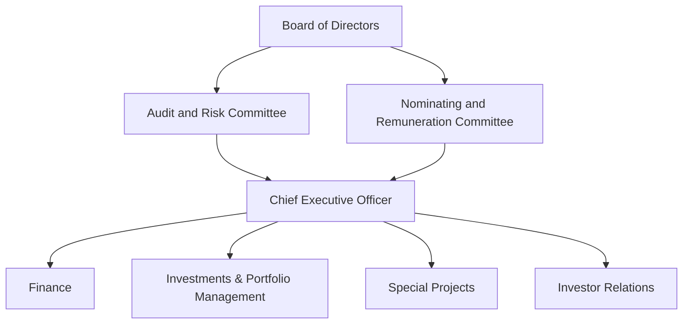

<!-- PAGE 1 -->

SUNTEC Real Estate Investment Trust logo

# REACHING FORWARD

Annual Report 2025

<!-- PAGE 2 -->

# ABOUT SUNTEC REIT

Listed on 9 December 2004 on the Mainboard of the Singapore Exchange Securities Trading Limited (“SGX-ST”), Suntec Real Estate Investment Trust (“Suntec REIT”) is one of the leading real estate investment trusts in Singapore, owning income-producing real estate that is primarily used for office and/or retail purposes. As at 31 December 2025, Suntec REIT has assets under management of over $12 billion with properties in Singapore and key Australian cities of Sydney, Melbourne and Adelaide as well as in London, United Kingdom.

In Singapore, Suntec REIT’s portfolio comprises office and retail properties in Suntec City, 66.3% interest in Suntec Singapore Convention & Exhibition Centre (“Suntec Singapore”), one-third interest in One Raffles Quay (“ORQ”), one-third interest in Marina Bay Financial Centre Towers 1 and 2 and the Marina Bay Link Mall (“MBLM” and collectively known as the “MBFC Properties”). The properties in Australia include 177 Pacific Highway and 21 Harris Street in Sydney, 50.0% interest in Southgate Complex and 50.0% interest in Olderfleet, 477 Collins Street in Melbourne and 55 Currie Street in Adelaide. In United Kingdom, Suntec REIT owns a 50.0% interest in Nova Properties and The Minster Building in London.

Suntec REIT is managed by an external manager, ESR Trust Management (Suntec) Limited (the “Manager”). The Manager is committed to building a resilient business and delivering long term value to its stakeholders through strong corporate governance, prudent financial management, fair employment practices and active management of its real estate portfolio.

# ABOUT ESR TRUST MANAGEMENT (SUNTEC) LIMITED

Suntec REIT is managed by ESR Trust Management (Suntec) Limited, a wholly-owned subsidiary of Acrophyte Asset Management Pte. Ltd. (“Acrophyte AM”), which in turn is a subsidiary of Tang Organization Pte. Ltd.¹ (“Tang Organization”).

Established in the 1990s, Tang Organization is a leading Singapore-based real estate group that has evolved into a diversified multinational conglomerate with integrated capabilities across the real estate value chain. Its core competencies include: (i) property development and investment; (ii) real estate fund and asset management; and (iii) construction.

Tang Organization benefits from the combined management and operational teams of SingHaiyi Group Pte. Ltd.² (“SingHaiyi”). SingHaiyi is an established real estate company with a strong track record in the office and retail sectors, in addition to residential development. Both Tang Organization and SingHaiyi were previously listed on the Mainboard of the Singapore Exchange and were subsequently privatised by the Tang Family³.

Leveraging the combined experience and institutional knowledge of Tang Organization and SingHaiyi, the group is well-positioned to create long-term value for all unitholders. The Tang Family, as the largest unitholder in Suntec REIT, reinforces strong alignment with the interests of all unitholders. As the new sponsor and the shareholder of the Manager, Tang Organization remains committed to prudent stewardship, disciplined capital management, and sustainable value creation for all unitholders.

1 Formerly known as Chip Eng Seng Corporation Ltd.

2 Formerly known as SingHaiyi Group Ltd.

3 The Tang Family includes Mr. Gordon Tang, Mrs. Celine Tang, their children and other members of their family.

Cityscape showing various office and retail buildings in Suntec REIT's portfolio

<!-- PAGE 3 -->

# OUR VISION

Forging ahead to create, provide and deliver premium value to all stakeholders of Suntec REIT.

# Contents

<table>
  <tbody>
    <tr>
        <td>8</td>
        <td>At a Glance</td>
    </tr>
    <tr>
        <td>9</td>
        <td>Reviewing Year 2025</td>
    </tr>
    <tr>
        <td>10</td>
        <td>Letter to Unitholders</td>
    </tr>
    <tr>
        <td>12</td>
        <td>Financial Highlights</td>
    </tr>
    <tr>
        <td>13</td>
        <td>Unit Performance</td>
    </tr>
    <tr>
        <td>14</td>
        <td>Trust Structure &amp;<br/>Organisation Structure</td>
    </tr>
    <tr>
        <td>15</td>
        <td>Board of Directors</td>
    </tr>
    <tr>
        <td>18</td>
        <td>Management Team</td>
    </tr>
    <tr>
        <td>19</td>
        <td>Manager’s Report</td>
    </tr>
    <tr>
        <td>22</td>
        <td>Property Portfolio</td>
    </tr>
    <tr>
        <td>52</td>
        <td>Independent Market Report</td>
    </tr>
    <tr>
        <td>64</td>
        <td>Investor Communications</td>
    </tr>
    <tr>
        <td>65</td>
        <td>Risk Management</td>
    </tr>
    <tr>
        <td>68</td>
        <td>Corporate Governance</td>
    </tr>
    <tr>
        <td>99</td>
        <td>Financial Contents</td>
    </tr>
    <tr>
        <td>196</td>
        <td>Corporate Directory</td>
    </tr>
  </tbody>
</table>

Skyline of Suntec City buildings

<!-- PAGE 4 -->

# STRONG
# FOUNDATION
# ANCHORED BY
**QUALITY OFFICE AND**
**RETAIL ASSETS**

<!-- PAGE 5 -->

Photograph of Suntec City towers and the Fountain of Wealth in Singapore

Suntec City, Singapore

<!-- PAGE 6 -->

Modern glass skyscraper with a teal circular overlay containing text

# INCOME
# RESILIENCE
# STRENGTHENED

THROUGH
GEOGRAPHICAL
DIVERSIFICATION

<!-- PAGE 7 -->

Photograph of the Olderfleet building at 477 Collins Street, Melbourne, showing a modern glass skyscraper rising behind historic Victorian-era facades.

Left: 177 Pacific Highway, Sydney
Right: Olderfleet, 477 Collins Street, Melbourne

<!-- PAGE 8 -->

# VALUE
# CREATION
**DRIVES LONG TERM**
**SUSTAINABLE GROWTH**

<!-- PAGE 9 -->

Photograph of The Minster Building in London with its distinctive neo-Gothic architecture and a modern red skyscraper (Nova Properties) visible in the background.

Left: Nova Properties, London
Right: The Minster Building, London

<!-- PAGE 10 -->

# At a Glance

# 2025

**DISTRIBUTABLE INCOME**
**$207.3 million**
+14.6% Y-O-Y
Distributable income icon

**ASSETS UNDER MANAGEMENT**
**$12.1 billion¹**
Assets under management icon

**DISTRIBUTION PER UNIT**
**7.035 cents**
+13.6% Y-O-Y
Distribution per unit icon

**SUSTAINABILITY AWARDS**
* GRESB 5 Star rating
* GRESB ‘A’ for Public Disclosure
Sustainability awards icon

**PORTFOLIO OCCUPANCY**
**94.8%** Office
**98.2%** Retail
Portfolio occupancy icon

**NET ASSET VALUE PER UNIT**
**$2.03**
Net asset value per unit icon

**AGGREGATE LEVERAGE RATIO**
**41.5%**
Aggregate leverage ratio icon

**ALL-IN FINANCING COST**
**3.71%**
per annum
All-in financing cost icon

Note:
1 The assets under management stood at $12.1 billion as at 31 December 2025 and 31 December 2024. This consisted of deposited property value of $11.8 billion and $0.3 billion of cash and other assets.

**JAN**
* Achieved distributable income from operations of $92.2 million for the half year from 1 July 2024 to 31 December 2024. Distribution per unit (“DPU”) for the half year amounted to 3.150 cents.

**FEB**
* Lapse of mandatory conditional offer for all issued and outstanding units in Suntec REIT by Aelios Pte. Ltd.
* Suntec REIT's Australia Managed Investment Trust ("MIT") no longer meets the requirements to be qualified as a withholding MIT. As a result, Suntec REIT (Australia) Trust is now subject to a withholding tax rate of 45%.
* Retirement of Mr. Lim Hwee Chiang, John from role as Non-Executive Director.
* Entered into AUD280.3 million and AUD118.3 million loan facilities.
* Entered into a £205.0 million loan facility.

**MAR**
* Issued $175 million 3.40% medium term notes due 2031.
* Appointment of Mr. Matthew James Lawson as Non-Executive Director.

**APR**
* Unitholders approved all resolutions tabled at Suntec REIT’s annual general meeting held on 17 April 2025.
* Achieved distributable income from operations of $45.9 million for the quarter from 1 January 2025 to 31 March 2025. DPU to unitholders for the quarter amounted to 1.563 cents.

**JUN**
* Issued $250 million fixed rate subordinated perpetual securities.

**JUL**
* Achieved distributable income from operations of $92.8 million for the half year from 1 January 2025 to 30 June 2025. DPU to unitholders for the half year amounted to 3.155 cents (including DPU of 1.563 cents for the quarter from 1 January 2025 to 31 March 2025).

**SEP**
* Suntec REIT's Australia MIT to continue to enjoy a concessionary withholding tax rate at 10% or 15% on distributions for the year ending 31 December 2025 after obtaining private ruling from the Australian Tax Office.
* Redesignation of Mr. Lock Wai Han from Independent Non-Executive Director to Non-Executive Director.
* Changes in directorate and composition of the Board with the appointment of Mr. David Alasdair William Matheson (“Mr. Matheson”) as Chairman and Non-Executive Director following the retirement of Ms. Chew Gek Khim (”Ms. Chew”) as Chairman and Non-Executive Director.
* Reconstitution of the Nominating and Remuneration Committee (“NRC”) with the appointment of Mrs. Yu-Foo Yee Shoon (”Mrs. Yu-Foo”) and resignation of Ms. Chew.

**OCT**
* Redeemed and cancelled $200 million fixed rate subordinated perpetual securities.
* Suntec REIT retained the GRESB highest 5 Star rating for the sixth consecutive year and maintained ‘A’ rating for Public Disclosure.
* Achieved distributable income from operations of $52.4 million for the quarter from 1 July 2025 to 30 September 2025. DPU to unitholders for the quarter amounted to 1.778 cents.
* Appointment of Mr. Anthony Charles Philip Couse (“Mr. Couse”) and Mr. Abdul Jabbar Bin Karam Din (“Mr. Jabbar”) as Independent Non-Executive Director.

**DEC**
* Proposed acquisition of the Manager by Acrophyte Asset Management Pte. Ltd. an entity controlled by Mr. Gordon Tang and Mrs. Celine Tang¹.
* Mr. Chan Pee Teck Peter (”Mr. Chan”) and Mrs. Yu-Foo stepped down as Independent Non-Executive Directors after serving on the Board for 9 years.
* Mr. Shen Jinchu and Mr. Matthew James Lawson retired as Non-Executive Directors, in alignment with the intended change in ownership of the Manager.
* Appointment of Mr. Jabbar as Chairman of NRC and member of Audit and Risk Committee ("ARC") and Mr. Couse as member of the NRC and ARC and Mr. Matheson as member of the NRC.

\* Note: 1 The proposed acquisition was completed on 17 March 2026. Please refer to the announcement dated 17 March 2026 titled "Completion of the Proposed Acquisition of the Manager by Acrophyte Asset Management Pte. Ltd.".

<!-- PAGE 11 -->

# Reviewing Year 2025

**DISTRIBUTABLE INCOME**
$207.3 million
+14.6% Y-O-Y

**ASSETS UNDER MANAGEMENT**
$12.1 billion¹

**DISTRIBUTION PER UNIT**
7.035 cents
+13.6% Y-O-Y

**SUSTAINABILITY AWARDS**
* GRESB 5 Star rating
* GRESB ‘A’ for Public Disclosure

**PORTFOLIO OCCUPANCY**
94.8% Office
98.2% Retail

**NET ASSET VALUE PER UNIT**
$2.03

**AGGREGATE LEVERAGE RATIO**
41.5%

**ALL-IN FINANCING COST**
3.71% per annum

\* Note:
1 The assets under management stood at $12.1 billion as at 31 December 2025 and 31 December 2024. This consisted of deposited property value of $11.8 billion and $0.3 billion of cash and other assets.

## JAN

* Achieved distributable income from operations of $92.2 million for the half year from 1 July 2024 to 31 December 2024. Distribution per unit (“DPU”) for the half year amounted to 3.150 cents.

## FEB

* Lapse of mandatory conditional offer for all issued and outstanding units in Suntec REIT by Aelios Pte. Ltd.

* Suntec REIT 's Australia Managed Investment Trust ("MIT") no longer meets the requirements to be qualified as a withholding MIT. As a result, Suntec REIT (Australia) Trust is now subject to a withholding tax rate of 45%.

* Retirement of Mr. Lim Hwee Chiang, John from role as Non-Executive Director.

* Entered into AUD280.3 million and AUD118.3 million loan facilities.

* Entered into a £205.0 million loan facility.

## MAR

* Issued $175 million 3.40% medium term notes due 2031.

* Appointment of Mr. Matthew James Lawson as Non-Executive Director.

## APR

* Unitholders approved all resolutions tabled at Suntec REIT’s annual general meeting held on 17 April 2025.

* Achieved distributable income from operations of $45.9 million for the quarter from 1 January 2025 to 31 March 2025. DPU to unitholders for the quarter amounted to 1.563 cents.

## JUN

* Issued $250 million fixed rate subordinated perpetual securities.

## JUL

* Achieved distributable income from operations of $92.8 million for the half year from 1 January 2025 to 30 June 2025. DPU to unitholders for the half year amounted to 3.155 cents (including DPU of 1.563 cents for the quarter from 1 January 2025 to 31 March 2025).

## SEP

* Suntec REIT's Australia MIT to continue to enjoy a concessionary withholding tax rate at 10% or 15% on distributions for the year ending 31 December 2025 after obtaining private ruling from the Australian Tax Office.

* Redesignation of Mr. Lock Wai Han from Independent Non-Executive Director to Non-Executive Director.

* Changes in directorate and composition of the Board with the appointment of Mr. David Alasdair William Matheson (“Mr. Matheson”) as Chairman and Non-Executive Director following the retirement of Ms. Chew Gek Khim (”Ms. Chew”) as Chairman and Non-Executive Director.

* Reconstitution of the Nominating and Remuneration Committee (“NRC”) with the appointment of Mrs. Yu-Foo Yee Shoon (”Mrs. Yu-Foo”) and resignation of Ms. Chew.

## OCT

* Redeemed and cancelled $200 million fixed rate subordinated perpetual securities.

* Suntec REIT retained the GRESB highest 5 Star rating for the sixth consecutive year and maintained ‘A’ rating for Public Disclosure.

* Achieved distributable income from operations of $52.4 million for the quarter from 1 July 2025 to 30 September 2025. DPU to unitholders for the quarter amounted to 1.778 cents.

* Appointment of Mr. Anthony Charles Philip Couse (“Mr. Couse”) and Mr. Abdul Jabbar Bin Karam Din (“Mr. Jabbar”) as Independent Non-Executive Director.

## DEC

* Proposed acquisition of the Manager by Acrophyte Asset Management Pte. Ltd. an entity controlled by Mr. Gordon Tang and Mrs. Celine Tang¹.

* Mr. Chan Pee Teck Peter (”Mr. Chan”) and Mrs. Yu-Foo stepped down as Independent Non-Executive Directors after serving on the Board for 9 years.

* Mr. Shen Jinchu and Mr. Matthew James Lawson retired as Non-Executive Directors, in alignment with the intended change in ownership of the Manager.

* Appointment of Mr. Jabbar as Chairman of NRC and member of Audit and Risk Committee ("ARC") and Mr. Couse as member of the NRC and ARC and Mr. Matheson as member of the NRC.

<!-- PAGE 12 -->

# Letter to Unitholders

Portrait of a man in a suit

**Dear Unitholders**

On behalf of the Board of ESR Trust Management (Suntec) Limited (“Board”), it is my pleasure to present to you the annual report of Suntec REIT for the financial year ended 31 December 2025 (“FY 2025”).

Suntec REIT delivered a strong set of results in FY 2025. This was anchored by our well diversified portfolio of quality assets in strategic locations across Singapore, Australia and the United Kingdom as well as lower financing cost from the lower interest rate environment.

## SINGAPORE PROPERTIES DROVE PERFORMANCE IMPROVEMENT

Gross revenue and net property income improved 1.7% and 1.9% to $471.6 million and $316.8 million respectively. Income contributions from joint ventures increased 3.6% to $103.2 million. Suntec REIT distributable income for FY 2025 was $207.3 million, a stellar increase of 14.6% year-on-year. This was driven by the strong operational performance of the Singapore Office, Retail and Convention portfolio and lower financing costs.

The results reflect the strength and resilience of Suntec REIT, driven by the continual growth in operating performances of the Singapore portfolio.

Our Singapore office portfolio continued to demonstrate its resilience with healthy rent reversion of 9.6% recorded for 2025. The Singapore Office Portfolio comprising office towers at Suntec City Office, One Raffles Quay and Marina Bay Financial Centre achieved a strong committed portfolio occupancy of 98.2% as at 31 December 2025, above the market occupancy of 95.2% for Core CBD offices.

Our Australian portfolio remained stable with positive gross rent reversion of 25.9% for the year. Committed occupancies for our Australian portfolio remained healthy at 90.6%, higher than the nationwide CBD office occupancy of 85.0%. 177 Pacific Highway, Sydney and Olderfleet, 477 Collins Street, Melbourne had committed occupancy of 100% while 21 Harris Street, Sydney, and Southgate Complex, Melbourne had committed occupancies of 97.8% and 86.8% respectively. At 55 Currie Street in Adelaide, the committed occupancy improved 4.6 percentage points to 66.0%.

In the United Kingdom, Nova Properties achieved 100% committed occupancy while the committed occupancy at The Minster Building stood at 85.4%.

On the retail front, Suntec City Mall recorded another year of outstanding performance in FY 2025. The mall achieved a strong full-year rent reversion of 16.2% while committed occupancy improved to 99.5%. Through continuous efforts to curate a diverse tenant mix and enhanced retail offerings, Suntec City remains a popular mall with shoppers’ footfall registering at approximately 44 million for 2025.

Suntec Convention continued its growth momentum with income recording an increase of 11.9% driven by higher number of large and mid-scale events.

## WELL DIVERSIFIED PORTFOLIO WITH SINGAPORE AS STRONG CORE

As at end 2025, Suntec REIT’s assets under management (“AUM”) remained stable at $12.1 billion.

Suntec REIT continues to be Singapore centric with 78.2% of its AUM in Singapore, with the remaining 12.0% and 9.8% in Australia and the United Kingdom respectively.

## BALANCE SHEET

Suntec REIT remains focused on proactive capital management. In 2025, loans amounting to $730.0 million were refinanced with interest margins at approximately 25 basis points lower. The average financing cost for FY 2025 reduced by 35 basis points to 3.71% per annum with approximately 65.0% of the interest fixed or hedged. As at 31 December 2025, the aggregate leverage ratio was 41.5% with adequate headroom of $1.0 billion to the limit of 50.0%.

## SUSTAINABILITY COMMITMENT

Sustainability remains a fundamental aspect of our operations. Since embarking on the REIT’s sustainability reporting journey in FY 2017, Suntec REIT had consistently achieved and maintained strong accreditation and accolades.

We are pleased to report that Suntec REIT attained the highest GRESB 5 Star rating for the sixth consecutive year. Suntec REIT also maintained ‘A’ for its level of ESG public disclosure. GRESB is one of the leading ESG benchmarks for real estate and infrastructure investments globally.

<!-- PAGE 13 -->

In line with our net carbon zero roadmap and commitment towards sustainable growth, Olderfleet, 477 Collins Street, Melbourne, achieved carbon neutral status in 2025. New medium-term targets were established as we continue to make progress on our net carbon zero objectives.

We have also increased the proportion of green or sustainability-linked loans from approximately 70% to 82% as at end December 2025. More information can be found in our Sustainability Report, which will be available in electronic form on SGXNet and our website by end-May 2026.

## NEW OWNER OF REIT MANAGER

On behalf of the Board and Manager, I would like to welcome Tang Organization Pte. Ltd. (“Tang Organization”) who has stepped in as the new owner of the REIT Manager, following the completion of the acquisition of the 100% stake in the REIT Manager by Acrophyte Asset Management Pte. Ltd. (“Acrophyte AM”), a subsidiary of Tang Organization.

## OUTLOOK

The office market is expected to remain resilient underpinned by limited new supply and tight vacancies. Our Singapore office portfolio occupancy is expected to remain high and positive rent reversion is expected to be near 5%. The portfolio performance remains stable on the back of past quarters of positive rent reversion and healthy occupancies.

Tang Organization, an entity controlled by Mr. Gordon Tang and Mrs. Celine Tang, is a leading Singapore-based real estate group that has evolved into a diversified multinational conglomerate with integrated capabilities across the real estate value chain. The Tang Family¹ are the largest unitholder group of Suntec REIT and their interests are fully aligned with the interests of unitholders.

Revenue performance from Suntec City Mall is expected to improve, underpinned by positive rent reversion which is expected to be close to 10% with committed occupancy remaining high. Suntec City Mall is well poised for growth, supported by higher occupancy, rent and marcoms activities.

We look forward to working together with Tang Organization to drive and grow sustainable long term value for all unitholders.

## IN APPRECIATION

The Singapore MICE market is expected to continue its growth momentum, boosted by the support from the Singapore Tourism Board. The performance of Suntec Convention is expected to be stronger with the composition of event types likely to remain largely unchanged.

On behalf of the Board and the Manager, I would like to thank Ms. Chew Gek Khim, Mr. Chan Pee Teck Peter, Mrs. Yu-Foo Yee Shoon, Mr. Shen Jinchu, Mr. Matthew James Lawson and Mr. David Alasdair William Matheson who have retired as Directors. With their strategic counsel and insightful guidance, Ms. Chew and Mr. Matheson had led the Board with distinction. The invaluable contributions by Mr. Chan, Mrs. Yu-Foo, Mr. Shen and Mr. Lawson were instrumental in the continued success of Suntec REIT.

Our Australian portfolio is expected to remain stable supported by strong occupancies at 177 Pacific Highway, 21 Harris Street and Olderfleet, 477 Collins Street, with vacancies at Southgate Complex and 55 Currie Street likely to persist in view of market’s softness.

We are pleased to welcome Mr. Abdul Jabbar Bin Karam Din and Mr. Anthony Charles Philip Couse who have joined the Board as Independent Non-Executive Directors of the Manager. Their extensive experience in the areas of legal, regulatory and governance as well as real estate and sustainability will help the Board in further driving value for unitholders.

In the United Kingdom, the operating performance for Nova Properties is expected to be stable while The Minster Building remains impacted by vacancies.

Last but not least, I would like to extend my sincere appreciation to our unitholders, tenants, business partners and stakeholders for their continued trust and steadfast support.

While the current heightened geopolitical tensions have led to greater uncertainty, Suntec REIT’s sound fundamentals, unwavering focus to create value, underpinned by our diversified portfolio of high-quality assets and resilient income streams will continue to help us navigate these challenges. We are confident these enduring strengths will position Suntec REIT well for our next phase of growth.

**Lock Wai Han**

Interim Chairman and Non-Executive Director
24 March 2026

<!-- PAGE 14 -->

# Financial Highlights

<table>
  <thead>
    <tr>
        <th>CONSOLIDATED STATEMENT OF TOTAL RETURN FOR THE FINANCIAL YEAR</th>
        <th>2025</th>
        <th>2024</th>
    </tr>
  </thead>
  <tbody>
    <tr>
        <td>Gross Revenue</td>
        <td>$471.6m</td>
        <td>$463.6m</td>
    </tr>
    <tr>
        <td>Net Property Income</td>
        <td>$316.8m</td>
        <td>$310.8m</td>
    </tr>
    <tr>
        <td>Income Contribution From Joint Ventures¹</td>
        <td>$103.2m²</td>
        <td>$99.6m²</td>
    </tr>
    <tr>
        <td>Distributable Income</td>
        <td>$207.3m</td>
        <td>$180.9m</td>
    </tr>
    <tr>
        <td>Distribution Per Unit (“DPU”)</td>
        <td>7.035¢</td>
        <td>6.192¢</td>
    </tr>
  </tbody>
</table>
<table>
  <thead>
    <tr>
        <th>CONSOLIDATED STATEMENT OF FINANCIAL POSITION</th>
        <th>31 Dec 2025</th>
        <th>31 Dec 2024</th>
    </tr>
  </thead>
  <tbody>
    <tr>
        <td>Investment Properties</td>
        <td>$7,848.1m</td>
        <td>$7,840.3m</td>
    </tr>
    <tr>
        <td>Interest in Joint Ventures³</td>
        <td>$2,799.7m</td>
        <td>$2,825.3m</td>
    </tr>
    <tr>
        <td>Total Assets</td>
        <td>$10,879.4m</td>
        <td>$10,951.1m</td>
    </tr>
    <tr>
        <td>Debt at Amortised Cost</td>
        <td>$4,057.1m</td>
        <td>$4,213.0m</td>
    </tr>
    <tr>
        <td>Total Liabilities</td>
        <td>$4,342.7m</td>
        <td>$4,465.5m</td>
    </tr>
    <tr>
        <td>Unitholders’ Funds</td>
        <td>$6,008.7m</td>
        <td>$6,003.3m</td>
    </tr>
    <tr>
        <td>Net Asset Value Per Unit</td>
        <td>$2.03</td>
        <td>$2.05</td>
    </tr>
    <tr>
        <td>Aggregate Leverage Ratio⁴</td>
        <td>41.5%</td>
        <td>42.4%</td>
    </tr>
    <tr>
        <td>Interest Coverage Ratio⁵</td>
        <td>2.1 times</td>
        <td>1.9 times</td>
    </tr>
    <tr>
        <td>- ICR if there is -10% in EBITDA</td>
        <td>1.9 times</td>
        <td>1.7 times</td>
    </tr>
    <tr>
        <td>- ICR if there is +100 bps in the weighted average interest rate of Suntec REIT</td>
        <td>1.7 times</td>
        <td>1.7 times</td>
    </tr>
  </tbody>
</table>

**Notes:**

1 Refers to the share of profits² and interest income from loans to joint ventures (if any), from the one-third interest in One Raffles Quay, one-third interest in MBFC Properties, 50.0% interest in Southgate Complex and 50.0% interest in Nova Properties.

2 Excludes share of gain/(loss) arising from fair value adjustments of $37.6 mil for the financial year ended 31 December 2025 and ($2.8) mil for the financial year ended 31 December 2024.

3 Refers to the one-third interest in One Raffles Quay, one-third interest in the MBFC Properties, 50.0% interest in Southgate Complex and 50.0% interest in Nova Properties.

4 Refers to the ratio of the value of borrowings (inclusive of proportionate share of borrowings of joint ventures and deferred payments (if any)) to the value of the Deposited Property in accordance with Appendix 6 of the Code on Collective Investment Schemes issued by the Monetary Authority of Singapore (the “Property Funds Appendix”).

5 Calculation is based on dividing the trailing 12 months earnings before interest, tax, sinking fund contribution, depreciation and amortisation (excluding effects of any fair value changes of derivatives and investment properties, and foreign exchange translation), by the trailing 12 months interest expense, borrowing-related fees and distributions on hybrid securities (if any).

## 10 YEARS PERFORMANCE TRACK RECORD

### Assets Under Management

$ Billion
<table>
  <thead>
    <tr>
        <th>Year</th>
        <th>Value</th>
    </tr>
  </thead>
  <tbody>
    <tr>
        <td>Dec 15</td>
        <td>9.1</td>
    </tr>
    <tr>
        <td>Dec 16</td>
        <td>9.2</td>
    </tr>
    <tr>
        <td>Dec 17</td>
        <td>9.4</td>
    </tr>
    <tr>
        <td>Dec 18</td>
        <td>9.4</td>
    </tr>
    <tr>
        <td>Dec 19</td>
        <td>10.4</td>
    </tr>
    <tr>
        <td>Dec 20</td>
        <td>10.7</td>
    </tr>
    <tr>
        <td>Dec 21</td>
        <td>11.5</td>
    </tr>
    <tr>
        <td>Dec 22</td>
        <td>11.7</td>
    </tr>
    <tr>
        <td>Dec 23</td>
        <td>11.5</td>
    </tr>
    <tr>
        <td>Dec 24</td>
        <td>11.5</td>
    </tr>
    <tr>
        <td>Dec 25</td>
        <td>12.1</td>
    </tr>
  </tbody>
</table>

### Distributable Income

$ Million
<table>
  <thead>
    <tr>
        <th>Year</th>
        <th>Value</th>
    </tr>
  </thead>
  <tbody>
    <tr>
        <td>FY 15</td>
        <td>250.3</td>
    </tr>
    <tr>
        <td>FY 16</td>
        <td>253.5</td>
    </tr>
    <tr>
        <td>FY 17</td>
        <td>263.0</td>
    </tr>
    <tr>
        <td>FY 18</td>
        <td>267.7</td>
    </tr>
    <tr>
        <td>FY 19</td>
        <td>266.1</td>
    </tr>
    <tr>
        <td>FY 20</td>
        <td>223.2</td>
    </tr>
    <tr>
        <td>FY 21</td>
        <td>246.8</td>
    </tr>
    <tr>
        <td>FY 22</td>
        <td>256.4</td>
    </tr>
    <tr>
        <td>FY 23</td>
        <td>208.2</td>
    </tr>
    <tr>
        <td>FY 24</td>
        <td>180.9</td>
    </tr>
    <tr>
        <td>FY 25</td>
        <td>207.3</td>
    </tr>
  </tbody>
</table>

<!-- PAGE 15 -->

# Unit Performance

<table>
  <thead>
    <tr>
        <th>UNIT PERFORMANCE AS AT¹</th>
        <th>2025</th>
        <th>2024</th>
        <th>2023</th>
        <th>2022</th>
        <th>2021</th>
    </tr>
  </thead>
  <tbody>
    <tr>
        <td>Last Done Unit Price</td>
        <td>$1.44</td>
        <td>$1.17</td>
        <td>$1.23</td>
        <td>$1.38</td>
        <td>$1.51</td>
    </tr>
    <tr>
        <td>Highest Unit Price</td>
        <td>$1.47</td>
        <td>$1.37</td>
        <td>$1.45</td>
        <td>$1.85</td>
        <td>$1.61</td>
    </tr>
    <tr>
        <td>Lowest Unit Price</td>
        <td>$1.06</td>
        <td>$1.04</td>
        <td>$1.07</td>
        <td>$1.28</td>
        <td>$1.40</td>
    </tr>
    <tr>
        <td>Market Capitalisation² (m)</td>
        <td>$4,241</td>
        <td>$3,418</td>
        <td>$3,564</td>
        <td>$3,969</td>
        <td>$4,308</td>
    </tr>
    <tr>
        <td>Traded Volume for the Financial Year (m)</td>
        <td>1,566</td>
        <td>2,192</td>
        <td>1,589</td>
        <td>2,812</td>
        <td>2,840</td>
    </tr>
  </tbody>
</table>

**Notes:**

1 Unit performance statistics as at 31 December are for the respective financial years.

2 Based on 2,853 million units, 2,876 million units, 2,897 million units, 2,921 million units and 2,945 units in issue as at 31 December 2021, 2022, 2023, 2024 and 2025 respectively.

<table>
  <thead>
    <tr>
        <th>UNIT PERFORMANCE AS AT¹</th>
        <th>2025</th>
        <th>2024</th>
        <th>2023</th>
        <th>2022</th>
        <th>2021</th>
    </tr>
  </thead>
  <tbody>
    <tr>
        <td>Traded Yield (based on DPU²) (%)</td>
        <td>4.89</td>
        <td>5.29</td>
        <td>5.80</td>
        <td>6.44</td>
        <td>5.74</td>
    </tr>
    <tr>
        <td>Singapore Government 10-Year Bond¹ (%)</td>
        <td>2.22</td>
        <td>2.86</td>
        <td>2.71</td>
        <td>3.09</td>
        <td>1.67</td>
    </tr>
  </tbody>
</table>

For FY 2025, Suntec REIT’s unit opening price was $1.17 and closed at $1.44 with a market capitalisation of $4.2 billion as at 31 December 2025. Suntec REIT’s FY 2025 DPU yield of 4.89% has also outperformed the Singapore Government 10-year bond yield at 2.22%. As at end FY 2025, Suntec REIT unitholders would have achieved a total return of 230.2%³ since listing. As one of Singapore’s most liquid listed REITs, the overall traded volume was 1,566 million units for the 12 months ended 31 December 2025. Suntec REIT is also a constituent member of major global indices such as the MSCI Global Small Cap Index, FTSE EPRA Nareit Global Real Estate Index and the Global Property Research 250 Index series. It is also a constituent of the FTSE Straits Times Mid Cap Index and FTSE Straits Times Real Estate Index in Singapore.

**Notes:**

1 As at 31 December for the respective years.

2 Based on the last done unit price (as stated in the table above) and the full year DPU based on the period from 1 January to 31 December. Calculations were based on a DPU of 8.666 cents, 8.884 cents, 7.135 cents, 6.192 cents and 7.035 cents for FY 2021, FY 2022, FY 2023, FY 2024 and FY 2025 respectively.

3 Source: Bloomberg

## RELATIVE PERFORMANCE INDICES FOR THE FINANCIAL YEAR 2025

Index Value (base 100%)
<table>
  <thead>
    <tr>
        <th>Month</th>
        <th>SUN SP Equity</th>
        <th>FSSTI Index</th>
        <th>FSTREI Index</th>
    </tr>
  </thead>
  <tbody>
    <tr>
        <td>Dec 24</td>
        <td>100</td>
        <td>100</td>
        <td>100</td>
    </tr>
    <tr>
        <td>Jan 25</td>
        <td>105</td>
        <td>102</td>
        <td>101</td>
    </tr>
    <tr>
        <td>Feb 25</td>
        <td>100</td>
        <td>101</td>
        <td>98</td>
    </tr>
    <tr>
        <td>Mar 25</td>
        <td>102</td>
        <td>103</td>
        <td>100</td>
    </tr>
    <tr>
        <td>Apr 25</td>
        <td>95</td>
        <td>98</td>
        <td>96</td>
    </tr>
    <tr>
        <td>May 25</td>
        <td>100</td>
        <td>102</td>
        <td>98</td>
    </tr>
    <tr>
        <td>Jun 25</td>
        <td>102</td>
        <td>104</td>
        <td>101</td>
    </tr>
    <tr>
        <td>Jul 25</td>
        <td>108</td>
        <td>110</td>
        <td>105</td>
    </tr>
    <tr>
        <td>Aug 25</td>
        <td>112</td>
        <td>113</td>
        <td>108</td>
    </tr>
    <tr>
        <td>Sep 25</td>
        <td>115</td>
        <td>116</td>
        <td>112</td>
    </tr>
    <tr>
        <td>Oct 25</td>
        <td>118</td>
        <td>115</td>
        <td>110</td>
    </tr>
    <tr>
        <td>Nov 25</td>
        <td>116</td>
        <td>118</td>
        <td>109</td>
    </tr>
    <tr>
        <td>Dec 25</td>
        <td>122</td>
        <td>121</td>
        <td>111</td>
    </tr>
  </tbody>
</table>

<!-- PAGE 16 -->

# Trust Structure

```mermaid
graph TD
    Unitholders -- "Investment in Suntec REIT" --> SuntecREIT[SUNTEC Real Estate Investment Trust]
    SuntecREIT -- Distribution --> Unitholders
    
    ESR[ESR Trust Management (Suntec) Limited] -- Fees --> SuntecREIT
    SuntecREIT -- Asset Management Services --> ESR
    
    HSBC[HSBC Institutional Trust Services (Singapore) Limited (REIT Trustee)] -- Acts for Unitholders --> Unitholders
    HSBC -- Fees --> SuntecREIT
    
    ESR -- Appoints --> PM[Property Managers]
    PM -- Reports To --> ESR
    
    PM -- Fees --> SuntecREIT
    SuntecREIT -- Property Management Services --> PM
    
    SuntecREIT -- Ownership of Assets --> Portfolio[Suntec REIT Portfolio]
    Portfolio -- "Net Property Income and Income Contribution" --> SuntecREIT
    
    Portfolio --> Singapore
    Portfolio --> Australia
    Portfolio --> UK[United Kingdom]
    
    subgraph Singapore
        S1[• Suntec City]
        S2[• Suntec Singapore¹ (66.3% interest)]
        S3[• One Raffles Quay (one-third interest)]
        S4[• MBFC Properties² (one-third interest)]
    end
    
    subgraph Australia
        A1[• 177 Pacific Highway, Sydney]
        A2[• 21 Harris Street, Sydney]
        A3[• Southgate Complex, Melbourne (50.0% interest)]
        A4[• Olderfleet, 477 Collins Street, Melbourne (50.0% interest)]
        A5[• 55 Currie Street, Adelaide]
    end
    
    subgraph UK[United Kingdom]
        U1[• Nova Properties³ (50.0% interest)]
        U2[• The Minster Building]
    end
```

# Organisation Structure

**ESR TRUST MANAGEMENT (SUNTEC) LIMITED**



**Notes:**

1 Refers to Suntec Singapore Convention & Exhibition Centre.

2 Refers to Marina Bay Financial Centre Towers 1 and 2 and the Marina Bay Link Mall.

3 Refers to Nova North, Nova South and The Nova Building.

<!-- PAGE 17 -->

# Board of Directors

Portrait of Lock Wai Han

**LOCK WAI HAN, 58**
**Interim Chairman, Non-Executive Director**

Mr. Lock Wai Han joined the Board on 1 August 2018 and was appointed Interim Chairman on 17 March 2026. Mr. Lock is Non-Executive Director and a member of the Audit and Risk as well as the Nominating and Remuneration committees.

Mr. Lock is currently an Executive Director at Aesen Offshore Limited (previously known as MEO – Micyln Express Offshore), and a consultant to Haiyi Holdings Pte. Ltd. Mr. Lock is also the Lead Independent Director of The Hour Glass Limited.

Mr. Lock was previously the Executive Director and Chief Executive Officer of OKH Global Ltd, as well as an Independent Director of Chip Eng Seng Corporation Ltd which was delisted from the Singapore Stock Exchange on 11 April 2023.

Prior to joining OKH Global Ltd, Mr. Lock was the Executive Director and Group CEO of Rowsley Ltd and before that he was based in Beijing as the China CEO of CapitaMalls Asia (“CMA”), where he had oversight of a retail mall portfolio that included Raffles City projects and CMA mixed developments.

Up until he joined CMA in March 2010, Mr. Lock had served in the Singapore public sector for more than 20 years during which he held various leadership roles including Commissioner of the Immigration & Checkpoints Authority; Director of the Criminal Investigations Department and Deputy Secretary of the Ministry of Information, Communications & the Arts, as well as directorships in various statutory boards.

Mr. Lock holds a Bachelor and Master of Arts (Engineering) from the University of Cambridge, UK, and a Master of Science (Management) from Leland Stanford Junior University, USA.

Portrait of Yap Chee Meng

**YAP CHEE MENG, 70**
**Lead Independent, Non-Executive Director**

Mr. Yap Chee Meng is the Lead Independent Director and Chairman of the Audit and Risk committee. Mr. Yap is also a member of the Nominating and Remuneration committee. He joined the Board on 22 April 2019.

Mr. Yap was the Chief Operating Officer of KPMG International for Asia Pacific and a member of its Global Executive Team. Prior to his appointment as the regional Chief Operating Officer of KPMG International in 2010, he was a Senior Partner in KPMG Singapore, the Regional Head of Financial Services in Asia Pacific, and Country Head of Real Estates and Specialised REITs Group in Singapore.

In his career spanning 37 years of experience in the financial sector, Mr. Yap has served in the committees of various professional and regulatory bodies including Singapore’s Accounting & Corporate Regulatory Authority and the Institute of Certified Public Accountants of Singapore.

In the preceding three years, Mr. Yap held independent directorships in RHB Investment Bank Berhad, HSBC Insurance (Singapore) Pte Limited and HSBC Life (Singapore) Pte Ltd. Mr. Yap was also the Non-Executive Chairman of RHB Asset Management Group (and HSBC Life (Singapore) Pte Ltd when it was AXA Insurance Pte Ltd).

Mr. Yap’s past independent board memberships included those in Keppel Land Limited, The Esplanade Co Ltd, SATS Ltd, SMRT Corporation Ltd and the National Research Foundation of Singapore. He qualified as a UK Chartered Accountant in 1981, and is now a non-practising Fellow of the Institute of Singapore Chartered Accountants and a non-practising Fellow of the Institute of Chartered Accountants in England & Wales. Mr. Yap was a council member of the Charity Council of Singapore.

<!-- PAGE 18 -->

# Board of Directors

Portrait of Abdul Jabbar Bin Karam Din

**ABDUL JABBAR BIN KARAM DIN, 56**
Independent Non-Executive Director

Mr. Abdul Jabbar Bin Karam Din is an Independent Director and joined the Board on 24 October 2025. Mr. Jabbar was appointed as a member of the Audit and Risk committee and Chairman of the Nominating and Remuneration committee on 31 December 2025.

Mr. Jabbar is currently the Deputy Managing Partner of Rajah & Tann Singapore LLP. He has more than 30 years of extensive experience in corporate governance, mergers and acquisitions, joint ventures, banking and finance, general commercial and private client work, both local and international. Mr. Jabbar regularly advises public listed and unlisted companies on corporate governance, compliance and regulatory matters.

Mr. Jabbar is the Lead Independent Director, Chairman of Remuneration Committee and Member of Nominating Committee at Global Resource Construction Limited. He is also the Lead Independent Director, Chairman of the Nomination and Governance Committee, and Member of the Audit & Risk Management Committee at Global Investments Limited. Mr. Jabbar also served as the Lead Independent Director of Chip Eng Seng Corporation Ltd (now known as Tang Organization Pte. Ltd.) which was previously listed on the SGX-ST. Mr. Jabbar is a Senior Accredited Director of the Singapore Institute of Directors.

Mr. Jabbar graduated with a Bachelor of Laws (Honours) from the National University of Singapore.

Portrait of Anthony Charles Philip Couse

**ANTHONY CHARLES PHILIP COUSE, 60**
Independent Non-Executive Director

Mr. Anthony Charles Philip Couse is an Independent Director and joined the Board on 24 October 2025. Mr. Couse was appointed as a member of the Audit and Risk as well as the Nominating and Remuneration committees on 31 December 2025.

Mr. Couse is currently a Partner at Elevate Capital Group. Mr. Couse has more than 35 years of experience in the real estate sector. Prior to joining Elevate Capital Group, Mr. Couse was previously the Chief Executive Officer of JLL Asia Pacific where he was responsible for the company's overall operations in 16 countries. Before that, he was managing director for Shanghai and Eastern China for over a decade and he also spent 12 years at JLL's Hong Kong office.

Mr. Couse graduated with a Bachelor (Hons), Biology from the University of London.

<!-- PAGE 19 -->

Portrait of Chong Kee Hiong

**CHONG KEE HIONG, 59**

**Chief Executive Officer and Executive Director**

Mr. Chong Kee Hiong was appointed as Chief Executive Officer and Executive Director on 1 January 2019. He is also a Director of One Raffles Quay Pte. Ltd.. Mr. Chong is a Partners’ Representative of BFC Development LLP.

Mr. Chong has 35 years of financial and management experience. Prior to joining the Manager, Mr. Chong was the Chief Executive Officer of OUE Hospitality REIT Management Pte Ltd from 2013 to 2018. He was Chief Executive Officer of The Ascott Limited from 2012 to 2013 and Chief Executive Officer of Ascott Residence Trust Management Limited from 2005 to 2012. Prior to that, Mr. Chong was with Raffles Holdings Limited as their Chief Financial Officer. Mr. Chong began his career in audit with KPMG Peat Marwick in 1990.

Mr. Chong is the president of the General Committee of Orchid Country Club and Aranda Country Club.

Mr. Chong was an elected Member of Parliament for Bishan — Toa Payoh GRC from 2015 to 2025.

Mr. Chong holds a Bachelor of Accountancy with National University of Singapore and completed Harvard Business School’s Advanced Management Program in 2008. He is a member of the Institute of Singapore Chartered Accountants.

<!-- PAGE 20 -->

# Management Team

Group photo of the Suntec REIT Management Team

**MR. CHONG KEE HIONG**

**Chief Executive Officer and Executive Director**

Please refer to description under the section on ‘Board of Directors’.

**MR. RAYMOND ONG**

**Director, Special Projects**

Mr. Raymond Ong assists the Chief Executive Officer on acquisitions, projects, operational and asset management matters and oversees Suntec REIT’s project developments.

**MS. DAWN LAI**

**Chief Operating Officer**

Ms. Dawn Lai assists the Chief Executive Officer on all operational matters, including portfolio management, investment, investor relations and strategic planning.

Prior to his appointment, Mr. Ong was the Director, Project of APM Property Management Pte Ltd since 2012 where he led the project team in the remaking of Suntec City which was successfully completed in 2015.

Ms. Lai has more than 30 years of experience in the real estate sector. She was with CapitaLand Ltd for 19 years where she was responsible for the marketing and leasing of commercial properties with a total asset value of more than $10 billion.

Mr. Ong has 40 years of experience in real estate development, project and property management.

Prior to joining the Group, he worked with public listed property companies Centrepoint Properties Ltd, Parkway Holdings Ltd and Wing Tai Property Management Pte Ltd, and with private property companies Kallang Development Pte Ltd and SK Land Pte Ltd. He had held positions as Executive Director and General Manager taking charge of development and property management.

Ms. Lai holds a Bachelor of Science in Estate Management (Hons) degree from the National University of Singapore.

**MS. NG EE SAN**

**Chief Financial Officer**

Mr. Ong holds a Diploma in Mechanical Engineering from Singapore Polytechnic.

Ms. Ng Ee San heads the Finance team and assists the Chief Executive Officer on the finance, treasury and capital management functions of Suntec REIT.

**MS. MELISSA CHOW**

**Manager, Investor Relations**

Ms. Ng has more than 25 years of experience in accounting and finance. Prior to joining the Manager, she was the Finance Manager at Ascott Residence Trust Management Limited, the manager of Ascott Residence Trust. She was also previously an Accountant at Wing Tai Holdings Limited and The Hour Glass Limited, and has held various positions with PSA Corporation Limited and Deloitte & Touche LLP.

Ms. Melissa Chow oversees the Investor Relations function of Suntec REIT. She is responsible for the timely communications and regular engagements between Suntec REIT and its unitholders, the investment community, and other key stakeholders. Ms. Chow also provides key market updates and research to the Manager.

Ms. Ng holds a Bachelor of Accountancy Degree from Nanyang Technological University, Singapore, and is a member of Institute of Singapore Chartered Accountants.

Ms. Chow has more than 15 years of experience in the field of investor relations. Prior to joining the Manager, she was at a private equity firm where she managed the communication channels between the company and the investment community. She was previously with a boutique public and investor relations agency.

Ms. Chow holds a Bachelor of Business Management (Finance and Corporate Communications) from Singapore Management University.

<!-- PAGE 21 -->

# Manager’s Report

YEAR IN REVIEW

Suntec REIT achieved a total distributable income of $207.3 million and DPU of 7.035 cents for the financial year ended 31 December 2025 (“FY 2025”). As at end FY 2025, Suntec REIT’s assets under management (“AUM”) stood at approximately $12.1 billion, underpinned by a 4.3 million square feet (“sq ft”) of office portfolio and 1.0 million sq ft of retail portfolio strategically located in the prime districts of Singapore, Australia and the United Kingdom.

FINANCIAL PERFORMANCE

Suntec REIT achieved gross revenue of $471.6 million in FY 2025 which was 1.7% higher compared to the corresponding period in 2024 (“FY 2024”). This was mainly due to higher contribution from Suntec City and Suntec Singapore as well as the one-off compensation received from an office tenant at 177 Pacific Highway. Lower revenue from 21 Harris Street, 55 Currie Street and The Minster Building due to lower occupancy and weaker Australian dollar offset the higher contribution.

The net property income for FY 2025 was $316.8 million, an increase of 1.9% year-on-year.

The total income contribution from joint ventures, excluding gain/loss on change in fair value adjustments, was $103.2 million. This mainly comprised share of profits (excluding net change in fair value of investment properties) and interest income from loans to joint ventures (if any) of $31.0 million from One Raffles Quay, $43.1 million from MBFC Properties, $1.1 million from Southgate Complex and $28.0 million from Nova Properties.

The total income contribution from joint ventures for FY 2025 was 3.6% higher mainly due to stronger operating performance and lower interest expense at MBFC Properties and One Raffles Quay. This was partially offset by lower contribution from Southgate Complex.

Suntec REIT’s distributable income of $207.3 million attained in FY 2025 was 14.6% higher year-on-year. This was mainly due to stronger operating performance from the Singapore portfolio, higher dividend contribution from Suntec Singapore and lower financing costs. The DPU for FY 2025 was 7.035 cents, 13.6% higher year-on-year.

FY 2025 Distribution Per Unit

FY 2025 Distribution Per Unit: 7.035 cents, +13.6% y-o-y

In FY 2025, the total rent guarantee received amounted to approximately $0.7 million. This translated to 0.023 cents of FY 2025 DPU.

Net Property Income & Income Contribution from Joint Ventures
Contribution by Asset FY 2025

<table>
  <tbody>
    <tr>
        <td>Asset</td>
        <td>Contribution (%)</td>
    </tr>
    <tr>
        <td>Suntec City</td>
        <td>46</td>
    </tr>
    <tr>
        <td>MBFC Properties</td>
        <td>10</td>
    </tr>
    <tr>
        <td>Suntec Singapore</td>
        <td>8</td>
    </tr>
    <tr>
        <td>177 Pacific Highway</td>
        <td>7</td>
    </tr>
    <tr>
        <td>One Raffles Quay</td>
        <td>7</td>
    </tr>
    <tr>
        <td>Nova Properties</td>
        <td>7</td>
    </tr>
    <tr>
        <td>The Minster Building</td>
        <td>5</td>
    </tr>
    <tr>
        <td>Olderfleet, 477 Collins Street</td>
        <td>5</td>
    </tr>
    <tr>
        <td>21 Harris Street</td>
        <td>3</td>
    </tr>
    <tr>
        <td>55 Currie Street</td>
        <td>1</td>
    </tr>
    <tr>
        <td>Southgate Complex</td>
        <td>1</td>
    </tr>
  </tbody>
</table>

Net Property Income & Income Contribution from Joint Ventures
Contribution by Segment FY 2025

<table>
  <tbody>
    <tr>
        <td>Segment</td>
        <td>Contribution (%)</td>
    </tr>
    <tr>
        <td>Office</td>
        <td>71</td>
    </tr>
    <tr>
        <td>Retail</td>
        <td>24</td>
    </tr>
    <tr>
        <td>Convention</td>
        <td>5</td>
    </tr>
  </tbody>
</table>

CAPITAL STRUCTURE

Suntec REIT’s total consolidated debt stood at $4,069 million, with an aggregate leverage ratio of 41.5% as at 31 December 2025. The all-in-cost of financing of Suntec REIT’s debt portfolio for FY 2025 was 3.71% per annum.

The Manager takes a prudent and proactive approach in managing Suntec REIT’s aggregate leverage and interest coverage ratio levels by ensuring funding sources are diversified, maturity profile are well spread, borrowings are refinanced early, where possible and strengthening the balance sheet through divestment of mature assets.

<!-- PAGE 22 -->

# Manager’s Report

In FY 2025, Suntec REIT refinanced loans amounting to $730 million with sustainability-linked loans.

# Assets Under Management

$ Billion
<table>
  <thead>
    <tr>
        <th>Year</th>
        <th>Assets Under Management ($ Billion)</th>
    </tr>
  </thead>
  <tbody>
    <tr>
        <td>Dec 04</td>
        <td>2.2</td>
    </tr>
    <tr>
        <td>Sep 05</td>
        <td>2.8</td>
    </tr>
    <tr>
        <td>Sep 06</td>
        <td>4.1</td>
    </tr>
    <tr>
        <td>Sep 07</td>
        <td>4.9</td>
    </tr>
    <tr>
        <td>Sep 08</td>
        <td>6.0</td>
    </tr>
    <tr>
        <td>Dec 09</td>
        <td>6.5</td>
    </tr>
    <tr>
        <td>Dec 10</td>
        <td>6.9</td>
    </tr>
    <tr>
        <td>Dec 11</td>
        <td>7.4</td>
    </tr>
    <tr>
        <td>Dec 12</td>
        <td>7.8</td>
    </tr>
    <tr>
        <td>Dec 13</td>
        <td>8.4</td>
    </tr>
    <tr>
        <td>Dec 14</td>
        <td>8.9</td>
    </tr>
    <tr>
        <td>Dec 15</td>
        <td>9.2</td>
    </tr>
    <tr>
        <td>Dec 16</td>
        <td>9.5</td>
    </tr>
    <tr>
        <td>Dec 17</td>
        <td>9.8</td>
    </tr>
    <tr>
        <td>Dec 18</td>
        <td>10.2</td>
    </tr>
    <tr>
        <td>Dec 19</td>
        <td>10.8</td>
    </tr>
    <tr>
        <td>Dec 20</td>
        <td>11.2</td>
    </tr>
    <tr>
        <td>Dec 21</td>
        <td>11.5</td>
    </tr>
    <tr>
        <td>Dec 22</td>
        <td>11.8</td>
    </tr>
    <tr>
        <td>Dec 23</td>
        <td>12.0</td>
    </tr>
    <tr>
        <td>Dec 24</td>
        <td>11.8</td>
    </tr>
    <tr>
        <td>Dec 25</td>
        <td>12.1</td>
    </tr>
  </tbody>
</table>

**Debt Maturity Profile**
<table>
  <thead>
    <tr>
        <th>Fiscal Year</th>
        <th>Green/Sustainability Linked Loan ($ mil)</th>
        <th>Bank Facility ($ mil)</th>
        <th>Medium Term Notes ($ mil)</th>
        <th>Fixed/Hedge expiry</th>
    </tr>
  </thead>
  <tbody>
    <tr>
        <td>FY 2026</td>
        <td>100</td>
        <td> </td>
        <td> </td>
        <td>[triangle]</td>
    </tr>
    <tr>
        <td>FY 2027</td>
        <td>700</td>
        <td> </td>
        <td>200</td>
        <td>[triangle]</td>
    </tr>
    <tr>
        <td>FY 2028</td>
        <td>1,022</td>
        <td>366</td>
        <td> </td>
        <td>[triangle]</td>
    </tr>
    <tr>
        <td>FY 2029</td>
        <td>1,150</td>
        <td> </td>
        <td> </td>
        <td>[triangle]</td>
    </tr>
    <tr>
        <td>FY 2030</td>
        <td>356</td>
        <td> </td>
        <td> </td>
        <td>[triangle]</td>
    </tr>
    <tr>
        <td>FY 2031</td>
        <td> </td>
        <td> </td>
        <td>175</td>
        <td>[triangle]</td>
    </tr>
  </tbody>
</table>
<table>
  <thead>
    <tr>
        <th rowspan="2">Property Valuation¹<br/>(S$ millions)</th>
        <th>31 Dec</th>
        <th>31 Dec</th>
    </tr>
    <tr>
        <th>2025</th>
        <th>2024</th>
    </tr>
  </thead>
  <tbody>
    <tr>
        <td>Suntec City²</td>
        <td>5,488.8</td>
        <td>5,479.0</td>
    </tr>
    <tr>
        <td>Suntec Singapore²</td>
        <td>497.9</td>
        <td>495.0</td>
    </tr>
    <tr>
        <td>One Raffles Quay²</td>
        <td>1,387.0</td>
        <td>1,360.0</td>
    </tr>
    <tr>
        <td>MBFC Properties²</td>
        <td>1,877.2</td>
        <td>1,833.3</td>
    </tr>
    <tr>
        <td>177 Pacific Highway³</td>
        <td>477.1</td>
        <td>500.2</td>
    </tr>
    <tr>
        <td>21 Harris Street³</td>
        <td>195.1</td>
        <td>211.1</td>
    </tr>
    <tr>
        <td>Southgate Complex³</td>
        <td>279.9</td>
        <td>284.3</td>
    </tr>
    <tr>
        <td>Olderfleet, 477 Collins Street⁴</td>
        <td>365.3</td>
        <td>360.3</td>
    </tr>
    <tr>
        <td>55 Currie Street³</td>
        <td>102.3</td>
        <td>97.5</td>
    </tr>
    <tr>
        <td>Nova Properties⁵,⁶</td>
        <td>691.0</td>
        <td>673.2</td>
    </tr>
    <tr>
        <td>The Minster Building⁵,⁷</td>
        <td>468.5</td>
        <td>458.6</td>
    </tr>
    <tr>
        <td><strong>Total</strong></td>
        <td><strong>11,830.1</strong></td>
        <td><strong>11,752.5</strong></td>
    </tr>
  </tbody>
</table>

**Notes:**
1 Reflects Suntec REIT’s interest in its respective properties.
2 Based on the valuation by Knight Frank Pte Ltd.
3 Based on the valuation by Cushman & Wakefield (Valuations) Pty Ltd.
4 Based on valuation by CIVAS (VIC) Pty Ltd.
5 Based on valuation by Knight Frank LLP.
6 The valuation reflects the price that would be received from the sale of the investment property where the Purchaser’s cost (including stamp duty) is assumed to be 6.8%, in line with accounting standards. The valuation based on the price that would be received for the sale of the special purpose vehicle holding the investment property where the Purchaser’s cost (excluding stamp duty) is assumed to be 1.8% is $725.5 million as of 31 December 2025 and $706.3 million as of 31 December 2024.
7 The valuation reflects the price that would be received from the sale of the investment property where the Purchaser’s cost (including stamp duty) is assumed to be 6.8%, in line with accounting standards. The valuation based on the price that would be received for the sale of the special purpose vehicle holding the investment property where the Purchaser’s cost (excluding stamp duty) is assumed to be 1.8% is $486.6 million as of 31 December 2025 and $481.1 million as of 31 December 2024.

Suntec REIT’s exposure to derivatives is elaborated in the Financial Statements. The fair value of derivatives for FY 2025, which is included in the Financial Statements as “Derivative assets” and “Derivative liabilities”, was $0.7 million and $44.4 million respectively. The net fair value of derivatives represented 0.7% of the net assets of Suntec REIT as at 31 December 2025.

## PROPERTY PORTFOLIO

Suntec REIT’s property portfolio comprising approximately 4.4 million sq ft of office space and more than 1.0 million sq ft of retail and convention space was valued at $11.8 billion or 0.7% higher than the preceding year. This was mainly due to the higher valuations of the Singapore portfolio, though partially mitigated by decline in valuation of the Australia and the United Kingdom portfolios. The net asset value of Suntec REIT and its subsidiaries stood at $2.03 per unit as at 31 December 2025.

As part of the continual proactive efforts to strengthen our balance sheet, $15.4 million¹ of strata units at Suntec City Office Towers were divested at an average price of 19.6% above book value. The proceeds were used to pare down debts. The transactions are expected to be accretive to Suntec REIT’s earnings as the achieved yields were lower than the current borrowing costs.

**Notes:**
1 The transaction in respect of the sale of the strata unit amounting to $15.4 million² to a separate unrelated third-party investor, Nava Bharat (Singapore) Pte. Limited was entered into and completed in FY 2025.
2 Based on the valuation of $13.1 million derived by multiplying the Rate of Lettable Floor Area ($ per square metre) per the 31 December 2024 independent valuation report by the net lettable area of the divested strata unit, using the income capitalisation, discounted cashflow and direct comparison methods.

<!-- PAGE 23 -->

# STRONG OCCUPANCY

Suntec REIT’s asset portfolio performance continued to remain strong. As at 31 December 2025, the Singapore office portfolio achieved an overall committed occupancy of 98.2%, or 3.0 percentage points higher than the overall Core CBD occupancy of 95.2%¹. For the Singapore retail portfolio, the overall committed occupancy as at 31 December 2025 was 99.5%.

In Australia, the office portfolio achieved an overall committed occupancy of 91.1%, or 6.1 percentage points higher than the nationwide CBD occupancy of 85.0%².

In the United Kingdom, the overall portfolio achieved a committed occupancy of 92.5%, 1.4 percentage points higher than the Central London Office occupancy of 91.1%².

Suntec REIT’s overall committed occupancy for the office and retail portfolio stood at 94.8% and 98.2% respectively as at 31 December 2025.

<table>
  <thead>
    <tr>
        <th> </th>
        <th>31 Dec 2025</th>
        <th>31 Dec 2024</th>
    </tr>
  </thead>
  <tbody>
    <tr>
        <td colspan="3">Committed Office Occupancy</td>
    </tr>
    <tr>
        <td>Suntec City Office</td>
        <td>99.8%</td>
        <td>98.8%</td>
    </tr>
    <tr>
        <td>One Raffles Quay</td>
        <td>97.1%</td>
        <td>98.7%</td>
    </tr>
    <tr>
        <td>MBFC Tower 1 &amp; 2</td>
        <td>95.4%</td>
        <td>98.5%</td>
    </tr>
    <tr>
        <td><strong>Singapore Office Portfolio</strong></td>
        <td><strong>98.2%</strong></td>
        <td><strong>98.7%</strong></td>
    </tr>
    <tr>
        <td>177 Pacific Highway</td>
        <td>100%</td>
        <td>100%</td>
    </tr>
    <tr>
        <td>21 Harris Street</td>
        <td>97.8%</td>
        <td>100%</td>
    </tr>
    <tr>
        <td>Southgate Complex</td>
        <td>88.5%</td>
        <td>90.0%</td>
    </tr>
    <tr>
        <td>Olderfleet, 477 Collins Street</td>
        <td>100%</td>
        <td>100%</td>
    </tr>
    <tr>
        <td>55 Currie Street</td>
        <td>66.0%</td>
        <td>61.4%</td>
    </tr>
    <tr>
        <td><strong>Australia Office Portfolio</strong></td>
        <td><strong>91.1%</strong></td>
        <td><strong>90.9%</strong></td>
    </tr>
    <tr>
        <td>Nova Properties</td>
        <td>100.0%</td>
        <td>99.6%</td>
    </tr>
    <tr>
        <td>The Minster Building</td>
        <td>85.4%</td>
        <td>90.8%</td>
    </tr>
    <tr>
        <td><strong>United Kingdom Office Portfolio</strong></td>
        <td><strong>92.5%</strong></td>
        <td><strong>95.1%</strong></td>
    </tr>
    <tr>
        <td><strong>Overall Office Portfolio</strong></td>
        <td><strong>94.8%</strong></td>
        <td><strong>95.4%</strong></td>
    </tr>
    <tr>
        <td> </td>
        <td> </td>
        <td> </td>
    </tr>
    <tr>
        <td colspan="3">Committed Retail Occupancy</td>
    </tr>
    <tr>
        <td>Suntec City Mall</td>
        <td>99.5%</td>
        <td>98.4%</td>
    </tr>
    <tr>
        <td>Marina Bay Link Mall</td>
        <td>98.9%</td>
        <td>94.4%</td>
    </tr>
    <tr>
        <td><strong>Singapore Retail Portfolio</strong></td>
        <td><strong>99.5%</strong></td>
        <td><strong>98.3%</strong></td>
    </tr>
    <tr>
        <td>Southgate Complex</td>
        <td>75.3%</td>
        <td>91.0%</td>
    </tr>
    <tr>
        <td><strong>Australia Retail Portfolio</strong></td>
        <td><strong>75.3%</strong></td>
        <td><strong>91.0%</strong></td>
    </tr>
    <tr>
        <td><strong>Overall Retail Portfolio</strong></td>
        <td><strong>98.2%</strong></td>
        <td><strong>97.9%</strong></td>
    </tr>
  </tbody>
</table>

# LEASING ACHIEVEMENTS

For the office portfolio, a total of 923,088 sq ft of new and renewal leases were secured in FY 2025. The tenant retention rate for FY 2025 was 70.1%. The average rent secured for FY 2025 for the Singapore, Australia and the United Kingdom office portfolios were $11.67 per square foot per month (“psf/mth”), $7.15 psf/mth and $8.08 psf/mth respectively.

<table>
  <thead>
    <tr>
        <th>Office Leasing Activities</th>
        <th>Tenants</th>
        <th>NLA (sq ft)</th>
    </tr>
  </thead>
  <tbody>
    <tr>
        <td>Renewal Leases</td>
        <td>126</td>
        <td>646,651</td>
    </tr>
    <tr>
        <td>New Leases</td>
        <td>80</td>
        <td>276,437</td>
    </tr>
    <tr>
        <td><strong>Total</strong></td>
        <td><strong>206</strong></td>
        <td><strong>923,088</strong></td>
    </tr>
  </tbody>
</table>
<table>
  <thead>
    <tr>
        <th>Retail Leasing Activities</th>
        <th>Tenants</th>
        <th>NLA (sq ft)</th>
    </tr>
  </thead>
  <tbody>
    <tr>
        <td>Renewal Leases</td>
        <td>115</td>
        <td>162,930</td>
    </tr>
    <tr>
        <td>New Leases</td>
        <td>88</td>
        <td>85,230</td>
    </tr>
    <tr>
        <td><strong>Total</strong></td>
        <td><strong>203</strong></td>
        <td><strong>248,160</strong></td>
    </tr>
  </tbody>
</table>

For the retail portfolio, a total of 248,160 sq ft of new and renewal leases were secured in FY 2025. The tenant retention rate for FY 2025 was 65.7%.

<!-- PAGE 24 -->

# Property Portfolio

**HIGH QUALITY COMMERCIAL ASSETS**

**Strategically Located in Prime Districts of Singapore, Australia and the United Kingdom**

Suntec REIT’s portfolio comprises prime commercial properties in Suntec City, 66.3% interest in Suntec Singapore Convention & Exhibition Centre (“Suntec Singapore”), one-third interest in One Raffles Quay and one-third interest in Marina Bay Financial Centre Towers 1 and 2 and the Marina Bay Link Mall (“MBLM” and collectively known as “MBFC Properties”). These properties are located within Singapore’s Central Business District (“CBD”), Marina Bay and the Civic and Cultural District. In Australia, Suntec REIT holds a 100% interest in 177 Pacific Highway and 21 Harris Street, both located in Sydney, 50.0% interest in Southgate Complex and 50.0% interest in Olderfleet, 477 Collins Street, both located in Melbourne, as well as 100% interest in 55 Currie Street in Adelaide. In the United Kingdom, Suntec REIT owns a 50.0% interest in Nova North, Nova South and The Nova Building (collectively known as “Nova Properties”) and 100% interest in The Minster Building which are both located in London.

Spanning a total net lettable area (“NLA”) of approximately 5.3 million square feet (“sq ft”), the properties provide a steady stream of income from a well-diversified pool of strong office and retail tenants.

<table>
  <thead>
    <tr>
        <th colspan="2">% (Based on Suntec REIT’s interest)</th>
    </tr>
  </thead>
  <tbody>
    <tr>
        <td>Office NLA</td>
        <td>4,338,614</td>
    </tr>
    <tr>
        <td>Retail NLA</td>
        <td>1,000,501</td>
    </tr>
    <tr>
        <td><strong>Total NLA</strong></td>
        <td><strong>5,339,115</strong></td>
    </tr>
    <tr>
        <td> </td>
        <td> </td>
    </tr>
    <tr>
        <td>No. of tenants (Office)</td>
        <td>536</td>
    </tr>
    <tr>
        <td>No. of tenants (Retail)</td>
        <td>527</td>
    </tr>
    <tr>
        <td><strong>Total</strong></td>
        <td><strong>1,063</strong></td>
    </tr>
    <tr>
        <td> </td>
        <td> </td>
    </tr>
    <tr>
        <td><strong>Valuation</strong></td>
        <td><strong>S$11,830.1M</strong></td>
    </tr>
    <tr>
        <td> </td>
        <td> </td>
    </tr>
    <tr>
        <td>Committed Occupancy (Office)</td>
        <td>94.8%</td>
    </tr>
    <tr>
        <td>Committed Occupancy (Retail)</td>
        <td>98.2%</td>
    </tr>
  </tbody>
</table>

**UNITED KINGDOM** **AUSTRALIA**

Collage of commercial buildings in the United Kingdom and Australia

<!-- PAGE 25 -->

## Office Portfolio Business Sector Analysis
(By Gross Rental Income¹)
As at 31 December 2025

<table>
  <thead>
    <tr>
        <th>Business Sector</th>
        <th>Percentage (%)</th>
    </tr>
  </thead>
  <tbody>
    <tr>
        <td>Banking, Insurance and Financial Services</td>
        <td>25.0</td>
    </tr>
    <tr>
        <td>Technology, Media and Telecommunications</td>
        <td>24.9</td>
    </tr>
    <tr>
        <td>Consultancy / Services</td>
        <td>14.5</td>
    </tr>
    <tr>
        <td>Real Estate and Property Services</td>
        <td>9.0</td>
    </tr>
    <tr>
        <td>Energy and Natural Resources</td>
        <td>5.3</td>
    </tr>
    <tr>
        <td>Trading and Investments</td>
        <td>4.6</td>
    </tr>
    <tr>
        <td>Manufacturing</td>
        <td>3.9</td>
    </tr>
    <tr>
        <td>Government and Government-Linked Offices</td>
        <td>3.3</td>
    </tr>
    <tr>
        <td>Shipping and Freight Forwarding</td>
        <td>3.3</td>
    </tr>
    <tr>
        <td>Legal</td>
        <td>2.0</td>
    </tr>
    <tr>
        <td>Pharmaceutical and Healthcare</td>
        <td>1.7</td>
    </tr>
    <tr>
        <td>Hospitality / Leisure</td>
        <td>0.4</td>
    </tr>
    <tr>
        <td>Others</td>
        <td>2.1</td>
    </tr>
  </tbody>
</table>

## Retail Portfolio Business Sector Analysis
(By Gross Rental Income¹)
As at 31 December 2025

<table>
  <thead>
    <tr>
        <th>Business Sector</th>
        <th>Percentage (%)</th>
    </tr>
  </thead>
  <tbody>
    <tr>
        <td>Food and Beverage</td>
        <td>45.0</td>
    </tr>
    <tr>
        <td>Fashion and Accessories</td>
        <td>9.9</td>
    </tr>
    <tr>
        <td>Leisure and Entertainment</td>
        <td>7.1</td>
    </tr>
    <tr>
        <td>Kids, Gifts and Hobbies</td>
        <td>5.5</td>
    </tr>
    <tr>
        <td>Sports and Lifestyle</td>
        <td>4.0</td>
    </tr>
    <tr>
        <td>Supermarket</td>
        <td>3.6</td>
    </tr>
    <tr>
        <td>Beauty and Personal Care</td>
        <td>3.3</td>
    </tr>
    <tr>
        <td>Jewellery, Watches and Optical</td>
        <td>2.9</td>
    </tr>
    <tr>
        <td>Electronics and Telecommunications</td>
        <td>2.9</td>
    </tr>
    <tr>
        <td>Fitness</td>
        <td>2.8</td>
    </tr>
    <tr>
        <td>Home and Furnishings</td>
        <td>2.5</td>
    </tr>
    <tr>
        <td>Education</td>
        <td>2.3</td>
    </tr>
    <tr>
        <td>Services</td>
        <td>8.2</td>
    </tr>
  </tbody>
</table>

**Note:**
1 Based on Suntec REIT’s interest in its respective properties.

**Note:**
1 Based on Suntec REIT’s interest in its respective properties.

## DIVERSE TENANT MIX

Suntec REIT’s office portfolio leases are well diversified across more than 13 business sectors. 49.9% of the total gross office rental income for the month of December 2025 was attributable to the major business sectors of Banking, Insurance and Financial Services and Technology, Media and Telecommunications. The top 10 tenants of the office portfolio contributed 20.0% of Suntec REIT’s total office gross rental income for the month of December 2025 and occupied an area representing 21.6% of the REIT’s total office portfolio area.

For the retail portfolio, 54.9% of the total gross retail rental income for the month of December 2025 was attributable to the major business sectors of Food and Beverage and Fashion and Accessories. The top 10 tenants of the retail portfolio contributed 15.0% of Suntec REIT’s total gross retail income for the month of December 2025 and occupied an area representing 26.6% of the REIT’s total retail portfolio area.

## SINGAPORE

Collage of Suntec REIT properties in Singapore including Olderfleet, 177 Pacific Highway, One Raffles Quay, MBFC Properties, and Suntec City

<!-- PAGE 26 -->

# Property Portfolio

OFFICE PORTFOLIO — TOP 10 TENANTS (By Gross Rental Income¹) As at 31 December 2025

<table>
  <thead>
    <tr>
        <th>Properties</th>
        <th>Tenant</th>
        <th>Business Sector</th>
        <th>NLA (sq ft)</th>
        <th>% of Total Office NLA²</th>
        <th>% of Total Monthly Office Gross Rental Income³</th>
    </tr>
  </thead>
  <tbody>
    <tr>
        <td>One Raffles Quay</td>
        <td>TikTok Pte. Ltd.</td>
        <td>Technology, Media and Telecommunications</td>
        <td>88,982</td>
        <td>2.2%</td>
        <td>2.4%</td>
    </tr>
    <tr>
        <td>Olderfleet, 477 Collins Street</td>
        <td>Deloitte Service Pty Ltd</td>
        <td>Consultancy/Services</td>
        <td>144,449</td>
        <td>3.5%</td>
        <td>2.4%</td>
    </tr>
    <tr>
        <td>One Raffles Quay</td>
        <td>Deutsche Bank</td>
        <td>Banking, Insurance and Financial Services</td>
        <td>72,495</td>
        <td>1.8%</td>
        <td>2.3%</td>
    </tr>
    <tr>
        <td>177 Pacific Highway</td>
        <td>CIMIC Group</td>
        <td>Real Estate and Property Services</td>
        <td>114,206</td>
        <td>2.8%</td>
        <td>2.2%</td>
    </tr>
    <tr>
        <td>21 Harris Street</td>
        <td>Publicis Groupe</td>
        <td>Consultancy/Services</td>
        <td>110,935</td>
        <td>2.7%</td>
        <td>2.0%</td>
    </tr>
    <tr>
        <td>MBFC Towers 1 &amp; 2</td>
        <td>Standard Chartered Bank</td>
        <td>Banking, Insurance and Financial Services</td>
        <td>70,220</td>
        <td>1.7%</td>
        <td>2.0%</td>
    </tr>
    <tr>
        <td>177 Pacific Highway</td>
        <td>TPG Telecom Limited</td>
        <td>Technology, Media and Telecommunications</td>
        <td>92,969</td>
        <td>2.3%</td>
        <td>1.8%</td>
    </tr>
    <tr>
        <td>Suntec City Office</td>
        <td>WeWork Singapore Pte. Ltd.</td>
        <td>Real Estate and Property Services</td>
        <td>64,724</td>
        <td>1.6%</td>
        <td>1.7%</td>
    </tr>
    <tr>
        <td>The Minster Building</td>
        <td>Ardonagh Specialty Limited</td>
        <td>Banking, Insurance and Financial Services</td>
        <td>59,093</td>
        <td>1.5%</td>
        <td>1.6%</td>
    </tr>
    <tr>
        <td>Suntec City Office, Olderfleet 477 Collins Street</td>
        <td>ServiceNow</td>
        <td>Technology, Media and Telecommunications</td>
        <td>60,803</td>
        <td>1.5%</td>
        <td>1.6%</td>
    </tr>
    <tr>
        <td><strong>Total</strong></td>
        <td> </td>
        <td> </td>
        <td><strong>878,876</strong></td>
        <td><strong>21.6%</strong></td>
        <td><strong>20.0%</strong></td>
    </tr>
  </tbody>
</table>

RETAIL PORTFOLIO — TOP 10 TENANTS (By Gross Rental Income¹) As at 31 December 2025

<table>
  <thead>
    <tr>
        <th>Properties</th>
        <th>Tenant</th>
        <th>Business Sector</th>
        <th>NLA (sq ft)</th>
        <th>% of Total Retail NLA²</th>
        <th>% of Total Monthly Retail Gross Rental Income³</th>
    </tr>
  </thead>
  <tbody>
    <tr>
        <td>Suntec City Mall, One Raffles Quay, MBLM</td>
        <td>Cold Storage Singapore (1983) Pte Ltd</td>
        <td>Supermarket, Beauty and Personal Care, Services</td>
        <td>31,990</td>
        <td>3.5%</td>
        <td>2.2%</td>
    </tr>
    <tr>
        <td>Suntec City Mall</td>
        <td>Arcade Planet Pte. Ltd.</td>
        <td>Leisure and Entertainment</td>
        <td>26,272</td>
        <td>2.9%</td>
        <td>2.1%</td>
    </tr>
    <tr>
        <td>Suntec City Mall</td>
        <td>Golden Village Multiplex Pte Ltd</td>
        <td>Leisure and Entertainment</td>
        <td>60,098</td>
        <td>6.6%</td>
        <td>2.0%</td>
    </tr>
    <tr>
        <td>Suntec City Mall</td>
        <td>Kingwon Entertainment Management Pte. Ltd.</td>
        <td>Food and Beverage</td>
        <td>31,603</td>
        <td>3.5%</td>
        <td>1.8%</td>
    </tr>
    <tr>
        <td>Suntec City Mall</td>
        <td>DreamUs SPS Pte. Ltd.</td>
        <td>Leisure and Entertainment</td>
        <td>16,577</td>
        <td>1.8%</td>
        <td>1.4%</td>
    </tr>
    <tr>
        <td>Suntec City Mall</td>
        <td>Food Republic Pte. Ltd.</td>
        <td>Food and Beverage</td>
        <td>13,134</td>
        <td>1.4%</td>
        <td>1.3%</td>
    </tr>
    <tr>
        <td>Suntec City Mall</td>
        <td>Pertama Merchandising Pte Ltd</td>
        <td>Electronics and Technology</td>
        <td>22,217</td>
        <td>2.4%</td>
        <td>1.1%</td>
    </tr>
    <tr>
        <td>Suntec City Mall</td>
        <td>Cotton On Singapore Pte. Ltd.</td>
        <td>Fashion and Accessories</td>
        <td>14,090</td>
        <td>1.5%</td>
        <td>1.1%</td>
    </tr>
    <tr>
        <td>Suntec City Mall</td>
        <td>H&amp;M Hennes &amp; Maurtiz Pte Ltd</td>
        <td>Fashion and Accessories</td>
        <td>15,024</td>
        <td>1.6%</td>
        <td>1.0%</td>
    </tr>
    <tr>
        <td>Suntec City Mall</td>
        <td>Fine Food F&amp;B Pte. Ltd.</td>
        <td>Food and Beverage</td>
        <td>12,688</td>
        <td>1.4%</td>
        <td>1.0%</td>
    </tr>
    <tr>
        <td><strong>Total</strong></td>
        <td> </td>
        <td> </td>
        <td><strong>243,693</strong></td>
        <td><strong>26.6%</strong></td>
        <td><strong>15.0%</strong></td>
    </tr>
  </tbody>
</table>

Notes:

1 Reflects Suntec REIT’s interest in its respective properties.

2 Based on leased area.

3 Based on exchange rate of A$1.00 = $0.8428 and £$1.00 = $1.7237

<!-- PAGE 27 -->

# LEASE EXPIRY PROFILE

In FY 2025, approximately 923,088 sq ft of office space were renewed and replaced, including forward renewal of approximately 401,304 sq ft of the office leases expiring in FY 2026 and FY 2027.

As at 31 December 2025, 54.3% of the total office NLA is due to expire during the period from FY 2026 to FY 2028, while 40.3% is due to expire in FY 2029 and beyond.

For the retail portfolio as at 31 December 2025, 70.6% of the total retail NLA is due to expire during the period from FY 2026 to FY 2028, while 27.6% is due to expire in FY 2029 and beyond.

# WEIGHTED AVERAGE LEASE EXPIRY PROFILE

The weighted average lease expiry (“WALE”) of the overall office portfolio was 3.80 years at 31 December 2025. The Singapore and overseas office portfolios’ WALE was 2.44 years and 5.18 years respectively. The WALE of the office leases committed in FY 2025 was 5.27 years. These leases contribute 24.5% to the total monthly gross office rental income.

The WALE of the overall retail portfolio was 2.42 years as at 31 December 2025. The Singapore and overseas retail portfolios’ WALE was 2.34 years and 3.89 years respectively. The WALE of the retail leases committed in FY 2025 was 3.47 years. These leases contribute 37.2% to the total monthly gross retail rental income.

Office Portfolio Lease Expiry Profile¹
As at 31 December 2025

<table>
  <thead>
    <tr>
        <th>Financial Year</th>
        <th>% of Monthly Gross Office Rental Income</th>
        <th>% of Office NLA</th>
    </tr>
  </thead>
  <tbody>
    <tr>
        <td>FY 2026</td>
        <td>12.5</td>
        <td>11.7</td>
    </tr>
    <tr>
        <td>FY 2027</td>
        <td>20.4</td>
        <td>19.5</td>
    </tr>
    <tr>
        <td>FY 2028</td>
        <td>24.5</td>
        <td>23.1</td>
    </tr>
    <tr>
        <td>FY 2029</td>
        <td>8.2</td>
        <td>7.6</td>
    </tr>
    <tr>
        <td>FY 2030</td>
        <td>8.0</td>
        <td>7.4</td>
    </tr>
    <tr>
        <td>FY 2031 &amp; Beyond</td>
        <td>26.4</td>
        <td>25.3</td>
    </tr>
  </tbody>
</table>

Note:
1 Based on Suntec REIT’s interest in its respective properties.

Retail Portfolio Lease Expiry Profile¹
As at 31 December 2025

<table>
  <thead>
    <tr>
        <th>Financial Year</th>
        <th>% of Monthly Gross Retail Rental Income</th>
        <th>% of Retail NLA</th>
    </tr>
  </thead>
  <tbody>
    <tr>
        <td>FY 2026</td>
        <td>24.5</td>
        <td>27.8</td>
    </tr>
    <tr>
        <td>FY 2027</td>
        <td>23.2</td>
        <td>20.1</td>
    </tr>
    <tr>
        <td>FY 2028</td>
        <td>26.9</td>
        <td>22.7</td>
    </tr>
    <tr>
        <td>FY 2029</td>
        <td>11.7</td>
        <td>12.5</td>
    </tr>
    <tr>
        <td>FY 2030</td>
        <td>6.2</td>
        <td>5.6</td>
    </tr>
    <tr>
        <td>FY 2031 &amp; Beyond</td>
        <td>7.5</td>
        <td>9.5</td>
    </tr>
  </tbody>
</table>

<!-- PAGE 28 -->

# Property Details

SUNTEC CITY, SINGAPORE

<table>
  <thead>
    <tr>
        <th colspan="2">Property Statistics</th>
    </tr>
    <tr>
        <th colspan="2">31 December 2025</th>
    </tr>
  </thead>
  <tbody>
    <tr>
        <td>Location</td>
        <td>3, 5, 6, 7, 8 and 9 Temasek Boulevard, Singapore 038983/85/86/87/88/89<br/>and 1 Raffles Boulevard, Singapore 039593</td>
    </tr>
    <tr>
        <td>Title</td>
        <td>Leasehold 99 years from 1989 (Remaining lease term of 63 years)</td>
    </tr>
    <tr>
        <td>Net Lettable Area</td>
        <td>2,119,747 sq ft<br/>Office: 1,203,737 sq ft<br/>Retail: 916,010 sq ft¹</td>
    </tr>
    <tr>
        <td>Number of tenants</td>
        <td>657</td>
    </tr>
    <tr>
        <td>Car Park Lots²</td>
        <td>3,066</td>
    </tr>
    <tr>
        <td>Purchase Price³</td>
        <td>$2,305.3 million</td>
    </tr>
    <tr>
        <td>Market Valuation⁴</td>
        <td>$5,986.7 million (31 December 2024: $5,974.0 million)</td>
    </tr>
    <tr>
        <td>Gross Revenue</td>
        <td>$356.4 million⁵ (31 December 2024: $350.5 million)</td>
    </tr>
    <tr>
        <td>Net Property Income</td>
        <td>$229.4 million (31 December 2024: $224.8 million)</td>
    </tr>
    <tr>
        <td>Committed Occupancy</td>
        <td>99.7% (31 December 2024: 98.6%)</td>
    </tr>
  </tbody>
</table>

**Notes:**

1 Based on Suntec REIT’s interest in Suntec Singapore and includes space occupied by recreational facilities.

2 Owned and managed by the Management Corporation Strata Title Plan No. 2197 (“MCST 2197”).

3 Includes the investment of 66.3% interest in Suntec Singapore and the divestment of Suntec City Office strata units completed as of 31 December 2025.

4 Includes the value of a 66.3% interest in Suntec Singapore of $497.9 million (31 December 2024: $495.0 million).

5 Comprises gross rental income of $260.0 million, other income of $9.2 million, and $87.0 million from Suntec Singapore.

<!-- PAGE 29 -->

Suntec City is an iconic integrated commercial development located in the Marina Central Business Improvement District.

A premier business, MICE¹, shopping and lifestyle destination, Suntec City comprises five Grade A office towers, one of Singapore’s largest shopping malls and a world-class convention and exhibition centre. The development is interlinked by street level plazas and underground walkways, with the iconic Fountain of Wealth nestled in the heart of the development.

Suntec City Office Towers had achieved the Building and Construction Authority ("BCA") Green Mark Platinum award. With this achievement, the entire Suntec City is now fully Green Mark compliant.

Suntec REIT owns 53.5% of Suntec City Office, 100% of Suntec City Mall, and 66.3% interest in Suntec Singapore Convention and Exhibition Centre (“Suntec Singapore”). Easily accessible by car and public transport, Suntec City houses more than 3,000 carpark lots over two basement levels. It is directly connected to the Promenade and Esplanade Mass Rapid Transit (“MRT”) stations and is also a 5-minute walk to City Hall MRT station.

**The Manager’s objective for Suntec City is to generate sustainable growth for the office, retail and convention businesses.**

Note:
1 Meetings, Incentives, Conventions and Exhibitions.

Entrance to Suntec City with people walking by

Overhead view of an indoor event space in Suntec City Mall

Large LEGO-themed event area in the mall atrium with "Explore the Realm of Possibilities" signage

<!-- PAGE 30 -->

# Property Details

Interior view of Suntec City Office featuring the ASIANEXT logo on a reception desk

Interior view of DAYONE office reception area

Suntec REIT owns a net lettable area (“NLA”) of approximately 1.2 million sq ft of Suntec City Office, comprising strata units across Towers 1, 2 and 3, and all strata units in Towers 4 and 5. Towers 1 to 4 are 45-storey buildings with typical floor plates ranging from 10,000 sq ft to 14,000 sq ft, whilst Tower 5 is an 18-storey building with large floor plates of about 28,000 sq ft.

With good building specifications and a strong ecosystem, Suntec City Office attracts a good stream of diverse multinational firms from sectors such as Technology, Media and Telecommunications, Banking, Insurance and Financial Services and Shipping and Freight Forwarding.

<!-- PAGE 31 -->

# Suntec City Office Business Sector Analysis
(By Gross Rental Income)
As at 31 December 2025

<table>
  <thead>
    <tr>
        <th>Business Sector</th>
        <th>%</th>
    </tr>
  </thead>
  <tbody>
    <tr>
        <td>Technology, Media and Telecommunications</td>
        <td>35.6</td>
    </tr>
    <tr>
        <td>Banking, Insurance and Financial Services</td>
        <td>12.6</td>
    </tr>
    <tr>
        <td>Shipping and Freight Forwarding</td>
        <td>9.0</td>
    </tr>
    <tr>
        <td>Real Estate and Property Services</td>
        <td>8.9</td>
    </tr>
    <tr>
        <td>Trading and Investments</td>
        <td>8.1</td>
    </tr>
    <tr>
        <td>Consultancy / Services</td>
        <td>7.4</td>
    </tr>
    <tr>
        <td>Manufacturing</td>
        <td>6.6</td>
    </tr>
    <tr>
        <td>Energy and Natural Resources</td>
        <td>3.9</td>
    </tr>
    <tr>
        <td>Pharmaceutical and Healthcare</td>
        <td>3.5</td>
    </tr>
    <tr>
        <td>Government and Government-Linked Offices</td>
        <td>1.6</td>
    </tr>
    <tr>
        <td>Hospitality / Leisure</td>
        <td>1.4</td>
    </tr>
    <tr>
        <td>Legal</td>
        <td>0.1</td>
    </tr>
    <tr>
        <td>Others</td>
        <td>1.3</td>
    </tr>
  </tbody>
</table>

Kantar office interior with logo

Mimecast office interior with logo

## DIVERSE TENANT MIX

For the month of December 2025, 35.6% of the total gross office rental income was attributable to the Technology, Media and Telecommunications sector, followed by 12.6% and 9.0% from the Banking, Insurance and Financial Services sector and Shipping and Freight Forwarding sector respectively.

The Technology, Media and Telecommunications sector, Banking, Insurance and Financial Services sector, and Shipping and Freight Forwarding sector, constitute 35.4%, 12.5% and 9.1% of Suntec City's Office NLA respectively as at 31 December 2025.

The top 10 office tenants of Suntec City Office contributed 28.7% of the total gross office rental income for the month of December 2025, representing 27.6% of the Suntec City Office NLA owned by Suntec REIT.

## Suntec City Office Lease Expiry Profile

<table>
  <thead>
    <tr>
        <th>Financial Year</th>
        <th>% of Monthly Gross Office Rental Income</th>
        <th>% of Office NLA</th>
    </tr>
  </thead>
  <tbody>
    <tr>
        <td>FY 2026</td>
        <td>22.3</td>
        <td>22.7</td>
    </tr>
    <tr>
        <td>FY 2027</td>
        <td>34.9</td>
        <td>34.6</td>
    </tr>
    <tr>
        <td>FY 2028</td>
        <td>34.0</td>
        <td>33.4</td>
    </tr>
    <tr>
        <td>FY 2029</td>
        <td>6.2</td>
        <td>6.0</td>
    </tr>
    <tr>
        <td>FY 2030</td>
        <td>0.4</td>
        <td>0.3</td>
    </tr>
    <tr>
        <td>FY 2031 &amp; Beyond</td>
        <td>2.2</td>
        <td>2.0</td>
    </tr>
  </tbody>
</table>

## LEASE EXPIRY PROFILE

As at 31 December 2025, 90.7% of Suntec City's office NLA is due to expire during the period from FY 2026 to FY 2028, whilst 8.3% is due to expire in FY 2029 and beyond.

<!-- PAGE 32 -->

# Property Details

Photograph of the Fountain of Wealth at Suntec City Mall

Suntec City houses over 380 retail establishments featuring a wide range of speciality stores, food and beverage options and entertainment concepts.

In addition to local residents and tourists, the mall caters to the needs of the working population in and around Suntec City, as well as the vast network of local and international delegates who convene at Suntec Singapore for exhibitions, events and conferences.

<!-- PAGE 33 -->

# EVENTS AT SUNTEC CITY

Throughout the year, Suntec City hosted a myriad of activities in the mall. These include brand activations and roadshows at our atrium and event spaces. Strategic partnerships with LEGO® and Pokémon for mall campaigns and festive celebrations also injected a vibrant atmosphere and delighted our shoppers.

Suntec City continued to celebrate the Purple Parade – a unifying national platform to promote awareness and celebrate the abilities of Persons with Disabilities. The 2025 edition saw a record turnout of more than 15,000 people and was the tenth consecutive year that Suntec City was the supporting partner for Purple Parade.

Crowd at an outdoor event at Suntec City

Pokémon characters at a mall event

# Suntec City Retail Business Sector Analysis

(By Gross Rental Income¹)
As at 31 December 2025

<table>
  <thead>
    <tr>
        <th>Sector</th>
        <th>Percentage (%)</th>
    </tr>
  </thead>
  <tbody>
    <tr>
        <td>Food and Beverage</td>
        <td>42.2</td>
    </tr>
    <tr>
        <td>Fashion and Accessories</td>
        <td>11.3</td>
    </tr>
    <tr>
        <td>Leisure and Entertainment</td>
        <td>8.1</td>
    </tr>
    <tr>
        <td>Kids, Gifts and Hobbies</td>
        <td>6.3</td>
    </tr>
    <tr>
        <td>Sports and Lifestyle</td>
        <td>4.6</td>
    </tr>
    <tr>
        <td>Supermarket</td>
        <td>4.0</td>
    </tr>
    <tr>
        <td>Beauty and Personal Care</td>
        <td>3.4</td>
    </tr>
    <tr>
        <td>Electronics and Telecommunications</td>
        <td>3.3</td>
    </tr>
    <tr>
        <td>Jewellery, Watches and Optical</td>
        <td>3.3</td>
    </tr>
    <tr>
        <td>Home and Furnishings</td>
        <td>2.8</td>
    </tr>
    <tr>
        <td>Education</td>
        <td>1.7</td>
    </tr>
    <tr>
        <td>Fitness</td>
        <td>0.3</td>
    </tr>
    <tr>
        <td>Services</td>
        <td>8.7</td>
    </tr>
  </tbody>
</table>

Note:
1 Includes 66.3% interest in Suntec Singapore (Retail).

The top 10 retail tenants of Suntec City Mall contributed to 15.9% of the total gross retail rental income for the month of December 2025, and represented 28.5% of Suntec City Mall's total leased area.

# ATTRACTIVE TENANT MIX

For the month of December 2025, 42.2% of the total gross retail rental income was attributable to the Food and Beverage sector, followed by 11.3% and 8.1% from Fashion and Accessories sector and Leisure and Entertainment sector respectively.

The Food and Beverage, Leisure and Entertainment, and Fashion and Accessories sectors made up 33.7%, 13.9%, 10.6% of Suntec City’s retail NLA as at 31 December 2025.

# LEASE EXPIRY PROFILE

As at 31 December 2025, 72.5% of Suntec City’s total retail NLA is due to expire during the period from FY 2026 to FY 2028, whilst 27.0% is due to expire in FY 2029 and beyond.

# Suntec City Retail Lease Expiry Profile

<table>
  <thead>
    <tr>
        <th>Fiscal Year</th>
        <th>% of Monthly Gross Retail Rental Income</th>
        <th>% of Retail NLA</th>
    </tr>
  </thead>
  <tbody>
    <tr>
        <td>FY 2026</td>
        <td>28.9</td>
        <td>24.8</td>
    </tr>
    <tr>
        <td>FY 2027</td>
        <td>23.5</td>
        <td>20.5</td>
    </tr>
    <tr>
        <td>FY 2028</td>
        <td>27.0</td>
        <td>23.1</td>
    </tr>
    <tr>
        <td>FY 2029</td>
        <td>11.1</td>
        <td>6.5</td>
    </tr>
    <tr>
        <td>FY 2030</td>
        <td>12.0</td>
        <td>6.1</td>
    </tr>
    <tr>
        <td>FY 2031 &amp; Beyond</td>
        <td>8.9</td>
        <td>7.1</td>
    </tr>
  </tbody>
</table>

<!-- PAGE 34 -->

# Property Details

Suntec Singapore Convention & Exhibition Centre building exterior

Suntec Singapore Convention & Exhibition Centre (“Suntec Singapore”) is a world-class meeting, convention and exhibition venue.

The award-winning facility offers flexible and customisable spaces that can cater to events for 10 to 10,000 attendees. The venue has direct access to approximately 5,800 hotel rooms, 1,000 retail outlets, 300 restaurants and is within close proximity to Singapore’s entertainment and cultural attractions.

Since 1995, Suntec Singapore has hosted many notable events such as the World Trade Organization Ministerial Meetings in 1996, the Annual Meetings of the Board of Governors of the International Monetary Fund and World Bank Group in 2006, the Leaders Week in 2009, the 33rd ASEAN Summit Meetings in 2018 and the Tour De France Singapore Criterium in 2023. Suntec Singapore also served as one of the largest sporting venues for the inaugural Youth Olympic Games in 2010 and the Olympic Esports Week in 2023.

The Singapore Tourism Board continuous efforts to strengthen Singapore’s value proposition and cost competitiveness as a MICE destination has bode well for the MICE sector. Suntec Singapore had also continued to maintain its relevance to industry needs and market demand, as well as improved its attractiveness to event organisers in FY 2025. It had completed the upgrading of The Big Picture, which will improve exposure to event organisers and boost advertising revenue. The introduction of more Engage Theatres also allow for greater flexibility for event organisers.

<!-- PAGE 35 -->

With the continuous effort in FY 2025 to improve the offerings, Suntec Singapore saw more than 1,100 events, a increase of 15% year-on-year.

Suntec Singapore's commitment to clients and partners was well appreciated and was demonstrated through it clinching the World Travel Award in 2025 for the World's Leading Hi-Tech Meetings and Convention Centre.

Dexcom exhibition booth at Suntec Singapore

Attendees at an event in Suntec Singapore wearing headphones

Johnson & Johnson exhibition booth featuring RYBREVANT, LAZCLUZE, and Erleada

SMW High-Level Industry Dialogue: Market Outlook for Shipping in 2025 and Beyond at Singapore Maritime Week

Suntec Singapore lobby with "Welcome To 30 Suntec SINGAPORE" and "CELEBRATE TOGETHER, INDEED!" digital displays

<!-- PAGE 36 -->

# Property Details

Photograph of One Raffles Quay, Singapore, showing two modern glass office towers.

One Raffles Quay is a prime landmark commercial development strategically located in Marina Bay.

Designed by internationally renowned architectural firm Kohn Pedersen Fox Associates of New York, One Raffles Quay comprises a 50-storey office tower (the "North Tower") and a 29-storey office tower (the "South Tower"). An underground pedestrian network connects the development directly to the Downtown and Raffles Place MRT stations and the major buildings within Marina Bay and Raffles Place. The development has a sheltered plaza serving as a drop-off point and a hub car park with 713 car park lots.

<!-- PAGE 37 -->

<table>
  <thead>
    <tr>
        <th colspan="2">Property Statistics</th>
    </tr>
    <tr>
        <th colspan="2">As at 31 December 2025</th>
    </tr>
  </thead>
  <tbody>
    <tr>
        <td>Location</td>
        <td>1 Raffles Quay, Singapore 048583</td>
    </tr>
    <tr>
        <td>Title</td>
        <td>Leasehold 99 years from 2001 (Remaining lease term of 75 years)</td>
    </tr>
    <tr>
        <td>Net Lettable Area¹</td>
        <td>442,463 sq ft</td>
    </tr>
    <tr>
        <td>Number of Tenants</td>
        <td>58</td>
    </tr>
    <tr>
        <td>Car Park Lots</td>
        <td>713</td>
    </tr>
    <tr>
        <td>Purchase Price</td>
        <td>$941.5 million</td>
    </tr>
    <tr>
        <td>Market Valuation¹</td>
        <td>$1,387.0 million (31 December 2024: $1,360.0 million)</td>
    </tr>
    <tr>
        <td>Net Income Contribution²</td>
        <td>$31.0 million (31 December 2024: $30.2 million)</td>
    </tr>
    <tr>
        <td>Committed Occupancy</td>
        <td>97.1% (31 December 2024: 98.7%)</td>
    </tr>
  </tbody>
</table>

**Notes:**

1 Based on Suntec REIT’s interest in the property.

2 Comprises share of profits (excluding net change in fair value of investment properties) and interest income from loan to the joint venture.

## One Raffles Quay Business Sector Analysis

(By Gross Rental Income)
As at 31 December 2025

<table>
  <tbody>
    <tr>
        <td>Sector</td>
        <td>% of Gross Rental Income</td>
    </tr>
    <tr>
        <td>Banking, Insurance and Financial Services</td>
        <td>44.8</td>
    </tr>
    <tr>
        <td>Technology, Media and Telecommunications</td>
        <td>21.1</td>
    </tr>
    <tr>
        <td>Consultancy / Services</td>
        <td>15.3</td>
    </tr>
    <tr>
        <td>Real Estate and Property Services</td>
        <td>6.1</td>
    </tr>
    <tr>
        <td>Manufacturing</td>
        <td>5.6</td>
    </tr>
    <tr>
        <td>Legal</td>
        <td>3.5</td>
    </tr>
    <tr>
        <td>Fitness</td>
        <td>1.5</td>
    </tr>
    <tr>
        <td>Food and Beverage</td>
        <td>0.6</td>
    </tr>
    <tr>
        <td>Pharmaceutical and Healthcare</td>
        <td>0.4</td>
    </tr>
    <tr>
        <td>Energy and Natural Resources</td>
        <td>0.4</td>
    </tr>
    <tr>
        <td>Others</td>
        <td>0.7</td>
    </tr>
  </tbody>
</table>

## TENANT MIX

For the month of December 2025, 44.8% of the total gross rental income was attributable to the Banking, Insurance and Financial Services sector.

## LEASE EXPIRY PROFILE

As at 31 December 2025, 58.5% of the total NLA of One Raffles Quay is due to expire during the period from FY 2026 to FY 2028, whilst 38.6% is due to expire in FY 2029 and beyond.

## One Raffles Quay Lease Expiry Profile

<table>
  <tbody>
    <tr>
        <td>Fiscal Year</td>
        <td>% of Monthly Gross Rental Income</td>
        <td>% of NLA</td>
    </tr>
    <tr>
        <td>FY 2026</td>
        <td>14.1</td>
        <td>13.9</td>
    </tr>
    <tr>
        <td>FY 2027</td>
        <td>15.6</td>
        <td>15.0</td>
    </tr>
    <tr>
        <td>FY 2028</td>
        <td>29.1</td>
        <td>29.6</td>
    </tr>
    <tr>
        <td>FY 2029</td>
        <td>22.4</td>
        <td>21.1</td>
    </tr>
    <tr>
        <td>FY 2030</td>
        <td>0.8</td>
        <td>0.7</td>
    </tr>
    <tr>
        <td>FY 2031 &amp; Beyond</td>
        <td>18.0</td>
        <td>16.8</td>
    </tr>
  </tbody>
</table>

\* % of Monthly Gross Rental Income
\* % of NLA

In recognition of its achievements in environmental sustainability, One Raffles Quay is BCA Green Mark Platinum certified.

One Raffles Quay has a large and diversified tenant base comprising 53 office tenants and five retail tenants. The major office tenants include Capital Group, Deutsche Bank, Ernst & Young, L'Oreal and TikTok.

The Manager’s objective for One Raffles Quay is to generate sustainable growth from its interest in the property for Suntec REIT unitholders.

In equal partnership with Singapore Central Private Real Estate Fund, a Hongkong Land managed fund and Keppel REIT, Suntec REIT holds a one-third interest in One Raffles Quay.

<!-- PAGE 38 -->

# Property Details

MBFC PROPERTIES, SINGAPORE

The Marina Bay Financial Centre is a prime landmark integrated development strategically located in the heart of Marina Bay.

Designed by the internationally renowned architectural firm Kohn Pedersen Fox Associates of New York, Phase 1 of the development comprises a 33-storey office tower (“Tower 1”), a 50-storey office tower (“Tower 2”), Marina Bay Residences and the Marina Bay Link Mall which consists of approximately 96,000 sq ft of NLA for retail use and 695 car park lots. It is directly connected to the Downtown MRT station and is easily accessible via an underground pedestrian network to the Raffles Place MRT station.

<!-- PAGE 39 -->

# Property Statistics
## As at 31 December 2025

<table>
  <tbody>
    <tr>
        <td>Location</td>
        <td>8, 8A and 10 Marina Boulevard, Singapore 018981/83/84</td>
    </tr>
    <tr>
        <td>Title</td>
        <td>Leasehold 99 years from 2005 (Remaining lease term of 79 years)</td>
    </tr>
    <tr>
        <td>Net Lettable Area¹</td>
        <td>571,905 sq ft</td>
    </tr>
    <tr>
        <td>Number of Tenants</td>
        <td>157</td>
    </tr>
    <tr>
        <td>Car Park Lots</td>
        <td>695</td>
    </tr>
    <tr>
        <td>Purchase Price</td>
        <td>$1,495.8 million</td>
    </tr>
    <tr>
        <td>Market Valuation¹</td>
        <td>$1,877.2 million (31 December 2024: $1,833.3 million)</td>
    </tr>
    <tr>
        <td>Net Income Contribution²</td>
        <td>$43.1 million (31 December 2024: $38.8 million)</td>
    </tr>
    <tr>
        <td>Committed Occupancy</td>
        <td>95.6% (31 December 2024: 98.3%)</td>
    </tr>
  </tbody>
</table>

**Notes:**

1 Based on Suntec REIT’s interest in the property.

2 Comprises share of profits (excluding net change in fair value of investment properties) and interest income from loan to the joint venture.

# MBFC Properties Sector Analysis

(By Gross Rental Income)
As at 31 December 2025

<table>
  <thead>
    <tr>
        <th>Sector</th>
        <th>% of Gross Rental Income</th>
    </tr>
  </thead>
  <tbody>
    <tr>
        <td>Banking, Insurance and Financial Services</td>
        <td>57.8</td>
    </tr>
    <tr>
        <td>Technology, Media and Telecommunications</td>
        <td>11.4</td>
    </tr>
    <tr>
        <td>Real Estate and Property Services</td>
        <td>6.5</td>
    </tr>
    <tr>
        <td>Energy and Natural Resources</td>
        <td>6.4</td>
    </tr>
    <tr>
        <td>Food and Beverage</td>
        <td>4.1</td>
    </tr>
    <tr>
        <td>Pharmaceutical and Healthcare</td>
        <td>2.7</td>
    </tr>
    <tr>
        <td>Shipping and Freight Forwarding</td>
        <td>1.9</td>
    </tr>
    <tr>
        <td>Manufacturing</td>
        <td>1.4</td>
    </tr>
    <tr>
        <td>Legal</td>
        <td>1.3</td>
    </tr>
    <tr>
        <td>Beauty and Personal Care</td>
        <td>0.8</td>
    </tr>
    <tr>
        <td>Consultancy / Services</td>
        <td>0.7</td>
    </tr>
    <tr>
        <td>Supermarket</td>
        <td>0.2</td>
    </tr>
    <tr>
        <td>Fashion and Accessories</td>
        <td>0.1</td>
    </tr>
    <tr>
        <td>Kids, Gifts and Hobbies</td>
        <td>0.1</td>
    </tr>
    <tr>
        <td>Jewellery, Watches and Optical</td>
        <td>0.1</td>
    </tr>
    <tr>
        <td>Services and Others</td>
        <td>4.5</td>
    </tr>
  </tbody>
</table>

# TENANT MIX

For the month of December 2025, 57.8% the total gross rental income was attributable to the Banking, Insurance and Financial Services sector.

# LEASE EXPIRY PROFILE

As at 31 December 2025, 66.2% of the total NLA of the MBFC Properties is due to expire during the period from FY 2026 to FY 2028, whilst 29.4% is due to expire in FY 2029 and beyond.

## MBFC Properties Lease Expiry Profile

<table>
  <thead>
    <tr>
        <th>Financial Year</th>
        <th>% of Monthly Gross Rental Income</th>
        <th>% of NLA</th>
    </tr>
  </thead>
  <tbody>
    <tr>
        <td>FY 2026</td>
        <td>18.0</td>
        <td>17.1</td>
    </tr>
    <tr>
        <td>FY 2027</td>
        <td>30.6</td>
        <td>30.7</td>
    </tr>
    <tr>
        <td>FY 2028</td>
        <td>19.3</td>
        <td>18.4</td>
    </tr>
    <tr>
        <td>FY 2029</td>
        <td>8.5</td>
        <td>7.2</td>
    </tr>
    <tr>
        <td>FY 2030</td>
        <td>14.3</td>
        <td>13.4</td>
    </tr>
    <tr>
        <td>FY 2031 &amp; Beyond</td>
        <td>9.3</td>
        <td>8.8</td>
    </tr>
  </tbody>
</table>

In recognition of its achievements in environmental sustainability, the development is BCA Green Mark Platinum Award certified.

The MBFC Properties has a premier tenant base, with major office tenants including Barclays, HSBC, LinkedIn, Nomura and Standard Chartered Bank.

In equal partnership with Singapore Central Private Real Estate Fund, a Hongkong Land managed fund and Keppel REIT, Suntec REIT holds a one-third interest in the MBFC Properties.

The Manager’s objective for the MBFC Properties is to generate sustainable growth from its interest in the property for Suntec REIT unitholders.

<!-- PAGE 40 -->

# Property Details

Photograph of 177 Pacific Highway, a modern glass commercial tower in North Sydney, with the text "177 PACIFIC HIGHWAY, SYDNEY" in a circular overlay.

177 Pacific Highway is a 31-storey Grade A commercial tower designed by award-winning architecture firm Bates Smart. It is strategically located in North Sydney CBD and enjoys direct access to a number of major surrounding roadways. The property is within walking distance to the new Victoria Cross Metro Station linking North Sydney to Sydney CBD.

<!-- PAGE 41 -->

<table>
  <thead>
    <tr>
        <th colspan="2">Property Statistics</th>
    </tr>
    <tr>
        <th colspan="2">As at 31 December 2025</th>
    </tr>
  </thead>
  <tbody>
    <tr>
        <td>Location</td>
        <td>177 Pacific Highway, North Sydney NSW 2060</td>
    </tr>
    <tr>
        <td>Title</td>
        <td>Freehold</td>
    </tr>
    <tr>
        <td>Net Lettable Area</td>
        <td>430,910 sq ft</td>
    </tr>
    <tr>
        <td>Number of Tenants</td>
        <td>12</td>
    </tr>
    <tr>
        <td>Car Park Lots</td>
        <td>112</td>
    </tr>
    <tr>
        <td>Purchase Price</td>
        <td>$457.5 million¹</td>
    </tr>
    <tr>
        <td>Market Valuation²</td>
        <td>$477.1 million³ (31 December 2024: $500.2 million⁴)</td>
    </tr>
    <tr>
        <td>Gross Revenue</td>
        <td>$38.9 million⁵ (31 December 2024: $34.6 million⁶)</td>
    </tr>
    <tr>
        <td>Net Property Income</td>
        <td>$31.2 million⁵ (31 December 2024: $27.5 million⁶)</td>
    </tr>
    <tr>
        <td>Committed Occupancy</td>
        <td>100% (31 December 2024: 100%)</td>
    </tr>
  </tbody>
</table>

**Notes:**

1 Based on total actual progress payment made, at an average exchange rate of A$1.00 = $1.107.

2 The drop in valuation is due to cap rate expansion.

3 Based on exchange rate A$1.00 = $0.8596.

4 Based on exchange rate of A$1.00 = $0.8478.

5 Based on exchange rate of A$1.00 = $0.8428.

6 Based on exchange rate of A$1.00 = $0.8804.

# 177 Pacific Highway Business Sector Analysis

(By Gross Rental Income)
As at 31 December 2025

<table>
  <thead>
    <tr>
        <th>Business Sector</th>
        <th>Percentage (%)</th>
    </tr>
  </thead>
  <tbody>
    <tr>
        <td>Technology, Media and Telecommunications</td>
        <td>37.5</td>
    </tr>
    <tr>
        <td>Real Estate and Property Services</td>
        <td>32.7</td>
    </tr>
    <tr>
        <td>Banking, Insurance and Financial Services</td>
        <td>18.2</td>
    </tr>
    <tr>
        <td>Consultancy / Services</td>
        <td>10.5</td>
    </tr>
    <tr>
        <td>Food and Beverage</td>
        <td>1.1</td>
    </tr>
  </tbody>
</table>

## TENANT MIX

For the month of December 2025, 37.5% of the total rental income was attributable to the Technology, Media and Telecommunications sector.

## LEASE EXPIRY PROFILE

As at 31 December 2025, 52.8% of the total NLA of 177 Pacific Highway is due to expire during the period from FY 2026 to FY 2028, whilst 47.2% is due to expire from FY 2029 and beyond.

### 177 Pacific Highway Lease Expiry Profile

<table>
  <thead>
    <tr>
        <th>Financial Year</th>
        <th>% of Monthly Gross Rental Income</th>
        <th>% of NLA</th>
    </tr>
  </thead>
  <tbody>
    <tr>
        <td>FY 2026</td>
        <td>0.0</td>
        <td>0.0</td>
    </tr>
    <tr>
        <td>FY 2027</td>
        <td>0.0</td>
        <td>0.0</td>
    </tr>
    <tr>
        <td>FY 2028</td>
        <td>52.8</td>
        <td>47.9</td>
    </tr>
    <tr>
        <td>FY 2029</td>
        <td>0.0</td>
        <td>0.0</td>
    </tr>
    <tr>
        <td>FY 2030</td>
        <td>20.8</td>
        <td>19.2</td>
    </tr>
    <tr>
        <td>FY 2031 &amp; Beyond</td>
        <td>31.3</td>
        <td>28.0</td>
    </tr>
  </tbody>
</table>

177 Pacific Highway’s premier tenant base include CBRE, CIMIC Group Limited, Cisco Systems, Jacobs Engineering Group Inc, Objective Corporation, Pepper Money Limited and TPG Telecom Limited.

The building is Carbon Neutral certified by NABERS and has a 5 Star Green Star Rating, 5.5 Star NABERS Energy Rating and 4.5 Star NABERS Water Rating.

The Manager’s objective for 177 Pacific Highway is to generate sustainable growth from the property for Suntec REIT unitholders.

<!-- PAGE 42 -->

# Property Details

Photograph of 21 Harris Street, Sydney, a modern office building with a glass and metal facade.

21 Harris Street is a freehold Grade A office building located in Pyrmont, an inner-city fringe area 2km west of Sydney’s CBD. The building received its practical completion on 2 April 2020.

<table>
  <thead>
    <tr>
        <th colspan="2">Property Statistics</th>
    </tr>
    <tr>
        <th colspan="2">As at 31 December 2025</th>
    </tr>
  </thead>
  <tbody>
    <tr>
        <td>Location</td>
        <td>21 Harris Street, Pyrmont, NSW 2009</td>
    </tr>
    <tr>
        <td>Title</td>
        <td>Freehold</td>
    </tr>
    <tr>
        <td>Net Lettable Area</td>
        <td>201,576 sq ft</td>
    </tr>
    <tr>
        <td>Number of Tenants</td>
        <td>12</td>
    </tr>
    <tr>
        <td>Car Park Lots</td>
        <td>171</td>
    </tr>
    <tr>
        <td>Purchase Price¹</td>
        <td>$257.4 million</td>
    </tr>
    <tr>
        <td>Market Valuation²</td>
        <td>$195.1 million³ (31 December 2024: $211.1 million⁴)</td>
    </tr>
    <tr>
        <td>Gross Revenue</td>
        <td>$17.7 million⁵ (31 December 2024: $18.8 million⁶)</td>
    </tr>
    <tr>
        <td>Net Property Income</td>
        <td>$13.1 million⁵ (31 December 2024: $14.4 million⁶)</td>
    </tr>
    <tr>
        <td>Committed Occupancy</td>
        <td>97.8% (31 December 2024: 100%)</td>
    </tr>
  </tbody>
</table>

**Notes:**

1 Based on exchange rate of A$1.00 = $0.8726 at the time of acquisition.

2 The drop in valuation is due to cap rate expansion.

3 Based on exchange rate of A$1.00 = $0.8596.

4 Based on exchange rate of A$1.00 = $0.8478.

5 Based on exchange rate of A$1.00 = $0.8428.

6 Based on exchange rate of A$1.00 = $0.8804.

<!-- PAGE 43 -->

# 21 Harris Business Sector Analysis
(By Gross Rental Income)
As at 31 December 2025

<table>
  <tbody>
    <tr>
        <td>Sector</td>
        <td>Percentage</td>
    </tr>
    <tr>
        <td>Consultancy / Services</td>
        <td>69.8%</td>
    </tr>
    <tr>
        <td>Manufacturing</td>
        <td>16.1%</td>
    </tr>
    <tr>
        <td>Fitness</td>
        <td>5.5%</td>
    </tr>
    <tr>
        <td>Real Estate and Property Services</td>
        <td>4.5%</td>
    </tr>
    <tr>
        <td>Education</td>
        <td>4.1%</td>
    </tr>
  </tbody>
</table>

Interior view of 21 Harris Street building showing modern architecture and greenery

21 Harris Street is a nine storey campus style building comprising of a childcare, gymnasium, basement carpark and end-of-trip facility.

The Pyrmont precinct has evolved into Sydney’s technology media and entertainment hub and the property is within a 10-minute drive or 15 to 20 minutes’ walk to Sydney core CBD. It is also next to John Street Light Rail Station which is a 15 minutes’ direct ride to Sydney’s Central Train Station.

The new Pyrmont metro station which is part of the Sydney Metro West project is currently under construction with a planned opening in 2032. This is expected to reduce travel time to the Sydney CBD to about two minutes.

Key tenants at 21 Harris Street include, Publicis Groupe Medium Rare Content Agency, Strandbags Group and Viva Leisure.

The building is Carbon Neutral certified by NABERS and has a 6 Star Green Star Rating, 5 Star NABERS Energy Rating and a 3.5 star NABERS Water Rating.

## TENANT MIX

For the month of December 2025, 69.8% of the total gross revenue was attributable to the Consultancy / Services sector.

## LEASE EXPIRY PROFILE

As at 31 December 2025, 16.8% of the total NLA of 21 Harris Street is due to expire during the period from FY 2026 to FY 2028, whilst 81.0% is due to expire in FY 2028 and beyond.

## 21 Harris Lease Expiry Profile

<table>
  <tbody>
    <tr>
        <td>Fiscal Year</td>
        <td>% of Monthly Gross Rental Income</td>
        <td>% of NLA</td>
    </tr>
    <tr>
        <td>FY 2026</td>
        <td>8.5%</td>
        <td>9.7%</td>
    </tr>
    <tr>
        <td>FY 2027</td>
        <td>5.3%</td>
        <td>5.9%</td>
    </tr>
    <tr>
        <td>FY 2028</td>
        <td>1.1%</td>
        <td>1.2%</td>
    </tr>
    <tr>
        <td>FY 2029</td>
        <td>0.0%</td>
        <td>0.0%</td>
    </tr>
    <tr>
        <td>FY 2030</td>
        <td>1.1%</td>
        <td>1.2%</td>
    </tr>
    <tr>
        <td>FY 2031 &amp; Beyond</td>
        <td>84.0%</td>
        <td>79.8%</td>
    </tr>
  </tbody>
</table>

**The Manager’s objective for 21 Harris Street is to generate sustainable growth from the property for Suntec REIT unitholders.**

<!-- PAGE 44 -->

# Property Details

SOUTHGATE COMPLEX, MELBOURNE

Southgate Complex is a freehold, landmark waterfront integrated development located alongside the Yarra River in the Southbank arts and leisure precinct of Melbourne. Southgate Complex comprises two Grade A office towers, the 30-storey “IBM Tower”, the 25-storey “HWT Centre”, a 3-storey retail podium and a car park with 975 lots.

<table>
  <thead>
    <tr>
        <th colspan="2">Property Statistics</th>
    </tr>
    <tr>
        <th colspan="2">As at 31 December 2025</th>
    </tr>
  </thead>
  <tbody>
    <tr>
        <td>Location</td>
        <td>40 and 60 City Road, 3 Southbank Avenue, Southbank, Melbourne, VIC 3006</td>
    </tr>
    <tr>
        <td>Title</td>
        <td>Freehold</td>
    </tr>
    <tr>
        <td>Net Lettable Area¹</td>
        <td>400,968 sq ft<br/>Office: 348,941 sq ft<br/>Retail: 52,477 sq ft</td>
    </tr>
    <tr>
        <td>Number of Tenants</td>
        <td>87</td>
    </tr>
    <tr>
        <td>Car Park Lots</td>
        <td>975</td>
    </tr>
    <tr>
        <td>Purchase Price²</td>
        <td>$299.8 million</td>
    </tr>
    <tr>
        <td>Market Valuation¹'³</td>
        <td>$279.9 million⁴ (31 December 2024: $284.3 million⁵)</td>
    </tr>
    <tr>
        <td>Net Income Contribution⁶</td>
        <td>$1.1 million⁷ (31 December 2024: $2.1 million⁸)</td>
    </tr>
    <tr>
        <td>Committed Occupancy</td>
        <td>86.8% (31 December 2024: 90.1%)</td>
    </tr>
  </tbody>
</table>

**Notes:**

\*1 Based on Suntec REIT’s interest in the property.

\*2 Based on an exchange rate of A$1.00 = $1.0615 and A$1.00 = $1.013 being the exchange rates at the time of acquisitions.

\*3 The drop in valuation is due to cap rate expansion.

\*4 Based on exchange rate of A$1.00 = $0.8596.

\*5 Based on exchange rate of A$1.00 = $0.8478.

\*6 Comprises share of profits (excluding net change in fair value of investment properties).

\*7 Based on exchange rate of A$1.00 = $0.8428.

\*8 Based on exchange rate of A$1.00 = $0.8804.

<!-- PAGE 45 -->

# Southgate Complex Business Sector Analysis
(By Gross Rental Income)
As at 31 December 2025

<table>
  <thead>
    <tr>
        <th>Business Sector</th>
        <th>Percentage (%)</th>
    </tr>
  </thead>
  <tbody>
    <tr>
        <td>Technology, Media and Telecommunications</td>
        <td>31.5</td>
    </tr>
    <tr>
        <td>Food and Beverage</td>
        <td>12.6</td>
    </tr>
    <tr>
        <td>Energy and Natural Resources</td>
        <td>8.8</td>
    </tr>
    <tr>
        <td>Banking, Insurance and Financial Services</td>
        <td>6.9</td>
    </tr>
    <tr>
        <td>Consultancy / Services</td>
        <td>6.3</td>
    </tr>
    <tr>
        <td>Real Estate and Property Services</td>
        <td>5.7</td>
    </tr>
    <tr>
        <td>Manufacturing</td>
        <td>4.8</td>
    </tr>
    <tr>
        <td>Government and Government-Linked Offices</td>
        <td>3.5</td>
    </tr>
    <tr>
        <td>Shipping and Freight Forwarding</td>
        <td>1.9</td>
    </tr>
    <tr>
        <td>Education</td>
        <td>0.3</td>
    </tr>
    <tr>
        <td>Leisure and Entertainment</td>
        <td>0.2</td>
    </tr>
    <tr>
        <td>Others</td>
        <td>17.5</td>
    </tr>
  </tbody>
</table>

## TENANT MIX

For the month of December 2025, 31.5% of the total gross rental income was attributable to the Technology, Media and Telecommunications sector.

## LEASE EXPIRY PROFILE

As at 31 December 2025, 52.6% of the total NLA of Southgate Complex is due to expire during the period from FY 2026 to FY 2028 and 34.2% is due to expire in FY 2029 and beyond.

## Southgate Complex Lease Expiry Profile

<table>
  <thead>
    <tr>
        <th>Fiscal Year</th>
        <th>% of Monthly Gross Rental Income</th>
        <th>% of NLA</th>
    </tr>
  </thead>
  <tbody>
    <tr>
        <td>FY 2026</td>
        <td>8.5</td>
        <td>7.1</td>
    </tr>
    <tr>
        <td>FY 2027</td>
        <td>37.5</td>
        <td>33.7</td>
    </tr>
    <tr>
        <td>FY 2028</td>
        <td>14.4</td>
        <td>11.8</td>
    </tr>
    <tr>
        <td>FY 2029</td>
        <td>18.5</td>
        <td>16.7</td>
    </tr>
    <tr>
        <td>FY 2030</td>
        <td>5.3</td>
        <td>4.9</td>
    </tr>
    <tr>
        <td>FY 2031 &amp; Beyond</td>
        <td>15.8</td>
        <td>12.6</td>
    </tr>
  </tbody>
</table>

Southgate Complex is directly opposite Flinders Street train station and within close proximity to Melbourne’s city rail loop. It is also surrounded by business, residential, recreational and retail amenities.

Southgate Complex has a premier tenant base with major office tenants including Alinta, IBM Australia, JB Hi-Fi and The Herald and Weekly Times.

IBM Tower has a 4 Star NABERS Energy Rating while HWT Centre has a 4 Star NABERS Energy Rating and 4 Star NABERS Water Rating.

On 31 May 2018, Suntec REIT increased its interest in Southgate Complex from 25.0% to 50.0%. The remaining 50.0% is owned by PIP Trust.

In 2025, new third spaces such as a business lounge, a wellness room and a reflection room were created to improve the attractiveness of the property, and cater to the evolving needs of occupiers.

Planning control amendments for the potential redevelopment of the retail podium and construction of a new office tower have been approved by relevant authorities in Melbourne in 2021 and extended for another three years to 2028. The Manager is reevaluating the feasibility of the redevelopment in view of the economic uncertainty.

**The Manager’s objective for Southgate Complex is to generate sustainable growth from the property for Suntec REIT unitholders.**

Interior view of a modern office lounge area with a large digital screen and wooden paneling

<!-- PAGE 46 -->

# Property Details

OLDERFLEET, 477 COLLINS STREET, MELBOURNE

Olderfleet, 477 Collins Street is a new premium grade office building within Melbourne CBD. Designed by award winning Grimshaw Architects, the main entrance incorporates facades of three heritage listed buildings. The 39-level state-of-the-art building received practical completion on 31 July 2020.

<table>
  <thead>
    <tr>
        <th colspan="2">Property Statistics</th>
    </tr>
    <tr>
        <th colspan="2">As at 31 December 2025</th>
    </tr>
  </thead>
  <tbody>
    <tr>
        <td>Location</td>
        <td>477 Collins Street, Melbourne, VIC 3000</td>
    </tr>
    <tr>
        <td>Title</td>
        <td>Freehold</td>
    </tr>
    <tr>
        <td>Net Lettable Area¹</td>
        <td>315,351 sq ft</td>
    </tr>
    <tr>
        <td>Number of Tenants</td>
        <td>22</td>
    </tr>
    <tr>
        <td>Car Park Lots</td>
        <td>416</td>
    </tr>
    <tr>
        <td>Purchase Price²</td>
        <td>$430.9 million</td>
    </tr>
    <tr>
        <td>Market Valuation¹</td>
        <td>$365.3 million³ (31 December 2024: $360.3 million⁴)</td>
    </tr>
    <tr>
        <td>Gross Revenue¹</td>
        <td>$26.8 million⁵ (31 December 2024: $26.8 million⁶)</td>
    </tr>
    <tr>
        <td>Net Property Income¹</td>
        <td>$20.4 million⁵ (31 December 2024: $20.4 million⁶)</td>
    </tr>
    <tr>
        <td>Committed Occupancy</td>
        <td>100% (31 December 2024: 100%)</td>
    </tr>
  </tbody>
</table>

**Notes:**

1 Based on Suntec REIT’s interest in the property.

2 Based on total actual progress payment made, at an average exchange rate of A$1.00 = $1.0041.

3 Based on exchange rate of A$1.00 = $0.8596.

4 Based on exchange rate of A$1.00 = $0.8478.

5 Based on exchange rate of A$1.00 = $0.8428.

6 Based on exchange rate of A$1.00 = $0.8804.

<!-- PAGE 47 -->

# Olderfleet, 477 Collins Street Business Sector Analysis
(By Gross Rental Income)
As at 31 December 2025

<table>
  <thead>
    <tr>
        <th>Business Sector</th>
        <th>% of Gross Rental Income</th>
    </tr>
  </thead>
  <tbody>
    <tr>
        <td>Consultancy / Services</td>
        <td>55.0%</td>
    </tr>
    <tr>
        <td>Legal</td>
        <td>23.8%</td>
    </tr>
    <tr>
        <td>Technology, Media and Telecommunications</td>
        <td>6.7%</td>
    </tr>
    <tr>
        <td>Real Estate and Property Services</td>
        <td>6.0%</td>
    </tr>
    <tr>
        <td>Trading and Investments</td>
        <td>2.8%</td>
    </tr>
    <tr>
        <td>Food and Beverage</td>
        <td>2.2%</td>
    </tr>
    <tr>
        <td>Education</td>
        <td>1.9%</td>
    </tr>
    <tr>
        <td>Banking, Insurance and Financial Services</td>
        <td>0.8%</td>
    </tr>
    <tr>
        <td>Fitness</td>
        <td>0.8%</td>
    </tr>
  </tbody>
</table>

## TENANT MIX

For the month of December 2025, 55.0% of the total gross rental income was attributable to the Consultancy / Services sector.

## LEASE EXPIRY PROFILE

As at 31 December 2025, 3.5% of the total NLA of Olderfleet, 477 Collins Street is due to expire during the period from FY 2026 to FY 2028 and 96.5% is due to expire in FY 2029 and beyond.

## Olderfleet, 477 Collins Street Lease Expiry Profile

<table>
  <thead>
    <tr>
        <th>Financial Year</th>
        <th>% of Monthly Gross Rental Income</th>
        <th>% of NLA</th>
    </tr>
  </thead>
  <tbody>
    <tr>
        <td>FY 2026</td>
        <td>0.6%</td>
        <td>0.5%</td>
    </tr>
    <tr>
        <td>FY 2027</td>
        <td>1.9%</td>
        <td>2.1%</td>
    </tr>
    <tr>
        <td>FY 2028</td>
        <td>0.7%</td>
        <td>0.9%</td>
    </tr>
    <tr>
        <td>FY 2029</td>
        <td>6.8%</td>
        <td>7.0%</td>
    </tr>
    <tr>
        <td>FY 2030</td>
        <td>15.1%</td>
        <td>13.4%</td>
    </tr>
    <tr>
        <td>FY 2031 &amp; Beyond</td>
        <td>74.9%</td>
        <td>76.1%</td>
    </tr>
  </tbody>
</table>

The development is Carbon Neutral certified by NABERS and has a 6 Star Green Star rating, 5.5 Star NABERS Energy rating, 5 Star NABERS Water rating as well as International WELL Platinum rating for Core & Shell. The property provides market leading amenities including a business lounge, fitness studio, food and beverage options and hotel-style end-of-trip facilities and concierge services.

The property is adjacent to the 5-Star Intercontinental Melbourne Hotel, and is located within the Melbourne CBD Free Tram Zone. In addition to the four tram lines serving Collins Street, the Southern Cross Station, Victoria’s primary metropolitan and regional transportation hub is also a short walking distance away.

In recognition of its architectural excellence, Olderfleet, 477 Collins Street won the prestigious World Architecture Festival (WAF) 2021 Awards for Office — Completed Buildings category and awarded winner for the Best Tall Building 100–199 metres category at the Council on Tall Building and Urban Habitat conference in 2022.

Olderfleet, 477 Collins Street premier tenant base includes Deloitte, Lander & Rogers, Norton Rose, Urbis and Workclub.

In equal partnership with leading diversified Australian property group, Mirvac, Suntec REIT holds 50.0% interest in the property.

**The Manager’s objective for Olderfleet, 477 Collins Street, is to generate sustainable growth from the property for Suntec REIT unitholders.**

<!-- PAGE 48 -->

# Property Details

55 CURRIE STREET, ADELAIDE office building exterior

55 Currie Street is a freehold Grade A office development located in the heart of Adelaide’s CBD.

In 2024, this 12-storey property completed the asset enhancement of the lobby area with improved amenities and environment, to enhance tenant experience and foster tenant community building. 55 Currie Street now presents one of the biggest atrium lobbies with a business lounge setting, amongst Grade A commercial assets in Adelaide, complete with meeting and conference amenities such as a boardroom, meeting suites and an auditorium to cater to the business needs of tenants. New recreational amenity areas were also added at the skydeck for tenants' use and events activations, transforming the property into a next generation desirable workplace.

<!-- PAGE 49 -->

<table>
  <thead>
    <tr>
        <th colspan="2">Property Statistics</th>
    </tr>
    <tr>
        <th colspan="2">As at 31 December 2025</th>
    </tr>
  </thead>
  <tbody>
    <tr>
        <td>Location</td>
        <td>55 Currie Street, Adelaide, SA 5000</td>
    </tr>
    <tr>
        <td>Title</td>
        <td>Freehold</td>
    </tr>
    <tr>
        <td>Net Lettable Area</td>
        <td>282,865 sq ft</td>
    </tr>
    <tr>
        <td>Number of Tenants</td>
        <td>13</td>
    </tr>
    <tr>
        <td>Car Park Lots</td>
        <td>95</td>
    </tr>
    <tr>
        <td>Purchase Price¹</td>
        <td>$138.9 million</td>
    </tr>
    <tr>
        <td>Market Valuation</td>
        <td>$102.3 million² (31 December 2024: $97.5 million³)</td>
    </tr>
    <tr>
        <td>Gross Revenue</td>
        <td>$8.3 million⁴ (31 December 2024: $8.9 million⁵)</td>
    </tr>
    <tr>
        <td>Net Property Income</td>
        <td>$2.3 million⁴ (31 December 2024: $2.6 million⁵)</td>
    </tr>
    <tr>
        <td>Committed Occupancy</td>
        <td>66.0% (31 December 2024: 61.4%)</td>
    </tr>
  </tbody>
</table>

**Notes:**

1 Based on exchange rate of A$1.00 = $0.9364 at the time of acquisition.

2 Based on the exchange rate of A$1.00 = $0.8596.

3 Based on the exchange rate of A$1.00 = $0.8478.

4 Based on exchange rate of A$1.00 = $0.8428.

5 Based on exchange rate of A$1.00 = $0.8804.

## 55 Currie Street Business Sector Analysis

(By Gross Rental Income)
As at 31 December 2025

<table>
  <thead>
    <tr>
        <th>Business Sector</th>
        <th>Percentage (%)</th>
    </tr>
  </thead>
  <tbody>
    <tr>
        <td>Government and Government-Linked Offices</td>
        <td>59.8</td>
    </tr>
    <tr>
        <td>Technology, Media and Telecommunications</td>
        <td>22.3</td>
    </tr>
    <tr>
        <td>Energy and Natural Resources</td>
        <td>8.7</td>
    </tr>
    <tr>
        <td>Consultancy / Services</td>
        <td>8.3</td>
    </tr>
    <tr>
        <td>Services</td>
        <td>0.7</td>
    </tr>
    <tr>
        <td>Food and Beverage</td>
        <td>0.2</td>
    </tr>
  </tbody>
</table>

## TENANT MIX

For the month of December 2025, 59.8% of the total gross rental income was attributable to the Government and Government-Linked Offices sector.

## LEASE EXPIRY PROFILE

Based on the committed leases as at 31 December 2025, 40.0% of the total NLA of 55 Currie Street is due to expire during the period from FY 2026 to FY 2028 and 26.0% is due to expire in FY 2029 and beyond.

## 55 Currie Street Lease Expiry Profile

<table>
  <thead>
    <tr>
        <th>Financial Year</th>
        <th>% of Monthly Gross Rental Income</th>
        <th>% of NLA</th>
    </tr>
  </thead>
  <tbody>
    <tr>
        <td>FY 2026</td>
        <td>20.1</td>
        <td>13.8</td>
    </tr>
    <tr>
        <td>FY 2027</td>
        <td>21.9</td>
        <td>14.9</td>
    </tr>
    <tr>
        <td>FY 2028</td>
        <td>15.8</td>
        <td>11.3</td>
    </tr>
    <tr>
        <td>FY 2029</td>
        <td>8.2</td>
        <td>4.8</td>
    </tr>
    <tr>
        <td>FY 2030</td>
        <td>9.5</td>
        <td>5.9</td>
    </tr>
    <tr>
        <td>FY 2031 &amp; Beyond</td>
        <td>24.5</td>
        <td>15.3</td>
    </tr>
  </tbody>
</table>

The property is a 5-minute walk to Adelaide railway station and is also strategically located at the center of Adelaide’s burgeoning laneway network. The property has a 3.5 Star NABERS Energy rating.

Key tenants at 55 Currie Street include Amplitude Energy, Australian Federal Police, Commonwealth of Australia and Data Action.

**The Manager’s objective for 55 Currie Street is to generate sustainable growth from the property for Suntec REIT unitholders.**

<!-- PAGE 50 -->

# Property Details

NOVA PROPERTIES, LONDON

<table>
  <thead>
    <tr>
        <th colspan="2">Property Statistics<br/>As at 31 December 2025</th>
    </tr>
  </thead>
  <tbody>
    <tr>
        <td>Location</td>
        <td>Nova Estate, Buckingham Palace Road and Bressenden Place, London SW1</td>
    </tr>
    <tr>
        <td>Title</td>
        <td>Leasehold expiring on 27 April 3062 (Remaining lease term of 1,037 years)</td>
    </tr>
    <tr>
        <td>Net Lettable Area¹</td>
        <td>279,719 sq ft</td>
    </tr>
    <tr>
        <td>Number of Tenants</td>
        <td>32</td>
    </tr>
    <tr>
        <td>Car Park Lots</td>
        <td>20</td>
    </tr>
    <tr>
        <td>Purchase Price²</td>
        <td>$772.6 million</td>
    </tr>
    <tr>
        <td>Market Valuation¹' ³' ⁴</td>
        <td>$691.0 million (31 December 2024: $673.2 million)</td>
    </tr>
    <tr>
        <td>Net Income Contribution⁵</td>
        <td>$28.0 million⁶ (31 December 2024: $28.6 million⁷)</td>
    </tr>
    <tr>
        <td>Committed Occupancy</td>
        <td>100% (31 December 2024: 99.6%)</td>
    </tr>
  </tbody>
</table>

**Notes:**

1 Based on Suntec REIT’s interest in the property.

2 Based on exchange rate of £1.00 = $1.7942 at the time of acquisition.

3 The exchange rate used for the valuation were based on £1.00 = $1.7353 and £1.00 = $1.7043 as at 31 December 2025 and 31 December 2024 respectively.

4 The valuation reflects the price that would be received from the sale of the investment property where the Purchaser’s cost (including stamp duty) is assumed to be 6.8%, in line with accounting standards. The valuation based on the price that would be received for the sale of the special purpose vehicle holding the investment property where the Purchaser’s cost (excluding stamp duty) is assumed to be 1.8% is $725.5 million as of 31 December 2025 and $706.3 million as of 31 December 2024.

5 Comprises share of profits (excluding net change in fair value of investment properties) and interest income from loan to the joint venture.

6 Based on exchange rate of £1.00 = $1.7237.

7 Based on exchange rate of £1.00 = $1.7082.

<!-- PAGE 51 -->

# Nova Properties Business Sector Analysis
(By Gross Rental Income)
As at 31 December 2025

<table>
  <tbody>
    <tr>
        <td>Business Sector</td>
        <td>% of Gross Rental Income</td>
    </tr>
    <tr>
        <td>Consultancy / Services</td>
        <td>23.8%</td>
    </tr>
    <tr>
        <td>Energy and Natural Resources</td>
        <td>22.4%</td>
    </tr>
    <tr>
        <td>Trading and Investments</td>
        <td>18.0%</td>
    </tr>
    <tr>
        <td>Government and Government-Linked Offices</td>
        <td>9.6%</td>
    </tr>
    <tr>
        <td>Technology, Media and Telecommunications</td>
        <td>9.3%</td>
    </tr>
    <tr>
        <td>Food and Beverage</td>
        <td>8.3%</td>
    </tr>
    <tr>
        <td>Real Estate and Property Services</td>
        <td>6.2%</td>
    </tr>
    <tr>
        <td>Fitness</td>
        <td>0.7%</td>
    </tr>
    <tr>
        <td>Others</td>
        <td>1.7%</td>
    </tr>
  </tbody>
</table>

The Nova Properties consists of two Grade A office buildings with ancillary retail and is located in the heart of Victoria, West End, London. Completed in 2016 and 2017, the Nova Properties was constructed to the highest standards and is the newest large scale addition to Victoria, West End.

Suntec REIT made its maiden foray into London with the acquisition of Nova Properties. The asset is a strategic fit with Suntec REIT’s existing portfolio of high quality commercial assets in Singapore and Australia.

Nova Properties is near to key landmarks such as the Buckingham Palace, Westminster Abbey and the Houses of Parliament. The buildings are also situated opposite the Victoria Station, an important interchange for the London Underground network and Victoria Coach station.

Key tenants at Nova Properties include Advent International, Atkins, The Argyll Club, a government agency and Vitol. In terms of sustainability, Nova Properties has an Office BREEAM rating of “Very Good” and Retail BREEAM rating of “Good”, EPC Rating of “B”, as well as International WELL Platinum rating for Core & Shell.

In equal partnership with Landsec, one of the largest commercial property development and investment companies in the United Kingdom, Suntec REIT holds 50.0% interest in the property.

## TENANT MIX

For the month of December 2025, 23.8% of the total gross rental income was attributable to the Consultancy / Services sector.

## LEASE EXPIRY PROFILE

Based on the committed leases as at 31 December 2025, 11.6% of the total NLA of Nova Properties is due to expire during the period from FY 2026 to FY 2028 and 88.4% is due to expire in FY 2029 and beyond.

## Nova Properties Lease Expiry Profile

<table>
  <thead>
    <tr>
        <th>Financial Year</th>
        <th>% of Monthly Gross Rental Income</th>
        <th>% of NLA</th>
    </tr>
  </thead>
  <tbody>
    <tr>
        <td>FY 2026</td>
        <td>0.0%</td>
        <td>0.0%</td>
    </tr>
    <tr>
        <td>FY 2027</td>
        <td>2.8%</td>
        <td>2.5%</td>
    </tr>
    <tr>
        <td>FY 2028</td>
        <td>9.0%</td>
        <td>9.1%</td>
    </tr>
    <tr>
        <td>FY 2029</td>
        <td>0.0%</td>
        <td>0.0%</td>
    </tr>
    <tr>
        <td>FY 2030</td>
        <td>11.2%</td>
        <td>11.8%</td>
    </tr>
    <tr>
        <td>FY 2031 &amp; Beyond</td>
        <td>77.0%</td>
        <td>76.6%</td>
    </tr>
  </tbody>
</table>

The Manager’s objective for Nova Properties is to generate stable income from the property for Suntec REIT unitholders.

Photograph of people dining at an outdoor terrace at Nova Properties

<!-- PAGE 52 -->

# Property Details

THE MINSTER BUILDING, LONDON

<table>
  <thead>
    <tr>
        <th colspan="2">Property Statistics</th>
    </tr>
    <tr>
        <th colspan="2">As at 31 December 2025</th>
    </tr>
  </thead>
  <tbody>
    <tr>
        <td>Location</td>
        <td>The Minster Building, 21 Mincing Lane, London EC3</td>
    </tr>
    <tr>
        <td>Title</td>
        <td>Leasehold expiring on 23 October 2989 (Remaining lease term of 964 years)</td>
    </tr>
    <tr>
        <td>Net Lettable Area</td>
        <td>293,398 sq ft</td>
    </tr>
    <tr>
        <td>Number of Tenants</td>
        <td>13</td>
    </tr>
    <tr>
        <td>Car Park Lots</td>
        <td>8</td>
    </tr>
    <tr>
        <td>Purchase Price¹</td>
        <td>$666.0 million</td>
    </tr>
    <tr>
        <td>Market Valuation², ³</td>
        <td>$468.5 million (31 December 2024: $458.6 million)</td>
    </tr>
    <tr>
        <td>Gross Revenue</td>
        <td>$23.5 million⁴ (31 December 2024: $23.9 million⁵)</td>
    </tr>
    <tr>
        <td>Net Property Income</td>
        <td>$20.5 million⁴ (31 December 2024: $21.0 million⁵)</td>
    </tr>
    <tr>
        <td>Committed Occupancy</td>
        <td>85.4% (31 December 2024: 90.8%)</td>
    </tr>
  </tbody>
</table>

**Notes:**

1 Based on exchange rate of £1.00 = $1.8866 at the time of acquisition.

2 The exchange rate used for the valuation were based on £1.00 = $1.7353 and £1.00 = $1.7043 as at 31 December 2025 and 31 December 2024 respectively.

3 The valuation reflects the price that would be received from the sale of the investment property where the Purchaser’s cost (including stamp duty) is assumed to be 6.8%, in line with accounting standards. The valuation based on the price that would be received for the sale of the special purpose vehicle holding the investment property where the Purchaser’s cost (excluding stamp duty) is assumed to be 1.8% is $486.6 million as of 31 December 2025 and $481.1 million as of 31 December 2024.

4 Based on exchange rate of £1.00 = $1.7237.

5 Based on exchange rate of £1.00 = $1.7082.

<!-- PAGE 53 -->

# The Minster Building Business Sector Analysis
(By Gross Rental Income)
As at 31 December 2025

<table>
  <thead>
    <tr>
        <th>Business Sector</th>
        <th>Percentage (%)</th>
    </tr>
  </thead>
  <tbody>
    <tr>
        <td>Banking, Insurance and Financial Services</td>
        <td>46.2</td>
    </tr>
    <tr>
        <td>Technology, Media and Telecommunications</td>
        <td>29.5</td>
    </tr>
    <tr>
        <td>Consultancy / Services</td>
        <td>10.3</td>
    </tr>
    <tr>
        <td>Government and Government-Linked Offices</td>
        <td>7.0</td>
    </tr>
    <tr>
        <td>Fitness</td>
        <td>4.5</td>
    </tr>
    <tr>
        <td>Food and Beverage</td>
        <td>2.5</td>
    </tr>
  </tbody>
</table>

## TENANT MIX

For the month of December 2025, 46.2% of the total gross rental income was attributable to the Banking, Insurance and Financial Services sector.

## LEASE EXPIRY PROFILE

With the long lease tenures, 13.8% of the total NLA are due to expire in FY 2028 with the balance 71.6% only due to expire in FY 2029 and beyond.

### The Minster Building Lease Expiry Profile

<table>
  <thead>
    <tr>
        <th>Financial Year</th>
        <th>% of Monthly Gross Rental Income</th>
        <th>% of NLA</th>
    </tr>
  </thead>
  <tbody>
    <tr>
        <td>FY 2026</td>
        <td>0.0</td>
        <td>0.0</td>
    </tr>
    <tr>
        <td>FY 2027</td>
        <td>0.0</td>
        <td>0.0</td>
    </tr>
    <tr>
        <td>FY 2028</td>
        <td>18.8</td>
        <td>13.8</td>
    </tr>
    <tr>
        <td>FY 2029</td>
        <td>16.0</td>
        <td>12.5</td>
    </tr>
    <tr>
        <td>FY 2030</td>
        <td>18.6</td>
        <td>14.4</td>
    </tr>
    <tr>
        <td>FY 2031 &amp; Beyond</td>
        <td>46.6</td>
        <td>44.7</td>
    </tr>
  </tbody>
</table>

The Minster Building is a Grade A office building strategically located within City of London's central business district with extensive connection to London’s transportation network. The 11-storey property had undergone significant refurbishment which was completed in 2018.

The Minster Building was Suntec REIT's second acquisition into London and the asset is a strategic fit with Suntec REIT's existing portfolio and enhances the resilience, diversification and income stability of Suntec REIT’s portfolio.

The Manager’s objective for The Minster Building to generate stable income from the property for Suntec REIT unitholders.

The property is surrounded by several important institutions of historical significance and landmark attractions such as Lloyd’s of London, The Bank of England, The Royal Exchange, Leadenhall Market, The Tower of London and Tower Bridge. The Minster Building is also within walking distance to Monument, Tower Hill and Liverpool train stations.

Key tenants at The Minster Building include ADM Investor Services Inc, Ardonagh Specialty Limited, Lyst, Moody’s Analytics UK Limited and Trustpilot. In terms of sustainability, The Minster Building has an Office BREEAM rating of "Very Good" and EPC Rating of "B".

Interior view of The Minster Building's atrium with people walking and seating areas

<!-- PAGE 54 -->

# Independent Market Report

Colliers logo

**Singapore Office and Retail Market**

## 1. ECONOMIC OVERVIEW

The Ministry of Trade and Industry (MTI) reported that Singapore’s GDP grew by 5.0% year-on-year (y-o-y) in 2025, easing from the 5.3% growth in 2024. Growth was driven by the manufacturing, wholesale trade and finance & insurance sectors. In particular, the electronics cluster of the manufacturing sector and the machinery, equipment & supplies segment of the wholesale trade sector saw robust growth on account of strong AI-related electronics demand. Meanwhile, the finance & insurance sector saw broad-based growth across all segments amidst largely accommodative financial conditions. In contrast, the food & beverage services sector contracted, partly due to a decline in restaurant sales volume amidst shifts in dining preferences.

Headline consumer price inflation (CPI) in Singapore came in at 0.9% for 2025, down from 2.4% in 2024. This decline is attributed to moderating global inflationary pressures due to falling oil prices as well as enhanced government subsidies on the domestic front.

Looking ahead, Singapore’s GDP growth is expected to come in at between 2.0% to 4.0% in 2026 due to resilient global trade activity, and stronger than expected global growth momentum. Inflation is forecasted to increase slightly to between 1.0% to 2.0%.

Foreign Direct Investment (FDI) is a critical driver of Singapore’s economic growth. In 2024, FDI inflows to Singapore totalled S$192 billion, a y-o-y increase of 5.6% from 2023 and a compound annual growth rate (CAGR) of 7.4% since 2019. Based on CAGR, the top-performing sectors were Construction (122.1%), Others (34.7%), and Finance & Insurance (15.6%). The 2024 y-o-y growth was broad-based and saw increases in most categories.

## 2. OVERVIEW OF OFFICE MARKET

### 2.1 Demand, Supply, Occupancy

According to estimates from the Urban Redevelopment Authority (URA), Singapore’s total net office stock amounted to 88.0 million sq. ft as of Q4 2025. Of this, 43.2 million sq. ft (49.0%) is located within the Downtown Core, and the remaining in the Fringe Area (24.8%), Rest of Central Area (13.0%) Outside Central Region (9.4%) and Orchard (3.8%). The completion of Keppel South Central in 2025 added approximately 650,000 sq. ft of new office supply to the Downtown Core planning area, with Manulife as its anchor tenant. The commitments at Keppel South Central and the overall increase in take-up saw Downtown Core’s vacancy rate remaining relatively stable at 9.6%, which is 20 bps lower than Q4 2024. Meanwhile, the completion of the Punggol Digital District by JTC added approximately 358,000 sq. ft of decentralised office space.

While businesses remain cautious amid the uncertain geopolitical landscape, current sentiment is more positive as compared to early 2025 where there were uncertainties around the US tariffs. Singapore remains a competitive regional business hub, with leasing momentum in its office market set to persist with the tight supply environment.

### 2.2 Supply Pipeline

According to Colliers data, the pipeline of net lettable office supply under construction and scheduled for completion between 2026 and 2029 is approximately 4.0 million sq. ft, equating to an average annual supply of 1.0 million sq. ft over the next four years. Key upcoming projects set for completion in 2026 include the redevelopment of Shaw Towers (435,000 sq. ft) and Solitaire on Cecil (196,500 sq. ft). Around 20% of Shaw Towers is pre-committed while most of Solitaire on Cecil will be owner-occupied. Most of the upcoming supply is concentrated in the CBD, driven primarily by the redevelopment of ageing office stock.

<!-- PAGE 55 -->

Chart 1: Upcoming supply of office stock under construction, by submarkets

<table>
  <thead>
    <tr>
        <th>Year</th>
        <th>CBD ('000 sq ft)</th>
        <th>Rest of Central Region ('000 sq ft)</th>
        <th>Suburban ('000 sq ft)</th>
    </tr>
  </thead>
  <tbody>
    <tr>
        <td>2026</td>
        <td>650</td>
        <td>0</td>
        <td>0</td>
    </tr>
    <tr>
        <td>2027</td>
        <td>1050</td>
        <td>0</td>
        <td>0</td>
    </tr>
    <tr>
        <td>2028</td>
        <td>1220</td>
        <td>220</td>
        <td>0</td>
    </tr>
    <tr>
        <td>2029</td>
        <td>920</td>
        <td>0</td>
        <td>0</td>
    </tr>
  </tbody>
</table>

Source: Colliers, URA, Project Announcements

## 2.3 Rental Performance

According to Colliers’ estimates, average CBD Grade A and Grade B office rents reached S$11.82 and S$9.24 per sq. ft per month respectively in Q4 2025, marking y-o-y increases of 1.2% and 1.3% respectively. On the contrary, City Fringe Grade A office rents saw a modest decrease of 0.6% to S$8.08. City Fringe Grade B office rents saw the largest increase of 2.7% to $7.34. Suburban Grade A office rents saw increases of 2.3% to $5.41 while Suburban Grade B office rents stayed flat at $4.53.

Chart 2: Average quarterly gross rent of office spaces by submarkets

<table>
  <thead>
    <tr>
        <th>Period</th>
        <th>Islandwide</th>
        <th>CBD Grade A</th>
        <th>CBD Grade B</th>
        <th>City Fringe Grade A</th>
        <th>City Fringe Grade B</th>
        <th>Suburban Grade A</th>
        <th>Suburban Grade B</th>
    </tr>
  </thead>
  <tbody>
    <tr>
        <td>Q1 2019</td>
        <td>7.20</td>
        <td>11.50</td>
        <td>8.50</td>
        <td>9.50</td>
        <td>6.00</td>
        <td>5.20</td>
        <td>4.50</td>
    </tr>
    <tr>
        <td>Q2 2019</td>
        <td>7.20</td>
        <td>11.60</td>
        <td>8.60</td>
        <td>9.50</td>
        <td>6.00</td>
        <td>5.20</td>
        <td>4.50</td>
    </tr>
    <tr>
        <td>Q3 2019</td>
        <td>7.20</td>
        <td>11.60</td>
        <td>8.60</td>
        <td>9.50</td>
        <td>6.00</td>
        <td>5.20</td>
        <td>4.50</td>
    </tr>
    <tr>
        <td>Q4 2019</td>
        <td>7.20</td>
        <td>11.60</td>
        <td>8.60</td>
        <td>9.50</td>
        <td>6.00</td>
        <td>5.20</td>
        <td>4.50</td>
    </tr>
    <tr>
        <td>Q1 2020</td>
        <td>7.10</td>
        <td>11.40</td>
        <td>8.50</td>
        <td>9.30</td>
        <td>5.90</td>
        <td>5.20</td>
        <td>4.50</td>
    </tr>
    <tr>
        <td>Q2 2020</td>
        <td>6.80</td>
        <td>11.00</td>
        <td>8.20</td>
        <td>8.80</td>
        <td>5.60</td>
        <td>5.10</td>
        <td>4.50</td>
    </tr>
    <tr>
        <td>Q3 2020</td>
        <td>6.70</td>
        <td>10.80</td>
        <td>8.10</td>
        <td>8.60</td>
        <td>5.50</td>
        <td>5.10</td>
        <td>4.50</td>
    </tr>
    <tr>
        <td>Q4 2020</td>
        <td>6.60</td>
        <td>10.60</td>
        <td>8.00</td>
        <td>8.50</td>
        <td>5.40</td>
        <td>5.10</td>
        <td>4.50</td>
    </tr>
    <tr>
        <td>Q1 2021</td>
        <td>6.60</td>
        <td>10.60</td>
        <td>8.00</td>
        <td>8.50</td>
        <td>5.40</td>
        <td>5.10</td>
        <td>4.50</td>
    </tr>
    <tr>
        <td>Q2 2021</td>
        <td>6.70</td>
        <td>10.80</td>
        <td>8.10</td>
        <td>8.60</td>
        <td>5.50</td>
        <td>5.10</td>
        <td>4.50</td>
    </tr>
    <tr>
        <td>Q3 2021</td>
        <td>6.80</td>
        <td>11.00</td>
        <td>8.20</td>
        <td>8.80</td>
        <td>5.60</td>
        <td>5.10</td>
        <td>4.50</td>
    </tr>
    <tr>
        <td>Q4 2021</td>
        <td>6.90</td>
        <td>11.20</td>
        <td>8.30</td>
        <td>9.00</td>
        <td>5.70</td>
        <td>5.10</td>
        <td>4.50</td>
    </tr>
    <tr>
        <td>Q1 2022</td>
        <td>7.00</td>
        <td>11.40</td>
        <td>8.50</td>
        <td>9.20</td>
        <td>5.80</td>
        <td>5.10</td>
        <td>4.50</td>
    </tr>
    <tr>
        <td>Q2 2022</td>
        <td>7.10</td>
        <td>11.60</td>
        <td>8.70</td>
        <td>9.40</td>
        <td>5.90</td>
        <td>5.10</td>
        <td>4.50</td>
    </tr>
    <tr>
        <td>Q3 2022</td>
        <td>7.20</td>
        <td>11.80</td>
        <td>8.90</td>
        <td>9.60</td>
        <td>6.00</td>
        <td>5.10</td>
        <td>4.50</td>
    </tr>
    <tr>
        <td>Q4 2022</td>
        <td>7.30</td>
        <td>12.00</td>
        <td>9.10</td>
        <td>9.80</td>
        <td>6.10</td>
        <td>5.10</td>
        <td>4.50</td>
    </tr>
    <tr>
        <td>Q1 2023</td>
        <td>7.40</td>
        <td>12.10</td>
        <td>9.20</td>
        <td>9.90</td>
        <td>6.30</td>
        <td>5.20</td>
        <td>4.60</td>
    </tr>
    <tr>
        <td>Q2 2023</td>
        <td>7.50</td>
        <td>12.20</td>
        <td>9.30</td>
        <td>10.00</td>
        <td>6.50</td>
        <td>5.20</td>
        <td>4.60</td>
    </tr>
    <tr>
        <td>Q3 2023</td>
        <td>7.50</td>
        <td>12.20</td>
        <td>9.30</td>
        <td>10.00</td>
        <td>6.60</td>
        <td>5.20</td>
        <td>4.60</td>
    </tr>
    <tr>
        <td>Q4 2023</td>
        <td>7.50</td>
        <td>12.20</td>
        <td>9.30</td>
        <td>10.00</td>
        <td>6.70</td>
        <td>5.20</td>
        <td>4.60</td>
    </tr>
    <tr>
        <td>Q1 2024</td>
        <td>7.50</td>
        <td>12.20</td>
        <td>9.30</td>
        <td>10.00</td>
        <td>6.80</td>
        <td>5.30</td>
        <td>4.60</td>
    </tr>
    <tr>
        <td>Q2 2024</td>
        <td>7.50</td>
        <td>12.20</td>
        <td>9.30</td>
        <td>10.00</td>
        <td>6.80</td>
        <td>5.30</td>
        <td>4.60</td>
    </tr>
    <tr>
        <td>Q3 2024</td>
        <td>7.40</td>
        <td>12.00</td>
        <td>9.20</td>
        <td>9.80</td>
        <td>6.70</td>
        <td>5.30</td>
        <td>4.60</td>
    </tr>
    <tr>
        <td>Q4 2024</td>
        <td>7.30</td>
        <td>11.80</td>
        <td>9.10</td>
        <td>9.60</td>
        <td>6.60</td>
        <td>5.30</td>
        <td>4.60</td>
    </tr>
    <tr>
        <td>Q1 2025</td>
        <td>7.30</td>
        <td>11.80</td>
        <td>9.10</td>
        <td>9.60</td>
        <td>6.80</td>
        <td>5.30</td>
        <td>4.60</td>
    </tr>
    <tr>
        <td>Q2 2025</td>
        <td>7.40</td>
        <td>11.90</td>
        <td>9.20</td>
        <td>9.70</td>
        <td>7.00</td>
        <td>5.40</td>
        <td>4.60</td>
    </tr>
    <tr>
        <td>Q3 2025</td>
        <td>7.40</td>
        <td>11.90</td>
        <td>9.20</td>
        <td>9.70</td>
        <td>7.20</td>
        <td>5.40</td>
        <td>4.60</td>
    </tr>
    <tr>
        <td>Q4 2025</td>
        <td>7.40</td>
        <td>11.82</td>
        <td>9.24</td>
        <td>8.08</td>
        <td>7.34</td>
        <td>5.41</td>
        <td>4.53</td>
    </tr>
  </tbody>
</table>

Source: URA, Colliers

## 2.4 Outlook

The Singapore office market is expected to remain landlord-favourable in 2026, supported by a tight CBD supply pipeline and improving business sentiment.

Rental growth for the Grade A office segment is forecast at 2% to 4% in 2026, driven by limited supply and sustained demand for quality office space. Demand for fitted, smaller floorplates is expected to increase as occupiers manage costs and prioritise speed-to-occupation, while relocations from fringe areas back into the CBD may increase as firms place greater emphasis on convenience of location and return to office.

Redevelopment activity under the CBD Incentive and Strategic Incentive schemes is anticipated to continue, generating displacement demand as older office stock is upgraded or withdrawn from the market. At the same time, the government’s decentralisation initiatives will limit new CBD supply, reinforcing upward pressure on rents.

Overall, Singapore’s pro-business policies and neutral geopolitical stance are expected to underpin baseline demand. While occupiers are likely to remain cautious, office demand is expected to stay resilient.

<!-- PAGE 56 -->

# Independent Market Report

## 3. OVERVIEW OF RETAIL MARKET

**3.1 Retail Sales Performance**

According to the Department of Statistics, total retail sales for 2025 reached S$43.5 billion, a 1.8% increase from 2024. Online sales contributed approximately 17.2% of total retail sales, excluding motor vehicles.

When looking at the retail sales index (in chained volume terms, seasonally adjusted), the average value of the overall index saw an increase of 1.1% y-o-y as of December 2025. The sectors that recorded the largest y-o-y growth include Computer & Telecommunications (15.5%), Recreational Goods (13.6%) and Motor Vehicles (8.3%) whereas the sectors that recorded the largest y-o-y decline include Petrol Service Stations (-9.2%), Watches & Jewellery (-9.0%) and Others (-10.1%).

The trend of modest growth in consumer spending is likely to continue into 2026, supported by the strong Singapore dollar, a resilient labour market and lower interest rates, which will help reduce mortgage servicing costs. However, consumer confidence is expected to remain cautious amid ongoing global uncertainties as well as less generous fiscal handouts.

**3.2 Demand, Supply, Occupancy**

As of Q4 2025, the total Islandwide retail stock reached over 69.0 million sq. ft, marking a modest 0.6% growth compared to Q4 2024. Approximately 409,000 sq. ft of net new retail space was added in 2025, driven by the completion of notable developments such as Punggol Coast Mall (216,900 sq. ft) and Dunearn Village (formerly Link@896) (170,000 sq. ft). Islandwide net absorption was 301,000 sq. ft for 2025, lower than the 1.2 million sq. ft recorded in 2024 which was largely attributed to the larger supply in 2024.

Chart 3: Retail Space Change in Demand, Supply and Occupancy Source: Colliers, URA Realis

<table>
  <thead>
    <tr>
        <th>Period</th>
        <th>Net New Supply ('000 sq ft)</th>
        <th>Net New Demand ('000 sq ft)</th>
        <th>Occupancy (%)</th>
    </tr>
  </thead>
  <tbody>
    <tr>
        <td>2019 Q1</td>
        <td>-100</td>
        <td>-150</td>
        <td>92.1</td>
    </tr>
    <tr>
        <td>2019 Q2</td>
        <td>150</td>
        <td>50</td>
        <td>92.0</td>
    </tr>
    <tr>
        <td>2019 Q3</td>
        <td>250</td>
        <td>700</td>
        <td>92.5</td>
    </tr>
    <tr>
        <td>2019 Q4</td>
        <td>400</td>
        <td>350</td>
        <td>92.8</td>
    </tr>
    <tr>
        <td>2020 Q1</td>
        <td>350</td>
        <td>300</td>
        <td>92.8</td>
    </tr>
    <tr>
        <td>2020 Q2</td>
        <td>-100</td>
        <td>-250</td>
        <td>92.2</td>
    </tr>
    <tr>
        <td>2020 Q3</td>
        <td>-350</td>
        <td>-900</td>
        <td>91.0</td>
    </tr>
    <tr>
        <td>2020 Q4</td>
        <td>-400</td>
        <td>-350</td>
        <td>91.2</td>
    </tr>
    <tr>
        <td>2021 Q1</td>
        <td>-150</td>
        <td>300</td>
        <td>91.5</td>
    </tr>
    <tr>
        <td>2021 Q2</td>
        <td>100</td>
        <td>350</td>
        <td>91.6</td>
    </tr>
    <tr>
        <td>2021 Q3</td>
        <td>200</td>
        <td>150</td>
        <td>91.5</td>
    </tr>
    <tr>
        <td>2021 Q4</td>
        <td>400</td>
        <td>450</td>
        <td>91.8</td>
    </tr>
    <tr>
        <td>2022 Q1</td>
        <td>100</td>
        <td>50</td>
        <td>91.8</td>
    </tr>
    <tr>
        <td>2022 Q2</td>
        <td>-100</td>
        <td>-150</td>
        <td>91.7</td>
    </tr>
    <tr>
        <td>2022 Q3</td>
        <td>150</td>
        <td>100</td>
        <td>91.8</td>
    </tr>
    <tr>
        <td>2022 Q4</td>
        <td>400</td>
        <td>600</td>
        <td>92.1</td>
    </tr>
    <tr>
        <td>2023 Q1</td>
        <td>350</td>
        <td>100</td>
        <td>92.1</td>
    </tr>
    <tr>
        <td>2023 Q2</td>
        <td>250</td>
        <td>350</td>
        <td>92.3</td>
    </tr>
    <tr>
        <td>2023 Q3</td>
        <td>-250</td>
        <td>50</td>
        <td>92.5</td>
    </tr>
    <tr>
        <td>2023 Q4</td>
        <td>250</td>
        <td>550</td>
        <td>92.8</td>
    </tr>
    <tr>
        <td>2024 Q1</td>
        <td>100</td>
        <td>50</td>
        <td>92.8</td>
    </tr>
    <tr>
        <td>2024 Q2</td>
        <td>550</td>
        <td>600</td>
        <td>93.0</td>
    </tr>
    <tr>
        <td>2024 Q3</td>
        <td>200</td>
        <td>250</td>
        <td>93.2</td>
    </tr>
    <tr>
        <td>2024 Q4</td>
        <td>350</td>
        <td>650</td>
        <td>93.5</td>
    </tr>
    <tr>
        <td>2025 Q1</td>
        <td>400</td>
        <td>-150</td>
        <td>93.2</td>
    </tr>
    <tr>
        <td>2025 Q2</td>
        <td>100</td>
        <td>-200</td>
        <td>93.0</td>
    </tr>
    <tr>
        <td>2025 Q3</td>
        <td>100</td>
        <td>300</td>
        <td>93.2</td>
    </tr>
    <tr>
        <td>2025 Q4</td>
        <td>100</td>
        <td>450</td>
        <td>93.7</td>
    </tr>
    <tr>
        <td>2026F</td>
        <td>150</td>
        <td> </td>
        <td> </td>
    </tr>
    <tr>
        <td>2027F</td>
        <td>350</td>
        <td> </td>
        <td> </td>
    </tr>
    <tr>
        <td>2028F</td>
        <td>200</td>
        <td> </td>
        <td> </td>
    </tr>
    <tr>
        <td>2029F</td>
        <td>150</td>
        <td> </td>
        <td> </td>
    </tr>
  </tbody>
</table>

Source: Colliers, URA Realis

Note: Net new demand refers to the change in occupied space. Net new supply refers to the change in available space.

**3.3 Supply Pipeline**

According to Colliers data, over 2.0 million sq. ft of retail space will be added between 2026 and 2029, equating to an average annual supply of 500,000 sq. ft over the next four years. Most projects (46.8% by NLA) that are set for completion in 2026 are in the Outside Central Region with those located in the City Fringe area making up the second largest group (28.3% by NLA). For 2027 to 2029,

however, upcoming supply will be more evenly distributed among other areas such as the Downtown Core, Orchard and Rest of Central Region as well. Key upcoming retail projects include Parc Point Neighborhood Centre (75,000 sq. ft.) in the Outside Central Region set for completion in 2026, Bukit V (173,400 sq. ft.) in the City Fringe set for completion in 2027 and Newport Tower in the Downtown Core (82,700 sq. ft.), also set for completion in 2027.

<!-- PAGE 57 -->

## 3.4 Retail Rental Indices

The retail rental market in 2025 saw a continuation of trends from 2024 where rents in the Fringe Area largely stayed flat, with the index remaining unchanged at 75.7. At the same time, the Central Region and Central Area saw stronger growths of 1.9% and 2.7% respectively. The result is a tiered market where rents at the Central Area, especially those of prime shopping malls are following a different trajectory that diverges from that of rents at the Fringe Area. This can be attributed to both demand and supply factors. On the demand side, tourism recovery and new-to-market global brands disproportionately benefits the Central Area which attracts the bulk of tourists and new retailers. Similarly on the supply side, most of the new supply (87.8% by NLA) in 2025 has been in the Fringe Area, keeping Central Area supply tight. These trends are likely to continue into 2026 which will further widen the gap between rents in the Central Area and Fringe Area, as well as the gap between prime shopping malls and older retail malls.

Chart 4: Retail Rental Indices

<table>
  <thead>
    <tr>
        <th>Year</th>
        <th>Quarter</th>
        <th>Central Area</th>
        <th>Central Region</th>
        <th>Fringe Area</th>
    </tr>
  </thead>
  <tbody>
    <tr>
        <td>2019</td>
        <td>Q1</td>
        <td>99.0</td>
        <td>98.0</td>
        <td>97.0</td>
    </tr>
    <tr>
        <td>2019</td>
        <td>Q2</td>
        <td>98.0</td>
        <td>97.0</td>
        <td>96.0</td>
    </tr>
    <tr>
        <td>2019</td>
        <td>Q3</td>
        <td>99.0</td>
        <td>98.0</td>
        <td>96.0</td>
    </tr>
    <tr>
        <td>2019</td>
        <td>Q4</td>
        <td>101.0</td>
        <td>100.0</td>
        <td>98.0</td>
    </tr>
    <tr>
        <td>2020</td>
        <td>Q1</td>
        <td>103.0</td>
        <td>101.0</td>
        <td>94.0</td>
    </tr>
    <tr>
        <td>2020</td>
        <td>Q2</td>
        <td>102.0</td>
        <td>99.0</td>
        <td>94.0</td>
    </tr>
    <tr>
        <td>2020</td>
        <td>Q3</td>
        <td>98.0</td>
        <td>96.0</td>
        <td>94.0</td>
    </tr>
    <tr>
        <td>2020</td>
        <td>Q4</td>
        <td>96.0</td>
        <td>94.0</td>
        <td>91.0</td>
    </tr>
    <tr>
        <td>2021</td>
        <td>Q1</td>
        <td>92.0</td>
        <td>89.0</td>
        <td>86.0</td>
    </tr>
    <tr>
        <td>2021</td>
        <td>Q2</td>
        <td>88.0</td>
        <td>85.0</td>
        <td>82.0</td>
    </tr>
    <tr>
        <td>2021</td>
        <td>Q3</td>
        <td>85.0</td>
        <td>83.0</td>
        <td>81.0</td>
    </tr>
    <tr>
        <td>2021</td>
        <td>Q4</td>
        <td>85.0</td>
        <td>82.0</td>
        <td>81.0</td>
    </tr>
    <tr>
        <td>2022</td>
        <td>Q1</td>
        <td>83.0</td>
        <td>81.0</td>
        <td>80.0</td>
    </tr>
    <tr>
        <td>2022</td>
        <td>Q2</td>
        <td>82.5</td>
        <td>81.0</td>
        <td>80.0</td>
    </tr>
    <tr>
        <td>2022</td>
        <td>Q3</td>
        <td>82.0</td>
        <td>80.0</td>
        <td>79.0</td>
    </tr>
    <tr>
        <td>2022</td>
        <td>Q4</td>
        <td>81.5</td>
        <td>79.0</td>
        <td>78.0</td>
    </tr>
    <tr>
        <td>2023</td>
        <td>Q1</td>
        <td>81.0</td>
        <td>78.5</td>
        <td>77.0</td>
    </tr>
    <tr>
        <td>2023</td>
        <td>Q2</td>
        <td>81.5</td>
        <td>79.0</td>
        <td>77.0</td>
    </tr>
    <tr>
        <td>2023</td>
        <td>Q3</td>
        <td>82.0</td>
        <td>79.0</td>
        <td>77.0</td>
    </tr>
    <tr>
        <td>2023</td>
        <td>Q4</td>
        <td>82.0</td>
        <td>78.5</td>
        <td>76.5</td>
    </tr>
    <tr>
        <td>2024</td>
        <td>Q1</td>
        <td>82.5</td>
        <td>78.5</td>
        <td>75.5</td>
    </tr>
    <tr>
        <td>2024</td>
        <td>Q2</td>
        <td>82.5</td>
        <td>79.0</td>
        <td>75.5</td>
    </tr>
    <tr>
        <td>2024</td>
        <td>Q3</td>
        <td>82.5</td>
        <td>79.0</td>
        <td>75.5</td>
    </tr>
    <tr>
        <td>2024</td>
        <td>Q4</td>
        <td>82.5</td>
        <td>79.0</td>
        <td>75.7</td>
    </tr>
    <tr>
        <td>2025</td>
        <td>Q1</td>
        <td>83.0</td>
        <td>79.5</td>
        <td>75.7</td>
    </tr>
    <tr>
        <td>2025</td>
        <td>Q2</td>
        <td>83.5</td>
        <td>80.0</td>
        <td>75.7</td>
    </tr>
    <tr>
        <td>2025</td>
        <td>Q3</td>
        <td>84.0</td>
        <td>80.5</td>
        <td>75.7</td>
    </tr>
    <tr>
        <td>2025</td>
        <td>Q4</td>
        <td>84.7</td>
        <td>81.0</td>
        <td>75.7</td>
    </tr>
  </tbody>
</table>

Source: Colliers, URA Realis

## 3.5 Outlook

Retailers continue to face headwinds, including high labour costs and shortages, elevated operating expenses, and intensifying competition from e-commerce and live-streaming platforms. Many F&B operators, which typically operate on thin profit margins, remain under pressure to scale down or exit the market, resulting in persistently high tenant churn. However, despite the high tenant churn, retail expansions and openings (7,701) continued to exceed retail closures (6,794) in 2025.

Despite these challenges, Singapore remains an attractive market for global brands, as evidenced by the increasing presence and expansion of foreign retailers. 2025 has seen the entry of many new-to-market brands, including Australian F&B brand Yo-Chi, Japanese fashion retailer 2nd Street, and Chinese Restaurant Long Jing which opened its first international outlet at Suntec City with the trend expected to continue into 2026.

International visitor arrivals have continued to recover, particularly toward the end of 2025, as some Chinese tourists shifted travel preferences to Singapore instead of Japan amid diplomatic tensions. While visitor arrivals in 2026 are expected to remain below or near pre-pandemic levels, average visitor spending has increased, with tourism receipts already surpassing pre-pandemic levels. This aligns with Singapore’s evolving tourism strategy, which prioritizes attracting visitors who stay longer, spend more, and engage more deeply with the city, rather than purely maximizing arrival numbers. High-value luxury retail segments, such as watches & jewellery and high-end fashion, are expected to benefit disproportionately from this shift in tourism strategy.

Looking ahead, Singapore’s continued global appeal is expected to support further entry and expansion by international retailers in 2026, alongside continued growth in tourist arrivals. These positive factors are likely to benefit prime retail malls in central locations more significantly. Combined with limited new supply, this will further accentuate the emergence of a two-tier retail market, where newer, well-located prime malls outperform older malls in less optimal locations.

<!-- PAGE 58 -->

# Independent Market Report

Colliers logo

**AUSTRALIA OFFICE REVIEW**

## 2. OVERVIEW OF AUSTRALIA OFFICE MARKET

The focus on employee experience and flight-to-quality over the past five years is now reflected in the increasingly polarised office market. Premium-grade vacancy continues to tighten more rapidly than other segments, with national CBD Premium vacancy declining from 12.3% to 11.4% over the last 12 months as per the latest Property Council of Australia's (PCA) figures (Jan-26). In contrast, overall CBD vacancy increased by 1.1 percentage points (pps) to 14.8% over the same period, reflecting softer conditions in lower grades. With limited new supply expected in the short to medium term, Premium-grade vacancy is likely to compress further.

## 1. ECONOMIC OVERVIEW

Australia's economy grew 0.3% in the September 2025 quarter, bringing y-o-y growth to 2.1%, slightly above expectations following upward revisions to June Gross Domestic Product (GDP). Growth was driven by domestic demand and household consumption, with a clear shift toward private-sector-led expansion. According to the Reserve Bank of Australia, annual 2025 GDP growth came in at 2.6%, while that of 2026 should slow down to 1.8%. Private demand has recovered over the past year, as household consumption has increased in response to a recovery in real incomes. Public demand is expected to remain a key growth driver, primarily supported by public consumption, albeit supporting by a lesser extent than in previous years.

In 2025, lesser premium grade leasing transactions were recorded due to supply constraints, which drove the 9% y-o-y decline in overall leasing activity across CBD and Metro markets. Faced with limited premium options, some of the tenant demand is now cascading into lower graded office space. This is reflected by the leasing activity, with A-grade leasing rising 7.1% and B-grade leasing increasing 15.7% y-o-y and an overall positive CBD net absorption of 590,800 sq. ft..

Australia's labour market has been resilient, with the unemployment rate easing to 4.1% (seasonally adjusted) in December from 4.3% in November.

The effect on rents is also more apparent. National CBD net effective rents for prime-grade assets strengthened in Q4 2025, rising 2.5% quarter-on-quarter (q-o-q) and 6.0% y-o-y i.e. the strongest y-o-y result in six years. While both Premium and A-grade recorded momentum in face rent growth of 1.3% and 1.4% respectively, Premium-grade has shown more consistent and widespread gains over the past year, with annual growth of 6.0% compared with 3.2% for A-grade space.

Australia's population growth has entered a more normal growth profile following the post-pandemic lift, recording growth of 1.6% over the 12 months to March 2025 (equivalent to the annual growth rate observed through the 2010s), with the national population at approximately 27.5 million. Net overseas migration contributed 315,900 people, as the primary driver of population growth, and accounted for 75% of the net total population increase through this period. Western Australia recorded the highest growth rate at 2.3%, followed by Victoria (1.8%) and Queensland (1.8%).

<!-- PAGE 59 -->

Chart 1: Net Absorption

<table>
  <thead>
    <tr>
        <th>Period</th>
        <th>Sydney</th>
        <th>Melbourne</th>
        <th>Brisbane</th>
        <th>Adelaide</th>
        <th>Perth</th>
        <th>Canberra</th>
    </tr>
  </thead>
  <tbody>
    <tr>
        <td>Jul 2019</td>
        <td>250</td>
        <td>150</td>
        <td>100</td>
        <td>50</td>
        <td>50</td>
        <td>-600</td>
    </tr>
    <tr>
        <td>Jan 2020</td>
        <td>100</td>
        <td>250</td>
        <td>350</td>
        <td>100</td>
        <td>200</td>
        <td>-100</td>
    </tr>
    <tr>
        <td>Jul 2020</td>
        <td>100</td>
        <td>-350</td>
        <td>550</td>
        <td>100</td>
        <td>100</td>
        <td>-100</td>
    </tr>
    <tr>
        <td>Jan 2021</td>
        <td>-400</td>
        <td>-100</td>
        <td>-100</td>
        <td>100</td>
        <td>-300</td>
        <td>600</td>
    </tr>
    <tr>
        <td>Jul 2021</td>
        <td>400</td>
        <td>-950</td>
        <td>350</td>
        <td>200</td>
        <td>-100</td>
        <td>-100</td>
    </tr>
    <tr>
        <td>Jan 2022</td>
        <td>100</td>
        <td>450</td>
        <td>100</td>
        <td>100</td>
        <td>800</td>
        <td>-100</td>
    </tr>
    <tr>
        <td>Jul 2022</td>
        <td>350</td>
        <td>500</td>
        <td>150</td>
        <td>50</td>
        <td>-50</td>
        <td>-50</td>
    </tr>
    <tr>
        <td>Jan 2023</td>
        <td>-100</td>
        <td>-250</td>
        <td>450</td>
        <td>50</td>
        <td>-50</td>
        <td>-100</td>
    </tr>
    <tr>
        <td>Jul 2023</td>
        <td>100</td>
        <td>-1000</td>
        <td>300</td>
        <td>100</td>
        <td>450</td>
        <td>-100</td>
    </tr>
    <tr>
        <td>Jan 2024</td>
        <td>-600</td>
        <td>-550</td>
        <td>100</td>
        <td>50</td>
        <td>-100</td>
        <td>-600</td>
    </tr>
    <tr>
        <td>Jul 2024</td>
        <td>-150</td>
        <td>350</td>
        <td>250</td>
        <td>100</td>
        <td>-50</td>
        <td>150</td>
    </tr>
    <tr>
        <td>Jan 2025</td>
        <td>600</td>
        <td>-550</td>
        <td>200</td>
        <td>100</td>
        <td>350</td>
        <td>-100</td>
    </tr>
    <tr>
        <td>Jul 2025</td>
        <td>150</td>
        <td>450</td>
        <td>100</td>
        <td>50</td>
        <td>50</td>
        <td>-100</td>
    </tr>
    <tr>
        <td>Jan 2026</td>
        <td>200</td>
        <td>450</td>
        <td>100</td>
        <td>50</td>
        <td>100</td>
        <td>-100</td>
    </tr>
  </tbody>
</table>

Source: PCA, Colliers

Chart 2: CBD Office Vacancy Rate

<table>
  <thead>
    <tr>
        <th>Period</th>
        <th>Sydney</th>
        <th>Melbourne</th>
        <th>Brisbane</th>
        <th>Adelaide</th>
        <th>Perth</th>
        <th colspan="2">Canberra</th>
    </tr>
  </thead>
  <tbody>
    <tr><td>Jul 2019</td><td>4</td><td>12.5</td><td>13.5</td><td>14</td><td>19</td><td>11.5</td></tr>
    <tr><td>Jan 2020</td><td>3.5</td><td>13.5</td><td>14.5</td><td>15</td><td>18</td><td>10.5</td></tr>
    <tr><td>Jul 2020</td><td>6</td><td>13.5</td><td>14.5</td><td>15</td><td>19</td><td>10.5</td></tr>
    <tr><td>Jan 2021</td><td>9</td><td>14</td><td>16.5</td><td>16.5</td><td>20.5</td><td>10.5</td></tr>
    <tr><td>Jul 2021</td><td>11</td><td>14</td><td>16.5</td><td>16</td><td>17.5</td><td>9</td></tr>
    <tr><td>Jan 2022</td><td>12.5</td><td>15.5</td><td>15.5</td><td>15</td><td>15.5</td><td>6.5</td></tr>
    <tr><td>Jul 2022</td><td>13.5</td><td>14.5</td><td>14.5</td><td>16.5</td><td>16.5</td><td>9.5</td></tr>
    <tr><td>Jan 2023</td><td>12.5</td><td>14.5</td><td>16.5</td><td>16.5</td><td>16.5</td><td>9.5</td></tr>
    <tr><td>Jul 2023</td><td>12</td><td>15.5</td><td>17.5</td><td>17</td><td>16.5</td><td>8.5</td></tr>
    <tr><td>Jan 2024</td><td>12.5</td><td>17.5</td><td>20</td><td>17</td><td>15.5</td><td>9</td></tr>
    <tr><td>Jul 2024</td><td>12</td><td>18.5</td><td>18.5</td><td>16.5</td><td>16.5</td><td>10</td></tr>
    <tr><td>Jan 2025</td><td>13.5</td><td>18.5</td><td>17</td><td>16</td><td>16.5</td><td>9.5</td></tr>
    <tr><td>Jul 2025</td><td>14.5</td><td>19</td><td>19</td><td>16</td><td>17.5</td><td>11.5</td></tr>
    <tr><td>Jan 2026</td><td>14.5</td><td>19.5</td><td>17.5</td><td>16</td><td>17.5</td><td>10.5</td></tr>
  </tbody>
</table>

Source: PCA, Colliers

Chart 3: Prime Net Face Rent

<table>
  <thead>
    <tr>
        <th>Period</th>
        <th>Sydney</th>
        <th>Melbourne</th>
        <th>Brisbane</th>
        <th>Perth</th>
        <th>Canberra</th>
        <th>Adelaide</th>
    </tr>
  </thead>
  <tbody>
    <tr>
        <td>Mar 2019</td>
        <td>96</td>
        <td>62</td>
        <td>59</td>
        <td>60</td>
        <td>38</td>
        <td>38</td>
    </tr>
    <tr>
        <td>Jun 2019</td>
        <td>97</td>
        <td>63</td>
        <td>60</td>
        <td>60</td>
        <td>38</td>
        <td>38</td>
    </tr>
    <tr>
        <td>Sep 2019</td>
        <td>98</td>
        <td>64</td>
        <td>61</td>
        <td>61</td>
        <td>38</td>
        <td>38</td>
    </tr>
    <tr>
        <td>Dec 2019</td>
        <td>99</td>
        <td>65</td>
        <td>62</td>
        <td>61</td>
        <td>38</td>
        <td>38</td>
    </tr>
    <tr>
        <td>Mar 2020</td>
        <td>99</td>
        <td>65</td>
        <td>62</td>
        <td>61</td>
        <td>39</td>
        <td>39</td>
    </tr>
    <tr>
        <td>Jun 2020</td>
        <td>99</td>
        <td>65</td>
        <td>62</td>
        <td>61</td>
        <td>39</td>
        <td>39</td>
    </tr>
    <tr>
        <td>Sep 2020</td>
        <td>99</td>
        <td>64</td>
        <td>61</td>
        <td>61</td>
        <td>39</td>
        <td>39</td>
    </tr>
    <tr>
        <td>Dec 2020</td>
        <td>99</td>
        <td>64</td>
        <td>61</td>
        <td>61</td>
        <td>39</td>
        <td>39</td>
    </tr>
    <tr>
        <td>Mar 2021</td>
        <td>99</td>
        <td>64</td>
        <td>61</td>
        <td>61</td>
        <td>39</td>
        <td>39</td>
    </tr>
    <tr>
        <td>Jun 2021</td>
        <td>99</td>
        <td>64</td>
        <td>61</td>
        <td>61</td>
        <td>39</td>
        <td>39</td>
    </tr>
    <tr>
        <td>Sep 2021</td>
        <td>99</td>
        <td>64</td>
        <td>61</td>
        <td>61</td>
        <td>40</td>
        <td>40</td>
    </tr>
    <tr>
        <td>Dec 2021</td>
        <td>100</td>
        <td>64</td>
        <td>61</td>
        <td>61</td>
        <td>40</td>
        <td>40</td>
    </tr>
    <tr>
        <td>Mar 2022</td>
        <td>102</td>
        <td>65</td>
        <td>62</td>
        <td>62</td>
        <td>40</td>
        <td>40</td>
    </tr>
    <tr>
        <td>Jun 2022</td>
        <td>104</td>
        <td>66</td>
        <td>63</td>
        <td>63</td>
        <td>40</td>
        <td>40</td>
    </tr>
    <tr>
        <td>Sep 2022</td>
        <td>106</td>
        <td>68</td>
        <td>65</td>
        <td>64</td>
        <td>41</td>
        <td>45</td>
    </tr>
    <tr>
        <td>Dec 2022</td>
        <td>108</td>
        <td>69</td>
        <td>66</td>
        <td>65</td>
        <td>41</td>
        <td>48</td>
    </tr>
    <tr>
        <td>Mar 2023</td>
        <td>110</td>
        <td>70</td>
        <td>67</td>
        <td>65</td>
        <td>41</td>
        <td>49</td>
    </tr>
    <tr>
        <td>Jun 2023</td>
        <td>112</td>
        <td>71</td>
        <td>68</td>
        <td>65</td>
        <td>41</td>
        <td>50</td>
    </tr>
    <tr>
        <td>Sep 2023</td>
        <td>113</td>
        <td>72</td>
        <td>69</td>
        <td>66</td>
        <td>41</td>
        <td>50</td>
    </tr>
    <tr>
        <td>Dec 2023</td>
        <td>114</td>
        <td>73</td>
        <td>70</td>
        <td>66</td>
        <td>41</td>
        <td>50</td>
    </tr>
    <tr>
        <td>Mar 2024</td>
        <td>115</td>
        <td>74</td>
        <td>71</td>
        <td>67</td>
        <td>42</td>
        <td>51</td>
    </tr>
    <tr>
        <td>Jun 2024</td>
        <td>116</td>
        <td>75</td>
        <td>72</td>
        <td>68</td>
        <td>42</td>
        <td>51</td>
    </tr>
    <tr>
        <td>Sep 2024</td>
        <td>116</td>
        <td>76</td>
        <td>73</td>
        <td>69</td>
        <td>42</td>
        <td>52</td>
    </tr>
    <tr>
        <td>Dec 2024</td>
        <td>117</td>
        <td>77</td>
        <td>74</td>
        <td>70</td>
        <td>42</td>
        <td>52</td>
    </tr>
    <tr>
        <td>Mar 2025</td>
        <td>118</td>
        <td>78</td>
        <td>75</td>
        <td>71</td>
        <td>43</td>
        <td>53</td>
    </tr>
    <tr>
        <td>Jun 2025</td>
        <td>119</td>
        <td>79</td>
        <td>76</td>
        <td>72</td>
        <td>43</td>
        <td>53</td>
    </tr>
    <tr>
        <td>Sep 2025</td>
        <td>120</td>
        <td>80</td>
        <td>77</td>
        <td>73</td>
        <td>43</td>
        <td>53</td>
    </tr>
    <tr>
        <td>Dec 2025</td>
        <td>121</td>
        <td>81</td>
        <td>78</td>
        <td>74</td>
        <td>43</td>
        <td>53</td>
    </tr>
  </tbody>
</table>

Source: Colliers Research

<!-- PAGE 60 -->

# Independent Market Report

## 3. SYDNEY CBD OFFICE MARKET OUTLOOK

## 3.1 New Supply

The end of 2025 marked the beginning of a supply hiatus in the Sydney CBD, with no new developments expected until the second half of 2027. The completions earmarked for 2027 are Mirvac’s 55 Pitt Street (645,800 sq. ft.), Charter Hall’s Chifley Tower South (538,200 sq. ft.), and Atlassian’s Tower at 8–10 Lee Street (530,700 sq. ft.). Across these three new developments, 63% of the 1.7 million sq. ft. is effectively committed. However, Atlassian, the owner-occupier of its new Atlassian Tower, is now sub-leasing 230,600 sq. ft. of its space, this will bring the pre-commitment level down to 48%, which in turn may create more vacancy than initially expected, if backfill tenants relocate from other Sydney CBD assets into this space.

Gross supply additions to the Sydney CBD are expected to be at 27% below the 10-year annual average. With no additional developments currently under construction beyond the projects noted, the limited pipeline of new supply is expected to keep prime office space in short supply over the medium term.

## 3.2 Demand and Vacancy

Sydney CBD vacancy held broadly steady in H2 2025, rising just 0.1 pps to 13.8%. The refurbishment completion at 270 Pitt Street (247,600 sq. ft.) and the closure of two ‘Jobs for NSW’ offices (184,100 sq. ft.) added to vacancy, but this was largely offset by strong net demand from major tenant relocations including moves from outside the CBD. Cascading demand is increasingly evident, with the Western Corridor emerging as the key beneficiary over H2 2025 with Premium-grade vacancy falling 1.3 pps to 13.0%.

Gross leasing activity remained robust through Q4, although full-year volumes ended 25% lower y-o-y. The decline was largely driven by a shortage of Premium-grade options, which saw activity in this segment fall to around half of 2024’s levels. In comparison, A-grade recorded a 7.5% uplift in activity supported by a wider pool of available space catering to tenant requirements. Although B-grade activity declined by 6.6%, it has demonstrated resilience as evidenced by the strong flight to quality trend, with 2025 levels still 17.0% above the 10-year annual average.

## 3.3 Rent and Incentives

Average prime net face rents rose 4.3% in 2025. Premium grade assets continued to outperform, recording a 5.8% increase in rents, while A-grade rents grew 4.3% over the year. The Western Corridor remained a key driver of rental uplift, achieving 9.5% y-o-y growth, reflecting renewed leasing momentum and spillover demand from the Core and Midtown precincts. This marked a shift from prior years, where rental growth were driven primarily by the Core precinct.

Average net effective rents also grew 5.8% y-o-y, supported by rising face rents and a further decline in Premium-grade incentives. Incentives in the Western Corridor, which had remained in the mid-to-high 40% range since late 2023, declined to 42% by end 2025. With tenant options remaining limited, Premium grade incentives are expected to continue easing through to 2026, supporting further improvement in effective rental outcomes.

## 3.4 Investment Activity

Total CBD office sales of A$2.7 billion in 2025, represented a 25% decline from 2024 volumes. Transaction activity was concentrated in Q4, which accounted for 60% of annual transactions, supported by major deals. These included GPT’s 50% and CSC’s 25% acquisition of Grosvenor Place, as well as Barings’ purchase of 35 Tumbalong Boulevard. Looking ahead, transaction momentum is expected to strengthen through 2026, with the potential of increased stock coming to market, particularly outside the Core precinct.

Colliers Research data shows a fifth consecutive quarter of yield stabilisation in the CBD as at Q4. Combined with strong rental growth, this supported further capital value uplift during the quarter, with Premium assets rising +4.3%, A-grade assets increasing +1.8% and B-grade assets up 1.0%.

## 3.5 Outlook

With a lack of new Premium or high-end A-grade supply in core locations being developed to meet the demand for higher-quality workspace, conditions in these segments are expected to tighten further through 2026. This will allow for effective rents to recover as incentive levels start to taper in locations where vacancy remains tight.

<!-- PAGE 61 -->

# 4. MELBOURNE CBD OFFICE MARKET OUTLOOK

## 4.1 New Supply

New CBD office supply remained muted in 2025 as the market paused ahead of the final known tranche of projects scheduled for delivery in 2026, following the completion of Pellicano’s 17 Bennetts Lane in December. The commencement of the next cycle remains uncertain, with a limited potential pipeline and the potential for future completions to be deferred into the 2030s. This is expected to support an extended period of market rebalancing.

Approximately 1.5 million sq. ft. of new supply is anticipated for completion in 2026. Key projects include Cbus’ 435 Bourke Street (667,400 sq. ft.), GPT’s 51 Flinders Lane (302,500 sq. ft.) and Mirvac’s 7 Spencer Street (484,400 sq. ft.), alongside the refurbished 111 Bourke Street (279,900 sq. ft.). On a conservative basis, an estimated 50% of this new supply is expected to be pre-committed prior to completion.

## 4.2 Demand and Vacancy

Gross leasing activity remained solid in 2025, with Colliers CBD team leasing 1.5 million sq. ft. of office space. While this was below the 2024 peak of 1.8 million sq. ft., which included large deals such as Coles’ commitment to 720 Bourke Street, it still reflects healthy market activity. Tenant enquiry also stayed at historically high levels, totalling 8.1 million sq. ft. in 2025. This represents a 17.6% increase on 2024 and highlights strong potential for future absorption.

Melbourne CBD vacancy rose 1.1 pps in H2 2025 to 19.0%, despite positive net absorption of 301,700 sq. ft.. The headline vacancy rate continues to mask improving conditions across some precincts and grades. Premium-grade vacancy fell 0.6 pps to 15.8%, its lowest since H2 2023, supported by the pause in new Premium supply. A-grade stock was the main contributor to vacancy, although much of the reported increase reflects space that is already leased but not yet occupied. Adjusting for this timing effect, vacancy would be closer to 18.0%.

New supply scheduled for completion in 2026 may result in a temporary softening of vacancy, compounded by potential backfill space and the Victorian Government’s reduced occupancy strategy.

## 4.3 Rent and Incentives

The Melbourne CBD’s recovery is emerging in specific precincts and property types, currently led by the Eastern Core and the Premium-grade market, with positive signs also emerging within the Western Core Premium grade market. Premium net face rents continued their momentum through the December quarter increasing 8.8% y-o-y. The A-grade market is the most segmented, and is expected to remain so for the foreseeable future, with net face rents increasing 3.3% over the year, supported primarily by the Eastern Core and improving demand for higher-quality assets in the Western Core.

Net incentives remain elevated, with some marginal softening observed across the Premium market over 2025 (declining to 43.8% in December from 44.4% a year earlier). This moderation in incentives has supported continued growth in net effective rents.

## 4.4 Investment Activity

Melbourne’s CBD office yields stabilised through the year, having recorded the second consecutive year of improved annual transaction values which surpassed A$1.0 billion. While this represents continued improvement, capital allocation remains subdued and materially below the long-term average. Premium yields remained at approximately 6.1% through over Q4, with A-grade and B-grade yields also stabilising 7.0% and 7.5%, respectively.

## 4.5 Outlook

Despite a pickup in new supply into 2026, Melbourne CBD’s vacancy is expected to stabilise at around 17.8% by end 2026. This is mainly driven by demand for Premium grade assets while A-grade space is expected to remain under pressure from backfill space. As a result, rental growth over the next 12 months is expected to be underpinned by the Premium-grade segment of the market.

<!-- PAGE 62 -->

# Independent Market Report

## 5. ADELAIDE CBD OFFICE MARKET OUTLOOK

## 5.1 New Supply

The completion of 50 Franklin Street (226,000 sq. ft.) in July closed out Adelaide’s office pipeline.

Looking ahead, supply remains constrained, with only two major projects on the immediate horizon; Market Square (236,800 sq. ft.) in late 2026 and Festival Tower Two (592,000 sq. ft.) scheduled for H1 2027. Beyond this, the Innovation Centre at Lot Fourteen (183,000 sq. ft.) has been confirmed by the South Australian Government, with construction to commence in early 2026 and completion slated for 2028. Entering the pipeline with a strong pre-commitment rate of 77.0%, the project provides a rare certainty in an otherwise sporadic nature of Adelaide’s development cycle, where additions to stock have been limited and unevenly timed. Together, these developments represent the next significant wave of new stock in the Adelaide CBD.

## 5.2 Demand and Vacancy

Adelaide’s CBD vacancy rate edged higher in H2 2025 increasing by 0.5 pps to 15.5% with the uplift predominantly supply driven, following the completion of 50 Franklin Street, which delivered 227,000 sq. ft. of new space with limited pre-commitments to-date. Despite this, tenant demand remained solid, with 12-month net absorption reaching 355,200 sq. ft., reinforcing that the vacancy increase reflects new supply rather than weakening occupier activity.

## 5.3 Rent and Incentives

Over the past 12 months, A-grade Gen 3 assets achieved 3.1% growth, A-grade rents rose 3.3% and B-grade assets grew 2.5%, highlighting the resilience of modernised stock in the Adelaide CBD market. In contrast, rents for un-refurbished B-grade and C-grade stock remained stable, underscoring the widening divergence between prime and secondary assets.

Incentive levels remained steady, with A-grade Gen 3 and broader A-grade holding firm, while older B-grade and C-grade assets continued to see elevated incentives due to backfill pressure. More stable conditions supported effective rent growth, reinforcing the strength of higher quality stock in the CBD market.

## 5.4 Investment Activity

Investment activity in the Adelaide CBD office market has been relatively subdued over the past quarter, with Centennial’s acquisition of 63 Pirie Street still standing as the most recent major transaction. However, momentum is gaining traction, with 11 Waymouth Street and Market Square Tower both coming to market. This growing pipeline of listings is generating a sense of positive sentiment, as investors anticipate further opportunities emerging in the months ahead.

Yields have held firm, with prime assets averaging around 8.0% and secondary assets sitting closer to 8.7%. While stability remains the prevailing theme, further investment activity could provide the catalyst for the next shift in pricing.

## 5.5 Outlook

Looking ahead, vacancy is expected to decline through to mid-2026 as 2025 leasing negotiations translate to relocations and ahead of Market Square, coming online in July 2026. Looking further ahead, the Festival Tower Two office project is advancing as is the Innovation Centre at Lot Fourteen with both projects targeting a 2028 completion date. This measured, back ended pipeline and limited speculative delivery should allow demand to absorb stock as it comes online, moderating vacancy over the outlook period.

<!-- PAGE 63 -->

Colliers logo

# LONDON CENTRAL OFFICE REVIEW

## 1. ECONOMIC OVERVIEW

The UK economy has been impacted less by the residual effects of earlier economic shocks and more by a combination of a softer global environment and domestic fiscal policy decisions. The direct impact of higher US tariffs on UK exports has been limited, with exports to the United States declining only marginally following the tariff increases. However, weak external demand remains a constraint, as growth prospects among the UK’s major trading partners remain subdued. This limits any meaningful contribution from net trade and leaves the UK economy heavily reliant on domestic drivers at a time when private sector momentum remains fragile.

Against this backdrop, November’s Budget avoided the large, front-loaded tax increases that had been widely anticipated, and financial markets reacted relatively positively as a result. With most of the fiscal tightening smaller than expected and deferred to later years, the near-term drag on GDP growth should be modest. Nevertheless, the economy is entering 2026 with limited momentum, leading to a weaker growth outlook and placing greater reliance on government spending rather than private sector demand. Consumer spending is expected to remain subdued due to weak real income growth and a persistently high saving rate. At the same time, business investment is likely to stay restrained amid gloomy sentiment and a lack of clear catalysts. Overall, the outlook points to modest growth, with the public sector shouldering an increasing share of economic activity as private demand struggles to gain traction. Consistent with this, the Office for Budget Responsibility (OBR) continues to project annual GDP growth of around 1.5% over the medium term, reflecting another downgrade to underlying productivity. Meanwhile, public finances remain stretched, with borrowing declining only gradually and fiscal headroom limited.

Inflationary pressures have continued to ease alongside the softer growth outlook. CPI inflation moved lower through late 2025, supported by declining energy prices, moderation in food price inflation and services inflation as salary growth cooled. Annual CPI inflation stood at 3.6% in December and the Bank of England expects CPI to fall close to the 2% target by mid-2026, supported by lower energy costs and recent budget measures to reduce household bills. Nonetheless, inflation is forecast to return sustainably to target only in 2027.

Despite the cumulative shocks of Brexit, the pandemic, the imposition of US tariffs, and a prolonged period of macroeconomic volatility, London has maintained its status as a leading global financial centre. Major firms such as BDO, Evercore and Blackstone have continued to expand their Central London presence. Of the 6.7 million people employed in London, around 5.7 million work in services, accounting for more than 90% of total employment. Office-based employment growth in London has continued to outperform the rest of the UK, rising by around 2.5% per annum between 2021 and 2025, with forecast growth of around 1.3% per annum from 2026 to 2030. This trajectory highlights the capital’s ongoing structural resilience even as national productivity growth remains weak and the broader economy struggles to build momentum.

## 2. LONDON OFFICE MARKET OVERVIEW

Annual leasing transactions for 2025 reached 11.5 million sq. ft, which was an increase of 7.0% y-o-y. Take-up was 5.0% higher than the 10-year average (11.0 million sq. ft). Demand for new built/refurbished (2.3 million sq. ft) and second-hand (7.4 million sq. ft) space was up by 14.0% and 8.0% respectively, on the equivalent numbers for 2024. Banking and financial services remains the key source of demand with 34.0% market share, marginally higher than the 2024 figure (33.0%). There is currently 10 million sq. ft of active demand, which is in line with the 10-year average.

London vacancy fell for the third consecutive year and ended 2025 at 8.8%. This is the lowest level since Q2 2021. Availability of new/refurbished space fell by 8% y-o-y. Supply constraints will continue to have a major impact on the availability of office space for occupiers and rent as we enter into 2026. While total office completions in 2025 across London reached 5.9 million sq ft, 70% of this supply was pre-let prior to completion. This compares to 42.0% in 2024 and 58.0% in 2023.

The average prime rent in London grew 5.0% y-o-y and stands at slightly below £95.50 per sq. ft. Premium/tower floors continue to command rent levels well above market prime rent.

The London office investment market recorded a strong Q4, as quarterly volumes reached £2.8 billion. This is the highest quarterly total for over three years and represents a q-o-q increase of over 120.0%, and 20.0% above the five-year quarterly average. Total investment volumes for 2025 reached £8.5 billion. This was 39.0% higher than 2024.

<!-- PAGE 64 -->

# Independent Market Report

Chart 1: London Office Vacancy Rates

<table>
  <thead>
    <tr>
        <th>Year</th>
        <th>Quarter</th>
        <th>City</th>
        <th>West End</th>
        <th>Southbank</th>
        <th>Canary Wharf</th>
    </tr>
  </thead>
  <tbody>
    <tr>
        <td>2020</td>
        <td>Q1</td>
        <td>6.0</td>
        <td>4.5</td>
        <td>3.5</td>
        <td>6.5</td>
    </tr>
    <tr>
        <td>2020</td>
        <td>Q2</td>
        <td>5.5</td>
        <td>4.0</td>
        <td>3.0</td>
        <td>7.0</td>
    </tr>
    <tr>
        <td>2020</td>
        <td>Q3</td>
        <td>5.5</td>
        <td>4.0</td>
        <td>3.0</td>
        <td>7.0</td>
    </tr>
    <tr>
        <td>2020</td>
        <td>Q4</td>
        <td>6.0</td>
        <td>4.5</td>
        <td>4.0</td>
        <td>7.0</td>
    </tr>
    <tr>
        <td>2021</td>
        <td>Q1</td>
        <td>6.5</td>
        <td>5.0</td>
        <td>4.5</td>
        <td>7.5</td>
    </tr>
    <tr>
        <td>2021</td>
        <td>Q2</td>
        <td>8.0</td>
        <td>6.0</td>
        <td>5.5</td>
        <td>9.5</td>
    </tr>
    <tr>
        <td>2021</td>
        <td>Q3</td>
        <td>10.0</td>
        <td>7.5</td>
        <td>6.5</td>
        <td>11.0</td>
    </tr>
    <tr>
        <td>2021</td>
        <td>Q4</td>
        <td>10.5</td>
        <td>8.0</td>
        <td>7.5</td>
        <td>10.5</td>
    </tr>
    <tr>
        <td>2022</td>
        <td>Q1</td>
        <td>10.0</td>
        <td>7.5</td>
        <td>7.5</td>
        <td>10.0</td>
    </tr>
    <tr>
        <td>2022</td>
        <td>Q2</td>
        <td>10.5</td>
        <td>8.0</td>
        <td>7.5</td>
        <td>11.0</td>
    </tr>
    <tr>
        <td>2022</td>
        <td>Q3</td>
        <td>10.0</td>
        <td>7.5</td>
        <td>7.5</td>
        <td>10.5</td>
    </tr>
    <tr>
        <td>2022</td>
        <td>Q4</td>
        <td>10.5</td>
        <td>8.0</td>
        <td>7.5</td>
        <td>11.0</td>
    </tr>
    <tr>
        <td>2023</td>
        <td>Q1</td>
        <td>11.5</td>
        <td>8.0</td>
        <td>7.5</td>
        <td>12.0</td>
    </tr>
    <tr>
        <td>2023</td>
        <td>Q2</td>
        <td>11.5</td>
        <td>7.5</td>
        <td>7.0</td>
        <td>13.5</td>
    </tr>
    <tr>
        <td>2023</td>
        <td>Q3</td>
        <td>11.0</td>
        <td>7.5</td>
        <td>7.5</td>
        <td>15.0</td>
    </tr>
    <tr>
        <td>2023</td>
        <td>Q4</td>
        <td>10.5</td>
        <td>8.0</td>
        <td>8.0</td>
        <td>18.0</td>
    </tr>
    <tr>
        <td>2024</td>
        <td>Q1</td>
        <td>10.0</td>
        <td>7.5</td>
        <td>8.0</td>
        <td>17.5</td>
    </tr>
    <tr>
        <td>2024</td>
        <td>Q2</td>
        <td>10.5</td>
        <td>8.0</td>
        <td>8.0</td>
        <td>13.5</td>
    </tr>
    <tr>
        <td>2024</td>
        <td>Q3</td>
        <td>11.5</td>
        <td>8.0</td>
        <td>8.0</td>
        <td>14.0</td>
    </tr>
    <tr>
        <td>2024</td>
        <td>Q4</td>
        <td>12.5</td>
        <td>8.5</td>
        <td>8.0</td>
        <td>14.0</td>
    </tr>
    <tr>
        <td>2025</td>
        <td>Q1</td>
        <td>11.0</td>
        <td>8.0</td>
        <td>8.0</td>
        <td>14.0</td>
    </tr>
    <tr>
        <td>2025</td>
        <td>Q2</td>
        <td>12.5</td>
        <td>8.0</td>
        <td>8.0</td>
        <td>14.5</td>
    </tr>
    <tr>
        <td>2025</td>
        <td>Q3</td>
        <td>13.0</td>
        <td>7.5</td>
        <td>7.5</td>
        <td>12.5</td>
    </tr>
    <tr>
        <td>2025</td>
        <td>Q4</td>
        <td>12.0</td>
        <td>8.0</td>
        <td>8.0</td>
        <td>9.0</td>
    </tr>
  </tbody>
</table>

Source: Colliers

Chart 2: London Prime Rents

<table>
  <thead>
    <tr>
        <th>Year</th>
        <th>Quarter</th>
        <th>City</th>
        <th>West End</th>
        <th>Southbank</th>
        <th>Canary Wharf</th>
    </tr>
  </thead>
  <tbody>
    <tr>
        <td>2020</td>
        <td>Q1</td>
        <td>70</td>
        <td>125</td>
        <td>65</td>
        <td>48</td>
    </tr>
    <tr>
        <td>2020</td>
        <td>Q2</td>
        <td>70</td>
        <td>125</td>
        <td>65</td>
        <td>48</td>
    </tr>
    <tr>
        <td>2020</td>
        <td>Q3</td>
        <td>70</td>
        <td>125</td>
        <td>65</td>
        <td>48</td>
    </tr>
    <tr>
        <td>2020</td>
        <td>Q4</td>
        <td>70</td>
        <td>125</td>
        <td>65</td>
        <td>48</td>
    </tr>
    <tr>
        <td>2021</td>
        <td>Q1</td>
        <td>72</td>
        <td>125</td>
        <td>68</td>
        <td>52</td>
    </tr>
    <tr>
        <td>2021</td>
        <td>Q2</td>
        <td>72</td>
        <td>125</td>
        <td>68</td>
        <td>52</td>
    </tr>
    <tr>
        <td>2021</td>
        <td>Q3</td>
        <td>72</td>
        <td>125</td>
        <td>68</td>
        <td>52</td>
    </tr>
    <tr>
        <td>2021</td>
        <td>Q4</td>
        <td>72</td>
        <td>125</td>
        <td>68</td>
        <td>52</td>
    </tr>
    <tr>
        <td>2022</td>
        <td>Q1</td>
        <td>75</td>
        <td>125</td>
        <td>70</td>
        <td>52</td>
    </tr>
    <tr>
        <td>2022</td>
        <td>Q2</td>
        <td>75</td>
        <td>125</td>
        <td>70</td>
        <td>52</td>
    </tr>
    <tr>
        <td>2022</td>
        <td>Q3</td>
        <td>75</td>
        <td>125</td>
        <td>70</td>
        <td>52</td>
    </tr>
    <tr>
        <td>2022</td>
        <td>Q4</td>
        <td>75</td>
        <td>130</td>
        <td>72</td>
        <td>52</td>
    </tr>
    <tr>
        <td>2023</td>
        <td>Q1</td>
        <td>78</td>
        <td>135</td>
        <td>75</td>
        <td>52</td>
    </tr>
    <tr>
        <td>2023</td>
        <td>Q2</td>
        <td>78</td>
        <td>135</td>
        <td>75</td>
        <td>52</td>
    </tr>
    <tr>
        <td>2023</td>
        <td>Q3</td>
        <td>80</td>
        <td>140</td>
        <td>78</td>
        <td>52</td>
    </tr>
    <tr>
        <td>2023</td>
        <td>Q4</td>
        <td>80</td>
        <td>145</td>
        <td>80</td>
        <td>52</td>
    </tr>
    <tr>
        <td>2024</td>
        <td>Q1</td>
        <td>82</td>
        <td>145</td>
        <td>82</td>
        <td>52</td>
    </tr>
    <tr>
        <td>2024</td>
        <td>Q2</td>
        <td>85</td>
        <td>150</td>
        <td>82</td>
        <td>52</td>
    </tr>
    <tr>
        <td>2024</td>
        <td>Q3</td>
        <td>88</td>
        <td>150</td>
        <td>82</td>
        <td>52</td>
    </tr>
    <tr>
        <td>2024</td>
        <td>Q4</td>
        <td>90</td>
        <td>155</td>
        <td>82</td>
        <td>52</td>
    </tr>
    <tr>
        <td>2025</td>
        <td>Q1</td>
        <td>92</td>
        <td>155</td>
        <td>85</td>
        <td>55</td>
    </tr>
    <tr>
        <td>2025</td>
        <td>Q2</td>
        <td>95</td>
        <td>160</td>
        <td>85</td>
        <td>55</td>
    </tr>
    <tr>
        <td>2025</td>
        <td>Q3</td>
        <td>98</td>
        <td>165</td>
        <td>88</td>
        <td>58</td>
    </tr>
    <tr>
        <td>2025</td>
        <td>Q4</td>
        <td>100</td>
        <td>170</td>
        <td>88</td>
        <td>58</td>
    </tr>
  </tbody>
</table>

Source: PCA, Colliers

## 3. WEST END OFFICE MARKET

While the West End recorded below average take-up in every quarter during 2025, total transaction levels for the year was comparable to that in 2024. Leasing activity in 2025 was at 3.5 million sq. ft which was 13% below the 10-year average.

West End vacancy rate in Q4 2025 remained unchanged y-o-y at 7.6%. New Grade A vacancy across the West End finished the year at 1.4%, 0.1% lower y-o-y.

Overall leasing transaction levels in both 2024 and 2025 were impacted by the lack of new and quality office supply, which led to a growth in restructuring of leases and lease renewals.

Average West End prime rental growth reached 5.0% y-o-y. Prime rents continued to grow in all submarkets, with the premium rent for terraced floors in the West End now at £275 per sq. ft, 10.0% higher year-on-year.

West End annual completions were flat in 2025, at 1.7 million sq. ft. 65.0% of that space was pre-let prior to completion. A total of 5.2 million sq. ft is currently under construction in the West End and due for completion between 2026-2027. 46.0% of this space has already secured tenants, which is up from 40.0% in 2024.

Although overall West End investment transaction volumes for 2025 were 9.0% below the 10-year average, total annual transactions were the highest (£4.9 billion) in three years. West End prime yield remained unchanged at 4.3%.

Below average levels of new Grade A supply, particularly in the core West End locations, are expected to drive further prime rental growth. With high-quality space becoming increasingly scarce, occupier demand for off-plan and

<!-- PAGE 65 -->

pipeline space is likely to increase as businesses seek to secure good quality office space ahead of delivery. In the investment market, strong appetite for core assets with strong ESG credentials and favourable covenants, points to a continued improvement in market conditions through 2026. Investor focus is expected to remain concentrated on best-in-class buildings that meet tightening sustainability requirements, support occupier retention, and offer resilient income profiles.

## 4. CITY OFFICE MARKET

The City market registered a strong finish to 2025, with Q4 take-up reaching 1.8 million sq. ft. However, this was not enough to lift the annual total above the previous year, 6.1 million sq. ft in 2025 compared with 6.3 million sq. ft in 2024. Notably, demand for good quality space strengthened, with take-up of pipeline and newly redeveloped space increasing 5.0% year-on-year. The five largest transactions of the year were all pre-let or pre-sale agreements, highlighting occupiers’ willingness to commit early to secure best-in-class space.

The all-grade vacancy rate in the City fell to 6.3%, its lowest level since Q3 2020 and below the 10-year quarterly average for the first time in 21 quarters. New Grade A vacancy tightened further to a four-year low of 1.1%. Limited new supply supported an elevated level of lease re-gears and renewals, which rose 50.0% year-on-year to 1.6 million sq ft, the highest level since 2022.

City completions totalled 3 million sq. ft in 2025, a 50.0% increase from 2024. However, only 13% (403,000 sq. ft) was delivered speculatively. Although new supply will increase in 2026, current new-build availability remains at a five-year low of 1.2 million sq ft, underscoring ongoing supply constraints.

Prime rents increased in all four quarters of 2025 reaching £97.50 per sq. ft., representing a y-o-y growth of 8.3%. The market also saw a record number of deals at or above £100 per sq. ft and £150 per sq. ft was achieved twice for penthouse-tower space, which is a record rent for the City.

The City market recorded its highest quarterly investment transaction volume for three years in Q4 2025 at £1.6 billion. Total annual investment transaction volumes reached £3.7 billion an 81% increase y-o-y, though still 50% below the 10-year average. The prime yield remained stable at 5.3%, reflecting steady pricing for core assets.

Looking ahead to 2026, occupational demand for premium Grade A spaces is expected to remain strong, supported by ongoing supply shortages and resulting in further upward pressure on rents. On the investment front, improving sentiment and sustained appetite for core, high-quality assets, coupled with expectations of continued rental growth, will lead to higher transaction volumes.

<!-- PAGE 66 -->

# Investor Communications

Photograph of an annual general meeting with a large audience and a panel of speakers on stage

The Suntec REIT website is regularly updated with current financial and corporate information on Suntec REIT, including press releases, announcements, corporate earnings results and other key information. Users can access the website at www.suntecreit.com to download these reports.

The Manager is committed towards upholding the utmost standards of accountability to Suntec REIT’s unitholders. It achieves this through good corporate transparency practices, maintaining an active channel of communication for investors, analysts and other stakeholders to access accurate and timely information on Suntec REIT, and in working towards fostering good long-term relationships with its stakeholders.

**INVESTOR RELATIONS ACTIVITIES IN 2025**

**January**
* FY 2024 post-results investor meetings

**April**
* 1Q 2025 Updates investor meetings

**June**
* Investor Meetings in Hong Kong

**July**
* 1H 2025 post-results investor meetings

**October**
* 3Q 2025 Updates investor meetings

**November**
* DBS-SGX REITAS Bangkok Conference 2025

The senior management team of the Manager held regular virtual meetings and conference calls with institutional investors throughout the year. Our participation in various key regional equity and property conferences as well as seminars, enabled us to remain accessible to both institutional and retail investors and gave us the opportunity to provide key strategic and performance updates on Suntec REIT. The sixteenth annual general meeting of Suntec REIT unitholders in April 2025, was held in a wholly physical format and was well-attended by retail investors. It was an opportune time for senior management of the Manager to actively engage retail investors in their enquiries and discussions about Suntec REIT.

**PROPOSED SUNTEC REIT FY 2026 CALENDAR**

**Apr-26**
* First Quarter Business Updates

**May-26**
* Payment of First Quarter distribution

**Jul-26**
* Announcement of Half Year results

**Aug-26**
* Payment of Second Quarter distribution

**Oct-26**
* Third Quarter Business Updates

**Nov-26**
* Payment of Third Quarter distribution

**Jan-27**
* Announcement of Full Year results

**Feb-27**
* Payment of Fourth Quarter distribution

The Manager conducts regular business updates and post-results briefings on a quarterly and half-yearly basis respectively. There is extensive coverage on Suntec REIT, with research coverage by analysts from 15 local and foreign brokerage firms, providing a global reach to shareholders and potential investors worldwide. Interim updates are also provided to unitholders in addition to the mandatory financial statements. The Investor Relations department also provides the Board with regular updates on the feedback received from investors.

**UNITHOLDER ENQUIRIES**

For more information on Suntec REIT and its operations, please contact the Manager, ESR Trust Management (Suntec) Limited, via the following:

Ms. Melissa Chow

Manager, Investor Relations

**Telephone** : +65 6835 9232
**Fax** : +65 6835 9672
**Email** : enquiry@suntecreit.com
**Website** : www.suntecreit.com

<!-- PAGE 67 -->

# Risk Management

The Manager recognises that effective and proactive risk management is an important part of Suntec Real Estate Investment Trust’s (“Suntec REIT”) business strategy. The Board and the Audit and Risk Committee (the “ARC”) are responsible for ensuring that the Manager establishes robust risk management policies and procedures to safeguard Suntec REIT’s assets and address its strategic operational, financial, compliance risks as well as climate-related risks.

The Board also conducts a prospective risk assessment based on the leading risk indicators of Suntec REIT, including rental reversion trends, property occupancy, interest rate environments, macroeconomic indicators, and industry benchmarking data, as well as the risks elaborated on in this section. This assessment is forward-looking up to 3 years, which enables the Board to plan and prepare for potential risks impacting long-term objectives while staying adaptable and responsive to evolving market conditions or regulatory changes.

Suntec REIT’s enterprise risk management framework (the “ERM Framework”) is adapted from COSO Internal Control-Integrated Framework (the “COSO Framework”) and best practices from the Task-Force on Climate-related Financial Disclosure (“TCFD”) Framework, which now comes under the purview of International Sustainability Standards Board (“ISSB”). The COSO Framework is designed to provide reasonable assurance on safeguarding of assets, maintenance of reliable and proper accounting records, compliance with relevant legislations and against material misstatement of losses, while the ISSB Framework is designed to assess, identify, understand, adapt and/or mitigate climate-related risks and opportunities (both physical and transition) that are material to Suntec REIT, including potential financial impacts, through scenarios analysis and climate risk assessments.

The key risks identified include but are not limited to:

**STRATEGIC RISK**

Strategic risks relate to the risk of not achieving sustainable long-term growth in net asset value and distribution income of Suntec REIT. These risks can be mitigated through sound investment strategies, proactive asset management and clear communications with stakeholders. The Manager proactively manages Suntec REIT’s asset portfolio to maximise returns, through acquisitions, proactive asset enhancements, as well as divesting of non-core and/or mature assets at an opportune time.

The ERM framework provides a holistic and consistent process for identifying, assessing, monitoring and reporting of risks. In addition, the Manager applies the ERM Framework as a structured process in making risk-based strategies and decisions across respective functions, identifying potential issues and events that may affect Suntec REIT, managing risks to an acceptable residual level and within risk appetite as approved by the Board and the ARC and providing assurance to the Board that the system of risk management and internal controls are adequate and effective in mitigating the identified risks.

All investment proposals undergo a rigorous, disciplined and thorough evaluation process according to the relevant investment criteria including, but not limited to, alignment to Suntec REIT’s investment as well as environmental, social and governance objectives, asset quality, location, total expected returns, growth potential and sustainability of asset performance — all considered within the context of prevailing economic and financial market conditions.

Asset enhancement, development and/or redevelopment initiatives are strategically implemented to ensure that Suntec REIT’s properties remain competitive, both in terms of quality of building as well as the property’s green credentials. To minimize execution risks, the Manager employs a robust and equitable tender assessment and selection process as well as regular project control group meetings to monitor and track development milestones, project budget adherence and pre-leasing progress.

In its ERM Framework, key risks and mitigating controls of the risk profile are identified, assessed and monitored by the Manager in collaboration with the relevant departments and reported to the ARC on a regular basis. The risk profiles highlight any risk changes and trends, quantitative and qualitative factors affecting the inherent risk levels and effectiveness of mitigating controls to arrive at the residual risk levels, which is within the risk appetite or tolerance approved by the Board. In addition, the internal auditors perform a review of the risk profile as part of the internal audit plan approved by the ARC, providing reasonable assurance to the ARC on the adequacy and effectiveness of the risk management system.

**OPERATIONAL RISK**

The Manager has established and strictly adheres to a comprehensive standard operating procedures (“SOPs”) to identify, monitor and manage operational risks associated with day-to-day activities, sustainability targets and maintenance of Suntec REIT’s properties. The SOPs are reviewed periodically to ensure relevance, effectiveness and they are in line with industry best practices. Compliance is reinforced by staff training and independent verification by the internal auditors.

<!-- PAGE 68 -->

# Risk Management

To mitigate against leasing risk which is the potential for weak demand resulting in prolonged vacancy period, the Manager employs proactive leasing strategies including actively engaging tenants for forward renewals, active marketing of spaces to minimise vacancy, spreading out the portfolio lease expiry profile as well as achieving a diversified tenant base to reduce concentration risk.

Human capital risk, which is the risk that there may be insufficient or inadequate human capital, is mitigated by maintaining a robust human resource policy which includes interview assessment of selected candidates, fair and competitive remuneration and welfare benefits in line with industry conditions, and personal development and training opportunities to enhance staff progression and retention in a diverse, inclusive, and conducive workplace. In addition, Suntec REIT also recognises that human capital is key to the business and has put in place measures to manage talent acquisition and management, including succession planning, periodic benchmarking of staff remuneration, performance-based rewards and employee engagement, among others.

A business continuity plan is in place to mitigate the business continuity risk of interruptions or catastrophic loss to its operations arising from unanticipated events such as outbreak of contagious diseases, natural disasters like flood, bush fires and earthquakes. In FY2024, Suntec REIT conducted a business continuity exercise to test and validate the effectiveness of these protocols. In addition, Suntec REIT’s properties are also properly insured in accordance with current industry practices.

## TECHNOLOGY RISK

The Manager acknowledges the rising threats posed by cyber-attacks which have become increasingly more prevalent and sophisticated. Suntec REIT is continuously assessing the adequacy of the computer systems and implementing improvements to the platforms due to the increased reliance on technology to improve operational efficiency and provides high quality internal governance. There are multiple layers of security incorporated across the Information Technology (“IT”) landscape with constant monitoring of internet gateways to detect potential security events, network vulnerability assessment and penetration testing are also conducted regularly to identify any potential security gaps.

Periodic IT security trainings are conducted for new and existing employees to raise IT security awareness on the evolving threats landscape such as spotting potential phishing attempts and simulated phishing exercises. Technical implementations such as Secure Access Service Edge (“SASE”), antivirus with Endpoint Detection and Response capability, firewalls, monitoring and alerts and Multi-Factor Authentication (“MFA”) are also applied to reduce the varying risk of cyber security attacks across the IT spectrum. Policies and processes governing information availability, confidentiality and security are also implemented and updated periodically. In addition, a IT disaster recovery plan is in place and tested annually to ensure that Suntec REIT’s business recovery objectives are met in the event of a disaster including ensuring the information proprietary is kept safe and secured.

To augment the defense mechanisms against the financial repercussions of cyber incidents, the Manager has secured cyber liability insurance, which also covers information security risks. This strategic move provides an additional safeguard, aimed at mitigating the potential financial losses and liabilities that may arise from cybersecurity threats and data breaches.

## FINANCIAL RISK

The Manager actively and closely monitors Suntec REIT’s financial risks and capital structure under both normal and stressed conditions. The Manager ensures that funding sources are diversified and that the maturity profile of borrowings is well spread. Borrowings are refinanced early, where possible, to reduce refinancing risk, which is the risk associated with the inability to refinance loans, and lengthen debt maturity. The Manager adheres closely to the bank covenants in loan agreements and also abides by the requirements set out in Appendix 6 of the Code of Collective Investment Scheme (the “Property Funds Appendix”) issued by the Monetary Authority of Singapore (the “MAS”).

Interest rate risk, defined as the risk of volatile interest rates and the threat they pose to Suntec REIT’s operations, is continuously monitored with the objective of limiting Suntec REIT’s exposure to changes in interest rates. The Manager manages Suntec REIT’s exposure to interest rate volatility through interest rate swaps. In the current volatile interest rate environment, the Manager proactively seeks to mitigate interest rate risks and, as at end 2025, approximately 65.0% of Suntec REIT’s consolidated borrowings were either hedged or on fixed rates.

<!-- PAGE 69 -->

Credit risk, defined as the risk of tenant default, is mitigated by conducting tenant credit assessments. For new leases, credit evaluation is performed and on an on-going basis, tenant credit and arrears are closely monitored by the property managers. Credit risks are further mitigated through the upfront collection of security deposits of an amount typically equivalent to three months’ rental.

The Manager monitors Suntec REIT’s foreign currencies exposure regularly and manages the exposure through appropriate financial instruments such as forward currency contracts. The Manager follows a set of foreign currency hedging guidelines and proactively forward-hedges the net income for its overseas assets.

## COMPLIANCE RISK

Suntec REIT is subject to applicable laws and regulations of the various jurisdictions in which it operates, including the Listing Manual of the Singapore Exchange Securities Trading Limited, the Securities and Futures Act 2001 of Singapore, the Code of Corporate Governance 2018, the Code of Collective Investment Schemes issued by the MAS and tax rulings issued by the Inland Revenue Authority of Singapore. The Manager, being a Capital Markets Services (“CMS”) Licence holder, is required to comply with the conditions of the CMS Licence for REIT Management issued by the MAS under the Securities and Futures Act 2001 of Singapore.

To mitigate regulatory compliance risk, which is the risk of non-compliance with the relevant regulations, the Manager has implemented robust policies and procedures with the necessary checklists to facilitate compliance with the applicable laws and regulations. Suntec REIT is committed to comply with the applicable laws and jurisdictions in its day-to-day business processes and does not tolerate any breaches in regulatory compliance. The Manager works closely with external legal professionals and internal compliance support at ESR Group level on legal and regulatory matters. The Manager stays well informed of the latest developments on the relevant laws and regulations through training and attending relevant seminars.

## CLIMATE-RELATED RISK

Suntec REIT recognises that climate change threatens to disrupt businesses in precipitous and potentially devastating ways. Climate-related risks have the potential to financially impact Suntec REIT through physical and transition risk channels. Physical risks, such as rising sea levels, violent storms, heat waves and flash floods, arise from the impact of weather events and long term or widespread environmental changes, while transition risks arise from the process of adjustment to an environmentally sustainable economy, including changes in public policies, technological innovations, and evolving consumer and investor preferences.

Since 2022, the Manager has implemented robust policies and processes to assess, monitor and manage environmental risks in building a resilient portfolio. The Manager has conducted thorough gap analysis and peer benchmarking to identify environmental risks that are relevant to Suntec REIT. For material risks identified, mitigating controls have been/will be put in place to address these risks. The Manager is also currently working diligently with external consultants and leveraging sustainability expertise at ESR Group level to address reporting requirements and compliance requirements. In addition, the Manager actively monitors evolving changes in climate regulations under all operating jurisdictions to navigate increasingly stringent requirements and heightened stakeholder expectations. The Board oversees the environmental, social and governance issues pertinent to Suntec REIT, including climate-related or environmental risks which will be tabled at the regular Board meetings for review and discussions. Please refer to Suntec REIT’s Sustainability Report FY 2025 to be released electronically by end-May 2026 for more details.

<!-- PAGE 70 -->

# Corporate Governance

ESR Trust Management (Suntec) Limited, as the manager of Suntec Real Estate Investment Trust (“Suntec REIT”, and the manager of Suntec REIT, the “Manager”), adopts an overall corporate governance framework designed to meet best practice principles. The Manager recognises that an effective corporate governance culture is fundamental to delivering its success to Suntec REIT and the Manager has an upmost obligation to act honestly, with due care and diligence, and in the best interests of unitholders of Suntec REIT (“Unitholders”).

The Manager holds a Capital Markets Services (“CMS”) Licence issued by the Monetary Authority of Singapore (the “MAS”) to carry out REIT management activities. Accordingly, the Manager shall comply with the regulations as required under the licensing regime for REIT Managers.

The Manager is committed to its corporate governance policies and practices and observes high standards of conduct in line with the recommendations of the Code of Corporate Governance 2018 (the “2018 CG Code”), the listing manual of the Singapore Exchange Securities Trading Limited (the “Listing Manual” of “SGX-ST”) as well as other applicable rules and regulations.

The following segments set out the Manager’s main corporate governance policies and practices for the financial year ended 31 December 2025 (“FY 2025”). They encompass proactive measures for avoiding situations of conflict or potential conflicts of interest, prioritising the interests of Unitholders, complying with applicable laws and regulations, and ensuring that the Manager’s obligations under the Trust Deed (as defined below) are properly and efficiently carried out. Where there are any deviations from the 2018 CG Code, the Manager will provide explanations for such deviations and details of the alternative practices adopted by the Manager, which are consistent with the intent of the relevant principles of the 2018 CG Code. Saved as disclosed, the Manager confirmed that it has adhered to the principles and provisions as set out in the 2018 CG Code for FY 2025.

**THE MANAGER OF SUNTEC REIT**

The Manager has general powers of management over the assets of Suntec REIT and its main responsibility is to manage Suntec REIT’s assets and liabilities in the best interests of Unitholders. The Manager’s executive officers are qualified CMS Licence representatives who fulfil the requirements under the applicable MAS regulations.

The primary role of the Manager is to set the strategic direction of Suntec REIT and make recommendations to HSBC Institutional Trust Services (Singapore) Limited, as the trustee of Suntec REIT (the “Trustee”), on the acquisition, divestment and enhancement of assets of Suntec REIT in accordance with its stated investment strategy.

Other main functions and responsibilities of the Manager include:

1. using its best endeavours to ensure that the business of Suntec REIT is carried out and conducted in a proper and efficient manner and to conduct all transactions with or for Suntec REIT at arm’s length and on normal commercial terms;

2. preparing property reports on a regular basis and annual business plans, which may contain forecasts on the net income, capital expenditure, sales and valuations, explanations of major variances from previous forecasts, written commentary on key issues and underlying assumptions on inflation, annual turnover, occupancy costs and any other relevant assumptions. The purpose of these reports is to monitor and explain the performance of Suntec REIT’s assets;

3. ensuring compliance with the principles and provisions of the 2018 CG Code and other applicable laws, rules and regulations including the Securities and Futures Act 2001 (the “SFA”), the Securities and Futures (Licensing and Conduct of Business) Regulations (the “SF(LCB)R”), the Listing Manual, the Code on Collective Investment Schemes (the “CIS Code”) issued by the MAS, including Appendix 6 of the CIS Code (the “Property Funds Appendix”), the Singapore Code on Takeovers and Mergers, the Trust Deed , the relevant MAS Notices and Guidelines, the tax ruling dated 15 June 2004 issued by the Inland Revenue Authority of Singapore, the CMS licensing conditions and all other relevant legislation or contracts;

<!-- PAGE 71 -->

4. attending to all communications with Unitholders; and

5. supervising the property managers who provide property management, lease management, marketing and marketing coordination services in relation to Suntec REIT’s properties pursuant to the respective property management agreements.

The Manager also considers sustainability issues (including environmental and social factors) as part of its responsibilities. Suntec REIT’s environmental sustainability and community outreach programmes can be found in our sustainability report which will be available in electronic format on SGXNET and our website by end-May 2026. In addition, for FY 2025, the Manager has complied with the relevant requirements under the MAS Guidelines for Environmental Risk Management for Asset Managers.

The Manager was appointed in accordance with the terms of the trust deed constituting Suntec REIT dated 1 November 2004 which has been amended by a first supplemental deed dated 25 January 2006, a second supplemental deed dated 20 April 2006, a third supplemental deed dated 30 July 2007, a fourth supplemental deed dated 11 October 2007, a fifth supplemental deed dated 29 September 2008, a sixth supplemental deed dated 14 April 2010, a first amending and restating deed dated 7 September 2010, a second amending and restating deed dated 14 April 2016, a ninth supplemental deed dated 21 May 2018, a tenth supplemental deed dated 23 July 2018, an eleventh supplemental deed dated 2 April 2020, a third amending and restating deed dated 8 December 2022 and as further supplemented by the thirteenth supplemental deed thereto dated 20 April 2023 and a fourteen supplemental deed dated 15 July 2024 (collectively, the “Trust Deed”).

# (A) BOARD MATTERS
## THE BOARD’S CONDUCT OF AFFAIRS

Principle 1 The company is headed by an effective Board which is collectively responsible and works with Management for the long-term success of the company.

The board of directors of the Manager (the “Board” of “Directors”) is entrusted with responsibility for the overall management of the Manager and its corporate governance, to establish goals for the management team of the Manager (the “Management”), hold the Management accountable for performance and monitor the achievement of these goals. All Directors are fiduciaries who act objectively in the best interests of Suntec REIT and hold Management accountable for performance. The Board sets an appropriate tone from the top and the desired organisational culture and ensures proper accountability within the Manager.

The Directors have the responsibility to act with due diligence in the discharge of their duties and ensure that they have the relevant knowledge to carry out and discharge their duties as directors, including understanding their directorship duties (including their roles as executive, non-executive and independent Directors), the business of Suntec REIT and the environment in which Suntec REIT operates. The Directors are also required to dedicate the necessary effort, commitment and time and are expected to attend all Board meetings.

The Board is also responsible for the strategic business direction and risk management of Suntec REIT. All Board members participate in matters relating to corporate governance, business operations and risks, financial performance and the nomination and appointment of Directors. The Board has established a framework for the Management and Suntec REIT and the framework comprises a system of robust internal controls, risk management processes and clear policies and procedures and sets out the code of conduct and ethics of Suntec REIT. The Board also reviews the sustainability issues relevant to its business environment and stakeholders. Where a Director is conflicted in a matter, he or she will be required to disclose his or her interest to the Board, recuse himself or herself from the deliberations and abstain from voting on the matter. The Directors have complied with this practice and such compliance has been duly recorded in the minutes of meetings or written resolutions.

<!-- PAGE 72 -->

# Corporate Governance

The Board has adopted a set of prudent internal controls to safeguard Unitholders’ interests and Suntec REIT’s assets. A set of internal guidelines set out the level of authorisation and financial authority limits for operating and capital expenditure, capital management, leasing and other corporate matters which facilitate operational efficiency with oversight by the Board. Apart from matters stated below that specifically require approval from the Board, the Board approves transactions which exceed established threshold limits, and delegates its authority for transactions below those limits to the relevant Board Committees (as defined below), where appropriate, and clearly communicates this to the Management in writing.

Matters that are specifically reserved for the Board’s decision and approval include:

* corporate strategies and policies of Suntec REIT;
* financial restructuring;
* any material acquisitions and disposals;
* annual budgets;
* the release of quarterly business updates, half-year and full year financial results;
* audited financial statements;
* issue of new units of Suntec REIT (“Units”);
* income distributions and other returns to Unitholders; and
* Interested Person Transactions (as defined below) of a material nature.

## BOARD COMMITTEE

The Board is supported by various board committees, in particular, the audit and risk committee (the “Audit and Risk Committee”), the nominating and remuneration committee (the “Nominating and Remuneration Committee”) and the independent board committee (the “Independent Board Committee”) (collectively referred to as the “Board Committees”), which assist the Board in discharging its responsibilities and enhancing its corporate governance framework. The Board has delegated specific responsibilities to these Board Committees and their composition, terms of reference and a summary of their activities are further described in this Report.

The Board accepts that while these Board Committees have the authority to examine particular issues in their specific areas respectively, the Board Committees shall report to the Board with their decision(s) and/or recommendation(s) and the ultimate responsibility on all matters lies with the Board.

The composition of each Board Committee is also reviewed as and when there are changes to Board members. Where appropriate, changes are made to the composition of the Board Committees, with a view of ensuring there is an appropriate diversity of skills, experience, and foster active participation and contributions from Board Committees’ members.

### Audit and Risk Committee

The Audit and Risk Committee has its own terms of reference, operating under the authority delegated from the Board, with the Board retaining oversight. The Audit and Risk Committee’s composition, terms of reference, delegation of authority to make decisions and a summary of its activities are set out in pages 87 to 92 of this Annual Report.

### Nominating and Remuneration Committee

The Nominating and Remuneration Committee assists the Board and the Manager to fulfil the oversight responsibilities relating to nomination and remuneration matters of Suntec REIT. The Nominating and Remuneration Committee’s composition, terms of reference, delegation of authority to make decisions and a summary of its activities are set out in pages 79 and 81 of this Annual Report.

<!-- PAGE 73 -->

## Independent Board Committee

The Independent Board Committee was established on 12 December 2024 solely for the purpose of assisting the Board to fulfil the oversight responsibilities relating to Mandatory Conditional Cash Offer (“MCCO”) made by Aelios Pte. Ltd. on 5 December 2024.

The Independent Board Committee comprised three Independent Non-Executive Directors. They were:

* Mr. Yap Chee Meng (Chairman)
* Mr. Chan Pee Teck, Peter (Member)
* Mrs. Yu-Foo Yee Shoon (Member)

Two (2) Independent Board Committee meetings were held during FY 2025.

The Independent Board Committee was guided by its written terms of reference which defined its duties and scope of authority. The duties of the Independent Board Committee included but were not limited to the following:

a) Selecting and appointing the independent financial adviser (“IFA”);

b) Reviewing the scope of work of the appointed IFA and ensuring the appointed IFA has access to necessary reports, documents, information and valuations as the IFA reasonably requires to render its advice; and

c) Reviewing and assessing the IFA’s advice and recommending to the Board on whether to recommend to Unitholders to accept or reject the MCCO.

The functions of Independent Board Committee have ceased upon close of the MCCO on 7 February 2025 and the Independent Board Committee was dissolved.

## Meetings of Board and Board Committees

The Directors attend and actively participate in Board and Board Committees’ meetings. The Board meets regularly to review the Manager’s key activities. Board meetings are held once every quarter (or more often if necessary). Where necessary, additional meetings would be held to address significant transactions or issues requiring the Board Committee and Board’s attention. The Constitution of the Manager allows Directors to convene meetings via teleconferencing, videoconferencing or other similar means of communication.

Board Committees’ meetings and the Board meetings for the year are scheduled in advance to facilitate the Directors’ administrative arrangements and commitments. Prior to Board Committees’ meetings and the Board meetings and on an on-going basis, the Management provides complete, adequate and timely information to the Board on Suntec REIT’s affairs and issues that require the Board’s decision, to enable the Board to make informed decisions and discharge their duties and responsibilities. Board papers are generally circulated at least three (3) days in advance of each meeting and include explanatory background information on matters brought before the Board, such as quarterly business updates, half-year and full year financial results announcements, market and business developments, budgets and documents relating to the operational and financial performance of Suntec REIT. Management also highlights key risk issues for discussion and confers with the Audit and Risk Committee and the Board regularly.

If a Director is unable to attend the Board meetings, he or she would review the Board papers and advise the Chairman or the Chairman of the Board Committee of his or her views on the matters to be discussed and conveyed to other Directors at the meetings. The Board and Board Committees may also make decisions and approve matters by way of written resolutions. Where appropriate, Management will be requested to attend meetings of the Board and Board Committees in order to provide their input and insight into the matters being discussed, and to respond to any queries that the Directors may have. At the Board and Board Committees’ meetings, all the Directors actively participate in discussions, in particular, they engage in open and constructive debate and feedback to Management on its assumptions and recommendations. The Board composition allows for diversity in views and perspectives which enriches deliberations and contributes to better decision-making of the Board in the best interest of Suntec REIT.

<!-- PAGE 74 -->

# Corporate Governance

The Chief Executive Officer (“CEO”) keeps all Board members abreast of key developments and material transactions affecting Suntec REIT so that the Board is kept fully aware of its affairs, business, financial environment and risks faced by Suntec REIT and the Manager. All Directors have separate, independent and unrestricted access to the Management, the Company Secretary, the Internal Auditors and the External Auditors (each as defined herein), as well as other external advisers (where necessary), at all times and at the Manager’s expense (where applicable).

In addition, Directors may request for briefings and discussions with Management on any aspect of Suntec REIT’s operations and may request for any additional reports and documents requiring the Board’s attention. When circumstances require, Board members may exchange views outside the formal environment of Board meetings.

The Company Secretary of the Manager (the “Company Secretary”) and/or their authorised designate(s) attend(s) all Board meetings and assist(s) the Board in ensuring that Board procedures and all other rules and regulations applicable to the Manager are complied with. The Company Secretary advises the Board on governance matters and works with the Chairman to ensure that information flows within the Board and the Board Committees and between the Management and the Directors. The Company Secretary will also assist with professional development and training for Directors when required to do so. The appointment and the removal of the Company Secretary shall be reviewed and decided by the Board as a whole.

The Manager has in place procedures to enable Directors, whether as a group or individually, to obtain independent professional advice as and when necessary, in furtherance of their duties, at the Manager’s expense. The appointment of such independent professional advisors is subject to approval by the Board.

Ten Board meetings were held in FY 2025. The key deliberations and decisions taken at Board and Board Committees meetings are minuted. The attendance of the Directors at Board meetings, Board Committees’ meetings and the Annual General Meeting (“AGM”), as well as the frequency of such meetings, are set out below.

## DIRECTORS’ ATTENDANCE AT MEETINGS OF THE BOARD, AUDIT AND RISK COMMITTEE, NOMINATING AND REMUNERATION COMMITTEE, INDEPENDENT BOARD COMMITTEE AND UNITHOLDERS IN FY 2025

<table>
  <thead>
    <tr>
        <th rowspan="3">Directors</th>
        <th colspan="2">Board Meetings</th>
        <th colspan="2">Audit and Risk Committee Meetings</th>
        <th colspan="2">Nominating and Remuneration Committee Meetings</th>
        <th colspan="2">Independent Board Committee Meetings</th>
        <th rowspan="2">AGM</th>
    </tr>
    <tr>
        <th>Participation</th>
        <th>Attendance/<br/>Number of Meetings</th>
        <th>Participation</th>
        <th>Attendance/<br/>Number of Meetings</th>
        <th>Participation</th>
        <th>Attendance/<br/>Number of Meetings</th>
        <th>Participation</th>
        <th>Attendance/<br/>Number of Meetings</th>
    </tr>
    <tr>
        <th>Participation</th>
        <th>Attendance/<br/>Number of Meetings</th>
        <th>Participation</th>
        <th>Attendance/<br/>Number of Meetings</th>
        <th>Participation</th>
        <th>Attendance/<br/>Number of Meetings</th>
        <th>Participation</th>
        <th>Attendance/<br/>Number of Meetings</th>
        <th>Attendance/<br/>Number of Meetings</th>
    </tr>
  </thead>
  <tbody>
    <tr>
        <td>Ms. Chew Gek Khim¹</td>
        <td>Chairman</td>
        <td>6/6</td>
        <td>NA</td>
        <td>NA</td>
        <td>Member</td>
        <td>3/3</td>
        <td>NA</td>
        <td>NA</td>
        <td>1/1</td>
    </tr>
    <tr>
        <td>Mr. Lim Hwee Chiang, John²</td>
        <td>Member</td>
        <td>1/3</td>
        <td>NA</td>
        <td>NA</td>
        <td>NA</td>
        <td>NA</td>
        <td>NA</td>
        <td>NA</td>
        <td>NA</td>
    </tr>
    <tr>
        <td>Mr. Yap Chee Meng</td>
        <td>Member</td>
        <td>10/10</td>
        <td>Chairman</td>
        <td>4/4</td>
        <td>Member</td>
        <td>3/3</td>
        <td>Chairman</td>
        <td>2/2</td>
        <td>1/1</td>
    </tr>
    <tr>
        <td>Mr. Chan Pee Teck, Peter³</td>
        <td>Member</td>
        <td>5/10</td>
        <td>Member</td>
        <td>4/4</td>
        <td>Chairman</td>
        <td>2/3</td>
        <td>Member</td>
        <td>2/2</td>
        <td>1/1</td>
    </tr>
    <tr>
        <td>Mrs. Yu-Foo Yee Shoon⁴</td>
        <td>Member</td>
        <td>10/10</td>
        <td>Member</td>
        <td>4/4</td>
        <td>Member</td>
        <td>NA</td>
        <td>Member</td>
        <td>2/2</td>
        <td>1/1</td>
    </tr>
    <tr>
        <td>Mr. Lock Wai Han⁵</td>
        <td>Member</td>
        <td>8/10</td>
        <td>Member</td>
        <td>3/4</td>
        <td>Member</td>
        <td>2/2</td>
        <td>NA</td>
        <td>NA</td>
        <td>1/1</td>
    </tr>
    <tr>
        <td>Mr. Shen Jinchu, Jeffrey⁶</td>
        <td>Member</td>
        <td>2/10</td>
        <td>NA</td>
        <td>NA</td>
        <td>Member</td>
        <td>1/3</td>
        <td>NA</td>
        <td>NA</td>
        <td>1/1</td>
    </tr>
    <tr>
        <td>Mr. Matthew James Lawson⁷</td>
        <td>Member</td>
        <td>6/7</td>
        <td>NA</td>
        <td>NA</td>
        <td>NA</td>
        <td>NA</td>
        <td>NA</td>
        <td>NA</td>
        <td>0/1</td>
    </tr>
    <tr>
        <td>Mr. Chong Kee Hiong</td>
        <td>Member and CEO</td>
        <td>10/10</td>
        <td>NA</td>
        <td>NA¹¹</td>
        <td>NA</td>
        <td>NA¹¹</td>
        <td>NA</td>
        <td>NA</td>
        <td>1/1</td>
    </tr>
    <tr>
        <td>Mr. David Alasdair William Matheson⁸</td>
        <td>Chairman</td>
        <td>4/4</td>
        <td>NA</td>
        <td>NA</td>
        <td>NA</td>
        <td>NA</td>
        <td>NA</td>
        <td>NA</td>
        <td>NA</td>
    </tr>
    <tr>
        <td>Mr. Abdul Jabbar Bin Karam Din⁹</td>
        <td>Member</td>
        <td>3/3</td>
        <td>NA</td>
        <td>NA</td>
        <td>NA</td>
        <td>NA</td>
        <td>NA</td>
        <td>NA</td>
        <td>NA</td>
    </tr>
    <tr>
        <td>Mr. Anthony Charles Philip Couse¹⁰</td>
        <td>Member</td>
        <td>3/3</td>
        <td>NA</td>
        <td>NA</td>
        <td>NA</td>
        <td>NA</td>
        <td>NA</td>
        <td>NA</td>
        <td>NA</td>
    </tr>
  </tbody>
</table>

<!-- PAGE 75 -->

\*1 Retired as Chairman and Non-Executive Director on 30 September 2025. She stepped down as a member of the NRC on 19 September 2025.

\*2 Retired as Non-Executive Director on 14 February 2025.

\*3 Retired as Independent Non-Executive Director on 31 December 2025. He also stepped down as Chairman of the NRC and as a member of the ARC on 31 December 2025.

\*4 Appointed as a member of the NRC on 19 September 2025. She retired as Independent Non-Executive Director on 31 December 2025 and also stepped down as member of the ARC and NRC on 31 December 2025.

\*5 Redesignated from Independent Non-Executive Director to Non-Executive Director on 19 September 2025. Appointed as Interim Chairman of the Board on 17 March 2026.

\*6 Retired as Non-Executive Director on 31 December 2025. He also stepped down as a member of the NRC on 31 December 2025.

\*7 Appointed as Non-Executive Director on 21 March 2025. Retired as Non-Executive Director on 31 December 2025.

\*8 Appointed as Chairman and Non-Executive Director on 30 September 2025. Retired as Chairman and Non-Executive Director on 17 March 2026, in alignment with the change in ownership of the Manager.

\*9 Appointed as Independent Non-Executive Director on 24 October 2025. He was appointed as Chairman of the NRC and a member of the ARC on 31 December 2025.

\*10 Appointed as Independent Non-Executive Director on 24 October 2025. He was appointed as a member of the ARC and NRC on 31 December 2025.

\*11 Attended all of the Board and Board Committee meetings in his capacity as CEO of the Manager.

## Professional Development

Changes to regulations, policies and accounting standards are monitored closely. Where the changes have an important impact on Suntec REIT and its disclosure obligations, the Directors are briefed on such changes either during a Board meeting, at specially convened sessions by External Auditors, lawyers and professionals, or via circulation of Board papers. Relevant regulatory updates and news releases issued by the SGX-ST, the MAS and the Accounting and Corporate Regulatory Authority will also be circulated to the Board for information.

The Directors are provided with opportunities to develop and maintain their skills and knowledge at the Manager’s expense. A director who has no prior experience as a director of an issuer listed on the SGX-ST must undergo training on the roles and responsibilities of a director of a listed issuer as prescribed by the SGX-ST. The Directors receive regular training and are able to participate in conferences, seminars or any training programme in connection with their duties such as those conducted by the Singapore Institute of Directors, SGX-ST and REIT Association of Singapore (“REITAS”). A list of training courses and seminars which might be of interest is sent to the Directors for their consideration. The costs of arranging and funding the training of the Directors will be borne by the Manager. The Directors also received regular training on sustainability topics, as prescribed by the SGX-ST, shared by external consultants advising on climate-related risk, sustainability reporting and benchmarking surveys. The Manager notes the requirements under the 2018 CG Code and Listing Manual on the training requirements for directors with no prior experience on listed companies and a one-time training on sustainability matters, and will arrange for the necessary training for future appointments. Mr. Anthony Charles Philip Couse, who was recently appointed as an Independent Non-Executive Director on 24 October 2025, has no prior experience acting as a Director of an issuer listed on the SGX-ST. He has not undergone any of the training under Practice Note 2.3 of the Listing Manual, and he will complete such training within 1 year from the date of his appointment.

Mr. Abdul Jabbar Bin Karam Din, who was appointed as an Independent Non-Executive Director on 24 October 2025, has prior experience acting as a Director of an issuer listed on the SGX-ST.

All approved Directors are given formal appointment letters explaining the terms of their appointment as well as their duties and obligations. An induction programme is arranged for new Directors to be briefed on the business activities of Suntec REIT and its strategic directions and policies. This allows new Directors to understand the business of the Manager and Suntec REIT as well as their directorship duties (including their roles as executive, non-executive and independent directors).

## BOARD COMPOSITION AND GUIDANCE

Principle 2 The Board has an appropriate level of independence and diversity of thought and background in its composition to enable it to make decision in the best interests of the company.

The Board comprises five members: one Executive Director, one Non-Executive Director and three Independent Non-Executive Directors. The Interim Chairman of the Board is Mr. Lock Wai Han and Non-Executive Directors make up a majority of the Board. Each Director is a well-respected individual from the corporate and/or industry circles with diverse experience and network.

<!-- PAGE 76 -->

# Corporate Governance

The composition of the Board is determined using the following principles:

1. the Chairman of the Board should be a Non-Executive Director;

2. the Board should comprise Directors with a broad range of commercial experience including expertise in fund management and the property industry;

3. at least half of the Board should comprise Independent Directors; and

4. a Lead Independent Director should be appointed to provide leadership in situations where the Chairman is conflicted.

The Board seeks to continuously refresh its membership in an orderly and progressive manner towards achieving the objectives, in line with its Board diversity policy and in compliance with the applicable regulatory requirements.

**Independence composition**

The Independent Non-Executive Directors exercise objective judgement on Suntec REIT’s affairs and are independent from Management. The independence of each Independent Director is reviewed upon appointment and thereafter annually, and as and when circumstances require, by the Nominating and Remuneration Committee through the annual independence declaration. The declaration makes reference to the guidelines set out in the 2018 CG Code and other applicable laws and regulations.

The assessment of a Director’s independence takes into account, among others, the enhanced independence requirements and the definition of Independent Director as set out in the SF(LCB)R, the 2018 CG Code (including, where relevant, the recommendations in the accompanying Practice Guidance) and the Listing Manual. An Independent Director is one who: (i) is independent in conduct, character and judgement, and has no relationship with the Manager, its related corporations, its shareholders who hold 5.0% or more of the voting shares (the “Substantial Shareholders”), or Unitholders who hold 5.0% or more of the Units (the “Substantial Unitholders”) in issue, or its officers that could interfere, or be reasonably perceived to interfere, with the exercise of the Director’s independent business judgement, in the best interests of the Unitholders; (ii) is independent from any management and business relationship with the Manager and Suntec REIT, and from every Substantial Shareholder of the Manager and any Substantial Unitholder; (iii) is not a Substantial Shareholder of the Manager or a Substantial Unitholder; (iv) has not served on the Board for a continuous period of nine years or longer; and (v) is not employed or has not been employed by the Manager or Suntec REIT or any of their related corporations for the current year or any of the past three financial years and does not have an immediate family member who is employed or has been employed by the Manager or Suntec REIT or any of their related corporations for the current year or any of the past three financial years and whose remuneration is or was determined by the Nominating and Remuneration Committee.

Each Independent Non-Executive Director has declared whether there were any relationships or any instances that would otherwise deem him or her not to be independent. None of the Independent Non-Executive Directors has served for a continuous period of nine years or longer on the Board. The Independence declarations have been duly reviewed by the Nominating and Remuneration Committee. On the basis of the declarations of independence provided, the Nominating and Remuneration Committee has determined that the Independent Non-Executive Directors are independent as defined under the relevant regulations. Each of the Independent Non-Executive Director has recused himself or herself from reviewing his or her own independence.

<!-- PAGE 77 -->

The Nominating and Remuneration Committee has noted that Mr. Lock Wai Han has taken on the following roles, being (i) a Director of Aesen Offshore Limited (“Aesen Offshore”), which is held by Pacific International Capital Inc. Limited, (ii) an employee of Aesen Pte. Ltd., a related company of Aesen Offshore and (iii) a consultant to Haiyi Holdings Pte. Ltd. (“Haiyi Holdings”). Pacific International Capital Inc. Limited and Aesen Pte. Ltd. are wholly and indirectly owned by Mr. Gallant Tang (“Mr. Tang Jialin”). Haiyi Holdings is owned by Mr. Gordon Tang and Mrs. Celine Tang. Mr. Tang Jialin is the son of Mr. Gordon Tang and Mrs. Celine Tang. Mr. Gordon Tang, Mrs. Celine Tang and Mr. Tang Jialin are substantial unitholders of Suntec REIT (collectively referred to as “Substantial Unitholders”). Notwithstanding that the conduct of Mr. Lock Wai Han during discussions shows that he is acting independently, and taking into account the views of the Nominating and Remuneration Committee, the Board of Directors is of the view that in terms of public perception of influence and independence, Mr. Lock Wai Han should not be considered as an Independent Non-Executive Director going forward, and Mr. Lock Wai Han was re-designated as an Non-Executive Director on 19 September 2025. Taking into account the views of the Nominating and Remuneration Committee, the Board of Directors are of the view that Mr. Lock Wai Han was able to act in the best interests of all unitholders of Suntec REIT that was managed by the Manager.

All Non-Executive Directors contribute to the Board process by monitoring and reviewing Management’s performance against their goals and objectives. Their views and opinions provide alternative perspectives to Suntec REIT’s business and enable the Board to make informed and balanced decisions. Non-Executive Directors constructively provide inputs and enable the Board to interact and work with Management to establish strategies.

When reviewing Management’s proposals or decisions, the Non-Executive Directors provide their objective judgement on business activities and transactions involving conflicts of interest and other complexities. The Non-Executive Directors and/or Independent Non-Executive Directors meet without the presence of the Management regularly on a needs-basis, as led by the Independent Directors, and the chairman of such meetings provides feedback and updates to the Board where necessary and as appropriate.

The composition of the Board is reviewed periodically by the Nominating and Remuneration Committee to ensure that the Board has the appropriate mix of industry expertise and experience. In particular, the Board’s diversity policy strives to ensure that the Board as a whole has the requisite background, gender mix and diverse experience and knowledge in business, accounting and finance and management skills critical to Suntec REIT’s business. The Manager has adopted the Board Diversity Policy of ESR Group Limited (“ESR”), which has an established framework for setting the board diversity approach, including measurable objectives to ensure diversity of its composition. The selection process for Board candidates is structured to account for a range of diversity perspectives including but not limited to gender, age, ethnicity, cultural and educational background, professional experience, skills, knowledge and tenure of service are considered. The current composition of the Board has achieved the diversity objectives under the ESR Board Diversity Policy of having international and industry experience, expertise in related fields including real estate, investing, financial and legal, gender and age diversity.

Each of the Director possess at least one or more core competencies and/or experience in areas such as real estate, international expertise in areas that the REIT operates, fund management, legal, regulatory and governance, accounting, financial management, human capital management and strategic planning. This combination of skills, talents, experience and diversity of its directors serve the needs and plans of Suntec REIT, as required under Rule 710A(2)(d) of the Listing Manual. Collectively and individually, the Directors act in good faith and exercise due diligence and care in the course of their deliberations and, at all times, consider objectively the interests of Suntec REIT and its Unitholders. The ultimate decision will be based on merits and contributions that the selected candidates will bring to the Board that complement and expand the skills and experience of the Board as a whole, and having regard to the overall balance and effectiveness of a diverse Board.

The Nominating and Remuneration Committee has reviewed and improved on the existing Board Diversity Policy by including Board diversity targets, plans and timeline for achieving these targets. The aim is to improve Board’s decision making, help the Board to more effectively mentor and monitor Management to achieve Suntec REIT’s long-term objectives and strategies for the benefit of the REIT and the Unitholders. The Board diversity targets are reviewed by the Nominating and Remuneration Committee annually to ensure the targets remain relevant in evolving business and regulatory landscape.

<!-- PAGE 78 -->

# Corporate Governance

The following table outlines the Board Diversity Targets, set by the Nominating and Remuneration Committee, with the endorsement by the Board, as well as the progress and timeline for achieving those targets.

<table>
  <thead>
    <tr>
        <th>No.</th>
        <th>Diversity Target</th>
        <th>Progress and Timeline</th>
        <th>Target Met</th>
    </tr>
  </thead>
  <tbody>
    <tr>
        <td>1</td>
        <td>Ensuring the Board comprises members who collectively possess core competencies and/or experience in the following areas:<br/>• Real estate<br/>• International expertise in the areas that the REIT operates<br/>• Fund management<br/>• Legal, regulatory and governance<br/>• Accounting<br/>• Financial management<br/>• Human capital management<br/>• Information technology, digital transformation<br/>• Strategic planning<br/>• Sustainability</td>
        <td>The Board has achieved its short-term target of Board members collectively possessing the identified core competencies based on the experience, knowledge and skillset of the directors.<br/><br/>The Nominating and Remuneration Committee will continue to identify gaps in directors’ skills and strive to achieve the fulfilment of any specified technical training and/or experience (e.g. information technology/digital transformation) in the next 3 to 5 years.</td>
        <td>√</td>
    </tr>
    <tr>
        <td>2</td>
        <td>Ensuring a diverse age range within the Board members:<br/>• 50–60 years<br/>• 61–70 years<br/>• Above 70 years</td>
        <td>The Board has directors with ages across 50s, 60s and 70s.<br/><br/>The Nominating and Remuneration Committee will continue to identify suitable candidates with relevant knowledge, experience and core competencies while also being mindful of age diversity.</td>
        <td>√</td>
    </tr>
    <tr>
        <td>3</td>
        <td>Ensuring a diverse board tenure within the Board members:<br/>• Less than 5 years<br/>• 5 to 9 years<br/>• More than 9 years</td>
        <td>The board tenure of the Board members is spread across the ‘less than 5 years’ and ‘5 to 9 years’ categories.<br/><br/>Ms. Chew Gek Khim and Mr. Lim Hwee Chiang, John had served on the Board for more than 9 years and retired from the Board on 30 September 2025 and 14 February 2025 respectively.</td>
        <td>√</td>
    </tr>
    <tr>
        <td>4</td>
        <td>Ensuring gender diversity with at least 2 female representatives on the Board and the appointment of female director as chairperson of the Board or the Board Committee</td>
        <td>While there is currently no female representative on the Board, more than half of the management team is female. The management team works closely with the Board. The Nominating and Remuneration Committee will continue to identify suitable candidates with relevant knowledge, experience and core competencies, while also being mindful of gender diversity in future board renewal and succession planning.<br/><br/>The target is to have at least 2 female representatives on the Board in the next 5 years.</td>
        <td>In progress</td>
    </tr>
  </tbody>
</table>

<!-- PAGE 79 -->

A healthy exchange of ideas and views between the Board and Management during regular meetings and updates enhances the management of Suntec REIT. This, together with a clear separation of roles between the Chairman and the CEO, establishes a healthy and professional relationship between the Board and Management.

Throughout FY 2025, the composition of Independent Directors, including the Lead Independent Director, made up half of the Board notwithstanding that the Chairman is non-independent. Under the 2018 CG Code, Independent Directors shall make up a majority of the Board where the Chairman is not independent (as required under Provision 2.2). Notwithstanding this, this practice is consistent with Principle 2 which requires having an appropriate level of independence, given that half of the Board is independent. The Board will continuously review and increase its independence composition, where necessary. With independent directors making up half of the Board (three out of six Directors are Independent Directors as at 31 December 2025), and Non-Executive Directors making up a majority of the Board (five out of six Directors are Non-Executive Directors as at 31 December 2025), the Board is satisfied and assured that no individual or group of Directors has unfettered powers of decision-making that could create a potential conflict of interest. The Board will also explain and implement additional measures to enhance its independence.

It is noted that Rule 210(5)(c) of the Listing Manual requires (i) Suntec REIT’s Board to have at least two non-executive directors who are independent and free of any material business or financial connection with Suntec REIT, and (ii) independent directors to comprise at least one-third of Suntec REIT’s Board. In the event of any retirement or resignation of any Director that results in Suntec REIT being unable to meet any of the foregoing requirements, the Manager will endeavour to fill the vacancy within two months, and in any case not later than three months. Accordingly, Rule 210(5)(c) has been complied with.

Based on the assessment of its independence element, the Nominating and Remuneration Committee is of the view that the composition of Directors as at the date of this report provides an appropriate level of independence, in consideration of the following factors:

(i) there are three Independent Non-Executive Directors and one Non-Executive Director, out of a total of five members. Independent Non-Executive Directors make up 60% of the Board and Non-Executive Directors make up 80% of the Board;

(ii) the Independent Non-Executive Directors have been assessed based on the independence criteria which include (a) length of service not being more than nine years; (b) independence from management and business relationships with the Manager and Suntec REIT; (c) independence from Substantial Shareholders of the Manager and Substantial Unitholders; and (d) other factors described in Principles 2 and 4 of this report;

(iii) a Lead Independent Director has been appointed given that the Chairman is a Non-Independent Director. The Lead Independent Director serves in a lead capacity to co-ordinate the activities of the non-executive members in circumstances where the Chairman is conflicted or when it is inappropriate for the Chairman to direct and address matters relating to Suntec REIT and its Unitholders; and

(iv) interested Director(s) are required to abstain from voting when passing Board resolutions and the quorum for such matter must comprise a majority of Independent Non-Executive Directors, excluding such interested Director(s).

With the above assessment, the Nominating and Remuneration Committee is of the view that the current composition of Directors, as a group, provides the appropriate balance and mix of skills, knowledge, experience, and other aspects of diversity such as age and that the current Board and each Board Committee’s size is appropriate, taking into consideration the nature and scope of Suntec REIT’s operations. The Board values the benefits that diversity can bring to the Board in its deliberations by avoiding groupthink and fostering constructive debate. In addition, prior approval of the MAS is required for appointment of any Board member or the CEO.

<!-- PAGE 80 -->

# Corporate Governance

The Nominating and Remuneration Committee will continue to review and assess its composition to ensure that it adheres to the requirements under Principle 2. The Manager is accordingly of the view that its practice is consistent with the intent of Principle 2 of the 2018 CG Code as a whole.

For the purpose of Regulation 13E(b)(ii) of the SF(LCB)R, the Board is satisfied that, as at the last day of FY 2025, all non-independent Directors were able to act in the best interests of all unitholders of Suntec REIT that was managed by the Manager.

Profiles of the Directors and other relevant information are set out on pages 15 to 17 of this Annual Report. There were no Alternate Directors appointed in FY 2025.

## CHAIRMAN AND CHIEF EXECUTIVE OFFICER

Principle 3 There is a clear division of responsibilities between the leadership of the Board and Management, and no one individual has unfettered powers of decision-making.

The roles of Chairman and CEO are separate and held by Mr. Lock Wai Han¹ and Mr. Chong Kee Hiong respectively. The Chairman and the CEO are not immediate family members. In addition, the Board establishes and sets out in writing the division of responsibilities between the Chairman and the CEO. The separation of responsibilities between the Chairman and the CEO facilitates effective oversight and a clear segregation of duties and accountability. This ensures an appropriate balance of power, increased accountability and greater capacity of the Board for sound and independent decision making.

The Chairman leads the Board and ensures that its members work together with the Management in a constructive engagement manner and maintains open lines of communication to address strategies, business operations and enterprise issues. The Chairman also ensures that there is effective communication with Unitholders and promotes a culture of openness and a high standard of corporate governance. The Chairman presides over the AGM each year and other Unitholders’ meetings where the Chairman plays a pivotal role in fostering constructive dialogue between Unitholders, the Board and the Management.

The CEO has full executive responsibilities over the business direction and day-to-day operational decisions in relation to the management of Suntec REIT, in accordance with the objectives established by the Board. The CEO is a licensed representative approved by the MAS and is resident in Singapore.

Separately, a Lead Independent director, Mr. Yap Chee Meng is available to Unitholders where they have concerns and for which contact through the normal channels of communication with the Chairman or Management are inappropriate or inadequate. He provides leadership in situations where the Chairman is conflicted, and especially since the Chairman is not independent. The Lead Independent Director also co-ordinates meetings with other Independent Non-Executive Directors as and when required, without the presence of Management, and provides feedback to the Chairman.

<!-- PAGE 81 -->

# BOARD MEMBERSHIP

Principle 4 The Board has a formal and transparent process for the appointment and re-appointment of directors, taking into account the need for progressive renewal of the Board.

The Nominating and Remuneration Committee currently comprises four (4) members (including the Lead Independent Director, Mr. Yap Chee Meng), the majority of whom, including the Chairman are Independent Non-Executive Directors. They are:

* Mr. Abdul Jabbar Bin Karam Din, independent non-executive director (Chairman)

* Mr. Yap Chee Meng, independent non-executive director (Member)

* Mr. Anthony Charles Philip Couse, independent non-executive director (Member)

* Mr. Lock Wai Han, non-executive director (Member)

Accordingly, the Manager is of the view that the corporate governance requirements relating to the Nominating and Remuneration Committee have been substantively addressed.

Three (3) Nominating and Remuneration Committee meetings were held during FY 2025.

The Nominating and Remuneration Committee is guided by its written terms of reference which defines its duties and scope of authority. Specifically in nomination matters, the duties of the Nominating and Remuneration Committee include but are not limited to the following:

* tabling nominations for appointment of Director(s) to the Board and reviewing, taking into account, and making recommendations to the Board on the succession plan and framework for Directors, in particular, the appointment and/or replacement of the Chairman of the Board, the CEO and key management personnel;

* reviewing the structure, size and composition of the Board;

* reviewing and making recommendations to the Board on the process and criteria for the evaluation of the overall performance of the Board, the Board Committees and the Directors including their time commitment;

* making recommendations to the Board on the appointment of directors (including alternate directors, if any);

* reviewing the independence of Board members; and

* as and when necessary, reviewing and making recommendations to the Board on the training and professional development programmes for the Board and the Directors.

The Nominating and Remuneration Committee believes that it can achieve orderly succession and renewal through continuously reviewing the composition of the Board. Guidelines on the tenure of the Directors were put in place. The guidelines provided that an Independent Director should serve up to a period of nine years.

In terms of succession plans, the Nominating and Remuneration Committee has in mind the Manager’s strategic priorities and the factors affecting the long-term success of the Manager. Further, the Nominating and Remuneration Committee aims to maintain an optimal Board composition by considering the trends affecting the Manager, reviewing the skills needed and identifying gaps, including considering whether there is an appropriate level of diversity of thought. Such considerations are used by the Nominating and Remuneration Committee to set appointment criteria for successors. In addition, the Nominating and Remuneration Committee considers different time horizons for succession planning as follows: (i) long-term planning, to identify competencies needed for the Manager’s strategy and objectives; (ii) medium-term planning, for the orderly replacement of Board members and key management personnel, and (iii) contingency planning, for preparedness against sudden and unforeseen changes.

<!-- PAGE 82 -->

# Corporate Governance

**Process for Appointment of New Directors**

When reviewing and recommending the appointment of new Directors, the Nominating and Remuneration Committee takes into consideration the current Board’s size and mix, core competencies and the principles outlined in the subsequent part of this Report. The Nominating and Remuneration Committee has put in place a process for shortlisting, evaluating and nominating candidates for appointment as Directors. The selection and appointment of candidates is evaluated taking into account various factors including the current and mid-term needs and goals of Suntec REIT, as well as the relevant experience, skillsets and background of the candidates and their potential contributions to Suntec REIT’s business as may be determined by the Board, which provide an appropriate balance and contribute to the collective skills, experience and diversity of the Board. With regard to the channels used in the search and nomination process for identifying appropriate candidates, candidates may be put forward or sought through contacts and recommendations by the Directors or through external referrals where applicable. Shortlisted candidates would be required to furnish their profile containing information on their academic/professional qualification, work experience, employment history and experience (if any) as directors of listed companies. The Nominating and Remuneration Committee deliberated on and reviewed the suitability of Mr. David Alasdair William Matheson, Mr. Abdul Jabbar Bin Karam Din and Mr. Anthony Charles Philip Couse as candidates. Following its review, Mr. David Alasdair William Matheson was appointed as Chairman and Non-Executive Director on 30 September 2025², while Mr. Abdul Jabbar Bin Karam Din and Mr. Anthony Charles Philip Couse were appointed as Independent Non-Executive Directors on 24 October 2025.

**Criteria for Appointment of Directors**

The Nominating and Remuneration Committee reviews each candidate’s experience and ability to contribute to the guidance of the Manager in its management of Suntec REIT, including attributes such as complementary commercial experience, time commitment, financial literacy, reputation and whether he or she is a fit and proper person in accordance with the Guidelines on Fit and Proper Criteria issued by the MAS (which require the candidate to be competent, honest, to have integrity and be financially sound). The Nominating and Remuneration Committee also determines whether its members as a whole have the skills, knowledge and experience required to achieve the objectives of Suntec REIT.

The Nominating and Remuneration Committee recommends the appointment of new Directors to the Board for approval. Once appointed, the Nominating and Remuneration Committee ensures that new Directors are aware of their duties and obligations. The Manager and Suntec REIT do not need to table the re-appointment of directors at their AGM pursuant to the Manager’s constitution and the Trust Deed. If there is a need to consider re-appointment of Directors, the Nominating and Remuneration Committee assesses the relevant Directors’ performance (e.g. attendance, preparedness, participation and candour) as disclosed under Principle 5 below. The Nominating and Remuneration Committee seeks to refresh its membership progressively, taking into account the balance of skills and experience, tenure and diversity, as well as benchmarking within the industry, as appropriate. No Board member is involved in any decisions relating to his or her own appointment or re-appointment.

**Review of Directors’ Independence**

The Nominating and Remuneration Committee undertakes the role of determining the independence status of the Directors (as required under Provision 4.4) which was described under Principle 2 above. The independence of each Director is reviewed prior to the appointment and thereafter, annually with reference to the principles and provisions set out in the 2018 CG Code (in particular, Provision 2.1 of the 2018 CG Code) and applicable laws and regulations. Directors are expected to disclose any relationships with the Manager, its related corporation, its substantial shareholders, its officers or the substantial unitholders, if any, which may affect their independence, as and when it arises, to the Nominating and Remuneration Committee and the Board.

The Nominating and Remuneration Committee has reviewed the Directors’ independence declarations for FY 2025 and the Board, having taken into the account the views of the Nominating and Remuneration Committee, determined that Mr. Yap Chee Meng, Mr. Abdul Jabbar Bin Karam Din, and Mr. Anthony Charles Philip Couse are independent and are free from any of the relationships stated in the 2018 CG Code, the Listing Manual and the SF(LCB)R.

<!-- PAGE 83 -->

**Annual review of Directors’ Time Commitments**

Although the Directors have other listed company board representations and principal commitments (as set out on pages 15 to 17 of this Annual Report), the Nominating and Remuneration Committee has determined that each individual Director has been adequately carrying out his or her duties and has devoted sufficient time and attention to his or her role as a Director and to the affairs of the Manager (as required under Provisions 1.5 and 4.5) and this is being assessed as part of the Directors’ annual performance review as disclosed in Principle 5 below. In FY 2025, the Directors attended Board meetings, had given feedback and participated constructively when discussing the activities of Suntec REIT. Their attendance record for FY 2025 is set out on page 72 of this Annual Report. The Nominating and Remuneration Committee has assessed the Board Performance and also procured confirmations from the Directors stating that sufficient time and attention are given to the affairs of Suntec REIT, they are able to carry out their duties as Directors of the Manager and they would address any competing time commitments that may arise, despite their multiple board representations. The Nominating and Remuneration Committee is of the view that such external appointments do not hinder the Directors from diligently discharging their duties.

**BOARD PERFORMANCE**

Principle 5 The Board undertakes a formal annual assessment of its effectiveness as a whole, and that of each of its board committees and individual directors.

The Board believes that performance of the whole Board, Board Committees, the Chairman and individual Directors are assessed and reflected in their proper guidance, diligent oversight, able leadership and support that they lend to Management. The Board takes the lead to steer Suntec REIT in the appropriate direction under both favourable and challenging market conditions. Ultimately, the interests of Suntec REIT are safeguarded and reflected in the maximisation of Unitholders’ value in the long-term performance of Suntec REIT.

As part of the Manager’s commitment towards good corporate governance, the Nominating and Remuneration Committee has recommended for the Board’s approval and implemented an objective performance criteria and a structured process in assessing the effectiveness and the annual performance of the Board as a whole and of each Board Committee, as well as the contribution by the Chairman and each of the Directors (as required under Provision 5.1). This process is facilitated by the Company Secretary as an external facilitator and it encompasses the use of confidential questionnaire, laying out the performance criteria determined by the Board and reviewed by the Nominating and Remuneration Committee in steering Suntec REIT in the appropriate direction, as well as the long-term performance of Suntec REIT whether under favourable or challenging market conditions. These criteria include an evaluation of the Board’s oversight over the performance of Suntec REIT, the size and composition of the Board, overall governance and risk framework, Board meetings participation, access to information, as well as standards of individual Director’s conduct, independence and performance, and the upkeep of their professional development. The results are aggregated and presented during the Nominating and Remuneration Committee meeting for overall analysis, and where necessary, follow up actions are taken to enhance the effectiveness of the Board in discharging its duties and responsibilities.

Based on the assessment of the Board and individual Director’s performance for FY 2025, the Nominating and Remuneration Committee is satisfied with the overall results. The Nominating and Remuneration Committee had presented and discussed the results with the Board. Action plans will be implemented for areas which the Board is of the view that improvements are required to enhance the overall effectiveness of the Board, the Nominating and Remuneration Committee and the Audit and Risk Committee. The Board is satisfied with the outcome of the evaluation for FY 2025.

<!-- PAGE 84 -->

# Corporate Governance

** (B) REMUNERATION MATTERS **

** PROCEDURES FOR DEVELOPING REMUNERATION POLICIES AND LEVEL AND MIX OF REMUNERATION **

Principle 6 The Board has a formal and transparent procedure for developing policies on director and executive remuneration, and for fixing the remuneration packages of individual directors and key management personnel. No director is involved in deciding his or her own remuneration.

Principle 7 The level and structure of remuneration of the Board and key management personnel are appropriate and proportionate to the sustained performance and value creation of the company, taking into account the strategic objectives of the company.

The composition of the Nominating and Remuneration Committee has been set out in Principle 4 above. The Nominating and Remuneration Committee comprises entirely Non-Executive Directors, a majority of whom are independent Directors and includes the Lead Independent Director. The Nominating and Remuneration Committee is guided by its written terms of reference which defines its duties and scope of authority. Specifically in remuneration matters, the duties of the Nominating and Remuneration Committee include, but are not limited to the following:

a) reviewing and recommending to the Board on a framework of remuneration and specific remuneration packages for the Board, Directors and the CEO;

b) reviewing and recommending remuneration frameworks for key management personnel (“KMP”);

c) reviewing adoption of long-term incentive plan; and

d) reviewing proposed short-term bonus pool, a Corporate Balance Scorecard comprising Key Performance Indicators (“KPIs”), and proposed long-term incentive pool, if any.

The Nominating and Remuneration Committee has reviewed and adopted the remuneration policies of ESR and it has approved the remuneration packages of the CEO and key management personnel for FY 2025 (as required under Provisions 6.1 and 6.3). As a result, the Nominating and Remuneration Committee is of the view that such remuneration policies, practices and termination terms (if any) are fair and appropriate for Suntec REIT. Accordingly, the Manager is of the view that there is an established framework for the remuneration, compensation, benefits and succession planning for the Directors and key management personnel of the Manager. With this established framework, such practice is consistent with Principle 6 of the 2018 CG Code which requires a formal and transparent procedure for developing policies on director and executive remuneration, and for fixing the remuneration packages of individual directors and key management personnel.

While Provision 6.1(b) of the 2018 CG Code provides for the Nominating and Remuneration Committee to review and make recommendations to the Board on the specific remuneration package for each KMP, the Board is of the view that the specific remuneration package for the KMP (excluding the CEO) is best decided by the CEO, and have delegated the decision-making on such matters to the CEO. The CEO reports any decisions made on such matters to the Board. This is accordingly consistent with the intent of Principle 6 of the 2018 CG Code.

** Remuneration Framework **

The Manager advocates a performance-based remuneration framework. In adopting the remuneration policies and practices of ESR for both the Directors and key management personnel, the Manager ensures that such remuneration policies take into account achieving the long-term success of Suntec REIT which:

* comprise a variable component that are tied to both the financial and non-financial performance of Suntec REIT and the individual’s performance related to the organisational goals, aligning with the interests of the Unitholders and other stakeholders and promotes the long-term success of Suntec REIT;

* comprise a fixed pay component that is benchmarked against the market to maintain competitiveness; and

* attract and retain talented staff for the long term, while considering the prevailing market conditions within the industry.

<!-- PAGE 85 -->

# Link between pay and performance

A comprehensive and structured performance assessment is carried out annually for the CEO and key management personnel of the Manager. At the start of the year, KPIs for the CEO and key management personnel are discussed and agreed upon to ensure that such indicators are specific, measurable, result-oriented and time bound. The KPIs could be on financial and non-financial metrics such as performance related to growth of net asset value and property income. A significant and appropriate proportion of executive directors’ and key management personnel’s remuneration is structured such that these KPIs serve to link the rewards to individual’s and Suntec REIT’s performance and deliver overall Unitholders’ value. A mid-year review is carried out to monitor the performance and relevance of these indicators and a year-end review is carried out to measure actual performance against the KPIs. The overall assessment is based on a rating scale where the variable year-end bonus for the CEO and key management personnel is determined.

The CEO and designated key management personnel of the Manager had also previously participated in the ESR Group Long-Term Incentive Plan Scheme (“LTIP”). The objective of the LTIP was to effectively recognise, reward and motivate the CEO and designated key management personnel for their contributions to the growth and long-term success of the business of Suntec REIT in driving business continuity and retaining talent following the completion of the acquisition of ARA Asset Management Limited (now renamed as ESR Asset Management Limited) by ESR on 20 January 2022. The incentive payments for the ESR Group LTIP were awarded through the vesting of shares in ESR across 4 years and allocated amongst the CEO and designated key management personnel who have a more direct impact and influence over the long-term business goals and results, with the condition of payment tied to the continued employment of the CEO and designated key management personnel. Under the LTIP, the shares would be fully vested subject to the continued employment of the CEO and designated key management personnel who remain in service until the vesting date.

The LTIP was cancelled following the privatisation of ESR in July 2025. In FY 2025 and prior to the cancellation, all of the vesting under the LTIP was accelerated and therefore fully paid out to the CEO and designated key management personnel.

During the time the LTIP was in place, the Manager took the view that such compensation is in the long-term interests of Suntec REIT, with Suntec REIT being a key part of ESR’s business and ecosystem, and Management’s actions to grow Suntec REIT and drive Suntec REIT’s performance would also have had a positive impact on ESR. With the ultimate aim of retaining talent, and given that the 4-year vesting period under the LTIP was linked to the continued employment of the CEO and designated key management personnel in contributing to the business of Suntec REIT and not to the KPIs of the CEO and designated key management personnel, the LTIP would accordingly not have resulted in the CEO and key management personnel prioritising the interest of ESR over that of Suntec REIT. In addition, to further mitigate any potential conflicts of interests, it should be further noted that under the SFA, the Manager and Directors are required to act in the best interest of all the unitholders of Suntec REIT as a whole and give priority to the interest of the Unitholders of Suntec REIT as a whole over the interests of Manager and the shareholders of the Manager, and the Manager has established internal control procedures to ensure that all Interested Person Transactions (as defined below) will be undertaken on an arm’s length basis and on normal commercial terms and are not prejudicial to the interests of Suntec REIT and its Unitholders. Based on the above, the Manager is of the view that there would not be any conflicts of interest arising from the LTIP during the time the LTIP was in place, and there would have been no misalignment of interest and the CEO and designated key management personnel of the Manager acted objectively in the best interests of Suntec REIT and its Unitholders.

Save for the LTIP as described above (which has since been cancelled and fully paid out in FY 2025), none of the remuneration of the directors and the executive officers are (i) paid in the form of shares or interests in the controlling shareholder or its related companies, or (ii) linked (directly or indirectly) to the performance of any entity other than the REIT.

The remuneration of the CEO and key management personnel is not linked to the gross revenue of Suntec REIT. As and when required, the Nominating and Remuneration Committee also has access to independent remuneration consultants. The Manager implemented a long-term incentive plan known as “Suntec REIT Performance Unit Plan” (the “Suntec PUP”) to reward its key executives for outstanding performance that drives long-term value creation for Unitholders. Under the Suntec PUP, the contingent award of PUP Units is subject to the achievement of performance condition(s) set over a rolling three-year performance period from 1 January 2024 to 31 December 2027. The release of the PUP Units, which for the avoidance of doubt comprise solely Units held by the Manager, will be determined based on the extent to which the specified performance condition(s) and other condition(s) (if any) have been satisfied. At the end of the third year, the performance Units to be vested will be subject to a performance factor. The performance factor to be applied will range from 0 per cent to 150 per cent.

In 2025, the NRC in consultation with Aon Solutions Singapore, conducted a review of the remuneration of non-executive directors. The review took into account factors such as effort, time spent, and responsibilities. The details are prescribed under Principle 8 below. The Nominating and Remuneration Committee noted that the third-party consultant, Aon Solutions Singapore, does not have any relationship with the Manager or Suntec REIT which would affect its independence or objectivity.

<!-- PAGE 86 -->

# Corporate Governance

The Nominating and Remuneration Committee believes that the remuneration for Directors is appropriate to attract, retain and motivate the Directors and is also appropriate to the level of contribution and takes into account the industry practices and norms for Directors to provide stewardship of Suntec REIT, while being commensurate with their efforts, responsibilities and time spent. The remuneration of key management personnel is also appropriate to attract, retain and motivate the key management personnel to successfully manage Suntec REIT for the long term.

In FY 2025, there were no termination, retirement and post-employment benefits granted to Directors, the CEO and key management personnel.

## DISCLOSURE OF REMUNERATION

Principle 8 The company is transparent on its remuneration policies, level and mix of remuneration, the procedure for setting remuneration, and the relationships between remuneration, performance and value creation.

Pursuant to Rule 1207(10D) of the Listing Manual, the Manager is required to disclose the names, exact amounts and breakdown of remuneration paid to each individual director and the CEO in the annual report. Such breakdown must include (in percentage terms) base or fixed salary, variable or performance-related income or bonuses, benefits in kind, stock options granted, unit-based incentives and awards, and other long-term incentives.

The remuneration of the Non-Executive Directors for FY 2025 comprises entirely Directors’ fees paid entirely in cash and the details of the Non-Executive Directors’ remuneration are set out below:

<table>
  <thead>
    <tr>
        <th>Name of Director</th>
        <th>Salary (S$)</th>
        <th>Bonus (S$)</th>
        <th>Directors’ Fees¹² (S$)</th>
        <th>Others¹³ (S$)</th>
        <th>Total (S$)</th>
    </tr>
  </thead>
  <tbody>
    <tr>
        <td>Ms. Chew Gek Khim¹</td>
        <td>–</td>
        <td>–</td>
        <td>100,767</td>
        <td>–</td>
        <td>100,767</td>
    </tr>
    <tr>
        <td>Mr. Lim Hwee Chiang, John²</td>
        <td>–</td>
        <td>–</td>
        <td>7,397</td>
        <td>–</td>
        <td>7,397</td>
    </tr>
    <tr>
        <td>Mr. Yap Chee Meng</td>
        <td>–</td>
        <td>–</td>
        <td>130,000</td>
        <td>–</td>
        <td>130,000</td>
    </tr>
    <tr>
        <td>Mr. Chan Pee Teck, Peter³</td>
        <td>–</td>
        <td>–</td>
        <td>122,000</td>
        <td>–</td>
        <td>122,000</td>
    </tr>
    <tr>
        <td>Mrs. Yu-Foo Yee Shoon⁴</td>
        <td>–</td>
        <td>–</td>
        <td>101,274</td>
        <td>–</td>
        <td>101,274</td>
    </tr>
    <tr>
        <td>Mr. Lock Wai Han⁵</td>
        <td>–</td>
        <td>–</td>
        <td>100,000</td>
        <td>–</td>
        <td>100,000</td>
    </tr>
    <tr>
        <td>Mr. Shen Jinchu, Jeffrey⁶, ¹¹</td>
        <td>–</td>
        <td>–</td>
        <td>–</td>
        <td>–</td>
        <td>–</td>
    </tr>
    <tr>
        <td>Mr. Matthew James Lawson⁷, ¹¹</td>
        <td>–</td>
        <td>–</td>
        <td>–</td>
        <td>–</td>
        <td>–</td>
    </tr>
    <tr>
        <td>Mr. David Alasdair William Matheson⁸, ¹¹</td>
        <td>–</td>
        <td>–</td>
        <td>–</td>
        <td>–</td>
        <td>–</td>
    </tr>
    <tr>
        <td>Mr. Abdul Jabbar Bin Karam Din⁹</td>
        <td>–</td>
        <td>–</td>
        <td>11,480</td>
        <td>–</td>
        <td>11,480</td>
    </tr>
    <tr>
        <td>Mr. Anthony Charles Philip Couse¹⁰</td>
        <td>–</td>
        <td>–</td>
        <td>11,453</td>
        <td>–</td>
        <td>11,453</td>
    </tr>
  </tbody>
</table>

\*1 Retired as Chairman and Non-Executive Director on 30 September 2025. She stepped down as a member of the NRC on 19 September 2025.

\*2 Retired as Non-Executive Director on 14 February 2025.

\*3 Retired as Independent Non-Executive Director on 31 December 2025. He also stepped down as Chairman of the NRC and as a member of the ARC on 31 December 2025.

\*4 Appointed as a member of the NRC on 19 September 2025. She retired as Independent Non-Executive Director on 31 December 2025 and also stepped down as member of the ARC and NRC on 31 December 2025.

\*5 Redesignated from Independent Non-Executive Director to Non-Executive Director on 19 September 2025. Appointed as Interim Chairman of the Board on 17 March 2026.

\*6 Retired as Non-Executive Director on 31 December 2025. He also stepped down as a member of the NRC on 31 December 2025.

\*7 Appointed as Non-Executive Director on 21 March 2025. Retired as Non-Executive Director on 31 December 2025.

\*8 Appointed as Chairman and Non-Executive Director on 30 September 2025. Retired as Chairman and Non-Executive Director on 17 March 2026, in alignment with the change in ownership of the Manager.

\*9 Appointed as Independent Non-Executive Director on 24 October 2025. He was appointed as Chairman of the NRC and a member of the ARC on 31 December 2025.

\*10 Appointed as Independent Non-Executive Director on 24 October 2025. He was appointed as a member of the ARC and NRC on 31 December 2025.

\*11 Mr. Jeffrey Shen, Mr. Matthew Lawson and Mr. David Matheson have elected to waive their Director’s Fee entitlement for FY 2025.

\*12 100% of the Directors’ fees are paid in fixed fees.

\*13 Includes variable or performance-related income or bonuses, benefits in kind, stock options granted, unit-based incentives and awards, and other long-term incentives.

<!-- PAGE 87 -->

The remuneration of the CEO and Executive Director for FY 2025 are set out below:

<table>
  <thead>
    <tr>
        <th>Name of Director</th>
        <th>Fixed Salary including CPF (%)</th>
        <th>Performance Bonus including CPF (%)</th>
        <th>Long Term Incentive Plan¹ (%)</th>
        <th>Retention Award² (%)</th>
        <th>Total Compensation</th>
    </tr>
  </thead>
  <tbody>
    <tr>
        <td>Mr. Chong Kee Hiong</td>
        <td>48.1%</td>
        <td>7.9%</td>
        <td>11.9%</td>
        <td>32.1%</td>
        <td>$2,177,124</td>
    </tr>
  </tbody>
</table>

<sup>1</sup> Comprises of performance Units granted under the Suntec PUP in FY 2025 which are subject to the achievement of pre-determined targets at the end of the three-year performance periods. For more information on the Suntec PUP, kindly refer to page 83.

<sup>2</sup> Fixed retention cash award payable by ESR at the earlier of the successful closing of the sale of the Suntec REIT Manager or the last business day of June 2026. There is also a discretionary award payable by ESR upon successful closing of the sale of the Suntec REIT Manager, the details of which are subject to determination and approval by the Board of Directors of ESR and accordingly are excluded from the total compensation above.

Director’s fees are established annually based on the Directors’ responsibilities on the Board and the Board Committees. Each Non-Executive Director is paid a fixed fee, and no Director is involved in deciding his or her own remuneration. The framework for determining the Directors’ fees is shown in the table below:

<table>
  <tbody>
    <tr>
        <td rowspan="2">Main Board</td>
        <td>Chairman</td>
        <td>S$120,000 per annum</td>
    </tr>
    <tr>
        <td>Member</td>
        <td>S$60,000 per annum</td>
    </tr>
    <tr>
        <td rowspan="2">Audit and Risk Committee</td>
        <td>Chairman</td>
        <td>S$43,000 per annum</td>
    </tr>
    <tr>
        <td>Member</td>
        <td>S$25,000 per annum</td>
    </tr>
    <tr>
        <td rowspan="2">Nominating and Remuneration Committee</td>
        <td>Chairman</td>
        <td>S$25,000 per annum</td>
    </tr>
    <tr>
        <td>Member</td>
        <td>S$15,000 per annum</td>
    </tr>
    <tr>
        <td>Independent Board Committee</td>
        <td>Member</td>
        <td>S$12,000 (one-time fee)¹</td>
    </tr>
  </tbody>
</table>

<sup>1</sup> The Independent Board Committee was established on 12 December 2024 and dissolved on 7 February 2025, for the reasons stated on page 71.

The Manager is cognisant of the requirement to disclose (i) the remuneration of at least the top five key management personnel (who are not Directors or the CEO), on a named basis, in bands of no wider than S$250,000; (ii) the aggregate remuneration of the top five key management personnel (who are not Directors or the CEO); and (iii) any other forms of remuneration and other payments and miscellaneous staff benefits paid to key management personnel (who are not Directors or the CEO) (as required under Provisions 8.1 and 8.3). The Board with concurrence of the Nominating and Remuneration Committee has assessed and elected not to disclose the remuneration of the top five key management personnel (who are not Directors or the CEO) for the following reasons:

(i) the competition for talent in the REIT management industry is very keen and the Manager has, in the interests of Unitholders, opted not to disclose the remuneration of its top five key management personnel (who are not also Directors or the CEO) so as to minimise potential staff movement which would cause undue disruptions to the management team of Suntec REIT;

(ii) it is important that the Manager retains its competent and committed staff to ensure the stability and continuity of business and operations of Suntec REIT;

(iii) due to the confidentiality and sensitivity of staff remuneration matters, the Manager is of the view that such disclosures could be prejudicial to the interests of Unitholders. Conversely, the Manager is of the view that such non-disclosure will not be prejudicial to the interests of Unitholders as the information provided regarding the Manager’s remuneration policies is sufficient to enable Unitholders to understand the link between remuneration paid to the top five key management personnel (who are not also Directors or the CEO) and their performance; and

(iv) there is no misalignment between the remuneration of the key management personnel and the interests of the Unitholders as their remuneration is paid out from the fees the Manager receives from Suntec REIT, rather than borne by Suntec REIT.

<!-- PAGE 88 -->

# Corporate Governance

The Manager is accordingly of the view that its practice is consistent with Principle 8 of the 2018 CG Code as a whole. For the above reasons, Unitholders’ interests are not prejudiced by the partial deviations.

In FY 2025, there were no employees of the Manager who are Substantial Shareholders of the Manager, Substantial Unitholders, or immediate family members of a Director, the CEO or a Substantial Shareholder of the Manager or a Substantial Unitholder, whose remuneration exceeds S$100,000 during the year.

The designated key management personnel received (1) remuneration in cash (2) the cash payouts pursuant to the LTIP (which has been cancelled and fully paid out in FY 2025) and (3) Units awarded in Suntec REIT under Suntec PUP (across 3 years commencing FY 2024) in FY 2025. The details of the Suntec PUP and the LTIP are elaborated on under Principles 6 and 7 above.

## (C) ACCOUNTABILITY AND AUDIT
## RISK MANAGEMENT AND INTERNAL CONTROLS

Principle 9 The Board is responsible for the governance of risk and ensures that Management maintains a sound system of risk management and internal controls, to safeguard the interests of the company and its shareholders.

Effective risk management is a fundamental part of Suntec REIT’s business strategy. Recognising and managing risks is central to the business and serves to protect Unitholders’ interests and Suntec REIT’s assets. Suntec REIT operates within the overall guidelines and specific parameters set by the Board. Each transaction is comprehensively analysed to understand the risks involved and appropriate controls and measures are put in place before the Manager proceeds with the execution.

Key risks, process owners, risk factors, mitigating actions and risk indicators are continuously identified, assessed and monitored by Management as part of Suntec REIT’s Enterprise Risk Management Framework (the “ERM Framework”) and documented in the risk profile maintained by the Manager and reviewed semi-annually by the Audit and Risk Committee and the Board. As a result, the Board determines the nature and extent of such risks identified in achieving Suntec REIT’s strategic objectives and value creation.

The ERM Framework lays out the governing policies and procedures ensuring that the risk management and internal control systems provide reasonable assurance on safeguarding of assets, maintenance of reliable and proper accounting records, compliance with relevant legislations and against material misstatement of losses.

**Risk Management Committee**

A separate risk management committee (the “Risk Management Committee”) was established to assist the Audit and Risk Committee in assessing the adequacy of internal controls. The Risk Management Committee comprises the CEO, the Chief Operating Officer, the Chief Financial Officer (“CFO”) and the Group Head of Governance & Sustainability (“G&S”) of ESR. G&S is a corporate function of ESR, the ultimate holding company of the Manager.

The Risk Management Committee meets regularly to review the risk profile of Suntec REIT. The Risk Management Committee, which is headed by the CEO, reports to the Audit and Risk Committee on overall risk management matters every six months during the Audit and Risk Committee meetings.

The Risk Management Committee identifies the material risks that Suntec REIT faces, including strategic, operational, financial, compliance and information technology risks, as well as climate related risks, and sets out the appropriate mitigating actions and monitoring mechanism to respond to these risks and changes in the external business environment. The risk profile highlights the changes in risk assessment, quantitative and qualitative factors affecting the inherent risk levels and effectiveness of mitigating controls supporting the residual risks within the risk appetite approved by the Board.

<!-- PAGE 89 -->

The CEO and his management team are primarily responsible for maintaining the internal controls and risk management systems. Risks are proactively identified and addressed. The ownership of these risks lies with the respective departmental heads with stewardship residing with the Board. The Internal Auditors conduct reviews of the adequacy and effectiveness of the risk profiles and material internal controls, addressing financial, operational, compliance and information technology controls, as part of the audit plan approved by the Audit and Risk Committee. In addition, the External Auditors perform tests of certain controls relevant to the preparation of Suntec REIT’s financial statements. Any material non-compliance or improvements identified for the risk management processes is reported to the Audit and Risk Committee. The Audit and Risk Committee and the Board review the adequacy and effectiveness of Suntec REIT’s risk management and internal control systems.

## Role of the Board and Audit and Risk Committee

The Board and the Audit and Risk Committee believe that the internal controls, including financial, operational, compliance and information technology controls, risk management systems and sustainability measures put in place to manage the risks are adequate and effective and the residual risks are acceptable.

For the financial year in review, the Board has received written assurance (a) from the CEO and the CFO certifying that the financial records have been properly maintained and that the financial statements give a true and fair view of Suntec REIT’s operations and finances; and (b) from the CEO and other responsible key management personnel assuring that Suntec REIT’s risk management and internal control systems are adequate and effective.

In addition, an Internal Assessment Checklist (the “1207(10) Checklist”) which captures the requirements under Rule 1207(10) of the Listing Manual had been used by Management as a guide to assess the adequacy of internal controls. The 1207(10) Checklist covers the areas of risk management, internal audit, internal controls, information technology, fraud assessment, external audit and compliance. The completed 1207(10) Checklist is reviewed by the Audit and Risk Committee, in conjunction with the reports submitted by the Internal Auditors and External Auditors, as well as the letters of undertaking from the CEO and the CFO of the Manager to give assurance on the state of risk management and internal controls.

For FY 2025, the Board is satisfied with the adequacy and effectiveness of Suntec REIT’s internal controls (including financial, operational, compliance and information technology controls) and risk management systems, taking into account the nature, scale and complexity of the Manager’s operations. The Board arrived at this assessment based on the ERM Framework established, the 1207(10) Checklist and the reviews conducted by the Internal Auditors and the External Auditors, together with the Management’s confirmation on the adequacy and effectiveness of the internal controls. The Audit and Risk Committee has concurred with the Board’s assessment. In addition, the Audit and Risk Committee has reviewed and is satisfied with the adequacy of resources and qualifications of the Manager’s key management personnel who are performing accounting, financial reporting and compliance roles.

Suntec REIT has maintained proper records of the discussions and decisions of the Board and the Audit and Risk Committee.

## Whistle-Blowing Policy

Pursuant to the Whistle-Blowing Policy which has been put in place, the Audit and Risk Committee reviews arrangements by which staff of the Manager or any other persons may, in confidence, make a report and raise their concerns to the Audit and Risk Committee about possible improprieties in matters of financial reporting or such other matters relating to the Manager and its officers in a responsible and effective manner.

The objective of the Whistle-Blowing Policy, as approved by the Audit and Risk Committee, is to ensure that arrangements are in place for independent investigation of such concerns and reports made in good faith, and allow appropriate follow-up actions to be taken.

<!-- PAGE 90 -->

# Corporate Governance

The Audit and Risk Committee is guided by the Whistle-Blowing Policy to ensure proper conduct and closure of investigations, including handling of possible improprieties, prohibition of obstructive or retaliatory actions, confidentiality, disciplinary and civil or criminal actions. All such investigations are undertaken by the Internal Auditors based on instructions from the Audit and Risk Committee. The outcome of each investigation is reported to the Audit and Risk Committee, which is responsible for oversight and monitoring of whistleblowing. The Manager is committed to ensuring the protection of the whistle-blower against detrimental or unfair treatment.

Details of the Whistle-Blowing Policy and arrangements are posted on Suntec REIT’s website. The website provides a feedback channel for any complainant to raise possible improprieties directly to the Audit and Risk Committee (with such complaints copied to the Chairman of the Nominating and Remuneration Committee and a representative from ESR Group’s Compliance department to provide additional independent oversight and to facilitate the appropriate review, investigation and follow-up action where necessary). The Manager will ensure that the identity of such complainant is kept confidential except for circumstances where it is required by law for such identity to be revealed. The Whistle-Blowing Policy and Code of Conduct, amongst other policies, are circulated to all new incoming staff and are also covered as part of the staff’s annual declaration of compliance. For FY 2025, there were no reported incidents pertaining to whistle-blowing.

## AUDIT AND RISK COMMITTEE

**Principle 10** The Board has an Audit and Risk Committee which discharges its duties objectively.

The Audit and Risk Committee’s role is to assist the Board in ensuring the integrity of the financial reporting and that sound internal controls are put in place. In adhering to the best practices of corporate governance, all members of the Audit and Risk Committee (including the Audit and Risk Committee Chairman) are Independent Non-Executive Directors.

The Audit and Risk Committee currently comprises three Independent Non-Executive Directors and one Non-Executive Director, namely:

* Mr. Yap Chee Meng, independent non-executive director (Chairman)
* Mr. Abdul Jabbar Bin Karam Din, independent non-executive director (Member)
* Mr. Anthony Charles Philip Couse, independent non-executive director (Member)
* Mr. Lock Wai Han, non-executive director (Member)

The members of the Audit and Risk Committee bring with them professional expertise and experience in the financial, business management and consultancy fields. The Board is of the view that the Audit and Risk Committee Chairman and members are appropriately qualified, with the necessary accounting and financial management expertise and experience to discharge their responsibilities. Mr. Yap Chee Meng has immense experience in providing audit, initial public offerings and advisory services to listed and multinational clients and is a fellow of the Institute of Singapore Chartered Accountants. Mr. Abdul Jabbar Bin Karam Din has extensive experience in corporate governance, mergers & acquisitions, joint ventures, banking and finance, general commercial and private client work, both local and international. Mr. Anthony Charles Philip Couse has extensive experience in the real estate sector as Chief Executive Officer of JLL Asia Pacific, during which he played a key role in driving its expansion across the region. Mr. Lock Wai Han has extensive knowledge and experience in international investment, development, leasing, marketing, operations and financing of integrated real estate.

<!-- PAGE 91 -->

In compliance with the 2018 CG Code, the Audit and Risk Committee does not comprise any former partner or director of both Ernst & Young LLP (being the current and outgoing External Auditors) and KPMG LLP (being the incoming External Auditors) (a) within a period of two years commencing on the date of their ceasing to be a partner of the auditing firm or director of the auditing corporation and in any case, (b) for as long as they hold any financial interest in the auditing firm or auditing corporation.

Four (4) Audit and Risk Committee meetings were held during FY 2025.

The Audit and Risk Committee is guided by its written terms of reference which defines its duties and scope of authority. Specifically, the duties of the Audit and Risk Committee include:

1. overseeing financial reporting, including reviewing quarterly business updates, half-year and full year financial results and review the audited financial statements of Suntec REIT;

2. reviewing the significant financial reporting issues and judgements so as to ensure the integrity of the financial statements of Suntec REIT and any announcements relating to Suntec REIT’s financial performance;

3. reviewing the assurance from the CEO and the CFO on the financial records and financial statements;

4. overseeing risk management and internal controls, including reviewing the company’s risk strategy, risk appetite and risk tolerance levels, risk parameters and risk policies to be approved within the risk framework (traditional risks and sustainability risk framework);

5. overseeing the design, implementation and monitoring of the risk management and internal control systems;

6. reviewing the assurance from the CEO and the CFO on the effectiveness of risk management and internal controls;

7. reviewing at least annually the adequacy and effectiveness of the internal audit process and Suntec REIT’s system of risk management and internal controls, including financial, operational, compliance and information technology controls (as part of SGX Listing Rule 1207(10) requirements);

8. overseeing internal and external audits, including reviewing the annual audit plan and the nature and scope of the internal and external audits before the commencement of these audits;

9. reviewing external and internal audit reports to ensure that where deficiencies in internal controls have been identified, appropriate and prompt remedial action is taken by the Management;

10. reviewing the adequacy, effectiveness, independence, scope and results of the Internal Auditors;

11. where applicable, conducting internal quality assurance review of the in-house internal audit function at least annually;

12. reviewing the adequacy, effectiveness, independence, scope and results of the External Auditors;

13. making recommendations to the Board on (i) the proposals to the Unitholders on the appointment and removal of the External Auditors; and (ii) reviewing the proposed fees from the External Auditors and authorising the Manager to confirm the remuneration and terms of engagement of the External Auditors;

<!-- PAGE 92 -->

# Corporate Governance

14. reviewing the monitoring procedures established to regulate Interested Person Transactions and conflict of interests, including ensuring compliance with the provisions of the Listing Manual relating to transactions between Suntec REIT and an "interested person", and the provisions of the Property Funds Appendix relating to transactions between Suntec REIT and an "interested party" (both such types of transactions constituting "Interested Person Transactions"). This includes the requirement to ensure transactions undertaken are on normal commercial terms and not prejudicial to the interests of the Unitholders and that the property manager, as an interested person, is in compliance with the property management agreement;

15. reviewing the monitoring procedures in place to ensure compliance with applicable legislation, the Listing Manual and the Property Funds Appendix;

16. reviewing and discussing with the External Auditors, any suspected fraud or irregularity, or suspected infringement of any applicable law, rules or regulations, which has or is likely to have a material impact on Suntec REIT's operating results or financial position and Management's response;

17. reviewing the Whistle-Blowing Policy and arrangements by which staff of the Manager and any other persons may, in confidence, raise concerns about possible improprieties in matters of financial reporting or other matters to be safely raised, independently investigated and appropriately followed up on;

18. undertaking such other reviews and projects as may be requested by the Board; and

19. undertaking such other functions and duties as may be required by statue of the Listing Manual and by such amendments made thereto from time to time.

The Audit and Risk Committee has the authority to investigate any matters within its terms of reference. It is entitled to full access and co-operation from Management and has full discretion to invite any Director or any key management executive of the Manager to attend its meetings. The Audit and Risk Committee has full access to resources and is provided with regular updates from external professionals to keep abreast of changes to accounting and regulatory standards.

The Audit and Risk Committee meets with the External Auditors, and with the Internal Auditors, in each case without the presence of Management, at least annually. In FY 2025, the Audit and Risk Committee had met with the Internal Auditors and External Auditors and have confirmed that they had full access to and had received the co-operation and support from the Management, with no restrictions placed on the scope of their audits. The Internal Auditors and External Auditors may also request the Audit and Risk Committee to meet if they consider a meeting necessary.

The Audit and Risk Committee had reviewed and approved the Internal Auditors' and External Auditors' audit plans to ensure that they were sufficiently comprehensive in scope and address the internal controls of Suntec REIT. All audit findings and recommendations by the Internal Auditors and External Auditors were forwarded to the Audit and Risk Committee for discussions at the meetings. The Audit and Risk Committee discussed with the Management and the External Auditors on significant financial reporting matters, in particular the key audit matter associated with valuation of investment properties. The Audit and Risk Committee concurs with the conclusion of the Management and the External Auditors on the key audit matters.

During FY 2025, the Audit and Risk Committee performed an independent review of the quarterly business updates, half-yearly and full year financial statements of Suntec REIT. In the process, the Audit and Risk Committee reviewed the key areas of management judgement applied for adequate provisioning and disclosure, accounting policies, key audit matters and any significant changes made which have a material impact on the financials. The External Auditors also presented their salient features memorandum to the Audit and Risk Committee, covering the audit focus areas, key audit matters findings, quality and independence.

<!-- PAGE 93 -->

In connection with the ERM Framework under risk management, the Audit and Risk Committee had reviewed the approach taken in identifying and assessing risks and internal controls in the risk profile documented and maintained by the Management.

The Audit and Risk Committee had also conducted a review of all non-audit services provided by Ernst & Young LLP, the current external auditors of Suntec REIT (the "External Auditors"), and is satisfied that the nature and extent of such services will not prejudice the independence and objectivity of the External Auditors. The aggregate amount of audit and non-audit fees paid/payable to Ernst & Young LLP, the current the External Auditors, for FY 2025 amounted to S$971,000 and S$141,000 respectively.

The Audit and Risk Committee is satisfied that the resources and experience of the audit partner of Ernst & Young LLP and her team are adequate to meet their audit obligations, given the size, nature, operations and complexity of Suntec REIT and its subsidiaries. The Audit and Risk Committee had assessed the performance of the External Auditors based on factors such as performance and quality of their audit and their independence. The External Auditors had also confirmed their independence in writing to the Audit and Risk Committee.

The Audit and Risk Committee, with the concurrence of the Board, has recommended the appointment of KPMG LLP as the external auditors of Suntec REIT at the forthcoming AGM in place of the retiring External Auditors, Ernst & Young LLP. The Manager, on behalf of Suntec REIT, confirms that it has complied with the requirements of Rules 712 and 715 read with 716 of the Listing Manual in respect of the suitability of the auditing firms of Suntec REIT and its significant associated companies and subsidiaries.

The Audit and Risk Committee has reviewed the Whistle-Blowing Policy which provides the mechanisms by which employees and other persons may, in confidence, raise concerns about possible improprieties in matters of financial reporting or other matters. The Audit and Risk Committee is satisfied that arrangements are in place for concerns to be raised and investigated independently, and for appropriate follow-up actions to be taken.

On a quarterly basis, Management reports details of the Interested Person Transactions to the Audit and Risk Committee. All Interested Person Transactions together with the Register of Interested Person Transactions are reviewed by the Audit and Risk Committee.

## Internal Audit Function

The Manager maintains a robust system of internal controls and risk management framework to safeguard Suntec REIT's assets and Unitholders' interests and to provide reasonable assurance against misstatement of loss, ensure maintenance of reliable and proper accounting records and compliance with relevant legislation.

For FY 2025, the internal audit function of the Manager was outsourced to Deloitte & Touche Enterprise Risk Services Pte. Ltd., a member firm of Deloitte Touche Tohmatsu Limited (the "Internal Auditors"). The Internal Auditors are independent of the Management and report directly to the Audit and Risk Committee on audit matters and to the Management on administrative matters.

The primary reporting line of the internal audit function is to the Audit and Risk Committee, which also decides on the appointment, termination and remuneration of the auditing firm, as the internal audit function is outsourced. The Audit and Risk Committee is satisfied that the Internal Auditors had met the standards set by internationally recognised professional bodies including the International Standards for the Professional Practice of Internal Auditing set by The Institute of Internal Auditors. The Audit and Risk Committee has assessed the adequacy of the Internal Auditors and is of the view that the Internal Auditors had the relevant qualifications, appropriate standing within the Manager and adequate resources to perform its functions effectively. The Internal Auditors has also maintained their independence from the activities that they audit and had unfettered access to Suntec REIT's documents, records, properties and personnel, including the Audit and Risk Committee. The Audit and Risk Committee approves the appointment, removal, evaluation and fees of the Internal Auditors, and conducts an assessment of the Internal Auditors' performance during re-appointments.

<!-- PAGE 94 -->

# Corporate Governance

The Internal Auditors conduct audits to evaluate the effectiveness of the risk management and internal control systems in Suntec REIT which include financial, operational, compliance and information technology as well as climate related risk. The Internal Auditors plan its internal audit schedules in consultation with, but independent of the Management and its plan is submitted to the Audit and Risk Committee for approval prior to the beginning of each financial year. The internal audit plan adopts a risk-based approach covering all businesses of Suntec REIT and support functions of the Manager and property managers. The audit assignments cover the design and operating effectiveness of the internal controls as well as compliance with the stated policies and procedures. Any material non-compliance or lapses in internal controls together with corrective measures and the status of implementation are reported to the Audit and Risk Committee. The Internal Auditors also report to the Audit and Risk Committee on the status of the corrective or improvement measures undertaken by the Management.

In addition to the work performed by the Internal Auditors, the External Auditors also performed tests of certain controls that are relevant to the preparation of Suntec REIT’s financial statements, and they report any significant deficiencies of such internal controls to the Audit and Risk Committee.

Pursuant to Rule 1207(10C) of the Listing Manual, the Audit and Risk Committee had assessed and is satisfied with the adequacy of resources, effectiveness, independence, scope and results of Suntec REIT’s internal audit function.

## (D) SHAREHOLDER RIGHTS AND ENGAGEMENT
## SHAREHOLDER RIGHTS AND CONDUCT OF GENERAL MEETINGS AND ENGAGEMENT WITH SHAREHOLDERS

**Principle 11** The company treats all shareholders fairly and equitably in order to enable them to exercise shareholders’ rights and have the opportunity to communicate their views on matters affecting the company. The company gives shareholders a balanced and understandable assessment of its performance, position and prospects.

**Principle 12** The company communicates regularly with its shareholders and facilitates the participation of shareholders during general meetings and other dialogues to allow shareholders to communicate their views on various matters affecting the company.

The Manager upholds a strong culture of continuous disclosure and transparent communication with Unitholders and the investing community. In the spirit of the disclosure requirements under the Listing Manual, the Manager is committed to actively engaging and keeping all Unitholders and stakeholders informed on the performance and changes in Suntec REIT’s business, which would materially affect the price of the Units, on a timely basis. The Manager actively engages with Unitholders and other stakeholders with a view to solicit and understand their views, and has established an Investor Relations Policy to allow for an ongoing exchange of views so as to actively engage and promote regular, effective and fair communication through timely and full disclosure of all material information by way of public releases or announcements on the SGX-ST via SGXNET, and on Suntec REIT’s website (www.suntecreit.com).

Suntec REIT’s website provides Unitholders with comprehensive information required to make well-informed investment decisions. Information on Suntec REIT’s business strategies and Directors’ profiles can be accessed from the website. The website also features a (1) “Newsroom” link, which shows current and past announcements, financial results and annual reports; (2) “Investor Relations” link which shows Suntec REIT’s distribution history, historical stock price and research coverage and (3) “Contact Us” link which includes Whistle-Blowing Policy, email alerts and contact details. As part of the Investor Relations Policy, the Manager has a dedicated Investor Relations Manager who facilitates communication with Unitholders, institutional investors, analysts and media representatives. Unitholders can post their queries and feedback to the dedicated investor relations contact via email or the phone.

<!-- PAGE 95 -->

Unitholders are notified in advance of the date of release of Suntec REIT’s quarterly business updates, half-year and full year financial results through an announcement via SGXNET. The Manager conducts regular briefings for analysts and media representatives/press conferences, which generally coincide with the release of Suntec REIT’s quarterly business updates, half-year and full year financial results. During these briefings, Management presents Suntec REIT’s most recent performance. In line with the Manager’s objective of transparent communication, briefing materials are also simultaneously released on the SGX-ST via SGXNET and also made available at Suntec REIT’s website.

In FY 2025, Management provided institutional investors and analysts with publicly available information through group presentations, one-on-one meetings and conference calls. Management strives to maintain regular dialogue with retail investors and keep them updated on developments through participation in seminars and symposiums, timely announcements on SGXNET, Suntec REIT’s website and the general media in order to ensure a level playing field.

Unitholders are informed of meetings through notices accompanied by Annual Reports or circulars sent to them. All Unitholders are entitled to receive the Annual Reports at least 14 days (excludes the date of the notice and the date of the AGM) prior to the AGM. The Manager ensures that Unitholders are able to participate effectively and vote at the general meeting of Unitholders (the “Unitholders’ meetings”), and informs Unitholders of the rules governing Unitholders’ meetings. The Manager has not implemented absentia voting methods such as voting via email or fax (as required under Provision 11.4) due to security, integrity, authentication of the identity of Unitholders and other pertinent considerations. Unitholders may appoint proxies to attend, speak and vote, on their behalf, at general meetings. As such, Unitholders have opportunities to communicate their views on matters affecting Suntec REIT even when they are not in attendance at general meetings. The Manager is accordingly of the view that its practice is consistent with Principle 11 of the 2018 CG Code as a whole.

At the Unitholders’ meetings, each substantially separate issue is proposed as a separate resolution and full information is provided for each item in the agenda for the AGM in the Notice of AGM, unless the issues are interdependent and linked so as to form one significant proposal. Where the resolutions are “bundled”, the Manager will explain the reasons and material implications in the notice of meeting.

After the publication of the notice of general meeting, Unitholders are given at least 7 calendar days to submit substantial and relevant questions to Suntec REIT and the Manager will endeavour to respond to the questions through publication on SGXNET and Suntec REIT’s corporate website at least 48 hours before the closing date and time for the lodgement of proxy forms. In addition, the Unitholders or their proxies can also post their questions during the general meetings.

The Directors, the Audit and Risk Committee, the Management and the External Auditors will be in attendance at these meetings to address questions raised by Unitholders about the conduct of audit and the preparation and content of the auditors’ report. Save for Mr. Matthew James Lawson, all Directors, including the Board Chairman and CEO, attended the general meetings held in 2025. A record of the Directors’ attendance at the general meeting in 2025 can be found in their meeting attendance records as set out on page 72 of this Annual Report.

Minutes of the Unitholders’ meeting recorded the substantial and relevant comments made or queries from Unitholders relating to the agenda of the Unitholders’ general meeting and corresponding responses provided from the Board and Management, would be prepared and are made publicly available on Suntec REIT’s website as soon as practicable and in any case, within one month from the meeting.

<!-- PAGE 96 -->

# Corporate Governance

The forthcoming Suntec REIT’s AGM shall be convened in a wholly physical format (subject to compliance with any prevailing applicable regulatory requirements) at Level 3, Summit 1, Suntec Singapore Convention & Exhibition Centre, 1 Raffles Boulevard, Suntec City, Singapore 039593. The arrangements for the conduct of Suntec REIT’s forthcoming AGM will include attendance by Unitholders at the physical location, submission of questions to the Chairman of the AGM in advance of or at the AGM, and voting at the AGM by Unitholders or their duly appointed proxy(ies) to attend, speak and vote on their behalf at the AGM will be conducted by way of electronic poll voting. Unitholders/proxy(ies) will be briefed on the voting and vote tabulation procedures involved in conducting a poll before the meeting proceeds. There will be no option to participate virtually.

An independent scrutineer is appointed to validate the proxy forms submitted by the Unitholders and the votes of all such valid proxy forms are counted and verified. The voting results of all votes cast for or against each resolution will be screened at the meeting with respective percentages and these details will be announced through SGXNET after the meeting. The Company Secretary prepares the minutes of Unitholders’ meetings, which incorporate comments or queries from Unitholders and corresponding responses from the Board and Management and these minutes will be publicly available on SGX-ST’s website and Suntec REIT’s website as soon as practicable.

Suntec REIT’s current distribution policy is to distribute at least 90% of its annual distributable income. The actual level of distribution will be determined at the Manager’s discretion, considering the needs of Suntec REIT for capital expenditure, working capital requirements and liquidity position of Suntec REIT. Since its listing in 2004, Suntec REIT has distributed 100% of its taxable distributable income to its Unitholders. Distributions are denominated in Singapore Dollar and announced on a quarterly basis and generally paid within 60 days after the end of each financial quarter.

## (E) MANAGING STAKEHOLDERS’ RELATIONSHIPS
## ENGAGEMENT WITH STAKEHOLDERS

Principle 13 The Board adopts an inclusive approach by considering and balancing the needs and interests of material stakeholders, as part of its overall responsibility to ensure that the best interests of the company are served.

In keeping with its commitments to good corporate governance, the Manager has put in place a Sustainable Reporting Framework, which is published on Suntec REIT’s website. In the report, the Manager focuses on Suntec REIT’s Environmental, Social, and Governance (“ESG”) impacts and its progress towards the goal of sustainable management of its real estate portfolio. The Board has set a strategic direction in ensuring good corporate governance, prudent financial management, fair employment practices and efficient utilisation of resources. The Manager believes in the importance of integrating sustainability into its business strategies and operations in achieving sustainable economic growth and delivering long-term Unitholder value.

The Manager has identified the following as Suntec REIT’s key stakeholders: Business Partners, Employees, Government and Authorities, Investment Community, Retail Shoppers and Tenants. For FY 2025, the Manager’s strategy is to continue to ensure active engagement and frequent communication with the relevant stakeholders through the various engagement channels including meetings, forums and dialogues, general meetings and announcements, investor conferences, feedback channels and loyalty programs. The area of focus is to understand the stakeholders’ concerns and issues which are of relevance to the material ESG factors.

The Manager is committed to upholding Suntec REIT’s sustainability practices and creating value for its stakeholders.

Stakeholders can access Suntec REIT’s Sustainability Report on Suntec REIT’s website under the “Newsroom” link.

<!-- PAGE 97 -->

## (F) ADDITIONAL INFORMATION
## EXEMPTIONS IN THE LISTING MANUAL

The Manager notes the exemptions under Practice Note 4.2 of the Listing Manual, which provides that Rules 210(5)(d)(iv), 210(5)(e) and 720(5) of the Listing Manual do not apply to a REIT as long as the REIT continues to comply with the relevant provisions under the SFA and the regulations and notices made thereunder which substantively address the requirements under these rules (the "SFA Provisions"). Under the SFA Provisions, the Manager must act in the best interests of all Unitholders as a whole and give priority to their interests over the Manager's own interests and the interests of the shareholders of the Manager, in the event of a conflict. The SFA Provisions also stipulate the requirements for the composition of the Board, circumstances where Directors' appointment shall be endorsed by Unitholders, the establishment of an Audit and Risk Committee and criteria in which a Director of the Manager is considered independent. In this regard, the Manager has complied with all the relevant SFA Provisions for FY 2025.

## DEALINGS IN SUNTEC REIT UNITS

Effective from 13 March 2020, Suntec REIT has announced the change from its quarterly reporting to half-yearly, having fulfilled the requirements under the Listing Manual. In addition, Suntec REIT shall continue to announce and distribute dividends quarterly without being accompanied by its financial statements announcement for the relevant period.

In lieu of the first and third financial quarters' detailed financial result announcements via SGXNET, the Manager shall prepare a set of investors' presentation slides which include assets/portfolio performance and highly summarised financial information relevant to the quarter's distribution ("Investors Slides"). These slides would be published on Suntec REIT's website as well as announced via SGXNET.

The Manager has adopted the ESR Employee Dealing and the Handling of Inside Information Policy to guide its Directors, key management executives and employees (collectively referred to as "the Manager's personnel") in respect of dealings in Units. The Manager's personnel are encouraged to deal in the Units on long-term considerations.

This policy prohibits the Manager's personnel from dealing in such Units (i.e. not to deal on short-term considerations):

1. during the "black-out period" which is defined as two weeks prior to the quarterly release of Investors Slides (i.e. at Quarter 1 and 3) and one month before the date of announcement of half-year and full year financial results and (where applicable) any property valuations, and ending on the date of announcement of the relevant results or property valuations; and

2. at any time whilst in possession of material non-public or price-sensitive information.

The Manager's personnel are also prohibited from communicating price-sensitive information to any persons and to avoid, and be seen to avoid, actual or potential conflict between personal interest and duty to the Unitholders. The Manager confirmed that its Directors, key management personnel and employees have adhered to the policy for dealing in the Units for FY 2025.

The Manager makes announcements on SGX-ST in respect of any changes to its unitholding interest in Suntec REIT within one business day. The Manager will not deal in Units during the period commencing two weeks before the public announcement of Suntec REIT's quarterly business updates and one month before the half-year and full year financial results respectively and (where applicable) any property valuations and ending on the date of announcement of the said information. The Manager confirmed that it had complied with Rule 1207(19) of the Listing Manual.

<!-- PAGE 98 -->

# Corporate Governance

**DEALING WITH CONFLICTS OF INTEREST**

The Manager has instituted the following procedures to deal with potential conflict of interest issues:

1. the Manager shall be a dedicated manager to Suntec REIT and will not manage any other REIT which invests in the same type of properties as Suntec REIT;

2. all executive officers will be employed and will work exclusively under the Manager and will not hold other executive positions in other firms;

3. all resolutions in writing of the Directors in relation to matters concerning Suntec REIT must be approved by all the Directors;

4. at least half of the Board shall comprise Independent Non-Executive Directors;

5. in respect of matters in which a Director or his associates have an interest, direct or indirect, the interested Director will abstain from voting. In such matters, the quorum must comprise a majority of Independent Non-Executive Directors and must exclude such interested Directors;

6. under the Trust Deed, the Manager and its associates are prohibited from voting at or being part of a quorum for any meeting of Unitholders convened to approve any matter in which the Manager or any of its associates has a material interest; and

7. it is also provided in the Trust Deed that if the Manager is required to decide whether or not to take any action against any person in relation to any breach of any agreement entered into by the Trustee with an interested person of the Manager, the Manager shall be obliged to consult with a reputable law firm (acceptable to the Trustee) which shall provide legal advice on the matter. If the said law firm is of the opinion that the Trustee has a prima facie case against the party allegedly in breach under such agreement, the Manager shall be obliged to take appropriate action in relation to such agreement. The Directors of the Manager have a duty to ensure that the Manager so complies. Notwithstanding the foregoing, the Manager shall inform the Trustee as soon as it becomes aware of any breach of any agreement entered into by the Trustee with an interested person of the Manager, and the Trustee may take such action as it deems necessary to protect the rights of Unitholders and/or which is in the interests of Unitholders. Any decision by the Manager not to take action against an interested person of the Manager shall not constitute a waiver of the Trustee’s right to take such action as it deems fit against such interested person.

The Directors owe a fiduciary duty to Suntec REIT to act in the best interests of Suntec REIT, in relation to decisions affecting Suntec REIT when they are voting as a member of the Board. In addition, the Directors and executive officers of the Manager are expected to act with integrity at all times. The Manager has established a conflict of interest policy for its employees and major service providers to ensure that any conflict of interests or potential conflict of interests are disclosed and approvals are sought where required.

<!-- PAGE 99 -->

# DEALING WITH INTERESTED PERSON TRANSACTIONS

## Review Procedures for Interested Person Transactions

The Manager has established internal control procedures to ensure that all Interested Person Transactions will be undertaken on an arm’s length basis and on normal commercial terms and are not prejudicial to the interests of Suntec REIT and its Unitholders. As a general rule, the Manager must demonstrate to the Audit and Risk Committee that such transactions satisfy the foregoing criteria, which may entail obtaining (where practicable) quotations from independent parties not related to the Manager, or obtaining one or more valuations from independent professional valuers (in accordance with the Property Funds Appendix).

The Manager maintains a register to record all Interested Person Transactions which are entered into by Suntec REIT and the basis thereof, including any quotations from unrelated parties and independent valuations obtained for the purposes of such Interested Person Transactions. The Manager incorporates into its internal audit plan a review of all Interested Person Transactions entered into by Suntec REIT.

In addition, the following procedures will be undertaken:

1. transactions (either individually or as part of a series or if aggregated with other transactions involving the same interested person during the same financial year) equal to or exceeding S$100,000 in value but below 3.0% of the value of Suntec REIT’s latest audited net tangible assets will be subject to review by the Audit and Risk Committee at regular intervals;

2. transactions (either individually or as part of a series or if aggregated with other transactions involving the same interested person during the same financial year) equal to or exceeding 3.0% but below 5.0% of the value of Suntec REIT’s latest audited net tangible assets will be subject to the review and prior approval of the Audit and Risk Committee. Such approval shall only be given if the transactions are on normal commercial terms and are consistent with similar types of transactions made by the Trustee with third parties which are unrelated to the Manager.

The Manager will, in compliance with Rule 905 of the Listing Manual, announce any Interested Person Transaction if such transaction, either individually or when aggregated with other Interested Person Transactions entered into with the same interested person during the same financial year (each equal to or exceeding S$100,000 in value), is 3.0% or more of Suntec REIT’s latest audited net tangible assets; and

3. transactions (either individually or as part of a series or if aggregated with other transactions involving the same interested person during the same financial year (each equal to or exceeding S$100,000 in value)) equal to or exceeding 5.0% of the value of Suntec REIT’s latest audited net tangible assets will be subject to review and approval prior to such transactions being entered into, on the basis described in the preceding paragraph, by the Audit and Risk Committee which may, as it deems fit, request advice on the transaction from independent sources or advisers, including the obtaining of valuations from independent professional valuers. Further, under the Listing Manual and the Property Funds Appendix, such transactions would have to be approved by the Unitholders at a meeting of Unitholders.

<!-- PAGE 100 -->

# Corporate Governance

Where matters concerning Suntec REIT relate to transactions entered into or to be entered into by the Trustee with an interested person, the Trustee is required to consider the terms of such transactions to satisfy itself that such transactions are conducted on an arm’s length basis, are on normal commercial terms, are not prejudicial to the interest of Suntec REIT and its Unitholders, and are in accordance with all applicable requirements of the Property Funds Appendix and/or the Listing Manual relating to the transaction in question.

Further, the Trustee has the ultimate discretion under the Trust Deed to decide whether or not to enter into a transaction involving an interested person. If the Trustee is to enter into any agreement with an interested person, the Trustee will review the terms of such agreement to ensure compliance with the requirements relating to the Interested Person Transactions in the Property Funds Appendix and/or the Listing Manual (in each case, as may be amended from time to time) as well as such other guidelines as may from time to time be prescribed by the MAS and the SGX-ST to apply to REITs.

Suntec REIT will announce any Interested Person Transaction in accordance with the Listing Manual if such transactions, by itself or when aggregated with other Interested Person Transactions entered into with the same interested person during the same financial year (each equal to or exceeding S$100,000 in value), is 3.0% or more of Suntec REIT’s latest audited net tangible assets. The aggregate value of all Interested Person Transactions which are subject to Rules 905 and 906 of the Listing Manual in a particular financial year will be disclosed in Suntec REIT’s Annual Report for that financial year.

**Role of the Audit and Risk Committee for Interested Person Transactions and Internal Control Procedures**
All Interested Person Transactions will be subject to regular periodic reviews by the Audit and Risk Committee. The Manager’s internal control procedures are intended to ensure that Interested Person Transactions are conducted on an arm’s length basis and are under normal commercial terms and are not prejudicial to Unitholders. Where an interested person is engaged as property management agent or marketing agent for the Trust’s properties, the Audit and Risk Committee will satisfy itself at least once every two (2) to five (5) years, that the Manager has (i) periodically reviewed the compliance of the agent with the terms of the agreement; and (ii) taken remedial actions where necessary and has documented the reasons for its conclusion.

The Manager maintains a register to record all Interested Person Transactions (and the bases, including any quotations from unrelated parties and independent valuations obtained to support such bases) which are entered into by Suntec REIT. The Manager will incorporate into its internal audit plan a review of all Interested Person Transactions entered into by Suntec REIT. The Audit and Risk Committee shall review the internal audit reports to ascertain that the guidelines and procedures established to monitor Interested Person Transactions have been complied with. In addition, the Trustee will also have the right to review such audit reports to ascertain that the Property Funds Appendix and the Listing Manual have been complied with. The Audit and Risk Committee will periodically review all Interested Person Transactions to ensure compliance with the Manager’s internal control procedures and with the relevant provisions of the Property Funds Appendix and the Listing Manual. The review will include the examination of the nature of the transaction and its supporting documents or such other data deemed necessary by the Audit and Risk Committee.

If a member of the Audit and Risk Committee has an interest in a transaction, he or she is required to abstain from participating in the review and approval process in relation to that transaction.

The Manager discloses in Suntec REIT’s Annual Report the aggregate value of Interested Person Transactions conducted during the relevant financial year.

**Material Contracts**

There are no material contracts entered into by Suntec REIT or any of its subsidiaries that involve the interests of the CEO, any Director or any controlling Unitholder, except as disclosed in this Annual Report.

<!-- PAGE 101 -->

# Report of the Trustee

HSBC Institutional Trust Services (Singapore) Limited (the “Trustee”) is under a duty to take into custody and hold the assets of Suntec Real Estate Investment Trust (the “Trust”) and its subsidiaries (the “Group”) in trust for the holders (“Unitholders”) of units in the Trust (the “Units”). In accordance with the Securities and Futures Act 2001, its subsidiary legislation, and the Code on Collective Investment Schemes, the Trustee shall monitor the activities of ESR Trust Management (Suntec) Limited (the “Manager”) for compliance with the limitations imposed on the investment and borrowing powers as set out in the trust deed dated 1 November 2004 (as amended by a first supplemental deed dated 25 January 2006, a second supplemental deed dated 20 April 2006, a third supplemental deed dated 30 July 2007, a fourth supplemental deed dated 11 October 2007, a fifth supplemental deed dated 29 September 2008, a sixth supplemental deed dated 14 April 2010, a first amending and restating deed dated 7 September 2010, a second amending and restating deed dated 14 April 2016, a ninth supplemental deed dated 21 May 2018, a tenth supplemental deed dated 23 July 2018, an eleventh supplemental deed dated 2 April 2020, amended and restated by a third amending and restating deed dated 8 December 2022, a thirteenth supplemental deed dated 20 April 2023, and a fourteen supplemental deed dated 15 July 2024) (collectively the “Trust Deed”) between the Manager and the Trustee in each annual accounting period and report thereon to Unitholders in an annual report.

To the best knowledge of the Trustee, the Manager has, in all material respects, managed the Trust during the period covered by these financial statements, set out on pages 105 to 189 in accordance with the limitations imposed on the investment and borrowing powers set out in the Trust Deed.

**For and on behalf of the Trustee,**
**HSBC Institutional Trust Services (Singapore) Limited**

**Authorised Signatory**

**Singapore**
24 March 2026

<!-- PAGE 102 -->

# Statement by the Manager

In the opinion of the directors of ESR Trust Management (Suntec) Limited, the accompanying financial statements set out on pages 105 to 189, comprising the Statements of Financial Position, Statements of Total Return, Distribution Statements, Statements of Movements in Unitholders’ Funds, Portfolio Statements, Consolidated Statement of Cash Flows and Notes to the Financial Statements are drawn up so as to present fairly, in all material respects, the financial position and the portfolio holdings of Suntec Real Estate Investment Trust (the “Trust”) and its subsidiaries (the “Group”) as at 31 December 2025, the total return, distributable income, movements in Unitholders’ funds and cash flows of the Group and the total return, distributable income and movements in Unitholders’ funds of the Trust for the financial year then ended in accordance with the recommendations of Statement of Recommended Accounting Practice 7 Reporting Framework for Investment Funds issued by the Institute of Singapore Chartered Accountants and the provisions of the Trust Deed. At the date of this statement, there are reasonable grounds to believe that the Trust will be able to meet its financial obligations as and when they materialise.

**For and on behalf of the Manager,**
**ESR Trust Management (Suntec) Limited**

**Lock Wai Han**
*Interim Chairman and Non-Executive Director*

**Chong Kee Hiong**
*Director and Chief Executive Officer*

**Singapore**
24 March 2026

<!-- PAGE 103 -->

# Independent Auditor’s Report

Unitholders of Suntec Real Estate Investment Trust
(Constituted under a Trust Deed dated 1 November 2004 (as amended) in the Republic of Singapore)

## REPORT ON THE AUDIT OF THE FINANCIAL STATEMENTS

## Opinion

We have audited the financial statements of Suntec Real Estate Investment Trust (the “Trust”), and its subsidiaries (collectively, the “Group”), which comprise the Statements of Financial Position and Portfolio Statements of the Group and the Trust as at 31 December 2025, the Statements of Total Return, Distribution Statements and Statements of Movements in Unitholders’ Funds of the Group and the Trust and the Statement of Cash Flows of the Group for the year then ended, and Notes to the Financial Statements, including material accounting policy information.

In our opinion, the accompanying consolidated financial statements of the Group and the Statements of Financial Position, Portfolio Statements, Statements of Total Return, Distribution Statements and Statements of Movements in Unitholders’ Funds of the Trust present fairly, in all material respects, the financial position and the portfolio holdings of the Group and the Trust as at 31 December 2025 and the total return, distributable income and movements in Unitholders’ funds of the Group and the Trust and cash flows of the Group for the year ended on that date in accordance with the recommendations of Statement of Recommended Accounting Practice 7 *Reporting Framework for Investment Funds* issued by the Institute of Singapore Chartered Accountants.

## Basis for opinion

We conducted our audit in accordance with Singapore Standards on Auditing (“SSAs”). Our responsibilities under those standards are further described in the *Auditor’s Responsibilities for the Audit of the Financial Statements* section of our report. We are independent of the Group in accordance with the Accounting and Corporate Regulatory Authority (“ACRA”) *Code of Professional Conduct and Ethics for Public Accountants and Accounting Entities* (“ACRA Code”), as applicable to audits of financial statements of public interest entities, together with the ethical requirements that are relevant to audits of the financial statements of public interest entities in Singapore. We have also fulfilled our other ethical responsibilities in accordance with these requirements and the ACRA Code. We believe that the audit evidence we have obtained is sufficient and appropriate to provide a basis for our opinion.

## Key audit matters

Key audit matters are those matters that, in our professional judgement, were of most significance in our audit of the financial statements of the current period. These matters were addressed in the context of our audit of the financial statements as a whole, and in forming our opinion thereon, and we do not provide a separate opinion on these matters.

We have fulfilled our responsibilities described in the *Auditor’s Responsibilities for the Audit of the Financial Statements* section of our report, including in relation to these matters. Accordingly, our audit included the performance of procedures designed to respond to our assessment of the risks of material misstatement of the financial statements. The results of our audit procedures, including the procedures performed to address the matters below, provide the basis for our audit opinion on the accompanying financial statements.

<!-- PAGE 104 -->

# Independent Auditor’s Report

Unitholders of Suntec Real Estate Investment Trust
(Constituted under a Trust Deed dated 1 November 2004 (as amended) in the Republic of Singapore)

## Key audit matters (continued)

**Valuation of investment properties**

As disclosed in Note 6 to the financial statements, the Group owns investment properties located in Singapore, Australia and United Kingdom. As at 31 December 2025, the carrying amount of the Group’s investment properties was $7.8 billion (2024: $7.9 billion) which accounted for 72.1% (2024: 71.7%) of total assets. The Group records the investment properties at fair value as at the balance sheet date.

The Group also has significant interest in investment properties through its investment in joint ventures which are involved in the business of property investment and holds investment properties in Singapore, Australia and United Kingdom. As at 31 December 2025, the carrying value of the interests in joint ventures amounted to $2.8 billion (2024: $2.8 billion), representing 25.7% (2024: 25.8%) of total assets of the Group. For the financial year ended 31 December 2025, the Group’s share of joint ventures’ results was $128.3 million (2024: $80.5 million).

The valuation of the investment properties is significant to our audit due to the magnitude and the complexity of the valuation which is highly dependent on a range of assumptions and estimates made by the external appraisers engaged by the Manager.

Valuations of investment properties are sensitive to changes in the significant unobservable inputs, particularly those relating to market rents, discount rates and capitalisation rates. The extent of estimation uncertainty and judgement is further impacted by the volatility in the relevant market and economic conditions. Accordingly, we have identified this as a key audit matter.

The Manager uses external appraisers to support its determination of the individual fair value of the investment properties. Our audit procedures included, amongst others, an assessment of the Group’s process relating to the selection of the external appraisers, the determination of the scope of work of the appraisers, and a review of the valuation reports issued by the external appraisers. We evaluated the objectivity, independence and expertise of the external appraisers and read their terms of engagement to ascertain whether there are matters that might have affected the scope of their work and their objectivity.

We involved our internal real estate valuation specialists to assist us in assessing the reasonableness of the valuation model and the reasonableness of the significant assumptions and estimates by reference to historical rates and market data. Our procedures also included checking the reliability of property related data used by the external appraisers, assessing the appropriateness of the valuation techniques and basis for the significant assumptions and estimates used, including key valuation adjustments made by the external appraisers in response to the changes in market and economic conditions. We assessed the overall reasonableness of the movements in fair value of the investment properties. We also assessed the adequacy of disclosures relating to investment properties in the consolidated financial statements.

## Other information

ESR Trust Management (Suntec) Limited, the Manager of the Trust (the “Manager”) is responsible for other information contained in the annual report. The other information comprises the information included in the annual report, but does not include the financial statements and our auditor’s report thereon.

Our opinion on the financial statements does not cover the other information and we do not express any form of assurance conclusion thereon.

In connection with our audit of the financial statements, our responsibility is to read the other information and, in doing so, consider whether the other information is materially inconsistent with the financial statements, or our knowledge obtained in the audit or otherwise appears to be materially misstated. If, based on the work we have performed, we conclude that there is a material misstatement of this other information, we are required to report that fact. We have nothing to report in this regard.

<!-- PAGE 105 -->

# Independent Auditor’s Report

Unitholders of Suntec Real Estate Investment Trust
(Constituted under a Trust Deed dated 1 November 2004 (as amended) in the Republic of Singapore)

## Responsibilities of the Manager for the financial statements

The Manager is responsible for the preparation of financial statements that give a true and fair view in accordance with the recommendations of Statement of Recommended Accounting Practice 7 Reporting Framework for Investment Funds issued by the Institute of Singapore Chartered Accountants, and for such internal controls as the Manager determines is necessary to enable the preparation of financial statements that are free from material misstatement, whether due to fraud or error.

In preparing the financial statements, the Manager is responsible for assessing the Group’s ability to continue as a going concern, disclosing, as applicable, matters related to going concern and using the going concern basis of accounting unless the Manager either intends to liquidate the Group or to cease operations, or has no realistic alternative but to do so.

The Manager’s responsibilities include overseeing the Group’s financial reporting process.

## Auditor’s responsibilities for the audit of the financial statements

Our objectives are to obtain reasonable assurance about whether the financial statements as a whole are free from material misstatement, whether due to fraud or error, and to issue an auditor’s report that includes our opinion. Reasonable assurance is a high level of assurance, but is not a guarantee that an audit conducted in accordance with SSAs will always detect a material misstatement when it exists. Misstatements can arise from fraud or error and are considered material if, individually or in the aggregate, they could reasonably be expected to influence the economic decisions of users taken on the basis of these financial statements.

As part of an audit in accordance with SSAs, we exercise professional judgement and maintain professional scepticism throughout the audit. We also:

*   Identify and assess the risks of material misstatement of the financial statements, whether due to fraud or error, design and perform audit procedures responsive to those risks, and obtain audit evidence that is sufficient and appropriate to provide a basis for our opinion. The risk of not detecting a material misstatement resulting from fraud is higher than for one resulting from error, as fraud may involve collusion, forgery, intentional omissions, misrepresentations, or the override of internal controls.

*   Obtain an understanding of internal control relevant to the audit in order to design audit procedures that are appropriate in the circumstances, but not for the purpose of expressing an opinion on the effectiveness of the Group’s internal controls.

*   Evaluate the appropriateness of accounting policies used and the reasonableness of accounting estimates and related disclosures made by the Manager.

*   Conclude on the appropriateness of the Manager’s use of the going concern basis of accounting and, based on the audit evidence obtained, whether a material uncertainty exists related to events or conditions that may cast significant doubt on the Group’s ability to continue as a going concern. If we conclude that a material uncertainty exists, we are required to draw attention in our auditor’s report to the related disclosures in the financial statements or, if such disclosures are inadequate, to modify our opinion. Our conclusions are based on the audit evidence obtained up to the date of our auditor’s report. However, future events or conditions may cause the Group to cease to continue as a going concern.

<!-- PAGE 106 -->

# Independent Auditor’s Report

Unitholders of Suntec Real Estate Investment Trust
(Constituted under a Trust Deed dated 1 November 2004 (as amended) in the Republic of Singapore)

**Auditor’s responsibilities for the audit of the financial statements (continued)**

*   Evaluate the overall presentation, structure and content of the financial statements, including the disclosures, and whether the financial statements represent the underlying transactions and events in a manner that achieves fair presentation.

*   Plan and perform the group audit to obtain sufficient appropriate audit evidence regarding the financial information of the entities or business units within the group as a basis for forming an opinion on the group financial statements. We are responsible for the direction, supervision and review of the audit work performed for purposes of the group audit. We remain solely responsible for our audit opinion.

We communicate with the Manager regarding, among other matters, the planned scope and timing of the audit and significant audit findings, including any significant deficiencies in internal control that we identify during our audit.

We also provide the Manager with a statement that we have complied with relevant ethical requirements regarding independence, and to communicate with them all relationships and other matters that may reasonably be thought to bear on our independence, and where applicable, related safeguards.

From the matters communicated with the Manager, we determine those matters that were of most significance in the audit of the financial statements of the current period and are therefore the key audit matters. We describe these matters in our auditor’s report unless law or regulation precludes public disclosure about the matter or when, in extremely rare circumstances, we determine that a matter should not be communicated in our report because the adverse consequences of doing so would reasonably be expected to outweigh the public interest benefits of such communication.

The engagement partner on the audit resulting in this independent auditor’s report is Low Yen Mei.

**Ernst & Young LLP**
*Public Accountants and*
*Chartered Accountants*

**Singapore**
24 March 2026

<!-- PAGE 107 -->

# Statements of Financial Position

As at 31 December 2025

<table>
  <thead>
    <tr>
<th> </th>
<th> </th>
<th colspan="2">Group</th>
<th colspan="2">Trust</th>
    </tr>
    <tr>
<th> </th>
<th>Note</th>
<th>2025</th>
<th>2024</th>
<th>2025</th>
<th>2024</th>
    </tr>
    <tr>
<th> </th>
<th> </th>
<th>$’000</th>
<th>$’000</th>
<th>$’000</th>
<th>$’000</th>
    </tr>
  </thead>
  <tbody>
    <tr>
<td colspan="6"><strong>Non-current assets</strong></td>
    </tr>
    <tr>
<td>Plant and equipment</td>
<td>5</td>
<td>2,098</td>
<td>1,924</td>
<td>675</td>
<td>986</td>
    </tr>
    <tr>
<td>Investment properties</td>
<td>6</td>
<td>7,848,071</td>
<td>7,840,279</td>
<td>5,488,800</td>
<td>5,465,874</td>
    </tr>
    <tr>
<td>Interests in joint ventures</td>
<td>7</td>
<td>2,799,739</td>
<td>2,825,303</td>
<td>847,514</td>
<td>902,558</td>
    </tr>
    <tr>
<td>Interests in subsidiaries</td>
<td>8</td>
<td>—</td>
<td>—</td>
<td>2,706,725</td>
<td>2,648,691</td>
    </tr>
    <tr>
<td>Long-term investment</td>
<td>9</td>
<td>—</td>
<td>—</td>
<td>—</td>
<td>637</td>
    </tr>
    <tr>
<td>Derivative assets</td>
<td>10</td>
<td>—</td>
<td>8,475</td>
<td>—</td>
<td>4,356</td>
    </tr>
    <tr>
<td> </td>
<td> </td>
<td>10,649,908</td>
<td>10,675,981</td>
<td>9,043,714</td>
<td>9,023,102</td>
    </tr>
    <tr>
<td colspan="6"><strong>Current assets</strong></td>
    </tr>
    <tr>
<td>Investment property held for sale</td>
<td>6</td>
<td>—</td>
<td>13,126</td>
<td>—</td>
<td>13,126</td>
    </tr>
    <tr>
<td>Derivative assets</td>
<td>10</td>
<td>675</td>
<td>3,783</td>
<td>—</td>
<td>425</td>
    </tr>
    <tr>
<td>Trade and other receivables</td>
<td>11</td>
<td>33,060</td>
<td>26,889</td>
<td>31,341</td>
<td>23,744</td>
    </tr>
    <tr>
<td>Cash and cash equivalents</td>
<td>12</td>
<td>195,770</td>
<td>231,345</td>
<td>70,659</td>
<td>99,477</td>
    </tr>
    <tr>
<td> </td>
<td> </td>
<td>229,505</td>
<td>275,143</td>
<td>102,000</td>
<td>136,772</td>
    </tr>
    <tr>
<td><strong>Total assets</strong></td>
<td> </td>
<td>10,879,413</td>
<td>10,951,124</td>
<td>9,145,714</td>
<td>9,159,874</td>
    </tr>
    <tr>
<td colspan="6"><strong>Current liabilities</strong></td>
    </tr>
    <tr>
<td>Interest-bearing borrowings</td>
<td>13</td>
<td>99,915</td>
<td>490,445</td>
<td>99,915</td>
<td>299,909</td>
    </tr>
    <tr>
<td>Trade and other payables</td>
<td>14</td>
<td>109,108</td>
<td>103,795</td>
<td>117,491</td>
<td>123,268</td>
    </tr>
    <tr>
<td>Derivative liabilities</td>
<td>10</td>
<td>635</td>
<td>2</td>
<td>635</td>
<td>2</td>
    </tr>
    <tr>
<td>Security deposits</td>
<td> </td>
<td>27,008</td>
<td>27,900</td>
<td>23,464</td>
<td>20,658</td>
    </tr>
    <tr>
<td>Current tax liabilities</td>
<td> </td>
<td>1,623</td>
<td>5,129</td>
<td>—</td>
<td>—</td>
    </tr>
    <tr>
<td> </td>
<td> </td>
<td>238,289</td>
<td>627,271</td>
<td>241,505</td>
<td>443,837</td>
    </tr>
    <tr>
<td colspan="6"><strong>Non-current liabilities</strong></td>
    </tr>
    <tr>
<td>Interest-bearing borrowings</td>
<td>13</td>
<td>3,957,228</td>
<td>3,722,558</td>
<td>2,896,632</td>
<td>2,819,318</td>
    </tr>
    <tr>
<td>Security deposits</td>
<td> </td>
<td>57,835</td>
<td>57,886</td>
<td>48,331</td>
<td>49,021</td>
    </tr>
    <tr>
<td>Derivative liabilities</td>
<td>10</td>
<td>43,807</td>
<td>12,895</td>
<td>36,521</td>
<td>11,425</td>
    </tr>
    <tr>
<td>Deferred tax liabilities</td>
<td>15</td>
<td>45,514</td>
<td>44,867</td>
<td>—</td>
<td>—</td>
    </tr>
    <tr>
<td> </td>
<td> </td>
<td>4,104,384</td>
<td>3,838,206</td>
<td>2,981,484</td>
<td>2,879,764</td>
    </tr>
    <tr>
<td><strong>Total liabilities</strong></td>
<td> </td>
<td>4,342,673</td>
<td>4,465,477</td>
<td>3,222,989</td>
<td>3,323,601</td>
    </tr>
    <tr>
<td><strong>Net assets</strong></td>
<td> </td>
<td>6,536,740</td>
<td>6,485,647</td>
<td>5,922,725</td>
<td>5,836,273</td>
    </tr>
    <tr>
<td> </td>
<td> </td>
<td> </td>
<td> </td>
<td> </td>
<td> </td>
    </tr>
    <tr>
<td colspan="6"><strong>Represented by:</strong></td>
    </tr>
    <tr>
<td> </td>
<td> </td>
<td> </td>
<td> </td>
<td> </td>
<td> </td>
    </tr>
    <tr>
<td><strong>Unitholders’ funds</strong></td>
<td> </td>
<td>6,008,710</td>
<td>6,003,286</td>
<td>5,524,678</td>
<td>5,488,233</td>
    </tr>
    <tr>
<td>Perpetual securities holders</td>
<td>16</td>
<td>398,047</td>
<td>348,040</td>
<td>398,047</td>
<td>348,040</td>
    </tr>
    <tr>
<td>Non-controlling interests</td>
<td>17</td>
<td>129,983</td>
<td>134,321</td>
<td>—</td>
<td>—</td>
    </tr>
    <tr>
<td> </td>
<td> </td>
<td>6,536,740</td>
<td>6,485,647</td>
<td>5,922,725</td>
<td>5,836,273</td>
    </tr>
    <tr>
<td><strong>Units in issue (’000)</strong></td>
<td>18</td>
<td>2,945,448</td>
<td>2,921,418</td>
<td>2,945,448</td>
<td>2,921,418</td>
    </tr>
    <tr>
<td><strong>Net asset value per Unit ($)</strong></td>
<td>19</td>
<td>2.033</td>
<td>2.046</td>
<td>1.869</td>
<td>1.871</td>
    </tr>
  </tbody>
</table>

The accompanying accounting policies and explanatory notes form an integral part of the financial statements.

<!-- PAGE 108 -->

<table>
  <thead>
    <tr>
      <th>106 REACHING FORWARD</th>
      <th></th>
      <th></th>
      <th></th>
      <th></th>
    </tr>
  </thead>
  <tbody>
    <tr>
      <td>Statements of Total Return</td>
      <td></td>
      <td></td>
      <td></td>
      <td></td>
    </tr>
    <tr>
      <td>For the financial year ended 31 December 2025</td>
      <td></td>
      <td></td>
      <td></td>
      <td></td>
    </tr>
    <tr>
      <td>Group Trust</td>
      <td></td>
      <td></td>
      <td></td>
      <td></td>
    </tr>
    <tr>
      <td>Note</td>
      <td>2025</td>
      <td>2024</td>
      <td>2025</td>
      <td>2024</td>
    </tr>
    <tr>
      <td>$’000 $’000 $’000 $’000</td>
      <td></td>
      <td></td>
      <td></td>
      <td></td>
    </tr>
    <tr>
      <td>Gross revenue 20</td>
      <td>471,606</td>
      <td>463,556</td>
      <td>435,909</td>
      <td>415,300</td>
    </tr>
    <tr>
      <td>Property expenses 21</td>
      <td>(154,779)</td>
      <td>(153,130)</td>
      <td>(75,014)</td>
      <td>(72,631)</td>
    </tr>
    <tr>
      <td>Net (provision)/reversal of impairment</td>
      <td></td>
      <td></td>
      <td></td>
      <td></td>
    </tr>
    <tr>
      <td>on trade receivables —</td>
      <td>(35)</td>
      <td>333</td>
      <td>(5)</td>
      <td></td>
    </tr>
    <tr>
      <td>Net property income</td>
      <td>316,792</td>
      <td>310,759</td>
      <td>360,890</td>
      <td>342,669</td>
    </tr>
    <tr>
      <td>Other income 22 — —</td>
      <td>433</td>
      <td>1,165</td>
      <td></td>
      <td></td>
    </tr>
    <tr>
      <td>Share of profit of joint ventures 7 — —</td>
      <td>128,264</td>
      <td>80,498</td>
      <td></td>
      <td></td>
    </tr>
    <tr>
      <td>Finance income 23</td>
      <td>17,447</td>
      <td>19,261</td>
      <td>26,722</td>
      <td>3,466</td>
    </tr>
    <tr>
      <td>Finance cost 23</td>
      <td>(154,588)</td>
      <td>(177,213)</td>
      <td>(105,978)</td>
      <td>(146,299)</td>
    </tr>
    <tr>
      <td>Net finance cost</td>
      <td>(137,141)</td>
      <td>(157,952)</td>
      <td>(79,256)</td>
      <td>(142,833)</td>
    </tr>
    <tr>
      <td>Asset management fees 24</td>
      <td></td>
      <td></td>
      <td></td>
      <td></td>
    </tr>
    <tr>
      <td>— base fee</td>
      <td>(41,255)</td>
      <td>(41,100)</td>
      <td>(36,638)</td>
      <td>(36,584)</td>
    </tr>
    <tr>
      <td>— performance fee</td>
      <td>(19,829)</td>
      <td>(20,242)</td>
      <td>(19,829)</td>
      <td>(20,242)</td>
    </tr>
    <tr>
      <td>Professional fees</td>
      <td>(1,903)</td>
      <td>(2,034)</td>
      <td>(699)</td>
      <td>(1,146)</td>
    </tr>
    <tr>
      <td>Trustee’s fees</td>
      <td>(2,014)</td>
      <td>(2,027)</td>
      <td>(1,873)</td>
      <td>(1,882)</td>
    </tr>
    <tr>
      <td>Audit fees</td>
      <td>(920)</td>
      <td>(1,026)</td>
      <td>(646)</td>
      <td>(593)</td>
    </tr>
    <tr>
      <td>Valuation fees</td>
      <td>(207)</td>
      <td>(243)</td>
      <td>(88)</td>
      <td>(98)</td>
    </tr>
    <tr>
      <td>Other expenses</td>
      <td>(2,476)</td>
      <td>(2,441)</td>
      <td>(1,996)</td>
      <td>(1,811)</td>
    </tr>
    <tr>
      <td>Net income</td>
      <td>239,744</td>
      <td>165,357</td>
      <td>219,865</td>
      <td>137,480</td>
    </tr>
    <tr>
      <td>Net change in fair value of</td>
      <td></td>
      <td></td>
      <td></td>
      <td></td>
    </tr>
    <tr>
      <td>financial derivatives</td>
      <td>(36,762)</td>
      <td>(12,576)</td>
      <td>(31,046)</td>
      <td>(529)</td>
    </tr>
    <tr>
      <td>Net change in fair value of</td>
      <td></td>
      <td></td>
      <td></td>
      <td></td>
    </tr>
    <tr>
      <td>investment properties 6</td>
      <td>(16,896)</td>
      <td>(29,994)</td>
      <td>32,444</td>
      <td>136,211</td>
    </tr>
    <tr>
      <td>Investment property written off 6 — — —</td>
      <td>(5,928)</td>
      <td></td>
      <td></td>
      <td></td>
    </tr>
    <tr>
      <td>Profit from divestments 6</td>
      <td>4,798</td>
      <td>14,992</td>
      <td>4,731</td>
      <td>14,992</td>
    </tr>
    <tr>
      <td>Total return for the year before tax 25</td>
      <td>184,956</td>
      <td>137,779</td>
      <td>225,994</td>
      <td>288,154</td>
    </tr>
    <tr>
      <td>Tax expense 26</td>
      <td>(4,661)</td>
      <td>(1,625)</td>
      <td>(5,223)</td>
      <td>(2,525)</td>
    </tr>
    <tr>
      <td>Total return for the year after tax</td>
      <td>180,295</td>
      <td>136,154</td>
      <td>220,771</td>
      <td>285,629</td>
    </tr>
    <tr>
      <td>Attributable to:</td>
      <td></td>
      <td></td>
      <td></td>
      <td></td>
    </tr>
    <tr>
      <td>Unitholders of the Trust and</td>
      <td></td>
      <td></td>
      <td></td>
      <td></td>
    </tr>
    <tr>
      <td>perpetual securities holders</td>
      <td>177,955</td>
      <td>126,778</td>
      <td>220,771</td>
      <td>285,629</td>
    </tr>
    <tr>
      <td>Non-controlling interests 17 — —</td>
      <td>2,340</td>
      <td>9,376</td>
      <td></td>
      <td></td>
    </tr>
    <tr>
      <td></td>
      <td>180,295</td>
      <td>136,154</td>
      <td>220,771</td>
      <td>285,629</td>
    </tr>
    <tr>
      <td>Earnings per Unit (cents)</td>
      <td></td>
      <td></td>
      <td></td>
      <td></td>
    </tr>
    <tr>
      <td>Basic 27</td>
      <td>5.418</td>
      <td>3.867</td>
      <td>6.874</td>
      <td>9.316</td>
    </tr>
    <tr>
      <td>Diluted 27</td>
      <td>5.399</td>
      <td>3.851</td>
      <td>6.851</td>
      <td>9.276</td>
    </tr>
  </tbody>
</table>

<table>
  <thead>
    <tr>
      <th>106 REACHING FORWARD</th>
      <th></th>
      <th></th>
      <th></th>
      <th></th>
    </tr>
  </thead>
  <tbody>
    <tr>
      <td>Statements of Total Return</td>
      <td></td>
      <td></td>
      <td></td>
      <td></td>
    </tr>
    <tr>
      <td>For the financial year ended 31 December 2025</td>
      <td></td>
      <td></td>
      <td></td>
      <td></td>
    </tr>
    <tr>
      <td>Group Trust</td>
      <td></td>
      <td></td>
      <td></td>
      <td></td>
    </tr>
    <tr>
      <td>Note</td>
      <td>2025</td>
      <td>2024</td>
      <td>2025</td>
      <td>2024</td>
    </tr>
    <tr>
      <td>$’000 $’000 $’000 $’000</td>
      <td></td>
      <td></td>
      <td></td>
      <td></td>
    </tr>
    <tr>
      <td>Gross revenue 20</td>
      <td>471,606</td>
      <td>463,556</td>
      <td>435,909</td>
      <td>415,300</td>
    </tr>
    <tr>
      <td>Property expenses 21</td>
      <td>(154,779)</td>
      <td>(153,130)</td>
      <td>(75,014)</td>
      <td>(72,631)</td>
    </tr>
    <tr>
      <td>Net (provision)/reversal of impairment</td>
      <td></td>
      <td></td>
      <td></td>
      <td></td>
    </tr>
    <tr>
      <td>on trade receivables —</td>
      <td>(35)</td>
      <td>333</td>
      <td>(5)</td>
      <td></td>
    </tr>
    <tr>
      <td>Net property income</td>
      <td>316,792</td>
      <td>310,759</td>
      <td>360,890</td>
      <td>342,669</td>
    </tr>
    <tr>
      <td>Other income 22 — —</td>
      <td>433</td>
      <td>1,165</td>
      <td></td>
      <td></td>
    </tr>
    <tr>
      <td>Share of profit of joint ventures 7 — —</td>
      <td>128,264</td>
      <td>80,498</td>
      <td></td>
      <td></td>
    </tr>
    <tr>
      <td>Finance income 23</td>
      <td>17,447</td>
      <td>19,261</td>
      <td>26,722</td>
      <td>3,466</td>
    </tr>
    <tr>
      <td>Finance cost 23</td>
      <td>(154,588)</td>
      <td>(177,213)</td>
      <td>(105,978)</td>
      <td>(146,299)</td>
    </tr>
    <tr>
      <td>Net finance cost</td>
      <td>(137,141)</td>
      <td>(157,952)</td>
      <td>(79,256)</td>
      <td>(142,833)</td>
    </tr>
    <tr>
      <td>Asset management fees 24</td>
      <td></td>
      <td></td>
      <td></td>
      <td></td>
    </tr>
    <tr>
      <td>— base fee</td>
      <td>(41,255)</td>
      <td>(41,100)</td>
      <td>(36,638)</td>
      <td>(36,584)</td>
    </tr>
    <tr>
      <td>— performance fee</td>
      <td>(19,829)</td>
      <td>(20,242)</td>
      <td>(19,829)</td>
      <td>(20,242)</td>
    </tr>
    <tr>
      <td>Professional fees</td>
      <td>(1,903)</td>
      <td>(2,034)</td>
      <td>(699)</td>
      <td>(1,146)</td>
    </tr>
    <tr>
      <td>Trustee’s fees</td>
      <td>(2,014)</td>
      <td>(2,027)</td>
      <td>(1,873)</td>
      <td>(1,882)</td>
    </tr>
    <tr>
      <td>Audit fees</td>
      <td>(920)</td>
      <td>(1,026)</td>
      <td>(646)</td>
      <td>(593)</td>
    </tr>
    <tr>
      <td>Valuation fees</td>
      <td>(207)</td>
      <td>(243)</td>
      <td>(88)</td>
      <td>(98)</td>
    </tr>
    <tr>
      <td>Other expenses</td>
      <td>(2,476)</td>
      <td>(2,441)</td>
      <td>(1,996)</td>
      <td>(1,811)</td>
    </tr>
    <tr>
      <td>Net income</td>
      <td>239,744</td>
      <td>165,357</td>
      <td>219,865</td>
      <td>137,480</td>
    </tr>
    <tr>
      <td>Net change in fair value of</td>
      <td></td>
      <td></td>
      <td></td>
      <td></td>
    </tr>
    <tr>
      <td>financial derivatives</td>
      <td>(36,762)</td>
      <td>(12,576)</td>
      <td>(31,046)</td>
      <td>(529)</td>
    </tr>
    <tr>
      <td>Net change in fair value of</td>
      <td></td>
      <td></td>
      <td></td>
      <td></td>
    </tr>
    <tr>
      <td>investment properties 6</td>
      <td>(16,896)</td>
      <td>(29,994)</td>
      <td>32,444</td>
      <td>136,211</td>
    </tr>
    <tr>
      <td>Investment property written off 6 — — —</td>
      <td>(5,928)</td>
      <td></td>
      <td></td>
      <td></td>
    </tr>
    <tr>
      <td>Profit from divestments 6</td>
      <td>4,798</td>
      <td>14,992</td>
      <td>4,731</td>
      <td>14,992</td>
    </tr>
    <tr>
      <td>Total return for the year before tax 25</td>
      <td>184,956</td>
      <td>137,779</td>
      <td>225,994</td>
      <td>288,154</td>
    </tr>
    <tr>
      <td>Tax expense 26</td>
      <td>(4,661)</td>
      <td>(1,625)</td>
      <td>(5,223)</td>
      <td>(2,525)</td>
    </tr>
    <tr>
      <td>Total return for the year after tax</td>
      <td>180,295</td>
      <td>136,154</td>
      <td>220,771</td>
      <td>285,629</td>
    </tr>
    <tr>
      <td>Attributable to:</td>
      <td></td>
      <td></td>
      <td></td>
      <td></td>
    </tr>
    <tr>
      <td>Unitholders of the Trust and</td>
      <td></td>
      <td></td>
      <td></td>
      <td></td>
    </tr>
    <tr>
      <td>perpetual securities holders</td>
      <td>177,955</td>
      <td>126,778</td>
      <td>220,771</td>
      <td>285,629</td>
    </tr>
    <tr>
      <td>Non-controlling interests 17 — —</td>
      <td>2,340</td>
      <td>9,376</td>
      <td></td>
      <td></td>
    </tr>
    <tr>
      <td></td>
      <td>180,295</td>
      <td>136,154</td>
      <td>220,771</td>
      <td>285,629</td>
    </tr>
    <tr>
      <td>Earnings per Unit (cents)</td>
      <td></td>
      <td></td>
      <td></td>
      <td></td>
    </tr>
    <tr>
      <td>Basic 27</td>
      <td>5.418</td>
      <td>3.867</td>
      <td>6.874</td>
      <td>9.316</td>
    </tr>
    <tr>
      <td>Diluted 27</td>
      <td>5.399</td>
      <td>3.851</td>
      <td>6.851</td>
      <td>9.276</td>
    </tr>
  </tbody>
</table>

<!-- PAGE 109 -->

# Distribution Statements

For the financial year ended 31 December 2025

<table>
  <thead>
    <tr>
<th> </th>
<th colspan="2">Group</th>
<th colspan="2">Trust</th>
    </tr>
    <tr>
<th> </th>
<th>2025</th>
<th>2024</th>
<th>2025</th>
<th>2024</th>
    </tr>
    <tr>
<th> </th>
<th>$’000</th>
<th>$’000</th>
<th>$’000</th>
<th>$’000</th>
    </tr>
  </thead>
  <tbody>
    <tr>
<td>Amount available for distribution to Unitholders at the beginning of the year</td>
<td>45,928</td>
<td>54,153</td>
<td>45,928</td>
<td>54,153</td>
    </tr>
    <tr>
<td>Total return attributable to Unitholders and perpetual securities holders</td>
<td>177,955</td>
<td>126,778</td>
<td>220,771</td>
<td>285,629</td>
    </tr>
    <tr>
<td>Less: Total return attributable to perpetual securities holders</td>
<td>(18,676)</td>
<td>(14,013)</td>
<td>(18,676)</td>
<td>(14,013)</td>
    </tr>
    <tr>
<td>Net tax adjustments (Note A)</td>
<td>(118,562)</td>
<td>(82,758)</td>
<td>5,185</td>
<td>(90,693)</td>
    </tr>
    <tr>
<td>Taxable income</td>
<td>40,717</td>
<td>30,007</td>
<td>207,280</td>
<td>180,923</td>
    </tr>
    <tr>
<td> </td>
<td> </td>
<td> </td>
<td> </td>
<td> </td>
    </tr>
    <tr>
<td colspan="5">Add:</td>
    </tr>
    <tr>
<td>Tax exempt dividend income (Note B)</td>
<td>166,563</td>
<td>150,916</td>
<td>—</td>
<td>—</td>
    </tr>
    <tr>
<td>Amount available for distribution to Unitholders</td>
<td>253,208</td>
<td>235,076</td>
<td>253,208</td>
<td>235,076</td>
    </tr>
    <tr>
<td> </td>
<td> </td>
<td> </td>
<td> </td>
<td> </td>
    </tr>
    <tr>
<td colspan="5">Distributions to Unitholders:</td>
    </tr>
    <tr>
<td> </td>
<td> </td>
<td> </td>
<td> </td>
<td> </td>
    </tr>
    <tr>
<td>Distribution of 1.866 cents per Unit for period from 1/10/2023 to 31/12/2023</td>
<td>—</td>
<td>(54,290)</td>
<td>—</td>
<td>(54,290)</td>
    </tr>
    <tr>
<td>Distribution of 1.511 cents per Unit for period from 1/1/2024 to 31/3/2024</td>
<td>—</td>
<td>(44,026)</td>
<td>—</td>
<td>(44,026)</td>
    </tr>
    <tr>
<td>Distribution of 1.531 cents per Unit for period from 1/4/2024 to 30/6/2024</td>
<td>—</td>
<td>(44,674)</td>
<td>—</td>
<td>(44,674)</td>
    </tr>
    <tr>
<td>Distribution of 1.580 cents per Unit for period from 1/7/2024 to 30/9/2024</td>
<td>—</td>
<td>(46,158)</td>
<td>—</td>
<td>(46,158)</td>
    </tr>
    <tr>
<td>Distribution of 1.570 cents per Unit for period from 1/10/2024 to 31/12/2024</td>
<td>(46,063)</td>
<td>—</td>
<td>(46,063)</td>
<td>—</td>
    </tr>
    <tr>
<td>Distribution of 1.563 cents per Unit for period from 1/1/2025 to 31/3/2025</td>
<td>(45,918)</td>
<td>—</td>
<td>(45,918)</td>
<td>—</td>
    </tr>
    <tr>
<td>Distribution of 1.592 cents per Unit for period from 1/4/2025 to 30/6/2025</td>
<td>(46,835)</td>
<td>—</td>
<td>(46,835)</td>
<td>—</td>
    </tr>
    <tr>
<td>Distribution of 1.778 cents per Unit for period from 1/7/2025 to 30/9/2025</td>
<td>(52,370)</td>
<td>—</td>
<td>(52,370)</td>
<td>—</td>
    </tr>
    <tr>
<td> </td>
<td>(191,186)</td>
<td>(189,148)</td>
<td>(191,186)</td>
<td>(189,148)</td>
    </tr>
    <tr>
<td>Income available for distribution to Unitholders at end of the year</td>
<td>62,022</td>
<td>45,928</td>
<td>62,022</td>
<td>45,928</td>
    </tr>
    <tr>
<td>Distribution per Unit (cents) *</td>
<td>7.035</td>
<td>6.192</td>
<td>7.035</td>
<td>6.192</td>
    </tr>
  </tbody>
</table>

\* The distribution per Unit relates to the distributions in respect of the relevant financial year. The distribution for the last quarter of the financial year will be paid subsequent to the reporting date.

The accompanying accounting policies and explanatory notes form an integral part of the financial statements.

<!-- PAGE 110 -->

# STATEMENTS OF TOTAL RETURN

For the financial year ended 31 December 2022

<table>
  <thead>
    <tr>
      <th>108 REACHING FORWARD</th>
      <th></th>
      <th></th>
      <th></th>
      <th></th>
    </tr>
  </thead>
  <tbody>
    <tr>
      <td>Distribution Statements</td>
      <td></td>
      <td></td>
      <td></td>
      <td></td>
    </tr>
    <tr>
      <td>For the financial year ended 31 December 2025</td>
      <td></td>
      <td></td>
      <td></td>
      <td></td>
    </tr>
    <tr>
      <td>Group Trust</td>
      <td></td>
      <td></td>
      <td></td>
      <td></td>
    </tr>
    <tr>
      <td></td>
      <td>2025</td>
      <td>2024</td>
      <td>2025</td>
      <td>2024</td>
    </tr>
    <tr>
      <td>$’000 $’000 $’000 $’000</td>
      <td></td>
      <td></td>
      <td></td>
      <td></td>
    </tr>
    <tr>
      <td>Note A</td>
      <td></td>
      <td></td>
      <td></td>
      <td></td>
    </tr>
    <tr>
      <td>Net tax adjustments comprise:</td>
      <td></td>
      <td></td>
      <td></td>
      <td></td>
    </tr>
    <tr>
      <td>— Amortisation of transaction costs</td>
      <td>3,386</td>
      <td>6,367</td>
      <td>3,386</td>
      <td>6,367</td>
    </tr>
    <tr>
      <td>— Asset management fees paid/payable in Units</td>
      <td>28,234</td>
      <td>28,413</td>
      <td>28,234</td>
      <td>28,413</td>
    </tr>
    <tr>
      <td>— Net profit from subsidiaries and joint ventures — —</td>
      <td>(207,807)</td>
      <td>(146,880)</td>
      <td></td>
      <td></td>
    </tr>
    <tr>
      <td>— Trustee’s fees</td>
      <td>2,014</td>
      <td>2,027</td>
      <td>1,873</td>
      <td>1,882</td>
    </tr>
    <tr>
      <td>— Net change in fair value of investment</td>
      <td></td>
      <td></td>
      <td></td>
      <td></td>
    </tr>
    <tr>
      <td>properties</td>
      <td>16,896</td>
      <td>29,994</td>
      <td>(32,444)</td>
      <td>(136,211)</td>
    </tr>
    <tr>
      <td>— Profit from divestments</td>
      <td>(4,798)</td>
      <td>(14,992)</td>
      <td>(4,731)</td>
      <td>(14,992)</td>
    </tr>
    <tr>
      <td>— Investment property written off — — —</td>
      <td>5,928</td>
      <td></td>
      <td></td>
      <td></td>
    </tr>
    <tr>
      <td>— Net foreign currency exchange differences</td>
      <td>(842)</td>
      <td>350</td>
      <td>(24,268)</td>
      <td>14,552</td>
    </tr>
    <tr>
      <td>— Net change in fair value of financial derivatives</td>
      <td>35,591</td>
      <td>12,726</td>
      <td>30,909</td>
      <td>679</td>
    </tr>
    <tr>
      <td>— Sinking fund contribution</td>
      <td>5,490</td>
      <td>5,537</td>
      <td>5,490</td>
      <td>5,537</td>
    </tr>
    <tr>
      <td>— Deferred tax — —</td>
      <td>611</td>
      <td>(9,380)</td>
      <td></td>
      <td></td>
    </tr>
    <tr>
      <td>— Other items (Note C)</td>
      <td>(3,265)</td>
      <td>3,080</td>
      <td>(3,264)</td>
      <td>3,080</td>
    </tr>
    <tr>
      <td>Net tax adjustments</td>
      <td>(118,562)</td>
      <td>(82,758)</td>
      <td>5,185</td>
      <td>(90,693)</td>
    </tr>
    <tr>
      <td>Note B</td>
      <td></td>
      <td></td>
      <td></td>
      <td></td>
    </tr>
  </tbody>
</table>

**Note B**

This relates to the dividend income received from Comina Investment Limited, Suntec Harmony Pte. Ltd., Suntec REIT Capital Pte. Ltd., Suntec REIT UK 1 Pte. Ltd., Victoria Circle Unit Trust 1, Victoria Circle Unit Trust 2, Suntec REIT UK (LP) Pte. Ltd., Suntec REIT Jersey Holdings Limited and distributions of profits from Suntec REIT (Australia) Trust and BFC Development LLP.

**Note C**

This mainly relates to non-tax deductible expenses and rollover adjustments after finalisation of prior year adjustments.

The accompanying accounting policies and explanatory notes form an integral part of the financial statements.

<table>
  <thead>
    <tr>
      <th>108 REACHING FORWARD</th>
      <th></th>
      <th></th>
      <th></th>
      <th></th>
    </tr>
  </thead>
  <tbody>
    <tr>
      <td>Distribution Statements</td>
      <td></td>
      <td></td>
      <td></td>
      <td></td>
    </tr>
    <tr>
      <td>For the financial year ended 31 December 2025</td>
      <td></td>
      <td></td>
      <td></td>
      <td></td>
    </tr>
    <tr>
      <td>Group Trust</td>
      <td></td>
      <td></td>
      <td></td>
      <td></td>
    </tr>
    <tr>
      <td></td>
      <td>2025</td>
      <td>2024</td>
      <td>2025</td>
      <td>2024</td>
    </tr>
    <tr>
      <td>$’000 $’000 $’000 $’000</td>
      <td></td>
      <td></td>
      <td></td>
      <td></td>
    </tr>
    <tr>
      <td>Note A</td>
      <td></td>
      <td></td>
      <td></td>
      <td></td>
    </tr>
    <tr>
      <td>Net tax adjustments comprise:</td>
      <td></td>
      <td></td>
      <td></td>
      <td></td>
    </tr>
    <tr>
      <td>— Amortisation of transaction costs</td>
      <td>3,386</td>
      <td>6,367</td>
      <td>3,386</td>
      <td>6,367</td>
    </tr>
    <tr>
      <td>— Asset management fees paid/payable in Units</td>
      <td>28,234</td>
      <td>28,413</td>
      <td>28,234</td>
      <td>28,413</td>
    </tr>
    <tr>
      <td>— Net profit from subsidiaries and joint ventures — —</td>
      <td>(207,807)</td>
      <td>(146,880)</td>
      <td></td>
      <td></td>
    </tr>
    <tr>
      <td>— Trustee’s fees</td>
      <td>2,014</td>
      <td>2,027</td>
      <td>1,873</td>
      <td>1,882</td>
    </tr>
    <tr>
      <td>— Net change in fair value of investment</td>
      <td></td>
      <td></td>
      <td></td>
      <td></td>
    </tr>
    <tr>
      <td>properties</td>
      <td>16,896</td>
      <td>29,994</td>
      <td>(32,444)</td>
      <td>(136,211)</td>
    </tr>
    <tr>
      <td>— Profit from divestments</td>
      <td>(4,798)</td>
      <td>(14,992)</td>
      <td>(4,731)</td>
      <td>(14,992)</td>
    </tr>
    <tr>
      <td>— Investment property written off — — —</td>
      <td>5,928</td>
      <td></td>
      <td></td>
      <td></td>
    </tr>
    <tr>
      <td>— Net foreign currency exchange differences</td>
      <td>(842)</td>
      <td>350</td>
      <td>(24,268)</td>
      <td>14,552</td>
    </tr>
    <tr>
      <td>— Net change in fair value of financial derivatives</td>
      <td>35,591</td>
      <td>12,726</td>
      <td>30,909</td>
      <td>679</td>
    </tr>
    <tr>
      <td>— Sinking fund contribution</td>
      <td>5,490</td>
      <td>5,537</td>
      <td>5,490</td>
      <td>5,537</td>
    </tr>
    <tr>
      <td>— Deferred tax — —</td>
      <td>611</td>
      <td>(9,380)</td>
      <td></td>
      <td></td>
    </tr>
    <tr>
      <td>— Other items (Note C)</td>
      <td>(3,265)</td>
      <td>3,080</td>
      <td>(3,264)</td>
      <td>3,080</td>
    </tr>
    <tr>
      <td>Net tax adjustments</td>
      <td>(118,562)</td>
      <td>(82,758)</td>
      <td>5,185</td>
      <td>(90,693)</td>
    </tr>
    <tr>
      <td>Note B</td>
      <td></td>
      <td></td>
      <td></td>
      <td></td>
    </tr>
  </tbody>
</table>

<!-- PAGE 111 -->

# Statements of Movements in Unitholders’ Funds

For the financial year ended 31 December 2025

<table>
  <thead>
    <tr>
<th> </th>
<th colspan="2">Group</th>
<th colspan="2">Trust</th>
    </tr>
    <tr>
<th> </th>
<th>2025</th>
<th>2024</th>
<th>2025</th>
<th>2024</th>
    </tr>
    <tr>
<th> </th>
<th>$’000</th>
<th>$’000</th>
<th>$’000</th>
<th>$’000</th>
    </tr>
  </thead>
  <tbody>
    <tr>
<td><strong>Unitholders’ funds at the beginning of the year</strong></td>
<td><strong>6,003,286</strong></td>
<td>6,107,793</td>
<td><strong>5,488,233</strong></td>
<td>5,377,352</td>
    </tr>
    <tr>
<td>Total return attributable to Unitholders and perpetual securities holders</td>
<td><strong>177,955</strong></td>
<td>126,778</td>
<td><strong>220,771</strong></td>
<td>285,629</td>
    </tr>
    <tr>
<td>Less: Total return attributable to perpetual securities holders</td>
<td><strong>(18,676)</strong></td>
<td>(14,013)</td>
<td><strong>(18,676)</strong></td>
<td>(14,013)</td>
    </tr>
    <tr>
<td colspan="5"><strong>Hedging reserve</strong></td>
    </tr>
    <tr>
<td>Effective portion of changes in fair value of cash flow hedges <sup>(1)</sup></td>
<td><strong>(15,132)</strong></td>
<td>(9,422)</td>
<td><strong>—</strong></td>
<td>—</td>
    </tr>
    <tr>
<td colspan="5"><strong>Foreign currency translation reserve</strong></td>
    </tr>
    <tr>
<td>Translation differences from financial statements of foreign operations</td>
<td><strong>26,927</strong></td>
<td>(47,115)</td>
<td><strong>—</strong></td>
<td>—</td>
    </tr>
    <tr>
<td>Net gain/(loss) recognised directly in Unitholders’ funds</td>
<td><strong>11,795</strong></td>
<td>(56,537)</td>
<td><strong>—</strong></td>
<td>—</td>
    </tr>
    <tr>
<td colspan="5"><strong>Unitholders’ transactions</strong></td>
    </tr>
    <tr>
<td colspan="5">Creation of Units:</td>
    </tr>
    <tr>
<td>— asset management fees paid/payable in Units <sup>(2)</sup></td>
<td><strong>13,732</strong></td>
<td>13,722</td>
<td><strong>13,732</strong></td>
<td>13,722</td>
    </tr>
    <tr>
<td colspan="5">Units to be issued:</td>
    </tr>
    <tr>
<td>— asset management fees payable in Units <sup>(2)</sup></td>
<td><strong>14,502</strong></td>
<td>14,691</td>
<td><strong>14,502</strong></td>
<td>14,691</td>
    </tr>
    <tr>
<td>Distributions to Unitholders</td>
<td><strong>(191,186)</strong></td>
<td>(189,148)</td>
<td><strong>(191,186)</strong></td>
<td>(189,148)</td>
    </tr>
    <tr>
<td>Net decrease in Unitholders’ funds resulting from Unitholders’ transactions</td>
<td><strong>(162,952)</strong></td>
<td>(160,735)</td>
<td><strong>(162,952)</strong></td>
<td>(160,735)</td>
    </tr>
    <tr>
<td colspan="5"><strong>Others</strong></td>
    </tr>
    <tr>
<td>Reclassification of issue expense to Unitholders’ funds upon redemption of perpetual securities</td>
<td><strong>(2,698)</strong></td>
<td>—</td>
<td><strong>(2,698)</strong></td>
<td>—</td>
    </tr>
    <tr>
<td> </td>
<td><strong>(2,698)</strong></td>
<td>—</td>
<td><strong>(2,698)</strong></td>
<td>—</td>
    </tr>
    <tr>
<td><strong>Unitholders’ funds at the end of the year</strong></td>
<td><strong>6,008,710</strong></td>
<td>6,003,286</td>
<td><strong>5,524,678</strong></td>
<td>5,488,233</td>
    </tr>
  </tbody>
</table>

(1) This represents the share of fair value change of the cash flow hedges as a result of interest rate swaps entered into by subsidiaries and joint ventures.

(2) This represents the value of units issued and to be issued to the Manager as partial satisfaction of asset management fees incurred.

The accompanying accounting policies and explanatory notes form an integral part of the financial statements.

<!-- PAGE 112 -->

# Statements of Movements in Unitholders’ Funds

For the financial year ended 31 December 2025

<table>
  <thead>
    <tr>
<th> </th>
<th colspan="2">Group</th>
<th colspan="2">Trust</th>
    </tr>
    <tr>
<th> </th>
<th>2025</th>
<th>2024</th>
<th>2025</th>
<th>2024</th>
    </tr>
    <tr>
<th> </th>
<th>$’000</th>
<th>$’000</th>
<th>$’000</th>
<th>$’000</th>
    </tr>
  </thead>
  <tbody>
    <tr>
<td><strong>Perpetual securities holders at the<br/>beginning of the year</strong></td>
<td><strong>348,040</strong></td>
<td>348,040</td>
<td><strong>348,040</strong></td>
<td>348,040</td>
    </tr>
    <tr>
<td>Total return attributable to perpetual<br/>securities holders</td>
<td><strong>18,676</strong></td>
<td>14,013</td>
<td><strong>18,676</strong></td>
<td>14,013</td>
    </tr>
    <tr>
<td colspan="5"><strong>Transactions with perpetual securities holders</strong></td>
    </tr>
    <tr>
<td>Issue of perpetual securities</td>
<td><strong>250,000</strong></td>
<td>—</td>
<td><strong>250,000</strong></td>
<td>—</td>
    </tr>
    <tr>
<td>Redemption of perpetual securities</td>
<td><strong>(200,000)</strong></td>
<td>—</td>
<td><strong>(200,000)</strong></td>
<td>—</td>
    </tr>
    <tr>
<td>Reclassification of issue expense to<br/>retained earnings upon redemption of<br/>perpetual securities</td>
<td><strong>2,698</strong></td>
<td>—</td>
<td><strong>2,698</strong></td>
<td>—</td>
    </tr>
    <tr>
<td>Issue expenses</td>
<td><strong>(1,777)</strong></td>
<td>—</td>
<td><strong>(1,777)</strong></td>
<td>—</td>
    </tr>
    <tr>
<td>Distribution to perpetual securities holders</td>
<td><strong>(19,590)</strong></td>
<td>(14,013)</td>
<td><strong>(19,590)</strong></td>
<td>(14,013)</td>
    </tr>
    <tr>
<td>Net increase/(decrease) resulting from<br/>transactions with perpetual securities holders</td>
<td><strong>31,331</strong></td>
<td>(14,013)</td>
<td><strong>31,331</strong></td>
<td>(14,013)</td>
    </tr>
    <tr>
<td><strong>Perpetual securities holders at the<br/>end of the year</strong></td>
<td><strong>398,047</strong></td>
<td>348,040</td>
<td><strong>398,047</strong></td>
<td>348,040</td>
    </tr>
    <tr>
<td><strong>Non-controlling interests at the<br/>beginning of the year</strong></td>
<td><strong>134,321</strong></td>
<td>128,067</td>
<td>—</td>
<td>—</td>
    </tr>
    <tr>
<td>Total return attributable to<br/>non-controlling interests</td>
<td><strong>2,340</strong></td>
<td>9,376</td>
<td>—</td>
<td>—</td>
    </tr>
    <tr>
<td>Share of hedging reserve</td>
<td><strong>(1,961)</strong></td>
<td>79</td>
<td>—</td>
<td>—</td>
    </tr>
    <tr>
<td colspan="5"><strong>Transactions with non-controlling interests</strong></td>
    </tr>
    <tr>
<td>Distribution to non-controlling interests</td>
<td><strong>(4,717)</strong></td>
<td>(3,201)</td>
<td>—</td>
<td>—</td>
    </tr>
    <tr>
<td>Net decrease resulting from transactions<br/>with non-controlling interests</td>
<td><strong>(4,717)</strong></td>
<td>(3,201)</td>
<td>—</td>
<td>—</td>
    </tr>
    <tr>
<td><strong>Non-controlling interests at the end of the year</strong></td>
<td><strong>129,983</strong></td>
<td>134,321</td>
<td>—</td>
<td>—</td>
    </tr>
  </tbody>
</table>

The accompanying accounting policies and explanatory notes form an integral part of the financial statements.

<!-- PAGE 113 -->

# Portfolio Statements

As at 31 December 2025

**Group**

<table>
  <thead>
    <tr>
        <th rowspan="3">Description of Property</th>
        <th rowspan="3">Tenure of Land</th>
        <th colspan="2">Remaining</th>
        <th rowspan="3">Location</th>
        <th rowspan="3">Existing Use</th>
        <th colspan="2" rowspan="3">Committed Occupancy Rate</th>
        <th colspan="2">Carrying Value</th>
        <th colspan="4">Percentage of Unitholders' funds</th>
    </tr>
    <tr>
        <th>Term of Lease</th>
        <th>Term of Lease</th>
        <th>2025</th>
        <th>2024</th>
        <th>2025</th>
        <th>2024</th>
        <th>2025</th>
        <th>2024</th>
    </tr>
    <tr>
        <th> </th>
        <th>%</th>
        <th>%</th>
        <th>$’000</th>
        <th>$’000</th>
        <th>%</th>
        <th colspan="2">%</th>
    </tr>
  </thead>
  <tbody>
    <tr>
        <td colspan="14"><strong>Investment properties in Singapore</strong></td>
    </tr>
    <tr>
        <td>Suntec City Mall</td>
        <td>Leasehold</td>
        <td>99 years</td>
        <td>63 years</td>
        <td>3 Temasek Boulevard</td>
        <td>Commercial</td>
        <td>99.5</td>
        <td>98.4</td>
        <td>2,191,800</td>
        <td>2,183,000</td>
        <td>36.5</td>
        <td>36.4</td>
        <td colspan="2"></td>
    </tr>
    <tr>
        <td>Suntec City Office Towers</td>
        <td>Leasehold</td>
        <td>99 years</td>
        <td>63 years</td>
        <td>5–9 Temasek Boulevard</td>
        <td>Commercial</td>
        <td>99.8</td>
        <td>98.8</td>
        <td>3,297,000</td>
        <td>3,282,874</td>
        <td>54.9</td>
        <td>54.7</td>
        <td colspan="2"></td>
    </tr>
    <tr>
        <td>Suntec Singapore ^</td>
        <td>Leasehold</td>
        <td>99 years</td>
        <td>63 years</td>
        <td>1 Raffles Boulevard</td>
        <td>Commercial</td>
        <td>n/m</td>
        <td>n/m</td>
        <td>750,900</td>
        <td>746,700</td>
        <td>12.5</td>
        <td>12.4</td>
        <td colspan="2"></td>
    </tr>
    <tr>
        <td colspan="12"> </td>
        <td colspan="2"></td>
    </tr>
    <tr>
        <td colspan="14"><strong>Investment properties in Australia</strong></td>
    </tr>
    <tr>
        <td>177 Pacific Highway</td>
        <td>Freehold</td>
        <td>—</td>
        <td>—</td>
        <td>177–199 Pacific Highway, North Sydney</td>
        <td>Commercial</td>
        <td>100</td>
        <td>100</td>
        <td>477,084</td>
        <td>500,184</td>
        <td>7.9</td>
        <td>8.3</td>
        <td colspan="2"></td>
    </tr>
    <tr>
        <td>21 Harris Street</td>
        <td>Freehold</td>
        <td>—</td>
        <td>—</td>
        <td>21 Harris Street, Pyrmont, New South Wales</td>
        <td>Commercial</td>
        <td>97.8</td>
        <td>100</td>
        <td>195,131</td>
        <td>211,095</td>
        <td>3.2</td>
        <td>3.5</td>
        <td colspan="2"></td>
    </tr>
    <tr>
        <td>55 Currie Street</td>
        <td>Freehold</td>
        <td>—</td>
        <td>—</td>
        <td>55 Currie Street, Adelaide</td>
        <td>Commercial</td>
        <td>66.0</td>
        <td>61.4</td>
        <td>102,294</td>
        <td>97,494</td>
        <td>1.7</td>
        <td>1.6</td>
        <td colspan="2"></td>
    </tr>
    <tr>
        <td>Olderfleet, 477 Collins Street</td>
        <td>Freehold</td>
        <td>—</td>
        <td>—</td>
        <td>477 Collins Street, Melbourne</td>
        <td>Commercial</td>
        <td>100</td>
        <td>100</td>
        <td>365,334</td>
        <td>360,302</td>
        <td>6.1</td>
        <td>6.0</td>
        <td colspan="2"></td>
    </tr>
    <tr>
        <td colspan="12"> </td>
        <td colspan="2"></td>
    </tr>
    <tr>
        <td colspan="14"><strong>Investment property in United Kingdom</strong></td>
    </tr>
    <tr>
        <td>The Minster Building</td>
        <td>Leasehold</td>
        <td>999 years</td>
        <td>964 years</td>
        <td>21 Mincing Lane, EC3, London</td>
        <td>Commercial</td>
        <td>85.4</td>
        <td>90.8</td>
        <td>468,528<sup>(1)</sup></td>
        <td>458,630<sup>(1)</sup></td>
        <td>7.8</td>
        <td>7.6</td>
        <td colspan="2"></td>
    </tr>
    <tr>
        <td colspan="12"> </td>
        <td colspan="2"></td>
    </tr>
    <tr>
        <td><strong>Investment properties, at valuation (Note 6)</strong></td>
        <td> </td>
        <td> </td>
        <td> </td>
        <td> </td>
        <td> </td>
        <td> </td>
        <td> </td>
        <td>7,848,071</td>
        <td>7,840,279</td>
        <td>130.6</td>
        <td>130.5</td>
        <td colspan="2"></td>
    </tr>
    <tr>
        <td><strong>Investment property held for sale (Note 6)</strong></td>
        <td> </td>
        <td> </td>
        <td> </td>
        <td> </td>
        <td> </td>
        <td> </td>
        <td> </td>
        <td>—</td>
        <td>13,126<sup>(2)</sup></td>
        <td>—</td>
        <td>0.2</td>
        <td colspan="2"></td>
    </tr>
    <tr>
        <td><strong>Interests in joint ventures (Note 7)</strong></td>
        <td> </td>
        <td> </td>
        <td> </td>
        <td> </td>
        <td> </td>
        <td> </td>
        <td> </td>
        <td>2,799,739</td>
        <td>2,825,303</td>
        <td>46.6</td>
        <td>47.1</td>
        <td colspan="2"></td>
    </tr>
    <tr>
        <td colspan="12"> </td>
        <td colspan="2"></td>
    </tr>
    <tr>
        <td><strong>Other assets and liabilities (net)</strong></td>
        <td> </td>
        <td> </td>
        <td> </td>
        <td> </td>
        <td> </td>
        <td> </td>
        <td> </td>
        <td>(4,111,070)</td>
        <td>(4,193,061)</td>
        <td>(68.4)</td>
        <td>(69.8)</td>
        <td colspan="2"></td>
    </tr>
    <tr>
        <td><strong>Net assets</strong></td>
        <td> </td>
        <td> </td>
        <td> </td>
        <td> </td>
        <td> </td>
        <td> </td>
        <td> </td>
        <td>6,536,740</td>
        <td>6,485,647</td>
        <td>108.8</td>
        <td>108.0</td>
        <td colspan="2"></td>
    </tr>
    <tr>
        <td>Perpetual securities holders</td>
        <td> </td>
        <td> </td>
        <td> </td>
        <td> </td>
        <td> </td>
        <td> </td>
        <td> </td>
        <td>(398,047)</td>
        <td>(348,040)</td>
        <td>(6.6)</td>
        <td>(5.8)</td>
        <td colspan="2"></td>
    </tr>
    <tr>
        <td>Non-controlling interests</td>
        <td> </td>
        <td> </td>
        <td> </td>
        <td> </td>
        <td> </td>
        <td> </td>
        <td> </td>
        <td>(129,983)</td>
        <td>(134,321)</td>
        <td>(2.2)</td>
        <td>(2.2)</td>
        <td colspan="2"></td>
    </tr>
    <tr>
        <td><strong>Unitholders’ funds</strong></td>
        <td> </td>
        <td> </td>
        <td> </td>
        <td> </td>
        <td> </td>
        <td> </td>
        <td> </td>
        <td>6,008,710</td>
        <td>6,003,286</td>
        <td>100.0</td>
        <td>100.0</td>
        <td colspan="2"></td>
    </tr>
  </tbody>
</table>

^ denotes Suntec Singapore Convention and Exhibition Centre.
<sup>(1)</sup> The valuation reflects the price that would be received from the sale of the investment property where the Purchaser’s cost (including stamp duty) is assumed to be 6.8%, in line with accounting standards. The valuation based on the price that would be received for the sale of the special purpose vehicle holding the investment property where the Purchaser’s cost (excluding stamp duty) is assumed to be 1.8% is $486.6 million (2024: $481.1 million).
<sup>(2)</sup> As at 31 December 2024, investment property with a carrying value of $13,126,000 relating to the proposed divestment of one strata unit of Suntec City Office was reclassified to investment property held for sale (Note 6).

The accompanying accounting policies and explanatory notes form an integral part of the financial statements.

<!-- PAGE 114 -->

# Portfolio Statements
As at 31 December 2025

# Trust

<table>
  <thead>
    <tr>
        <th>Description of Property</th>
        <th>Tenure of Land</th>
        <th>Term of Lease</th>
        <th>Remaining Term of Lease</th>
        <th>Location</th>
        <th>Existing Use</th>
        <th colspan="2">Committed Occupancy Rate</th>
        <th colspan="2">Carrying Value</th>
        <th colspan="2">Percentage of Unitholders’ funds</th>
    </tr>
    <tr>
        <th> </th>
        <th> </th>
        <th> </th>
        <th> </th>
        <th> </th>
        <th> </th>
        <th>2025</th>
        <th>2024</th>
        <th>2025</th>
        <th>2024</th>
        <th>2025</th>
        <th>2024</th>
    </tr>
    <tr>
        <th> </th>
        <th> </th>
        <th> </th>
        <th> </th>
        <th> </th>
        <th> </th>
        <th>%</th>
        <th>%</th>
        <th>$’000</th>
        <th>$’000</th>
        <th>%</th>
        <th>%</th>
    </tr>
  </thead>
  <tbody>
    <tr>
        <td colspan="12"><em>Investment properties in Singapore</em></td>
    </tr>
    <tr>
        <td>Suntec City Mall</td>
        <td>Leasehold</td>
        <td>99 years</td>
        <td>63 years</td>
        <td>3 Temasek Boulevard</td>
        <td>Commercial</td>
        <td>99.5</td>
        <td>98.4</td>
        <td>2,191,800</td>
        <td>2,183,000</td>
        <td>39.7</td>
        <td>39.8</td>
    </tr>
    <tr>
        <td>Suntec City Office Towers</td>
        <td>Leasehold</td>
        <td>99 years</td>
        <td>63 years</td>
        <td>5–9 Temasek Boulevard</td>
        <td>Commercial</td>
        <td>99.8</td>
        <td>98.8</td>
        <td>3,297,000</td>
        <td>3,282,874</td>
        <td>59.7</td>
        <td>59.8</td>
    </tr>
    <tr>
        <td><strong>Investment properties, at valuation (Note 6)</strong></td>
        <td> </td>
        <td> </td>
        <td> </td>
        <td> </td>
        <td> </td>
        <td> </td>
        <td> </td>
        <td><strong>5,488,800</strong></td>
        <td>5,465,874</td>
        <td><strong>99.4</strong></td>
        <td>99.6</td>
    </tr>
    <tr>
        <td><strong>Investment property held for sale (Note 6)</strong></td>
        <td> </td>
        <td> </td>
        <td> </td>
        <td> </td>
        <td> </td>
        <td> </td>
        <td> </td>
        <td>—</td>
        <td>13,126<sup>(1)</sup></td>
        <td>—</td>
        <td>0.2</td>
    </tr>
    <tr>
        <td><strong>Interests in joint ventures (Note 7)</strong></td>
        <td> </td>
        <td> </td>
        <td> </td>
        <td> </td>
        <td> </td>
        <td> </td>
        <td> </td>
        <td><strong>847,514</strong></td>
        <td>902,558</td>
        <td><strong>15.3</strong></td>
        <td>16.4</td>
    </tr>
    <tr>
        <td><strong>Interests in subsidiaries (Note 8)</strong></td>
        <td> </td>
        <td> </td>
        <td> </td>
        <td> </td>
        <td> </td>
        <td> </td>
        <td> </td>
        <td><strong>2,706,725</strong></td>
        <td>2,648,691</td>
        <td><strong>49.0</strong></td>
        <td>48.3</td>
    </tr>
    <tr>
        <td> </td>
        <td> </td>
        <td> </td>
        <td> </td>
        <td> </td>
        <td> </td>
        <td> </td>
        <td> </td>
        <td><strong>9,043,039</strong></td>
        <td>9,030,249</td>
        <td><strong>163.7</strong></td>
        <td>164.5</td>
    </tr>
    <tr>
        <td><strong>Other assets and liabilities (net)</strong></td>
        <td> </td>
        <td> </td>
        <td> </td>
        <td> </td>
        <td> </td>
        <td> </td>
        <td> </td>
        <td><strong>(3,120,314)</strong></td>
        <td>(3,193,976)</td>
        <td><strong>(56.5)</strong></td>
        <td>(58.2)</td>
    </tr>
    <tr>
        <td><strong>Net assets</strong></td>
        <td> </td>
        <td> </td>
        <td> </td>
        <td> </td>
        <td> </td>
        <td> </td>
        <td> </td>
        <td><strong>5,922,725</strong></td>
        <td>5,836,273</td>
        <td><strong>107.2</strong></td>
        <td>106.3</td>
    </tr>
    <tr>
        <td><strong>Perpetual securities holders</strong></td>
        <td> </td>
        <td> </td>
        <td> </td>
        <td> </td>
        <td> </td>
        <td> </td>
        <td> </td>
        <td><strong>(398,047)</strong></td>
        <td>(348,040)</td>
        <td><strong>(7.2)</strong></td>
        <td>(6.3)</td>
    </tr>
    <tr>
        <td><strong>Unitholders’ funds</strong></td>
        <td> </td>
        <td> </td>
        <td> </td>
        <td> </td>
        <td> </td>
        <td> </td>
        <td> </td>
        <td><strong>5,524,678</strong></td>
        <td>5,488,233</td>
        <td><strong>100.0</strong></td>
        <td>100.0</td>
    </tr>
  </tbody>
</table>

(1) As at 31 December 2024, investment property with a carrying value of $13,126,000 relating to the proposed divestment of one strata unit of Suntec City Office was reclassified to investment property held for sale (Note 6).

The accompanying accounting policies and explanatory notes form an integral part of the financial statements.

<!-- PAGE 115 -->

# Portfolio Statements

As at 31 December 2025

**Note:**

Suntec City Mall is one of Singapore’s largest shopping mall and comprises approximately 821,000 sq ft of net lettable area.

Suntec City Office Towers comprise 11 (2024: 11) strata lots in Suntec City Office Tower One, 1 (2024: 1) strata lot in Suntec City Office Tower Two, 67 (2024: 69) strata lots in Suntec City Office Tower Three and all (2024: all) the strata lots in Suntec City Office Towers Four and Five.

Suntec Singapore comprises more than one million square feet of versatile floor space over six levels which includes approximately 144,000 square feet of retail space.

177 Pacific Highway is a 31-storey commercial building located in North Sydney, Australia.

21 Harris Street is a 9-storey commercial office building located in Pyrmont, New South Wales, Australia.

55 Currie Street is a 12-storey commercial building located in Adelaide, Australia.

Olderfleet, 477 Collins Street is a 40-storey office building located in Melbourne, Australia.

The Minster Building is a 11-storey office building located in London, United Kingdom.

The carrying amounts of the investment properties as at 31 December 2025 were based on independent valuations undertaken by Knight Frank Pte Ltd, Knight Frank LLP, Cushman & Wakefield (Valuations) Pty Ltd, CIVAS (VIC) Pty Ltd (2024: Cushman & Wakefield VHS Pte. Ltd., Jones Lang LaSalle Advisory Services Pty Ltd, and Colliers International Property Consultants Limited).

The independent valuers have appropriate professional qualifications and recent experience in the location and category of the properties being valued. The valuations were based on a combination of the discounted cash flow method, capitalisation approach and direct comparison method.

<table>
  <thead>
    <tr>
        <th> </th>
        <th colspan="2">Valuation</th>
    </tr>
    <tr>
        <th>Description of property</th>
        <th>2025</th>
        <th>2024</th>
    </tr>
    <tr>
        <th> </th>
        <th>$’000</th>
        <th>$’000</th>
    </tr>
  </thead>
  <tbody>
    <tr>
        <td>Suntec City Mall</td>
        <td>2,191,800</td>
        <td>2,183,000</td>
    </tr>
    <tr>
        <td>Suntec City Office Towers</td>
        <td>3,297,000</td>
        <td>3,296,000</td>
    </tr>
    <tr>
        <td>Suntec Singapore</td>
        <td>750,900</td>
        <td>746,700</td>
    </tr>
    <tr>
        <td>177 Pacific Highway</td>
        <td>477,084</td>
        <td>500,184</td>
    </tr>
    <tr>
        <td>21 Harris Street</td>
        <td>195,131</td>
        <td>211,095</td>
    </tr>
    <tr>
        <td>55 Currie Street</td>
        <td>102,294</td>
        <td>97,494</td>
    </tr>
    <tr>
        <td>Olderfleet, 477 Collins Street</td>
        <td>365,334</td>
        <td>360,302</td>
    </tr>
    <tr>
        <td>The Minster Building <sup>(1)</sup></td>
        <td>468,528</td>
        <td>458,630</td>
    </tr>
  </tbody>
</table>

(1) The valuation reflects the price that would be received from the sale of the investment property where the Purchaser’s cost (including stamp duty) is assumed to be 6.8%, in line with accounting standards. The valuation based on the price that would be received for the sale of the special purpose vehicle holding the investment property where the Purchaser’s cost (excluding stamp duty) is assumed to be 1.8% is $486.6 million (2024: $481.1 million).

<!-- PAGE 116 -->

<table>
  <thead>
    <tr>
      <th>114 REACHING FORWARD</th>
      <th></th>
      <th></th>
    </tr>
  </thead>
  <tbody>
    <tr>
      <td>Consolidated Statement of Cash Flows</td>
      <td></td>
      <td></td>
    </tr>
    <tr>
      <td>For the financial year ended 31 December 2025</td>
      <td></td>
      <td></td>
    </tr>
    <tr>
      <td>Group</td>
      <td></td>
      <td></td>
    </tr>
    <tr>
      <td>Note</td>
      <td>2025</td>
      <td>2024</td>
    </tr>
    <tr>
      <td>$’000 $’000</td>
      <td></td>
      <td></td>
    </tr>
    <tr>
      <td>Cash flows from operating activities</td>
      <td></td>
      <td></td>
    </tr>
    <tr>
      <td>Total return for the year before tax</td>
      <td>184,956</td>
      <td>137,779</td>
    </tr>
    <tr>
      <td>Adjustments for:</td>
      <td></td>
      <td></td>
    </tr>
    <tr>
      <td>Net provision/(reversal) of impairment on trade receivables</td>
      <td>35</td>
      <td>(333)</td>
    </tr>
    <tr>
      <td>Asset management fees paid/payable in Units</td>
      <td>28,234</td>
      <td>28,413</td>
    </tr>
    <tr>
      <td>Depreciation of plant and equipment 5</td>
      <td>906</td>
      <td>611</td>
    </tr>
    <tr>
      <td>Investment property written off —</td>
      <td>5,928</td>
      <td></td>
    </tr>
    <tr>
      <td>Plant and equipment written off —</td>
      <td></td>
      <td>518</td>
    </tr>
    <tr>
      <td>(Gain)/loss on disposal of plant and equipment</td>
      <td>(1)</td>
      <td>35</td>
    </tr>
    <tr>
      <td>Net change in fair value of financial derivatives</td>
      <td>36,762</td>
      <td>12,576</td>
    </tr>
    <tr>
      <td>Net change in fair value of investment properties 6</td>
      <td>16,896</td>
      <td>29,994</td>
    </tr>
    <tr>
      <td>Net finance costs 23</td>
      <td>137,141</td>
      <td>157,952</td>
    </tr>
    <tr>
      <td>Profit from divestments</td>
      <td>(4,798)</td>
      <td>(14,992)</td>
    </tr>
    <tr>
      <td>Share of profit of joint ventures 7</td>
      <td>(128,264)</td>
      <td>(80,498)</td>
    </tr>
    <tr>
      <td></td>
      <td>277,795</td>
      <td>272,055</td>
    </tr>
    <tr>
      <td>Changes in:</td>
      <td></td>
      <td></td>
    </tr>
    <tr>
      <td>— Trade and other receivables</td>
      <td>(1,673)</td>
      <td>14,004</td>
    </tr>
    <tr>
      <td>— Trade and other payables</td>
      <td>3,300</td>
      <td>(18,730)</td>
    </tr>
    <tr>
      <td>Cash generated from operations</td>
      <td>279,422</td>
      <td>267,329</td>
    </tr>
    <tr>
      <td>Tax paid</td>
      <td>(11,774)</td>
      <td>(12,699)</td>
    </tr>
    <tr>
      <td>Net cash from operating activities</td>
      <td>267,648</td>
      <td>254,630</td>
    </tr>
    <tr>
      <td>Cash flows from investing activities</td>
      <td></td>
      <td></td>
    </tr>
    <tr>
      <td>Capital expenditure on investment properties 6</td>
      <td>(21,015)</td>
      <td>(11,200)</td>
    </tr>
    <tr>
      <td>Deposit received from divestment of investment properties —</td>
      <td></td>
      <td>164</td>
    </tr>
    <tr>
      <td>Dividend income received</td>
      <td>73,404</td>
      <td>65,846</td>
    </tr>
    <tr>
      <td>Additional investments in joint ventures 7</td>
      <td>(3,033)</td>
      <td>(4,186)</td>
    </tr>
    <tr>
      <td>Capital reduction in joint venture 7 —</td>
      <td></td>
      <td>3,060</td>
    </tr>
    <tr>
      <td>Loan to joint ventures —</td>
      <td></td>
      <td>(3,701)</td>
    </tr>
    <tr>
      <td>Loan repayment by joint venture</td>
      <td>83,530</td>
      <td>18,044</td>
    </tr>
    <tr>
      <td>Net proceeds from divestment of investment properties</td>
      <td>30,554</td>
      <td>88,835</td>
    </tr>
    <tr>
      <td>Net proceeds from disposal of plant and equipment —</td>
      <td>1</td>
      <td></td>
    </tr>
    <tr>
      <td>Interest received</td>
      <td>16,672</td>
      <td>19,261</td>
    </tr>
    <tr>
      <td>Purchase of plant and equipment 5</td>
      <td>(1,078)</td>
      <td>(1,392)</td>
    </tr>
    <tr>
      <td>Net cash from investing activities</td>
      <td>179,035</td>
      <td>174,731</td>
    </tr>
  </tbody>
</table>

<table>
  <thead>
    <tr>
      <th>114 REACHING FORWARD</th>
      <th></th>
      <th></th>
    </tr>
  </thead>
  <tbody>
    <tr>
      <td>Consolidated Statement of Cash Flows</td>
      <td></td>
      <td></td>
    </tr>
    <tr>
      <td>For the financial year ended 31 December 2025</td>
      <td></td>
      <td></td>
    </tr>
    <tr>
      <td>Group</td>
      <td></td>
      <td></td>
    </tr>
    <tr>
      <td>Note</td>
      <td>2025</td>
      <td>2024</td>
    </tr>
    <tr>
      <td>$’000 $’000</td>
      <td></td>
      <td></td>
    </tr>
    <tr>
      <td>Cash flows from operating activities</td>
      <td></td>
      <td></td>
    </tr>
    <tr>
      <td>Total return for the year before tax</td>
      <td>184,956</td>
      <td>137,779</td>
    </tr>
    <tr>
      <td>Adjustments for:</td>
      <td></td>
      <td></td>
    </tr>
    <tr>
      <td>Net provision/(reversal) of impairment on trade receivables</td>
      <td>35</td>
      <td>(333)</td>
    </tr>
    <tr>
      <td>Asset management fees paid/payable in Units</td>
      <td>28,234</td>
      <td>28,413</td>
    </tr>
    <tr>
      <td>Depreciation of plant and equipment 5</td>
      <td>906</td>
      <td>611</td>
    </tr>
    <tr>
      <td>Investment property written off —</td>
      <td>5,928</td>
      <td></td>
    </tr>
    <tr>
      <td>Plant and equipment written off —</td>
      <td></td>
      <td>518</td>
    </tr>
    <tr>
      <td>(Gain)/loss on disposal of plant and equipment</td>
      <td>(1)</td>
      <td>35</td>
    </tr>
    <tr>
      <td>Net change in fair value of financial derivatives</td>
      <td>36,762</td>
      <td>12,576</td>
    </tr>
    <tr>
      <td>Net change in fair value of investment properties 6</td>
      <td>16,896</td>
      <td>29,994</td>
    </tr>
    <tr>
      <td>Net finance costs 23</td>
      <td>137,141</td>
      <td>157,952</td>
    </tr>
    <tr>
      <td>Profit from divestments</td>
      <td>(4,798)</td>
      <td>(14,992)</td>
    </tr>
    <tr>
      <td>Share of profit of joint ventures 7</td>
      <td>(128,264)</td>
      <td>(80,498)</td>
    </tr>
    <tr>
      <td></td>
      <td>277,795</td>
      <td>272,055</td>
    </tr>
    <tr>
      <td>Changes in:</td>
      <td></td>
      <td></td>
    </tr>
    <tr>
      <td>— Trade and other receivables</td>
      <td>(1,673)</td>
      <td>14,004</td>
    </tr>
    <tr>
      <td>— Trade and other payables</td>
      <td>3,300</td>
      <td>(18,730)</td>
    </tr>
    <tr>
      <td>Cash generated from operations</td>
      <td>279,422</td>
      <td>267,329</td>
    </tr>
    <tr>
      <td>Tax paid</td>
      <td>(11,774)</td>
      <td>(12,699)</td>
    </tr>
    <tr>
      <td>Net cash from operating activities</td>
      <td>267,648</td>
      <td>254,630</td>
    </tr>
    <tr>
      <td>Cash flows from investing activities</td>
      <td></td>
      <td></td>
    </tr>
    <tr>
      <td>Capital expenditure on investment properties 6</td>
      <td>(21,015)</td>
      <td>(11,200)</td>
    </tr>
    <tr>
      <td>Deposit received from divestment of investment properties —</td>
      <td></td>
      <td>164</td>
    </tr>
    <tr>
      <td>Dividend income received</td>
      <td>73,404</td>
      <td>65,846</td>
    </tr>
    <tr>
      <td>Additional investments in joint ventures 7</td>
      <td>(3,033)</td>
      <td>(4,186)</td>
    </tr>
    <tr>
      <td>Capital reduction in joint venture 7 —</td>
      <td></td>
      <td>3,060</td>
    </tr>
    <tr>
      <td>Loan to joint ventures —</td>
      <td></td>
      <td>(3,701)</td>
    </tr>
    <tr>
      <td>Loan repayment by joint venture</td>
      <td>83,530</td>
      <td>18,044</td>
    </tr>
    <tr>
      <td>Net proceeds from divestment of investment properties</td>
      <td>30,554</td>
      <td>88,835</td>
    </tr>
    <tr>
      <td>Net proceeds from disposal of plant and equipment —</td>
      <td>1</td>
      <td></td>
    </tr>
    <tr>
      <td>Interest received</td>
      <td>16,672</td>
      <td>19,261</td>
    </tr>
    <tr>
      <td>Purchase of plant and equipment 5</td>
      <td>(1,078)</td>
      <td>(1,392)</td>
    </tr>
    <tr>
      <td>Net cash from investing activities</td>
      <td>179,035</td>
      <td>174,731</td>
    </tr>
  </tbody>
</table>

<!-- PAGE 117 -->

<table>
  <thead>
    <tr>
      <th>Suntec REIT Annual Report 2025 115</th>
      <th></th>
      <th></th>
    </tr>
  </thead>
  <tbody>
    <tr>
      <td>Consolidated Statement of Cash Flows</td>
      <td></td>
      <td></td>
    </tr>
    <tr>
      <td>For the financial year ended 31 December 2025</td>
      <td></td>
      <td></td>
    </tr>
    <tr>
      <td>Group</td>
      <td></td>
      <td></td>
    </tr>
    <tr>
      <td>Note</td>
      <td>2025</td>
      <td>2024</td>
    </tr>
    <tr>
      <td>$’000 $’000</td>
      <td></td>
      <td></td>
    </tr>
    <tr>
      <td>Cash flows from financing activities</td>
      <td></td>
      <td></td>
    </tr>
    <tr>
      <td>Distributions to Unitholders</td>
      <td>(191,186)</td>
      <td>(189,148)</td>
    </tr>
    <tr>
      <td>Distributions to perpetual securities holders</td>
      <td>(19,590)</td>
      <td>(14,013)</td>
    </tr>
    <tr>
      <td>Dividends paid to non-controlling interests 17</td>
      <td>(4,717)</td>
      <td>(3,201)</td>
    </tr>
    <tr>
      <td>Financing costs paid</td>
      <td>(146,972)</td>
      <td>(175,292)</td>
    </tr>
    <tr>
      <td>Proceeds from issue of perpetual securities —</td>
      <td>250,000</td>
      <td></td>
    </tr>
    <tr>
      <td>Payment of transaction costs on issue of perpetual securities —</td>
      <td>(1,777)</td>
      <td></td>
    </tr>
    <tr>
      <td>Redemption of perpetual securities —</td>
      <td>(200,000)</td>
      <td></td>
    </tr>
    <tr>
      <td>Proceeds from medium-term notes —</td>
      <td>175,000</td>
      <td></td>
    </tr>
    <tr>
      <td>Repayment of medium-term notes —</td>
      <td>(300,000)</td>
      <td></td>
    </tr>
    <tr>
      <td>Proceeds from interest-bearing loans</td>
      <td>923,310</td>
      <td>950,000</td>
    </tr>
    <tr>
      <td>Repayment of interest-bearing loans</td>
      <td>(967,559)</td>
      <td>(982,608)</td>
    </tr>
    <tr>
      <td>Net cash used in financing activities</td>
      <td>(483,491)</td>
      <td>(414,262)</td>
    </tr>
    <tr>
      <td>Net (decrease)/increase in cash and cash equivalents</td>
      <td>(36,808)</td>
      <td>15,099</td>
    </tr>
    <tr>
      <td>Cash and cash equivalents at beginning of the year</td>
      <td>231,345</td>
      <td>217,925</td>
    </tr>
    <tr>
      <td>Effects of exchange rate fluctuations on cash held</td>
      <td>1,233</td>
      <td>(1,679)</td>
    </tr>
    <tr>
      <td>Cash and cash equivalents at the end of the year 12</td>
      <td>195,770</td>
      <td>231,345</td>
    </tr>
    <tr>
      <td>Significant non-cash transactions</td>
      <td></td>
      <td></td>
    </tr>
  </tbody>
</table>

<table>
  <thead>
    <tr>
      <th>Suntec REIT Annual Report 2025 115</th>
      <th></th>
      <th></th>
    </tr>
  </thead>
  <tbody>
    <tr>
      <td>Consolidated Statement of Cash Flows</td>
      <td></td>
      <td></td>
    </tr>
    <tr>
      <td>For the financial year ended 31 December 2025</td>
      <td></td>
      <td></td>
    </tr>
    <tr>
      <td>Group</td>
      <td></td>
      <td></td>
    </tr>
    <tr>
      <td>Note</td>
      <td>2025</td>
      <td>2024</td>
    </tr>
    <tr>
      <td>$’000 $’000</td>
      <td></td>
      <td></td>
    </tr>
    <tr>
      <td>Cash flows from financing activities</td>
      <td></td>
      <td></td>
    </tr>
    <tr>
      <td>Distributions to Unitholders</td>
      <td>(191,186)</td>
      <td>(189,148)</td>
    </tr>
    <tr>
      <td>Distributions to perpetual securities holders</td>
      <td>(19,590)</td>
      <td>(14,013)</td>
    </tr>
    <tr>
      <td>Dividends paid to non-controlling interests 17</td>
      <td>(4,717)</td>
      <td>(3,201)</td>
    </tr>
    <tr>
      <td>Financing costs paid</td>
      <td>(146,972)</td>
      <td>(175,292)</td>
    </tr>
    <tr>
      <td>Proceeds from issue of perpetual securities —</td>
      <td>250,000</td>
      <td></td>
    </tr>
    <tr>
      <td>Payment of transaction costs on issue of perpetual securities —</td>
      <td>(1,777)</td>
      <td></td>
    </tr>
    <tr>
      <td>Redemption of perpetual securities —</td>
      <td>(200,000)</td>
      <td></td>
    </tr>
    <tr>
      <td>Proceeds from medium-term notes —</td>
      <td>175,000</td>
      <td></td>
    </tr>
    <tr>
      <td>Repayment of medium-term notes —</td>
      <td>(300,000)</td>
      <td></td>
    </tr>
    <tr>
      <td>Proceeds from interest-bearing loans</td>
      <td>923,310</td>
      <td>950,000</td>
    </tr>
    <tr>
      <td>Repayment of interest-bearing loans</td>
      <td>(967,559)</td>
      <td>(982,608)</td>
    </tr>
    <tr>
      <td>Net cash used in financing activities</td>
      <td>(483,491)</td>
      <td>(414,262)</td>
    </tr>
    <tr>
      <td>Net (decrease)/increase in cash and cash equivalents</td>
      <td>(36,808)</td>
      <td>15,099</td>
    </tr>
    <tr>
      <td>Cash and cash equivalents at beginning of the year</td>
      <td>231,345</td>
      <td>217,925</td>
    </tr>
    <tr>
      <td>Effects of exchange rate fluctuations on cash held</td>
      <td>1,233</td>
      <td>(1,679)</td>
    </tr>
    <tr>
      <td>Cash and cash equivalents at the end of the year 12</td>
      <td>195,770</td>
      <td>231,345</td>
    </tr>
    <tr>
      <td>Significant non-cash transactions</td>
      <td></td>
      <td></td>
    </tr>
  </tbody>
</table>

<!-- PAGE 118 -->

# Notes to the Financial Statements

For the financial year ended 31 December 2025

## 1. GENERAL

Suntec Real Estate Investment Trust (the "Trust") is a Singapore-domiciled unit trust constituted pursuant to the trust deed dated 1 November 2004 (as amended by a first supplemental deed dated 25 January 2006, a second supplemental deed dated 20 April 2006, a third supplemental deed dated 30 July 2007, a fourth supplemental deed dated 11 October 2007, a fifth supplemental deed dated 29 September 2008, a sixth supplemental deed dated 14 April 2010, a first amending and restating deed dated 7 September 2010, a second amending and restating deed dated 14 April 2016, a ninth supplemental deed dated 21 May 2018, a tenth supplemental deed dated 23 July 2018, an eleventh supplemental deed dated 2 April 2020, amended and restated by a third amending and restating deed dated 8 December 2022, a thirteenth supplemental deed dated 20 April 2023 and a fourteen supplemental deed dated 15 July 2024) (collectively the "Trust Deed") between ESR Trust Management (Suntec) Limited (the "Manager") and HSBC Institutional Trust Services (Singapore) Limited (the "Trustee"). The Trust Deed is governed by the laws of the Republic of Singapore. The Trustee is under a duty to take into custody and hold the assets of the Trust in trust for the holders ("Unitholders") of units in the Trust (the "Units").

The Trust was formally admitted to the Official List of the Singapore Exchange Securities Trading Limited (the "SGX-ST") on 9 December 2004 and was included in the Central Provident Fund Investment Scheme ("CPFIS") on 9 December 2004.

The principal activity of the Trust and its subsidiaries is to invest in income producing real estate and real estate related assets, which are used or substantially used for commercial purposes, with the primary objective of achieving an attractive level of return from rental income and for long-term capital growth.

The financial statements of the Trust as at and for the year ended 31 December 2025 comprise the Trust and its subsidiaries (together referred to as the "Group" and individually as "Group entities") and the Group's interests in joint ventures.

The Group and the Trust have entered into several service agreements in relation to the Group and the Trust's property operations and management of the Trust. The fee structures of these services are as follows:

### (i) Property management fees

ESR Real Estate Services Management Pte. Ltd. ("ESR RES") (formerly known as APM Property Management Pte Ltd), the property manager of Suntec City Office Towers is entitled to receive 3.0% per annum of gross revenue for provision of lease management services, marketing and marketing co-ordination services and property management services.

ESR RES is also the property manager of Suntec City Mall and the property management fees are charged as follows:

(a) 2.0% per annum of the gross revenue of Suntec City Mall;

(b) 2.0% per annum of the net property income of Suntec City Mall; and

(c) 0.5% per annum of the net property income of Suntec City Mall, in lieu of commissions.

Suntec Singapore International Convention and Exhibition Services Pte Ltd, the operator of Suntec Singapore Convention and Exhibition Centre, is entitled to receive 2.0% per annum of gross revenue and 3.75% per annum of gross operating profit (2024: 3.0% per annum of gross revenue) for operations, sales and marketing services for conventions, exhibitions, meetings and events facilities.

<!-- PAGE 119 -->

# Notes to the Financial Statements

For the financial year ended 31 December 2025

## 1. GENERAL (continued)

### (i) Property management fees (continued)

ESR Asset Management (Australia) Pty Limited, the property manager of 55 Currie Street, 21 Harris Street and 177 Pacific Highway is entitled to receive 1.5% per annum of gross income in relation to 55 Currie Street and 21 Harris Street and 1.25% per annum of gross income in relation to 177 Pacific Highway.

Mirvac Real Estate Pty Limited, the property manager of Olderfleet, 477 Collins, is entitled to receive 1.5% per annum of gross rental income.

ESR Europe Asset Management LLP, the property manager of The Minster Building is entitled to receive a fixed base fee and incentive fee of between 8% to 10% on the annual net rent in excess of a predetermined threshold.

The property management fees for the Singapore and Australia properties are payable monthly in arrears and the property management fees for The Minster Building are payable quarterly.

### (ii) Asset management fees

Pursuant to the Trust Deed, asset management fees comprise the following:

(a) a base fee not exceeding 0.3% per annum of the value of the Deposited Property (being all the assets of the Trust (including all its Authorised Investments) as defined in the Trust Deed) of the Trust or such higher percentage as may be approved by an extraordinary resolution of a meeting of Unitholders; and

(b) an annual performance fee equal to a rate of 4.5% per annum of the Net Property Income (as defined in the Trust Deed) of the Trust and any Special Purpose Vehicles (as defined in the Trust Deed) for each financial year, or such lower percentage as may be determined by the Manager in its absolute discretion or such higher percentage as may be approved by an extraordinary resolution at a meeting of Unitholders.

Based on the current agreement between the Manager and the Trustee, the base fee is agreed to be 0.3% per annum of the value of the Deposited Property.

The asset management fees shall be paid in the form of Units and/or cash as the Manager may elect. The portion of the base fees payable in the form of Units is payable quarterly in arrears and the portion of the asset management fees payable in cash is payable monthly in arrears. The performance fee is paid annually in arrears, regardless of whether it is paid in form of cash and/or Units.

The Manager is also entitled to receive an acquisition fee at the rate of 1.0% of the acquisition price and a divestment fee of 0.5% of the sales price on all future acquisitions and disposals of properties.

<!-- PAGE 120 -->

# Notes to the Financial Statements

For the financial year ended 31 December 2025

## 1. GENERAL (continued)

### (iii) Trustee’s fee

Pursuant to the Trust Deed, the Trustee’s fee shall not exceed 0.25% per annum of the value of the Deposited Property (subject to a minimum sum of $9,000 per month) or such higher percentage as may be approved by an extraordinary resolution of a meeting of Unitholders.

The Trustee’s fee is payable out of the Deposited Property of the Trust on a monthly basis, in arrears. The Trustee is also entitled to reimbursement of all reasonable out-of-pocket expenses incurred in the performance of its duties under the Trust Deed.

## 2. BASIS OF PREPARATION

### 2.1 Statement of compliance

The financial statements have been prepared in accordance with the Statement of Recommended Accounting Practice (“RAP”) 7 Reporting Framework for Investment Funds issued by the Institute of Singapore Chartered Accountants, and the applicable requirements of the Code on Collective Investment Schemes (the “CIS Code”) issued by the Monetary Authority of Singapore (“MAS”) and the provisions of the Trust Deed. RAP 7 requires the accounting policies to generally comply with the recognition and measurement principles of Singapore Financial Reporting Standards (“FRS”).

On 28 November 2025, the MAS amended the above requirement for the preparation of financial statements and reports under the CIS Code. Under the amendment, financial statements relating to an Authorised Scheme should be prepared in accordance with the Singapore Financial Reporting Standards (international) (“SFRS(I)”) instead of RAP 7. The CIS Code has been amended to incorporate certain additional disclosures previously required by RAP 7. Authorised Schemes (including Property Funds) are required to comply with the revised CIS Code with effect from the financial year ending on or after 31 December 2028, early adoption is permitted.

### 2.2 Basis of measurement

The financial statements have been prepared on the historical cost basis except as otherwise disclosed in the notes below.

As at 31 December 2025, the current liabilities of the Group and the Trust exceeded their current assets by $8.8 million and $139.5 million, respectively. This is primarily due to the classification of the Trust’s term loans of S$100.0 million as current liabilities as they are maturing in 2026 and accrued payables as at 31 December 2025. The manager is in discussions with various financial institutions to refinance these financial liabilities and do not expect any issues in refinancing these financial liabilities.

### 2.3 Functional and presentation currency

The financial statements are presented in Singapore dollars, which is the Trust’s functional currency. All financial information presented in Singapore dollars have been rounded to the nearest thousand, unless otherwise stated.

<!-- PAGE 121 -->

# Notes to the Financial Statements

For the financial year ended 31 December 2025

## 2. BASIS OF PREPARATION (continued)

### 2.4 Changes in accounting policies

The accounting policies adopted are consistent with those of the previous financial year except that in the financial year, the Group has adopted all the new and revised standards that are effective for annual financial period beginning on 1 January 2025.

The adoption of these standards did not have any significant effect on the financial performance or position of the Group and the Trust.

### 2.5 Standards issued but not yet effective

The Group has not adopted the following standards that have been issued but not yet effective:

<table>
  <thead>
    <tr>
        <th>Description</th>
        <th>Effective for annual periods beginning<br/>on or after</th>
    </tr>
  </thead>
  <tbody>
    <tr>
        <td>Annual Improvement to FRSs — Volume 11</td>
        <td>1 January 2026</td>
    </tr>
    <tr>
        <td>Amendments to FRS 109 and FRS 107: Amendments to the Classification and Measurement of Financial Instruments</td>
        <td>1 January 2026</td>
    </tr>
    <tr>
        <td>FRS 118: Presentation and Disclosure in Financial Statements</td>
        <td>1 January 2027</td>
    </tr>
    <tr>
        <td>Amendments to FRS 110 and FRS 28: Sale or Contribution of Assets between an Investor and its Associate or Joint Venture</td>
        <td>To be determined</td>
    </tr>
  </tbody>
</table>

These standards, except for FRS 118, are not expected to have a material impact on the Group and Trust in the year of initial application.

**FRS 118: Presentation and Disclosure in Financial Statements**

FRS 118 introduces new requirements for presentation within the statement of profit or loss, including specified totals and subtotals. The Group and Trust are required to classify all income and expenses within the consolidated statement of comprehensive income into one of five categories: operating, investing, financing, income taxes and discontinued operations.

It also requires disclosure of newly defined management-defined performance measures, subtotals of income and expenses and includes new requirements for aggregation and disaggregation of financial information based on the identified ‘roles” of the primary financial statements and the notes.

In addition, narrow-scope amendments have been made to FRS 7 Statement of Cash Flows, which include changing the starting point for determining cash flows from operations under the indirect method, from ‘profit or loss’ to ‘operating profit or loss’ and removing the optionality around classification of cash flows from dividends and interest. In addition, there are consequential amendments to several other standards.

FRS 118 is effective for reporting periods beginning on or after 1 January 2027, but earlier application is permitted and must be disclosed. FRS 118 will replace FRS 1: Presentation of Financial Statements and will apply retrospectively.

<!-- PAGE 122 -->

# Notes to the Financial Statements

For the financial year ended 31 December 2025

## 3. SUMMARY OF MATERIAL ACCOUNTING POLICIES

### 3.1 Basis of consolidation

** (a) Business combinations **

The Group accounts for business combinations using the acquisition method when the acquired set of activities and assets meets the definition of a business and control is transferred to the Group. In determining whether a particular set of activities and assets is a business, the Group assesses whether the set of assets and activities acquired includes, at a minimum, an input and substantive process and whether the acquired set has the ability to produce outputs.

The Group has an option to apply a ‘concentration test’ that permits a simplified assessment of whether an acquired set of activities and assets is not a business. The optional concentration test is met if substantially all of the fair value of the gross assets acquired is concentrated in a single identifiable asset or group of similar identifiable assets.

** (b) Subsidiaries **

Subsidiaries are entities controlled by the Group. The Group controls an entity when it is exposed to, or has rights to, variable returns from its involvement with the entity and has the ability to affect those returns through its power over the entity. The financial statements of subsidiaries are included in the consolidated financial statements from the date that control commences until the date that control ceases.

The accounting policies of subsidiaries have been changed when necessary to align them with the policies adopted by the Group. Losses within a subsidiary are attributed to the non-controlling interest even if that results in a deficit balance.

** (c) Transactions eliminated on consolidation **

Intra-group balances and transactions, and any unrealised income and expenses arising from intra-group transactions, are eliminated in preparing the consolidated financial statements. Unrealised gains arising from transactions with the equity-accounted investees are eliminated against the investment to the extent of the Group’s interest in the investee. Unrealised losses are eliminated in the same way as unrealised gains, but only to the extent that there is no evidence of impairment.

** (d) Subsidiaries and joint ventures in the separate financial statements **

Investments in subsidiaries and joint ventures are stated in the Trust’s statement of financial position at cost less accumulated impairment losses.

<!-- PAGE 123 -->

# Notes to the Financial Statements

For the financial year ended 31 December 2025

## 3. SUMMARY OF MATERIAL ACCOUNTING POLICIES (continued)

### 3.2 Joint ventures

A joint venture is a type of joint arrangement whereby the parties that have joint control of the arrangement have rights to the net assets of the joint venture. Joint control is the contractually agreed sharing of control of an arrangement, which exists only when decisions about the relevant activities require the unanimous consent of the parties sharing control.

The considerations made in determining significant influence or joint control are similar to those necessary to determine control over subsidiaries. The Group’s investments in joint ventures are accounted for using the equity method.

Under the equity method, the investment in joint venture is initially recognised at cost. Subsequent to initial recognition, the consolidated financial statements include the Group’s share of the profit or loss and other comprehensive income of equity-accounted investees after adjustments to align the accounting policies with those of the Group, from the date that joint control commences until the date that joint control ceases.

When the Group’s share of losses exceeds its investment in an equity-accounted investee, the carrying amount of the investment, together with any long-term interests that form part thereof, is reduced to zero, and the recognition of further losses is discontinued except to the extent that the Group has an obligation to fund the investee’s operations or has made payments on behalf of the investee.

### 3.3 Joint operations

A joint operation is an arrangement in which the Group has joint control whereby the Group has rights to the assets, obligations for the liabilities, relating to the arrangement. The Group accounts for each of its assets, liabilities and transactions, including its share of those held or incurred jointly, in relation to the joint operation.

As at 31 December 2025, the Group is a 50% (31 December 2024: 50%) partner with Mirvac Commercial Sub SPV Ltd in 477 Collins Street Joint Venture (the “477 Collins Street Joint Venture”), whose principal activity is that of a property investment and the place of business is Australia. The Group has classified the 477 Collins Street Joint Venture as a joint operation as the joint venture partners control the 477 Collins Street Joint Venture collectively, and the 477 Collins Street Joint Venture is not structured through a separate legal vehicle.

<!-- PAGE 124 -->

# Notes to the Financial Statements

For the financial year ended 31 December 2025

## 3. SUMMARY OF MATERIAL ACCOUNTING POLICIES (continued)

### 3.4 Foreign currency

#### (a) Foreign currency transactions

Transactions in foreign currencies are initially recorded by the Group’s entities at their respective functional currency spot rates at the date the transaction first qualifies for recognition. Monetary assets and liabilities denominated in foreign currencies are translated at the functional currency spot rates of exchange at the reporting date. The foreign currency gain or loss on monetary items is the difference between amortised cost in the functional currency at the beginning of the year, adjusted for effective interest and payments during the year, and the amortised cost in foreign currency translated at the exchange rate at the end of the year.

Non-monetary assets and liabilities denominated in foreign currencies that are measured at fair value are translated to the functional currency at the exchange rate at the date that the fair value was determined. Non-monetary items in a foreign currency that are measured in terms of historical cost are translated using the exchange rate at the date of the transaction. Foreign currency differences arising on translation are recognised in statement of total return. However, foreign currency differences arising from the translation of an investment in equity securities designated as at fair value through other comprehensive income are recognised in Unitholders’ funds.

#### (b) Foreign operations

The assets and liabilities of foreign operations, including goodwill and fair value adjustments arising on acquisition, are translated to Singapore dollars at exchange rates at the reporting date. The income and expenses of foreign operations are translated to Singapore dollars at exchange rates at the dates of the transactions.

Foreign currency differences are recognised and presented in the foreign currency translation reserve (translation reserve) in Unitholders’ funds. However, if the foreign operation is disposed of such that control, or joint control is lost, the cumulative amount in the translation reserve related to that foreign operation is reclassified to statement of total return as part of the gain or loss on disposal. When the Group disposes of only part of its interest in a subsidiary that includes a foreign operation while retaining control, the relevant proportion of the cumulative amount is reattributed to NCI. When the Group disposes of only part of its investment in a joint venture that includes a foreign operation while retaining joint control, the relevant proportion of the cumulative amount is reclassified to total return.

When the settlement of a monetary item receivable from or payable to a foreign operation is neither planned nor likely to occur in the foreseeable future, foreign exchange gains and losses arising from such a monetary item that are considered to form part of a net investment in a foreign operation are recognised and presented in the translation reserve in Unitholders’ funds.

<!-- PAGE 125 -->

# Notes to the Financial Statements

For the financial year ended 31 December 2025

## 3. SUMMARY OF MATERIAL ACCOUNTING POLICIES (continued)

### 3.5 Plant and equipment

All items of plant and equipment are initially recorded at cost. Subsequent to recognition, plant and equipment are measured at cost less accumulated depreciation and any accumulated impairment losses.

Depreciation is calculated on a straight-line basis over the estimated useful lives of the assets, as follows:

* Furniture & fittings — 5 years
* Equipment — 3–5 years

An item of plant and equipment and any significant part initially recognised is derecognised upon disposal or when no future economic benefits are expected from its use or disposal. Any gain or loss arising on derecognition of the asset is included in the statement of total return when the asset is derecognised.

### 3.6 Investment properties

Investment properties are properties held either to earn rental income or for capital appreciation or for both, but not for sale in the ordinary course of business, use in production or supply of goods or services or for administrative purposes. Investment properties are measured initially at cost, including transaction costs. Subsequent to initial recognition, investment properties are stated at fair value, which reflects market conditions at the reporting date. Gains or losses arising from changes in the fair values of investment properties are included in the statement of total return in the period in which they arise, including the corresponding tax effect.

Fair value is determined in accordance with the Trust Deed, which requires the investment properties to be valued by independent registered valuers in such manner and frequency required under the Property Funds Appendix of the CIS Code issued by the MAS (being (i) at least once a financial year and (ii) in the event that the manager proposes to issue new Units or redeem existing Units and the valuation was conducted more than six months ago and the market conditions indicate that the real estate values have changed materially).

Cost includes expenditure that is directly attributable to the acquisition of the investment property. The cost of self-constructed investment property includes the cost of materials and direct labour, any other costs directly attributable to bringing the investment property to a working condition for their intended use and capitalised borrowing costs.

Any gain or loss on disposal of an investment property (calculated as the difference between the net proceeds from disposal and the carrying amount of the item) is recognised in the statement of total return.

<!-- PAGE 126 -->

# Notes to the Financial Statements

For the financial year ended 31 December 2025

## 3. SUMMARY OF MATERIAL ACCOUNTING POLICIES (continued)

### 3.7 Investment properties held for sale

The Group classifies investment properties as held for sale if their carrying amounts will be recovered principally through a sale transaction rather than through continuing use. These investment properties are measured at fair value and any increase or decrease on fair valuation is credited or charged directly to the statement of total return as a net change in fair value of investment properties.

The criteria for held for sale classification is regarded as met only when the sale is highly probable, and the asset or disposal group is available for immediate sale in its present condition. Actions required to complete the sale should indicate that it is unlikely that significant changes to the sale will be made or that the decision to sell will be withdrawn. Management must be committed to the plan to sell the asset and the sale expected to be completed within one year from the date of the classification.

Assets and liabilities classified as held for sale are presented separately as current items in the statement of financial position.

### 3.8 Leases

**Lessee**

At inception of a contract, the Group assesses whether a contract is, or contains, a lease. A contract is, or contains, a lease if the contract conveys the right to control the use of an identified asset for a period of time in exchange for consideration.

**As a lessee**

At commencement or on modification of a contract that contains a lease component, the Group allocates the consideration in the contract to each lease component on the basis of its relative stand-alone prices. However, for the leases of property, the Group has elected not to separate non-lease components and account for the lease and non-lease components as a single lease component.

**(a) Right-of-use asset**

The Group recognises a right-of-use asset and a lease liability at the lease commencement date. The right-of-use asset is initially measured at cost, which comprises the initial amount of the lease liability adjusted for any lease payments made at or before the commencement date, plus any initial direct costs incurred and an estimate of costs to dismantle and remove the underlying asset or to restore the underlying asset or the site on which it is located, less any lease incentives received.

The right-of-use asset is subsequently depreciated using the straight-line method from the commencement date to the end of the lease term, unless the lease transfers ownership of the underlying asset to the Group by the end of the lease term or the cost of the right-of-use asset reflects that the Group will exercise a purchase option. In that case the right-of-use asset will be depreciated over the useful life of the underlying asset, which is determined on the same basis as those of property and equipment. In addition, the right-of-use asset is periodically reduced by impairment losses, if any, and adjusted for certain remeasurements of the lease liability.

The right-of-use asset is subsequently stated at cost less accumulated depreciation and impairment losses.

<!-- PAGE 127 -->

# Notes to the Financial Statements

For the financial year ended 31 December 2025

## 3. SUMMARY OF MATERIAL ACCOUNTING POLICIES (continued)

### 3.8 Leases (continued)

**As a lessee (continued)**

**(b) Lease liabilities**

The lease liability is initially measured at the present value of the lease payments that are not paid at the commencement date, discounted using the interest rate implicit in the lease or, if that rate cannot be readily determined, the lessee’s incremental borrowing rate. Generally, the Group uses the lessee’s incremental borrowing rate as the discount rate.

The Group determines the lessee’s incremental borrowing rate by obtaining interest rates from various external financing sources and makes certain adjustments to reflect the terms of the lease and type of the asset leased.

Lease payments included in the measurement of the lease liability comprise the following:

*   fixed payments, including in-substance fixed payments;

*   variable lease payments that depend on an index or a rate, initially measured using the index or rate as at the commencement date;

*   amounts expected to be payable under a residual value guarantee; and

*   the exercise price under a purchase option that the Group is reasonably certain to exercise, lease payments in an optional renewal period if the Group is reasonably certain to exercise an extension option, and penalties for early termination of a lease unless the Group is reasonably certain not to terminate early.

When the lease liability is remeasured in this way, a corresponding adjustment is made to the carrying amount of the right-of-use asset, or is recorded in total return if the carrying amount of the right-of-use asset has been reduced to zero.

The lease liability is measured at amortised cost using the effective interest method. It is remeasured when there is a change in future lease payments arising from a change in an index or rate, if there is a change in the Group’s estimate of the amount expected to be payable under a residual value guarantee, if the Group changes its assessment of whether it will exercise a purchase, extension or termination option or if there is a revised in-substance fixed lease payment.

**Short-term leases and leases of low-value assets**

The Group has elected not to recognise right-of-use assets and lease liabilities for leases of low-value assets and short-term leases. The Group recognises the lease payments associated with these leases as an expense on a straight-line basis over the lease term.

<!-- PAGE 128 -->

# Notes to the Financial Statements

For the financial year ended 31 December 2025

## 3. SUMMARY OF MATERIAL ACCOUNTING POLICIES (continued)

### 3.8 Leases (continued)

**As a lessor**

At inception or on modification of a contract that contains a lease component, the Group allocates the consideration in the contract to each lease component on the basis of their relative stand-alone prices. When the Group acts as a lessor, it determines at lease inception whether each lease is a finance lease or an operating lease.

To classify each lease, the Group makes an overall assessment of whether the lease transfers substantially all of the risks and rewards incidental to ownership of the underlying asset. If this is the case, then the lease is a finance lease; if not, then it is an operating lease. As part of this assessment, the Group considers certain indicators such as whether the lease is for the major part of the economic life of the asset.

If an arrangement contains lease and non-lease components, then the Group applies FRS 115 to allocate the consideration in the contract. The Group recognises lease payments received from investment property under operating leases as income on a straight-line basis over the lease term as part of ‘revenue’.

### 3.9 Financial instruments

**(a) Non-derivative financial assets**

Initial recognition and measurement

Financial assets are recognised when, and only when the Group becomes a party to the contractual provisions of the instruments. At initial recognition, the Group measures a financial asset at its fair value plus, in the case of a financial asset not at fair value through profit or loss, transaction costs that are directly attributable to the acquisition of the financial asset.

Transaction costs of financial assets carried at fair value through profit or loss are expensed in the statement of total return. Trade receivables are measured at the amount of consideration to which the Group expects to be entitled in exchange for transferring promised goods or services to a customer, excluding amounts collected on behalf of third party, if the trade receivables do not contain a significant financing component at initial recognition.

Subsequent measurement

<u>Investments in debt instruments</u>

Subsequent measurement of debt instruments depends on the Group’s business model for managing the asset and the contractual cash flow characteristics of the asset. The three measurement categories for classification of debt instruments are amortised cost, fair value through other comprehensive income (“FVOCI”) and fair value through profit or loss (“FVTPL”).

<!-- PAGE 129 -->

# Notes to the Financial Statements

For the financial year ended 31 December 2025

## 3. SUMMARY OF MATERIAL ACCOUNTING POLICIES (continued)

### 3.9 Financial instruments (continued)

#### (a) Non-derivative financial assets (continued)

Subsequent measurement (continued)

<u>Investments in debt instruments (continued)</u>

Financial assets that are held for the collection of contractual cash flows where those cash flows represent solely payments of principal and interest are measured at amortised cost. Financial assets are measured at amortised cost using the effective interest method, less impairment. Gains and losses are recognised in the statement of total return when the assets are derecognised or impaired, and through the amortisation process.

<u>Investments in equity instruments</u>

On initial recognition of an investment in equity instrument that is not held for trading, the Group may irrevocably elect to present subsequent changes in fair value in Unitholders’ funds which will not be reclassified subsequently to the statement of total return.

Dividends from such investments are to be recognised in the statement of total return when the Group’s right to receive payments is established. For investments in equity instruments which the Company has not elected to present subsequent changes in fair value in other comprehensive income, changes in fair value are recognised in the statement of total return.

De-recognition

A financial asset is de-recognised where the contractual right to receive cash flows from the asset has expired or when the Group has transferred its rights to receive cash flows from the asset or has assumed an obligation to pay the received cash flows in full without material delay to a third party under a ‘pass-through’ arrangement; and either (a) the Group has transferred substantially all the risks and rewards of the asset, or (b) the Group has neither transferred nor retained substantially all the risks and rewards of the asset, but has transferred control of the asset.

On de-recognition of a financial asset in its entirety, the difference between the carrying amount and the sum of the consideration received and any cumulative gain or loss that had been recognised in Unitholders’ funds is recognised in the statement of total return.

<!-- PAGE 130 -->

# Notes to the Financial Statements

For the financial year ended 31 December 2025

## 3. SUMMARY OF MATERIAL ACCOUNTING POLICIES (continued)

### 3.9 Financial instruments (continued)

### (b) Non-derivative financial liabilities

**Initial recognition and measurement**

Financial liabilities are recognised when, and only when, the Group becomes a party to the contractual provisions of the financial instrument. The Group determines the classification of its financial liabilities at initial recognition.

All financial liabilities are recognised initially at fair value plus in the case of financial liabilities not at FVTPL, directly attributable transaction costs.

**Subsequent measurement**

After initial recognition, financial liabilities that are not carried at FVTPL are subsequently measured at amortised cost using the effective interest method. Gains and losses are recognised in the statement of total return when the liabilities are derecognised, and through the amortisation process.

**De-recognition**

A financial liability is derecognised when the obligation under the liability is discharged or cancelled or expires. When an existing financial liability is replaced by another from the same lender on substantially different terms, or the terms of an existing liability are substantially modified, such an exchange or modification is treated as the derecognition of the original liability and the recognition of a new liability. The difference in the respective carrying amounts is recognised in the statement of total return.

<!-- PAGE 131 -->

# Notes to the Financial Statements

For the financial year ended 31 December 2025

## 3. SUMMARY OF MATERIAL ACCOUNTING POLICIES (continued)

### 3.10 Offsetting

Financial assets and financial liabilities are offset and the net amount is reported in the consolidated statement of financial position if there is a currently enforceable legal right to offset the recognised amounts and there is an intention to settle on a net basis, to realise the assets and settle the liabilities simultaneously.

### 3.11 Derivative financial instruments and hedge accounting

**Initial recognition and subsequent measurement**

The Group holds derivative financial instruments to hedge its foreign currency and interest rate risk exposures. Embedded derivatives are separated from the host contract and accounted for separately if the host contract is not a financial asset and certain criteria are met.

Derivatives are initially measured at fair value and any directly attributable transaction costs are recognised in the statement of total return as incurred. Subsequent to initial recognition, derivatives are measured at fair value, and changes therein are generally recognised in the statement of total return.

The Group designates certain derivatives and non-derivative financial instruments as hedging instruments in qualifying hedging relationships. At inception of designated hedging relationships, the Group documents the risk management objective and strategy for undertaking the hedge. The Group also documents the economic relationship between the hedged item and the hedging instrument, including whether the changes in cash flows of the hedged item and hedging instrument are expected to offset each other.

**Cash flow hedges**

The Group designates certain derivatives as hedging instruments to hedge the variability in cash flows associated with highly probable forecast transactions arising from changes in interest rates.

When a derivative is designated as a cash flow hedging instrument, the effective portion of changes in the fair value of the derivative is recognised in the hedging reserve in Unitholders’ funds. The effective portion of changes in the fair value of the derivative that is recognised in the hedging reserve in Unitholders’ funds is limited to the cumulative change in fair value of the hedged item, determined on a present value basis, from inception of the hedge. Any ineffective portion of changes in the fair value of the derivative is recognised immediately in the statement of total return.

If the hedge no longer meets the criteria for hedge accounting or the hedging instrument is sold, expires, is terminated or is exercised, then hedge accounting is discontinued prospectively. When hedge accounting for cash flow hedges is discontinued, the amount that has been accumulated in the hedging reserve remains in Unitholders’ funds until it is reclassified to the statement of total return in the same period or periods as the hedged expected future cash flows affect total return.

If the hedged future cash flows are no longer expected to occur, then the amounts that have been accumulated in the hedging reserve are immediately reclassified to the statement of total return.

<!-- PAGE 132 -->

# Notes to the Financial Statements

For the financial year ended 31 December 2025

## 3. SUMMARY OF MATERIAL ACCOUNTING POLICIES (continued)

### 3.12 Other non-trading derivatives

When a derivative financial instrument is not designated in a hedge relationship that qualifies for hedge accounting, all changes in its fair value are recognised immediately in the statement of total return.

### 3.13 Cash and cash equivalents

Cash and short-term deposits in the statement of financial position comprise cash at banks and on hand and short-term highly liquid deposits with a maturity of three months or less, that are held for the purpose of meeting short-term cash commitments and are readily convertible to a known amount of cash and subject to an insignificant risk of changes in value.

### 3.14 Impairment

** (a) Non-derivative financial assets **

The Group recognises an allowance for expected credit losses (ECLs) for all debt instruments not held at fair value through profit or loss.

Loss allowances of the Group are measured on either of the following bases:

* 12-month ECLs: these are ECLs that result from default events that are possible within 12 months after the reporting date (or for a shorter period if the expected life of the instrument is less than 12 months); or

* Lifetime ECLs: these are ECLs that result from all possible default events over the expected life of a financial instrument.

** Simplified approach **

The Group applies the simplified approach to provide for ECLs for all trade receivables. The simplified approach requires the loss allowance to be measured at an amount equal to lifetime ECLs.

** General approach **

The Group applies the general approach to provide for ECLs on all other financial instruments. Under the general approach, the loss allowance is measured at an amount equal to 12-month ECLs at initial recognition.

At each reporting date, the Group assesses whether the credit risk of a financial instrument has increased significantly since initial recognition. When credit risk has increased significantly since initial recognition, loss allowance is measured at an amount equal to lifetime ECLs.

<!-- PAGE 133 -->

# Notes to the Financial Statements

For the financial year ended 31 December 2025

## 3. SUMMARY OF MATERIAL ACCOUNTING POLICIES (continued)

### 3.14 Impairment (continued)

#### (a) Non-derivative financial assets (continued)

**General approach (continued)**

When determining whether the credit risk of a financial asset has increased significantly since initial recognition and when estimating ECLs, the Group considers reasonable and supportable information that is relevant and available without undue cost or effort. This includes both quantitative and qualitative information and analysis, based on the Group’s historical experience and informed credit assessment and includes forward-looking information.

If credit risk has not increased significantly since initial recognition or if the credit quality of the financial instruments improves such that there is no longer a significant increase in credit risk since initial recognition, loss allowance is measured at an amount equal to 12-month ECLs.

The Group considers a financial asset to be in default when:

* the debtor is unlikely to pay its credit obligations to the Group in full, without recourse by the Group to actions such as realising security (if any is held); or
* the financial asset is more than 90 days past due.

The maximum period considered when estimating ECLs is the maximum contractual period over which the Group is exposed to credit risk.

**Measurement of ECLs**

ECLs are probability-weighted estimates of credit losses. Credit losses are measured at the present value of all cash shortfalls (i.e. the difference between the cash flows due to the entity in accordance with the contract and the cash flows that the Group expects to receive). ECLs are discounted at the effective interest rate of the financial asset.

**Credit-impaired financial assets**

At each reporting date, the Group assesses whether financial assets carried at amortised cost are credit-impaired. A financial asset is ‘credit-impaired’ when one or more events that have a detrimental impact on the estimated future cash flows of the financial asset have occurred.

Evidence that a financial asset is credit-impaired includes the following observable data:

* significant financial difficulty of the debtor;
* a breach of contract such as a default or being more than 90 days past due; or
* it is probable that the debtor will enter bankruptcy or other financial reorganisation.

<!-- PAGE 134 -->

# Notes to the Financial Statements

For the financial year ended 31 December 2025

## 3. SUMMARY OF MATERIAL ACCOUNTING POLICIES (continued)

### 3.14 Impairment (continued)

** (a) Non-derivative financial assets (continued) **

Presentation of allowance for ECLs in the statement of financial position

Loss allowances for financial assets measured at amortised cost are deducted from the gross carrying amount of these assets.

Write-off

The gross carrying amount of a financial asset is written off (either partially or in full) to the extent that there is no realistic prospect of recovery. This is generally the case when the Group determines that the debtor does not have assets or sources of income that could generate sufficient cash flows to repay the amounts subject to the write-off. However, financial assets that are written off could still be subject to enforcement activities in order to comply with the Group’s procedures for recovery of amounts due.

The carrying amounts of the Group’s non-financial assets, other than investment properties and deferred tax assets, are reviewed at each reporting date to determine whether there is any indication of impairment. If any such indication exists, then the asset’s recoverable amount is estimated. An impairment loss is recognised if the carrying amount of an asset or its cash-generating unit (“CGU”) exceeds its estimated recoverable amount.

The recoverable amount of an asset or CGU is the greater of its value in use and its fair value less costs of disposal. In assessing value in use, the estimated future cash flows are discounted to their present value using a pre-tax discount rate that reflects current market assessments of the time value of money and the risks specific to the asset or CGU.

Impairment losses are recognised in the statement of total return. Impairment losses recognised in respect of CGUs are allocated first to reduce the carrying amount of any goodwill allocated to the CGU (group of CGUs), and then to reduce the carrying amounts of the other assets in the CGU (group of CGUs) on a pro rata basis.

Impairment losses recognised in prior periods in respect of assets other than goodwill are assessed at each reporting date for any indications that the loss has decreased or no longer exists. An impairment loss is reversed if there has been a change in the estimates used to determine the recoverable amount. An impairment loss is reversed only to the extent that the asset’s carrying amount does not exceed the carrying amount that would have been determined, net of depreciation or amortisation, if no impairment loss had been recognised.

### 3.15 Unitholders’ funds

Unitholders’ funds are classified as equity.

Issue costs relate to expenses incurred in connection with the issue of units. The expenses are deducted directly against Unitholders’ funds.

<!-- PAGE 135 -->

# Notes to the Financial Statements

For the financial year ended 31 December 2025

## 3. SUMMARY OF MATERIAL ACCOUNTING POLICIES (continued)

### 3.16 Perpetual securities

The perpetual securities do not have a maturity date and distribution payment is optional at the discretion of the Trust. As the Trust does not have a contractual obligation to repay the principal nor make any distributions, the perpetual securities are classified as equity.

Any distributions made are directly debited from equity. Incremental costs directly attributable to the issue of the perpetual securities are deducted against the proceeds from the issue.

### 3.17 Revenue recognition

#### (a) Rental income from operating leases

Rental income arising from operating leases on investment properties is accounted for on a straight-line basis over the lease terms. The aggregate costs of incentives provided to lessees are recognised as a reduction of rental income over the lease term on a straight-line basis.

#### (b) Dividend income

Dividend income is recognised in the statement of total return on the date that the right to receive payment is established.

### 3.18 Property expenses

Property expenses consist of advertising and promotion expenses, property tax, property management fees (using the applicable formula stipulated in Note 1(i)), maintenance charges and other property outgoings in relation to investment properties where such expenses are the responsibility of the Group.

### 3.19 Asset management fees

Asset management fees are recognised on an accrual basis using the applicable formula stipulated in Note 1(ii).

### 3.20 Trustee’s fees

Trustee’s fee is recognised on an accrual basis using the applicable formula stipulated in Note 1(iii).

<!-- PAGE 136 -->

# Notes to the Financial Statements

For the financial year ended 31 December 2025

## 3. SUMMARY OF MATERIAL ACCOUNTING POLICIES (continued)

### 3.21 Finance income and finance costs

Finance income comprises interest income on funds invested and net foreign exchange gains that are recognised in the statement of total return.

Finance costs comprise interest expense on borrowings, amortisation of transaction costs incurred on borrowings and net foreign exchange losses that are recognised in the statement of total return.

Foreign exchange gains and losses are reported on a net basis as either finance income or finance cost depending on whether the foreign exchange movements are in a net gain or net loss position.

Interest income or expense is recognised using the effective interest method.

The effective interest rate is the rate that exactly discounts estimated future cash payments or receipts through the expected life of the financial instrument to:

* the gross carrying amount of the financial asset; or

* the amortised cost of the financial liability.

In calculating interest income and expense, the effective interest rate is applied to the gross carrying amount of the asset (when the asset is not credit-impaired) or to the amortised cost of the liability. However, for financial assets that have become credit-impaired subsequent to initial recognition, interest income is calculated by applying the effective interest rate to the amortised cost of the financial asset. If the asset is no longer credit-impaired, then the calculation of interest income reverts to the gross basis.

### 3.22 Taxation

Tax expense comprises current and deferred tax. Current tax and deferred tax are recognised in the statement of total return except to the extent that it relates to items recognised directly in Unitholders’ funds.

Current tax is the expected tax payable on the taxable income for the year, using tax rates enacted or substantively enacted at the reporting date.

Deferred tax is recognised in respect of temporary differences between the carrying amounts of assets and liabilities for financial reporting purposes and the amounts used for taxation purposes. Deferred tax is not recognised for:

* temporary differences on the initial recognition of assets or liabilities in a transaction that is not a business combination and that affects neither accounting nor taxable profit or loss;

* temporary differences related to investments in subsidiaries to the extent that the Group is able to control the timing of the reversal of the temporary difference and it is probable that they will not reverse in the foreseeable future; and

* taxable temporary differences arising on the initial recognition of goodwill.

The measurement of deferred taxes reflects the tax consequences that would follow the manner in which the Group expects, at the reporting date, to recover or settle the carrying amount of its assets and liabilities. Deferred tax is measured at the tax rates that are expected to be applied to temporary differences when they reverse, based on the laws that have been enacted or substantively enacted by the reporting date.

<!-- PAGE 137 -->

# Notes to the Financial Statements

For the financial year ended 31 December 2025

## 3. SUMMARY OF MATERIAL ACCOUNTING POLICIES (continued)

### 3.22 Taxation (continued)

Deferred tax assets and liabilities are offset if there is a legally enforceable right to offset current tax liabilities and assets, and they relate to taxes levied by the same tax authority on the same taxable entity, or on different tax entities, but they intend to settle current tax liabilities and assets on a net basis or their tax assets and liabilities will be realised simultaneously.

A deferred tax asset is recognised for unused tax losses, tax credits and deductible temporary differences, to the extent that it is probable that future taxable profits will be available against which they can be utilised. Deferred tax assets are reviewed at each reporting date and are reduced to the extent that it is no longer probable that the related tax benefit will be realised.

In determining the amount of current and deferred tax, the Group takes into account the impact of uncertain tax positions and whether additional taxes and interest may be due. The Group believes that its accruals for tax liabilities are adequate for all open tax periods based on its assessment of many factors, including interpretations of tax law and prior experience. This assessment relies on estimates and assumptions and may involve a series of judgments about future events. New information may become available that causes the Group to change its judgement regarding the adequacy of existing tax liabilities; such changes to tax liabilities will impact tax expense in the period that such a determination is made.

The Inland Revenue Authority of Singapore (“IRAS”) has issued a tax ruling on the taxation of the Trust for income earned and expenditure incurred after its listing on the SGX-ST. Subject to meeting the terms and conditions of the tax ruling which includes a distribution of at least 90% of the taxable income of the Trust, the Trustee will not be taxed on the portion of taxable income of the Trust that is distributed to Unitholders. Any portion of the taxable income that is not distributed to Unitholders will be taxed on the Trustee. In the event that there are subsequent adjustments to the taxable income when the actual taxable income of the Trust is finally agreed with the IRAS, such adjustments are taken up as an adjustment to the taxable income for the next distribution following the agreement with the IRAS.

Although the Trust is not taxed on its taxable income distributed, the Trustee and the Manager are required to deduct income tax from distributions of such taxable income of the Trust (i.e. which has not been taxed in the hands of the Trustee) to certain Unitholders. However, the Trustee and the Manager will not deduct tax from distributions made out of the Trust’s taxable income to the extent that the beneficial Unitholder is:

*   An individual (excluding a partnership in Singapore);

*   A tax resident Singapore-incorporated company;

*   A body of persons registered or constituted in Singapore (e.g. a town council, a statutory board, a registered charity, a registered cooperative society, a registered trade union, a management corporation, a club or a trade and industry association);

*   A Singapore branch of a foreign company which has been presented a letter of approval from the Comptroller of Income Tax granting waiver from tax deducted at source in respect of distributions from the Trust;

*   An agent bank acting as a nominee for individuals who have purchased Units within the CPFIS and the distributions received from the Trust are returned to CPFIS; or

*   An international organisation that is exempt from tax on such distributions by reason of an order made under the International Organisations (Immunities and Privileges) Act (Cap. 145).

The above tax transparency ruling does not apply to gains from sale of properties. Where the gains are trading gains, the Trustee will be assessed for tax. Where the gains are capital gains, the Trustee will not be assessed for tax and may distribute the capital gains without tax being deducted at source.

<!-- PAGE 138 -->

# Notes to the Financial Statements

For the financial year ended 31 December 2025

## 3. SUMMARY OF MATERIAL ACCOUNTING POLICIES (continued)

### 3.23 Earnings per Unit

The Group presents basic and diluted earnings per unit (“EPU”) data for its Units. Basic EPU is calculated by dividing the total return for the period after tax by the weighted average number of Units outstanding during the year. Diluted EPU is determined by adjusting the total return for the period after tax and the weighted average number of Units outstanding for the effects of all dilutive potential Units.

### 3.24 Segment reporting

An operating segment is a component of the Group that engages in business activities from which it may earn revenues and incur expenses, including revenues and expenses that relate to transactions with any of the Group’s other components. All operating segments’ operating results are reviewed regularly by the Group’s Chief Executive Officer (the chief operating decision maker), to make decisions about resources to be allocated to the segment and to assess the segment’s performance, and for which discrete financial information is available.

## 4. SIGNIFICANT ACCOUNTING JUDGEMENTS AND ESTIMATES

### Use of estimates and judgements

The preparation of financial statements in conformity with RAP 7 requires the Manager to make judgements, estimates and assumptions that affect the application of policies and reported amounts of assets, liabilities, revenue, expenses and the disclosure of contingent liabilities at the end of each reporting period. Uncertainty about these assumptions and estimates could result in outcomes that require a material adjustment to the carrying amount of the asset or liability affected in the future periods.

The estimates and underlying assumptions are reviewed on an ongoing basis. Revisions to accounting estimates are recognised in the period in which the estimate is revised and in any future periods affected.

Information about critical judgements in applying accounting policies that have the most significant effect on the amounts recognised in the financial statements and information about assumptions and estimation uncertainties that have a significant risk of resulting in a material adjustment to the carrying amount of assets and liabilities within the next financial year are included in the following notes:

* Note 6 — Investment properties

* Note 10 — Financial instruments

<!-- PAGE 139 -->

<table>
  <thead>
    <tr>
      <th>Suntec REIT Annual Report 2025 137</th>
      <th></th>
      <th></th>
      <th></th>
    </tr>
  </thead>
  <tbody>
    <tr>
      <td>Notes to the Financial Statements</td>
      <td></td>
      <td></td>
      <td></td>
    </tr>
    <tr>
      <td>For the financial year ended 31 December 2025</td>
      <td></td>
      <td></td>
      <td></td>
    </tr>
    <tr>
      <td>5. PLANT AND EQUIPMENT</td>
      <td></td>
      <td></td>
      <td></td>
    </tr>
    <tr>
      <td>Furniture</td>
      <td></td>
      <td></td>
      <td></td>
    </tr>
    <tr>
      <td>and fittings Equipment Total</td>
      <td></td>
      <td></td>
      <td></td>
    </tr>
    <tr>
      <td>$’000 $’000 $’000</td>
      <td></td>
      <td></td>
      <td></td>
    </tr>
    <tr>
      <td>Group</td>
      <td></td>
      <td></td>
      <td></td>
    </tr>
    <tr>
      <td>Cost</td>
      <td></td>
      <td></td>
      <td></td>
    </tr>
    <tr>
      <td>At 1 January 2024</td>
      <td>6,267</td>
      <td>4,698</td>
      <td>10,965</td>
    </tr>
    <tr>
      <td>Additions</td>
      <td>358</td>
      <td>1,034</td>
      <td>1,392</td>
    </tr>
    <tr>
      <td>Disposals</td>
      <td>(6)</td>
      <td>(344)</td>
      <td>(350)</td>
    </tr>
    <tr>
      <td>Written off —</td>
      <td></td>
      <td>(1,667)</td>
      <td>(1,667)</td>
    </tr>
    <tr>
      <td>Translation —</td>
      <td></td>
      <td>(2)</td>
      <td>(2)</td>
    </tr>
    <tr>
      <td>At 31 December 2024</td>
      <td>6,619</td>
      <td>3,719</td>
      <td>10,338</td>
    </tr>
    <tr>
      <td>Additions</td>
      <td>564</td>
      <td>514</td>
      <td>1,078</td>
    </tr>
    <tr>
      <td>Disposals</td>
      <td>(55)</td>
      <td>(37)</td>
      <td>(92)</td>
    </tr>
    <tr>
      <td>Written off —</td>
      <td></td>
      <td>(70)</td>
      <td>(70)</td>
    </tr>
    <tr>
      <td>Translation —</td>
      <td></td>
      <td>4</td>
      <td>4</td>
    </tr>
    <tr>
      <td>At 31 December 2025</td>
      <td>7,128</td>
      <td>4,130</td>
      <td>11,258</td>
    </tr>
    <tr>
      <td>Accumulated depreciation</td>
      <td></td>
      <td></td>
      <td></td>
    </tr>
    <tr>
      <td>At 1 January 2024</td>
      <td>5,784</td>
      <td>3,484</td>
      <td>9,268</td>
    </tr>
    <tr>
      <td>Depreciation charge for the year</td>
      <td>179</td>
      <td>432</td>
      <td>611</td>
    </tr>
    <tr>
      <td>Disposals</td>
      <td>(6)</td>
      <td>(309)</td>
      <td>(315)</td>
    </tr>
    <tr>
      <td>Written off —</td>
      <td></td>
      <td>(1,149)</td>
      <td>(1,149)</td>
    </tr>
    <tr>
      <td>Translation —</td>
      <td></td>
      <td>(1)</td>
      <td>(1)</td>
    </tr>
    <tr>
      <td>At 31 December 2024</td>
      <td>5,957</td>
      <td>2,457</td>
      <td>8,414</td>
    </tr>
    <tr>
      <td>Depreciation charge for the year</td>
      <td>261</td>
      <td>645</td>
      <td>906</td>
    </tr>
    <tr>
      <td>Disposals</td>
      <td>(55)</td>
      <td>(37)</td>
      <td>(92)</td>
    </tr>
    <tr>
      <td>Written off —</td>
      <td></td>
      <td>(70)</td>
      <td>(70)</td>
    </tr>
    <tr>
      <td>Translation —</td>
      <td></td>
      <td>2</td>
      <td>2</td>
    </tr>
    <tr>
      <td>At 31 December 2025</td>
      <td>6,163</td>
      <td>2,997</td>
      <td>9,160</td>
    </tr>
    <tr>
      <td>Carrying amounts</td>
      <td></td>
      <td></td>
      <td></td>
    </tr>
    <tr>
      <td>At 31 December 2024</td>
      <td>662</td>
      <td>1,262</td>
      <td>1,924</td>
    </tr>
    <tr>
      <td>At 31 December 2025</td>
      <td>965</td>
      <td>1,133</td>
      <td>2,098</td>
    </tr>
  </tbody>
</table>

<table>
  <thead>
    <tr>
      <th>Suntec REIT Annual Report 2025 137</th>
      <th></th>
      <th></th>
      <th></th>
    </tr>
  </thead>
  <tbody>
    <tr>
      <td>Notes to the Financial Statements</td>
      <td></td>
      <td></td>
      <td></td>
    </tr>
    <tr>
      <td>For the financial year ended 31 December 2025</td>
      <td></td>
      <td></td>
      <td></td>
    </tr>
    <tr>
      <td>5. PLANT AND EQUIPMENT</td>
      <td></td>
      <td></td>
      <td></td>
    </tr>
    <tr>
      <td>Furniture</td>
      <td></td>
      <td></td>
      <td></td>
    </tr>
    <tr>
      <td>and fittings Equipment Total</td>
      <td></td>
      <td></td>
      <td></td>
    </tr>
    <tr>
      <td>$’000 $’000 $’000</td>
      <td></td>
      <td></td>
      <td></td>
    </tr>
    <tr>
      <td>Group</td>
      <td></td>
      <td></td>
      <td></td>
    </tr>
    <tr>
      <td>Cost</td>
      <td></td>
      <td></td>
      <td></td>
    </tr>
    <tr>
      <td>At 1 January 2024</td>
      <td>6,267</td>
      <td>4,698</td>
      <td>10,965</td>
    </tr>
    <tr>
      <td>Additions</td>
      <td>358</td>
      <td>1,034</td>
      <td>1,392</td>
    </tr>
    <tr>
      <td>Disposals</td>
      <td>(6)</td>
      <td>(344)</td>
      <td>(350)</td>
    </tr>
    <tr>
      <td>Written off —</td>
      <td></td>
      <td>(1,667)</td>
      <td>(1,667)</td>
    </tr>
    <tr>
      <td>Translation —</td>
      <td></td>
      <td>(2)</td>
      <td>(2)</td>
    </tr>
    <tr>
      <td>At 31 December 2024</td>
      <td>6,619</td>
      <td>3,719</td>
      <td>10,338</td>
    </tr>
    <tr>
      <td>Additions</td>
      <td>564</td>
      <td>514</td>
      <td>1,078</td>
    </tr>
    <tr>
      <td>Disposals</td>
      <td>(55)</td>
      <td>(37)</td>
      <td>(92)</td>
    </tr>
    <tr>
      <td>Written off —</td>
      <td></td>
      <td>(70)</td>
      <td>(70)</td>
    </tr>
    <tr>
      <td>Translation —</td>
      <td></td>
      <td>4</td>
      <td>4</td>
    </tr>
    <tr>
      <td>At 31 December 2025</td>
      <td>7,128</td>
      <td>4,130</td>
      <td>11,258</td>
    </tr>
    <tr>
      <td>Accumulated depreciation</td>
      <td></td>
      <td></td>
      <td></td>
    </tr>
    <tr>
      <td>At 1 January 2024</td>
      <td>5,784</td>
      <td>3,484</td>
      <td>9,268</td>
    </tr>
    <tr>
      <td>Depreciation charge for the year</td>
      <td>179</td>
      <td>432</td>
      <td>611</td>
    </tr>
    <tr>
      <td>Disposals</td>
      <td>(6)</td>
      <td>(309)</td>
      <td>(315)</td>
    </tr>
    <tr>
      <td>Written off —</td>
      <td></td>
      <td>(1,149)</td>
      <td>(1,149)</td>
    </tr>
    <tr>
      <td>Translation —</td>
      <td></td>
      <td>(1)</td>
      <td>(1)</td>
    </tr>
    <tr>
      <td>At 31 December 2024</td>
      <td>5,957</td>
      <td>2,457</td>
      <td>8,414</td>
    </tr>
    <tr>
      <td>Depreciation charge for the year</td>
      <td>261</td>
      <td>645</td>
      <td>906</td>
    </tr>
    <tr>
      <td>Disposals</td>
      <td>(55)</td>
      <td>(37)</td>
      <td>(92)</td>
    </tr>
    <tr>
      <td>Written off —</td>
      <td></td>
      <td>(70)</td>
      <td>(70)</td>
    </tr>
    <tr>
      <td>Translation —</td>
      <td></td>
      <td>2</td>
      <td>2</td>
    </tr>
    <tr>
      <td>At 31 December 2025</td>
      <td>6,163</td>
      <td>2,997</td>
      <td>9,160</td>
    </tr>
    <tr>
      <td>Carrying amounts</td>
      <td></td>
      <td></td>
      <td></td>
    </tr>
    <tr>
      <td>At 31 December 2024</td>
      <td>662</td>
      <td>1,262</td>
      <td>1,924</td>
    </tr>
    <tr>
      <td>At 31 December 2025</td>
      <td>965</td>
      <td>1,133</td>
      <td>2,098</td>
    </tr>
  </tbody>
</table>

<!-- PAGE 140 -->

# Notes to the Financial Statements

For the financial year ended 31 December 2025

## 5. PLANT AND EQUIPMENT (continued)

<table>
  <thead>
    <tr>
<th> </th>
<th>Equipment<br/>$'000</th>
    </tr>
  </thead>
  <tbody>
    <tr>
<td colspan="2"><strong>Trust</strong></td>
    </tr>
    <tr>
<td> </td>
<td> </td>
    </tr>
    <tr>
<td colspan="2"><strong>Cost</strong></td>
    </tr>
    <tr>
<td>At 1 January 2024</td>
<td>3,215</td>
    </tr>
    <tr>
<td>Additions</td>
<td>839</td>
    </tr>
    <tr>
<td>Written off</td>
<td>(1,667)</td>
    </tr>
    <tr>
<td>At 31 December 2024</td>
<td>2,387</td>
    </tr>
    <tr>
<td>Additions</td>
<td>109</td>
    </tr>
    <tr>
<td>Written off</td>
<td>(70)</td>
    </tr>
    <tr>
<td>At 31 December 2025</td>
<td>2,426</td>
    </tr>
    <tr>
<td> </td>
<td> </td>
    </tr>
    <tr>
<td colspan="2"><strong>Accumulated depreciation</strong></td>
    </tr>
    <tr>
<td>At 1 January 2024</td>
<td>2,288</td>
    </tr>
    <tr>
<td>Depreciation charge for the year</td>
<td>262</td>
    </tr>
    <tr>
<td>Written off</td>
<td>(1,149)</td>
    </tr>
    <tr>
<td>At 31 December 2024</td>
<td>1,401</td>
    </tr>
    <tr>
<td>Depreciation charge for the year</td>
<td>420</td>
    </tr>
    <tr>
<td>Written off</td>
<td>(70)</td>
    </tr>
    <tr>
<td>At 31 December 2025</td>
<td>1,751</td>
    </tr>
    <tr>
<td> </td>
<td> </td>
    </tr>
    <tr>
<td colspan="2"><strong>Carrying amounts</strong></td>
    </tr>
    <tr>
<td>At 31 December 2024</td>
<td>986</td>
    </tr>
    <tr>
<td>At 31 December 2025</td>
<td>675</td>
    </tr>
  </tbody>
</table>

<!-- PAGE 141 -->

# Notes to the Financial Statements

For the financial year ended 31 December 2025

## 6. INVESTMENT PROPERTIES

<table>
  <thead>
    <tr>
        <th> </th>
        <th colspan="2">Group</th>
        <th colspan="2">Trust</th>
    </tr>
    <tr>
        <th> </th>
        <th>2025</th>
        <th>2024</th>
        <th>2025</th>
        <th>2024</th>
    </tr>
    <tr>
        <th> </th>
        <th>$’000</th>
        <th>$’000</th>
        <th>$’000</th>
        <th>$’000</th>
    </tr>
  </thead>
  <tbody>
    <tr>
        <td>At 1 January</td>
        <td><strong>7,840,279</strong></td>
        <td>7,964,809</td>
        <td><strong>5,465,874</strong></td>
        <td>5,375,239</td>
    </tr>
    <tr>
        <td>Capital expenditure</td>
        <td><strong>21,015</strong></td>
        <td>11,200</td>
        <td><strong>3,521</strong></td>
        <td>1,952</td>
    </tr>
    <tr>
        <td>Movement in straight-line rental income</td>
        <td><strong>(1,396)</strong></td>
        <td>2,102</td>
        <td><strong>—</strong></td>
        <td>—</td>
    </tr>
    <tr>
        <td>Tenant incentives</td>
        <td><strong>267</strong></td>
        <td>6,936</td>
        <td><strong>—</strong></td>
        <td>—</td>
    </tr>
    <tr>
        <td>Divestments</td>
        <td><strong>(13,039)</strong></td>
        <td>(34,402)</td>
        <td><strong>(13,039)</strong></td>
        <td>(34,402)</td>
    </tr>
    <tr>
        <td>Written off</td>
        <td><strong>(5,928)</strong></td>
        <td>—</td>
        <td><strong>—</strong></td>
        <td>—</td>
    </tr>
    <tr>
        <td>Reclassification to investment<br/>property held for sale</td>
        <td><strong>—</strong></td>
        <td>(13,126)</td>
        <td><strong>—</strong></td>
        <td>(13,126)</td>
    </tr>
    <tr>
        <td> </td>
        <td><strong>7,841,198</strong></td>
        <td>7,937,519</td>
        <td><strong>5,456,356</strong></td>
        <td>5,329,663</td>
    </tr>
    <tr>
        <td>Changes in fair value</td>
        <td><strong>(16,896)</strong></td>
        <td>(29,994)</td>
        <td><strong>32,444</strong></td>
        <td>136,211</td>
    </tr>
    <tr>
        <td>Effects of movements in exchange rates</td>
        <td><strong>23,769</strong></td>
        <td>(67,246)</td>
        <td><strong>—</strong></td>
        <td>—</td>
    </tr>
    <tr>
        <td>At 31 December</td>
        <td><strong>7,848,071</strong></td>
        <td>7,840,279</td>
        <td><strong>5,488,800</strong></td>
        <td>5,465,874</td>
    </tr>
  </tbody>
</table>

The carrying amounts of the investment properties as at 31 December 2025 were based on independent valuations undertaken by Knight Frank Pte Ltd, Knight Frank LLP, Cushman & Wakefield (Valuations) Pty Ltd, CIVAS (VIC) Pty Ltd (2024: Cushman & Wakefield VHS Pte. Ltd., Jones Lang LaSalle Advisory Services Pty Ltd, and Colliers International Property Consultants Limited).

As at 31 December 2025, Suntec REIT had completed the divestment of two (2024: six) strata units in Suntec City Office.

### Security

The investment properties, Suntec City Mall, Suntec Singapore, 177 Pacific Highway and 21 Harris Street (2024: Suntec City Mall, Suntec Singapore, 177 Pacific Highway, 55 Currie Street and 21 Harris Street), with a total carrying value of $3,614.9 million (2024: $3,738.5 million), have been mortgaged as security for credit facilities (Note 13).

<!-- PAGE 142 -->

# Notes to the Financial Statements

For the financial year ended 31 December 2025

## 7. INTERESTS IN JOINT VENTURES

<table>
  <thead>
    <tr>
        <th> </th>
        <th colspan="2">Group</th>
        <th colspan="2">Trust</th>
    </tr>
    <tr>
        <th> </th>
        <th>2025</th>
        <th>2024</th>
        <th>2025</th>
        <th>2024</th>
    </tr>
    <tr>
        <th> </th>
        <th>$’000</th>
        <th>$’000</th>
        <th>$’000</th>
        <th>$’000</th>
    </tr>
  </thead>
  <tbody>
    <tr>
        <td>Investment in joint ventures</td>
        <td>2,307,097</td>
        <td>2,258,434</td>
        <td>847,514</td>
        <td>847,514</td>
    </tr>
    <tr>
        <td>Loans to joint ventures</td>
        <td>492,642</td>
        <td>566,869</td>
        <td>—</td>
        <td>55,044</td>
    </tr>
    <tr>
        <td> </td>
        <td>2,799,739</td>
        <td>2,825,303</td>
        <td>847,514</td>
        <td>902,558</td>
    </tr>
  </tbody>
</table>

Included in the Group’s loans to joint ventures as at 31 December 2025 are amounts of $221.9 million (2024: $299.7 million) which bear interest at 5.00% (2024: 5.00% to 6.23%) per annum. The remaining balances are interest-free.

As at 31 December 2024, the Trust’s loan to a joint venture bear interest between 5.71% to 6.23% per annum. The joint venture has fully repaid the loan to the Trust as at 31 December 2025.

The loans to joint ventures have no fixed terms of repayment. The loans to joint ventures represent the Group’s and the Trust’s net investments in the joint ventures and the settlement of these loans is neither planned nor likely to occur in the foreseeable future. Accordingly, the loans are classified as non-current.

Details of the material joint ventures are as follows:

<table>
  <thead>
    <tr>
        <th rowspan="3">Name of joint ventures</th>
        <th rowspan="3">Country of incorporation</th>
        <th colspan="2">Effective interests held by the Group</th>
    </tr>
    <tr>
        <th>2025</th>
        <th>2024</th>
    </tr>
    <tr>
        <th>%</th>
        <th>%</th>
    </tr>
  </thead>
  <tbody>
    <tr>
        <td>One Raffles Quay Pte. Ltd. (“ORQPL”) <sup>(1)</sup></td>
        <td>Singapore</td>
        <td>33.33</td>
        <td>33.33</td>
    </tr>
    <tr>
        <td>BFC Development LLP (“BFCDLLP”) <sup>(1)</sup></td>
        <td>Singapore</td>
        <td>33.33</td>
        <td>33.33</td>
    </tr>
    <tr>
        <td>Southgate Trust (“SGT”) <sup>(2)</sup></td>
        <td>Australia</td>
        <td>50.0</td>
        <td>50.0</td>
    </tr>
    <tr>
        <td>Nova Limited Partnership (“NLP”) <sup>(2)</sup></td>
        <td>United Kingdom</td>
        <td>50.0</td>
        <td>50.0</td>
    </tr>
    <tr>
        <td>Nova Residential Limited Partnership <sup>(2)</sup></td>
        <td>United Kingdom</td>
        <td>50.0</td>
        <td>50.0</td>
    </tr>
  </tbody>
</table>

\*<sup>(1)</sup> Audited by Ernst & Young LLP Singapore.

\*<sup>(2)</sup> Audited by member firms of EY Global in the respective countries.

One Raffles Quay Pte. Ltd. owns One Raffles Quay, Singapore.

BFC Development LLP owns Marina Bay Financial Centre Towers 1 and 2 and the Marina Bay Link Mall, Singapore.

Suntec REIT (Australia) Trust owns 50% interest in Southgate Trust which in turn, owns 100% in Southgate Complex, Melbourne, Australia.

Nova Limited Partnership owns the properties, Nova North, Nova South, and commercial units in The Nova Building, United Kingdom.

Nova Residential Limited Partnership holds the residential ground lease in The Nova Building, United Kingdom.

<!-- PAGE 143 -->

# Notes to the Financial Statements

For the financial year ended 31 December 2025

## 7. INTERESTS IN JOINT VENTURES (continued)

The following summarises the financial information of the Group’s material joint ventures based on their financial statements prepared in accordance with FRS, modified for fair value adjustments on acquisition and differences in the Group’s accounting policies.

<table>
  <thead>
    <tr>
<th> </th>
<th>ORQPL</th>
<th>BFCDLLP</th>
<th>SGT</th>
<th>NLP</th>
<th>Immaterial<br/>joint ventures</th>
<th>Total</th>
    </tr>
    <tr>
<th> </th>
<th>$’000</th>
<th>$’000</th>
<th>$’000</th>
<th>$’000</th>
<th>$’000</th>
<th>$’000</th>
    </tr>
  </thead>
  <tbody>
    <tr>
<td colspan="7"><strong>2025</strong></td>
    </tr>
    <tr>
<td>Revenue</td>
<td>183,241</td>
<td>245,551</td>
<td>46,623</td>
<td>64,925</td>
<td> </td>
<td> </td>
    </tr>
    <tr>
<td>Expenses</td>
<td>(92,226)</td>
<td>(116,346)</td>
<td>(44,939)</td>
<td>(32,593)</td>
<td> </td>
<td> </td>
    </tr>
    <tr>
<td>Net change in fair value of investment properties</td>
<td>4,600</td>
<td>131,600</td>
<td>(27,093)</td>
<td>11,992</td>
<td> </td>
<td> </td>
    </tr>
    <tr>
<td><strong>Total return for the year <sup>(a)</sup></strong></td>
<td><strong>95,615</strong></td>
<td><strong>260,805</strong></td>
<td><strong>(25,409)</strong></td>
<td><strong>44,324</strong></td>
<td> </td>
<td> </td>
    </tr>
    <tr>
<td> </td>
<td> </td>
<td> </td>
<td> </td>
<td> </td>
<td> </td>
<td> </td>
    </tr>
    <tr>
<td colspan="7"><sup>(a)</sup> Includes:</td>
    </tr>
    <tr>
<td>- Depreciation</td>
<td>(36)</td>
<td>(56)</td>
<td>—</td>
<td>—</td>
<td> </td>
<td> </td>
    </tr>
    <tr>
<td>- Interest income</td>
<td>363</td>
<td>523</td>
<td>198</td>
<td>—</td>
<td> </td>
<td> </td>
    </tr>
    <tr>
<td>- Interest expense</td>
<td>(29,561)</td>
<td>(56,743)</td>
<td>(20,226)</td>
<td>(23,333)</td>
<td> </td>
<td> </td>
    </tr>
    <tr>
<td>- Tax expense</td>
<td>(18,608)</td>
<td>—</td>
<td>—</td>
<td>—</td>
<td> </td>
<td> </td>
    </tr>
    <tr>
<td> </td>
<td> </td>
<td> </td>
<td> </td>
<td> </td>
<td> </td>
<td> </td>
    </tr>
    <tr>
<td>Non-current assets</td>
<td>1,769,426</td>
<td>5,641,348</td>
<td>573,392</td>
<td>1,293,199</td>
<td> </td>
<td> </td>
    </tr>
    <tr>
<td>Current assets<sup>(b)</sup></td>
<td>1,530,550</td>
<td>42,866</td>
<td>15,132</td>
<td>120,805</td>
<td> </td>
<td> </td>
    </tr>
    <tr>
<td>Current liabilities<sup>(c)</sup></td>
<td>(36,186)</td>
<td>(45,493)</td>
<td>(28,161)</td>
<td>(49,997)</td>
<td> </td>
<td> </td>
    </tr>
    <tr>
<td>Non-current liabilities<sup>(d)</sup></td>
<td>(1,111,060)</td>
<td>(1,770,340)</td>
<td>(345,243)</td>
<td>(984,586)</td>
<td> </td>
<td> </td>
    </tr>
    <tr>
<td><strong>Net assets</strong></td>
<td><strong>2,152,730</strong></td>
<td><strong>3,868,381</strong></td>
<td><strong>215,120</strong></td>
<td><strong>379,421</strong></td>
<td> </td>
<td> </td>
    </tr>
    <tr>
<td> </td>
<td> </td>
<td> </td>
<td> </td>
<td> </td>
<td> </td>
<td> </td>
    </tr>
    <tr>
<td><sup>(b)</sup> Includes cash and cash equivalents</td>
<td>18,878</td>
<td>37,862</td>
<td>13,010</td>
<td>12,089</td>
<td> </td>
<td> </td>
    </tr>
    <tr>
<td><sup>(c)</sup> Includes current financial liabilities (excluding trade and other payables and provisions)</td>
<td>274</td>
<td>11,971</td>
<td>21,788</td>
<td>—</td>
<td> </td>
<td> </td>
    </tr>
    <tr>
<td><sup>(d)</sup> Includes non-current financial liabilities (excluding trade and other payables and provisions)</td>
<td>1,076,790</td>
<td>1,735,947</td>
<td>345,243</td>
<td>984,586</td>
<td> </td>
<td> </td>
    </tr>
    <tr>
<td> </td>
<td> </td>
<td> </td>
<td> </td>
<td> </td>
<td> </td>
<td> </td>
    </tr>
    <tr>
<td><strong>Group’s interest in net assets of joint ventures at the beginning of the year</strong></td>
<td><strong>720,560</strong></td>
<td><strong>1,251,718</strong></td>
<td><strong>119,005</strong></td>
<td><strong>164,416</strong></td>
<td><strong>2,735</strong></td>
<td><strong>2,258,434</strong></td>
    </tr>
    <tr>
<td>Share of total return</td>
<td>31,871</td>
<td>86,935</td>
<td>(12,705)</td>
<td>22,170</td>
<td>(7)</td>
<td>128,264</td>
    </tr>
    <tr>
<td>Distributions for the year</td>
<td>(30,331)</td>
<td>(43,073)</td>
<td>(3,251)</td>
<td>—</td>
<td>—</td>
<td>(76,655)</td>
    </tr>
    <tr>
<td>(Loss)/Gain recognised directly in Unitholders’ funds</td>
<td>(4,523)</td>
<td>(6,120)</td>
<td>1,477</td>
<td>3,125</td>
<td>62</td>
<td>(5,979)</td>
    </tr>
    <tr>
<td>Additional investments during the year</td>
<td>—</td>
<td>—</td>
<td>3,033</td>
<td>—</td>
<td>—</td>
<td>3,033</td>
    </tr>
    <tr>
<td><strong>Carrying amount of interest in joint ventures at the end of the year</strong></td>
<td><strong>717,577</strong></td>
<td><strong>1,289,460</strong></td>
<td><strong>107,559</strong></td>
<td><strong>189,711</strong></td>
<td><strong>2,790</strong></td>
<td><strong>2,307,097</strong></td>
    </tr>
  </tbody>
</table>

<!-- PAGE 144 -->

# Notes to the Financial Statements

For the financial year ended 31 December 2025

## 7. INTERESTS IN JOINT VENTURES (continued)

<table>
  <thead>
    <tr>
<th> </th>
<th>ORQPL</th>
<th>BFCDLLP</th>
<th>SGT</th>
<th>NLP</th>
<th>Immaterial<br/>joint<br/>ventures</th>
<th>Total</th>
    </tr>
    <tr>
<th> </th>
<th>$’000</th>
<th>$’000</th>
<th>$’000</th>
<th>$’000</th>
<th>$’000</th>
<th>$’000</th>
    </tr>
  </thead>
  <tbody>
    <tr>
<td colspan="7"><strong>2024</strong></td>
    </tr>
    <tr>
<td>Revenue</td>
<td>179,315</td>
<td>244,084</td>
<td>50,214</td>
<td>66,029</td>
<td> </td>
<td> </td>
    </tr>
    <tr>
<td>Expenses</td>
<td>(98,205)</td>
<td>(127,772)</td>
<td>(45,302)</td>
<td>(35,160)</td>
<td> </td>
<td> </td>
    </tr>
    <tr>
<td>Net change in fair value of<br/>investment properties</td>
<td>38,000</td>
<td>45,000</td>
<td>(53,013)</td>
<td>(8,785)</td>
<td> </td>
<td> </td>
    </tr>
    <tr>
<td><strong>Total return for the year <sup>(a)</sup></strong></td>
<td>119,110</td>
<td>161,312</td>
<td>(48,101)</td>
<td>22,084</td>
<td> </td>
<td> </td>
    </tr>
    <tr>
<td> </td>
<td> </td>
<td> </td>
<td> </td>
<td> </td>
<td> </td>
<td> </td>
    </tr>
    <tr>
<td colspan="7"><sup>(a)</sup> Includes:</td>
    </tr>
    <tr>
<td>Depreciation</td>
<td>(66)</td>
<td>(61)</td>
<td>—</td>
<td>—</td>
<td> </td>
<td> </td>
    </tr>
    <tr>
<td>Interest income</td>
<td>461</td>
<td>886</td>
<td>213</td>
<td>—</td>
<td> </td>
<td> </td>
    </tr>
    <tr>
<td>Interest expense</td>
<td>(38,433)</td>
<td>(71,089)</td>
<td>(20,483)</td>
<td>(26,935)</td>
<td> </td>
<td> </td>
    </tr>
    <tr>
<td>Tax expense</td>
<td>(16,666)</td>
<td>—</td>
<td>—</td>
<td>—</td>
<td> </td>
<td> </td>
    </tr>
    <tr>
<td> </td>
<td> </td>
<td> </td>
<td> </td>
<td> </td>
<td> </td>
<td> </td>
    </tr>
    <tr>
<td>Non-current assets</td>
<td>1,765,129</td>
<td>5,505,979</td>
<td>581,189</td>
<td>1,259,132</td>
<td> </td>
<td> </td>
    </tr>
    <tr>
<td>Current assets<sup>(b)</sup></td>
<td>1,530,048</td>
<td>42,661</td>
<td>15,279</td>
<td>122,365</td>
<td> </td>
<td> </td>
    </tr>
    <tr>
<td>Current liabilities<sup>(c)</sup></td>
<td>(962,234)</td>
<td>(77,607)</td>
<td>(18,366)</td>
<td>(29,015)</td>
<td> </td>
<td> </td>
    </tr>
    <tr>
<td>Non-current liabilities<sup>(d)</sup></td>
<td>(171,262)</td>
<td>(1,715,878)</td>
<td>(340,093)</td>
<td>(1,023,650)</td>
<td> </td>
<td> </td>
    </tr>
    <tr>
<td><strong>Net assets</strong></td>
<td>2,161,681</td>
<td>3,755,155</td>
<td>238,009</td>
<td>328,832</td>
<td> </td>
<td> </td>
    </tr>
    <tr>
<td> </td>
<td> </td>
<td> </td>
<td> </td>
<td> </td>
<td> </td>
<td> </td>
    </tr>
    <tr>
<td><sup>(b)</sup> Includes cash and cash equivalents</td>
<td>22,746</td>
<td>38,314</td>
<td>11,224</td>
<td>38,327</td>
<td> </td>
<td> </td>
    </tr>
    <tr>
<td><sup>(c)</sup> Includes current financial liabilities<br/>(excluding trade and other payables<br/>and provisions)</td>
<td>902,652</td>
<td>16,467</td>
<td>15,300</td>
<td>—</td>
<td> </td>
<td> </td>
    </tr>
    <tr>
<td><sup>(d)</sup> Includes non-current financial<br/>liabilities (excluding trade and other<br/>payables and provisions)</td>
<td>165,132</td>
<td>1,715,878</td>
<td>340,093</td>
<td>1,023,650</td>
<td> </td>
<td> </td>
    </tr>
    <tr>
<td> </td>
<td> </td>
<td> </td>
<td> </td>
<td> </td>
<td> </td>
<td> </td>
    </tr>
    <tr>
<td><strong>Group’s interest in net assets of<br/>joint ventures at the beginning<br/>of the year</strong></td>
<td>711,114</td>
<td>1,238,991</td>
<td>151,153</td>
<td>151,316</td>
<td>2,717</td>
<td>2,255,291</td>
    </tr>
    <tr>
<td>Share of total return</td>
<td>39,704</td>
<td>53,770</td>
<td>(24,051)</td>
<td>11,042</td>
<td>33</td>
<td>80,498</td>
    </tr>
    <tr>
<td>Distributions for the year</td>
<td>(27,033)</td>
<td>(38,813)</td>
<td>(4,718)</td>
<td>—</td>
<td>—</td>
<td>(70,564)</td>
    </tr>
    <tr>
<td>(Loss)/Gain recognised directly<br/>in Unitholders’ funds</td>
<td>(3,225)</td>
<td>830</td>
<td>(7,565)</td>
<td>2,058</td>
<td>(15)</td>
<td>(7,917)</td>
    </tr>
    <tr>
<td>(Capital reduction)/Additional<br/>investments during the year</td>
<td>—</td>
<td>(3,060)</td>
<td>4,186</td>
<td>—</td>
<td>—</td>
<td>1,126</td>
    </tr>
    <tr>
<td><strong>Carrying amount of interest in<br/>joint ventures at the end of the year</strong></td>
<td>720,560</td>
<td>1,251,718</td>
<td>119,005</td>
<td>164,416</td>
<td>2,735</td>
<td>2,258,434</td>
    </tr>
  </tbody>
</table>

<!-- PAGE 145 -->

# Notes to the Financial Statements

For the financial year ended 31 December 2025

## 8. INTERESTS IN SUBSIDIARIES

<table>
  <thead>
    <tr>
        <th> </th>
        <th colspan="2">Trust</th>
    </tr>
    <tr>
        <th> </th>
        <th>2025</th>
        <th>2024</th>
    </tr>
    <tr>
        <th> </th>
        <th>$’000</th>
        <th>$’000</th>
    </tr>
  </thead>
  <tbody>
    <tr>
        <td>Equity investment at cost</td>
        <td>1,191,580</td>
        <td>1,138,068</td>
    </tr>
    <tr>
        <td>Loans to subsidiaries</td>
        <td>1,515,145</td>
        <td>1,510,623</td>
    </tr>
    <tr>
        <td> </td>
        <td>2,706,725</td>
        <td>2,648,691</td>
    </tr>
  </tbody>
</table>

The loans are unsecured and interest-free. The loans to subsidiaries represent the Trust’s net investments in the subsidiaries and are not due within 12 months of the reporting date.

Accordingly, the loans are classified as non-current.

Details of the subsidiaries are as follows:

<table>
  <thead>
    <tr>
        <th>Name of subsidiaries</th>
        <th>Country of incorporation</th>
        <th colspan="2">Effective interests held by the Group</th>
    </tr>
    <tr>
        <th> </th>
        <th> </th>
        <th>2025</th>
        <th>2024</th>
    </tr>
    <tr>
        <th> </th>
        <th> </th>
        <th>%</th>
        <th>%</th>
    </tr>
  </thead>
  <tbody>
    <tr>
        <td colspan="4"><u>Held by the Trust</u></td>
    </tr>
    <tr>
        <td>Comina Investment Limited. <sup>(2)</sup></td>
        <td>British Virgin Islands</td>
        <td>100</td>
        <td>100</td>
    </tr>
    <tr>
        <td>Suntec Harmony Pte. Ltd. <sup>(1)</sup></td>
        <td>Singapore</td>
        <td>100</td>
        <td>100</td>
    </tr>
    <tr>
        <td>Suntec REIT MTN Pte. Ltd. <sup>(1)</sup></td>
        <td>Singapore</td>
        <td>100</td>
        <td>100</td>
    </tr>
    <tr>
        <td>Suntec REIT Capital Pte. Ltd. <sup>(1)</sup></td>
        <td>Singapore</td>
        <td>100</td>
        <td>100</td>
    </tr>
    <tr>
        <td>Suntec REIT (Australia) Trust <sup>(2)</sup></td>
        <td>Australia</td>
        <td>100</td>
        <td>100</td>
    </tr>
    <tr>
        <td>Suntec (PM) Pte. Ltd. <sup>(1)</sup></td>
        <td>Singapore</td>
        <td>100</td>
        <td>100</td>
    </tr>
    <tr>
        <td>Suntec REIT UK1 Pte. Ltd. <sup>(1)</sup></td>
        <td>Singapore</td>
        <td>100</td>
        <td>100</td>
    </tr>
    <tr>
        <td>Suntec REIT UK (LP) Pte. Ltd. <sup>(1)</sup></td>
        <td>Singapore</td>
        <td>100</td>
        <td>100</td>
    </tr>
    <tr>
        <td>Suntec REIT UK (GP) Pte. Ltd. <sup>(1)</sup></td>
        <td>Singapore</td>
        <td>100</td>
        <td>100</td>
    </tr>
    <tr>
        <td>Suntec REIT Jersey Holdings Limited <sup>(1)</sup></td>
        <td>Jersey</td>
        <td>100</td>
        <td>—</td>
    </tr>
  </tbody>
</table>

<!-- PAGE 146 -->

# Notes to the Financial Statements

For the financial year ended 31 December 2025

## 8. INTERESTS IN SUBSIDIARIES (continued)

<table>
  <thead>
    <tr>
<th>Name of subsidiaries</th>
<th>Country of incorporation</th>
<th colspan="2">Effective interests held by the Group</th>
    </tr>
    <tr>
<th> </th>
<th> </th>
<th>2025 %</th>
<th>2024 %</th>
    </tr>
  </thead>
  <tbody>
    <tr>
<td colspan="4"><em>Held through subsidiaries</em></td>
    </tr>
    <tr>
<td colspan="4"><strong>Held by Suntec Harmony Pte. Ltd.</strong></td>
    </tr>
    <tr>
<td>Harmony Partners Investments Limited <sup>(2)</sup></td>
<td>British Virgin Islands</td>
<td>57.8</td>
<td>57.8</td>
    </tr>
    <tr>
<td colspan="4"><strong>Held by Harmony Partners Investments Limited</strong></td>
    </tr>
    <tr>
<td>Harmony Investors Group Limited <sup>(2)</sup></td>
<td>British Virgin Islands</td>
<td>66.3</td>
<td>66.3</td>
    </tr>
    <tr>
<td colspan="4"><strong>Held by Harmony Investors Group Limited</strong></td>
    </tr>
    <tr>
<td>Harmony Investors Holding Limited <sup>(2)</sup></td>
<td>British Virgin Islands</td>
<td>66.3</td>
<td>66.3</td>
    </tr>
    <tr>
<td colspan="4"><strong>Held by Harmony Investors Holding Limited</strong></td>
    </tr>
    <tr>
<td>Harmony Convention Holding Pte Ltd <sup>(1)</sup></td>
<td>Singapore</td>
<td>66.3</td>
<td>66.3</td>
    </tr>
    <tr>
<td colspan="4"><strong>Held by Suntec REIT (Australia) Trust</strong></td>
    </tr>
    <tr>
<td>Suntec REIT 177 Trust <sup>(3)</sup></td>
<td>Australia</td>
<td>100</td>
<td>100</td>
    </tr>
    <tr>
<td>Suntec REIT 477 Trust <sup>(3)</sup></td>
<td>Australia</td>
<td>100</td>
<td>100</td>
    </tr>
    <tr>
<td>Suntec REIT 55 Trust <sup>(3)</sup></td>
<td>Australia</td>
<td>100</td>
<td>100</td>
    </tr>
    <tr>
<td>Suntec REIT 21 Trust <sup>(3)</sup></td>
<td>Australia</td>
<td>100</td>
<td>100</td>
    </tr>
    <tr>
<td colspan="4"><strong>Held by Suntec REIT 477 Trust</strong></td>
    </tr>
    <tr>
<td>Suntec REIT 477 Sub-Trust <sup>(3)</sup></td>
<td>Australia</td>
<td>100</td>
<td>100</td>
    </tr>
    <tr>
<td colspan="4"><strong>Held by the Trust and Suntec REIT UK1 Pte. Ltd.</strong></td>
    </tr>
    <tr>
<td>Victoria Circle Unit Trust 1 <sup>(2)</sup></td>
<td>Jersey</td>
<td>—</td>
<td>100</td>
    </tr>
    <tr>
<td>Victoria Circle Unit Trust 2 <sup>(2)</sup></td>
<td>Jersey</td>
<td>—</td>
<td>100</td>
    </tr>
    <tr>
<td colspan="4"><strong>Held by Suntec REIT UK (LP) Pte. Ltd. and Suntec REIT UK (GP) Pte. Ltd.</strong></td>
    </tr>
    <tr>
<td>Suntec UK Limited Partnership <sup>(2)</sup></td>
<td>Singapore</td>
<td>100</td>
<td>100</td>
    </tr>
  </tbody>
</table>

<!-- PAGE 147 -->

# Notes to the Financial Statements

For the financial year ended 31 December 2025

## 8. INTERESTS IN SUBSIDIARIES (continued)

<table>
  <thead>
    <tr>
<th>Name of subsidiaries</th>
<th>Country of incorporation</th>
<th colspan="2">Effective interests held by the Group</th>
    </tr>
    <tr>
<th> </th>
<th> </th>
<th>2025 %</th>
<th>2024 %</th>
    </tr>
  </thead>
  <tbody>
    <tr>
<td colspan="4"><strong>Held by Suntec UK Limited Partnership</strong></td>
    </tr>
    <tr>
<td>Suntec REIT Jersey Holdings Limited <sup>(3)</sup></td>
<td>Jersey</td>
<td>—</td>
<td>100</td>
    </tr>
    <tr>
<td> </td>
<td> </td>
<td> </td>
<td> </td>
    </tr>
    <tr>
<td colspan="4"><strong>Held by Suntec REIT Jersey Holdings Limited</strong></td>
    </tr>
    <tr>
<td>Suntec REIT Jersey 1 Limited <sup>(3)</sup></td>
<td>Jersey</td>
<td>100</td>
<td>100</td>
    </tr>
    <tr>
<td>Suntec REIT Jersey 2 Limited <sup>(3)</sup></td>
<td>Jersey</td>
<td>100</td>
<td>100</td>
    </tr>
    <tr>
<td>Victoria Circle Unit Trust 1 <sup>(2)</sup></td>
<td>Jersey</td>
<td>100</td>
<td>—</td>
    </tr>
    <tr>
<td>Victoria Circle Unit Trust 2 <sup>(2)</sup></td>
<td>Jersey</td>
<td>100</td>
<td>—</td>
    </tr>
    <tr>
<td> </td>
<td> </td>
<td> </td>
<td> </td>
    </tr>
    <tr>
<td colspan="4"><strong>Held by Suntec REIT Jersey 1 Limited and Suntec REIT Jersey 2 Limited</strong></td>
    </tr>
    <tr>
<td>3 Minster Court Unit Trust <sup>(3)</sup></td>
<td>Jersey</td>
<td>100</td>
<td>100</td>
    </tr>
  </tbody>
</table>

\*<sup>(1)</sup> Audited by Ernst & Young LLP, Singapore.

\*<sup>(2)</sup> Not required to be audited under the laws of the country in which it is incorporated.

\*<sup>(3)</sup> Audited by member firms of EY Global in the respective countries.

Harmony Convention Holding Pte Ltd owns Suntec Singapore, Singapore.

Suntec REIT 177 Trust owns 177–199 Pacific Highway, North Sydney.

Suntec REIT 477 Trust and Suntec REIT 477 Sub-Trust owns 50% interest in Olderfleet, 477 Collins Street, Melbourne.

Suntec REIT 55 Trust owns 55 Currie Street, Adelaide.

Suntec REIT 21 Trust owns 21 Harris Street, Pyrmont, New South Wales.

Victoria Circle Unit Trust 1 and Victoria Circle Unit Trust 2 (collectively known as “VCUTs”) indirectly own 50% interest in Nova North, Nova South and The Nova Building (collectively known as “Nova Properties”) through the 50% ownership interest in Nova Limited Partnership and Nova Residential Limited Partnership.

3 Minster Court Unit Trust owns The Minster Building, London.

The Trust’s interests in Suntec REIT 177 Trust and Suntec REIT 21 Trust (2024: Suntec REIT 177 Trust, Suntec REIT 55 Trust, Suntec REIT 21 Trust and the VCUTs), have been mortgaged as security for credit facilities (Note 13).

<!-- PAGE 148 -->

# Notes to the Financial Statements

For the financial year ended 31 December 2025

## 9. LONG-TERM INVESTMENT

<table>
  <thead>
    <tr>
<th> </th>
<th colspan="2">Group</th>
<th colspan="2">Trust</th>
    </tr>
    <tr>
<th> </th>
<th>2025</th>
<th>2024</th>
<th>2025</th>
<th>2024</th>
    </tr>
    <tr>
<th> </th>
<th>$’000</th>
<th>$’000</th>
<th>$’000</th>
<th>$’000</th>
    </tr>
  </thead>
  <tbody>
    <tr>
<td colspan="5">Non-current investments</td>
    </tr>
    <tr>
<td>Equity investments — at FVOCI</td>
<td>—</td>
<td>—</td>
<td>—</td>
<td>637</td>
    </tr>
  </tbody>
</table>

**Equity investments designated at FVOCI**

As at 31 December 2024, these equity investments relate to the Trust’s 0.1% direct interest in Victoria Circle Unit Trust 1 and Victoria Circle Unit Trust 2. The Trust had transferred all of these equity investments to an indirect wholly owned subsidiary of Suntec REIT as at 31 December 2025.

## 10. FINANCIAL DERIVATIVES

<table>
  <thead>
    <tr>
<th> </th>
<th colspan="2">Group</th>
<th colspan="2">Trust</th>
    </tr>
    <tr>
<th> </th>
<th>2025</th>
<th>2024</th>
<th>2025</th>
<th>2024</th>
    </tr>
    <tr>
<th> </th>
<th>$’000</th>
<th>$’000</th>
<th>$’000</th>
<th>$’000</th>
    </tr>
  </thead>
  <tbody>
    <tr>
<td colspan="5"><strong>Derivative assets</strong></td>
    </tr>
    <tr>
<td>— Interest rate swaps</td>
<td>675</td>
<td>12,258</td>
<td>—</td>
<td>4,781</td>
    </tr>
    <tr>
<td> </td>
<td>675</td>
<td>12,258</td>
<td>—</td>
<td>4,781</td>
    </tr>
    <tr>
<td colspan="5"><em>Classified as:</em></td>
    </tr>
    <tr>
<td>Current</td>
<td>675</td>
<td>3,783</td>
<td>—</td>
<td>425</td>
    </tr>
    <tr>
<td>Non-current</td>
<td>—</td>
<td>8,475</td>
<td>—</td>
<td>4,356</td>
    </tr>
    <tr>
<td> </td>
<td>675</td>
<td>12,258</td>
<td>—</td>
<td>4,781</td>
    </tr>
    <tr>
<td colspan="5"><strong>Derivative liabilities</strong></td>
    </tr>
    <tr>
<td>— Interest rate swaps</td>
<td>44,442</td>
<td>12,895</td>
<td>37,156</td>
<td>11,425</td>
    </tr>
    <tr>
<td>— Forward exchange contracts</td>
<td>—</td>
<td>2</td>
<td>—</td>
<td>2</td>
    </tr>
    <tr>
<td> </td>
<td>44,442</td>
<td>12,897</td>
<td>37,156</td>
<td>11,427</td>
    </tr>
    <tr>
<td colspan="5"><em>Classified as:</em></td>
    </tr>
    <tr>
<td>Current</td>
<td>635</td>
<td>2</td>
<td>635</td>
<td>2</td>
    </tr>
    <tr>
<td>Non-current</td>
<td>43,807</td>
<td>12,895</td>
<td>36,521</td>
<td>11,425</td>
    </tr>
    <tr>
<td> </td>
<td>44,442</td>
<td>12,897</td>
<td>37,156</td>
<td>11,427</td>
    </tr>
  </tbody>
</table>

<!-- PAGE 149 -->

# Notes to the Financial Statements

For the financial year ended 31 December 2025

## 10. FINANCIAL DERIVATIVES (continued)

**Interest rate swaps**

The Group and the Trust use interest rate swaps to manage its exposure to interest rate movements on its floating rate interest-bearing term loans by swapping the interest expense on a proportion of these term loans from floating rates to fixed rates. Certain of the Group’s interest rate swaps were designated as cash flow hedges to hedge against the Group’s interest rate risk arising from variable rate loans and borrowings.

Interest rate swaps of the Group and the Trust with a total notional amount of $2,260.5 million (2024: $1,951.2 million) and $1,765.0 million (2024: $1,450.0 million) respectively, have been entered into at the reporting date to provide fixed rate funding for 1 to 4 years (2024: 3 to 6 years) at an average interest rate of 0.49% to 3.36% (2024: 0.40% to 3.40%) per annum.

**Forward foreign exchange contracts**

The Group manages its exposure to foreign currency movements on its net income denominated in Australian Dollar and Pound Sterling from its investment in Australia and United Kingdom by using forward exchange contracts.

As at 31 December 2024, forward exchange contracts with aggregate notional amounts of $0.9 million, have been entered into to hedge the currency risk of Australian Dollar and Pound Sterling.

**Offsetting financial assets and financial liabilities**

The Group enters into derivative transactions under International Swaps and Derivatives Association (“ISDA”) master netting agreements. In general, under such agreements, the amounts owed by each counterparty on a single day in respect of all transactions outstanding in the same currency are aggregated into a single net amount that is payable by one party to the other. In certain circumstances, for example, when a credit event such as a default occurs, all outstanding transactions under the agreement are terminated, the termination value is assessed and only a single net amount is due or payable in settlement of all transactions.

The above ISDA agreements do not meet the criteria for offsetting in the statement of financial position. This is because they create a right of set-off of recognised amounts that is enforceable only following an event of default, insolvency or bankruptcy of the Group or the counterparties. In addition, the Group and its counterparties do not intend to settle on a net basis or to realise the assets and settle the liabilities simultaneously.

As at 31 December 2025 and 31 December 2024, the Group’s derivative financial assets and liabilities do not have any amounts that are eligible for offsetting under the enforceable master netting arrangement.

<!-- PAGE 150 -->

# Notes to the Financial Statements

For the financial year ended 31 December 2025

## 11. TRADE AND OTHER RECEIVABLES

<table>
  <thead>
    <tr>
<th> </th>
<th colspan="2">Group</th>
<th colspan="2">Trust</th>
    </tr>
    <tr>
<th> </th>
<th>2025</th>
<th>2024</th>
<th>2025</th>
<th>2024</th>
    </tr>
    <tr>
<th> </th>
<th>$’000</th>
<th>$’000</th>
<th>$’000</th>
<th>$’000</th>
    </tr>
  </thead>
  <tbody>
    <tr>
<td colspan="5"><strong>Current</strong></td>
    </tr>
    <tr>
<td>Trade receivables</td>
<td>11,956</td>
<td>13,783</td>
<td>1,687</td>
<td>1,169</td>
    </tr>
    <tr>
<td>Impairment losses</td>
<td>(19)</td>
<td>(91)</td>
<td>(11)</td>
<td>(11)</td>
    </tr>
    <tr>
<td>Net receivables</td>
<td>11,937</td>
<td>13,692</td>
<td>1,676</td>
<td>1,158</td>
    </tr>
    <tr>
<td>Deposits</td>
<td>40</td>
<td>36</td>
<td>—</td>
<td>—</td>
    </tr>
    <tr>
<td colspan="5">Amounts due from subsidiaries</td>
    </tr>
    <tr>
<td>— Non-trade</td>
<td>—</td>
<td>—</td>
<td>28,161</td>
<td>21,961</td>
    </tr>
    <tr>
<td colspan="5">Amount due from joint venture</td>
    </tr>
    <tr>
<td>— Non-trade</td>
<td>9,278</td>
<td>5,881</td>
<td>—</td>
<td>—</td>
    </tr>
    <tr>
<td>Other receivables</td>
<td>871</td>
<td>1,203</td>
<td>23</td>
<td>193</td>
    </tr>
    <tr>
<td>Prepayments</td>
<td>10,934</td>
<td>6,077</td>
<td>1,481</td>
<td>432</td>
    </tr>
    <tr>
<td> </td>
<td><strong>33,060</strong></td>
<td><strong>26,889</strong></td>
<td><strong>31,341</strong></td>
<td><strong>23,744</strong></td>
    </tr>
  </tbody>
</table>

The trade receivables in respect of Suntec City Mall and Suntec Singapore (2024: Suntec City Mall and Suntec Singapore) amounting to $11.1 million (2024: $11.6 million) are charged or assigned by way of security for credit facilities granted to the Trust and certain subsidiaries (Note 13).

The non-trade amounts due from the subsidiaries and a joint venture are unsecured, interest-free and repayable on demand.

The exposure of the Group and the Trust to currency risk, credit risk and impairment losses related to trade receivables is disclosed in Note 31.

<!-- PAGE 151 -->

# Notes to the Financial Statements

For the financial year ended 31 December 2025

## 12. CASH AND CASH EQUIVALENTS

<table>
  <thead>
    <tr>
        <th> </th>
        <th colspan="2">Group</th>
        <th colspan="2">Trust</th>
    </tr>
    <tr>
        <th> </th>
        <th>2025</th>
        <th>2024</th>
        <th>2025</th>
        <th>2024</th>
    </tr>
    <tr>
        <th> </th>
        <th>$’000</th>
        <th>$’000</th>
        <th>$’000</th>
        <th>$’000</th>
    </tr>
  </thead>
  <tbody>
    <tr>
        <td>Cash at bank and in hand</td>
        <td>195,770</td>
        <td>191,345</td>
        <td>70,659</td>
        <td>99,477</td>
    </tr>
    <tr>
        <td>Fixed deposits</td>
        <td>—</td>
        <td>40,000</td>
        <td>—</td>
        <td>—</td>
    </tr>
    <tr>
        <td>Cash and cash equivalents</td>
        <td>195,770</td>
        <td>231,345</td>
        <td>70,659</td>
        <td>99,477</td>
    </tr>
  </tbody>
</table>

Certain cash and cash equivalents in respect of Suntec City Mall, Suntec Singapore, 177 Pacific Highway and 21 Harris Street (2024: Suntec City Mall, Suntec Singapore, 177 Pacific Highway, 55 Currie Street, 21 Harris Street, the VCUTs and a subsidiary) amounting to $78.0 million (2024: $96.4 million) are charged or assigned by way of security for credit facilities granted to the Trust and certain subsidiaries (Note 13).

The exposure of the Group and the Trust to interest rate and currency risks related to financial assets is disclosed in Note 31.

## 13. INTEREST-BEARING BORROWINGS

<table>
  <thead>
    <tr>
        <th> </th>
        <th colspan="2">Group</th>
        <th colspan="2">Trust</th>
    </tr>
    <tr>
        <th> </th>
        <th>2025</th>
        <th>2024</th>
        <th>2025</th>
        <th>2024</th>
    </tr>
    <tr>
        <th> </th>
        <th>$’000</th>
        <th>$’000</th>
        <th>$’000</th>
        <th>$’000</th>
    </tr>
  </thead>
  <tbody>
    <tr>
        <td colspan="5">Term loans</td>
    </tr>
    <tr>
        <td>— secured</td>
        <td>1,653,238</td>
        <td>1,818,784</td>
        <td>946,647</td>
        <td>945,632</td>
    </tr>
    <tr>
        <td>— unsecured</td>
        <td>2,403,905</td>
        <td>2,394,219</td>
        <td>2,049,900</td>
        <td>2,173,595</td>
    </tr>
    <tr>
        <td> </td>
        <td>4,057,143</td>
        <td>4,213,003</td>
        <td>2,996,547</td>
        <td>3,119,227</td>
    </tr>
    <tr>
        <td colspan="5">Classified as:</td>
    </tr>
    <tr>
        <td>Current</td>
        <td>99,915</td>
        <td>490,445</td>
        <td>99,915</td>
        <td>299,909</td>
    </tr>
    <tr>
        <td>Non-current</td>
        <td>3,957,228</td>
        <td>3,722,558</td>
        <td>2,896,632</td>
        <td>2,819,318</td>
    </tr>
    <tr>
        <td> </td>
        <td>4,057,143</td>
        <td>4,213,003</td>
        <td>2,996,547</td>
        <td>3,119,227</td>
    </tr>
  </tbody>
</table>

The exposure of the Group and the Trust to liquidity and interest rate risks related to interest-bearing borrowings is disclosed in Note 31.

<!-- PAGE 152 -->

# Notes to the Financial Statements

For the financial year ended 31 December 2025

## 13. INTEREST-BEARING BORROWINGS (continued)

### Terms and debt repayment schedule

Terms and conditions of outstanding interest-bearing borrowings are as follows:

<table>
  <thead>
    <tr>
        <th> </th>
        <th> </th>
        <th>Weighted average nominal interest rate</th>
        <th>Year of maturity</th>
        <th colspan="2">2025</th>
        <th colspan="2">2024</th>
    </tr>
    <tr>
        <th> </th>
        <th>Currency</th>
        <th>%</th>
        <th> </th>
        <th>Face value</th>
        <th>Carrying amount</th>
        <th>Face value</th>
        <th>Carrying amount</th>
    </tr>
    <tr>
        <th> </th>
        <th> </th>
        <th> </th>
        <th> </th>
        <th>$’000</th>
        <th>$’000</th>
        <th>$’000</th>
        <th>$’000</th>
    </tr>
  </thead>
  <tbody>
    <tr>
        <td colspan="8">Group</td>
    </tr>
    <tr>
        <td>Floating rate term loans</td>
        <td>SGD</td>
        <td>2.23%<br/>(2024: 4.17%)</td>
        <td>2026–2029<br/>(2024: 2026–2029)</td>
        <td>2,996,000</td>
        <td>2,987,505</td>
        <td>2,996,000</td>
        <td>2,984,249</td>
    </tr>
    <tr>
        <td>Floating rate term loans</td>
        <td>AUD</td>
        <td>5.02%<br/>(2024: 5.76%)</td>
        <td>2028<br/>(2024: 2025–2026)</td>
        <td>342,576</td>
        <td>341,594</td>
        <td>381,497</td>
        <td>381,072</td>
    </tr>
    <tr>
        <td>Floating rate term loans</td>
        <td>GBP</td>
        <td>5.59%<br/>(2024: 6.72%)</td>
        <td>2032<br/>(2024: 2025–2026)</td>
        <td>355,734</td>
        <td>354,005</td>
        <td>349,384</td>
        <td>348,109</td>
    </tr>
    <tr>
        <td>Fixed rate term loans</td>
        <td>SGD</td>
        <td>3.16%<br/>(2024: 2.89%)</td>
        <td>2027–2031<br/>(2024: 2025–2027)</td>
        <td>375,000</td>
        <td>374,039</td>
        <td>500,000</td>
        <td>499,573</td>
    </tr>
    <tr>
        <td> </td>
        <td> </td>
        <td> </td>
        <td> </td>
        <td>4,069,310</td>
        <td>4,057,143</td>
        <td>4,226,881</td>
        <td>4,213,003</td>
    </tr>
    <tr>
        <td colspan="8">Trust</td>
    </tr>
    <tr>
        <td>Floating rate term loans</td>
        <td>SGD</td>
        <td>2.21%<br/>(2024: 4.15%)</td>
        <td>2026–2029<br/>(2024: 2026–2029)</td>
        <td>2,630,000</td>
        <td>2,622,508</td>
        <td>2,630,000</td>
        <td>2,619,654</td>
    </tr>
    <tr>
        <td>Fixed rate term loans</td>
        <td>SGD</td>
        <td>3.16%<br/>(2024: 2.89%)</td>
        <td>2027–2031<br/>(2024: 2025–2027)</td>
        <td>375,000</td>
        <td>374,039</td>
        <td>500,000</td>
        <td>499,573</td>
    </tr>
    <tr>
        <td> </td>
        <td> </td>
        <td> </td>
        <td> </td>
        <td>3,005,000</td>
        <td>2,996,547</td>
        <td>3,130,000</td>
        <td>3,119,227</td>
    </tr>
  </tbody>
</table>

<!-- PAGE 153 -->

# Notes to the Financial Statements

For the financial year ended 31 December 2025

## 13. INTEREST-BEARING BORROWINGS (continued)

**Secured loans**

The Group has in place the following loan facilities:

As at 31 December 2025

— S$388.0 million secured term loan, bank guarantee and revolving credit facilities;

— S$950.0 million secured syndicated term loan facility; and

— A$398.5 million secured term green loan facilities.

As at 31 December 2024

— S$388.0 million secured term loan, bank guarantee and revolving credit facilities;

— S$950.0 million secured syndicated term loan facility;

— A$450.0 million secured term green loan facility; and

— GBP75.0 million secured syndicated term loan facility.

As at 31 December 2025, the Group has drawn down $1,658.6 million (2024: $1,825.3 million) of the secured facilities.

The facilities are secured on the following:

As at 31 December 2025

— A first legal mortgage on Suntec City Mall and Suntec Singapore (Note 6);

— A registered real property mortgage over 177 Pacific Highway and 21 Harris Street (Note 6);

— A first fixed charge over the central rental collection account in relation to the Suntec Singapore and Suntec City Mall (Note 12);

— A registered security interest over any property that is or comprises property of Suntec REIT 177 Trust and Suntec REIT 21 Trust (including without limitation any rental collection account), pursuant to a general security deed (Notes 6 and 12);

— An assignment of the rights, title and interest in the key documents and the proceeds in connection with Suntec Singapore and Suntec City Mall (Note 11);

— An assignment of the rights, title and interest in the insurance policies in relation to Suntec Singapore and Suntec City Mall;

— A fixed and floating charge over the assets of a subsidiary in relation to Suntec Singapore, agreements, collateral, as required by the financial institutions granting the facility; and

— Corporate guarantees from the Trust.

<!-- PAGE 154 -->

# Notes to the Financial Statements

For the financial year ended 31 December 2025

## 13. INTEREST-BEARING BORROWINGS (continued)

**Secured loans (continued)**

As at 31 December 2024

— A first legal mortgage on Suntec City Mall, Suntec Singapore, 177 Pacific Highway, 55 Currie Street and 21 Harris Street (Note 6);

— A first fixed charge over the central rental collection account in relation to the Suntec Singapore and Suntec City Mall (Note 12);

— A first registered general security over the rental collection accounts in relation to the 177 Pacific Highway, 55 Currie Street and 21 Harris Street (Note 12);

— An assignment of the rights, title and interest in the key documents and the proceeds in connection with Suntec Singapore and Suntec City Mall (Note 11);

— An assignment of the rights, title and interest in the insurance policies in relation to Suntec Singapore and Suntec City Mall;

— A fixed and floating charge over the assets of a subsidiary in relation to Suntec Singapore, agreements, collateral, as required by the financial institutions granting the facility;

— A first registered specific security deed in respect of all units and shares in, and any shareholder loans to Suntec REIT 177 Trust, Suntec REIT 55 Trust and Suntec REIT 21 Trust (Note 8);

— First ranking charge over units in the VCUTs, bank accounts of the VCUTs, and bank accounts of a subsidiary (Notes 8 and 12); and

— Corporate guarantees from the Trust.

**Unsecured loans**

Included in unsecured term loans are euro medium term notes (“EMTN”) amounting to $375.0 million (2024: $500.0 million). The EMTN is issued by a wholly owned subsidiary of the Trust, and the funds are allocated for the Group’s operations.

**Loan Covenants**

The Group’s floating rate term loans are subject to a combination of covenants, including but not limited to those relating to the Group’s aggregate leverage ratio, loan to asset value ratio, and interest coverage ratio.

The Group regularly monitors its compliance with the loan covenants, and the covenants are tested on a semi-annual basis. The Group has complied with these covenants throughout the reporting period, and there is no indication that the Group will have difficulty complying with these covenants over the next 12 months from the date of these financial statements.

<!-- PAGE 155 -->

# Notes to the Financial Statements

For the financial year ended 31 December 2025

## 13. INTEREST-BEARING BORROWINGS (continued)

Reconciliation of movements of liabilities to cash flows arising from financing activities:

<table>
  <thead>
    <tr>
<th> </th>
<th>Term loans</th>
<th>Interest payable</th>
<th>Total</th>
    </tr>
    <tr>
<th> </th>
<th>$’000</th>
<th>$’000</th>
<th>$’000</th>
    </tr>
  </thead>
  <tbody>
    <tr>
<td><strong>Balance at 1 January 2025</strong></td>
<td>4,213,003</td>
<td>13,645</td>
<td>4,226,648</td>
    </tr>
    <tr>
<td colspan="4"><strong>Changes from financing cash flows</strong></td>
    </tr>
    <tr>
<td>Financing costs paid</td>
<td>(4,469)</td>
<td>(142,503)</td>
<td>(146,972)</td>
    </tr>
    <tr>
<td>Proceeds from medium-term notes</td>
<td>175,000</td>
<td>—</td>
<td>175,000</td>
    </tr>
    <tr>
<td>Repayment of medium-term notes</td>
<td>(300,000)</td>
<td>—</td>
<td>(300,000)</td>
    </tr>
    <tr>
<td>Proceeds from interest-bearing loans</td>
<td>923,310</td>
<td>—</td>
<td>923,310</td>
    </tr>
    <tr>
<td>Repayment of interest-bearing loans</td>
<td>(967,559)</td>
<td>—</td>
<td>(967,559)</td>
    </tr>
    <tr>
<td><strong>Total changes from financing cash flows</strong></td>
<td>(173,718)</td>
<td>(142,503)</td>
<td>(316,221)</td>
    </tr>
    <tr>
<td><strong>Effects of changes in foreign exchange rates</strong></td>
<td>11,477</td>
<td>52</td>
<td>11,529</td>
    </tr>
    <tr>
<td colspan="4"><strong>Other changes</strong></td>
    </tr>
    <tr>
<td colspan="4"><strong>Liability-related</strong></td>
    </tr>
    <tr>
<td>Financing costs</td>
<td>6,381</td>
<td>148,207</td>
<td>154,588</td>
    </tr>
    <tr>
<td><strong>Total liability-related other changes</strong></td>
<td>6,381</td>
<td>148,207</td>
<td>154,588</td>
    </tr>
    <tr>
<td><strong>Balance at 31 December 2025</strong></td>
<td>4,057,143</td>
<td>19,401</td>
<td>4,076,544</td>
    </tr>
  </tbody>
</table>
<table>
  <thead>
    <tr>
<th> </th>
<th>Term loans</th>
<th>Interest payable</th>
<th>Total</th>
    </tr>
    <tr>
<th> </th>
<th>$’000</th>
<th>$’000</th>
<th>$’000</th>
    </tr>
  </thead>
  <tbody>
    <tr>
<td><strong>Balance at 1 January 2024</strong></td>
<td>4,260,350</td>
<td>16,522</td>
<td>4,276,872</td>
    </tr>
    <tr>
<td colspan="4"><strong>Changes from financing cash flows</strong></td>
    </tr>
    <tr>
<td>Financing costs paid</td>
<td>(5,428)</td>
<td>(169,864)</td>
<td>(175,292)</td>
    </tr>
    <tr>
<td>Proceeds from interest-bearing loans</td>
<td>950,000</td>
<td>—</td>
<td>950,000</td>
    </tr>
    <tr>
<td>Repayment of interest-bearing loans</td>
<td>(982,608)</td>
<td>—</td>
<td>(982,608)</td>
    </tr>
    <tr>
<td><strong>Total changes from financing cash flows</strong></td>
<td>(38,036)</td>
<td>(169,864)</td>
<td>(207,900)</td>
    </tr>
    <tr>
<td><strong>Effects of changes in foreign exchange rates</strong></td>
<td>(18,102)</td>
<td>53</td>
<td>(18,049)</td>
    </tr>
    <tr>
<td colspan="4"><strong>Other changes</strong></td>
    </tr>
    <tr>
<td colspan="4"><strong>Liability-related</strong></td>
    </tr>
    <tr>
<td>Financing costs</td>
<td>8,791</td>
<td>166,934</td>
<td>175,725</td>
    </tr>
    <tr>
<td><strong>Total liability-related other changes</strong></td>
<td>8,791</td>
<td>166,934</td>
<td>175,725</td>
    </tr>
    <tr>
<td><strong>Balance at 31 December 2024</strong></td>
<td>4,213,003</td>
<td>13,645</td>
<td>4,226,648</td>
    </tr>
  </tbody>
</table>

<!-- PAGE 156 -->

# 14. TRADE AND OTHER PAYABLES (CONT’D)

The Trust’s trade and other payables are all current.

<table>
  <thead>
    <tr>
      <th>154 REACHING FORWARD</th>
      <th></th>
      <th></th>
      <th></th>
      <th></th>
    </tr>
  </thead>
  <tbody>
    <tr>
      <td>Notes to the Financial Statements</td>
      <td></td>
      <td></td>
      <td></td>
      <td></td>
    </tr>
    <tr>
      <td>For the financial year ended 31 December 2025</td>
      <td></td>
      <td></td>
      <td></td>
      <td></td>
    </tr>
    <tr>
      <td>14. TRADE AND OTHER PAYABLES</td>
      <td></td>
      <td></td>
      <td></td>
      <td></td>
    </tr>
    <tr>
      <td>Group Trust</td>
      <td></td>
      <td></td>
      <td></td>
      <td></td>
    </tr>
    <tr>
      <td></td>
      <td>2025</td>
      <td>2024</td>
      <td>2025</td>
      <td>2024</td>
    </tr>
    <tr>
      <td>$’000 $’000 $’000 $’000</td>
      <td></td>
      <td></td>
      <td></td>
      <td></td>
    </tr>
    <tr>
      <td>Trade payables</td>
      <td>6,493</td>
      <td>3,239</td>
      <td>543</td>
      <td>1,683</td>
    </tr>
    <tr>
      <td>Accrued expenses</td>
      <td>25,769</td>
      <td>25,263</td>
      <td>8,231</td>
      <td>7,057</td>
    </tr>
    <tr>
      <td>Amount due to subsidiaries</td>
      <td></td>
      <td></td>
      <td></td>
      <td></td>
    </tr>
    <tr>
      <td>— Non-trade — —</td>
      <td></td>
      <td></td>
      <td>66,891</td>
      <td>66,884</td>
    </tr>
    <tr>
      <td>Amounts due to related parties (trade)</td>
      <td></td>
      <td></td>
      <td></td>
      <td></td>
    </tr>
    <tr>
      <td>— Trustee</td>
      <td>311</td>
      <td>312</td>
      <td>311</td>
      <td>312</td>
    </tr>
    <tr>
      <td>— Manager</td>
      <td>11,481</td>
      <td>13,442</td>
      <td>11,481</td>
      <td>13,442</td>
    </tr>
    <tr>
      <td>— Related corporations of the Manager — —</td>
      <td>1,886</td>
      <td>2,281</td>
      <td></td>
      <td></td>
    </tr>
    <tr>
      <td>Deferred income</td>
      <td>29,990</td>
      <td>27,245</td>
      <td>8,989</td>
      <td>10,093</td>
    </tr>
    <tr>
      <td>Interest payable</td>
      <td>19,401</td>
      <td>13,645</td>
      <td>14,093</td>
      <td>14,866</td>
    </tr>
    <tr>
      <td>Withholding tax payable — —</td>
      <td>1,328</td>
      <td>1,053</td>
      <td></td>
      <td></td>
    </tr>
    <tr>
      <td>Other payables</td>
      <td>12,449</td>
      <td>17,315</td>
      <td>6,952</td>
      <td>8,931</td>
    </tr>
    <tr>
      <td></td>
      <td>109,108</td>
      <td>103,795</td>
      <td>117,491</td>
      <td>123,268</td>
    </tr>
  </tbody>
</table>

Included in other payables is an amount of $1,000,000 (2024: $1,000,000) due to the Manager.

The exposure of the Group and the Trust to liquidity and currency risks related to trade and other payables is disclosed in Note 31.

## 15. DEFERRED TAX LIABILITIES

Movements in deferred tax liabilities of the Group during the year:

<table>
  <thead>
    <tr>
        <th> </th>
        <th>Recognised in</th>
        <th>Recognised</th>
        <th> </th>
        <th> </th>
        <th>Recognised in</th>
        <th colspan="2">Recognised</th>
        <th> </th>
        <th> </th>
    </tr>
    <tr>
        <th>At</th>
        <th>statement of</th>
        <th>directly in</th>
        <th> </th>
        <th>At</th>
        <th>statement of</th>
        <th>directly in</th>
        <th> </th>
        <th colspan="2">At</th>
    </tr>
    <tr>
        <th>1 January</th>
        <th>total return</th>
        <th>Unitholders’</th>
        <th> </th>
        <th>31 December</th>
        <th>total return</th>
        <th>Unitholders’</th>
        <th> </th>
        <th colspan="2">31 December</th>
    </tr>
    <tr>
        <th>2024</th>
        <th>(Note 26)</th>
        <th>Funds</th>
        <th>Translation</th>
        <th>2024</th>
        <th>(Note 26)</th>
        <th>Funds</th>
        <th>Translation</th>
        <th colspan="2">2025</th>
    </tr>
    <tr>
        <th>$’000</th>
        <th>$’000</th>
        <th>$’000</th>
        <th>$’000</th>
        <th>$’000</th>
        <th>$’000</th>
        <th>$’000</th>
        <th>$’000</th>
        <th colspan="2">$’000</th>
    </tr>
  </thead>
  <tbody>
    <tr>
        <td>Investment properties</td>
        <td>61,458</td>
        <td>(14,869)</td>
        <td>—</td>
        <td>(2,320)</td>
        <td>44,269</td>
        <td>21</td>
        <td>—</td>
        <td>376</td>
        <td>44,666</td>
    </tr>
    <tr>
        <td>Plant and equipment</td>
        <td>(979)</td>
        <td>1,156</td>
        <td>—</td>
        <td>—</td>
        <td>177</td>
        <td>590</td>
        <td>—</td>
        <td>—</td>
        <td>767</td>
    </tr>
    <tr>
        <td>Financial derivatives</td>
        <td>1,299</td>
        <td>—</td>
        <td>(896)</td>
        <td>18</td>
        <td>421</td>
        <td>—</td>
        <td>(347)</td>
        <td>7</td>
        <td>81</td>
    </tr>
    <tr>
        <td>Tax losses carry-forward</td>
        <td>(4,147)</td>
        <td>4,147</td>
        <td>—</td>
        <td>—</td>
        <td>—</td>
        <td>—</td>
        <td>—</td>
        <td>—</td>
        <td>—</td>
    </tr>
    <tr>
        <td>Others</td>
        <td>(186)</td>
        <td>186</td>
        <td>—</td>
        <td>—</td>
        <td>—</td>
        <td>—</td>
        <td>—</td>
        <td>—</td>
        <td>—</td>
    </tr>
    <tr>
        <td> </td>
        <td>57,445</td>
        <td>(9,380)</td>
        <td>(896)</td>
        <td>(2,302)</td>
        <td>44,867</td>
        <td>611</td>
        <td>(347)</td>
        <td>383</td>
        <td>45,514</td>
    </tr>
  </tbody>
</table>

<table>
  <thead>
    <tr>
      <th>154 REACHING FORWARD</th>
      <th></th>
      <th></th>
      <th></th>
      <th></th>
    </tr>
  </thead>
  <tbody>
    <tr>
      <td>Notes to the Financial Statements</td>
      <td></td>
      <td></td>
      <td></td>
      <td></td>
    </tr>
    <tr>
      <td>For the financial year ended 31 December 2025</td>
      <td></td>
      <td></td>
      <td></td>
      <td></td>
    </tr>
    <tr>
      <td>14. TRADE AND OTHER PAYABLES</td>
      <td></td>
      <td></td>
      <td></td>
      <td></td>
    </tr>
    <tr>
      <td>Group Trust</td>
      <td></td>
      <td></td>
      <td></td>
      <td></td>
    </tr>
    <tr>
      <td></td>
      <td>2025</td>
      <td>2024</td>
      <td>2025</td>
      <td>2024</td>
    </tr>
    <tr>
      <td>$’000 $’000 $’000 $’000</td>
      <td></td>
      <td></td>
      <td></td>
      <td></td>
    </tr>
    <tr>
      <td>Trade payables</td>
      <td>6,493</td>
      <td>3,239</td>
      <td>543</td>
      <td>1,683</td>
    </tr>
    <tr>
      <td>Accrued expenses</td>
      <td>25,769</td>
      <td>25,263</td>
      <td>8,231</td>
      <td>7,057</td>
    </tr>
    <tr>
      <td>Amount due to subsidiaries</td>
      <td></td>
      <td></td>
      <td></td>
      <td></td>
    </tr>
    <tr>
      <td>— Non-trade — —</td>
      <td></td>
      <td></td>
      <td>66,891</td>
      <td>66,884</td>
    </tr>
    <tr>
      <td>Amounts due to related parties (trade)</td>
      <td></td>
      <td></td>
      <td></td>
      <td></td>
    </tr>
    <tr>
      <td>— Trustee</td>
      <td>311</td>
      <td>312</td>
      <td>311</td>
      <td>312</td>
    </tr>
    <tr>
      <td>— Manager</td>
      <td>11,481</td>
      <td>13,442</td>
      <td>11,481</td>
      <td>13,442</td>
    </tr>
    <tr>
      <td>— Related corporations of the Manager — —</td>
      <td>1,886</td>
      <td>2,281</td>
      <td></td>
      <td></td>
    </tr>
    <tr>
      <td>Deferred income</td>
      <td>29,990</td>
      <td>27,245</td>
      <td>8,989</td>
      <td>10,093</td>
    </tr>
    <tr>
      <td>Interest payable</td>
      <td>19,401</td>
      <td>13,645</td>
      <td>14,093</td>
      <td>14,866</td>
    </tr>
    <tr>
      <td>Withholding tax payable — —</td>
      <td>1,328</td>
      <td>1,053</td>
      <td></td>
      <td></td>
    </tr>
    <tr>
      <td>Other payables</td>
      <td>12,449</td>
      <td>17,315</td>
      <td>6,952</td>
      <td>8,931</td>
    </tr>
    <tr>
      <td></td>
      <td>109,108</td>
      <td>103,795</td>
      <td>117,491</td>
      <td>123,268</td>
    </tr>
  </tbody>
</table>

<!-- PAGE 157 -->

# Notes to the Financial Statements

For the financial year ended 31 December 2025

## 16. PERPETUAL SECURITIES HOLDERS

On 27 October 2020, the Trust issued $200.0 million of fixed rate subordinated perpetual securities with an initial distribution rate of 3.80% per annum. The first distribution rate reset falls on 27 October 2025 with subsequent resets occurring every five years thereafter. On 27 October 2025, the Trust redeemed all S$200.0 million fixed rate perpetual securities at 100 per cent. of its nominal amount, together with distribution accrued.

On 15 June 2021 the Trust issued $150.0 million of fixed rate subordinated perpetual securities with an initial distribution rate of 4.25% per annum. The first distribution rate reset falls on 15 June 2026 with subsequent resets occurring every five years thereafter.

On 17 June 2025 the Trust issued S$250.0 million of fixed rate subordinated perpetual securities with an initial distribution rate of 4.48% per annum. The first distribution rate reset falls on 17 June 2030 with subsequent resets occurring every five years thereafter.

The perpetual securities have no fixed redemption date and redemption is at the option of the Trust in accordance with the terms of issue of the securities. The distribution will be payable semi-annually at the discretion of the Trust and will be non-cumulative.

In terms of distribution payments or in the event of winding-up of the Trust:

* These perpetual securities rank pari passu with the holders of preferred Units (if any) and rank ahead of the Unitholders of the Trust, but junior to the claims of all other present and future creditors of the Trust.

* The Trust shall not declare or pay any distributions to the Unitholders, or make redemptions, unless the Trust declares or pays any distributions to the holders of the perpetual securities.

These perpetual securities are classified as equity instruments and recorded within the Statements of Movements in Unitholders’ Funds. The $398.0 million (2024: $348.0 million) presented on the Statements of Financial Position represents the $400.0 million (2024: $350.0 million) perpetual securities net of issue expenses and includes total return attributable to perpetual securities holders from the issue date.

## 17. NON-CONTROLLING INTERESTS

The following subsidiaries have material Non-Controlling Interests (“NCI”):

<table>
  <thead>
    <tr>
        <th>Name</th>
        <th rowspan="2">Principal place of business/Country of incorporation</th>
        <th colspan="2">Effective interests held by NCI</th>
    </tr>
    <tr>
        <th> </th>
        <th>2025<br/>%</th>
        <th>2024<br/>%</th>
    </tr>
  </thead>
  <tbody>
    <tr>
        <td>Harmony Investors Group Limited subgroup<br/>(“Harmony”)</td>
        <td>Singapore</td>
        <td>33.7</td>
        <td>33.7</td>
    </tr>
    <tr>
        <td>Harmony Partners Investment Limited (“HPIL”)</td>
        <td>British Virgin Islands</td>
        <td>42.1</td>
        <td>42.1</td>
    </tr>
  </tbody>
</table>

<!-- PAGE 158 -->

# Notes to the Financial Statements

For the financial year ended 31 December 2025

## 17. NON-CONTROLLING INTERESTS (continued)

The following summarises the financial information of each of the Group’s subsidiaries with material NCI based on their respective financial statements prepared in accordance with FRS, modified for fair value adjustments on acquisition and differences in the Group’s accounting policies.

<table>
  <thead>
    <tr>
<th> </th>
<th>Harmony</th>
<th>HPIL*</th>
<th>Intra-group<br/>elimination</th>
<th>Total</th>
    </tr>
    <tr>
<th> </th>
<th>$’000</th>
<th>$’000</th>
<th>$’000</th>
<th>$’000</th>
    </tr>
  </thead>
  <tbody>
    <tr>
<td colspan="5"><strong>2025</strong></td>
    </tr>
    <tr>
<td>Revenue</td>
<td>87,005</td>
<td>—</td>
<td>—</td>
<td>87,005</td>
    </tr>
    <tr>
<td><strong>Total return for the year</strong></td>
<td><strong>6,959</strong></td>
<td><strong>11,185</strong></td>
<td><strong>(11,200)</strong></td>
<td><strong>6,944</strong></td>
    </tr>
    <tr>
<td><strong>Total return attributable to NCI for the year</strong></td>
<td><strong>2,340</strong></td>
<td><strong>4,711</strong></td>
<td><strong>(4,711)</strong></td>
<td><strong>2,340</strong></td>
    </tr>
    <tr>
<td>Non-current assets</td>
<td>753,229</td>
<td>90,730</td>
<td> </td>
<td> </td>
    </tr>
    <tr>
<td>Current assets</td>
<td>66,657</td>
<td>—</td>
<td> </td>
<td> </td>
    </tr>
    <tr>
<td>Current liabilities</td>
<td>(36,987)</td>
<td>(42)</td>
<td> </td>
<td> </td>
    </tr>
    <tr>
<td>Non-current liabilities</td>
<td>(392,003)</td>
<td>(55,200)</td>
<td> </td>
<td> </td>
    </tr>
    <tr>
<td><strong>Net assets</strong></td>
<td><strong>390,896</strong></td>
<td><strong>35,488</strong></td>
<td> </td>
<td> </td>
    </tr>
    <tr>
<td><strong>Net assets attributable to NCI</strong></td>
<td><strong>131,732</strong></td>
<td><strong>14,948</strong></td>
<td><strong>(16,697)</strong></td>
<td><strong>129,983</strong></td>
    </tr>
    <tr>
<td>Cash flows from operating activities</td>
<td>37,208</td>
<td>—</td>
<td> </td>
<td> </td>
    </tr>
    <tr>
<td>Cash flows (used in)/from investing activities</td>
<td>(14,164)</td>
<td>11,200</td>
<td> </td>
<td> </td>
    </tr>
    <tr>
<td>Cash flows used in financing activities<br/>(dividends to NCI: $4,717,000)</td>
<td>(27,539)</td>
<td>(11,200)</td>
<td> </td>
<td> </td>
    </tr>
    <tr>
<td><strong>Net decrease in cash and cash equivalents</strong></td>
<td><strong>(4,495)</strong></td>
<td><strong>—</strong></td>
<td> </td>
<td> </td>
    </tr>
    <tr>
<td colspan="5"><strong>2024</strong></td>
    </tr>
    <tr>
<td>Revenue</td>
<td>86,134</td>
<td>—</td>
<td>—</td>
<td>86,134</td>
    </tr>
    <tr>
<td>Total return for the year</td>
<td>27,826</td>
<td>7,595</td>
<td>(7,600)</td>
<td>27,821</td>
    </tr>
    <tr>
<td>Total return attributable to NCI for the year</td>
<td>9,376</td>
<td>3,199</td>
<td>(3,199)</td>
<td>9,376</td>
    </tr>
    <tr>
<td>Non-current assets</td>
<td>747,612</td>
<td>90,730</td>
<td> </td>
<td> </td>
    </tr>
    <tr>
<td>Current assets</td>
<td>74,841</td>
<td>—</td>
<td> </td>
<td> </td>
    </tr>
    <tr>
<td>Current liabilities</td>
<td>(33,874)</td>
<td>(26)</td>
<td> </td>
<td> </td>
    </tr>
    <tr>
<td>Non-current liabilities</td>
<td>(384,825)</td>
<td>(55,200)</td>
<td> </td>
<td> </td>
    </tr>
    <tr>
<td>Net assets</td>
<td>403,754</td>
<td>35,504</td>
<td> </td>
<td> </td>
    </tr>
    <tr>
<td>Net assets attributable to NCI</td>
<td>136,065</td>
<td>14,954</td>
<td>(16,698)</td>
<td>134,321</td>
    </tr>
    <tr>
<td>Cash flows from operating activities</td>
<td>29,105</td>
<td>—</td>
<td> </td>
<td> </td>
    </tr>
    <tr>
<td>Cash flows (used in)/from investing activities</td>
<td>(1,182)</td>
<td>7,600</td>
<td> </td>
<td> </td>
    </tr>
    <tr>
<td>Cash flows used in financing activities<br/>(dividends to NCI: $3,201,000)</td>
<td>(25,840)</td>
<td>(7,600)</td>
<td> </td>
<td> </td>
    </tr>
    <tr>
<td>Net increase in cash and cash equivalents</td>
<td>2,083</td>
<td>—</td>
<td> </td>
<td> </td>
    </tr>
  </tbody>
</table>

\* All expenses and receipts of the company are paid/received by its subsidiary.

<!-- PAGE 159 -->

# Notes to the Financial Statements

For the financial year ended 31 December 2025

## 18. UNITS IN ISSUE

<table>
  <thead>
    <tr>
<th> </th>
<th colspan="2">Group and Trust</th>
    </tr>
    <tr>
<th> </th>
<th>2025</th>
<th>2024</th>
    </tr>
    <tr>
<th> </th>
<th>'000</th>
<th>'000</th>
    </tr>
  </thead>
  <tbody>
    <tr>
<td colspan="3"><strong>Units in issue:</strong></td>
    </tr>
    <tr>
<td>At 1 January</td>
<td>2,921,418</td>
<td>2,897,274</td>
    </tr>
    <tr>
<td colspan="3">Issue of Units:</td>
    </tr>
    <tr>
<td>— asset management fees paid in Units</td>
<td>24,030</td>
<td>24,144</td>
    </tr>
    <tr>
<td>At 31 December</td>
<td>2,945,448</td>
<td>2,921,418</td>
    </tr>
    <tr>
<td> </td>
<td> </td>
<td> </td>
    </tr>
    <tr>
<td colspan="3"><strong>Units to be issued:</strong></td>
    </tr>
    <tr>
<td>— asset management fees payable in Units</td>
<td>10,092</td>
<td>12,514</td>
    </tr>
    <tr>
<td>Total issued and issuable Units at 31 December</td>
<td>2,955,540</td>
<td>2,933,932</td>
    </tr>
  </tbody>
</table>

Each Unit in the Trust represents an undivided interest in the Trust. The rights and interests of Unitholders are contained in the Trust Deed and include the right to:

* receive income and other distributions attributable to the Units held;

* participate in the termination of the Trust by receiving a share of all net cash proceeds derived from the realisation of the assets of the Trust and available for purposes of such distribution less any liabilities, in accordance with their proportionate interests in the Trust. However, a Unitholder has no equitable or proprietary interest in the underlying assets of the Trust and is not entitled to the transfer to it of any assets (or part thereof) or of any estate or interest in any asset (or part thereof) of the Trust; and

* attend all Unitholders’ meetings. The Trustee or the Manager may (and the Manager shall at the request in writing of not less than 50 Unitholders or one-tenth in number of the Unitholders, whichever is the lesser) at any time convene a meeting of Unitholders in accordance with the provisions of the Trust Deed.

The Unitholders cannot give any directions to the Manager or the Trustee (whether at a meeting of Unitholders or otherwise) if it would require the Trustee or the Manager to do or omit doing anything which may result in:

* the Trust ceasing to comply with the Listing Manual issued by SGX-ST or the Property Funds Appendix; or

* the exercise of any discretion expressly conferred on the Trustee or the Manager by the Trust Deed or the determination of any matter for which the agreement of either or both the Trustee and the Manager is required under the Trust Deed.

A Unitholder’s liability is limited to the amount paid or payable for any Units. The provisions of the Trust Deed provide that no Unitholder will be personally liable to indemnify the Trustee or any creditor of the Trustee in the event that liabilities of the Trust exceed its assets.

<!-- PAGE 160 -->

# Notes to the Financial Statements

For the financial year ended 31 December 2025

## 19. NET ASSET VALUE PER UNIT

<table>
  <thead>
    <tr>
<th> </th>
<th> </th>
<th colspan="2">Group</th>
<th colspan="2">Trust</th>
    </tr>
    <tr>
<th> </th>
<th>Note</th>
<th>2025</th>
<th>2024</th>
<th>2025</th>
<th>2024</th>
    </tr>
    <tr>
<th> </th>
<th> </th>
<th>$’000</th>
<th>$’000</th>
<th>$’000</th>
<th>$’000</th>
    </tr>
  </thead>
  <tbody>
    <tr>
<td colspan="6">Net asset value per Unit is based on:</td>
    </tr>
    <tr>
<td>Net assets attributable to Unitholders</td>
<td> </td>
<td>6,008,710</td>
<td>6,003,286</td>
<td>5,524,678</td>
<td>5,488,233</td>
    </tr>
    <tr>
<td> </td>
<td> </td>
<td>’000</td>
<td>’000</td>
<td>’000</td>
<td>’000</td>
    </tr>
    <tr>
<td>Total issued and issuable Units at<br/>31 December</td>
<td>18</td>
<td>2,955,540</td>
<td>2,933,932</td>
<td>2,955,540</td>
<td>2,933,932</td>
    </tr>
  </tbody>
</table>

## 20. GROSS REVENUE

<table>
  <thead>
    <tr>
<th> </th>
<th colspan="2">Group</th>
<th colspan="2">Trust</th>
    </tr>
    <tr>
<th> </th>
<th>2025</th>
<th>2024</th>
<th>2025</th>
<th>2024</th>
    </tr>
    <tr>
<th> </th>
<th>$’000</th>
<th>$’000</th>
<th>$’000</th>
<th>$’000</th>
    </tr>
  </thead>
  <tbody>
    <tr>
<td>Gross rental income</td>
<td>470,899</td>
<td>462,085</td>
<td>269,268</td>
<td>264,316</td>
    </tr>
    <tr>
<td colspan="5">Dividend income from:</td>
    </tr>
    <tr>
<td>— subsidiaries</td>
<td>—</td>
<td>—</td>
<td>123,489</td>
<td>112,103</td>
    </tr>
    <tr>
<td>— joint ventures</td>
<td>—</td>
<td>—</td>
<td>43,073</td>
<td>38,813</td>
    </tr>
    <tr>
<td>Others</td>
<td>707</td>
<td>1,471</td>
<td>79</td>
<td>68</td>
    </tr>
    <tr>
<td> </td>
<td>471,606</td>
<td>463,556</td>
<td>435,909</td>
<td>415,300</td>
    </tr>
  </tbody>
</table>

Included in gross rental income of the Group and the Trust are contingent rents amounting to $5.8 million (2024: $7.2 million) and $4.9 million (2024: $6.2 million) respectively.

<!-- PAGE 161 -->

<table>
  <thead>
    <tr>
      <th>Suntec REIT Annual Report 2025 159</th>
      <th></th>
      <th></th>
      <th></th>
      <th></th>
    </tr>
  </thead>
  <tbody>
    <tr>
      <td>Notes to the Financial Statements</td>
      <td></td>
      <td></td>
      <td></td>
      <td></td>
    </tr>
    <tr>
      <td>For the financial year ended 31 December 2025</td>
      <td></td>
      <td></td>
      <td></td>
      <td></td>
    </tr>
    <tr>
      <td>21. PROPERTY EXPENSES</td>
      <td></td>
      <td></td>
      <td></td>
      <td></td>
    </tr>
    <tr>
      <td>Group Trust</td>
      <td></td>
      <td></td>
      <td></td>
      <td></td>
    </tr>
    <tr>
      <td></td>
      <td>2025</td>
      <td>2024</td>
      <td>2025</td>
      <td>2024</td>
    </tr>
    <tr>
      <td>$’000 $’000 $’000 $’000</td>
      <td></td>
      <td></td>
      <td></td>
      <td></td>
    </tr>
    <tr>
      <td>Advertising and promotion expenses</td>
      <td>7,215</td>
      <td>5,144</td>
      <td>3,383</td>
      <td>1,780</td>
    </tr>
    <tr>
      <td>Depreciation of plant and equipment</td>
      <td>906</td>
      <td>611</td>
      <td>423</td>
      <td>262</td>
    </tr>
    <tr>
      <td>Maintenance expenses</td>
      <td>16,598</td>
      <td>15,556</td>
      <td>430</td>
      <td>426</td>
    </tr>
    <tr>
      <td>Contributions to sinking fund</td>
      <td>6,644</td>
      <td>6,692</td>
      <td>5,490</td>
      <td>5,537</td>
    </tr>
    <tr>
      <td>Contributions to maintenance fund</td>
      <td>30,571</td>
      <td>30,788</td>
      <td>25,254</td>
      <td>25,471</td>
    </tr>
    <tr>
      <td>Property management fees</td>
      <td></td>
      <td></td>
      <td></td>
      <td></td>
    </tr>
    <tr>
      <td>(including reimbursables)</td>
      <td>27,188</td>
      <td>26,086</td>
      <td>10,162</td>
      <td>9,889</td>
    </tr>
    <tr>
      <td>Property tax and rates</td>
      <td>32,683</td>
      <td>30,174</td>
      <td>24,217</td>
      <td>22,705</td>
    </tr>
    <tr>
      <td>Utilities</td>
      <td>6,270</td>
      <td>8,941</td>
      <td>278</td>
      <td>337</td>
    </tr>
    <tr>
      <td>Agency commission</td>
      <td>7,991</td>
      <td>8,994</td>
      <td>1,759</td>
      <td>2,719</td>
    </tr>
    <tr>
      <td>Food and beverages related cost — —</td>
      <td>4,083</td>
      <td>5,014</td>
      <td></td>
      <td></td>
    </tr>
    <tr>
      <td>Others</td>
      <td>14,630</td>
      <td>15,130</td>
      <td>3,618</td>
      <td>3,505</td>
    </tr>
    <tr>
      <td></td>
      <td>154,779</td>
      <td>153,130</td>
      <td>75,014</td>
      <td>72,631</td>
    </tr>
  </tbody>
</table>

Property expenses represent the direct operating expenses arising from rental of investment properties and sale of food and beverages.

## 22. OTHER INCOME

Other income mainly relates to the recognition of the income support in relation to Olderfleet, 477 Collins Street and Nova Properties (2024: Olderfleet, 477 Collins Street and Nova Properties).

<table>
  <thead>
    <tr>
      <th>Suntec REIT Annual Report 2025 159</th>
      <th></th>
      <th></th>
      <th></th>
      <th></th>
    </tr>
  </thead>
  <tbody>
    <tr>
      <td>Notes to the Financial Statements</td>
      <td></td>
      <td></td>
      <td></td>
      <td></td>
    </tr>
    <tr>
      <td>For the financial year ended 31 December 2025</td>
      <td></td>
      <td></td>
      <td></td>
      <td></td>
    </tr>
    <tr>
      <td>21. PROPERTY EXPENSES</td>
      <td></td>
      <td></td>
      <td></td>
      <td></td>
    </tr>
    <tr>
      <td>Group Trust</td>
      <td></td>
      <td></td>
      <td></td>
      <td></td>
    </tr>
    <tr>
      <td></td>
      <td>2025</td>
      <td>2024</td>
      <td>2025</td>
      <td>2024</td>
    </tr>
    <tr>
      <td>$’000 $’000 $’000 $’000</td>
      <td></td>
      <td></td>
      <td></td>
      <td></td>
    </tr>
    <tr>
      <td>Advertising and promotion expenses</td>
      <td>7,215</td>
      <td>5,144</td>
      <td>3,383</td>
      <td>1,780</td>
    </tr>
    <tr>
      <td>Depreciation of plant and equipment</td>
      <td>906</td>
      <td>611</td>
      <td>423</td>
      <td>262</td>
    </tr>
    <tr>
      <td>Maintenance expenses</td>
      <td>16,598</td>
      <td>15,556</td>
      <td>430</td>
      <td>426</td>
    </tr>
    <tr>
      <td>Contributions to sinking fund</td>
      <td>6,644</td>
      <td>6,692</td>
      <td>5,490</td>
      <td>5,537</td>
    </tr>
    <tr>
      <td>Contributions to maintenance fund</td>
      <td>30,571</td>
      <td>30,788</td>
      <td>25,254</td>
      <td>25,471</td>
    </tr>
    <tr>
      <td>Property management fees</td>
      <td></td>
      <td></td>
      <td></td>
      <td></td>
    </tr>
    <tr>
      <td>(including reimbursables)</td>
      <td>27,188</td>
      <td>26,086</td>
      <td>10,162</td>
      <td>9,889</td>
    </tr>
    <tr>
      <td>Property tax and rates</td>
      <td>32,683</td>
      <td>30,174</td>
      <td>24,217</td>
      <td>22,705</td>
    </tr>
    <tr>
      <td>Utilities</td>
      <td>6,270</td>
      <td>8,941</td>
      <td>278</td>
      <td>337</td>
    </tr>
    <tr>
      <td>Agency commission</td>
      <td>7,991</td>
      <td>8,994</td>
      <td>1,759</td>
      <td>2,719</td>
    </tr>
    <tr>
      <td>Food and beverages related cost — —</td>
      <td>4,083</td>
      <td>5,014</td>
      <td></td>
      <td></td>
    </tr>
    <tr>
      <td>Others</td>
      <td>14,630</td>
      <td>15,130</td>
      <td>3,618</td>
      <td>3,505</td>
    </tr>
    <tr>
      <td></td>
      <td>154,779</td>
      <td>153,130</td>
      <td>75,014</td>
      <td>72,631</td>
    </tr>
  </tbody>
</table>

<!-- PAGE 162 -->

# Notes to the Financial Statements

For the financial year ended 31 December 2025

## 23. FINANCE INCOME AND FINANCE COST

<table>
  <thead>
    <tr>
<th> </th>
<th colspan="2">Group</th>
<th colspan="2">Trust</th>
    </tr>
    <tr>
<th> </th>
<th>2025</th>
<th>2024</th>
<th>2025</th>
<th>2024</th>
    </tr>
    <tr>
<th> </th>
<th>$’000</th>
<th>$’000</th>
<th>$’000</th>
<th>$’000</th>
    </tr>
  </thead>
  <tbody>
    <tr>
<td colspan="5">Interest income:</td>
    </tr>
    <tr>
<td>— bank deposits</td>
<td>4,115</td>
<td>3,019</td>
<td>1,940</td>
<td>312</td>
    </tr>
    <tr>
<td>— loan to joint ventures</td>
<td>12,557</td>
<td>16,242</td>
<td>682</td>
<td>3,154</td>
    </tr>
    <tr>
<td>Net foreign exchange gain</td>
<td>775</td>
<td>—</td>
<td>24,100</td>
<td>—</td>
    </tr>
    <tr>
<td><strong>Finance income</strong></td>
<td><strong>17,447</strong></td>
<td><strong>19,261</strong></td>
<td><strong>26,722</strong></td>
<td><strong>3,466</strong></td>
    </tr>
    <tr>
<td>Interest expense</td>
<td>(148,207)</td>
<td>(166,934)</td>
<td>(102,592)</td>
<td>(124,476)</td>
    </tr>
    <tr>
<td>Amortisation of transaction costs</td>
<td>(6,381)</td>
<td>(8,791)</td>
<td>(3,386)</td>
<td>(6,367)</td>
    </tr>
    <tr>
<td>Net foreign exchange loss</td>
<td>—</td>
<td>(1,488)</td>
<td>—</td>
<td>(15,456)</td>
    </tr>
    <tr>
<td><strong>Finance cost</strong></td>
<td><strong>(154,588)</strong></td>
<td><strong>(177,213)</strong></td>
<td><strong>(105,978)</strong></td>
<td><strong>(146,299)</strong></td>
    </tr>
    <tr>
<td><strong>Recognised in the statement<br/>of total return</strong></td>
<td><strong>(137,141)</strong></td>
<td><strong>(157,952)</strong></td>
<td><strong>(79,256)</strong></td>
<td><strong>(142,833)</strong></td>
    </tr>
  </tbody>
</table>

## 24. ASSET MANAGEMENT FEES

Included in the asset management fees of the Group and the Trust is $28.2 million (2024: $28.4 million) or an aggregate of 21,608,104 (2024: 24,497,235) Units of asset management fees that have been and/or will be issued to the Manager in satisfaction of the asset management fees payable in Units.

## 25. TOTAL RETURN FOR THE YEAR BEFORE TAX

Included in total return for the year before tax are the following items:

<table>
  <thead>
    <tr>
<th> </th>
<th colspan="2">Group</th>
<th colspan="2">Trust</th>
    </tr>
    <tr>
<th> </th>
<th>2025</th>
<th>2024</th>
<th>2025</th>
<th>2024</th>
    </tr>
    <tr>
<th> </th>
<th>$’000</th>
<th>$’000</th>
<th>$’000</th>
<th>$’000</th>
    </tr>
  </thead>
  <tbody>
    <tr>
<td colspan="5">Audit fees to:</td>
    </tr>
    <tr>
<td>— auditors of the Trust</td>
<td>742</td>
<td>699</td>
<td>631</td>
<td>578</td>
    </tr>
    <tr>
<td>— other auditors</td>
<td>178</td>
<td>328</td>
<td>15</td>
<td>15</td>
    </tr>
    <tr>
<td colspan="5">Non-audit fees to:</td>
    </tr>
    <tr>
<td>— auditors of the Trust</td>
<td>141</td>
<td>113</td>
<td>130</td>
<td>113</td>
    </tr>
  </tbody>
</table>

<!-- PAGE 163 -->

# Notes to the Financial Statements

For the financial year ended 31 December 2025

## 26. TAX EXPENSE

<table>
  <thead>
    <tr>
<th> </th>
<th> </th>
<th colspan="2">Group</th>
<th colspan="2">Trust</th>
    </tr>
    <tr>
<th> </th>
<th>Note</th>
<th>2025</th>
<th>2024</th>
<th>2025</th>
<th>2024</th>
    </tr>
    <tr>
<th> </th>
<th> </th>
<th>$’000</th>
<th>$’000</th>
<th>$’000</th>
<th>$’000</th>
    </tr>
  </thead>
  <tbody>
    <tr>
<td colspan="6"><strong>Current tax expense</strong></td>
    </tr>
    <tr>
<td>Current year</td>
<td> </td>
<td>2,813</td>
<td>5,055</td>
<td>—</td>
<td>—</td>
    </tr>
    <tr>
<td>(Over)/under provided in prior years</td>
<td> </td>
<td>(6,423)</td>
<td>(158)</td>
<td>13</td>
<td>1</td>
    </tr>
    <tr>
<td>Withholding tax</td>
<td> </td>
<td>7,660</td>
<td>6,108</td>
<td>5,210</td>
<td>2,524</td>
    </tr>
    <tr>
<td> </td>
<td> </td>
<td>4,050</td>
<td>11,005</td>
<td>5,223</td>
<td>2,525</td>
    </tr>
    <tr>
<td colspan="6"><strong>Deferred tax credit</strong></td>
    </tr>
    <tr>
<td>Origination and reversal of temporary differences</td>
<td> </td>
<td>611</td>
<td>(9,380)</td>
<td>—</td>
<td>—</td>
    </tr>
    <tr>
<td> </td>
<td>15</td>
<td>611</td>
<td>(9,380)</td>
<td>—</td>
<td>—</td>
    </tr>
    <tr>
<td>Total tax expense</td>
<td> </td>
<td>4,661</td>
<td>1,625</td>
<td>5,223</td>
<td>2,525</td>
    </tr>
    <tr>
<td colspan="6"><strong>Reconciliation of effective tax rate</strong></td>
    </tr>
    <tr>
<td>Total return for the year before tax</td>
<td> </td>
<td>184,956</td>
<td>137,779</td>
<td>225,994</td>
<td>288,154</td>
    </tr>
    <tr>
<td>Less: Share of profit of joint ventures</td>
<td> </td>
<td>(128,264)</td>
<td>(80,498)</td>
<td>—</td>
<td>—</td>
    </tr>
    <tr>
<td> </td>
<td> </td>
<td>56,692</td>
<td>57,281</td>
<td>225,994</td>
<td>288,154</td>
    </tr>
    <tr>
<td>Income tax using the Singapore tax rate of 17% (2024: 17%)</td>
<td> </td>
<td>9,638</td>
<td>9,738</td>
<td>38,419</td>
<td>48,986</td>
    </tr>
    <tr>
<td>Effect of tax rates in foreign jurisdictions</td>
<td> </td>
<td>2,686</td>
<td>9,002</td>
<td>—</td>
<td>—</td>
    </tr>
    <tr>
<td>Non-tax deductible items</td>
<td> </td>
<td>35,341</td>
<td>16,572</td>
<td>16,031</td>
<td>15,969</td>
    </tr>
    <tr>
<td>Non-taxable income</td>
<td> </td>
<td>(12,084)</td>
<td>(10,105)</td>
<td>(6,331)</td>
<td>(25,589)</td>
    </tr>
    <tr>
<td>Withholding tax</td>
<td> </td>
<td>7,660</td>
<td>6,108</td>
<td>5,210</td>
<td>2,524</td>
    </tr>
    <tr>
<td>Tax exempt income</td>
<td> </td>
<td>—</td>
<td>—</td>
<td>(15,962)</td>
<td>(9,834)</td>
    </tr>
    <tr>
<td>Tax transparency</td>
<td> </td>
<td>(32,157)</td>
<td>(29,532)</td>
<td>(32,157)</td>
<td>(29,532)</td>
    </tr>
    <tr>
<td>(Over)/under provided in prior years</td>
<td> </td>
<td>(6,423)</td>
<td>(158)</td>
<td>13</td>
<td>1</td>
    </tr>
    <tr>
<td>Total tax expense</td>
<td> </td>
<td>4,661</td>
<td>1,625</td>
<td>5,223</td>
<td>2,525</td>
    </tr>
  </tbody>
</table>

<!-- PAGE 164 -->

# Notes to the Financial Statements

For the financial year ended 31 December 2025

## 27. EARNINGS PER UNIT

Basic earnings per Unit (“EPU”) is based on:

<table>
  <thead>
    <tr>
        <th> </th>
        <th colspan="2">Group</th>
        <th colspan="2">Trust</th>
    </tr>
    <tr>
        <th> </th>
        <th>2025</th>
        <th>2024</th>
        <th>2025</th>
        <th>2024</th>
    </tr>
    <tr>
        <th> </th>
        <th>$’000</th>
        <th>$’000</th>
        <th>$’000</th>
        <th>$’000</th>
    </tr>
  </thead>
  <tbody>
    <tr>
        <td>Total return for the year after tax attributable to Unitholders and perpetual securities holders</td>
        <td>177,955</td>
        <td>126,778</td>
        <td>220,771</td>
        <td>285,629</td>
    </tr>
    <tr>
        <td>Less: Total return for the year attributable to perpetual securities holders</td>
        <td>(18,676)</td>
        <td>(14,013)</td>
        <td>(18,676)</td>
        <td>(14,013)</td>
    </tr>
    <tr>
        <td>Total return attributable to Unitholders</td>
        <td>159,279</td>
        <td>112,765</td>
        <td>202,095</td>
        <td>271,616</td>
    </tr>
  </tbody>
</table>
<table>
  <thead>
    <tr>
<th colspan="5">Number of Units</th>
    </tr>
    <tr>
<th> </th>
<th colspan="2">Group</th>
<th colspan="2">Trust</th>
    </tr>
    <tr>
<th> </th>
<th>2025</th>
<th>2024</th>
<th>2025</th>
<th>2024</th>
    </tr>
    <tr>
<th> </th>
<th>’000</th>
<th>’000</th>
<th>’000</th>
<th>’000</th>
    </tr>
  </thead>
  <tbody>
    <tr>
<td colspan="5">Weighted average number of Units:</td>
    </tr>
    <tr>
<td>— outstanding during the year</td>
<td>2,939,848</td>
<td>2,915,680</td>
<td>2,939,848</td>
<td>2,915,680</td>
    </tr>
    <tr>
<td>— to be issued as payment of asset management fees payable in Units</td>
<td>28</td>
<td>34</td>
<td>28</td>
<td>34</td>
    </tr>
    <tr>
<td> </td>
<td>2,939,876</td>
<td>2,915,714</td>
<td>2,939,876</td>
<td>2,915,714</td>
    </tr>
  </tbody>
</table>

In calculating diluted earnings per Unit, the weighted average number of Units in issue is as set out below:

<table>
  <thead>
    <tr>
        <th colspan="5">Number of Units</th>
    </tr>
    <tr>
        <th> </th>
        <th colspan="2">Group</th>
        <th colspan="2">Trust</th>
    </tr>
    <tr>
        <th> </th>
        <th>2025</th>
        <th>2024</th>
        <th>2025</th>
        <th>2024</th>
    </tr>
    <tr>
        <th> </th>
        <th>’000</th>
        <th>’000</th>
        <th>’000</th>
        <th>’000</th>
    </tr>
  </thead>
  <tbody>
    <tr>
        <td>Weighted average number of Units used in calculation of basic earnings per Unit</td>
        <td>2,939,876</td>
        <td>2,915,714</td>
        <td>2,939,876</td>
        <td>2,915,714</td>
    </tr>
    <tr>
        <td>Weighted average number of Units to be issued in relation to asset management fees</td>
        <td>10,064</td>
        <td>12,480</td>
        <td>10,064</td>
        <td>12,480</td>
    </tr>
    <tr>
        <td>Weighted average number of Units used in calculation of diluted earnings per Unit</td>
        <td>2,949,940</td>
        <td>2,928,194</td>
        <td>2,949,940</td>
        <td>2,928,194</td>
    </tr>
  </tbody>
</table>

<!-- PAGE 165 -->

# Notes to the Financial Statements

For the financial year ended 31 December 2025

## 28. OPERATING SEGMENTS

For the purpose of making resource allocation decisions and assessing segment performance, the Group’s chief operating decision maker reviews internal/management reports of the Group’s retail, office and convention business segments. The nature of the leases (lease of retail, office, convention or other space) is the factor used to determine the reportable segments. This forms the basis of identifying the operating segments of the Group under FRS 108 Operating Segments.

Segment revenue comprises mainly income generated from its tenants. Segment net property income represents the income earned by each segment after allocating property operating expenses. This is the measure reported to the chief operating decision maker for the purpose of assessing segment performance.

Unallocated items comprise mainly other income, net finance costs, trust-related income and expenses, changes in fair value of financial derivatives and share of profit of joint ventures.

<!-- PAGE 166 -->

# Notes to the Financial Statements

For the financial year ended 31 December 2025

## 28. OPERATING SEGMENTS (continued)

Information regarding the Group’s reportable segments is presented in the table below.

### Information about reportable segments

<table>
  <thead>
    <tr>
<th> </th>
<th colspan="4">Singapore</th>
<th colspan="4">Australia</th>
<th>United Kingdom</th>
<th> </th>
    </tr>
    <tr>
<th> </th>
<th>Convention</th>
<th colspan="3">Retail</th>
<th colspan="4">Office</th>
<th>Office</th>
<th> </th>
    </tr>
    <tr>
<th> </th>
<th>Suntec Singapore</th>
<th>Suntec Singapore</th>
<th>Suntec City</th>
<th>Suntec City</th>
<th>177 Pacific Highway</th>
<th>21 Harris Street</th>
<th>55 Currie Street</th>
<th>Olderfleet, 477 Collins Street</th>
<th>The Minster Building</th>
<th>Total</th>
    </tr>
    <tr>
<th> </th>
<th>$’000</th>
<th>$’000</th>
<th>$’000</th>
<th>$’000</th>
<th>$’000</th>
<th>$’000</th>
<th>$’000</th>
<th>$’000</th>
<th>$’000</th>
<th>$’000</th>
    </tr>
  </thead>
  <tbody>
    <tr>
<td colspan="11"><strong>2025</strong></td>
    </tr>
    <tr>
<td>Revenue</td>
<td>64,885</td>
<td>22,120</td>
<td>122,526</td>
<td>146,820</td>
<td>38,850</td>
<td>17,713</td>
<td>8,270</td>
<td>26,863</td>
<td>23,559</td>
<td>471,606</td>
    </tr>
    <tr>
<td>Property expenses</td>
<td>(45,465)</td>
<td>(6,468)</td>
<td>(40,140)</td>
<td>(34,880)</td>
<td>(7,652)</td>
<td>(4,661)</td>
<td>(5,972)</td>
<td>(6,496)</td>
<td>(3,080)</td>
<td>(154,814)</td>
    </tr>
    <tr>
<td><strong>Reportable segment net property income</strong></td>
<td>19,420</td>
<td>15,652</td>
<td>82,386</td>
<td>111,940</td>
<td>31,198</td>
<td>13,052</td>
<td>2,298</td>
<td>20,367</td>
<td>20,479</td>
<td>316,792</td>
    </tr>
    <tr>
<td>Net change in fair value of investment properties</td>
<td>(1,525)</td>
<td>(1,560)</td>
<td>5,279</td>
<td>27,165</td>
<td>(27,431)</td>
<td>(18,165)</td>
<td>1,444</td>
<td>(702)</td>
<td>(1,401)</td>
<td>(16,896)</td>
    </tr>
    <tr>
<td colspan="11"><strong>2024</strong></td>
    </tr>
    <tr>
<td>Revenue</td>
<td>63,711</td>
<td>22,423</td>
<td>118,453</td>
<td>145,931</td>
<td>34,642</td>
<td>18,781</td>
<td>8,927</td>
<td>26,790</td>
<td>23,898</td>
<td>463,556</td>
    </tr>
    <tr>
<td>Property expenses</td>
<td>(46,353)</td>
<td>(6,707)</td>
<td>(37,154)</td>
<td>(35,477)</td>
<td>(7,190)</td>
<td>(4,375)</td>
<td>(6,297)</td>
<td>(6,391)</td>
<td>(2,853)</td>
<td>(152,797)</td>
    </tr>
    <tr>
<td><strong>Reportable segment net property income</strong></td>
<td>17,358</td>
<td>15,716</td>
<td>81,299</td>
<td>110,454</td>
<td>27,452</td>
<td>14,406</td>
<td>2,630</td>
<td>20,399</td>
<td>21,045</td>
<td>310,759</td>
    </tr>
    <tr>
<td>Net change in fair value of investment properties</td>
<td>(577)</td>
<td>16,949</td>
<td>38,048</td>
<td>98,163</td>
<td>(89,519)</td>
<td>(31,104)</td>
<td>(18,182)</td>
<td>(23,336)</td>
<td>(20,436)</td>
<td>(29,994)</td>
    </tr>
  </tbody>
</table>

<!-- PAGE 167 -->

<table>
  <thead>
    <tr>
      <th>Suntec REIT Annual Report 2025 165</th>
      <th></th>
      <th></th>
    </tr>
  </thead>
  <tbody>
    <tr>
      <td>Notes to the Financial Statements</td>
      <td></td>
      <td></td>
    </tr>
    <tr>
      <td>For the financial year ended 31 December 2025</td>
      <td></td>
      <td></td>
    </tr>
    <tr>
      <td>28. OPERATING SEGMENTS (continued)</td>
      <td></td>
      <td></td>
    </tr>
    <tr>
      <td>Group</td>
      <td></td>
      <td></td>
    </tr>
    <tr>
      <td></td>
      <td>2025</td>
      <td>2024</td>
    </tr>
    <tr>
      <td>$’000 $’000</td>
      <td></td>
      <td></td>
    </tr>
    <tr>
      <td>Total return</td>
      <td></td>
      <td></td>
    </tr>
    <tr>
      <td>Reportable segment net property income</td>
      <td>316,792</td>
      <td>310,759</td>
    </tr>
    <tr>
      <td>Reconciling items:</td>
      <td></td>
      <td></td>
    </tr>
    <tr>
      <td>— Other income</td>
      <td>433</td>
      <td>1,165</td>
    </tr>
    <tr>
      <td>— Net finance cost</td>
      <td>(137,141)</td>
      <td>(157,952)</td>
    </tr>
    <tr>
      <td>— Asset management fees</td>
      <td>(61,084)</td>
      <td>(61,342)</td>
    </tr>
    <tr>
      <td>— Other trust expenses</td>
      <td>(7,520)</td>
      <td>(7,771)</td>
    </tr>
    <tr>
      <td>— Net change in fair value of financial derivatives</td>
      <td>(36,762)</td>
      <td>(12,576)</td>
    </tr>
    <tr>
      <td>— Net change in fair value of investment properties</td>
      <td>(16,896)</td>
      <td>(29,994)</td>
    </tr>
    <tr>
      <td>— Profit from divestments</td>
      <td>4,798</td>
      <td>14,992</td>
    </tr>
    <tr>
      <td>— Investment property written off —</td>
      <td>(5,928)</td>
      <td></td>
    </tr>
    <tr>
      <td>— Share of profit of joint ventures</td>
      <td>128,264</td>
      <td>80,498</td>
    </tr>
    <tr>
      <td>Consolidated total return for the year before tax</td>
      <td>184,956</td>
      <td>137,779</td>
    </tr>
  </tbody>
</table>

<table>
  <thead>
    <tr>
      <th>Suntec REIT Annual Report 2025 165</th>
      <th></th>
      <th></th>
    </tr>
  </thead>
  <tbody>
    <tr>
      <td>Notes to the Financial Statements</td>
      <td></td>
      <td></td>
    </tr>
    <tr>
      <td>For the financial year ended 31 December 2025</td>
      <td></td>
      <td></td>
    </tr>
    <tr>
      <td>28. OPERATING SEGMENTS (continued)</td>
      <td></td>
      <td></td>
    </tr>
    <tr>
      <td>Group</td>
      <td></td>
      <td></td>
    </tr>
    <tr>
      <td></td>
      <td>2025</td>
      <td>2024</td>
    </tr>
    <tr>
      <td>$’000 $’000</td>
      <td></td>
      <td></td>
    </tr>
    <tr>
      <td>Total return</td>
      <td></td>
      <td></td>
    </tr>
    <tr>
      <td>Reportable segment net property income</td>
      <td>316,792</td>
      <td>310,759</td>
    </tr>
    <tr>
      <td>Reconciling items:</td>
      <td></td>
      <td></td>
    </tr>
    <tr>
      <td>— Other income</td>
      <td>433</td>
      <td>1,165</td>
    </tr>
    <tr>
      <td>— Net finance cost</td>
      <td>(137,141)</td>
      <td>(157,952)</td>
    </tr>
    <tr>
      <td>— Asset management fees</td>
      <td>(61,084)</td>
      <td>(61,342)</td>
    </tr>
    <tr>
      <td>— Other trust expenses</td>
      <td>(7,520)</td>
      <td>(7,771)</td>
    </tr>
    <tr>
      <td>— Net change in fair value of financial derivatives</td>
      <td>(36,762)</td>
      <td>(12,576)</td>
    </tr>
    <tr>
      <td>— Net change in fair value of investment properties</td>
      <td>(16,896)</td>
      <td>(29,994)</td>
    </tr>
    <tr>
      <td>— Profit from divestments</td>
      <td>4,798</td>
      <td>14,992</td>
    </tr>
    <tr>
      <td>— Investment property written off —</td>
      <td>(5,928)</td>
      <td></td>
    </tr>
    <tr>
      <td>— Share of profit of joint ventures</td>
      <td>128,264</td>
      <td>80,498</td>
    </tr>
    <tr>
      <td>Consolidated total return for the year before tax</td>
      <td>184,956</td>
      <td>137,779</td>
    </tr>
  </tbody>
</table>

<!-- PAGE 168 -->

# Notes to the Financial Statements

For the financial year ended 31 December 2025

## 29. ACCOUNTING CLASSIFICATIONS AND FAIR VALUES

The carrying amounts and fair values of financial assets and financial liabilities, including their level in fair value hierarchy, are as follows. It does not include fair value information of financial assets and liabilities not measured at fair value if the carrying amount is a reasonable approximation of fair value.

<table>
  <thead>
    <tr>
        <th colspan="7"> </th>
        <th colspan="3">Fair value</th>
    </tr>
    <tr>
        <th> </th>
        <th> </th>
        <th>Fair value through profit or loss</th>
        <th>Fair value — hedging instruments</th>
        <th>Amortised cost</th>
        <th>Other financial liabilities</th>
        <th>Total carrying amount</th>
        <th>Level 1</th>
        <th>Level 2</th>
        <th>Level 3</th>
    </tr>
    <tr>
        <th>Group</th>
        <th>Note</th>
        <th>$’000</th>
        <th>$’000</th>
        <th>$’000</th>
        <th>$’000</th>
        <th>$’000</th>
        <th>$’000</th>
        <th>$’000</th>
        <th>$’000</th>
    </tr>
    <tr>
        <th>2025</th>
        <th> </th>
        <th> </th>
        <th> </th>
        <th> </th>
        <th> </th>
        <th> </th>
        <th> </th>
        <th> </th>
        <th> </th>
    </tr>
  </thead>
  <tbody>
    <tr>
        <td colspan="10">Financial assets measured at fair value</td>
    </tr>
    <tr>
        <td>Interest rate swaps</td>
        <td>10</td>
        <td>—</td>
        <td>675</td>
        <td>—</td>
        <td>—</td>
        <td>675</td>
        <td>—</td>
        <td>675</td>
        <td>—</td>
    </tr>
    <tr>
        <td> </td>
        <td> </td>
        <td>—</td>
        <td>675</td>
        <td>—</td>
        <td>—</td>
        <td>675</td>
        <td> </td>
        <td> </td>
        <td> </td>
    </tr>
    <tr>
        <td colspan="10">Financial assets not measured at fair value</td>
    </tr>
    <tr>
        <td>Loans to joint ventures</td>
        <td>7</td>
        <td>—</td>
        <td>—</td>
        <td>492,642</td>
        <td>—</td>
        <td>492,642</td>
        <td>—</td>
        <td>—</td>
        <td>465,876</td>
    </tr>
    <tr>
        <td>Trade and other receivables*</td>
        <td>11</td>
        <td>—</td>
        <td>—</td>
        <td>22,126</td>
        <td>—</td>
        <td>22,126</td>
        <td>—</td>
        <td>—</td>
        <td>—</td>
    </tr>
    <tr>
        <td>Cash and cash equivalents</td>
        <td>12</td>
        <td>—</td>
        <td>—</td>
        <td>195,770</td>
        <td>—</td>
        <td>195,770</td>
        <td>—</td>
        <td>—</td>
        <td>—</td>
    </tr>
    <tr>
        <td> </td>
        <td> </td>
        <td>—</td>
        <td>—</td>
        <td>710,538</td>
        <td>—</td>
        <td>710,538</td>
        <td> </td>
        <td> </td>
        <td> </td>
    </tr>
    <tr>
        <td colspan="10">Financial liabilities measured at fair value</td>
    </tr>
    <tr>
        <td>Interest rate swaps</td>
        <td>10</td>
        <td>(37,156)</td>
        <td>(7,286)</td>
        <td>—</td>
        <td>—</td>
        <td>(44,442)</td>
        <td>—</td>
        <td>(44,442)</td>
        <td>—</td>
    </tr>
    <tr>
        <td> </td>
        <td> </td>
        <td>(37,156)</td>
        <td>(7,286)</td>
        <td>—</td>
        <td>—</td>
        <td>(44,442)</td>
        <td> </td>
        <td> </td>
        <td> </td>
    </tr>
    <tr>
        <td colspan="10">Financial liabilities not measured at fair value</td>
    </tr>
    <tr>
        <td>Interest-bearing borrowings</td>
        <td>13</td>
        <td>—</td>
        <td>—</td>
        <td>—</td>
        <td>(4,057,143)</td>
        <td>(4,057,143)</td>
        <td>—</td>
        <td>—</td>
        <td>(4,087,542)</td>
    </tr>
    <tr>
        <td>Security deposits</td>
        <td>—</td>
        <td>—</td>
        <td>—</td>
        <td>—</td>
        <td>(84,843)</td>
        <td>(84,843)</td>
        <td>—</td>
        <td>—</td>
        <td>(80,985)</td>
    </tr>
    <tr>
        <td>Trade and other payables^</td>
        <td>14</td>
        <td>—</td>
        <td>—</td>
        <td>—</td>
        <td>(77,790)</td>
        <td>(77,790)</td>
        <td>—</td>
        <td>—</td>
        <td>—</td>
    </tr>
    <tr>
        <td> </td>
        <td> </td>
        <td>—</td>
        <td>—</td>
        <td>—</td>
        <td>(4,219,776)</td>
        <td>(4,219,776)</td>
        <td> </td>
        <td> </td>
        <td> </td>
    </tr>
  </tbody>
</table>

\* Excludes prepayments.
^ Excludes deferred income and withholding tax payable.

<!-- PAGE 169 -->

# Notes to the Financial Statements

For the financial year ended 31 December 2025

## 29. ACCOUNTING CLASSIFICATIONS AND FAIR VALUES (continued)

<table>
  <thead>
    <tr>
        <th>Note</th>
        <th>Fair value through profit or loss</th>
        <th>Fair value — hedging instruments</th>
        <th>Amortised cost</th>
        <th>Other financial liabilities</th>
        <th>Total carrying amount</th>
        <th colspan="4">Fair value</th>
    </tr>
    <tr>
        <th> </th>
        <th>$’000</th>
        <th>$’000</th>
        <th>$’000</th>
        <th>$’000</th>
        <th>$’000</th>
        <th>Level 1</th>
        <th>Level 2</th>
        <th colspan="2">Level 3</th>
    </tr>
    <tr>
        <th> </th>
        <th> </th>
        <th> </th>
        <th> </th>
        <th> </th>
        <th> </th>
        <th>$’000</th>
        <th>$’000</th>
        <th colspan="2">$’000</th>
    </tr>
  </thead>
  <tbody>
    <tr>
        <td colspan="10">Group</td>
    </tr>
    <tr>
        <td colspan="10">2024</td>
    </tr>
    <tr>
        <td colspan="10">Financial assets measured at fair value</td>
    </tr>
    <tr>
        <td>Interest rate swaps</td>
        <td>10</td>
        <td>10,580</td>
        <td>1,678</td>
        <td>—</td>
        <td>—</td>
        <td>12,258</td>
        <td>—</td>
        <td>12,258</td>
        <td>—</td>
    </tr>
    <tr>
        <td> </td>
        <td> </td>
        <td>10,580</td>
        <td>1,678</td>
        <td>—</td>
        <td>—</td>
        <td>12,258</td>
        <td> </td>
        <td> </td>
        <td> </td>
    </tr>
    <tr>
        <td colspan="10">Financial assets not measured at fair value</td>
    </tr>
    <tr>
        <td>Loans to joint ventures</td>
        <td>7</td>
        <td>—</td>
        <td>—</td>
        <td>566,869</td>
        <td>—</td>
        <td>566,869</td>
        <td>—</td>
        <td>—</td>
        <td>532,220</td>
    </tr>
    <tr>
        <td>Trade and other receivables*</td>
        <td>11</td>
        <td>—</td>
        <td>—</td>
        <td>20,812</td>
        <td>—</td>
        <td>20,812</td>
        <td>—</td>
        <td>—</td>
        <td>—</td>
    </tr>
    <tr>
        <td>Cash and cash equivalents</td>
        <td>12</td>
        <td>—</td>
        <td>—</td>
        <td>231,345</td>
        <td>—</td>
        <td>231,345</td>
        <td>—</td>
        <td>—</td>
        <td>—</td>
    </tr>
    <tr>
        <td> </td>
        <td> </td>
        <td>—</td>
        <td>—</td>
        <td>819,026</td>
        <td>—</td>
        <td>819,026</td>
        <td> </td>
        <td> </td>
        <td> </td>
    </tr>
    <tr>
        <td colspan="10">Financial liabilities measured at fair value</td>
    </tr>
    <tr>
        <td>Interest rate swaps</td>
        <td>10</td>
        <td>(11,425)</td>
        <td>(1,470)</td>
        <td>—</td>
        <td>—</td>
        <td>(12,895)</td>
        <td>—</td>
        <td>(12,895)</td>
        <td>—</td>
    </tr>
    <tr>
        <td>Forward exchange contracts</td>
        <td>10</td>
        <td>(2)</td>
        <td>—</td>
        <td>—</td>
        <td>—</td>
        <td>(2)</td>
        <td>—</td>
        <td>(2)</td>
        <td>—</td>
    </tr>
    <tr>
        <td> </td>
        <td> </td>
        <td>(11,427)</td>
        <td>(1,470)</td>
        <td>—</td>
        <td>—</td>
        <td>(12,897)</td>
        <td> </td>
        <td> </td>
        <td> </td>
    </tr>
    <tr>
        <td colspan="10">Financial liabilities not measured at fair value</td>
    </tr>
    <tr>
        <td>Interest-bearing borrowings</td>
        <td>13</td>
        <td>—</td>
        <td>—</td>
        <td>—</td>
        <td>(4,213,003)</td>
        <td>(4,213,003)</td>
        <td>—</td>
        <td>—</td>
        <td>(4,213,233)</td>
    </tr>
    <tr>
        <td>Security deposits</td>
        <td> </td>
        <td>—</td>
        <td>—</td>
        <td>—</td>
        <td>(85,786)</td>
        <td>(85,786)</td>
        <td>—</td>
        <td>—</td>
        <td>(78,640)</td>
    </tr>
    <tr>
        <td>Trade and other payables^</td>
        <td>14</td>
        <td>—</td>
        <td>—</td>
        <td>—</td>
        <td>(75,497)</td>
        <td>(75,497)</td>
        <td>—</td>
        <td>—</td>
        <td>—</td>
    </tr>
    <tr>
        <td> </td>
        <td> </td>
        <td>—</td>
        <td>—</td>
        <td>—</td>
        <td>(4,374,286)</td>
        <td>(4,374,286)</td>
        <td> </td>
        <td> </td>
        <td> </td>
    </tr>
  </tbody>
</table>

\* Excludes prepayments.
^ Excludes deferred income and withholding tax payable.

<!-- PAGE 170 -->

# Notes to the Financial Statements

For the financial year ended 31 December 2025

**29. ACCOUNTING CLASSIFICATIONS AND FAIR VALUES (continued)**

<table>
  <thead>
    <tr>
        <th>Note</th>
        <th colspan="3">Fair value</th>
        <th>Other financial liabilities</th>
        <th>Total carrying amount</th>
        <th colspan="4">Fair value</th>
    </tr>
    <tr>
        <th> </th>
        <th>Fair value through profit or loss</th>
        <th>Fair value through other comprehensive income</th>
        <th>Amortised cost</th>
        <th> </th>
        <th> </th>
        <th>Level 1</th>
        <th>Level 2</th>
        <th colspan="2">Level 3</th>
    </tr>
    <tr>
        <th> </th>
        <th>$’000</th>
        <th>$’000</th>
        <th>$’000</th>
        <th>$’000</th>
        <th>$’000</th>
        <th>$’000</th>
        <th>$’000</th>
        <th colspan="2">$’000</th>
    </tr>
  </thead>
  <tbody>
    <tr>
        <td colspan="10">Trust</td>
    </tr>
    <tr>
        <td colspan="10">2025</td>
    </tr>
    <tr>
        <td colspan="10">Financial assets not measured at fair value</td>
    </tr>
    <tr>
        <td>Loans to subsidiaries</td>
        <td>8</td>
        <td>—</td>
        <td>—</td>
        <td>1,515,145</td>
        <td>—</td>
        <td>1,515,145</td>
        <td>—</td>
        <td>—</td>
        <td>1,439,125</td>
    </tr>
    <tr>
        <td>Trade and other receivables*</td>
        <td>11</td>
        <td>—</td>
        <td>—</td>
        <td>29,860</td>
        <td>—</td>
        <td>29,860</td>
        <td>—</td>
        <td>—</td>
        <td>—</td>
    </tr>
    <tr>
        <td>Cash and cash equivalents</td>
        <td>12</td>
        <td>—</td>
        <td>—</td>
        <td>70,659</td>
        <td>—</td>
        <td>70,659</td>
        <td>—</td>
        <td>—</td>
        <td>—</td>
    </tr>
    <tr>
        <td> </td>
        <td> </td>
        <td>—</td>
        <td>—</td>
        <td>1,615,664</td>
        <td>—</td>
        <td>1,615,664</td>
        <td> </td>
        <td> </td>
        <td> </td>
    </tr>
    <tr>
        <td colspan="10">Financial liabilities measured at fair value</td>
    </tr>
    <tr>
        <td>Interest rate swaps</td>
        <td>10</td>
        <td>(37,156)</td>
        <td>—</td>
        <td>—</td>
        <td>—</td>
        <td>(37,156)</td>
        <td>—</td>
        <td>(37,156)</td>
        <td>—</td>
    </tr>
    <tr>
        <td> </td>
        <td> </td>
        <td>(37,156)</td>
        <td>—</td>
        <td>—</td>
        <td>—</td>
        <td>(37,156)</td>
        <td> </td>
        <td> </td>
        <td> </td>
    </tr>
    <tr>
        <td colspan="10">Financial liabilities not measured at fair value</td>
    </tr>
    <tr>
        <td>Interest-bearing borrowings</td>
        <td>13</td>
        <td>—</td>
        <td>—</td>
        <td>—</td>
        <td>(2,996,547)</td>
        <td>(2,996,547)</td>
        <td>—</td>
        <td>—</td>
        <td>(3,026,946)</td>
    </tr>
    <tr>
        <td>Security deposits</td>
        <td> </td>
        <td>—</td>
        <td>—</td>
        <td>—</td>
        <td>(71,795)</td>
        <td>(71,795)</td>
        <td>—</td>
        <td>—</td>
        <td>(66,472)</td>
    </tr>
    <tr>
        <td>Trade and other payables^</td>
        <td>14</td>
        <td>—</td>
        <td>—</td>
        <td>—</td>
        <td>(108,502)</td>
        <td>(108,502)</td>
        <td>—</td>
        <td>—</td>
        <td>—</td>
    </tr>
    <tr>
        <td> </td>
        <td> </td>
        <td>—</td>
        <td>—</td>
        <td>—</td>
        <td>(3,176,844)</td>
        <td>(3,176,844)</td>
        <td> </td>
        <td> </td>
        <td> </td>
    </tr>
  </tbody>
</table>

\* Excludes prepayments.
^ Excludes deferred income.

<!-- PAGE 171 -->

# Notes to the Financial Statements

For the financial year ended 31 December 2025

## 29. ACCOUNTING CLASSIFICATIONS AND FAIR VALUES (continued)

<table>
  <thead>
    <tr>
<th colspan="2"> </th>
<th colspan="5"> </th>
<th colspan="3">Fair value</th>
    </tr>
    <tr>
<th colspan="2"> </th>
<th colspan="2">Fair value</th>
<th>Amortised</th>
<th>Other financial</th>
<th>Total carrying</th>
<th colspan="3"> </th>
    </tr>
    <tr>
<th> </th>
<th>Note</th>
<th>through profit or loss</th>
<th>through other comprehensive income</th>
<th>cost</th>
<th>liabilities</th>
<th>amount</th>
<th>Level 1</th>
<th>Level 2</th>
<th>Level 3</th>
    </tr>
    <tr>
<th> </th>
<th> </th>
<th>$’000</th>
<th>$’000</th>
<th>$’000</th>
<th>$’000</th>
<th>$’000</th>
<th>$’000</th>
<th>$’000</th>
<th>$’000</th>
    </tr>
  </thead>
  <tbody>
    <tr>
<td colspan="10"><strong>Trust</strong></td>
    </tr>
    <tr>
<td colspan="10"><strong>2024</strong></td>
    </tr>
    <tr>
<td colspan="10"><strong>Financial assets measured at fair value</strong></td>
    </tr>
    <tr>
<td>Long-term investment</td>
<td>9</td>
<td>—</td>
<td>637</td>
<td>—</td>
<td>—</td>
<td>637</td>
<td>—</td>
<td>—</td>
<td>637</td>
    </tr>
    <tr>
<td>Interest rate swaps</td>
<td>10</td>
<td>4,781</td>
<td>—</td>
<td>—</td>
<td>—</td>
<td>4,781</td>
<td>—</td>
<td>4,781</td>
<td>—</td>
    </tr>
    <tr>
<td> </td>
<td> </td>
<td>4,781</td>
<td>637</td>
<td>—</td>
<td>—</td>
<td>5,418</td>
<td> </td>
<td> </td>
<td> </td>
    </tr>
    <tr>
<td colspan="10"><strong>Financial assets not measured at fair value</strong></td>
    </tr>
    <tr>
<td>Loans to joint ventures</td>
<td>7</td>
<td>—</td>
<td>—</td>
<td>55,044</td>
<td>—</td>
<td>55,044</td>
<td>—</td>
<td>—</td>
<td>55,044</td>
    </tr>
    <tr>
<td>Loans to subsidiaries</td>
<td>8</td>
<td>—</td>
<td>—</td>
<td>1,510,623</td>
<td>—</td>
<td>1,510,623</td>
<td>—</td>
<td>—</td>
<td>1,418,302</td>
    </tr>
    <tr>
<td>Trade and other receivables\*</td>
<td>11</td>
<td>—</td>
<td>—</td>
<td>23,312</td>
<td>—</td>
<td>23,312</td>
<td>—</td>
<td>—</td>
<td>—</td>
    </tr>
    <tr>
<td>Cash and cash equivalents</td>
<td>12</td>
<td>—</td>
<td>—</td>
<td>99,477</td>
<td>—</td>
<td>99,477</td>
<td>—</td>
<td>—</td>
<td>—</td>
    </tr>
    <tr>
<td> </td>
<td> </td>
<td>—</td>
<td>—</td>
<td>1,688,456</td>
<td>—</td>
<td>1,688,456</td>
<td> </td>
<td> </td>
<td> </td>
    </tr>
    <tr>
<td colspan="10"><strong>Financial liabilities measured at fair value</strong></td>
    </tr>
    <tr>
<td>Interest rate swaps</td>
<td>10</td>
<td>(11,425)</td>
<td>—</td>
<td>—</td>
<td>—</td>
<td>(11,425)</td>
<td>—</td>
<td>(11,425)</td>
<td>—</td>
    </tr>
    <tr>
<td>Forward exchange contracts</td>
<td>10</td>
<td>(2)</td>
<td>—</td>
<td>—</td>
<td>—</td>
<td>(2)</td>
<td>—</td>
<td>(2)</td>
<td>—</td>
    </tr>
    <tr>
<td> </td>
<td> </td>
<td>(11,427)</td>
<td>—</td>
<td>—</td>
<td>—</td>
<td>(11,427)</td>
<td> </td>
<td> </td>
<td> </td>
    </tr>
    <tr>
<td colspan="10"><strong>Financial liabilities not measured at fair value</strong></td>
    </tr>
    <tr>
<td>Interest-bearing borrowings</td>
<td>13</td>
<td>—</td>
<td>—</td>
<td>—</td>
<td>(3,119,227)</td>
<td>(3,119,227)</td>
<td>—</td>
<td>—</td>
<td>(3,119,457)</td>
    </tr>
    <tr>
<td>Security deposits</td>
<td>—</td>
<td>—</td>
<td>—</td>
<td>—</td>
<td>(69,679)</td>
<td>(69,679)</td>
<td>—</td>
<td>—</td>
<td>(64,414)</td>
    </tr>
    <tr>
<td>Trade and other payables^</td>
<td>14</td>
<td>—</td>
<td>—</td>
<td>—</td>
<td>(113,175)</td>
<td>(113,175)</td>
<td>—</td>
<td>—</td>
<td>—</td>
    </tr>
    <tr>
<td> </td>
<td> </td>
<td>—</td>
<td>—</td>
<td>—</td>
<td>(3,302,081)</td>
<td>(3,302,081)</td>
<td> </td>
<td> </td>
<td> </td>
    </tr>
  </tbody>
</table>

\* Excludes prepayments.
^ Excludes deferred income.

<!-- PAGE 172 -->

# Notes to the Financial Statements

For the financial year ended 31 December 2025

## 30. FAIR VALUE MEASUREMENT

The Manager has an established control framework with respect to the measurement of fair values. This includes a team that has overall responsibility for all significant fair value measurements, including Level 3 fair values; and reports directly to the Chief Executive Officer.

The team regularly reviews significant unobservable inputs and valuation adjustments. If third party information, such as property valuations, mark to market statements from financial institutions that are counterparties of the transactions or pricing services, is used to measure fair value, then the team assesses and documents the evidence obtained from the third parties to support the conclusion that such valuations meet the requirements of FRS, including the level in the fair value hierarchy in which the valuation should be classified.

When measuring the fair value of an asset or a liability, the Group uses market observable data as far as possible.

### (a) Fair value hierarchy

Fair values are categorised into different levels in a fair value hierarchy based on the inputs used in the valuation techniques as follows:

Level 1: quoted prices (unadjusted) in active markets for identical assets or liabilities.

Level 2: inputs other than quoted prices included in Level 1 that are observable for the asset or liability, either directly (i.e. as prices) or indirectly (i.e. derived from prices).

Level 3: inputs for the asset or liability that are not based on observable market data (unobservable inputs).

If the inputs used to measure the fair value of an asset or a liability fall into different levels of the fair value hierarchy, then the fair value measurement is categorised in its entirety in the same level of the fair value hierarchy as the lowest level input that is significant to the entire measurement (with Level 3 being the lowest).

The Group recognises transfers between levels of the fair value hierarchy as of the end of the reporting period during which the change has occurred. During the financial year ended 31 December 2025 and 2024, there were no transfers between Level 1 and Level 2.

### (b) Level 2 fair value measurements

The following is a description of the valuation techniques and inputs used in the fair value measurement for assets and liabilities that are categorised within Level 2 of the fair value hierarchy:

**Forward exchange contracts and interest rate swaps (Group and Trust)**

The fair value of interest rate swaps and forward foreign currency exchange contracts are based on mark to market statements from financial institutions that are counterparties of the transactions. Similar contracts are traded in an active market and the quotes reflect the actual transactions in similar instruments.

<!-- PAGE 173 -->

# Notes to the Financial Statements

For the financial year ended 31 December 2025

## 30. FAIR VALUE MEASUREMENT (continued)

### (c) Level 3 fair value measurements

**Information about significant unobservable inputs used in Level 3 fair value measurements**

Financial instruments measured at fair value

<table>
  <thead>
    <tr>
        <th>Type</th>
        <th>Valuation technique</th>
        <th>Key unobservable inputs</th>
        <th>Inter-relationship between key unobservable inputs and fair value measurement</th>
    </tr>
  </thead>
  <tbody>
    <tr>
        <td><strong>Trust</strong><br/>Long-term investment</td>
        <td><em>Asset-based value approach:</em><br/>The fair value was determined using the net asset value of investee, which mainly comprise investment properties.</td>
        <td>Net asset value of investee</td>
        <td>The estimated fair value would increase if the net asset value is higher.</td>
    </tr>
  </tbody>
</table>

**Investment properties**

The fair value of investment properties is determined by external independent valuers having appropriate recognised professional qualifications and recent experience in the location and category of properties being valued. Valuations of the investment properties are carried out at least once a year.

The valuers have considered valuation techniques including the discounted cash flow method and capitalisation approach (2024: discounted cash flow method, capitalisation approach and/or direct comparison method). The discounted cash flow method involves the estimation and projection of an income stream over a period and discounting the income stream with an internal rate of return to arrive at the market value. The capitalisation approach capitalises an income stream into a present value using single-year capitalisation rates. The direct comparison method involves the analysis of comparable sales of similar properties, with adjustments made to differentiate the comparable in terms of location, area, quality and other relevant factors.

The valuation technique(s) considered by valuers for each property is in line with market practices generally adopted in the jurisdiction in which the property is located.

The fair value measurement for investment properties has been categorised as a Level 3 fair value based on the inputs to the valuation techniques used.

<!-- PAGE 174 -->

# Notes to the Financial Statements

For the financial year ended 31 December 2025

## 30. FAIR VALUE MEASUREMENT (continued)

### (c) Level 3 fair value measurements (continued)

**Information about significant unobservable inputs used in Level 3 fair value measurements (continued)**

Investment properties (continued)

The following table shows the valuation techniques used in measuring the fair value of investment properties, as well as the significant unobservable inputs used.

<table>
  <thead>
    <tr>
        <th>Valuation techniques</th>
        <th>Key unobservable inputs</th>
        <th>Range</th>
        <th>Inter-relationship between significant unobservable inputs and fair value measurement</th>
    </tr>
  </thead>
  <tbody>
    <tr>
        <td rowspan="2">Discounted cash flow<br/>method</td>
        <td>Discount rate</td>
        <td>Singapore 6.50%–7.00%<br/>(2024: 6.75%–7.00%)<br/><br/>Australia 6.88%–8.00%<br/>(2024: 6.75%–7.38%)</td>
        <td rowspan="2">The estimated fair value<br/>would increase if the<br/>discount rate and terminal<br/>yield were lower.</td>
    </tr>
    <tr>
        <td>Terminal yield</td>
        <td>Singapore 3.75%–5.50%<br/>(2024: 3.75%–5.50%)<br/><br/>Australia 6.00%–8.13%<br/>(2024: 5.75%–8.00%)</td>
    </tr>
    <tr>
        <td>Capitalisation approach</td>
        <td>Capitalisation rate</td>
        <td>Singapore 3.50%–5.25%<br/>(2024: 3.50%–5.25%)<br/><br/>Australia 5.88%–7.88%<br/>(2024: 5.75%–8.00%)<br/><br/>United Kingdom 5.89%<br/>(2024: 5.64%)</td>
        <td>The estimated fair value<br/>would increase if the<br/>capitalisation rate was<br/>lower.</td>
    </tr>
    <tr>
        <td>Direct comparison method</td>
        <td>Price per square foot</td>
        <td>Singapore $ n/a<sup>(1)</sup><br/>(2024: $2,064–$2,781)</td>
        <td>The estimated fair value<br/>would increase if the price<br/>per square foot was higher.</td>
    </tr>
  </tbody>
</table>

\*<sup>(1)</sup> n/a — not applicable.

Direct comparison method was not used by the valuers in 2025.

<!-- PAGE 175 -->

# Notes to the Financial Statements

For the financial year ended 31 December 2025

## 30. FAIR VALUE MEASUREMENT (continued)

### (c) Level 3 fair value measurements (continued)

**Movements in Level 3 assets measured at fair value**

The following table shows a reconciliation from the beginning balances to the ending balances for fair value measurement in Level 3 of the fair value hierarchy:

<table>
  <thead>
    <tr>
        <th> </th>
        <th colspan="2">Long-term investment Trust</th>
    </tr>
    <tr>
        <th> </th>
        <th>2025</th>
        <th>2024</th>
    </tr>
    <tr>
        <th> </th>
        <th>$’000</th>
        <th>$’000</th>
    </tr>
  </thead>
  <tbody>
    <tr>
        <td>At 1 January</td>
        <td>637</td>
        <td>637</td>
    </tr>
    <tr>
        <td>Movement during the year</td>
        <td>(637)</td>
        <td>—</td>
    </tr>
    <tr>
        <td>At 31 December</td>
        <td>—</td>
        <td>637</td>
    </tr>
  </tbody>
</table>

Sensitivity analysis

If the fair value of the long-term investment were 5.0% favourable or unfavourable with all other variables held constant, the fair value of the long-term investment would increase by $nil (2024: $32,000) and decrease by $nil (2024: $32,000) respectively.

<!-- PAGE 176 -->

# Notes to the Financial Statements

For the financial year ended 31 December 2025

## 30. FAIR VALUE MEASUREMENT (continued)

### (d) Assets and liabilities not measured at fair value

**Group**

<table>
  <thead>
    <tr>
        <th>Type</th>
        <th>Valuation technique</th>
    </tr>
  </thead>
  <tbody>
    <tr>
        <td>Fixed rate borrowings</td>
        <td>Discounted cash flows</td>
    </tr>
    <tr>
        <td>Security deposits</td>
        <td>Discounted cash flows</td>
    </tr>
    <tr>
        <td>Loans to joint ventures</td>
        <td>Discounted cash flows</td>
    </tr>
  </tbody>
</table>

**Trust**

<table>
  <thead>
    <tr>
        <th>Type</th>
        <th>Valuation technique</th>
    </tr>
  </thead>
  <tbody>
    <tr>
        <td>Fixed rate borrowings</td>
        <td>Discounted cash flows</td>
    </tr>
    <tr>
        <td>Security deposits</td>
        <td>Discounted cash flows</td>
    </tr>
    <tr>
        <td>Loans to joint ventures and subsidiaries</td>
        <td>Discounted cash flows</td>
    </tr>
  </tbody>
</table>

The carrying amounts of fixed rate borrowings, security deposits and loans to joint ventures and subsidiaries approximate their fair values as they are subject to interest rates close to market rate of interests for similar arrangements with financial institutions.

The carrying amounts of current financial assets and liabilities of the Group and the Trust approximate their fair values due to their short maturity period. The carrying amounts of non-current floating rate borrowings of the Group and the Trust do not materially differ from their fair values.

<!-- PAGE 177 -->

# Notes to the Financial Statements

For the financial year ended 31 December 2025

## 31. FINANCIAL RISK MANAGEMENT OBJECTIVES AND POLICIES

The Group’s activities expose it to credit risk, liquidity risk and market risk (including interest rate risk and currency risk). Risk management is integral to the whole business of the Group. The Group has a system of controls in place to create an acceptable balance between the cost of risks occurring and the cost of managing the risk. The Manager monitors the Group’s risk management process to ensure that an appropriate balance between risk and control is achieved. Risk management policies and systems are reviewed regularly to reflect changes in market conditions and the Group’s activities.

The Board of Directors of the Manager oversees how management of the Manager monitors compliance with the Group’s risk management policies and procedures and reviews the adequacy of the risk management framework in relation to the risks faced by the Group. The Board is assisted in its oversight role by the Audit and Risk Committee. The Audit and Risk Committee undertakes both regular and ad hoc reviews of risk management controls and procedures, the results of which are reported to the Board.

### (a) Credit risk

Credit risk is the potential loss resulting from the failure of a tenant or a counterparty to settle its financial and contractual obligations to the Group as and when they fall due.

The Manager has established credit limits for tenants, obtained security deposits and/or bank guarantees (where applicable) and monitors their balances on an on-going basis. Credit evaluations are performed by the Manager before lease agreements are entered into with tenants.

**Exposure to credit risk**

The carrying amount of financial assets represents the maximum credit exposure. The maximum exposure to credit risk at the reporting date is:

<table>
  <thead>
    <tr>
<th> </th>
<th> </th>
<th colspan="2">Group</th>
<th colspan="2">Trust</th>
    </tr>
    <tr>
<th> </th>
<th rowspan="2">Note</th>
<th>2025</th>
<th>2024</th>
<th>2025</th>
<th>2024</th>
    </tr>
    <tr>
<th> </th>
<th>$’000</th>
<th>$’000</th>
<th>$’000</th>
<th>$’000</th>
    </tr>
  </thead>
  <tbody>
    <tr>
<td colspan="6">Derivative assets</td>
    </tr>
    <tr>
<td>— Interest rate swaps</td>
<td>10</td>
<td>675</td>
<td>12,258</td>
<td>—</td>
<td>4,781</td>
    </tr>
    <tr>
<td>Trade and other receivables*</td>
<td>11</td>
<td>22,126</td>
<td>20,812</td>
<td>29,860</td>
<td>23,312</td>
    </tr>
    <tr>
<td>Cash and cash equivalents</td>
<td>12</td>
<td>195,770</td>
<td>231,345</td>
<td>70,659</td>
<td>99,477</td>
    </tr>
    <tr>
<td> </td>
<td> </td>
<td>218,571</td>
<td>264,415</td>
<td>100,519</td>
<td>127,570</td>
    </tr>
  </tbody>
</table>

\* Excludes prepayments.

<!-- PAGE 178 -->

# Notes to the Financial Statements

For the financial year ended 31 December 2025

## 31. FINANCIAL RISK MANAGEMENT OBJECTIVES AND POLICIES (continued)

### (a) Credit risk (continued)

**Exposure to credit risk (continued)**

The maximum exposure to credit risk for trade receivables at the reporting date by type of tenant is:

<table>
  <thead>
    <tr>
        <th> </th>
        <th> </th>
        <th colspan="2">Group</th>
        <th colspan="2">Trust</th>
    </tr>
    <tr>
        <th> </th>
        <th>Note</th>
        <th>2025</th>
        <th>2024</th>
        <th>2025</th>
        <th>2024</th>
    </tr>
    <tr>
        <th> </th>
        <th> </th>
        <th>$’000</th>
        <th>$’000</th>
        <th>$’000</th>
        <th>$’000</th>
    </tr>
  </thead>
  <tbody>
    <tr>
        <td>Office</td>
        <td> </td>
        <td>1,292</td>
        <td>2,340</td>
        <td>109</td>
        <td>37</td>
    </tr>
    <tr>
        <td>Retail</td>
        <td> </td>
        <td>1,573</td>
        <td>1,240</td>
        <td>1,567</td>
        <td>1,121</td>
    </tr>
    <tr>
        <td>Convention</td>
        <td> </td>
        <td>9,072</td>
        <td>10,112</td>
        <td>—</td>
        <td>—</td>
    </tr>
    <tr>
        <td> </td>
        <td>11</td>
        <td>11,937</td>
        <td>13,692</td>
        <td>1,676</td>
        <td>1,158</td>
    </tr>
  </tbody>
</table>

The Group’s tenants are engaged in a wide spectrum of business activities across many industry segments.

**Impairment losses**

Expected credit loss assessment for individual tenants:

The Group uses an allowance matrix to measure the ECLs of trade receivables from individual tenants, which comprise a large number of small balances.

Loss rates are calculated using a ‘roll rate’ method based on the probability of a receivable progressing through successive stages of delinquency to write-off and are based on actual credit loss experience over the last three years.

<!-- PAGE 179 -->

# Notes to the Financial Statements

For the financial year ended 31 December 2025

## 31. FINANCIAL RISK MANAGEMENT OBJECTIVES AND POLICIES (continued)

### (a) Credit risk (continued)

**Impairment losses (continued)**

The ageing of trade receivables at the reporting date was:

<table>
  <thead>
    <tr>
<th> </th>
<th>Note</th>
<th>2025</th>
<th>2024</th>
    </tr>
    <tr>
<th> </th>
<th> </th>
<th>$’000</th>
<th>$’000</th>
    </tr>
  </thead>
  <tbody>
    <tr>
<td colspan="4"><strong>Group</strong></td>
    </tr>
    <tr>
<td>Not past due</td>
<td> </td>
<td>10,986</td>
<td>12,046</td>
    </tr>
    <tr>
<td>Past due 31–60 days</td>
<td> </td>
<td>217</td>
<td>526</td>
    </tr>
    <tr>
<td>Past due 61–90 days</td>
<td> </td>
<td>275</td>
<td>215</td>
    </tr>
    <tr>
<td>More than 90 days*</td>
<td> </td>
<td>478</td>
<td>996</td>
    </tr>
    <tr>
<td> </td>
<td> </td>
<td>11,956</td>
<td>13,783</td>
    </tr>
    <tr>
<td>Less: Impairment loss</td>
<td> </td>
<td>(19)</td>
<td>(91)</td>
    </tr>
    <tr>
<td> </td>
<td>11</td>
<td>11,937</td>
<td>13,692</td>
    </tr>
    <tr>
<td> </td>
<td> </td>
<td> </td>
<td> </td>
    </tr>
    <tr>
<td colspan="4"><strong>Trust</strong></td>
    </tr>
    <tr>
<td>Not past due</td>
<td> </td>
<td>1,121</td>
<td>1,033</td>
    </tr>
    <tr>
<td>Past due 31–60 days</td>
<td> </td>
<td>162</td>
<td>57</td>
    </tr>
    <tr>
<td>Past due 61–90 days</td>
<td> </td>
<td>176</td>
<td>3</td>
    </tr>
    <tr>
<td>More than 90 days*</td>
<td> </td>
<td>228</td>
<td>76</td>
    </tr>
    <tr>
<td> </td>
<td> </td>
<td>1,687</td>
<td>1,169</td>
    </tr>
    <tr>
<td>Less: Impairment loss</td>
<td> </td>
<td>(11)</td>
<td>(11)</td>
    </tr>
    <tr>
<td> </td>
<td>11</td>
<td>1,676</td>
<td>1,158</td>
    </tr>
  </tbody>
</table>

\* Included in these balances of the Group and the Trust were credit impaired balances of $19,000 (2024: $91,000) and $11,000 (2024: $11,000) respectively.

<!-- PAGE 180 -->

# Notes to the Financial Statements

For the financial year ended 31 December 2025

## 31. FINANCIAL RISK MANAGEMENT OBJECTIVES AND POLICIES (continued)

### (a) Credit risk (continued)

**Movements in allowance for impairment in respect of trade receivables**

The movements in the allowance for impairment in respect of trade receivables during the year were as follows:

<table>
  <thead>
    <tr>
        <th> </th>
        <th colspan="2">Group</th>
        <th colspan="2">Trust</th>
    </tr>
    <tr>
        <th> </th>
        <th>2025</th>
        <th>2024</th>
        <th>2025</th>
        <th>2024</th>
    </tr>
    <tr>
        <th> </th>
        <th>$’000</th>
        <th>$’000</th>
        <th>$’000</th>
        <th>$’000</th>
    </tr>
  </thead>
  <tbody>
    <tr>
        <td>At 1 January</td>
        <td>91</td>
        <td>1,026</td>
        <td>11</td>
        <td>201</td>
    </tr>
    <tr>
        <td>Impairment loss recognised</td>
        <td>69</td>
        <td>170</td>
        <td>5</td>
        <td>—</td>
    </tr>
    <tr>
        <td>Reversal of impairment loss</td>
        <td>(34)</td>
        <td>(503)</td>
        <td>—</td>
        <td>—</td>
    </tr>
    <tr>
        <td>Allowance utilised</td>
        <td>(106)</td>
        <td>(570)</td>
        <td>(5)</td>
        <td>(190)</td>
    </tr>
    <tr>
        <td>Translation difference</td>
        <td>(1)</td>
        <td>(32)</td>
        <td>—</td>
        <td>—</td>
    </tr>
    <tr>
        <td>At 31 December</td>
        <td>19</td>
        <td>91</td>
        <td>11</td>
        <td>11</td>
    </tr>
  </tbody>
</table>

The Manager believes that, apart from the above, no additional impairment allowance is necessary in respect of trade receivables as these receivables mainly arose from tenants that have a good track record with the Group, and the Group has sufficient security deposits as collateral.

**Non-trade amounts due from subsidiaries and loans to subsidiaries**

The Trust has non-trade receivables from its subsidiaries of $1,543.3 million (2024: $1,532.6 million). These balances are amounts lent to subsidiaries to satisfy their funding requirements. Based on an assessment of qualitative and quantitative factors that are indicative of the risk of default, these exposures are considered to have low credit risk. Therefore, impairment on these balances has been measured on the 12-month expected credit loss basis and the amount of the allowance is insignificant.

**Loans to joint ventures**

The Group and the Trust have loans to joint ventures of $492.6 million (2024: $566.9 million) and $nil million (2024: $55.0 million) respectively. These balances are amounts lent to joint ventures to satisfy their funding requirements. Based on an assessment of qualitative and quantitative factors that are indicative of the risk of default, these exposures are considered to have low credit risk. Therefore, impairment on these balances has been measured on the 12-month expected credit loss basis and the amount of the allowance is insignificant.

**Derivatives**

The derivatives are entered into with bank and financial institution counterparties with sound credit ratings.

**Cash and cash equivalents**

Cash and fixed deposits are placed with financial institutions which are regulated. The Group and the Trust held cash and cash equivalents of $195.8 million and $70.7 million respectively at 31 December 2025 (2024: $231.3 million and $99.5 million respectively). The cash and cash equivalents are held with bank and financial institution counterparties with sound credit ratings.

Impairment on cash and cash equivalents has been measured on the 12-month expected loss basis and reflects the short maturities of the exposures. The Group considers that its cash and cash equivalents have low credit risk based on the external credit ratings of the counterparties. The amount of the allowance on cash and cash equivalents is negligible.

<!-- PAGE 181 -->

# Notes to the Financial Statements

For the financial year ended 31 December 2025

## 31. FINANCIAL RISK MANAGEMENT OBJECTIVES AND POLICIES (continued)

### (b) Liquidity risk

Liquidity risk is the risk that the Group will encounter difficulty in meeting the obligations associated with its financial liabilities that are settled by delivering cash or another financial asset. The Manager monitors and maintains a level of cash and cash equivalents deemed adequate to finance the Group’s operations and to mitigate the effects of fluctuations in cash flows. In addition, the Manager monitors and observes limits on total borrowings according to the CIS Code issued by the MAS.

The Group has a US$2,000.0 million (approximately $2,571.8 million) (2024: US$2,000.0 million (approximately $2,718.6 million)) Euro Medium Term Securities Programme, of which $1,796.8 million (2024: $1,868.6 million) is unutilised as at 31 December 2025.

The following are the remaining contractual maturities of financial liabilities, including estimated interest payments and excluding the impact of netting agreements:

<table>
  <thead>
    <tr>
        <th> </th>
        <th> </th>
        <th colspan="4">Cash flows</th>
    </tr>
    <tr>
        <th>Carrying</th>
        <th>Contractual</th>
        <th>Within</th>
        <th>1 to 5</th>
        <th colspan="2">More than</th>
    </tr>
    <tr>
        <th>amount</th>
        <th>cash flows</th>
        <th>1 year</th>
        <th>years</th>
        <th colspan="2">5 years</th>
    </tr>
    <tr>
        <th>$’000</th>
        <th>$’000</th>
        <th>$’000</th>
        <th>$’000</th>
        <th colspan="2">$’000</th>
    </tr>
  </thead>
  <tbody>
    <tr>
        <td colspan="6">Group</td>
    </tr>
    <tr>
        <td colspan="6">2025</td>
    </tr>
    <tr>
        <td colspan="6">Non-derivative financial liabilities</td>
    </tr>
    <tr>
        <td>Floating rate term loans</td>
        <td>3,683,104</td>
        <td>(3,985,664)</td>
        <td>(203,000)</td>
        <td>(3,782,664)</td>
        <td>—</td>
    </tr>
    <tr>
        <td>Fixed rate term loans</td>
        <td>374,039</td>
        <td>(412,618)</td>
        <td>(11,850)</td>
        <td>(218,432)</td>
        <td>(182,336)</td>
    </tr>
    <tr>
        <td>Trade and other payables*</td>
        <td>77,790</td>
        <td>(77,790)</td>
        <td>(77,790)</td>
        <td>—</td>
        <td>—</td>
    </tr>
    <tr>
        <td>Security deposits</td>
        <td>84,843</td>
        <td>(84,843)</td>
        <td>(27,008)</td>
        <td>(55,159)</td>
        <td>(2,676)</td>
    </tr>
    <tr>
        <td> </td>
        <td>4,219,776</td>
        <td>(4,560,915)</td>
        <td>(319,648)</td>
        <td>(4,056,255)</td>
        <td>(185,012)</td>
    </tr>
    <tr>
        <td colspan="6">Derivative financial instruments</td>
    </tr>
    <tr>
        <td>Interest rate swaps (net-settled)</td>
        <td>44,442</td>
        <td>(65,182)</td>
        <td>(26,285)</td>
        <td>(38,897)</td>
        <td>—</td>
    </tr>
    <tr>
        <td> </td>
        <td>44,442</td>
        <td>(65,182)</td>
        <td>(26,285)</td>
        <td>(38,897)</td>
        <td>—</td>
    </tr>
    <tr>
        <td> </td>
        <td>4,264,218</td>
        <td>(4,626,097)</td>
        <td>(345,933)</td>
        <td>(4,095,152)</td>
        <td>(185,012)</td>
    </tr>
  </tbody>
</table>

\* Excludes deferred income and withholding tax payable.

<!-- PAGE 182 -->

# Notes to the Financial Statements

For the financial year ended 31 December 2025

## 31. FINANCIAL RISK MANAGEMENT OBJECTIVES AND POLICIES (continued)

### (b) Liquidity risk (continued)

<table>
  <thead>
    <tr>
        <th> </th>
        <th> </th>
        <th> </th>
        <th colspan="3">Cash flows</th>
    </tr>
    <tr>
        <th> </th>
        <th>Carrying amount</th>
        <th>Contractual cash flows</th>
        <th>Within 1 year</th>
        <th>1 to 5 years</th>
        <th>More than 5 years</th>
    </tr>
    <tr>
        <th> </th>
        <th>$’000</th>
        <th>$’000</th>
        <th>$’000</th>
        <th>$’000</th>
        <th>$’000</th>
    </tr>
  </thead>
  <tbody>
    <tr>
        <td colspan="6">Group</td>
    </tr>
    <tr>
        <td colspan="6">2024</td>
    </tr>
    <tr>
        <td colspan="6">Non-derivative financial liabilities</td>
    </tr>
    <tr>
        <td>Floating rate term loans</td>
        <td>3,713,430</td>
        <td>(4,219,818)</td>
        <td>(479,916)</td>
        <td>(3,739,902)</td>
        <td>—</td>
    </tr>
    <tr>
        <td>Fixed rate term loans</td>
        <td>499,573</td>
        <td>(514,786)</td>
        <td>(308,320)</td>
        <td>(206,466)</td>
        <td>—</td>
    </tr>
    <tr>
        <td>Trade and other payables*</td>
        <td>75,497</td>
        <td>(75,497)</td>
        <td>(75,497)</td>
        <td>—</td>
        <td>—</td>
    </tr>
    <tr>
        <td>Security deposits</td>
        <td>85,786</td>
        <td>(85,786)</td>
        <td>(27,900)</td>
        <td>(56,193)</td>
        <td>(1,693)</td>
    </tr>
    <tr>
        <td> </td>
        <td>4,374,286</td>
        <td>(4,895,887)</td>
        <td>(891,633)</td>
        <td>(4,002,561)</td>
        <td>(1,693)</td>
    </tr>
    <tr>
        <td colspan="6">Derivative financial instruments</td>
    </tr>
    <tr>
        <td>Interest rate swaps (net-settled)</td>
        <td>12,895</td>
        <td>25,209</td>
        <td>15,180</td>
        <td>10,029</td>
        <td>—</td>
    </tr>
    <tr>
        <td>Forward exchange contracts</td>
        <td>2</td>
        <td> </td>
        <td> </td>
        <td> </td>
        <td> </td>
    </tr>
    <tr>
        <td>— Outflow</td>
        <td>—</td>
        <td>(852)</td>
        <td>(852)</td>
        <td>—</td>
        <td>—</td>
    </tr>
    <tr>
        <td>— Inflow</td>
        <td>—</td>
        <td>850</td>
        <td>850</td>
        <td>—</td>
        <td>—</td>
    </tr>
    <tr>
        <td> </td>
        <td>12,897</td>
        <td>25,207</td>
        <td>15,178</td>
        <td>10,029</td>
        <td>—</td>
    </tr>
    <tr>
        <td> </td>
        <td>4,387,183</td>
        <td>(4,870,680)</td>
        <td>(876,455)</td>
        <td>(3,992,532)</td>
        <td>(1,693)</td>
    </tr>
  </tbody>
</table>

\* Excludes deferred income and withholding tax payable.

<table>
  <thead>
    <tr>
        <th> </th>
        <th> </th>
        <th> </th>
        <th colspan="3">Cash flows</th>
    </tr>
    <tr>
        <th> </th>
        <th>Carrying amount</th>
        <th>Contractual cash flows</th>
        <th>Within 1 year</th>
        <th>1 to 5 years</th>
        <th>More than 5 years</th>
    </tr>
    <tr>
        <th> </th>
        <th>$’000</th>
        <th>$’000</th>
        <th>$’000</th>
        <th>$’000</th>
        <th>$’000</th>
    </tr>
  </thead>
  <tbody>
    <tr>
        <td colspan="6">Trust</td>
    </tr>
    <tr>
        <td colspan="6">2025</td>
    </tr>
    <tr>
        <td colspan="6">Non-derivative financial liabilities</td>
    </tr>
    <tr>
        <td>Floating rate term loans</td>
        <td>2,622,508</td>
        <td>(2,779,323)</td>
        <td>(157,171)</td>
        <td>(2,622,152)</td>
        <td>—</td>
    </tr>
    <tr>
        <td>Fixed rate term loans</td>
        <td>374,039</td>
        <td>(412,618)</td>
        <td>(11,850)</td>
        <td>(218,432)</td>
        <td>(182,336)</td>
    </tr>
    <tr>
        <td>Trade and other payables*</td>
        <td>108,502</td>
        <td>(108,502)</td>
        <td>(108,502)</td>
        <td>—</td>
        <td>—</td>
    </tr>
    <tr>
        <td>Security deposits</td>
        <td>71,795</td>
        <td>(71,795)</td>
        <td>(23,464)</td>
        <td>(45,655)</td>
        <td>(2,676)</td>
    </tr>
    <tr>
        <td> </td>
        <td>3,176,844</td>
        <td>(3,372,238)</td>
        <td>(300,987)</td>
        <td>(2,886,239)</td>
        <td>(185,012)</td>
    </tr>
    <tr>
        <td colspan="6">Derivative financial instruments</td>
    </tr>
    <tr>
        <td>Interest rate swaps (net-settled)</td>
        <td>37,156</td>
        <td>(54,767)</td>
        <td>(22,006)</td>
        <td>(32,761)</td>
        <td>—</td>
    </tr>
    <tr>
        <td> </td>
        <td>37,156</td>
        <td>(54,767)</td>
        <td>(22,006)</td>
        <td>(32,761)</td>
        <td>—</td>
    </tr>
    <tr>
        <td> </td>
        <td>3,214,000</td>
        <td>(3,427,005)</td>
        <td>(322,993)</td>
        <td>(2,919,000)</td>
        <td>(185,012)</td>
    </tr>
  </tbody>
</table>

\* Excludes deferred income and withholding tax payable.

<!-- PAGE 183 -->

# Notes to the Financial Statements

For the financial year ended 31 December 2025

## 31. FINANCIAL RISK MANAGEMENT OBJECTIVES AND POLICIES (continued)

### (b) Liquidity risk (continued)

<table>
  <thead>
    <tr>
<th> </th>
<th> </th>
<th> </th>
<th colspan="3">Cash flows</th>
    </tr>
    <tr>
<th> </th>
<th>Carrying amount</th>
<th>Contractual cash flows</th>
<th>Within 1 year</th>
<th>1 to 5 years</th>
<th>More than 5 years</th>
    </tr>
    <tr>
<th> </th>
<th>$’000</th>
<th>$’000</th>
<th>$’000</th>
<th>$’000</th>
<th>$’000</th>
    </tr>
  </thead>
  <tbody>
    <tr>
<td colspan="6"><strong>Trust</strong></td>
    </tr>
    <tr>
<td colspan="6"><strong>2024</strong></td>
    </tr>
    <tr>
<td colspan="6"><strong>Non-derivative financial liabilities</strong></td>
    </tr>
    <tr>
<td>Floating rate term loans</td>
<td>2,619,654</td>
<td>(3,020,068)</td>
<td>(109,060)</td>
<td>(2,911,008)</td>
<td>—</td>
    </tr>
    <tr>
<td>Fixed rate term loans</td>
<td>499,573</td>
<td>(514,786)</td>
<td>(308,320)</td>
<td>(206,466)</td>
<td>—</td>
    </tr>
    <tr>
<td>Trade and other payables*</td>
<td>113,175</td>
<td>(113,175)</td>
<td>(113,175)</td>
<td>—</td>
<td>—</td>
    </tr>
    <tr>
<td>Security deposits</td>
<td>69,679</td>
<td>(69,679)</td>
<td>(20,658)</td>
<td>(47,591)</td>
<td>(1,430)</td>
    </tr>
    <tr>
<td> </td>
<td>3,302,081</td>
<td>(3,717,708)</td>
<td>(551,213)</td>
<td>(3,165,065)</td>
<td>(1,430)</td>
    </tr>
    <tr>
<td colspan="6"><strong>Derivative financial instruments</strong></td>
    </tr>
    <tr>
<td>Interest rate swaps (net-settled)</td>
<td>11,425</td>
<td>14,084</td>
<td>5,356</td>
<td>8,728</td>
<td>—</td>
    </tr>
    <tr>
<td>Forward exchange contracts</td>
<td>2</td>
<td> </td>
<td> </td>
<td> </td>
<td> </td>
    </tr>
    <tr>
<td>— Outflow</td>
<td>—</td>
<td>(852)</td>
<td>(852)</td>
<td>—</td>
<td>—</td>
    </tr>
    <tr>
<td>— Inflow</td>
<td>—</td>
<td>850</td>
<td>850</td>
<td>—</td>
<td>—</td>
    </tr>
    <tr>
<td> </td>
<td>11,427</td>
<td>14,082</td>
<td>5,354</td>
<td>8,728</td>
<td>—</td>
    </tr>
    <tr>
<td> </td>
<td>3,313,508</td>
<td>(3,703,626)</td>
<td>(545,859)</td>
<td>(3,156,337)</td>
<td>(1,430)</td>
    </tr>
  </tbody>
</table>

\* Excludes deferred income and withholding tax payable.

### (c) Market risk

Market risk is the risk that changes in market prices, such as interest rates will affect the Group’s total return or the value of its holdings of financial instruments. The objective of market risk management is to manage and control market risk exposures within acceptable parameters, while optimising the return.

#### (i) Interest rate risk

Interest rate risk is managed by the Manager on an on-going basis with the primary objective of limiting the extent to which net interest expense could be affected by adverse movements in interest rates.

The Group targets to maintain approximately 60% of its interest rate risk exposure at a fixed rate. This is achieved partly by entering into fixed rate instruments and partly by borrowing at a floating rate and using interest rate swaps as hedges of the variability in cash flows attributable to interest rate risk.

<!-- PAGE 184 -->

# Notes to the Financial Statements

For the financial year ended 31 December 2025

## 31. FINANCIAL RISK MANAGEMENT OBJECTIVES AND POLICIES (continued)

### (c) Market risk (continued)

#### (i) Interest rate risk (continued)

The Group determines the existence of an economic relationship between the hedging instrument and hedged item based on the reference interest rates, tenures, repricing dates, maturities and the notional amounts.

The Group assesses whether the derivative designated in each hedging relationship is expected to be effective in offsetting changes in cash flows of the hedged item using the hypothetical derivative method.

In these hedge relationships, the main sources of ineffectiveness are:

* the effect of the counterparty and the Group’s own credit risk on the fair value of the swaps, which is not reflected in the change in the fair value of the hedged cash flows attributable to the change in interest rates; and

* changes in the critical terms of either the swaps or the loans and borrowings.

**Exposure to interest rate risk**

At the reporting date, the interest rate profile of the interest-bearing financial instruments was as follows:

<table>
  <thead>
    <tr>
        <th> </th>
        <th colspan="2">Group<br/>Nominal amount</th>
        <th colspan="2">Trust<br/>Nominal amount</th>
    </tr>
    <tr>
        <th> </th>
        <th>2025</th>
        <th>2024</th>
        <th>2025</th>
        <th>2024</th>
    </tr>
    <tr>
        <th> </th>
        <th>$’000</th>
        <th>$’000</th>
        <th>$’000</th>
        <th>$’000</th>
    </tr>
  </thead>
  <tbody>
    <tr>
        <td colspan="5"><strong>Fixed rate instruments</strong></td>
    </tr>
    <tr>
        <td>Interest-bearing borrowings</td>
        <td>(375,000)</td>
        <td>(500,000)</td>
        <td>(375,000)</td>
        <td>(500,000)</td>
    </tr>
    <tr>
        <td>Interest rate swaps</td>
        <td>(2,260,544)</td>
        <td>(1,951,243)</td>
        <td>(1,765,000)</td>
        <td>(1,450,000)</td>
    </tr>
    <tr>
        <td> </td>
        <td>(2,635,544)</td>
        <td>(2,451,243)</td>
        <td>(2,140,000)</td>
        <td>(1,950,000)</td>
    </tr>
    <tr>
        <td colspan="5"><strong>Variable rate instruments</strong></td>
    </tr>
    <tr>
        <td>Interest-bearing borrowings</td>
        <td>(3,694,310)</td>
        <td>(3,726,881)</td>
        <td>(2,630,000)</td>
        <td>(2,630,000)</td>
    </tr>
    <tr>
        <td>Interest rate swaps</td>
        <td>2,260,544</td>
        <td>1,951,243</td>
        <td>1,765,000</td>
        <td>1,450,000</td>
    </tr>
    <tr>
        <td> </td>
        <td>(1,433,766)</td>
        <td>(1,775,638)</td>
        <td>(865,000)</td>
        <td>(1,180,000)</td>
    </tr>
  </tbody>
</table>

<!-- PAGE 185 -->

# Notes to the Financial Statements

For the financial year ended 31 December 2025

## 31. FINANCIAL RISK MANAGEMENT OBJECTIVES AND POLICIES (continued)

### (c) Market risk (continued)

#### (i) Interest rate risk (continued)

Cash flow sensitivity analysis for variable rate instruments

For the interest rate swaps and the other variable rate financial assets and liabilities, a change of 50 basis points (“bp”) (2024: 50 bp) in interest rate at the reporting date would increase/(decrease) total return (before any tax effects) by the amounts shown below. This analysis assumes that all other variables remain constant.

<table>
  <thead>
    <tr>
      <th>2025</th>
      <th></th>
      <th></th>
    </tr>
  </thead>
  <tbody>
    <tr>
      <td>Interest-bearing borrowings</td>
      <td>(18,472)</td>
      <td>18,472</td>
    </tr>
    <tr>
      <td>Interest rate swaps</td>
      <td>30,789</td>
      <td>(31,590)</td>
    </tr>
    <tr>
      <td>Cash flow sensitivity (net)</td>
      <td>12,317</td>
      <td>(13,118)</td>
    </tr>
    <tr>
      <td>2024</td>
      <td></td>
      <td></td>
    </tr>
    <tr>
      <td>Interest-bearing borrowings</td>
      <td>(18,634)</td>
      <td>18,634</td>
    </tr>
    <tr>
      <td>Interest rate swaps</td>
      <td>23,991</td>
      <td>(24,276)</td>
    </tr>
    <tr>
      <td>Cash flow sensitivity (net)</td>
      <td>5,357</td>
      <td>(5,642)</td>
    </tr>
    <tr>
      <td>Trust</td>
      <td></td>
      <td></td>
    </tr>
    <tr>
      <td>2025</td>
      <td></td>
      <td></td>
    </tr>
    <tr>
      <td>Interest-bearing borrowings</td>
      <td>(13,150)</td>
      <td>13,150</td>
    </tr>
    <tr>
      <td>Interest rate swaps</td>
      <td>28,312</td>
      <td>(29,113)</td>
    </tr>
    <tr>
      <td>Cash flow sensitivity (net)</td>
      <td>15,162</td>
      <td>(15,963)</td>
    </tr>
    <tr>
      <td>2024</td>
      <td></td>
      <td></td>
    </tr>
    <tr>
      <td>Interest-bearing borrowings</td>
      <td>(13,150)</td>
      <td>13,150</td>
    </tr>
    <tr>
      <td>Interest rate swaps</td>
      <td>20,886</td>
      <td>(21,166)</td>
    </tr>
    <tr>
      <td>Cash flow sensitivity (net)</td>
      <td>7,736</td>
      <td>(8,016)</td>
    </tr>
  </tbody>
</table>

<table>
  <thead>
    <tr>
      <th>2025</th>
      <th></th>
      <th></th>
    </tr>
  </thead>
  <tbody>
    <tr>
      <td>Interest-bearing borrowings</td>
      <td>(18,472)</td>
      <td>18,472</td>
    </tr>
    <tr>
      <td>Interest rate swaps</td>
      <td>30,789</td>
      <td>(31,590)</td>
    </tr>
    <tr>
      <td>Cash flow sensitivity (net)</td>
      <td>12,317</td>
      <td>(13,118)</td>
    </tr>
    <tr>
      <td>2024</td>
      <td></td>
      <td></td>
    </tr>
    <tr>
      <td>Interest-bearing borrowings</td>
      <td>(18,634)</td>
      <td>18,634</td>
    </tr>
    <tr>
      <td>Interest rate swaps</td>
      <td>23,991</td>
      <td>(24,276)</td>
    </tr>
    <tr>
      <td>Cash flow sensitivity (net)</td>
      <td>5,357</td>
      <td>(5,642)</td>
    </tr>
    <tr>
      <td>Trust</td>
      <td></td>
      <td></td>
    </tr>
    <tr>
      <td>2025</td>
      <td></td>
      <td></td>
    </tr>
    <tr>
      <td>Interest-bearing borrowings</td>
      <td>(13,150)</td>
      <td>13,150</td>
    </tr>
    <tr>
      <td>Interest rate swaps</td>
      <td>28,312</td>
      <td>(29,113)</td>
    </tr>
    <tr>
      <td>Cash flow sensitivity (net)</td>
      <td>15,162</td>
      <td>(15,963)</td>
    </tr>
    <tr>
      <td>2024</td>
      <td></td>
      <td></td>
    </tr>
    <tr>
      <td>Interest-bearing borrowings</td>
      <td>(13,150)</td>
      <td>13,150</td>
    </tr>
    <tr>
      <td>Interest rate swaps</td>
      <td>20,886</td>
      <td>(21,166)</td>
    </tr>
    <tr>
      <td>Cash flow sensitivity (net)</td>
      <td>7,736</td>
      <td>(8,016)</td>
    </tr>
  </tbody>
</table>

<!-- PAGE 186 -->

# Notes to the Financial Statements

For the financial year ended 31 December 2025

## 31. FINANCIAL RISK MANAGEMENT OBJECTIVES AND POLICIES (continued)

### (c) Market risk (continued)

#### (i) Interest rate risk (continued)

Cash flow sensitivity analysis for variable rate instruments (continued)

Fair value sensitivity analysis for fixed rate instruments

The Group does not account for any fixed rate financial assets and liabilities at FVTPL, nor does the Group designate derivatives (interest rate swaps) as hedging instruments under a fair value hedge accounting model. Therefore, a change in interest rates at the reporting date would not affect total return.

#### (ii) Currency risk

The Group is exposed to currency risk on distributions from its Australia and United Kingdom operations. In 2024, the Trust entered into forward currency contracts with a total notional amount of $0.9 million whereby the Trust agreed with counterparties to exchange Pound Sterling at specified rates, on specified dates.

At the reporting date, the exposure to currency risk is as follows:

<table>
  <thead>
    <tr>
<th> </th>
<th>AUD</th>
<th>GBP</th>
<th>SGD</th>
<th>Total</th>
    </tr>
    <tr>
<th> </th>
<th>$’000</th>
<th>$’000</th>
<th>$’000</th>
<th>$’000</th>
    </tr>
  </thead>
  <tbody>
    <tr>
<td colspan="5"><strong>Group</strong></td>
    </tr>
    <tr>
<td colspan="5"><strong>2025</strong></td>
    </tr>
    <tr>
<td>Cash and cash equivalents</td>
<td>13,258</td>
<td>9,665</td>
<td>—</td>
<td>22,923</td>
    </tr>
    <tr>
<td>Trade and other receivables</td>
<td>27,303</td>
<td>684</td>
<td>—</td>
<td>27,987</td>
    </tr>
    <tr>
<td>Trade and other payables</td>
<td>—</td>
<td>(447)</td>
<td>(235)</td>
<td>(682)</td>
    </tr>
    <tr>
<td>Net exposure</td>
<td>40,561</td>
<td>9,902</td>
<td>(235)</td>
<td>50,228</td>
    </tr>
    <tr>
<td> </td>
<td> </td>
<td> </td>
<td> </td>
<td> </td>
    </tr>
    <tr>
<td colspan="5"><strong>2024</strong></td>
    </tr>
    <tr>
<td>Cash and cash equivalents</td>
<td>14,368</td>
<td>8,566</td>
<td>—</td>
<td>22,934</td>
    </tr>
    <tr>
<td>Trade and other receivables</td>
<td>21,831</td>
<td>—</td>
<td>—</td>
<td>21,831</td>
    </tr>
    <tr>
<td>Trade and other payables</td>
<td>—</td>
<td>(440)</td>
<td>—</td>
<td>(440)</td>
    </tr>
    <tr>
<td>Net statement of financial position exposure</td>
<td>36,199</td>
<td>8,126</td>
<td>—</td>
<td>44,325</td>
    </tr>
    <tr>
<td>Forward exchange contracts</td>
<td>—</td>
<td>(850)</td>
<td>—</td>
<td>(850)</td>
    </tr>
    <tr>
<td>Net exposure</td>
<td>36,199</td>
<td>7,276</td>
<td>—</td>
<td>43,475</td>
    </tr>
  </tbody>
</table>

<!-- PAGE 187 -->

# Notes to the Financial Statements

For the financial year ended 31 December 2025

## 31. FINANCIAL RISK MANAGEMENT OBJECTIVES AND POLICIES (continued)

### (c) Market risk (continued)

#### (ii) Currency risk (continued)

<table>
  <thead>
    <tr>
<th> </th>
<th>AUD</th>
<th>GBP</th>
<th>Total</th>
    </tr>
    <tr>
<th> </th>
<th>$’000</th>
<th>$’000</th>
<th>$’000</th>
    </tr>
  </thead>
  <tbody>
    <tr>
<td colspan="4">Trust</td>
    </tr>
    <tr>
<td colspan="4">2025</td>
    </tr>
    <tr>
<td>Cash and cash equivalents</td>
<td>12,901</td>
<td>9,665</td>
<td>22,566</td>
    </tr>
    <tr>
<td>Trade and other receivables</td>
<td>27,303</td>
<td>684</td>
<td>27,987</td>
    </tr>
    <tr>
<td>Trade and other payables</td>
<td>—</td>
<td>(447)</td>
<td>(447)</td>
    </tr>
    <tr>
<td>Net exposure</td>
<td>40,204</td>
<td>9,902</td>
<td>50,106</td>
    </tr>
    <tr>
<td> </td>
<td> </td>
<td> </td>
<td> </td>
    </tr>
    <tr>
<td colspan="4">2024</td>
    </tr>
    <tr>
<td>Cash and cash equivalents</td>
<td>14,119</td>
<td>8,566</td>
<td>22,685</td>
    </tr>
    <tr>
<td>Trade and other receivables</td>
<td>21,831</td>
<td>—</td>
<td>21,831</td>
    </tr>
    <tr>
<td>Trade and other payables</td>
<td>—</td>
<td>(439)</td>
<td>(439)</td>
    </tr>
    <tr>
<td>Net statement of financial position exposure</td>
<td>35,950</td>
<td>8,127</td>
<td>44,077</td>
    </tr>
    <tr>
<td>Forward exchange contracts</td>
<td>—</td>
<td>(850)</td>
<td>(850)</td>
    </tr>
    <tr>
<td>Net exposure</td>
<td>35,950</td>
<td>7,277</td>
<td>43,227</td>
    </tr>
  </tbody>
</table>

Sensitivity analysis

The following table indicates the approximate increase/(decrease) in the statement of total return (before any tax effects) of the Group in response to a 10% strengthening of the functional currencies of the respective entities as compared with the exchange rates of the foreign currencies to which the Group has significant exposure at the reporting dates.

<table>
  <thead>
    <tr>
<th> </th>
<th colspan="2">Statement of total return</th>
    </tr>
    <tr>
<th> </th>
<th>2025</th>
<th>2024</th>
    </tr>
    <tr>
<th> </th>
<th>$’000</th>
<th>$’000</th>
    </tr>
  </thead>
  <tbody>
    <tr>
<td colspan="3">Group</td>
    </tr>
    <tr>
<td>AUD <sup>(1)</sup></td>
<td>4,056</td>
<td>3,620</td>
    </tr>
    <tr>
<td>GBP <sup>(1)</sup></td>
<td>990</td>
<td>728</td>
    </tr>
    <tr>
<td>SGD <sup>(2)</sup></td>
<td>(23)</td>
<td>—</td>
    </tr>
    <tr>
<td colspan="3">Trust</td>
    </tr>
    <tr>
<td>AUD <sup>(1)</sup></td>
<td>4,020</td>
<td>3,595</td>
    </tr>
    <tr>
<td>GBP <sup>(1)</sup></td>
<td>990</td>
<td>728</td>
    </tr>
  </tbody>
</table>

(1) As compared to the functional currency of Singapore Dollar.

(2) As compared to the functional currency of Pound Stirling.

<!-- PAGE 188 -->

# Notes to the Financial Statements

For the financial year ended 31 December 2025

## 31. FINANCIAL RISK MANAGEMENT OBJECTIVES AND POLICIES (continued)

### (c) Market risk (continued)

#### (ii) Currency risk (continued)

Sensitivity analysis (continued)

A 10% weakening of the functional currencies of the respective entities as compared with the exchange rates of the foreign currencies to which the Group has significant exposure at the reporting dates would have had the equal but opposite effect on the above currencies to the amounts shown above. The analysis assumed that all other variables remain constant and does not take into account the translation related risk, associated tax effects and share of non-controlling interests.

## 32. RELATED PARTY TRANSACTIONS

During the financial year, other than the transactions disclosed elsewhere in the financial statements, there were the following related party transactions:

<table>
  <thead>
    <tr>
<th> </th>
<th>2025</th>
<th>2024</th>
    </tr>
    <tr>
<th> </th>
<th>$’000</th>
<th>$’000</th>
    </tr>
  </thead>
  <tbody>
    <tr>
<td colspan="3"><strong>Group</strong></td>
    </tr>
    <tr>
<td>Divestment fees paid/payable to the Manager</td>
<td>(159)</td>
<td>(463)</td>
    </tr>
    <tr>
<td>Asset management fees paid/payable to a related corporation of the Manager</td>
<td>—</td>
<td>(3,539)</td>
    </tr>
    <tr>
<td>Investment management fees paid/payable to a related corporation<br/>of the Manager</td>
<td>(43)</td>
<td>(92)</td>
    </tr>
    <tr>
<td>Agency commission paid/payable to a related corporation of the Manager</td>
<td>(2,232)</td>
<td>(3,012)</td>
    </tr>
    <tr>
<td>Development management fees paid/payable to a related corporation<br/>of the Manager</td>
<td>(395)</td>
<td>(404)</td>
    </tr>
    <tr>
<td>Rental income received/receivable from an associate of the Manager</td>
<td>4,244</td>
<td>4,244</td>
    </tr>
    <tr>
<td>Rental income received/receivable from related corporations of the Manager</td>
<td>599</td>
<td>716</td>
    </tr>
    <tr>
<td>Rental income received/receivable from a close member of a key management<br/>personnel of the Manager</td>
<td>367</td>
<td>353</td>
    </tr>
    <tr>
<td>Property management fees paid/payable (including reimbursable) to related<br/>corporations of the Manager</td>
<td>(28,483)</td>
<td>(27,980)</td>
    </tr>
    <tr>
<td>Professional services fees paid/payable to related corporations of the Manager</td>
<td>(43)</td>
<td>(527)</td>
    </tr>
  </tbody>
</table>

<!-- PAGE 189 -->

# Notes to the Financial Statements

For the financial year ended 31 December 2025

## 32. RELATED PARTY TRANSACTIONS (continued)

<table>
  <thead>
    <tr>
<th> </th>
<th>2025</th>
<th>2024</th>
    </tr>
    <tr>
<th> </th>
<th>$’000</th>
<th>$’000</th>
    </tr>
  </thead>
  <tbody>
    <tr>
<td colspan="3"><strong>Trust</strong></td>
    </tr>
    <tr>
<td>Divestment fees paid/payable to the Manager</td>
<td>(159)</td>
<td>(463)</td>
    </tr>
    <tr>
<td>Agency commission paid/payable to a related corporation of the Manager</td>
<td>(1,727)</td>
<td>(2,757)</td>
    </tr>
    <tr>
<td>Rental income received/receivable from an associate of the Manager</td>
<td>4,244</td>
<td>4,244</td>
    </tr>
    <tr>
<td>Rental income received/receivable from a close member of a key management personnel of the Manager</td>
<td>367</td>
<td>353</td>
    </tr>
    <tr>
<td>Property management fees paid/payable (including reimbursable) to a related corporation of the Manager</td>
<td>(10,162)</td>
<td>(9,889)</td>
    </tr>
    <tr>
<td>Professional services fees paid/payable to related corporations of the Manager</td>
<td>(2)</td>
<td>(172)</td>
    </tr>
  </tbody>
</table>

## 33. COMMITMENTS

### (a) Capital commitments

<table>
  <thead>
    <tr>
<th> </th>
<th colspan="2">Group</th>
<th colspan="2">Trust</th>
    </tr>
    <tr>
<th> </th>
<th>2025</th>
<th>2024</th>
<th>2025</th>
<th>2024</th>
    </tr>
    <tr>
<th> </th>
<th>$’000</th>
<th>$’000</th>
<th>$’000</th>
<th>$’000</th>
    </tr>
  </thead>
  <tbody>
    <tr>
<td colspan="5">Capital expenditure commitments:</td>
    </tr>
    <tr>
<td>— contracted but not provided for</td>
<td>4,902</td>
<td>3,759</td>
<td>—</td>
<td>—</td>
    </tr>
    <tr>
<td>Loan facilities to joint ventures</td>
<td>397,000</td>
<td>341,956</td>
<td>397,000</td>
<td>341,956</td>
    </tr>
  </tbody>
</table>

**(b)** Investment properties comprise commercial properties that are leased to external customers. The Group has classified these leases as operating leases, because they do not transfer substantially all the risk and rewards incidental to the ownership of the assets.

The following table sets out a maturity analysis of lease payments, showing the undiscounted lease payments to be received after the reporting date.

<table>
  <thead>
    <tr>
        <th> </th>
        <th colspan="2">Group</th>
        <th colspan="2">Trust</th>
    </tr>
    <tr>
        <th> </th>
        <th>2025</th>
        <th>2024</th>
        <th>2025</th>
        <th>2024</th>
    </tr>
    <tr>
        <th> </th>
        <th>$’000</th>
        <th>$’000</th>
        <th>$’000</th>
        <th>$’000</th>
    </tr>
  </thead>
  <tbody>
    <tr>
        <td>Less than one year</td>
        <td>333,337</td>
        <td>338,275</td>
        <td>246,378</td>
        <td>236,578</td>
    </tr>
    <tr>
        <td>One to two years</td>
        <td>242,322</td>
        <td>269,386</td>
        <td>160,327</td>
        <td>172,809</td>
    </tr>
    <tr>
        <td>Two to three years</td>
        <td>158,849</td>
        <td>176,514</td>
        <td>87,447</td>
        <td>86,007</td>
    </tr>
    <tr>
        <td>Three to four years</td>
        <td>80,236</td>
        <td>110,209</td>
        <td>23,923</td>
        <td>33,765</td>
    </tr>
    <tr>
        <td>Four to five years</td>
        <td>57,959</td>
        <td>66,572</td>
        <td>15,232</td>
        <td>7,770</td>
    </tr>
    <tr>
        <td>More than five years</td>
        <td>73,208</td>
        <td>151,094</td>
        <td>6,598</td>
        <td>2,487</td>
    </tr>
    <tr>
        <td><strong>Total</strong></td>
        <td><strong>945,911</strong></td>
        <td><strong>1,112,050</strong></td>
        <td><strong>539,905</strong></td>
        <td><strong>539,416</strong></td>
    </tr>
  </tbody>
</table>

<!-- PAGE 190 -->

# Notes to the Financial Statements

For the financial year ended 31 December 2025

## 34. CONTINGENT LIABILITY

Pursuant to the tax transparency ruling from IRAS, the Trustee and the Manager have provided a tax indemnity for certain types of tax losses, including unrecovered late payment penalties that may be suffered by IRAS should IRAS fail to recover from Unitholders tax due or payable on distributions made to them without deduction of tax, subject to the indemnity amount agreed with IRAS. The amount of indemnity, as agreed with IRAS, is limited to the higher of $500,000 or 1.0% of the taxable income of the Trust for the financial year. Each yearly indemnity has a validity period of the earlier of seven years from the relevant year of assessment and three years from the termination of the Trust.

## 35. FINANCIAL RATIOS

<table>
  <thead>
    <tr>
<th> </th>
<th colspan="2">Group</th>
<th colspan="2">Trust</th>
    </tr>
    <tr>
<th> </th>
<th>2025</th>
<th>2024</th>
<th>2025</th>
<th>2024</th>
    </tr>
    <tr>
<th> </th>
<th>%</th>
<th>%</th>
<th>%</th>
<th>%</th>
    </tr>
  </thead>
  <tbody>
    <tr>
<td colspan="5">Expenses to weighted average net assets <sup>(1)</sup></td>
    </tr>
    <tr>
<td>— including performance component of asset management fees</td>
<td>1.08</td>
<td>1.08</td>
<td>1.05</td>
<td>1.09</td>
    </tr>
    <tr>
<td>— excluding performance component of asset management fees</td>
<td>0.77</td>
<td>0.76</td>
<td>0.71</td>
<td>0.74</td>
    </tr>
    <tr>
<td>Portfolio turnover rate <sup>(2)</sup></td>
<td>—</td>
<td>—</td>
<td>—</td>
<td>—</td>
    </tr>
  </tbody>
</table>

(1) The annualised ratios are computed in accordance with the guidelines of the Investment Management Association of Singapore. The expenses used in the computation relate to expenses of the Group and the Trust, excluding property expenses, interest expense and income tax expense.

(2) The annualised ratio is computed based on the lesser of purchases or sales of underlying investment properties of the Group and the Trust expressed as a percentage of daily average net asset value.

## 36. CAPITAL MANAGEMENT

The Board of Directors of the Manager reviews the Group’s capital management policy regularly so as to optimise Unitholders’ return through a mix of available capital sources. The Group monitors its gearing ratio and maintains it within the approved limits. The Group assesses its capital management approach as a key part of the Group’s overall strategy, and this is continuously reviewed by the Manager. The Group’s aggregate leverage ratio as at 31 December 2025 stood at 41.5% (31 December 2024: 42.4%).

The Group is subject to the aggregate leverage limit as defined in the Property Funds Appendix. The Property Funds Appendix stipulates that the total borrowings and deferred payments (together the “Aggregate Leverage”) of a property fund should not exceed 50.0% (2024: 50.0%) of the fund’s deposited property and the property fund should have a minimum interest coverage ratio (“ICR”) of 1.5 times. The Group’s ICR as at 31 December 2025 stood at 2.1 times (31 December 2024: 1.9 times).

The Group has complied with the stipulated Aggregate Leverage limit.

<!-- PAGE 191 -->

# Notes to the Financial Statements

For the financial year ended 31 December 2025

## 36. CAPITAL MANAGEMENT (continued)

Sensitivity analysis on the impact of changes in Earnings Before Interest, Taxes, Depreciation and Amortisation (“EBITDA”) and interest rates on ICR:

<table>
  <thead>
    <tr>
        <th> </th>
        <th>Group</th>
    </tr>
    <tr>
        <th> </th>
        <th>2025 ICR</th>
    </tr>
  </thead>
  <tbody>
    <tr>
        <td>10% decrease in EBITDA (2)</td>
        <td>1.9 times</td>
    </tr>
    <tr>
        <td>100 basis points increase in weighted average interest rates (3)</td>
        <td>1.7 times</td>
    </tr>
  </tbody>
</table>

(1) ICR is calculated by dividing the trailing 12 months earnings before interest, tax, sinking fund contribution, depreciation and amortisation (excluding effects of any fair value changes of derivatives and investment properties, and foreign exchange translation), by the trailing 12 months interest expense, borrowing-related fees and distributions on hybrid securities (if any).

(2) Assuming interest expense and loan related transaction costs held constant.

(3) Assuming EBITDA held constant.

There were no changes in the Group’s approach to capital management during the financial year.

## 37. SUBSEQUENT EVENTS

There were the following significant events subsequent to the reporting date:

* The Manager declared distribution of 2.102 cents per Unit in respect of the period from 1 October 2025 to 31 December 2025;

* 10,091,977 Units, amounting to $14.5 million, were issued as satisfaction of the base management fee for the period from 1 October 2025 to 31 December 2025 and performance management fee for the period from 1 January 2025 to 31 December 2025;

* On 19 February 2026, the Trust had granted an option to purchase for a strata unit in Suntec City Office to an unrelated third party. The divestment is expected to complete in 2026;

* On 27 February 2026 and 2 March 2026, the Trust’s wholly owned subsidiaries, Suntec REIT 21 Trust and Suntec REIT 177 Trust made partial bank loan repayments of AUD10.5 million and AUD16.6 million respectively in accordance with loan covenants requirements; and

* On 16 December 2025, the proposed acquisition of the Manager by Acrophyte Asset Management Pte Ltd (“the acquisition”) was submitted to the Monetary Authority of Singapore (“MAS”). Subsequent to year end, the acquisition was approved by MAS and completed on 17 March 2026.

## 38. AUTHORISATION OF FINANCIAL STATEMENTS

The consolidated financial statements of the Trust and its subsidiaries (the “Group”), Statements of Financial Position, and Statements of Movements in Unitholders’ Funds of the Trust and the Group for the year ended 31 December 2025 were authorised for issue on 24 March 2026.

<!-- PAGE 192 -->

# Statistics of Unitholders

As at 5 March 2026

## DISTRIBUTION OF UNITHOLDINGS

<table>
  <thead>
    <tr>
        <th>SIZE OF UNITHOLDINGS</th>
        <th>NO. OF UNITHOLDERS</th>
        <th>%</th>
        <th>NO. OF UNITS</th>
        <th>%</th>
    </tr>
  </thead>
  <tbody>
    <tr>
        <td>1–99</td>
        <td>41</td>
        <td>0.18</td>
        <td>993</td>
        <td>0.00</td>
    </tr>
    <tr>
        <td>100–1,000</td>
        <td>3,985</td>
        <td>17.78</td>
        <td>3,582,229</td>
        <td>0.12</td>
    </tr>
    <tr>
        <td>1,001–10,000</td>
        <td>12,912</td>
        <td>57.62</td>
        <td>65,792,983</td>
        <td>2.23</td>
    </tr>
    <tr>
        <td>10,001–1,000,000</td>
        <td>5,437</td>
        <td>24.26</td>
        <td>253,173,783</td>
        <td>8.56</td>
    </tr>
    <tr>
        <td>1,000,001 AND ABOVE</td>
        <td>35</td>
        <td>0.16</td>
        <td>2,632,990,300</td>
        <td>89.09</td>
    </tr>
    <tr>
        <td><strong>TOTAL</strong></td>
        <td><strong>22,410</strong></td>
        <td><strong>100.00</strong></td>
        <td><strong>2,955,540,288</strong></td>
        <td><strong>100.00</strong></td>
    </tr>
  </tbody>
</table>

There were 2,955,540,288 Units (voting rights: one vote per Unit) outstanding as at 5 March 2026.

There is only one class of Units.

## TWENTY LARGEST UNITHOLDERS

<table>
  <thead>
    <tr>
        <th>NO.</th>
        <th>NAME</th>
        <th>NO. OF UNITS</th>
        <th>%</th>
    </tr>
  </thead>
  <tbody>
    <tr>
        <td>1</td>
        <td>CITIBANK NOMINEES SINGAPORE PTE LTD</td>
        <td>674,841,568</td>
        <td>22.83</td>
    </tr>
    <tr>
        <td>2</td>
        <td>DBS NOMINEES (PRIVATE) LIMITED</td>
        <td>529,395,764</td>
        <td>17.91</td>
    </tr>
    <tr>
        <td>3</td>
        <td>DBS VICKERS SECURITIES (SINGAPORE) PTE LTD</td>
        <td>357,645,849</td>
        <td>12.10</td>
    </tr><tr>
<td>4</td>
<td>RAFFLES NOMINEES (PTE.) LIMITED</td>
<td>220,229,343</td>
<td>7.45</td>
</tr><tr>
<td>5</td>
<td>UNITED OVERSEAS BANK NOMINEES (PRIVATE) LIMITED</td>
<td>188,349,993</td>
<td>6.37</td>
</tr><tr>
<td>6</td>
<td>HSBC (SINGAPORE) NOMINEES PTE LTD</td>
<td>185,118,346</td>
<td>6.26</td>
</tr><tr>
<td>7</td>
<td>DBSN SERVICES PTE. LTD.</td>
<td>133,004,368</td>
<td>4.50</td>
</tr><tr>
<td>8</td>
<td>OCBC SECURITIES PRIVATE LIMITED</td>
<td>112,122,328</td>
<td>3.79</td>
</tr><tr>
<td>9</td>
<td>DB NOMINEES (SINGAPORE) PTE LTD</td>
<td>64,346,843</td>
<td>2.18</td>
</tr><tr>
<td>10</td>
<td>PHILLIP SECURITIES PTE LTD</td>
<td>21,497,943</td>
<td>0.73</td>
</tr><tr>
<td>11</td>
<td>ABN AMRO CLEARING BANK N.V.</td>
<td>19,710,209</td>
<td>0.67</td>
</tr><tr>
<td>12</td>
<td>MOOMOO FINANCIAL SINGAPORE PTE. LTD.</td>
<td>13,884,359</td>
<td>0.47</td>
</tr><tr>
<td>13</td>
<td>MORGAN STANLEY ASIA (SINGAPORE) SECURITIES PTE LTD</td>
<td>12,306,608</td>
<td>0.42</td>
</tr><tr>
<td>14</td>
<td>BPSS NOMINEES SINGAPORE (PTE.) LTD.</td>
<td>12,033,958</td>
<td>0.41</td>
</tr><tr>
<td>15</td>
<td>SWORD INVESTMENTS PRIVATE LTD</td>
<td>11,914,000</td>
<td>0.40</td>
</tr><tr>
<td>16</td>
<td>OCBC NOMINEES SINGAPORE PRIVATE LIMITED</td>
<td>10,757,103</td>
<td>0.36</td>
</tr><tr>
<td>17</td>
<td>ESR TRUST MANAGEMENT (SUNTEC) LIMITED</td>
<td>10,091,977</td>
<td>0.34</td>
</tr>
    <tr>
        <td>18</td>
        <td>IFAST FINANCIAL PTE. LTD.</td>
        <td>8,370,112</td>
        <td>0.28</td>
    </tr>
    <tr>
        <td>19</td>
        <td>UOB KAY HIAN PRIVATE LIMITED</td>
        <td>7,025,000</td>
        <td>0.24</td>
    </tr>
    <tr>
        <td>20</td>
        <td>CGS INTERNATIONAL SECURITIES SINGAPORE PTE. LTD.</td>
        <td>5,621,360</td>
        <td>0.19</td>
    </tr>
    <tr>
        <td></td>
        <td><strong>TOTAL</strong></td>
        <td><strong>2,598,267,031</strong></td>
        <td><strong>87.90</strong></td>
    </tr>
  </tbody>
</table>

<!-- PAGE 193 -->

# Statistics of Unitholders

As at 5 March 2026

## SUBSTANTIAL UNITHOLDERS

As at 5 March 2026
As shown in the Register of Substantial Unitholders

<table>
  <thead>
    <tr>
        <th> </th>
        <th colspan="2">Number of Units</th>
    </tr>
    <tr>
        <th>Name of Substantial Unitholders</th>
        <th>Direct Interest</th>
        <th>Deemed Interest</th>
    </tr>
  </thead>
  <tbody>
    <tr>
        <td>ESR Group Limited ¹</td>
        <td>0</td>
        <td>328,073,787</td>
    </tr>
    <tr>
        <td>ESR Real Estate Investors 22 Pte. Ltd.</td>
        <td>317,981,810</td>
        <td>0</td>
    </tr>
    <tr>
        <td>MEGA BidCo ²</td>
        <td>0</td>
        <td>328,073,787</td>
    </tr>
    <tr>
        <td>MEGA FinCo ²</td>
        <td>0</td>
        <td>328,073,787</td>
    </tr>
    <tr>
        <td>MEGA Intermediate HoldCo ²</td>
        <td>0</td>
        <td>328,073,787</td>
    </tr>
    <tr>
        <td>MEGA EquityCo ²</td>
        <td>0</td>
        <td>328,073,787</td>
    </tr>
    <tr>
        <td>Starwood Electron Co-Invest LP ³</td>
        <td>0</td>
        <td>328,073,787</td>
    </tr>
    <tr>
        <td>Starwood Electron Co-Invest GP, LLC ³</td>
        <td>0</td>
        <td>328,073,787</td>
    </tr>
    <tr>
        <td>SOF-12 Sequoia Investco Ltd ³</td>
        <td>0</td>
        <td>328,073,787</td>
    </tr>
    <tr>
        <td>SOF-12 International Management S.a.r.l. ³</td>
        <td>0</td>
        <td>328,073,787</td>
    </tr>
    <tr>
        <td>SCGG II GP, L.L.C. ³</td>
        <td>0</td>
        <td>328,073,787</td>
    </tr>
    <tr>
        <td>Starwood Capital Group Holdings GP L.L.C. ³</td>
        <td>0</td>
        <td>328,073,787</td>
    </tr>
    <tr>
        <td>BSS SCG GP Holdings L.L.C. ³</td>
        <td>0</td>
        <td>328,073,787</td>
    </tr>
    <tr>
        <td>Barry Stuart Sternlicht ³</td>
        <td>0</td>
        <td>328,073,787</td>
    </tr>
    <tr>
        <td>S Asia Hold Co 1 Private Limited ³</td>
        <td>0</td>
        <td>328,073,787</td>
    </tr>
    <tr>
        <td>SOF-12 International SCSP ³</td>
        <td>0</td>
        <td>328,073,787</td>
    </tr>
    <tr>
        <td>Starwood XII Management L.P. ³</td>
        <td>0</td>
        <td>328,073,787</td>
    </tr>
    <tr>
        <td>Starwood XII Management GP, L.L.C. ³</td>
        <td>0</td>
        <td>328,073,787</td>
    </tr>
    <tr>
        <td>Starwood Capital Group Global II, L.P ³</td>
        <td>0</td>
        <td>328,073,787</td>
    </tr>
    <tr>
        <td>Warburg Pincus &amp; Co. ⁴</td>
        <td>0</td>
        <td>328,073,787</td>
    </tr>
    <tr>
        <td>Warburg Pincus (Bermuda) Private Equity GP Ltd. ⁴</td>
        <td>0</td>
        <td>328,073,787</td>
    </tr>
    <tr>
        <td>Alexandrite Gem Holdings Limited ⁴</td>
        <td>0</td>
        <td>328,073,787</td>
    </tr>
    <tr>
        <td>Athena Logistics Holding Ltd ⁴</td>
        <td>0</td>
        <td>328,073,787</td>
    </tr>
    <tr>
        <td>WP Global LLC ⁴</td>
        <td>0</td>
        <td>328,073,787</td>
    </tr>
    <tr>
        <td>Warburg Pincus Partners II, L.P. ⁴</td>
        <td>0</td>
        <td>328,073,787</td>
    </tr>
    <tr>
        <td>Warburg Pincus Partners GP LLC ⁴</td>
        <td>0</td>
        <td>328,073,787</td>
    </tr>
    <tr>
        <td>WP Nepheline Ltd ⁴</td>
        <td>0</td>
        <td>328,073,787</td>
    </tr>
    <tr>
        <td>WP Ekanite Gem Ltd ⁴</td>
        <td>0</td>
        <td>328,073,787</td>
    </tr>
    <tr>
        <td>WP Andesine Holding Ltd ⁴</td>
        <td>0</td>
        <td>328,073,787</td>
    </tr>
    <tr>
        <td>Warburg Pincus Asia Real Estate GP, LLC ⁴</td>
        <td>0</td>
        <td>328,073,787</td>
    </tr>
    <tr>
        <td>Warburg Pincus Co-Investment GP (Cayman), Ltd. ⁴</td>
        <td>0</td>
        <td>328,073,787</td>
    </tr>
    <tr>
        <td>Warburg Pincus (Cayman) China-Southeast Asia II GP LLC ⁴</td>
        <td>0</td>
        <td>328,073,787</td>
    </tr>
    <tr>
        <td>Warburg Pincus Partners II (Cayman), L.P. ⁴</td>
        <td>0</td>
        <td>328,073,787</td>
    </tr>
    <tr>
        <td>Tang Yigang @ Gordon Tang ⁵</td>
        <td>291,316,827</td>
        <td>0</td>
    </tr>
    <tr>
        <td>Chen Huaidan @ Celine Tang ⁵</td>
        <td>266,964,114</td>
        <td>0</td>
    </tr>
    <tr>
        <td>Tang Jialin</td>
        <td>261,603,400</td>
        <td>0</td>
    </tr>
  </tbody>
</table>

<!-- PAGE 194 -->

# Statistics of Unitholders

As at 5 March 2026

**Notes:**

1. ESR Group Limited (“ESR”) holds 100% interest in ESR Real Estate Investors 22 Pte Ltd (“ESR 22”) and ESR Trust Management (Suntec) Limited (“ESR TM”). Accordingly, ESR is deemed to have an interest in the 317,981,810 units held by ESR 22 and 10,091,977 units held by ESR TM.

2. MEGA BidCo holds more than 20% of the voting shares in ESR. MEGA BidCo is 100% owned by MEGA FinCo, which is in turn 100% owned by MEGA Intermediate HoldCo, which is in turn 100% owned by MEGA EquityCo. Accordingly, each of MEGA BidCo, MEGA FinCo, MEGA Intermediate HoldCo and MEGA EquityCo, is deemed to have an interest in the units that ESR has a deemed interest in.

3. Starwood Electron Co-Invest LP (“SECL”) and SOF-12 Sequoia Investco Ltd (“SSIL”) collectively hold more than 20% of MEGA EquityCo and more than 20% of the voting shares in ESR. SECL and SSIL are each indirectly controlled by certain vehicles managed by Starwood Capital Group Management, L.L.C., a Delaware limited liability company. Starwood Electron Co-Invest GP, LLC, a Delaware limited liability company (“SEC GP”) is the general partner of SECL. SSIL is directly controlled by S Asia Hold Co 1 Private Limited, a Singapore private limited company (“SAHC1”). SAHC1 is directly controlled by SOF-12 International SCSP, a Luxembourg special limited partnership (“S12”). SOF-12 International Management S.à.r.l., a Luxembourg limited liability company (“SIMS”) is the general partner of S12. SIMS is directly controlled by Starwood XII Management L.P., a Delaware limited partnership (“SXM”). Starwood XII Management GP, L.L.C., a Delaware limited company (“SXM GP”) is the general partner of SXM. SXM and SEC GP are directly controlled by Starwood Capital Group Global II, L.P. a Delaware limited partnership (“SCGG II”). SCGG II GP, L.L.C., a Delaware limited liability company (“SCGG GP II”) is the general partner of SCGG II. SCGG GP II is directly controlled by Starwood Capital Group Holdings GP L.L.C., a Delaware limited liability company (“SCGH”). SCGH is directly controlled by BSS SCG GP Holdings L.L.C., a Delaware limited liability company (“BSS”). Barry Stuart Sternlicht controls a majority interest in BSS. Accordingly, each of SECL, SSIL, SEC GP, SAHC 1, S12, SIMS, SXM, SXM GP, SCGG II, SCGG GP II, SCGH, BSS and Barry Stuart Sternlicht, is deemed to have an interest in the units of that ESR has a deemed interest in.

4. AGHL, ALHL, WPNL, WPEG and WPAH (each defined below) collectively hold more than 20% of MEGA EquityCo and more than 20% of the voting shares in ESR. Alexandrite Gem Holdings Limited (“AGHL”) and Athena Logistics Holding Ltd (“ALHL”) are each indirectly wholly-owned by certain private equity funds which are limited partnerships (“the Funds”) managed by Warburg Pincus LLC, a New York limited liability company. Warburg Pincus XII, L.P., a Delaware limited partnership (“WP XII GP”) and Warburg Pincus China GP, L.P., a Delaware limited partnership (“WPC GP”) are the general partners of the Funds. WP Global LLC, a Delaware limited liability company (“WP Global”), is the general partner of each of WP XII GP and WPC GP. Warburg Pincus Partners II, L.P., a Delaware limited partnership (“WPP II”), is the managing member of WP Global. Warburg Pincus Partners GP LLC, a Delaware limited liability company (“WPP GP LLC”), is the general partner of WPP II. Warburg Pincus & Co., a New York general partnership (“WP”), is the managing member of WPP GP LLC. WP Nepheline Ltd (“WPNL”), WP Ekanite Gem Ltd (“WPEG”), WP Andesine Holding Ltd (“WPAH”) are each indirectly wholly-owned by certain private equity funds which are limited partnerships (“the Other Funds”) managed by Warburg Pincus (Bermuda) Private Equity GP Ltd, a Bermuda limited liability company. Warburg Pincus Asia Real Estate GP, L.P. (“WPARE”), WP Ekanite Gem GP Ltd. (“WPEG GP”) and Warburg Pincus (Cayman) China-Southeast Asia II GP, L.P (“WPCSA GP”) are the general partners of the Other Funds. Warburg Pincus Asia Real Estate GP, LLC (“WPARE GP”), a Cayman Islands limited liability company, is the general partner of WPARE. Warburg Pincus Co-Investment GP (Cayman), Ltd. (“WPC GP”), a Cayman Islands limited liability company, is the managing member of WPEG GP. Warburg Pincus (Cayman) China-Southeast Asia II GP LLC (“WPCSA”) is the general partner of WPCSA GP. Warburg Pincus Partners II (Cayman), L.P. (“WPPC II”), a Cayman Islands limited liability company, is the managing member of each of WPARE GP and WPCSA, as well as the sole member of WPC GP. Warburg Pincus (Bermuda) Private Equity GP Ltd (“WPBPE GP”), is the general partner of WPPC II. Accordingly, each of AGHL, ALHL, WP Global, WPP II, WPP GP LLC and WP, as well as each of WPNL, WPEG, WPAH, WPARE GP, WPC GP, WPCSA, WPPC II and WPBPE GP, is deemed to have an interest in the units that ESR has a deemed interest in.

5. Mr. Tang Yigang @ Gordon Tang is the spouse of Madam Chen Huaidan @ Celine Tang. Mr. Gordon Tang together with his spouse, Mrs. Celine Tang holds 1,214,600 units in their joint account.

## MANAGER’S DIRECTORS’ UNITHOLDINGS

As at 21 January 2026

As shown in the Register of Directors’ Unitholdings

<table>
  <thead>
    <tr>
        <th> </th>
        <th colspan="2">Number of Units</th>
    </tr>
    <tr>
        <th>Name</th>
        <th>Direct Interest</th>
        <th>Deemed Interest</th>
    </tr>
  </thead>
  <tbody>
    <tr>
        <td>Mr. David Alasdair William Matheson<sup>(1)</sup></td>
        <td>0</td>
        <td>0</td>
    </tr>
    <tr>
        <td>Mr. Yap Chee Meng</td>
        <td>0</td>
        <td>0</td>
    </tr>
    <tr>
        <td>Mr. Anthony Charles Philip Couse</td>
        <td>0</td>
        <td>0</td>
    </tr>
    <tr>
        <td>Mr. Abdul Jabbar Bin Karam Din</td>
        <td>207,000</td>
        <td>0</td>
    </tr>
    <tr>
        <td>Mr. Lock Wai Han</td>
        <td>0</td>
        <td>0</td>
    </tr>
    <tr>
        <td>Mr. Chong Kee Hiong</td>
        <td>409,698<sup>(2)</sup></td>
        <td>0</td>
    </tr>
  </tbody>
</table>

**Notes:**

(1) Mr. David Alasdair William Matheson retired as a Non-Executive Director on 17 March 2026.

(2) Mr. Chong Kee Hiong was awarded 409,698 performance-based contingent units in Suntec REIT (the “Units”) pursuant to the Suntec Performance Unit Plan (“PUP”) implemented by ESR Trust Management (Suntec) Limited, being the manager of Suntec REIT (the “Manager”). Under the PUP, the contingent award of the Units is subject to the achievement of performance condition(s) set over a 3-year period. The Units to be vested will be subject to a performance factor. The performance factor to be applied will range from 0% to 150%.

## FREE FLOAT

Based on information made available to the Manager as at 5 March 2026, approximately 53.3% of the Units are held in public hands. Under Rule 723 of the Listing Manual of the SGX-ST, a listed issuer must ensure that at least 10% of its listed securities are at all times held by the public. Rule 723 of the Listing Manual of SGX-ST has accordingly been complied with.

<!-- PAGE 195 -->

# Additional Information

**INTERESTED PERSON TRANSACTIONS**

The aggregate value of interested person transactions entered into during the financial year under review, which fall within the Listing Manual of SGX-ST and the Property Fund Appendix (excluding transactions of less than $100,000 each) are as follows:

<table>
  <thead>
    <tr>
        <th>Name of interested person</th>
        <th>Nature of relationship</th>
        <th>Aggregate value of all interested person transactions during the financial year under review (excluding transactions less than $100,000 and transactions conducted under unitholders mandate pursuant to Rule 920) (S$’000)</th>
        <th>Aggregate value of all interested person transactions conducted under unitholders mandate pursuant to Rule 920 (excluding transactions less than $100,000) (S$’000)</th>
    </tr>
  </thead>
  <tbody>
    <tr>
        <td>ESR Trust Management (Suntec) Limited</td>
        <td>Suntec REIT Manager<br/>(the “Manager”)</td>
        <td>56,626</td>
        <td>–</td>
    </tr>
    <tr>
        <td>HSBC Institutional Trust Services (Singapore) Limited</td>
        <td>Suntec REIT Trustee<br/>(the “Trustee”)</td>
        <td>1,873</td>
        <td>–</td>
    </tr>
    <tr>
        <td>ESR Real Estate Services Management Pte. Ltd. (formerly known as APM Property Management Pte. Ltd.) (“ESR-RES”)</td>
        <td>Associate of controlling shareholder of the Manager</td>
        <td>12,768</td>
        <td>–</td>
    </tr>
    <tr>
        <td>Suntec Singapore International Convention &amp; Exhibition Services Pte Ltd</td>
        <td>Associate of controlling shareholder of the Manager</td>
        <td>14,764</td>
        <td>–</td>
    </tr>
    <tr>
        <td>ESR Europe Asset Management LLP</td>
        <td>Associate of controlling shareholder of the Manager</td>
        <td>474</td>
        <td>–</td>
    </tr>
    <tr>
        <td>ESR Asset Management (Australia) Pty Limited</td>
        <td>Associate of controlling shareholder of the Manager</td>
        <td>3,407</td>
        <td>–</td>
    </tr>
    <tr>
        <td>Beeworks Pte Ltd</td>
        <td>Associate of Chief Executive Officer of the Manager</td>
        <td>1,123</td>
        <td>–</td>
    </tr>
  </tbody>
</table>

For the purpose of the disclosure, the full contract sum was used when an interested person transaction had a fixed term and contract value, while the annual amount incurred and/or accrued was used when the contract had an indefinite term or where the total contract value was not specified.

<!-- PAGE 196 -->

# Additional Information

**FEES PAYABLE TO THE MANAGER**

The Manager is committed to delivering value to the stakeholders of Suntec REIT, in addition to its key responsibilities of managing and maintaining the long-term interest of all Unitholders.

The Manager is entitled to the following fees for the management of Suntec REIT, which cover an extensive scope of functions including but not limited to asset management (including asset enhancements), financing, investment management, marketing and investor relations:

(1) a base fee of 0.3% per annum of the value of the properties of Suntec REIT (as defined under Clause 15.1.1 of the Trust Deed). Pursuant to Clause 15.1.4 of the Trust Deed, the base fee is paid monthly or quarterly, in arrears, in the form of cash and/or Units, as the Manager may elect. The Base Fee, which is based on a fixed percentage of the value of the assets of the Trust, is to commensurate with the complexity and efforts required of the Manager in managing Suntec REIT.

(2) a performance fee equal to 4.5% per annum of the Net Property Income of Suntec REIT or any special purpose vehicles for each financial year (each as defined under Clause 15.1.2 in the Trust Deed). The performance fee is paid in the form of cash and/or Units, as the Manager may elect. The performance fee methodology is reflective of the alignment of interests between the Manager and the Unitholders in incentivising the Manager to drive higher income yields for Suntec REIT. The Manager is incentivised to review the growth potential of the assets in the portfolio and improve the long-term performance of such assets on a sustainable basis (as opposed to taking excessive short-term risks) through proactive management including undertaking effective leasing strategies and asset enhancement/repositioning initiatives and achieving cost efficiencies.

In accordance with the Property Funds Appendix, crystallisation of the Performance Fee should be no more frequent than once a year. Therefore, the Performance Fee payable in the form of Units and/or cash will be paid on an annual basis in arrears, subsequent to the end of the applicable financial year.

In addition, the Manager is entitled to an acquisition fee¹ which is paid in cash after the completion of an acquisition. The Manager is also entitled to a divestment fee¹ which is paid in cash after the completion of a divestment. Details of the fee structure of the acquisition fee and divestment fee are set out in Note 1 to the Financial Statements herein (and Clause 15.2.1 of the Trust Deed). The acquisition fee and divestment fee payable to the Manager are to recognise the Manager's efforts in actively seeking potential opportunities to acquire new properties and/or in unlocking the underlying value of existing properties within its asset portfolio through divestments to optimise returns to the Unitholders. The Manager provides these services over and above the provision of ongoing management services with an aim to generate long term benefits for the Unitholders.

**Note:**

\*1 In the case of an interested party transaction, the fee is paid in the form of Units at the prevailing marketing price and such Units should not be sold within one year from their date of issuance as stipulated in the CIS Code.

<!-- PAGE 197 -->

# Additional Information

**MANAGER’S MANAGEMENT FEES PAID IN UNITS**

A summary of Units issued for payment of the Manager’s management fees (part payment) in respect of the financial year are as follows:

<table>
  <thead>
    <tr>
        <th>For Period</th>
        <th>Issue Date</th>
        <th>Units</th>
        <th>Issue Price¹<br/>S$</th>
        <th>Total Value<br/>S$’000</th>
    </tr>
  </thead>
  <tbody>
    <tr>
        <td colspan="5"><strong>Base Management Fees</strong></td>
    </tr>
    <tr>
        <td>1 January 2025 to 31 March 2025</td>
        <td>25 April 2025</td>
        <td>3,900,419</td>
        <td>1.1615</td>
        <td>4,530</td>
    </tr>
    <tr>
        <td>1 April 2025 to 30 June 2025</td>
        <td>25 July 2025</td>
        <td>4,069,827</td>
        <td>1.1220</td>
        <td>4,566</td>
    </tr>
    <tr>
        <td>1 July 2025 to 30 September 2025</td>
        <td>24 October 2025</td>
        <td>3,545,881</td>
        <td>1.3071</td>
        <td>4,635</td>
    </tr>
    <tr>
        <td>1 October 2025 to 31 December 2025</td>
        <td>23 January 2026</td>
        <td>3,192,497</td>
        <td>1.4370</td>
        <td>4,588</td>
    </tr>
    <tr>
        <td> </td>
        <td> </td>
        <td> </td>
        <td> </td>
        <td> </td>
    </tr>
    <tr>
        <td colspan="5"><strong>Performance Management Fees</strong></td>
    </tr>
    <tr>
        <td>1 January 2025 to 31 December 2025</td>
        <td>23 January 2026</td>
        <td>6,899,480</td>
        <td>1.4370</td>
        <td>10,121</td>
    </tr>
    <tr>
        <td> </td>
        <td> </td>
        <td> </td>
        <td> </td>
        <td>28,440</td>
    </tr>
  </tbody>
</table>

\*1 Based on the volume weighted average traded price for a Unit for all trades on the SGX-ST in the ordinary course of trading on the SGX-ST for the last ten business days of the relevant period in which the management fees accrued.

**SUBSCRIPTION OF UNITS**

As at 31 December 2025, an aggregate of 2,945,448,311 Units were in issue. On 23 January 2026, Suntec REIT issued 3,192,497 and 6,899,480 Units to the Manager as base fees for the period from 1 October 2025 to 31 December 2025 and performance fees for the period from 1 January 2025 to 31 December 2025 respectively.

**NON-DEAL ROADSHOW EXPENSES**

Non-deal roadshow expenses of S$23,000 were incurred during the year ended 31 December 2025.

**PERCENTAGE OF TOTAL OPERATING EXPENSES TO NET ASSETS**

<table>
  <thead>
    <tr>
        <th>Group</th>
        <th>2025<br/>$’000</th>
    </tr>
  </thead>
  <tbody>
    <tr>
        <td>Total Operating Expenses, including all fees, charges and reimbursables paid to the Manager and interested parties(1),(2)</td>
        <td>274,875</td>
    </tr>
    <tr>
        <td>Net Assets</td>
        <td>6,536,740</td>
    </tr>
    <tr>
        <td>Percentage of total operating expenses to net assets attributable to Unitholders</td>
        <td>4.2%</td>
    </tr>
  </tbody>
</table>

**Notes:**

(1) Excludes finance costs, amortisation of intangible asset, net grant (income)/expense and exceptional item(s).

(2) Includes one-third interest in One Raffles Quay Pte. Ltd, one-third interest in BFC Development LLP, 66.3% interest in Harmony Convention Holding Pte Ltd, 50.0% interest in Southgate Trust and 50.0% interest in Nova Limited Partnership and Nova Residential Limited Partnership.

<!-- PAGE 198 -->

# Corporate Directory

**TRUSTEE**

Registered Address

HSBC Institutional Trust Services (Singapore) Limited
10 Marina Boulevard #48-01
Marina Bay Financial Centre Tower 2
Singapore 018983

Mailing Address

HSBC Institutional Trust Services (Singapore) Limited
10 Marina Boulevard #45-01
Marina Bay Financial Centre Tower 2
Singapore 018983

Telephone: +65 6658 6667

**MANAGER**

Registered Address

ESR Trust Management (Suntec) Limited

5 Temasek Boulevard #12-01
Suntec Tower Five
Singapore 038985

Telephone: +65 6835 9232

Facsimile: +65 6835 9672

Email: enquiry@suntecreit.com

**DIRECTORS OF THE MANAGER**

**Lock Wai Han**

Interim Chairman and Non-Executive Director

**Yap Chee Meng**

Lead Independent Non-Executive Director

**Abdul Jabbar Bin Karam Din**

Independent Non-Executive Director

**Anthony Charles Philip Couse**

Independent Non-Executive Director

**Chong Kee Hiong**

Chief Executive Officer and Executive Director

**AUDIT AND RISK COMMITTEE**

**Yap Chee Meng**

Chairman

**Abdul Jabbar Bin Karam Din**

Member

**Anthony Charles Philip Couse**

Member

**Lock Wai Han**

Member

**NOMINATING & REMUNERATION COMMITTEE**

**Abdul Jabbar Bin Karam Din**

Chairman

**Lock Wai Han**

Member

**Yap Chee Meng**

Member

**Anthony Charles Philip Couse**

Member

**COMPANY SECRETARY OF THE MANAGER**

Low Mei Mei, Maureen

**LEGAL ADVISER**

Allen & Gledhill LLP
One Marina Boulevard #28-00
Singapore 018989

Telephone: +65 6890 7188

Facsimile: +65 6327 3800

**UNIT REGISTRAR**

Boardroom Corporate & Advisory Services Pte. Ltd.

1 Harbourfront Avenue
#14-07 Keppel Bay Tower
Singapore 098632

Telephone: +65 6536 5355

Facsimile: +65 6536 1360

**AUDITOR OF THE TRUST**

**Ernst & Young LLP**

One Raffles Quay
North Tower, Level 18
Singapore 048583

Telephone: +65 6535 7777

Facsimile: +65 6532 7662

(Partner-in-charge: Low Yen Mei)
(Appointed with effect from the financial year ended
31 December 2023)

**STOCK EXCHANGE QUOTATION**

BBG: SUN SP Equity

RIC: SUNT.SI

**WEBSITES**

www.suntecreit.com

<!-- PAGE 199 -->

**ESR Trust Management (Suntec) Limited**
**(As Manager of Suntec REIT)**

5 Temasek Boulevard
#12-01 Suntec Tower Five
Singapore 038985

Tel: (65) 6835 9232
Fax: (65) 6835 9672

www.suntecreit.com

FSC Mix Paper logo