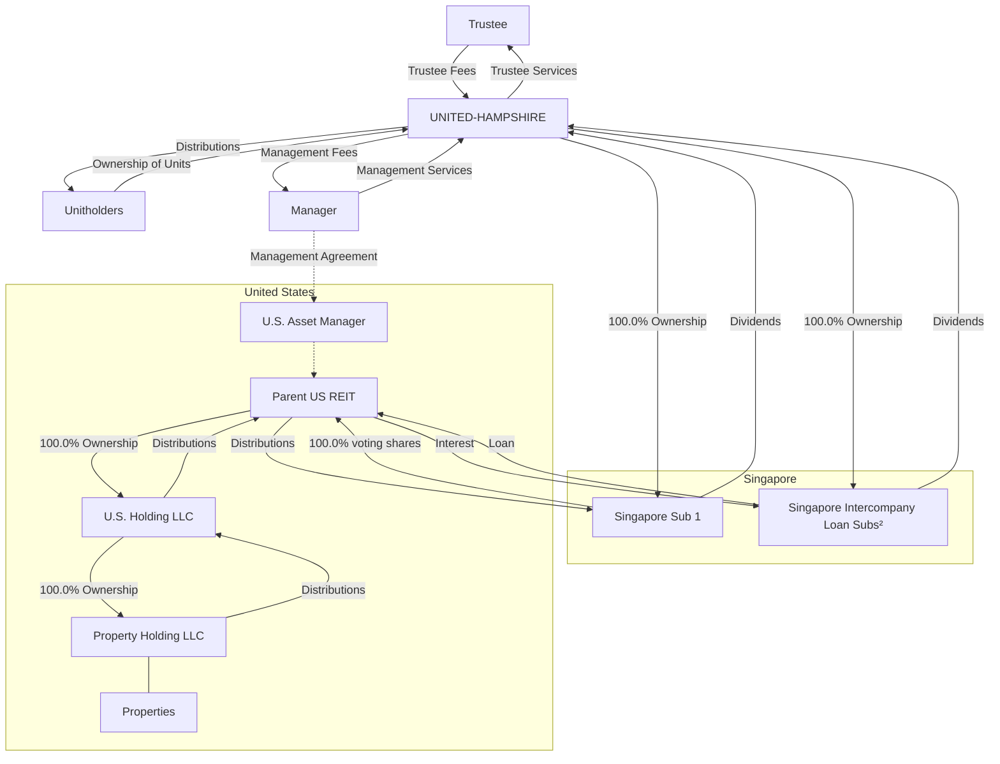
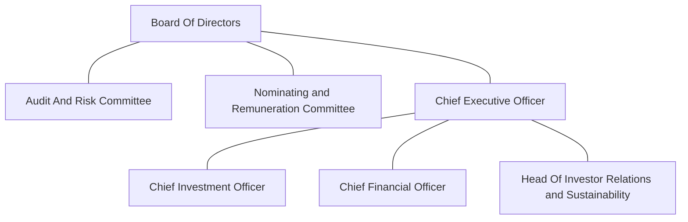
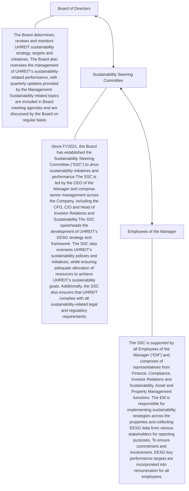
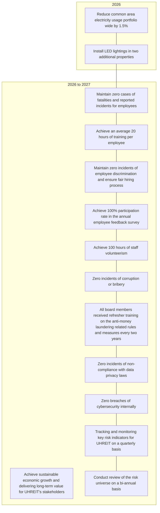
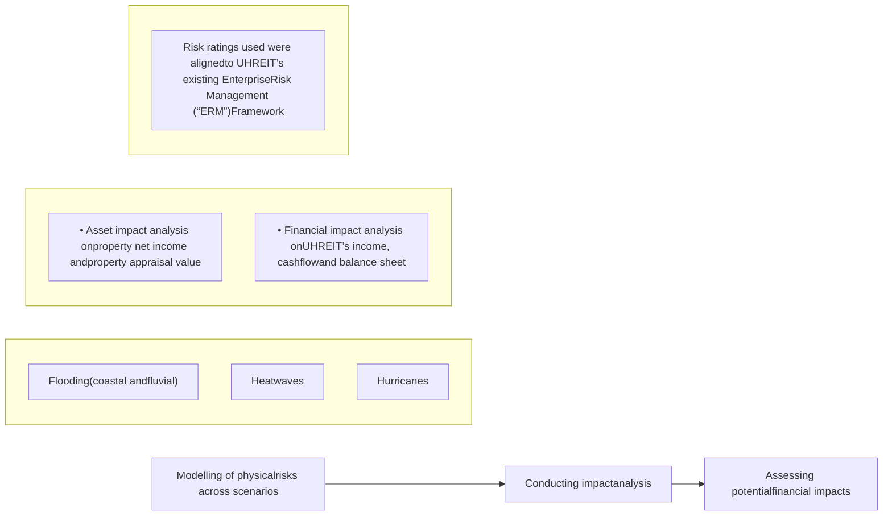

<!-- PAGE 1 -->

UNITED-HAMPSHIRE logo

ANNUAL REPORT 2025

# BUILT ON ESSENTIALS
# POSITIONED FOR
# SUSTAINED GROWTH

Collage of retail stores including Giant, Lowe's, and Burlington with people holding groceries

Publix supermarket exterior

Trader Joe's storefront with a crowd of people

Family shopping in a grocery store produce section

Aerial view of a commercial building with solar panels on the roof

**SERVING THE EVERYDAY NEEDS OF U.S. CONSUMERS**

United Hampshire US REIT

<!-- PAGE 2 -->

ShopRite storefront and parking lot

**Vision:**

To be a leading REIT, building a legacy of value creation through purpose driven investments that benefit our stakeholders, tenants, and the communities we serve

**Mission:**

To provide regular and stable distributions to our Unitholders and create lasting value for all stakeholders through investing in best-in-class real estate, while fostering thriving community centered spaces that support our tenants’ success and growth

# Contents

<table>
  <tbody>
    <tr>
        <td>01</td>
        <td>Corporate Profile</td>
        <td>33</td>
        <td>Operations Review</td>
    </tr>
    <tr>
        <td>02</td>
        <td>2025 Highlights</td>
        <td>38</td>
        <td>Property Portfolio</td>
    </tr>
    <tr>
        <td>12</td>
        <td>Message to Unitholders</td>
        <td>40</td>
        <td>Property Summary</td>
    </tr>
    <tr>
        <td>16</td>
        <td>2025 Key Events</td>
        <td>61</td>
        <td>Sustainability and Climate Report</td>
    </tr>
    <tr>
        <td>17</td>
        <td>Trust and Tax Structure</td>
        <td>107</td>
        <td>Investor Relations</td>
    </tr>
    <tr>
        <td>18</td>
        <td>Organisation Structure</td>
        <td>112</td>
        <td>Unit Price Performance</td>
    </tr>
    <tr>
        <td>18</td>
        <td>The Sponsors and The Manager</td>
        <td>113</td>
        <td>Corporate Governance</td>
    </tr>
    <tr>
        <td>19</td>
        <td>Our Presence</td>
        <td>150</td>
        <td>Financial Statements</td>
    </tr>
    <tr>
        <td>20</td>
        <td>Board of Directors</td>
        <td>211</td>
        <td>Interested Person Transactions</td>
    </tr>
    <tr>
        <td>24</td>
        <td>The Manager</td>
        <td>212</td>
        <td>Unitholding Statistics</td>
    </tr>
    <tr>
        <td>26</td>
        <td>U.S. Asset Manager</td>
        <td> </td>
        <td>Corporate Information</td>
    </tr>
    <tr>
        <td>27</td>
        <td>Financial Review and Capital Management</td>
        <td> </td>
        <td> </td>
    </tr>
  </tbody>
</table>

Close-up of fresh produce on grocery store shelves

<!-- PAGE 3 -->

# Corporate Profile

**20**
Grocery &
Necessity Properties

**2**
Self-Storage Properties

Total Appraised Value of
**US$774.3**
Million

Aggregate Net Lettable
Area of
**3.6** Million sq ft

A couple shopping for vegetables in a grocery store

Two women smiling while shopping in a grocery store

United Hampshire US REIT (“UHREIT” or the “REIT”) is a real estate investment trust listed on the Singapore Exchange Securities Trading Limited (“SGX-ST”) on 12 March 2020. It was established with the principal investment strategy of investing in a diversified portfolio of stabilised income-producing (i) grocery-anchored and necessity-based retail properties (“Grocery & Necessity”), and (ii) modern, climate-controlled self-storage facilities (“Self-Storage”), located in the United States (“U.S.”).

As at 31 December 2025, UHREIT’s portfolio comprised 20 Grocery & Necessity and two Self-Storage properties that serve the non-discretionary needs of the U.S. consumer. These properties are strategically located in the populous and affluent East Coast markets of the U.S. Cumulatively, the portfolio has a total appraised value of US$774.3 million and an aggregate Net Lettable Area (“NLA”) of 3.6 million square feet.

The majority of UHREIT’s tenants provide essential goods and services to the U.S. consumer, and comprise grocers and wholesalers, warehouse clubs, home improvement stores, discount retailers and other tenants with strong omnichannel platforms.

UHREIT is managed by United Hampshire US REIT Management Pte. Ltd. (the “Manager”). The Manager is jointly owned by UOB Global Capital LLC (“UOB Sponsor”), a subsidiary of United Overseas Bank Limited (“UOB”), and Hampshire U.S. Holdco, LLC, a subsidiary of The Hampshire Companies, LLC (“Hampshire Sponsor”). The UOB Sponsor is an originator and distributor of private equity, hedge funds, fixed income and real estate products, while the Hampshire Sponsor has over 60 years of experience in acquiring, developing, leasing, repositioning, managing and financing real estate.

<!-- PAGE 4 -->

# 2025 Highlights

Gross Revenue icon
**Gross Revenue**
**US$72.0**
Million

▼ 1.7% vs FY2024

<table>
  <thead>
    <tr>
        <th>Year</th>
        <th>Gross Revenue (US$ Million)</th>
    </tr>
  </thead>
  <tbody>
    <tr>
        <td>2021</td>
        <td>55.2</td>
    </tr>
    <tr>
        <td>2022</td>
        <td>67.5</td>
    </tr>
    <tr>
        <td>2023</td>
        <td>72.2</td>
    </tr>
    <tr>
        <td>2024</td>
        <td>73.2</td>
    </tr>
    <tr>
        <td>2025</td>
        <td>72.0</td>
    </tr>
  </tbody>
</table>

Net Property Income icon
**Net Property Income**
**US$49.0**
Million

▼ 1.7% vs FY2024

<table>
  <thead>
    <tr>
        <th>Year</th>
        <th>Net Property Income (US$ Million)</th>
    </tr>
  </thead>
  <tbody>
    <tr>
        <td>2021</td>
        <td>41.9</td>
    </tr>
    <tr>
        <td>2022</td>
        <td>47.1</td>
    </tr>
    <tr>
        <td>2023</td>
        <td>50.6</td>
    </tr>
    <tr>
        <td>2024</td>
        <td>49.8</td>
    </tr>
    <tr>
        <td>2025</td>
        <td>49.0</td>
    </tr>
  </tbody>
</table>

Appraised Value icon
**Appraised Value**
**US$774.3**
Million

▲ 3.8%1 vs FY2024

<table>
  <thead>
    <tr>
        <th>Year</th>
        <th>Appraised Value (US$ Million)</th>
    </tr>
  </thead>
  <tbody>
    <tr>
        <td>2021</td>
        <td>688.5</td>
    </tr>
    <tr>
        <td>2022</td>
        <td>738.7</td>
    </tr>
    <tr>
        <td>2023</td>
        <td>763.4</td>
    </tr>
    <tr>
        <td>2024</td>
        <td>752.9</td>
    </tr>
    <tr>
        <td>2025</td>
        <td>774.3</td>
    </tr>
  </tbody>
</table>

<!-- PAGE 5 -->

# 2025 Highlights

> Icon of a document with an upward arrow and stacks of coins
> Distributable Income
> **US$26.9**
> **Million**
> Green upward arrow 5.7% vs FY2024

> Icon of a pie chart
> Aggregate Leverage
> **38.6%**

> Icon of a calculator and a dollar sign
> Distribution Per Unit
> **4.39**
> **US Cents**
> Green upward arrow 8.1% vs FY2024

> Icon of a plant with a dollar sign growing in a pot
> Interest Coverage Ratio
> **2.4 Times**

> Icon of stacks of coins with a dollar sign
> Net Asset Value
> **US$0.73**
> **Per Unit**

> Icon of a hand holding a coin with a dollar sign
> Weighted Average Interest Rate
> **5.01%³**

> Icon of a document with a percentage sign and a coin
> Fixed-Rate Debt
> **76.2%²**

<!-- PAGE 6 -->

# Resilient Portfolio Backed by Strong Tenant Partnerships

UHREIT’s portfolio continues to demonstrate strong fundamentals, anchored by a high tenant retention rate of 90% since the date of its listing on the Singapore Exchange Securities Trading Limited (“IPO”), and a long Weighted Average Lease Expiry (“WALE”) of 7.7 years¹, underscoring the depth of our tenant relationships and the effectiveness of our proactive asset management strategy. Since IPO, our Assets Under Management (“AUM”) have grown by 32.4%. Occupancy for our Grocery & Necessity properties remains robust.

Grocery basket icon

Maintained High Grocery & Necessity Committed Occupancy Of
**97.7%**

Clipboard and basket icon

High Tenant Retention Rate of
**90%** Since IPO

Gear and document icon

Long WALE of
**7.7 years¹**

<!-- PAGE 7 -->

Photograph of a BJ's Wholesale Club storefront with the red BJ's logo on a teal tiled facade above the entrance.

<!-- PAGE 8 -->

A Giant Food & Drugstore building with a parking lot full of cars in the foreground.

<!-- PAGE 9 -->

Photograph of a shopping center parking lot with cars and a brick building

# Driving Growth Through Strategic Portfolio Management

The Manager adopts a proactive portfolio management approach to position UHREIT for sustainable future growth. This includes strategic capital recycling, targeted new developments, and asset enhancement initiatives. As part of our capital recycling strategy, UHREIT completed the DPU-accretive acquisition of Dover Marketplace in Pennsylvania during the financial year and announced the proposed development of a new 5,000 sq ft store on excess land at St. Lucie West, which has been pre-leased to Florida Blue on a 10-year lease. Subsequent to the financial year end, UHREIT also completed the DPU-accretive acquisition of Wallingford Fair Shopping Center, marking our inaugural entry into Connecticut.

Icon of a document with a dollar sign and magnifying glass

**Divested Albany-Supermarket in January 2025 at**

# 4.2% Above Purchase Price

Icon of a document with a dollar sign inside a square

**DPU-accretive Acquisition of Dover Marketplace in August 2025 at**

# 4.8% Below Valuation

Icon of a checklist with a magnifying glass

**DPU-accretive Acquisition of Wallingford Fair Shopping Center in January 2026 at**

# 8.2% Below Valuation

Icon of coins with an upward arrow and a dollar sign

**Portfolio Valuation Increased**

# 3.8%¹ From 31 December 2024

<!-- PAGE 10 -->

# Convenience Fuels Portfolio Strength

Our U.S. grocery-anchored strip centers continue to attract strong foot traffic, driven by consumer demand for convenience and accessibility. Anchored by a reliable tenant base, the portfolio remains well-positioned for sustained growth.

In FY2025, UHREIT maintained strong leasing momentum with 30 leases signed while minimal leasing risk is evident, with only 2.9%¹ of leases expiring in 2026. Grocery & Necessity tenants deliver robust sales, leveraging omnichannel strategies with in-store fulfilment continuing to drive a meaningful portion of customer orders.

Icon representing leasing risk Minimal Leasing Risks with only **2.9%¹** of Leases Expiring in 2026

Icon representing executed leases Executed 30 Leases Amounting to **422,032** sq ft

Icon representing essential services sector **58.8%¹** of Rents Generated from Tenants In The Essential Services Sector²

<!-- PAGE 11 -->

A photograph of the interior of a Food Bazaar supermarket produce section, featuring a large neon "Welcome to Food Bazaar" sign, displays of fresh fruits like apples, oranges, and strawberries, and customers browsing the aisles. Price tags for Gala Apples and Sunkist products are visible.

<!-- PAGE 12 -->

# COMPANY OF GOOD —
# CONFERMENT CEREMONY

Photograph of two men at the Company of Good Conferment Ceremony, one presenting an award to the other.

Company of Good 2025 to 2027 recognition badge by nvpc.

<!-- PAGE 13 -->

# Recognised for Governance Excellence and Community Impact

UHREIT strengthened its governance credentials in 2025, climbing two positions to secure 12th place in the Singapore Governance and Transparency Index’s (“SGTI”) REITs and Business Trust category, marking the third consecutive year of improved ranking.

The REIT was also awarded and shortlisted for several prestigious industry awards, further enhancing its visibility and reputation within the investment community. In the same year, UHREIT was honoured with the ‘Company of Good – 3 Hearts’ recognition by the National Volunteer and Philanthropy Center (“NVPC”), underscoring its commitment to supporting and engaging the communities it serves.

Trophy icon

Honored With
**‘Company of Good – 3 Hearts’**
Recognition by the NVPC in 2025

Laurel wreath icon

Included in SGX Fast Track Programme
**Since 2021**

Star trophy icon

UHREIT’s FY2024 Annual Report was
Recognised as the **Gold Winner** at the
International Hermes Creative Awards 2025
for the 3ʳᵈ Consecutive Year

Certificate icon

Awarded **Best Sell-Side Management and Certificate of Excellence in Investor Relations**
by IR Impact Awards – South East Asia 2025

<!-- PAGE 14 -->

# Message to Unitholders

Tan Tong Hai

Gerard Yuen

**Tan Tong Hai**
Chairman and Independent
Non-Executive Director

**Gerard Yuen**
Chief Executive Officer

Dear Unitholders,

On behalf of our Board of Directors (“Board”) and management, we are pleased to present UHREIT’s annual report for the financial year ended 31 December 2025 (“FY2025”).

In 2025, the global economy demonstrated resilience despite ongoing geopolitical conflicts and evolving trade dynamics. Global GDP growth was estimated to be 3.3%, supported by technology-led investment and easing financial conditions as inflation continued to moderate from prior peaks¹.

For 2026, the International Monetary Fund in its January report projected global growth of approximately 3.3%, reflecting a cautious outlook amid rising geopolitical tensions and concerns over potential market corrections linked to reassessed productivity expectations around artificial intelligence¹. However, a prolonged conflict in the Middle East could materially affect global energy prices, market sentiment, economic growth and inflation.

In the U.S., where UHREIT’s properties are located, the economy continued to demonstrate resilience. Following a robust real GDP expansion of 2.1% in 2025², the Federal Open Market Committee projects steady real GDP growth of 2.4% for 2026 and 2.3% for 2027³. Inflation moderated significantly from its peak of 9.1% in June 2022 to 2.4% in February 2026⁴. The U.S. labour market remained broadly stable in 2025, with the unemployment rate averaging approximately 4.4%⁵. While employment conditions remained supportive, there were signs of gradual cooling amid moderating economic growth. In 2025, the U.S. Federal Reserve (“Fed”) lowered the federal funds rate three times, bringing the target range to 3.5%–3.75%, its lowest level in the past three years. In aggregate, the Fed has reduced interest rates by 175 basis points since September 2024.

U.S. consumer spending patterns continue to favour essential goods, with shoppers increasingly leveraging omnichannel options. This trend reinforces the structural advantages of grocery-anchored strip centers, which benefit from proximity, convenience,

> UHREIT has achieved like-for-like portfolio valuation growth each year since its listing in 2020. In FY2025, UHREIT’s portfolio valuation increased by 3.8%⁷ compared to the previous year, marking its fifth consecutive year of growth. Overall, UHREIT’s AUM have grown by 32.4% since its listing, underscoring the effectiveness of our portfolio management strategy and the resilience of its asset class.

and daily-needs spending. On the supply side, strip center construction is expected to remain constrained, with projected supply growth of just 0.3% per annum from 2026 to 2030, the lowest among traditional retail sectors⁶. Against this backdrop, sector fundamentals remain robust, with occupancy rates sustained at approximately 95% and lease rates expected to trend higher. U.S. retailers have continued to expand their physical footprints despite near-term macroeconomic uncertainty, while UHREIT’s anchor tenants have continued to record healthy sales. UHREIT’s two Self-Storage properties located in the New York metropolitan area recorded an increase in rental rates during the year, while occupancy moderated throughout the year.

<!-- PAGE 15 -->

# Message to Unitholders

Since our listing on 12 March 2020, UHREIT’s portfolio has demonstrated resilience across multiple market cycles. The defensive and recession-resilient characteristics of our Grocery-anchored strip centers and Self-Storage properties have positioned UHREIT well to navigate challenging conditions, from the COVID-19 pandemic to the recent period of elevated inflation and interest rates, and the ongoing macroeconomic uncertainty.

UHREIT has achieved like-for-like portfolio valuation growth each year since its listing in 2020. In FY2025, UHREIT’s portfolio valuation increased by 3.8%⁷ compared to the previous year, marking its fifth consecutive year of growth, a testament to the resiliency of its asset classes.

The Manager remains committed to active portfolio management and disciplined capital recycling to drive sustainable long-term growth. Since its listing, UHREIT has completed five DPU-accretive acquisitions totalling US$201.8 million, alongside several development and asset enhancement initiatives. These investments were partially funded through a disciplined capital recycling strategy, comprising five divestments at or above appraised valuations amounting to US$115.7 million.

Overall, UHREIT’s AUM have grown by 32.4% since its listing to US$774.3 million as at 31 December 2025, underscoring the effectiveness of our portfolio management strategy and the resilience of its asset class.

## A Resilient Portfolio Positioned for Sustained Growth

UHREIT delivered strong operational and financial performance in FY2025, underpinned by a resilient and diversified portfolio across two cycle-agnostic, recession resistant asset classes. As at 31 December 2025, occupancy within the Grocery & Necessity segment remained high at 97.7%, supported by sustained leasing momentum across the portfolio. Occupancy at the Self-Storage properties stood at 88.7%, with average net rental rates trending upwards during the year.

FY2025 gross revenue and net property income (“NPI”) decreased by 1.7% year-on-year (“y-o-y”), primarily due to the absence of contributions from three divested properties, the freestanding Lowe’s and Sam’s Club properties within Hudson Valley Plaza and the Albany Supermarket, which were divested in August 2024 and January 2025, respectively (“the Divestments”). Excluding the Divestments, gross revenue and NPI would have increased by 2.3% and 4.1% y-o-y, respectively. The growth was driven by the commencement of new leases, rental escalations from existing leases as well as the contribution from Dover Marketplace, which was acquired in August 2025. Total distributable income and distribution per unit for FY2025 were US$26.9 million and 4.39 US cents respectively, 5.7% and 8.1% higher y-o-y largely due to reduced finance costs resulting from lower interest rates and lower borrowings, following partial loan repayments made using proceeds from the divestments.

Following the strong financial performance, UHREIT achieved its third consecutive period of DPU growth. UHREIT also posted strong total Unitholder returns of 18.0%⁸ in FY2025, marking three consecutive years of positive total Unitholder returns. As at 31 December 2025, UHREIT offers an attractive distribution yield of 8.5%⁹, 430 basis points above the U.S. Treasury yield¹⁰.

## Robust Performance in the Grocery & Necessity Sector

The U.S. grocery-anchored strip center market continues to benefit from favourable supply–demand dynamics, with limited new retail space under development. According to Green Street, new strip center supply is projected at just 0.3% per annum, constrained by elevated construction costs that have compressed returns for prospective developers⁶.

Against this backdrop, grocery-anchored strip centers remain highly sought after, supported by resilient consumer demand for accessibility and convenience. Physical stores continue to play a critical role in retailers’ omnichannel strategies, while UHREIT’s anchor tenants have maintained healthy sales performance.

Anchored by a strong roster of leading grocers, UHREIT’s Grocery & Necessity portfolio delivered solid performance in FY2025. During the year, UHREIT executed 30 new and renewal leases totalling 422,032 square feet, reflecting our ability to attract and retain high-quality tenants, including established national brands such as Walmart, HomeGoods, Dollar Tree, M&T Bank and CAVA.

<!-- PAGE 16 -->

# Message to Unitholders

UHREIT delivered strong operational and financial performance in FY2025, underpinned by a resilient and diversified portfolio across two cycle-agnostic, recession resistant asset classes. The REIT achieved its third consecutive period of DPU growth. UHREIT also posted strong total Unitholder returns of 18.0%8 in FY2025, marking three consecutive years of positive total Unitholder returns.

## Self-Storage Sector Continues to Demonstrate Resilience

UHREIT’s two Self-Storage properties, Carteret and Millburn Self-Storage, both located within the New York metropolitan area, experienced a normalisation in occupancy during the year. As at 31 December 2025, occupancy stood at 85.9% for Carteret and 91.2% for Millburn.

Despite the moderation in occupancy, average net rental rates continued to trend upward, reaching US$25.9 psf as compared to US$25.6 psf in FY2024, reflecting the underlying resilience of demand in the submarket.

## Proactive Portfolio and Capital Management

UHREIT adopts a proactive approach to portfolio management and capital recycling to enhance overall portfolio performance. During the financial year, UHREIT benefited from strong leasing momentum, alongside income contributions from new acquisitions and recent asset enhancement initiatives, each of which supported its financial performance.

Following the divestment of Albany Supermarket in January 2025 for US$23.8 million, which is 4.2% above its purchase price, UHREIT successfully redeployed capital into higher-yielding assets. Two yield-accretive acquisitions were completed to further strengthen portfolio diversification and income resilience, being Dover Marketplace in Pennsylvania in August 2025 which had been acquired for US$16.4 million, 4.8% below its independent valuation, and Wallingford Fair Shopping Center in January 2026, which had been acquired for US$21.4 million, 8.2% below its independent valuation.

Dover Marketplace is a freehold, grocery-anchored property in Pennsylvania leased to U.S. supermarket operator Giant, with a long WALE of 9.3 years and committed occupancy of 96.1%. Wallingford Fair is another freehold, grocery-anchored asset leased to anchor tenant ShopRite, with a committed WALE of 12.5 years and committed occupancy of 100% as at 31 December 2025. Following these acquisitions, UHREIT’s portfolio has expanded to 23 properties across nine states along the U.S. Eastern Seaboard.

In addition to acquisitions, UHREIT continues to unlock value through development initiatives. Construction is currently underway for a new 5,000 square foot store on excess land at St. Lucie West, pre-leased to Florida Blue on a 10-year lease. This follows the successful redevelopment at the same property in 2023, where a 63,000 square foot store was built for Academy Sports, securing a 15-year lease and enhancing the asset’s long-term income visibility.

UHREIT also maintains a prudent and proactive capital management strategy to ensure a well-staggered debt maturity profile. This includes early refinancing and incremental hedging of floating-rate loans. In November 2025, UHREIT successfully upsized and extended its US$250 million secured overnight financing rate (“SOFR”) term loan and revolving credit facilities to US$350 million, including a US$100 million revolving credit facility which doubled the size of the previous revolver.

As at 31 December 2025, the portfolio maintained a long WALE of 7.7 years11. The lease expiry profile remains well staggered, with only 2.9%11 and 5.9%11 of leases due for renewal in 2026 and 2027, respectively, mitigating near-term leasing risk.

Tenant retention has remained consistently strong at 90% since UHREIT’s listing, underscoring the quality of our tenant relationships and the stability of our income base. Supported by high occupancy, long WALE and limited near-term expiries, UHREIT’s portfolio is well positioned to deliver sustainable growth and resilience.

<!-- PAGE 17 -->

# Message to Unitholders

Following the refinancing, the weighted average debt maturity was extended from 1.6 years to 3.4 years, with no significant refinancing requirements until February 2028. The expanded facility also includes a US$50 million delayed-draw tranche available for up to 12 months, providing additional flexibility to fund potential acquisitions or refinance the Upland Square mortgage loan due in November 2026.

With US$74 million, or 23.8% of total borrowings, pegged to floating SOFR rates, UHREIT has also benefitted from the lower interest rate environment.

## Commitment to Sustainability, Community and Strong Corporate Governance

UHREIT remains committed to delivering sustainable growth and long-term value through a robust Economic, Environmental, Social and Governance (“EESG”) framework.

On the environmental front, we continue to enhance energy efficiency and reduce Greenhouse Gas (“GHG”) emissions. Since FY2022, electricity consumption across the portfolio has declined y-o-y, driven largely by the progressive installation of LED lighting, now implemented across 77.3% of the properties, resulting in a 6.7% reduction in energy usage.

Strong corporate governance remains a cornerstone of our strategy. In 2025, UHREIT ranked 12th out of 42 REITs and Business Trusts in the SGTI, marking our third consecutive year of improvement. We also remain in the SGX Fast Track program for our strong compliance record since 2021 and recorded no incidents of non-compliance with anti-corruption laws during the year.

Our commitment to transparency and investor engagement was recognized with multiple accolades, including Gold at the International Hermes Creative Awards 2025 for the FY2024 Annual Report, as well as awarded the Best Sell-Side Management and Certificate of Excellence in Investor Relations at the IR Impact Awards – South East Asia 2025.

UHREIT remains deeply committed to supporting the communities in which we operate, both in Singapore and the U.S. Since 2022, we have consistently exceeded our annual volunteer target of 100 hours. In 2025, our teams supported initiatives such as Operation Holiday and Grow It Green Morristown in the U.S., as well as Meals-on-Wheels, Food from the Heart and KidSTART Singapore locally. These efforts reflect our belief that meaningful community engagement is an integral part of creating long-term value. In recognition of these efforts, UHREIT was awarded the “Company of Good – 3 Hearts” by the NVPC. This represents the second highest-tier recognition, awarded to organisations that demonstrate a strong and sustained commitment to giving back and supporting the communities in which we operate.

## Looking Ahead

Looking ahead, the Manager will remain agile in responding to potential challenges from global macroeconomic shifts, evolving trade dynamics and geopolitical tensions in the Middle East. Despite these uncertainties, UHREIT remains confident in its long-term growth prospects, underpinned by resilient asset performance, strong occupancy and leasing fundamentals and a supportive interest rate environment.

The Manager will continue its proactive portfolio management and capital recycling initiatives to further strengthen income streams and balance sheet resilience. These include evaluating new asset enhancement initiatives and strategic development projects, accretive acquisitions, opportunistic divestments and other opportunities that create lasting value for UHREIT’s Unitholders.

## Acknowledgement

On behalf of UHREIT, we would like to extend our sincere gratitude to our Board for their strong stewardship, counsel and guidance. We would also like to express our appreciation to the management team and all colleagues for their commitment and hard work over the past year.

UHREIT is grateful for the enduring support of our sponsors, partners and tenants, who have played a key role in contributing to our shared success. Last but not least, we would also like to thank our Unitholders for their continued faith and trust in our strategy.

As we look forward to the future, UHREIT remains committed to strengthening and growing its portfolio to deliver stable returns and sustainable value to all stakeholders. We look forward to new opportunities, continued progress and sustained growth in the coming year.

Yours sincerely,

## Tan Tong Hai

Chairman and Independent Non-Executive Director

## Gerard Yuen

Chief Executive Officer

<!-- PAGE 18 -->

# 2025 Key Events

### February

* Announced 2H 2024 & FY2024 financial results on 19 February 2025. Gross revenue of US$73.2 million for full year ended 31 December 2024 was 1.4% higher y-o-y.

### April

* UHREIT held its second in-person Annual General Meeting on 28 April 2025, during which all proposed resolutions were successfully approved.

2025 Annual General Meeting

2025 Annual General Meeting

### May

HERMES CREATIVE AWARDS 2025 GOLD WINNER

* UHREIT’s FY2024 annual report was honoured with the Gold Award at the 2025 International Hermes Creative Awards for the 3rd consecutive year.

* Announced 1Q 2025 operational updates on 14 May 2025. Gross Revenue and NPI for 1Q 2025 were US$18.1 million and US$11.7 million, respectively, underpinned by the continued resilient performance of UHREIT’s portfolio.

* Participated in the Singapore REITs Symposium, engaging with retail investors to share insights on UHREIT’s strategy and key business developments. Held at the Suntec Convention Centre, the physical event attracted over 1,000 attendees.

### December

* Awarded Best Sell-Side Management and Certificate of Excellence In Investor Relations by IR Impact Awards – South East Asia 2025.

IR Impact Awards - South East Asia Winner: Best sell-side management

Best Sell-Side Management Award

### November

* Announced 3Q 2025 operational updates on 14 November 2025. Distributable Income for the 3Q 2025 was 15.5% higher y-o-y.

* Announced completion of Enlarged US$350 Million Loan Refinancing, which extended the maturity under such loan to 2029 and Beyond.

### August

* Announced 1H 2025 financial results on 13 August 2025. Distribution Per Unit of 2.09 US Cents for 1H 2025 was 4.0% higher y-o-y.

* Announced the DPU-accretive acquisition of Dover Marketplace, a grocery-anchored property in Pennsylvania, on 1 August 2025. The purchase consideration of approximately US$16.4 million represents an ~4.8% discount to the independent valuation of US$17.2 million.

### July

SINGAPORE COMPANY OF GOOD 2025 to 2027 nvpc

* UHREIT was awarded the Company of Good – 3 Hearts recognition by the NVPC on 17 July 2025, acknowledging our strong commitment to corporate purpose and our positive impact at the national level.

Company of Good - 3 Hearts

<!-- PAGE 19 -->

# Trust and Tax Structure

The following diagram illustrates the relationships, among others, between UHREIT, the Manager, the Trustee¹, the U.S. Asset Manager and the Unitholders as at 31 December 2025:

1 Perpetual (Asia) Limited is the trustee of UHREIT.

2 There are two wholly-owned Singapore Intercompany Loan Subsidiaries extending intercompany loans to the Parent US REIT.

<!-- PAGE 20 -->

# Organisation Structure

# The Sponsors and The Manager

## The Sponsors

The Sponsors of UHREIT are UOB Global Capital LLC and The Hampshire Companies, LLC.

## UOB Global Capital LLC (“UOB Sponsor”)

UOB Global Capital LLC is an originator and distributor of private equity, hedge funds, fixed income and real estate products, and a global asset management subsidiary of United Overseas Bank Limited (“UOB”), a leading bank in Asia. UOB Global Capital LLC was founded in 1998 with US$4.3 billion in AUM as of 31 December 2025. It operates from offices in New York and Paris, with representation at UOB’s headquarters in Singapore. In this way, the firm can conduct its activities and meet investors’ needs across the Americas, Europe, the Middle East and Asia.

## The Hampshire Companies, LLC (“Hampshire Sponsor” or “THC”)

The Hampshire Companies, LLC is a privately held, fully integrated real estate firm and real estate investment fund manager, which has over 60 years of hands-on experience in acquiring, developing, leasing, repositioning, managing, financing and disposing of real estate. It has a diversified investment platform and derives results from its broad experience in multiple commercial real estate asset classes, including industrial, retail, self-storage, office and multifamily. THC currently owns and/or operates a diversified portfolio of 164 properties across the U.S. totalling approximately 13.6 million square feet. THC has an AUM of approximately US$2.9 billion. THC is also the asset manager of UHREIT bringing its total regulatory and non-regulatory AUM to US$3.7 billion.

Since 2008, UOB Global Capital LLC and The Hampshire Companies, LLC have jointly formed three funds with combined AUM of approximately US$1.3 billion to focus on investment opportunities in income producing real estate assets in the U.S.

## The Manager

United Hampshire US REIT Management Pte. Ltd. is the Manager of UHREIT. The Manager is jointly owned by the UOB Sponsor and Hampshire U.S. Holdco, LLC, a subsidiary of the Hampshire Sponsor. The Manager is able to harness synergies and draw competencies from the two best-in-class management platforms of its Sponsors.

<!-- PAGE 21 -->

# Our Presence

## 22 Properties

Grocery & Necessity Properties icon

**20**
Grocery & Necessity Properties

Self-Storage Properties icon

**2**
Self-Storage Properties

Map of the Eastern United States highlighting property locations

### New York

**Grocery & Necessity**
**Properties: 6**
Total NLA (sq ft): 827,809
% of Total Appraised Value: 19.6%

### Pennsylvania

**Grocery & Necessity**
**Properties: 3**
Total NLA (sq ft): 719,363
% of Total Appraised Value: 21.6%

### Maryland

**Grocery & Necessity**
**Properties: 2**
Total NLA (sq ft): 543,680
% of Total Appraised Value: 10.2%

### Massachusetts

**Grocery & Necessity**
**Properties: 2**
Total NLA (sq ft): 165,445
% of Total Appraised Value: 7.0%

### New Jersey

**Grocery & Necessity**
**Properties: 4**
Total NLA (sq ft): 421,411
% of Total Appraised Value: 12.4%

**Self-Storage**
**Properties: 2**
Total NLA (sq ft): 154,989
% of Total Appraised Value: 7.1%

### Florida

**Grocery & Necessity**
**Property: 1**
Total NLA (sq ft): 386,846
% of Total Appraised Value: 13.8%

### Virginia

**Grocery & Necessity**
**Property: 1**
Total NLA (sq ft): 168,498
% of Total Appraised Value: 3.7%

### North Carolina

**Grocery & Necessity**
**Property: 1**
Total NLA (sq ft): 182,761
% of Total Appraised Value: 4.6%

<!-- PAGE 22 -->

# Board of Directors

Tan Tong Hai

**Tan Tong Hai**
Chairman and Independent Non-Executive Director

James Ernest Edwin Hanson II

**James Ernest Edwin Hanson II**
Non-Independent Non-Executive Director

David Tuvia Goss

**David Tuvia Goss**
Non-Independent Non-Executive Director

Wee Teng Wen

**Wee Teng Wen**
Non-Independent Non-Executive Director

Chua Teck Huat Bill

**Chua Teck Huat Bill**
Independent Non-Executive Director

JAELLE ANG KER TJIA

**JAELLE ANG KER TJIA**
Independent Non-Executive Director

<!-- PAGE 23 -->

# Board of Directors

**Tan Tong Hai, 62**

Chairman and Independent Non-Executive Director

## Date of first appointment as a director

21 February 2020

## Date of first appointment as a chairman (for Chairman only)

21 February 2020

## Length of service as a director (as at 31 December 2025)

5 years 10 months

## Board committees served on

- Chairman of the Nominating and Remuneration Committee

- Member of the Audit and Risk Committee

## Present directorships in other listed companies

- Taiwan Mobile Co. Ltd

- Metis Energy Limited

## Present principal commitments

- Manhattan Property Development Pte. Ltd. (Director)

## Past directorships or principal commitments held over the Preceding three years (1 January 2023 to 31 December 2025)

- Super Sea Cable Networks Pte. Ltd. (Director)

- Seax Global Pte. Ltd. (Director)

- Nanyang Polytechnic (Chairman of Board of Governors)

## Background and working experience

Mr. Tan holds directorships in Manhattan Property Development Pte. Ltd., Metis Energy Limited and Taiwan Mobile Co. Ltd. In the public sector, he served as the Chairman of Nanyang Polytechnic.

Mr. Tan has extensive experience in the Telecom, Media and Technology sector. He held positions as President and Chief Executive Officer in StarHub Ltd. (2013 to 2018), and also in Singapore Computer Systems Ltd (2005 to 2008) and NASDAQ listed Pacific Internet Ltd (2001 to 2005).

In 2015, Mr. Tan was conferred the prestigious IT Leader of the Year Award by Singapore Computer Society.

In 2020, Mr. Tan was awarded a Public Service Medal (PBM) for his contribution to education in Singapore.

In 2024, Mr. Tan was awarded a Public Service Star Medal (BBM) for his contribution to education in Singapore.

## Academic and professional qualifications

Bachelor of Electrical Engineering (Hons), National University of Singapore

## Awards

The Public Service Medal (PBM), 2020

The Public Service Star Medal (BBM), 2024

**James Ernest Edwin Hanson II, 67**

Non-Independent Non-Executive Director

## Date of first appointment as a director

24 May 2019

## Length of service as a director (as at 31 December 2025)

6 years and 7 months

## Board committees served on

- Member of the Nominating and Remuneration Committee

## Present directorships in other listed companies

- Provident Financial Service, Inc. (Director)

## Present principal commitments

- United Hampshire US Parent REIT, Inc. (Director)

- Anderson Fund VII, LLC (Director)

- Owl Creek Capital Corp. (Director)

- The Hampshire Companies, LLC (President and CEO)

- Hampshire Partners REIT VIII, Inc (Director)

- The Hampshire Fund II, LLC (Director)

- Hampshire Fund II, LLC (Director)

- JDJ Bellas Burgers LLC (Director)

- JDJ Bernards Inn, LLC (Director)

- JDJ Bistro, LLC (Director)

- Sonehan, LLC (Director)

- Hanson Family Investments LLC (Director)

- Hampshire Destination Properties LLC (Director)

- Concorde Associates (Director)

- DeHart Avenue Associates LP (Director)

- DeHart GP LLC (Director)

- Hampshire Air, LLC (Director)

- Palisades Interstate Park Commission (Commissioner & President)

- Ledgewood Properties Inc. Profit Sharing Plan & Trust (Trustee)

## Past directorships or principal commitments held over the Preceding three years (1 January 2023 to 31 December 2025)

- CIMCO Fourteen LLC (Director)

- FIMCO LLC (Director)

- Hampshire Destination Properties LLC (Director)

- Lakeland Bancorp, Inc. (Director)

- JDJ Investment Associates (Director)

- Lakeland Bank, Inc. (Director)

- NJ Division of Investments, State Investment Council (Council Member)

## Background and working experience

Mr. Hanson is the President and Chief Executive Officer of The Hampshire Companies, LLC, a vertically integrated real estate development and operating platform. As at 31 December 2025, The Hampshire Companies, LLC owns and operates a diversified portfolio of properties across the U.S. with an AUM in excess of US$2.9 billion. The Hampshire Companies, LLC is also the asset manager of UHREIT bringing its total regulatory and non-regulatory AUM to US$3.7 billion. Mr. Hanson oversees the operation and investment activities of The Hampshire Companies and its Funds and has over 35 years of real estate investment management and operational experience. Prior to this, he was the President of The Hampshire Companies, LLC from September 2001 to December 2003.

## Academic and professional qualifications

- Bachelor of Arts, Hope College

- Juris Doctor Degree, Vermont Law School

<!-- PAGE 24 -->

# Board of Directors

**David Tuvia Goss, 78**

Non-Independent Non-Executive Director

**Date of first appointment as a director**

6 June 2019

**Length of service as a director (as at 31 December 2025)**

6 years and 6 months

**Board committees served on**

Member of the Nominating and Remuneration Committee

**Present directorships in other listed companies**

Nil

**Present principal commitments**

- United Hampshire US Parent REIT, Inc. (Director)

- UOB Capital Partners LLC (Director)

- UOB Global Capital Private Limited (Director)

- UOB Global Capital LLC (Director)

- ACIF GP Ltd. (Director)

- UOB Global Equity Sales LLC (Manager)

- Teamco Management Company LLC (Manager)

- UOB/HGF Real Estate Partners LLC (Manager)

- UOB Eagle Rock GP LLC (Manager)

- HUH Real Estate Partners, LLC (Manager)

- HUH Real Estate Partners II, LLC (Manager)

- United Hampshire US Holdings LLC (Manager)

- United Franchise Investors GP, LLC (Director)

**Past directorships or principal commitments held over the preceding three years (1 January 2023 to 31 December 2025)**

- UOB Global Capital (Dublin) Ltd. (Director)

- UOB Portfolio Advisors Pan Asia Select Fund GP, Ltd. (Director)

- Asia Select Management Ltd. (Director)

**Background and working experience**

Mr. Goss is the Managing Director of UOB Global Capital LLC since September 1998. Prior to co-founding UOB Global Capital LLC in 1998, Mr. Goss was President and CEO of AIG Asset Management Services (“AIG”) in New York from March 1995, with global responsibility for AIG’s third-party asset management activities.

Before joining AIG, he was Global Marketing Director for Equitilink, an Australian independent asset management company, from September 1986. Prior to joining Equitilink, he was an executive with overall management responsibilities at Bingo Cash and Carry, a wholesale distributor, from April 1982. Before Bingo Cash and Carry, he was a sales and marketing executive at Reinhold Brothers, a diamond dealer, from March 1978. Prior to Reinhold Brothers, he was a Partner at the law firm Harry Goss Attorneys from December 1972.

**Academic and professional qualifications**

Bachelor of Arts in Law and Economics and a Bachelor of Laws, University of Witwatersrand Johannesburg

**Wee Teng Wen, 45**

Non-Independent Non-Executive Director

**Date of first appointment as a director**

21 February 2020

**Length of service as a director (as at 31 December 2025)**

5 years 10 months

**Board committees served on**

Nil

**Present directorships in other listed companies**

Nil

**Present principal commitments**

- The Lo and Behold Group Pte. Ltd. (Director)

- Over Easy Pte. Ltd. (Director)

- Tanjong Beach Club Pte. Ltd. (Director)

- For the Love of Laundry Pte. Ltd. (Director)

- TWTC Pte. Ltd. (Director)

- MS15 Pte. Ltd. (Director)

- Lo and Behold Hotels Pte. Ltd. (Director)

- BTV Group Pte. Ltd. (Director)

- The Coconut Club Pte. Ltd. (Director)

- Odette Restaurant Pte. Ltd. (Director)

- Esora Pte. Ltd. (Director)

- Horse Devours Pte. Ltd. (Director)

- Akronym Pte. Ltd. (Director)

- Behold Julien Pte. Ltd. (Director)

- Grain Holdings Pte. Ltd. (Director)

- Claudine Pte. Ltd. (Director)

- Clink Clink Pte. Ltd. (Director)

- Lo and Behold Properties Pte. Ltd. (Director)

- Somma Restaurant Pte. Ltd. (Director)

- Fico Restaurant Pte. Ltd. (Director)

- Re:Growth Pte. Ltd. (Director)

- New Bahru Pte. Ltd. (Director)

- Wee Investments (Pte) Limited (Alternate Director)

- C.Y. Wee & Company Private Limited (Alternate Director)

- Wee Foundation (Alternate Director)

- CYW Portfolio Private Limited (Alternate Director)

- Wee Portfolio Private Limited (Alternate Director)

- Wee (MGT) Private Limited (Alternate Director)

- Behold Mirko Pte. Ltd. (Director)

- Dabao SPV Pte. Ltd. (Director)

- Future Resonance Pte. Ltd. (Director)

**Past directorships or principal commitments held over the preceding three years (1 January 2023 to 31 December 2025)**

- The White Rabbit Pte. Ltd. (company has been struck off) (Director)

- Extra Virgin Pizza Pte. Ltd. (company has been struck off) (Director)

- Loof Pte. Ltd. (company has been struck off) (Director)

- Cecil Street Pte. Ltd. (company has been struck off) (Director)

**Background and working experience**

Mr. Wee is the Managing Partner of The Lo & Behold Group, a Singapore-based hospitality group behind timeless, thought-provoking concepts like Odette, Tanjong Beach Club and New Bahru. Before founding the Group, he was a management consultant at Monitor Group in Boston. He graduated with honours from the University of Pennsylvania and is a member of the Young Presidents’ Organisation.

**Academic and professional qualifications**

Bachelor of Science in Economics, University of Pennsylvania, U.S.A.

**Awards**

Outstanding Tourism Entrepreneur (Singapore Tourism Board)

<!-- PAGE 25 -->

# Board of Directors

## Chua Teck Huat Bill, 72

Independent Non-Executive Director

**Date of first appointment as a director**

21 February 2020

**Length of service as a director**

(as at 31 December 2025)

5 years 10 months

**Board committees served on**

- Chairman of the Audit and Risk Committee

- Member of the Nominating and Remuneration Committee

**Present directorships in other listed companies**

Nil

**Present principal commitments**

- Swan & Maclaren Group Pte. Ltd. (Director)

- Newcastle Australia Institute of Higher Education Pte. Ltd. (Director)

- Citibank Singapore Limited (Director)

- Viva Foundation for Children with Cancer (Director)

**Past directorships or principal commitments held over the preceding three years (1 January 2023 to 31 December 2025)**

- Sunseap Group Pte. Ltd. (Director)

- Green Sands Equity Inc. (Director)

- Amara Holdings Limited (Director)

**Background and working experience**

Mr. Chua is currently an Independent Director of Citibank Singapore Limited. He has served on other boards in the last 25 years, such as Amara Holdings Limited, the Defence Science and Technology Agency, DSO National Laboratories, CLS AG, the holding company of CLS Bank & CLS Services Ltd, Jurong International, a subsidiary of JTC Corporation, and Singapore Technologies Electronics Ltd and Singapore Technologies Kinetics Limited, both subsidiaries of Singapore Technologies Engineering Ltd.

Mr. Chua has extensive financial services experience, having worked at United Overseas Banking Group (“UOB”), Overseas Union Banking Group and Citibank NA from 1980 to 2014. He was the Managing Director and Head of Global Financial Institutions Group at UOB when he retired in 2014. He has had other senior management responsibilities at these banks ranging from Coverage, Structuring, Distribution, Risk Management and Operations in Institutional, Wholesale and Retail Banking.

**Academic and professional qualifications**

Bachelor of Arts and Bachelor of Engineering (Hons), University of Newcastle, Australia

**Awards**

- The Public Service Star, 2012

- The Public Service Medal, 2004

## Jaelle Ang Ker Tjia, 45

Independent Non-Executive Director

**Date of first appointment as a director**

21 February 2020

**Length of service as a director**

(as at 31 December 2025)

5 years 10 months

**Board committees served on**

- Member of the Audit and Risk Committee

- Member of the Nominating and Remuneration Committee

**Present directorships in other listed companies**

Nil

**Present principal commitments**

- Indigo Paradigm 13 Pte. Ltd. (Director)

- Sky Pacific Pte. Ltd. (Director)

- Singapore Land Authority (Director)

- Lifelong Learning Singapore Pte. Ltd. (Director)

- The Possible Capital Pte. Ltd. (Director)

**Past directorships or principal commitments held over the preceding three years (1 January 2023 to 31 December 2025)**

- The Great Room (Hong Kong) Limited (Director)

- The Great Room CJC Limited

- The Great Room (Australia) Pty Ltd

- The Great Room CR Pty Ltd

- Bare Bear Pte. Ltd. (company has been struck off) (Director)

- The George Offices Pte. Ltd. (Director)

- The Great Room Pte. Ltd. (Director and Chief Executive Officer)

- The Great Room CT Pte. Ltd. (Director)

- The Great Room RH Pte. Ltd. (Director)

- The Great Room NA Pte. Ltd. (Director)

- The Great Room AAIM Pte. Ltd. (Director)

- The Great Room SB Pte. Ltd. (Director)

- The Great Room PLQ Pte. Ltd. (Director)

- The Great Room ST Pte. Ltd. (Director)

- The Great Room SP Pte. Ltd. (Director)

**Background and working experience**

Ms. Ang had been a Co-Founder and CEO of The Great Room, a coworking space inspired by hospitality since January 2016.

From October 2009 to January 2016, Ms. Ang was the Head of Development of Country Group Development PCL. From February to August 2009, Ms. Ang was with Credit Suisse as the Assistant Vice President of Business Development, prior to which, Ms. Ang was with Citi Private Bank as an Associate of Strategy, Mergers and Acquisition (International) from June 2006 to February 2009.

**Academic and professional qualifications**

- Bachelor of Architecture, University College London

- Master of Business Administration, Imperial College London

<!-- PAGE 26 -->

# The Manager

Gerard Yuen Wei Yi

**Gerard Yuen Wei Yi**
Chief Executive Officer

Derek Gardella

**Derek Gardella**
Chief Investment Officer

Mr. Yuen was appointed as the Chief Executive Officer (the “CEO”) of the Manager on 1 May 2023. Prior to this, Mr. Yuen was the Chief Financial Officer of the Manager and played a pivotal role in the successful listing of UHREIT on the SGX-ST on 12 March 2020.

Mr. Gardella is the Chief Investment Officer (the “CIO”) and was deeply involved in UHREIT’s IPO. He works closely with the CEO and other members of the management team on corporate strategy and planning initiatives in addition to overseeing the strategic execution of the portfolio management, acquisitions and asset management activities of UHREIT.

As the CEO, Mr. Yuen works with the Board to determine the strategy for UHREIT. He is also responsible for the overall day-to-day management and operations, as well as working closely with the investment, asset management, financial, investor relations and compliance personnel to meet the strategic, investment and operational objectives of UHREIT.

Mr. Gardella has more than 20 years of real estate experience. He joined The Hampshire Companies in 2011 and has held a diverse range of positions over the last 14 years. Mr. Gardella was a Portfolio Manager for Core-Plus and Value-Add Closed-End Institutional Real Estate Funds, and also previously served as a Director of Acquisitions and Financing where he managed a team in structuring and negotiating acquisitions and financings for a variety of property types. Prior to joining The Hampshire Companies, he spent the majority of his career with JPMorgan where he held a variety of roles in the Investment Management and Investment Banking divisions.

Mr. Yuen has more than 20 years of experience in investment banking, finance and the public sector. Prior to joining the Manager, Mr. Yuen was a Managing Director with Nomura Singapore Limited. Before that, he was with Deutsche Bank AG, Singapore Branch where he held a variety of positions within the Global Banking and Global Markets Division. Mr. Yuen started his career with the Ministry of Finance, Singapore.

Mr. Gardella holds a Bachelor of Science Degree from Fairfield University with a Dual Major in Finance and Information Systems, as well as a Master of Science Degree in Real Estate from New York University. He is a member of the International Council of Shopping Centers. Mr. Gardella is also a member of the adjunct faculty at New York University and Fordham University where he teaches courses focused on real estate.

Mr. Yuen graduated with First Class Honours, Bachelor of Arts, Philosophy, Politics and Economics from St Edmund Hall, University of Oxford, and a Master of Science, Economics for Development from St Edmund Hall, University of Oxford.

<!-- PAGE 27 -->

# The Manager

Yap Soh Cheng portrait

**Yap Soh Cheng**
Chief Financial Officer

Ms. Yap was appointed as the Chief Financial Officer (the “CFO”) of the Manager on 1 May 2023. Before her current appointment, Ms. Yap was the Finance Director of the Manager and played a pivotal role in the successful listing of UHREIT on the SGX-ST on 12 March 2020.

As the CFO, Ms. Yap provides support to the CEO in the execution of UHREIT’s overall growth strategies, as well as oversight of the finance function. She is responsible for the formulation and execution of UHREIT’s financial strategies, capital management, financial risk management, treasury, tax and financial reporting.

Ms. Yap also develops and maintains appropriate policies, procedures and processes for finance and other operational areas to ensure appropriate internal controls are in place.

Ms. Yap has more than 20 years of experience in a wide spectrum of financial and accounting functions, including financial strategic planning, corporate finance, treasury, group consolidation, management and financial reporting, budgeting and compliance matters, as well as auditing function. Prior to joining the Manager, she was the Financial Controller of CashShield Pte Ltd and Leader Energy Pte Ltd, and was a Finance Director with Heptagon Micro Optics Pte Ltd. Early in her career, Ms. Yap was an external auditor with PricewaterhouseCoopers LLP and Ernst & Young LLP.

Ms. Yap graduated with a professional qualification with ACCA. She is a Chartered Accountant (Singapore) and member of the Institute of Singapore Chartered Accountants and affiliate member of the Association of Chartered Certified Accountants.

Wong Siew Lu portrait

**Wong Siew Lu, CFA, CA (Singapore)**
Head of Investor Relations and Sustainability

Ms. Wong is responsible for managing the Investor Relations, Communications and Sustainability functions of UHREIT. As the key liaison between UHREIT and the investment community, Ms. Wong nurtures relationships with institutional and retail investors, research analysts and the media, as well as facilitates two-way communication with the investment community. In addition, she works with the management team to develop and implement UHREIT’s sustainability strategy.

She brings over 15 years of extensive international experience in investor relations, capital markets (buy-side), corporate banking, and has been actively involved in capital raising, M&A transactions, corporate strategy and business development.

Ms. Wong has extensive international exposure to various industries and roles, having worked and lived in 6 countries over the course of her career. Prior to joining the Manager, she was the Head of Investor Relations and Capital Markets in Sasseur REIT. At Sasseur REIT, she was instrumental in profiling the REIT to be the top 5 performing SREIT in 2019.

Early in her career, Ms. Wong held corporate banking positions at National Australia Bank as well as investment analyst positions at asset management firms, before heading the investor relations role at SGX Mainboard-listed oil and gas company, Falcon Energy Group Limited.

<!-- PAGE 28 -->

# U.S. Asset Manager

Timothy Soulas

**Timothy Soulas**
Portfolio Manager and
Head of Asset Management

Mr. Soulas is the Portfolio Manager and Head of Asset Management for The Hampshire companies in its role as U.S. Asset Manager for UHREIT. He is responsible for oversight of the asset management, leasing, and property management teams and execution of the annual business plan.

Mr. Soulas has over 13 years of experience in the real estate industry. Prior to joining The Hampshire Companies, Mr. Soulas was Vice President of Asset Management for Advance Realty, focused on a portfolio of retail, industrial and office assets. He holds a Bachelor of Business Administration degree in Finance and Real Estate from Villanova University.

Daniel Casey

**Daniel Casey**
Transaction Manager
Acquisitions, Financings,
Dispositions

Mr. Casey is the Transaction Manager of The Hampshire Companies and his responsibilities include sourcing for acquisition opportunities, underwriting, due diligence and managing the valuation process. He is also involved in developing the property and portfolio-level analytical tools.

Mr. Casey joined The Hampshire Companies in 2017 and completed the three-year Analyst Program. In his prior role at The Hampshire Companies, Mr. Casey was responsible for the fund modeling for Core-Plus Real Estate Funds and underwriting for retail, industrial and self-storage properties.

Mr. Casey has more than eight years of experience in the real estate industry and holds a Bachelor of Science Degree in Business Management from Babson College.

Lesli Skirbe

**Lesli Skirbe**
Operations Associate

Ms. Skirbe is the Operations Associate of The Hampshire Companies. She is responsible for overseeing the day-to-day administrative and operational functions which include the handling of leases, calendar management and document maintenance. She also assists with transactions, sustainability efforts and oversees special projects while supporting the Chief Investment Officer and the management team of the Manager.

Ms. Skirbe has more than 12 years of real estate and administrative experience. Prior to her current role, she was a Fund Administrator of The Hampshire Companies and prior to that, she was a Mortgage Account Executive responsible for generating monthly mortgage sales and overseeing the loan process. Ms. Skirbe graduated from Berkeley College of Business.

<!-- PAGE 29 -->

# Financial Review and Capital Management

**UHREIT Achieves 8.1% Year-On-Year DPU Growth and an Increase in Portfolio Valuation**

Person using a calculator and reviewing financial charts and documents on a desk

## Overall Review

UHREIT delivered a resilient set of results for FY2025, contributed by the stable portfolio occupancy, positive new rent commencement and rent escalation from existing leases as well as disciplined cost management supported growth in the distributable income, while proactive capital management strengthened the balance sheet.

The improvement reflects continued leasing momentum and stable tenant demand within the portfolio.

Same-store gross revenue for FY2025 increased year-on-year, driven mainly by:

* New rent commencement and rent escalation from existing leases

* Contribution from previously acquired assets.

Overall, distributable income for FY2025 remained resilient, increased by 5.7% y-o-y. 2H2025 Distribution Per Unit (“DPU”) of 2.30 US cents, was 10.0% higher than the DPU for 1H2025. For FY2025, UHREIT’s total distribution was 4.39 US cents, 8.1% higher than the total distribution of FY2024. Based on the closing price of US$0.515 per unit on 31 December 2025, UHREIT’s distribution yield for FY2025 was 8.5%.

<!-- PAGE 30 -->

<table>
  <thead>
    <tr>
      <th>28 UNITED HAMPSHIRE US REIT</th>
      <th></th>
      <th></th>
      <th></th>
    </tr>
  </thead>
  <tbody>
    <tr>
      <td>Financial Review and</td>
      <td></td>
      <td></td>
      <td></td>
    </tr>
    <tr>
      <td>Capital Management</td>
      <td></td>
      <td></td>
      <td></td>
    </tr>
    <tr>
      <td>FY2025 FY2024 +/(-)</td>
      <td></td>
      <td></td>
      <td></td>
    </tr>
    <tr>
      <td>US$’000 US$’000</td>
      <td></td>
      <td></td>
      <td></td>
    </tr>
    <tr>
      <td>CONSOLIDATED STATEMENT OF COMPREHENSIVE INCOME</td>
      <td></td>
      <td></td>
      <td></td>
    </tr>
    <tr>
      <td>Gross revenue</td>
      <td>71,978</td>
      <td>73,218</td>
      <td>(1.7)</td>
    </tr>
    <tr>
      <td>Property expenses</td>
      <td>(23,027)</td>
      <td>(23,406)</td>
      <td>(1.6)</td>
    </tr>
    <tr>
      <td>Net property income</td>
      <td>48,951</td>
      <td>49,812</td>
      <td>(1.7)</td>
    </tr>
    <tr>
      <td>Manager’s base fee</td>
      <td>(2,993)</td>
      <td>(2,832)</td>
      <td>5.7</td>
    </tr>
    <tr>
      <td>Manager’s performance fee - N.M.</td>
      <td>(493)</td>
      <td></td>
      <td></td>
    </tr>
    <tr>
      <td>Trustee’s fee</td>
      <td>(98)</td>
      <td>(156)</td>
      <td>(37.2)</td>
    </tr>
    <tr>
      <td>Other trust expenses</td>
      <td>(2,029)</td>
      <td>(2,147)</td>
      <td>(5.5)</td>
    </tr>
    <tr>
      <td>Finance costs</td>
      <td>(18,543)</td>
      <td>(18,880)</td>
      <td>(1.8)</td>
    </tr>
    <tr>
      <td>Finance income N.M.</td>
      <td>554</td>
      <td>115</td>
      <td></td>
    </tr>
    <tr>
      <td>divestment of investment properties</td>
      <td>25,349</td>
      <td>25,912</td>
      <td>(2.2)</td>
    </tr>
    <tr>
      <td>(Loss)/gain on divestment of investment properties N.M.</td>
      <td>(684)</td>
      <td>2,156</td>
      <td></td>
    </tr>
    <tr>
      <td>held for divestment</td>
      <td>1,811</td>
      <td>7,450</td>
      <td>(75.7)</td>
    </tr>
    <tr>
      <td>Fair value change on financial derivatives N.M.</td>
      <td>(1,357)</td>
      <td>(136)</td>
      <td></td>
    </tr>
    <tr>
      <td>Net income before tax</td>
      <td>25,119</td>
      <td>35,382</td>
      <td>(29.0)</td>
    </tr>
    <tr>
      <td>Income tax expense</td>
      <td>(4,261)</td>
      <td>(5,265)</td>
      <td>(19.1)</td>
    </tr>
    <tr>
      <td>Net income after tax</td>
      <td>20,858</td>
      <td>30,117</td>
      <td>(30.7)</td>
    </tr>
    <tr>
      <td>Net income after tax attributable to:</td>
      <td></td>
      <td></td>
      <td></td>
    </tr>
    <tr>
      <td>Unitholders</td>
      <td>20,651</td>
      <td>29,907</td>
      <td>(30.9)</td>
    </tr>
    <tr>
      <td>Non-controlling interests</td>
      <td>207</td>
      <td>210</td>
      <td>(1.4)</td>
    </tr>
    <tr>
      <td>Net income for the year</td>
      <td>20,858</td>
      <td>30,117</td>
      <td>(30.7)</td>
    </tr>
    <tr>
      <td>DISTRIBUTION STATEMENT</td>
      <td></td>
      <td></td>
      <td></td>
    </tr>
    <tr>
      <td>Net income after tax attributable to Unitholders</td>
      <td>20,651</td>
      <td>29,907</td>
      <td>(30.9)</td>
    </tr>
    <tr>
      <td>Distribution adjustments</td>
      <td>6,281</td>
      <td>(4,421)</td>
      <td>(242.1)</td>
    </tr>
    <tr>
      <td>Net income available for distribution to Unitholders</td>
      <td>26,932</td>
      <td>25,486</td>
      <td>5.7</td>
    </tr>
    <tr>
      <td>DPU (US cents)</td>
      <td>4.39</td>
      <td>4.06</td>
      <td>8.1</td>
    </tr>
    <tr>
      <td>N.M. Not Meaningful</td>
      <td></td>
      <td></td>
      <td></td>
    </tr>
  </tbody>
</table>

<table>
  <thead>
    <tr>
      <th>28 UNITED HAMPSHIRE US REIT</th>
      <th></th>
      <th></th>
      <th></th>
    </tr>
  </thead>
  <tbody>
    <tr>
      <td>Financial Review and</td>
      <td></td>
      <td></td>
      <td></td>
    </tr>
    <tr>
      <td>Capital Management</td>
      <td></td>
      <td></td>
      <td></td>
    </tr>
    <tr>
      <td>FY2025 FY2024 +/(-)</td>
      <td></td>
      <td></td>
      <td></td>
    </tr>
    <tr>
      <td>US$’000 US$’000</td>
      <td></td>
      <td></td>
      <td></td>
    </tr>
    <tr>
      <td>CONSOLIDATED STATEMENT OF COMPREHENSIVE INCOME</td>
      <td></td>
      <td></td>
      <td></td>
    </tr>
    <tr>
      <td>Gross revenue</td>
      <td>71,978</td>
      <td>73,218</td>
      <td>(1.7)</td>
    </tr>
    <tr>
      <td>Property expenses</td>
      <td>(23,027)</td>
      <td>(23,406)</td>
      <td>(1.6)</td>
    </tr>
    <tr>
      <td>Net property income</td>
      <td>48,951</td>
      <td>49,812</td>
      <td>(1.7)</td>
    </tr>
    <tr>
      <td>Manager’s base fee</td>
      <td>(2,993)</td>
      <td>(2,832)</td>
      <td>5.7</td>
    </tr>
    <tr>
      <td>Manager’s performance fee - N.M.</td>
      <td>(493)</td>
      <td></td>
      <td></td>
    </tr>
    <tr>
      <td>Trustee’s fee</td>
      <td>(98)</td>
      <td>(156)</td>
      <td>(37.2)</td>
    </tr>
    <tr>
      <td>Other trust expenses</td>
      <td>(2,029)</td>
      <td>(2,147)</td>
      <td>(5.5)</td>
    </tr>
    <tr>
      <td>Finance costs</td>
      <td>(18,543)</td>
      <td>(18,880)</td>
      <td>(1.8)</td>
    </tr>
    <tr>
      <td>Finance income N.M.</td>
      <td>554</td>
      <td>115</td>
      <td></td>
    </tr>
    <tr>
      <td>divestment of investment properties</td>
      <td>25,349</td>
      <td>25,912</td>
      <td>(2.2)</td>
    </tr>
    <tr>
      <td>(Loss)/gain on divestment of investment properties N.M.</td>
      <td>(684)</td>
      <td>2,156</td>
      <td></td>
    </tr>
    <tr>
      <td>held for divestment</td>
      <td>1,811</td>
      <td>7,450</td>
      <td>(75.7)</td>
    </tr>
    <tr>
      <td>Fair value change on financial derivatives N.M.</td>
      <td>(1,357)</td>
      <td>(136)</td>
      <td></td>
    </tr>
    <tr>
      <td>Net income before tax</td>
      <td>25,119</td>
      <td>35,382</td>
      <td>(29.0)</td>
    </tr>
    <tr>
      <td>Income tax expense</td>
      <td>(4,261)</td>
      <td>(5,265)</td>
      <td>(19.1)</td>
    </tr>
    <tr>
      <td>Net income after tax</td>
      <td>20,858</td>
      <td>30,117</td>
      <td>(30.7)</td>
    </tr>
    <tr>
      <td>Net income after tax attributable to:</td>
      <td></td>
      <td></td>
      <td></td>
    </tr>
    <tr>
      <td>Unitholders</td>
      <td>20,651</td>
      <td>29,907</td>
      <td>(30.9)</td>
    </tr>
    <tr>
      <td>Non-controlling interests</td>
      <td>207</td>
      <td>210</td>
      <td>(1.4)</td>
    </tr>
    <tr>
      <td>Net income for the year</td>
      <td>20,858</td>
      <td>30,117</td>
      <td>(30.7)</td>
    </tr>
    <tr>
      <td>DISTRIBUTION STATEMENT</td>
      <td></td>
      <td></td>
      <td></td>
    </tr>
    <tr>
      <td>Net income after tax attributable to Unitholders</td>
      <td>20,651</td>
      <td>29,907</td>
      <td>(30.9)</td>
    </tr>
    <tr>
      <td>Distribution adjustments</td>
      <td>6,281</td>
      <td>(4,421)</td>
      <td>(242.1)</td>
    </tr>
    <tr>
      <td>Net income available for distribution to Unitholders</td>
      <td>26,932</td>
      <td>25,486</td>
      <td>5.7</td>
    </tr>
    <tr>
      <td>DPU (US cents)</td>
      <td>4.39</td>
      <td>4.06</td>
      <td>8.1</td>
    </tr>
    <tr>
      <td>N.M. Not Meaningful</td>
      <td></td>
      <td></td>
      <td></td>
    </tr>
  </tbody>
</table>

<!-- PAGE 31 -->

# Financial Review and Capital Management

## Gross Revenue and Net Property Income

Gross revenue for FY2025 was US$72.0 million, representing a decrease of US$1.2 million, or 1.7%, from US$73.2 million in FY2024. This decline was primarily attributable to the absence of contributions from Lowe’s Building and Sam’s Club Building at Hudson Valley Plaza and Albany Supermarket, which were divested in August 2024 and January 2025, respectively.

Property expenses for FY2025 amounted to US$23.0 million, a decrease of US$0.3 million, or 1.6%, from US$23.4 million in FY2024.

Net property income (“NPI”) for FY2025 declined to US$49.0 million, a decrease of US$0.9 million, or 1.7%, from US$49.8 million in FY2024. The decline was mainly due to the absence of income contributions from the divested properties. Excluding the effects of these divestments, NPI would have increased by 4.1% during the financial year.

Excluding the effect of these divestments, gross revenue would have increased from US$70.3 million to US$71.9 million, an increase of US$1.6 million, or 2.3%. This increase was driven by the commencement of new leases, rental escalations from existing leases, and contributions from Dover Marketplace, which was acquired in August 2025.

### Gross Rental Income by Segment ¹

<table>
  <tbody>
    <tr>
        <td>Category</td>
        <td>Percentage</td>
    </tr>
    <tr>
        <td>Grocery &amp; Necessity</td>
        <td>92.9%</td>
    </tr>
    <tr>
        <td>Self-Storage</td>
        <td>7.1%</td>
    </tr>
  </tbody>
</table>

### Gross Rental Income by Location ¹

<table>
  <tbody>
    <tr>
        <td>Location</td>
        <td>Percentage</td>
    </tr>
    <tr>
        <td>New Jersey</td>
        <td>23.6%</td>
    </tr>
    <tr>
        <td>Pennsylvania</td>
        <td>20.4%</td>
    </tr>
    <tr>
        <td>New York</td>
        <td>18.7%</td>
    </tr>
    <tr>
        <td>Florida</td>
        <td>12.7%</td>
    </tr>
    <tr>
        <td>Maryland</td>
        <td>10.1%</td>
    </tr>
    <tr>
        <td>Massachusetts</td>
        <td>6.7%</td>
    </tr>
    <tr>
        <td>North Carolina</td>
        <td>4.6%</td>
    </tr>
    <tr>
        <td>Virginia</td>
        <td>3.2%</td>
    </tr>
  </tbody>
</table>

### NPI by Segment ¹

<table>
  <tbody>
    <tr>
        <td>Category</td>
        <td>Percentage</td>
    </tr>
    <tr>
        <td>Grocery &amp; Necessity</td>
        <td>94.3%</td>
    </tr>
    <tr>
        <td>Self-Storage</td>
        <td>5.7%</td>
    </tr>
  </tbody>
</table>

### NPI by Location ¹

<table>
  <tbody>
    <tr>
        <td>Location</td>
        <td>Percentage</td>
    </tr>
    <tr>
        <td>New Jersey</td>
        <td>24.2%</td>
    </tr>
    <tr>
        <td>Pennsylvania</td>
        <td>21.1%</td>
    </tr>
    <tr>
        <td>New York</td>
        <td>17.5%</td>
    </tr>
    <tr>
        <td>Florida</td>
        <td>12.4%</td>
    </tr>
    <tr>
        <td>Maryland</td>
        <td>9.6%</td>
    </tr>
    <tr>
        <td>Massachusetts</td>
        <td>7.2%</td>
    </tr>
    <tr>
        <td>North Carolina</td>
        <td>4.7%</td>
    </tr>
    <tr>
        <td>Virginia</td>
        <td>3.3%</td>
    </tr>
  </tbody>
</table>

<!-- PAGE 32 -->

# Financial Review and Capital Management

Financial growth concept illustration with piggy bank, coins, and digital charts

## Net Income

Other trust expenses remained relatively consistent compared to the prior financial year.

Finance costs for FY2025 amounted to US$18.5 million, a decrease of US$0.3 million, or 1.8%, compared to FY2024. This reduction was primarily due to lower borrowings following the repayment of debt using proceeds from the divestments. The decrease was partially offset by one-off accelerated amortisation of upfront debt fees following the refinancing of the SOFR Term Loan Facilities.

Net fair value gain on investment properties for FY2025, after taking into account capital expenditure and tenant improvements incurred during the year, was US$1.8 million.

A fair value loss of US$1.4 million on derivatives was recorded in FY2025, reflecting movements in interest rates during the respective periods.

As a result, net income before tax for FY2025 was US$25.1 million, representing a decrease of 29.0% compared to FY2024. Tax expense for FY2025 was US$4.3 million, 19.1% lower than FY2024, primarily due to lower deferred tax liabilities recognised on the fair value gain in investment properties. After accounting for the above, net income for FY2025 was US$20.9 million, a decrease of 30.7% from FY2024.

## Investment Properties

As at 31 December 2025, the portfolio valuation increased by 3.8%² compared to the previous year. Since its IPO, UHREIT’s portfolio valuation has risen steadily on a like-for-like basis each year, supported by UHREIT’s resilient asset classes.

<table>
  <thead>
    <tr>
        <th>Year</th>
        <th>2021</th>
        <th>2022</th>
        <th>2023</th>
        <th>2024</th>
        <th>2025</th>
    </tr>
  </thead>
  <tbody>
    <tr>
        <td>Change in Valuation (y-o-y)²</td>
        <td>+3.7%</td>
        <td>+1.3%</td>
        <td>+4.7%</td>
        <td>+2.9%</td>
        <td>+3.8%</td>
    </tr>
  </tbody>
</table>

## Net Asset Value (“NAV”) per Unit

As at 31 December 2025, NAV per Unit was US$0.73 (31 December 2024: US$0.75). Excluding the DPU of 2.30 US cents, for the period from 1 July 2025 to 31 December 2025, the adjusted NAV per Unit was US$0.71 (31 December 2024: US$0.73).

<!-- PAGE 33 -->

# Financial Review and Capital Management

## Proactive and Prudent Capital Management

All of UHREIT’s borrowings are U.S. dollar-denominated, providing a natural hedge for its U.S. investments and income. To mitigate interest rate risk exposures, 76.2% (31 December 2024: 73.6%) of the total gross loans and borrowings are fixed rate loans or floating rate loans that have been hedged using floating-for-fixed interest rate swaps. The Group will continue to benefit from the existing interest rate swaps until the maturity of these swaps.

<table>
  <thead>
    <tr>
        <th colspan="2">Key Financial Indicators</th>
    </tr>
  </thead>
  <tbody>
    <tr>
        <td>Total Gross Loans and Borrowings</td>
        <td>US$311.4 million</td>
    </tr>
    <tr>
        <td>Undrawn Facilities</td>
        <td>US$141.0 million</td>
    </tr>
    <tr>
        <td>Aggregate Leverage</td>
        <td>38.6%</td>
    </tr>
    <tr>
        <td>Weighted Average Interest Rate</td>
        <td>5.01% p.a.³</td>
    </tr>
    <tr>
        <td>Weighted Average Debt Maturity</td>
        <td>3.4 years⁴</td>
    </tr>
    <tr>
        <td>Percentage of fixed rate or hedged from floating-to-fixed rate loans</td>
        <td>76.2%</td>
    </tr>
  </tbody>
</table>

The weighted average interest rate on loans and borrowings for the financial year was 5.46% (31 December 2024: 5.63%). Excluding upfront debt-related transaction costs and revolving credit facility, the year-to-date average interest rate is 5.01% (31 December 2024: 5.17%). Aggregate leverage, as defined in the Property Funds Appendix set out within the CIS Code, declined to 38.6% as at 31 December 2025 (31 December 2024: 38.9%).

Sensitivity analysis on the impact of changes in EBITDA⁵ and weighted average interest rate on UHREIT’s Interest coverage ratio (“ICR”):

<table>
  <thead>
    <tr>
        <th> </th>
        <th>ICR⁶ (times)</th>
    </tr>
  </thead>
  <tbody>
    <tr>
        <td>For the financial year ended 31 December 2025</td>
        <td>2.4</td>
    </tr>
    <tr>
        <td>a) 10% decrease in the EBITDA</td>
        <td>2.1</td>
    </tr>
    <tr>
        <td>b) 100 basis point increase in the weighted average interest rate</td>
        <td>2.0</td>
    </tr>
  </tbody>
</table>

The Manager continues to adopt a prudent approach towards capital management, closely monitoring the Group’s cash flow position and working capital requirements to ensure that there is adequate liquidity to meet its short- and medium-term obligations. As at 31 December 2025, the weighted average term to maturity of UHREIT’s loans and borrowing was 3.4 years (31 December 2024: 2.4 years), assuming the exercise of loan extension options.

## Funding and Borrowings

As at 31 December 2025, UHREIT’s gross borrowings amounted to US$311.4 million (31 December 2024: US$303.0 million). The Group has US$141.0 million of undrawn facilities available to meet its future obligations.

As at 31 December 2025, the Group’s cash and cash equivalents were US$20.5 million. Net cash generated from operating activities for FY2025 was US$43.4 million, mainly from cash received from NPI. Net cash used in investing activities for FY2025 amounted to US$6.8 million. This included mainly cash of US$13.4 million deployed for capital expenditure relating to investment properties during FY2025 and US$17.0 million used in acquisition of Dover Marketplace. This was offset by net cash of US$23.1 million received from the divestment of Albany Supermarket in January 2026. Net cash used in financing activities amounted to US$30.4 million.

<!-- PAGE 34 -->

# Financial Review and Capital Management

## Well-Spread Debt Maturity Profile

The Group has a well-spread debt maturity profile with no immediate refinancing requirements until November 20287, mitigating near-term liquidity and funding cost risks.

## Adjusted Debt Maturity Profile (US$ million)

Assuming exercise of loan extension options

**Fully Extended Debt Maturity Profile7 (US$ million)**
Undrawn Facilities: US$141 million

Fixed Rate Mortgage Loan icon Fixed Rate Mortgage Loan

Term Loan & Revolving Facilities icon Term Loan & Revolving Facilities

Refinancing by delayed-draw term loan
<table>
  <thead>
    <tr>
        <th>Year</th>
        <th>Fixed Rate Mortgage Loan</th>
        <th>Term Loan &amp; Revolving Facilities</th>
    </tr>
  </thead>
  <tbody>
    <tr>
        <td>2026</td>
        <td>41</td>
        <td>41.8</td>
    </tr>
    <tr>
        <td>2027</td>
        <td>0.8</td>
        <td> </td>
    </tr>
    <tr>
        <td>2028</td>
        <td>37.8</td>
        <td> </td>
    </tr>
    <tr>
        <td>2029</td>
        <td>59</td>
        <td>22</td>
    </tr>
    <tr>
        <td>2030</td>
        <td>150</td>
        <td> </td>
    </tr>
  </tbody>
</table>

## Capital Management

The Manager manages the capital of the Group to ensure that entities in the Group will be able to continue as a going concern while maximising the return to Unitholders through the optimisation of debt and net assets attributable to Unitholders, and to ensure that all other externally imposed capital requirements are complied with.

The capital structure of the Group consists of debts, which include bank borrowings and net assets attributable to Unitholders comprising issued and issuable units, and reserves. Effective from 28 November 2024, the Trust and the Group are required to maintain to a minimum ICR threshold of 1.5 times and a single aggregate leverage limit of 50%. The Trust and the Group are also required to perform and disclose sensitivity analyses on the impact of changes in EBITDA and interest rates on ICR in financial results announcements and annual reports. These are in accordance with the Property Funds Appendix of the CIS Code issued by the Monetary Authority of Singapore (“MAS”).

## Financial and Tax Risk Management

The Group’s overall risk management program focuses on the unpredictability of financial markets and seeks to minimise the potential adverse effects of changes in the financial markets on the financial performance of the Group. Risk management is carried out by the Group under internal management policies. The management of the Group identifies, evaluates and manages financial risks and provides guidelines for overall risk management, covering specific areas, such as mitigating interest rate risks, credit risk, liquidity risks and foreign currency exchange risks.

A subsidiary group of the Group has elected to be taxed as a Real Estate Investment Trust for U.S. Federal income tax purposes. This is subject to meeting certain qualification conditions over its income, asset, distribution and shareholders’ test. The Group is in compliance with the relevant qualification test for the year ended 31 December 2025 to qualify as a Real Estate Investment Trust for U.S. Federal income tax purposes.

## Accounting Policy

The financial statements have been prepared in accordance with the International Financial Reporting Standards issued by the International Accounting Standards Board, the applicable requirements of the CIS Code issued by the MAS and the provisions of the Trust Deed.

The Group’s significant policies are discussed in more detail in the notes to the financial statements.

<!-- PAGE 35 -->

# Operations Review

## Portfolio Summary

UHREIT’s portfolio consists of Grocery & Necessity and Self-Storage properties located across nine states, focused on the populous and affluent East Coast markets of the U.S. The aggregate NLA of the portfolio is approximately 3.6 million sq ft, comprising 20 Grocery & Necessity and two Self-Storage properties.

## Portfolio Valuation

The valuations for Hudson Valley Plaza and Dover Marketplace were conducted by Newmark Valuation & Advisory, LLC, while all other property valuations were carried out by Cushman & Wakefield Inc. Both valuers were independently appointed by the Trustee of UHREIT. The total appraised value of the portfolio is US$774.3 million as at 31 December 2025, representing a 3.8%¹ increase on a like-for-like basis as compared to FY2024.

## Valuation

<table>
  <thead>
    <tr>
        <th> </th>
        <th>31 December 2025</th>
        <th>31 December 2024</th>
        <th>Change (%)</th>
    </tr>
    <tr>
        <th> </th>
        <th>(US$’000)</th>
        <th>(US$’000)</th>
        <th> </th>
    </tr>
  </thead>
  <tbody>
    <tr>
        <td>Garden City Square – BJ’s Wholesale Club</td>
        <td>56,300</td>
        <td>57,800</td>
        <td>-2.6%</td>
    </tr>
    <tr>
        <td>Garden City Square – LA Fitness</td>
        <td>23,600</td>
        <td>22,200</td>
        <td>6.3%</td>
    </tr>
    <tr>
        <td>Albany – Supermarket²</td>
        <td>–</td>
        <td>23,800</td>
        <td>N.M.</td>
    </tr>
    <tr>
        <td>Albany – Gas Station</td>
        <td>4,400</td>
        <td>4,410</td>
        <td>-0.2%</td>
    </tr>
    <tr>
        <td>Price Chopper Plaza</td>
        <td>21,000</td>
        <td>20,500</td>
        <td>2.4%</td>
    </tr>
    <tr>
        <td>Wallkill Price Chopper</td>
        <td>12,400</td>
        <td>12,800</td>
        <td>-3.1%</td>
    </tr><tr>
<td>Hudson Valley Plaza</td>
<td>34,500</td>
<td>27,900</td>
<td>23.7%</td>
</tr><tr>
<td>Wallington ShopRite</td>
<td>16,200</td>
<td>15,500</td>
<td>4.5%</td>
</tr><tr>
<td>Piscataway Plaza</td>
<td>25,000</td>
<td>24,100</td>
<td>3.7%</td>
</tr><tr>
<td>Towne Crossing</td>
<td>17,600</td>
<td>18,400</td>
<td>-4.3%</td>
</tr><tr>
<td>Lawnside Commons</td>
<td>37,300</td>
<td>33,600</td>
<td>11.0%</td>
</tr><tr>
<td>St. Lucie West</td>
<td>107,200</td>
<td>101,000</td>
<td>6.1%</td>
</tr><tr>
<td>Arundel Plaza</td>
<td>47,400</td>
<td>49,500</td>
<td>-4.2%</td>
</tr><tr>
<td>Parkway Crossing</td>
<td>31,500</td>
<td>30,500</td>
<td>3.3%</td>
</tr><tr>
<td>BJ’s Quincy</td>
<td>33,700</td>
<td>32,500</td>
<td>3.7%</td>
</tr><tr>
<td>Fairhaven Plaza</td>
<td>20,500</td>
<td>20,600</td>
<td>-0.5%</td>
</tr><tr>
<td>Lynncroft Center</td>
<td>35,250</td>
<td>31,700</td>
<td>11.2%</td>
</tr><tr>
<td>Penrose Plaza</td>
<td>58,000</td>
<td>56,150</td>
<td>3.3%</td>
</tr><tr>
<td>Colonial Square</td>
<td>28,600</td>
<td>26,500</td>
<td>7.9%</td>
</tr><tr>
<td>Upland Square</td>
<td>91,900</td>
<td>91,500</td>
<td>0.4%</td>
</tr><tr>
<td>Dover Marketplace³</td>
<td>17,200</td>
<td>–</td>
<td>N.M.</td>
</tr><tr>
<td>Carteret Self-Storage</td>
<td>24,800</td>
<td>22,100</td>
<td>12.2%</td>
</tr><tr>
<td>Millburn Self-Storage</td>
<td>29,900</td>
<td>29,800</td>
<td>0.3%</td>
</tr><tr>
<td>Total</td>
<td>774,250</td>
<td>752,860</td>
<td>2.8%</td>
</tr>
    <tr>
        <td>Grocery &amp; Necessity Properties</td>
        <td>719,550</td>
        <td>700,960</td>
        <td>2.7%</td>
    </tr>
    <tr>
        <td>Self-Storage Properties</td>
        <td>54,700</td>
        <td>51,900</td>
        <td>5.4%</td>
    </tr>
    <tr>
        <td><strong>Total</strong></td>
        <td><strong>774,250</strong></td>
        <td><strong>752,860</strong></td>
        <td><strong>2.8%</strong></td>
    </tr>
  </tbody>
</table>

N.M. Not Meaningful

1 On a like-for-like basis, excluding properties acquired and divested during the year.

2 Divestment of Albany – Supermarket was completed on 17 January 2025.

3 Dover Marketplace was acquired on 1 August 2025.

<!-- PAGE 36 -->

# Operations Review

## Grocery & Necessity Properties

There are 20 Grocery & Necessity properties with a total NLA of approximately 3.4 million sq ft and representing 92.9% of the total portfolio by property value. These Grocery & Necessity properties are equipped with large car parks and common areas. The single-storey, open-air centers provide a conducive shopping environment for consumers while also supporting in-store and curbside pickup. This aligns with the omnichannel strategies adopted by the majority of the tenants who have achieved success in today’s competitive retail environment. The number of lease renewals executed demonstrates the strength of UHREIT’s properties and the continued demand by the U.S. consumer.

## Committed Occupancy By NLA (%)

<table>
  <thead>
    <tr>
        <th> </th>
        <th>As at 31 December 2025</th>
        <th>As at 31 December 2024</th>
    </tr>
  </thead>
  <tbody>
    <tr>
        <td>Garden City Square – BJ’s Wholesale Club</td>
        <td>100%</td>
        <td>100%</td>
    </tr>
    <tr>
        <td>Garden City Square – LA Fitness</td>
        <td>100%</td>
        <td>100%</td>
    </tr>
    <tr>
        <td>Albany – Supermarket²</td>
        <td>-</td>
        <td>100%</td>
    </tr>
    <tr>
        <td>Albany ShopRite – Gas Station</td>
        <td>100%</td>
        <td>100%</td>
    </tr>
    <tr>
        <td>Price Chopper Plaza</td>
        <td>100%</td>
        <td>100%</td>
    </tr>
    <tr>
        <td>Wallkill Price Chopper</td>
        <td>94.2%</td>
        <td>94.2%</td>
    </tr>
    <tr>
        <td>Hudson Valley Plaza</td>
        <td>94.9%</td>
        <td>94.9%</td>
    </tr>
    <tr>
        <td>Wallington ShopRite</td>
        <td>100%</td>
        <td>100%</td>
    </tr>
    <tr>
        <td>Piscataway Plaza</td>
        <td>100%</td>
        <td>100%</td>
    </tr>
    <tr>
        <td>Towne Crossing</td>
        <td>98.1%</td>
        <td>98.1%</td>
    </tr>
    <tr>
        <td>Lawnside Commons</td>
        <td>100%</td>
        <td>100%</td>
    </tr>
    <tr>
        <td>St. Lucie West</td>
        <td>98.3%</td>
        <td>96.5%</td>
    </tr>
    <tr>
        <td>Arundel Plaza</td>
        <td>100%</td>
        <td>100%</td>
    </tr>
    <tr>
        <td>Parkway Crossing</td>
        <td>100%</td>
        <td>97.9%</td>
    </tr>
    <tr>
        <td>BJ’s Quincy</td>
        <td>100%</td>
        <td>100%</td>
    </tr>
    <tr>
        <td>Fairhaven Plaza</td>
        <td>96.6%</td>
        <td>100%</td>
    </tr>
    <tr>
        <td>Lynncroft Center</td>
        <td>98.4%</td>
        <td>98.4%</td>
    </tr>
    <tr>
        <td>Colonial Square</td>
        <td>89.7%</td>
        <td>90.6%</td>
    </tr>
    <tr>
        <td>Penrose Plaza</td>
        <td>96.4%</td>
        <td>93.6%</td>
    </tr>
    <tr>
        <td>Upland Square</td>
        <td>97.8%</td>
        <td>100%</td>
    </tr>
    <tr>
        <td>Dover Marketplace³</td>
        <td>96.1%</td>
        <td>N.A</td>
    </tr>
    <tr>
        <td><strong>Total</strong></td>
        <td><strong>97.7%</strong></td>
        <td><strong>97.5%</strong></td>
    </tr>
  </tbody>
</table>

## Stable Cash Flow From Long Leases And High Occupancy

The Grocery & Necessity portfolio maintains a high committed occupancy rate of 97.7% as at 31 December 2025. It also benefits from a long WALE of 7.7 years⁴ by Gross Rental Income (“GRI”), including forward committed leases. In addition, the majority of the leases are triple-net, with tenants responsible for their pro-rata share of all real estate taxes, building insurance and common area maintenance expenses.

In FY2025, 30 leases totalling 422,032 sq ft were executed, representing 12.3% of the total NLA of the Grocery & Necessity portfolio. These comprised new leases, early extensions and renewals from expiring leases. For new leases signed in FY2025, the WALE based on the lease commencement is 9.4 years by GRI and accounts for 2.3% of the total GRI. UHREIT has a high tenant retention rate of 90% since its IPO, with minimal lease expiration over the next four years.

<!-- PAGE 37 -->

# Operations Review

## Trade Sector Mix

The Grocery & Necessity properties generate income that comes from a well-diversified tenant mix comprising supermarkets, home improvement stores, warehouse clubs, restaurants and other necessity retailers that serve the U.S. consumer. A large percentage of the tenants have adopted omnichannel strategies, with physical stores playing a central role in the shopping experience and providing consumers with flexible fulfillment options. Examples of omnichannel shopping offerings include in-store shopping and BOPIS (Buy Online and Pickup In Store). The convenience of the physical store enables same-day order fulfillment, allowing customers to pick up their purchases either in-store or curbside, where goods are delivered directly to their vehicles. Additionally, there are also third-party shopping services available to facilitate purchases from their local stores and deliver the orders within two hours. UHREIT has a total of 239 tenants as at 31 December 2025 and majority (over 58%⁴) of the tenants are providing essential good and services⁵.

### Portfolio Lease Expiry Profile (%)
(as at 31 December 2025)

<table>
  <thead>
    <tr>
        <th>Year</th>
        <th>% of NLA</th>
        <th>% of GRI⁴</th>
    </tr>
  </thead>
  <tbody>
    <tr>
        <td>2026</td>
        <td>3.3</td>
        <td>2.9</td>
    </tr>
    <tr>
        <td>2027</td>
        <td>5.9</td>
        <td>5.6</td>
    </tr>
    <tr>
        <td>2028</td>
        <td>7.9</td>
        <td>9.4</td>
    </tr>
    <tr>
        <td>2029</td>
        <td>15.4</td>
        <td>12.9</td>
    </tr>
    <tr>
        <td>2030</td>
        <td>8.9</td>
        <td>11.4</td>
    </tr>
    <tr>
        <td>Beyond 2030</td>
        <td>57.8</td>
        <td>58.6</td>
    </tr>
  </tbody>
</table>

### Trade Sector Mix
(By GRI⁶)

<table>
  <thead>
    <tr>
        <th>Trade Sector</th>
        <th>% of GRI⁶</th>
    </tr>
  </thead>
  <tbody>
    <tr>
        <td>Grocery &amp; Wholesale</td>
        <td>36.1%</td>
    </tr>
    <tr>
        <td>Consumer Goods</td>
        <td>14.2%</td>
    </tr>
    <tr>
        <td>Food &amp; Beverage</td>
        <td>9.0%</td>
    </tr>
    <tr>
        <td>Consumer Services</td>
        <td>8.7%</td>
    </tr>
    <tr>
        <td>Discounter/Outlet</td>
        <td>8.2%</td>
    </tr>
    <tr>
        <td>Self-Storage</td>
        <td>7.1%</td>
    </tr>
    <tr>
        <td>Fitness</td>
        <td>6.1%</td>
    </tr>
    <tr>
        <td>Home Improvement</td>
        <td>5.7%</td>
    </tr>
    <tr>
        <td>Financial Services</td>
        <td>2.4%</td>
    </tr>
    <tr>
        <td>Others</td>
        <td>1.1%</td>
    </tr>
    <tr>
        <td>Auto Supply</td>
        <td>0.7%</td>
    </tr>
    <tr>
        <td>Dental Services</td>
        <td>0.7%</td>
    </tr>
  </tbody>
</table>

## Top 10 Tenants

Focused on the leading anchors in growing sectors and tenants with strong underlying financial and operating performance, our top 10 tenants included some of the largest grocers, wholesalers, home improvement retailers and discounters in the U.S.

<table>
  <thead>
    <tr>
        <th> </th>
        <th>Tenant</th>
        <th>Trade Sector</th>
        <th>% of GRI⁴</th>
    </tr>
  </thead>
  <tbody>
    <tr>
        <td>1</td>
        <td>BJ's Wholesale Club Holdings, Inc</td>
        <td>Grocery and Wholesale</td>
        <td>10.7%</td>
    </tr>
    <tr>
        <td>2</td>
        <td>Ahold Delhaize / Stop &amp; Shop</td>
        <td>Grocery and Wholesale</td>
        <td>8.4%</td>
    </tr>
    <tr>
        <td>3</td>
        <td>Wakefern Food Corporation / ShopRite</td>
        <td>Grocery and Wholesale</td>
        <td>8.2%</td>
    </tr><tr>
<td>4</td>
<td>LA Fitness</td>
<td>Fitness</td>
<td>5.5%</td>
</tr><tr>
<td>5</td>
<td>Home Depot USA, Inc</td>
<td>Home Improvement</td>
<td>3.9%</td>
</tr><tr>
<td>6</td>
<td>Food Bazaar Supermarket</td>
<td>Grocery and Wholesale</td>
<td>3.0%</td>
</tr><tr>
<td>7</td>
<td>Price Chopper Supermarkets</td>
<td>Grocery and Wholesale</td>
<td>3.0%</td>
</tr>
    <tr>
        <td>4</td>
        <td>LA Fitness</td>
        <td>Fitness</td>
        <td>5.5%</td>
    </tr>
    <tr>
        <td>5</td>
        <td>Home Depot</td>
        <td>Home Improvement</td>
        <td>3.1%</td>
    </tr>
    <tr>
        <td>6</td>
        <td>ShopRite Supermarket</td>
        <td>Grocery and Wholesale</td>
        <td>3.0%</td>
    </tr>
    <tr>
        <td>7</td>
        <td>Price Chopper Supermarkets</td>
        <td>Grocery and Wholesale</td>
        <td>3.0%</td>
    </tr>
    <tr>
        <td>8</td>
        <td>Walmart Inc.</td>
        <td>Grocery and Wholesale</td>
        <td>2.8%</td>
    </tr>
    <tr>
        <td>9</td>
        <td>Publix Super Markets Inc.</td>
        <td>Grocery and Wholesale</td>
        <td>2.8%</td>
    </tr>
    <tr>
        <td>10</td>
        <td>Dick’s Sporting Goods</td>
        <td>Consumer Goods</td>
        <td>2.3%</td>
    </tr>
    <tr>
        <td colspan="3"><strong>Total</strong></td>
        <td><strong>50.6%</strong></td>
    </tr>
  </tbody>
</table>

<!-- PAGE 38 -->

# Operations Review

## DPU Accretive Acquisition

### Continued Portfolio Expansion with Third Pennsylvania Acquisition

Aerial view of Dover Marketplace shopping center

On 1 August 2025, UHREIT completed the acquisition of Dover Marketplace, a dominant grocery-anchored freehold property located in Dover Township, York County, Pennsylvania, a stable suburban community. This acquisition marks UHREIT’s third asset in Pennsylvania, further strengthening its footprint along the affluent U.S. Eastern Seaboard.

Dover Marketplace features a diversified tenant mix of nine tenants and is anchored by Giant, operated by Ahold Delhaize, a leading supermarket operator in the Mid-Atlantic region. Other notable tenants include M&T Bank, a Fortune 500 financial institution, and Subway, a globally recognised quick-service restaurant brand.

The shopping center is strategically located at the southeast corner of the Carlisle Road (PA Route 74) and Palomino Road intersection, benefiting from strong visibility and excellent regional and local connectivity via major road networks.

ShopRite storefront at Wallingford Fair Shopping Center

### Maiden Entry into Wallingford, Connecticut

On 14 January 2026, UHREIT completed the acquisition of Wallingford Fair Shopping Center, a dominant grocery-anchored freehold property located in Wallingford. This acquisition represents UHREIT’s maiden entry into Connecticut, further extending its presence along the affluent U.S. Eastern Seaboard.

Wallingford Fair Shopping Center is fully leased to three tenants and is anchored by ShopRite, a leading supermarket cooperative operating across six states, Connecticut, Delaware, Maryland, New Jersey, New York, and Pennsylvania. ShopRite has been operating at the property since 2010, underscoring the strength and stability of the location.

The remaining tenants comprise Petco, a leading pet care retailer with over 1,500 locations nationwide offering a broad range of products and services, and a self-storage facility operated by Extra Space Storage, one of the largest self-storage operators in the United States.

Strategically situated in eastern New Haven County, the shopping center is located approximately 10 miles north of the New Haven central business district. It benefits from strong regional and local accessibility, supported by major road networks and a concentration of surrounding commercial and residential activity. Further details on the property are provided on page 59.

<!-- PAGE 39 -->

# Operations Review

## Self-Storage Properties

As at 31 December 2025, UHREIT's portfolio consists of two Self-Storage properties, Carteret Self-Storage and Millburn Self-Storage. The Self-Storage portfolio represents 7.1% of UHREIT's portfolio by property value and has a total NLA of approximately 0.2 million sq ft.

These properties are located in New Jersey, the most densely populated state in the U.S. Both assets are managed by Extra Space Storage Inc., one of the largest public listed owner-operators and managers of self-storage facilities in the country.

Self-Storage Property Occupancy (%)

<table>
  <thead>
    <tr>
        <th>Date</th>
        <th>Carteret Self-Storage (%)</th>
        <th>Millburn Self-Storage (%)</th>
    </tr>
  </thead>
  <tbody>
    <tr>
        <td>31-Dec-24</td>
        <td>93.2</td>
        <td>92.9</td>
    </tr>
    <tr>
        <td>31-Mar-25</td>
        <td>94.7</td>
        <td>92.6</td>
    </tr>
    <tr>
        <td>30-Jun-25</td>
        <td>94.6</td>
        <td>96.0</td>
    </tr>
    <tr>
        <td>30-Sep-25</td>
        <td>93.4</td>
        <td>96.4</td>
    </tr>
    <tr>
        <td>31-Dec-25</td>
        <td>85.9</td>
        <td>91.2</td>
    </tr>
  </tbody>
</table>

<!-- PAGE 40 -->

# Property Portfolio

<table>
  <thead>
    <tr>
        <th> </th>
        <th>Name</th>
        <th>Location</th>
        <th>NLA (31 Dec 2025) (sq ft)</th>
        <th>Land Tenure</th>
        <th>Fair Value (31 Dec 2025) (US$ Million)</th>
        <th>Purchase Price (US$ Million)</th>
        <th>Acquisition Date</th>
        <th>Occupancy Rate (31 Dec 2025)</th>
        <th>No of Tenants</th>
        <th>Major Tenants</th>
    </tr>
  </thead>
  <tbody>
    <tr>
        <td>1</td>
        <td><strong>Garden City Square – BJ’s Wholesale Club</strong></td>
        <td>711 Stewart Avenue, Garden City, Nassau County, New York 11530</td>
        <td>121,000</td>
        <td>Freehold</td>
        <td>56.3</td>
        <td>47.9</td>
        <td>12-Mar-20</td>
        <td>100%</td>
        <td>1</td>
        <td>BJ’s Wholesale Club</td>
    </tr>
    <tr>
        <td>2</td>
        <td><strong>Garden City Square – LA Fitness</strong></td>
        <td>711 Stewart Avenue, Garden City, Nassau County, New York 11530</td>
        <td>55,000</td>
        <td>Freehold</td>
        <td>23.6</td>
        <td>21.7</td>
        <td>12-Mar-20</td>
        <td>100%</td>
        <td>1</td>
        <td>LA Fitness</td>
    </tr>
    <tr>
        <td>3</td>
        <td><strong>Albany – Gas Station</strong></td>
        <td>651 Central Avenue, Albany, Albany County, New York 12206</td>
        <td>915</td>
        <td>Freehold</td>
        <td>4.4</td>
        <td>4.2</td>
        <td>12-Mar-20</td>
        <td>100%</td>
        <td>1</td>
        <td>ShopRite</td>
    </tr>
    <tr>
        <td>4</td>
        <td><strong>Price Chopper Plaza</strong></td>
        <td>142-146 State Route 94, Warwick, New York 10990</td>
        <td>84,295</td>
        <td>Freehold</td>
        <td>21</td>
        <td>20</td>
        <td>12-Mar-20</td>
        <td>100%</td>
        <td>8</td>
        <td>Price Chopper Supermarkets</td>
    </tr>
    <tr>
        <td>5</td>
        <td><strong>Wallkill Price Chopper</strong></td>
        <td>505-511 Schutt Road, Middletown, Orange County, New York 10940</td>
        <td>137,795</td>
        <td>Freehold</td>
        <td>12.4</td>
        <td>13.3¹</td>
        <td>12-Mar-20</td>
        <td>94.2%</td>
        <td>6</td>
        <td>Price Chopper Supermarkets</td>
    </tr>
    <tr>
        <td>6</td>
        <td><strong>Hudson Valley Plaza</strong></td>
        <td>401 Frank Sottile Boulevard, Kingston, Ulster County, New York 12401</td>
        <td>428,804</td>
        <td>Freehold</td>
        <td>34.5</td>
        <td>15</td>
        <td>12-Mar-20</td>
        <td>94.9%²</td>
        <td>7</td>
        <td>Walmart, PetSmart, Ashley Furniture, Dick’s Sporting Goods (Opening in 2026)</td>
    </tr>
    <tr>
        <td>7</td>
        <td><strong>Wallington ShopRite</strong></td>
        <td>375 Paterson Avenue, Wallington, Bergen County, New Jersey 07057</td>
        <td>94,027</td>
        <td>Leasehold³</td>
        <td>16.2</td>
        <td>15.9</td>
        <td>12-Mar-20</td>
        <td>100%</td>
        <td>1</td>
        <td>ShopRite</td>
    </tr>
    <tr>
        <td>8</td>
        <td><strong>Piscataway Plaza</strong></td>
        <td>581 Stelton Road, Piscataway, Middlesex County, New Jersey 08854</td>
        <td>84,167</td>
        <td>Freehold</td>
        <td>25</td>
        <td>29.3</td>
        <td>12-Mar-20</td>
        <td>100%</td>
        <td>5</td>
        <td>Food Bazaar Supermarket</td>
    </tr>
    <tr>
        <td>9</td>
        <td><strong>Towne Crossing</strong></td>
        <td>2703 Burlington-Mount Holly Road, Burlington, Burlington County, New Jersey 08016</td>
        <td>92,141</td>
        <td>Freehold</td>
        <td>17.6</td>
        <td>13.4</td>
        <td>12-Mar-20</td>
        <td>98.1%</td>
        <td>8</td>
        <td>Dick’s Sporting Goods</td>
    </tr>
    <tr>
        <td>10</td>
        <td><strong>Lawnside Commons</strong></td>
        <td>310 North White Horse Pike, Lawnside, Camden County, New Jersey 08045</td>
        <td>151,076</td>
        <td>Freehold</td>
        <td>37.3</td>
        <td>32.4⁴</td>
        <td>12-Mar-20</td>
        <td>100%</td>
        <td>5</td>
        <td>Home Depot, PetSmart</td>
    </tr>
    <tr>
        <td>11</td>
        <td><strong>St. Lucie West</strong></td>
        <td>1315-1497 St. Lucie West Blvd, Port St. Lucie, St. Lucie County, Florida 34986</td>
        <td>386,846</td>
        <td>Freehold</td>
        <td>107.2</td>
        <td>76.1</td>
        <td>12-Mar-20</td>
        <td>98.3%</td>
        <td>46</td>
        <td>Academy Sports, Publix, LA Fitness, Burlington, HomeGoods</td>
    </tr>
    <tr>
        <td>12</td>
        <td><strong>Arundel Plaza</strong></td>
        <td>6604-6654 Ritchie Highway, Glen Burnie, Anne Arundel County, Maryland 21061</td>
        <td>282,039</td>
        <td>Freehold</td>
        <td>47.4</td>
        <td>45.3</td>
        <td>12-Mar-20</td>
        <td>100%</td>
        <td>15</td>
        <td>Lowe’s, Giant Food</td>
    </tr>
    <tr>
        <td>13</td>
        <td><strong>Parkway Crossing</strong></td>
        <td>2331-2535 Cleanleigh Drive, Parkville, Baltimore County, Maryland 21234</td>
        <td>261,641</td>
        <td>Freehold</td>
        <td>31.5</td>
        <td>25.2⁵</td>
        <td>12-Mar-20</td>
        <td>100%</td>
        <td>22</td>
        <td>ShopRite, Home Depot</td>
    </tr>
    <tr>
        <td>14</td>
        <td><strong>BJ’s Quincy</strong></td>
        <td>200 Crown Colony Drive, Quincy, Norfolk County, Massachusetts 02169</td>
        <td>84,360</td>
        <td>Freehold</td>
        <td>33.7</td>
        <td>33.6</td>
        <td>12-Mar-20</td>
        <td>100%</td>
        <td>1</td>
        <td>BJ’s Wholesale Club</td>
    </tr>
    <tr>
        <td>15</td>
        <td><strong>Fairhaven Plaza</strong></td>
        <td>221 Huttleston Avenue, Fairhaven, Bristol County, Massachusetts 02719</td>
        <td>81,085</td>
        <td>Freehold</td>
        <td>20.5</td>
        <td>18.5</td>
        <td>12-Mar-20</td>
        <td>96.6%</td>
        <td>5</td>
        <td>Stop &amp; Shop</td>
    </tr>
    <tr>
        <td>16</td>
        <td><strong>Lynncroft Center</strong></td>
        <td>3120-3160 Evans Street, Greenville, Pitt County, North Carolina 27834</td>
        <td>182,761</td>
        <td>Freehold</td>
        <td>35.3</td>
        <td>24.9</td>
        <td>12-Mar-20</td>
        <td>98.4%</td>
        <td>18</td>
        <td>Best Buy, Ross, Ulta, Marshalls, Michaels, Publix, Locke Supply Co., Trader Joe’s</td>
    </tr>
    <tr>
        <td>17</td>
        <td><strong>Colonial Square</strong></td>
        <td>3107 Boulevard, Colonial Heights, Virginia 23834</td>
        <td>168,498</td>
        <td>Freehold</td>
        <td>28.6</td>
        <td>26.3</td>
        <td>12-Nov-21</td>
        <td>89.7%</td>
        <td>18</td>
        <td>Wells Fargo, Dollar General</td>
    </tr>
    <tr>
        <td>18</td>
        <td><strong>Penrose Plaza</strong></td>
        <td>2900 - 3000 Island Ave, Philadelphia, Pennsylvania 19153</td>
        <td>258,752</td>
        <td>Freehold</td>
        <td>58</td>
        <td>52</td>
        <td>24-Nov-21</td>
        <td>96.4%</td>
        <td>28</td>
        <td>ShopRite, dd’s Discount, Dollar Tree, Citi Trends</td>
    </tr>
    <tr>
        <td>19</td>
        <td><strong>Upland Square</strong></td>
        <td>180 Upland Square Drive, Pottstown, Montgomery County, Pennsylvania 19464</td>
        <td>399,559</td>
        <td>Freehold</td>
        <td>91.9</td>
        <td>85.7</td>
        <td>28-Jul-22</td>
        <td>97.8%</td>
        <td>33</td>
        <td>Giant Food, Burlington Coat Factory, TJ Maxx, Ross Dress for Less, LA Fitness, Dick’s Sporting Goods</td>
    </tr>
    <tr>
        <td>20</td>
        <td><strong>Dover Marketplace</strong></td>
        <td>3995 Carlisle Road and 2130 Palomino Road, Dover, York County, Pennsylvania 17315</td>
        <td>61,052</td>
        <td>Freehold</td>
        <td>17.2</td>
        <td>16.4</td>
        <td>1-Aug-25</td>
        <td>96.1%</td>
        <td>10</td>
        <td>Giant Food, Subway, M&amp;T Bank</td>
    </tr>
    <tr>
        <td>21</td>
        <td><strong>Carteret Self-Storage</strong></td>
        <td>6640 Industrial Highway, Carteret, Middlesex County, New Jersey 07008</td>
        <td>74,181</td>
        <td>Freehold</td>
        <td>24.8</td>
        <td>17.3</td>
        <td>12-Mar-20</td>
        <td>85.9%</td>
        <td>N.M.</td>
        <td>–</td>
    </tr>
    <tr>
        <td>22</td>
        <td><strong>Millburn Self-Storage</strong></td>
        <td>30 Bleeker Street, Millburn, Essex County, New Jersey 07041</td>
        <td>80,808</td>
        <td>Freehold</td>
        <td>29.9</td>
        <td>22.2</td>
        <td>12-Mar-20</td>
        <td>91.2%</td>
        <td>N.M.</td>
        <td>–</td>
    </tr>
  </tbody>
</table>

N.M. Not meaningful

1 The purchase consideration of Wallkill Price Chopper excluded the related adjustment attributable to minority interests of 3.0%, or US$0.3 million that was held by the non-controlling interest party. On a 100% basis, the purchase consideration was US$13.6 million.

2 The occupancy rate of Hudson Valley Plaza is calculated based on the NLA of 428,804 sq ft minus the non-functional static space of 67,616 sq ft.

<!-- PAGE 41 -->

# Property Portfolio

<table>
  <thead>
    <tr>
        <th> </th>
        <th> </th>
        <th> </th>
        <th>NLA</th>
        <th> </th>
        <th>Fair Value</th>
        <th>Purchase Price</th>
        <th> </th>
        <th colspan="2">Committed</th>
        <th> </th>
    </tr>
    <tr>
        <th> </th>
        <th> </th>
        <th> </th>
        <th>(31 Dec 2025)</th>
        <th> </th>
        <th>(31 Dec 2025)</th>
        <th>(US$</th>
        <th>Acquisition</th>
        <th>Occupancy Rate</th>
        <th>No of</th>
        <th> </th>
    </tr>
    <tr>
        <th>ID</th>
        <th>Name</th>
        <th>Location</th>
        <th>(sq ft)</th>
        <th>Land Tenure</th>
        <th>(US$ Million)</th>
        <th>Million)</th>
        <th>Date</th>
        <th>(31 Dec 2025)</th>
        <th>Tenants</th>
        <th>Major Tenants</th>
    </tr>
  </thead>
  <tbody>
    <tr>
        <td>1</td>
        <td>Garden City Square – BJ’s Wholesale Club</td>
        <td>711 Stewart Avenue, Garden City, Nassau County, New York 11530</td>
        <td>121,000</td>
        <td>Freehold</td>
        <td>56.3</td>
        <td>47.9</td>
        <td>12-Mar-20</td>
        <td>100%</td>
        <td>1</td>
        <td><strong>BJ’s Wholesale Club</strong></td>
    </tr>
    <tr>
        <td>2</td>
        <td>Garden City Square – LA Fitness</td>
        <td>711 Stewart Avenue, Garden City, Nassau County, New York 11530</td>
        <td>55,000</td>
        <td>Freehold</td>
        <td>23.6</td>
        <td>21.7</td>
        <td>12-Mar-20</td>
        <td>100%</td>
        <td>1</td>
        <td><strong>LA Fitness</strong></td>
    </tr>
    <tr>
        <td>3</td>
        <td>Albany – Gas Station</td>
        <td>651 Central Avenue, Albany, Albany County, New York 12206</td>
        <td>915</td>
        <td>Freehold</td>
        <td>4.4</td>
        <td>4.2</td>
        <td>12-Mar-20</td>
        <td>100%</td>
        <td>1</td>
        <td><strong>ShopRite</strong></td>
    </tr>
    <tr>
        <td>4</td>
        <td>Price Chopper Plaza</td>
        <td>142-146 State Route 94, Warwick, New York 10990</td>
        <td>84,295</td>
        <td>Freehold</td>
        <td>21</td>
        <td>20</td>
        <td>12-Mar-20</td>
        <td>100%</td>
        <td>8</td>
        <td><strong>Price Chopper Supermarkets</strong></td>
    </tr>
    <tr>
        <td>5</td>
        <td>Wallkill Price Chopper</td>
        <td>505-511 Schutt Road, Middletown, Orange County, New York 10940</td>
        <td>137,795</td>
        <td>Freehold</td>
        <td>12.4</td>
        <td>13.3¹</td>
        <td>12-Mar-20</td>
        <td>94.2%</td>
        <td>6</td>
        <td><strong>Price Chopper Supermarkets</strong></td>
    </tr>
    <tr>
        <td>6</td>
        <td>Hudson Valley Plaza</td>
        <td>401 Frank Sottile Boulevard, Kingston, Ulster County, New York 12401</td>
        <td>428,804</td>
        <td>Freehold</td>
        <td>34.5</td>
        <td>15</td>
        <td>12-Mar-20</td>
        <td>94.9%²</td>
        <td>7</td>
        <td><strong>Walmart, PetSmart, Ashley Furniture, Dick’s Sporting Goods (Opening in 2026)</strong></td>
    </tr>
    <tr>
        <td>7</td>
        <td>Wallington ShopRite</td>
        <td>375 Paterson Avenue, Wallington, Bergen County, New Jersey 07057</td>
        <td>94,027</td>
        <td>Leasehold³</td>
        <td>16.2</td>
        <td>15.9</td>
        <td>12-Mar-20</td>
        <td>100%</td>
        <td>1</td>
        <td><strong>ShopRite</strong></td>
    </tr>
    <tr>
        <td>8</td>
        <td>Piscataway Plaza</td>
        <td>581 Stelton Road, Piscataway, Middlesex County, New Jersey 08854</td>
        <td>84,167</td>
        <td>Freehold</td>
        <td>25</td>
        <td>29.3</td>
        <td>12-Mar-20</td>
        <td>100%</td>
        <td>5</td>
        <td><strong>Food Bazaar Supermarket</strong></td>
    </tr>
    <tr>
        <td>9</td>
        <td>Towne Crossing</td>
        <td>2703 Burlington-Mount Holly Road, Burlington, Burlington County, New Jersey 08016</td>
        <td>92,141</td>
        <td>Freehold</td>
        <td>17.6</td>
        <td>13.4</td>
        <td>12-Mar-20</td>
        <td>98.1%</td>
        <td>8</td>
        <td><strong>Dick’s Sporting Goods</strong></td>
    </tr>
    <tr>
        <td>10</td>
        <td>Lawnside Commons</td>
        <td>310 North White Horse Pike, Lawnside, Camden County, New Jersey 08045</td>
        <td>151,076</td>
        <td>Freehold</td>
        <td>37.3</td>
        <td>32.4⁴</td>
        <td>12-Mar-20</td>
        <td>100%</td>
        <td>5</td>
        <td><strong>Home Depot, PetSmart</strong></td>
    </tr>
    <tr>
        <td>11</td>
        <td>St. Lucie West</td>
        <td>1315-1497 St. Lucie West Blvd, Port St. Lucie, St. Lucie County, Florida 34986</td>
        <td>386,846</td>
        <td>Freehold</td>
        <td>107.2</td>
        <td>76.1</td>
        <td>12-Mar-20</td>
        <td>98.3%</td>
        <td>46</td>
        <td><strong>Academy Sports, Publix, LA Fitness, Burlington, HomeGoods</strong></td>
    </tr>
    <tr>
        <td>12</td>
        <td>Arundel Plaza</td>
        <td>6604-6654 Ritchie Highway, Glen Burnie, Anne Arundel County, Maryland 21061</td>
        <td>282,039</td>
        <td>Freehold</td>
        <td>47.4</td>
        <td>45.3</td>
        <td>12-Mar-20</td>
        <td>100%</td>
        <td>15</td>
        <td><strong>Lowe’s, Giant Food</strong></td>
    </tr>
    <tr>
        <td>13</td>
        <td>Parkway Crossing</td>
        <td>2331-2535 Cleanleigh Drive, Parkville, Baltimore County, Maryland 21234</td>
        <td>261,641</td>
        <td>Freehold</td>
        <td>31.5</td>
        <td>25.2⁵</td>
        <td>12-Mar-20</td>
        <td>100%</td>
        <td>22</td>
        <td><strong>ShopRite, Home Depot</strong></td>
    </tr>
    <tr>
        <td>14</td>
        <td>BJ’s Quincy</td>
        <td>200 Crown Colony Drive, Quincy, Norfolk County, Massachusetts 02169</td>
        <td>84,360</td>
        <td>Freehold</td>
        <td>33.7</td>
        <td>33.6</td>
        <td>12-Mar-20</td>
        <td>100%</td>
        <td>1</td>
        <td><strong>BJ’s Wholesale Club</strong></td>
    </tr>
    <tr>
        <td>15</td>
        <td>Fairhaven Plaza</td>
        <td>221 Huttleston Avenue, Fairhaven, Bristol County, Massachusetts 02719</td>
        <td>81,085</td>
        <td>Freehold</td>
        <td>20.5</td>
        <td>18.5</td>
        <td>12-Mar-20</td>
        <td>96.6%</td>
        <td>5</td>
        <td><strong>Stop &amp; Shop</strong></td>
    </tr>
    <tr>
        <td>16</td>
        <td>Lynncroft Center</td>
        <td>3120-3160 Evans Street, Greenville, Pitt County, North Carolina 27834</td>
        <td>182,761</td>
        <td>Freehold</td>
        <td>35.3</td>
        <td>24.9</td>
        <td>12-Mar-20</td>
        <td>98.4%</td>
        <td>18</td>
        <td><strong>Best Buy, Ross, Ulta, Marshalls, Michaels, Trader Joe’s</strong></td>
    </tr>
    <tr>
        <td>17</td>
        <td>Colonial Square</td>
        <td>3107 Boulevard, Colonial Heights, Virginia 23834</td>
        <td>168,498</td>
        <td>Freehold</td>
        <td>28.6</td>
        <td>26.3</td>
        <td>12-Nov-21</td>
        <td>89.7%</td>
        <td>18</td>
        <td><strong>Publix, Locke Supply Co., Wells Fargo, Dollar General</strong></td>
    </tr>
    <tr>
        <td>18</td>
        <td>Penrose Plaza</td>
        <td>2900 - 3000 Island Ave, Philadelphia, Pennsylvania 19153</td>
        <td>258,752</td>
        <td>Freehold</td>
        <td>58</td>
        <td>52</td>
        <td>24-Nov-21</td>
        <td>96.4%</td>
        <td>28</td>
        <td><strong>ShopRite, dd’s Discount, Dollar Tree, Citi Trends</strong></td>
    </tr>
    <tr>
        <td>19</td>
        <td>Upland Square</td>
        <td>180 Upland Square Drive, Pottstown, Montgomery County, Pennsylvania 19464</td>
        <td>399,559</td>
        <td>Freehold</td>
        <td>91.9</td>
        <td>85.7</td>
        <td>28-Jul-22</td>
        <td>97.8%</td>
        <td>33</td>
        <td><strong>Giant Food, Burlington Coat Factory, TJ Maxx, Ross Dress for Less, LA Fitness, Dick’s Sporting Goods</strong></td>
    </tr>
    <tr>
        <td>20</td>
        <td>Dover Marketplace</td>
        <td>3995 Carlisle Road and 2130 Palomino Road, Dover, York County, Pennsylvania 17315</td>
        <td>61,052</td>
        <td>Freehold</td>
        <td>17.2</td>
        <td>16.4</td>
        <td>1-Aug-25</td>
        <td>96.1%</td>
        <td>10</td>
        <td><strong>Giant Food, Subway, M&amp;T Bank</strong></td>
    </tr>
    <tr>
        <td>21</td>
        <td>Carteret Self-Storage</td>
        <td>6640 Industrial Highway, Carteret, Middlesex County, New Jersey 07008</td>
        <td>74,181</td>
        <td>Freehold</td>
        <td>24.8</td>
        <td>17.3</td>
        <td>12-Mar-20</td>
        <td>85.9%</td>
        <td>N.M.</td>
        <td>–</td>
    </tr>
    <tr>
        <td>22</td>
        <td>Millburn Self-Storage</td>
        <td>30 Bleeker Street, Millburn, Essex County, New Jersey 07041</td>
        <td>80,808</td>
        <td>Freehold</td>
        <td>29.9</td>
        <td>22.2</td>
        <td>12-Mar-20</td>
        <td>91.2%</td>
        <td>N.M.</td>
        <td>–</td>
    </tr>
  </tbody>
</table>

\*3 The Wallington ShopRite property consists of the leasehold interest under a ground lease between the Group and the landlord, Wallington Plaza, L.L.C., with an initial term that commenced on 30 May 2013 and will expire on 24 June 2040. The tenant has two 10-year renewal options that would take the term through 24 June 2060.

\*4 The purchase consideration of Lawnside Commons excluded the related adjustment attributable to minority interest of 1.0%, or US$0.3 million that was held by the non-controlling interest party. On a 100% basis, the purchase consideration was US$32.7 million.

<!-- PAGE 42 -->

# Property Summary

Garden City Square – BJ’s Wholesale Club

**Garden City Square – BJ’s Wholesale Club**

Garden City Square – BJ’s Wholesale Club is a single-storey wholesale club and part of Garden City Square, a retail/ medical office condominium complex located in the Town of Hempstead, Nassau County, New York. The neighbourhood contains a mix of office buildings, retail stores, light industrial uses, recreational uses and the Nassau Community College campus. Garden City Square – BJ’s Wholesale Club is situated just south of the Roosevelt Field Mall and has easy access to Ring Road, a public/private roadway running around the perimeter of the mall’s property, thus benefiting from access to the mall. Both bus and rail services are available around Garden City Square – BJ’s Wholesale Club, while major roadways are accessible via the Meadowbrook Parkway and Northern Parkway.

<table>
  <tbody>
    <tr>
        <td>Location</td>
        <td>711 Stewart Avenue, Garden City, Nassau County, New York 11530</td>
    </tr>
    <tr>
        <td>Land Tenure</td>
        <td>Freehold</td>
    </tr>
    <tr>
        <td>Committed Occupancy</td>
        <td>100%</td>
    </tr>
    <tr>
        <td>NLA (sq ft)</td>
        <td>121,000</td>
    </tr>
    <tr>
        <td>Property Value (US$ Million)</td>
        <td>56.3</td>
    </tr>
    <tr>
        <td>WALE by GRI¹ (years)</td>
        <td>6.9</td>
    </tr>
    <tr>
        <td>Number of Tenants</td>
        <td>1</td>
    </tr>
    <tr>
        <td>Sole Tenant</td>
        <td>BJ’s Wholesale Club</td>
    </tr>
    <tr>
        <td>Property Manager</td>
        <td>The Hampshire Companies, LLC</td>
    </tr>
  </tbody>
</table>

Garden City Square – La Fitness

**Garden City Square – La Fitness**

Garden City Square – LA Fitness is a two-storey health fitness facility which is part of Garden City Square, a retail/ medical office condominium complex located in the Town of Hempstead, Nassau County, New York. The neighbourhood contains a mix of office buildings, retail stores, light industrial uses, recreational uses and the Nassau Community College campus. Garden City Square – LA Fitness is situated just south of the Roosevelt Field Mall and has easy access to Ring Road, a public/private roadway running around the perimeter of the mall’s property, thus benefiting from access to the mall. Both bus and rail services are available around Garden City Square, while major roadways are accessible via the Meadowbrook Parkway and Northern Parkway.

<table>
  <tbody>
    <tr>
        <td>Location</td>
        <td>711 Stewart Avenue, Garden City, Nassau County, New York 11530</td>
    </tr>
    <tr>
        <td>Land Tenure</td>
        <td>Freehold</td>
    </tr>
    <tr>
        <td>Committed Occupancy</td>
        <td>100%</td>
    </tr>
    <tr>
        <td>NLA (sq ft)</td>
        <td>55,000</td>
    </tr>
    <tr>
        <td>Property Value (US$ Million)</td>
        <td>23.6</td>
    </tr>
    <tr>
        <td>WALE by GRI¹ (years)</td>
        <td>14.9</td>
    </tr>
    <tr>
        <td>Number of Tenants</td>
        <td>1</td>
    </tr>
    <tr>
        <td>Sole Tenant</td>
        <td>LA Fitness</td>
    </tr>
    <tr>
        <td>Property Manager</td>
        <td>The Hampshire Companies, LLC</td>
    </tr>
  </tbody>
</table>

<!-- PAGE 43 -->

# Property Summary

Mobil gas station in Albany

**Albany – Gas Station**

Albany – Gas Station is a single-storey gas station with eight double sided gas pumps and a convenience store. Wakefern Food Corp. (ShopRite) is the sole tenant and the property was renovated in 2012. Albany – Gas Station is located along a main commercial corridor of the neighbourhood in the City of Albany, Albany County, New York. In Q1 2024, Wakefern subleased the property to a local franchisee who will be operating the site under the popular brand, Mobil. Wakefern remains the sole tenant under the lease and is responsible for all lease requirements. The property is 0.4 miles from Interstate 90, a regional thoroughfare. Within the neighbourhood, there are several retail tenants as well as single and multi-family residential, industrial and office properties.

<table>
  <tbody>
    <tr>
        <td>Location</td>
        <td>651 Central Avenue, Albany, Albany County, New York 12206</td>
    </tr>
    <tr>
        <td>Land Tenure</td>
        <td>Freehold</td>
    </tr>
    <tr>
        <td>Committed Occupancy</td>
        <td>100%</td>
    </tr>
    <tr>
        <td>NLA (sq ft)</td>
        <td>915</td>
    </tr>
    <tr>
        <td>Property Value (US$ Million)</td>
        <td>4.4</td>
    </tr>
    <tr>
        <td>WALE by GRI¹ (years)</td>
        <td>6.3</td>
    </tr>
    <tr>
        <td>Number of Tenants</td>
        <td>1</td>
    </tr>
    <tr>
        <td>Sole Tenant</td>
        <td>ShopRite</td>
    </tr>
    <tr>
        <td>Property Manager</td>
        <td>The Hampshire Companies, LLC</td>
    </tr>
  </tbody>
</table>

<!-- PAGE 44 -->

# Property Summary

Aerial view of Price Chopper Plaza shopping center and parking lot

## Price Chopper Plaza

Price Chopper Plaza is a Grocery & Necessity property situated on State Route 94 in the Town of Warwick, Orange County, New York. The property is anchored by Price Chopper Supermarkets and contains five single-storey buildings. The area surrounding Price Chopper Plaza is considered rural in character. State Route 94 (17A) is the primary thoroughfare and is supplemented by several secondary roadways.

<table>
  <tbody>
    <tr>
        <td>Location</td>
        <td>142 - 146 State Route 94, Warwick, New York 10990</td>
    </tr>
    <tr>
        <td>Land Tenure</td>
        <td>Freehold</td>
    </tr>
    <tr>
        <td>Committed Occupancy</td>
        <td>100%</td>
    </tr>
    <tr>
        <td>NLA (sq ft)</td>
        <td>84,295</td>
    </tr>
    <tr>
        <td>Property Value (US$ Million)</td>
        <td>21</td>
    </tr>
    <tr>
        <td>WALE by GRI¹ (years)</td>
        <td>8</td>
    </tr>
    <tr>
        <td>Number of Tenants</td>
        <td>8</td>
    </tr>
    <tr>
        <td>Key Tenant</td>
        <td>Price Chopper Supermarkets</td>
    </tr>
    <tr>
        <td>Property Manager</td>
        <td>The Hampshire Companies, LLC</td>
    </tr>
  </tbody>
</table>

Lease Expiry Profile
(As at 31 December 2025)

<table>
  <thead>
    <tr>
        <th>Year</th>
        <th>% by NLA</th>
        <th>% by GRI¹</th>
    </tr>
  </thead>
  <tbody>
    <tr>
        <td>2026</td>
        <td>0.0</td>
        <td>0.0</td>
    </tr>
    <tr>
        <td>2027</td>
        <td>1.5</td>
        <td>2.4</td>
    </tr>
    <tr>
        <td>2028</td>
        <td>8.1</td>
        <td>8.1</td>
    </tr>
    <tr>
        <td>2029</td>
        <td>0.0</td>
        <td>0.0</td>
    </tr>
    <tr>
        <td>2030</td>
        <td>3.8</td>
        <td>5.4</td>
    </tr>
    <tr>
        <td>beyond 2030</td>
        <td>86.6</td>
        <td>84.1</td>
    </tr>
  </tbody>
</table>

Trade Sector Breakdown
(By GRI¹)

<table>
  <thead>
    <tr>
        <th>Trade Sector</th>
        <th>Percentage (%)</th>
    </tr>
  </thead>
  <tbody>
    <tr>
        <td>Grocery &amp; Wholesale</td>
        <td>63.8</td>
    </tr>
    <tr>
        <td>Auto Supply</td>
        <td>16.3</td>
    </tr>
    <tr>
        <td>Financial Services</td>
        <td>6.3</td>
    </tr>
    <tr>
        <td>Fitness</td>
        <td>5.8</td>
    </tr>
    <tr>
        <td>Consumer Services</td>
        <td>5.4</td>
    </tr>
    <tr>
        <td>Food &amp; Beverage</td>
        <td>2.4</td>
    </tr>
  </tbody>
</table>

<!-- PAGE 45 -->

# Property Summary

Aerial view of Wallkill Price Chopper building and parking lot

## Wallkill Price Chopper

Wallkill Price Chopper is a single-storey Grocery & Necessity property located in the Town of Wallkill, Orange County, New York. Price Chopper Supermarkets anchors the property which is surrounded by other retail uses including Dunning Farms Shopping Center and Orange Plaza. Wallkill Price Chopper is situated near the intersection of State Route 17 and Interstate 84, both of which are major highways providing local access. Regional access is also provided by Interstate 87, which offers direct access to New York City, Albany and nearby major parkways serving New York and New Jersey.

<table>
  <thead>
    <tr>
        <th>Location</th>
        <th>505-511 Sottile Road, Middletown, Orange County, New York 10940</th>
    </tr>
  </thead>
  <tbody>
    <tr>
        <td>Land Tenure</td>
        <td>Freehold</td>
    </tr>
    <tr>
        <td>Committed Occupancy</td>
        <td>94.2%</td>
    </tr>
    <tr>
        <td>NLA (sq ft)</td>
        <td>137,795</td>
    </tr>
    <tr>
        <td>Property Value (US$ Million)</td>
        <td>12.4</td>
    </tr>
    <tr>
        <td>WALE by GRI¹ (years)</td>
        <td>3.3</td>
    </tr>
    <tr>
        <td>Number of Tenants</td>
        <td>6</td>
    </tr>
    <tr>
        <td>Key Tenant</td>
        <td>Price Chopper Supermarkets</td>
    </tr>
    <tr>
        <td>Property Manager</td>
        <td>The Hampshire Companies, LLC</td>
    </tr>
  </tbody>
</table>

Lease Expiry Profile
(As at 31 December 2025)

<table>
  <thead>
    <tr>
        <th>Year</th>
        <th>% by NLA</th>
        <th>% by GRI¹</th>
    </tr>
  </thead>
  <tbody>
    <tr>
        <td>2026</td>
        <td>48.8</td>
        <td>47.1</td>
    </tr>
    <tr>
        <td>2027</td>
        <td>16.1</td>
        <td>14.4</td>
    </tr>
    <tr>
        <td>2028</td>
        <td>0.0</td>
        <td>0.0</td>
    </tr>
    <tr>
        <td>2029</td>
        <td>2.8</td>
        <td>4.6</td>
    </tr>
    <tr>
        <td>2030</td>
        <td>0.0</td>
        <td>0.0</td>
    </tr>
    <tr>
        <td>beyond 2030</td>
        <td>32.3</td>
        <td>33.9</td>
    </tr>
  </tbody>
</table>

Trade Sector Breakdown
(By GRI¹)

<table>
  <thead>
    <tr>
        <th>Trade Sector</th>
        <th>% by GRI¹</th>
    </tr>
  </thead>
  <tbody>
    <tr>
        <td>Grocery &amp; Wholesale</td>
        <td>47.2%</td>
    </tr>
    <tr>
        <td>Fitness</td>
        <td>15.0%</td>
    </tr>
    <tr>
        <td>Consumer Goods</td>
        <td>14.4%</td>
    </tr>
    <tr>
        <td>Consumer Services</td>
        <td>14.3%</td>
    </tr>
    <tr>
        <td>Food &amp; Beverage</td>
        <td>9.1%</td>
    </tr>
  </tbody>
</table>

<!-- PAGE 46 -->

# Property Summary

Aerial view of Hudson Valley Plaza featuring Walmart and other retail stores

## Hudson Valley Plaza

Hudson Valley Plaza is a regional center which was developed between 1996 and 1998. It is the largest property by NLA in the portfolio. The property is located in the Town of Ulster, Ulster County, New York and comprises three buildings. Walmart, Ashely Furniture, PetSmart and Dick's Sporting Goods (Opening in 2026) are the anchor tenants of the property. Hudson Valley Plaza is surrounded by retail and residential uses and is located less than two miles from I-87, I-587, Route 32 and Route 9W.

<table>
  <tbody>
    <tr>
        <td>Location</td>
        <td>401 Frank Sottile Boulevard, Kingston, Ulster County, New York 12401</td>
    </tr>
    <tr>
        <td>Land Tenure</td>
        <td>Freehold</td>
    </tr>
    <tr>
        <td>Committed Occupancy</td>
        <td>94.9%¹</td>
    </tr>
    <tr>
        <td>NLA (sq ft)</td>
        <td>428,804</td>
    </tr>
    <tr>
        <td>Property Value (US$ Million)</td>
        <td>34.5</td>
    </tr>
    <tr>
        <td>WALE by GRI² (years)</td>
        <td>11.5</td>
    </tr>
    <tr>
        <td>Number of Tenants</td>
        <td>7</td>
    </tr>
    <tr>
        <td>Key Tenant</td>
        <td>Walmart, PetSmart, Ashley Furniture, Dick's Sporting Goods (Opening in 2026)</td>
    </tr>
    <tr>
        <td>Property Manager</td>
        <td>The Hampshire Companies, LLC</td>
    </tr>
  </tbody>
</table>

### Lease Expiry Profile
(As at 31 December 2025)

<table>
  <thead>
    <tr>
<th>Year</th>
<th>% by NLA</th>
<th>% by GRI²</th>
    </tr>
  </thead>
  <tbody>
    <tr>
<td colspan="3">2026</td>
    </tr>
    <tr>
<td>2027</td>
<td>2.8</td>
<td>6.6</td>
    </tr>
    <tr>
<td>2028</td>
<td>1.0</td>
<td>1.2</td>
    </tr>
    <tr>
<td colspan="3">2029</td>
    </tr>
    <tr>
<td colspan="3">2030</td>
    </tr>
    <tr>
<td>beyond 2030</td>
<td>96.2</td>
<td>92.2</td>
    </tr>
  </tbody>
</table>

### Trade Sector Breakdown
(By GRI²)

<table>
  <thead>
    <tr>
        <th>Sector</th>
        <th>%</th>
    </tr>
  </thead>
  <tbody>
    <tr>
        <td>Grocery &amp; Wholesale</td>
        <td>62.7</td>
    </tr>
    <tr>
        <td>Consumer Goods</td>
        <td>17.5</td>
    </tr>
    <tr>
        <td>Discounter/Outlet</td>
        <td>8.5</td>
    </tr>
    <tr>
        <td>Consumer Services</td>
        <td>6.6</td>
    </tr>
    <tr>
        <td>Others</td>
        <td>3.5</td>
    </tr>
    <tr>
        <td>Food &amp; Beverage</td>
        <td>1.2</td>
    </tr>
  </tbody>
</table>

\* 1 The occupancy rate of Hudson Valley Plaza is calculated based on the NLA of 428,804 sq ft minus the non-functional static space of 67,616 sq ft.
\* 2 Based on gross rental income for the month of December 2025.

<!-- PAGE 47 -->

# Property Summary

Aerial view of Wallington ShopRite shopping center and surrounding residential area

## Wallington ShopRite

Wallington ShopRite is a single-storey Grocery & Necessity property in the Borough of Wallington, Bergen County, New Jersey. The property is surrounded by residential and retail uses and is accessible from State Routes 3, 17 and 46. There is also an accessible public transport network of buses and trains provided by New Jersey Transit. The entire property is leased by ShopRite who has subleased the spaces not occupied by the grocery store to other retail tenants.

<table>
  <tbody>
    <tr>
        <td>Location</td>
        <td>375 Paterson Avenue, Wallington, Bergen County, New Jersey 07057</td>
    </tr>
    <tr>
        <td>Land Tenure</td>
        <td>Leasehold (expiring in 2040 with two consecutive 10-year extensions after 2040)</td>
    </tr>
    <tr>
        <td>Committed Occupancy</td>
        <td>100%</td>
    </tr>
    <tr>
        <td>NLA (sq ft)</td>
        <td>94,027</td>
    </tr>
    <tr>
        <td>Property Value (US$ Million)</td>
        <td>16.2</td>
    </tr>
    <tr>
        <td>WALE by GRI¹ (years)</td>
        <td>14.5</td>
    </tr>
    <tr>
        <td>Number of Tenants</td>
        <td>1</td>
    </tr>
    <tr>
        <td>Sole Tenant</td>
        <td>ShopRite</td>
    </tr>
    <tr>
        <td>Property Manager</td>
        <td>The Hampshire Companies, LLC</td>
    </tr>
  </tbody>
</table>

<!-- PAGE 48 -->

# Property Summary

Food Bazaar Supermarket storefront at Piscataway Plaza

## Piscataway Plaza

Piscataway Plaza is a Grocery & Necessity property located in Piscataway Township, Middlesex County, New Jersey. Anchored by Food Bazaar Supermarket, the property comprises three single-storey buildings. The surrounding area contains residential, industrial, retail and office uses. The neighbourhood is accessible via Interstate 287, which is south of Piscataway Plaza.

<table>
  <tbody>
    <tr>
        <td>Location</td>
        <td>581 Stelton Road, Piscataway, Middlesex County, New Jersey 08854</td>
    </tr>
    <tr>
        <td>Land Tenure</td>
        <td>Freehold</td>
    </tr>
    <tr>
        <td>Committed Occupancy</td>
        <td>100%</td>
    </tr>
    <tr>
        <td>NLA (sq ft)</td>
        <td>84,167</td>
    </tr>
    <tr>
        <td>Property Value (US$ Million)</td>
        <td>25</td>
    </tr>
    <tr>
        <td>WALE by GRI¹ (years)</td>
        <td>19.5</td>
    </tr>
    <tr>
        <td>Number of Tenants</td>
        <td>5</td>
    </tr>
    <tr>
        <td>Key Tenant</td>
        <td>Food Bazaar Supermarket</td>
    </tr>
    <tr>
        <td>Property Manager</td>
        <td>The Hampshire Companies, LLC</td>
    </tr>
  </tbody>
</table>

Lease Expiry Profile
(As at 31 December 2025)
■ % by NLA ■ % by GRI¹

<table>
  <thead>
    <tr>
        <th>Year</th>
        <th>% by NLA</th>
        <th>% by GRI¹</th>
    </tr>
  </thead>
  <tbody>
    <tr>
        <td>2026</td>
        <td>0.0</td>
        <td>0.0</td>
    </tr>
    <tr>
        <td>2027</td>
        <td>5.8</td>
        <td>5.1</td>
    </tr>
    <tr>
        <td>2028</td>
        <td>0.0</td>
        <td>0.0</td>
    </tr>
    <tr>
        <td>2029</td>
        <td>0.0</td>
        <td>0.0</td>
    </tr>
    <tr>
        <td>2030</td>
        <td>5.8</td>
        <td>10.8</td>
    </tr>
    <tr>
        <td>beyond 2030</td>
        <td>88.4</td>
        <td>84.1</td>
    </tr>
  </tbody>
</table>

Trade Sector Breakdown
(By GRI¹)

<table>
  <thead>
    <tr>
        <th>Trade Sector</th>
        <th>%</th>
    </tr>
  </thead>
  <tbody>
    <tr>
        <td>Grocery &amp; Wholesale</td>
        <td>77.1</td>
    </tr>
    <tr>
        <td>Financial Services</td>
        <td>8.7</td>
    </tr>
    <tr>
        <td>Auto Supply</td>
        <td>6.9</td>
    </tr>
    <tr>
        <td>Consumer Services</td>
        <td>5.1</td>
    </tr>
    <tr>
        <td>Food &amp; Beverage</td>
        <td>2.2</td>
    </tr>
  </tbody>
</table>

<!-- PAGE 49 -->

# Property Summary

Exterior view of Dick's Sporting Goods at Towne Crossing

## Towne Crossing

Towne Crossing is a Grocery & Necessity property that is part of a larger shopping center made up of five single-storey buildings located in Burlington Township, Burlington County, New Jersey. The property is anchored by Dick's Sporting Goods and is shadow anchored by Home Depot, Target and Kohl's. Towne Crossing is situated in close proximity to Route 130, Interstate 295 and the New Jersey Turnpike, a system of controlled-access highways in New Jersey. The area immediately surrounding the property comprises retail and residential uses.

<table>
  <tbody>
    <tr>
        <td>Location</td>
        <td>2703 Burlington-Mount Holly Road, Burlington, Burlington County, New Jersey 08016</td>
    </tr>
    <tr>
        <td>Land Tenure</td>
        <td>Freehold</td>
    </tr>
    <tr>
        <td>Committed Occupancy</td>
        <td>98.1%</td>
    </tr>
    <tr>
        <td>NLA (sq ft)</td>
        <td>92,141</td>
    </tr>
    <tr>
        <td>Property Value (US$ Million)</td>
        <td>17.6</td>
    </tr>
    <tr>
        <td>WALE by GRI¹ (years)</td>
        <td>5</td>
    </tr>
    <tr>
        <td>Number of Tenants</td>
        <td>8</td>
    </tr>
    <tr>
        <td>Key Tenant</td>
        <td>Dick's Sporting Goods</td>
    </tr>
    <tr>
        <td>Property Manager</td>
        <td>The Hampshire Companies, LLC</td>
    </tr>
  </tbody>
</table>

Lease Expiry Profile
(As at 31 December 2025)
% by NLA % by GRI¹

<table>
  <thead>
    <tr>
<th>Year</th>
<th>% by NLA</th>
<th>% by GRI¹</th>
    </tr>
  </thead>
  <tbody>
    <tr>
<td colspan="3">2026</td>
    </tr>
    <tr>
<td>2027</td>
<td>49.9</td>
<td>31.8</td>
    </tr>
    <tr>
<td>2028</td>
<td>4.1</td>
<td>6.1</td>
    </tr>
    <tr>
<td colspan="3">2029</td>
    </tr>
    <tr>
<td>2030</td>
<td>9.3</td>
<td>17.5</td>
    </tr>
    <tr>
<td>beyond 2030</td>
<td>36.7</td>
<td>44.6</td>
    </tr>
  </tbody>
</table>

Trade Sector Breakdown
(By GRI¹)

<table>
  <tbody>
    <tr>
        <td>Consumer Goods</td>
        <td>52.9%</td>
    </tr>
    <tr>
        <td>Food &amp; Beverage</td>
        <td>30.2%</td>
    </tr>
    <tr>
        <td>Consumer Services</td>
        <td>16.9%</td>
    </tr>
  </tbody>
</table>

<!-- PAGE 50 -->

# Property Summary

The Home Depot storefront at Lawnside Commons

**Lawnside Commons**

Lawnside Commons is a single-storey Grocery & Necessity property located along White House Pike in Lawnside, Camden County, New Jersey. The property is anchored by Home Depot which occupies 111,300 sq ft. The property contains four other tenants including PetSmart, Inc, Wendy's International, LLC, Mattress Firm and T-Mobile. United Hampshire US REIT holds a 99.0% equity interest in Lawnside Commons with the remaining interest held by an unrelated third party.

<table>
  <tbody>
    <tr>
        <td>Location</td>
        <td>310 North White Horse Pike, Lawnside, Camden County, New Jersey 08045</td>
    </tr>
    <tr>
        <td>Land Tenure</td>
        <td>Freehold</td>
    </tr>
    <tr>
        <td>Committed Occupancy</td>
        <td>100%</td>
    </tr>
    <tr>
        <td>NLA (sq ft)</td>
        <td>151,076</td>
    </tr>
    <tr>
        <td>Property Value (US$ Million)</td>
        <td>37.3</td>
    </tr>
    <tr>
        <td>WALE by GRI¹ (years)</td>
        <td>8.5</td>
    </tr>
    <tr>
        <td>Number of Tenants</td>
        <td>5</td>
    </tr>
    <tr>
        <td>Key Tenant</td>
        <td>Home Depot, PetSmart</td>
    </tr>
    <tr>
        <td>Property Manager</td>
        <td>MCB Property Management, LLC</td>
    </tr>
  </tbody>
</table>

Lease Expiry Profile
(As at 31 December 2025)

<table>
  <thead>
    <tr>
        <th>Year</th>
        <th>% by NLA</th>
        <th>% by GRI¹</th>
    </tr>
  </thead>
  <tbody>
    <tr>
        <td>2026</td>
        <td>0.0</td>
        <td>0.0</td>
    </tr>
    <tr>
        <td>2027</td>
        <td>2.1</td>
        <td>3.3</td>
    </tr>
    <tr>
        <td>2028</td>
        <td>1.3</td>
        <td>2.8</td>
    </tr>
    <tr>
        <td>2029</td>
        <td>2.6</td>
        <td>5.5</td>
    </tr>
    <tr>
        <td>2030</td>
        <td>0.0</td>
        <td>0.0</td>
    </tr>
    <tr>
        <td>beyond 2030</td>
        <td>94.0</td>
        <td>88.4</td>
    </tr>
  </tbody>
</table>

Trade Sector Breakdown
(By GRI¹)

<table>
  <thead>
    <tr>
        <th>Sector</th>
        <th>Percentage (%)</th>
    </tr>
  </thead>
  <tbody>
    <tr>
        <td>Home Improvement</td>
        <td>69.7%</td>
    </tr>
    <tr>
        <td>Consumer Goods</td>
        <td>24.0%</td>
    </tr>
    <tr>
        <td>Food &amp; Beverage</td>
        <td>3.3%</td>
    </tr>
    <tr>
        <td>Consumer Services</td>
        <td>2.8%</td>
    </tr>
    <tr>
        <td>Discounter/Outlet</td>
        <td>0.2%</td>
    </tr>
  </tbody>
</table>

<!-- PAGE 51 -->

# Property Summary

Publix Food & Pharmacy storefront at St. Lucie West

## St. Lucie West

St. Lucie West is a Grocery & Necessity property located in the City of Port St. Lucie, St. Lucie County, Florida. St. Lucie West currently consists of eight single-storey buildings, and is anchored by Academy Sports + Outdoors ("Academy Sports"), Publix, Burlington Coat Factory, LA Fitness and HomeGoods. Construction is commencing on a new 5,000 square foot store on excess land at the property, pre-leased to Florida Blue on a 10-year lease. St. Lucie West is primarily surrounded by single-family residential uses and is near the master-planned community of Tradition, which consists of charter schools, shops, offices, a 300-bed hospital and approximately 3,000 residences. Regional access is provided by Interstate 95, U.S. Highway 1 and the Florida Turnpike.

<table>
  <tbody>
    <tr>
        <td>Location</td>
        <td>1315-1497 St. Lucie West Blvd, Port St. Lucie, St. Lucie County, Florida 34986</td>
    </tr>
    <tr>
        <td>Land Tenure</td>
        <td>Freehold</td>
    </tr>
    <tr>
        <td>Committed Occupancy</td>
        <td>98.3%</td>
    </tr>
    <tr>
        <td>NLA (sq ft)</td>
        <td>386,846</td>
    </tr>
    <tr>
        <td>Property Value (US$ Million)</td>
        <td>107.2</td>
    </tr>
    <tr>
        <td>WALE by GRI¹ (years)</td>
        <td>7.9</td>
    </tr>
    <tr>
        <td>Number of Tenants</td>
        <td>46</td>
    </tr>
    <tr>
        <td>Key Tenant</td>
        <td>Academy Sports, Publix, LA Fitness, Burlington Coat Factory, HomeGoods</td>
    </tr>
    <tr>
        <td>Property Manager</td>
        <td>The Hampshire Companies, LLC</td>
    </tr>
  </tbody>
</table>

## Lease Expiry Profile
(As at 31 December 2025)

<table>
  <thead>
    <tr>
        <th>Year</th>
        <th>% by NLA</th>
        <th>% by GRI¹</th>
    </tr>
  </thead>
  <tbody>
    <tr>
        <td>2026</td>
        <td>3.8</td>
        <td>5.1</td>
    </tr>
    <tr>
        <td>2027</td>
        <td>1.3</td>
        <td>2.5</td>
    </tr>
    <tr>
        <td>2028</td>
        <td>5.9</td>
        <td>10.2</td>
    </tr>
    <tr>
        <td>2029</td>
        <td>20.1</td>
        <td>15.7</td>
    </tr>
    <tr>
        <td>2030</td>
        <td>8.9</td>
        <td>9.6</td>
    </tr>
    <tr>
        <td>beyond 2030</td>
        <td>60.0</td>
        <td>56.9</td>
    </tr>
  </tbody>
</table>

## Trade Sector Breakdown
(By GRI¹)

<table>
  <thead>
    <tr>
        <th>Sector</th>
        <th>Percentage</th>
    </tr>
  </thead>
  <tbody>
    <tr>
        <td>Discounter/Outlet</td>
        <td>22.7%</td>
    </tr>
    <tr>
        <td>Food &amp; Beverage</td>
        <td>20.1%</td>
    </tr>
    <tr>
        <td>Consumer Goods</td>
        <td>15.5%</td>
    </tr>
    <tr>
        <td>Grocery &amp; Wholesale</td>
        <td>13.9%</td>
    </tr>
    <tr>
        <td>Consumer Services</td>
        <td>12.2%</td>
    </tr>
    <tr>
        <td>Fitness</td>
        <td>8.4%</td>
    </tr>
    <tr>
        <td>Dental Services</td>
        <td>4.2%</td>
    </tr>
    <tr>
        <td>Others</td>
        <td>1.8%</td>
    </tr>
    <tr>
        <td>Financial Services</td>
        <td>1.2%</td>
    </tr>
  </tbody>
</table>

\* 1 Based on gross rental income for the month of December 2025.

<!-- PAGE 52 -->

# Property Summary

Photograph of Arundel Plaza shopping center featuring Giant and FedEx Express storefronts

## Arundel Plaza

Arundel Plaza is a Grocery & Necessity property which was built in 1966 and renovated in 2018. It is located within a well-established suburban community with a stable population and household base of above average household income. Arundel Plaza is anchored by a freestanding Lowe's Home Improvement store on a ground lease since 1998 and a Giant Food store on a lease since 1966. The Giant store was redeveloped and reopened in 2018, with adjacent inline retail space leased by six tenants. There are also four outparcel buildings fronting Richie Highway leased by seven tenants. Arundel Plaza is easily accessed from surrounding communities and employment centers, with Governor Ritchie Highway, Maryland Route 10 and Crain Highway being the local arteries nearby. Public bus service is provided within the local area, and the closest Maryland Area Regional Commuter rail station (BWI Airport) is located about two miles southwest of Arundel Plaza, and the closest light rail stop (Linthicum station) is located about two miles west of Arundel Plaza.

<table>
  <tbody>
    <tr>
        <td>Location</td>
        <td>6604-6654 Ritchie Highway, Glen Burnie, Anne Arundel County, Maryland 21061</td>
    </tr>
    <tr>
        <td>Land Tenure</td>
        <td>Freehold</td>
    </tr>
    <tr>
        <td>Committed Occupancy</td>
        <td>100%</td>
    </tr>
    <tr>
        <td>NLA (sq ft)</td>
        <td>282,039</td>
    </tr>
    <tr>
        <td>Property Value (US$ Million)</td>
        <td>47.4</td>
    </tr>
    <tr>
        <td>WALE by GRI¹ (years)</td>
        <td>5.8</td>
    </tr>
    <tr>
        <td>Number of Tenants</td>
        <td>15</td>
    </tr>
    <tr>
        <td>Key Tenant</td>
        <td>Lowe's, Giant Food</td>
    </tr>
    <tr>
        <td>Property Manager</td>
        <td>MCB Property Management, LLC</td>
    </tr>
  </tbody>
</table>

### Lease Expiry Profile
(As at 31 December 2025)

Legend for Lease Expiry Profile chart
% by NLA
% by GRI¹

<table>
  <thead>
    <tr>
        <th>Year</th>
        <th>% by NLA</th>
        <th>% by GRI¹</th>
    </tr>
  </thead>
  <tbody>
    <tr>
        <td>2026</td>
        <td>0.0</td>
        <td>0.0</td>
    </tr>
    <tr>
        <td>2027</td>
        <td>0.0</td>
        <td>0.0</td>
    </tr>
    <tr>
        <td>2028</td>
        <td>3.3</td>
        <td>14.7</td>
    </tr>
    <tr>
        <td>2029</td>
        <td>69.6</td>
        <td>48.8</td>
    </tr>
    <tr>
        <td>2030</td>
        <td>2.6</td>
        <td>5.6</td>
    </tr>
    <tr>
        <td>beyond 2030</td>
        <td>24.5</td>
        <td>30.9</td>
    </tr>
  </tbody>
</table>

### Trade Sector Breakdown
(By GRI¹)

<table>
  <tbody>
    <tr>
        <td>Grocery &amp; Wholesale</td>
        <td>28.7%</td>
    </tr>
    <tr>
        <td>Home Improvement</td>
        <td>26.9%</td>
    </tr>
    <tr>
        <td>Food &amp; Beverage</td>
        <td>26.1%</td>
    </tr>
    <tr>
        <td>Consumer Services</td>
        <td>18.3%</td>
    </tr>
  </tbody>
</table>

1 Based on gross rental income for the month of December 2025.

<!-- PAGE 53 -->

# Property Summary

Photograph of Parkway Crossing shopping center featuring a ShopRite store and parking lot

## Parkway Crossing

Parkway Crossing is a Grocery & Necessity property located in Parkville, Baltimore County, Maryland. It is anchored by Home Depot and ShopRite. Parkway Crossing is surrounded by a mix of residential uses. It is located near Morgan State University and Towson, and is also approximately five miles north of Baltimore's Central Business District. Access throughout the local area is provided by primary and secondary thoroughfares and Maryland Transit Administration buses. The closest light rail station, Riderwood Station, is located about four miles northwest of Parkway Crossing. Regional access is provided by major roadways, including Interstates 83, 95 and 695.

<table>
  <tbody>
    <tr>
        <td>Location</td>
        <td>2331-2535 Cleanleigh Drive, Parkville, Baltimore County, Maryland 21234</td>
    </tr>
    <tr>
        <td>Land Tenure</td>
        <td>Freehold</td>
    </tr>
    <tr>
        <td>Committed Occupancy</td>
        <td>100%</td>
    </tr>
    <tr>
        <td>NLA (sq ft)</td>
        <td>261,641</td>
    </tr>
    <tr>
        <td>Property Value (US$ Million)</td>
        <td>31.5</td>
    </tr>
    <tr>
        <td>WALE by GRI¹ (years)</td>
        <td>5.7</td>
    </tr>
    <tr>
        <td>Number of Tenants</td>
        <td>22</td>
    </tr>
    <tr>
        <td>Key Tenant</td>
        <td>ShopRite, Home Depot</td>
    </tr>
    <tr>
        <td>Property Manager</td>
        <td>MCB Property Management, LLC</td>
    </tr>
  </tbody>
</table>

Lease Expiry Profile
(As at 31 December 2025)

% by NLA
% by GRI¹

<table>
  <thead>
    <tr>
<th>Year</th>
<th>% by NLA</th>
<th>% by GRI¹</th>
    </tr>
  </thead>
  <tbody>
    <tr>
<td>2026</td>
<td>2.0</td>
<td>6.0</td>
    </tr>
    <tr>
<td>2027</td>
<td>3.3</td>
<td>9.4</td>
    </tr>
    <tr>
<td>2028</td>
<td>7.3</td>
<td>9.6</td>
    </tr>
    <tr>
<td colspan="3">2029</td>
    </tr>
    <tr>
<td>2030</td>
<td>2.7</td>
<td>11.8</td>
    </tr>
    <tr>
<td>beyond 2030</td>
<td>84.7</td>
<td>63.2</td>
    </tr>
  </tbody>
</table>

Trade Sector Breakdown
(By GRI¹)

<table>
  <thead>
    <tr>
        <th>Trade Sector</th>
        <th>Percentage (%)</th>
    </tr>
  </thead>
  <tbody>
    <tr>
        <td>Grocery &amp; Wholesale</td>
        <td>23.0</td>
    </tr>
    <tr>
        <td>Consumer Goods</td>
        <td>22.9</td>
    </tr>
    <tr>
        <td>Consumer Services</td>
        <td>21.2</td>
    </tr>
    <tr>
        <td>Food &amp; Beverage</td>
        <td>16.9</td>
    </tr>
    <tr>
        <td>Home Improvement</td>
        <td>6.0</td>
    </tr>
    <tr>
        <td>Discounter/Outlet</td>
        <td>4.0</td>
    </tr>
    <tr>
        <td>Fitness</td>
        <td>3.9</td>
    </tr>
    <tr>
        <td>Financial Services</td>
        <td>2.1</td>
    </tr>
  </tbody>
</table>

<!-- PAGE 54 -->

# Property Summary

Photograph of BJ's Wholesale Club storefront in Quincy, Massachusetts

**BJ's Quincy**

BJ's Quincy is a single-storey free-standing wholesale club located in Quincy, Norfolk County, Massachusetts and is immediately surrounded by office buildings and apartments. The property was built in 2009 and has been leased to BJ's Wholesale Club since 2010 on a lease with a 20-year term. It is located in close proximity to multiple highways and public transportation including the Massachusetts Bay Transportation Authority Quincy Adams Station.

<table>
  <tbody>
    <tr>
        <td>Location</td>
        <td>200 Crown Colony Drive, Quincy, Norfolk County, Massachusetts 02169</td>
    </tr>
    <tr>
        <td>Land Tenure</td>
        <td>Freehold</td>
    </tr>
    <tr>
        <td>Committed Occupancy</td>
        <td>100%</td>
    </tr>
    <tr>
        <td>NLA (sq ft)</td>
        <td>84,360</td>
    </tr>
    <tr>
        <td><u>Property Value (US$ Million)</u></td>
        <td>33.7</td>
    </tr>
    <tr>
        <td>WALE by GRI¹ (years)</td>
        <td>4.3</td>
    </tr>
    <tr>
        <td>Number of Tenants</td>
        <td>1</td>
    </tr>
    <tr>
        <td>Key Tenant</td>
        <td>BJ's Wholesale Club</td>
    </tr>
    <tr>
        <td>Property Manager</td>
        <td>The Hampshire Companies, LLC</td>
    </tr>
  </tbody>
</table>

<!-- PAGE 55 -->

# Property Summary

Aerial view of Fairhaven Plaza shopping center and parking lot

## Fairhaven Plaza

Fairhaven Plaza is a single-storey Grocery & Necessity property located along Huttleston Avenue in Fairhaven, Bristol County, Massachusetts. The property is anchored by Stop & Shop and other tenants include a hardware store and Jersey Mike's. Fairhaven Plaza is immediately surrounded by retail uses which include Fairhaven Commons and Ocean State Job Lot Plaza. The neighbourhood is accessible via Interstate 195, providing access to Routes 6 and 240.

<table>
  <tbody>
    <tr>
        <td>Location</td>
        <td>221 Huttleston Avenue, Fairhaven, Bristol County, Massachusetts 02719</td>
    </tr>
    <tr>
        <td>Land Tenure</td>
        <td>Freehold</td>
    </tr>
    <tr>
        <td>Committed Occupancy</td>
        <td>96.6%</td>
    </tr>
    <tr>
        <td>NLA (sq ft)</td>
        <td>81,085</td>
    </tr>
    <tr>
        <td>Property Value (US$ Million)</td>
        <td>20.5</td>
    </tr>
    <tr>
        <td>WALE by GRI¹ (years)</td>
        <td>5</td>
    </tr>
    <tr>
        <td>Number of Tenants</td>
        <td>5</td>
    </tr>
    <tr>
        <td>Key Tenant</td>
        <td>Stop &amp; Shop</td>
    </tr>
    <tr>
        <td>Property Manager</td>
        <td>The Hampshire Companies, LLC</td>
    </tr>
  </tbody>
</table>

### Lease Expiry Profile
(As at 31 December 2025)

<table>
  <thead>
    <tr>
        <th>Year</th>
        <th>% by NLA</th>
        <th>% by GRI¹</th>
    </tr>
  </thead>
  <tbody>
    <tr>
        <td>2026</td>
        <td>0.0</td>
        <td>0.0</td>
    </tr>
    <tr>
        <td>2027</td>
        <td>0.0</td>
        <td>0.0</td>
    </tr>
    <tr>
        <td>2028</td>
        <td>0.0</td>
        <td>0.0</td>
    </tr>
    <tr>
        <td>2029</td>
        <td>77.7</td>
        <td>81.4</td>
    </tr>
    <tr>
        <td>2030</td>
        <td>0.0</td>
        <td>0.0</td>
    </tr>
    <tr>
        <td>beyond 2030</td>
        <td>22.3</td>
        <td>18.6</td>
    </tr>
  </tbody>
</table>

### Trade Sector Breakdown
(By GRI¹)

<table>
  <thead>
    <tr>
        <th>Trade Sector</th>
        <th>Percentage (%)</th>
    </tr>
  </thead>
  <tbody>
    <tr>
        <td>Grocery &amp; Wholesale</td>
        <td>80.0</td>
    </tr>
    <tr>
        <td>Home Improvement</td>
        <td>11.4</td>
    </tr>
    <tr>
        <td>Consumer Services</td>
        <td>3.7</td>
    </tr>
    <tr>
        <td>Food &amp; Beverage</td>
        <td>3.6</td>
    </tr>
    <tr>
        <td>Others</td>
        <td>1.3</td>
    </tr>
  </tbody>
</table>

<!-- PAGE 56 -->

# Property Summary

Aerial view of Lynncroft Center shopping mall featuring Best Buy and Ross stores

## Lynncroft Center

Lynncroft Center is a Grocery & Necessity property located along Evans Street in Greenville, Pitt County, North Carolina. It consists of six single-storey buildings and is anchored by Trader Joe's, Marshalls, Michaels, Best Buy, Ross and Ulta. Lynncroft Center is surrounded by shopping centers, single-family residences and office buildings. Greenville is a regional marketing hub for Eastern North Carolina. U.S. Highway 264 By-Pass provides regional access to the town of Wilson, the City of Raleigh and Interstate 95. While bus service is available from the Greenville Bus System and has various routes around Lynncroft Center, transportation around is primarily by way of private automobiles.

<table>
  <tbody>
    <tr>
        <td>Location</td>
        <td>3120-3160 Evans Street, Greenville, Pitt County, North Carolina 27834</td>
    </tr>
    <tr>
        <td>Land Tenure</td>
        <td>Freehold</td>
    </tr>
    <tr>
        <td>Committed Occupancy</td>
        <td>98.4%</td>
    </tr>
    <tr>
        <td>NLA (sq ft)</td>
        <td>182,761</td>
    </tr>
    <tr>
        <td>Property Value (US$ Million)</td>
        <td>35.3</td>
    </tr>
    <tr>
        <td>WALE by GRI¹ (years)</td>
        <td>3.9</td>
    </tr>
    <tr>
        <td>Number of Tenants</td>
        <td>18</td>
    </tr>
    <tr>
        <td>Key Tenant</td>
        <td>Best Buy, Ross, Ulta, Marshalls, Michaels, Trader Joe's</td>
    </tr>
    <tr>
        <td>Property Manager</td>
        <td>MCB Property Management, LLC</td>
    </tr>
  </tbody>
</table>

### Lease Expiry Profile
(As at 31 December 2025)

<table>
  <thead>
    <tr>
        <th>Year</th>
        <th>% by NLA</th>
        <th>% by GRI¹</th>
    </tr>
  </thead>
  <tbody>
    <tr>
        <td>2026</td>
        <td>2.9</td>
        <td>4.0</td>
    </tr>
    <tr>
        <td>2027</td>
        <td>6.9</td>
        <td>9.0</td>
    </tr>
    <tr>
        <td>2028</td>
        <td>50.5</td>
        <td>42.0</td>
    </tr>
    <tr>
        <td>2029</td>
        <td>17.6</td>
        <td>14.1</td>
    </tr>
    <tr>
        <td>2030</td>
        <td>4.5</td>
        <td>6.1</td>
    </tr>
    <tr>
        <td>beyond 2030</td>
        <td>17.6</td>
        <td>24.8</td>
    </tr>
  </tbody>
</table>

### Trade Sector Breakdown
(By GRI¹)

<table>
  <thead>
    <tr>
        <th>Trade Sector</th>
        <th>Percentage</th>
    </tr>
  </thead>
  <tbody>
    <tr>
        <td>Discounter/Outlet</td>
        <td>37.4%</td>
    </tr>
    <tr>
        <td>Consumer Goods</td>
        <td>27.1%</td>
    </tr>
    <tr>
        <td>Grocery &amp; Wholesale</td>
        <td>13.0%</td>
    </tr>
    <tr>
        <td>Food &amp; Beverage</td>
        <td>11.3%</td>
    </tr>
    <tr>
        <td>Consumer Services</td>
        <td>9.4%</td>
    </tr>
    <tr>
        <td>Financial Services</td>
        <td>1.8%</td>
    </tr>
  </tbody>
</table>

<!-- PAGE 57 -->

# Property Summary

Photograph of a Publix Food & Pharmacy storefront at Colonial Square

## Colonial Square

Colonial Square is a dominant Grocery & Necessity property located in the center of Colonial Heights, which is approximately 20-minute drive to Downtown Richmond, Virginia. It is strategically located at the intersection of Boulevard and East Ellerslie Avenue, offering superior access from surrounding neighbourhoods and main commuting corridors such as Boulevard, I-85 and I-95. Colonial Square is anchored by Publix and Locke Supply Co. There are relatively few grocery stores in the vicinity, and those that are do not have the reputational strength and superior inventory offerings as Publix.

<table>
  <tbody>
    <tr>
        <td>Location</td>
        <td>3107 Boulevard, Colonial Heights, Virginia 23834</td>
    </tr>
    <tr>
        <td>Land Tenure</td>
        <td>Freehold</td>
    </tr>
    <tr>
        <td>Committed Occupancy</td>
        <td>89.7%</td>
    </tr>
    <tr>
        <td>NLA (sq ft)</td>
        <td>168,498</td>
    </tr>
    <tr>
        <td>Property Value (US$ Million)</td>
        <td>28.6</td>
    </tr>
    <tr>
        <td>WALE by GRI¹ (years)</td>
        <td>4.6</td>
    </tr>
    <tr>
        <td>Number of Tenants</td>
        <td>18</td>
    </tr>
    <tr>
        <td>Key Tenant</td>
        <td>Publix, Locke Supply Co., Wells Fargo, Dollar General</td>
    </tr>
    <tr>
        <td>Property Manager</td>
        <td>MCB Property Management, LLC</td>
    </tr>
  </tbody>
</table>

Lease Expiry Profile
(As at 31 December 2025)
% by NLA % by GRI¹

<table>
  <thead>
    <tr>
        <th>Year</th>
        <th>% by NLA</th>
        <th>% by GRI¹</th>
    </tr>
  </thead>
  <tbody>
    <tr>
        <td>2026</td>
        <td>2.8</td>
        <td>5.7</td>
    </tr>
    <tr>
        <td>2027</td>
        <td>2.6</td>
        <td>6.5</td>
    </tr>
    <tr>
        <td>2028</td>
        <td>4.2</td>
        <td>6.9</td>
    </tr>
    <tr>
        <td>2029</td>
        <td>15.6</td>
        <td>22.4</td>
    </tr>
    <tr>
        <td>2030</td>
        <td>8.1</td>
        <td>13.0</td>
    </tr>
    <tr>
        <td>beyond 2030</td>
        <td>66.7</td>
        <td>45.5</td>
    </tr>
  </tbody>
</table>

Trade Sector Breakdown
(By GRI¹)

<table>
  <thead>
    <tr>
        <th>Trade Sector</th>
        <th>Percentage</th>
    </tr>
  </thead>
  <tbody>
    <tr>
        <td>Grocery &amp; Wholesale</td>
        <td>29.4%</td>
    </tr>
    <tr>
        <td>Consumer Goods</td>
        <td>26.2%</td>
    </tr>
    <tr>
        <td>Food &amp; Beverage</td>
        <td>13.4%</td>
    </tr>
    <tr>
        <td>Financial Services</td>
        <td>12.8%</td>
    </tr>
    <tr>
        <td>Consumer Services</td>
        <td>11.2%</td>
    </tr>
    <tr>
        <td>Discounter/Outlet</td>
        <td>7.0%</td>
    </tr>
  </tbody>
</table>

<!-- PAGE 58 -->

# Property Summary

Photograph of Penrose Plaza shopping center with a ShopRite anchor store and parking lot

## Penrose Plaza

Penrose Plaza is a Grocery & Necessity property, positioned as the dominant retail destination serving the Eastwick section of Southwest Philadelphia, Pennsylvania. It is anchored by ShopRite, dd's Discounts and other national retailers. Penrose Plaza is strategically located at the intersection of Island Avenue and Lindbergh Boulevard and is minutes from the Philadelphia International Airport and major highway arteries, including I-76, I-95 and I-476. The neighbourhood is densely populated with limited retail options, and many consumers are within walking distance of Penrose Plaza.

<table>
  <tbody>
    <tr>
        <td>Location</td>
        <td>2900 - 3000 Island Ave, Philadelphia, Pennsylvania 19153</td>
    </tr>
    <tr>
        <td>Land Tenure</td>
        <td>Freehold</td>
    </tr>
    <tr>
        <td>Committed Occupancy</td>
        <td>96.4%</td>
    </tr>
    <tr>
        <td>NLA (sq ft)</td>
        <td>258,752</td>
    </tr>
    <tr>
        <td>Property Value (US$ Million)</td>
        <td>58</td>
    </tr>
    <tr>
        <td>WALE by GRI¹ (years)</td>
        <td>6.5</td>
    </tr>
    <tr>
        <td>Number of Tenants</td>
        <td>28</td>
    </tr>
    <tr>
        <td>Key Tenant</td>
        <td>ShopRite, dd's Discount, Dollar Tree, Citi Trends</td>
    </tr>
    <tr>
        <td>Property Manager</td>
        <td>MCB Property Management, LLC</td>
    </tr>
  </tbody>
</table>

Lease Expiry Profile
(As at 31 December 2025)

<table>
  <thead>
    <tr>
        <th>Year</th>
        <th>% by NLA</th>
        <th>% by GRI¹</th>
    </tr>
  </thead>
  <tbody>
    <tr>
        <td>2026</td>
        <td>2.0</td>
        <td>3.4</td>
    </tr>
    <tr>
        <td>2027</td>
        <td>12.8</td>
        <td>14.2</td>
    </tr>
    <tr>
        <td>2028</td>
        <td>12.7</td>
        <td>13.3</td>
    </tr>
    <tr>
        <td>2029</td>
        <td>1.9</td>
        <td>4.2</td>
    </tr>
    <tr>
        <td>2030</td>
        <td>6.5</td>
        <td>5.6</td>
    </tr>
    <tr>
        <td>beyond 2030</td>
        <td>64.1</td>
        <td>59.3</td>
    </tr>
  </tbody>
</table>

Trade Sector Breakdown
(By GRI¹)

<table>
  <thead>
    <tr>
        <th>Sector</th>
        <th>% by GRI¹</th>
    </tr>
  </thead>
  <tbody>
    <tr>
        <td>Food &amp; Beverage</td>
        <td>19.3%</td>
    </tr>
    <tr>
        <td>Grocery &amp; Wholesale</td>
        <td>18.3%</td>
    </tr>
    <tr>
        <td>Consumer Services</td>
        <td>16.2%</td>
    </tr>
    <tr>
        <td>Consumer Goods</td>
        <td>15.2%</td>
    </tr>
    <tr>
        <td>Financial Services</td>
        <td>11.3%</td>
    </tr>
    <tr>
        <td>Discounter/Outlet</td>
        <td>10.3%</td>
    </tr>
    <tr>
        <td>Fitness</td>
        <td>5.7%</td>
    </tr>
    <tr>
        <td>Dental Services</td>
        <td>2.5%</td>
    </tr>
    <tr>
        <td>Others</td>
        <td>1.2%</td>
    </tr>
  </tbody>
</table>

<!-- PAGE 59 -->

# Property Summary

Photograph of Upland Square shopping center featuring TJ Maxx, Ross Dress for Less, and Burlington stores

## Upland Square

Upland Square is a Grocery & Necessity property located in Pottstown, Montgomery County, Pennsylvania, along Route 100 (Pottstown Highway) which is less than 2 miles from Route 422 interchange. The property is strategically positioned within the Philadelphia Core Based Statistical Area and benefits from strong regional and local accessibility as well as the proliferation of peripheral draws. It is anchored by Giant Foods and shadow anchored by a Target discount department store, which provides additional foot traffic to the property. The diverse line up of complementary retailers provide the necessary combination of products and services to attract a strong customer base to the property.

<table>
  <tbody>
    <tr>
        <td>Location</td>
        <td>180 Upland Square Drive, Pottstown, Montgomery County, Pennsylvania 19464</td>
    </tr>
    <tr>
        <td>Land Tenure</td>
        <td>Freehold</td>
    </tr>
    <tr>
        <td>Committed Occupancy</td>
        <td>97.8%</td>
    </tr>
    <tr>
        <td>NLA (sq ft)</td>
        <td>399,559</td>
    </tr>
    <tr>
        <td>Property Value (US$ Million)</td>
        <td>91.9</td>
    </tr>
    <tr>
        <td>WALE by GRI¹ (years)</td>
        <td>4.8</td>
    </tr>
    <tr>
        <td>Number of Tenants</td>
        <td>33</td>
    </tr>
    <tr>
        <td>Key Tenant</td>
        <td>Giant Food, Burlington Coat Factory, TJ Maxx, Ross Dress for Less, LA Fitness, Dick’s Sporting Goods</td>
    </tr>
    <tr>
        <td>Property Manager</td>
        <td>MCB Property Management, LLC</td>
    </tr>
  </tbody>
</table>

\* Based on gross rental income for the month of December 2025.

### Lease Expiry Profile
(As at 31 December 2025)
% by NLA
% by GRI¹

<table>
  <thead>
    <tr>
        <th>Year</th>
        <th>% by NLA</th>
        <th>% by GRI¹</th>
    </tr>
  </thead>
  <tbody>
    <tr>
        <td>2026</td>
        <td>1.2</td>
        <td>2.4</td>
    </tr>
    <tr>
        <td>2027</td>
        <td>9.8</td>
        <td>8.7</td>
    </tr>
    <tr>
        <td>2028</td>
        <td>14.9</td>
        <td>20.8</td>
    </tr>
    <tr>
        <td>2029</td>
        <td>23.2</td>
        <td>22.6</td>
    </tr>
    <tr>
        <td>2030</td>
        <td>25.4</td>
        <td>21.5</td>
    </tr>
    <tr>
        <td>beyond 2030</td>
        <td>25.5</td>
        <td>24.0</td>
    </tr>
  </tbody>
</table>

### Trade Sector Breakdown
(By GRI¹)

<table>
  <thead>
    <tr>
        <th>Trade Sector</th>
        <th>Percentage (%)</th>
    </tr>
  </thead>
  <tbody>
    <tr>
        <td>Consumer Goods</td>
        <td>40.2%</td>
    </tr>
    <tr>
        <td>Discounter/Outlet</td>
        <td>17.5%</td>
    </tr>
    <tr>
        <td>Grocery &amp; Wholesale</td>
        <td>16.7%</td>
    </tr>
    <tr>
        <td>Consumer Services</td>
        <td>13.5%</td>
    </tr>
    <tr>
        <td>Fitness</td>
        <td>8.2%</td>
    </tr>
    <tr>
        <td>Food &amp; Beverage</td>
        <td>2.5%</td>
    </tr>
    <tr>
        <td>Financial Services</td>
        <td>1.4%</td>
    </tr>
  </tbody>
</table>

<!-- PAGE 60 -->

# Property Summary

GIANT Food & Drugstore at Dover Marketplace

**Dover Marketplace**

Dover Marketplace is a retail neighbourhood shopping center located in Dover Township, York County, Pennsylvania, a stable suburban community. The Property is strategically located on the southeast corner of the intersection of Carlisle Road and Palomino Road, and benefits from strong regional and local accessibility with major roadways.

The anchor tenant is Giant which is owned by Ahold Delhaize, one of the world’s largest food retail groups and a leading supermarket operator. In addition to Giant, Dover Marketplace also has a diverse mix of eight other tenants, including M&T Bank, a Fortune 500 company which operates over 950 branches in the US, and Subway, the globally recognised fast-food chain specialising in submarine sandwiches.

<table>
  <tbody>
    <tr>
        <td>Location</td>
        <td>3995 Carlisle Road and 2130 Palomino Road, Dover, York County, Pennsylvania 17315</td>
    </tr>
    <tr>
        <td>Land Tenure</td>
        <td>Freehold</td>
    </tr>
    <tr>
        <td>Committed Occupancy</td>
        <td>96.1%</td>
    </tr>
    <tr>
        <td>NLA (sq ft)</td>
        <td>61,052</td>
    </tr>
    <tr>
        <td>Property Value (US$ Million)</td>
        <td>17.2</td>
    </tr>
    <tr>
        <td>WALE by GRI¹ (years)</td>
        <td>9.3</td>
    </tr>
    <tr>
        <td>Number of Tenants</td>
        <td>10</td>
    </tr>
    <tr>
        <td>Key Tenant</td>
        <td>Giant Food, Subway, M&amp;T Bank</td>
    </tr>
    <tr>
        <td>Property Manager</td>
        <td>MCB Property Management, LLC</td>
    </tr>
  </tbody>
</table>

Lease Expiry Profile
(As at 31 December 2025)
■ % by NLA
■ % by GRI¹

<table>
  <thead>
    <tr>
<th>Year</th>
<th>% by NLA</th>
<th>% by GRI¹</th>
    </tr>
  </thead>
  <tbody>
    <tr>
<td>2026</td>
<td>4.1</td>
<td>3.7</td>
    </tr>
    <tr>
<td>2027</td>
<td>6.1</td>
<td>5.4</td>
    </tr>
    <tr>
<td>2028</td>
<td>2.0</td>
<td>1.9</td>
    </tr>
    <tr>
<td colspan="3">2029</td>
    </tr>
    <tr>
<td colspan="3">2030</td>
    </tr>
    <tr>
<td>beyond 2030</td>
<td>87.8</td>
<td>89.0</td>
    </tr>
  </tbody>
</table>

Trade Sector Breakdown
(By GRI¹)

<table>
  <thead>
    <tr>
        <th>Trade Sector</th>
        <th>% by GRI¹</th>
    </tr>
  </thead>
  <tbody>
    <tr>
        <td>Grocery &amp; Wholesale</td>
        <td>78.0%</td>
    </tr>
    <tr>
        <td>Financial Services</td>
        <td>10.1%</td>
    </tr>
    <tr>
        <td>Food &amp; Beverage</td>
        <td>5.4%</td>
    </tr>
    <tr>
        <td>Consumer Services</td>
        <td>3.7%</td>
    </tr>
    <tr>
        <td>Others</td>
        <td>2.8%</td>
    </tr>
  </tbody>
</table>

<!-- PAGE 61 -->

# Property Summary

Photograph of Wallingford Fair Shopping Center featuring ShopRite and Petco storefronts

**Wallingford Fair Shopping Center** (Acquired on 14 January 2026)

Wallingford Fair Shopping Center is a retail property located in Wallingford, Connecticut. The property is situated in eastern New Haven County, approximately 10 miles north of the New Haven Central Business District. It is positioned within a densely developed and well-traveled commercial corridor that benefits from strong regional connectivity. The Property is located along Route 5 and accessible from Route 15 (Wilbur Cross Parkway), which are major transportation routes that ensure high traffic flow.

<table>
  <tbody>
    <tr>
        <td>Location</td>
        <td>846, 848 and 850-852 North Colony Road Wallingford, Connecticut 06492</td>
    </tr>
    <tr>
        <td>Land Tenure</td>
        <td>Freehold</td>
    </tr>
    <tr>
        <td>Occupancy</td>
        <td>100%</td>
    </tr>
    <tr>
        <td>NLA (sq ft)</td>
        <td>115,223</td>
    </tr>
    <tr>
        <td>Property Value¹ (US$ Million)</td>
        <td>23.3</td>
    </tr>
    <tr>
        <td>WALE by GRI² (years)</td>
        <td>12.5</td>
    </tr>
    <tr>
        <td>Number of Tenants</td>
        <td>3</td>
    </tr>
    <tr>
        <td>Key Tenants</td>
        <td>ShopRite, Petco</td>
    </tr>
    <tr>
        <td>Property Manager</td>
        <td>MCB Property Management, LLC</td>
    </tr>
  </tbody>
</table>

\*1 Based on an independent valuation conducted by CBRE Valuation & Advisory Services as at 25 November 2025.

\*2 Based on gross rental income for the month of December 2025.

<!-- PAGE 62 -->

# Property Summary

Photograph of Carteret Self-Storage facility with Extra Space Storage branding

**Carteret Self-Storage**

Carteret Self-Storage is a self-storage facility developed in 2017 and managed by Extra Space Storage. It consists of one four-storey building and three smaller corrugated steel single-storey buildings. The facility’s amenities include surveillance cameras, individual unit locks, climate control units, keypad entry, on-site management and an office with a small retail area. Carteret Self-Storage is located in Carteret, New Jersey with the Arthur Kill waterway to the east, Linden to the north, Avenel to the west and Port Reading to the south. The area is accessible from U.S.-1 and 9 and Roosevelt Avenue, and primarily via Exit 12 of the New Jersey Turnpike, a system of controlled-access highways in New Jersey. Carteret Self-Storage is also approximately 15 minutes away from Newark Liberty International Airport, and is located near Newark and Manhattan’s Central business districts.

<table>
  <tbody>
    <tr>
        <td>Location</td>
        <td>6640 Industrial Highway, Carteret, Middlesex County, New Jersey 07008</td>
    </tr>
    <tr>
        <td>Land Tenure</td>
        <td>Freehold</td>
    </tr>
    <tr>
        <td>Occupancy</td>
        <td>85.9%</td>
    </tr>
    <tr>
        <td>NLA (sq ft)</td>
        <td>74,181</td>
    </tr>
    <tr>
        <td>Property Value (US$ Million)</td>
        <td>24.8</td>
    </tr>
    <tr>
        <td>Property Manager</td>
        <td>Extra Space Storage Inc.</td>
    </tr>
  </tbody>
</table>

Photograph of Millburn Self-Storage facility with Extra Space Storage branding

**Millburn Self-Storage**

Millburn Self-Storage is a three-storey self-storage facility constructed in 2018 and managed by Extra Space Storage. It is located along the south side of Bleeker Street in Millburn, New Jersey and is immediately surrounded by a mix of light industrial facilities and office buildings. There is an accessible public transportation network near Millburn Self-Storage, providing both local and regional accessibility. The facility is highly visible from Route 78, a highway connecting to the New Jersey Turnpike, which is a system of controlled-access highways providing direct access to New York City and Philadelphia. Within the property, there is adequate surface parking, including reserved handicap spaces. The security system consists of a secured and covered loading area, electronic access control, security cameras and monitoring, motion sensor lighting and a comprehensive sprinkler system.

<table>
  <tbody>
    <tr>
        <td>Location</td>
        <td>30 Bleeker Street, Millburn, Essex County, New Jersey 07041</td>
    </tr>
    <tr>
        <td>Land Tenure</td>
        <td>Freehold</td>
    </tr>
    <tr>
        <td>Occupancy</td>
        <td>91.2%</td>
    </tr>
    <tr>
        <td>NLA (sq ft)</td>
        <td>80,808</td>
    </tr>
    <tr>
        <td>Property Value (US$ Million)</td>
        <td>29.9</td>
    </tr>
    <tr>
        <td>Property Manager</td>
        <td>Extra Space Storage Inc.</td>
    </tr>
  </tbody>
</table>

<!-- PAGE 63 -->

# Sustainability and Climate Report

## Board Statement [2-22]

The Board is pleased to present United Hampshire US Real Estate Investment Trust’s (“UHREIT”) Sustainability Report for the financial year ended 31 December 2025 (“FY2025”). This report outlines our sustainability strategy, key initiatives and operational performance, reflecting our commitment to driving sustainable value creation for our Unitholders and supporting global sustainable development goals.

The Board of the Manager oversees the integration of Economics, Environmental, Social, and Governance (“EESG”) considerations into all aspects of our business, including risk management, policy development and overall strategy. The nine EESG material topics were identified through a double materiality assessment conducted in FY2024, which ensures that UHREIT continues to prioritise and report on sustainability topics that matter most to our stakeholders and create sustainability risks and opportunities for the business. The Board continues to affirm the relevance of these material topics for FY2025 and maintains oversight of these EESG topics, ensuring that effective targets and initiatives drive our sustainability efforts.

UHREIT’s strong financial performance provides a solid foundation to advance our sustainability strategy and deliver meaningful long-term impact. In FY2025, UHREIT delivered a 5.7% y-o-y increase in distributable income. DPU rose by 12.1% y-o-y to 2.30 US cents in 2H 2025, marking the third consecutive period of growth. This performance underscores the resilience of our portfolio and our continued ability to generate sustainable value for our stakeholders.

We are glad to share that our energy consumption has consistently been on a downward trend, achieving a 6.7% reduction from FY2024 due to our efforts to improve energy efficiency across our portfolio. To strengthen our resilience against climate-related risk and opportunities, we continue to monitor potential and actual financial impacts from climate change, ensuring the portfolio is adequately insured against physical risks. Despite revisions in climate reporting timelines in Singapore, UHREIT continues to communicate on our management of climate-related risk and opportunities with clarity, making reference to the IFRS S1 climate-relevant provisions and S2.

Our commitment to strong governance and transparent stakeholder communication was recognised with a 12th-place ranking in the 2025 SGTI for the REITs and Business Trusts category, marking our third consecutive year of improvement. We also continued to prioritise employee wellbeing and development, recognising our people as the foundation of our long-term success. In FY2025, employees completed an average of 24.9 training hours per person¹, underscoring our focus on continuous learning and capability building. In addition, UHREIT was conferred the Company of Good – 3 Hearts by the National Volunteer and Philanthropy Center (“NVPC”), in recognition of our ongoing efforts to uplift communities and deliver meaningful impact at a national level.

Sustainability is an ongoing journey, and while we celebrate our achievements, we remain persistent in growing our sustainability efforts in the coming year. We sincerely thank all our stakeholders for your trust and support as we continue working together to build a more inclusive and sustainable future.

<!-- PAGE 64 -->

# Sustainability and Climate Report

## Report Scope

### About United Hampshire US Real Estate Investment Trust [2-1] [2-6]

As of 31 December 2025, UHREIT, headquartered in Singapore, has a portfolio of 22 properties consisting of 20 Grocery-anchored and Necessity-based retail properties, and two modern climate-controlled Self-Storage properties, strategically located in the populous and affluent East Coast markets of the U.S. These properties have a total appraised value of US$774.3 million and NLA of approximately 3.6 million square feet.

UHREIT’s tenants are e-commerce resistant, with majority of the anchor tenants of Grocery & Necessity properties utilizing their physical stores for their omni-channel strategies. Furthermore, leases are majority triple-net, with tenants responsible for their pro-rata share of property taxes, insurance and common area maintenance expenses. Tenants are also responsible for regular upkeep and maintenance of their leased premises to ensure the safety of our patrons.

UHREIT’s operational responsibilities at the Grocery & Necessity properties primarily relate to the maintenance of carpark and common areas. These areas have minimal water consumption and electricity usage, and these are generally reimbursable by tenants under the triple-net lease.

### UHREIT’s Sponsors and Manager [2-1]

United Hampshire US REIT Management Pte. Ltd. (“UHRM” or “Manager”) is the Manager (“We” or “our”), and UOB Global Capital LLC (“UOB Sponsor”) and The Hampshire Companies, LLC (“Hampshire Sponsor”) are the Sponsors of UHREIT. The Manager is jointly owned by UOB Sponsor and Hampshire U.S. Holdco, LLC, a subsidiary of the Hampshire Sponsor.

The Manager has general control over the management and execution of UHREIT’s investment and portfolio management strategy. The services provided by the Manager include investment management, property management, capital management, internal audit, compliance, accounting, investor relations and sustainability management and reporting. The Manager sets the strategic guidance including requirements relating to location, sector-type, and other characteristics of UHREIT’s portfolio. The Manager works closely with the Property Managers to execute UHREIT’s property management strategy.

The Manager has also appointed the Hampshire Sponsor as its U.S. Asset Manager to provide certain property management functions in the U.S., including those relating to property management, leasing oversight, investments, audit and accounting.

### UHREIT’s Property Managers

The Hampshire Sponsor and MCB Property Management, LLC ("MCB”) are the Property Managers of the Grocery & Necessity properties and Extra Space Storage Inc. is the Property Manager of the Self-Storage properties (collectively “The Property Managers”).

The responsibilities of the Property Managers include maintaining long-term relationships with tenants, conducting day-to-day management, operation, maintenance and servicing of the properties. The Property Managers also help to ensure that properties obtain the necessary licenses and are compliant with all applicable laws and regulations.

<!-- PAGE 65 -->

# Sustainability and Climate Report

## About the Report

**Reporting Period and Scope [2-2] [2-3] [2-5]**

This report outlines the sustainability strategies and performance of UHREIT in relation to the EESG topics we have assessed to be material to our business and industry.

The reporting period covered in this report is from 1 January 2025 to 31 December 2025. Where applicable, prior years data have been included for comparison. The scope of this report covers UHREIT operations as a Real Estate Investment Trust and includes the entire portfolio of properties, consisting of 22 properties as of 31 December 2025.

Employees herein refer to the personnel employed directly by the Manager as well as the U.S. Asset Managers who are assigned to UHREIT. The total number of employees covered in this report is 13 as of 31 December 2025.

This report should be read together with the financial performance and corporate governance information detailed in the Annual Report for a comprehensive picture of UHREIT’s business and performance.

We have not sought external assurance for this reporting period, the Manager will review the need for external assurance in the future. Nevertheless, the Sustainability and Climate Report was internally reviewed by the Manager and we are committed to continuously improve the credibility and transparency of our sustainability disclosures.

This report has been published on 2 April 2026.

**Standards and Frameworks**

This report has been prepared with reference to the following regulations, standards and guidelines:

* The updated Global Reporting Initiative (“GRI”) Standards 2021
* Singapore Exchange Securities Trading Limited (“SGX-ST”) Listing Rules 711A and 711B on Sustainability Report and Practice Note 7.6 Sustainability Reporting Guide
* Monetary Authority of Singapore Environmental Risk Management Guidelines for Asset Managers
* Task Force on Climate-related Financial Disclosures (“TCFD”)
* International Sustainability Standards Board (“ISSB”) - IFRS S1 General Requirements for Disclosure of Sustainability-related Financial Information and S2 Climate-related disclosures

The GRI Standards were selected for their global adoption and industry-specific guidance, which promote comparability with both global and local peers. We view this framework as the most appropriate for communicating relevant information to stakeholders on UHREIT’s management of EESG impacts.

To provide stakeholders with clear and transparent updates on UHREIT’s management of climate-related risk and opportunities, UHREIT has been adopting the TCFD framework since FY2022. However, with the ISSB standards effectively replacing TCFD recommendations, UHREIT has also begun transitioning towards the adoption of the IFRS S1 climate-relevant provisions and S2. Despite the extensions in timeline for companies to meet the climate reporting requirements, as announced on 25 August 2025 by the Accounting and Corporate Regulatory Authority (“ACRA”) and Singapore Exchange Regulation (“SGX RegCo”)², UHREIT continues to work towards strengthening our resilience against climate-related impacts and enhancing our climate-relevant disclosures.

The GRI Content Index and Climate-related Disclosures Content Index are available on pages 103 to 106 of this report.

**Feedback [2-3]**

We welcome all questions and feedback on our sustainability performance and reporting practices. For any questions and comments on this report, please direct the queries to IR@uhreit.com.

<!-- PAGE 66 -->

# Sustainability and Climate Report

2 Extended timelines for most climate reporting requirements to support companies (25 August 2025).

Environmental icon

**Environmental**

## 77.3%
of properties have LED lighting installed in common areas

## 6.7%
reduction in electricity consumption from FY2024

Social icon
**Social**

## 24.9 hours
of training per employee on average¹

Conferred
## Company of Good – 3 Hearts
by the NVPC for making significant contributions in Society, People, Governance, Environment and Economy

## 146 Hours
of staff volunteerism achieved

## Zero Incidents of discrimination

## Zero Cases
of fatalities and reported incidents from employees

Governance icon
**Governance**

Included in the
## SGX Fast Track Program
Since 2021 reflecting our strong and consistent compliance track record

## 100% of Governance Body Members
have been communicated to and received training on anti-corruption

## Zero Incidents of corruption and bribery

## Ranked 12th out of 42 REITs and
Business Trusts in the 2025 SGTI

This achievement marks our 3rd consecutive year of advancement, underscoring UHREIT’s strong commitment to upholding high standards of corporate governance

Economic icon
**Economic**

Distributable Income
## ↑ 5.7% y-o-y to US$26.9 million

Distribution Per Unit
## ↑ 8.1% y-o-y to 4.39 US Cents

Portfolio Valuation
## ↑ 3.8% y-o-y³

<!-- PAGE 67 -->

# Sustainability and Climate Report

## Key Highlights

## Our Sustainability Approach and Strategy

## Our Sustainability Governance [2-9] [2-12] [2-13] [2-14] [2-17]

UHREIT is committed to driving sustainable growth in the long term and has integrated the management of sustainability strategy and performance into our corporate governance practices. The following diagram depicts the sustainability governance structure of the Manager.

Figure 1: UHREIT’s Sustainability Governance Structure

<!-- PAGE 68 -->

# Sustainability and Climate Report

## Our Sustainability Approach

UHREIT’s sustainability vision is to deliver a sustainable future for all our stakeholders and in the markets which we operate, in support of wider global sustainable development goals. We pursue sustainable growth by striving towards economic, social, and environmental progress and delivering superior returns for our Unitholders.

Our sustainability approach focuses on three key areas – Management Oversight, Environmental Stewardship and Community Engagement.

### UHREIT’S SUSTAINABILITY VISION

Deliver a sustainable future for all our stakeholders and the markets in which we operate

Management Oversight icon

**Management Oversight**

Establish sound governance, diversity, compliance, and managerial practices which create greater transparency and insight for our stakeholders. Ensures that all parties are working towards the same objectives, with a common purpose.

Environmental Stewardship icon

**Environmental Stewardship**

Understanding and implementing green building and environmentally friendly practices to delivers cost savings and improved operating income. At the same time, it mitigates risks, enhances asset value, and creates a more compelling and competitive product in line with community desires.

Community Engagement icon

**Community Engagement**

Serving the needs of our stakeholders, communities and employees is a critical part of our success. Through our “in service” mindset, UHREIT passionately and relentlessly strives to create industry goodwill. Our internal culture and emphasis on employee growth recognises that our success is critically linked to the people we work with and the markets in which we operate.

Figure 2: UHREIT’s Sustainability Approach

## Materiality Assessment [3-1] [3-2]

The materiality assessment supports UHREIT in identifying key sustainability-related topics for the business, allowing UHREIT to focus its sustainability efforts and create greater value for stakeholders. The Board and management review and determine the material EESG factors each year, taking into account prevailing operations, business strategy, macroeconomic conditions, peers and industry benchmarking and stakeholder concerns.

The latest evaluation was conducted in FY2024, where UHREIT undertook a double materiality assessment to assess sustainability topics more holistically. This assessment considered both impact materiality (the “inside-out” perspective), which examines UHREIT’s impacts on the economy, environment and people, and financial materiality (the “outside-in” perspective), which assesses how sustainability-related issues may affect UHREIT’s financial performance and long-term value creation.

<!-- PAGE 69 -->

# Sustainability and Climate Report

The approach taken by UHREIT is as follows:

Infographic showing UHREIT's three-step approach to Double Materiality Assessment: 1. Identify, 2. Prioritise, and 3. Validate.

### 1. Identify

A long list of relevant material EESG topics were identified through:

* Peer review
* Assessment of industry trends
* Sustainability-related standards and publications

### 2. Prioritise

EESG topics were ranked by U.S. and Singapore team members, taking into account the extent of impacts on stakeholders and the business from a financial and impact perspective.

### 3. Validate

The final list of shortlisted EESG topics and results were endorsed by Management and the Board of the Manager.

Figure 3: UHREIT’s Approach to Double Materiality Assessment

A total of nine material topics across economic, environmental, social, and governance pillars were identified, as summarized in the materiality matrix below. In FY2025, the Board and management reviewed and reaffirmed the relevance of these topics for the business.

<table>
  <thead>
    <tr>
        <th>Material Topic</th>
        <th>Financial Materiality</th>
        <th>Impact Materiality</th>
        <th>Pillar</th>
    </tr>
  </thead>
  <tbody>
    <tr>
        <td>Economic Performance</td>
        <td>3.5</td>
        <td>4.5</td>
        <td>Economic</td>
    </tr>
    <tr>
        <td>Climate Change, GHG Emissions and Energy Consumption</td>
        <td>4.2</td>
        <td>3.8</td>
        <td>Environment</td>
    </tr>
    <tr>
        <td>Risk Management</td>
        <td>3.2</td>
        <td>3.6</td>
        <td>Governance</td>
    </tr>
    <tr>
        <td>Safety and Wellbeing</td>
        <td>2.8</td>
        <td>3.7</td>
        <td>Social</td>
    </tr>
    <tr>
        <td>Business Ethics</td>
        <td>3.5</td>
        <td>3.3</td>
        <td>Governance</td>
    </tr>
    <tr>
        <td>Workforce Diversity, Training and Development</td>
        <td>2.4</td>
        <td>3.3</td>
        <td>Social</td>
    </tr>
    <tr>
        <td>Stakeholder Impact and Community Engagement</td>
        <td>3.3</td>
        <td>3.1</td>
        <td>Social</td>
    </tr>
    <tr>
        <td>Corporate Culture</td>
        <td>2.8</td>
        <td>2.9</td>
        <td>Social</td>
    </tr>
    <tr>
        <td>Cybersecurity and Data Privacy</td>
        <td>3.4</td>
        <td>2.8</td>
        <td>Governance</td>
    </tr>
  </tbody>
</table>

Figure 4: UHREIT’s FY2024 Double Materiality Assessment Results for EESG Topics

<!-- PAGE 70 -->

# Sustainability and Climate Report

## Sustainability Progress and Targets [3-3]

UHREIT has established sustainability targets to ensure a structured approach in managing its material topics. Targets are set with reference to industry benchmarks, feasibility, business impact and stakeholder expectations, and were reviewed and approved by the Board. The table below outlines UHREIT’s progress against these targets, demonstrating our ongoing sustainability efforts and alignment with the UN SDGs.

Table 1: UHREIT’s Sustainability Progress and Targets

<table>
  <thead>
    <tr>
        <th>Material Topics</th>
        <th>Targets for FY2025</th>
        <th>Performance</th>
        <th>UN SDGs Supported</th>
    </tr>
  </thead>
  <tbody>
    <tr>
        <td><strong>Economic Performance</strong> <em>Providing sustainable economic growth and deliver long-term value to stakeholders</em></td>
        <td>• Achieve sustainable economic growth and deliver long-term value for UHREIT’s stakeholders</td>
        <td>[green dot]</td>
        <td>8 DECENT WORK AND ECONOMIC GROWTH</td>
    </tr>
    <tr>
        <td rowspan="2"><strong>Climate Change, GHG Emissions and Energy Consumption</strong> <em>Recognising the increasing urgency for climate action by reducing contribution to GHG emissions and increasing resilience of the portfolio against climate change impacts</em></td>
        <td>• Reduce common area electricity usage portfolio wide by 1.5%4</td>
        <td>[green dot]</td>
        <td rowspan="2">7 AFFORDABLE AND CLEAN ENERGY 11 SUSTAINABLE CITIES AND COMMUNITIES 12 RESPONSIBLE CONSUMPTION AND PRODUCTION 13 CLIMATE ACTION 17 PARTNERSHIPS FOR THE GOALS</td>
    </tr>
    <tr>
        <td>• Install LED lightings in two additional properties</td>
        <td>[green dot]</td>
    </tr>
    <tr>
        <td><strong>Safety and Wellbeing</strong> <em>Prioritising safety at both workplace and properties to minimize operational and reputation risks</em></td>
        <td>• Maintain zero cases of fatalities and reported incidents for employees</td>
        <td>[green dot]</td>
        <td>3 GOOD HEALTH AND WELL-BEING</td>
    </tr>
  </tbody>
</table>

<!-- PAGE 71 -->

# Sustainability and Climate Report

<table>
  <thead>
    <tr>
        <th>Material Topics</th>
        <th>Targets for FY2025</th>
        <th>Performance</th>
        <th>UN SDGs Supported</th>
    </tr>
  </thead>
  <tbody>
    <tr>
        <td><strong>Workforce Diversity, Training and Development</strong> <em>Upholding fair and equitable employment practices, maintaining a skilled and diverse workforce and investing in training and upskilling for our employees</em></td>
        <td>\* Achieve an average 20 hours of training per employee</td>
        <td>Achieved</td>
        <td>UN SDG 4: Quality Education UN SDG 8: Decent Work and Economic Growth UN SDG 10: Reduced Inequalities</td>
    </tr>
    <tr>
        <td><strong>Corporate Culture</strong> <em>Foster a culture at work that empowers employees and celebrates equality, inclusivity, collaboration, professional and personal growth</em></td>
        <td>\* Maintain zero incidents of employee discrimination and ensure fair hiring process \* Achieve 100% participation rate in the annual employee feedback survey</td>
        <td>Achieved Achieved</td>
        <td>UN SDG 8: Decent Work and Economic Growth UN SDG 10: Reduced Inequalities</td>
    </tr>
    <tr>
        <td><strong>Stakeholder Impact and Community Engagement</strong> <em>Giving back and uplifting the communities where we operate in and working closely with our various stakeholders to further UHREIT’s sustainability agenda</em></td>
        <td>\* Achieve 100 hours of staff volunteerism</td>
        <td>Achieved</td>
        <td>UN SDG 17: Partnerships for the Goals</td>
    </tr>
    <tr>
        <td><strong>Business Ethics</strong> <em>Upholding strong corporate governance practices, transparency and accountability to stakeholders and enhancing our investors’ confidence</em></td>
        <td>\* 100% of governance body members have been communicated to and received training on anti-corruption \* Zero incidents of corruption or bribery \* Zero incidents of non-compliance with data privacy laws</td>
        <td>Achieved Achieved Achieved</td>
        <td>UN SDG 16: Peace, Justice and Strong Institutions</td>
    </tr>
    <tr>
        <td><strong>Cybersecurity and Data Privacy</strong> <em>Robust management of cybersecurity and data privacy to reduce the exposure to potential cyberthreats</em></td>
        <td>\* Zero breaches of cybersecurity internally</td>
        <td>Achieved</td>
        <td>UN SDG 16: Peace, Justice and Strong Institutions</td>
    </tr>
    <tr>
        <td><strong>Risk Management</strong> <em>Integrating financial and EESG-related risk management practices into governance and internal processes, increasing UHREIT’s resilience against evolving risks</em></td>
        <td>\* Tracking and monitoring key risk indicators for UHREIT on a quarterly basis \* Conduct review of the risk register universe on a bi-annual basis</td>
        <td>Achieved Achieved</td>
        <td>UN SDG 16: Peace, Justice and Strong Institutions</td>
    </tr>
  </tbody>
</table>

Achieved [red dot] Not achieved

<!-- PAGE 72 -->

# Sustainability and Climate Report

## UHREIT’s Sustainability Roadmap

UHREIT’s Sustainability Roadmap infographic showing goals for 2026 and 2026 to 2027 across Environmental, Economic, Social, and Governance categories.

*   Environmental
*   Economic
*   Social
*   Governance

<!-- PAGE 73 -->

# Sustainability and Climate Report

## Stakeholder Engagement [2-16] [2-28] [2-29]

UHREIT is committed to promoting sustainable growth and creating long-term value for our stakeholders. We acknowledge the crucial role stakeholders play in collaborating with us to achieve our sustainability goals.

The management actively engages with various stakeholder groups through multiple channels, carefully considers their concerns and inputs. This enables UHREIT to better understand its sustainability-related impacts and develop appropriate responses and strategies. Significant concerns identified through stakeholder engagement are escalated by the management to the Board during regular Board meetings. For FY2025, no critical concerns were raised by stakeholders

Table 2: UHREIT’s Stakeholder Engagement

<table>
  <thead>
    <tr>
        <th>Stakeholders</th>
        <th>Engagement Method</th>
        <th>Stakeholders’ Key Concerns</th>
        <th>UHREIT’s Response</th>
    </tr>
  </thead>
  <tbody>
    <tr>
        <td colspan="4">Internal Stakeholders</td>
    </tr>
    <tr>
        <td>Employees</td>
        <td>* Regular conference calls across Singapore and U.S. team * Face-to-face meetings * Annual employee performance reviews * Annual virtual town hall meeting across Singapore and U.S. team * Annual employee feedback survey * Health and well-being activities</td>
        <td>* Compensation and benefits * Career progression * Learning and development opportunities * Work-life balance * Fair and competitive employment practices * Effective communication engagement between global teams * Positive team culture</td>
        <td>We engage our employees regularly to build a positive work environment and aim to be the employer of choice. Our employees are kept informed of UHREIT’s latest development and performance through regular updates. Team bonding activities are held frequently across our Singapore and U.S. offices to strengthen cross-country communication and collaboration. Regular one-on-one performance reviews support our employees in their professional development and serve as a platform for open dialogue with management, including the opportunity to raise feedback or concerns to the management.</td>
    </tr>
    <tr>
        <td>Board Of Directors</td>
        <td>* Meetings and calls * Email * Quarterly Board meetings * Ad hoc Board meetings (whenever required)</td>
        <td>* Proper governance * Regulatory matters * Strategic oversight * UHREIT’s financial and operational performance</td>
        <td>The management engages the Board of Directors regularly to keep them updated on UHREIT’s performance. Both financial and sustainability performance are presented to Board members at Board meetings to keep the Board of Directors appraised of UHREIT’s latest developments and is able to exercise effective oversight in support of transparent and sound governance. The Board also reviews and provide oversight on significant new policies. Management also engages with Directors directly where necessary to discuss key matters or address any potential issues.</td>
    </tr>
  </tbody>
</table>

<!-- PAGE 74 -->

# Sustainability and Climate Report

<table>
  <thead>
    <tr>
        <th>Stakeholders</th>
        <th>Engagement Method</th>
        <th>Stakeholders' Key Concerns</th>
        <th>UHREIT's Response</th>
    </tr>
  </thead>
  <tbody>
    <tr>
        <td colspan="4">External Stakeholders</td>
    </tr>
    <tr>
        <td>Tenants</td>
        <td>• Meetings with tenants • Quarterly inspection of building structures</td>
        <td>• Competitive rental rates • Maintenance of building quality • Health and workplace safety • Sustainable buildings and amenities • Collaboration with tenants on EESG initiatives</td>
        <td>The Manager, together with the Property Managers, conducts physical building inspections to ensure that the quality of the properties is kept at a high standard, to ensure the quality-of-life as well as the health and safety of our tenants and their employees. We also maintain close communication with our tenants to stay abreast of any concerns that they might have and address those concerns swiftly and come to an arrangement amenable to both parties. The Manager, together with the Property Managers, works closely with tenants to collaborate on sustainability initiatives, including improving building energy performance and reduction of emissions in buildings.</td>
    </tr>
    <tr>
        <td>Unitholders / Investment Community</td>
        <td>• Announcements • Annual reports • Publications • Meetings, webinars, seminars, and conferences • Annual General Meeting</td>
        <td>• Stable and sustainable distributions and returns • Long-term strategy and outlook • Regular, timely and transparent reporting • Good corporate governance • UHREIT's EESG performance</td>
        <td>We recognise our responsibility towards our Unitholders, and we are committed to providing returns in a sustainable manner. All announcements and news are promptly released to SGX-ST and published on UHREIT's corporate website. We also hold regular meetings and participate in various webinars and conferences to provide insights on UHREIT's business environment and market outlook, as well as to gather feedback from our Unitholders.  The Manager adopts proactive approach in managing UHREIT's properties, to ensure resilience and preparedness for potential economic eventualities. The Manager is also on a constant lookout for accretive acquisition opportunities, guided by a disciplined approach and robust risk management framework. Our financial and sustainability-related performance is disclosed in a clear and transparent manner in our Annual Report.</td>
    </tr>
  </tbody>
</table>

<!-- PAGE 75 -->

# Sustainability and Climate Report

<table>
  <thead>
    <tr>
        <th>Stakeholders</th>
        <th>Engagement Method</th>
        <th>Stakeholders' Key Concerns</th>
        <th>UHREIT's Response</th>
    </tr>
  </thead>
  <tbody>
    <tr>
        <td><strong>Business Partners</strong> (e.g. Property Managers, Third-Party Service Providers)</td>
        <td>• Meetings, briefings, and consultations</td>
        <td>• Fair and reasonable business practices • Market compensation for services rendered • Safe working environment</td>
        <td>Regular face-to-face meetings, conference calls, emails and feedback sessions are conducted with the Property Managers and third-party service providers. We maintain close and amicable relationships with our various business partners and seek to collaborate on EESG initiatives wherever possible.</td>
    </tr>
    <tr>
        <td><strong>Regulators and Industry Associations</strong></td>
        <td>• SGX announcements • Annual reports • Surveys, ongoing dialogues, feedback, and networking events • Circulars and electronic communication</td>
        <td>• Compliance with rules and regulations • Strong corporate governance</td>
        <td>We engage government agencies and regulators to ensure compliance with all applicable laws and regulations, and to uphold ethical and fair business practices. UHREIT is a member of industry associations such as REIT Association of Singapore ("REITAS") and the Singapore Business Federation, and have actively participated in initiatives and industry engagements conducted by Singapore Exchange ("SGX"), REITAS and Securities Investors Association (Singapore). In addition, we maintain regular engagement with key regulators, including SGX and the Monetary Authority of Singapore, to stay aligned with evolving regulatory expectations and best practices.</td>
    </tr>
    <tr>
        <td><strong>Local Community</strong></td>
        <td>• Corporate social responsibility ("CSR") programs</td>
        <td>• Positive impact to the community and environment</td>
        <td>UHREIT is committed to giving back positively to the communities where we operate. We support and take part in various local community initiatives that have a beneficial socioeconomic impact. Further details on the CSR activities undertaken by our Singapore and U.S. team can be found in the Stakeholder Impact and Community Engagement section of this report.</td>
    </tr>
  </tbody>
</table>

<!-- PAGE 76 -->

# Sustainability and Climate Report

## Environmental

Solar Panels on the Rooftop of Millburn Self-Storage

Solar Panels on the Rooftop of Millburn Self-Storage

UHREIT is committed to mitigating the impacts of climate change and safeguarding the environment in which it operates in. By prioritising environmental stewardship, UHREIT seek to minimize its environmental footprint through the implementation of various initiatives. We work closely with tenants to promote and advance sustainable practices across our portfolio. These efforts not only strengthen asset resilience and support healthier communities, but also contribute to broader global environmental goals, such as the goals of the Paris Agreement to reduce GHG emissions and limit global warming.

## Material Topics

Climate Change, GHG Emissions and Energy Consumption

Our Performance Highlights

77.3% of properties have LED lightings installed in common areas

6.7% reduction in electricity consumption from FY2024

## UN SDGs Alignment

7 AFFORDABLE AND CLEAN ENERGY

11 SUSTAINABLE CITIES AND COMMUNITIES

12 RESPONSIBLE CONSUMPTION AND PRODUCTION

13 CLIMATE ACTION

17 PARTNERSHIPS FOR THE GOALS

<!-- PAGE 77 -->

# Sustainability and Climate Report

## Climate Change, GHG Emissions and Energy Consumption

### Importance of this Topic [3-3]

Climate change presents a key and evolving source of risk for REITs, with potential impacts on both the physical resilience of portfolio assets and increasing regulatory and compliance requirements. Day-to-day operations require energy consumption and generate emissions, inevitably adding to global climate pressures. Conversely, decarbonization efforts through improved energy efficiency and the expansion of on-site renewable energy, present opportunities to reduce emissions and operating costs while enhancing asset resilience.

### Our Approach and Progress

### Our Environmental Policy [3-3]

The Environmental Policy reflects UHREIT’s commitment to making a conscious effort in managing its environmental footprint.

### Table 3: UHREIT’s Environmental Policy [2-23][2-24]

<table>
  <tbody>
    <tr>
        <td>Environmental Policy</td>
        <td>Under the Environmental Policy, UHREIT will work towards to positively influence our stakeholders on sustainability and make our portfolio greener through collaboration.  UHREIT will strive to comply with relevant environmental legislations across all business operations, uphold and keep in line with the latest regulatory changes.  UHREIT also aims to incorporate environmental sustainability within our investment philosophy, asset management and any new investments considered, working closely with tenants, partners, consultants and employees to achieve this.</td>
    </tr>
  </tbody>
</table>

### Our GHG Emissions [302-1] [305-1] [305-2]

UHREIT’s properties are on triple-net lease, whereby tenants have full operational control over energy usage within their leased premises. As such, UHREIT’s GHG emissions primarily arise from electricity consumed within landlord-controlled common areas and are reported under Scope 2.

UHREIT does not generate Scope 1 emissions because its operations do not involve any activities that result in direct GHG emissions from owned or controlled sources. Specifically, UHREIT does not operate heating or cooling systems that rely on fuel combustion, does not use diesel-powered vehicles or on-site generators, and does not engage in any business activities requiring the combustion of fossil fuels. As a result, there are no stationary or mobile emission sources under UHREIT’s operational control that would produce Scope 1 emissions.

Common area electricity use is monitored by the Property Managers, and any unusual fluctuations are investigated and addressed promptly. This monitoring process supports the Manager’s ongoing efforts to engage tenants and identify opportunities to reduce electricity consumption.

<!-- PAGE 78 -->

# Sustainability and Climate Report

Since FY2024, UHREIT has implemented an AI-powered software platform to manage our emissions inventory, which automatically retrieves energy consumption data for our properties from utility vendor portals, increasing efficiency and quality of data. This platform also provides customizable dashboards to visualize energy usage trends, cost breakdowns, and performance metrics and detect anomaly or missing data to support UHREIT in monitoring energy usage.

In FY2025, UHREIT recorded electricity consumption of 1,996 MWh and Scope 2 emissions of 446 tonnes of CO2e. This reflects a continued downward trend, with electricity consumption declining by 6.7% compared to FY2024. A key initiative which has supported this reduction is the ongoing LED lighting installation initiative across our portfolio, which has supported increased energy efficiency from lighting use. To date, this initiative has been implemented across 77.3% of the properties, an increase from 64% in the previous year.

On a like-for-like basis, excluding properties acquired and divested during the year, UHREIT has consistently achieved its 1.5% annual energy reduction target each year since FY2022.

Table 4: UHREIT’s Scope 2 Emissions and Electricity Consumption for FY2025 and FY2024

<table>
  <thead>
    <tr>
        <th> </th>
        <th>Coverage</th>
        <th>FY2025 (tonnes CO₂e)</th>
        <th>FY2024 (tonnes CO₂e)</th>
        <th>Change</th>
    </tr>
  </thead>
  <tbody>
    <tr>
        <td rowspan="2">Scope 2 Emissions</td>
        <td>a) All properties</td>
        <td>446</td>
        <td>496</td>
        <td>-10.1%</td>
    </tr>
    <tr>
        <td>b) Excluding properties with partial year data³</td>
        <td>442</td>
        <td>496</td>
        <td>-10.9%</td>
    </tr>
    <tr>
        <th> </th>
        <th>Coverage</th>
        <th>FY2025 (MWh)</th>
        <th>FY2024 (MWh)</th>
        <th>Change</th>
    </tr>
    <tr>
        <td rowspan="2">Electricity Consumption</td>
        <td>a) All properties</td>
        <td>1,996</td>
        <td>2,138</td>
        <td>-6.7%</td>
    </tr>
    <tr>
        <td>b) Excluding properties with partial year data³</td>
        <td>1,981</td>
        <td>2,138</td>
        <td>-7.4%</td>
    </tr>
    <tr>
        <td>Methodology</td>
        <td colspan="4">UHREIT’s Scope 2 emissions data was collected and prepared using the operational control approach and location-based method by the GHG Protocol. It consists of emissions from purchased electricity as a result of UHREIT’s operations from landlord-controlled common areas in our properties. UHREIT does not report figures from tenant-controlled areas in our properties as they are not within UHREIT’s direct control. Emission factors for electricity were obtained from the U.S. EPA eGRID 2023 data.</td>
    </tr>
  </tbody>
</table>

While we have determined that there were no Scope 1 emissions to be accounted for in our GHG emissions inventory for FY2025, we will continue to account for our Scope 2 emissions inventory⁵. Furthermore, UHREIT is working towards developing a strategy to address and measure our Scope 3 indirect GHG emissions, both upstream and downstream.

<!-- PAGE 79 -->

# Sustainability and Climate Report

## GHG Emissions Reduction Initiatives [302-4]

To work towards reducing overall GHG emissions and energy consumption, UHREIT has focused its efforts on two key areas:

Reducing operational GHG emissions from landlord-controlled common areas

Collaborating with stakeholders to reduce environmental footprint

*Figure 5: UHREIT’s GHG Emissions Reduction Approach*

LED Lighting Upgrade at Piscataway Plaza and Hudson Valley Plaza: Enhancing Efficiency and Sustainability

*LED Lighting Upgrade at Piscataway Plaza and Hudson Valley Plaza: Enhancing Efficiency and Sustainability*

To reduce operational GHG emissions, UHREIT has implemented a range of initiatives, including installing LED lighting in common areas, deploying EV charging stations, and reducing common area electricity consumption through targeted efficiency improvements. In FY2025, UHREIT’s portfolio achieved a 6.7% reduction in total energy consumption, primarily driven by progressive conversion of conventional lighting systems to energy-efficient LED lighting across multiple properties. This strategic initiative aligns with our commitment to sustainability and portfolio decarbonization. By actively reducing overall electricity usage, we achieve the dual benefit of lower carbon emissions and long-term operational cost savings.

Guided by UHREIT’s Environmental Policy, the Manager actively engages tenants, staffs, and business partners in a coordinated effort to reduce our environmental impact. UHREIT has actively engaged our tenants on various environmental initiatives to reduce our carbon footprint and actively encourages our tenants to adopt more energy-efficient practices. This includes initiatives to increase electricity and water efficiency, improve building energy management, and recycle waste, as seen in Figure 6.

<!-- PAGE 80 -->

# Sustainability and Climate Report

Infographic showing Top 6 Sustainability Initiatives by Tenants: Monitoring of Energy Consumption, Smart Devices, LED Lightings, Recycling, Robust HVAC Systems, and Efficient Water Fixtures.

*Figure 6: Tenants’ Sustainability Initiatives*

## Our Climate-related Disclosures

The effects of climate change are becoming increasingly apparent and can pose challenges to real estate managers’ revenue generation, result in damage to assets, and increase insurance premiums. Nonetheless, there are opportunities for real estate managers to leverage green financing instruments, improve building management for increased efficiency, and reduce operating costs. UHREIT recognises the importance of keeping our business resilient amidst a changing climate and carefully considers the impact of climate-related risks and opportunities on the business.

UHREIT is committed to providing clear and transparent updates on our progress. The following section outlines how we are addressing material climate-related risks and opportunities, with reference to the IFRS S1 climate-relevant provisions and S2.

## Governance

The Board and management have established oversight and accountability for UHREIT’s climate risk strategy and targets. On a quarterly basis, the Board is updated on key climate-related issues, regulatory changes and progress towards targets by management.

The management plays a critical role in assessing and managing climate-related risks and opportunities for the business. Key climate-related issues are considered when making strategic decisions with regards to UHREIT’s business strategy, financial planning, and policies. The management is also responsible for developing sustainability objectives and driving the overall sustainability performance of UHREIT, with climate-related issues forming a significant portion of this. We aim to initiate quarterly reviews with the Property Managers to assess whether any significant climate-related risks require escalation for each property.

<!-- PAGE 81 -->

# Sustainability and Climate Report

## Strategy

## Identification of Climate-related Risk and Opportunities

Climate-related risks relevant for UHREIT’s portfolio can be classified under physical and transition risks:

### Physical Risks
Physical Risks icon
Physical risks can be classified into chronic risk and acute risk. Acute physical risks refer to event-driven risks, including increased severity of extreme weather events such as floods, wildfires, or hurricanes. Chronic physical risks refer to longer-term shifts in climate patterns, such as persistent higher temperatures that may cause sea level rise or chronic heat waves.

### Transition Risks
Transition Risks icon
The need for transition to lower carbon or net zero carbon economy can pose a range of potential transition risks to UHREIT’s portfolio. Transition risks may arise from significant changes in policy, regulation and technology to address mitigation and adaptation requirements triggered by climate change.

The Manager regularly monitors and assesses its exposure to climate-related risks and opportunities. Key climate-related risk and opportunities for UHREIT were identified through a business impact analysis conducted in FY2023 and continue to be relevant today (refer to Figure 7 below).

# Risks

## Physical risk | Transition Risks

Higher Temperatures icon
Higher Temperatures

Rising Sea Levels icon
Rising Sea Levels

Increase in Storms and Extreme Weather Events icon
Increase in Storms and Extreme Weather Events

Flooding icon
Flooding

Regulatory icon
Regulatory

Market icon
Market

Reputational icon
Reputational

Technology icon
Technology

# Opportunities

Green Financing icon
Green Financing

Participation in Renewable Energy Programs icon
Participation in Renewable Energy Programs

Adoption of Low-carbon Technologies icon
Adoption of Low-carbon Technologies

Figure 7: UHREIT’s Identified Climate-Related Risks and Opportunities

<!-- PAGE 82 -->

# Sustainability and Climate Report

## Climate Scenario Analysis for Physical Risk

In FY2024, UHREIT undertook a physical risk analysis, to better understand the quantitative impacts on asset value and financial implications to the business. The analysis will support UHREIT in undertaking any necessary mitigative and adaptive actions to protect the business and its properties from climate change impacts.

For FY2025, there has been no identified material changes to the results of the scenario analysis. UHREIT will periodically refresh the assessment or when significant business developments occur, such as substantial changes to the property portfolio or geographic asset concentration. The assessment will be continuously reviewed to ensure its ongoing relevance and alignment with emerging best practices.

The three scenarios used in the assessment were adopted from the Intergovernmental Panel on Climate Change (“IPCC”), which represent potential climatic conditions based on future GHG trajectories driven by varying demographic, social, and economic forces. Using various scenarios prepares UHREIT for different climate outcomes, increasing the resilience of UHREIT’s climate strategy.

Table 5: UHREIT’s Climate Scenario Analysis Inputs

<table>
  <thead>
    <tr>
        <th>Scenarios Used</th>
        <th>RCP 2.6</th>
        <th>RCP 4.5</th>
        <th>RCP 8.5</th>
    </tr>
  </thead>
  <tbody>
    <tr>
        <td>Rationale for Scenarios Used</td>
        <td>Represents a Net Zero by 2050 scenario where warming is limited to 1.3-2.2°C above pre-industrial levels</td>
        <td>Represents a business-as-usual scenario where warming is between 1.6-2.5°C above pre-industrial levels</td>
        <td>Represents a high emissions scenario to where warming exceeds 3°C above pre-industrial levels</td>
    </tr>
    <tr>
        <td>Geographical Coverage</td>
        <td colspan="3">All UHREIT’s assets across the U.S.</td>
    </tr>
    <tr>
        <td>Time Horizons</td>
        <td colspan="3">The time horizons used: • 2030 (short-term) • 2040 (medium-term) • 2050 (long-term)  These time horizons were selected to allow UHREIT to assess near-term and long-term climate-related impacts, to support strategic decision making and resilience planning for the business.</td>
    </tr>
  </tbody>
</table>

<!-- PAGE 83 -->

# Sustainability and Climate Report

## Climate Quantification Assessment

For each physical risk, a climate quantification assessment was conducted to assess the potential financial impact of the hazard across all three RCP scenarios.

Figure 8: Climate Risk Quantification Assessment Process

## Physical Climate Risk Financial Impacts

Across all properties owned by UHREIT, the physical risk from hurricanes, flooding, and heatwaves is low across the short, medium, and long terms assessed.

Based on the analysis, there are expected impacts on costs, cash flows, and business due to potential flooding and hurricane events, as well as business disruptions that can affect revenue. However, the financial impact has been assessed to be insignificant on the property valuation and cashflows for UHREIT.

## Table 6: UHREIT’s Financial Risk Ratings for Physical Risks

<table>
  <thead>
    <tr>
        <th rowspan="2">Risk Type</th>
        <th colspan="3">Financial Risk</th>
    </tr>
    <tr>
        <th>2030</th>
        <th>2040</th>
        <th>2050</th>
    </tr>
  </thead>
  <tbody>
    <tr>
        <td>Hurricane</td>
        <td>Insignificant</td>
        <td>Insignificant</td>
        <td>Insignificant</td>
    </tr>
    <tr>
        <td>Flooding</td>
        <td>Insignificant</td>
        <td>Insignificant</td>
        <td>Insignificant</td>
    </tr>
    <tr>
        <td>Heatwave</td>
        <td>Insignificant</td>
        <td>Insignificant</td>
        <td>Insignificant</td>
    </tr>
  </tbody>
</table>

**Financial Risk Ratings**   ● Insignificant   ● Minor   ● Moderate   ● Major   ● Severe

In FY2025, there were no material financial impacts from climate-related risk and opportunities for the business.

<!-- PAGE 84 -->

# Sustainability and Climate Report

## Strategy to Manage Climate-related Risks and Opportunities

While physical risks were assessed to be low and financially immaterial for the portfolio, UHREIT maintains adequate insurance coverage for property damages from climate-related events. This coverage is reviewed annually to ensure adequate protection for all assets. Additionally, sustainability considerations are included in our investment due diligence process.

While climate scenario analysis has not yet been conducted for transition risks, these risks are not expected to be material for the portfolio, given that UHREIT’s properties operate primarily under triple-net lease arrangements, where tenants retain full operational control over day-to-day management of the properties. UHREIT continues to monitor global developments in climate-related regulations and standards, and will update its risk assessments as necessary in response to evolving regulatory requirements.

UHREIT remains committed to reducing operational GHG emissions as far as practicable. Our key measures include the adoption of energy-efficient technologies, such as LED lighting and renewable energy solutions, and ongoing tenant engagement to improve overall energy performance to reduce our contribution to global climate change.

## Risk Management

The Board and management are in charge and responsible for identifying and putting in place mitigating measures for the material risks affecting UHREIT and integrating these within the ERM framework. UHREIT applies a structured risk management approach to identify and map climate-related risks, assess the potential severity of their impacts on business activities, and establish appropriate mitigation measures to address such risks. These climate-related risks have been incorporated into UHREIT’s ERM Framework Manual.

Please refer to the Risk Management material topic on page 98 to 99 to learn more about UHREIT’s risk management processes. For more information on ERM processes, please refer to page 113 of the Corporate Governance report.

## Metrics and Targets

We have disclosed Scope 2 emissions inventories on page 76 and the performance against our climate-related targets on page 68. No Scope 1 emissions were identified for FY2025 and UHREIT is working towards measuring and reporting Scope 3 indirect emissions in the future.

Additionally, climate-related metrics are included in our employee performance scorecards and are considered into their remuneration. These metrics are linked to the achievement of UHREIT’s climate-related targets, thereby encouraging our employees to support the achievement of these goals.

<!-- PAGE 85 -->

# Sustainability and Climate Report

## Social

Volunteering with Touch Home Care: Meals-On-Wheels Program

At UHREIT, our people are central to our success. We foster an inclusive and supportive workplace that promotes equality, diversity, professional development and a strong culture of safety. By prioritising employee wellbeing and development, we enhance employee satisfaction and retention while supporting innovation and productivity. Our commitment to social responsibility also reaches beyond our workforce to the communities we serve, ensuring our operations contribute positively and create shared value for society.

Volunteering with Touch Home Care: Meals-On-Wheels Program

## Material Topics

* Safety and Wellbeing

* Workforce Diversity, Training and Development

* Corporate Culture

* Stakeholder Impact and Community Engagement

## Our Performance Highlights

**24.9 hours**
of training per employee on average¹

**Zero**
incidents of discrimination

**Zero**
cases of fatalities and reported incidents for employees

Conferred
**Company of Good – 3 Hearts**
by the NVPC

## UN SDGs Alignment

3 GOOD HEALTH AND WELL-BEING

4 QUALITY EDUCATION

8 DECENT WORK AND ECONOMIC GROWTH

10 REDUCED INEQUALITIES

17 PARTNERSHIPS FOR THE GOALS

<!-- PAGE 86 -->

# Sustainability and Climate Report

## Safety and Wellbeing

**Importance of this Topic [3-3]**

Maintaining a safe and healthy workplace is a priority for UHREIT. We are committed to proactive management of workplace safety and wellbeing, with the aim of maintaining a strong safety record and preventing workplace incidents. These efforts help protect our employees while fostering a positive working environment that supports productivity and morale.

**Our Approach and Progress**

**Maintaining a Safe Work Environment [403-6] [403-9]**

Table 7: UHREIT’s Safety and Wellbeing Policies [2-23][2-24]

<table>
  <tbody>
    <tr>
        <td>Code of Conduct</td>
        <td>The Code of Conduct sets out UHREIT’s commitment to providing a healthy and safe work environment for employees, customers, business partners and visitors. Employees are expected to comply with applicable health and safety regulations, carry out their work in a safe and responsible manner, avoid action that may cause harm to themselves and others and report any potentially unsafe or unhealthy situations promptly.</td>
    </tr>
    <tr>
        <td>Occupational Health &amp; Safety (OH&amp;S) Policy</td>
        <td>UHREIT’s approach to Safety and Wellbeing is guided by our Occupational Health &amp; Safety (OH&amp;S) Policy, as set out in the Employee Handbook. We promote a safe working environment by encouraging employees to promptly report unsafe conditions and hazards to their supervisors.</td>
    </tr>
  </tbody>
</table>

To strengthen workspace preparedness, we provide timely fire drill briefing and circulars to keep teams informed of evacuation procedures and safety protocols. These efforts help prevent workspace accidents and injuries, safeguard the rights and well-being of employees and stakeholders, and reduce potential operational disruptions and financial losses.

> Shield icon with checkmark In FY2025, UHREIT continued to achieve zero fatalities and zero injuries for all employees. No employee grievances were raised.

UHREIT also offers business travel insurance for work trips, including coverage for injuries sustained while on duty and access to a global medical program for emergencies. In addition, our group insurance supports employees working from both the office and home, providing medical assistance through panel clinics for work-related injuries.

**Promoting Employee Health and Wellbeing [403-6]**

UHREIT promotes employee wellbeing through various programs and initiatives across both our Singapore and U.S. offices.

<table>
  <thead>
    <tr>
        <th>Singapore</th>
        <th>U.S.</th>
    </tr>
  </thead>
  <tbody>
    <tr>
        <td>Employees benefit from healthy snacks and beverages in the pantry, weekly professional office cleaning, and flexible work from home arrangements. The Manager also provides comprehensive group insurance, offering holistic healthcare coverage for employees and their immediate family members.</td>
        <td>Comparable initiatives are offered to U.S. based employees, including healthy pantry options, flexible work arrangements, group insurance, and regular office cleaning, as well as onsite flu vaccinations and an annual subscription to the Headspace mental health app.</td>
    </tr>
  </tbody>
</table>

<!-- PAGE 87 -->

# Sustainability and Climate Report

## Corporate Culture

### Importance of this Topic [3-3]

UHREIT is committed to a workplace culture grounded in ethical conduct and close collaboration across teams. A strong and positive culture elevates employee satisfaction, productivity, and retention, which supports long-term performance and organisational sustainability. Conversely, neglecting culture can erode morale, drive higher turnover, and create reputational risk, ultimately undermining business outcomes and stakeholder trust.

### Our Approach and Progress

### Maintaining a Fair and Inclusive Working Environment [2-25] [406-1]

### Table 8: UHREIT’s Corporate Culture Policies [2-23][2-24]

<table>
  <tbody>
    <tr>
        <td>Employee Handbook and Code of Conduct</td>
        <td>The Manager is committed to maintain zero incidents of discrimination and upholds a fair and unbiased hiring process. As outlined in the Employee Handbook and Code of Conduct, UHREIT enforces a zero-tolerance policy for any discriminatory behavior and harassment in the workplace.</td>
    </tr>
  </tbody>
</table>

Icon depicting three people

The Manager is happy to share that there have been zero reported incidents of employee discrimination in FY2025.

As part of our due diligence to proactively identify and address potential human rights risks, including discrimination and harassment, we provide multiple channels for employees to raise concerns. These include regular one-to-one conversations and feedback sessions with reporting managers, as well as annual performance review discussions.

### Fair Remuneration and Attractive Employee Benefits

The Manager is committed to fostering a fair and supportive workplace. All employees are required to review and sign comprehensive employment contracts prior to commencement, ensuring clear understanding of key terms and conditions and minimizing the risk of potential disputes. Furthermore, we offer a broad compensation and benefits program, including medical, life, and disability insurance, parental leave, and retirement provisions, to ensure our employees are adequately cared for.

Icon depicting people and speech bubbles

More than 50% of our employees have been with UHREIT for four years or more.

Our employees take part in annual performance reviews to discuss achievements, development needs, and career aspirations. A pay for performance philosophy is adopted to reward exceptional results while aligning employee interests with Unitholders’ goals. Our remuneration framework is regularly reviewed, and salaries are benchmarked against industry standards to attract and retain top talent. Furthermore, exit interviews are conducted to gather feedback from exiting employees, enabling continuous improvement of our employment practices.

<!-- PAGE 88 -->

# Sustainability and Climate Report

## Gathering Employee Feedback

The Manager proactively seeks and values employee feedback to guide and enhance its corporate policy decisions. Our annual employee surveys allow us to understand job satisfaction, sense of purpose, and happiness at work. In the 2025 survey, we achieved a 100% response rate from our 13 employees, providing senior management with valuable feedback on organisational excellence in terms of culture, talent, strategy, and performance.

Screenshot of a virtual Microsoft Teams meeting with 13 employees

Speed Puzzler
Thursday, October 30

confetti
withconfetti.com

## Active Employee Engagement Through Town Hall Sessions

Two town hall meetings were held on 26 June 2025 and 30 October 2025. The sessions celebrated key milestones achieved during the year, including the DPU-accretive acquisition of Dover Marketplace in Pennsylvania, strengthened investor relations, and initiatives to drive operational excellence across the portfolio. Employees were also briefed on the outlook for the U.S. commercial real estate market and prevailing market conditions. To foster team cohesion, each session concluded with interactive games such as Speed Puzzler and Taboo, strengthening connections across our Singapore and U.S. teams.

The Manager values employee input and provides advance notice of significant changes to policies and operations. To sustain open dialogue across our teams, virtual Microsoft Teams meetings are held twice a week that bring together colleagues from Singapore and U.S. to discuss key operational matters. Complementing these regular touchpoints, biannual town hall meetings keep employees informed about UHREIT’s latest developments, align teams on strategic plans, and support major employee events such as team bonding activities.

## Team Building and Cohesion

Throughout the year, the Manager organises team building activities to strengthen relationships and build a cohesive workforce. These initiatives enhance communication, foster trust, and improve collaboration which are essential for achieving our corporate goals and sustaining a positive, supportive work environment.

<!-- PAGE 89 -->

# Sustainability and Climate Report

Singapore team group lunch with "Happy Birthday" sign

Singapore team at HomeTeamNS TactSim activity

On 14 August 2025, our Singapore team came together for a purposeful day of engagement aimed at strengthening team relationships and reinforcing key organisational values. The program commenced with a group lunch, fostering connection, recognising collective achievements, and encouraging open dialogue. In the afternoon, the team took part in immersive activities at HomeTeamNS TactSim, designed to promote strategic thinking, effective communication, and collaborative problem-solving, further supporting a cohesive, resilient, and purpose-driven workplace.

Singapore team at Triggered Games basketball activity

Singapore team group lunch at Triggered Games

On 20 November 2025, our Singapore team hosted a dynamic team-bonding day at Triggered Games, where “lava” challenges and facilitated activities strengthened collaboration, creative problem-solving, and clear communication. The program concluded with a relaxed group lunch that extended conversations, deepened relationships, and celebrated shared achievements, reinforcing our commitment to a connected, values-driven, and purpose-led culture.

U.S. team group dinner

Our U.S. team regularly comes together for shared lunches, creating opportunities for informal interaction, knowledge sharing, and stronger camaraderie across the team. These regular touchpoints help foster a supportive and collaborative workplace culture. In addition, a team dinner followed by a trivia night was hosted on 25 September 2025, offering a relaxed and engaging setting for employees to connect beyond the workplace. The evening was filled with friendly competition, great food, laughter, and conversation, further strengthening team bonds and reinforcing a positive, inclusive, and people-centric work environment.

<!-- PAGE 90 -->

# Sustainability and Climate Report

## Workforce Diversity, Training and Development

**Importance of this Topic [3-3]**

The Manager is dedicated to maintaining a fair, inclusive workplace where all employees have equal opportunities to thrive, regardless of background. By upholding equitable employment practices, we enable individuals to realize their full potential and contribute meaningfully to the broader economy and society. Fostering diversity and inclusion strengthens our culture and serves as a catalyst for innovation and sustainable growth.

We also place strong emphasis on continuous learning by investing in training and upskilling to keep our people relevant and future ready. This commitment empowers employees to excel in their roles while supporting UHREIT’s long term growth and competitiveness.

**Our Approach and Progress**

**Workforce Diversity [2-7] [401-1] [405-1]**

The Manager is dedicated to fostering diverse and inclusive work environment and is in support of having a well-balanced board and workforce. We have established our Board Diversity Policy and Employee Handbook to ensure this.

Table 9 : UHREIT’s Diversity Policies [2-23] [2-24]

<table>
  <tbody>
    <tr>
        <td>Board Diversity Policy</td>
        <td>The Board Diversity Policy guides our approach to ensuring diversity among the Board of Directors, aiming for an appropriate balance and mix of skills, knowledge, and experience.</td>
    </tr>
    <tr>
        <td>Employee Handbook</td>
        <td>The Employee Handbook outlines UHREIT's code of conduct, which is applicable to all employees and contractors, both in the workplace and at any work-related off-site events. The Manager is committed to being an equal employment opportunity employer and strictly prohibits any form of unlawful discrimination or harassment within its workplace. The Manager ensures equal employment opportunities for all applicants and employees, based on their merit and qualifications, without discrimination based on age, gender, race, or background.</td>
    </tr>
  </tbody>
</table>

In FY2025, the Board consisted of five males and one female. Please refer to page 20 for more details on Board composition. The Manager’s workforce comprised 69.2% female and 30.8% male employees (Table 10). Age diversity is also a priority, with 84.6% between 30 and 50, and 15.4% over 50 (Table 11). This embodies the Manager's zero tolerance towards gender and age discrimination in the workplace.

<!-- PAGE 91 -->

# Sustainability and Climate Report

Table 10: Gender Diversity⁶ [2-7] [405-1]

<table>
  <thead>
    <tr>
        <th>Gender</th>
        <th>Percentage</th>
    </tr>
  </thead>
  <tbody>
    <tr>
        <td>Female</td>
        <td>69.2</td>
    </tr>
    <tr>
        <td>Male</td>
        <td>30.8</td>
    </tr>
  </tbody>
</table>

Table 11: Age Diversity⁶ [405-1]

<table>
  <thead>
    <tr>
        <th>Age Group</th>
        <th>Percentage</th>
    </tr>
  </thead>
  <tbody>
    <tr>
        <td>Between 30 to 50 years old</td>
        <td>84.6</td>
    </tr>
    <tr>
        <td>Above 50 years old</td>
        <td>15.4</td>
    </tr>
  </tbody>
</table>
<table>
  <thead>
    <tr>
        <th> </th>
        <th>Female</th>
        <th>Male</th>
    </tr>
  </thead>
  <tbody>
    <tr>
        <td>Singapore</td>
        <td>8</td>
        <td>1</td>
    </tr>
    <tr>
        <td>U.S.</td>
        <td>1</td>
        <td>3</td>
    </tr>
    <tr>
        <td>Total</td>
        <td>9 (69.2%)</td>
        <td>4 (30.8%)</td>
    </tr>
  </tbody>
</table>
<table>
  <thead>
    <tr>
        <th> </th>
        <th>Under 30</th>
        <th>30 to 50</th>
        <th>Above 50</th>
    </tr>
  </thead>
  <tbody>
    <tr>
        <td>Singapore</td>
        <td>0</td>
        <td>8</td>
        <td>1</td>
    </tr>
    <tr>
        <td>U.S.</td>
        <td>0</td>
        <td>3</td>
        <td>1</td>
    </tr>
    <tr>
        <td>Total</td>
        <td>0 (0%)</td>
        <td>11 (84.6%)</td>
        <td>2 (15.4%)</td>
    </tr>
  </tbody>
</table>

In FY2025, the Manager has 12 full-time employees and one part-time employee. Within the Singapore office, the workforce comprised eight female employees and one male employee. The U.S. team consists of one female employee and three male employees. All employees are under permanent contracts and there are no temporary or non-guaranteed hours workers under UHREIT.

Table 12: New Employee Hires and Turnover ⁶ by Gender [401-1]

<table>
  <thead>
    <tr>
        <th> </th>
        <th>Female</th>
        <th>Male</th>
    </tr>
  </thead>
  <tbody>
    <tr>
        <td>Rate of new hires</td>
        <td>15.4% (2 employees hired)</td>
        <td>0%</td>
    </tr>
    <tr>
        <td>Rate of turnover</td>
        <td>15.4% (2 employees left)</td>
        <td>0%</td>
    </tr>
  </tbody>
</table>

<!-- PAGE 92 -->

# Sustainability and Climate Report

## Training and Development [404-1] [404-2]

UHREIT cultivates a future-ready workforce by embedding continuous learning and upskilling into our culture. All employees complete a structured mix of core and supplementary training hours across key areas such as cybersecurity, rules and ethics and anti-money laundering. The Manager further delivers role relevant modules (e.g. financial and sustainability reporting) to ensure learning is directly applicable to employees' functions.

A woman presenting a "NEW STRATEGY" plan on a whiteboard to colleagues in an office setting.

During the year, we provided training courses to all employees through our training partner, Salmon Thrust. These courses were selected in recognition of the importance of equipping employees with a strong understanding of key business and ethical risks encountered in their day-to-day work, as well as the appropriate responses in each situation. The courses covered the following areas:

* Ethics and Conflicts of Interests

* Securities Related Regulation

* Technology Risk

* Fit and Proper Requirements for Approved SFA/FAA Representatives

* AML Regulations

* Cybersecurity Awareness for Financial Services

Furthermore, employees are encouraged to propose courses that add value to their day-to-day responsibilities and to broaden capabilities through relevant webinars and seminars. Informal feedback is obtained from employees on course choices to stay responsive to needs. Additional feedback channels for training and development include employee surveys and one-on-one year end appraisals with supervisors.

In FY2025, the Manager exceeded its target of an average of 20 training hours per employee, achieving 24.9 hours per employee¹. Female employees recorded 175.5 training hours, while male employees recorded 98.3 training hours (Table 13). By employee category, staff level employees recorded 71 hours, middle management recorded 116 hours, and senior management recorded 86.8 hours (Table 14).

<!-- PAGE 93 -->

# Sustainability and Climate Report

Table 13: Total Training Hours by Gender¹ [404-1]

<table>
  <thead>
    <tr>
        <th> </th>
        <th>Female</th>
        <th>Male</th>
    </tr>
  </thead>
  <tbody>
    <tr>
        <td>Singapore</td>
        <td>154.2</td>
        <td>23</td>
    </tr>
    <tr>
        <td>U.S.</td>
        <td>21.3</td>
        <td>75.3</td>
    </tr>
    <tr>
        <td>Average</td>
        <td>25.1</td>
        <td>24.6</td>
    </tr>
    <tr>
        <td>Total</td>
        <td colspan="2">273.8 hours</td>
    </tr>
  </tbody>
</table>

Table 14: Total Training Hours by Employee Category¹ [404-1]

<table>
  <thead>
    <tr>
        <th> </th>
        <th>Staff</th>
        <th>Middle Management</th>
        <th>Senior Management</th>
    </tr>
  </thead>
  <tbody>
    <tr>
        <td>Singapore</td>
        <td>49.7</td>
        <td>69.5</td>
        <td>58</td>
    </tr>
    <tr>
        <td>U.S.</td>
        <td>21.3</td>
        <td>46.5</td>
        <td>28.8</td>
    </tr>
    <tr>
        <td>Average</td>
        <td>23.7</td>
        <td>23.2</td>
        <td>28.9</td>
    </tr>
    <tr>
        <td>Total</td>
        <td colspan="3">273.8 hours</td>
    </tr>
  </tbody>
</table>

## Stakeholder Impact and Community Engagement

### Importance of this Topic [3-3]

UHREIT is committed to uplifting the communities in which we operate through purposeful stakeholder engagement and responsible management of our social, environmental, and economic impacts. By supporting meaningful development initiatives, we foster trust and goodwill with local communities while creating shared value across society, the environment, and the economy. These efforts contribute to addressing the needs of underserved communities, strengthening community resilience, and supporting long-term sustainable growth.

Reflecting this commitment, UHREIT has been recognised with the Company of Good – 3 Hearts by the NVPC for its meaningful contributions across Society, People, Governance, Environment, and Economy.

Company of Good - 3 Hearts Conferment Ceremony

Company of Good Conferment Ceremony

<!-- PAGE 94 -->

# Sustainability and Climate Report

Our Approach and Progress [413-1]

Table 15: Stakeholder Impact and Community Engagement Policies

<table>
  <thead>
    <tr>
        <th>Employee Handbook</th>
        <th>Our commitment to supporting community programs that align with our sustainability priorities is set out within our Employee Handbook. Employees are strongly encouraged to participate in community initiatives organised by non-profit and community organisations, and participation outcomes are tracked to ensure accountability and future improvements.</th>
    </tr>
  </thead>
</table>

UHREIT is committed to engaging with and supporting the communities in which it operates. We believe that our success is intertwined with the wellbeing of the communities around us. In FY2025, we contributed a total of 146 volunteering hours, surpassing our annual target of 100 hours. Our volunteer programs and community initiatives include partnerships with organisations such as Food from the Heart, KidSTART, Grow it Green Morristown, Habitat for Humanity, Operation Holiday, and Touch Home Care Meals-On-Wheels Program. Feedback from employees through informal channels are considered when selecting and refining the selection of future community initiatives.

## Supporting Food Security in Our Communities with Food from the Heart

Singapore team volunteering with Food from the Heart

Team members sorting and packing donated food items

Team members preparing food packages for distribution

On 30 June 2025, our Singapore team volunteered with Food from the Heart for the fourth consecutive year, supporting efforts to improve food security for low-income families. Team members worked collaboratively throughout the day to sort and pack donated food items for distribution to beneficiaries. Through these efforts, the team helped ensure safe and reliable access to essential groceries while reinforcing our ongoing commitment to community support and social resilience.

<!-- PAGE 95 -->

# Sustainability and Climate Report

**Supporting Sustainable Agriculture with Grow It Green Morristown**

Team members standing in front of "The Urban Farm" entrance

Team members volunteering at an urban farm

Since 2022, our U.S. team has joined hands with Grow It Green Morristown, an urban farm in New Jersy which promotes sustainable agriculture and community well-being. The farm delivers educational programs to build awareness on healthy eating and environmental stewardship and donates fresh produce to local families and community partners. This year, the U.S. team volunteered twice with Grow it Green Morristown on 5 August 2025 and 22 October 2025, contributing to weeding, planting, and harvesting activities. Through this hands-on involvement, our team supported the farm’s mission of building a more sustainable and food-secure community.

**Collaborating with KidSTART to Deliver Books for Families**

Team members volunteering with KidSTART

Volunteer preparing bags of books

Close-up of children's books for distribution

Since 2024, we have been volunteering with KidSTART in support of its book distribution program, which aims to nurture early literacy among children from low income families. Through hands-on volunteering, our team helps prepare and distribute books to young beneficiaries, supporting their learning journey and encouraging a love for reading from an early age.

On 22 August 2025, our Singapore team once again supported KidSTART’s book distribution efforts, contributing their time and energy to help ensure children received age-appropriate reading materials. This ongoing partnership reflects our commitment to creating positive social impact and advancing equitable access to education within the communities we serve.

<!-- PAGE 96 -->

# Sustainability and Climate Report

**Creating Positive Impact in Our Community, One Meal at a Time**

Singapore team volunteering with TOUCH Home Care

On 2 October 2025, our Singapore team volunteered with TOUCH Home Care as part of the Meals-On-Wheels program, which provides daily meals to support the nutritional needs of frail seniors in the community.

During the volunteering session, the team delivered meals to over 70 home-bound seniors, offering not only nourishment but also care and companionship. This meaningful experience allowed our employees to connect directly with the community, bringing joy to the seniors served while reinforcing our commitment to supporting vulnerable groups through hands-on volunteering.

**Spreading Joy, Dignity and Hope to Those in Need During the Festive Season**

U.S. team volunteering with Operation Holiday, wrapping gifts

Over the holiday season, our U.S. team volunteered with Operation Holiday, a meaningful community initiative organised by the Daily Record and the Woman’s Club of Morristown, New Jersey. The initiative supports individuals, families, seniors, and those experiencing homelessness by providing gifts, meals, and opportunities for community connection and celebration, reflecting our commitment to giving back and supporting communities during the festive period.

<!-- PAGE 97 -->

# Sustainability and Climate Report

## Governance

UHREIT's 2025 Annual General Meeting group photo

UHREIT's 2025 Annual General Meeting

Strong governance underpins UHREIT’s ethics and long-term performance. To safeguard stakeholder interests and sustain trust, we uphold rigorous standards in business ethics, risk oversight, and cybersecurity. With robust governance structures, clear policies, and independent oversight, we embed transparency, accountability, and operational resilience across the organisation. In doing so, we not only mitigate risk but also cultivate a culture of integrity and responsibility, ensuring alignment with our sustainable, ethical growth.

## Material Topics

* Business Ethics
* Risk Management
* Cybersecurity and Data Privacy

## Our Performance Highlights

## UN SDGs Alignment

> Included in the
> # SGX Fast Track Program since 2021
> reflecting our strong and consistent compliance track record

UN SDG 16: Peace, Justice and Strong Institutions icon

> # Ranked 12th
> out of 42 REITs and Business Trusts in the 2025 SGTI

> # 100% of Governance Body Members
> have been communicated to and received training on anti-corruption

<!-- PAGE 98 -->

# Sustainability and Climate Report

## Business Ethics

### Importance of this Topic [3-3]

Upholding ethical business conduct and full compliance with local laws and regulations is fundamental to UHREIT’s commitment to accountability and transparency for all stakeholders. This commitment is critical to preventing bribery and corruption. We prioritise strong corporate governance, clear disclosures, and responsible oversight to strengthen stakeholder trust and enhance investor confidence. Embedding ethics across our operations supports market integrity, competitiveness, and long-term economic resilience, while ensuring adherence to environmental requirements and advancing fair labor practices and respect for human rights.

### Our Approach and Progress

UHREIT ranked 12th in the 2025 SGTI – REIT and Business Trust Category, moving up two places from our 2024 ranking. This marks our third consecutive year of advancement, underscoring our steadfast commitment to high standards in corporate disclosures, governance, and business conduct as we continue to deliver sustainable value to our Unitholders.

<table>
  <thead>
    <tr>
        <th>Year</th>
        <th>Rank</th>
    </tr>
  </thead>
  <tbody>
    <tr>
        <td>2022</td>
        <td>Rank 29ᵗʰ</td>
    </tr>
    <tr>
        <td>2023</td>
        <td>Rank 22ⁿᵈ</td>
    </tr>
    <tr>
        <td>2024</td>
        <td>Rank 14ᵗʰ</td>
    </tr>
    <tr>
        <td>2025</td>
        <td>Rank 12ᵗʰ</td>
    </tr>
  </tbody>
</table>

To cultivate an ethical and responsible culture, the Manager has established comprehensive policies and procedures spanning all business functions. We proactively mitigate potential adverse impacts through mandatory training, regular audits, and strengthened whistleblowing channels. Continuous stakeholder engagement via consultations and structured feedback ensures that our practices reflect stakeholder perspectives, reinforcing accountability and transparency. We track effectiveness through scheduled reviews, clearly defined goals and targets, and an ongoing cycle of learning, integrating lessons learned into our operational policies and procedures.

<!-- PAGE 99 -->

# Sustainability and Climate Report

These key policies which are reviewed regularly and approved by the Board include:

**Table 16: UHREIT’s Business Ethics Policies [2-23] [2-24] [2-27]**

<table>
  <tbody>
    <tr>
        <td>Anti-Money Laundering (“AML”) Manual</td>
        <td>In striving to build a transparent and honest organisational culture, UHREIT is committed to ensure that all employees and business partners are aware of and in compliance with our policies against anti-corruption practices and human rights violations. UHREIT adopts a zero-tolerance policy against all forms of corrupt practices such as bribery, fraud and money laundering.  The AML Manual states the legal and regulatory obligations under Singapore law as well as the internal policies and procedures governing the conduct of business activities. The AML Manual is updated regularly to reflect the latest regulatory developments and guidance from the Monetary Authority of Singapore.</td>
    </tr>
    <tr>
        <td>Insider Trading Policy</td>
        <td>The Insider Trading Policy provides guidance for the Directors, officers, and employees of the Manager regarding dealings in UHREIT units. The policy outlines: • The obligations of the Directors and CEO of the Manager to notify the Manager in relation to changes in his or her interest in Units. • The insider trading restrictions; and • Applicable trading black-out periods.</td>
    </tr>
    <tr>
        <td>Code of Conduct</td>
        <td>The Code of Conduct sets out the principles of conduct to guide employees and Directors of the Manager in carrying out their duties and responsibilities to the highest standards of personal and corporate integrity. These principles ensure a professional, respectful, and collaborative work environment. The Code of Conduct is provided to all employees of the Manager through the Employee Handbook and Code of Conduct.</td>
    </tr>
    <tr>
        <td>Whistleblowing Policy</td>
        <td>UHREIT’s Whistleblowing Policy is designed to provide a confidential and transparent process for reporting concerns regarding possible misconduct or malpractice. Employees and external stakeholders are encouraged to raise genuine concerns about possible improprieties and malpractices at the earliest opportunity, and in an appropriate way.</td>
    </tr>
    <tr>
        <td>Human Rights and Modern-Day Slavery Statement</td>
        <td>UHREIT’s Human Rights and Modern-Day Slavery Statement ensures that our business activities and supply chain are free from modern-day slavery and human rights abuses. UHREIT is committed to respecting the human rights of all individuals involved in our activities and supply chain, keeping a zero-tolerance outlook towards abuse and exploitation.</td>
    </tr>
  </tbody>
</table>

These policies are periodically reviewed and updated by the Manager on a regular basis to ensure they remain relevant to our operations. Employees and directors are also required to submit a Fit and Proper Criteria Declaration at onboarding and annually thereafter. In FY2025, we continue to maintain zero incidents of non-compliance with anti-corruption laws and regulations.

<!-- PAGE 100 -->

# Sustainability and Climate Report

### Incident Reporting and Whistleblowing [2-26]

We maintain an independent whistleblowing channel at “whistleblowing@uhreit.com” which provides a confidential platform for reporting concerns. All reports sent via this email are directed to the Chairman of the Audit & Risk Committee and Compliance Officer. This channel is accessible to all employees and external parties, including suppliers, contractors, tenants, and other stakeholders, to report any concerns regarding irregularities or questionable conduct. The confidentiality of the whistleblower's identity is strictly protected and will be disclosed only with the reporter’s consent.

### Communication and Training on Anti-Corruption [205-2] [205-3]

Our anti-corruption commitment is reinforced through communication of our policies and procedures. This consistent communication and training span across our operations in Singapore and the U.S., ensuring a shared understanding and consistent adherence to our ethical standards.

The UHREIT team in both Singapore and the U.S. received communication on anti-corruption policies and procedures across all governance bodies and employees. In Singapore, this included four governance body members and nine employees who were briefed on the policies. In the U.S., two governance body members and four employees received the same communication. Altogether, the organisation ensured that all governance bodies and all employees across both regions were fully informed, reflecting complete policy dissemination throughout the company. In addition, 100% of governance bodies and employees in both Singapore and U.S. have received training on anti-corruption, reinforcing our commitment to ethical conduct and compliance.

> scales of justice icon In FY2025, zero incidents of corruption were reported, reflecting the effectiveness of our policies and the vigilance of our employees and stakeholders in maintaining high ethical standards in the way we carry out our business.

# Risk Management

### Importance of this Topic [3-3]

UHREIT embeds both financial and ESG risk management into our governance framework and core internal processes. We continuously refine our policies and procedures to address evolving risks and opportunities. This disciplined approach strengthens organisational stability and resilience, sharpens strategic and operational planning, supports capital raising, and drives efficiency. It also enhances our preparedness and response to disruptions, reducing the likelihood and impact of unforeseen events and losses.

<!-- PAGE 101 -->

# Sustainability and Climate Report

**Our Approach and Progress [205-1]**

The Manager leads UHREIT’s risk management, identifying material risks and implementing mitigation measures. Guided by our ERM framework, we systematically evaluate hazards, including climate related risks, through combined top-down and bottom-up reviews. Key risks are monitored quarterly, and we perform a comprehensive semi-annual review of the risk universe to identify emerging risks and retire risks no longer considered material. We incorporate diverse stakeholder insights, such as inputs from our ESG consultant to map climate risks, gauge severity, and define mitigation actions that safeguard our operations and ensure regulatory compliance. As part of our progress, both our Singapore and U.S. operations were assessed for risks primarily linked to corruption, and no significant risks were identified.

For more information on our risk management processes, please refer to the ERM Framework and 4-Step Risk Management Process portions of our annual report on pages 135 to 138.

# Cybersecurity and Data Privacy

**Importance of this Topic [3-3]**

Robust data governance and cybersecurity are critical to protecting employee and stakeholder information and to minimizing the risk of breaches and non-compliance. As cyber threats become more frequent and sophisticated, any compromise could result in the loss of confidential and time-sensitive data, disrupt operations, and create regulatory and reputational exposure. Prioritising cybersecurity and privacy therefore underpin organisational resilience and sustains stakeholder trust.

**Our Approach and Progress [418-1]**

UHREIT treats cybersecurity with utmost seriousness and maintains a zero-tolerance policy toward cybersecurity breaches, with a target of zero breaches of cybersecurity internally. To build a robust and resilient cybersecurity framework, we have implemented various policies and procedures.

**Table 17: UHREIT’s Cybersecurity and Data Privacy Policies [2-23] [2-24]**

<table>
  <tbody>
    <tr>
        <td>Internal IT Policy</td>
        <td>Our internal IT Policy outlines our approach towards the handling and protecting of personal data. It further serves as a guideline for our employees to minimize the risk of loss of program functionality, exposure of sensitive information contained within the Managers computing network, the risk of introducing malware, and the legal exposure of running unlicensed software. The policy is reviewed every three years or whenever necessary to ensure they remain relevant to our operations.</td>
    </tr>
  </tbody>
</table>

<!-- PAGE 102 -->

# Sustainability
# and Climate Report

<table>
    <tr>
        <th>**Business Continuity Plan (“BCP”) Policy**</th>
        <th>Under the BCP Policy, UHREIT has set out a coordinated response in the case of a cyberattack to reduce impact on our stakeholders and minimize disruptions to overall business operations.  Upon detection or suspicion of a cybersecurity attack, the IT Service Provider will be notified immediately to contain the breach. Staff and emergency contacts will be alerted of incident while the IT Service Provider repairs the breach and assesses any information that may have been compromised or lost, restoring any affected data from secondary cloud storage where needed. External communications are handled by the CEO and the Investor Relations department, where necessary, to ensure accurate and consistent messaging.</th>
    </tr>
</table>

We are committed to preventing and mitigating potential cybersecurity threats through continuous monitoring, regular audits, and comprehensive training programs for our employees. Ongoing stakeholder engagement helps align our cybersecurity practices with expectations with industry standards, strengthening our overall data protection.

> Cybersecurity icon
>
> In FY2025, we achieved our target of zero breaches of cybersecurity internally.

Consistent with our commitment to data privacy, UHREIT does not share commercially sensitive information with external parties without the prior consent of our tenants and business partners, and no personal benefit or monetary gain is involved.

Each year, our directors and employees complete a cybersecurity awareness course to stay updated on emerging threats and to take appropriate precautions against cyberattacks. We are pleased to report that in FY2025, we had zero substantiated complaints from outside parties and regulatory bodies on breaches pertaining to customer privacy and loss of customer data. Furthermore, we continued to have zero cases of identified leaks, thefts, or losses of customer data, maintaining our performance from the previous year.

<!-- PAGE 103 -->

# Sustainability and Climate Report

## Economic

A digital visualization of a city skyline at sunset with an overlaid glowing orange line graph showing upward trends.

The economic pillar is crucial for UHREIT as it focuses on sustained economic value creation amidst challenging global conditions. Achieving stable economic returns ensure the long-term success of UHREIT, allowing the Company to continue pursuing its economic and sustainability goals. This in turn, creates positive value for tenants, investors, and the wider community.

### Material Topics

* Economic Performance

### Our Performance Highlights  UN SDGs Alignment

> **Distributable Income**
> **5.7%**
> y-o-y to US$26.9 million
>
> **Portfolio Valuation**
> **3.8%3** y-o-y
>
> UN SDG 8: Decent Work and Economic Growth logo

> **Distribution Per Unit**
> **8.1%**
> y-o-y to 4.39 US Cents

<!-- PAGE 104 -->

# Sustainability and Climate Report

## Economic Performance

Importance of this Topic [3-3]

UHREIT strives to provide Unitholders with sustainable returns in the form of regular and steady distributions. Delivering positive economic performance allows us to generate value for our investors, Unitholders, tenants, employees and business partners, supporting the wider local economy and builds overall confidence in our business. Furthermore, maintaining strong financial performance provide a solid foundation to advance our sustainability strategy and achieve our targets.

Our Approach and Progress [201-1]

UHREIT adopts a responsible approach towards its investment portfolio, underpinned by a commitment to achieve sustainable economic growth and focus to deliver long-term value for stakeholders.

The Board of Directors which maintains oversight on the overall strategic, operational and sustainability matters, meet at least once every quarter to review the financial performance of UHREIT and respond with appropriate measures as required.

UHREIT has established a suite of policies to ensure alignment and consistency in the company's risk appetite, forming part of our risk mitigation efforts against conditions that may affect future returns and effectively minimizing UHREIT's overall economic risk.

Table 18: UHREIT’s Economic Related Policies [2-23] [2-24]

<table>
  <tbody>
    <tr>
        <td>Investment and Divestment Operating Policy</td>
        <td>The Manager has put in place a process which needs to be followed for investments and divestments of UHREIT’s portfolio. Adhering to the policy and process ensures that regulatory compliance and conflicts of interests are mitigated while achieving key organisational objectives. It is adhered to by the Manager for all proposed investment and divestment decisions of UHREIT.  The Investment and Divestment Operating Policy supports UHREIT in achieving compliance with the Listing Manual issued by the Singapore Exchange Securities Trading Limited (“SGX-LM”), the Code on Collective Investment Schemes – Appendix 6 Property Funds Appendix (“CIS-PFA”), the Operating Memorandum of UHREIT (“OpsMemo”), Prospectus and the Trust Deed with respect to Investment.</td>
    </tr>
    <tr>
        <td>Hedging Policy</td>
        <td>This policy guides UHREIT in managing our interest rate and foreign currency risk position. The practices executed in line with the policy are subject to review and monitoring on an ongoing basis by the Manager’s Audit and Risk Committee.</td>
    </tr>
  </tbody>
</table>

As part of the property acquisition process, we also conduct due diligence for compliance with local laws and regulations to minimize risk and actively source opportunities which generate value for our Unitholders.

In FY2025, UHREIT continued to generate positive economic value for our stakeholders. We track, monitor, and report our financial performance through various metrics such as distributable income and NPI. These metrics are reported regularly and transparently via quarterly business updates, financial results announcements, and our annual report. For more information, please refer to financial statements on pages 150 to 210 for more details on UHREIT’s FY2025 financial results.

<!-- PAGE 105 -->

# Sustainability and Climate Report

## GRI Content Index

<table>
  <tbody>
    <tr>
        <td>Statement of use</td>
        <td>UHREIT has reported the information cited in this GRI content index for the period 1 January - 31 December 2025 (“FY2025”) with reference to the GRI Standards.</td>
    </tr>
    <tr>
        <td>GRI 1 used</td>
        <td>GRI 1: Foundation 2021</td>
    </tr>
  </tbody>
</table>
<table>
  <thead>
    <tr><th>GRI Standard</th><th>Disclosure</th><th>Page Reference</th></tr>
  </thead>
  <tbody>
    <tr>
        <td rowspan="19">GRI 2: General Disclosures 2021</td>
        <td>2-1</td>
        <td>Organisational details</td>
        <td>62</td>
    </tr>
    <tr>
        <td>2-2</td>
        <td>Entities included in the organisation’s sustainability reporting</td>
        <td>63</td>
    </tr>
    <tr>
        <td>2-3</td>
        <td>Reporting period, frequency and contact point</td>
        <td>63</td>
    </tr>
    <tr>
        <td>2-4</td>
        <td>Restatements of information</td>
        <td>Not applicable - there were no restatements for SR2025.</td>
    </tr>
    <tr>
        <td>2-5</td>
        <td>External assurance</td>
        <td>63</td>
    </tr>
    <tr>
        <td>2-6</td>
        <td>Activities, value chain and other business relationships</td>
        <td>62</td>
    </tr>
    <tr>
        <td>2-7</td>
        <td>Employees</td>
        <td>88 to 89</td>
    </tr>
    <tr>
        <td>2-8</td>
        <td>Workers who are not employees</td>
        <td>Not applicable</td>
    </tr>
    <tr>
        <td>2-9</td>
        <td>Governance structure and composition</td>
        <td>65</td>
    </tr>
    <tr>
        <td>2-10</td>
        <td>Nomination and selection of the highest governance body</td>
        <td>Corporate Governance Report</td>
    </tr>
    <tr>
        <td>2-11</td>
        <td>Chair of the highest governance body</td>
        <td>Corporate Governance Report</td>
    </tr>
    <tr>
        <td>2-12</td>
        <td>Role of the highest governance body in overseeing the management of impacts</td>
        <td>65</td>
    </tr>
    <tr>
        <td>2-13</td>
        <td>Delegation of responsibility for managing impacts</td>
        <td>65</td>
    </tr>
    <tr>
        <td>2-14</td>
        <td>Role of the highest governance body in sustainability reporting</td>
        <td>65</td>
    </tr>
    <tr>
        <td>2-15</td>
        <td>Conflicts of interest</td>
        <td>Corporate Governance Report (Board Matters)</td>
    </tr>
    <tr>
        <td>2-16</td>
        <td>Communication of critical concerns</td>
        <td>71 to 73</td>
    </tr>
    <tr>
        <td>2-17</td>
        <td>Collective knowledge of the highest governance body</td>
        <td>65</td>
    </tr>
    <tr>
        <td>2-18</td>
        <td>Evaluation of the performance of the highest governance body</td>
        <td>Corporate Governance Report</td>
    </tr>
    <tr>
        <td>2-19</td>
        <td>Remuneration policies</td>
        <td>Corporate Governance Report (Remuneration Matters)</td>
    </tr>
  </tbody>
</table>

<!-- PAGE 106 -->

# Sustainability and Climate Report

<table>
  <thead>
    <tr>
      <th>GRI Standard</th>
      <th colspan="2">Disclosure</th>
      <th>Page Reference</th>
    </tr>
  </thead>
  <tbody>
    <tr>
      <td></td>
      <td>2-20</td>
      <td>Process to determine remuneration</td>
      <td>Corporate 
Governance Report 
(Remuneration 
Matters)</td>
    </tr>
    <tr>
      <td></td>
      <td>2-21</td>
      <td>Annual total compensation ratio</td>
      <td>Not Applicable</td>
    </tr>
    <tr>
      <td></td>
      <td>2-22</td>
      <td>Statement on sustainable development strategy</td>
      <td>61</td>
    </tr>
    <tr>
      <td></td>
      <td>2-23</td>
      <td>Policy commitments</td>
      <td>75, 84, 85, 88, 92, 97, 
99, 100, 102</td>
    </tr>
    <tr>
      <td></td>
      <td>2-24</td>
      <td>Embedding policy commitments</td>
      <td>75, 84, 85, 88, 92, 97, 
99, 100, 102</td>
    </tr>
    <tr>
      <td></td>
      <td>2-25</td>
      <td>Processes to remediate negative impacts</td>
      <td>85</td>
    </tr>
    <tr>
      <td></td>
      <td>2-26</td>
      <td>Mechanisms for seeking advice and raising concerns</td>
      <td>98</td>
    </tr>
    <tr>
      <td></td>
      <td>2-27</td>
      <td>Compliance with laws and regulations</td>
      <td>97</td>
    </tr>
    <tr>
      <td></td>
      <td>2-28</td>
      <td>Membership associations</td>
      <td>73</td>
    </tr>
    <tr>
      <td></td>
      <td>2-29</td>
      <td>Approach to stakeholder engagement</td>
      <td>71 to 73</td>
    </tr>
    <tr>
      <td></td>
      <td>2-30</td>
      <td>Collective bargaining agreements</td>
      <td>Not Applicable</td>
    </tr>
    <tr>
      <td>GRI 3:</td>
      <td>3-1</td>
      <td>Process to determine material topics</td>
      <td>66 to 67</td>
    </tr>
    <tr>
      <td>Material Topics 2021</td>
      <td>3-2</td>
      <td>List of material topics</td>
      <td>66 to 67</td>
    </tr>
    <tr>
      <td colspan="4">Economic Performance</td>
    </tr>
    <tr>
      <td>GRI 3: 
Material Topics 2021</td>
      <td>3-3</td>
      <td>Management of material topics</td>
      <td>102</td>
    </tr>
    <tr>
      <td>GRI 201: 
Economic Performance 
2016</td>
      <td>201-1</td>
      <td>Direct economic value generated and distributed</td>
      <td>102 and pages 150 
to 210 for details on 
UHREIT’s FY2025 
financial results</td>
    </tr>
    <tr>
      <td colspan="4">Business Ethics</td>
    </tr>
    <tr>
      <td>GRI 3: 
Material Topics 2021</td>
      <td>3-3</td>
      <td>Management of material topics</td>
      <td>96 to 97</td>
    </tr>
    <tr>
      <td>GRI 205: 
Anti-corruption 2016</td>
      <td>205-2</td>
      <td>Communication and training about anti-corruption 
policies and procedures</td>
      <td>98</td>
    </tr>
    <tr>
      <td></td>
      <td>205-3</td>
      <td>Confirmed incidents of corruption and actions taken</td>
      <td>98</td>
    </tr>
    <tr>
      <td colspan="4">Cybersecurity and Data Privacy</td>
    </tr>
    <tr>
      <td>GRI 3: 
Material Topics 2021</td>
      <td>3-3</td>
      <td>Management of material topics</td>
      <td>99 to 100</td>
    </tr>
    <tr>
      <td>GRI 418: 
Customer Privacy 2016</td>
      <td>418-1</td>
      <td>Substantiated complaints concerning breaches of 
customer privacy and losses of customer data</td>
      <td>99</td>
    </tr>
    <tr>
      <td colspan="4">Risk Management</td>
    </tr>
  </tbody>
</table>

<table>
  <thead>
    <tr>
      <th>GRI Standard</th>
      <th colspan="2">Disclosure</th>
      <th>Page Reference</th>
    </tr>
  </thead>
  <tbody>
    <tr>
      <td></td>
      <td>2-20</td>
      <td>Process to determine remuneration</td>
      <td>Corporate 
Governance Report 
(Remuneration 
Matters)</td>
    </tr>
    <tr>
      <td></td>
      <td>2-21</td>
      <td>Annual total compensation ratio</td>
      <td>Not Applicable</td>
    </tr>
    <tr>
      <td></td>
      <td>2-22</td>
      <td>Statement on sustainable development strategy</td>
      <td>61</td>
    </tr>
    <tr>
      <td></td>
      <td>2-23</td>
      <td>Policy commitments</td>
      <td>75, 84, 85, 88, 92, 97, 
99, 100, 102</td>
    </tr>
    <tr>
      <td></td>
      <td>2-24</td>
      <td>Embedding policy commitments</td>
      <td>75, 84, 85, 88, 92, 97, 
99, 100, 102</td>
    </tr>
    <tr>
      <td></td>
      <td>2-25</td>
      <td>Processes to remediate negative impacts</td>
      <td>85</td>
    </tr>
    <tr>
      <td></td>
      <td>2-26</td>
      <td>Mechanisms for seeking advice and raising concerns</td>
      <td>98</td>
    </tr>
    <tr>
      <td></td>
      <td>2-27</td>
      <td>Compliance with laws and regulations</td>
      <td>97</td>
    </tr>
    <tr>
      <td></td>
      <td>2-28</td>
      <td>Membership associations</td>
      <td>73</td>
    </tr>
    <tr>
      <td></td>
      <td>2-29</td>
      <td>Approach to stakeholder engagement</td>
      <td>71 to 73</td>
    </tr>
    <tr>
      <td></td>
      <td>2-30</td>
      <td>Collective bargaining agreements</td>
      <td>Not Applicable</td>
    </tr>
    <tr>
      <td>GRI 3:</td>
      <td>3-1</td>
      <td>Process to determine material topics</td>
      <td>66 to 67</td>
    </tr>
    <tr>
      <td>Material Topics 2021</td>
      <td>3-2</td>
      <td>List of material topics</td>
      <td>66 to 67</td>
    </tr>
    <tr>
      <td colspan="4">Economic Performance</td>
    </tr>
    <tr>
      <td>GRI 3: 
Material Topics 2021</td>
      <td>3-3</td>
      <td>Management of material topics</td>
      <td>102</td>
    </tr>
    <tr>
      <td>GRI 201: 
Economic Performance 
2016</td>
      <td>201-1</td>
      <td>Direct economic value generated and distributed</td>
      <td>102 and pages 150 
to 210 for details on 
UHREIT’s FY2025 
financial results</td>
    </tr>
    <tr>
      <td colspan="4">Business Ethics</td>
    </tr>
    <tr>
      <td>GRI 3: 
Material Topics 2021</td>
      <td>3-3</td>
      <td>Management of material topics</td>
      <td>96 to 97</td>
    </tr>
    <tr>
      <td>GRI 205: 
Anti-corruption 2016</td>
      <td>205-2</td>
      <td>Communication and training about anti-corruption 
policies and procedures</td>
      <td>98</td>
    </tr>
    <tr>
      <td></td>
      <td>205-3</td>
      <td>Confirmed incidents of corruption and actions taken</td>
      <td>98</td>
    </tr>
    <tr>
      <td colspan="4">Cybersecurity and Data Privacy</td>
    </tr>
    <tr>
      <td>GRI 3: 
Material Topics 2021</td>
      <td>3-3</td>
      <td>Management of material topics</td>
      <td>99 to 100</td>
    </tr>
    <tr>
      <td>GRI 418: 
Customer Privacy 2016</td>
      <td>418-1</td>
      <td>Substantiated complaints concerning breaches of 
customer privacy and losses of customer data</td>
      <td>99</td>
    </tr>
    <tr>
      <td colspan="4">Risk Management</td>
    </tr>
  </tbody>
</table>

<!-- PAGE 107 -->

# Sustainability and Climate Report

<table>
  <thead>
    <tr>
      <th>GRI Standard</th>
      <th colspan="2">Disclosure</th>
      <th>Page Reference</th>
    </tr>
  </thead>
  <tbody>
    <tr>
      <td>GRI 3: 
Material Topics 2021</td>
      <td>3-3</td>
      <td>Management of material topics</td>
      <td>98 to 99</td>
    </tr>
    <tr>
      <td>GRI 205: 
Anti-corruption 2016</td>
      <td>205-1</td>
      <td>Operations assessed for risks related to corruption</td>
      <td>98 to 99</td>
    </tr>
    <tr>
      <td colspan="4">Climate Change, GHG Emissions and Energy Consumption</td>
    </tr>
    <tr>
      <td>GRI 3: 
Material Topics 2021</td>
      <td>3-3</td>
      <td>Management of material topics</td>
      <td>75</td>
    </tr>
    <tr>
      <td>GRI 302:</td>
      <td>302-1</td>
      <td>Energy consumption within the organisation</td>
      <td>75 to 76</td>
    </tr>
    <tr>
      <td>Energy 2016</td>
      <td>302-4</td>
      <td>Reduction of energy consumption</td>
      <td>77</td>
    </tr>
    <tr>
      <td>GRI 305:</td>
      <td>305-1</td>
      <td>Direct (Scope 1) GHG emissions</td>
      <td>75 to 76</td>
    </tr>
    <tr>
      <td>Emissions 2016</td>
      <td>305-2</td>
      <td>Energy indirect (Scope 2) GHG emissions</td>
      <td>75 to 76</td>
    </tr>
    <tr>
      <td colspan="4">Safety and Well Being</td>
    </tr>
    <tr>
      <td>GRI 3: 
Material Topics 2021</td>
      <td>3-3</td>
      <td>Management of material topics</td>
      <td>84</td>
    </tr>
    <tr>
      <td>GRI 403:</td>
      <td>403-6</td>
      <td>Promotion of worker health</td>
      <td>84</td>
    </tr>
    <tr>
      <td>Occupational Health and 
Safety 2018</td>
      <td>403-9</td>
      <td>Work-related injuries</td>
      <td>84</td>
    </tr>
    <tr>
      <td colspan="4">Workforce Diversity, Training and Development</td>
    </tr>
    <tr>
      <td>GRI 3: 
Material Topics 2021</td>
      <td>3-3</td>
      <td>Management of material topics</td>
      <td>88</td>
    </tr>
    <tr>
      <td>GRI 401: 
Employment 2016</td>
      <td>401-1</td>
      <td>New employee hires and employee turnover</td>
      <td>88 to 89</td>
    </tr>
    <tr>
      <td>GRI 404:</td>
      <td>404-1</td>
      <td>Average hours of training per year per employee</td>
      <td>90 to 91</td>
    </tr>
    <tr>
      <td>Training and Education 
2016</td>
      <td>404-2</td>
      <td>Programs for upgrading employee skills and transition 
assistance programs</td>
      <td>90</td>
    </tr>
    <tr>
      <td>GRI 405:
Diversity and Equal 
Opportunity 2016</td>
      <td>405-1</td>
      <td>Diversity of governance bodies and employees</td>
      <td>88 to 89, Corporate
Governance Report 
(Board Composition 
and Guidance)</td>
    </tr>
    <tr>
      <td colspan="4">Corporate Culture</td>
    </tr>
    <tr>
      <td>GRI 3: 
Material Topics 2021</td>
      <td>3-3</td>
      <td>Management of material topics</td>
      <td>85</td>
    </tr>
    <tr>
      <td>GRI 406: 
Non-Discrimination</td>
      <td>406-1</td>
      <td>Incidents of discrimination and corrective actions 
taken</td>
      <td>85</td>
    </tr>
    <tr>
      <td colspan="4">Stakeholder Impact and Community Engagement</td>
    </tr>
    <tr>
      <td>GRI 3: 
Material Topics 2021</td>
      <td>3-3</td>
      <td>Management of material topics</td>
      <td>91 to 92</td>
    </tr>
    <tr>
      <td>GRI 413: 
Local Communities 2016</td>
      <td>413-1</td>
      <td>Operations with local community engagement, impact 
assessments, and development programs</td>
      <td>92 to 94</td>
    </tr>
  </tbody>
</table>

<table>
  <thead>
    <tr>
      <th>GRI Standard</th>
      <th colspan="2">Disclosure</th>
      <th>Page Reference</th>
    </tr>
  </thead>
  <tbody>
    <tr>
      <td>GRI 3: 
Material Topics 2021</td>
      <td>3-3</td>
      <td>Management of material topics</td>
      <td>98 to 99</td>
    </tr>
    <tr>
      <td>GRI 205: 
Anti-corruption 2016</td>
      <td>205-1</td>
      <td>Operations assessed for risks related to corruption</td>
      <td>98 to 99</td>
    </tr>
    <tr>
      <td colspan="4">Climate Change, GHG Emissions and Energy Consumption</td>
    </tr>
    <tr>
      <td>GRI 3: 
Material Topics 2021</td>
      <td>3-3</td>
      <td>Management of material topics</td>
      <td>75</td>
    </tr>
    <tr>
      <td>GRI 302:</td>
      <td>302-1</td>
      <td>Energy consumption within the organisation</td>
      <td>75 to 76</td>
    </tr>
    <tr>
      <td>Energy 2016</td>
      <td>302-4</td>
      <td>Reduction of energy consumption</td>
      <td>77</td>
    </tr>
    <tr>
      <td>GRI 305:</td>
      <td>305-1</td>
      <td>Direct (Scope 1) GHG emissions</td>
      <td>75 to 76</td>
    </tr>
    <tr>
      <td>Emissions 2016</td>
      <td>305-2</td>
      <td>Energy indirect (Scope 2) GHG emissions</td>
      <td>75 to 76</td>
    </tr>
    <tr>
      <td colspan="4">Safety and Well Being</td>
    </tr>
    <tr>
      <td>GRI 3: 
Material Topics 2021</td>
      <td>3-3</td>
      <td>Management of material topics</td>
      <td>84</td>
    </tr>
    <tr>
      <td>GRI 403:</td>
      <td>403-6</td>
      <td>Promotion of worker health</td>
      <td>84</td>
    </tr>
    <tr>
      <td>Occupational Health and 
Safety 2018</td>
      <td>403-9</td>
      <td>Work-related injuries</td>
      <td>84</td>
    </tr>
    <tr>
      <td colspan="4">Workforce Diversity, Training and Development</td>
    </tr>
    <tr>
      <td>GRI 3: 
Material Topics 2021</td>
      <td>3-3</td>
      <td>Management of material topics</td>
      <td>88</td>
    </tr>
    <tr>
      <td>GRI 401: 
Employment 2016</td>
      <td>401-1</td>
      <td>New employee hires and employee turnover</td>
      <td>88 to 89</td>
    </tr>
    <tr>
      <td>GRI 404:</td>
      <td>404-1</td>
      <td>Average hours of training per year per employee</td>
      <td>90 to 91</td>
    </tr>
    <tr>
      <td>Training and Education 
2016</td>
      <td>404-2</td>
      <td>Programs for upgrading employee skills and transition 
assistance programs</td>
      <td>90</td>
    </tr>
    <tr>
      <td>GRI 405:
Diversity and Equal 
Opportunity 2016</td>
      <td>405-1</td>
      <td>Diversity of governance bodies and employees</td>
      <td>88 to 89, Corporate
Governance Report 
(Board Composition 
and Guidance)</td>
    </tr>
    <tr>
      <td colspan="4">Corporate Culture</td>
    </tr>
    <tr>
      <td>GRI 3: 
Material Topics 2021</td>
      <td>3-3</td>
      <td>Management of material topics</td>
      <td>85</td>
    </tr>
    <tr>
      <td>GRI 406: 
Non-Discrimination</td>
      <td>406-1</td>
      <td>Incidents of discrimination and corrective actions 
taken</td>
      <td>85</td>
    </tr>
    <tr>
      <td colspan="4">Stakeholder Impact and Community Engagement</td>
    </tr>
    <tr>
      <td>GRI 3: 
Material Topics 2021</td>
      <td>3-3</td>
      <td>Management of material topics</td>
      <td>91 to 92</td>
    </tr>
    <tr>
      <td>GRI 413: 
Local Communities 2016</td>
      <td>413-1</td>
      <td>Operations with local community engagement, impact 
assessments, and development programs</td>
      <td>92 to 94</td>
    </tr>
  </tbody>
</table>

<!-- PAGE 108 -->

# Sustainability and Climate Report

## Climate-related Disclosures Content Index

<table>
  <thead>
    <tr>
        <th>TCFD Pillar/Recommendation</th>
        <th>Page Reference</th>
    </tr>
  </thead>
  <tbody>
    <tr>
        <td colspan="2"><strong>Governance</strong></td>
    </tr>
    <tr>
        <td>a) Describe the Board’s oversight of climate-related risks and opportunities</td>
        <td rowspan="2">78</td>
    </tr>
    <tr>
        <td>b) Describe management’s role in assessing and managing climate-related risks and opportunities</td>
    </tr>
    <tr>
        <td colspan="2"><strong>Strategy</strong></td>
    </tr>
    <tr>
        <td>a) Describe the climate-related risks and opportunities the organisation has identified over the short, medium, and long term</td>
        <td rowspan="3">79 to 82</td>
    </tr>
    <tr>
        <td>b) Describe the impact of climate-related risks and opportunities on the organisation’s businesses, strategy, and financial planning</td>
    </tr>
    <tr>
        <td>c) Describe the resilience of the organisation’s strategy, taking into consideration different climate-related scenarios, including a 2°C or lower scenario</td>
    </tr>
    <tr>
        <td colspan="2"><strong>Risk Management</strong></td>
    </tr>
    <tr>
        <td>a) Describe the organisation’s processes for identifying and assessing climate-related risks</td>
        <td rowspan="3">82, 98 to 99</td>
    </tr>
    <tr>
        <td>b) Describe the organisation’s processes for managing climate-related risks</td>
    </tr>
    <tr>
        <td>c) Describe how processes for identifying, assessing and managing climate-related risks are integrated into the organisation’s overall risk management</td>
    </tr>
    <tr>
        <td colspan="2"><strong>Metrics and Targets</strong></td>
    </tr>
    <tr>
        <td>a) Disclose the metrics used by the organisation to assess climate-related risks and opportunities in line with its strategy and risk management process</td>
        <td rowspan="3">68 to 70, 75 to 76, 82</td>
    </tr>
    <tr>
        <td>b) Disclose Scope 1, Scope 2 and, if appropriate, Scope 3 GHG emissions and the related risks</td>
    </tr>
    <tr>
        <td>c) Describe the targets used by the organisation to manage climate-related risks and opportunities and performance against targets</td>
    </tr>
  </tbody>
</table>

<!-- PAGE 109 -->

# Investor Relations

The Manager is dedicated to delivering timely, accurate and transparent information to the investment community. We uphold the highest standards of disclosure and actively engage with investors to establish rapport, ensuring they have the confidence to make informed investment decisions.

## Strengthening Investor Connections

The Manager views investors as key stakeholders of UHREIT and recognises that regular, transparent communication is essential for building trust and strengthening long-term relationships. Through consistent and purposeful engagement, we aim to enhance investors’ understanding of UHREIT’s performance, strategic priorities and long-term growth prospects.

In 2025, the Manager organised and participated in over 20 investor engagement activities, including post-results and operational updates briefings, investor webinars, media interviews, public outreach events, and one-on-one meetings. These initiatives enabled us to engage a diverse spectrum of stakeholders, ranging from institutional and corporate investors to family offices, private wealth managers, and retail investors. We also expanded our international outreach by connecting with regional investors at key industry events.

A notable highlight was UHREIT’s participation in the inaugural Goldman Sachs–REITAS S-REIT Day in Hong Kong in November 2025, where the team engaged in meaningful discussions with the Hong Kong investment community. UHREIT also participated in the Maybank Investor Meetings in Kuala Lumpur and Singapore, the UOB Kay Hian Taipei Investor Meetings in Taiwan and the DBS Investor Meetings in Bangkok.

Inaugural Goldman Sachs–REITAS S-REIT Day in Hong Kong

Inaugural Goldman Sachs–REITAS S-REIT Day Held in Hong Kong

In May 2025, UHREIT was invited to Singapore’s flagship REIT event, the REITs Symposium, co-hosted by ShareInvestor, the REITAS and InvestingNote. The event attracted over 1,000 participants, including CEOs from leading REITs. In the same month, our CEO, Mr Gerard Yuen, joined a panel at the DBS Private Banking–REITAS Luncheon titled “Retail and Travel: Trends to Watch in a Global Tug-of-War”, sharing insights on UHREIT’s resilient grocery-anchored and necessity-based portfolio, as well as our self-storage properties, sectors supported by limited supply and strong demand.

DBS Private Banking–REITAS Luncheon

DBS Private Banking–REITAS Luncheon

As part of our investor education initiatives and commitment to nurture the next generation of investors, Mr Yuen also participated in a panel discussion at SGX Capital Markets Conversations for You(th) on the topic “In Conversation: Investment for Growth and Jobs – Where Do Capital Markets Fit In?” in June 2025. The session attracted over 140 pre-university students from Junior Colleges, Polytechnics, International Schools and Institutes of Technical Education.

SGX Capital Markets Conversations for You(th)

SGX Capital Markets Conversations for You(th)

UHREIT further strengthened its outreach through a series of webinars organised by leading institutions, including Lim & Tan Securities, Maybank Securities, RHB Banking Group, Phillip Securities, UOB Kay Hian, Securities Investors Association (Singapore) and SGX. These webinars drew strong participation from both domestic and international investors, underscoring the REIT’s commitment to transparency and active engagement.

<!-- PAGE 110 -->

# Investor Relations

## In-Person Annual General Meeting (“AGM”)

Screenshot of a news article from Lianhe Zaobao featuring the CEO

*Featured Article in Lianhe Zaobao*

On 28 April 2025, the Manager held its second in-person AGM since listing, providing a valuable platform for direct engagement between Unitholders, the Board of Directors, and the Management Team. The meeting featured a live Question-and-Answer session, enabling Unitholders to participate actively and cast their votes in real time.

The AGM Notice was issued to Unitholders on 4 April 2025, 24 days ahead of the meeting, allowing ample time for registration and the advanced submission of questions. Comprehensive responses to all queries were subsequently published on both SGXNET and UHREIT’s website. All resolutions were approved, and the voting results, together with the meeting minutes, were promptly released via SGXNET and uploaded to UHREIT’s website to ensure full transparency.

In addition to digital outreach, the Manager participated in multiple media interviews throughout the year, resulting in coverage by Lianhe Zaobao and REITsWeek. These platforms provided an opportunity for our CEO, to share insights on UHREIT’s resilient portfolio, strategic priorities, growth outlook, and observations on market developments in the U.S. retail and self-storage sectors.

Photograph of the 2025 Annual General Meeting Q&A Session

*2025 Annual General Meeting*

UHREIT is covered by three leading research firms, UOB Kay Hian, KGI Securities, and PhillipCapital. All three firms have a “BUY” or “OUTPERFORM” rating on the REIT. UOB Kay Hian has been covering UHREIT since 2020 and has maintained its “BUY” rating with a higher target price of US$0.72 in its latest research report dated February 2026. KGI Securities, which has covered UHREIT since 2024, also reiterated its “OUTPERFORM” rating with a higher target price of US$0.69 in its March 2026 report. PhillipCapital recently initiated coverage of UHREIT in January 2026 with a “BUY” rating and reaffirmed its “BUY” rating with a target price of US$0.69 in its latest updated report dated 23 February 2026.

## Strengthening Market Visibility

The Manager remains committed to elevating UHREIT’s profile through a diverse range of multimedia and communication channels. A key pillar of this effort is our growing presence on social media, particularly on our corporate LinkedIn page, which has surpassed 700 followers. Engagement remains consistently strong, with each post generating over 300 impressions on average, reflecting sustained interest from our stakeholders.

Beyond formal coverage, the Manager actively engages with a broad network of brokerages and research houses to foster deeper appreciation of UHREIT’s differentiated portfolio of grocery-anchored and self-storage properties. This allows us to continuously gather valuable feedback from stakeholders to address key concerns and strengthen investor confidence.

<!-- PAGE 111 -->

# Investor Relations

By strengthening our presence across multiple platforms and deepening dialogue with both analysts and the broader investment community, the Manager continues to reinforce UHREIT’s visibility, enhance market understanding, and support more informed and confident investment decision-making.

## Awards and Accolades

In recognition of UHREIT’s commitment to strong corporate governance and dedication to delivering long-term value for our Unitholders, the REIT has received the following awards and accolades in 2025:

**Company of Good 2025**

* Company of Good – 3 Hearts

**International Hermes Creatives Awards 2025**

* Gold Award under the Print Media / Publications (Annual Report) category for UHREIT’s Annual Report 2025

**IR Impact Awards – South East Asia 2025**

* Best Sell-Side Management

* Certificate for Excellence in Investor Relations for the fourth consecutive year

* Shortlisted as finalists in five awards categories:

    - Best Annual Report (Small Cap)

    - Best Buy-side Management

    - Best Investor Targeting Strategy

    - Best IR Website

    - Best Use of Social Media and Video

Company of Good — 3 Hearts Conferment Ceremony photo

Company of Good 2025 to 2027 logo

Company of Good Conferment Ceremony

This year, we are honoured to receive the Company of Good – 3 Hearts recognition from the NVPC. This accolade is awarded to socially responsible organisations in Singapore that demonstrate exemplary leadership in corporate giving and actively engage partners and stakeholders to create positive impact together. The award underscores UHREIT’s

steadfast commitment to community engagement and meaningful contribution. Through ongoing volunteerism, partnerships with local organisations, and initiatives that support vulnerable groups, UHREIT continues to champion a purpose-driven culture and make a difference in the communities where we operate.

<!-- PAGE 112 -->

# Investor Relations

In December 2025, UHREIT garnered the Best Sell-Side Management award at the prestigious IR Impact Awards – South East Asia 2025. This accolade underscores our sustained efforts to nurture strong, collaborative relationships with existing analysts while strategically broadening our reach to new brokerage firms. Through consistent engagement, transparent communication, and a data-driven approach, we have continued to deepen analyst understanding of UHREIT’s portfolio performance, market positioning, and long-term strategy.

Reinforcing our commitment to these principles, UHREIT ranked 12th out of 42 REITs and Business Trusts in the 2025 SGTI — marking our third consecutive year of improvement since 2023. This achievement underscores our steadfast dedication to high standards of disclosure, governance and business conduct, which continue to guide us in delivering sustainable long-term value to our Unitholders.

In addition to this achievement, UHREIT was also awarded the Certificate of Excellence in Investor Relations for the fourth consecutive year. Receiving this recognition year after year reflects our unwavering commitment to upholding high standards in disclosure, proactive communication, and investor engagement. It also reinforces the trust and confidence the investment community places in UHREIT’s governance, responsiveness, and clarity in articulating our business outlook.

Singapore Governance and Transparency Index
<table>
  <tbody>
    <tr>
        <td>Year</td>
        <td>Rank</td>
    </tr>
    <tr>
        <td>2022</td>
        <td>Rank 29ᵀᴴ</td>
    </tr>
    <tr>
        <td>2023</td>
        <td>Rank 22ᵀᴴ</td>
    </tr>
    <tr>
        <td>2024</td>
        <td>Rank 14ᵀᴴ</td>
    </tr>
    <tr>
        <td>2025</td>
        <td>Rank 12ᵀᴴ</td>
    </tr>
  </tbody>
</table>

IR Impact Awards - South East Asia 2025 Ceremony showing winners with award

IR Impact Awards - South East Asia 2025 Ceremony

## Transparent and Timely Communication

Material information is communicated to the public in a timely and transparent manner through SGXNET via announcements, press releases, presentation slides, circulars, annual reports and sustainability reports. Complementing SGXNET, UHREIT’s corporate website (<u>www.uhreit.com</u>) is regularly refreshed, and investors may subscribe to email alerts to receive the latest updates promptly.

UHREIT has been part of the SGX Fast Track Programme since 2021, which provides prioritised clearance for all corporate action submissions to Singapore Exchange Regulation (SGX RegCo). This initiative recognises listed companies that demonstrate strong corporate governance practices and a consistent track record of regulatory compliance.

The Manager remains committed to fostering open communication and two-way dialogue with the investment community. These interactions provide important insights into investor expectations and concerns, enabling us to respond effectively. Investors are encouraged to submit queries through our dedicated Investor Relations email at <u>IR@uhreit.com</u>.

Our Investor Relations policy, outlining the communication principles and channels, is also accessible in the Investor Relations section of the website.

**IR Policy**
<u>https://investor.uhreit.com/ir_policy.html</u>

<!-- PAGE 113 -->

# Investor Relations

## Investor Relations Calendar 2025

<table>
  <thead>
    <tr>
        <th> </th>
        <th>Date</th>
        <th>Event</th>
    </tr>
  </thead>
  <tbody>
    <tr>
        <td rowspan="5">First Quarter</td>
        <td>7 January</td>
        <td>SGX REITAS Webinar</td>
    </tr>
    <tr>
        <td>20 February</td>
        <td>FY2024 Post Results – Analysts and Group Investors Briefing</td>
    </tr>
    <tr>
        <td>26 February</td>
        <td>Lim &amp; Tan Securities Webinar</td>
    </tr>
    <tr>
        <td>9 March</td>
        <td>Featured Article by Lianhe Zaobao Title: United Hampshire US REIT Remains Resilient Amid Market Uncertainties (汉普郡联合REIT总裁阮维义：看好美国超市资产)</td>
    </tr>
    <tr>
        <td>12 - 13 March</td>
        <td>Maybank Kuala Lumpur and Singapore Investor Meetings</td>
    </tr>
    <tr>
        <td rowspan="9">Second Quarter</td>
        <td>8 April</td>
        <td>Maybank Securities Investor Webinar</td>
    </tr>
    <tr>
        <td>28 April</td>
        <td>Annual General Meeting</td>
    </tr>
    <tr>
        <td>7 May</td>
        <td>UHREIT’s FY2024 Annual Report was Recognised as the Gold winner at the International Hermes Creative Awards 2025 for the 3rd consecutive year</td>
    </tr>
    <tr>
        <td>14 May</td>
        <td>1Q 2025 Post Operational Updates - Analysts and Group Investors Briefing</td>
    </tr>
    <tr>
        <td>16 May</td>
        <td>Featured Article by REITsWeek <u>Title: Unfazed by Tariffs, United Hampshire US REIT Sees Rents in Landlords’ Favour</u></td>
    </tr>
    <tr>
        <td>20 May</td>
        <td>DBS – REITAS Luncheon “Meet the CEOs” session</td>
    </tr>
    <tr>
        <td>21 - 22 May</td>
        <td>UOB Kay Hian Taipei Investor Meetings</td>
    </tr>
    <tr>
        <td>24 May</td>
        <td>REITs Symposium 2025 jointly organised by ShareInvestor, InvestingNote and REITAS</td>
    </tr>
    <tr>
        <td>27 June</td>
        <td>SGX Capital Markets Conversation for You(th)</td>
    </tr>
    <tr>
        <td rowspan="5">Third Quarter</td>
        <td>8 July</td>
        <td>SIAS-SGX Corporate Connect Webinar</td>
    </tr>
    <tr>
        <td>17 July</td>
        <td>Conferred the Distinguished Company of Good – 3 Hearts Recognition by the NVPC</td>
    </tr>
    <tr>
        <td>13 August</td>
        <td>1H 2025 Post Results - Analysts and Group Investors Briefing</td>
    </tr>
    <tr>
        <td>20 August</td>
        <td>DBS Bangkok Investor Meetings</td>
    </tr>
    <tr>
        <td>18 September</td>
        <td>RHB Investment Bank Webinar</td>
    </tr>
    <tr>
        <td rowspan="6">Fourth Quarter</td>
        <td>7 October</td>
        <td>Phillips Securities Webinar</td>
    </tr>
    <tr>
        <td>4 November</td>
        <td>Goldman Sachs-REITAS S-REIT Day in Hong Kong</td>
    </tr>
    <tr>
        <td>14 November</td>
        <td>3Q 2025 Post Operational Updates - Analysts and Group Investors Briefing</td>
    </tr>
    <tr>
        <td>18 November</td>
        <td>UOB Kay Hian Webinar</td>
    </tr>
    <tr>
        <td>21 November</td>
        <td>Featured Article by REITsWeek Title: United Hampshire US REIT Sees Little Effect from Tariffs as it Eyes Acquisitions</td>
    </tr>
    <tr>
        <td>2 December</td>
        <td>Awarded Best Sell-Side Management and Certificate of Excellence in Investor Relations by IR Impact Awards – South East Asia 2025</td>
    </tr>
  </tbody>
</table>

## Analyst Coverage

PhillipCapital
KGI Securities (Singapore) Pte. Ltd
UOB Kay Hian Private Limited

## Unitholder & Media Enquiries

If you have any enquiries or would like to find out more about UHREIT, please contact:

Ms Wong Siew Lu, CFA, CA (Singapore)
Head of Investor Relations and Sustainability

Tel: (65) 6797 9010
Email: <u>IR@uhreit.com</u>
Website: <u>www.uhreit.com</u>

IR Impact Awards - South East Asia 2025. Certificate for excellence in investor relations. Awarded to United Hampshire US REIT.
IR Impact Awards - South East Asia 2025. Certificate for excellence in investor relations. Awarded to United Hampshire US REIT.

<!-- PAGE 114 -->

# Unit Price Performance

## UHREIT Trading Data

<table>
  <thead>
    <tr>
        <th> </th>
        <th>FY2025</th>
        <th>FY2024</th>
    </tr>
  </thead>
  <tbody>
    <tr>
        <td>Opening Unit Price on First Trading Day (US$)</td>
        <td>0.47</td>
        <td>0.50</td>
    </tr>
    <tr>
        <td>Closing Unit Price on Last Trading Day (US$)</td>
        <td>0.515</td>
        <td>0.475</td>
    </tr>
    <tr>
        <td>Highest Closing Unit Price (US$)</td>
        <td>0.515</td>
        <td>0.52</td>
    </tr>
    <tr>
        <td>Lowest Closing Unit Price (US$)</td>
        <td>0.435</td>
        <td>0.39</td>
    </tr>
    <tr>
        <td>Average Closing Unit Price (US$)</td>
        <td>0.48</td>
        <td>0.45</td>
    </tr>
    <tr>
        <td>Volume Traded for the Period/Year (million units)</td>
        <td>84.2</td>
        <td>77.7</td>
    </tr>
    <tr>
        <td>Average Daily Volume Traded for the Period/Year</td>
        <td>334,164</td>
        <td>308,513</td>
    </tr>
    <tr>
        <td>Market Capitalisation as at Last Trading Day (US$ million)</td>
        <td>311.8</td>
        <td>280.1</td>
    </tr>
  </tbody>
</table>

## 2025 Unit Price Performance

<table>
  <thead>
    <tr>
        <th>Month</th>
        <th>United Hampshire US REIT (%)</th>
        <th>Straits Time Index (%)</th>
        <th>FTSE ST REIT Index (%)</th>
    </tr>
  </thead>
  <tbody>
    <tr>
        <td>JAN 2025</td>
        <td>100</td>
        <td>100</td>
        <td>100</td>
    </tr>
    <tr>
        <td>FEB 2025</td>
        <td>102</td>
        <td>101</td>
        <td>100</td>
    </tr>
    <tr>
        <td>MAR 2025</td>
        <td>103</td>
        <td>102</td>
        <td>101</td>
    </tr>
    <tr>
        <td>APR 2025</td>
        <td>92</td>
        <td>94</td>
        <td>94</td>
    </tr>
    <tr>
        <td>MAY 2025</td>
        <td>100</td>
        <td>99</td>
        <td>99</td>
    </tr>
    <tr>
        <td>JUN 2025</td>
        <td>105</td>
        <td>101</td>
        <td>95</td>
    </tr>
    <tr>
        <td>JUL 2025</td>
        <td>112</td>
        <td>104</td>
        <td>102</td>
    </tr>
    <tr>
        <td>AUG 2025</td>
        <td>110</td>
        <td>106</td>
        <td>104</td>
    </tr>
    <tr>
        <td>SEP 2025</td>
        <td>115</td>
        <td>109</td>
        <td>106</td>
    </tr>
    <tr>
        <td>OCT 2025</td>
        <td>118</td>
        <td>108</td>
        <td>105</td>
    </tr>
    <tr>
        <td>NOV 2025</td>
        <td>119</td>
        <td>109</td>
        <td>107</td>
    </tr>
    <tr>
        <td>DEC 2025</td>
        <td>122.2</td>
        <td>110.1</td>
        <td>108.4</td>
    </tr>
  </tbody>
</table>

<!-- PAGE 115 -->

# Corporate
# Governance

United Hampshire US Real Estate Investment Trust (“UHREIT”) was constituted by the trust deed dated 18 September 2019 (as amended and restated from time to time) entered into between United Hampshire US REIT Management Pte. Ltd., as the manager (the “Manager”) and Perpetual (Asia) Limited, as the trustee (the “Trustee”) (the “Trust Deed”). The Manager was appointed in accordance with the terms of the Trust Deed, and is jointly owned by UOB Global Capital LLC (“UOB Sponsor”) and Hampshire U.S. Holdco, LLC, a subsidiary of The Hampshire Companies, LLC (“Hampshire Sponsor” and together with the UOB Sponsor, the “Sponsors”). The Manager is able to harness synergies and draw competencies from the two best-in-class management platforms of its Sponsors. Please refer to page 18 for further details on the UOB Sponsor and the Hampshire Sponsor.

The Manager holds a Capital Markets Services licence (CMS Licence) for REIT management issued by the Monetary Authority of Singapore (“MAS”) pursuant to the Securities and Futures Act 2001 of Singapore (“SFA”). The Manager sets the strategic direction for UHREIT and makes recommendations to the Trustee on any investment or divestment opportunities, as well as asset enhancement initiatives for UHREIT, in accordance with UHREIT’s investment strategy. The Trust Deed outlines certain circumstances under which the Manager can be removed, including by notice in writing given by the Trustee upon the occurrence of certain events or by resolution passed by a simple majority of Unitholders present and voting at a meeting of Unitholders duly convened and held in accordance with the provisions of the Trust Deed. No termination fees are payable to the Manager upon the removal or retirement of the Manager under the Trust Deed. Any costs and expenses incurred in connection with the removal of the Manager (save for cost and expenses in connection with the winding up of the Manager) shall be payable out of the assets of UHREIT.

The Board of Directors (the “Board” or “Directors” and individually a “Director”) of the Manager is committed to sound corporate governance policies and practices as well as continuous improvement in corporate governance as an avenue of achieving long- term Unitholders’ value. It maintains sound and transparent policies and practices to align with market practices as well as to meet the specific business needs of UHREIT. These serve to provide a firm foundation for a trusted and respected business enterprise. The Board and the management team of the Manager (“Management”) are committed to corporate governance practices that bolsters the confidence placed in them by the Unitholders, business partners, employees and the financial markets.

The Manager adopts the Singapore Code of Corporate Governance 2018 issued by the MAS on 6 August 2018 (the “Code”) as its benchmark for corporate governance policies and practices and is committed to complying with the substance and spirit of the Code. This report describes the main corporate governance policies and practices of the Manager with reference to the Code, and to the extent that there are any deviations from the Code, explanations are provided for such deviation, together with details of the alternative practices which have been adopted by UHREIT which are consistent with the intent of the relevant principle of the Code.

## THE MANAGER OF UHREIT AND CORPORATE GOVERNANCE

The Manager has general powers of management over the assets of UHREIT, and its core responsibility is to manage the assets and liabilities of UHREIT for the benefit of the Unitholders. In connection therewith, the primary role of the Manager is to formulate and establish the strategic direction and business plans of UHREIT in accordance with its mandate. This includes making recommendations to the Trustee on any opportunities on investment, divestment, development and/or enhancement of the assets of UHREIT in accordance with the investment strategy of UHREIT. The research, evaluation and analysis required for these purposes are carried out by the Manager, with the objective of maximising returns, delivering sustainable distributions and creating long term value for Unitholders.

The Manager endeavours to ensure that UHREIT conducts its business in a proper and efficient manner and conducts all transactions for UHREIT on an arm’s length basis and on normal commercial terms.

<!-- PAGE 116 -->

# Corporate Governance

The Manager discharges its responsibility for the benefit of the Unitholders in accordance with all applicable laws and regulations, including the applicable provisions of the SFA, the Listing Manual of the SGX-ST (the "Listing Manual"), the Code on Collective Investment Schemes issued by the MAS (the "CIS Code"), including Appendix 6 of the CIS Code (the "Property Funds Appendix"), the Trust Deed, the tax rulings issued by the Inland Revenue Authority of Singapore on the taxation of UHREIT and the Unitholders as well as other applicable guidelines prescribed by the SGX-ST, the MAS or other relevant authorities and applicable laws.

## BOARD MATTERS

### THE BOARD'S CONDUCTS OF ITS AFFAIRS

*Principle 1: The company is headed by an effective Board which is collectively responsible and works with Management for the long-term success of the company.*

The Manager is headed by the Board which is responsible for the overall management of the Manager and has general powers of management over the assets and liabilities of UHREIT. The Board endeavours to strike a reasonable balance between striving for the highest standard of corporate governance, setting the strategy and engaging in policymaking.

The principal roles and responsibilities of the Board, amongst others are:

*   providing leadership and guiding the corporate strategy, policies and directions of the Manager;

*   holding Management accountable for performance and ensuring that Management discharges its responsibility to provide business leadership and demonstrates the highest quality of management skills with integrity and entreprise;

*   overseeing the proper conduct of the Manager;

*   ensuring measures relating to corporate governance, financial regulations and other required policies are in place and enforced;

*   ensuring that the necessary financial and human resources are in place for the Manager to meet its objectives;

*   establishing a framework of prudent and effective controls which enables risks to be assessed and managed, including

*   safeguarding the interests of the Unitholders and its assets;

*   identifying the key stakeholder groups and recognising that their perceptions affect the reputation of UHREIT, and ensuring transparency and accountability to key stakeholder groups;

*   setting the Manager's values and standards (including ethical standards), and ensuring that obligations to Unitholders and other stakeholders are understood and met; and

*   considering sustainability issues (including environmental and social factors) as part of the Manager's overall strategy.

The Board recognises that Directors are fiduciaries who should act objectively in the best interests of UHREIT and the Manager and hold Management accountable for performance. The Board in discharging its responsibilities, sets the appropriate tone-from-the-top and desired organisational culture via a Code of Conduct with clear policies and procedures, ensuring proper accountability within the Manager. The Manager requires its Directors to disclose their interests in transactions and any conflicts of interests. Where a Director faces a conflict of interest, he or she will recuse him or herself from the discussions and decisions involving the issues of conflict. The Board is satisfied that there were no conflicts of interest issues faced by the Directors in FY2025.

<!-- PAGE 117 -->

# Corporate Governance

## ROLE OF THE BOARD

The Board has adopted a set of internal guidelines and protocols which sets out the levels of authorisation and financial authority limits. Key matters which are specifically reserved for approval by the Board include but are not limited to the following:

* long term strategy and objectives of UHREIT, including investments and divestments,

* annual budget and business plans for UHREIT and the Manager,

* bank borrowings,

* issuance of new units,

* interest rates risk management and hedging,

* distribution policy,

* announcements and press releases,

* key policies relating to UHREIT

Appropriate delegation of authority and approval sub-limits are provided at the Management level to facilitate operational efficiency. The Board has approved a set of financial controls which sets out approval limits for operating expenditures, capital expenditures, procurements, general and administrative expenses and leases as well as arrangements in relation to cheque and contract signatories.

## COMPOSITION OF THE BOARD

The Board is comprised of:

* Mr Tan Tong Hai (Chairman and Independent Non-Executive Director (“NED”))

* Mr James E. Hanson II (Non-Independent Non-Executive Director)

* Mr David Tuvia Goss (Non-Independent Non-Executive Director)

* Mr Wee Teng Wen (Non-Independent Non-Executive Director)

* Mr Chua Teck Huat Bill (Independent Non-Executive Director)

* Ms Jaelle Ang Ker Tjia (Independent Non-Executive Director)

Profiles of the Board and the diverse skills and experience they bring to UHREIT can be found between pages 20 to 23 of this Annual Report.

<!-- PAGE 118 -->

# Corporate Governance

## BOARD COMMITTEES AND BOARD MEETINGS

The Board is supported by two board committees, which are the Audit and Risk Committee (“ARC”) and the Nominating and Remuneration Committee (“NRC”) (collectively known as the “Board Committees”). The Board may form other board committees as dictated by business imperatives. Each of the ARC and NRC is chaired by an independent director (“IDs”) and reports to the Board. The Board Committees are governed by their respective terms of reference (“TOR”), which define the specific responsibilities, authorities and duties of the respective Board Committees. The ultimate responsibility for decision-making and oversight rests with the Board as a whole. The Chief Executive Officer (“CEO”) together with the management team, is accountable to the Board.

The Board Committees and their delegated authorities from the Board can be found between pages 125,129 and page 141 of this Annual Report.

An effective and robust Board, whose members engage in open and constructive debate to develop and refine proposals on strategy, is fundamental to good corporate governance. The Board meets regularly, at least once every quarter. Board meeting schedules are planned one year in advance so that Board members are able to plan ahead and provide the required time commitment to meet and deliberate on various matters. Additional meetings are convened as and when required in respect of significant matters, to enable the Board to raise questions and seek clarification through discussions with Management. The Board and Board Committees may also make decisions by way of resolutions in writing, where such written resolutions are circulated to the Board for their consideration and approval.

Prior to Board meetings and on an on-going basis, Management provides complete, adequate and timely information to the Board to enable the Board to make informed decisions and discharge their duties and responsibilities effectively. Explanatory background information relating to matters brought before the Board include results announcements, budgets and documents related to the operational and financial performance of UHREIT. As a general rule, Board meeting notices and papers are to be sent to the Board five business days before the meeting. The Directors may request further explanations, briefings or informal discussions on any aspect of the Manager’s operations or business issues from Management. Management will make the necessary arrangements for these briefings, informal discussions or explanations. Management is also required to furnish any additional information requested by the Board, as and when the need arises.

All Directors have separate and independent access to Management and the Company Secretary, Ms Ngiam May Ling, at all times. The appointment and removal of the Company Secretary is subject to the approval of the Board. The Company Secretary (or her representatives) attends to corporate secretarial administration matters as well as all Board and Board Committee meetings and is responsible for ensuring that Board procedures are followed, with periodic updates on the relevant regulatory changes affecting UHREIT.

To keep pace with regulatory changes, where these changes have an important bearing on the disclosure obligations of the Manager, the Board is briefed either during the Board meetings or at specially convened sessions involving the relevant advisers and professionals, or via circulation of Board papers. The constitution of the Manager allows for participation in meetings via telephone conference, video conference or similar communications equipment where the physical presence of the Board member at such meetings is not feasible.

<!-- PAGE 119 -->

# Corporate Governance

## ORIENTATION AND TRAINING FOR DIRECTORS

All Directors are given formal appointment letters explaining the terms of appointment and setting out their duties and obligations as a Director (including their roles as non-executive and independent directors, as applicable). In addition, an induction, training and development programme is arranged for newly-appointed Directors to familiarise them with the business, operations, and financial performance of UHREIT. Any newly-appointed Director will also be briefed on the Manager’s governance practices, including board processes, policies on disclosure of interests in securities, prohibitions on dealing in the securities, and restrictions on disclosure of price-sensitive information. The Directors are kept informed of new updates on corporate governance processes, changes to accounting standards, Listing Manual and other regulatory developments from time to time.

The Board believes that continuous training for Directors is vital for the Board members to enhance their skills and knowledge. Through participation in training and professional development programmes, Directors are routinely updated on developments and changes in the operating environment and applicable laws and regulations that enables them to discharge their duties effectively as members of the Board, and where applicable, as Board Committees members. Annually, the Directors are given a refresher briefing on the latest cybersecurity developments and emerging risks. In addition, on a biennially basis, the Directors also get updates on the anti-money laundering related rules and measures. In FY2025, the external Sustainability Advisor had also briefed the Board on two occasions regarding new sustainability regulations and the roadmap for implementing sustainability initiatives and targets within UHREIT.

The Manager also ensures that the Board is kept abreast of developments in the capital markets and real estate industry on a regular basis. To keep pace with new rules and regulations, the Directors receive quarterly briefings from the management, as well as by the external compliance advisor and Internal and External auditors during Board meetings on proposed or new regulations and rules that have been implemented. It is also provided in the Directors’ appointment letters that the Directors, either individually or as a group, may at the Manager’s expense, seek independent professional advice, where appropriate, to discharge their duties effectively.

The Directors may also attend other relevant courses, conferences and seminars, at the Manager’s expense. The NRC makes recommendations to the Board on relevant matters relating to the review of training and professional development programmes for the Board.

<!-- PAGE 120 -->

# Corporate Governance

BOARD COMPOSITION AND GUIDANCE

*Principle 2: The Board has an appropriate level of independence and diversity of thought and background in its composition to enable it to make decisions in the best interests of the company.*

REVIEW OF INDEPENDENCE OF DIRECTORS

The Board recognises the importance of independence and objectivity in its decision-making process, and that the presence of the IDs is essential in providing unbiased and impartial opinion, advice and judgement. This will ensure that the interests of UHREIT, employees, customers and other stakeholders which UHREIT conducts its businesses with are well-represented and taken into account.

The Board is led by Mr. Tan Tong Hai as Chairman and Independent Non-Executive Director, and the Board is wholly made up of Non-Executive Directors, with three of them being independent. The NRC assesses the independence of the IDs annually in accordance with the requirements of the Code and Regulations 13D to 13H of the Securities and Futures (Licensing and Conduct of Business) Regulations (the "SFLCB Regulations") to ensure that the Board has an appropriate level of independence and diversity of thought in its composition to enable it to make decisions in the best interests of UHREIT. The Board was established on 24 May 2019 and none of the Directors has served on the Board beyond nine years since the date of their first appointment. Additionally, none of the Independent Directors is a substantial shareholder of the Manager, or substantial unitholder of UHREIT. On an annual basis, the IDs will also individually complete an annual confirmation of independence, whereby they are required to assess their own independence, including independence from the substantial unitholders of UHREIT, major shareholders of the Manager and Management.

A Director is considered to be independent if he or she is independent in conduct, character and judgement, and has no relationship with the Manager, its related corporations, substantial shareholders who hold 5% or more of the voting shares of the Manager, or substantial Unitholders who hold 5% or more of the units in UHREIT or its officers that could interfere or be reasonably perceived to interfere with the exercise of the Director's independent business judgement with a view to the best interests of UHREIT, and is independent from the Management and any business relationship with the Manager and UHREIT, every substantial shareholder of the Manager and every substantial Unitholder of UHREIT, is not a substantial shareholder of the Manager or a substantial Unitholder of UHREIT and has not served on the Board for a continuous period of nine years or longer.

The Board has established a process for assessing the independence of its Directors. Each of the relevant Non-Executive Directors has declared that there are no material relationships which would render him/her non-independent. The confirmations have been reviewed by the Board, during which the Board considered the Directors' respective contributions at Board meetings. The Board has carried out the assessment of each of its Directors for FY2025, and the paragraphs below sets out the outcome of the assessment. With respect to Mr Tan Tong Hai, Mr Chua Teck Huat Bill and Ms Jaelle Ang Ker Tjia, they do not have any relationships and are not faced with any of the circumstances identified in the Code, SFR and Listing Manual, or any other relationships which may affect their independent judgement. The Board considered whether each of them had demonstrated independence of character and judgement in the discharge of their responsibilities as a Director in FY2025 and is satisfied that each of them had acted with independent judgement. On the basis of the declarations of independence provided by the relevant non-executive Directors and the guidance in the Listing Manual, Code and the SFR, the Board has determined that Mr Tan Tong Hai, Mr Chua Teck Huat Bill and Ms Jaelle Ang Ker Tjia are each independent under the Code and SFR. All the IDs have also served on the Board for fewer than nine years. Each of them had recused himself/herself from the Board's deliberations respectively on his/her own independence. The remaining Directors are not independent Directors as defined under the Listing Manual, the Code and the SFR.

<!-- PAGE 121 -->

# Corporate Governance

The table below summaries the assessment conducted:

<table>
  <thead>
    <tr>
        <th>Name of Director</th>
        <th>(i) had been independent from the management of the Manager and UHREIT during FY2025</th>
        <th>(ii) had been independent from any business relationship with the Manager and UHREIT during FY2025</th>
        <th>(iii) had been independent from every substantial shareholder of the Manager and every substantial Unitholder of UHREIT during FY2025</th>
        <th>(iv) had not been a substantial shareholder of the Manager or a substantial Unitholder of UHREIT during FY2025</th>
        <th>(v) has not served as a director of the Manager for a continuous period of 9 years or longer as at the last day of FY2025</th>
    </tr>
  </thead>
  <tbody>
    <tr>
        <td>Mr Tan Tong Hai</td>
        <td>[yes]</td>
        <td>[yes]</td>
        <td>[yes]</td>
        <td>[yes]</td>
        <td>[yes]</td>
    </tr>
    <tr>
        <td>Mr James E. Hanson II(1)</td>
        <td>[yes]</td>
        <td> </td>
        <td> </td>
        <td> </td>
        <td>[yes]</td>
    </tr>
    <tr>
        <td>Mr David Tuvia Goss(2)</td>
        <td>[yes]</td>
        <td>[yes]</td>
        <td> </td>
        <td>[yes]</td>
        <td>[yes]</td>
    </tr>
    <tr>
        <td>Mr Wee Teng Wen(3)</td>
        <td>[yes]</td>
        <td>[yes]</td>
        <td> </td>
        <td>[yes]</td>
        <td>[yes]</td>
    </tr>
    <tr>
        <td>Mr Chua Teck Huat Bill</td>
        <td>[yes]</td>
        <td>[yes]</td>
        <td>[yes]</td>
        <td>[yes]</td>
        <td>[yes]</td>
    </tr>
    <tr>
        <td>Ms Jaelle Ang Ker Tjia</td>
        <td>[yes]</td>
        <td>[yes]</td>
        <td>[yes]</td>
        <td>[yes]</td>
        <td>[yes]</td>
    </tr>
  </tbody>
</table>

(1) Mr James E. Hanson II is the President and CEO of The Hampshire Sponsor, which is one of the sponsors of, and the U.S. asset manager for, UHREIT, and the property manager for 14 of the 22 properties in UHREIT. Mr Hanson is also a substantial shareholder of the Manager through his indirect interest of 41.70% in the Hampshire Sponsor. The Manager is jointly owned by the UOB Sponsor and Hampshire U.S. Holdco LLC, a subsidiary of the Hampshire Sponsor. Pursuant to the SFLCB Regulations, during FY2025, Mr Hanson is deemed not to be (i) independent from a business relationship with the Manager and UHREIT by virtue of the payments made by UHREIT to the Hampshire Sponsor; and (ii) independent from every substantial shareholder of the Manager and substantial Unitholder of UHREIT by virtue of his indirect interest of 41.70% in the Hampshire Sponsor. Nonetheless, the Board is satisfied that, as at 31 December 2025, Mr Hanson was able to act in the best interests of all Unitholders of UHREIT as a whole.

(2) Mr David Tuvia Goss is the co-founder and Managing Director of UOB Sponsor, which is one of the sponsors of UHREIT. Pursuant to the SFLCB Regulations, during FY2025, Mr Goss is deemed not to be independent from every substantial shareholder of the Manager by virtue of his positions in the UOB Sponsor. Nonetheless, the Board is satisfied that, as at 31 December 2025, Mr Goss was able to act in the best interests of all Unitholders of UHREIT as a whole.

(3) Mr Wee Teng Wen is the son of the Deputy Chairman and Chief Executive Officer of United Overseas Bank Limited. United Overseas Bank Limited holds a 70.0% interest in the UOB Sponsor. Pursuant to the SFLCB Regulations, during FY2025, Mr Wee is deemed not to be independent from every substantial shareholder of the Manager by virtue of his relation to the Deputy Chairman and Chief Executive Officer of United Overseas Bank Limited which holds a 70.0% interest in the UOB Sponsor. Nonetheless, the Board is satisfied that, as at 31 December 2025, Mr Wee was able to act in the best interests of all Unitholders of UHREIT as a whole.

(4) For the purposes of Regulation 13E(b)(ii) of the SFLCB Regulations, as at 31 December 2025, each of the abovementioned Directors was able to act in the best interests of all the Unitholders as a whole.

<!-- PAGE 122 -->

# Corporate Governance

## BOARD DIVERSITY POLICY AND COMPOSITION

The Board endeavours to achieve the balance and diversity necessary to maximise its effectiveness. The NC believes that a well-balanced Board fosters diversity viewpoints and insights, enriching decision-making. To achieve this, the Board has adopted a diversity policy which seeks to ensure that the Board is of the right size and comprises the right balance of skills, knowledge, experience and other aspects of diversity to support the Manager in the pursuit of its strategic and business objectives and its sustainable development. The policy seeks to promote the inclusion of different perspectives, ideas and insights and ensure that the Manager can benefit from all available sources of talent, taking into account the scope and nature of UHREIT’s operations.

Under the Board Diversity Policy, the NC will assess the structure, size and skill set of the Board and report to the Board annually. In particular, the diversity of the Board is compared against the needs of UHREIT in order to meet its goals and targets. When sourcing for new Board members, diversity is a key criterion in the search. After interviewing the candidates, the NC will make its recommendations to the Board including appointments to the appropriate Board committees after matching the candidates’ skills-set to the needs of each Board committee. The Board, taking into account the views of the NRC, will consider if its Directors meet the criteria under its Board diversity policy and possess the necessary competencies to govern the Manager effectively.

The Board presently comprises six directors, three of whom are IDs and all of whom are NEDs. The composition of the Board therefore complies with Provision 2.3 of the Code where majority of the Board is made up of NEDs and Provision 2.2 of the Code where majority of the board is made up of IDs. The NRC is of the view that, taking into account the nature and scope of UHREIT’s operations, the present Board size is appropriate and facilitates effective decision making while providing sufficient diverse views and opinions to UHREIT.

<u>Diversity of Skills</u>

In terms of diversity of skills, knowledge and professional experience, a skills matrix is used to help identify the requisite skills. The skills matrix below classifies the skills, knowledge and professional experience of existing Directors into several broad categories such as accounting, finance, legal, human resource, industry knowledge, financial markets, regulation, compliance, cybersecurity and technology, environmental, social and governance (ESG), and also where the skills, knowledge and professional experience were acquired or utilised geographically. This skills matrix is reviewed annually to determine gaps between the needs of UHREIT and the Manager.

<!-- PAGE 123 -->

# Corporate Governance

<u>Education and professional background</u>

<table>
  <thead>
    <tr>
        <th>Skills matrix</th>
        <th>Chua Teck Huat Bill</th>
        <th>David Tuvia Goss</th>
        <th>Jaelle Ang Ker Tjia</th>
        <th>James Ernest Edwin Hanson II</th>
        <th>Tan Tong Hai</th>
        <th>Wee Teng Wen</th>
    </tr>
  </thead>
  <tbody>
    <tr>
        <td>Accounting</td>
        <td>[yes]</td>
        <td> </td>
        <td> </td>
        <td>[yes]</td>
        <td> </td>
        <td> </td>
    </tr>
    <tr>
        <td>Finance</td>
        <td>[yes]</td>
        <td> </td>
        <td> </td>
        <td>[yes]</td>
        <td>[yes]</td>
        <td> </td>
    </tr>
    <tr>
        <td>Business &amp; Management</td>
        <td>[yes]</td>
        <td>[yes]</td>
        <td>[yes]</td>
        <td>[yes]</td>
        <td>[yes]</td>
        <td>[yes]</td>
    </tr>
    <tr>
        <td>Industry</td>
        <td>[yes]</td>
        <td>[yes]</td>
        <td>[yes]</td>
        <td>[yes]</td>
        <td>[yes]</td>
        <td> </td>
    </tr>
    <tr>
        <td>Strategic planning</td>
        <td>[yes]</td>
        <td>[yes]</td>
        <td>[yes]</td>
        <td>[yes]</td>
        <td>[yes]</td>
        <td>[yes]</td>
    </tr>
    <tr>
        <td>Customer-based and marketing</td>
        <td> </td>
        <td>[yes]</td>
        <td>[yes]</td>
        <td> </td>
        <td>[yes]</td>
        <td>[yes]</td>
    </tr>
    <tr>
        <td>Human resource management</td>
        <td>[yes]</td>
        <td> </td>
        <td>[yes]</td>
        <td> </td>
        <td>[yes]</td>
        <td>[yes]</td>
    </tr>
    <tr>
        <td>Legal and regulatory</td>
        <td>[yes]</td>
        <td>[yes]</td>
        <td> </td>
        <td>[yes]</td>
        <td>[yes]</td>
        <td> </td>
    </tr>
    <tr>
        <td>Telecommunications and information technology</td>
        <td> </td>
        <td> </td>
        <td> </td>
        <td> </td>
        <td>[yes]</td>
        <td> </td>
    </tr>
    <tr>
        <td>Banking</td>
        <td>[yes]</td>
        <td> </td>
        <td> </td>
        <td>[yes]</td>
        <td> </td>
        <td> </td>
    </tr>
    <tr>
        <td>Banking technology and operations</td>
        <td>[yes]</td>
        <td> </td>
        <td> </td>
        <td> </td>
        <td> </td>
        <td> </td>
    </tr>
    <tr>
        <td>Real estate</td>
        <td> </td>
        <td>[yes]</td>
        <td>[yes]</td>
        <td>[yes]</td>
        <td>[yes]</td>
        <td> </td>
    </tr>
  </tbody>
</table>

### QUALIFICATIONS AND COMPETENCIES

**Target:** Considering UHREIT’s size, complexity, business and the regulatory environment which it operates in, the NC strives to maintain a well-rounded Board with diverse qualifications and competencies, covering core areas including real estate, accounting, auditing, capital markets, banking, finance, investment, fund management, corporate governance, strategic planning and legal. We believe this diversity will enhance the Board’s effectiveness, help UHREIT to achieve its strategic goals and provide valuable guidance and oversight to the Manager.

**Progress:** The Board and its Board Committees comprise Directors with an appropriate balance and diversity of skills, experience and knowledge. The Directors have diverse backgrounds in accounting, capital markets, banking and finance, investment and fund management, real estate, corporate governance, strategic planning and legal and regulatory matters. The Board also comprises of members who possess different industry knowledge.

<!-- PAGE 124 -->

# Corporate Governance

## BOARD DIVERSITY IN TERMS OF INDEPENDENCE, AGE AND GEOGRAPHICAL ORIGIN

There is diversity within the Board in terms of age and geographical origin. The Manager’s Board comprises Directors who reside at different geographical locations. This diversity in backgrounds and competencies adds value to the Board’s capacity for strategic thinking and problem solving.

AGE
<table>
  <thead>
    <tr>
        <th>Age Group</th>
        <th>Percentage (%)</th>
    </tr>
  </thead>
  <tbody>
    <tr>
        <td>45-55</td>
        <td>33</td>
    </tr>
    <tr>
        <td>56-65</td>
        <td>17</td>
    </tr>
    <tr>
        <td>66-75</td>
        <td>33</td>
    </tr>
    <tr>
        <td>Above 75</td>
        <td>17</td>
    </tr>
  </tbody>
</table>

**DIVERSITY**

**Target:** Under diversity of age, the Board aims for a composition comprising at least one Director each who falls within three different age groups. The Manager believes that such age diversity would contribute beneficially to the Board’s deliberations.

**Progress:** Currently, the Board comprises of Directors who fall within four different age groups. The target for age diversity has been met.

<table>
  <thead>
    <tr>
        <th>Place of Residence</th>
        <th>Percentage (%)</th>
    </tr>
  </thead>
  <tbody>
    <tr>
        <td>Resides in Singapore</td>
        <td>67</td>
    </tr>
    <tr>
        <td>Resides Outside of Singapore</td>
        <td>33</td>
    </tr>
  </tbody>
</table>

**PLACE OF RESIDENCE**

**Target:** Under diversity of nationality and background, having Directors who reside outside of Singapore offers global market insight and often deeper knowledge of consumer behavior, market trends or business etiquette in other countries.

**Progress:** The Board comprises of two Directors who reside within the United States, which is currently the main market for UHREIT, thereby meeting our target of having Directors residing outside of Singapore.

<table>
  <thead>
    <tr>
        <th>Gender</th>
        <th>Percentage (%)</th>
    </tr>
  </thead>
  <tbody>
    <tr>
        <td>Male</td>
        <td>83</td>
    </tr>
    <tr>
        <td>Female</td>
        <td>17</td>
    </tr>
  </tbody>
</table>

**GENDER DIVERSITY**

**Target:** The Board’s target is to maintain at least one female representative on the Board, taking into account the current size of the Board.

**Progress:** The gender target is met as the current Board consists of five men and one woman, or is 83% male and 17% female. Among the Independent Directors, the female gender representation is 33%

The profiles of the Directors are on pages 20 to 23 of the Annual Report. The Manager remains committed to implementing its Board diversity policy and any further progress made towards the implementation of such policy will be disclosed in future Corporate Governance Reports, as appropriate.

<!-- PAGE 125 -->

# Corporate Governance

## CHAIRMAN AND CHIEF EXECUTIVE OFFICER

Principle 3: *There is a clear division of responsibilities between the leadership of the Board and Management, and no one individual has unfettered powers of decision making.*

The Board is led by the Chairman and Independent Non-Executive Director, Mr Tan Tong Hai and, apart from the Board and Board Committee members, is supported by the CEO of the Manager, Mr Gerard Yuen, who has a wide range of expertise and experience. The separation of the roles of the Chairman and the CEO ensures non-repetition of duties, an appropriate balance of power and responsibilities, an effective system of checks and balances, increased accountability and greater capacity of the Board for independent decision making. The Chairman and CEO collectively play an important role in the stewardship of the strategic direction and operations of UHREIT. The Chairman and the CEO are not related, nor do they have any family ties.

The Chairman has a robust leadership background and vast experience in various senior positions which led to his appointment as the Chairman and Independent Non-Executive Director of the Board. The Board has assigned the day-to-day affairs of UHREIT’s business to the Management. The CEO is accountable for the conduct and performance of Management within the agreed business strategies.

Provision 3.3 of the Code requires the Board to have a Lead Independent Director to provide leadership in situations where the Chairperson is conflicted, and especially when the Chairperson is not independent. The Lead Independent Director would be available to Unitholders where they have concerns and for which contact through the normal channels of communication with the Chairperson or Management are inappropriate or inadequate. Currently, no Lead Independent Director has been appointed as the Manager is of the view that there are sufficient measures in place in the event of a conflict by the Chairperson. The Manager is of the view that despite the deviation from Provision 3.3 of the Code, the risk of conflict by the Chairperson is mitigated given that the Chairperson is not part of Management and is an ID, and the roles of the Chairperson and CEO are held by separate individuals who are not immediate family members and have no close family ties. There are also sufficient measures in place to address situations where the Chairperson is conflicted, as the Manager requires its Directors to disclose their interests in transactions and any conflicts of interests, and where a Director faces a conflict of interest, he or she will recuse himself or herself from the discussions and decisions involving the issue of conflict.

The Manager is accordingly of the view that its practice is consistent with the intent of Principle 3 of the Code as a whole. As no Lead Independent Director has been appointed, Unitholders who have any concerns that should be submitted to a Lead Independent Director should instead submit their questions to UHREIT’s whistleblowing channel. More information on UHREIT’s whistleblowing channel is set out in page 144.

## CLEAR DIVISION OF ROLES BETWEEN CHAIRMAN OF THE BOARD AND THE CEO OF THE MANAGER

The Chairman’s role is to:

* carry out a visionary leadership role in facilitating the effective conduct of the Board;

* create a culture of openness characterised by constructive debate and appropriate challenge on strategy, business operations, enterprise risks and other plans amongst Board members;

* promote and ensure the highest standards of integrity in regard to corporate governance processes and issues;

* monitor the flow of information from Management to the Board and undertake primary responsibility for the Board to receive accurate, timely, clear information and is consulted on all relevant matters; and ensure effective communication with Unitholders.

<!-- PAGE 126 -->

# Corporate Governance

The CEO’s role is to:

* assume overall responsibility for the management and conduct of the business of the Manager;

* be principally responsible for the business direction and operational decisions in managing UHREIT; oversee Management;

* develop, recommend and implement organisational strategy, targets, business plans and policies;

* foster a corporate culture promoting ethical practices and integrity;

* manage day-to-day conduct of business and affairs; and

* be the public face, the official spokesperson of UHREIT.

The clear separation of roles of the Chairman and CEO provides a healthy professional relationship between the Board and Management, with clarity of roles and robust deliberations on the business activities of UHREIT.

## BOARD MEMBERSHIP

*Principle 4: The Board has a formal and transparent process for the appointment and re-appointment of directors, taking into account the need for progressive renewal of the Board.*

## ROLES AND RESPONSIBILITIES OF THE NRC

The NRC is governed by the ToR which establishes the functions, powers, duties and responsibilities of the NRC. The majority of the NRC, including the Chairman, are IDs. The members of the NRC are as follows:

<table>
  <thead>
    <tr>
        <th>Name</th>
        <th>Designation</th>
        <th>Directorship</th>
    </tr>
  </thead>
  <tbody>
    <tr>
        <td>Mr Tan Tong Hai</td>
        <td>Chairman</td>
        <td>Chairman of the Board, ID</td>
    </tr>
    <tr>
        <td>Mr Chua Teck Huat Bill</td>
        <td>Member</td>
        <td>ID</td>
    </tr>
    <tr>
        <td>Mr James E. Hanson II</td>
        <td>Member</td>
        <td>Non-Independent Non-Executive Director</td>
    </tr>
    <tr>
        <td>Mr David Tuvia Goss</td>
        <td>Member</td>
        <td>Non-Independent Non-Executive Director</td>
    </tr>
    <tr>
        <td>Ms Jaelle Ang Ker Tjia</td>
        <td>Member</td>
        <td>ID</td>
    </tr>
  </tbody>
</table>

On behalf of the Board, the NRC acts as a key gatekeeper in ensuring the Board and Board Committees have the right balance of skills, experience, independence and knowledge to effectively discharge their duties and responsibilities. The Board is mindful of the need for boardroom diversity. The NRC in evaluating, assessing and making recommendations to the Board for approval shall take into consideration the compositions of required mix of skills needed for UHREIT, against the qualifications, credentials, core competencies, experience, character, gender, age, ethnicity, time commitment and other qualities which the Director would bring to the Board to effectively discharge their roles and responsibilities as Director.

<!-- PAGE 127 -->

# Corporate Governance

The ToR sets out the scope and authority in performing the functions of the NRC, and these include assisting the Board in matters relating to:

* reviewing the structure, size and composition of the Board;

* identification, selection and appointment of new Directors and re-appointment of existing Directors of the Board taking into account the contribution, performance and ability to commit sufficient time and attention to the affairs of UHREIT as well as their respective commitments outside of UHREIT;

* implementation and monitoring of the Board Diversity Policy to make recommendations to the Board on the diversity of skills, experience, gender, age, knowledge, size and composition of the Board;

* determining annually the independence of Director having regard the circumstances set forth in Provisions 2.1 and 2.2 of the Code and Listing Rule 210 (5)(d);

* deciding if a Director is able to and has been adequately carrying out his duties as a Director of the Board, taking into consideration the Director’s principal commitments;

* review of succession plans in particular to the appointment and/or replacement of the Chairman, the CEO and the key management personnel (the “KMP”);

* review the process and criteria for evaluation of the performance of the Board or Board Committees and individual Directors; and

* review of training and professional development programmes for the existing Directors and new Directors, such that they are aware of their duties and obligations.

## SELECTION, APPOINTMENT AND RE-APPOINTMENT OF DIRECTORS

The NRC is responsible for reviewing succession plans for the Board and Board Committees, in particular the appointment and/ or replacement of the Chairman, the CEO and the KMP.

The NRC regularly reviews the existing attributes and competencies of the Board and the suitability of any candidates put forward for appointment and re-appointment in order to determine the desired experience or expertise required to strengthen or supplement the Board. The NRC is in charge of making recommendations to the Board regarding the identification and selection of new Directors and in identifying candidates for new appointments to the Board as part of the Board’s renewal process. The NRC takes into account the following when discharging its duties:

(a) the NRC evaluates whether the candidate is fit and proper in accordance with MAS’ fit and proper guidelines, taking into account the track record, age, experience and capabilities and such other relevant experience as may be determined by the Board. In addition, as part of regulatory requirements, MAS also requires prior approval for any change of the CEO. Candidates are evaluated and selected based on their relevant expertise and potential contributions where other factors including the current and medium-term needs, and goals of UHREIT are also considered;

(b) the Board is mindful of the need for boardroom diversity. The NRC in making recommendations to the Board for approval shall also take into consideration qualifications, credentials, core competencies vis-à-vis the compositions of required mix of skills to demonstrate knowledge, expertise and experience, character, gender, age, ethnicity, professionalism, integrity, competencies, time commitment and other qualities which the Director would bring to the Board to effectively discharge their roles and responsibilities as Director; and

(c) the Directors must ensure that they are able to give sufficient time and attention to the affairs of the Manager, and as part of its review process, the NRC decides whether or not a Director is able to do so and whether he or she has been adequately carrying out his or her duties as a Director. The NRC believes that setting a maximum limit on the number of directorships a Director can hold is arbitrary, given that time requirements for each board may vary, and thus should not be prescriptive.

<!-- PAGE 128 -->

# Corporate Governance

Upon establishment of the selection criteria, the search for potential candidates is initiated by considering recommendations from the Board, Management and the external search for candidates that fit the criteria, where the external search is conducted through the Singapore Independent Directors' Board Appointment Service. Candidates shortlisted and interviewed by the NRC, are then evaluated by the Chairman of the Board and the IDs, ensuring that recommendations made on proposed candidates are objective and well-supported. Once a candidate is selected for the Board, the NRC conducts due diligence and reference checks before recommending the candidate to the Board for approval.

The NRC obtains annual confirmations from the Directors of their willingness to continue in office and as to their being fit and able to continue in office. The NRC also considers and proposes to the Board the directors to be re-elected to the Board once every two years. The Manager believes that Board renewal is necessary and a continuous process for good governance. Board renewal ensures that the Board and Board Committees comprise Directors that, as a group, provide an appropriate balance and diversity of skills, experience and industry knowledge and knowledge of UHREIT's business. Renewal or replacement of a Director does not necessarily reflect his or her performance or contributions to date. When assessing Board composition or identifying suitable candidates for appointment or re-endorsement to the Board, the Manager will consider candidates on merit against objective criteria set by the Board after having given due regard to the benefits of diversity and the needs of the Board.

## KEY MANAGEMENT SUCCESSION

In addition to succession planning of the Board, the NRC reviews the succession plans for the CEO and other key management positions. Given the small size of the Manager's management team, a major part of succession planning and continuity includes preparing internal personnel for key roles, so that operations can continue smoothly. In May 2023, the incumbent CFO was promoted to take on the role of CEO and the Finance Director was appointed as CFO.

## TIME COMMITMENT

In view of the responsibilities of a Director, Directors need to be able to devote sufficient time and attention to adequately perform their duties and responsibilities. The NRC conducts an annual review or whenever necessary, of the other appointments and commitments of each Director, which may affect his or her ability to commit time to the Manager. There is no limit on the number of other listed company board appointments which a Director may hold. The Board takes the view that the number of listed company directorships that a Director may hold should be considered on an individual basis, as a person's capacity may be affected by many different factors, such as whether he or she is in full-time employment, the nature of other responsibilities and their plans regarding some of the other appointments. A Director with multiple directorships is expected to ensure that he or she can devote sufficient time and attention to the affairs of UHREIT. Directors inform management whenever they take on new appointments, which will allow the Manager to assess potential conflicts of interest or the ability to commit time. This information is also shared to the Board. There is also no alternate director to any of the Directors, in keeping with the principle that a Director must be able to commit time to the affairs of the Manager. Each of the Directors is required to make his or her own self-assessment and confirm that he or she is able to devote sufficient time and attention to the affairs of the Manager. For FY2025, all NEDs had undergone the self-assessment and provided the confirmation.

<!-- PAGE 129 -->

# Corporate Governance

For FY2025, the NRC has assessed each Director’s ability to commit time to the affairs of the Manager. Taking into consideration each Director’s confirmation, his or her commitments, attendance record at meetings of the Boards and Board Committees, as well as conduct and contributions (including preparedness and participation) at Board and Board Committee meetings, the Board is satisfied with the level of time commitment and contribution given by the Directors towards fulfilling their roles and responsibilities as Directors of UHREIT Manager. The Chairman of the Board, the Chairman of all Board Committees, all the Directors as well as the CEO and other senior management had attended the AGM in FY2025. The attendance of the Board at Board and Board Committees meetings (as well as the frequency of such meetings) and the Annual General Meeting (the “AGM”) during FY2025 are as recorded below:

<table>
  <thead>
    <tr>
        <th>Number of meetings held in FY2025</th>
        <th>Annual General Meeting</th>
        <th>Board of Directors</th>
        <th>Audit and Risk Committee</th>
        <th>Nominating and Remuneration Committee</th>
    </tr>
    <tr>
        <th> </th>
        <th>1</th>
        <th>4</th>
        <th>4</th>
        <th>2</th>
    </tr>
    <tr>
        <th>Name of Director</th>
        <th colspan="4">Number of meetings attended in FY2025</th>
    </tr>
  </thead>
  <tbody>
    <tr>
        <td>Mr Tan Tong Hai</td>
        <td>1</td>
        <td>4^</td>
        <td>4</td>
        <td>2^</td>
    </tr>
    <tr>
        <td>Mr James E. Hanson II</td>
        <td>1</td>
        <td>4</td>
        <td>4*</td>
        <td>2</td>
    </tr>
    <tr>
        <td>Mr David Tuvia Goss</td>
        <td>1</td>
        <td>4</td>
        <td>4*</td>
        <td>2</td>
    </tr>
    <tr>
        <td>Mr Wee Teng Wen</td>
        <td>1</td>
        <td>4</td>
        <td>4*</td>
        <td>–</td>
    </tr>
    <tr>
        <td>Mr Chua Teck Huat Bill</td>
        <td>1</td>
        <td>4</td>
        <td>4^</td>
        <td>2</td>
    </tr>
    <tr>
        <td>Ms Jaelle Ang Ker Tjia</td>
        <td>1</td>
        <td>4</td>
        <td>4</td>
        <td>2</td>
    </tr>
  </tbody>
</table>

^ Chairman.

\* Attendance by invitation.

Based on the Directors’ attendance record at Board and Board Committee meetings, the AGM, and contributions outside of formal Board and Board Committees meetings, the NRC, with the concurrence of the Board, is satisfied that all Directors were able to and have committed sufficient time and discharged their duties adequately for FY2025. The Manager has no alternate directors on its Board. Key information on the Directors such as academic and professional qualifications, committee membership, date of appointment, a list of the present and past directorships of each Director, and unitholding in UHREIT and its related corporations are reflected on pages 20 to 23 of this Annual Report.

## BOARD PERFORMANCE

### Principle 5: The Board undertakes a formal annual assessment of its effectiveness as a whole, and that of each of its board committees and individual directors.

The Board had conducted a formal performance evaluation exercise in FY2025, to assess the effectiveness of the Board as a whole and its Board Committees, as well as the contribution by each individual Director and the Chairman to the Board. The objective performance criteria for such evaluation include Board composition and size, Board structure, Board processes, Board effectiveness, Board meeting participation, Board standards of conduct and financial performance indicators, corporate strategy and planning, risk management and internal controls, communication with stakeholders, standards of individual Director’s conduct, independence and performance, and the upkeep of their professional development. Such criteria are approved by the Board and are generally unchanged from year to year so that trends may be determined. The Board is of the view that this set of performance criteria allows for appropriate comparison and addresses how each Director has enhanced long-term Unitholders’ value.

<!-- PAGE 130 -->

# Corporate Governance

The evaluation process for FY2025 was facilitated by Boardroom Corporate & Advisory Services Pte. Ltd. (“BCAS”). Save for BCAS’s appointment as external facilitator to conduct the Board evaluation and as UHREIT’s Company Secretary, Unit Registrar, payroll and leave management services provider, BCAS does not have any other connection with the Manager or any of the Directors¹. The evaluations are carried out by means of a questionnaire being completed by each Director. Directors complete evaluation questionnaires covering the Board and its Committees, as well as a self-assessment questionnaire for individual Directors. Their performance is assessed based on their duties, contributions, knowledge, and interactions with fellow Directors and Management.

The questionnaires are on a no-name basis and the Directors’ submissions are kept confidential by BCAS who administer this process. From the responses, a consolidated report is prepared and provided to the NRC. The NRC will review the responses and feedback, as well as the areas where the Board’s performance and effectiveness could be enhanced. The board performance evaluation results and recommendations for improvement are then presented to the Board by the external facilitator for discussion and for implementation to help the Board discharge its duties more effectively. Each Director is given sufficient opportunity to bring to the Board his or her perspective to enable balanced and well considered decisions to be made. The performance of each Director will be taken into account in re-election or re-appointment.

## REMUNERATION MATTERS

### PROCEDURES FOR DEVELOPING REMUNERATION POLICIES

***Principle 6: The Board has a formal and transparent procedure for developing policies on director and executive remuneration, and for fixing the remuneration packages of individual directors and key management personnel. No director is involved in deciding his or her own remuneration.***

The Manager is appointed by the Trustee to manage UHREIT on behalf of the Unitholders. In doing so, the Manager receives management and ancillary fees as outlined in the Trust Deed, from which the Manager remunerates the salaries of the Directors and its employees, and pays its operating costs. The remuneration of the Directors, Management and employees of the Manager is not paid out of the deposited property of UHREIT but paid by the Manager from the fees it receives. Pursuant to the Trust Deed, Unitholder approval via extraordinary resolution is required for any increase in the rate or any change in the structure of the management fee, or any increase in the maximum permitted level of the Manager’s acquisition fee or divestment fee. The Board of the Manager approves the remuneration framework for the Board and KMP, which are based on the principle of linking pay to the performance of UHREIT, and enhancing the Manager’s ability to attract and retain talent. UHREIT’s business plans are translated to both quantitative and qualitative performance targets, including risk management and sustainable corporate practices and are cascaded throughout the Manager.

<!-- PAGE 131 -->

# Corporate Governance

## LEVEL AND MIX OF REMUNERATION

*Principle 7: The level and structure of remuneration of the Board and key management personnel are appropriate and proportionate to the sustained performance and value creation of the company, taking into account the strategic objectives of the company.*

## DISCLOSURE ON REMUNERATION

*Principle 8: The company is transparent on its remuneration policies, level and mix of remuneration, the procedure for setting remuneration, and the relationships between remuneration, performance and value creation.*

## ROLES AND RESPONSIBILITIES OF THE NRC

The NRC plays an important role in ensuring a formal and transparent procedure for developing policy on executive remuneration and for determining the remuneration packages of individual Directors and key management personnel. It devises the appropriate attraction, recruitment, motivation and retention of talents which are qualified and valuable to UHREIT through competitive remuneration and progressive policies to achieve UHREIT’s goals and to deliver sustainable Unitholder value, distribution income as well as growth in total returns. The ToR setting out the scope and authority in performing the functions of the NRC include assisting the Board in matters relating to:

* reviewing and recommending to the Board a general framework of remuneration for the Board and the KMP;

* reviewing, developing policies for fixing of, and recommending to the Board the remuneration packages for each Director as well as for the KMP;

* reviewing the remuneration policy of the Manager to ensure the policy meets its stated objectives having regard to the performance of UHREIT and other considerations; and

* reviewing UHREIT’s obligations arising in the event of termination of NEDs and KMP’s contracts of service and ensuring that such contracts of service contain fair, equitable and reasonable termination clauses which are not overly generous.

The NRC seeks to ensure that the remuneration paid to the Directors and KMP of the Manager are closely linked to the achievement of corporate and individual performance targets which are aligned with the interests of the Unitholders and other stakeholders. The performance targets approved by the Board at the start of each year are set with the purpose of motivating a high degree of business performance, with an emphasis on both short and long term quantifiable goals. Such goals cover various aspects of UHREIT’s performance, including its financial performance, operations related performance, management of compliance and enterprise risks, sustainability issues, investor relations and human resource related performance. At the close of each financial year, the NRC reviews the achievements of the Manager against the targets set whilst taking into consideration qualitative factors such as the business environment, regulatory landscape and industry trends. Based on this review, the NRC approves a bonus pool that commensurate with the performance achieved. Where necessary, the Board modifies the framework of remuneration to align the Manager’s compensation with the interests of the Unitholders. There were no termination, retirement and post-employment benefits granted to Directors, the CEO or the Chief Financial Officer (“CFO”) during FY2025.

<!-- PAGE 132 -->

# Corporate Governance

## REMUNERATION DETERMINATION AND DISCLOSURES

UHREIT is externally managed by the Manager as it has no personnel of its own. The remuneration of all Directors and employees of the Manager is borne by the Manager and not by UHREIT.

In recommending the Directors and KMP’s remuneration to the Board for approval, the NRC took into account the responsibilities of the Directors and KMP, the corporate and individual performance, the current views of stakeholders, the general market conditions, the accomplishment of strategic goals as well as regional and global corporate performance. The NRC also benchmarked the proposed remuneration against the remuneration arrangements with peer companies within similar industries, and of a similar position, size and complexity. The remuneration of the Directors is positioned at levels which enables the Manager to attract and retain the Directors with the relevant experience and expertise to manage the business of UHREIT effectively. The remuneration of KMP is determined at levels which enables UHREIT to attract, develop and retain high-performing and talented individuals with the relevant experience and level of expertise to manage the level of responsibilities. The Board recommended that the level of remuneration should reflect the effort, time-spent and the level of responsibilities undertaken by each NED.

The Board believes in a competitive and transparent remuneration framework. The remuneration paid in FY2025 was based on the Directors’ fee structure for NEDs, which comprised of a base fee and additional fees for serving on Board Committees as the case may be, The Director fees paid for FY2025 are set out in the table below. Each Director had abstained from the decision-making process with regard to his or her own remuneration.

<table>
  <tbody>
    <tr>
        <td rowspan="2">Main Board</td>
        <td>Chairman</td>
        <td>S$65,000 per annum</td>
    </tr>
    <tr>
        <td>Director</td>
        <td>S$40,000 per annum</td>
    </tr>
    <tr>
        <td rowspan="2">ARC</td>
        <td>Chairman</td>
        <td>S$28,500 per annum</td>
    </tr>
    <tr>
        <td>Member</td>
        <td>S$13,500 per annum</td>
    </tr>
    <tr>
        <td rowspan="2">NRC</td>
        <td>Chairman</td>
        <td>S$13,500 per annum</td>
    </tr>
    <tr>
        <td>Member</td>
        <td>S$6,500 per annum</td>
    </tr>
  </tbody>
</table>
<table>
  <thead>
    <tr>
        <th>Name of Director</th>
        <th>Salary</th>
        <th>Performance Bonus</th>
        <th>Director's Fees</th>
        <th>Total</th>
    </tr>
  </thead>
  <tbody>
    <tr>
        <td>Mr Tan Tong Hai</td>
        <td>–</td>
        <td>–</td>
        <td>S$92,000</td>
        <td>–</td>
    </tr>
    <tr>
        <td>Mr James E. Hanson II</td>
        <td>–</td>
        <td>–</td>
        <td>–(1)</td>
        <td>–</td>
    </tr>
    <tr>
        <td>Mr David Tuvia Goss</td>
        <td>–</td>
        <td>–</td>
        <td>–(1)</td>
        <td>–</td>
    </tr>
    <tr>
        <td>Mr Wee Teng Wen</td>
        <td>–</td>
        <td>–</td>
        <td>S$40,000</td>
        <td>–</td>
    </tr>
    <tr>
        <td>Mr Chua Teck Huat Bill</td>
        <td>–</td>
        <td>–</td>
        <td>S$75,000</td>
        <td>–</td>
    </tr>
    <tr>
        <td>Ms Jaelle Ang Ker Tjia</td>
        <td>–</td>
        <td>–</td>
        <td>S$60,000</td>
        <td>–</td>
    </tr>
  </tbody>
</table>

Note:

\*(1) Non-Executive Directors who are employees of the Sponsors do not receive any director’s fees in their capacity as Directors.

<!-- PAGE 133 -->

# Corporate Governance

The Chairman of each Board Committee is paid a higher fee as compared with the members of such Board Committees in view of the greater responsibilities carried by chairing that office in addition to their existing roles.

In putting in place its remuneration framework, the Manager had engaged the assistance of an external consultant, Aon Solutions Singapore Pte. Ltd., which is a global human capital and management consulting firm, providing a complete array of consulting, outsourcing and insurance brokerage services.. The consultant is not related to the Manager, its controlling shareholder, its related corporations or any of its Directors, which would affect its independence and objectivity. The Manager will continue to periodically review the need to engage an external consultant for the purposes of reviewing the remuneration framework. The NRC had approved the Manager’s remuneration structure which addresses four key objectives, namely:

*   Unitholder alignment: to incorporate performance measures that are aligned to Unitholders’ interests;

*   Long-term orientation: to motivate employees to drive sustainable long-term growth;

*   Simplicity: to ensure that the remuneration structure is easy to understand and communicate to stakeholders; and

*   Value Creation: amount of value-add contributed by the individual, including but not limited to deal introduction to UHREIT, cost-savings ideas and initiatives which have the potential of increasing the performance of UHREIT and measured based on the monetary benefit or cost-savings which UHREIT receives as a result of the value-add contributed by the individual Director and a KMP.

The Code and the Notice to All Holders of a Capital Markets Services Licence for Real Estate Investment Trust Management (issued pursuant to Section 101 of the SFA) require (i) the disclosure of the remuneration of each individual Director and the CEO on a named basis with a breakdown (in percentage or dollar terms) of each Director’s and the CEO’s remuneration earned through base/fixed salary, variable or performance-related income/bonuses, benefits in-kind, stock options granted, share-based incentives and awards, and other long-term incentives; (ii) the disclosure of the remuneration of at least the top five key management personnel (who are neither Directors nor the CEO) in bands of S$250,000, with a breakdown (in percentage or dollar terms) of each key management personnel’s remuneration earned through base/fixed salary, variable or performance related income/bonuses, benefits-in-kind, stock options granted, share-based incentives and awards, and other long-term incentives; and (iii) the disclosure of the aggregate total remuneration paid to the top five key management personnel (who are neither Directors nor the CEO). In the event of non-disclosure, the Manager is required to give reasons for such non-disclosure.

The Board is cognisant of the requirements under Principle 8 and Provision 8.1 of the Code for listed issuers to make certain remuneration disclosures, inter alia, the amounts and breakdown of the CEO’s remuneration, and the names, amounts and breakdown of the remuneration of at least the top five key management personnel (who are not Directors or the CEO) in bands no wider than S$250,000 and in aggregate the total remuneration paid to these key management personnel. After careful consideration, the Board has decided (a) to disclose the exact amount and breakdown of the CEO’s remuneration; (b) not to disclose the remuneration of its top five KMP (who are not Directors or the CEO), on a named basis, in bands of S$250,000; and (c) not to disclose the aggregate remuneration paid to its top five KMP (who are not Directors or the CEO) on the following grounds:

(a) the competition for talent in the REIT management industry is very keen and there is a need to minimise the potential staff movement which would cause undue disruptions to the Management team;

(b) it is important that the Manager retains its competent and committed staff to ensure the stability and continuity of business and operations of UHREIT;

<!-- PAGE 134 -->

# Corporate Governance

(c) due to the confidentiality and sensitivity of staff remuneration matters, the Manager is of the view that such disclosures could be prejudicial to the interests of Unitholders. Conversely, the Manager is of the view that such non-disclosure will not be prejudicial to the interests of Unitholders as the information provided regarding the Manager's remuneration policies is sufficient to enable Unitholders to understand the link between remuneration paid to the CEO and the top five KMP (who are not also Directors or the CEO) and their performance; and

(d) there is no misalignment between the remuneration of the CEO and KMP with the interests of the Unitholders as their remuneration is paid out from the fees that the Manager receives from UHREIT, rather than borne by UHREIT. The quantum and basis of the fees that the Manager receives have also been disclosed within the Financial Statements.

The Manager is accordingly of the view that their practice is consistent with Principle 8 of the Code as a whole and that non-disclosure of the remuneration of the KMP does not compromise the ability of the Manager to meet with the requirement of having good corporate governance as the NRC, comprising independent and non-independent NEDs, reviews the remuneration package of the CEO and KMP who are remunerated based on their roles and responsibilities to ensure that the KMP are fairly remunerated.

The remuneration for the CEO and breakdown of the remuneration of the CEO in percentage terms for FY2025, are provided in the remuneration table below.

### KEY MANAGEMENT PERSONNEL

<table>
  <thead>
    <tr>
        <th>CEO Remuneration</th>
        <th>Base Salary¹</th>
        <th>Variable Bonus¹&amp;²</th>
        <th>Deferred Compensation³</th>
    </tr>
  </thead>
  <tbody>
    <tr>
        <td>Total remuneration S$983,340 Mr Gerard Yuen</td>
        <td>53%</td>
        <td>21%</td>
        <td>26%</td>
    </tr>
  </tbody>
</table>

\*1 Inclusive of employer's Central Provident Fund contributions.

\*2 The quantum of performance-related bonuses earned by the CEO of the Manager are for FY2024 but are paid in FY2025.

\*3 Includes (i) contingent performance units awarded during the year pursuant to the Performance Unit Plan of the Manager. The proportion of value of the unit awards is based on the fair value of the units comprised in the contingent awards under PUP at the time of grant in FY2025. The final number of units released under the contingent awards of units for the PUP will depend on the achievement of pre-determined performance targets and subject to the respective vesting period under the PUP; and (ii) cash awarded pursuant to the Restricted Awards Plan which are a deferred time-based award and aimed at encouraging continued service. More information on the PUP and RSA is contained within the section on "Remuneration Policy in respect of Key Management Personnel".

There are no employees of the Manager who are Substantial Shareholders of the Manager, Substantial Unitholders, or immediate family members of a Director, the CEO, a substantial shareholder of the Manager or a substantial unitholder of UHREIT, whose remuneration exceeds S$100,000 during the year.

<!-- PAGE 135 -->

# Corporate Governance

**REMUNERATION POLICY IN RESPECT OF KEY MANAGEMENT PERSONNEL**

The Manager’s remuneration framework for KMP is directly linked to corporate and individual performances (being both financial and non-financial in nature), and also takes into consideration the keen competition for talent in the REIT management industry and the importance of retaining its competent and committed staff to ensure the stability and continuity of the business and operations of UHREIT. The financial performance of the Manager which is closely linked to UHREIT’s distributable income is also taken into account and is distributed to employees based on their individual performance. In terms of individual performance, this is designed to holistically incorporate components that measure near-term and mid-term performance. The NRC takes into consideration all aspects of the remuneration and aims to be competitive and fair while ensuring that the remuneration package aligns with the interest of UHREIT’s unitholders.

The total remuneration mix comprises three components - annual fixed pay, short-term incentive and long-term incentive.

(a) The annual fixed pay component comprises the annual basic salary. The Manager uses market benchmarking to ensure that its remuneration is competitive.

(b) The short-term incentive is determined by a Balanced Scorecard (“BSC”) which is a variable cash component that looks at UHREIT’s financial and non-financial performance (including risk management, compliance and human resource related performance) and is distributed to employees based on their individual performance.

The BSC component drives focus on short-term dynamic targets whilst ensuring a holistic assessment of performance. It also aligns the interests of UHREIT and the Manager. The Manager has identified four key areas as key to measuring its performance under the BSC:

i. Financial: This includes targets relating to key financial indicators such as the net property income of UHREIT and the income available for distribution to unitholders;

ii. Customer/Asset Focus: This includes targets relating to the occupancy at UHREIT’s properties, lease renewals, rental collections and accounts receivable;

iii. Operations/Strategic Focus: This includes targets relating to risk management, legal and regulatory compliance, investors relations and Environmental, Social and Governance (“ESG”); and

iv. People: This includes targets relating to employee retention, training and engagement.

These four key areas are cascaded down throughout the organisation, thereby creating alignment of interests between UHREIT and the Manager.

After the close of each financial year, the Board reviews UHREIT’s achievements against the targets set in the BSC and determines the overall performance taking into consideration qualitative factors such as the quality of earnings, operating environment, regulatory landscape and industry trends. In determining the payout quantum for each employee under the BSC, the Board considers the overall business performance and individual performance as well as the affordability of the payout by the Manager.

<!-- PAGE 136 -->

# Corporate Governance

(c) The long-term incentive is in the form of the Performance Unit Plan of the Manager (“PUP”) and the Restricted Award Plan of the Manager (“RSA”) which are applicable to KMP:

i. RSA: The RSA was introduced in FY2024 and is a restricted award plan aimed at encouraging continued service. The award is a deferred time-based award and will be paid in cash over three equal annual tranches, provided the recipient remains under employment of the Manager.

ii. PUP: The PUP has a three-year performance period and the final number of units to be released pursuant to the awards (“PUP Awards”) depends on the achievement of certain performance targets at the end of the performance period. The performance targets comprise of a combination of the Absolute Total Unitholder Return (“ATUR”), Assets Under Management Growth (“AUM Growth”) and Distribution Per Unit (“DPU”). ATUR drives alignment of Manager’s interests to that of the Unitholders, whilst the DPU and AUM Growth complement the ATUR in capturing UHREIT’s long-term value creation objectives. The Manager believes that the unit-based components of the remuneration for KMP serve to align the interests of such KMP with that of Unitholders and UHREIT’s long-term growth and value.

In respect of PUP Awards which have been granted in FY2021, FY2022 and FY2023 pursuant to the PUP, based on the NRC’s and the Board’s assessment of the performance achieved by UHREIT for these financial years, and taking into consideration, amongst other things, the prevailing market conditions, the performance of the Singapore REIT sector and UHREIT’s operational and financial performance compared to its industry peers, the NRC and the Board had approved the partial vesting of the PUP Awards which have been awarded, which will not be subject to the achievement of any of the performance targets at the end of the three-year performance period, as the NRC is satisfied that the Manager has attained an achievement factor which is reflective of partially meeting the pre-determined performance target levels for the FY2021, FY2022 and FY2023 PUP Awards. To encourage continued service, these Units will vest over a three-year period following the end of the respective three year performance periods, provided the recipient remains under employment. Accordingly, in FY2026, (i) a portion of the FY2021 PUP Awards will vest following the end of its three-year performance period in FY2023; (ii) a portion of the FY2022 PUP Awards will vest following the end of its three-year performance period in FY2024; and (iii) a portion of the FY2023 PUP Awards will vest following the end of its three-year performance period in FY2025.

PUP Awards were granted in FY2025 to KMP which is subject to the aforesaid three year performance period.

No new Units are or will be issued by UHREIT to satisfy the release of Units pursuant to the awards granted under the PUP and/or the RSA as such awards will be satisfied by the transfer of Units by the Manager to the relevant KMP and/or recipient.

No employee share option schemes or share schemes have been implemented by UHREIT. The Manager has in place other non-financial related benefits such as life and health insurance, subsidised annual health checks, and parental leave according to prevailing local market practices. These benefits extend to all employees of the Manager. The Manager also have four team bonding sessions a year to allow employees to de-stress and bond outside of work, fostering greater employee cohesiveness and sense of belonging.

The Manager applies the principle that remuneration matters are to be sufficiently structured and benchmarked to good market practices in order to attract and retain suitably qualified talent, to grow and manage UHREIT. The remuneration for the Board and KMP is also viewed in totality. The NRC and Board have reviewed and ensured that the level and structure of remuneration for the Manager’s Directors and KMP are aligned with the long-term interests and risk management policies of UHREIT.

<!-- PAGE 137 -->

# Corporate Governance

## ACCOUNTABILITY AND AUDIT

*Principle 9: The Board is responsible for the governance of risk and ensures that Management maintains a sound system of risk management and internal controls, to safeguard the interests of the company and its shareholders.*

The Board acknowledges that it is responsible for the risk management and internal control system in UHREIT which includes the establishment of an appropriate control environment and framework as well as reviewing its adequacy and integrity to safeguard Unitholders’ interest and UHREIT’s assets.

## ROLES OF THE BOARD AND ARC IN ENSURING EFFECTIVE RISK MANAGEMENT AND INTERNAL CONTROLS

The Board is responsible for UHREIT’s risk management framework and system of internal controls and for reviewing the adequacy and integrity of the risk management framework and system of internal controls. Accordingly, the Board is required to ensure that the Manager has in place an effective system of internal controls, which provides reasonable assessment of effective and efficient operations, internal financial controls and compliance with laws and regulations. The Board has delegated the responsibility of undertaking periodic reviews of the internal controls to the ARC, with an established ToR to assist in discharging this responsibility. A summary of the ARC’s key responsibilities under its ToR is disclosed on page 141 of this Annual Report. The ARC also assesses the materiality of specific developments or risks that might have an impact on UHREIT. However, the Board remains ultimately responsible for the effectiveness, adequacy and integrity of the system of risk management and internal controls.

## ENTERPRISE RISK MANAGEMENT FRAMEWORK

### RISK MANAGEMENT

The Manager strives to employ a strategy which balances the level of risk with UHREIT’s business growth and profitability goals, so as to achieve consistent and sustainable performance over the long-term.

The Manager has put in place an Enterprise Risk Management (the “ERM”) framework which aims to identify and manage the risks from all aspects of the business, and which evolves in tandem with the changes to the business environment and operations.

### 4-STEP RISK MANAGEMENT PROCESS

The Manager adopts a four-step risk management process comprising risk identification, assessment, management as well as risk monitoring and reporting.

Step 1. Identify – Identify risks to the organisation based on business context and strategy;

Step 2. Assess – Assess each identified risk according to its impact on UHREIT both financially and non-financially and the likelihood of occurrence;

Step 3. Manage – Develop mitigating measures and action plans to manage risks; and

Step 4. Monitor and report – Identify the key risks for monitoring and reporting on a quarterly basis.

<!-- PAGE 138 -->

# Corporate Governance

UHREIT’s risk universe covers risks across strategic, financial, operational, technology and compliance categories. In order to focus risk management efforts on risks that are key to the organisation, the Manager regularly conducts a risk assessment and prioritisation exercise to classify risks based on its potential impact to UHREIT and its likelihood of occurrence. In assessing the potential impact and likelihood of the risks occurring, the internal controls and processes which UHRM has in put in place for each risk are taken into consideration. Where there are gaps in terms of internal controls for any risks, new policies and procedures are put in place by management to mitigate those risks.

The residual risks that remain after taking into account the mitigating controls are then ranked and the key risks (the “Key Risks”) are placed under regular monitoring. Indicators are developed for the Key Risks to keep abreast of the probability of such risks occurring. The ARC reports to the Board on the material findings and makes recommendations or seeks guidance from the Board in respect of any material risk issues. The entire ERM exercise is carried out one to two times a year, with the monitoring of the Key Risks conducted every quarter. The Key Risks which have been identified and are currently under monitoring by the Manager are listed out below. Other current, evolving or emerging risks are monitored and reported where significant:

## 1. MACROECONOMIC RISK

Economic downturn, instability and uncertainties in the markets where UHREIT properties are located can have a negative effect on the performance of the properties. The Manager closely monitors the economic data coming out of the countries where the properties are located in order to have good understanding of the economic situation on the ground. At the same time, UHRM actively manages UHREIT’s property portfolio with the objective of protecting and creating value across the property portfolio. The Manager formulates the asset management strategy and works closely with the property managers to optimise and stabilize asset performance. Guidelines relating to tenant mix, lease renewal, rental collections, rationalising operation costs and asset enhancement works are also formulated to benchmark against industry practices and minimise operational risk. In addition, insurance coverage is reviewed annually to ensure that UHREIT’s assets are adequately and appropriately insured.

A business continuity plan is in place to minimise exposure to business interruption arising from sudden and major disaster events. The plan is updated and tested regularly to ensure UHREIT is well prepared to respond effectively to disruptions and able to continue its critical business functions, while minimising impact on its people, operations and assets.

UHREIT is subject to economic and real estate market risks and may also be adversely affected by changes to the taxation legislation or regulations. In order to manage such risks, the Manager adopts a disciplined approach towards financial management, monitors the U.S. political environment, economic developments and tax regime, and works closely with tax agents and advisors to anticipate and evaluate the impact of any changes in taxation legislation, administrative guidance and regulations on the business of UHREIT and its Unitholders.

## 2. LIQUIDITY RISK

The Manager actively monitors UHREIT’s operational cash flow, debt maturity profile and funding requirements to ensure that UHREIT has sufficient liquid reserves to meet its obligations. In addition, UHREIT has access to various sources of funds from banks and capital markets to minimise over-reliance on a single source for any funding or refinancing requirement. UHREIT also maintains a disciplined approach to leverage, targeting a conservative gearing ratio over the medium term with an upper limit of 45% so as to safeguard against interest rate fluctuations and market downturns.

<!-- PAGE 139 -->

# Corporate Governance

## 3. INTEREST RATE RISK

UHREIT’s exposure to changes in interest rates relates primarily to interest bearing financial liabilities. The Manager actively monitors and manages UHREIT’s net exposure to interest rate risk through the use of interest rate hedging instruments and/ or fixed rate borrowings, where applicable. As at 31 December 2025, 76.2% of the borrowings are hedged at fixed rates.

## 4. CREDIT RISK

The Manager manages credit risk from the outset by conducting credit risk assessments of potential tenants prior to signing the lease agreements. Security deposits are also collected from the tenants where applicable. In addition, UHREIT mitigates credit risk through staggered lease maturities, diversification of revenue sources by ensuring no individual tenant contributes a significant percentage of its gross revenue and implements rental collection procedures to ensure rentals are collected and arrears are followed up promptly.

## 5. INVESTMENT RISK

All investment opportunities are subject to a rigorous and disciplined evaluation process to meet UHREIT’s investment strategy of enhancing Unitholder return and pursue opportunities for future income and capital growth. Investment opportunities are evaluated based on a comprehensive set of investment criteria which include but not limited to the asset’s specifications, location, expected returns, yield accretion, growth potential and performance sustainability, while considering the prevailing economic climate and market conditions. All investment proposals are subject to the Board’s review and approval.

## 6. COMPLIANCE RISK

UHREIT is required to comply with applicable and relevant legislations and regulations of the various jurisdictions in which it operates. A compliance monitoring programme is in place to actively monitor regulatory changes affecting UHREIT and implement appropriate mitigating strategies. The Manager has also engaged KPMG Services Pte. Ltd. (“KPMG” or “Compliance Advisor”) to assist in carrying out functions such as providing training to employees on regulatory requirements and provide advice with respect to best compliance practices and application of rules and regulations for UHREIT. Where necessary, staff are also sent for external training to ensure that they are keep up to date on any new regulations that are rolled out.

In addition, UHREIT adopts a strong anti-corruption and anti-bribery stance and regularly communicates key policy requirements to ensure relevant policies, processes and controls are effectively designed, managed and implemented so that compliance risks and controls are effectively managed.

## 7. CYBER SECURITY RISK

The Manager is aware of the rising risks associated with information technology (“IT”) as cybersecurity attacks become more widespread and sophisticated. The Manager conducts periodic reviews of its technology risks and disaster recovery program, with the intention to minimise the impact and continue operations caused by disruption to the IT systems. The Manager also requires its employees to undergo a cybersecurity awareness course every year to keep them up-to-date with the latest cybersecurity threats.

<!-- PAGE 140 -->

# Corporate Governance

## 8. TALENT ATTRACTION AND RETENTION RISK

Human capital is a key function to enabling the Manager to achieve its strategic business goals. Loss of key management personnel and key employees could cause disruptions to business operations. In addition, the competition for talent in the REIT management industry is keen and there is a need to minimize the potential staff movement which would cause undue disruptions to the management team. To help retain talent, the Manager places a high emphasis on staff engagement and development of employees which aids in staff retention and ensuring relevant and highly skilled workforce for long-term business growth. Regular remuneration and benefits benchmarking are conducted to attract and retain appropriate talent for the business. Annual surveys are also deployed to gather feedback and measure employee engagement. The Manager also has succession plans in place whereby the CEO and CFO are capable of taking on other KMP roles. In the event of an absent Chairman, the NRC will appoint an existing Director as and when required.

## INTERNAL CONTROLS

At the same time, the CEO and CFO provide the Board with written assurances as to the adequacy and effectiveness of their system of internal controls and risk management annually.

For FY2025, the Board has received assurance from the CEO and the CFO of the Manager that:

a. the financial records of UHREIT have been properly maintained and the financial statements for FY2025 give a true and fair view of UHREIT’s operations and finances; and

b. the risk management and internal control systems of UHREIT are adequate and effective to address the risks (including strategic, financial, operational, compliance and IT risks) that the Manager considers relevant and material to the current business environment.

The Internal Auditors conduct reviews of the adequacy and effectiveness of the material internal controls and risk management systems. These include testing, where practicable, material internal controls. The ARC reports to the Board on material findings and makes recommendations or seeks guidance from the Board in respect of any material risk issues. The ARC directs and reviews the adequacy and work scopes of Internal Auditors. Any findings on material non-compliance or weaknesses in internal controls and risk management by the Internal Auditorsare reported directly to the ARC. Recommendations for enhancing the internal control system and risk management system are reported to the ARC and Management takes appropriate action based on these suggestions.

Based on the risk management and internal control systems established and maintained by the Manager, the above-mentioned assurances received from the CEO and CFO, work performed by the Internal and External Auditors, reviews conducted by Management and various Board Committees, the Board, with the concurrence of the ARC, is of the opinion that UHREIT’s internal controls (including financial, operational, compliance and IT controls) and risk management systems in place are adequate and effective to address the risks faced by UHREIT in its current business environment as at 31 December 2025.

The Board notes that the internal control systems established provide reasonable assurance that UHREIT will not be adversely affected by events that could be reasonably foreseen as it strives to achieve its business objectives. However, the Board notes that no system of risk management and internal controls can provide absolute assurance in this regard, or absolute assurance against poor judgement in decision-making, human error, losses, fraud or other irregularities. The Board, together with the ARC and Management, will continue to enhance and improve the existing risk management and internal control frameworks to identify and mitigate these risks.

<!-- PAGE 141 -->

# Corporate Governance

## INTERNAL CONTROL SYSTEM FOR RELATED PARTY AND INTERESTED PERSON TRANSACTIONS

The Manager has established an internal control system to ensure that all Related Party Transactions, Interested Party Transactions (as defined in the Property Fund Appendix) and Interested Person Transactions (as defined in the Listing Manual) (collectively “IPT”) are conducted at arm’s length basis, on normal commercial terms and in a manner that will not be prejudicial to the interests of the Unitholders of UHREIT.

Related party transactions have been disclosed in the financial statements of this Annual Report. As a general rule, the Manager must demonstrate to the ARC that such transactions satisfy the foregoing criteria, which may entail obtaining, where practicable, quotations from parties unrelated to the Manager or obtaining valuations from independent professional valuers in accordance with the Property Funds Appendix. The Manager maintains a register to record all IPT which are entered into by UHREIT and the bases on which they are entered into, including any quotations from unrelated parties and independent valuations obtained.

The Manager has incorporated into its internal audit plan a review of IPTs entered into by UHREIT. The ARC will monitor the procedures established to regulate IPT, including reviewing any IPT entered into from time to time, and will direct the preparation of internal audit reviews annually to ascertain that the guidelines and procedures established to monitor IPT have been complied with, including relevant provisions of the Listing Manual and Property Funds Appendix. If a member of the ARC has an interest in a transaction, he or she is to abstain from participating in the review and approval process in relation to that transaction. Further to that, the Trustee has the right to review such audit reports to ascertain that the Property Funds Appendix has been complied with.

In addition, the following procedures are undertaken:

*   Transactions (either individually or as part of a series or if aggregated with other transactions involving the same Interested Party during the same financial year) equal to or exceeding S$100,000 in value but below 3.0% of the value of UHREIT’s net tangible assets will be subject to review by the ARC at regular intervals; Transactions (either individually or as part of a series or if aggregated with other transactions involving the same Related Party during the same financial year) equal to or exceeding 3.0% but below 5.0% of the value of UHREIT’s net tangible assets will be subject to the review and prior approval of the ARC. Such approval shall only be given if the transactions are on normal commercial terms and not prejudicial to the interests of UHREIT and its Unitholders and are consistent with similar types of transactions made by the Trustee with third parties which are unrelated to the Manager; and

*   Transactions (either individually or as part of a series or if aggregated with other transactions involving the same Interested Party during the same financial year) equal to or exceeding 5.0% of the value of UHREIT’s net tangible assets will be reviewed and approved prior to such transactions being entered into, on the basis described in the preceding paragraph, by the ARC which may, as it deems fit, request advice on the transaction from independent sources or advisers, including the obtaining of valuations from independent professional valuers. Furthermore, under the Listing Manual and the Property Funds Appendix, such transactions would have to be approved by the Unitholders at a meeting of Unitholders duly convened and held in accordance with the provisions of the Trust Deed.

<!-- PAGE 142 -->

# Corporate Governance

Where matters concerning UHREIT relate to transactions entered into or to be entered into by the Trustee for and on behalf of UHREIT with an interested party which would include relevant associates thereof, the Trustee is required to ensure that such transactions are conducted on normal commercial terms, are not prejudicial to the interests of UHREIT and the Unitholders of UHREIT, and are in accordance with all applicable requirements of the Property Funds Appendix and/or the Listing Manual relating to the said transaction. The Trustee has the ultimate discretion under the Trust Deed to decide whether to enter into a transaction involving an interested party. If the Trustee is to sign any contract with an interested party, the Trustee will review the contract to ensure that it complies with the requirements relating to IPTs in the Property Funds Appendix and the provisions of the Listing Manual relating to IPT as well as guidance prescribed by the MAS and SGX-ST.

UHREIT will comply with Rule 905 of the Listing Manual by announcing any IPT in accordance with the Listing Manual if such transaction by itself or when aggregated with other IPT entered into with the same interested party as defined in the Listing Manual during the same financial year is 3% or more of the value of UHREIT’s net tangible assets.

On a quarterly basis, Management reports to the ARC the IPTs entered by UHREIT. The Trustee also has the right to review such internal audit reports to ascertain that the requirements of the Property Funds Appendix have been complied with. The ARC reviews all IPTs to ensure compliance with the internal control procedures and with the relevant provisions of the Listing Manual and the Property Funds Appendix. The review includes the examination of the nature of the transaction and if necessary, its supporting documents or such other data deemed necessary by the ARC. If a member of the ARC has an interest in a transaction, he or she is to abstain from participating in the review and approval process in relation to that transaction.

The IPT undertaken by UHREIT in FY2025 are set out on page 211 of this Annual Report. Saved as disclosed above, there were no additional IPTs (excluding transactions of less than S$100,000 each) entered into during the financial year under review nor any material contracts entered into by the Manager on behalf of UHREIT involving the interests of the CEO, any of the Directors or the controlling shareholder.

**AUDIT COMMITTEE**

*Principle 10: The Board has an Audit Committee which discharges its duties objectively.*

## AUDIT AND RISK COMMITTEE

The ARC is governed by the ToR which establishes the functions, powers, duties and responsibilities of the ARC. The ARC comprises three directors and all of whom are IDs. The members of the ARC are as follows:

<table>
  <thead>
    <tr>
        <th>Name</th>
        <th>Designation</th>
        <th>Directorship</th>
    </tr>
  </thead>
  <tbody>
    <tr>
        <td>Mr Chua Teck Huat Bill</td>
        <td>Chairman</td>
        <td>ID</td>
    </tr>
    <tr>
        <td>Mr Tan Tong Hai</td>
        <td>Member</td>
        <td>ID</td>
    </tr>
    <tr>
        <td>Ms Jaelle Ang Ker Tjia</td>
        <td>Member</td>
        <td>ID</td>
    </tr>
  </tbody>
</table>

<!-- PAGE 143 -->

# Corporate Governance

The Board is of the view that all members of the ARC bring with them invaluable and relevant managerial and professional expertise in accounting and related financial management domains and are appropriately qualified to discharge their responsibilities. The Board considers Mr Chua Teck Huat Bill as having sufficient financial management knowledge to discharge his responsibilities as Chairman of the ARC. The Board is of the view that the ARC members collectively have recent and relevant expertise or experience in financial management.. The ARC members, as a whole, possess a wide range of necessary skills to discharge their duties and are financially literate. None of the ARC members are former partners or directors of UHREIT’s existing external auditing firm, Deloitte & Touche LLP (“Deloitte” or “External Auditors”), and neither do they have any financial interest in Deloitte.

The ARC has explicit authority to investigate any matter within its ToR. The ARC has full access to the Internal and External Auditors, and has full discretion to invite Management, external consultants or advisers to attend its meetings, and Management is required to provide the fullest co-operation in providing information and resources and in implementing or carrying out all requests made by the ARC. The Internal and External Auditors have unrestricted access to the ARC. In FY2025, 4 ARC meetings were held and the ARC had also met separately with the Internal and External Auditors, without the presence of Management to discuss issues and to confirm that they had full access to and received co-operation and support from the Management.

## RESPONSIBILITIES OF THE ARC

The ARC is collectively responsible in assisting the Board in corporate governance and compliance matters of UHREIT. A summary of the ARC’s key responsibilities under its ToR, which also represents a summary of the work and key matters undertaken by the ARC during FY2025, includes the following:

* Reviewing financial statements and formal announcements relating to financial performance and reviewing the significant financial reporting issues and judgements so as to ensure integrity of the financial statements of UHREIT and any announcements relating to the financial performance;

* Reviewing the audit plans and reports of the Internal and External Auditors and considering the effectiveness of actions or policies taken by Management on the recommendations and observations;

* Assisting the Board to oversee the formulation, updating and maintenance work of adequate and effective risk management framework and reviewing the adequacy and effectiveness of the risk management and internal control systems;

* Making recommendations to the Board on the proposal to the Unitholders on the appointment and removal of External Auditors and the remuneration and terms of engagement of the External Auditors;

* Reviewing the adequacy, effectiveness, independence, scope and results of the Internal and External Auditors;

* Reviewing the nature and extent of non-audit services performed by the External Auditors;

* Meeting with the External Auditors and with the Internal Auditors, in each case without the presence of the Management, at least annually;

* Reviewing the policy and arrangements for concerns about possible improprieties in financial reporting or other matters to be safely raised, independently investigated and appropriately followed up on; and

* Examining Related Party Transactions, Interested Party Transactions (as defined in the Property Fund Appendix) and Interested Person Transactions (as defined in the SGX Listing Manual).

In discharging its responsibilities, the ARC makes reference to the Code and associated practice guidance, the Guidebook for Audit Committees in Singapore, the Risk Governance Guidance for Listed Boards, practice directions issued from time to time in relation to the Financial Reporting Surveillance Programme administered by the Accounting and Corporate Regulatory Authority of Singapore (“ACRA”) and the Guidance to Audit Committee on ACRA’s Audit Quality Indicators Disclosure Framework.

Periodic updates on changes in accounting standards and their accounting implications on UHREIT are prepared by the External Auditors and circulated to members of the ARC so that they are kept abreast of such changes and the potential corresponding impact on UHREIT’s financial statements, if any.

<!-- PAGE 144 -->

# Corporate Governance

## EXTERNAL AUDITORS

Cognisant that the External Auditors should be free from any business or other relationships with UHREIT that could materially interfere with its ability to act with integrity and objectivity, the ARC undertook a review of the independence of the External Auditors and considered UHREIT’s relationships with them during FY2025. In determining the independence of the External Auditors, the ARC reviewed all aspects of UHREIT’s relationships with it including the processes, policies and safeguards adopted by UHREIT and the External Auditors relating to auditor independence. The ARC has conducted a review of all non-audit services provided by Deloitte in FY2025, and the corresponding fees. The aggregate amount of fees paid and payable to Deloitte for FY2025 was US$833,000, of which the audit fees amounted to US$534,000 and the non-audit fees amounted to US$299,000 mainly for general tax compliance works. The ARC having regard to the nature and performance of the work by Deloitte, is satisfied with the independence of Deloitte as External Auditors.

In reviewing the nomination of Deloitte for appointment for financial year ended 31 December 2025, the ARC had taken into consideration the Audit Quality Indicators Framework introduced by the Accounting and Corporate Regulatory Authority. The ARC also considered the adequacy and experience of the professional staff and audit engagement partner assigned, Deloitte’s experience in the REIT sector and the size and complexity of the audit. The ARC is satisfied with the independence and work of the external auditors and has recommended to the Board the re-appointment of Deloitte as the external auditors of UHREIT at the forthcoming annual general meeting. Deloitte had also provided confirmation of their independence to the ARC. The Manager confirms that UHREIT complies with the requirements of Rules 712 and 715 read with Rule 716 of the Listing Manual in respect of the suitability of the auditing firm for UHREIT.

## INTERNAL AUDITORS

The role of the Internal Auditors is to assist the ARC in ensuring that the Manager maintains a sound system of internal controls by regularly monitoring key controls and procedures and assessing their effectiveness, conducting investigations as directed by the ARC, and performing regular in-depth audits of high risks areas.

The ARC approves the appointment, removal, evaluation and compensation of the Internal Audit function. The Manager has in place an internal audit function which has been outsourced to KPMG Services Pte. Ltd. (“KPMG” or “Internal Auditor”) which reports directly to the ARC. The ARC is of the view that the internal audit function is independent, effective and adequately resourced. The ARC is satisfied that the internal audit function in the overall context of UHREIT’s risk management system is adequate and effective. KPMG is a reputable accounting and auditing firm staffed by qualified professionals with the relevant qualifications and experience. The audit methodology adopted is guided by the firm’s global internal auditing standards methodology and is aligned with Global Internal Audit Standards (“GIAS”) set by the Institute of Internal Auditors. For FY2025, the internal audit work carried out by KPMG was in conformance with IIA standards. The internal auditors plan their internal audit schedules in consultation with, but independently of, Management and their plan is submitted to the ARC for approval at the beginning of each year. The internal auditors report directly to the ARC and have unfettered access to the Manager’s documents, records, properties and employees, including access to the ARC, and have appropriate standing within the Manager.

<!-- PAGE 145 -->

# Corporate Governance

## REVIEWS CONDUCTED BY THE ARC

In FY2025, the ARC performed independent reviews of the half-yearly and full year financial results of UHREIT before recommending that the Board approve the release of the financial statements and SGX announcements relating to UHREIT’s financial statements. In the process, the ARC reviewed the significant financial reporting issues and judgements, including the appropriateness of accounting policies and the quality and completeness of disclosure to ensure the integrity of the financial statements. Following the review and discussions, the ARC was satisfied with the approach and appropriateness of methodologies used by Management, as adopted and disclosed in the financial statements, and recommendation was made by the ARC to the Board to approve the financial statements.

The ARC reviewed and approved the audit plan and scope of the audit of the full year financial statements. The ARC also reviewed and approved the internal audit plan and scope of the Internal Auditor’s work and audit programme. It reviewed the findings during the year and Management’s responses thereto and it satisfied itself of the adequacy of the internal audit function. In addition, the ARC reviewed the IPT to ensure compliance with the Listing Manual and the Property Funds Appendix. Changes to the accounting standards and issues which have a direct impact on the financial statements were reported and discussed with the ARC at its meetings. In carrying out its function, the ARC may also obtain independent or external legal or other professional advice or appoint external consultants as it considers necessary at the Manager’s cost.

The Manager has in place internal policies and procedures in relation to sanctions risk and conducts an annual assessment relating to such risks. The Company currently does not have exposure to sanctions risks. The Board and ARC are responsible for monitoring the Company’s risk of becoming subject to, or violating, any Sanctions Law; and ensuring timely and accurate disclosures to SGX and other relevant authorities

The ARC also reviewed and discussed with Management, among other matters, the following key audit matter(s) (“KAM”) identified by the External Auditors for FY2025:

**VALUATION OF INVESTMENT PROPERTIES**

The ARC considered the approach and methodology applied to the valuation model in assessing the valuation of investment properties, noted the objectivity, independence and expertise of the external appraisers engaged by the Manager, assessed the appropriateness of the valuation model and reasonableness of the significant assumptions adopted, evaluated major cost items capitalised in investment properties during the period for reasonableness and having reviewed the valuation reports and the carrying value of its investment properties are satisfied that the use of inputs and assumptions are reasonable and that the investment properties have been appropriately measured at fair value and valuations fall within a reasonable range.

<!-- PAGE 146 -->

# Corporate Governance

## WHISTLEBLOWING POLICY

UHREIT acknowledges the importance of lawful and ethical behaviour in all its business activities and is committed to adhering to the values of transparency, integrity, impartiality and accountability in the conduct of its business and affairs in its workplace.

The Manager has in place a Whistleblowing Policy which allows its employees and any other persons to raise concerns about possible improprieties with the confidence that they will be treated fairly and without fear of reprisal. The Whistleblowing Policy serves to ensure that arrangements are in place for concerns to be raised and independently investigated, and for appropriate follow-up action to be taken. Such concerns may include matters relating to financial reporting and other malpractices including fraud, corruption, bribery or blackmail, criminal offences, failure to comply with a legal or regulatory obligation, miscarriage of justice, endangering the health and safety of an individual and concealment of any of the aforementioned.

Whistleblowers can submit their reports directly to the ARC Chairman via a dedicated whistleblowing email account published available on UHREIT’s website. Whistleblowers are given the option to remain anonymous and all information provided is kept in the strictest confidence.

The ARC is responsible for oversight and monitoring of whistleblowing reports submitted via the whistleblowing channel to the ARC Chairman. Every report received, whether anonymous or otherwise, will be assessed by the ARC Chairman and the Compliance Officer. They will review the information, interview the whistleblower when required, and if contactable, and make recommendations to the ARC as to whether the circumstances warrant an investigation. If the ARC determines that an investigation should be carried out, the ARC will determine the appropriate investigative process to be employed. The outcome and findings from the investigation will be reported to the ARC including recommendations on any corrective or remedial actions to be taken. The ARC will determine the adequacy of corrective or remedial actions taken. The Board will also be informed about the whistleblowing report and the results of the investigations as well as corrective actions undertaken.

Establishing these policies reflects the Manager’s commitment to conduct its business within a framework that fosters the highest ethical standards. The Whistleblowing Policy is made available to all employees when they join the Manager, and they are briefed on this.

## DEALING IN UNITS

The Manager has adopted a security dealing policy for the Manager’s Directors and employees which follows the best practice recommendations in the Listing Manual. Employees of the Manager are required to seek prior approval before dealing in the Units of UHREIT. Directors and employees of the Manager are also prohibited from dealing in the Units (a) in the period commencing two weeks prior to the announcement of UHREIT’s operational update in the first and third quarters, and one month before the announcement of UHREIT’s half year and full year financial statements; and/or (b) at any time while in possession of price sensitive information. Prior to the commencement of each relevant period, an email would be sent out to all Directors and employees of the Manager to inform them of the duration of the period. The Manager will also not deal in UHREIT’s Units during the same period.

Each Director and the CEO of the Manager is to give notice to the Manager of (a) particulars of Units held by him or her, or in which he or she has an interest and the nature and extent of that interest within two Business Days after the later of; (i) the date on which the director or Chief Executive Officer becomes a director or Chief Executive Officer; or (ii) the date on which the director or Chief Executive Officer becomes a holder of, or acquires an interest in the Units; or (b) of changes in the number of Units which he or she holds or in which he or she has an interest, within two Business Days after the director or Chief Executive Officer becomes aware of the change. All dealings in Units by the Directors and/or the CEO of the Manager will be announced via SGXNET.

<!-- PAGE 147 -->

# Corporate Governance

In addition, all authorised representatives of the Manager are required to: (a) maintain a Register of Interests in listed specified products (the “Register”); (b) enter into the Register, within seven days after the date that he/she acquires any interest in any listed shares or units, particulars of the listed shares or units in which he/she has an interest and particulars of his/her interests in those listed shares or units; and (c) submit a copy of the Register to the Compliance Officer upon request.

Further, the insider trading rules stipulated in the SFA are to be adhered to, including that the Directors and the employees of the Manager are prohibited from communicating price sensitive information to any person. The dealing in the Units of UHREIT on short-term or speculative considerations is strongly discouraged.

## SHAREHOLDER RIGHTS AND ENGAGEMENT

### SHAREHOLDER RIGHTS AND CONDUCT OF GENERAL MEETINGS

**Principle 11:** *The company treats all shareholders fairly and equitably in order to enable them to exercise shareholders’ rights and have the opportunity to communicate their views on matters affecting the company. The company gives shareholders a balanced and understandable assessment of its performance, position and prospects.*

## ENGAGEMENT WITH SHAREHOLDERS

**Principle 12:** *The company communicates regularly with its shareholders and facilitates the participation of shareholders during general meetings and other dialogues to allow shareholders to communicate their views on various matters affecting the company.*

## MANAGING STAKEHOLDERS RELATIONSHIPS

### ENGAGEMENT WITH STAKEHOLDERS

**Principle 13:** *The Board adopts an inclusive approach by considering and balancing the needs and interests of material stakeholders, as part of its overall responsibility to ensure that the best interests of the company are served.*

## CONDUCT OF GENERAL MEETINGS

The Manager will be conducting a physical AGM in respect of FY2025. All Unitholders will receive the notice of AGM at least 14 days before the AGM, a proxy form with instructions on the appointment of proxies, as well as instructions on accessing the Annual Report online with the option of receiving a printed version of the Annual Report. The notice of AGM is also published in the local English newspapers and put up on UHREIT’s website and SGXNET. The public can access the electronic copy of the Annual Report via SGXNET as well as UHREIT’s website. During the AGM, a presentation is made to Unitholders to update them on UHREIT’s performance and prospects.

UHREIT supports and encourages active Unitholder participation at general meetings as such meetings serve as an opportune avenue for Unitholders to meet and interact with the Board and Management. All Board members, including the Chairman of the ARC and the NRC, the Manager and representatives from the Trustee will be present at the general meetings of Unitholders which includes participation in person or by means of teleconference, video conference or similar communication methods. The External Auditors will also be present to provide professional independent clarification and to address Unitholders’ queries about the conduct of audit and the preparation and content of the auditors’ report. Unitholders are also able to submit questions relating to the business of the meeting in advance. Please refer to the notice of the AGM dated 2 April 2026 for further information.

<!-- PAGE 148 -->

# Corporate Governance

During the AGM, Unitholders are given the opportunity to vote. Where relevant rules and procedures govern such meetings (e.g. voting procedure), these rules and procedures are clearly communicated prior to the start of the meeting. Provision 11.4 of the Code requires an issuer’s constitutive documents to allow for absentia voting at general meetings of Unitholders. The Manager is not implementing absentia voting methods (such as voting via mail, email or fax) until issues such as the authentication of Unitholders identity and other related security and integrity of such information can be resolved. Notwithstanding the foregoing, Unitholders are able to appoint up to two proxies to vote on their behalf should they be unable to attend the meeting (or in the case of a corporate Unitholder, through its appointed representative). Unitholders such as nominee companies which provide custodial services for securities are not constrained by the two proxy limitation and are able to appoint more than two proxies to attend, speak and vote at general meetings of UHREIT. Based on the above, the Board is of the view that Unitholders will still be able to participate effectively in and vote at the general meetings even in the absence of absentia voting through the appointment of proxies. Accordingly, the rights of the Unitholders are consistent with the intent of Principle 11 of the Code. In addition to that, the Manager sets out separate resolutions on each substantially separate issue (which are not interdependent and not linked so as to form one significant proposal) at general meetings and supports the Code’s provision as regards “bundling” of resolutions. Should there be resolutions which are interlinked, the Manager will provide reasons and material implications in the notice of the meetings or at general meetings to which Unitholders are given the opportunity to raise questions and clarify any issues that they may have relating to the resolutions sought to be passed.

For greater transparency and to better reflect Unitholders’ interests, the Manager will be using poll voting at the general meetings to facilitate greater and more efficient participation of all Unitholders present or represented at the general meetings. The voting results of all votes cast for, against or abstaining from each resolution are then displayed at the general meeting and announced to SGX-ST after the general meeting. An independent external party is appointed as scrutineer for the electronic voting process to count and validate the votes at general meetings.

The presentation materials, together with the voting results, will be made available as soon as practicable to the Unitholders on the SGXNET and UHREIT’s website. The minutes of Unitholders’ general meetings which capture the attendance of Board members at the general meetings, matters approved by Unitholders, and substantial and relevant comments or queries from Unitholders relating to the agenda of the general meeting together with responses from the Board and Management, are prepared by the Manager and are available on SGXNET and UHREIT’s website at <u>https://www.uhreit.com/</u>.

## FURTHER ENGAGEMENT

In the execution of its duties, the Board adopts an inclusive approach and not only considers UHREIT’s obligations to its Unitholders but also the interests of its material stakeholders, as part of its overall responsibility to ensure that the best interests of UHREIT are served. The Manager strives to communicate all material price sensitive information to Unitholders on a timely basis, while maintaining regular interaction and dialogue with Unitholders to generate awareness and understanding of UHREIT’s business model, competitive strengths, growth strategy and investment merits and garner feedback and views for consideration. The Trust Deed is available for inspection at the Manager’s office (with prior appointment).

In FY2025, the Manager provided Unitholders with the full unaudited half-year and full-year financial statements within the relevant periods prescribed by the Listing Manual. These half-year and full-year financial statements were reviewed and approved by the Board prior to release to the Unitholders via announcements on SGXNET. The release of half-year and full-year financial statements were accompanied by news releases issued to the media, which were also made available on SGXNET. In presenting the half-year and full-year financial statements to the Unitholders, the Board sought to provide the Unitholders with a balanced, clear and comprehensible assessment of UHREIT’s performance and prospects. In addition, the Manager had also voluntarily provided Unitholders with business updates relating to the operating and financial metrics of UHREIT for its first and third quarters.

<!-- PAGE 149 -->

# Corporate
# Governance

Apart from UHREIT’s financial results and operating performance, other material price sensitive information are also disseminated to investors through press releases, presentations via the SGXNET and on UHREIT’s website in a timely and accurate manner. Unitholders and investors can send their feedback or queries to the Investor Relations team via emails or by calling the contact details found on UHREIT’s website. An email alert option is also available to subscribers who wish to be notified of newly posted announcements, press releases, presentations and publications. In this way, the Manager strives to have good communication and engagement with all its material stakeholders. UHREIT is also present on social media ever since the Manager launched UHREIT’s LinkedIn page in FY2023. This serves to broaden its communication efforts with Unitholders and the wider investment community, allowing the Unitholders to keep abreast and make informed decisions on UHREIT.

The Manager has an Investor Relations team which works with legal counsel to ensure compliance with the legal and regulatory requirements applicable to listed REITs, as well as to incorporate best practices in its investor relations programme. To keep the Board abreast of market perception and concerns, the Investor Relations team provides regular updates on analyst and investor feedback. The Manager’s investor relations policy prioritises proactive engagement, timely and effective communication with its stakeholders outlining the various modes of communications with Unitholders and the ways in which the Manager solicits and understands the views of Unitholders. The IR Policy is published on UHREIT’s website, <u>https://investor.uhreit.com/ir_policy.html</u>.

Continuous and informed dialogue between the Manager and Unitholders is a central tenet of good corporate governance. The CEO, Management and the Investor Relations team of the Manager actively engage with retail investors, analysts and fund managers to solicit and understand the views of the investment community via analyst and investor briefings held after the financial results and operational updates announcements. Engagement is also via one-on-one or group meetings, conference calls, investor luncheons, local or overseas road shows, webinars and conferences and on UHREIT’s website at <u>http://www.uhreit.com/</u>. An email alert option for subscribers who wish to be notified of newly posted announcements, press releases, presentations and publications. In this way, UHREIT seeks to establish good communication and engagement with all its stakeholders.

More information on the Manager’s Investor Relations activities can be found on pages 107 to 111 of this Annual Report.

In recognition that stakeholders are important to UHREIT’s long-term growth and success, the Manager has identified stakeholder groups which have a significant influence and interest in UHREIT’s operations and business and engaged these stakeholders to understand their ESG expectations and in allowing us to have a good grasp of their concerns. The key stakeholders identified are the Manager’s Directors, employees, tenants, Unitholders and investment community, business partners, government regulators and industry or business associations, and local community at large.

The Manager adopts the principle that to build confidence among stakeholders, there is a need to deliver sustainable value. The Sustainability and Climate Report contained in this Annual Report on pages 61 to 106 outlines UHREIT’s approach in identifying its material stakeholders, as well as addressing stakeholders’ concerns and methods of engagement. The Sustainability and Climate Report also sets out the key areas of focus in relation to the management of stakeholder relationships during the reporting period. The electronic version of UHREIT’s Sustainability and Climate Report for FY2025 is also available on SGXNET and UHREIT’s website at <u>http://www.uhreit.com/</u> on 2 April 2026.

<!-- PAGE 150 -->

# Corporate Governance

## DISTRIBUTION POLICY

UHREIT’s distribution policy is to distribute at least 90% of its annual distributable income. Such distributions are typically paid on a semi-annual basis. The actual level of distribution will be determined at the Manager’s discretion and may be greater than 90% of its distributable income for that financial year. The actual quantum of distributions to be paid for each financial year is determined by the Board of Directors, taking into account UHREIT’s funding requirements, growth strategy, financial position and other capital management considerations. The Manager will endeavour to pay distributions no later than 90 days after the end of each distribution period.

UHREIT had on 28 June 2021 announced the establishment of a distribution reinvestment plan (“DRP”) pursuant to which Unitholders may elect to receive fully paid new Units (“New Units”) in respect of the cash amount of any distribution to which the DRP applies. The DRP may be applied from time to time to any distribution declared by UHREIT as the Manager may determine in its absolute discretion. Participation in the DRP is optional. Distributions are generally paid within the same calendar quarter of the relevant record date. Distributions will be declared in United States Dollars (“USD”) and Unitholders are provided the choice of receiving the distribution in either USD, Singapore Dollars or in fully paid new Units under the DRP at each period. Each Unitholder will receive his distribution in Singapore Dollars equivalent of the USD distribution declared, unless he elects to receive the relevant distribution in USD or receive New Units by submitting a “Distribution Election Notice” before the relevant cut-off date.

## Code Of Conduct

The Manager has adopted a Code of Conduct which sets out the principles of conduct to guide employees and directors in carrying out their duties and responsibilities to the highest standards of personal and corporate integrity when dealing with UHRM’s competitors, customers, suppliers, other employees and the community. All Directors and employees are expected to abide by the standards and rules of conduct which apply irrespective of the jurisdiction or legal entity through which the Company operates; and may be properly supplemented by country or business specific requirements. The policy covers a range of issues, including confidentiality, personal data protection, conflicts of interest, anti-bribery and corruption, workplace health and safety. Non-compliance with the Code of Conduct may lead to disciplinary action.

## Anti-Bribery and Corruption

Incidents of corruption and bribery can lead to serious legal repercussions, damage reputation, and erode public trust. The Manager is committed to upholding the highest standards of governance and ethical conduct, adopting a zero- tolerance policy against all forms of corrupt practices, including bribery, fraud, and money laundering. All employees must comply with the Group’s strict anti-bribery and anti-corruption policies and procedures. Our Gifts and Entertainment Policy within the Code of Conduct outlines detailed guidelines and measures regarding the giving and receiving of gifts (monetary or otherwise), entertainment and business dealings that could potentially create real or perceived obligations or indebtedness to any party. This policy, applicable to all employees and directors, strictly prohibits the acceptance or offering of bribes, gratification, or any other inducements. The Code of Conduct Policy is communicated to all employees and directors. To the Manager’s knowledge, there were no incidents of corruption in FY2025.

<!-- PAGE 151 -->

# Corporate Governance

## ADDITIONAL INFORMATION

## ADDITIONAL DISCLOSURES ON FEES PAYABLE TO THE MANAGER

Pursuant to the revised CIS Code which came into effect on 1 January 2016, the methodology and justifications for each type of fees payable to the Manager should be disclosed, where such fees are payable out of the deposited property of UHREIT. The methodology for the computation and payment of fees, with reference to the relevant clauses in the Trust Deed, is disclosed on below and on pages 166 to 168 and 207 under the "Notes to the Financial Statements" section of this Annual Report. The management fees are earned by the Manager for the management of UHREIT's portfolio of properties. The various fees earned by the Manager and their rationale are further elaborated below.

## BASE FEE AND PERFORMANCE FEE

The Base Fee, as contained in Clause 15.1 of the Trust Deed, covers the day-to-day operational, compliance, monitoring and reporting costs as well as administrative overheads incurred by the Manager. The Base Fee represents the compensation to the Manager for executing its core responsibilities and is based on a percentage of the value of UHREIT's deposited properties, which is an appropriate metric to determine the resources required for managing UHREIT. As UHREIT grows in portfolio size, the complexity of management increases and the Manager is expected to expend greater effort in fulfilling its responsibilities.

The Performance Fee, as contained in Clause 15.1 of the Trust Deed, is based on the growth in distribution per unit ("DPU"), and incentivises the Manager to proactively manage its portfolio, which may include but are not limited to asset enhancement initiatives, repositioning or re-branding of its properties, re-segmentation of its properties' customer base and driving cost efficiencies to improve profit margins. Such fee methodology aligns the interests of the Manager and Unitholders and ensures the long-term sustainability of the assets, instead of taking on excessive short-term risks to the detriment of the Unitholders.

## ACQUISITION FEE AND DIVESTMENT FEE

The Acquisition Fee and Divestment Fee, which are contained in Clause 15.2 of the Trust Deed, seek to continue delivering long-term sustainable distribution income to the Unitholders. The Manager regularly reviews its portfolio of properties and sources of growth opportunities and yield-accretive acquisitions and efficiently recycles capital through the divestment of underperforming or non-core assets. This involves a thorough review of the exposures, risks and returns as well as the overall value-add of the acquisition or divestment to the existing portfolio and future growth expectations.

The Acquisition Fee and Divestment Fee payable to the Manager serve as a form of compensation for the time, effort and resources spent in sourcing, evaluating and executing potential opportunities to acquire new properties or in rebalancing and unlocking the underlying value of the existing properties within its asset portfolio to optimise UHREIT's returns. The Manager provides these services over and above the provision of ongoing management services with the aim of ensuring income sustainability and achieving the investment objectives of UHREIT. The Acquisition Fee is higher than the Divestment Fee because the time and effort undertaken in terms of sourcing, evaluating and conducting due diligence, and fund-raising for an acquisition, is higher as compared to a divestment.

## DEVELOPMENT MANAGEMENT FEE

A Development Management Fee is provided under Clause 15.3 of the Trust Deed and is payable for new development projects managed by the Manager on behalf of UHREIT. The Development Management Fee compensates the Manager for property development which may require a longer gestation period and involves the supervision of significant construction activity, including extensive liaisons with external parties such as architects, engineers, designers, contractors and the relevant authorities.

<!-- PAGE 152 -->

# Financial
# Statements

<table>
  <tbody>
    <tr>
        <td>151</td>
        <td>Report of the Trustee</td>
        <td>160</td>
        <td>Statements of Changes in Unitholders’ Funds</td>
    </tr>
    <tr>
        <td>152</td>
        <td>Statement by the Manager</td>
        <td>163</td>
        <td>Consolidated Statement of Cash Flows</td>
    </tr>
    <tr>
        <td>153</td>
        <td>Independent Auditors’ Report</td>
        <td>165</td>
        <td>Portfolio Statement</td>
    </tr>
    <tr>
        <td>157</td>
        <td>Statements of Financial Position</td>
        <td>166</td>
        <td>Notes to the Financial Statements</td>
    </tr>
    <tr>
        <td>158</td>
        <td>Consolidated Statement of Comprehensive Income</td>
        <td> </td>
        <td> </td>
    </tr>
    <tr>
        <td>159</td>
        <td>Distribution Statement</td>
        <td> </td>
        <td> </td>
    </tr>
  </tbody>
</table>

<!-- PAGE 153 -->

# Report of the Trustee

For the financial year ended 31 December 2025

Perpetual (Asia) Limited (the “Trustee”) is under a duty to take into custody and hold the assets of United Hampshire US Real Estate Investment Trust (the “Trust”) and its subsidiaries (collectively, the “Group”) in trust for the holders of Units (“Unitholders”) in the Trust. In accordance with, among other things, the Securities and Futures Act 2001 (the “SFA”) of Singapore, its subsidiary legislation and the Code on Collective Investment Schemes and the Listing Manual (collectively referred to as the “laws and regulations”), the Trustee shall monitor the activities of United Hampshire US REIT Management Pte. Ltd. (the “Manager”) for compliance with the limitations imposed on the investment and borrowing powers as set out in the trust deed dated 18 September 2019 (as amended and restated) (the “Trust Deed”) between the Manager and the Trustee in each annual accounting period and report thereon to Unitholders in an annual report.

To the best knowledge of the Trustee, the Manager has, in all material respects, managed the Trust and its subsidiaries during the financial year covered by these financial statements, set out on pages 157 to 210, in accordance with the limitations imposed on the investment and borrowing powers set out in the Trust Deed.

For and on behalf of the Trustee,
**Perpetual (Asia) Limited**

[signature]
Ms Sin Li Choo
Director

Singapore
12 March 2026

<!-- PAGE 154 -->

# Statement by the Manager

For the financial year ended 31 December 2025

In the opinion of the directors of the Manager, the accompanying financial statements of United Hampshire US Real Estate Investment Trust (the “Trust”) and its subsidiaries (collectively, the “Group”) as set out on pages 157 to 210, comprising the statements of financial position of the Group and the Trust as at 31 December 2025, the consolidated statement of comprehensive income, distribution statement, consolidated statement of changes in Unitholders’ funds and consolidated statement of cash flows of the Group, and statement of changes in Unitholders’ funds of the Trust for the financial year ended 31 December 2025, portfolio statement of the Group as at 31 December 2025 and notes to the financial statements are drawn up so as to present fairly, in all material respects, the consolidated financial position of the Group and the financial position of the Trust as at 31 December 2025, the consolidated comprehensive income, distributable income, consolidated changes in Unitholders’ funds and consolidated cash flows of the Group, and changes in Unitholders’ funds of the Trust for the financial year ended 31 December 2025 and portfolio statement of the Group as at 31 December 2025, in accordance with IFRS Accounting Standards as issued by the International Accounting Standards Board (“IASB”) and the provisions of the Trust Deed between Perpetual (Asia) Limited and the Manager dated 18 September 2019 (as amended and restated) and relevant requirements of the Code on Collective Investment Schemes (the “CIS Code”) issued by the Monetary Authority of Singapore. At the date of this statement, there are reasonable grounds to believe that the Group and the Trust will be able to meet their financial obligations as and when they materialise.

For and on behalf of the Manager,
United Hampshire US REIT Management Pte. Ltd.

[signature]
Tan Tong Hai
Director

[signature]
Chua Teck Huat Bill
Director

Singapore
12 March 2026

<!-- PAGE 155 -->

# Independent Auditor’s Report

To the Unitholders of United Hampshire US Real Estate Investment Trust

## Report on the Audit of the Financial Statements

**Opinion**

We have audited the financial statements of United Hampshire US Real Estate Investment Trust (the “Trust”) and its subsidiaries (collectively referred to as the “Group”), which comprise the consolidated statement of financial position of the Group and the statement of financial position of the Trust as at 31 December 2025, and the consolidated statement of comprehensive income, distribution statement, consolidated statement of changes in Unitholders’ funds, consolidated statement of cash flows of the Group, and the statement of changes in Unitholders’ funds of the Trust for the financial year ended 31 December 2025, portfolio statement of the Group as at 31 December 2025 and notes to the financial statements, including material accounting policy information, as set out on pages 157 to 210.

In our opinion, the accompanying consolidated financial statements of the Group and the statement of financial position and statement of changes in Unitholders’ funds of the Trust are properly drawn up in accordance with the IFRS Accounting Standards as issued by the International Accounting Standards Board (“IASB”), relevant provisions of the Trust Deed dated 18 September 2019 (as amended and restated) (the “Trust Deed”) and relevant requirements of the Code on Collective Investment Schemes (the “CIS Code”) issued by the Monetary Authority of Singapore, so as to give a true and fair view of the consolidated financial position of the Group and the financial position of the Trust as at 31 December 2025, and of the consolidated statement of comprehensive income, distribution statement, consolidated statement of changes in Unitholders’ funds, consolidated statement of cash flows of the Group and the statement of changes in Unitholders’ funds of the Trust for the financial year ended 31 December 2025 and portfolio statement of the Group as at 31 December 2025.

**Basis for Opinion**

We conducted our audit in accordance with Singapore Standards on Auditing (“SSAs”). Our responsibilities under those standards are further described in the Auditor’s Responsibilities for the Audit of the Financial Statements section of our report. We are independent of the Group in accordance with the Accounting and Corporate Regulatory Authority *Code of Professional Conduct and Ethics for Public Accountants and Accounting Entities* (“ACRA Code”), as applicable to audits of financial statements of public interest entities, together with the ethical requirements that are relevant to audits of the financial statements of public interest entities in Singapore. We have also fulfilled our other ethical responsibilities in accordance with these requirements and the ACRA Code. We believe that the audit evidence we have obtained is sufficient and appropriate to provide a basis for our opinion.

**Key Audit Matters**

Key audit matters are those matters that, in our professional judgement, were of most significance in our audit of the financial statements of the current year. These matters were addressed in the context of our audit of the financial statements as a whole and in forming our opinion thereon, and we do not provide a separate opinion on these matters.

<!-- PAGE 156 -->

# Independent Auditor's Report

To the Unitholders of United Hampshire US Real Estate Investment Trust

<table>
  <thead>
    <tr>
        <th>Key audit matter</th>
        <th>How the matter was addressed in the audit</th>
    </tr>
  </thead>
  <tbody>
    <tr>
        <td><u>Fair Valuation and Disclosures of Fair Value for Investment Properties</u>  The Group owns a portfolio of investment properties comprising grocery and necessity properties and self-storage properties across the United States. These investment properties represent the single largest category of assets with a carrying amount of US$794,088,000 as at 31 December 2025.  The Group has adopted the fair value model under IAS 40 Investment Property which requires all the investment properties to be measured at fair value, and has engaged external independent valuers ("Valuers") to perform the fair value assessment for all of its investment properties.  The fair valuation of investment properties is considered to be a matter of significance to our audit as the valuation process requires the application of judgement in determining the appropriate valuation methodology to be used, and the use of subjective assumptions and various unobservable inputs. The fair valuations are sensitive to certain key inputs applied in deriving the underlying cash flows, discount rates and capitalisation rates where a change in these inputs can result in changes in the fair valuations of the investment properties.  The valuation techniques, their key inputs and the inter-relationships between the inputs and the valuation have been disclosed in Note 7 to the consolidated financial statements.</td>
        <td>We have assessed the Group's process of appointing and determining the scope of work of the Valuers, as well as the process of reviewing, and accepting the Valuers' investment property valuations.  We have reviewed the qualifications, competence, independence, and the terms of the engagement of the Valuers with the Group to determine whether there are any matters which might affect the objectivity of the Valuers or impede their scope of work.  We have held discussions with management and the Valuers on the valuation reports, and have engaged our valuation specialists to assist in: * Assessing the valuation methodology, key assumptions and inputs used by the Valuers against general market practice for similar types of properties; * Comparing key valuation assumptions and the underlying cash flows, discount and capitalisation rates to historical rates, and available industry data for comparable markets and properties; and * Reviewing the integrity of the valuation calculations and inputs, including review of lease schedules and lease agreements.  We have also assessed the adequacy and appropriateness of the disclosures made in the consolidated financial statements.</td>
    </tr>
  </tbody>
</table>

<!-- PAGE 157 -->

# Independent Auditor’s Report

To the Unitholders of United Hampshire US Real Estate Investment Trust

## Information Other than the Financial Statements and Auditor’s Report Thereon

United Hampshire US REIT Management Pte. Ltd. (the “Manager”) is responsible for the other information. The other information comprises the information included in the annual report, but does not include the financial statements and our auditor’s report thereon.

Our opinion on the financial statements does not cover the other information and we do not express any form of assurance conclusion thereon.

In connection with our audit of the financial statements, our responsibility is to read the other information and, in doing so, consider whether the other information is materially inconsistent with the financial statements or our knowledge obtained in the audit or otherwise appears to be materially misstated. If, based on the work we have performed, we conclude that there is a material misstatement of this other information, we are required to report that fact. We have nothing to report in this regard.

## Responsibilities of the Manager for the Financial Statements

The Manager is responsible for the preparation of financial statements that give a true and fair view in accordance with IFRS Accounting Standards as issued by the IASB and comply with the relevant provisions of the Trust Deed dated 18 September 2019 (as amended and restated) and relevant requirements of the CIS code issued by the Monetary Authority of Singapore. The Manager is also responsible for such internal control as the Manager determines is necessary to enable the preparation of financial statements that are free from material misstatement, whether due to fraud or error.

In preparing the financial statements, the Manager is responsible for assessing the Group’s ability to continue as a going concern, disclosing, as applicable, matters related to going concern and using the going concern basis of accounting unless the Manager either intends to liquidate the Group or to cease operations, or has no realistic alternative but to do so.

The responsibilities of the Manager include overseeing the Group’s financial reporting process.

## Auditor’s Responsibilities for the Audit of the Financial Statements

Our objectives are to obtain reasonable assurance about whether the financial statements as a whole are free from material misstatement, whether due to fraud or error, and to issue an auditor’s report that includes our opinion. Reasonable assurance is a high level of assurance, but is not a guarantee that an audit conducted in accordance with SSAs will always detect a material misstatement when it exists. Misstatements can arise from fraud or error and are considered material if, individually or in the aggregate, they could reasonably be expected to influence the economic decisions of users taken on the basis of these financial statements.

As part of an audit in accordance with SSAs, we exercise professional judgement and maintain professional scepticism throughout the audit. We also:

(a) Identify and assess the risks of material misstatement of the financial statements, whether due to fraud or error, design and perform audit procedures responsive to those risks, and obtain audit evidence that is sufficient and appropriate to provide a basis for our opinion. The risk of not detecting a material misstatement resulting from fraud is higher than for one resulting from error, as fraud may involve collusion, forgery, intentional omissions, misrepresentations, or the override of internal control.

<!-- PAGE 158 -->

# Independent Auditor’s Report

To the Unitholders of United Hampshire US Real Estate Investment Trust

## Auditor’s Responsibilities for the Audit of the Financial Statements (cont’d)

(b) Obtain an understanding of internal control relevant to the audit in order to design audit procedures that are appropriate in the circumstances, but not for the purpose of expressing an opinion on the effectiveness of the Group’s internal control.

(c) Evaluate the appropriateness of accounting policies used and the reasonableness of accounting estimates and related disclosures made by the Manager.

(d) Conclude on the appropriateness of the Manager’s use of the going concern basis of accounting and, based on the audit evidence obtained, whether a material uncertainty exists related to events or conditions that may cast significant doubt on the Group’s ability to continue as a going concern. If we conclude that a material uncertainty exists, we are required to draw attention in our auditor’s report to the related disclosures in the financial statements or, if such disclosures are inadequate, to modify our opinion. Our conclusions are based on the audit evidence obtained up to the date of our auditor’s report. However, future events or conditions may cause the Group to cease to continue as a going concern.

(e) Evaluate the overall presentation, structure and content of the financial statements, including the disclosures, and whether the financial statements represent the underlying transactions and events in a manner that achieves fair presentation.

(f) Plan and perform the Group audit to obtain sufficient appropriate audit evidence regarding the financial information of the entities or business activities within the Group as a basis for forming an opinion on the Group’s financial statement. We are responsible for the direction, supervision and review of the audit work performed for purposes of the group audit. We remain solely responsible for our audit opinion.

We communicate with the Manager regarding, among other matters, the planned scope and timing of the audit and significant audit findings, including any significant deficiencies in internal control that we identify during our audit.

We also provide the Manager with a statement that we have complied with relevant ethical requirements regarding independence, and to communicate with them all relationships and other matters that may reasonably be thought to bear on our independence, and where applicable, actions taken to eliminate threats or safeguards applied.

From the matters communicated with the Manager, we determine those matters that were of most significance in the audit of the financial statements of the current year and are therefore the key audit matters. We describe these matters in our auditor’s report unless law or regulation precludes public disclosure about the matter or when, in extremely rare circumstances, we determine that a matter should not be communicated in our report because the adverse consequences of doing so would reasonably be expected to outweigh the public interest benefits of such communication.

The engagement partner on the audit resulting in this independent auditor’s report is Mr. Michael Ng Wee Kiat.

Deloitte & Touche LLP
Public Accountants and
Chartered Accountants
Singapore

<!-- PAGE 159 -->

# Statements of Financial Position

31 December 2025

<table>
  <thead>
    <tr>
<th> </th>
<th>Note</th>
<th colspan="2">Group</th>
<th colspan="2">Trust</th>
    </tr>
    <tr>
<th> </th>
<th> </th>
<th>2025</th>
<th>2024</th>
<th>2025</th>
<th>2024</th>
    </tr>
    <tr>
<th> </th>
<th> </th>
<th>US$’000</th>
<th>US$’000</th>
<th>US$’000</th>
<th>US$’000</th>
    </tr>
  </thead>
  <tbody>
    <tr>
<td colspan="6"><strong>ASSETS</strong></td>
    </tr>
    <tr>
<td colspan="6"><strong>Current assets</strong></td>
    </tr>
    <tr>
<td>Cash and cash equivalents</td>
<td>4</td>
<td>20,528</td>
<td>14,252</td>
<td>8,028</td>
<td>5,719</td>
    </tr>
    <tr>
<td>Restricted cash</td>
<td>5</td>
<td>921</td>
<td>865</td>
<td>-</td>
<td>-</td>
    </tr>
    <tr>
<td>Trade and other receivables</td>
<td>6</td>
<td>8,315</td>
<td>6,424</td>
<td>9,639</td>
<td>9,725</td>
    </tr>
    <tr>
<td>Prepaid expenses</td>
<td> </td>
<td>2,379</td>
<td>2,989</td>
<td>25</td>
<td>9</td>
    </tr>
    <tr>
<td>Investment property held for divestment</td>
<td>7</td>
<td>-</td>
<td>23,800</td>
<td>-</td>
<td>-</td>
    </tr>
    <tr>
<td>Tax receivables</td>
<td> </td>
<td>239</td>
<td>187</td>
<td>-</td>
<td>-</td>
    </tr>
    <tr>
<td><strong>Total current assets</strong></td>
<td> </td>
<td>32,382</td>
<td>48,517</td>
<td>17,692</td>
<td>15,453</td>
    </tr>
    <tr>
<td colspan="6"><strong>Non-current assets</strong></td>
    </tr>
    <tr>
<td>Restricted cash</td>
<td>5</td>
<td>311</td>
<td>488</td>
<td>-</td>
<td>-</td>
    </tr>
    <tr>
<td>Investment properties</td>
<td>7</td>
<td>794,088</td>
<td>749,872</td>
<td>-</td>
<td>-</td>
    </tr>
    <tr>
<td>Derivative financial assets</td>
<td>13</td>
<td>-</td>
<td>1,121</td>
<td>-</td>
<td>-</td>
    </tr>
    <tr>
<td>Investment in subsidiaries</td>
<td>8</td>
<td>-</td>
<td>-</td>
<td>358,804</td>
<td>363,948</td>
    </tr>
    <tr>
<td><strong>Total non-current assets</strong></td>
<td> </td>
<td>794,399</td>
<td>751,481</td>
<td>358,804</td>
<td>363,948</td>
    </tr>
    <tr>
<td><strong>Total assets</strong></td>
<td> </td>
<td>826,781</td>
<td>799,998</td>
<td>376,496</td>
<td>379,401</td>
    </tr>
    <tr>
<td> </td>
<td> </td>
<td> </td>
<td> </td>
<td> </td>
<td> </td>
    </tr>
    <tr>
<td colspan="6"><strong>LIABILITIES</strong></td>
    </tr>
    <tr>
<td colspan="6"><strong>Current liabilities</strong></td>
    </tr>
    <tr>
<td>Trade and other payables</td>
<td>10</td>
<td>25,041</td>
<td>11,334</td>
<td>1,528</td>
<td>1,569</td>
    </tr>
    <tr>
<td>Loans and borrowings</td>
<td>11</td>
<td>41,801</td>
<td>50,702</td>
<td>-</td>
<td>-</td>
    </tr>
    <tr>
<td>Derivative financial liabilities</td>
<td>13</td>
<td>236</td>
<td>-</td>
<td>-</td>
<td>-</td>
    </tr>
    <tr>
<td>Lease liability</td>
<td>14</td>
<td>1,073</td>
<td>1,039</td>
<td>-</td>
<td>-</td>
    </tr>
    <tr>
<td><strong>Total current liabilities</strong></td>
<td> </td>
<td>68,151</td>
<td>63,075</td>
<td>1,528</td>
<td>1,569</td>
    </tr>
    <tr>
<td colspan="6"><strong>Non-current liabilities</strong></td>
    </tr>
    <tr>
<td>Trade and other payables</td>
<td>10</td>
<td>2,248</td>
<td>3,051</td>
<td>-</td>
<td>-</td>
    </tr>
    <tr>
<td>Loans and borrowings</td>
<td>11</td>
<td>264,666</td>
<td>249,143</td>
<td>-</td>
<td>-</td>
    </tr>
    <tr>
<td>Preferred shares</td>
<td>12</td>
<td>125</td>
<td>125</td>
<td>-</td>
<td>-</td>
    </tr>
    <tr>
<td>Rental security deposits</td>
<td> </td>
<td>947</td>
<td>877</td>
<td>-</td>
<td>-</td>
    </tr>
    <tr>
<td>Lease liability</td>
<td>14</td>
<td>18,765</td>
<td>19,773</td>
<td>-</td>
<td>-</td>
    </tr>
    <tr>
<td>Deferred tax liabilities</td>
<td>9</td>
<td>24,548</td>
<td>20,584</td>
<td>-</td>
<td>-</td>
    </tr>
    <tr>
<td><strong>Total non-current liabilities</strong></td>
<td> </td>
<td>311,299</td>
<td>293,553</td>
<td>-</td>
<td>-</td>
    </tr>
    <tr>
<td><strong>Total liabilities</strong></td>
<td> </td>
<td>379,450</td>
<td>356,628</td>
<td>1,528</td>
<td>1,569</td>
    </tr>
    <tr>
<td> </td>
<td> </td>
<td> </td>
<td> </td>
<td> </td>
<td> </td>
    </tr>
    <tr>
<td><strong>NET ASSETS</strong></td>
<td> </td>
<td>447,331</td>
<td>443,370</td>
<td>374,968</td>
<td>377,832</td>
    </tr>
    <tr>
<td colspan="6"><strong>Net assets attributable to:</strong></td>
    </tr>
    <tr>
<td>Unitholders</td>
<td> </td>
<td>444,665</td>
<td>440,751</td>
<td>374,968</td>
<td>377,832</td>
    </tr>
    <tr>
<td>Non-controlling interests</td>
<td>15</td>
<td>2,666</td>
<td>2,619</td>
<td>-</td>
<td>-</td>
    </tr>
    <tr>
<td> </td>
<td> </td>
<td>447,331</td>
<td>443,370</td>
<td>374,968</td>
<td>377,832</td>
    </tr>
    <tr>
<td>Units in issue and to be issued (’000)</td>
<td>16</td>
<td>606,440</td>
<td>589,691</td>
<td>606,440</td>
<td>589,691</td>
    </tr>
    <tr>
<td>Net asset value per Unit (US$)</td>
<td>17</td>
<td>0.73</td>
<td>0.75</td>
<td>0.62</td>
<td>0.64</td>
    </tr>
  </tbody>
</table>

See accompanying notes to financial statements.

<!-- PAGE 160 -->

# Consolidated Statement of Comprehensive Income

For the financial year ended 31 December 2025

<table>
  <thead>
    <tr>
<th> </th>
<th> </th>
<th colspan="2">Group</th>
    </tr>
    <tr>
<th> </th>
<th>Note</th>
<th>2025</th>
<th>2024</th>
    </tr>
    <tr>
<th> </th>
<th> </th>
<th>US$’000</th>
<th>US$’000</th>
    </tr>
  </thead>
  <tbody>
    <tr>
<td>Gross revenue</td>
<td>18</td>
<td>71,978</td>
<td>73,218</td>
    </tr>
    <tr>
<td>Property expenses</td>
<td>19</td>
<td>(23,027)</td>
<td>(23,406)</td>
    </tr>
    <tr>
<td><strong>Net property income</strong></td>
<td> </td>
<td><strong>48,951</strong></td>
<td><strong>49,812</strong></td>
    </tr>
    <tr>
<td> </td>
<td> </td>
<td> </td>
<td> </td>
    </tr>
    <tr>
<td>Manager’s base fee</td>
<td> </td>
<td>(2,993)</td>
<td>(2,832)</td>
    </tr>
    <tr>
<td>Manager’s performance fee</td>
<td> </td>
<td>(493)</td>
<td>–</td>
    </tr>
    <tr>
<td>Trustee’s fee</td>
<td> </td>
<td>(98)</td>
<td>(156)</td>
    </tr>
    <tr>
<td>Other trust expenses</td>
<td>20</td>
<td>(2,029)</td>
<td>(2,147)</td>
    </tr>
    <tr>
<td>Finance costs</td>
<td>21</td>
<td>(18,543)</td>
<td>(18,880)</td>
    </tr>
    <tr>
<td>Finance income</td>
<td> </td>
<td>554</td>
<td>115</td>
    </tr>
    <tr>
<td><strong>Net income before tax, fair value changes and (loss)/gain on divestment of investment properties</strong></td>
<td> </td>
<td><strong>25,349</strong></td>
<td><strong>25,912</strong></td>
    </tr>
    <tr>
<td> </td>
<td> </td>
<td> </td>
<td> </td>
    </tr>
    <tr>
<td>(Loss)/gain on divestment of investment properties</td>
<td> </td>
<td>(684)</td>
<td>2,156</td>
    </tr>
    <tr>
<td>Fair value change in investment properties and investment property held for divestment</td>
<td>7</td>
<td>1,811</td>
<td>7,450</td>
    </tr>
    <tr>
<td>Fair value change on derivative financial instruments</td>
<td> </td>
<td>(1,357)</td>
<td>(136)</td>
    </tr>
    <tr>
<td><strong>Net income before tax</strong></td>
<td> </td>
<td><strong>25,119</strong></td>
<td><strong>35,382</strong></td>
    </tr>
    <tr>
<td> </td>
<td> </td>
<td> </td>
<td> </td>
    </tr>
    <tr>
<td>Income tax expense</td>
<td>22</td>
<td>(4,261)</td>
<td>(5,265)</td>
    </tr>
    <tr>
<td><strong>Net income after tax</strong></td>
<td> </td>
<td><strong>20,858</strong></td>
<td><strong>30,117</strong></td>
    </tr>
    <tr>
<td> </td>
<td> </td>
<td> </td>
<td> </td>
    </tr>
    <tr>
<td colspan="4">Net income after tax attributable to:</td>
    </tr>
    <tr>
<td>Unitholders</td>
<td> </td>
<td>20,651</td>
<td>29,907</td>
    </tr>
    <tr>
<td>Non-controlling interests</td>
<td> </td>
<td>207</td>
<td>210</td>
    </tr>
    <tr>
<td><strong>Net income for the year</strong></td>
<td> </td>
<td><strong>20,858</strong></td>
<td><strong>30,117</strong></td>
    </tr>
    <tr>
<td> </td>
<td> </td>
<td> </td>
<td> </td>
    </tr>
    <tr>
<td>Basic and diluted earnings per Unit (US cents)</td>
<td>23</td>
<td>3.46</td>
<td>5.12</td>
    </tr>
  </tbody>
</table>

<!-- PAGE 161 -->

# Distribution Statement

For the financial year ended 31 December 2025

<table>
  <thead>
    <tr>
<th> </th>
<th colspan="2">Group</th>
    </tr>
    <tr>
<th> </th>
<th>2025</th>
<th>2024</th>
    </tr>
    <tr>
<th> </th>
<th>US$'000</th>
<th>US$'000</th>
    </tr>
  </thead>
  <tbody>
    <tr>
<td>Amount available for distribution to Unitholders at the beginning of the financial year</td>
<td>16,594</td>
<td>15,283</td>
    </tr>
    <tr>
<td>Net income after tax attributable to the Unitholders for the year</td>
<td>20,651</td>
<td>29,907</td>
    </tr>
    <tr>
<td>Distribution adjustments (Note A)</td>
<td>6,281</td>
<td>(4,421)</td>
    </tr>
    <tr>
<td>Amount available for distribution to Unitholders</td>
<td>26,932</td>
<td>25,486</td>
    </tr>
    <tr>
<td colspan="3"><strong>Distribution to Unitholders during the financial year:</strong></td>
    </tr>
    <tr>
<td>Distribution of US2.14 cents per Unit for the period from 1 July 2023 to 31 December 2023</td>
<td>-</td>
<td>(12,448)</td>
    </tr>
    <tr>
<td>Distribution of US2.01 cents per Unit for the period from 1 January 2024 to 30 June 2024</td>
<td>-</td>
<td>(11,727)</td>
    </tr>
    <tr>
<td>Distribution of US2.05 cents per Unit for the period from 1 July 2024 to 31 December 2024</td>
<td>(12,088)</td>
<td>-</td>
    </tr>
    <tr>
<td>Distribution of US2.09 cents per Unit for the period from 1 January 2025 to 30 June 2025</td>
<td>(12,475)</td>
<td>-</td>
    </tr>
    <tr>
<td>Total distribution to Unitholders</td>
<td>(24,563)</td>
<td>(24,175)</td>
    </tr>
    <tr>
<td>Income available for distribution to Unitholders at the end of the financial year</td>
<td>18,963</td>
<td>16,594</td>
    </tr>
    <tr>
<td>Distribution per Unit (DPU) (US cents)</td>
<td>4.39</td>
<td>4.06</td>
    </tr>
  </tbody>
</table>

**Note A – Distribution adjustments comprise:**

<table>
  <thead>
    <tr>
        <th> </th>
        <th colspan="2">Group</th>
    </tr>
    <tr>
        <th> </th>
        <th>2025</th>
        <th>2024</th>
    </tr>
    <tr>
        <th> </th>
        <th>US$'000</th>
        <th>US$'000</th>
    </tr>
  </thead>
  <tbody>
    <tr>
        <td>Property related non-cash items (1)</td>
        <td>(320)</td>
        <td>(713)</td>
    </tr>
    <tr>
        <td>Manager’s performance fee payable in Units</td>
        <td>493</td>
        <td>-</td>
    </tr>
    <tr>
        <td>Trustee’s fee</td>
        <td>98</td>
        <td>156</td>
    </tr>
    <tr>
        <td>Amortisation of upfront debt-related transaction costs (2)</td>
        <td>2,773</td>
        <td>1,418</td>
    </tr>
    <tr>
        <td>Loss/(gain) on divestment of investment properties</td>
        <td>684</td>
        <td>(2,156)</td>
    </tr>
    <tr>
        <td>Fair value change in investment properties and investment property held for divestment</td>
        <td>(1,811)</td>
        <td>(7,450)</td>
    </tr>
    <tr>
        <td>Fair value change on financial derivatives</td>
        <td>1,357</td>
        <td>136</td>
    </tr>
    <tr>
        <td>Deferred tax expense</td>
        <td>3,964</td>
        <td>4,938</td>
    </tr>
    <tr>
        <td>Interest on lease liability</td>
        <td>466</td>
        <td>570</td>
    </tr>
    <tr>
        <td>Ground lease rental payment</td>
        <td>(1,441)</td>
        <td>(1,320)</td>
    </tr>
    <tr>
        <td>Other net adjustments (3)</td>
        <td>18</td>
        <td>-</td>
    </tr>
    <tr>
        <td><strong>Distribution adjustments</strong></td>
        <td><strong>6,281</strong></td>
        <td><strong>(4,421)</strong></td>
    </tr>
  </tbody>
</table>

Footnotes:

(1) Mainly comprise straight-line rent adjustments and lease commission amortisation.

(2) Upfront debt-related transaction costs are amortised over the life of loans and borrowings.

(3) Net of non-controlling interests.

See accompanying notes to financial statements.

<!-- PAGE 162 -->

# Statements of Changes in Unitholders’ Funds

For the financial year ended 31 December 2025

<table>
  <thead>
    <tr>
<th> </th>
<th> </th>
<th>Units in issue and to be issued</th>
<th>Retained earnings</th>
<th>Unitholders’ funds</th>
<th>Non-controlling interests</th>
<th>Total</th>
    </tr>
    <tr>
<th> </th>
<th>Note</th>
<th>US$’000</th>
<th>US$’000</th>
<th>US$’000</th>
<th>US$’000</th>
<th>US$’000</th>
    </tr>
  </thead>
  <tbody>
    <tr>
<td colspan="7"><strong>Group</strong></td>
    </tr>
    <tr>
<td>As at 1 January 2025</td>
<td> </td>
<td>386,342</td>
<td>54,409</td>
<td>440,751</td>
<td>2,619</td>
<td>443,370</td>
    </tr>
    <tr>
<td> </td>
<td> </td>
<td> </td>
<td> </td>
<td> </td>
<td> </td>
<td> </td>
    </tr>
    <tr>
<td colspan="7"><strong>Operations</strong></td>
    </tr>
    <tr>
<td>Net income for the year</td>
<td> </td>
<td>-</td>
<td>20,651</td>
<td>20,651</td>
<td>207</td>
<td>20,858</td>
    </tr>
    <tr>
<td>Net increase in net assets resulting from operations</td>
<td> </td>
<td>386,342</td>
<td>75,060</td>
<td>461,402</td>
<td>2,826</td>
<td>464,228</td>
    </tr>
    <tr>
<td> </td>
<td> </td>
<td> </td>
<td> </td>
<td> </td>
<td> </td>
<td> </td>
    </tr>
    <tr>
<td colspan="7"><strong>Unitholders’ transactions</strong></td>
    </tr>
    <tr>
<td>Distribution to Unitholders</td>
<td>16</td>
<td>(9,614)</td>
<td>(14,949)</td>
<td>(24,563)</td>
<td>-</td>
<td>(24,563)</td>
    </tr>
    <tr>
<td>Issue of new Units for Distribution Reinvestment Plan (“DRP”)</td>
<td>16</td>
<td>7,333</td>
<td>-</td>
<td>7,333</td>
<td>-</td>
<td>7,333</td>
    </tr>
    <tr>
<td>Manager’s performance fee payable in Units</td>
<td> </td>
<td>493</td>
<td>-</td>
<td>493</td>
<td>-</td>
<td>493</td>
    </tr>
    <tr>
<td>Net decrease in net assets resulting from Unitholders’ transactions</td>
<td> </td>
<td>(1,788)</td>
<td>(14,949)</td>
<td>(16,737)</td>
<td>-</td>
<td>(16,737)</td>
    </tr>
    <tr>
<td> </td>
<td> </td>
<td> </td>
<td> </td>
<td> </td>
<td> </td>
<td> </td>
    </tr>
    <tr>
<td>Dividends to non-controlling interests</td>
<td> </td>
<td>-</td>
<td>-</td>
<td>-</td>
<td>(160)</td>
<td>(160)</td>
    </tr>
    <tr>
<td> </td>
<td> </td>
<td> </td>
<td> </td>
<td> </td>
<td> </td>
<td> </td>
    </tr>
    <tr>
<td>As at 31 December 2025</td>
<td> </td>
<td>384,554</td>
<td>60,111</td>
<td>444,665</td>
<td>2,666</td>
<td>447,331</td>
    </tr>
  </tbody>
</table>

See accompanying notes to financial statements.

<!-- PAGE 163 -->

# Statements of Changes in Unitholders’ Funds

For the financial year ended 31 December 2025

<table>
  <thead>
    <tr>
<th></th>
<th></th>
<th>Units in issue</th>
<th></th>
<th></th>
<th colspan="2">Non-</th>
    </tr>
    <tr>
<th></th>
<th></th>
<th>and to be</th>
<th>Retained</th>
<th>Unitholders’</th>
<th colspan="2">controlling</th>
    </tr>
    <tr>
<th></th>
<th>Note</th>
<th>issued</th>
<th>earnings</th>
<th>funds</th>
<th>interests</th>
<th>Total</th>
    </tr>
    <tr>
<th></th>
<th></th>
<th>US$’000</th>
<th>US$’000</th>
<th>US$’000</th>
<th>US$’000</th>
<th>US$’000</th>
    </tr>
  </thead>
  <tbody>
    <tr>
<td colspan="7"><u>Group</u></td>
    </tr>
    <tr>
<td>As at 1 January 2024</td>
<td> </td>
<td>391,645</td>
<td>39,940</td>
<td>431,585</td>
<td>2,549</td>
<td>434,134</td>
    </tr>
    <tr>
<td> </td>
<td> </td>
<td> </td>
<td> </td>
<td> </td>
<td> </td>
<td> </td>
    </tr>
    <tr>
<td colspan="7">Operations</td>
    </tr>
    <tr>
<td>Net income for the year</td>
<td> </td>
<td>-</td>
<td>29,907</td>
<td>29,907</td>
<td>210</td>
<td>30,117</td>
    </tr>
    <tr>
<td colspan="7">Net increase in net assets</td>
    </tr>
    <tr>
<td>resulting from operations</td>
<td> </td>
<td>391,645</td>
<td>69,847</td>
<td>461,492</td>
<td>2,759</td>
<td>464,251</td>
    </tr>
    <tr>
<td> </td>
<td> </td>
<td> </td>
<td> </td>
<td> </td>
<td> </td>
<td> </td>
    </tr>
    <tr>
<td colspan="7">Unitholders’ transactions</td>
    </tr>
    <tr>
<td>Distribution to Unitholders</td>
<td>16</td>
<td>(8,737)</td>
<td>(15,438)</td>
<td>(24,175)</td>
<td>-</td>
<td>(24,175)</td>
    </tr>
    <tr>
<td>Issue of new Units for DRP</td>
<td>16</td>
<td>3,434</td>
<td>-</td>
<td>3,434</td>
<td>-</td>
<td>3,434</td>
    </tr>
    <tr>
<td colspan="7">Net decrease in net assets</td>
    </tr>
    <tr>
<td colspan="7">resulting from Unitholders’</td>
    </tr>
    <tr>
<td>transactions</td>
<td> </td>
<td>(5,303)</td>
<td>(15,438)</td>
<td>(20,741)</td>
<td>-</td>
<td>(20,741)</td>
    </tr>
    <tr>
<td> </td>
<td> </td>
<td> </td>
<td> </td>
<td> </td>
<td> </td>
<td> </td>
    </tr>
    <tr>
<td colspan="7">Dividends to non-controlling</td>
    </tr>
    <tr>
<td>interests</td>
<td> </td>
<td>-</td>
<td>-</td>
<td>-</td>
<td>(140)</td>
<td>(140)</td>
    </tr>
    <tr>
<td> </td>
<td> </td>
<td> </td>
<td> </td>
<td> </td>
<td> </td>
<td> </td>
    </tr>
    <tr>
<td>As at 31 December 2024</td>
<td> </td>
<td>386,342</td>
<td>54,409</td>
<td>440,751</td>
<td>2,619</td>
<td>443,370</td>
    </tr>
  </tbody>
</table>

<!-- PAGE 164 -->

# Statements of Changes in Unitholders' Funds

For the financial year ended 31 December 2025

<table>
  <thead>
    <tr>
<th> </th>
<th>Units in issue and to be issued</th>
<th>Accumulated losses</th>
<th colspan="2">Total</th>
    </tr>
    <tr>
<th>Note</th>
<th>US$'000</th>
<th>US$'000</th>
<th colspan="2">US$'000</th>
    </tr>
  </thead>
  <tbody>
    <tr>
<td colspan="5"><strong>Trust</strong></td>
    </tr>
    <tr>
<td>As at 1 January 2025</td>
<td>386,342</td>
<td>(8,510)</td>
<td>377,832</td>
<td></td>
    </tr>
    <tr>
<td colspan="5"><strong>Operations</strong></td>
    </tr>
    <tr>
<td>Net income for the year</td>
<td>-</td>
<td>13,873</td>
<td>13,873</td>
<td></td>
    </tr>
    <tr>
<td>Net increase in net assets resulting from operations</td>
<td>386,342</td>
<td>5,363</td>
<td>391,705</td>
<td></td>
    </tr>
    <tr>
<td colspan="5"><strong>Unitholders’ transactions</strong></td>
    </tr>
    <tr>
<td>Distribution to Unitholders</td>
<td>16</td>
<td>(9,614)</td>
<td>(14,949)</td>
<td>(24,563)</td>
    </tr>
    <tr>
<td>Issue of new Units for DRP</td>
<td>16</td>
<td>7,333</td>
<td>-</td>
<td>7,333</td>
    </tr>
    <tr>
<td>Manager’s performance fee payable in Units</td>
<td> </td>
<td>493</td>
<td>-</td>
<td>493</td>
    </tr>
    <tr>
<td>Net decrease in net assets resulting from Unitholders’ transactions</td>
<td>(1,788)</td>
<td>(14,949)</td>
<td>(16,737)</td>
<td></td>
    </tr>
    <tr>
<td>As at 31 December 2025</td>
<td>384,554</td>
<td>(9,586)</td>
<td>374,968</td>
<td></td>
    </tr>
    <tr>
<td> </td>
<td> </td>
<td> </td>
<td> </td>
<td></td>
    </tr>
    <tr>
<th> </th>
<th>Units in issue and to be issued</th>
<th>Accumulated losses</th>
<th colspan="2">Total</th>
    </tr>
    <tr>
<th>Note</th>
<th>US$'000</th>
<th>US$'000</th>
<th colspan="2">US$'000</th>
    </tr>
    <tr>
<td colspan="5"><u><strong>Trust</strong></u></td>
    </tr>
    <tr>
<td>As at 1 January 2024</td>
<td>391,645</td>
<td>(8,069)</td>
<td>383,576</td>
<td></td>
    </tr>
    <tr>
<td colspan="5"><strong>Operations</strong></td>
    </tr>
    <tr>
<td>Net income for the year</td>
<td>-</td>
<td>14,997</td>
<td>14,997</td>
<td></td>
    </tr>
    <tr>
<td>Net increase in net assets resulting from operations</td>
<td>391,645</td>
<td>6,928</td>
<td>398,573</td>
<td></td>
    </tr>
    <tr>
<td colspan="5"><strong>Unitholders’ transactions</strong></td>
    </tr>
    <tr>
<td>Distribution to Unitholders</td>
<td>16</td>
<td>(8,737)</td>
<td>(15,438)</td>
<td>(24,175)</td>
    </tr>
    <tr>
<td>Issue of new Units for DRP</td>
<td>16</td>
<td>3,434</td>
<td>-</td>
<td>3,434</td>
    </tr>
    <tr>
<td>Net decrease in net assets resulting from Unitholders’ transactions</td>
<td>(5,303)</td>
<td>(15,438)</td>
<td>(20,741)</td>
<td></td>
    </tr>
    <tr>
<td>As at 31 December 2024</td>
<td>386,342</td>
<td>(8,510)</td>
<td>377,832</td>
<td></td>
    </tr>
  </tbody>
</table>

<!-- PAGE 165 -->

<table>
  <thead>
    <tr>
      <th>ANNUAL REPORT 2025 163</th>
      <th></th>
      <th></th>
    </tr>
  </thead>
  <tbody>
    <tr>
      <td>Consolidated Statement of</td>
      <td></td>
      <td></td>
    </tr>
    <tr>
      <td>Cash Flows</td>
      <td></td>
      <td></td>
    </tr>
    <tr>
      <td>For the financial year ended 31 December 2025</td>
      <td></td>
      <td></td>
    </tr>
    <tr>
      <td>Group</td>
      <td></td>
      <td></td>
    </tr>
    <tr>
      <td>Note 2025 2024</td>
      <td></td>
      <td></td>
    </tr>
    <tr>
      <td>US$’000 US$’000</td>
      <td></td>
      <td></td>
    </tr>
    <tr>
      <td>Operating activities</td>
      <td></td>
      <td></td>
    </tr>
    <tr>
      <td>Net income before tax</td>
      <td>25,119</td>
      <td>35,382</td>
    </tr>
    <tr>
      <td>Adjustments for:</td>
      <td></td>
      <td></td>
    </tr>
    <tr>
      <td>Property related non-cash items 7</td>
      <td>(320)</td>
      <td>(713)</td>
    </tr>
    <tr>
      <td>Manager’s performance fee payable in Units -</td>
      <td>493</td>
      <td></td>
    </tr>
    <tr>
      <td>Loss/(gain) on divestment of investment properties</td>
      <td>684</td>
      <td>(2,156)</td>
    </tr>
    <tr>
      <td>divestment 7</td>
      <td>(1,811)</td>
      <td>(7,450)</td>
    </tr>
    <tr>
      <td>Fair value change on financial derivatives 13</td>
      <td>1,357</td>
      <td>136</td>
    </tr>
    <tr>
      <td>Finance costs 21</td>
      <td>18,543</td>
      <td>18,880</td>
    </tr>
    <tr>
      <td>Finance income</td>
      <td>(554)</td>
      <td>(115)</td>
    </tr>
    <tr>
      <td>Operating cash flows before working capital changes</td>
      <td>43,511</td>
      <td>43,964</td>
    </tr>
    <tr>
      <td>Changes in working capital:</td>
      <td></td>
      <td></td>
    </tr>
    <tr>
      <td>Trade and other receivables</td>
      <td>(1,891)</td>
      <td>(1,722)</td>
    </tr>
    <tr>
      <td>Restricted cash</td>
      <td>121</td>
      <td>148</td>
    </tr>
    <tr>
      <td>Prepaid expenses</td>
      <td>610</td>
      <td>(669)</td>
    </tr>
    <tr>
      <td>Trade and other payables</td>
      <td>1,344</td>
      <td>2,008</td>
    </tr>
    <tr>
      <td>Rental security deposits</td>
      <td>70</td>
      <td>(24)</td>
    </tr>
    <tr>
      <td>Cash generated from operations</td>
      <td>43,765</td>
      <td>43,705</td>
    </tr>
    <tr>
      <td>Income tax paid</td>
      <td>(349)</td>
      <td>(443)</td>
    </tr>
    <tr>
      <td>Net cash generated from operating activities</td>
      <td>43,416</td>
      <td>43,262</td>
    </tr>
    <tr>
      <td>Investing activities</td>
      <td></td>
      <td></td>
    </tr>
    <tr>
      <td>Acquisition of investment property and related assets and liabilities -</td>
      <td>(17,046)</td>
      <td></td>
    </tr>
    <tr>
      <td>Payment for capital expenditure relating to investment properties a</td>
      <td>(13,410)</td>
      <td>(13,528)</td>
    </tr>
    <tr>
      <td>Divestment of investment properties and related assets and liabilities</td>
      <td>23,116</td>
      <td>35,176</td>
    </tr>
    <tr>
      <td>Interest received</td>
      <td>554</td>
      <td>115</td>
    </tr>
    <tr>
      <td>Net cash (used in)/generated from investing activities</td>
      <td>(6,786)</td>
      <td>21,763</td>
    </tr>
    <tr>
      <td>Financing activities</td>
      <td></td>
      <td></td>
    </tr>
    <tr>
      <td>Distribution paid to Unitholders b</td>
      <td>(17,230)</td>
      <td>(20,741)</td>
    </tr>
    <tr>
      <td>Dividends paid to non-controlling interests</td>
      <td>(160)</td>
      <td>(140)</td>
    </tr>
    <tr>
      <td>Dividends paid to preferred shareholders</td>
      <td>(16)</td>
      <td>(16)</td>
    </tr>
    <tr>
      <td>Proceeds from loans and borrowings</td>
      <td>26,500</td>
      <td>32,600</td>
    </tr>
    <tr>
      <td>Payment of debt-related transaction costs</td>
      <td>(4,604)</td>
      <td>(518)</td>
    </tr>
    <tr>
      <td>Finance costs paid on loans and borrowings</td>
      <td>(15,257)</td>
      <td>(16,902)</td>
    </tr>
    <tr>
      <td>Repayment of loans and borrowings</td>
      <td>(18,147)</td>
      <td>(57,643)</td>
    </tr>
    <tr>
      <td>Repayment of lease liability</td>
      <td>(974)</td>
      <td>(749)</td>
    </tr>
    <tr>
      <td>Interest paid on lease liability</td>
      <td>(466)</td>
      <td>(570)</td>
    </tr>
    <tr>
      <td>Net cash used in financing activities</td>
      <td>(30,354)</td>
      <td>(64,679)</td>
    </tr>
    <tr>
      <td>Net increase in cash and cash equivalents</td>
      <td>6,276</td>
      <td>346</td>
    </tr>
    <tr>
      <td>Cash and cash equivalents at beginning of the year</td>
      <td>14,252</td>
      <td>13,906</td>
    </tr>
    <tr>
      <td>Cash and cash equivalents at end of the year 4</td>
      <td>20,528</td>
      <td>14,252</td>
    </tr>
    <tr>
      <td>See accompanying notes to financial statements.</td>
      <td></td>
      <td></td>
    </tr>
  </tbody>
</table>

<table>
  <thead>
    <tr>
      <th>ANNUAL REPORT 2025 163</th>
      <th></th>
      <th></th>
    </tr>
  </thead>
  <tbody>
    <tr>
      <td>Consolidated Statement of</td>
      <td></td>
      <td></td>
    </tr>
    <tr>
      <td>Cash Flows</td>
      <td></td>
      <td></td>
    </tr>
    <tr>
      <td>For the financial year ended 31 December 2025</td>
      <td></td>
      <td></td>
    </tr>
    <tr>
      <td>Group</td>
      <td></td>
      <td></td>
    </tr>
    <tr>
      <td>Note 2025 2024</td>
      <td></td>
      <td></td>
    </tr>
    <tr>
      <td>US$’000 US$’000</td>
      <td></td>
      <td></td>
    </tr>
    <tr>
      <td>Operating activities</td>
      <td></td>
      <td></td>
    </tr>
    <tr>
      <td>Net income before tax</td>
      <td>25,119</td>
      <td>35,382</td>
    </tr>
    <tr>
      <td>Adjustments for:</td>
      <td></td>
      <td></td>
    </tr>
    <tr>
      <td>Property related non-cash items 7</td>
      <td>(320)</td>
      <td>(713)</td>
    </tr>
    <tr>
      <td>Manager’s performance fee payable in Units -</td>
      <td>493</td>
      <td></td>
    </tr>
    <tr>
      <td>Loss/(gain) on divestment of investment properties</td>
      <td>684</td>
      <td>(2,156)</td>
    </tr>
    <tr>
      <td>divestment 7</td>
      <td>(1,811)</td>
      <td>(7,450)</td>
    </tr>
    <tr>
      <td>Fair value change on financial derivatives 13</td>
      <td>1,357</td>
      <td>136</td>
    </tr>
    <tr>
      <td>Finance costs 21</td>
      <td>18,543</td>
      <td>18,880</td>
    </tr>
    <tr>
      <td>Finance income</td>
      <td>(554)</td>
      <td>(115)</td>
    </tr>
    <tr>
      <td>Operating cash flows before working capital changes</td>
      <td>43,511</td>
      <td>43,964</td>
    </tr>
    <tr>
      <td>Changes in working capital:</td>
      <td></td>
      <td></td>
    </tr>
    <tr>
      <td>Trade and other receivables</td>
      <td>(1,891)</td>
      <td>(1,722)</td>
    </tr>
    <tr>
      <td>Restricted cash</td>
      <td>121</td>
      <td>148</td>
    </tr>
    <tr>
      <td>Prepaid expenses</td>
      <td>610</td>
      <td>(669)</td>
    </tr>
    <tr>
      <td>Trade and other payables</td>
      <td>1,344</td>
      <td>2,008</td>
    </tr>
    <tr>
      <td>Rental security deposits</td>
      <td>70</td>
      <td>(24)</td>
    </tr>
    <tr>
      <td>Cash generated from operations</td>
      <td>43,765</td>
      <td>43,705</td>
    </tr>
    <tr>
      <td>Income tax paid</td>
      <td>(349)</td>
      <td>(443)</td>
    </tr>
    <tr>
      <td>Net cash generated from operating activities</td>
      <td>43,416</td>
      <td>43,262</td>
    </tr>
    <tr>
      <td>Investing activities</td>
      <td></td>
      <td></td>
    </tr>
    <tr>
      <td>Acquisition of investment property and related assets and liabilities -</td>
      <td>(17,046)</td>
      <td></td>
    </tr>
    <tr>
      <td>Payment for capital expenditure relating to investment properties a</td>
      <td>(13,410)</td>
      <td>(13,528)</td>
    </tr>
    <tr>
      <td>Divestment of investment properties and related assets and liabilities</td>
      <td>23,116</td>
      <td>35,176</td>
    </tr>
    <tr>
      <td>Interest received</td>
      <td>554</td>
      <td>115</td>
    </tr>
    <tr>
      <td>Net cash (used in)/generated from investing activities</td>
      <td>(6,786)</td>
      <td>21,763</td>
    </tr>
    <tr>
      <td>Financing activities</td>
      <td></td>
      <td></td>
    </tr>
    <tr>
      <td>Distribution paid to Unitholders b</td>
      <td>(17,230)</td>
      <td>(20,741)</td>
    </tr>
    <tr>
      <td>Dividends paid to non-controlling interests</td>
      <td>(160)</td>
      <td>(140)</td>
    </tr>
    <tr>
      <td>Dividends paid to preferred shareholders</td>
      <td>(16)</td>
      <td>(16)</td>
    </tr>
    <tr>
      <td>Proceeds from loans and borrowings</td>
      <td>26,500</td>
      <td>32,600</td>
    </tr>
    <tr>
      <td>Payment of debt-related transaction costs</td>
      <td>(4,604)</td>
      <td>(518)</td>
    </tr>
    <tr>
      <td>Finance costs paid on loans and borrowings</td>
      <td>(15,257)</td>
      <td>(16,902)</td>
    </tr>
    <tr>
      <td>Repayment of loans and borrowings</td>
      <td>(18,147)</td>
      <td>(57,643)</td>
    </tr>
    <tr>
      <td>Repayment of lease liability</td>
      <td>(974)</td>
      <td>(749)</td>
    </tr>
    <tr>
      <td>Interest paid on lease liability</td>
      <td>(466)</td>
      <td>(570)</td>
    </tr>
    <tr>
      <td>Net cash used in financing activities</td>
      <td>(30,354)</td>
      <td>(64,679)</td>
    </tr>
    <tr>
      <td>Net increase in cash and cash equivalents</td>
      <td>6,276</td>
      <td>346</td>
    </tr>
    <tr>
      <td>Cash and cash equivalents at beginning of the year</td>
      <td>14,252</td>
      <td>13,906</td>
    </tr>
    <tr>
      <td>Cash and cash equivalents at end of the year 4</td>
      <td>20,528</td>
      <td>14,252</td>
    </tr>
    <tr>
      <td>See accompanying notes to financial statements.</td>
      <td></td>
      <td></td>
    </tr>
  </tbody>
</table>

<!-- PAGE 166 -->

# Consolidated Statement of Cash Flows

For the financial year ended 31 December 2025

**a) Payment for capital expenditure relating to investment properties**

Includes cash paid on capital expenditure, tenant improvements and leasing commissions.

**b) Distributions paid to Unitholders**

7,169,465 Units amounting to approximately US$3.3 million (2024: 1,777,917 Units amounting to approximately US$0.8 million) were issued as part payment of distributions in respect of the distribution for the period from 1 July 2024 to 31 December 2024 (2024: 1 July 2023 to 31 December 2023) and 8,603,383 Units amounting to approximately US$4.0 million (2024: 6,244,290 Units amounting to approximately US$2.6 million) were issued as part payment of distributions in respect of the distribution for the period from 1 January 2025 to 30 June 2025 (2024: 1 January 2024 to 30 June 2024), pursuant to UHREIT’s DRP.

<!-- PAGE 167 -->

# Portfolio Statement

As at 31 December 2025

<table>
  <thead>
    <tr>
        <th>Description of property</th>
        <th>Location</th>
        <th>Tenure of land</th>
        <th>Fair value as at 31 December 2025</th>
        <th>Percentage of total net assets as at 31 December 2025</th>
        <th>Fair value as at 31 December 2024</th>
        <th>Percentage of total net assets as at 31 December 2024</th>
    </tr>
    <tr>
        <th> </th>
        <th> </th>
        <th> </th>
        <th>US$’000</th>
        <th>%</th>
        <th>US$’000</th>
        <th>%</th>
    </tr>
  </thead>
  <tbody>
    <tr>
        <td colspan="7"><u>Grocery &amp; Necessity Properties</u></td>
    </tr>
    <tr>
        <td>Hudson Valley Plaza</td>
        <td>New York</td>
        <td>Freehold</td>
        <td>34,500</td>
        <td>7.7</td>
        <td>27,900 (1)</td>
        <td>6.3</td>
    </tr>
    <tr>
        <td>Albany – Gas Station</td>
        <td>New York</td>
        <td>Freehold</td>
        <td>4,400</td>
        <td>1.0</td>
        <td>4,410</td>
        <td>1.0</td>
    </tr>
    <tr>
        <td>Towne Crossing</td>
        <td>New Jersey</td>
        <td>Freehold</td>
        <td>17,600</td>
        <td>3.9</td>
        <td>18,400</td>
        <td>4.2</td>
    </tr>
    <tr>
        <td>Lynncroft Center</td>
        <td>North Carolina</td>
        <td>Freehold</td>
        <td>35,250</td>
        <td>7.9</td>
        <td>31,700</td>
        <td>7.1</td>
    </tr>
    <tr>
        <td>Garden City Square – BJ’s Wholesale Club</td>
        <td>New York</td>
        <td>Freehold</td>
        <td>56,300</td>
        <td>12.6</td>
        <td>57,800</td>
        <td>13.0</td>
    </tr>
    <tr>
        <td>Garden City Square – LA Fitness</td>
        <td>New York</td>
        <td>Freehold</td>
        <td>23,600</td>
        <td>5.3</td>
        <td>22,200</td>
        <td>5.0</td>
    </tr>
    <tr>
        <td>Price Chopper Plaza</td>
        <td>New York</td>
        <td>Freehold</td>
        <td>21,000</td>
        <td>4.7</td>
        <td>20,500</td>
        <td>4.6</td>
    </tr><tr>
<td>Piscataway Plaza</td>
<td>New Jersey</td>
<td>Freehold</td>
<td>25,000</td>
<td>5.6</td>
<td>24,100</td>
<td>5.4</td>
</tr><tr>
<td>Fairhaven Plaza</td>
<td>Massachusetts</td>
<td>Freehold</td>
<td>20,500</td>
<td>4.6</td>
<td>20,600</td>
<td>4.6</td>
</tr><tr>
<td>Wallington ShopRite</td>
<td>New Jersey</td>
<td>Leasehold (2)</td>
<td>16,200</td>
<td>3.6</td>
<td>15,500</td>
<td>3.5</td>
</tr><tr>
<td>Parkway Crossing</td>
<td>Maryland</td>
<td>Freehold</td>
<td>31,500</td>
<td>7.0</td>
<td>30,500</td>
<td>6.9</td>
</tr><tr>
<td>Wallkill Price Chopper</td>
<td>York New</td>
<td>Freehold</td>
<td>12,400</td>
<td>2.8</td>
<td>12,800</td>
<td>2.9</td>
</tr><tr>
<td>St. Lucie West</td>
<td>Florida</td>
<td>Freehold</td>
<td>107,200</td>
<td>24.0</td>
<td>101,000</td>
<td>22.8</td>
</tr><tr>
<td>BJ’s Quincy</td>
<td>Massachusetts</td>
<td>Freehold</td>
<td>33,700</td>
<td>7.5</td>
<td>32,500</td>
<td>7.3</td>
</tr><tr>
<td>Arundel Plaza</td>
<td>Maryland</td>
<td>Freehold</td>
<td>47,400</td>
<td>10.6</td>
<td>49,500</td>
<td>11.2</td>
</tr><tr>
<td>Lawnside Commons</td>
<td>New Jersey</td>
<td>Freehold</td>
<td>37,300</td>
<td>8.3</td>
<td>33,600</td>
<td>7.6</td>
</tr><tr>
<td>Colonial Square</td>
<td>Virginia</td>
<td>Freehold</td>
<td>28,600</td>
<td>6.4</td>
<td>26,500</td>
<td>6.0</td>
</tr>
    <tr>
        <td>Penrose Plaza</td>
        <td>Pennsylvania</td>
        <td>Freehold</td>
        <td>58,000</td>
        <td>13.0</td>
        <td>56,150</td>
        <td>12.7</td>
    </tr>
    <tr>
        <td>Upland Square</td>
        <td>Pennsylvania</td>
        <td>Freehold</td>
        <td>91,900</td>
        <td>20.5</td>
        <td>91,500</td>
        <td>20.6</td>
    </tr>
    <tr>
        <td>Dover Marketplace (3)</td>
        <td>Pennsylvania</td>
        <td>Freehold</td>
        <td>17,200</td>
        <td>3.8</td>
        <td>-</td>
        <td>-</td>
    </tr>
    <tr>
        <td colspan="7"><u>Self-Storage Properties</u></td>
    </tr>
    <tr>
        <td>Carteret Self-Storage</td>
        <td>New Jersey</td>
        <td>Freehold</td>
        <td>24,800</td>
        <td>5.5</td>
        <td>22,100</td>
        <td>5.0</td>
    </tr>
    <tr>
        <td>Millburn Self-Storage</td>
        <td>New Jersey</td>
        <td>Freehold</td>
        <td>29,900</td>
        <td>6.7</td>
        <td>29,800</td>
        <td>6.7</td>
    </tr>
    <tr>
        <td colspan="3">Investment properties, at valuation (Note 7)</td>
        <td>774,250</td>
        <td>173.0</td>
        <td>729,060</td>
        <td>164.4</td>
    </tr>
    <tr>
        <td colspan="3">Investment property – Right-of-use asset (Note 7)</td>
        <td>19,838</td>
        <td>4.5</td>
        <td>20,812</td>
        <td>4.7</td>
    </tr>
    <tr>
        <td colspan="3">Investment properties, at carrying value (Note 7)</td>
        <td>794,088</td>
        <td>177.5</td>
        <td>749,872</td>
        <td>169.1</td>
    </tr>
    <tr>
        <td colspan="3">Investment property held for divestment</td>
        <td>-</td>
        <td>-</td>
        <td>23,800 (4)</td>
        <td>5.4</td>
    </tr>
    <tr>
        <td colspan="3">Investment properties and investment property held for divestment, at carrying value (5) (Note 7)</td>
        <td>794,088</td>
        <td>177.5</td>
        <td>773,672</td>
        <td>174.5</td>
    </tr>
    <tr>
        <td colspan="3">Other assets and liabilities (net)</td>
        <td>(346,757)</td>
        <td>(77.5)</td>
        <td>(330,302)</td>
        <td>(74.5)</td>
    </tr>
    <tr>
        <td colspan="3">Net assets</td>
        <td>447,331</td>
        <td>100.0</td>
        <td>443,370</td>
        <td>100.0</td>
    </tr>
  </tbody>
</table>

Footnotes:

(1) Lowe’s and Sam’s Club Building within Hudson Valley Plaza were divested in August 2024.

(2) The Wallington ShopRite property consists of a leasehold interest under a ground lease between the Group and the landlord, Wallington Plaza, L.L.C., with an initial term that commenced on 30 May 2013 and will expire on 24 June 2040. The tenant has two ten-year renewal options that would take the term through 24 June 2060.

(3) Dover Marketplace was acquired on 1 August 2025.

(4) As at 31 December 2024, Albany Supermarket was classified as an investment property held for divestment and the divestment was completed on 17 January 2025.

(5) The carrying value of the Group’s investment properties and investment property held for divestment as at 31 December 2025 was based on the independent valuation as at 31 December 2025 undertaken by Cushman & Wakefield, Inc. and Newmark Valuation & Advisory, LLC (2024: CBRE, Inc. and Newmark Valuation & Advisory, LLC), taking into account capital expenditure, tenant improvements, leasing costs and amortisation of right-of-use asset recognised during the financial year.

<!-- PAGE 168 -->

# Notes to the Financial Statements

For the financial year ended 31 December 2025

## 1 GENERAL

United Hampshire US Real Estate Investment Trust (the “Trust” or “United Hampshire US REIT” or “UHREIT”) is a real estate investment trust constituted by a trust deed entered into on 18 September 2019 (as amended and restated) (the “Trust Deed”) between United Hampshire US REIT Management Pte. Ltd. as the manager of the Trust (the “Manager”) and Perpetual (Asia) Limited, as the trustee of United Hampshire US Real Estate Investment Trust (the “Trustee”). The Trustee is under a duty to take into custody and hold the assets of the Trust in trust for the holders (the “Unitholders”) of Units in the Trust (the “Units”).

The Hampshire Companies, LLC (the “Hampshire Sponsor”) and UOB Global Capital LLC (the “UOB Sponsor”) are the sponsors of the Trust.

The Trust was inactive from the date of its constitution to 11 March 2020. The Trust was admitted to the Official List of the Singapore Exchange Securities Trading Limited (the “SGX-ST”) on 12 March 2020 (the “Listing Date”).

The registered office and principal place of business of the Manager is 80 Raffles Place, #28-21 UOB Plaza 2, Singapore 048624.

The consolidated financial statements of the Trust as at and for the financial year ended 31 December 2025, comprise the Trust and its subsidiaries (the “Group”).

The principal activity of the Trust is investment holding. The principal activities of the Trust’s subsidiaries are to own and invest, directly or indirectly, in stabilised income-producing (i) grocery-anchored and necessity-based retail properties (“Grocery & Necessity Properties”), and (ii) modern, climate-controlled self-storage facilities (“Self-Storage Properties”), located in the United States of America (“U.S.”). Collectively, the Manager’s key financial objectives are to provide Unitholders with regular and stable distributions and the potential for sustainable long-term growth in distribution per Unit and net asset value per Unit, while maintaining an appropriate capital structure for the Trust.

The financial statements were authorised for issue by the Manager on 12 March 2026.

The financial statements are presented in United States dollars.

The Group has entered into several service agreements in relation to the management of the Trust and its property operations. The fee structure of these services are as follows:

### (a) Manager’s fees

The Manager is entitled to receive the following remuneration for the provision of asset management services:

**Base fee**

Pursuant to the Trust Deed, the Manager is entitled to a base fee of 10.0% per annum of the Trust’s Annual Distributable Income (calculated before accounting for the base fee and the performance fee, if any). The base fee is payable to the Manager either in the form of cash and/or Units as the Manager may elect, in such proportions as may be determined by the Manager. The Manager has elected to receive 100.0% of its base fee in the form of cash from 1 July 2023.

The base fee, payable either in the form of cash and/or Units, is payable quarterly in arrears for the relevant period. Where the base fee is payable in Units, the Units will be issued based on the volume weighted average price for a Unit for all trades transacted on SGX-ST in the ordinary course of trading for a period of 10 business days (as defined in the Trust Deed) immediately preceding the last business day of the end of the relevant period.

<!-- PAGE 169 -->

# Notes to the Financial Statements

For the financial year ended 31 December 2025

## 1 GENERAL (CONT’D)

**(a) Manager’s fees (cont’d)**

*Performance fee*

Pursuant to the Trust Deed, the Manager is entitled to a performance fee equal to the rate of 25.0% per annum of the difference in Distribution Per Unit (“DPU”) in a financial year with the DPU in the preceding financial year (calculated before accounting for the performance fee but after accounting for the base fee in each financial year) multiplied by the weighted average number of Units in issue for such financial year.

The performance fee is payable if the DPU in any financial year exceeds the DPU in the preceding financial year, notwithstanding that the DPU in such financial year where the performance fee is payable may be less than the DPU in any preceding financial year.

The performance fee, payable either in the form of cash and/or Units, is payable quarterly in arrears for the relevant period. Where the performance fee is payable in Units, the Units will be issued based on the volume weighted average price for a Unit for all trades transacted on SGX-ST in the ordinary course of trading for a period of 10 business days (as defined in the Trust Deed) immediately preceding the last business day of the end of the relevant period. The Manager is entitled to receive performance fee of US$493,000 for the financial year ended 31 December 2025. The Manager has elected to receive 100.0% of its performance fee in the form of units during the financial year ended 31 December 2025. There was no performance fee for the prior financial year.

*Acquisition fee*

Pursuant to the Trust Deed, the Manager is entitled to receive an acquisition fee of 0.75% of the purchase price of any real estate purchased, whether directly or indirectly through one or more subsidiaries, by the Trust (pro-rated if applicable to the proportion of the Trust’s interest in the real estate acquired) from related parties and 1.0% of the acquisition price for all other cases (or such lower percentage as may be determined by the Manager in its absolute direction). The acquisition fee is payable to the Manager in the form of cash and/or Units as the Manager may elect, in such proportions as may be determined by the Manager. There was no acquisition of investment property during the financial year ended 31 December 2024. The Manager has elected to receive 100.0% of its acquisition fee in the form of cash during the financial year ended 31 December 2025.

*Divestment fee*

Pursuant to the Trust Deed, the Manager is entitled to receive a divestment fee of 0.5% of the sale price of any real estate sold or divested, whether directly or indirectly through one or more subsidiaries, by the Trust (pro-rated if applicable to the proportion of the Trust’s interest in the real estate sold or divested) or such lower percentage as may be determined by the Manager in its absolute discretion.

The divestment fee is payable to the Manager in the form of cash and/or Units as the Manager may elect, in such proportions as may be determined by the Manager. The Manager has elected to receive 100.0% of its divestment fee in the form of cash for the financial years ended 31 December 2024 and 31 December 2025. Any payment to third party agents or brokers in connection with the disposal of any assets shall be paid to such persons out of the deposited property, and not out of the divestment fee received or to be received by the Manager.

<!-- PAGE 170 -->

# Notes to the Financial Statements

For the financial year ended 31 December 2025

# 1 GENERAL (CONT’D)

## (a) Manager’s fees (cont’d)

**Development Management Fee**

Pursuant to the Trust Deed, the Manager is entitled to receive a development management fee equivalent to 5.0% of the first US$15.0 million of the relevant project costs and 3.0% of the relevant project costs in excess of US$15.0 million, in each development project undertaken by the Manager on behalf of the Trust.

The development management fee is payable in equal monthly instalments over the construction period of each development project based on the Manager’s best estimate of the total project costs and construction period and, if necessary, a final payment of the balance amount to be paid to the Manager or (as the case may be) paid by the Manager when the total project costs is finalised. There was no development management fee incurred during the financial years ended 31 December 2024 and 31 December 2025.

The Trust will only undertake development activities within the limits of the Property Funds Appendix (where the total contract value of property development activities undertaken and investments in uncompleted property developments should not exceed 10.0% of its deposited property). The total contract value of property development activities may exceed 10.0% of the Trust’s deposited property (subject to maximum of 25.0% of the Trust’s deposited property) only if the additional allowance of up to 15.0% of United Hampshire US REIT’s deposited property is utilised solely for the redevelopment of an existing property that has been held by United Hampshire US REIT for at least three years and which United Hampshire US REIT will continue to hold for at least three years after the completion of the redevelopment; subject to approval of Unitholders at a general meeting for the redevelopment of the property.

## (b) Trustee’s fees

The Trustee’s fees shall not exceed 0.015% per annum of the value of all the assets of the Group (“Deposited Property”), subject to a minimum of S$15,000 per month, excluding out-of-pocket expenses and GST.

## (c) Property management fees

A monthly property management fee equal to a certain percentage of rent or gross revenues, as more specifically defined in each property management agreement. Property management fees are assessed on a monthly basis and payable in arrears.

Under the property management agreement in respect of the properties, the Property Manager will provide property management services, construction supervision services and lease management services. The Property Manager is entitled to the following fees:

*In relation to Grocery & Necessity Properties where the Property Manager is the Hampshire Sponsor*

The Property Manager is entitled to receive a property management fee on a monthly basis and payable in arrears in cash. The property management fee is charged based on a fee range of 3.25% to 4.75% per annum of Gross Revenue of the relevant Grocery & Necessity Property, depending on the number of tenants occupying the property, as more specifically provided in each property management agreement, or US$2,500 per month, whichever is greater.

<!-- PAGE 171 -->

# Notes to the Financial Statements

For the financial year ended 31 December 2025

## 1 GENERAL (CONT’D)

** (c) Property management fees (cont’d) **

*In relation to Grocery & Necessity Properties where the Property Manager is neither the Hampshire Sponsor nor Extra Space Storage*

The Property Manager is entitled to receive property management fee on a monthly basis and payable in arrears in cash. The property management fee is charged based on a fee range of 3.0% to 4.0% per annum of Gross Revenue of the relevant Grocery & Necessity Property, as more specifically provided in each property management agreement.

*In relation to Self-Storage Properties where Extra Space Storage Inc. is the Property Manager*

The Property Manager is entitled to receive property management fee on a monthly basis and payable in arrears in cash. The property management fee is charged based on 5.0% per annum of Gross Revenue of the relevant Self-Storage Property, subject to a cap of US$50,000 per annum.

** (d) Construction management fees **

*In relation to Grocery & Necessity Properties where the Property Manager is the Hampshire Sponsor, or other third parties*

The Property Manager is entitled to a construction management fee in connection with any construction project for overseeing the physical construction of the property relating to any alterations, tenant improvements and/or roof replacements performed to any premises other than ordinary maintenance and repair. The fee shall be a percentage, between 3.0% to 5.0% (as more specifically provided in each property management agreement) of the cost, excluding design fees and permit costs (the “Construction Costs”), in any 12-month period, other than ordinary maintenance and repair.

*In relation to completed Self-Storage Properties where the Property Manager is Extra Space Storage*

The Property Manager is entitled to receive a construction management fee in connection with any construction project, for overseeing the physical construction of the property (including any series of related construction projects) relating to any alterations, tenant improvements and/or roof replacements performed to any premises other than ordinary maintenance and repair, equal to 7.0% of the Construction Cost, as more specifically provided in each property management agreement.

** (e) Leasing commission **

*In relation to Grocery & Necessity Properties where the Hampshire Sponsor is the Leasing Agent*

The Leasing Agent shall be entitled to receive a leasing commission (“Leasing Commission”) payable in cash:

(i) (in relation to new leases secured by the Leasing Agent, where the tenant is not represented by a third party broker), 5.0% of Base Rental Income on the initial term of the lease and 2.5% of the Base Rental Income for the option terms, subject to a maximum of two option terms;

(ii) (in relation to new leases secured by the Leasing Agent, where the tenant is represented by a third party broker), 2.5% of Base Rental Income on the initial term of the lease and 2.5% of the Base Rental Income for the option terms, subject to a maximum of two option terms;

<!-- PAGE 172 -->

# Notes to the Financial Statements

For the financial year ended 31 December 2025

## 1 GENERAL (CONT’D)

(e) Leasing commission (cont’d)

(iii) (in relation to renewal of leases or expansion of leased premises secured by the Leasing Agent, where the tenant is not represented by a third party broker) 5.0% of the Base Rental Income of the extended lease term or the initial term of the expanded leased premises (as applicable); and

(iv) (in relation to renewal of leases or expansion of leased premises secured by the Leasing Agent, where the tenant is represented by a third party broker) 2.5% of the Base Rental Income of the extended lease term or the initial term of the expanded leased premises (as applicable).

In relation to Grocery & Necessity Properties where the Leasing Agent is a third party

The Leasing Agent is entitled to receive, a Leasing Commission of between 4.0% to 6.5% of the Base Rental Income on the initial term of the lease, as more specifically provided in each leasing services agreement. A Leasing Commission may be payable upon a renewal term of a lease, as more specifically provided in each leasing services agreement.

## 2 MATERIAL ACCOUNTING POLICY INFORMATION

### 2.1 Basis of accounting

The financial statements have been prepared in accordance with the IFRS Accounting Standards as issued by the IASB, and are drawn up in accordance with the relevant provisions of the Trust Deed and the relevant requirements of the Code on Collective Investment Schemes (the “CIS Code”) issued by the Monetary Authority of Singapore (“MAS”).

The financial statements have been prepared on historical cost basis, except as disclosed in the accounting information below.

### 2.2 Adoption of new and revised standards

On 1 January 2025, the Group and the Trust adopted all the new and revised IFRS Accounting Standards as issued by the IASB that were effective from that date and were relevant to its operations. The Group has not early adopted any other standard, interpretation or amendment that has been issued but not yet effective (Note 31).

The adoption of these new and revised IFRS Accounting Standards as issued by the IASB and interpretations did not result in material changes to the Group’s accounting policies and has no material effect on the amounts reported for the financial year ended 31 December 2025.

### 2.3 Basis of consolidation

The consolidated financial statements incorporate the financial statements of the Trust and entities controlled by the Trust (“subsidiaries”). Control is achieved when the Trust:

* has the power over the investee;

* is exposed, or has rights, to variable returns from its involvement with the investee; and

* has the ability to use its power to affect its returns.

<!-- PAGE 173 -->

# Notes to the Financial Statements

For the financial year ended 31 December 2025

## 2 MATERIAL ACCOUNTING POLICY INFORMATION (CONT’D)

### 2.3 Basis of consolidation (cont’d)

<u>Business combination</u>

When the acquisition of an investment property does not represent a business, it is accounted for as an acquisition of a group of assets and liabilities. The cost of the acquisition is allocated to the assets and liabilities acquired based on their relative fair values. Acquisition-related costs are capitalised to the investment property at the time the acquisition is completed.

<u>Subsidiaries</u>

Subsidiaries are entities controlled by the Group. The Group controls an entity when it is exposed to, or has rights to, variable returns from its involvement with the entity and has the ability to affect those returns through its power over the entity.

The accounting policies of subsidiaries have been changed when necessary to align them with the policies adopted by the Group. Losses applicable to the non-controlling interests of a subsidiary are allocated to the non-controlling interests even if doing so causes the non-controlling interests to have a deficit balance.

<u>Loss of control</u>

When a change in the Group’s ownership interest in a subsidiary results in a loss of control over the subsidiary, the assets and liabilities of the subsidiary and any non-controlling interests are derecognised. Amounts previously recognised in other comprehensive income or loss in respect of that entity are also reclassified to profit or loss or transferred to retained earnings. Any retained equity interest in the entity is remeasured at fair value. The difference between the carrying amounts of the retained interest at the date control is lost and its fair value is recognised in profit or loss.

<u>Transaction eliminated on consolidation</u>

Intra-group balances and any unrealised income or expenses arising from intra-group transactions, are eliminated in preparing the consolidated financial statements.

<u>Transactions with non-controlling interests</u>

Non-controlling interest represents the equity in subsidiaries not attributable, directly or indirectly, to owners of the Group. Changes in the Group’s ownership interest in a subsidiary that do not result in a loss of control are accounted for as equity transactions. In such circumstances, the carrying amounts of the controlling and non-controlling interests are adjusted to reflect the changes in their relative interests in the subsidiary. Any difference between the amount by which the non-controlling interest is adjusted and the fair value of the consideration paid or received is recognised directly in equity and attributed to owners of the Group.

<!-- PAGE 174 -->

# Notes to the Financial Statements

For the financial year ended 31 December 2025

## 2 MATERIAL ACCOUNTING POLICY INFORMATION (CONT’D)

### 2.4 Financial instruments

**Non-derivative financial assets**

<u>Initial recognition and measurement</u>

Financial assets are recognised when, and only when the entity becomes party to the contractual provisions of the instruments. The Group determines the classification of its financial assets at initial recognition. The classification of financial assets at initial recognition depends on the financial asset’s contractual cash flow characteristics and the Group’s business model for managing them.

At initial recognition, the Group measures a financial asset at its fair value plus, in the case of a financial asset not at fair value through profit or loss, transaction costs that are directly attributable to the acquisition of the financial asset. Transaction costs of financial assets carried at fair value through profit or loss are expensed in profit or loss.

Trade receivables are measured at the amount of consideration to which the Group expects to be entitled in exchange for transferring promised goods or services to a customer, excluding amounts collected on behalf of third party, if the trade receivables do not contain a significant financing component at initial recognition.

Financial assets comprise trade and other receivables, cash and cash equivalents and restricted cash. Cash and cash equivalents comprise cash at bank and restricted cash comprises cash held in escrow accounts. These are classified in the amortised cost measurement category.

<u>Subsequent measurement</u>

Financial assets that are held for the collection of contractual cash flows where those cash flows represent solely payments of principal and interest are measured at amortised cost. Financial assets are measured at amortised cost using the effective interest method, less impairment. Gains and losses are recognised in profit or loss when the assets are derecognised or impaired, and through amortisation process.

Financial assets that do not meet the criteria for being measured at amortised cost or fair value through other comprehensive income are measured at fair value through profit or loss (“FVTPL”). Financial assets at FVTPL are measured at fair value as at each reporting date, with any fair value gains or losses recognised in profit or loss.

<u>Derecognition</u>

A financial asset is derecognised where the contractual right to receive cash flows from the asset has expired. On derecognition of a financial asset in its entirety, the difference between the carrying amount and the sum of the consideration received and any cumulative gain or loss that had been recognised in other comprehensive income for debt instruments is recognised in profit or loss.

<u>Impairment of non-derivative financial assets</u>

The Group recognises an allowance for expected credit losses (“ECLs”) for trade and other receivables. ECLs are based on the difference between the contractual cash flows due in accordance with the contract and all the cash flows that the Group expects to receive, discounted at an approximation of the original effective interest rate. The expected cash flows will include cash flows from the sale of collateral held or other credit enhancements that are integral to the contractual terms.

<!-- PAGE 175 -->

# Notes to the Financial Statements

For the financial year ended 31 December 2025

## 2 MATERIAL ACCOUNTING POLICY INFORMATION (CONT’D)

## 2.4 Financial instruments (cont’d)

**Non-derivative financial assets (cont’d)**

<u>Impairment of non-derivative financial assets</u> (cont’d)

ECLs are recognised in two stages. For credit exposures for which there has not been a significant increase in credit risk since initial recognition, ECLs are provided for credit losses that result from default events that are possible within the next 12-months (a 12-month ECL). For those credit exposures for which there has been a significant increase in credit risk since initial recognition, a loss allowance is recognised for credit losses expected over the remaining life of the exposure, irrespective of timing of the default (a lifetime ECL).

The Group considers that there has been a significant increase in credit risk when contractual payments are more than 30 days past due.

For trade receivables, the Group applies a simplified approach in calculating ECLs. Therefore, the Group does not track changes in credit risk, but instead recognises a loss allowance based on lifetime ECLs at each reporting date. The Group has established a provision matrix that is based on its historical credit loss experience, adjusted for forward-looking factors specific to the debtors and the economic environment.

The Group considers a financial asset in default when contractual payments are 90 days past due, unless the Group has reasonable and supportable information to demonstrate that a more lagging default criterion is more appropriate. However, in certain cases, the Group may also consider a financial asset to be in default when internal or external information indicates that the Group is unlikely to receive the outstanding contractual amounts in full before taking into account any credit enhancements held by the Group. A financial asset is written off when there is no reasonable expectation of recovering the contractual cash flows.

<u>Impairment of non-financial assets</u>

The carrying amounts of the Group’s non-financial assets, other than investment properties, are reviewed at each reporting date to determine whether there is any indication of impairment. If any such indication exists, then the asset’s recoverable amount is estimated.

The recoverable amount of an asset or cash generating units (“CGU”) is the greater of its value in use and its fair value less costs to sell. In assessing value in use, the estimated future cash flows are discounted to their present value using a pre-tax discount rate that reflects current market assessments of the time value of money and the risks specific to the asset or CGU. For the purpose of impairment testing, assets that cannot be tested individually are grouped together into the smallest group of assets that generates cash inflows from continuing use that are largely independent of the cash inflows of other assets or CGUs.

An impairment loss is recognised if the carrying amount of an asset or its CGU exceeds its estimated recoverable amount. Impairment losses are recognised in the profit or loss. Impairment losses recognised in prior periods are assessed at each reporting date for any indications that a prior loss should be reversed.

An impairment loss is reversed if there has been a change in the estimates used to determine the recoverable amount. An impairment loss is reversed only to the extent that the asset’s carrying amount does not exceed the carrying amount that would have been determined if no impairment loss had been recognised.

<!-- PAGE 176 -->

# Notes to the Financial Statements

For the financial year ended 31 December 2025

## 2 MATERIAL ACCOUNTING POLICY INFORMATION (CONT’D)

### 2.4 Financial instruments (cont’d)

**Financial liabilities and equity instruments**

<u>Classification as debt or equity</u>

Debt and equity instruments issued by the Group is classified as either financial liabilities or as equity in accordance with the substance of the contractual arrangements and the definitions of a financial liability and an equity instrument.

<u>Equity instruments</u>

An equity instrument is any contract that evidences a residual interest in the assets of an entity after deducting all of its liabilities. Equity instruments issued by the Group is recognised at the proceeds received, net of direct issue costs.

Repurchase of the Trust’s own equity instruments is recognised and deducted directly in equity. No gain or loss is recognised in profit or loss on the purchase, sale, issue or cancellation of the Trust’s own equity instruments.

**Non-derivative financial liabilities**

<u>Initial recognition and measurement</u>

Financial liabilities are recognised when, and only when, the Group becomes a party to the contractual provisions of the financial instrument. The Group determines the classification of its financial liabilities at initial recognition.

All financial liabilities are recognised initially at fair value and any directly attributable transaction costs.

Financial liabilities at amortised cost comprise trade and other payables (excluding deferred income), lease liability, rental security deposits, loans and borrowings and preferred shares. These are classified in the amortised costs measurement category.

<u>Subsequent measurement</u>

After initial recognition, these financial liabilities are subsequently measured at amortised cost using the effective interest method. Gains and losses are recognised in profit or loss when the liabilities are derecognised, and through the amortisation process.

<u>Derecognition</u>

A financial liability is derecognised when the obligation under the liability is discharged or cancelled or expired. On derecognition, the difference between the carrying amounts and the consideration paid is recognised in profit or loss.

<u>Preferred shares</u>

Preferred shares are classified as financial liabilities if they are redeemable on a specific date or at the option of the holders of such shares, or if dividend payments are not discretionary. Non-discretionary dividends thereon are recognised as finance costs in profit or loss as accrued. Preferred shares are recognised initially at fair value and any directly attributable transaction costs.

<!-- PAGE 177 -->

# Notes to the Financial Statements

For the financial year ended 31 December 2025

## 2 MATERIAL ACCOUNTING POLICY INFORMATION (CONT’D)

## 2.4 Financial instruments (cont’d)

**Non-derivative financial liabilities (cont’d)**

<u>Foreign exchange gains and losses</u>

The carrying amount of financial assets or liabilities that are denominated in a foreign currency is determined in that foreign currency and translated at the spot rate as at each reporting date. Specifically, for financial assets measured at amortised cost that are not part of a designated hedging relationship, exchange differences are recognised in profit or loss in the “other trust expenses” line item.

**Derivative financial instruments**

The Group holds derivative financial instruments to hedge its interest rate risk exposure.

Derivative financial instruments are initially recognised at fair value on the date on which a derivative contract is entered into and are subsequently remeasured to fair value at the end of the reporting period. The resulting gain or loss is recognised in profit or loss immediately. Derivatives are carried as assets when their fair value is positive and as liabilities when their fair value is negative.

The Group enters into interest rate swaps that are used to convert certain variable interest rate borrowings to fixed interest rates. The derivatives are entered into with the objective of hedging the risk of adverse interest rate fluctuations. While the Group has determined that these arrangements are economically effective, they have not satisfied the documentation, designation and effectiveness tests required by IFRS 9 *Financial Instruments*. As a result, they do not qualify for hedge accounting and gains or losses arising from changes in fair value are recognised immediately in profit or loss.

## 2.5 Leases

**Operating lease where an entity within the Group as lessee**

The Group assesses whether a contract is or contains a lease, at inception of the contract. The Group recognises a right-of-use asset (classified as investment property) and a corresponding lease liability with respect to all lease arrangements in which it is the lessee, except for short-term leases (defined as leases with a lease term of 12 months or less) and leases of low value assets. For these leases, the Group recognises the lease payments as an operating expense on a straight-line basis over the term of the lease unless another systematic basis is more representative of the time pattern in which economic benefits from the leased assets are consumed.

The lease liability is initially measured at the present value of the lease payments that are not paid at the commencement date, discounted by using the rate implicit in the lease. If this rate cannot be readily determined, the Group uses the incremental borrowing rate specific to the lessee. The incremental borrowing rate is defined as the rate of interest that the lessee would have to pay to borrow over a similar term and with a similar security the funds necessary to obtain an asset of a similar value to the right-of-use asset in a similar economic environment.

Lease payments included in the measurement of the lease liability comprise fixed lease payments (including in-substance fixed payments), less any lease incentives.

The lease liability is presented as a separate line in the statements of financial position.

<!-- PAGE 178 -->

# Notes to the Financial Statements

For the financial year ended 31 December 2025

## 2 MATERIAL ACCOUNTING POLICY INFORMATION (CONT’D)

## 2.5 Leases (cont’d)

The lease liability is subsequently measured by increasing the carrying amount to reflect interest on the lease liability (using the effective interest method) and by reducing the carrying amount to reflect the lease payments made.

The right-of-use assets comprise the initial measurement of the corresponding lease liability, lease payments made at or before the commencement day and any initial direct costs. For the right-of-use asset associated with an underlying asset which meets the definition of an investment property, the Group applies the fair value model in IAS 40 *Investment Property* to these assets with any change therein being recognised in the consolidated statement of comprehensive income and adjusted for certain remeasurements of the lease liability.

**Operating lease where an entity within the Group as lessor**

The Group enters into lease agreements as a lessor with respect to its investment property.

Leases for which the Group is a lessor are classified as finance or operating leases. Whenever the terms of the lease transfer substantially all the risks and rewards of ownership to the lessee, the contract is classified as a finance lease. All other leases are classified as operating leases.

Rental income from operating leases is recognised on a straight-line basis as part of ‘gross revenue’ over the term of the relevant lease. Initial direct costs incurred in negotiating and arranging an operating lease are added to the carrying amount of the leased asset and recognised on a straight-line basis over the lease term.

When a contract includes lease and non-lease components, the Group applies IFRS 15 *Revenue from Contracts with Customers* to allocate the consideration under the contract to each component.

## 2.6 Investment properties

Investment properties are properties held either to earn rental income or for capital appreciation, or both. They are not for sale in the ordinary course of business, or used in the production or supply of goods or services, or for administrative purposes.

Investment properties are measured at cost on initial recognition and subsequently at fair value with any change therein recognised in profit or loss. Initial cost includes expenditures that are directly attributable to the acquisition of the investment properties.

The Trust Deed requires the investment properties to be valued by independent registered valuers in such manner and frequency required under the Property Funds Appendix of the CIS Code issued by the MAS.

Investment properties are subject to renovations or improvements at regular intervals. The costs of major renovations and improvements are capitalised and the carrying amounts of the replaced components are written off to profit or loss. Initial direct costs, including lease commissions, incurred by lessors in negotiating and arranging an operating lease shall be added to the carrying amount of the leased asset as part of investment properties and recognised as an expense over the lease term on the same basis as the lease income.

Any gain or loss on disposal of an investment property (calculated as the difference between the net proceeds from disposal and its carrying amount) is recognised in profit or loss when control is transferred to the buyer.

<!-- PAGE 179 -->

# Notes to the Financial Statements

For the financial year ended 31 December 2025

## 2 MATERIAL ACCOUNTING POLICY INFORMATION (CONT’D)

## 2.7 Investment properties held for divestment

Investment properties that are expected to be recovered primarily through disposal rather than through continued use are classified as investment properties held for divestment and classified as current assets. These investment properties are measured at fair value and any increase or decrease on fair value is credited or charged directly to the consolidated statement of profit or loss as a net change in fair value of investment properties held for divestment. Upon disposal, the resulting gain or loss recognised in the consolidated statement of profit or loss is the difference between net disposal proceeds and the carrying amount of the property.

## 2.8 Provisions

Provisions are recognised when the Group has a present obligation (legal or constructive) as a result of a past event, it is probable that the Group will be required to settle the obligation, and a reliable estimate can be made of the amount of the obligation.

The amount recognised as a provision is the best estimate of the consideration required to settle the present obligation at the end of the reporting period, taking into account the risks and uncertainties surrounding the obligation. Where a provision is measured using the cash flows estimated to settle the present obligation, its carrying amount is the present value of those cash flows.

When some or all of the economic benefits required to settle a provision are expected to be recovered from a third party, the receivable is recognised as an asset if it is virtually certain that reimbursement will be received and the amount of the receivable can be measured reliably.

## 2.9 Revenue recognition

Revenue is measured based on the consideration specified in a contract with a customer and excludes amounts collected on behalf of third parties. The Group recognises revenue when control of the promised services is transferred to the customer. The Group has generally concluded that it is the principal in its revenue arrangements and records revenue on a gross basis because it typically controls the promised services before transferring them to the customer.

<u>Rental income</u>

Rental income arising from operating leases on investment property is accounted for on a straight-line basis over the lease term and is included in revenue in profit or loss due to its operating nature. The difference between revenue recognised and the contractual cash received is included in the carrying value of the investment property and subsequently adjusted to fair value change in investment properties recognised in profit or loss.

<u>Recoveries income</u>

Reimbursements from tenants are recognised as recoveries income in the period in which the services are fulfilled.

<!-- PAGE 180 -->

# Notes to the Financial Statements

For the financial year ended 31 December 2025

## 2 MATERIAL ACCOUNTING POLICY INFORMATION (CONT’D)

### 2.10 Borrowing costs

Borrowing costs directly attributable to the acquisition, construction or production of qualifying assets, which are assets that necessarily take a substantial period of time to get ready for their intended use or sale, are added to the cost of those assets, until such time as the assets are substantially ready for their intended use or sale.

All other borrowing costs are recognised in profit or loss in the period in which they are incurred.

### 2.11 Income tax

Income tax expense represents the sum of the tax currently payable and deferred tax.

The tax currently payable is based on taxable profit for the year. Taxable profit differs from profit as reported in the consolidated statement of profit or loss and other comprehensive income because it excludes items of income or expense that are taxable or deductible in other years and it further excludes items that are not taxable or tax deductible. The Group’s liability for current tax is calculated using tax rates (and tax laws) that have been enacted or substantively enacted in countries where the Trust and subsidiaries operate by the end of the reporting period.

Deferred tax is recognised on differences between the carrying amounts of assets and liabilities in the financial statements and the corresponding tax bases used in the computation of taxable profit. Deferred tax liabilities are generally recognised for all taxable temporary differences and deferred tax assets are recognised to the extent that it is probable that taxable profits will be available against which deductible temporary differences can be utilised.

Deferred tax liabilities are recognised for taxable temporary differences arising on investments in subsidiaries, except where the Group is able to control the reversal of the temporary difference and it is probable that the temporary difference will not reverse in the foreseeable future.

The carrying amount of deferred tax assets is reviewed at the end of each reporting period and reduced to the extent that it is no longer probable that sufficient taxable profits will be available to allow all or part of the asset to be recovered.

Deferred tax is calculated at the tax rates that are expected to apply in the period when the liability is settled or the asset realised based on the tax rates (and tax laws) that have been enacted or substantively enacted by the end of the reporting period.

For the purposes of measuring deferred tax liabilities and deferred tax assets for investment properties that are measured using the fair value model, the carrying amounts of such properties are presumed to be recovered through sale, unless the presumption is rebutted. The presumption is rebutted when the investment property is depreciable and is held within a business model of the Group whose business objective is to consume substantially all of the economic benefits embodied in the investment property over time, rather than through sale. The Group has not rebutted the presumption that the carrying amount of the investment properties will be recovered entirely through sale.

Deferred tax assets and liabilities are offset when there is a legally enforceable right to set off current tax assets against current tax liabilities and when they relate to income taxes levied by the same taxation authority and the Group intends to settle its current tax assets and liabilities on a net basis.

Current and deferred tax are recognised as an expense or income in profit or loss, except when they relate to items credited or debited outside profit or loss (either in other comprehensive income or directly in equity), in which case the tax is also recognised outside profit or loss (either in other comprehensive income or directly in equity, respectively).

<!-- PAGE 181 -->

# Notes to the Financial Statements

For the financial year ended 31 December 2025

## 2 MATERIAL ACCOUNTING POLICY INFORMATION (CONT’D)

### 2.12 Foreign currency transactions and translation

The consolidated financial statements of the Group and the statement of financial position and statement of changes in equity of the Trust are presented in United States Dollars (“US$” or “USD”), which is the functional currency of the Trust and the presentation currency for the consolidated financial statements. All financial information presented has been rounded to the nearest thousand (US$’000), unless otherwise stated.

Transactions in foreign currencies are translated to the respective functional currencies of the Trust’s entities at exchange rates at the dates of the transactions. Monetary assets and liabilities denominated in foreign currencies at the reporting date are translated to the functional currency at the exchange rate at the reporting date. The foreign currency gain or loss on monetary items is the difference between amortised cost in the functional currency at the beginning of the year, adjusted for effective interest and payments during the year, and the amortised cost in foreign currency translated at the exchange rate at the end of the reporting year.

Non-monetary assets and liabilities denominated in foreign currencies that are measured at fair value are translated to the functional currency at the exchange rate at the date on which the fair value was determined. Non-monetary items in a foreign currency that are measured in terms of historical costs are translated using the exchange rate at the date of the transaction. Foreign currency differences arising from translation are recognised in profit or loss.

### 2.13 Unitholders’ funds

Unitholders’ funds are classified as equity. Issuance costs relate to expenses incurred in connection with the issue of Units. These expenses are deducted directly against Unitholders’ funds.

### 2.14 Distribution policy

UHREIT’s distribution policy is to distribute at least 90.0% of its annual distributable income for each financial year. The actual level of distribution will be determined at the discretion of the Board of Directors of the Manager.

### 2.15 Segment reporting

Operating segments are reported in a manner consistent with the internal reporting provided to Management who is responsible for allocating resources and assessing performance of the operating segments.

### 2.16 Cash and cash equivalents in the statement of cash flows

Cash and cash equivalents comprise cash at bank that are readily convertible to a known amount of cash and are subject to an insignificant risk of changes in value.

<!-- PAGE 182 -->

# Notes to the Financial Statements

For the financial year ended 31 December 2025

## 3 CRITICAL ACCOUNTING JUDGEMENTS AND KEY SOURCES OF ESTIMATION UNCERTAINTY

The preparation of financial statements requires management to make judgements, estimates and assumptions that affect the application of accounting policies and reported amounts of assets, liabilities, income and expenses. Actual results may differ from these estimates.

Estimates and underlying assumptions are reviewed on an ongoing basis. Revisions to accounting estimates are recognised in the period in which the estimates are revised and in any future periods affected. There are no critical judgements made in applying accounting policies that have the most significant effect on the amount recognised in the financial information. The key assumptions concerning the future and other key sources of estimation uncertainty at the end of period are disclosed in Note 7 and Note 22.

## 4 CASH AND CASH EQUIVALENTS

<table>
  <thead>
    <tr>
        <th> </th>
        <th colspan="2">Group</th>
        <th colspan="2">Trust</th>
    </tr>
    <tr>
        <th> </th>
        <th>2025</th>
        <th>2024</th>
        <th>2025</th>
        <th>2024</th>
    </tr>
    <tr>
        <th> </th>
        <th>US$’000</th>
        <th>US$’000</th>
        <th>US$’000</th>
        <th>US$’000</th>
    </tr>
  </thead>
  <tbody>
    <tr>
        <td>Cash at bank</td>
        <td>20,528</td>
        <td>14,252</td>
        <td>8,028</td>
        <td>5,719</td>
    </tr>
  </tbody>
</table>

Cash at bank earns interest at floating rates based on daily bank deposit rates.

## 5 RESTRICTED CASH

<table>
  <thead>
    <tr>
        <th> </th>
        <th colspan="2">Group</th>
        <th colspan="2">Trust</th>
    </tr>
    <tr>
        <th> </th>
        <th>2025</th>
        <th>2024</th>
        <th>2025</th>
        <th>2024</th>
    </tr>
    <tr>
        <th> </th>
        <th>US$’000</th>
        <th>US$’000</th>
        <th>US$’000</th>
        <th>US$’000</th>
    </tr>
  </thead>
  <tbody>
    <tr>
        <td colspan="5">Restricted cash analysed as:</td>
    </tr>
    <tr>
        <td>Current assets</td>
        <td>921</td>
        <td>865</td>
        <td>–</td>
        <td>–</td>
    </tr>
    <tr>
        <td>Non-current assets</td>
        <td>311</td>
        <td>488</td>
        <td>–</td>
        <td>–</td>
    </tr>
    <tr>
        <td> </td>
        <td>1,232</td>
        <td>1,353</td>
        <td>–</td>
        <td>–</td>
    </tr>
  </tbody>
</table>

Restricted cash consists of the tenant’s security deposits for certain properties held in a separate bank account as required under Florida law and an escrow account for the payment of real estate tax and refundable remediation fee.

<!-- PAGE 183 -->

# Notes to the Financial Statements

For the financial year ended 31 December 2025

## 6 TRADE AND OTHER RECEIVABLES

<table>
  <thead>
    <tr>
        <th> </th>
        <th colspan="2">Group</th>
        <th colspan="2">Trust</th>
    </tr>
    <tr>
        <th> </th>
        <th>2025</th>
        <th>2024</th>
        <th>2025</th>
        <th>2024</th>
    </tr>
    <tr>
        <th> </th>
        <th>US$’000</th>
        <th>US$’000</th>
        <th>US$’000</th>
        <th>US$’000</th>
    </tr>
  </thead>
  <tbody>
    <tr>
        <td>Trade receivables</td>
        <td>4,318</td>
        <td>3,561</td>
        <td>–</td>
        <td>–</td>
    </tr>
    <tr>
        <td>Allowance for ECL</td>
        <td>(442)</td>
        <td>(787)</td>
        <td>–</td>
        <td>–</td>
    </tr>
    <tr>
        <td>Net trade receivables</td>
        <td>3,876</td>
        <td>2,774</td>
        <td>–</td>
        <td>–</td>
    </tr>
    <tr>
        <td>Other receivables</td>
        <td>4,439</td>
        <td>3,650</td>
        <td>85</td>
        <td>77</td>
    </tr>
    <tr>
        <td>Other receivables from subsidiaries</td>
        <td>–</td>
        <td>–</td>
        <td>9,554</td>
        <td>9,648</td>
    </tr>
    <tr>
        <td> </td>
        <td>8,315</td>
        <td>6,424</td>
        <td>9,639</td>
        <td>9,725</td>
    </tr>
  </tbody>
</table>

Other receivables of the Group mainly relate to accrued recoveries income for the relevant period, which will be invoiced subsequent to the end of the reporting period. Other receivables of the Trust mainly relate to GST receivables.

Other receivables due from subsidiaries are non-trade related, unsecured, interest-free, repayable on demand and to be settled in cash.

<u>Impairment losses</u>

The movement in impairment losses recognised in respect of trade receivables during the financial year is as follows:

<table>
  <thead>
    <tr>
        <th> </th>
        <th colspan="2">Group</th>
    </tr>
    <tr>
        <th> </th>
        <th>2025</th>
        <th>2024</th>
    </tr>
    <tr>
        <th> </th>
        <th>US$’000</th>
        <th>US$’000</th>
    </tr>
  </thead>
  <tbody>
    <tr>
        <td>At the beginning of the financial year</td>
        <td>787</td>
        <td>219</td>
    </tr>
    <tr>
        <td>(Write-back of allowance)/allowance for ECL</td>
        <td>(148)</td>
        <td>770</td>
    </tr>
    <tr>
        <td>Write-off</td>
        <td>(197)</td>
        <td>(202)</td>
    </tr>
    <tr>
        <td>At the end of the financial year</td>
        <td>442</td>
        <td>787</td>
    </tr>
  </tbody>
</table>

The Manager believes that no allowance for ECL is necessary in respect of the remaining trade and other receivables as majority of the balances are not past due and/or relate to creditworthy debtors and counterparties with good payment record.

<!-- PAGE 184 -->

# Notes to the Financial Statements

For the financial year ended 31 December 2025

# 7 INVESTMENT PROPERTIES AND INVESTMENT PROPERTY HELD FOR DIVESTMENT

<table>
  <thead>
    <tr>
<th> </th>
<th colspan="2">Group</th>
    </tr>
    <tr>
<th> </th>
<th>2025</th>
<th>2024</th>
    </tr>
    <tr>
<th> </th>
<th>US$’000</th>
<th>US$’000</th>
    </tr>
  </thead>
  <tbody>
    <tr>
<td colspan="3"><u>Statements of financial position</u></td>
    </tr>
    <tr>
<td colspan="3">Investment properties</td>
    </tr>
    <tr>
<td>At the beginning of the financial year</td>
<td>749,872</td>
<td>785,001</td>
    </tr>
    <tr>
<td>Acquisition (including acquisition cost)</td>
<td>17,046</td>
<td>–</td>
    </tr>
    <tr>
<td>Additions in capital expenditure, tenant improvements and leasing commissions</td>
<td>25,039</td>
<td>13,528</td>
    </tr>
    <tr>
<td>Divestment</td>
<td>–</td>
<td>(33,020)</td>
    </tr>
    <tr>
<td>Transfer to investment property held for divestment (1)</td>
<td>–</td>
<td>(23,800)</td>
    </tr>
    <tr>
<td>Fair value change in investment properties (2)</td>
<td>2,131</td>
<td>8,163</td>
    </tr>
    <tr>
<td>Carrying value of investment properties</td>
<td>794,088</td>
<td>749,872</td>
    </tr>
    <tr>
<td colspan="3">Net fair value:</td>
    </tr>
    <tr>
<td>Right-of-use asset</td>
<td>19,838</td>
<td>20,812</td>
    </tr>
    <tr>
<td>Fair value of investment properties as at 31 December</td>
<td>774,250</td>
<td>729,060</td>
    </tr>
    <tr>
<td> </td>
<td>794,088</td>
<td>749,872</td>
    </tr>
    <tr>
<td colspan="3">Investment property held for divestment (1)</td>
    </tr>
    <tr>
<td>At the beginning of the financial year</td>
<td>23,800</td>
<td>–</td>
    </tr>
    <tr>
<td>Transfer from investment property</td>
<td>–</td>
<td>23,800</td>
    </tr>
    <tr>
<td>Divestment</td>
<td>(23,800)</td>
<td>–</td>
    </tr>
    <tr>
<td>Carrying value of investment property held for divestment</td>
<td>–</td>
<td>23,800</td>
    </tr>
    <tr>
<td>Carrying value of investment properties and investment property held for divestment</td>
<td>794,088</td>
<td>773,672</td>
    </tr>
    <tr>
<td colspan="3"><u>Consolidated statement of comprehensive income</u></td>
    </tr>
    <tr>
<td>Fair value change in investment properties (2)</td>
<td>2,131</td>
<td>8,163</td>
    </tr>
    <tr>
<td>Property related non-cash items (3)</td>
<td>(320)</td>
<td>(713)</td>
    </tr>
    <tr>
<td>Net fair value change in investment properties</td>
<td>1,811</td>
<td>7,450</td>
    </tr>
  </tbody>
</table>

Footnotes:

(1) As at 31 December 2024, Albany Supermarket was classified as an investment property held for divestment and the divestment was completed on 17 January 2025 for a consideration of US$23.8 million, which is also the fair value as at 31 December 2024 based on the independent valuation undertaken by CBRE, Inc.

(2) Fair value changes in investment properties includes fair value loss attributable to the right-of-use asset amounting to US$974,000 (2024: US$749,000) during the financial year ended 31 December 2025.

(3) Mainly comprise straight-line rent adjustments and amortisation of lease commission.

<!-- PAGE 185 -->

# Notes to the Financial Statements

For the financial year ended 31 December 2025

# 7 INVESTMENT PROPERTIES AND INVESTMENT PROPERTY HELD FOR DIVESTMENT (CONT’D)

<u>Fair value hierarchy</u>

The fair value measurement for investment properties has been categorised as Level 3 of the fair value hierarchy based on inputs to the valuation techniques used.

<table>
  <thead>
    <tr>
        <th> </th>
        <th colspan="2">Group</th>
    </tr>
    <tr>
        <th> </th>
        <th>2025</th>
        <th>2024</th>
    </tr>
    <tr>
        <th> </th>
        <th>US$’000</th>
        <th>US$’000</th>
    </tr>
  </thead>
  <tbody>
    <tr>
        <td>Fair value of investment properties (based on valuation reports)</td>
        <td>774,250</td>
        <td>729,060</td>
    </tr>
    <tr>
        <td>Add: carrying amount of right-of-use asset (Note 14)</td>
        <td>19,838</td>
        <td>20,812</td>
    </tr>
    <tr>
        <td>Add: Investment property held for divestment (1)</td>
        <td>–</td>
        <td>23,800</td>
    </tr>
    <tr>
        <td>Investment properties and investment property held for divestment as at 31 December</td>
        <td>794,088</td>
        <td>773,672</td>
    </tr>
  </tbody>
</table>

The investment properties were stated at fair value based on independent valuation undertaken by Cushman & Wakefield, Inc. and Newmark Valuation & Advisory, LLC (2024: CBRE, Inc. and Newmark Valuation & Advisory, LLC). The independent valuers have the appropriate professional qualifications and recent experience in the location and category of the properties being valued. The fair values are based on market values, being the estimated amount for which a property could be exchanged on the date of the valuation between a willing buyer and a willing seller in an arm’s length transaction after proper marketing wherein the parties had each acted knowledgeably, prudently and without compulsion.

The fair values were calculated using the Income Approach. The two primary income approaches that may be used are the Discounted Cash Flow (“DCF”) and the Direct Capitalisation Method (“DCM”). DCF calculates the present values of future cash flows over a specified time period, including the potential proceeds of a deemed disposal, to determine the fair value. DCM determines value by applying a capitalisation rate to the property’s stabilised net operating income, normally at the first year. Both the DCF and DCM approaches convert the earnings of a property into an estimate of value. The Market of Direct Comparison approach may also be used, which is based on sound considerations for similarity and comparability between properties that have recently been sold. Considerations may include geographic location, physical, legal, and revenue generating characteristics, market conditions and financing terms and conditions. The final step in the valuation process involves the reconciliation of the individual valuation techniques in relationship to their substantiation by market data, and the reliability and applicability of each valuation technique to the subject property.

The valuation methods used in determining the fair value involve certain estimates including those relating to discount rate, terminal capitalisation rate and capitalisation rate, which are unobservable. In relying on the valuation reports, the Manager has exercised its judgment and is satisfied that the valuation methods and estimates used are reflective of the current market conditions. In estimating the fair value of the properties, the highest and best use of the properties is their current use.

<!-- PAGE 186 -->

# Notes to the Financial Statements

For the financial year ended 31 December 2025

# 7 INVESTMENT PROPERTIES AND INVESTMENT PROPERTY HELD FOR DIVESTMENT (CONT’D)

When measuring the fair value of an asset or a liability, the Group uses market observable data as far as possible. Fair values are categorised into different levels in a fair value hierarchy based on the inputs used in the valuation techniques as follows:

* Level 1: for unadjusted price quoted in active markets for identical assets or liabilities,

* Level 2: for inputs, other than quoted prices included in Level 1 that are observable for the assets or liabilities, either directly (i.e. as prices) or indirectly (i.e. derived from prices), and

* Level 3: for inputs that are based on unobservable market data. These unobservable inputs reflect the Group’s own assumptions about the assumptions that market participants would use in pricing the asset or liability, and are developed based on the best information available in the circumstances (which might include the Group’s own data).

If inputs of different levels are used to measure an asset’s or liability’s fair value, the classification within the hierarchy is based on the lowest level input that is significant to the fair value measurement.

<u>Valuation techniques and significant unobservable inputs</u>

The following table shows the significant unobservable inputs used in the measurement of fair value of investment properties:

<table>
  <thead>
    <tr>
        <th>Valuation techniques</th>
        <th>Significant unobservable inputs</th>
        <th>Sensitivity</th>
    </tr>
  </thead>
  <tbody>
    <tr>
        <td rowspan="2">Discounted cash flow approach</td>
        <td><strong>Grocery &amp; Necessity Properties</strong> Discount rate of 6.75% – 9.25% (2024: 6.5% – 9.0%) Terminal capitalisation rate of 6.0% – 7.5% (2024: 6.0% – 8.0%)</td>
        <td rowspan="2">Increase in discount rate or terminal capitalisation rate would result in a decrease in fair value and vice versa</td>
    </tr>
    <tr>
        <td><strong>Self-Storage Properties</strong> Discount rate of 7.75% (2024: 8.0%) Terminal capitalisation rate of 5.75% (2024: 5.75%)</td>
    </tr>
    <tr>
        <td rowspan="2">Direct capitalisation method</td>
        <td><strong>Grocery &amp; Necessity Properties</strong> Capitalisation rate of 5.75% – 8.0% (2024: 5.75% – 8.0%)</td>
        <td rowspan="2">Increase in capitalisation rate would result in a decrease in fair value and vice versa</td>
    </tr>
    <tr>
        <td><strong>Self-Storage Properties</strong> Capitalisation rate of 5.25% (2024: 5.5%)</td>
    </tr>
  </tbody>
</table>

Investment properties with a fair value of approximately US$246,500,000 (2024: US$242,000,000) have been pledged as security for mortgage loan facilities granted by financial institutions to the Group (Note 11). All the investment properties are located in the U.S.

# 8 INVESTMENT IN SUBSIDIARIES

<table>
  <thead>
    <tr>
        <th> </th>
        <th colspan="2">Trust</th>
    </tr>
    <tr>
        <th> </th>
        <th>2025</th>
        <th>2024</th>
    </tr>
    <tr>
        <th> </th>
        <th>US$’000</th>
        <th>US$’000</th>
    </tr>
  </thead>
  <tbody>
    <tr>
        <td>Unquoted equity shares, at cost</td>
        <td>358,804</td>
        <td>363,948</td>
    </tr>
  </tbody>
</table>

<!-- PAGE 187 -->

# Notes to the Financial Statements

For the financial year ended 31 December 2025

## 8 INVESTMENT IN SUBSIDIARIES (CONT’D)

Details of the Trust’s significant subsidiaries at 31 December are as follows:

<table>
  <thead>
    <tr>
        <th>Name of subsidiaries</th>
        <th>Country of incorporation</th>
        <th>Principal activities</th>
        <th colspan="2">Interest held</th>
    </tr>
    <tr>
        <th> </th>
        <th> </th>
        <th> </th>
        <th>2025</th>
        <th>2024</th>
    </tr>
    <tr>
        <th> </th>
        <th> </th>
        <th> </th>
        <th>%</th>
        <th>%</th>
    </tr>
  </thead>
  <tbody>
    <tr>
        <td colspan="5">Directly held:</td>
    </tr>
    <tr>
        <td>United Hampshire US REIT Sub 1 Pte. Ltd. (1)</td>
        <td>Singapore</td>
        <td>Investment Holding</td>
        <td>100</td>
        <td>100</td>
    </tr>
    <tr>
        <td>United Hampshire US REIT Sub 2 Pte. Ltd. (1)</td>
        <td>Singapore</td>
        <td>Investment Holding</td>
        <td>100</td>
        <td>100</td>
    </tr>
    <tr>
        <td>United Hampshire US REIT Sub 3 Pte. Ltd. (1)</td>
        <td>Singapore</td>
        <td>Investment Holding</td>
        <td>100</td>
        <td>100</td>
    </tr>
    <tr>
        <td colspan="5">Indirectly held:</td>
    </tr>
    <tr>
        <td>United Hampshire US Parent REIT, Inc. (2)</td>
        <td>United States</td>
        <td>Investment Holding</td>
        <td>100</td>
        <td>100</td>
    </tr>
    <tr>
        <td>United Hampshire US Holdings LLC (2)</td>
        <td>United States</td>
        <td>Investment Holding</td>
        <td>100</td>
        <td>100</td>
    </tr>
    <tr>
        <td>UH US Warwick 2019 LLC (2)</td>
        <td>United States</td>
        <td>Property Owner</td>
        <td>100</td>
        <td>100</td>
    </tr><tr>
<td>UH US Wallington 2019 LLC (2)</td>
<td>United States</td>
<td>Property Owner</td>
<td>100</td>
<td>100</td>
</tr><tr>
<td>UH US Albany 2019 LLC (2)</td>
<td>United States</td>
<td>Property Owner</td>
<td>100</td>
<td>100</td>
</tr><tr>
<td>UH US Albany2 2019 LLC (2)</td>
<td>United States</td>
<td>Property Owner</td>
<td>100</td>
<td>100</td>
</tr><tr>
<td>UH US Big Pine 2019 LLC (2)</td>
<td>United States</td>
<td>Property Owner</td>
<td>100</td>
<td>100</td>
</tr><tr>
<td>UH US Millburn 2019 LLC (2)</td>
<td>United States</td>
<td>Property Owner</td>
<td>100</td>
<td>100</td>
</tr><tr>
<td>UH US Lynncroft 2019 LLC (2)</td>
<td>United States</td>
<td>Property Owner</td>
<td>100</td>
<td>100</td>
</tr><tr>
<td>UH US Hudson Valley 2019 LLC (2)</td>
<td>United States</td>
<td>Property Owner</td>
<td>100</td>
<td>100</td>
</tr><tr>
<td>UH US Port St. Lucie Extension 2019 LLC (2)</td>
<td>United States</td>
<td>Property Owner</td>
<td>100</td>
<td>100</td>
</tr><tr>
<td>UH US Colonial Square 2021 LLC (2)</td>
<td>United States</td>
<td>Property Owner</td>
<td>100</td>
<td>100</td>
</tr><tr>
<td>UH US Penrose 2021 LLC (2)</td>
<td>United States</td>
<td>Property Owner</td>
<td>100</td>
<td>100</td>
</tr><tr>
<td>UH US Upland 2022 LLC (2)</td>
<td>United States</td>
<td>Property Owner</td>
<td>100</td>
<td>100</td>
</tr><tr>
<td>HUH Hempstead BJ 2012 LLC (2)</td>
<td>United States</td>
<td>Property Owner</td>
<td>100</td>
<td>100</td>
</tr><tr>
<td>HUH Hempstead LAF 2012 LLC (2)</td>
<td>United States</td>
<td>Property Owner</td>
<td>100</td>
<td>100</td>
</tr><tr>
<td>Fairhaven HUH, 2014, LLC (2)</td>
<td>United States</td>
<td>Property Owner</td>
<td>100</td>
<td>100</td>
</tr><tr>
<td>Piscataway HUH 2014, LLC (2)</td>
<td>United States</td>
<td>Property Owner</td>
<td>100</td>
<td>100</td>
</tr><tr>
<td>48 Leffert Street Urban Renewal, LLC (2)</td>
<td>United States</td>
<td>Property Owner</td>
<td>100</td>
<td>100</td>
</tr><tr>
<td>Elizabeth SS 2018, LLC (2)</td>
<td>United States</td>
<td>Property Owner</td>
<td>100</td>
<td>100</td>
</tr><tr>
<td>Towne Crossing Burlington, LLC (2)</td>
<td>United States</td>
<td>Property Owner</td>
<td>100</td>
<td>100</td>
</tr><tr>
<td>St. Lucie West 2016 LLC (2)</td>
<td>United States</td>
<td>Property Owner</td>
<td>100</td>
<td>100</td>
</tr><tr>
<td>BJ’s Quincy 2016 LLC (2)</td>
<td>United States</td>
<td>Property Owner</td>
<td>100</td>
<td>100</td>
</tr><tr>
<td>Perth Amboy Self-Storage, LLC (2)</td>
<td>United States</td>
<td>Property Owner</td>
<td>100</td>
<td>100</td>
</tr><tr>
<td>UH US Arundel 2019 LLC (2)</td>
<td>United States</td>
<td>Property Owner</td>
<td>100</td>
<td>100</td>
</tr><tr>
<td>UH US Dover 2025 LLC (2)</td>
<td>United States</td>
<td>Property Owner</td>
<td>100</td>
<td>–</td>
</tr><tr>
<td>MCBH Parkway Crossing JV LLC (2)</td>
<td>United States</td>
<td>Investment Holding</td>
<td>90</td>
<td>90</td>
</tr><tr>
<td>MCBH Parkway Crossing LLC (2)</td>
<td>United States</td>
<td>Property Owner</td>
<td>90</td>
<td>90</td>
</tr>
    <tr>
        <td>HUH Wallkill Town Center 2016, LLC (2)</td>
        <td>United States</td>
        <td>Property Owner</td>
        <td>97</td>
        <td>97</td>
    </tr>
    <tr>
        <td>MCBUH Lawnside JV LLC (2)</td>
        <td>United States</td>
        <td>Investment Holding</td>
        <td>99</td>
        <td>99</td>
    </tr>
    <tr>
        <td>MCBUH Lawnside LLC (2)</td>
        <td>United States</td>
        <td>Property Owner</td>
        <td>99</td>
        <td>99</td>
    </tr>
  </tbody>
</table>

Footnotes:

(1) Audited by Deloitte & Touche LLP, Singapore.

(2) Audited by Deloitte & Touche LLP, United States for group reporting purpose.

<!-- PAGE 188 -->

# Notes to the Financial Statements

For the financial year ended 31 December 2025

## 9 DEFERRED INCOME TAX

The measurement of deferred tax assets and liabilities reflects the tax consequences that would follow from the manner in which the Group expects, at the end of the reporting period, to recover or settle the carrying amount of its assets and liabilities.

Deferred tax liabilities are attributed to the following:

<table>
  <thead>
    <tr>
<th> </th>
<th colspan="2">Group</th>
    </tr>
    <tr>
<th> </th>
<th>2025</th>
<th>2024</th>
    </tr>
    <tr>
<th> </th>
<th>US$’000</th>
<th>US$’000</th>
    </tr>
  </thead>
  <tbody>
    <tr>
<td colspan="3"><strong>Deferred tax liabilities</strong></td>
    </tr>
    <tr>
<td>Investment properties</td>
<td>(24,548)</td>
<td>(20,584)</td>
    </tr>
  </tbody>
</table>

The following are the major components of deferred tax liabilities recognised and movements therein during the current and prior financial years:

<table>
  <thead>
    <tr>
<th> </th>
<th>Tax</th>
<th>Changes in fair value of investment</th>
<th> </th>
    </tr>
    <tr>
<th> </th>
<th>depreciation</th>
<th>properties</th>
<th>Total</th>
    </tr>
    <tr>
<th>Group</th>
<th>US$’000</th>
<th>US$’000</th>
<th>US$’000</th>
    </tr>
  </thead>
  <tbody>
    <tr>
<td colspan="4"><strong>Deferred tax liabilities</strong></td>
    </tr>
    <tr>
<td>Balance as at 1 January 2024</td>
<td>(11,140)</td>
<td>(4,506)</td>
<td>(15,646)</td>
    </tr>
    <tr>
<td>Recognised in profit or loss</td>
<td>(3,202)</td>
<td>(1,736)</td>
<td>(4,938)</td>
    </tr>
    <tr>
<td>Balance as at 31 December 2024</td>
<td>(14,342)</td>
<td>(6,242)</td>
<td>(20,584)</td>
    </tr>
    <tr>
<td>Recognised in profit or loss</td>
<td>(3,322)</td>
<td>(642)</td>
<td>(3,964)</td>
    </tr>
    <tr>
<td>Balance as at 31 December 2025</td>
<td>(17,664)</td>
<td>(6,884)</td>
<td>(24,548)</td>
    </tr>
  </tbody>
</table>

## 10 TRADE AND OTHER PAYABLES

<table>
  <thead>
    <tr>
        <th> </th>
        <th colspan="2">Group</th>
        <th colspan="2">Trust</th>
    </tr>
    <tr>
        <th> </th>
        <th>2025</th>
        <th>2024</th>
        <th>2025</th>
        <th>2024</th>
    </tr>
    <tr>
        <th> </th>
        <th>US$’000</th>
        <th>US$’000</th>
        <th>US$’000</th>
        <th>US$’000</th>
    </tr>
  </thead>
  <tbody>
    <tr>
        <td>Trade payables</td>
        <td>–</td>
        <td>680</td>
        <td>–</td>
        <td>6</td>
    </tr>
    <tr>
        <td>Other payables</td>
        <td>269</td>
        <td>147</td>
        <td>–</td>
        <td>–</td>
    </tr>
    <tr>
        <td>Deferred income</td>
        <td>3,596</td>
        <td>2,195</td>
        <td>–</td>
        <td>–</td>
    </tr>
    <tr>
        <td>Accrued real estate taxes</td>
        <td>5</td>
        <td>79</td>
        <td>–</td>
        <td>–</td>
    </tr>
    <tr>
        <td>Accrued capital expenditure</td>
        <td>14,907</td>
        <td>3,277</td>
        <td>–</td>
        <td>–</td>
    </tr>
    <tr>
        <td>Accrued expenses</td>
        <td>6,264</td>
        <td>4,956</td>
        <td>1,528</td>
        <td>1,563</td>
    </tr>
    <tr>
        <td> </td>
        <td>25,041</td>
        <td>11,334</td>
        <td>1,528</td>
        <td>1,569</td>
    </tr>
    <tr>
        <td>Deferred income – Non-current</td>
        <td>2,248</td>
        <td>3,051</td>
        <td>–</td>
        <td>–</td>
    </tr>
    <tr>
        <td> </td>
        <td>27,289</td>
        <td>14,385</td>
        <td>1,528</td>
        <td>1,569</td>
    </tr>
  </tbody>
</table>

Deferred income pertains to rental or recoveries income received in advance.

Accrued expenses relate to the deferred maintenance credit from the prior owners and the accrual of interest expense, Manager’s base fee and development management fee, various professional fees for audit, tax, valuation, and other professional services incurred for the financial year.

<!-- PAGE 189 -->

# Notes to the Financial Statements

For the financial year ended 31 December 2025

## 11 LOANS AND BORROWINGS

<table>
  <thead>
    <tr>
        <th> </th>
        <th>Nominal</th>
        <th> </th>
        <th colspan="2">Group</th>
    </tr>
    <tr>
        <th> </th>
        <th>interest rate per annum</th>
        <th>Maturity</th>
        <th>2025</th>
        <th>2024</th>
    </tr>
    <tr>
        <th> </th>
        <th> </th>
        <th> </th>
        <th>US$’000</th>
        <th>US$’000</th>
    </tr>
  </thead>
  <tbody>
    <tr>
        <td colspan="5"><u>Secured loans and borrowings</u></td>
    </tr>
    <tr>
        <td colspan="5">Amount repayable within one year:</td>
    </tr>
    <tr>
        <td>SOFR Term Loan 1 (“TL1”)</td>
        <td>USD SOFR + Margin</td>
        <td>December 2025</td>
        <td>–</td>
        <td>50,000</td>
    </tr>
    <tr>
        <td>St. Lucie West Mortgage Loan</td>
        <td>3.42%</td>
        <td>February 2028</td>
        <td>801</td>
        <td>702</td>
    </tr>
    <tr>
        <td>Upland Square Mortgage Loan</td>
        <td>3.62%</td>
        <td>November 2026</td>
        <td>41,000</td>
        <td>–</td>
    </tr>
    <tr>
        <td> </td>
        <td> </td>
        <td> </td>
        <td>41,801</td>
        <td>50,702</td>
    </tr>
    <tr>
        <td colspan="5">Amount repayable after one year:</td>
    </tr>
    <tr>
        <td>SOFR Term Loan 2 (“TL2”)</td>
        <td>USD SOFR + Margin</td>
        <td>December 2026</td>
        <td>–</td>
        <td>60,000</td>
    </tr>
    <tr>
        <td>SOFR Term Loan 3 (“TL3”)</td>
        <td>USD SOFR + Margin</td>
        <td>March 2027</td>
        <td>–</td>
        <td>90,000</td>
    </tr>
    <tr>
        <td>SOFR Revolving Credit Facility (“RCF”)</td>
        <td>USD SOFR + Margin</td>
        <td>November 2027</td>
        <td>9,000</td>
        <td>–</td>
    </tr>
    <tr>
        <td>SOFR Term Loan 1 (“TL1”)</td>
        <td>USD SOFR + Margin</td>
        <td>November 2027</td>
        <td>50,000</td>
        <td>–</td>
    </tr>
    <tr>
        <td>SOFR Term Loan 2 (“TL2”)</td>
        <td>USD SOFR + Margin</td>
        <td>March 2029</td>
        <td>150,000</td>
        <td>–</td>
    </tr>
    <tr>
        <td>Arundel Plaza Mortgage Loan</td>
        <td>6.40%</td>
        <td>March 2029</td>
        <td>22,000</td>
        <td>22,000</td>
    </tr>
    <tr>
        <td>St. Lucie West Mortgage Loan</td>
        <td>3.42%</td>
        <td>February 2028</td>
        <td>38,552</td>
        <td>39,298</td>
    </tr>
    <tr>
        <td>Upland Square Mortgage Loan</td>
        <td>3.62%</td>
        <td>November 2026</td>
        <td>–</td>
        <td>41,000</td>
    </tr>
    <tr>
        <td> </td>
        <td> </td>
        <td> </td>
        <td>269,552</td>
        <td>252,298</td>
    </tr>
    <tr>
        <td colspan="3">Less: Unamortised upfront debt-related transaction costs</td>
        <td>(4,886)</td>
        <td>(3,155)</td>
    </tr>
    <tr>
        <td> </td>
        <td> </td>
        <td> </td>
        <td>264,666</td>
        <td>249,143</td>
    </tr>
    <tr>
        <td colspan="3">Total secured loans and borrowings</td>
        <td>306,467</td>
        <td>299,845</td>
    </tr>
  </tbody>
</table>

Upfront debt-related transaction costs are amortised over the life of loans and borrowings.

Certain subsidiaries of the Group entered into certain loan agreements for an aggregate floating rate term loan and revolving credit facility (collectively TL1, TL2, TL3 and RCF, the “SOFR Term Loan Facilities”). In November 2025, UHREIT completed an early refinancing for an aggregate floating rate term loan principal amount of US$250.0 million (2024: US$200.0 million) and US$100.0 million (2024: US$50.0 million) credit revolver facility.

The SOFR Term Loan Facilities are secured by, amongst other collateral:

* A perfected first priority lien over the shares of the borrowers and their subsidiaries (existing and future but excluding the subsidiaries that own properties securing the St. Lucie West Mortgage Loan, Arundel Plaza Mortgage Loan and Upland Square Mortgage Loan).

* Assignments of certain bank accounts.

* Subordination of an inter-company loan within the Group.

<!-- PAGE 190 -->

# Notes to the Financial Statements

For the financial year ended 31 December 2025

## 11 LOANS AND BORROWINGS (CONT’D)

<u>Arundel Plaza Mortgage Loan</u>

The mortgage loan of US$22.0 million (“Arundel Plaza Mortgage Loan”), which is secured by, among others, a mortgage over Arundel Plaza. The Arundel Plaza Mortgage Loan 2 carries a fixed interest rate of 6.40% per annum, for which interest-only repayments will be made throughout the loan tenure followed by repayment of principal upon maturity.

<u>St. Lucie West Mortgage Loan</u>

Mortgage loan of US$40.0 million (“St. Lucie West Mortgage Loan”), which is secured by, among others, a mortgage over St. Lucie West and has a fixed interest rate of 3.42% per annum, for which interest-only repayments will be made for the first 60 months followed by repayment of interest and principal for the next 36 months thereafter based on a fixed amortisation schedule. The St. Lucie West Mortgage Loan includes representations, warranties and covenants by the borrower which are customary for U.S. mortgage loans. The St. Lucie West Mortgage Loan is subject to certain prohibitions and restrictions (including payment of prepayment fees and premiums) against prepayment prior to specified time frames.

<u>Upland Square Mortgage Loan</u>

This mortgage loan of US$41.0 million (“Upland Square Mortgage Loan”), is secured by, among others, a mortgage over Upland Square and has a fixed interest rate of 3.62% per annum, for which interest-only repayments will be made throughout the loan tenure followed by repayment of principal upon maturity period. The Upland Square Mortgage Loan includes representations, warranties and covenants by the borrower which are customary for U.S. mortgage loans. The Upland Square Mortgage Loan is subject to certain prohibitions and restrictions (including payment of prepayment fees and premiums) against prepayment prior to specified time frames.

As at 31 December 2025, the Group has total gross loans and borrowings of US$311.4 million (2024: US$303.0 million) and US$141.0 million (2024: US$50.0 million) undrawn credit facilities to meet its future obligations. The Group has entered into interest rate swaps to hedge the floating rate SOFR Term Loan Facilities partially. 76.2% (2024: 73.6%) of the total gross borrowings are fixed rate loans or floating rate loans that have been hedged using floating-for-fixed interest rate swaps.

The weighted average interest rate on loans and borrowings for the financial year was 5.46% (2024: 5.63%). Excluding upfront debt-related transaction costs and revolving credit facility, the year-to-date average interest rate is 5.01% (2024: 5.17%).

Aggregate leverage, as defined in the Property Funds Appendix set out in CIS Code, as at 31 December 2025 was 38.6% (2024: 38.9%). Interest coverage ratio (“ICR”) as at 31 December 2025 was 2.4 times (2024: 2.5 times) in accordance with the Property Funds Appendix of the CIS Code.

As at 31 December 2025, the Group was in a net current liabilities position of US$35.8 million, primarily attributable to the Upland Square Mortgage Loan, which matures in November 2026. The Group has secured a delayed-draw term loan of US$50 million that may be utilised to refinance the Upland Square Mortgage Loan. This delayed-draw term loan is available for utilisation up to November 2026, with drawdown subject solely to the borrower’s discretion. Accordingly, management has prepared the Group’s financial statements on a going concern basis.

<!-- PAGE 191 -->

# Notes to the Financial Statements

For the financial year ended 31 December 2025

## 11 LOANS AND BORROWINGS (CONT’D)

Sensitivity analysis on the impact of changes in EBITDA(1) and weighted average interest rate on UHREIT’s ICR:

<table>
  <thead>
    <tr>
        <th> </th>
        <th>ICR (2) (times)</th>
    </tr>
  </thead>
  <tbody>
    <tr>
        <td>For the financial year ended 31 December 2025</td>
        <td>2.4</td>
    </tr>
    <tr>
        <td>a) 10% decrease in the EBITDA</td>
        <td>2.1</td>
    </tr>
    <tr>
        <td>b) 100 basis point increase in the weighted average interest rate</td>
        <td>2.0</td>
    </tr>
  </tbody>
</table>

Footnotes:

(1) EBITDA is computed as the trailing 12 months earnings before interest, tax, depreciation and amortisation (excluding effects of any fair value changes of derivatives and investment properties, and foreign exchange translation) as defined in Appendix 6 of the Code on Collective Investment Schemes revised on 28 November 2024.

(2) ICR is computed based on the definition set out in Appendix 6 of the Code on Collective Investment Schemes revised on 28 November 2024.

## 12 PREFERRED SHARES

The preferred units are issued by indirect subsidiaries of the Trust, and they rank senior to all units of the indirect subsidiaries. Each holder of the preferred units is entitled to receive cumulative preferential cash dividends (recorded as finance costs) at a rate of 12.5% per annum per preferred unit plus all accrued and unpaid dividends which is payable annually in arrears. The preferred units are not convertible into, or exchangeable for, any other property or securities of the subsidiaries. The Board of Directors of the subsidiaries may, in its sole and absolute discretion, cause the subsidiaries to redeem units of the preferred units at US$1,000 per unit plus all accrued and unpaid dividends.

## 13 DERIVATIVE FINANCIAL INSTRUMENTS

<table>
  <thead>
    <tr>
<th colspan="5">Group</th>
    </tr>
    <tr>
<th> </th>
<th colspan="2">2025</th>
<th colspan="2">2024</th>
    </tr>
    <tr>
<th> </th>
<th>Maturity</th>
<th>Assets/ (liabilities)</th>
<th>Maturity</th>
<th>Assets/ (liabilities)</th>
    </tr>
    <tr>
<th> </th>
<th> </th>
<th>US$’000</th>
<th> </th>
<th>US$’000</th>
    </tr>
  </thead>
  <tbody>
    <tr>
<td colspan="5">Floored interest rate swaps</td>
    </tr>
    <tr>
<td>- Current</td>
<td>December 2026</td>
<td>(236)</td>
<td>–</td>
<td>–</td>
    </tr>
    <tr>
<td>- Non-current</td>
<td>–</td>
<td>–</td>
<td>December 2026</td>
<td>1,121</td>
    </tr>
    <tr>
<td> </td>
<td> </td>
<td>(236)</td>
<td> </td>
<td>1,121</td>
    </tr>
    <tr>
<td>Derivative financial instruments as a percentage of Group’s net assets</td>
<td> </td>
<td>0.05%</td>
<td> </td>
<td>0.25%</td>
    </tr>
  </tbody>
</table>

<!-- PAGE 192 -->

# Notes to the Financial Statements

For the financial year ended 31 December 2025

## 13 DERIVATIVE FINANCIAL INSTRUMENTS (CONT’D)

<u>Interest rate swap contracts</u>

The Group entered into floored-interest rate swaps to manage its exposure to interest rate movements on its floating rate interest-bearing borrowings by swapping the interest expense on these borrowings from floating rates to fixed rates. As at the reporting date, the notional principal amount of the financial instruments was US$135,000,000 (2024: US$135,000,000).

The changes in fair value of the interest rate swaps and floors are recognised in profit or loss for the financial year.

## 14 LEASE LIABILITY

<table>
  <thead>
    <tr>
<th> </th>
<th colspan="2">Group</th>
    </tr>
    <tr>
<th> </th>
<th>2025</th>
<th>2024</th>
    </tr>
    <tr>
<th> </th>
<th>US$’000</th>
<th>US$’000</th>
    </tr>
  </thead>
  <tbody>
    <tr>
<td colspan="3">Maturity analysis:</td>
    </tr>
    <tr>
<td>Due within 1 year</td>
<td>1,452</td>
<td>1,441</td>
    </tr>
    <tr>
<td>Due within 1 - 2 years</td>
<td>1,452</td>
<td>1,452</td>
    </tr>
    <tr>
<td>Due within 2 - 3 years</td>
<td>1,452</td>
<td>1,452</td>
    </tr>
    <tr>
<td>Due within 3 - 4 years</td>
<td>1,452</td>
<td>1,452</td>
    </tr>
    <tr>
<td>Due within 4 - 5 years</td>
<td>1,585</td>
<td>1,452</td>
    </tr>
    <tr>
<td>Due after 5 years</td>
<td>16,112</td>
<td>17,697</td>
    </tr>
    <tr>
<td> </td>
<td>23,505</td>
<td>24,946</td>
    </tr>
    <tr>
<td colspan="3">Analysed as:</td>
    </tr>
    <tr>
<td>Current</td>
<td>1,073</td>
<td>1,039</td>
    </tr>
    <tr>
<td>Non-current</td>
<td>18,765</td>
<td>19,773</td>
    </tr>
    <tr>
<td> </td>
<td>19,838</td>
<td>20,812</td>
    </tr>
    <tr>
<td>Right-of-use asset (included within Investment Properties) (Note 7)</td>
<td>19,838</td>
<td>20,812</td>
    </tr>
  </tbody>
</table>

The carrying amount of lease liability and the movement during the financial year is provided in Note 28. The interest expense on lease liability recognised in profit or loss for the financial year is provided in Note 21.

The Wallington ShopRite property consists of the leasehold interest under a ground lease between the Group and the landlord, Wallington Plaza, L.L.C., with an initial term that commenced on 30 May 2013 and will expire on 24 June 2040. The tenant has two ten-year renewal options that would take the term through 24 June 2060. The Group does not face significant liquidity risk with regard to its lease liability. Lease liability is monitored within the Group’s finance function.

<!-- PAGE 193 -->

# Notes to the Financial Statements

For the financial year ended 31 December 2025

## 15 NON-CONTROLLING INTERESTS

Set out below are the summarised financial information of significant entities with non-controlling interests. These are presented before inter-company eliminations.

<table>
  <thead>
    <tr>
<th> </th>
<th>MCBUH Lawnside JV LLC</th>
<th>MCBH Parkway Crossing JV LLC</th>
<th>HUH Wallkill Town Center 2016, LLC</th>
    </tr>
    <tr>
<th> </th>
<th>2025</th>
<th>2025</th>
<th>2025</th>
    </tr>
    <tr>
<th> </th>
<th>US$'000</th>
<th>US$'000</th>
<th>US$'000</th>
    </tr>
  </thead>
  <tbody>
    <tr>
<td colspan="4"><u>Summarised statements of financial position</u></td>
    </tr>
    <tr>
<td colspan="4">Non-current</td>
    </tr>
    <tr>
<td>Assets</td>
<td>37,005</td>
<td>31,340</td>
<td>12,241</td>
    </tr>
    <tr>
<td>Liabilities</td>
<td>(17)</td>
<td>(12,952)</td>
<td>(3,515)</td>
    </tr>
    <tr>
<td>Net non-current assets</td>
<td>36,988</td>
<td>18,388</td>
<td>8,726</td>
    </tr>
    <tr>
<td colspan="4">Current</td>
    </tr>
    <tr>
<td>Assets</td>
<td>4,867</td>
<td>1,589</td>
<td>2,861</td>
    </tr>
    <tr>
<td>Liabilities</td>
<td>(98)</td>
<td>(1,038)</td>
<td>(367)</td>
    </tr>
    <tr>
<td>Net current assets</td>
<td>4,769</td>
<td>551</td>
<td>2,494</td>
    </tr>
    <tr>
<td>Net assets</td>
<td>41,757</td>
<td>18,939</td>
<td>11,220</td>
    </tr>
    <tr>
<td colspan="4"><u>Summarised statements of comprehensive income</u></td>
    </tr>
    <tr>
<td>Revenue</td>
<td>3,756</td>
<td>3,006</td>
<td>1,261</td>
    </tr>
    <tr>
<td>Total comprehensive income</td>
<td>5,995</td>
<td>1,418</td>
<td>179</td>
    </tr>
    <tr>
<td colspan="4"><u>Summarised statements of cash flows</u></td>
    </tr>
    <tr>
<td>Net cash flows generated from operating activities</td>
<td>3,218</td>
<td>1,578</td>
<td>94</td>
    </tr>
    <tr>
<td>Net cash flows used in investing activities</td>
<td>(218)</td>
<td>(898)</td>
<td>(249)</td>
    </tr>
    <tr>
<td>Net cash flows (used in)/generated from financing activities</td>
<td>(3,000)</td>
<td>(731)</td>
<td>155</td>
    </tr>
  </tbody>
</table>

<!-- PAGE 194 -->

# Notes to the Financial Statements

For the financial year ended 31 December 2025

## 15 NON-CONTROLLING INTERESTS (CONT’D)

<table>
  <thead>
    <tr>
<th> </th>
<th>MCBUH Lawnside JV LLC</th>
<th>MCBH Parkway Crossing JV LLC</th>
<th>HUH Wallkill Town Center 2016, LLC</th>
    </tr>
    <tr>
<th> </th>
<th>2024</th>
<th>2024</th>
<th>2024</th>
    </tr>
    <tr>
<th> </th>
<th>US$'000</th>
<th>US$'000</th>
<th>US$'000</th>
    </tr>
  </thead>
  <tbody>
    <tr>
<td colspan="4"><u>Summarised statements of financial position</u></td>
    </tr>
    <tr>
<td colspan="4">Non-current</td>
    </tr>
    <tr>
<td>Assets</td>
<td>33,383</td>
<td>30,405</td>
<td>12,673</td>
    </tr>
    <tr>
<td>Liabilities</td>
<td>(17)</td>
<td>(12,908)</td>
<td>(3,515)</td>
    </tr>
    <tr>
<td>Net non-current assets</td>
<td>33,366</td>
<td>17,497</td>
<td>9,158</td>
    </tr>
    <tr>
<td colspan="4">Current</td>
    </tr>
    <tr>
<td>Assets</td>
<td>5,643</td>
<td>1,550</td>
<td>2,172</td>
    </tr>
    <tr>
<td>Liabilities</td>
<td>(247)</td>
<td>(226)</td>
<td>(289)</td>
    </tr>
    <tr>
<td>Net current assets</td>
<td>5,396</td>
<td>1,324</td>
<td>1,883</td>
    </tr>
    <tr>
<td>Net assets</td>
<td>38,762</td>
<td>18,821</td>
<td>11,041</td>
    </tr>
    <tr>
<td colspan="4"><u>Summarised statements of comprehensive income</u></td>
    </tr>
    <tr>
<td>Revenue</td>
<td>3,962</td>
<td>3,210</td>
<td>1,491</td>
    </tr>
    <tr>
<td>Total comprehensive income/(loss)</td>
<td>3,327</td>
<td>2,011</td>
<td>(820)</td>
    </tr>
    <tr>
<td colspan="4"><u>Summarised statements of cash flows</u></td>
    </tr>
    <tr>
<td>Net cash flows generated from operating activities</td>
<td>1,377</td>
<td>2,289</td>
<td>814</td>
    </tr>
    <tr>
<td>Net cash flows used in investing activities</td>
<td>(377)</td>
<td>(56)</td>
<td>(659)</td>
    </tr>
    <tr>
<td>Net cash flows used in financing activities</td>
<td>(1,000)</td>
<td>(2,154)</td>
<td>(155)</td>
    </tr>
  </tbody>
</table>

<!-- PAGE 195 -->

# Notes to the Financial Statements

For the financial year ended 31 December 2025

## 16 UNITS IN ISSUE AND TO BE ISSUED

<table>
  <thead>
    <tr>
<th colspan="5">Group and Trust</th>
    </tr>
    <tr>
<th> </th>
<th colspan="2">31 December 2025</th>
<th colspan="2">31 December 2024</th>
    </tr>
    <tr>
<th> </th>
<th colspan="2">No. of Units</th>
<th colspan="2">No. of Units</th>
    </tr>
    <tr>
<th> </th>
<th>’000</th>
<th>US$’000</th>
<th>’000</th>
<th>US$’000</th>
    </tr>
  </thead>
  <tbody>
    <tr>
<td colspan="5">Units in issue:</td>
    </tr>
    <tr>
<td>At the beginning of the financial year</td>
<td>589,691</td>
<td>386,342</td>
<td>581,668</td>
<td>391,645</td>
    </tr>
    <tr>
<td>Capital distribution (1)</td>
<td>–</td>
<td>(9,614)</td>
<td>–</td>
<td>(8,737)</td>
    </tr>
    <tr>
<td>New Units issued for DRP</td>
<td>15,773</td>
<td>7,333</td>
<td>8,023</td>
<td>3,434</td>
    </tr>
    <tr>
<td>Total Units issued as at the end of the financial year</td>
<td>605,464</td>
<td>384,061</td>
<td>589,691</td>
<td>386,342</td>
    </tr>
    <tr>
<td colspan="5">Units to be issued:</td>
    </tr>
    <tr>
<td>Manager’s performance fees payable in Units</td>
<td>976</td>
<td>493</td>
<td>–</td>
<td>–</td>
    </tr>
    <tr>
<td>Total Units issued and to be issued as at the end of the financial year</td>
<td>606,440</td>
<td>384,554</td>
<td>589,691</td>
<td>386,342</td>
    </tr>
  </tbody>
</table>

Footnote:

\* (1) Capital distribution represents a return of capital to Unitholders for Singapore income tax purpose during the financial year.

<u>Rights and restrictions of Unitholders</u>

Each Unit in the Trust represents an undivided interest in the Trust. The rights and interests of Unitholders are contained in the Trust Deed and include the right to:

* receive income and other distributions attributable to the Units held;

* participate in the termination of the Trust by receiving a share of all net cash proceeds derived from the realisation of the assets of the Trust less any liabilities, in accordance with their proportionate interests in the Trust; and

* have the right to receive notice of, attend and one vote per Unit at any meeting of the Unitholders. The Unitholders are entitled to receive all distributions declared and paid by the Trust.

Upon winding up, the Unitholders are entitled to a return of capital based on the asset value per Unit of the Trust. The restrictions on Unitholders include the following:

* a Unitholder’s right is limited to the right to require due administration of the Trust in accordance with the provisions of the Trust Deed; and

* a Unitholder has no right to request the Manager to redeem his Units while the Units are listed on SGX-ST.

A Unitholder’s liability is limited to the amount paid or payable for any Units. The provisions of the Trust Deed provide that no Unitholders will be personally liable to indemnify the Trustee or any creditor of the Trustee in the event that liabilities of the Trust exceed its assets.

<!-- PAGE 196 -->

# Notes to the Financial Statements

For the financial year ended 31 December 2025

## 16 UNITS IN ISSUE AND TO BE ISSUED (CONT’D)

<u>Issue of new Units during 2025</u>

During the financial year ended 31 December 2025, the Trust issued the following new Units pursuant to UHREIT’s DRP:

(i) for the distribution of US 2.05 cents per Unit for the period from 1 July 2024 to 31 December 2024, 7,169,465 new Units were issued at an issue price of US$0.466 per Unit on 28 March 2025; and

(ii) for the distribution of US 2.09 cents per Unit for the period from 1 January 2025 to 30 June 2025, 8,603,383 new Units were issued at an issue price of US$0.464 per Unit on 26 September 2025.

<u>Issue of new Units during 2024</u>

During the financial year ended 31 December 2024, the Trust issued the following new Units pursuant to UHREIT’s DRP:

(iii) for the distribution of US 2.14 cents per Unit for the period from 1 July 2023 to 31 December 2023, 1,777,917 new Units were issued at an issue price of US$0.456 per Unit on 28 March 2024; and

(iv) for the distribution of US 2.01 cents per Unit for the period from 1 January 2024 to 30 June 2024, 6,244,290 new Units were issued at an issue price of US$0.420 per Unit on 27 September 2024.

## 17 NET ASSET VALUE (“NAV”) AND NET TANGIBLE ASSET (“NTA”) PER UNIT

<table>
  <thead>
    <tr>
        <th> </th>
        <th colspan="2">Group</th>
        <th colspan="2">Trust</th>
    </tr>
    <tr>
        <th> </th>
        <th>2025</th>
        <th>2024</th>
        <th>2025</th>
        <th>2024</th>
    </tr>
  </thead>
  <tbody>
    <tr>
        <td>Net assets (1) (US$’000)</td>
        <td>444,665</td>
        <td>440,751</td>
        <td>374,968</td>
        <td>377,832</td>
    </tr>
    <tr>
        <td>Number of Units in issue and to be issued (2) (’000) (Note 16)</td>
        <td>606,440</td>
        <td>589,691</td>
        <td>606,440</td>
        <td>589,691</td>
    </tr>
    <tr>
        <td>NAV and NTA per Unit (3) (US$)</td>
        <td>0.73</td>
        <td>0.75</td>
        <td>0.62</td>
        <td>0.64</td>
    </tr>
  </tbody>
</table>

Footnotes:

(1) This excludes non-controlling interests’ share of net assets.

(2) Based on the number of Units in issue for the financial year and the Units to be issued as payment of the Manager’s base fee.

(3) NAV and NTA are the same as there are no intangible assets as at the end of the financial year.

<!-- PAGE 197 -->

# Notes to the Financial Statements

For the financial year ended 31 December 2025

## 18 GROSS REVENUE

<table>
  <thead>
    <tr>
        <th> </th>
        <th colspan="2">Group</th>
    </tr>
    <tr>
        <th> </th>
        <th>2025</th>
        <th>2024</th>
    </tr>
    <tr>
        <th> </th>
        <th>US$’000</th>
        <th>US$’000</th>
    </tr>
  </thead>
  <tbody>
    <tr>
        <td>Rental income</td>
        <td>54,698</td>
        <td>56,710</td>
    </tr>
    <tr>
        <td>Recoveries income</td>
        <td>16,940</td>
        <td>16,053</td>
    </tr>
    <tr>
        <td>Other operating income</td>
        <td>340</td>
        <td>455</td>
    </tr>
    <tr>
        <td> </td>
        <td>71,978</td>
        <td>73,218</td>
    </tr>
  </tbody>
</table>

Recoveries income includes, among others, charges to tenants for reimbursements of certain property expenses primarily for common area maintenance such as repair and maintenance expenses, utilities, property management fees and reimbursements, real estate taxes and other recoverable costs and is estimated in accordance with the individual tenant leases.

## 19 PROPERTY EXPENSES

<table>
  <thead>
    <tr>
        <th> </th>
        <th colspan="2">Group</th>
    </tr>
    <tr>
        <th> </th>
        <th>2025</th>
        <th>2024</th>
    </tr>
    <tr>
        <th> </th>
        <th>US$’000</th>
        <th>US$’000</th>
    </tr>
  </thead>
  <tbody>
    <tr>
        <td>Real estate taxes</td>
        <td>10,452</td>
        <td>9,900</td>
    </tr>
    <tr>
        <td>Repair, maintenance and utilities expenses</td>
        <td>6,131</td>
        <td>6,233</td>
    </tr>
    <tr>
        <td>Property management fees</td>
        <td>2,708</td>
        <td>2,719</td>
    </tr>
    <tr>
        <td>Insurance expenses</td>
        <td>2,019</td>
        <td>1,687</td>
    </tr>
    <tr>
        <td>Other property expenses</td>
        <td>1,717</td>
        <td>2,867</td>
    </tr>
    <tr>
        <td> </td>
        <td>23,027</td>
        <td>23,406</td>
    </tr>
  </tbody>
</table>

## 20 OTHER TRUST EXPENSES

<table>
  <thead>
    <tr>
        <th> </th>
        <th colspan="2">Group</th>
    </tr>
    <tr>
        <th> </th>
        <th>2025</th>
        <th>2024</th>
    </tr>
    <tr>
        <th> </th>
        <th>US$’000</th>
        <th>US$’000</th>
    </tr>
  </thead>
  <tbody>
    <tr>
        <td>Auditor’s fees</td>
        <td>534</td>
        <td>521</td>
    </tr>
    <tr>
        <td>Tax compliance fees</td>
        <td>299</td>
        <td>290</td>
    </tr>
    <tr>
        <td>Unit registry expense</td>
        <td>54</td>
        <td>52</td>
    </tr>
    <tr>
        <td>Property valuation fees</td>
        <td>113</td>
        <td>110</td>
    </tr>
    <tr>
        <td>Others</td>
        <td>1,029</td>
        <td>1,174</td>
    </tr>
    <tr>
        <td> </td>
        <td>2,029</td>
        <td>2,147</td>
    </tr>
  </tbody>
</table>

<!-- PAGE 198 -->

# Notes to the Financial Statements

For the financial year ended 31 December 2025

## 20 OTHER TRUST EXPENSES (CONT’D)

<u>Auditor’s remuneration</u>

Deloitte & Touche LLP, Singapore (“Deloitte”) are the independent auditors of the Trust. Deloitte and its overseas affiliate have provided a number of audit and non-assurance related services to the Group during the financial year.

Below is a summary of fee payable/paid to Deloitte and its overseas affiliate for various services provided during the financial year:

<table>
  <thead>
    <tr>
<th> </th>
<th colspan="2">Group</th>
    </tr>
    <tr>
<th> </th>
<th>2025</th>
<th>2024</th>
    </tr>
    <tr>
<th> </th>
<th>US$'000</th>
<th>US$'000</th>
    </tr>
  </thead>
  <tbody>
    <tr>
<td colspan="3"><em>Audit services</em></td>
    </tr>
    <tr>
<td>Auditing of financial reports</td>
<td>534</td>
<td>521</td>
    </tr>
    <tr>
<td><strong>Fee payable/paid for audit services to Deloitte</strong></td>
<td><strong>534</strong></td>
<td><strong>521</strong></td>
    </tr>
    <tr>
<td colspan="3"><em>Non-audit services</em></td>
    </tr>
    <tr>
<td>Tax compliance fees</td>
<td>299</td>
<td>290</td>
    </tr>
    <tr>
<td><strong>Total remuneration payable/paid to Deloitte</strong></td>
<td><strong>833</strong></td>
<td><strong>811</strong></td>
    </tr>
  </tbody>
</table>

## 21 FINANCE COSTS

<table>
  <thead>
    <tr>
        <th> </th>
        <th colspan="2">Group</th>
    </tr>
    <tr>
        <th> </th>
        <th>2025</th>
        <th>2024</th>
    </tr>
    <tr>
        <th> </th>
        <th>US$'000</th>
        <th>US$'000</th>
    </tr>
  </thead>
  <tbody>
    <tr>
        <td>Interest expense on loans and borrowings</td>
        <td>15,188</td>
        <td>16,815</td>
    </tr>
    <tr>
        <td>Dividends paid to preferred shareholders</td>
        <td>16</td>
        <td>16</td>
    </tr>
    <tr>
        <td>Commitment fees and amortisation of upfront debt-related transaction costs</td>
        <td>2,873</td>
        <td>1,479</td>
    </tr>
    <tr>
        <td>Interest on lease liability</td>
        <td>466</td>
        <td>570</td>
    </tr>
    <tr>
        <td> </td>
        <td>18,543</td>
        <td>18,880</td>
    </tr>
  </tbody>
</table>

<!-- PAGE 199 -->

# Notes to the Financial Statements

For the financial year ended 31 December 2025

## 22 INCOME TAX EXPENSE

<table>
  <thead>
    <tr>
<th> </th>
<th colspan="2">Group</th>
    </tr>
    <tr>
<th> </th>
<th>2025</th>
<th>2024</th>
    </tr>
    <tr>
<th> </th>
<th>US$'000</th>
<th>US$'000</th>
    </tr>
  </thead>
  <tbody>
    <tr>
<td colspan="3"><em>Current income tax:</em></td>
    </tr>
    <tr>
<td>Current income tax charge</td>
<td>350</td>
<td>350</td>
    </tr>
    <tr>
<td>Overprovision in prior financial years</td>
<td>(53)</td>
<td>(23)</td>
    </tr>
    <tr>
<td> </td>
<td>297</td>
<td>327</td>
    </tr>
    <tr>
<td colspan="3"><em>Deferred tax:</em></td>
    </tr>
    <tr>
<td>Deferred tax charge</td>
<td>3,966</td>
<td>5,140</td>
    </tr>
    <tr>
<td>Overprovision in prior financial years</td>
<td>(2)</td>
<td>(202)</td>
    </tr>
    <tr>
<td> </td>
<td>3,964</td>
<td>4,938</td>
    </tr>
    <tr>
<td>Income tax expense reported in the consolidated statement of comprehensive income</td>
<td>4,261</td>
<td>5,265</td>
    </tr>
  </tbody>
</table>

The income tax for the period can be reconciled to the accounting result based on U.S. tax rate of 21.0% as all properties are based in the U.S., as follows:

<table>
  <thead>
    <tr>
        <th> </th>
        <th colspan="2">Group</th>
    </tr>
    <tr>
        <th> </th>
        <th>2025</th>
        <th>2024</th>
    </tr>
    <tr>
        <th> </th>
        <th>US$'000</th>
        <th>US$'000</th>
    </tr>
  </thead>
  <tbody>
    <tr>
        <td>Net income before tax</td>
        <td>25,119</td>
        <td>35,382</td>
    </tr>
    <tr>
        <td>Tax calculated using U.S. tax rate of 21.0%</td>
        <td>5,275</td>
        <td>7,430</td>
    </tr>
    <tr>
        <td>Tax effect of expenses not deductible for tax purposes</td>
        <td>10,086</td>
        <td>9,505</td>
    </tr>
    <tr>
        <td>Tax effect of income not subjected to tax</td>
        <td>(11,629)</td>
        <td>(12,123)</td>
    </tr>
    <tr>
        <td>Overprovision of prior year income tax</td>
        <td>(55)</td>
        <td>(225)</td>
    </tr>
    <tr>
        <td>Effect of different tax rate in state jurisdictions</td>
        <td>584</td>
        <td>678</td>
    </tr>
    <tr>
        <td> </td>
        <td>4,261</td>
        <td>5,265</td>
    </tr>
  </tbody>
</table>

<u>Provision for taxation</u>

Uncertainties exist with respect to the interpretation of complex tax regulations in the jurisdictions in which the Group operates and the amount and timing of future taxable income. Given the span of tax regulations which may apply to the various taxable entities or persons within the Group, the cross-border and long-term nature and complexity of the contractual arrangements and the conditions to the tax rulings which have been obtained, differences arising between the actual results and the assumptions made, or future changes to such assumptions, could necessitate future adjustments to tax provisions recorded or require new or additional tax provisions to be recorded.

The Group establishes provisions, based on reasonable estimates, for anticipated tax liabilities or possible consequences of audits by the tax authorities of the respective jurisdictions in which it operates. The amount of such provisions is based on various factors, such as differing interpretations of tax regulations between the taxable entity or person involved and the relevant tax authority and anticipated future changes in the tax laws that may have a direct impact on any tax ruling or favourable tax treatment relied upon. Such instances may arise on a wide variety of issues depending on the conditions prevailing in the domicile of the respective entity or person involved.

<!-- PAGE 200 -->

# Notes to the Financial Statements

For the financial year ended 31 December 2025

## 23 BASIC AND DILUTED EARNINGS PER UNIT

The calculation of basic and diluted earnings per unit (“EPU”) is based on the following data:

<table>
  <thead>
    <tr>
        <th> </th>
        <th colspan="2">Group</th>
    </tr>
    <tr>
        <th> </th>
        <th>2025</th>
        <th>2024</th>
    </tr>
  </thead>
  <tbody>
    <tr>
        <td>Net income for the year attributable to Unitholders (US$’000)</td>
        <td>20,651</td>
        <td>29,907</td>
    </tr>
    <tr>
        <td>Weighted average number of Units in issue (’000)</td>
        <td>597,414</td>
        <td>584,640</td>
    </tr>
    <tr>
        <td>Basic and diluted EPU (US cents)</td>
        <td>3.46</td>
        <td>5.12</td>
    </tr>
  </tbody>
</table>

Basic and diluted EPU are calculated based on the weighted average number of Units in issue for the financial year.

Diluted EPU is equivalent to basic EPU as there were no dilutive instruments in issue during the financial year.

## 24 SEGMENTAL REPORTING

For the purpose of making resource allocation decisions and the assessment of segment performance, the Manager reviews internal/management reports of its investment properties. This forms the basis of identifying the operating segments of the Group under IFRS 8 *Operating Segments*.

Operating segments are aggregated into a single operating segment if they have similar economic characteristics. The Group’s reportable operating segments under IFRS 8 are as follows:

(a) Grocery & Necessity Properties; and

(b) Self-Storage Properties

Segment profit represents the profit earned by each segment without allocation of Manager’s base fees, Trustee’s fees, other trust expenses, finance costs, finance income, fair value change on derivatives and income tax expense. This is the measure reported to the chief operating decision maker for the purposes of resource allocation and assessment of segment performance.

Segment assets and liabilities include items directly attributable to a segment as well as those that can be allocated on a reasonable basis. Unallocated items comprise mainly certain cash and cash equivalents, certain restricted cash, certain other receivables, derivative assets, tax receivables, certain trade and other payables, loans and borrowings (excluding Arundel Plaza Mortgage Loan, St. Lucie West Mortgage Loan and Upland Square Mortgage Loan), provision for tax, preferred shares and deferred tax liabilities.

Revenue of US$6,824,000 is derived from one major external tenant of the Group (2024: Revenue of US$6,720,000 is derived from one major external tenant of the Group). This revenue is attributable to the gross revenue from Grocery & Necessity Properties.

The Group’s main operation is in the U.S., hence no analysis by geographical area of operation is provided.

<!-- PAGE 201 -->

# Notes to the Financial Statements

For the financial year ended 31 December 2025

## 24 SEGMENTAL REPORTING (CONT’D)

Information regarding the Group’s reportable segments are presented in the tables below.

<table>
  <thead>
    <tr>
        <th> </th>
        <th colspan="3">2025</th>
        <th colspan="3">2024</th>
    </tr>
    <tr>
        <th> </th>
        <th>Grocery &amp; Necessity Properties</th>
        <th>Self-Storage Properties</th>
        <th>Total</th>
        <th>Grocery &amp; Necessity Properties</th>
        <th>Self-Storage Properties</th>
        <th>Total</th>
    </tr>
    <tr>
        <th> </th>
        <th>US$’000</th>
        <th>US$’000</th>
        <th>US$’000</th>
        <th>US$’000</th>
        <th>US$’000</th>
        <th>US$’000</th>
    </tr>
  </thead>
  <tbody>
    <tr>
        <td>Gross revenue</td>
        <td>68,000</td>
        <td>3,978</td>
        <td>71,978</td>
        <td>69,343</td>
        <td>3,875</td>
        <td>73,218</td>
    </tr>
    <tr>
        <td>Property expenses</td>
        <td>(21,842)</td>
        <td>(1,185)</td>
        <td>(23,027)</td>
        <td>(22,309)</td>
        <td>(1,097)</td>
        <td>(23,406)</td>
    </tr>
    <tr>
        <td>Net property income</td>
        <td>46,158</td>
        <td>2,793</td>
        <td>48,951</td>
        <td>47,034</td>
        <td>2,778</td>
        <td>49,812</td>
    </tr>
    <tr>
        <td>Fair value change in investment properties and investment property held for divestment</td>
        <td>(931)</td>
        <td>2,742</td>
        <td>1,811</td>
        <td>7,750</td>
        <td>(300)</td>
        <td>7,450</td>
    </tr>
    <tr>
        <td>(Loss)/gain on divestment of investment properties</td>
        <td>(684)</td>
        <td>–</td>
        <td>(684)</td>
        <td>2,156</td>
        <td>–</td>
        <td>2,156</td>
    </tr>
    <tr>
        <td>Unallocated expenses</td>
        <td> </td>
        <td> </td>
        <td>(29,220)</td>
        <td> </td>
        <td> </td>
        <td>(29,301)</td>
    </tr>
    <tr>
        <td>Net income after tax</td>
        <td> </td>
        <td> </td>
        <td>20,858</td>
        <td> </td>
        <td> </td>
        <td>30,117</td>
    </tr>
  </tbody>
</table>
<table>
  <thead>
    <tr>
<th> </th>
<th colspan="3">As at 31 December 2025</th>
<th colspan="3">As at 31 December 2024</th>
    </tr>
    <tr>
<th> </th>
<th>Grocery &amp; Necessity Properties</th>
<th>Self-Storage Properties</th>
<th>Total</th>
<th>Grocery &amp; Necessity Properties</th>
<th>Self-Storage Properties</th>
<th>Total</th>
    </tr>
    <tr>
<th> </th>
<th>US$’000</th>
<th>US$’000</th>
<th>US$’000</th>
<th>US$’000</th>
<th>US$’000</th>
<th>US$’000</th>
    </tr>
  </thead>
  <tbody>
    <tr>
<td>Segment assets</td>
<td>750,887</td>
<td>55,211</td>
<td>806,098</td>
<td>731,965</td>
<td>52,542</td>
<td>784,507</td>
    </tr>
    <tr>
<td>Unallocated assets</td>
<td> </td>
<td> </td>
<td>20,683</td>
<td> </td>
<td> </td>
<td>15,491</td>
    </tr>
    <tr>
<td>Consolidated assets</td>
<td> </td>
<td> </td>
<td>826,781</td>
<td> </td>
<td> </td>
<td>799,998</td>
    </tr>
    <tr>
<td>Segment liabilities</td>
<td>145,558</td>
<td>359</td>
<td>145,917</td>
<td>134,634</td>
<td>585</td>
<td>135,219</td>
    </tr>
    <tr>
<td>Unallocated liabilities</td>
<td> </td>
<td> </td>
<td>233,533</td>
<td> </td>
<td> </td>
<td>221,409</td>
    </tr>
    <tr>
<td>Consolidated liabilities</td>
<td> </td>
<td> </td>
<td>379,450</td>
<td> </td>
<td> </td>
<td>356,628</td>
    </tr>
    <tr>
<td colspan="7">Other segment items</td>
    </tr>
    <tr>
<td>Capital expenditures</td>
<td>25,039</td>
<td>–</td>
<td>25,039</td>
<td>13,528</td>
<td>–</td>
<td>13,528</td>
    </tr>
  </tbody>
</table>

<!-- PAGE 202 -->

# Notes to the Financial Statements

For the financial year ended 31 December 2025

## 25 COMMITMENTS

**Capital commitments**

The capital expenditure commitments which are contracted but not provided for are as follows:

<table>
  <thead>
    <tr>
        <th> </th>
        <th colspan="2">Group</th>
    </tr>
    <tr>
        <th> </th>
        <th>2025</th>
        <th>2024</th>
    </tr>
    <tr>
        <th> </th>
        <th>US$'000</th>
        <th>US$'000</th>
    </tr>
  </thead>
  <tbody>
    <tr>
        <td>Capital commitments in respect of investment properties</td>
        <td>50</td>
        <td>12,833</td>
    </tr>
  </tbody>
</table>

**Operating lease commitments – as lessor**

The Group leases out its investment properties. Investment properties are held for use by tenants under operating leases. Generally, the leases contain an initial non-cancellable period and indexation clauses and/or adjusted terms in the event that the lessee exercises its option to renew. The lessee does not have an option to purchase the property at the expiry of the lease period. The following table sets out a maturity analysis of lease receivables, showing the undiscounted lease payments to be received after the reporting date:

<table>
  <thead>
    <tr>
        <th> </th>
        <th colspan="2">Group</th>
    </tr>
    <tr>
        <th> </th>
        <th>2025</th>
        <th>2024</th>
    </tr>
    <tr>
        <th> </th>
        <th>US$'000</th>
        <th>US$'000</th>
    </tr>
  </thead>
  <tbody>
    <tr>
        <td>Due within 1 year</td>
        <td>50,172</td>
        <td>47,992</td>
    </tr>
    <tr>
        <td>Due within 1 - 2 years</td>
        <td>48,971</td>
        <td>47,297</td>
    </tr>
    <tr>
        <td>Due within 2 - 3 years</td>
        <td>45,005</td>
        <td>45,398</td>
    </tr>
    <tr>
        <td>Due within 3 - 4 years</td>
        <td>40,549</td>
        <td>41,542</td>
    </tr>
    <tr>
        <td>Due within 4 - 5 years</td>
        <td>34,546</td>
        <td>35,744</td>
    </tr>
    <tr>
        <td>Due after 5 years</td>
        <td>193,046</td>
        <td>188,844</td>
    </tr>
    <tr>
        <td> </td>
        <td>412,289</td>
        <td>406,817</td>
    </tr>
  </tbody>
</table>

<!-- PAGE 203 -->

# Notes to the Financial Statements

For the financial year ended 31 December 2025

# 26 FINANCIAL INSTRUMENTS, FINANCIAL RISKS AND CAPITAL MANAGEMENT

**Overview**

The Group’s activities expose it to a variety of financial risks, which include credit risk, liquidity risk and market risk. This note provides information about the risk management strategy for the Group in relation to each of the above financial risks to which the Group is exposed to. The Group’s overall risk management program focuses on managing these risks and seeks to minimise potential adverse effects on the financial performance of the Group. The Group uses derivative financial instruments such as interest rate derivatives to hedge certain risk exposures. The Group seeks to deal only with creditworthy counterparties. Liquidity risk is monitored through the use of future rolling cash flow forecasts. The Group’s management of treasury activities is centralised and governed by policies approved by the Manager who monitors the operating compliance and performance as required. The Group has policies for overall risk management as well as policies covering specific areas such as identifying risk exposure, analysing and deciding upon strategies, performance measurement, the segregation of duties and other controls around the treasury and cash management functions.

The Group holds the following financial instruments:

<table>
  <thead>
    <tr>
<th> </th>
<th colspan="2">Group</th>
<th colspan="2">Trust</th>
    </tr>
    <tr>
<th> </th>
<th>2025</th>
<th>2024</th>
<th>2025</th>
<th>2024</th>
    </tr>
    <tr>
<th> </th>
<th>US$’000</th>
<th>US$’000</th>
<th>US$’000</th>
<th>US$’000</th>
    </tr>
  </thead>
  <tbody>
    <tr>
<td colspan="5">Financial assets</td>
    </tr>
    <tr>
<td>Financial assets at amortised cost</td>
<td>30,075</td>
<td>22,029</td>
<td>17,667</td>
<td>15,444</td>
    </tr>
    <tr>
<td>Financial assets measured at fair value</td>
<td>–</td>
<td>1,121</td>
<td>–</td>
<td>–</td>
    </tr>
    <tr>
<td colspan="5">Financial liabilities</td>
    </tr>
    <tr>
<td>Lease liability</td>
<td>19,838</td>
<td>20,812</td>
<td>-</td>
<td>-</td>
    </tr>
    <tr>
<td>Financial liabilities at amortised cost</td>
<td>328,984</td>
<td>309,986</td>
<td>1,528</td>
<td>1,569</td>
    </tr>
    <tr>
<td>Financial liabilities measured at fair value</td>
<td>236</td>
<td>–</td>
<td>–</td>
<td>–</td>
    </tr>
  </tbody>
</table>

## (a) Market risk management

Market risk is the risk that the fair value or future cash flows of the Group’s financial instruments fluctuates due to market price changes. The Group is exposed to the following market risks:

### (i) <u>Foreign exchange risk</u>

Currency risk arises from future commercial transactions, recognised assets and liabilities and net investments in foreign operations. The Group’s business is not exposed to significant currency risk as the portfolio of properties are located in the U.S. and the cash flows from the operations of the properties are denominated in US$.

The Group also borrows in the same currency as the assets in order to manage the foreign currency risk. The Group will receive US$ distributions from the investment properties which will be passed to the Unitholders, either in US$ or converted to Singapore dollars (“SGD”) at the spot foreign exchange rate.

<!-- PAGE 204 -->

# Notes to the Financial Statements

For the financial year ended 31 December 2025

# 26 FINANCIAL INSTRUMENTS, FINANCIAL RISKS AND CAPITAL MANAGEMENT (CONT’D)

** (a) Market risk management (cont’d) **

** (ii) <u>Interest rate risk</u> **

The Group’s exposure to changes in interest rates relates primarily to interest-bearing financial liabilities. The Manager is actively monitoring the net exposure to interest rate risk through the use of interest rate hedging instruments and/or fixed rate borrowings, where applicable.

As at 31 December 2025, the Group had gross borrowings of US$135.0 million (2024: US$120.0 million) with floating rate interest which have been hedged using interest rate swaps, and US$74.0 million (2024: US$80.0 million) of unhedged variable rate interest loans and borrowings.

Sensitivity analysis for interest rate risk

As at reporting date, if the interest rates of borrowings had been 1.0% per annum higher/lower with all other variables constant, the Group’s net profit before tax would have been US$750,000 (2024: US$811,000) higher/ lower, arising mainly as a result of a lower/higher interest expense on floating rate borrowings that are unhedged.

** (b) Credit risk management **

Credit risk is the risk that a counterparty will default on its contractual obligations under a financial instrument and result in a financial loss to the Group. Credit risk arises from cash and cash equivalents, restricted cash, favourable derivative financial instruments with banks and financial institutions and receivables.

The Group manages this risk by:

* establishing credit limits for customers and managing exposure to individual entities;

* monitoring the credit quality of all financial assets in order to identify any potential adverse changes in credit quality;

* derivative counterparties and cash transactions, when utilised, are transacted with high credit quality financial institutions;

* regularly monitoring receivables on an ongoing basis; and

* requiring tenants to pay deposits upon commencement of leases which may be retained if the tenant defaults on rent payments.

<!-- PAGE 205 -->

# Notes to the Financial Statements

For the financial year ended 31 December 2025

## 26 FINANCIAL INSTRUMENTS, FINANCIAL RISKS AND CAPITAL MANAGEMENT (CONT’D)

### (b) Credit risk management (cont’d)

*Impairment of financial assets*

The Group’s financial assets that are subject to the expected credit loss model are trade receivables. While cash and cash equivalents and restricted cash are also subject to the impairment requirements of IFRS 9, there was no identified impairment loss. Credit risk on liquid funds is limited because the counterparties are banks with high credit-ratings assigned by international credit-rating agencies.

Rental and recoveries income from tenants are due and payable on invoice date with no credit terms provided mitigating largely any credit risk. At the end of the reporting financial year, approximately 33.4% (2024: 27.5%) of the Group’s trade receivables were due from 3 tenants.

The Group assesses on a forward-looking basis the ECLs associated with financial assets at amortised cost. The impairment methodology applied depends on whether there has been a significant increase in credit risk. The Group considers that the credit risk of these counterparties has not increased, and determines that the 12-month ECL on outstanding balances is negligible as at 31 December 2025.

*Exposure to credit risk*

The maximum exposure to credit risk is represented by the carrying value of each financial asset in the statements of financial position. The ageing of the trade receivables at the reporting date was as follows:

<table>
  <thead>
    <tr>
<th> </th>
<th colspan="2">31 December 2025</th>
<th colspan="2">31 December 2024</th>
    </tr>
    <tr>
<th> </th>
<th>Gross trade receivables</th>
<th>Allowance for ECL</th>
<th>Gross trade receivables</th>
<th>Allowance for ECL</th>
    </tr>
    <tr>
<th> </th>
<th>US$’000</th>
<th>US$’000</th>
<th>US$’000</th>
<th>US$’000</th>
    </tr>
  </thead>
  <tbody>
    <tr>
<td colspan="5"><strong>Group</strong></td>
    </tr>
    <tr>
<td>Current</td>
<td>929</td>
<td>(5)</td>
<td>122</td>
<td>(40)</td>
    </tr>
    <tr>
<td>Past due up to 3 months</td>
<td>950</td>
<td>(17)</td>
<td>1,888</td>
<td>(204)</td>
    </tr>
    <tr>
<td>Past due more than 3 to 6 months</td>
<td>333</td>
<td>(24)</td>
<td>894</td>
<td>(201)</td>
    </tr>
    <tr>
<td>Past due more than 6 months</td>
<td>2,106</td>
<td>(396)</td>
<td>657</td>
<td>(342)</td>
    </tr>
  </tbody>
</table>

Trade and other receivables that are neither past due nor impaired relate to creditworthy debtors and counterparties with good payment record.

<!-- PAGE 206 -->

# Notes to the Financial Statements

For the financial year ended 31 December 2025

# 26 FINANCIAL INSTRUMENTS, FINANCIAL RISKS AND CAPITAL MANAGEMENT (CONT’D)

## (c) Liquidity risk management

Liquidity risk is the risk that the Group will encounter difficulty in meeting the obligations associated with its financial liabilities that are settled by delivering cash or another financial asset. The Manager monitors the liquidity risk of the Group and maintains a level of cash and credit facilities deemed adequate to finance its operations and to mitigate the effects of fluctuations in cash flows. The Group’s credit facilities are set out in Note 11.

As disclosed in Note 11, the Group was in a net current liabilities position of US$35.8 million, primarily attributable to the Upland Square Mortgage Loan, which matures in November 2026. The Group has secured a delayed-draw term loan of US$50 million that may be utilised to refinance the Upland Square Mortgage Loan. This delayed-draw term loan is available for utilisation up to November 2026, with drawdown subject solely to the borrower’s discretion. Accordingly, management has prepared the Group’s financial statements on a going concern basis.

The following are the contractual maturities of financial liabilities, including estimated interest payments:

<table>
  <thead>
    <tr>
<th colspan="3"> </th>
<th colspan="3">Cash flows</th>
    </tr>
    <tr>
<th> </th>
<th>Carrying amount</th>
<th>Contractual cash flows</th>
<th>On demand or within 1 year</th>
<th>Within 2 to 5 years</th>
<th>After 5 years</th>
    </tr>
    <tr>
<th> </th>
<th>US$'000</th>
<th>US$'000</th>
<th>US$'000</th>
<th>US$'000</th>
<th>US$'000</th>
    </tr>
  </thead>
  <tbody>
    <tr>
<td colspan="6"><u>Group</u></td>
    </tr>
    <tr>
<td colspan="6">31 December 2025</td>
    </tr>
    <tr>
<td colspan="6"><u>Non-derivative financial liabilities</u></td>
    </tr>
    <tr>
<td>Trade and other payables</td>
<td>21,445</td>
<td>21,445</td>
<td>21,445</td>
<td>–</td>
<td>–</td>
    </tr>
    <tr>
<td>Loans and borrowings</td>
<td>306,467</td>
<td>351,767</td>
<td>56,903</td>
<td>294,864</td>
<td>–</td>
    </tr>
    <tr>
<td>Preferred shares</td>
<td>125</td>
<td>141</td>
<td>16</td>
<td>128</td>
<td>–</td>
    </tr>
    <tr>
<td>Rental security deposits</td>
<td>947</td>
<td>947</td>
<td>–</td>
<td>402</td>
<td>545</td>
    </tr>
    <tr>
<td>Lease liability</td>
<td>19,838</td>
<td>23,505</td>
<td>1,452</td>
<td>5,941</td>
<td>16,112</td>
    </tr>
    <tr>
<td> </td>
<td>348,822</td>
<td>397,805</td>
<td>79,816</td>
<td>301,335</td>
<td>16,657</td>
    </tr>
    <tr>
<td colspan="6">31 December 2024</td>
    </tr>
    <tr>
<td colspan="6"><u>Non-derivative financial liabilities</u></td>
    </tr>
    <tr>
<td>Trade and other payables</td>
<td>9,139</td>
<td>9,139</td>
<td>9,139</td>
<td>–</td>
<td>–</td>
    </tr>
    <tr>
<td>Loans and borrowings</td>
<td>299,845</td>
<td>337,561</td>
<td>66,658</td>
<td>270,903</td>
<td>–</td>
    </tr>
    <tr>
<td>Preferred shares</td>
<td>125</td>
<td>157</td>
<td>16</td>
<td>141</td>
<td>–</td>
    </tr>
    <tr>
<td>Rental security deposits</td>
<td>877</td>
<td>877</td>
<td>–</td>
<td>368</td>
<td>509</td>
    </tr>
    <tr>
<td>Lease liability</td>
<td>20,812</td>
<td>24,946</td>
<td>1,441</td>
<td>5,808</td>
<td>17,697</td>
    </tr>
    <tr>
<td> </td>
<td>330,798</td>
<td>372,680</td>
<td>77,254</td>
<td>277,220</td>
<td>18,206</td>
    </tr>
  </tbody>
</table>

<!-- PAGE 207 -->

# Notes to the Financial Statements

For the financial year ended 31 December 2025

# 26 FINANCIAL INSTRUMENTS, FINANCIAL RISKS AND CAPITAL MANAGEMENT (CONT’D)

## (c) Liquidity risk management (cont’d)

<table>
  <thead>
    <tr>
<th> </th>
<th> </th>
<th> </th>
<th colspan="3">Cash flows</th>
    </tr>
    <tr>
<th> </th>
<th>Carrying amount</th>
<th>Contractual cash flows</th>
<th>On demand or within 1 year</th>
<th>Within 2 to 5 years</th>
<th>After 5 years</th>
    </tr>
    <tr>
<th> </th>
<th>US$’000</th>
<th>US$’000</th>
<th>US$’000</th>
<th>US$’000</th>
<th>US$’000</th>
    </tr>
  </thead>
  <tbody>
    <tr>
<td colspan="6"><strong>Trust</strong></td>
    </tr>
    <tr>
<td colspan="6"><strong>31 December 2025</strong></td>
    </tr>
    <tr>
<td colspan="6"><u>Non-derivative financial liabilities</u></td>
    </tr>
    <tr>
<td>Trade and other payables</td>
<td>1,528</td>
<td>1,528</td>
<td>1,528</td>
<td>–</td>
<td>–</td>
    </tr>
    <tr>
<td colspan="6"><strong>31 December 2024</strong></td>
    </tr>
    <tr>
<td colspan="6"><u>Non-derivative financial liabilities</u></td>
    </tr>
    <tr>
<td>Trade and other payables</td>
<td>1,569</td>
<td>1,569</td>
<td>1,569</td>
<td>–</td>
<td>–</td>
    </tr>
  </tbody>
</table>

## (d) Capital management policies and objectives

The Manager’s objective when managing capital is to optimise the Group’s capital structure within the borrowing limits as set out in the CIS Code issued by the MAS to fund future acquisitions and asset enhancement projects at the Group’s properties. To maintain and achieve an optimal capital structure, the Manager may issue new units or source additional borrowings from both financial institutions and capital markets.

The Group has a policy to maintain a strong capital base so as to maintain investor, creditor and market confidence and to sustain future development of the business. The Manager monitors the level of distributions made to Unitholders.

The Group seeks to maintain a balance between the higher returns that might be possible with higher level of borrowings and the advantages and security afforded by a sound capital position. The Group’s overall strategy and objectives remain unchanged from 2024.

The Group is subjected to the aggregate leverage limits as defined in the Property Funds Appendix set out in the CIS Code. On 28 November 2024, the MAS issued revisions to the CIS Code to rationalise leverage requirements for the REIT sector. A minimum ICR of 1.5 times and a single aggregate leverage limit of 50% will be applied to all REITs with immediate effect.

<!-- PAGE 208 -->

# Notes to the Financial Statements

For the financial year ended 31 December 2025

# 26 FINANCIAL INSTRUMENTS, FINANCIAL RISKS AND CAPITAL MANAGEMENT (CONT’D)

## (d) Capital management policies and objectives (cont’d)

The Manager actively monitors the term of each loan facility, the weighted average cost of debt, and variable debt as a proportion of overall debt outstanding. The Manager also monitors the debt covenants on an ongoing basis and ensures there is sufficient cash available to make the payments under the loan agreement.

The aggregate leverage ratio is calculated as the total borrowings and deferred payments divided by the total assets (excluding right-of-use asset acquired prior to 1 January 2019). The aggregate leverage ratio is 38.6% as at 31 December 2025 (2024: 38.9%). The Group has complied with the aggregate leverage limit during the financial year.

## (e) Fair value of financial assets and financial liabilities

Except as disclosed below, the carrying amounts of financial assets and liabilities at amortised cost approximate their fair values.

The following is a description of the valuation technique(s) and key inputs used in the determination of the fair value of the financial assets and financial liabilities.

Financial instruments measured at fair value

## <u>Financial derivative</u>

The fair value measurement for financial derivative (Note 13) has been categorised as Level 2 of the fair value hierarchy. The fair value of interest rate swaps are based on discounted cash flow. Future cash flows are estimated based on forward interest rates (from observable yield curves at the end of the reporting period) and contract interest rates, discounted at a rate that reflects the credit risk of the counterparties.

Financial instruments not measured at fair value on a recurring basis (but fair value disclosures are required)

## <u>Loans and borrowings</u>

<table>
  <thead>
    <tr>
<th> </th>
<th colspan="3">31 December 2025</th>
<th colspan="3">31 December 2024</th>
    </tr>
    <tr>
<th> </th>
<th>Carrying amount</th>
<th>Fair value</th>
<th>Fair value hierarchy</th>
<th>Carrying amount</th>
<th>Fair value</th>
<th>Fair value hierarchy</th>
    </tr>
    <tr>
<th> </th>
<th>US$’000</th>
<th>US$’000</th>
<th> </th>
<th>US$’000</th>
<th>US$’000</th>
<th> </th>
    </tr>
  </thead>
  <tbody>
    <tr>
<td colspan="7"><strong>Group</strong></td>
    </tr>
    <tr>
<td>Loans and borrowings</td>
<td>306,467</td>
<td>306,692</td>
<td>2</td>
<td>299,845</td>
<td>295,219</td>
<td>2</td>
    </tr>
  </tbody>
</table>

The fair values of the financial instruments classified as Level 2 were calculated using the discounted cash flow method. There were no financial instruments that are measured at amortised cost but for which fair values were disclosed classified as Level 1 or 3 either in current or in prior year.

<!-- PAGE 209 -->

# Notes to the Financial Statements

For the financial year ended 31 December 2025

## 27 RELATED PARTIES

Related parties are persons or entities that are related to the Trust as defined by IAS 24 *Related Party Disclosures*. These include directors and their close family members and any entities they control as well as subsidiaries, the Manager, the Manager’s shareholders, Hampshire U.S. Holdco, LLC (a wholly owned subsidiary of Hampshire Sponsor), UOB Global Capital Sponsor and all subsidiaries and associates of the Hampshire Sponsor or UOB Global Capital Sponsor. They also include entities which are considered to have significant influence over Hampshire Sponsor or UOB Global Capital Sponsor.

Related parties include all entities that are defined as Interested Persons under the SGX-ST Listing Manual or Interested Parties under the CIS Code. In addition to the information disclosed elsewhere in the financial statements, the following transactions took place between the Group and related parties during the financial year. All of the Trust’s transactions with related parties are on normal commercial terms and conditions and at market rates.

<table>
  <thead>
    <tr>
        <th> </th>
        <th colspan="2">Group</th>
    </tr>
    <tr>
        <th>Description of transactions</th>
        <th>2025</th>
        <th>2024</th>
    </tr>
    <tr>
        <th> </th>
        <th>US$'000</th>
        <th>US$'000</th>
    </tr>
  </thead>
  <tbody>
    <tr>
        <td>Base fee payable/paid to the Manager</td>
        <td>2,993</td>
        <td>2,832</td>
    </tr>
    <tr>
        <td>Acquisition fee paid to the Manager</td>
        <td>164</td>
        <td>–</td>
    </tr>
    <tr>
        <td>Divestment fee paid to the Manager</td>
        <td>119</td>
        <td>183</td>
    </tr>
    <tr>
        <td>Performance fee payable to the Manager</td>
        <td>493</td>
        <td>–</td>
    </tr>
    <tr>
        <td>Trustee’s fee payable/paid to the Trustee</td>
        <td>98</td>
        <td>156</td>
    </tr>
    <tr>
        <td>Property management fees payable/paid to the Hampshire Sponsor</td>
        <td>1,527</td>
        <td>1,601</td>
    </tr>
    <tr>
        <td>Rental income from an affiliated fund of the Hampshire Sponsor</td>
        <td>–</td>
        <td>99</td>
    </tr>
    <tr>
        <td>Assumption of a building lease from an affiliated fund of the Hampshire Sponsor</td>
        <td>–</td>
        <td>354</td>
    </tr>
  </tbody>
</table>

<!-- PAGE 210 -->

# Notes to the Financial Statements

For the financial year ended 31 December 2025

## 28 RECONCILIATION OF LIABILITIES ARISING FROM FINANCING ACTIVITIES

The table below details changes in the Group’s liabilities arising from financing activities, including both cash and non-cash changes. Liabilities arising from financing activities are those for which cash flows were, or future cash flows will be, classified in the Group’s consolidated statement of cash flows as cash flows from financing activities.

<table>
  <thead>
    <tr>
        <th> </th>
        <th> </th>
        <th> </th>
        <th colspan="3">Non-cash changes</th>
        <th> </th>
    </tr>
    <tr>
        <th> </th>
        <th>At 1 January</th>
        <th>Financing</th>
        <th>Interest</th>
        <th>Reclassification of non-current</th>
        <th>Amortisation of upfront debt transaction</th>
        <th>At 31</th>
    </tr>
    <tr>
        <th>2025</th>
        <th>2025</th>
        <th>cash flows</th>
        <th>expense</th>
        <th>loan</th>
        <th>costs</th>
        <th>December 2025</th>
    </tr>
    <tr>
        <th>US$’000</th>
        <th>US$’000</th>
        <th>US$’000</th>
        <th>US$’000</th>
        <th>US$’000</th>
        <th>US$’000</th>
        <th>US$’000</th>
    </tr>
  </thead>
  <tbody>
    <tr>
        <td>Lease liability</td>
        <td>20,812</td>
        <td>(1,440)</td>
        <td>466</td>
        <td>–</td>
        <td>–</td>
        <td>19,838</td>
    </tr>
    <tr>
        <td>Loans and borrowings – Current</td>
        <td>50,702</td>
        <td>(702)</td>
        <td>–</td>
        <td>(8,199)</td>
        <td>–</td>
        <td>41,801</td>
    </tr>
    <tr>
        <td>Loans and borrowings – Non-current</td>
        <td>249,143</td>
        <td>4,451</td>
        <td>–</td>
        <td>8,199</td>
        <td>2,873</td>
        <td>264,666</td>
    </tr>
    <tr>
        <td>Preferred shares</td>
        <td>125</td>
        <td>(16)</td>
        <td>16</td>
        <td>–</td>
        <td>–</td>
        <td>125</td>
    </tr>
    <tr>
        <td>Accrued interest payable</td>
        <td>1,017</td>
        <td>(15,257)</td>
        <td>15,188</td>
        <td>–</td>
        <td>–</td>
        <td>948</td>
    </tr>
    <tr>
        <td> </td>
        <td>321,799</td>
        <td>(12,964)</td>
        <td>15,670</td>
        <td>–</td>
        <td>2,873</td>
        <td>327,378</td>
    </tr>
  </tbody>
</table>
<table>
  <thead>
    <tr>
        <th> </th>
        <th> </th>
        <th> </th>
        <th colspan="3">Non-cash changes</th>
        <th> </th>
    </tr>
    <tr>
        <th> </th>
        <th>At</th>
        <th> </th>
        <th> </th>
        <th>Reclassification</th>
        <th>Amortisation of upfront</th>
        <th>At</th>
    </tr>
    <tr>
        <th> </th>
        <th>1 January</th>
        <th>Financing</th>
        <th>Interest</th>
        <th>of non-current</th>
        <th>debt transaction</th>
        <th>31 December</th>
    </tr>
    <tr>
        <th>2024</th>
        <th>2024</th>
        <th>cash flows</th>
        <th>expense</th>
        <th>loan</th>
        <th>costs</th>
        <th>2024</th>
    </tr>
    <tr>
        <th>US$’000</th>
        <th>US$’000</th>
        <th>US$’000</th>
        <th>US$’000</th>
        <th>US$’000</th>
        <th>US$’000</th>
        <th>US$’000</th>
    </tr>
  </thead>
  <tbody>
    <tr>
        <td>Lease liability</td>
        <td>21,561</td>
        <td>(1,319)</td>
        <td>570</td>
        <td>–</td>
        <td>–</td>
        <td>20,812</td>
    </tr>
    <tr>
        <td>Loans and borrowings – Current</td>
        <td>21,140</td>
        <td>(21,143)</td>
        <td>–</td>
        <td>50,702</td>
        <td>3</td>
        <td>50,702</td>
    </tr>
    <tr>
        <td>Loans and borrowings – Non-current</td>
        <td>302,787</td>
        <td>(4,418)</td>
        <td>–</td>
        <td>(50,702)</td>
        <td>1,476</td>
        <td>249,143</td>
    </tr>
    <tr>
        <td>Preferred shares</td>
        <td>125</td>
        <td>(16)</td>
        <td>16</td>
        <td>–</td>
        <td>–</td>
        <td>125</td>
    </tr>
    <tr>
        <td>Accrued interest payable</td>
        <td>1,104</td>
        <td>(16,902)</td>
        <td>16,815</td>
        <td>–</td>
        <td>–</td>
        <td>1,017</td>
    </tr>
    <tr>
        <td> </td>
        <td>346,717</td>
        <td>(43,798)</td>
        <td>17,401</td>
        <td>–</td>
        <td>1,479</td>
        <td>321,799</td>
    </tr>
  </tbody>
</table>

<!-- PAGE 211 -->

# Notes to the Financial Statements

For the financial year ended 31 December 2025

## 29 FINANCIAL RATIOS

<table>
  <thead>
    <tr>
<th> </th>
<th colspan="2">Group</th>
    </tr>
    <tr>
<th> </th>
<th>2025</th>
<th>2024</th>
    </tr>
    <tr>
<th> </th>
<th>%</th>
<th>%</th>
    </tr>
  </thead>
  <tbody>
    <tr>
<td colspan="3">Ratio of expenses to weighted average net assets (1)</td>
    </tr>
    <tr>
<td>– Including Manager’s performance fee</td>
<td>1.27</td>
<td>1.19</td>
    </tr>
    <tr>
<td>– Excluding Manager’s performance fee</td>
<td>1.15</td>
<td>1.19</td>
    </tr>
    <tr>
<td>Portfolio turnover rate (2)</td>
<td>3.85</td>
<td>–</td>
    </tr>
  </tbody>
</table>

Footnotes:

(1) The annualised ratio is computed in accordance with guidelines of the Investment Management Association of Singapore (“IMAS”). The expenses used in the computation relate to expenses at the Group level, excluding property related expenses, finance costs, net foreign exchange differences and income tax expense. The Group did not incur any performance fee for the financial years ended 31 December 2024.

(2) The annualised ratio is computed based on the lesser of purchases or sales of underlying investment properties of the Group expressed as a percentage of weighted average net asset value in accordance with the formula stated in the CIS Code.

## 30 EVENTS AFTER THE REPORTING PERIOD

(a) Acquisition of Wallingford Fair Shopping Center

On 14 January 2026, the Group, through its wholly-owned indirect subsidiary, UH US Wallingford Fair 2025 LLC, completed the acquisition of Wallingford Fair Shopping Center for a cash consideration of US$21.4 million.

(b) Distribution

On 20 February 2026, the Manager announced a distribution of US 2.30 cents per Unit for the financial period from 1 July 2025 to 31 December 2025.

<!-- PAGE 212 -->

# Notes to the Financial Statements

For the financial year ended 31 December 2025

## 31 STANDARDS ISSUED BUT NOT EFFECTIVE

At the date of authorisation of these financial statements, the following IFRS Accounting Standards as issued by the IASB relevant to the Group and the Trust were issued but not yet effective:

<u>Effective for annual periods beginning on or after 1 January 2026</u>

* Amendments to IFRS 9 and IFRS 7: *Amendments to the Classification and Measurement of Financial Instruments*

<u>Effective for annual periods beginning on or after 1 January 2027</u>

* IFRS 18 *Presentation and Disclosure in Financial Statements*

Except for IFRS 18, the Manager anticipates that the adoption of the above IFRS Accounting Standards as issued by the IASB in future periods will not have a material impact on the financial statements of the Group and of the Trust in the year of their initial adoption. IFRS 18 introduces new requirements to:

* present specified categories and defined subtotals in the statement of profit or loss;

* provide disclosures on management-defined performance measures (MPMs) in the notes to the financial statements; and

* improve aggregation and disaggregation.

As at the financial year end, the Manager is assessing the impact of the adoption of IFRS 18 in the year of initial application.

<!-- PAGE 213 -->

# Interested Person Transactions

The transactions entered into with interested persons during the financial year ended 31 December 2025, which fall under the Listing Manual of the SGX-ST and Property Funds Appendix of the Code of Collective Investment Scheme, are as follows:

<table>
  <thead>
    <tr>
        <th rowspan="4">Name of Interested Person</th>
        <th rowspan="4">Nature of Relationship</th>
        <th colspan="4">Aggregate value of all interested person transactions during the financial year under review</th>
    </tr>
    <tr>
        <th colspan="2">excluding transactions less than S$100,000 and transactions conducted under Unitholders' mandate pursuant to Rule 920</th>
        <th colspan="2">transactions conducted under Unitholders' mandate pursuant to Rule 920 (excluding transactions less than S$100,000)</th>
    </tr>
    <tr>
        <th>FY2025</th>
        <th>FY2024</th>
        <th>FY2025</th>
        <th>FY2024</th>
    </tr>
    <tr>
        <th>US$'000</th>
        <th>US$'000</th>
        <th>US$'000</th>
        <th>US$'000</th>
    </tr>
  </thead>
  <tbody>
    <tr>
        <td>United Hampshire US REIT Management Pte. Ltd.</td>
        <td>The Manager of UHREIT</td>
        <td> </td>
        <td> </td>
        <td> </td>
        <td> </td>
    </tr>
    <tr>
        <td>Base fee</td>
        <td> </td>
        <td>2,993</td>
        <td>2,832</td>
        <td>-</td>
        <td>-</td>
    </tr>
    <tr>
        <td>Performance fee (in units)</td>
        <td> </td>
        <td>493</td>
        <td>-</td>
        <td>-</td>
        <td>-</td>
    </tr>
    <tr>
        <td>Acquisition fee</td>
        <td> </td>
        <td>164</td>
        <td>-</td>
        <td>-</td>
        <td>-</td>
    </tr>
    <tr>
        <td>Divestment fee</td>
        <td> </td>
        <td>119</td>
        <td>183</td>
        <td>-</td>
        <td>-</td>
    </tr>
    <tr>
        <td>Perpetual (Asia) Limited</td>
        <td>Trustee of UHREIT</td>
        <td> </td>
        <td> </td>
        <td> </td>
        <td> </td>
    </tr>
    <tr>
        <td>Trustee fee</td>
        <td> </td>
        <td>98</td>
        <td>156</td>
        <td>-</td>
        <td>-</td>
    </tr>
    <tr>
        <td>The Hampshire Companies, LLC</td>
        <td>Shareholder of the Manager/ Hampshire Sponsor</td>
        <td> </td>
        <td> </td>
        <td> </td>
        <td> </td>
    </tr>
    <tr>
        <td>Property management fee</td>
        <td> </td>
        <td>1,527</td>
        <td>1,601</td>
        <td>-</td>
        <td>-</td>
    </tr>
    <tr>
        <td>Burlington 2000 L.L.C.</td>
        <td>Subsidiary of an affiliated fund of the Hampshire Sponsor</td>
        <td> </td>
        <td> </td>
        <td> </td>
        <td> </td>
    </tr>
    <tr>
        <td>Rental income</td>
        <td> </td>
        <td>-</td>
        <td>99</td>
        <td>-</td>
        <td>-</td>
    </tr>
    <tr>
        <td>Assumption of a building lease</td>
        <td> </td>
        <td>-</td>
        <td>354</td>
        <td>-</td>
        <td>-</td>
    </tr>
  </tbody>
</table>

Save as disclosed above, there were no additional interested person transactions (excluding transactions less than S$100,000) entered into during the financial year under review and UHREIT has not obtained a general mandate from Unitholders for interested person transactions.

Please also see Related Party Transactions in Note 27 to the Financial Statements.

## Subscription of UHREIT Units

During the financial year ended 31 December 2025, 7,169,465 Units were issued as part payment of distributions in respect of the distribution for the period from 1 July 2024 to 31 December 2024 and 8,603,383 Units were issued in respect of the distribution for the period from 1 January 2025 to 30 June 2025, pursuant to UHREIT’s Distribution Reinvestment Plan.

<!-- PAGE 214 -->

# Unitholding Statistics

## ISSUED AND FULLY PAID UNITS

There were 605,463,379 Units issued in United Hampshire US Real Estate Investment Trust as at 10 March 2026 (voting rights: one vote per Unit). There is only one class of Units in United Hampshire US Real Estate Investment Trust. There are no treasury Units and subsidiary holdings held.

## DISTRIBUTION OF UNITHOLDINGS

<table>
  <thead>
    <tr>
        <th>Size of Unitholdings</th>
        <th>No. of Unitholders</th>
        <th>%</th>
        <th>No. of Units</th>
        <th>%</th>
    </tr>
  </thead>
  <tbody>
    <tr>
        <td>1 - 99</td>
        <td>20</td>
        <td>1.08</td>
        <td>1,082</td>
        <td>0.00</td>
    </tr>
    <tr>
        <td>100 - 1,000</td>
        <td>159</td>
        <td>8.56</td>
        <td>131,354</td>
        <td>0.02</td>
    </tr>
    <tr>
        <td>1,001 - 10,000</td>
        <td>837</td>
        <td>45.05</td>
        <td>4,653,944</td>
        <td>0.77</td>
    </tr>
    <tr>
        <td>10,001 - 1,000,000</td>
        <td>805</td>
        <td>43.32</td>
        <td>54,008,204</td>
        <td>8.92</td>
    </tr>
    <tr>
        <td>1,000,001 and above</td>
        <td>37</td>
        <td>1.99</td>
        <td>546,668,795</td>
        <td>90.29</td>
    </tr>
    <tr>
        <td>Total</td>
        <td>1,858</td>
        <td>100.00</td>
        <td>605,463,379</td>
        <td>100.00</td>
    </tr>
  </tbody>
</table>

## LOCATION OF UNITHOLDERS

<table>
  <thead>
    <tr>
        <th>Country</th>
        <th>No. of Unitholders</th>
        <th>%</th>
        <th>No. of Units</th>
        <th>%</th>
    </tr>
  </thead>
  <tbody>
    <tr>
        <td>Singapore</td>
        <td>1,823</td>
        <td>98.12</td>
        <td>601,685,117</td>
        <td>99.38</td>
    </tr>
    <tr>
        <td>Malaysia</td>
        <td>27</td>
        <td>1.45</td>
        <td>3,270,515</td>
        <td>0.54</td>
    </tr>
    <tr>
        <td>Others</td>
        <td>8</td>
        <td>0.43</td>
        <td>507,747</td>
        <td>0.08</td>
    </tr>
    <tr>
        <td>Total</td>
        <td>1,858</td>
        <td>100.00</td>
        <td>605,463,379</td>
        <td>100.00</td>
    </tr>
  </tbody>
</table>

<!-- PAGE 215 -->

# Unitholding Statistics

## TWENTY LARGEST UNITHOLDERS

<table>
  <thead>
    <tr>
        <th>No.</th>
        <th>Name of Unitholders</th>
        <th>No. of Units</th>
        <th>%</th>
    </tr>
  </thead>
  <tbody>
    <tr>
        <td>1</td>
        <td>CITIBANK NOMINEES SINGAPORE PTE LTD</td>
        <td>87,167,721</td>
        <td>14.40</td>
    </tr>
    <tr>
        <td>2</td>
        <td>DBSN SERVICES PTE. LTD.</td>
        <td>76,556,327</td>
        <td>12.64</td>
    </tr><tr>
<td>3</td>
<td>UOB KAY HIAN PRIVATE LIMITED</td>
<td>60,874,629</td>
<td>10.05</td>
</tr><tr>
<td>4</td>
<td>DBS NOMINEES (PRIVATE) LIMITED</td>
<td>49,664,515</td>
<td>8.20</td>
</tr><tr>
<td>5</td>
<td>BNP PARIBAS NOMINEES SINGAPORE PTE. LTD.</td>
<td>34,992,642</td>
<td>5.78</td>
</tr><tr>
<td>6</td>
<td>UNITED OVERSEAS BANK NOMINEES (PRIVATE) LIMITED</td>
<td>33,707,942</td>
<td>5.57</td>
</tr><tr>
<td>7</td>
<td>HSBC (SINGAPORE) NOMINEES PTE LTD</td>
<td>28,778,877</td>
<td>4.75</td>
</tr><tr>
<td>8</td>
<td>MORGAN STANLEY ASIA (SINGAPORE) SECURITIES PTE LTD</td>
<td>27,206,315</td>
<td>4.49</td>
</tr><tr>
<td>9</td>
<td>CITIGROUP GM SING SECS P. L.</td>
<td>25,827,023</td>
<td>4.27</td>
</tr><tr>
<td>10</td>
<td>RAFFLES NOMINEES (PTE.) LIMITED</td>
<td>22,073,020</td>
<td>3.65</td>
</tr><tr>
<td>11</td>
<td>CGS INTERNATIONAL SECURITIES SINGAPORE PTE. LTD.</td>
<td>12,373,500</td>
<td>2.04</td>
</tr><tr>
<td>12</td>
<td>METRO ARC INVESTMENTS PTE LTD</td>
<td>9,810,970</td>
<td>1.62</td>
</tr><tr>
<td>13</td>
<td>PHILLIP SECURITIES PTE LTD</td>
<td>8,622,619</td>
<td>1.42</td>
</tr><tr>
<td>14</td>
<td>DB NOMINEES (SINGAPORE) PTE LTD</td>
<td>8,016,650</td>
<td>1.32</td>
</tr><tr>
<td>15</td>
<td>BOUSTEAD SINGAPORE LIMITED</td>
<td>7,315,000</td>
<td>1.21</td>
</tr><tr>
<td>16</td>
<td>MAYBANK SECURITIES PTE. LTD.</td>
<td>6,993,887</td>
<td>1.16</td>
</tr><tr>
<td>17</td>
<td>IFAST FINANCIAL PTE. LTD.</td>
<td>5,347,246</td>
<td>0.88</td>
</tr>
    <tr>
        <td>18</td>
        <td>OCBC SECURITIES PRIVATE LIMITED</td>
        <td>4,494,720</td>
        <td>0.74</td>
    </tr>
    <tr>
        <td>19</td>
        <td>NG POH CHENG</td>
        <td>4,394,355</td>
        <td>0.73</td>
    </tr>
    <tr>
        <td>20</td>
        <td>YIM CHEE CHONG</td>
        <td>3,553,146</td>
        <td>0.59</td>
    </tr>
    <tr>
        <td></td>
        <td><strong>Total</strong></td>
        <td>517,771,104</td>
        <td>85.51</td>
    </tr>
  </tbody>
</table>

<!-- PAGE 216 -->

# Unitholding Statistics

## INTERESTS OF SUBSTANTIAL UNITHOLDERS

(As recorded in the Register of Substantial Unitholders’ Unitholdings as at 10 March 2026)

<table>
  <thead>
    <tr>
        <th rowspan="2">Name of Substantial Unitholders</th>
        <th colspan="2">Direct Interest</th>
        <th colspan="2">Deemed Interest</th>
        <th colspan="2">Total No. of Units</th>
    </tr>
    <tr>
        <th>No. of Units</th>
        <th>%(1)</th>
        <th>No. of Units</th>
        <th>%(1)</th>
        <th>of Units</th>
        <th>%</th>
    </tr>
  </thead>
  <tbody>
    <tr>
        <td>U.S. RE Fund II Offshore Feeder 1 Ltd</td>
        <td>48,435,655</td>
        <td>8.00</td>
        <td>–</td>
        <td>–</td>
        <td>48,435,655</td>
        <td>8.00</td>
    </tr>
    <tr>
        <td>United Overseas Bank Limited(2)</td>
        <td>–</td>
        <td>–</td>
        <td>49,801,947</td>
        <td>8.23</td>
        <td>49,801,947</td>
        <td>8.23</td>
    </tr>
    <tr>
        <td>The Hampshire Generational Fund LLC(3)</td>
        <td>–</td>
        <td>–</td>
        <td>44,395,000</td>
        <td>7.33</td>
        <td>44,395,000</td>
        <td>7.33</td>
    </tr><tr>
<td>MCB Asia Investor LLC</td>
<td>33,504,400</td>
<td>5.53</td>
<td>–</td>
<td>–</td>
<td>33,504,400</td>
<td>5.53</td>
</tr><tr>
<td>MCB Holdco Member LLC(4)</td>
<td>–</td>
<td>–</td>
<td>33,504,400</td>
<td>5.53</td>
<td>33,504,400</td>
<td>5.53</td>
</tr><tr>
<td>MCB 2024 Holdings LLC(5)</td>
<td>–</td>
<td>–</td>
<td>33,504,400</td>
<td>5.53</td>
<td>33,504,400</td>
<td>5.53</td>
</tr><tr>
<td>MCB Acquisitions Manager LLC(6)</td>
<td>–</td>
<td>–</td>
<td>33,504,400</td>
<td>5.53</td>
<td>33,504,400</td>
<td>5.53</td>
</tr><tr>
<td>P. David Bramble(7)</td>
<td>–</td>
<td>–</td>
<td>33,504,400</td>
<td>5.53</td>
<td>33,504,400</td>
<td>5.53</td>
</tr>
    <tr>
        <td>MCB Asia Investor LLC</td>
        <td>–</td>
        <td>–</td>
        <td>33,504,400</td>
        <td>5.53</td>
        <td>33,504,400</td>
        <td>5.53</td>
    </tr>
    <tr>
        <td>MCB 2024 Holdings LLC(5)</td>
        <td>–</td>
        <td>–</td>
        <td>33,504,400</td>
        <td>5.53</td>
        <td>33,504,400</td>
        <td>5.53</td>
    </tr>
    <tr>
        <td>MCB Holdco Member LLC(4)</td>
        <td>–</td>
        <td>–</td>
        <td>33,504,400</td>
        <td>5.53</td>
        <td>33,504,400</td>
        <td>5.53</td>
    </tr>
    <tr>
        <td>MCB Acquisitions Manager LLC(6)</td>
        <td>–</td>
        <td>–</td>
        <td>33,504,400</td>
        <td>5.53</td>
        <td>33,504,400</td>
        <td>5.53</td>
    </tr>
    <tr>
        <td>P. David Bramble(7)</td>
        <td>–</td>
        <td>–</td>
        <td>33,504,400</td>
        <td>5.53</td>
        <td>33,504,400</td>
        <td>5.53</td>
    </tr>
    <tr>
        <td>Kuang Ming Investments Pte. Limited</td>
        <td>30,508,338</td>
        <td>5.04</td>
        <td>–</td>
        <td>–</td>
        <td>30,508,338</td>
        <td>5.04</td>
    </tr>
    <tr>
        <td>Ng Chee Tat Phillip(8)</td>
        <td>–</td>
        <td>–</td>
        <td>30,508,338</td>
        <td>5.04</td>
        <td>30,508,338</td>
        <td>5.04</td>
    </tr>
    <tr>
        <td>Tan Kim Choo(9)</td>
        <td>–</td>
        <td>–</td>
        <td>30,508,338</td>
        <td>5.04</td>
        <td>30,508,338</td>
        <td>5.04</td>
    </tr>
  </tbody>
</table>

Notes:

(1) The percentage is based on 605,463,379 Units in issue as at 10 March 2026.

(2) United Overseas Bank Limited is deemed to be interested in 48,435,655 Units held by U.S. RE Fund II Offshore Feeder 1 Ltd as U.S. RE Fund II Offshore Feeder 1 Ltd is a direct wholly-owned subsidiary of United Overseas Bank Limited. United Overseas Bank Limited is also deemed to be interested in 1,366,292 Units held by the Manager.

(3) The Hampshire Generational Fund LLC holds a 95.0% interest in each of HGF Investors Fund I LLC and HGF Investors Fund II, LLC. Accordingly, The Hampshire Generational Fund LLC is deemed to be interested in HGF Investors Fund I LLC and HGF Investors Fund II, LLC’s direct and deemed interests in the Units.

(4) MCB Holdco Member LLC is deemed to be interested in the Units held by MCB Asia Investor LLC as it owns 80.5% interests in MCB 2024 Holdings LLC.

(5) MCB 2024 Holdings LLC is deemed to be interested in the Units held by MCB Asia Investor LLC, as MCB Asia Investor LLC is its wholly owned subsidiary.

(6) MCB Acquisitions Manager LLC is the manager of MCB Asia Investor LLC and has authority or can exercise control over the disposal of the Units held by MCB Asia Investor LLC.

(7) P. David Bramble owns 100% of the interests in MCB Acquisitions Manager LLC, which is the manager of MCB Asia Investor LLC and has authority or can exercise control over the Units.

(8) Mr Ng Chee Tat Philip has a more than 20% interest in Kuang Ming Investments Pte. Limited and is therefore deemed to be interested in the 30,508,338 Units in which Kuang Ming Investments Pte. Limited has an interest.

(9) Ms Tan Kim Choo has more than 20% interest in Kuang Ming Investments Pte. Limited and is therefore deemed to be interested in the 30,508,338 Units in which Kuang Ming Investments Pte. Limited has an interest.

<!-- PAGE 217 -->

# Unitholding Statistics

## INTERESTS OF DIRECTORS

(As recorded in the Register of Directors’ Unitholdings as at 21 January 2026)

<table>
  <thead>
    <tr>
        <th rowspan="2">Name of Directors</th>
        <th colspan="2">Direct Interest</th>
        <th colspan="2">Deemed Interest</th>
        <th colspan="2">Total No.</th>
    </tr>
    <tr>
        <th>No. of Units</th>
        <th>%(1)</th>
        <th>No. of Units</th>
        <th>%(1)</th>
        <th>of Units</th>
        <th>%</th>
    </tr>
  </thead>
  <tbody>
    <tr>
        <td>Mr Tan Tong Hai</td>
        <td>–</td>
        <td>–</td>
        <td>–</td>
        <td>–</td>
        <td>–</td>
        <td>–</td>
    </tr>
    <tr>
        <td>Mr James Ernest Edwin Hanson II(2)</td>
        <td>–</td>
        <td>–</td>
        <td>3,516,495</td>
        <td>0.58</td>
        <td>3,516,495</td>
        <td>0.58</td>
    </tr>
    <tr>
        <td>Mr David Tuvia Goss</td>
        <td>1,609,082</td>
        <td>0.27</td>
        <td>–</td>
        <td>–</td>
        <td>1,609,082</td>
        <td>0.27</td>
    </tr>
    <tr>
        <td>Mr Wee Teng Wen</td>
        <td>1,585,000</td>
        <td>0.26</td>
        <td>–</td>
        <td>–</td>
        <td>1,585,000</td>
        <td>0.26</td>
    </tr>
    <tr>
        <td>Mr Chua Teck Huat Bill</td>
        <td>–</td>
        <td>–</td>
        <td>–</td>
        <td>–</td>
        <td>–</td>
        <td>–</td>
    </tr>
    <tr>
        <td>Ms Jaelle Ang Ker Tjia</td>
        <td>–</td>
        <td>–</td>
        <td>–</td>
        <td>–</td>
        <td>–</td>
        <td>–</td>
    </tr>
  </tbody>
</table>

Notes:

(1) The percentage is based on 605,463,379 Units in issue as at 21 January 2026.

(2) Mr. James E. Hanson II is deemed interested in 3,516,495 Units held by the Manager, Hampshire Reinvestment LLC and Ledgewood LLC as he has more than 20% interest in each of these entities.

## FREE FLOAT

Based on the information made available to the Manager as at 10 March 2026, approximately 72.4% of the Units in United Hampshire US Real Estate Investment Trust are held in the hands of the public. Accordingly, Rule 723 of the Listing Manual of the SGX-ST has been complied with.

<!-- PAGE 218 -->

<!-- PAGE 219 -->

# Corporate Information

## The Manager

**United Hampshire US Reit Management Pte. Ltd.**

80 Raffles Place
#28-21 UOB Plaza 2
Singapore 048624

**Phone**: +65 6797 9010
**Email**: IR@uhreit.com
**Website**: www.uhreit.com

## Board Of Directors

**Mr. Tan Tong Hai**

Chairman and Independent Non-Executive Director

**Mr. James E. Hanson II**

Non-Independent Non-Executive Director

**Mr. David Tuvia Goss**

Non-Independent Non-Executive Director

**Mr. Wee Teng Wen**

Non-Independent Non-Executive Director

**Mr. Chua Teck Huat Bill**

Independent Non-Executive Director

**Ms. Jaelle Ang Ker Tjia**

Independent Non-Executive Director

## Audit and Risk Committee

**Mr. Chua Teck Huat Bill**
Chairman

Mr. Tan Tong Hai

Ms. Jaelle Ang Ker Tjia

## Nominating and Remuneration Committee

**Mr. Tan Tong Hai**
Chairman

Mr. Chua Teck Huat Bill

Mr. James E. Hanson II

Mr. David Tuvia Goss

Ms. Jaelle Ang Ker Tjia

## Trustee

**Perpetual (Asia) Limited**

38 Beach Road
#23-11 South Beach Tower
Singapore 189767

**Phone**: +65 6908 8203
**Fax**: +65 6438 0255

## Unit Registrar and Unit Transfer Office

**Boardroom Corporate & Advisory Services Pte. Ltd.**

1 Harbourfront Avenue
#14-07 Keppel Bay Tower
Singapore 098632

**Phone**: +65 6536 5355
**Fax**: +65 6536 1360

For updates or change of mailing address, please contact:

**The Central Depository (Pte) Limited**

**Phone**: +65 6535 7511
**Email**: asksgx@sgx.com

## Company Secretary

Ms. Ngiam May Ling

## External Auditor

**Deloitte & Touche LLP**

6 Shenton Way
OUE Downtown 2
#33-00
Singapore 068809

**Phone**: +65 6224 8288
**Fax**: +65 6538 6166

**Partner-In-Charge: Mr. Michael Ng Wee Kiat**

Appointed:
With effect from financial year ended 31 December 2024

## Stock Information

SGX: ODBU
Bloomberg: UHU:SP
Reuters: UNIE.SI
ISIN: SGXC39411175

## Investors Relations

**Ms Wong Siew Lu, CFA, CA (Singapore)**

Head of Investor Relations and Sustainability

**Phone**: +65 6797 9010
**Email**: IR@uhreit.com

<!-- PAGE 220 -->

UNITED-HAMPSHIRE logo

**UNITED HAMPSHIRE US REAL ESTATE INVESTMENT TRUST**

www.uhreit.com